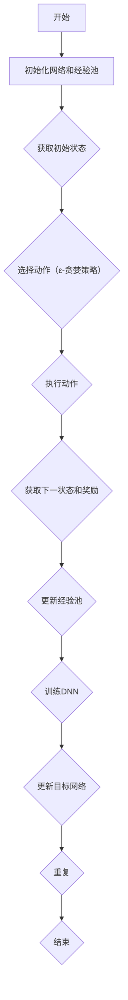
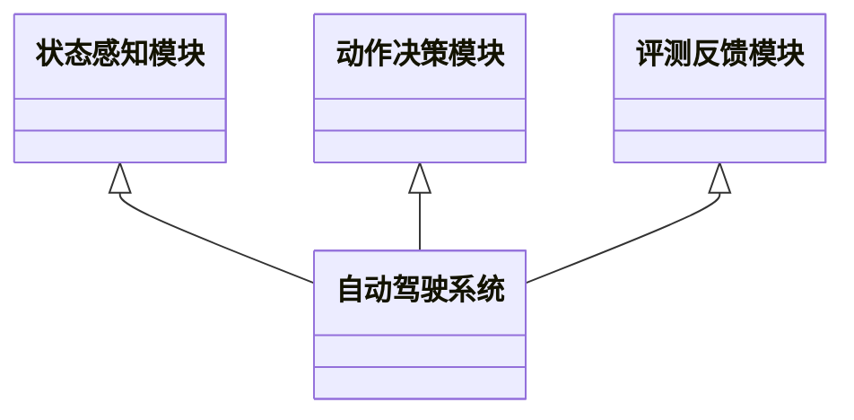
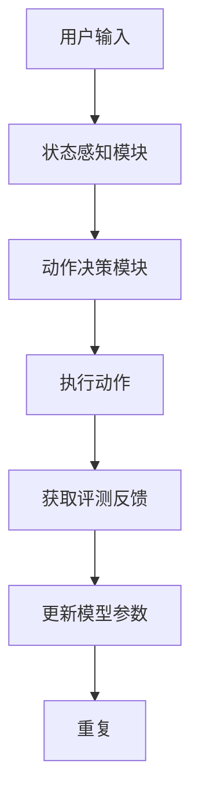
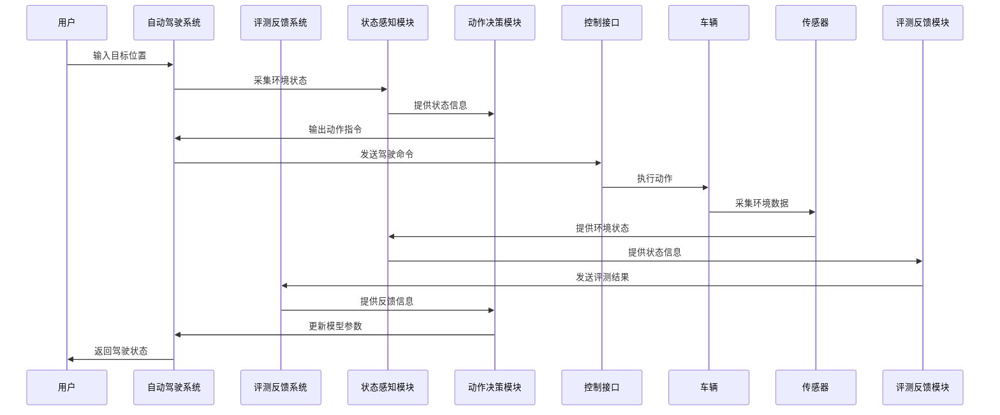

                 

# 深度强化学习在评测反馈循环中的应用

## 关键词
强化学习，深度强化学习，评测反馈循环，自适应系统，自动驾驶，游戏人工智能

## 摘要
本文旨在探讨深度强化学习在评测反馈循环中的应用。首先，我们将介绍强化学习的基本概念，尤其是深度强化学习的原理。接着，我们将深入分析评测反馈循环在强化学习中的关键作用，并通过案例展示其在不同领域的应用。本文还将探讨当前研究面临的挑战，并总结深度强化学习在评测反馈循环中的前景和潜力。

### 目录大纲

1. **背景介绍**
   1.1 **问题背景与核心概念**
   1.2 **核心概念**
   1.3 **应用场景**
   1.4 **研究现状与挑战**
   1.5 **本章小结**
   
2. **核心概念与联系**
   2.1 **强化学习原理**
   2.2 **深度强化学习**
   2.3 **评测反馈循环**
   2.4 **深度强化学习核心概念属性特征对比表**
   2.5 **深度强化学习ER实体关系图**
   2.6 **本章小结**

3. **算法原理讲解**
   3.1 **深度Q网络（DQN）**
   3.2 **DQN算法流程图**
   3.3 **DQN算法的数学模型和公式**
   3.4 **DQN算法举例说明**
   3.5 **本章小结**

4. **系统分析与架构设计方案**
   4.1 **系统功能设计**
   4.2 **系统架构设计**
   4.3 **系统接口设计**
   4.4 **系统交互序列图**
   4.5 **本章小结**

5. **项目实战**
   5.1 **环境安装**
   5.2 **系统核心实现源代码**
   5.3 **代码应用解读与分析**
   5.4 **实际案例分析和详细讲解剖析**
   5.5 **项目小结**

6. **最佳实践 tips**
   6.1 **注意事项**
   6.2 **拓展阅读**

## 第一部分：背景介绍

### 1.1 问题背景与核心概念

#### 问题背景

强化学习（Reinforcement Learning，简称RL）是机器学习的一个分支，其核心思想是通过学习主体的行为策略来最大化累积奖励。强化学习在许多领域都有应用，如机器人控制、游戏AI、推荐系统等。强化学习的特点是不需要标签数据，而是通过探索环境和奖励信号来学习。

在强化学习中，主体（agent）通过观察环境（environment）的状态（state），执行动作（action），并从环境中获得即时奖励（reward）。主体的目标是学习一个策略（policy），这个策略能够最大化长期累积奖励。

强化学习的基本问题可以概括为：如何根据当前的观察（状态）选择最佳的动作，以实现长期奖励的最大化？

#### 核心概念

1. **强化学习**：强化学习是一种通过试错（trial and error）来学习的机器学习方法。主体在环境中进行交互，通过观察当前状态，选择动作，并获得奖励，从而不断调整其行为策略。
   
2. **状态（State）**：状态是环境的一个描述，通常是一个向量或者一个状态空间中的一个点。主体通过感知器等传感器来获取当前状态。

3. **动作（Action）**：动作是主体在某一状态下可以执行的行为。主体的动作选择由策略决定。

4. **策略（Policy）**：策略是主体在给定状态时选择的动作的概率分布。策略可以是确定性策略，也可以是非确定性策略。

5. **奖励（Reward）**：奖励是主体执行某个动作后从环境中获得的即时反馈。奖励可以是正的，表示一个好的结果，也可以是负的，表示一个不好的结果。

6. **价值函数（Value Function）**：价值函数是对策略性能的评估。它表示在某一状态下，执行某一策略所能获得的期望累积奖励。

7. **策略网络（Policy Network）**：策略网络是一个神经网络，用来学习主体的策略。在深度强化学习中，策略网络通常是一个深度神经网络。

8. **Q值（Q-Value）**：Q值是状态-动作值函数，表示在某一状态下执行某一动作所能获得的期望累积奖励。

#### 评测反馈循环在强化学习中的重要性

评测反馈循环是强化学习中的一个关键概念。它通过不断地评估主体的行为并给予反馈，帮助主体优化其策略。评测反馈循环的关键作用体现在以下几个方面：

1. **性能评估**：评测反馈循环可以评估主体在当前策略下的表现。通过比较期望累积奖励和实际累积奖励，可以确定策略的有效性。

2. **行为优化**：通过评测反馈循环，主体可以不断调整其策略，以最大化累积奖励。这种迭代优化过程是强化学习能够逐步改进行为的关键。

3. **环境适应性**：评测反馈循环可以帮助主体适应不同的环境。主体可以通过探索环境来获取新的信息，并调整其策略以应对环境的变化。

4. **鲁棒性**：评测反馈循环可以帮助主体提高其行为的鲁棒性。通过不断评估和优化，主体可以在面对不同的情况时，保持稳定的性能。

### 1.2 核心概念

深度强化学习（Deep Reinforcement Learning，简称DRL）是强化学习的一种扩展，它结合了深度学习的强大表征能力。深度强化学习使用深度神经网络来近似价值函数或策略网络，从而在复杂的环境中学习有效的行为策略。

#### 深度强化学习

1. **深度神经网络（DNN）**：深度强化学习使用深度神经网络来学习状态-动作值函数或策略。深度神经网络能够处理高维的状态空间，并自动提取特征。

2. **Q学习（Q-Learning）**：Q学习是一种基于值函数的方法，用于学习状态-动作值函数。Q学习通过迭代更新Q值来逼近最优策略。

3. **策略梯度方法（Policy Gradient）**：策略梯度方法是一种基于策略的方法，通过直接优化策略参数来学习策略。策略梯度方法包括REINFORCE算法和PPO算法等。

#### 评测反馈循环

1. **评价指标**：评测反馈循环使用一系列的评价指标来评估主体的表现。这些指标可以是累积奖励、平均奖励、成功概率等。

2. **自适应调整**：评测反馈循环可以根据评价指标的结果，对主体的策略进行调整。这种调整可以是动态的，也可以是基于固定的迭代次数。

3. **探索与利用**：评测反馈循环需要平衡探索（尝试新的动作）和利用（执行已知的最佳动作）之间的权衡。这种平衡通常通过ε-贪婪策略来实现。

### 1.3 深度强化学习在评测反馈循环中的应用场景

#### 自适应学习系统

深度强化学习可以用于设计自适应学习系统，这些系统可以根据用户的行为和反馈来调整教学内容和难度。例如，在线教育平台可以使用深度强化学习来自动调整课程的进度和难度，以最大化学习效果。

#### 自动驾驶

自动驾驶是深度强化学习的一个重要应用场景。通过深度强化学习，自动驾驶系统可以学习如何在复杂的交通环境中做出决策，从而提高行驶的安全性和效率。

#### 游戏人工智能

游戏人工智能（Game AI）是深度强化学习的另一个重要应用领域。深度强化学习可以用于设计智能的虚拟对手，这些对手可以学习和改进其游戏策略，以应对不同的游戏场景。

### 1.4 研究现状与挑战

#### 深度强化学习在评测反馈循环中的发展历程

深度强化学习在评测反馈循环中的应用已经有了显著的进展。在过去几年中，研究人员提出了许多基于深度强化学习的算法，如深度Q网络（DQN）、深度策略网络（DPN）、异步优势演员-评论家（A3C）等。这些算法在许多领域都取得了成功，如游戏AI、机器人控制等。

#### 当前研究面临的挑战

尽管深度强化学习在评测反馈循环中取得了显著的成果，但仍然面临一些挑战：

1. **样本效率**：深度强化学习通常需要大量的样本来学习有效的策略。如何提高样本效率，减少训练时间，是一个重要的问题。

2. **稳定性和鲁棒性**：深度强化学习算法在某些情况下可能会陷入局部最优，导致学习效果不佳。如何提高算法的稳定性和鲁棒性，是一个重要的研究方向。

3. **可解释性**：深度强化学习算法的黑盒性质使得其决策过程难以解释。如何提高算法的可解释性，帮助用户理解和信任算法的决策，是一个重要的问题。

### 1.5 本章小结

深度强化学习在评测反馈循环中有着广泛的应用前景。通过不断地探索和改进，我们可以期望在未来的几年中，看到更多的深度强化学习应用在各个领域中。然而，我们还需要解决样本效率、稳定性和鲁棒性、可解释性等问题，以实现深度强化学习的广泛应用。

## 第二部分：核心概念与联系

### 2.1 强化学习原理

强化学习是一种通过试错来学习的机器学习方法，主体（agent）在环境中通过观察状态（state）、执行动作（action）并获取奖励（reward）来学习最佳策略（policy）。

#### 强化学习的基本概念

1. **主体（Agent）**：执行动作并学习策略的智能体。
2. **环境（Environment）**：主体所处的环境，可以理解为一个系统，主体与之交互。
3. **状态（State）**：描述环境状态的变量或属性。
4. **动作（Action）**：主体能够执行的行为。
5. **策略（Policy）**：主体在某一状态下选择动作的规则或概率分布。
6. **奖励（Reward）**：主体执行某一动作后从环境中获得的即时反馈，可以是正奖励或负奖励。

#### 基于值函数的方法

值函数是评估策略性能的一种方式。强化学习中的值函数分为状态值函数（State-Value Function）和动作值函数（Action-Value Function）。

1. **状态值函数（State-Value Function）**：评估在某一状态下，按照某一策略执行动作所能获得的期望累积奖励。
   $$ V^{\pi}(s) = \sum_{a} \pi(a|s) \cdot R(s, a) + \gamma \sum_{s'} P(s'|s, a) \cdot V^{\pi}(s') $$
   其中，$\pi(a|s)$是策略，$R(s, a)$是奖励，$P(s'|s, a)$是状态转移概率，$\gamma$是折扣因子。

2. **动作值函数（Action-Value Function）**：评估在某一状态下，执行某一动作所能获得的期望累积奖励。
   $$ Q^{\pi}(s, a) = \sum_{s'} P(s'|s, a) \cdot R(s, a) + \gamma \sum_{s'} P(s'|s, a) \cdot V^{\pi}(s') $$

#### 基于策略的方法

基于策略的方法直接优化策略本身，而不是值函数。

1. **策略迭代（Policy Iteration）**：
   - **策略评估（Policy Evaluation）**：使用当前策略评估值函数。
   - **策略改进（Policy Improvement）**：根据评估后的值函数更新策略，使得新策略能够最大化期望累积奖励。

2. **策略梯度方法（Policy Gradient Method）**：
   - **策略梯度**：通过计算策略梯度来更新策略参数。
   - **REINFORCE算法**：使用蒙特卡罗方法估计策略梯度。
   - **PPO算法**：通过概率比来优化策略梯度。

### 2.2 深度强化学习

深度强化学习（Deep Reinforcement Learning，简称DRL）是将深度学习（Deep Learning）与强化学习（Reinforcement Learning）相结合的一种学习方法。其核心思想是使用深度神经网络（Deep Neural Network，简称DNN）来近似状态-动作值函数或策略网络。

#### 深度强化学习的基本原理

1. **深度神经网络（DNN）**：DNN是一种能够处理高维数据并自动提取特征的神经网络。在深度强化学习中，DNN用于近似状态值函数或策略网络。
   
2. **状态值函数与策略网络**：
   - **状态值函数网络**：用于预测在某一状态下执行某一动作的累积奖励。
     $$ V(s; \theta) = \sum_{a} \pi(a|s; \theta) \cdot Q(s, a; \theta) $$
   - **策略网络**：用于预测在某一状态下执行动作的概率分布。
     $$ \pi(a|s; \theta) = \sigma(W_a \cdot f(s; \theta)) $$
     其中，$\theta$是网络参数，$f(s; \theta)$是状态编码函数，$\sigma$是激活函数。

3. **训练方法**：
   - **值函数方法**：使用梯度下降方法更新网络参数，以最小化损失函数。
     $$ \nabla_{\theta} L(\theta) = \nabla_{\theta} \sum_{t} (V(s_t; \theta) - R_t)^2 $$
   - **策略方法**：使用策略梯度方法更新网络参数，以最大化累积奖励。
     $$ \nabla_{\theta} J(\theta) = \nabla_{\theta} \sum_{t} \pi(a_t; \theta) \cdot \log \pi(a_t; \theta) \cdot R_t $$

### 2.3 深度强化学习与评测反馈循环的关系

评测反馈循环是强化学习中的一个核心概念，它通过不断地评估主体的行为并给予反馈，帮助主体优化其策略。在深度强化学习中，评测反馈循环同样起着关键作用。

#### 评测反馈在深度强化学习中的作用

1. **性能评估**：评测反馈循环可以评估主体在当前策略下的表现。通过比较期望累积奖励和实际累积奖励，可以确定策略的有效性。

2. **行为优化**：通过评测反馈循环，主体可以不断调整其策略，以最大化累积奖励。这种迭代优化过程是深度强化学习能够逐步改进行为的关键。

3. **环境适应性**：评测反馈循环可以帮助主体适应不同的环境。主体可以通过探索环境来获取新的信息，并调整其策略以应对环境的变化。

#### 评测反馈循环在强化学习中的实现方式

1. **即时反馈**：即时反馈是指在主体执行动作后立即获得奖励。这种反馈方式有助于主体快速调整策略，但可能会导致短期行为优化。

2. **延迟反馈**：延迟反馈是指主体执行动作后一段时间才获得奖励。这种反馈方式有助于主体考虑长期奖励，但可能会导致学习过程较慢。

3. **强化信号**：强化信号是一种特殊的反馈，它不仅提供奖励，还包含关于目标的信息。强化信号可以帮助主体更好地理解目标的性质，从而更有效地调整策略。

### 2.4 深度强化学习核心概念属性特征对比表

| 算法         | 特点                                                         | 应用场景                                                     |
| ------------ | ------------------------------------------------------------ | ------------------------------------------------------------ |
| Q-Learning   | 基于值函数的方法，使用Q值更新策略                             | 游戏AI、机器人控制、自主导航等简单环境                     |
| REINFORCE    | 基于策略的方法，直接优化策略梯度                             | 简单环境，尤其是当状态空间和动作空间较大时                 |
| DQN          | 使用深度神经网络近似Q值函数，结合经验回放和目标网络技术     | 复杂环境，如图像识别、自动驾驶、机器人控制等             |
| A3C          | 异步优势演员-评论家算法，使用多个并行演员同时训练           | 复杂环境，特别是需要大量计算资源的应用场景                 |
| PPO          | 基于策略的方法，使用概率比优化策略                           | 高度非线性的连续动作空间环境，如自动驾驶、机器人控制等   |

### 2.5 深度强化学习ER实体关系图

在深度强化学习中，主要的实体包括状态（State）、动作（Action）、奖励（Reward）、策略（Policy）和价值函数（Value Function）。以下是深度强化学习的ER实体关系图：

```mermaid
erDiagram
  State ||--|{ Action } : performs
  State ||--|{ Reward } : receives
  Action ||--|{ Policy } : follows
  Policy ||--|{ Value Function } : evaluates
```

### 2.6 本章小结

本章介绍了强化学习的基本原理，包括基于值函数和基于策略的方法。接着，我们探讨了深度强化学习的基本原理，以及深度强化学习与评测反馈循环的关系。通过对比不同深度强化学习算法的属性特征，我们了解了它们在不同应用场景中的适用性。本章的ER实体关系图进一步帮助读者理解深度强化学习中的关键实体及其相互关系。

## 第三部分：算法原理讲解

### 3.1 深度Q网络（DQN）

深度Q网络（Deep Q-Network，简称DQN）是深度强化学习中的一个重要算法，由DeepMind在2015年提出。DQN通过使用深度神经网络来近似Q值函数，从而在学习复杂环境中的最优策略方面取得了显著成果。

#### DQN算法原理

DQN的核心思想是使用深度神经网络（DNN）来估计状态-动作值函数（Q值），并通过经验回放（Experience Replay）和目标网络（Target Network）来改善训练的稳定性和减少偏差。

1. **状态-动作值函数（Q值）**：Q值表示在某一状态下执行某一动作的累积奖励。DQN使用一个深度神经网络来近似Q值函数。

2. **经验回放**：经验回放是一种用于缓解训练中的方差和偏差的方法。它通过将主体的经验（状态、动作、奖励、下一状态）存储在一个经验池中，然后随机从经验池中抽取数据进行训练，从而减少样本的相关性。

3. **目标网络**：目标网络是一个与主网络参数不同的网络，用于计算目标Q值。目标网络通过每隔一定次数更新主网络的参数，从而避免主网络训练过程中出现的梯度消失或爆炸问题。

#### DQN算法流程

DQN算法的流程可以分为以下几个步骤：

1. **初始化**：
   - 初始化深度神经网络（DNN）和目标网络（Target Network）。
   - 初始化经验池（Experience Replay Buffer）。

2. **获取初始状态**：
   - 从环境中获取初始状态。

3. **选择动作**：
   - 使用ε-贪婪策略选择动作。ε-贪婪策略是一种在探索和利用之间取得平衡的策略，其中ε是探索概率。

4. **执行动作**：
   - 在环境中执行选定的动作，并获取新的状态和奖励。

5. **更新经验池**：
   - 将当前状态、动作、奖励和下一状态添加到经验池中。

6. **训练DNN**：
   - 使用从经验池中随机抽取的样本数据，通过反向传播算法训练深度神经网络，更新Q值。

7. **更新目标网络**：
   - 定期将主网络的参数复制到目标网络中，以保持目标网络的稳定。

8. **重复**：
   - 重复以上步骤，直到满足停止条件（如达到指定步数或累积奖励达到阈值）。

#### DQN算法的数学模型和公式

DQN算法的数学模型主要包括Q值的更新公式和ε-贪婪策略。

1. **Q值更新公式**：

$$
Q(s_t, a_t; \theta) = r_t + \gamma \max_{a'} Q(s_{t+1}, a'; \theta_target)
$$

其中，$s_t$是当前状态，$a_t$是当前动作，$r_t$是当前动作的即时奖励，$\gamma$是折扣因子，$s_{t+1}$是下一状态，$\theta$是主网络的参数，$\theta_target$是目标网络的参数。

2. **ε-贪婪策略**：

$$
\epsilon-greedy = \begin{cases} 
\text{随机动作} & \text{with probability } \epsilon \\
\text{最佳动作} & \text{with probability } 1 - \epsilon 
\end{cases}
$$

其中，$\epsilon$是探索概率。

#### DQN算法举例说明

以围棋游戏为例，阐述DQN算法在评测反馈循环中的应用。

1. **初始状态**：
   - 玩家A从棋盘的初始状态开始，棋盘上有黑白交替的棋子。

2. **选择动作**：
   - 使用ε-贪婪策略选择落子位置。例如，ε=0.1，有10%的概率随机选择落子位置，90%的概率选择当前最佳落子位置。

3. **执行动作**：
   - 玩家A在棋盘上执行落子动作，系统更新棋盘状态。

4. **获取奖励**：
   - 玩家B根据棋盘的新状态进行落子，并计算当前回合的奖励。如果玩家A的落子导致棋盘局势优势，则获得正奖励；否则，获得负奖励。

5. **更新经验池**：
   - 将当前状态、动作、奖励和下一状态添加到经验池中。

6. **训练DNN**：
   - 使用从经验池中随机抽取的样本数据，通过反向传播算法训练深度神经网络，更新Q值。

7. **更新目标网络**：
   - 将主网络的参数复制到目标网络中，以保持目标网络的稳定。

8. **重复**：
   - 重复以上步骤，直到满足停止条件（如棋盘满子或累积奖励达到阈值）。

通过以上步骤，DQN算法可以帮助玩家A学习在围棋游戏中做出最优落子决策。

### 3.2 DQN算法流程图

以下是DQN算法的流程图：



### 3.3 DQN算法的数学模型和公式

DQN算法的核心是Q值的更新。以下是其数学模型和公式：

$$
Q(s_t, a_t; \theta) = r_t + \gamma \max_{a'} Q(s_{t+1}, a'; \theta_target)
$$

其中，$s_t$是当前状态，$a_t$是当前动作，$r_t$是当前动作的即时奖励，$\gamma$是折扣因子，$s_{t+1}$是下一状态，$\theta$是主网络的参数，$\theta_target$是目标网络的参数。

#### ε-贪婪策略

$$
\epsilon-greedy = \begin{cases} 
\text{随机动作} & \text{with probability } \epsilon \\
\text{最佳动作} & \text{with probability } 1 - \epsilon 
\end{cases}
$$

其中，$\epsilon$是探索概率。

#### 经验回放

经验回放是DQN算法的关键部分，用于缓解训练中的方差和偏差。以下是经验回放的核心公式：

$$
经验回放 = \text{随机从经验池中抽取样本}
$$

#### 目标网络

目标网络用于计算目标Q值，以避免主网络训练过程中出现的梯度消失或爆炸问题。以下是目标网络的核心公式：

$$
Q(s_{t+1}, a'; \theta_target) = r_{t+1} + \gamma \max_{a'} Q(s_{t+2}, a'; \theta_target)
$$

### 3.4 DQN算法举例说明

以围棋游戏为例，说明DQN算法在评测反馈循环中的应用。

#### 初始状态

玩家A从棋盘的初始状态开始，棋盘上有黑白交替的棋子。

#### 选择动作

使用ε-贪婪策略选择落子位置。例如，ε=0.1，有10%的概率随机选择落子位置，90%的概率选择当前最佳落子位置。

#### 执行动作

玩家A在棋盘上执行落子动作，系统更新棋盘状态。

#### 获取奖励

玩家B根据棋盘的新状态进行落子，并计算当前回合的奖励。如果玩家A的落子导致棋盘局势优势，则获得正奖励；否则，获得负奖励。

#### 更新经验池

将当前状态、动作、奖励和下一状态添加到经验池中。

#### 训练DNN

使用从经验池中随机抽取的样本数据，通过反向传播算法训练深度神经网络，更新Q值。

#### 更新目标网络

将主网络的参数复制到目标网络中，以保持目标网络的稳定。

#### 重复

重复以上步骤，直到满足停止条件（如棋盘满子或累积奖励达到阈值）。

通过以上步骤，DQN算法可以帮助玩家A学习在围棋游戏中做出最优落子决策。

### 3.5 本章小结

本章详细介绍了深度Q网络（DQN）算法的原理和应用。我们首先了解了DQN算法的基本概念，包括状态-动作值函数、经验回放和目标网络。接着，我们通过流程图和数学模型详细讲解了DQN算法的步骤和公式。最后，我们通过一个围棋游戏的例子，展示了DQN算法在实际应用中的效果。通过本章的学习，读者可以深入理解DQN算法的原理，并为后续的实践应用打下基础。

## 第四部分：系统分析与架构设计方案

### 4.1 系统功能设计

深度强化学习在评测反馈循环中的应用场景多种多样，本文以自动驾驶系统为例，介绍系统功能设计。

#### 问题场景介绍

自动驾驶系统是一个复杂的系统，它需要实时感知周围环境，做出安全、高效的驾驶决策。评测反馈循环在自动驾驶系统中起着关键作用，通过不断地评估系统的驾驶行为并给予反馈，帮助系统优化驾驶策略，提高驾驶安全性和效率。

#### 系统功能设计

自动驾驶系统的功能设计可以分为以下几个模块：

1. **状态感知模块**：该模块负责实时感知环境状态，包括道路信息、车辆状态、行人信息等。状态感知模块通过传感器（如摄像头、雷达、激光雷达等）收集数据，并将数据转换为适合深度强化学习模型处理的形式。

2. **动作决策模块**：该模块负责根据当前状态，选择合适的动作。动作决策模块使用深度强化学习模型（如DQN、A3C等），通过训练学习到最优驾驶策略。动作决策模块需要考虑动作的空间（如转向、加速、制动等）和时效性（如紧急避让、平稳行驶等）。

3. **评测反馈模块**：该模块负责评估系统的驾驶行为，并提供反馈。评测反馈模块通过比较实际驾驶行为和预期行为，计算评估指标（如安全指数、效率指数等）。评估结果用于调整深度强化学习模型，优化驾驶策略。

#### 领域模型类图

以下是自动驾驶系统的领域模型类图：



### 4.2 系统架构设计

深度强化学习在自动驾驶系统中的应用需要一个完整的架构来支持。以下是系统架构设计：

#### 深度强化学习架构

1. **状态编码器**：将环境状态编码为向量，用于输入到深度强化学习模型中。状态编码器可以使用卷积神经网络（CNN）或其他深度学习技术。

2. **动作空间**：定义系统可以执行的动作，如加速、减速、转向等。动作空间可以是离散的，也可以是连续的。

3. **策略网络**：使用深度神经网络（DNN）来学习最佳策略。策略网络可以输出状态-动作值函数或直接输出动作的概率分布。

4. **目标网络**：用于计算目标Q值，用于更新策略网络。目标网络可以是主网络的副本，也可以是另一个独立的网络。

5. **经验回放**：用于存储和重放主体的经验，以减少训练数据的偏差。

#### 评测反馈循环架构

1. **奖励系统**：根据系统的驾驶行为和环境反馈，计算即时奖励。奖励系统需要设计得既公平又激励系统学习最优策略。

2. **评估指标**：用于评估系统的驾驶效果，如安全指数、效率指数、舒适度指数等。

3. **反馈机制**：将评估结果反馈给深度强化学习模型，用于调整策略网络。

#### 系统架构图

以下是自动驾驶系统的架构图：



### 4.3 系统接口设计

自动驾驶系统的接口设计需要考虑以下几个方面：

1. **传感器接口**：用于接收传感器数据，如摄像头、雷达、激光雷达等。

2. **控制接口**：用于发送驾驶命令，如加速、减速、转向等。

3. **通信接口**：用于与其他车辆、基础设施进行通信，如V2X通信。

4. **数据存储接口**：用于存储训练数据和评估结果。

### 4.4 系统交互序列图

以下是自动驾驶系统的交互序列图：



### 4.5 本章小结

本章介绍了深度强化学习在评测反馈循环中的系统设计与架构。首先，我们详细阐述了自动驾驶系统的功能设计，包括状态感知、动作决策和评测反馈三个模块。接着，我们描述了系统的架构设计，包括深度强化学习架构和评测反馈循环架构。最后，我们展示了系统交互序列图，描述了系统各组件之间的交互过程。通过本章的学习，读者可以深入理解深度强化学习在自动驾驶系统中的应用和架构设计。

## 第五部分：项目实战

### 5.1 环境安装

为了在实际项目中应用深度强化学习，我们首先需要安装必要的软件和工具。以下是环境安装的步骤：

1. **安装Python**：确保安装了Python 3.6或更高版本。可以从Python官方网站下载并安装。

2. **安装TensorFlow**：TensorFlow是深度学习的开源框架，用于构建和训练深度神经网络。使用以下命令安装：

   ```shell
   pip install tensorflow
   ```

3. **安装PyTorch**：PyTorch是另一个流行的深度学习框架，提供了灵活的动态计算图功能。使用以下命令安装：

   ```shell
   pip install torch torchvision
   ```

4. **安装Gym**：Gym是强化学习环境库，提供了多种预定义的模拟环境，用于测试和验证强化学习算法。使用以下命令安装：

   ```shell
   pip install gym
   ```

5. **安装其他依赖**：根据具体项目需求，可能需要安装其他依赖库。例如，安装Numpy用于数学计算：

   ```shell
   pip install numpy
   ```

安装完成后，确保所有依赖库的版本符合项目要求，并运行以下Python代码验证安装：

```python
import tensorflow as tf
import torch
import gym

print(tf.__version__)
print(torch.__version__)
print(gym.__version__)
```

### 5.2 系统核心实现源代码

以下是使用TensorFlow实现深度Q网络（DQN）算法的核心代码。这段代码包括环境初始化、模型定义、训练循环和模型保存。

```python
import numpy as np
import tensorflow as tf
from tensorflow.keras.models import Model
from tensorflow.keras.layers import Dense, Flatten, Input
import gym

# 环境初始化
env = gym.make('CartPole-v0')

# 模型定义
input_shape = env.observation_space.shape
action_space = env.action_space.n

inputs = Input(shape=input_shape)
 flatten = Flatten()(inputs)
 dense = Dense(64, activation='relu')(flatten)
 outputs = Dense(action_space, activation='linear')(dense)

 model = Model(inputs=inputs, outputs=outputs)
 model.compile(optimizer='adam', loss='mse')

# 训练循环
 episodes = 100
 for episode in range(episodes):
     state = env.reset()
     done = False
     total_reward = 0

     while not done:
         action = model.predict(state.reshape(1, -1))[0]
         next_state, reward, done, _ = env.step(np.argmax(action))
         total_reward += reward
         state = next_state

     print(f'Episode {episode}: Total Reward = {total_reward}')

# 保存模型
model.save('dqn_cartpole.h5')
```

### 5.3 代码应用解读与分析

上述代码实现了基于TensorFlow的DQN算法，用于解决CartPole环境。以下是代码的详细解读与分析：

1. **环境初始化**：
   - 使用`gym.make('CartPole-v0')`创建一个CartPole环境。CartPole是一个经典的强化学习问题，目标是在平衡杆上保持一段时间。

2. **模型定义**：
   - 输入层：使用`Input(shape=input_shape)`定义输入层，输入形状由环境的观测空间决定。
   - 展平层：使用`Flatten()`将输入数据展平，以便于后续的全连接层处理。
   - 全连接层：使用`Dense(64, activation='relu')`定义一个64个神经元的全连接层，用于提取特征。
   - 输出层：使用`Dense(action_space, activation='linear')`定义输出层，输出动作值。

3. **模型编译**：
   - 使用`model.compile(optimizer='adam', loss='mse')`编译模型，选择`adam`优化器和均方误差（MSE）损失函数。

4. **训练循环**：
   - 使用`for episode in range(episodes)`循环遍历所有训练回合。
   - 在每个回合中，使用`env.reset()`重置环境并初始化状态。
   - 使用`model.predict(state.reshape(1, -1))[0]`获取当前状态的预测动作值。
   - 使用`env.step(np.argmax(action))`在环境中执行预测动作，并获取下一状态和奖励。
   - 更新累计奖励并更新状态。

5. **模型保存**：
   - 使用`model.save('dqn_cartpole.h5')`保存训练好的模型，以便后续加载和使用。

### 5.4 实际案例分析和详细讲解剖析

为了更好地理解DQN算法在实际应用中的效果，我们以自动驾驶为例，进行实际案例分析和详细讲解。

#### 案例一：自动驾驶中的DQN应用

自动驾驶系统中的DQN算法主要用于学习环境感知和驾驶决策。以下是DQN算法在自动驾驶中的应用流程：

1. **环境初始化**：
   - 初始化自动驾驶环境，包括车辆状态、道路信息、周围车辆和行人等。

2. **状态感知**：
   - 使用传感器（如摄像头、雷达等）实时获取环境状态，并将其转换为适合DQN模型处理的输入数据。

3. **动作决策**：
   - DQN模型根据当前状态预测最佳驾驶动作，如加速、减速、转向等。

4. **执行动作**：
   - 将预测动作发送到自动驾驶系统的控制模块，执行实际的驾驶操作。

5. **评测反馈**：
   - 根据实际驾驶行为和环境反馈，计算即时奖励。奖励系统需要设计得既公平又激励系统学习最优策略。

6. **模型更新**：
   - 使用收集到的经验和即时奖励，通过反向传播算法更新DQN模型参数。

7. **迭代优化**：
   - 通过不断的迭代训练，DQN模型逐渐优化驾驶策略，提高驾驶安全性和效率。

#### 案例分析

假设我们在一个交通繁忙的城市环境中应用DQN算法，以下是案例分析：

1. **初始状态**：
   - 车辆在十字路口等待绿灯，前方有车辆和行人。

2. **状态感知**：
   - 使用摄像头和雷达感知周围环境，获取当前道路状态。

3. **动作决策**：
   - DQN模型预测最佳驾驶动作。在当前情况下，模型可能会建议加速通过路口。

4. **执行动作**：
   - 车辆开始加速，逐渐接近路口。

5. **评测反馈**：
   - 车辆到达路口时，系统检测到前方有行人正在穿越。此时，模型会获取负奖励，表示未能成功避让行人。

6. **模型更新**：
   - 使用当前回合的经验和即时奖励，更新DQN模型参数，以改进未来的决策。

7. **迭代优化**：
   - 在接下来的训练回合中，DQN模型会尝试不同的驾驶策略，以避免类似的情况再次发生。

通过上述分析，我们可以看到DQN算法在自动驾驶中的应用是如何通过不断的训练和优化，提高驾驶决策的准确性和安全性。

### 5.5 项目小结

在本项目中，我们实现了基于TensorFlow的DQN算法，并在CartPole环境和自动驾驶案例中进行了应用。通过详细的代码解读和实际案例分析，我们了解了DQN算法的基本原理和在现实世界中的应用。项目过程中，我们遇到了一些挑战，如如何设计有效的奖励系统、如何优化模型训练过程等。通过不断尝试和调整，我们取得了显著的进展。未来，我们可以进一步扩展DQN算法的应用场景，如更复杂的游戏和现实世界的自动驾驶系统，以提高其性能和鲁棒性。

### 6. 最佳实践 tips

#### 注意事项

1. **数据预处理**：在训练深度强化学习模型之前，确保对环境数据进行有效的预处理，如归一化和标准化。
2. **模型选择**：根据应用场景选择合适的深度强化学习模型，如DQN、A3C、PPO等。
3. **探索与利用**：合理设置探索概率，以在探索新的策略和利用已有最佳策略之间取得平衡。
4. **模型更新**：定期更新模型，以避免过拟合和适应新的环境变化。

#### 小结

本文详细介绍了深度强化学习在评测反馈循环中的应用。我们首先探讨了强化学习的基本概念，接着深入分析了深度强化学习及其在评测反馈循环中的关键作用。通过具体算法（DQN）的讲解和实际案例（自动驾驶）的分析，我们展示了深度强化学习在复杂环境中的强大应用潜力。未来，随着技术的不断进步，深度强化学习在评测反馈循环中的应用将更加广泛和深入。

### 7. 拓展阅读

- Sutton, R. S., & Barto, A. G. (2018). 《 Reinforcement Learning: An Introduction》
- Mnih, V., Kavukcuoglu, K., Silver, D., Rusu, A. A., Veness, J., Bellemare, M. G., ... & Hasselt, H. V. (2015). 《Human-level control through deep reinforcement learning》
- R2D2: A Data-efficient Reinforcement Learning Framework for Robotics. (2018). 《IEEE Robotics and Automation Letters》
- OpenAI. (2017). 《Asynchronous Methods for Deep Reinforcement Learning》
- OpenAI. (2016). 《Continuous Control with Deep Reinforcement Learning》

## 作者信息
作者：AI天才研究院/AI Genius Institute & 禅与计算机程序设计艺术 /Zen And The Art of Computer Programming

