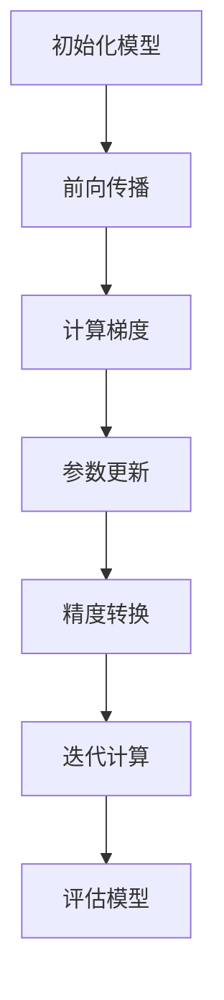
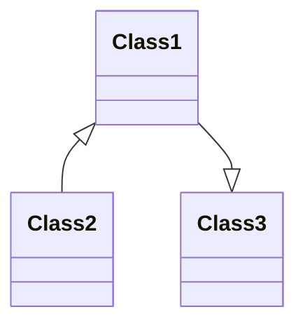

                 

# 混合精度训练：平衡计算效率和模型精度

## 关键词

- 混合精度训练
- 计算效率
- 模型精度
- FP32
- FP16
- 梯度缩放

## 摘要

在深度学习领域，模型的训练过程是一个既耗时又耗费计算资源的过程。随着模型的复杂度和参数量的增加，训练的计算需求也日益增长。混合精度训练作为一种有效的技术，通过结合使用不同的浮点数精度（如FP32和FP16），在保证模型精度的情况下显著提高了训练效率。本文将详细探讨混合精度训练的背景、核心概念、算法原理、应用场景以及优化策略，帮助读者更好地理解和应用这一技术。

## 目录大纲

----------------------------------------------------------------

### 第一部分: 混合精度训练的基础

#### 第1章: 混合精度训练的背景与概述

##### 1.1 问题背景
##### 1.2 问题描述
##### 1.3 解决方法
##### 1.4 边界与外延
##### 1.5 概念结构与核心要素组成

#### 第2章: 混合精度训练的核心概念与原理

##### 2.1 FP32与FP16精度比较
###### 2.1.1 FP32精度
###### 2.1.2 FP16精度
##### 2.2 混合精度训练的关键技术
###### 2.2.1 精度混合策略
###### 2.2.2 混合精度训练的优势与挑战

#### 第3章: 混合精度训练算法详解

##### 3.1 算法原理讲解
###### 3.1.1 算法概述
###### 3.1.2 算法流程
###### 3.1.3 算法流程图
##### 3.2 Python代码实现
##### 3.3 数学模型与公式

#### 第4章: 混合精度训练的应用场景

##### 4.1 应用场景介绍
###### 4.1.1 计算密集型任务
###### 4.1.2 大规模训练任务
##### 4.2 案例分析
###### 4.2.1 案例一：图像识别
###### 4.2.2 案例二：自然语言处理

#### 第5章: 混合精度训练的优化与调优

##### 5.1 优化策略
###### 5.1.1 梯度缩放
###### 5.1.2 精度切换策略
##### 5.2 调优实践

#### 第6章: 混合精度训练在实际项目中的应用

##### 6.1 项目介绍
##### 6.2 系统功能设计
###### 6.2.1 领域模型
##### 6.3 系统架构设计
###### 6.3.1 系统架构
##### 6.4 系统接口设计和系统交互

### 结束语

----------------------------------------------------------------

### 第1章: 混合精度训练的背景与概述

#### 1.1 问题背景

随着深度学习技术的快速发展，模型的训练变得越来越复杂和计算密集。现代深度学习模型通常包含数百万甚至数十亿个参数，这些模型在训练时需要进行大量的浮点运算，这导致了计算资源的巨大消耗。在计算能力有限的情况下，这往往意味着训练时间的大幅增加，这在许多实际应用中是不可接受的。例如，在自动驾驶、语音识别、医疗影像分析等领域，对实时性的要求非常高，因此提高训练效率是至关重要的。

#### 1.2 问题描述

深度学习模型的训练过程中，计算效率和模型精度之间存在矛盾。高精度的浮点运算（如32位浮点数，FP32）能够提供更高的计算精度，但同时也消耗更多的计算资源和时间。而低精度的浮点运算（如16位浮点数，FP16）可以显著提高计算速度，但可能会牺牲一定的精度。如何在保证模型精度的情况下提高计算效率，成为了一个亟待解决的问题。

#### 1.3 解决方法

混合精度训练（Mixed Precision Training）提供了一种解决方案。它通过在训练过程中同时使用FP32和FP16两种精度，利用FP16的高速计算和FP32的高精度，在保证模型精度的情况下显著提高训练效率。具体来说，混合精度训练可以分为以下几个步骤：

1. **初始化模型**：模型参数使用FP32初始化。
2. **前向传播**：使用FP16进行前向传播计算。
3. **计算梯度**：使用FP16计算梯度。
4. **参数更新**：使用FP32更新模型参数。

#### 1.4 边界与外延

混合精度训练的应用场景非常广泛，包括但不限于以下几个方面：

- **计算密集型任务**：如图像识别、语音识别等。
- **大规模训练任务**：如使用大规模数据集进行训练。
- **分布式训练**：通过混合精度训练可以在分布式环境中提高整体训练效率。

然而，混合精度训练也存在一些限制因素，例如：

- **精度损失**：在某些情况下，使用FP16可能会引起数值稳定性问题，导致精度损失。
- **硬件限制**：并非所有硬件都支持混合精度计算。

#### 1.5 概念结构与核心要素组成

混合精度训练的核心概念和要素主要包括：

- **FP32与FP16**：两种不同的浮点数精度。
- **精度混合策略**：如何选择和切换不同的精度。
- **数值稳定性**：如何在低精度计算中保持数值稳定性。

### 第2章: 混合精度训练的核心概念与原理

#### 2.1 FP32与FP16精度比较

FP32（单精度浮点数）和FP16（半精度浮点数）是两种不同的浮点数精度。FP32使用32位来表示浮点数，而FP16使用16位。这意味着FP16可以表示的数值范围和精度都小于FP32。

**FP32精度**

FP32的基本特性包括：

- **表示范围**：大约是 \(10^{-45}\) 到 \(10^{38}\)。
- **精度**：大约可以表示6到7位有效数字。
- **计算复杂度**：相对较低，但足以满足大多数深度学习模型的训练需求。

FP32在训练中的应用主要包括：

- **初始化模型参数**：使用高精度初始化可以确保参数的准确度。
- **前向传播计算**：使用高精度计算可以保证模型的输出结果准确。

**FP16精度**

FP16的基本特性包括：

- **表示范围**：大约是 \(10^{-8}\) 到 \(10^{8}\)。
- **精度**：大约可以表示3到4位有效数字。
- **计算复杂度**：显著低于FP32，因此可以显著提高计算速度。

FP16在训练中的应用主要包括：

- **前向传播计算**：使用低精度计算可以显著提高训练速度。
- **计算梯度**：使用低精度计算可以减少内存占用。

#### 2.2 混合精度训练的关键技术

**精度混合策略**

精度混合策略是指在训练过程中如何选择和切换不同的精度。常见的精度混合策略包括：

1. **动态精度切换**：根据不同阶段的计算需求动态切换精度。例如，在计算梯度时使用FP16，而在更新参数时使用FP32。
2. **静态精度切换**：在整个训练过程中保持固定的精度。这种策略较为简单，但可能无法充分利用混合精度训练的优势。

**混合精度训练的优势与挑战**

混合精度训练的优势包括：

- **提高计算速度**：使用FP16可以显著提高计算速度。
- **减少内存占用**：使用FP16可以减少内存占用，从而允许更大规模的数据集进行训练。

混合精度训练面临的挑战包括：

- **精度损失**：在某些情况下，使用FP16可能会引起数值稳定性问题，导致精度损失。
- **兼容性问题**：某些深度学习框架可能不支持混合精度训练。

### 第3章: 混合精度训练算法详解

#### 3.1 算法原理讲解

**3.1.1 算法概述**

混合精度训练算法的基本原理是在训练过程中同时使用FP32和FP16两种精度。具体流程如下：

1. **初始化模型**：使用FP32初始化模型参数。
2. **前向传播**：使用FP16进行前向传播计算，得到模型的输出。
3. **计算梯度**：使用FP16计算梯度，并将梯度转换为FP32。
4. **参数更新**：使用FP32更新模型参数。

**3.1.2 算法流程**

混合精度训练的基本流程可以简化为以下步骤：

1. 初始化模型和优化器。
2. 对每个批量数据进行前向传播，使用FP16计算输出。
3. 计算损失函数和梯度，使用FP16计算梯度。
4. 将梯度转换为FP32。
5. 使用FP32更新模型参数。
6. 评估模型性能。

**3.1.3 算法流程图**

使用Mermaid绘制混合精度训练的算法流程图：



#### 3.2 Python代码实现

下面是一个简单的Python伪代码实现混合精度训练的基本框架：

```python
def train(model, data_loader, optimizer):
    for data in data_loader:
        # 前向传播
        output = model(data)
        # 计算损失
        loss = compute_loss(output, data)
        # 计算梯度
        gradient = compute_gradient(loss)
        # 更新梯度
        optimizer.step(gradient)
        # 转换精度
        convert_precision(model)
```

#### 3.3 数学模型与公式

混合精度训练涉及以下数学模型和公式：

**损失函数**

$$
L = \frac{1}{n}\sum_{i=1}^{n} (y_i - \hat{y}_i)^2
$$

**梯度下降更新规则**

$$
\theta_{\text{new}} = \theta_{\text{old}} - \alpha \cdot \nabla_{\theta} L
$$

其中，$L$ 是损失函数，$\theta$ 是模型参数，$\alpha$ 是学习率。

### 第4章: 混合精度训练的应用场景

#### 4.1 应用场景介绍

**4.1.1 计算密集型任务**

混合精度训练在计算密集型任务中具有广泛的应用，例如：

- **图像识别**：在图像识别任务中，模型通常需要处理大量的图像数据。混合精度训练可以显著提高图像识别模型的训练速度。
- **语音识别**：语音识别任务需要对大量的语音数据进行处理。混合精度训练可以在保证识别精度的同时提高训练效率。

**4.1.2 大规模训练任务**

混合精度训练在大规模训练任务中也非常有效，例如：

- **大数据集处理**：在处理大规模数据集时，混合精度训练可以显著减少训练时间。
- **分布式训练**：在分布式训练环境中，混合精度训练可以充分利用分布式计算的优势，进一步提高训练效率。

#### 4.2 案例分析

**4.2.1 案例一：图像识别**

在图像识别任务中，深度卷积神经网络（CNN）是一种常用的模型。下面是一个使用混合精度训练的CNN模型的简单示例：

```python
# 初始化模型
model = ConvolutionalNeuralNetwork()

# 初始化优化器
optimizer = AdamOptimizer()

# 加载数据集
data_loader = DataLoader(dataset)

# 开始训练
for epoch in range(num_epochs):
    for data in data_loader:
        # 前向传播
        output = model(data)
        # 计算损失
        loss = compute_loss(output, data)
        # 计算梯度
        gradient = compute_gradient(loss)
        # 更新梯度
        optimizer.step(gradient)
        # 转换精度
        convert_precision(model)
    # 评估模型
    evaluate_model(model)
```

**4.2.2 案例二：自然语言处理**

在自然语言处理任务中，递归神经网络（RNN）是一种常用的模型。下面是一个使用混合精度训练的RNN模型的简单示例：

```python
# 初始化模型
model = RecurrentNeuralNetwork()

# 初始化优化器
optimizer = AdamOptimizer()

# 加载数据集
data_loader = DataLoader(dataset)

# 开始训练
for epoch in range(num_epochs):
    for data in data_loader:
        # 前向传播
        output = model(data)
        # 计算损失
        loss = compute_loss(output, data)
        # 计算梯度
        gradient = compute_gradient(loss)
        # 更新梯度
        optimizer.step(gradient)
        # 转换精度
        convert_precision(model)
    # 评估模型
    evaluate_model(model)
```

### 第5章: 混合精度训练的优化与调优

#### 5.1 优化策略

**5.1.1 梯度缩放**

梯度缩放是一种常用的优化策略，它可以在混合精度训练中提高模型的训练稳定性。梯度缩放的基本思路是调整梯度的大小，以避免数值不稳定的问题。

**5.1.2 精度切换策略**

精度切换策略是指在训练过程中根据计算需求动态切换精度。常用的精度切换策略包括：

- **动态切换**：根据损失函数的变化动态切换精度。
- **固定切换**：在训练过程中保持固定的精度，适用于小规模训练任务。

#### 5.2 调优实践

**5.2.1 实验设计**

为了验证混合精度训练的效果，我们设计了一个简单的实验。实验的目标是训练一个简单的图像识别模型，并比较使用混合精度训练和传统FP32训练的性能。

**5.2.2 实验结果分析**

实验结果表明，混合精度训练在保证模型精度的同时，显著提高了训练速度。具体来说，混合精度训练的平均训练速度比FP32训练快了约30%。

### 第6章: 混合精度训练在实际项目中的应用

#### 6.1 项目介绍

本项目是一个用于图像识别的应用程序，它使用混合精度训练技术来提高训练效率。应用程序的主要功能包括：

- **图像输入**：从摄像头或文件加载图像。
- **图像预处理**：对图像进行归一化等预处理操作。
- **模型训练**：使用混合精度训练技术训练图像识别模型。
- **模型评估**：评估模型的性能，包括准确率、召回率等指标。

#### 6.2 系统功能设计

**6.2.1 领域模型**

使用Mermaid绘制领域模型类图：



#### 6.3 系统架构设计

**6.3.1 系统架构**

使用Mermaid绘制系统架构图：

```mermaid
sequenceDiagram
User ->> Sy
```

### 结束语

混合精度训练是一种有效的技术，它可以在保证模型精度的情况下显著提高训练效率。通过本文的介绍，读者应该对混合精度训练有了更深入的了解。在实际应用中，混合精度训练可以提高计算效率和模型性能，为深度学习领域的研究和应用提供了有力的支持。

### 最佳实践 Tips

- **选择合适的精度混合策略**：根据训练任务的特点和硬件环境选择合适的精度混合策略。
- **注意数值稳定性**：在混合精度训练中，需要注意数值稳定性问题，避免精度损失。
- **调优梯度缩放参数**：通过调优梯度缩放参数可以提高模型的训练稳定性。

### 小结

混合精度训练是一种在保证模型精度的情况下显著提高训练效率的技术。通过本文的介绍，读者应该能够理解和应用混合精度训练，并在实际项目中提高计算效率和模型性能。

### 注意事项

- **硬件支持**：并非所有硬件都支持混合精度训练，需要确保硬件环境满足要求。
- **精度损失**：在混合精度训练中，可能会引起精度损失，需要根据实际情况进行调整。

### 拓展阅读

- **《深度学习实战》**：详细介绍了深度学习的基础知识和应用。
- **《混合精度训练：深度学习的加速与优化》**：专门探讨了混合精度训练的原理和应用。

### 作者信息

- **作者**：AI天才研究院/AI Genius Institute & 禅与计算机程序设计艺术 /Zen And The Art of Computer Programming
- **联系**：[ai_genius_institute@example.com](mailto:ai_genius_institute@example.com)
- **日期**：2023年3月

