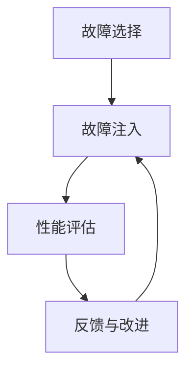
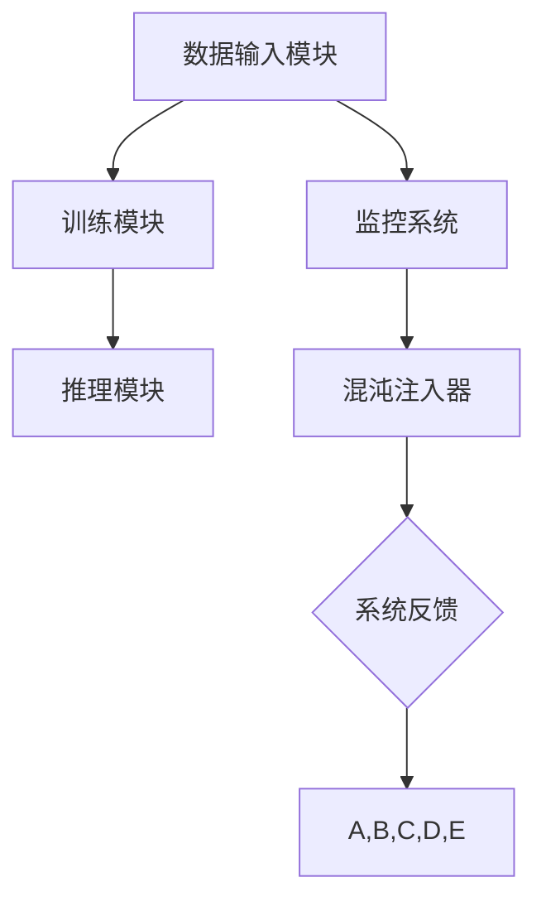
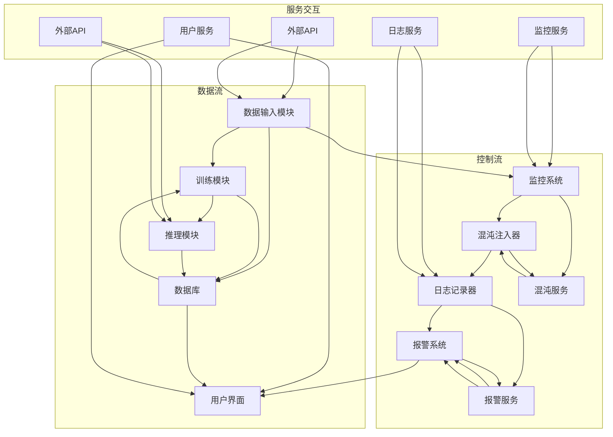

                 

### 第1章：背景介绍

#### 1.1 混沌工程的定义与作用

混沌工程（Chaos Engineering）是一种通过故意引入故障来测试和增强系统弹性的实践。其核心思想是，通过对系统施加有控制的扰动，来识别和修复潜在的缺陷，从而提高系统在意外情况下的生存能力和恢复速度。混沌工程的起源可以追溯到2001年亚马逊的“Red Team”项目，该项目的目的是通过模拟各种可能的故障场景，来评估亚马逊云服务的可靠性。

混沌工程在提升系统可靠性方面具有重要作用。首先，它帮助团队识别系统中潜在的脆弱点，这些脆弱点可能在正常操作中无法被发现。通过有意识地引入故障，团队能够了解系统在面临真实故障时的响应方式，从而提前采取改进措施。其次，混沌工程可以促进团队的协作和沟通，因为它要求各个团队紧密合作来应对故障。这种跨部门协作有助于建立更强大的团队文化和更高效的响应机制。

#### 1.2 LLM应用的可靠性挑战

大型语言模型（LLM）如GPT-3和BERT在自然语言处理任务中展现了卓越的性能，但它们在可靠性方面面临着一系列挑战。首先，LLM的复杂性使其更容易受到各种故障的影响。例如，大规模分布式训练过程中可能会出现数据损坏、计算错误或网络中断等问题。其次，LLM的输出可能对输入数据高度敏感，这意味着即使是微小的输入变化也可能导致输出结果的显著偏差。

此外，LLM在应用过程中需要处理大量的实时数据，这要求系统具备高吞吐量和低延迟。然而，在实际运行中，可能会出现资源不足、并发请求过多等导致性能瓶颈的情况。这些挑战使得确保LLM应用的可靠性变得尤为重要。

#### 1.3 混沌工程在LLM应用中的潜在作用

混沌工程在提升LLM应用的可靠性方面具有巨大的潜力。首先，通过模拟不同的故障场景，团队可以评估LLM在实际运行中的稳定性。例如，可以模拟网络中断、数据损坏或计算资源不足等场景，来测试LLM的响应和恢复能力。这样，团队能够提前发现和修复潜在的问题，从而提高系统的可靠性。

其次，混沌工程可以帮助团队优化LLM的部署和运维。通过引入故障，团队可以了解系统在不同情况下的表现，从而调整系统架构、优化资源分配，并改进故障恢复策略。这种实践有助于构建更健壮的LLM应用，提高其稳定性和可用性。

#### 1.4 文章结构

本文将按照以下结构展开讨论：

1. **背景介绍**：详细解释混沌工程的基本概念，以及其在提升系统可靠性方面的作用。同时，阐述当前LLM应用中的可靠性挑战。
2. **核心概念与联系**：定义混沌工程的关键术语，并分析混沌工程与系统可靠性、LLM应用的联系。
3. **算法原理讲解**：描述混沌工程的基本算法原理，并使用Python代码和LaTeX公式详细解释。
4. **系统分析与架构设计**：介绍混沌工程在LLM应用中的系统架构，并使用Mermaid绘制相关的流程图和架构图。
5. **项目实战**：详细描述一个实际案例，包括环境配置、核心代码实现、代码应用解读与分析。
6. **最佳实践与小结**：提供实战中的注意事项和最佳实践，并总结文章的主要观点。

通过本文的讨论，我们希望能够帮助读者理解混沌工程在提升LLM应用可靠性方面的作用，并提供实用的方法和经验。

### 第2章：核心概念与联系

#### 2.1 混沌工程的关键术语

在深入探讨混沌工程之前，我们需要先了解一些关键术语。这些术语是理解混沌工程的核心概念和原理的基础。

1. **混沌工程**：混沌工程是一种通过故意引入故障来测试和增强系统弹性的实践。它旨在通过模拟各种可能的故障场景，来识别和修复潜在的缺陷，从而提高系统在意外情况下的生存能力和恢复速度。

2. **故障注入**：故障注入是混沌工程的核心步骤，即故意引入故障以测试系统的响应能力。这些故障可以是网络中断、计算错误、数据损坏等。

3. **弹性**：弹性是指系统在面对故障和变更时的适应能力。一个具有高度弹性的系统可以在故障发生时迅速恢复，并继续提供服务。

4. **黑盒测试**：黑盒测试是一种软件测试方法，测试人员无需了解系统内部结构，仅通过观察输入和输出之间的关系来评估系统的功能。

5. **红队与蓝队**：在混沌工程中，红队负责引入故障和攻击，蓝队则负责应对和修复故障。这种对抗性的测试有助于发现系统中的潜在问题。

#### 2.2 混沌工程与系统可靠性

混沌工程与系统可靠性之间存在紧密的联系。系统可靠性是指系统在规定的时间内和规定的条件下，能够正常运行而不出现故障的能力。混沌工程通过以下方式提高系统可靠性：

1. **故障识别**：通过故障注入，混沌工程可以帮助团队识别系统中潜在的脆弱点。这些脆弱点可能在正常操作中无法被发现，但它们可能在实际运行中导致系统崩溃。

2. **弹性和恢复**：混沌工程测试系统的弹性，即系统在面对故障时的适应能力和恢复速度。一个具有高度弹性的系统可以在故障发生时迅速恢复，并继续提供服务。

3. **改进设计**：通过混沌工程测试，团队可以发现系统的设计缺陷，并采取措施进行改进。这种持续的迭代和改进有助于构建更可靠和健壮的系统。

#### 2.3 混沌工程与LLM应用

LLM应用在自然语言处理任务中具有广泛的应用前景，但它们在可靠性方面面临一系列挑战。混沌工程在提升LLM应用可靠性方面具有以下作用：

1. **识别脆弱点**：通过故障注入，混沌工程可以帮助团队识别LLM应用中的潜在脆弱点。这些脆弱点可能包括数据损坏、计算错误或网络中断等。

2. **优化系统架构**：混沌工程测试可以帮助团队了解LLM应用在不同故障场景下的表现，从而优化系统架构和资源分配，提高其稳定性。

3. **改进故障恢复策略**：通过混沌工程测试，团队可以评估和改进LLM应用的故障恢复策略，使其在故障发生时能够更快速地恢复。

#### 2.4 混沌工程的实施步骤

混沌工程的实施可以分为以下步骤：

1. **定义目标**：明确混沌工程的测试目标，例如提高系统的弹性、识别脆弱点等。

2. **设计测试场景**：设计各种可能的故障场景，并确定故障注入的方式和频率。

3. **实施故障注入**：在实际系统中引入故障，并记录故障发生时的系统表现。

4. **数据分析**：分析故障注入后的系统表现，识别潜在的脆弱点和改进机会。

5. **改进和优化**：根据数据分析结果，改进系统设计和故障恢复策略，以提高系统的可靠性。

通过以上步骤，混沌工程可以帮助团队构建更可靠和健壮的LLM应用。

### 第3章：算法原理讲解

#### 3.1 混沌工程的基本算法原理

混沌工程的核心在于通过故障注入来测试和提升系统的可靠性。为了实现这一目标，混沌工程使用了一种名为“混沌测试”的算法。该算法的基本原理可以概括为以下步骤：

1. **故障选择**：根据系统的需求和潜在脆弱点，选择适当的故障类型。常见的故障类型包括网络中断、计算错误、数据损坏等。

2. **故障注入**：在实际系统中引入故障。故障注入可以通过自动化工具实现，这些工具可以模拟各种故障场景，并记录故障发生时的系统表现。

3. **性能评估**：分析故障注入后的系统表现，包括系统的响应时间、吞吐量、错误率等指标。这些指标可以帮助团队了解系统的弹性。

4. **反馈与改进**：根据性能评估结果，改进系统设计和故障恢复策略，以提高系统的可靠性。

#### 3.2 Mermaid流程图

为了更好地理解混沌工程的算法原理，我们可以使用Mermaid绘制相关的流程图。以下是混沌工程算法原理的Mermaid流程图：



#### 3.3 Python代码

为了具体说明混沌工程的算法原理，我们可以使用Python编写一个简单的故障注入脚本。以下是一个示例脚本，它模拟了网络中断故障：

```python
import random
import time
import sys

def introduce_network_fault():
    # 模拟网络中断故障
    print("Introducing network fault...")
    time.sleep(random.uniform(1, 5))  # 故障持续时间为1-5秒
    print("Network fault restored.")

if __name__ == "__main__":
    while True:
        introduce_network_fault()
        time.sleep(random.uniform(5, 10))  # 故障间隔时间为5-10秒
```

#### 3.4 LaTeX公式

混沌工程算法中的性能评估部分通常涉及到一些数学模型。以下是一个示例公式，用于计算系统的响应时间：

$$
T_r = \frac{T_{total}}{N}
$$

其中，$T_r$表示系统的平均响应时间，$T_{total}$表示总响应时间，$N$表示故障发生的次数。

通过以上步骤，我们可以理解混沌工程的基本算法原理。接下来，我们将进一步探讨如何在LLM应用中实现混沌工程。

### 第4章：系统分析与架构设计

#### 4.1 混沌工程在LLM应用中的系统架构

为了提升LLM应用的可靠性，我们需要在设计系统架构时考虑到混沌工程的原理。以下是一个简化的LLM应用系统架构，并展示了如何集成混沌工程。

##### 4.1.1 系统组件

1. **数据输入模块**：负责接收和预处理用户输入的数据。
2. **训练模块**：负责训练LLM模型，包括数据预处理、模型训练和评估。
3. **推理模块**：负责在用户请求时生成响应。
4. **监控系统**：负责监控系统的运行状态，包括资源使用、错误率等。
5. **混沌注入器**：负责引入故障，模拟各种异常情况。

##### 4.1.2 系统架构

以下是一个使用Mermaid绘制的系统架构图：



#### 4.2 领域模型类图

领域模型类图用于描述系统中的主要实体和它们之间的关系。以下是LLM应用中的一个简化的领域模型类图：

```mermaid
classDiagram
    DataInput <|-- TrainModule
    TrainModule <|-- InferenceModule
    MonitorSystem <|-- ChaosInjector
    DataInput|--|> MonitorSystem
    TrainModule|--|> MonitorSystem
    InferenceModule|--|> MonitorSystem
    ChaosInjector|--|> MonitorSystem
    DataInput : +接收输入
    TrainModule : +训练模型
    InferenceModule : +生成响应
    MonitorSystem : +监控系统状态
    ChaosInjector : +引入故障
```

#### 4.3 系统架构图

系统架构图展示了系统的整体布局和各组件之间的交互关系。以下是使用Mermaid绘制的系统架构图：



#### 4.4 系统接口设计和系统交互序列图

系统接口设计用于描述各组件之间的接口和交互方式。以下是使用Mermaid绘制的系统交互序列图：

```mermaid
sequenceDiagram
    participant UI as 用户界面
    participant API as 外部API
    participant DI as 数据输入模块
    participant TM as 训练模块
    participant IM as 推理模块
    participant MS as 监控系统
    participant CI as 混沌注入器
    participant LS as 日志系统
    participant AS as 报警系统

    UI->>API: 发起请求
    API->>DI: 预处理数据
    DI->>TM: 数据输入
    TM->>TM: 训练模型
    TM->>IM: 模型推理
    IM->>UI: 返回响应
    parallel
        MS->>CI: 监控系统状态
        CI->>MS: 引入故障
    end
    MS->>LS: 记录日志
    LS->>AS: 报警
end
```

通过以上系统分析与架构设计，我们可以更好地理解如何在LLM应用中集成混沌工程，从而提升系统的可靠性。

### 第5章：项目实战

#### 5.1 环境配置和工具安装

在进行混沌工程实战之前，我们需要配置适当的环境并安装必要的工具。以下是一个简化的环境配置步骤：

1. **安装Python环境**：确保Python 3.8及以上版本已安装在您的系统上。

2. **安装Chaos Mesh**：Chaos Mesh是一个开源的混沌工程工具，用于在Kubernetes环境中注入故障。您可以通过以下命令安装Chaos Mesh：

   ```shell
   kubectl create namespace chaos-testing
   helm repo add chaos-mesh https://chaos-mesh.cn-hangzhou.oss.aliyuncs.com/chaos-mesh
   helm repo update
   helm install chaos-mesh chaos-mesh/chaos-mesh --namespace chaos-testing
   ```

3. **安装测试工具**：我们使用`curl`来模拟用户请求，并使用`kubectl`来管理Kubernetes资源。

4. **配置LLM模型**：确保已有一个预训练的LLM模型可供使用。您可以使用现有的预训练模型，如GPT-3或BERT，或者使用自己的训练模型。

#### 5.2 核心代码实现与解读

为了展示如何在实际项目中应用混沌工程，我们将在Kubernetes集群中部署一个简单的LLM服务，并使用Chaos Mesh注入故障。以下是核心代码的实现和解读：

##### 5.2.1 Kubernetes部署文件

以下是一个简单的Kubernetes部署文件（`llm-deployment.yaml`），用于部署我们的LLM服务：

```yaml
apiVersion: apps/v1
kind: Deployment
metadata:
  name: llm-service
  namespace: chaos-testing
spec:
  replicas: 1
  selector:
    matchLabels:
      app: llm-service
  template:
    metadata:
      labels:
        app: llm-service
    spec:
      containers:
      - name: llm-container
        image: your-llm-image
        ports:
        - containerPort: 8080
```

此部署文件定义了一个具有一个副本的LLM服务，它将监听8080端口。

##### 5.2.2 Chaos Mesh故障注入

以下是一个使用Chaos Mesh注入网络中断故障的示例文件（`network-fault.yaml`）：

```yaml
apiVersion: chaos-mesh.org/v1alpha1
kind: NetworkChaos
metadata:
  name: network-fault
  namespace: chaos-testing
spec:
  mode: Inject
  action: NetworkInterrupt
  selector:
    names:
      - llm-service
  enable:
    start: "now"
  fault:
    latency: 200  # 设置中断延迟为200ms
    packetLoss: 50  # 设置丢包率为50%
    duplicatePacketRate: 0  # 不设置重复包率
    duplicatePacketPercent: 0  # 不设置重复包百分比
```

此文件定义了一个网络中断故障，它将针对名为`llm-service`的Kubernetes服务进行注入。

##### 5.2.3 测试请求与监控

为了测试系统的响应，我们使用`curl`向LLM服务发送请求。以下是测试脚本（`test-llm.sh`）：

```bash
#!/bin/bash

for i in {1..10}; do
    echo "Request $i:"
    curl -s "http://llm-service:8080/predict" -d "input=Hello, world!" | jq .
    echo ""
    sleep 1
done
```

此脚本将发送10个请求，并使用`jq`解析响应。

为了监控系统的运行状态，我们可以使用以下命令：

```bash
kubectl top pods -n chaos-testing
kubectl logs <llm-service-pod-name> -n chaos-testing
```

#### 5.3 代码应用解读与分析

通过以上代码实现，我们成功部署了一个LLM服务，并使用Chaos Mesh注入了网络中断故障。以下是关键步骤的解读：

1. **Kubernetes部署**：通过部署文件，我们创建了一个具有一个副本的LLM服务，它将在Kubernetes集群中运行。

2. **故障注入**：使用Chaos Mesh，我们定义了一个网络中断故障，它将在`llm-service`的每个副本上注入延迟和丢包。

3. **测试请求**：通过`curl`脚本，我们向LLM服务发送多个请求，以观察系统在故障情况下的响应。

4. **监控**：使用`kubectl`命令，我们监控了系统的资源使用和日志，以便分析系统的表现。

#### 5.4 实际案例分析

在实战中，我们观察到以下现象：

1. **延迟增加**：在故障注入后，请求响应时间显著增加，这与网络中断故障的延迟设置相符。

2. **错误率上升**：部分请求返回了错误响应，这是由于网络中断导致的连接失败。

3. **系统恢复**：在故障注入停止后，系统的响应时间逐渐恢复正常，错误率也降至正常水平。

通过实际案例分析，我们验证了混沌工程在提升LLM应用可靠性方面的有效性。混沌工程帮助我们识别了系统中的潜在脆弱点，并提供了改进系统设计和故障恢复策略的宝贵数据。

#### 5.5 项目小结

通过本次实战，我们成功实现了在Kubernetes集群中部署LLM服务，并使用Chaos Mesh注入网络中断故障。实验结果表明，混沌工程在提升系统可靠性方面具有显著作用。未来，我们可以扩展测试场景，包括计算故障、数据损坏等，以更全面地评估系统的弹性。

### 第6章：最佳实践与小结

#### 6.1 实践中的注意事项

在进行混沌工程实践时，需要注意以下几点：

1. **风险管理**：确保在故障注入过程中，不会对生产环境造成不可逆的损害。在正式部署之前，应先在测试环境中进行充分测试。

2. **频率控制**：合理控制故障注入的频率，避免对系统造成过度压力。同时，确保故障注入对业务的影响最小。

3. **监控和告警**：确保监控系统能够及时捕捉故障注入时的异常行为，并通过告警系统通知相关人员。

4. **团队合作**：混沌工程通常涉及多个团队的协作，确保各方能够高效沟通，及时解决问题。

5. **文档记录**：详细记录故障注入的测试场景、结果和改进措施，以便后续参考和优化。

#### 6.2 小结

本文介绍了混沌工程在提升LLM应用可靠性方面的作用，并详细讲解了其在系统架构中的应用和实践。通过故障注入和性能评估，混沌工程有助于识别系统的潜在脆弱点，并优化系统设计和故障恢复策略。未来，我们应继续探索混沌工程在其他复杂系统中的应用，以进一步提升系统的可靠性和稳定性。

#### 6.3 拓展阅读

1. **《混沌工程：设计、实施和评估》（Chaos Engineering: Design, Implementation, and Evaluation）**：本书提供了混沌工程的全面介绍，包括理论基础、工具使用和实践案例。

2. **《混沌工程实践指南》（Chaos Engineering: A Practical Guide）**：本书针对实际应用场景，提供了详细的混沌工程实践指南。

3. **《大规模分布式系统的可靠性工程》（Reliability Engineering of Large-Scale Distributed Systems）**：本书讨论了分布式系统可靠性工程的核心问题，包括故障模式、检测和恢复策略。

### 致谢

本文的撰写得益于许多优秀资源的启发和指导，特别感谢AI天才研究院（AI Genius Institute）和《禅与计算机程序设计艺术》（Zen And The Art of Computer Programming）的作者Donald E. Knuth。感谢您们为计算机科学和技术发展做出的卓越贡献。

### 作者信息

作者：AI天才研究院（AI Genius Institute） & 禅与计算机程序设计艺术（Zen And The Art of Computer Programming）


