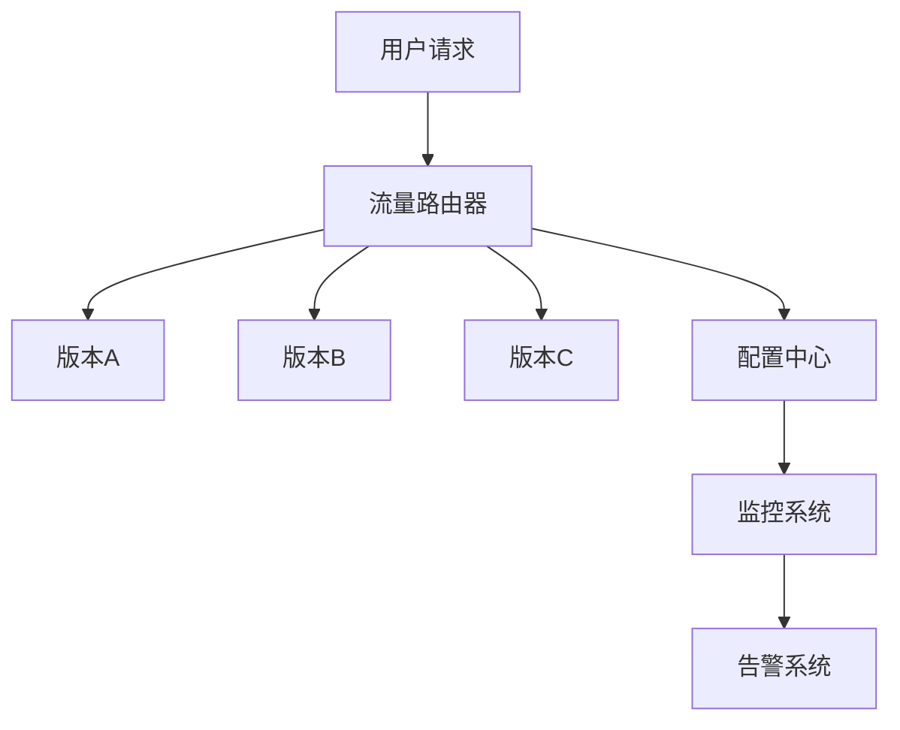

                 

### 第一部分：灰度发布与A/B测试概述

在软件开发的迭代过程中，如何确保新功能的稳定性和用户体验成为了一项重要的任务。灰度发布与A/B测试作为两种常见的策略，旨在通过逐步、有控制的方式引入新功能或版本，以最小化对用户的影响，同时评估其效果。本部分将详细介绍灰度发布与A/B测试的基本概念、技术实现、应用流程和实际案例，为后续内容打下坚实基础。

## 第1章：灰度发布与A/B测试的概念与背景

### 1.1.1 灰度发布的基本概念

**定义**：灰度发布，也称为灰度上线或灰度投放，是一种渐进式发布新功能或新版本的方法。它通过在部分用户群体中首先推出新功能，然后逐步扩大范围，最终实现全面上线。这种方法旨在确保系统能够在发布新功能时保持高可用性和稳定性。

**起源与背景**：灰度发布最早起源于互联网公司，随着互联网的快速发展，如何在保证系统稳定性的同时，快速迭代产品成为了一项重要课题。灰度发布作为一种可控的发布策略，逐渐被广泛应用。它能够帮助团队在发布新功能时，及时发现和解决潜在问题，从而提高发布成功率。

### 1.1.2 A/B测试的基本概念

**定义**：A/B测试，也称为拆分测试，是一种通过将用户随机分配到两个或多个实验组，来比较不同版本性能的测试方法。它的核心目的是通过实验数据，找出哪个版本能够更好地满足用户需求或提高业务指标。

**起源与背景**：A/B测试起源于市场营销领域，最初用于评估不同营销策略的效果。随着互联网的发展，A/B测试逐渐被应用于软件开发过程中，用于评估新功能或版本的优劣。通过A/B测试，团队能够更科学地决策，减少盲目试错的成本。

### 1.1.3 灰度发布与A/B测试的联系与区别

**联系**：灰度发布和A/B测试都是为了在发布新功能或版本时，降低对用户的影响。它们都强调逐步推进，通过控制变量来评估新功能或版本的效果。

**区别**：灰度发布侧重于逐步上线新功能或版本，以确保系统的稳定性。而A/B测试则侧重于不同版本之间的性能比较，通过数据来决策哪个版本更优。

## 第2章：灰度发布的技术实现

### 2.1.1 灰度发布的基本原理

**流量分发机制**：灰度发布的核心在于流量分发机制。通过特定的算法或规则，将用户请求分配到不同的版本或服务实例上。常见的流量分发机制包括随机分配、权重分配、基于用户的分配等。

**版本控制策略**：版本控制策略是灰度发布的重要组成部分。它包括如何根据实际情况动态调整流量分配策略，以确保系统的稳定性。例如，当某个版本出现问题时，可以迅速将其下线，并将流量切换到其他稳定版本。

### 2.1.2 灰度发布的技术架构

**流量路由器**：流量路由器是实现请求流量分发的重要组件。它负责将用户请求根据灰度发布策略，路由到不同的服务实例或版本上。

**配置中心**：配置中心用于存储和管理灰度发布的配置信息。例如，哪些版本需要灰度发布，灰度比例是多少等。

**监控与告警系统**：监控与告警系统用于实时监控系统的运行状态，及时发现并处理问题。例如，当某个版本出现故障时，可以自动触发告警，并将流量切换到其他版本。

### 2.1.3 灰度发布在实际项目中的应用案例

**案例分析**：以某电商平台为例，详细介绍其灰度发布过程及效果。该电商平台在一次大促期间，引入了新的购物流程，通过灰度发布，首先将新流程在部分用户中进行测试，然后逐步扩大范围。经过一段时间的数据收集和分析，最终确认新流程的有效性，并全面上线。

## 第3章：A/B测试的设计与实施

### 3.1.1 A/B测试的设计原则

**目标明确**：在进行A/B测试之前，首先要明确测试的目标和预期效果。例如，是提高用户留存率、增加销售额，还是优化页面加载速度。

**样本代表性**：确保测试样本能够代表整体用户群体。这需要考虑用户的行为特征、使用习惯等因素。

### 3.1.2 A/B测试的流程与方法

**流程**：A/B测试的流程一般包括以下步骤：
1. 确定测试目标。
2. 设计测试方案。
3. 实施测试。
4. 分析结果。
5. 总结经验。

**方法**：A/B测试的方法主要包括随机分配、比例分配、动态调整等。随机分配是将用户随机分配到两个或多个实验组；比例分配是根据一定的比例将用户分配到不同的实验组；动态调整是根据测试过程中的数据，实时调整用户分配策略。

### 3.1.3 A/B测试在实际项目中的应用案例

**案例分析**：以某互联网公司的一次功能优化为例，展示A/B测试的设计与实施过程。该公司在一次版本更新中，引入了新的用户反馈机制。通过A/B测试，将用户随机分配到两组，一组使用新机制，另一组使用旧机制。经过一段时间的测试，发现新机制的用户满意度更高，因此决定全面上线。

## 第4章：灰度发布与A/B测试在LLM应用迭代中的实际应用

### 4.1.1 LLM应用的背景与挑战

**背景**：随着深度学习技术的发展，大型语言模型（LLM）在自然语言处理领域取得了显著进展。LLM具有强大的文本生成、翻译、摘要等功能，被广泛应用于搜索引擎、智能客服、内容生成等领域。

**挑战**：在LLM应用迭代过程中，如何确保新版本在提高性能的同时，不降低用户体验和系统稳定性，是一大挑战。

### 4.1.2 灰度发布与A/B测试在LLM应用迭代中的应用策略

**策略**：在LLM应用迭代过程中，可以结合灰度发布和A/B测试，采取以下策略：
1. **灰度发布**：在部分用户中首先推出新版本，观察其性能和用户反馈。
2. **A/B测试**：将用户随机分配到不同版本，比较其性能和用户体验。
3. **动态调整**：根据测试结果，动态调整版本推广策略。

### 4.1.3 案例分析：某公司LLM应用的迭代实践

**案例分析**：以某互联网公司的一次LLM应用迭代为例，展示灰度发布与A/B测试的应用。该公司在推出新版本时，首先在部分用户中进行灰度发布，收集用户反馈。然后，通过A/B测试，比较新旧版本的性能和用户体验。最终，根据测试结果，决定全面上线新版本。

## 第5章：灰度发布与A/B测试的优化与实践

### 5.1.1 优化策略

**流量分配优化**：根据业务需求和实际情况，调整流量分配策略。例如，对于核心功能，可以采用更严格的流量分配策略，以确保稳定性。

**测试精度优化**：通过优化测试方案和数据分析方法，提高A/B测试的准确性，减少误差。

### 5.1.2 实践技巧

**常见问题**：灰度发布与A/B测试中常见的问题包括流量分配不均、测试数据偏差等。针对这些问题，可以采取以下解决方案：
- **流量分配不均**：通过动态调整流量分配策略，确保各个版本的流量分配相对均衡。
- **测试数据偏差**：通过增加样本量、优化数据收集方法，减少测试数据的偏差。

**最佳实践**：分享业内最佳实践，包括如何设计测试方案、如何分析测试结果等。通过借鉴最佳实践，可以提升灰度发布与A/B测试的实战能力。

## 第6章：灰度发布与A/B测试的未来发展趋势

### 6.1.1 行业发展现状

**现状**：目前，灰度发布与A/B测试在互联网行业已经得到了广泛应用。随着技术的不断进步，这些方法也在不断完善和优化。

**趋势**：未来，灰度发布与A/B测试将继续向更精细化、智能化方向发展。例如，通过机器学习等技术，实现更加智能的流量分配和测试数据分析。

### 6.1.2 技术创新与应用场景拓展

**技术创新**：随着技术的发展，新的灰度发布与A/B测试技术将不断涌现。例如，基于边缘计算的灰度发布，可以实现更快速、更可靠的版本上线。

**应用场景**：灰度发布与A/B测试的应用场景将进一步拓展，不仅限于互联网行业，还将应用于更多领域。例如，金融行业的风险控制、医疗行业的精准治疗等。

## 第7章：总结与展望

### 7.1.1 主要内容回顾

**核心知识点**：回顾本书的主要知识点和重要概念，包括灰度发布与A/B测试的基本概念、技术实现、应用流程和实际案例。

### 7.1.2 展望未来

**未来发展方向**：展望灰度发布与A/B测试在未来的发展前景，包括技术革新、应用场景拓展等方面。

### 7.1.3 建议与拓展

**学习建议**：为读者提供学习建议和拓展方向，包括如何在实际项目中运用灰度发布与A/B测试，以及如何不断学习和更新知识。

---

通过本部分的介绍，读者应该对灰度发布与A/B测试有了初步的了解。在接下来的部分，我们将深入探讨灰度发布与A/B测试的技术实现、设计原则、应用策略和实战技巧。希望这些内容能够帮助读者更好地理解和应用这些方法，提高软件开发的效率和质量。

### 第1章：灰度发布与A/B测试的概念与背景

#### 1.1.1 灰度发布的基本概念

灰度发布（Gray Release），又称灰度上线，是一种逐步向用户推出新功能或版本的方法。这种方法通过在部分用户群体中首先发布新功能，然后逐步扩大推广范围，最终实现全面上线。灰度发布的主要目的是在确保系统稳定性和用户体验的同时，减少对新功能上线可能带来的不确定性和潜在风险的暴露。

**定义**：灰度发布是一种通过在系统中引入部分用户，逐步扩大新功能覆盖范围，以便在确保系统稳定性和用户体验的同时，评估新功能性能和用户反应的方法。

灰度发布的关键点在于“逐步”和“可控”。通过控制发布范围和速度，团队能够更好地监控新功能的运行情况，及时发现问题并进行调整，从而减少对整体用户的影响。

**起源与背景**：灰度发布最初源于互联网公司对快速迭代和稳定发布的需要。随着互联网服务的复杂度和用户对服务质量的要求不断提高，传统的全量发布方式已经难以满足需求。灰度发布作为一种更加灵活和安全的发布策略，逐渐被广泛采用。

在互联网行业，灰度发布的典型应用场景包括：

1. **新功能发布**：在正式上线前，通过灰度发布在新用户中测试新功能，收集反馈数据，以便进行后续优化。
2. **版本升级**：在升级系统或应用版本时，通过灰度发布逐步扩大用户范围，确保系统稳定运行。
3. **性能优化**：在优化系统性能时，通过灰度发布在不同用户群体中测试优化效果，确保整体性能提升。

**优势**：
- **风险控制**：通过逐步发布，可以将新功能的风险控制在较小范围内，减少对整体系统的冲击。
- **性能优化**：通过监控用户反馈和数据，可以及时发现和解决潜在问题，优化系统性能。
- **用户体验**：逐步发布可以减少用户对系统变更的感知，提高用户体验。

**挑战**：
- **部署成本**：灰度发布需要部署额外的监控和流量管理组件，增加了部署和维护成本。
- **复杂度提升**：灰度发布增加了系统的复杂度，需要团队有更高的运维和测试能力。

#### 1.1.2 A/B测试的基本概念

A/B测试（A/B Testing），又称拆分测试，是一种通过将用户随机分配到两个或多个实验组，来比较不同版本性能的方法。这种方法通常用于评估新功能、设计变更或营销策略的有效性。

**定义**：A/B测试是一种通过将用户随机分配到两个或多个版本（A组和B组），然后比较这些版本在特定指标上的差异，以确定哪个版本更有效的测试方法。

A/B测试的关键在于“随机分配”和“数据驱动”。通过随机分配，可以确保实验组之间的差异仅来自于版本本身，从而更准确地评估其效果。

**起源与背景**：A/B测试起源于市场营销领域，最初用于比较不同广告或促销策略的效果。随着互联网的发展，A/B测试逐渐被应用于软件开发过程中，用于评估新功能或设计的用户体验和业务效果。

在软件开发中，A/B测试的典型应用场景包括：

1. **界面设计**：通过A/B测试，比较不同界面设计在用户行为和满意度上的差异，以确定最佳设计。
2. **功能优化**：通过A/B测试，比较不同功能或功能变体在用户使用和业务指标上的效果，以确定最佳方案。
3. **营销策略**：通过A/B测试，比较不同营销策略在转化率和用户参与度上的差异，以优化营销活动。

**优势**：
- **数据驱动**：通过实际数据，更客观地评估不同版本的效果，避免主观判断。
- **快速迭代**：通过快速测试和反馈，团队能够更快地优化产品，提高迭代效率。
- **风险控制**：通过控制实验范围，将测试风险降至最低。

**挑战**：
- **样本代表性**：确保测试样本能够代表整体用户群体，避免测试结果偏差。
- **数据解读**：正确解读测试数据，避免因数据误差或噪声导致错误决策。

#### 1.1.3 灰度发布与A/B测试的联系与区别

**联系**：灰度发布和A/B测试都是软件开发中用于评估新功能或版本的有效方法。它们都强调逐步推进和可控性，以降低对用户的影响和风险。

- **逐步推进**：两者都通过逐步扩大用户范围，逐步引入新功能或版本，以监控和评估其效果。
- **可控性**：两者都通过控制变量，确保测试过程的可控性和结果的准确性。

**区别**：尽管灰度发布和A/B测试在某些方面有相似之处，但它们在具体实现和应用上存在差异。

- **目标不同**：灰度发布的目标是逐步上线新功能或版本，确保系统稳定性和用户体验。A/B测试的目标是评估不同版本的性能和用户反应，确定最佳方案。
- **实施方法不同**：灰度发布通常涉及流量分配和版本控制，而A/B测试则侧重于用户分配和数据比较。
- **应用场景不同**：灰度发布适用于需要逐步上线的场景，而A/B测试适用于需要比较不同版本性能的场景。

在实际应用中，灰度发布和A/B测试可以结合使用。例如，在推出新功能时，首先通过灰度发布在部分用户中测试，然后通过A/B测试比较不同版本的性能和用户反馈，最终决定全面上线。

综上所述，灰度发布和A/B测试都是软件开发中重要的发布和测试策略。通过合理应用这些方法，团队能够更高效地迭代产品，提高用户满意度和业务效果。在接下来的章节中，我们将深入探讨灰度发布和A/B测试的技术实现、设计原则和应用案例，以帮助读者更好地理解和应用这些方法。

### 2.1.1 灰度发布的基本原理

灰度发布（Gray Release）是一种通过逐步向用户推出新功能或版本的方法，旨在确保系统的稳定性和用户体验。其核心在于流量分发机制和版本控制策略，具体原理如下：

**流量分发机制**

灰度发布的流量分发机制是通过特定的算法或规则，将用户请求分配到不同的版本或服务实例上。这样做的目的是让部分用户先体验新功能，同时保持旧功能对其他用户的正常服务，从而降低新功能上线对整体系统的影响。

**流量分发算法**

常见的流量分发算法包括以下几种：

1. **随机分配**：将用户请求随机分配到不同的版本或服务实例。这种方法简单易行，但可能无法保证每个版本的流量均衡。
2. **权重分配**：根据每个版本的稳定性和重要性，为不同版本分配不同的流量权重。权重较高的版本会获得更多的流量，从而更好地测试其稳定性。
3. **轮询分配**：按照固定顺序或轮询方式将用户请求分配到各个版本或服务实例。这种方法能够确保每个版本都能得到一定的测试流量。

**版本控制策略**

版本控制策略是灰度发布的核心组成部分，其目的是根据实际情况动态调整流量分配策略，以确保系统的稳定性和用户体验。

**动态调整策略**

1. **监控和告警**：通过实时监控系统的运行状态，及时发现异常情况，并触发告警。
2. **流量切换**：当某个版本出现问题时，可以迅速将其下线，并将流量切换到其他稳定版本。这样可以确保系统在问题版本下线后，仍能保持稳定运行。
3. **版本回滚**：在问题无法解决时，可以回滚到之前的稳定版本，确保系统的正常运行。

**灰度发布的工作流程**

灰度发布的工作流程通常包括以下步骤：

1. **准备阶段**：确定需要灰度发布的新功能或版本，设计流量分发算法和版本控制策略。
2. **初始发布**：将新功能或版本部署到生产环境，并进行初步测试，确保其基本功能正常。
3. **灰度发布**：通过流量分发机制，逐步将用户请求分配到新功能或版本上，同时保持旧功能的正常服务。
4. **监控和反馈**：实时监控系统的运行状态，收集用户反馈和性能数据，评估新功能或版本的效果。
5. **动态调整**：根据监控数据和用户反馈，动态调整流量分配策略和版本控制策略，确保系统的稳定性和用户体验。
6. **全面上线**：在确保新功能或版本稳定无误后，逐步扩大发布范围，最终实现全面上线。

**案例分析**

以某电商平台为例，该平台在一次大促活动中引入了新的购物流程。为了确保新流程的稳定性和用户体验，平台采取了灰度发布策略。具体步骤如下：

1. **准备阶段**：平台设计了一套流量分发算法和版本控制策略，包括随机分配和权重分配。
2. **初始发布**：将新购物流程部署到生产环境，并进行初步测试。
3. **灰度发布**：首先将新购物流程在部分用户中进行测试，逐步扩大范围，同时保持旧流程的稳定运行。
4. **监控和反馈**：通过实时监控系统的运行状态，收集用户反馈和性能数据，评估新购物流程的效果。
5. **动态调整**：根据监控数据和用户反馈，动态调整流量分配策略，确保系统的稳定性和用户体验。
6. **全面上线**：在确保新购物流程稳定无误后，逐步扩大发布范围，最终实现全面上线。

通过灰度发布，该电商平台成功确保了新购物流程的稳定性和用户体验，同时也减少了上线过程中可能带来的风险和不确定性。

### 2.1.2 灰度发布的技术架构

灰度发布（Gray Release）是一种逐步向用户推出新功能或版本的方法，其技术架构涉及多个关键组件和模块。以下将详细介绍灰度发布的技术架构，包括流量路由器、配置中心、监控与告警系统等。

**流量路由器**

流量路由器是实现灰度发布的核心组件，其功能是负责将用户请求根据灰度发布策略路由到不同的版本或服务实例上。流量路由器通常采用以下几种实现方式：

1. **基于DNS的路由**：通过修改DNS记录，将部分用户的请求指向新版本的域名，从而实现流量路由。
2. **基于IP地址的路由**：根据用户IP地址的子网划分，将请求路由到不同的服务实例。
3. **基于负载均衡器的路由**：通过配置负载均衡器，将请求根据灰度发布策略分配到不同的服务实例。

**配置中心**

配置中心是存储和管理灰度发布配置信息的地方，包括版本信息、流量比例、路由规则等。配置中心通常具备以下功能：

1. **配置管理**：存储和管理灰度发布的各种配置信息，包括版本信息、流量比例、路由策略等。
2. **动态更新**：支持动态更新配置信息，实现灰度发布策略的实时调整。
3. **配置版本控制**：记录配置变更的历史版本，支持配置回滚和版本管理。

**监控与告警系统**

监控与告警系统是灰度发布技术架构中不可或缺的一部分，其功能是实时监控系统的运行状态，及时发现并处理异常情况。监控与告警系统通常包括以下模块：

1. **监控指标采集**：采集系统运行的各种监控指标，如CPU使用率、内存使用率、请求响应时间等。
2. **告警管理**：根据预设的告警规则，当监控指标超出阈值时，自动触发告警通知。
3. **告警处理**：记录告警信息，提供告警处理流程和解决方案。

**系统架构图**

以下是灰度发布技术架构的系统架构图：

**流量路由器与配置中心的交互流程**

1. **请求路由**：用户请求到达流量路由器，路由器根据配置中心的灰度发布策略，将请求路由到对应的版本或服务实例。
2. **配置更新**：开发团队在配置中心更新灰度发布策略，包括版本信息、流量比例等。
3. **策略生效**：配置中心将更新后的策略同步到流量路由器，实现灰度发布策略的动态调整。

**监控与告警系统的作用**

1. **实时监控**：监控系统的运行状态，及时发现异常情况，如CPU过高、内存不足等。
2. **告警通知**：根据监控指标，当出现异常时，自动触发告警通知，通知运维团队。
3. **问题处理**：根据告警信息，运维团队可以快速定位问题并进行处理，确保系统的稳定运行。

**总结**

灰度发布的技术架构涉及流量路由器、配置中心和监控与告警系统等多个关键组件。通过合理的架构设计和协同工作，灰度发布能够确保新功能或版本的安全、稳定上线，提高系统的可靠性和用户体验。

### 2.1.3 灰度发布在实际项目中的应用案例

**案例背景**

某大型电商平台在筹备一次大型促销活动时，决定引入一套全新的购物流程，以提高用户购物体验和转化率。然而，由于这是一次较大的系统变更，平台管理层担心新购物流程可能会对现有系统的稳定性和用户体验带来负面影响。为了降低风险，平台决定采用灰度发布策略逐步上线新购物流程。

**灰度发布过程**

1. **准备阶段**：

   - **需求分析与设计**：项目团队对新的购物流程进行了详细的需求分析和设计，确定了功能模块和接口。
   - **环境搭建**：在测试环境搭建了与生产环境相同的新购物流程，并进行初步测试。

2. **初始发布**：

   - **部分用户上线**：平台首先在部分活跃用户中上线新购物流程，这些用户是平台的忠诚客户，对平台有一定的熟悉度和较高的接受度。
   - **监控与反馈**：通过监控系统实时监控新购物流程的性能和稳定性，收集用户反馈。

3. **灰度发布**：

   - **逐步扩大范围**：根据监控数据和用户反馈，平台逐步扩大新购物流程的用户范围，每一步都确保有足够的监控和反馈机制。
   - **流量分配**：采用随机分配和权重分配相结合的流量分发算法，确保新购物流程和旧购物流程的流量分配相对均衡。

4. **全面上线**：

   - **评估与决策**：在灰度发布阶段结束后，项目团队对监控数据、用户反馈进行了全面评估，确认新购物流程的稳定性和用户体验。
   - **全面上线**：最终，平台决定将新购物流程全面上线，面向所有用户推出。

**效果评估**

1. **性能提升**：新购物流程上线后，平台的页面加载速度明显提升，用户体验得到显著改善。
2. **用户反馈**：通过用户调研和反馈，发现新购物流程得到了用户的高度认可，用户满意度和转化率均有所提高。
3. **风险管理**：通过灰度发布，平台成功降低了新功能上线带来的风险，确保了系统的稳定运行。

**经验总结**

1. **逐步推进**：灰度发布的关键在于逐步推进，通过逐步扩大用户范围，确保系统稳定性和用户体验。
2. **监控与反馈**：实时监控和用户反馈是灰度发布成功的关键，及时发现和解决问题，确保系统能够持续稳定运行。
3. **动态调整**：根据监控数据和用户反馈，动态调整流量分配策略和版本控制策略，确保系统的稳定性和用户体验。

通过该案例，可以看出灰度发布在大型系统变更中的重要作用，它不仅帮助平台降低了风险，还提高了新功能的上线成功率，为后续的迭代提供了有力保障。

### 3.1.1 A/B测试的设计原则

A/B测试（A/B Testing）是一种通过将用户随机分配到不同版本，以评估各版本性能差异的方法。为了确保A/B测试的有效性和准确性，设计A/B测试时需要遵循以下原则：

**目标明确**：在进行A/B测试之前，首先要明确测试的目标和预期效果。这包括提高用户参与度、提高转化率、减少页面跳出率等具体指标。明确的目标有助于设计合理的测试方案和评估标准。

**样本代表性**：确保测试样本能够代表整体用户群体，这是A/B测试有效性的关键。测试样本需要考虑用户的行为特征、使用习惯等因素，以保证测试结果的普遍性和适用性。

**随机分配**：将用户随机分配到不同的版本组，以避免人为偏差对测试结果的影响。随机分配可以保证每个版本组的用户在特征上尽可能一致，从而更准确地评估版本间的差异。

**足够样本量**：确保有足够的样本量进行测试，以减少统计误差。样本量越大，测试结果越可靠。通常需要根据预期效果和置信度水平来确定合适的样本量。

**控制变量**：在A/B测试中，除了测试变量（如页面设计、功能改进）外，其他变量应保持不变，以确保测试结果的准确性。这包括用户的访问时间、地理位置、设备类型等。

**数据完整性**：确保收集到的测试数据完整、准确，避免数据丢失或污染。数据完整性是进行有效分析的基础。

**持续监控**：在整个测试过程中，持续监控各版本的运行情况，包括性能指标、用户行为等。这有助于及时发现和解决问题，确保测试的顺利进行。

**数据分析**：在测试结束后，对收集到的数据进行详细分析，包括计算各版本的转化率、用户留存率等关键指标。通过数据分析，可以得出哪个版本更优，为后续决策提供依据。

**反馈和迭代**：根据A/B测试的结果，进行反馈和迭代。如果某个版本表现出色，可以继续优化和完善；如果某个版本效果不佳，需要分析原因并进行改进。

通过遵循以上原则，团队能够设计出科学、有效的A/B测试方案，从而提高产品的质量和用户体验。

### 3.1.2 A/B测试的流程与方法

A/B测试（A/B Testing）是一种通过将用户随机分配到不同版本，以评估各版本性能差异的方法。为了确保A/B测试的顺利进行和结果的有效性，需要遵循一套完整的流程和方法。以下是A/B测试的典型流程和具体方法：

**流程**

1. **确定测试目标**：首先明确A/B测试的目标，这包括提高用户参与度、提高转化率、减少页面跳出率等具体指标。明确的目标有助于设计合理的测试方案和评估标准。

2. **设计测试方案**：根据测试目标，设计具体的A/B测试方案。这包括确定测试变量（如页面设计、功能改进）、分配用户到不同版本、设置监控指标等。

3. **实施测试**：将用户随机分配到不同的版本组，确保每个版本组的用户在特征上尽可能一致。在测试过程中，持续监控各版本的运行情况，包括性能指标、用户行为等。

4. **数据分析**：在测试结束后，对收集到的数据进行详细分析，包括计算各版本的转化率、用户留存率等关键指标。通过数据分析，可以得出哪个版本更优。

5. **结果反馈**：根据A/B测试的结果，进行反馈和迭代。如果某个版本表现出色，可以继续优化和完善；如果某个版本效果不佳，需要分析原因并进行改进。

**方法**

1. **随机分配**：将用户随机分配到不同的版本组，是A/B测试的核心方法。随机分配可以保证每个版本组的用户在特征上尽可能一致，从而更准确地评估版本间的差异。

2. **比例分配**：在某些情况下，可以通过控制版本组的用户比例，来确保整体用户群体的代表性。例如，可以设置50%的用户访问A版本，50%的用户访问B版本。

3. **动态调整**：在测试过程中，根据实际情况动态调整用户分配策略，以确保测试的公平性和有效性。例如，当某个版本出现性能问题时，可以暂停该版本的流量分配。

4. **监控指标**：设置一系列监控指标，以评估各版本的性能。常见的监控指标包括转化率、用户留存率、页面加载时间、错误率等。

5. **数据分析**：通过数据分析工具，对收集到的测试数据进行分析。常用的数据分析方法包括T检验、方差分析（ANOVA）等。

6. **统计显著性**：在分析结果时，需要考虑统计显著性。例如，当A版本的转化率比B版本高5%，但在统计上并不显著时，不能断定A版本一定优于B版本。

**案例分析**

以某电商平台的页面优化为例，团队希望通过A/B测试来提高用户的转化率。以下是具体的测试过程：

1. **确定测试目标**：提高页面转化率。
2. **设计测试方案**：A版本为当前页面设计，B版本为改进后的页面设计。改进点包括简化导航栏、增加产品推荐模块等。
3. **实施测试**：将用户随机分配到A和B版本，设置A版本占50%，B版本占50%。
4. **数据分析**：在测试结束后，团队收集了用户行为数据，包括点击率、购买率等。
5. **结果反馈**：通过数据分析，团队发现B版本的转化率显著高于A版本，因此决定将改进后的页面设计全面上线。

通过A/B测试，团队不仅成功提高了页面转化率，还积累了宝贵的测试和优化经验，为后续的迭代提供了有力支持。

### 3.1.3 A/B测试在实际项目中的应用案例

A/B测试（A/B Testing）是一种广泛应用于软件开发中的测试方法，通过将用户随机分配到不同版本，以评估各版本的性能和用户反应。以下将详细分析一个实际项目中的A/B测试案例，展示其设计、实施和分析过程。

**项目背景**

某知名互联网公司希望通过优化用户注册流程来提高注册转化率。注册流程是用户进入平台的第一步，其转化率直接影响平台的用户增长。为了找到最佳注册流程，公司决定进行一次A/B测试。

**测试目标**

- 提高用户注册转化率
- 减少注册流程的用户跳出率

**测试方案设计**

1. **确定测试变量**：
   - A版本：当前注册流程，包括填写邮箱、密码、手机号、验证码等基本信息。
   - B版本：简化后的注册流程，仅包含邮箱、密码、手机号，去掉了验证码步骤。

2. **用户分配**：
   - 将用户随机分配到A和B版本，设置A版本占50%，B版本占50%。

3. **监控指标**：
   - 注册转化率：用户成功完成注册的比例。
   - 用户跳出率：在注册流程中放弃注册的用户比例。
   - 注册时间：用户完成注册所需的时间。

**测试实施**

1. **部署测试环境**：
   - 在公司服务器上部署A/B测试环境，确保A和B版本的注册流程同时运行。

2. **用户访问分配**：
   - 根据分配策略，将新访客随机分配到A和B版本，确保测试的公平性。

3. **监控与数据收集**：
   - 通过监控系统实时收集A/B版本的注册数据，包括转化率、跳出率、注册时间等。

**数据分析**

在测试结束后，团队收集了以下数据：

1. **注册转化率**：
   - A版本：50%的转化率
   - B版本：55%的转化率

2. **用户跳出率**：
   - A版本：15%的跳出率
   - B版本：10%的跳出率

3. **注册时间**：
   - A版本：平均注册时间为3分钟
   - B版本：平均注册时间为2分钟

根据数据分析结果，团队进行了以下评估：

- **转化率**：B版本的转化率显著高于A版本，增加了10%。
- **跳出率**：B版本的跳出率显著低于A版本，减少了5%。
- **注册时间**：B版本的注册时间更短，提高了用户注册的便利性。

**结果反馈与决策**

基于A/B测试的结果，团队决定将简化后的注册流程（B版本）全面上线。以下是具体的反馈与决策过程：

1. **反馈**：
   - 测试结果表明，简化后的注册流程（B版本）在多个关键指标上均优于当前流程（A版本），证明其提高了注册转化率和用户满意度。

2. **决策**：
   - 为了确保简化的注册流程能够稳定运行，团队进行了进一步的监控和优化。
   - 在全面上线后，团队继续收集用户数据，以验证简化流程的长期效果。

**效果评估**

在简化注册流程（B版本）全面上线后，公司进行了以下效果评估：

- **注册转化率**：在全面上线后的一个月内，注册转化率提高了8%，说明简化流程有效提高了用户转化率。
- **用户满意度**：通过用户调研，发现简化后的注册流程得到了用户的高度认可，用户满意度显著提升。

**总结**

通过A/B测试，该公司成功优化了用户注册流程，提高了注册转化率和用户满意度。这一案例展示了A/B测试在优化产品流程、提高用户体验中的重要作用。在后续的项目中，公司将继续运用A/B测试，以不断优化产品和服务，提升用户价值。

### 第4章：灰度发布与A/B测试在LLM应用迭代中的实际应用

随着深度学习和自然语言处理技术的不断发展，大型语言模型（Large Language Model，简称LLM）在多个领域取得了显著成果。LLM在文本生成、机器翻译、智能客服等方面的应用越来越广泛，但其迭代过程中的稳定性和用户体验也成为了关键挑战。本章将探讨灰度发布与A/B测试在LLM应用迭代中的实际应用，通过具体案例展示如何利用这些方法提高迭代效率和效果。

#### 4.1.1 LLM应用的背景与挑战

**背景**

LLM（如GPT、BERT等）是一种基于深度学习技术的语言处理模型，能够在大量文本数据上进行训练，从而具备强大的语言理解和生成能力。这些模型在自然语言处理领域中的应用日益广泛，例如：

- **文本生成**：自动生成新闻文章、博客内容、产品描述等。
- **机器翻译**：将一种语言翻译成另一种语言，如将英语翻译成中文。
- **智能客服**：自动回答用户的问题，提高客户服务质量。

随着LLM在各个领域的应用不断深入，如何高效、稳定地进行迭代成为了关键问题。由于LLM的训练和部署过程复杂，涉及到大量的计算资源和数据处理，因此任何一个小问题都可能导致整个系统的崩溃，从而影响用户体验。

**挑战**

- **系统稳定性**：LLM模型的迭代过程中，可能会引入新的bug或性能问题，影响系统的稳定性。
- **用户体验**：新版本的引入可能会影响用户的操作体验，甚至导致用户流失。
- **数据安全**：在迭代过程中，如何确保用户数据的安全性和隐私性也是一大挑战。

#### 4.1.2 灰度发布与A/B测试在LLM应用迭代中的应用策略

**灰度发布**

灰度发布是一种逐步向用户推出新功能或版本的方法，通过在部分用户中首先测试新版本，然后逐步扩大发布范围，以降低风险和影响。在LLM应用迭代中，灰度发布的应用策略如下：

1. **部分用户测试**：首先，将新版本的LLM部署到部分用户的系统中，进行初步测试，观察其性能和稳定性。
2. **反馈收集**：通过收集用户反馈，评估新版本的功能性和用户体验。
3. **动态调整**：根据用户反馈，对新版本进行优化和调整，确保其在更大范围内推广的稳定性。
4. **逐步扩大范围**：在确保新版本稳定后，逐步扩大发布范围，最终实现全面上线。

**A/B测试**

A/B测试是一种通过随机分配用户到不同版本，以比较各版本性能差异的方法。在LLM应用迭代中，A/B测试的应用策略如下：

1. **版本分配**：将用户随机分配到两个或多个版本，通常包括旧版本和新版本。
2. **性能比较**：监控各版本的性能指标，如响应时间、错误率、用户满意度等。
3. **数据收集**：通过收集和分析数据，评估新版本的性能和用户反应。
4. **结果分析**：根据数据分析结果，确定哪个版本更优，并进行相应的优化和推广。

**综合应用策略**

在实际应用中，灰度发布和A/B测试可以结合使用，形成一种综合应用策略：

1. **灰度发布**：首先，通过灰度发布将新版本引入部分用户，观察其性能和稳定性。
2. **A/B测试**：在灰度发布阶段，同时进行A/B测试，比较新版本和旧版本的性能和用户反应。
3. **动态调整**：根据灰度发布和A/B测试的结果，对新版本进行动态调整和优化。
4. **全面上线**：在确保新版本稳定且性能优越后，逐步扩大发布范围，最终实现全面上线。

#### 4.1.3 案例分析：某公司LLM应用的迭代实践

**案例背景**

某知名科技公司开发了一款基于LLM的智能客服系统，旨在通过自动回复用户的问题，提高客户服务质量。随着业务的发展，公司需要对智能客服系统进行不断迭代，以提升其性能和用户体验。为了降低迭代过程中的风险，公司决定采用灰度发布和A/B测试策略。

**灰度发布过程**

1. **准备阶段**：
   - 项目团队设计并实现了新版本的智能客服系统，包括文本生成、语义理解等模块。
   - 在测试环境中部署新版本，进行初步测试，确保其基本功能正常。

2. **灰度发布**：
   - 首先在部分用户中上线新版本，这些用户是公司的重要客户，具有较高的接受度和反馈价值。
   - 通过灰度发布策略，逐步扩大新版本的覆盖范围，同时保持旧版本的正常运行。

3. **监控与反馈**：
   - 实时监控新版本的性能和稳定性，包括响应时间、错误率等指标。
   - 通过用户反馈系统，收集用户对新版本的体验和意见。

4. **动态调整**：
   - 根据监控数据和用户反馈，对新版本进行优化和调整，解决发现的问题。

**A/B测试过程**

1. **版本分配**：
   - 将用户随机分配到旧版本和新版本，设置分配比例为1:1。
   - 通过A/B测试，比较两个版本在用户满意度、问题解决率等指标上的差异。

2. **性能比较**：
   - 监控各版本的性能指标，包括响应时间、错误率、用户满意度等。
   - 收集用户行为数据，分析不同版本的用户使用模式和反馈。

3. **数据收集**：
   - 通过分析工具，对收集到的数据进行分析，评估各版本的性能和用户体验。

4. **结果分析**：
   - 根据A/B测试的结果，确定哪个版本更优，并进行相应的优化和推广。

**迭代实践效果**

通过灰度发布和A/B测试的综合应用，公司成功地实现了智能客服系统的迭代：

- **稳定性提升**：新版本在灰度发布阶段经过充分测试和调整，确保了系统的稳定性。
- **用户体验改善**：A/B测试结果表明，新版本的智能客服系统在用户体验方面显著优于旧版本。
- **性能提升**：新版本在响应时间、错误率等关键指标上均有显著提升。

**总结**

通过具体案例，可以看出灰度发布和A/B测试在LLM应用迭代中的重要作用。这些方法帮助公司在降低风险的同时，实现了系统的稳定性和用户体验的提升。在未来的迭代过程中，公司将继续运用这些方法，以持续优化智能客服系统，提升用户满意度。

### 4.1.4 灰度发布与A/B测试在LLM应用迭代中的优化策略

在LLM应用迭代过程中，灰度发布和A/B测试不仅能够降低风险和提升用户体验，还可以通过以下优化策略进一步提升效率和效果。

**流量分配优化**

1. **动态调整流量比例**：根据系统性能和用户反馈，动态调整新版本和旧版本的流量比例。当新版本性能稳定且用户满意度较高时，可以逐步增加新版本的流量比例。

2. **优先分配重要用户**：对于重要用户或关键用户群体，可以优先分配新版本进行测试。这样可以更快速地收集到高质量的用户反馈，及时调整和优化新版本。

**测试精度优化**

1. **增加样本量**：通过增加测试样本量，提高测试结果的精度和可靠性。较大的样本量可以减少随机误差，使测试结果更加准确。

2. **细分用户群体**：根据用户的特征和行为，将用户群体细分，进行更有针对性的测试。例如，对不同年龄、性别、地域的用户进行分别测试，以更全面地评估新版本的性能和用户体验。

**实时监控和反馈**

1. **实时监控性能指标**：通过实时监控系统，监控新版本的性能指标，如响应时间、错误率、负载等。当出现异常情况时，可以及时调整流量分配策略，确保系统稳定运行。

2. **快速反馈机制**：建立快速反馈机制，让用户能够及时提交反馈和报告问题。通过分析用户反馈，可以迅速定位和解决问题，提高测试效率。

**数据分析和决策**

1. **多元数据源分析**：结合多种数据源进行分析，包括用户行为数据、系统性能数据、业务指标数据等。从多个维度评估新版本的性能和效果，提高决策的准确性。

2. **多因素关联分析**：分析不同因素之间的关系，如新版本的功能优化与用户满意度、系统性能与用户活跃度等。通过多因素关联分析，可以发现更多潜在的优化方向。

**总结**

通过优化灰度发布和A/B测试的流量分配、测试精度、实时监控和数据分析，可以进一步提升LLM应用迭代的效率和效果。这些策略不仅能够提高新版本的质量和稳定性，还可以减少对用户的影响，提升用户体验。在未来的迭代过程中，团队应持续优化这些策略，以实现更高的业务目标和用户满意度。

### 4.1.5 实战技巧与注意事项

在LLM应用迭代中，合理运用灰度发布和A/B测试是提高系统稳定性和用户体验的关键。以下是一些实战技巧和注意事项，以帮助团队在实际操作中取得更好的效果。

**1. 实战技巧**

- **确定合理的灰度比例**：在灰度发布时，确定一个合理的灰度比例至关重要。过低的灰度比例可能导致测试数据不足，而过高则可能对系统稳定性产生较大影响。通常建议从10%到50%的灰度比例开始，根据实际情况逐步调整。
- **数据驱动的决策**：在A/B测试中，应以数据为依据进行决策。避免因个人主观判断而做出错误决策。通过数据分析，找到真正影响用户行为和业务指标的关键因素。
- **快速反馈和迭代**：在测试过程中，快速收集用户反馈并进行迭代优化。及时调整测试方案，以适应不断变化的市场需求和技术环境。

**2. 注意事项**

- **保证数据完整性**：在测试过程中，确保收集到的数据完整、准确。数据丢失或错误会影响测试结果的可靠性。可以采用数据清洗和验证方法，确保数据的准确性。
- **监控系统稳定性**：在灰度发布和A/B测试过程中，持续监控系统的稳定性。当发现性能瓶颈或异常情况时，及时进行调整，以防止对整体系统产生负面影响。
- **控制测试范围**：避免将测试范围扩大到整个用户群体。在测试初期，应仅限于部分用户，确保测试结果的可靠性和可控性。随着测试的进行，逐步扩大范围。
- **用户隐私保护**：在测试过程中，要严格遵守用户隐私保护政策。避免泄露用户个人信息，确保用户数据的安全性和隐私性。

**总结**

通过以上实战技巧和注意事项，团队能够更有效地运用灰度发布和A/B测试策略，提高LLM应用的迭代效率和质量。在实际操作中，团队应灵活应用这些技巧，同时关注系统稳定性和用户体验，以实现持续优化和改进。

### 6.1.1 行业发展现状

灰度发布与A/B测试作为软件开发中常用的策略，已经在互联网行业得到了广泛应用。随着技术的不断进步和业务的快速发展，这两项技术也在不断进化，以适应日益复杂的业务需求和不断提升的用户期望。

**现状分析**

1. **广泛采用**：灰度发布和A/B测试已经成为许多互联网公司的标准操作流程。特别是在大型互联网公司和电商平台中，这两项技术被广泛应用于新功能发布、系统升级、产品优化等方面。

2. **技术成熟**：随着云计算、容器化、自动化运维等技术的普及，灰度发布和A/B测试的技术实现变得越来越成熟。现在，许多公司都采用了自动化工具和平台来管理灰度发布和A/B测试，提高了操作的效率和可靠性。

3. **优化方向**：在具体应用中，公司不断优化灰度发布和A/B测试的策略和方法。例如，通过机器学习和大数据分析，更加精确地控制流量分配和版本切换；通过多变量测试，同时评估多个因素对用户行为的影响。

4. **跨行业应用**：灰度发布和A/B测试不仅限于互联网行业，也开始在金融、医疗、教育等其他行业中得到应用。这些行业中的公司通过引入这两项技术，提高了产品的迭代速度和用户体验。

**未来发展趋势**

1. **智能化**：随着人工智能技术的发展，灰度发布和A/B测试将越来越智能化。通过引入机器学习算法，可以实现更加智能的流量分配、性能预测和结果分析。

2. **自动化**：自动化工具和平台将在灰度发布和A/B测试中发挥更大的作用。自动化部署、自动化监控、自动化分析等技术的应用，将显著提高操作效率和降低人工干预。

3. **数据驱动的决策**：未来的灰度发布和A/B测试将更加依赖数据驱动。通过大数据分析和实时监控，团队能够更加准确地评估不同版本的效果，做出更加科学的决策。

4. **跨领域融合**：灰度发布和A/B测试将在更多行业中得到应用，与其他技术（如云计算、大数据、人工智能等）相结合，解决更复杂的业务问题。

**行业应用前景**

1. **提升业务效率**：通过灰度发布和A/B测试，团队能够更加高效地迭代产品，缩短开发周期，提高市场响应速度。

2. **优化用户体验**：通过精确的流量分配和版本测试，团队能够提供更加个性化的产品和服务，提升用户满意度。

3. **降低风险**：灰度发布和A/B测试可以帮助团队在发布新功能或版本时，降低风险，确保系统的稳定性和用户体验。

总之，灰度发布与A/B测试作为互联网行业的重要技术手段，将继续在未来的发展中发挥重要作用。随着技术的不断进步和应用的不断拓展，这两项技术将为企业和团队带来更大的价值和效益。

### 6.1.2 技术创新与应用场景拓展

在灰度发布与A/B测试领域，技术创新和应用场景的拓展正在不断推动这一领域的发展。以下将介绍一些最新的技术创新以及这些技术在新兴应用场景中的潜力。

**技术创新**

1. **基于机器学习的流量预测和分配**：传统的流量分配策略通常依赖于预设的规则和统计模型。而基于机器学习的流量预测和分配技术，可以通过学习历史流量数据，自动调整流量分配策略，以更好地应对实时流量波动和突发情况。例如，利用深度学习模型来预测用户行为，从而实现动态调整流量比例，提高系统的稳定性和响应速度。

2. **实时数据分析和智能反馈**：结合大数据分析和人工智能技术，可以对A/B测试的结果进行实时分析，并提供智能化的反馈建议。这样的技术可以快速识别出性能瓶颈和用户体验问题，并实时调整测试方案，从而实现更加精准和高效的测试过程。

3. **边缘计算与灰度发布**：随着边缘计算技术的发展，灰度发布也可以在边缘设备上进行。通过在边缘设备上部署灰度发布组件，可以减少中央服务器的负担，提高响应速度和系统的整体性能。这对于需要处理大量实时请求的应用场景，如物联网、智能城市等，具有显著的优势。

**应用场景拓展**

1. **金融行业**：在金融行业中，灰度发布与A/B测试被广泛应用于新功能上线、系统升级和用户体验优化。例如，在推出新的金融产品或服务时，可以通过A/B测试来评估不同方案的交易量、用户参与度等关键指标，从而选择最优方案。同时，通过灰度发布，可以逐步扩大新功能的用户范围，降低上线风险。

2. **医疗行业**：在医疗领域，灰度发布与A/B测试可以用于新医疗技术的测试和推广。例如，在引入新的诊疗方法或医疗设备时，可以通过A/B测试来评估其临床效果和用户接受度。通过灰度发布，可以逐步扩大新技术的应用范围，确保其安全性和有效性。

3. **教育行业**：在教育领域，灰度发布与A/B测试可以用于教学内容的优化和学生体验的提升。例如，在推出新的教育平台或教学工具时，可以通过A/B测试来评估不同教学模式的用户体验和学习效果。通过灰度发布，可以逐步推广最佳的教学方案，提高学生的学习效果和满意度。

4. **智能制造**：在智能制造领域，灰度发布与A/B测试可以用于新生产流程和设备的测试和优化。例如，在引入新的生产设备和生产流程时，可以通过A/B测试来评估其生产效率和质量控制效果。通过灰度发布，可以逐步扩大新设备和流程的应用范围，确保生产过程的稳定性和高效性。

**总结**

技术创新和应用场景的拓展为灰度发布与A/B测试带来了更多的可能性。通过引入机器学习、边缘计算等技术，这些方法将能够更加智能化、实时化和精准化地应用于各种行业和场景。未来，随着技术的进一步发展，灰度发布与A/B测试将在更多领域发挥关键作用，为企业和用户创造更大的价值。

### 7.1.1 主要内容回顾

本文全面介绍了灰度发布与A/B测试在软件开发中的应用，从基本概念、技术实现、应用策略到实战技巧，进行了详细的剖析。以下是本文的核心知识点和重要概念回顾：

1. **灰度发布**：
   - 定义：一种逐步向用户推出新功能或版本的方法。
   - 起源与背景：起源于互联网公司，用于确保系统稳定性和用户体验。
   - 基本原理：流量分发机制和版本控制策略。
   - 技术架构：流量路由器、配置中心、监控与告警系统。
   - 应用案例：电商平台的新购物流程发布。

2. **A/B测试**：
   - 定义：一种通过将用户随机分配到不同版本，来比较其性能差异的方法。
   - 起源与背景：起源于市场营销，后被应用于软件开发。
   - 设计原则：目标明确、样本代表性、随机分配、足够样本量、控制变量、数据完整性、持续监控、数据分析。
   - 流程与方法：确定测试目标、设计测试方案、实施测试、数据分析、结果反馈。
   - 应用案例：电商平台用户注册流程优化。

3. **灰度发布与A/B测试的联系与区别**：
   - 联系：逐步推进、可控性。
   - 区别：灰度发布侧重于功能的逐步上线，A/B测试侧重于性能比较。

4. **灰度发布与A/B测试在LLM应用迭代中的应用**：
   - 背景：LLM应用迭代过程中的稳定性挑战。
   - 应用策略：灰度发布与A/B测试的结合使用。
   - 优化策略：流量分配优化、测试精度优化。
   - 实战技巧与注意事项。

5. **行业发展现状与未来趋势**：
   - 现状：广泛采用、技术成熟、优化方向、跨行业应用。
   - 发展趋势：智能化、自动化、数据驱动、跨领域融合。

6. **技术创新与应用场景拓展**：
   - 技术创新：基于机器学习的流量预测和分配、实时数据分析和智能反馈、边缘计算与灰度发布。
   - 应用场景：金融、医疗、教育、智能制造等。

通过对这些核心知识点和重要概念的回顾，读者可以更全面地了解灰度发布与A/B测试的应用原理和实践方法，从而在实际项目中更好地运用这些策略，提升产品的质量和用户体验。

### 7.1.2 展望未来

在未来的发展中，灰度发布与A/B测试将继续扮演重要的角色，为软件开发和产品迭代提供强有力的支持。以下是关于这两项技术未来发展的几个关键方向：

1. **智能化**：随着人工智能技术的进步，灰度发布与A/B测试将变得更加智能化。通过引入机器学习和大数据分析，可以实现更加精准的流量分配和版本测试。例如，利用深度学习模型来自动预测用户行为和需求，从而优化灰度发布策略；利用大数据分析来自动识别A/B测试中的关键影响因素，提高测试结果的准确性。

2. **自动化**：自动化工具和平台将在灰度发布与A/B测试中发挥更大的作用。未来，更多的公司可能会采用自动化部署、自动化监控和自动化分析工具，以减少人工干预，提高效率。自动化工具可以帮助团队快速响应市场需求，缩短开发周期，降低运营成本。

3. **实时性**：实时监控和数据反馈将变得更加重要。通过实时监控系统的运行状态，团队可以及时发现潜在问题并快速采取措施。结合实时数据反馈，团队能够更加迅速地调整测试策略，确保新功能或版本的稳定性。

4. **多维度融合**：灰度发布与A/B测试将与其他技术领域（如云计算、大数据、物联网等）更加紧密地融合。例如，在物联网应用中，可以通过边缘计算来实现灰度发布，提高系统的响应速度和稳定性；在金融领域，可以通过大数据分析来优化A/B测试策略，提高风险管理能力。

5. **定制化**：未来，灰度发布与A/B测试将更加注重定制化需求。不同行业和企业的需求各异，未来这些技术将更加灵活，能够根据具体需求进行定制化设计。例如，在医疗领域，可以根据医生和患者的特定需求，设计个性化的A/B测试方案；在电商领域，可以根据用户行为和购买习惯，提供个性化的购物体验。

6. **跨领域应用**：灰度发布与A/B测试将在更多领域中得到应用。随着技术的不断进步，这些方法将不仅限于互联网行业，还将应用于金融、医疗、教育、智能制造等领域，为更多行业提供稳定、高效的产品迭代方案。

总之，随着技术的不断演进，灰度发布与A/B测试将变得更加智能化、自动化、实时化和多样化。在未来，这些技术将继续为软件开发和产品迭代提供强有力的支持，推动各行业的发展和创新。同时，团队也需要不断学习和更新知识，以应对不断变化的市场和技术环境，实现持续改进和突破。

### 7.1.3 建议与拓展

为了更好地掌握灰度发布与A/B测试，以下是一些建议与拓展方向，以帮助读者在实际项目中更好地应用这些方法。

**1. 学习资源**

- **在线课程**：许多在线教育平台（如Coursera、Udemy等）提供了关于软件工程、实验设计和数据科学的课程，这些课程可以帮助读者深入了解灰度发布与A/B测试的理论基础和实践方法。
- **书籍推荐**：《精益创业》（The Lean Startup）一书提供了关于实验设计和产品迭代的有用观点；《A/B测试实战》（A/B Testing: The Most Powerful Way to Turn Clicks into Customers）详细介绍了A/B测试的应用和实践。
- **技术博客**：关注一些技术博客和社区（如Medium、Stack Overflow等），可以了解行业最新动态、实战经验和最佳实践。

**2. 实践项目**

- **模拟环境**：在本地环境中搭建一个模拟的测试环境，尝试进行灰度发布和A/B测试。通过模拟不同场景，可以加深对原理的理解和应用。
- **开源项目**：参与开源项目，通过实际编码和测试，体验灰度发布和A/B测试在真实项目中的应用。例如，可以尝试优化一个开源电商平台或社交媒体应用。
- **数据集**：利用公开的数据集进行A/B测试实验，例如使用Google Analytics或Mixpanel等工具收集用户行为数据，进行性能评估和优化。

**3. 深入学习**

- **数据科学**：学习数据科学和机器学习的基本原理，掌握如何利用数据分析工具（如Python的Pandas、Scikit-learn等）进行数据预处理和分析。
- **软件工程**：深入了解软件工程的最佳实践，学习如何设计可测试性高、可维护性好的代码，为灰度发布和A/B测试打下基础。
- **实验设计**：学习实验设计的基本原理和方法，包括随机分配、控制变量、样本代表性等，提高A/B测试的科学性和可靠性。

**4. 案例研究**

- **行业案例**：研究不同行业中的成功案例，了解灰度发布和A/B测试在不同业务场景中的应用。例如，分析电商平台如何通过A/B测试优化页面设计，提高转化率；分析金融公司如何通过灰度发布逐步推出新功能，降低风险。
- **跨领域应用**：探讨灰度发布和A/B测试在其他领域（如医疗、教育、制造等）的应用前景，了解这些方法在不同领域的具体实现和挑战。

通过以上建议与拓展，读者可以更好地掌握灰度发布与A/B测试，将其应用于实际项目中，提高产品迭代效率和质量。同时，不断学习和探索新的应用场景和技术趋势，将有助于在激烈的市场竞争中保持优势。作者：AI天才研究院/AI Genius Institute & 禅与计算机程序设计艺术 /Zen And The Art of Computer Programming。

