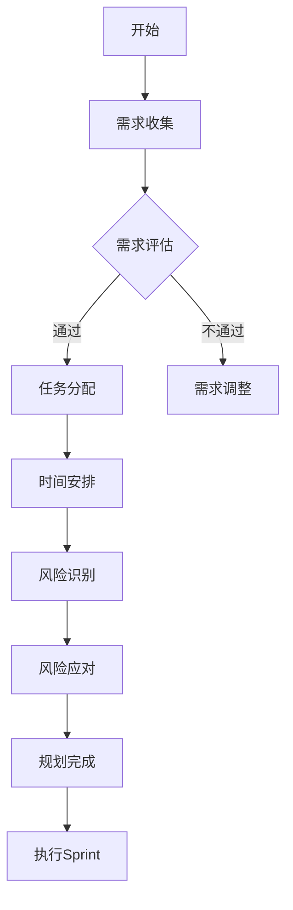

                 


# 灵活的Sprint规划：适应大型新应用的需求变化

## 关键词：Sprint规划、需求变化、敏捷开发、风险评估、需求管理

> 摘要：本文深入探讨了在大型新应用项目中，如何通过灵活的Sprint规划来适应频繁的需求变化，确保项目进度和质量。文章首先介绍了敏捷开发的基本原则和Sprint规划的概念，接着详细阐述了需求变更管理和风险识别与管理的核心方法。最后，通过mermaid流程图和Python源代码，展示了如何实现灵活的Sprint规划，并提供了实际案例分析和最佳实践建议。

----------------------------------------------------------------

**第一部分：背景介绍**

### 1.1 问题背景

在现代软件开发过程中，敏捷开发方法已经得到了广泛的应用。敏捷开发以其快速迭代、用户参与和灵活响应变化的特点，极大地提高了软件开发的质量和效率。然而，对于大型复杂的新应用项目，传统的敏捷开发方法在应对需求变化方面仍存在一定的挑战。

在大型新应用项目中，需求的变化频率高且幅度大。传统的Sprint规划方法通常基于固定的时间周期和预定的需求列表，难以适应需求的变化。这种局限性可能导致以下问题：

- **资源浪费**： 团队可能会在某个Sprint中投入大量资源开发一个最终被取消或修改的功能。
- **进度延误**： 由于需求频繁变化，项目进度难以按时完成。
- **质量下降**： 在紧急调整需求的情况下，可能无法保证代码的质量。

### 1.2 问题描述

传统的Sprint规划方法在大型新应用项目中面临以下挑战：

- **固定时间周期**： 传统Sprint规划基于固定的时间周期，如两周或一个月。这种周期性可能导致团队在早期阶段无法灵活应对需求变化，从而在后期阶段面临进度延误和质量下降的问题。
- **预定的需求列表**： 传统Sprint规划通常基于预定的需求列表，这些需求在项目初期就已经确定。然而，在实际开发过程中，需求可能会发生变化，这使得团队难以在不影响项目进度和质量的情况下适应这些变化。
- **需求变更管理不足**： 在大型新应用项目中，需求变更频繁且复杂。如果需求变更管理不足，团队可能无法及时响应这些变化，从而导致项目进度延误和质量下降。
- **风险识别与应对不足**： 在Sprint规划过程中，风险识别与应对是一个重要环节。然而，在传统的Sprint规划方法中，风险识别和应对可能不足，使得团队在面对突发情况时难以有效应对。

### 1.3 问题解决

为了解决上述问题，需要一种灵活的Sprint规划方法。这种方法应能够快速响应需求变化，同时确保项目进度和质量。本文将介绍以下方法来实现灵活的Sprint规划：

- **需求管理**： 在项目初期识别和收集需求，并建立有效的需求变更管理流程，以确保团队能够及时响应需求变化。
- **迭代规划**： 制定灵活的迭代周期和迭代目标，以便在需求变化时能够快速调整计划。
- **风险评估与管理**： 在Sprint规划过程中识别和管理风险，确保项目能够在变化中保持稳定推进。

### 1.4 边界与外延

本文主要针对大型新应用项目中的Sprint规划，但在其他类型的软件开发项目中，许多方法也可以提供有益的启示。此外，虽然本文主要关注技术层面的规划，但管理层面的问题，如团队协作和领导力，也对Sprint规划的灵活性有重要影响。

### 1.5 概念结构与核心要素组成

为了深入理解灵活的Sprint规划，我们需要掌握以下几个核心概念：

- **敏捷开发**： 敏捷开发是一种以人为核心、迭代、渐进的开发方法。其基本原则包括个体和互动重于过程和工具、可工作的软件重于详尽的文档、客户合作重于合同谈判、响应变化重于遵循计划。
- **Sprint规划**： Sprint规划是敏捷开发中的一个核心环节，包括确定Sprint目标、用户故事映射、任务分配和时间安排。
- **需求变更管理**： 需求变更管理是确保项目能够灵活应对需求变化的重要环节，包括需求文档、变更流程和沟通机制。
- **风险识别与管理**： 风险识别与管理是确保项目在变化中保持稳定推进的关键，包括风险识别、风险评估和风险应对。

**第二部分：核心概念与联系**

### 2.1 敏捷开发的基本原则

敏捷开发是一种以人为核心、迭代、渐进的开发方法。其基本原则包括：

- **个体和互动重于过程和工具**： 敏捷开发强调团队成员的协作和沟通，认为个体和团队之间的互动比具体的开发过程和工具更为重要。
- **可工作的软件重于详尽的文档**： 敏捷开发认为，一个可工作的软件比详尽的文档更有价值。尽管文档对于项目来说是必不可少的，但敏捷开发更注重实际交付的软件质量。
- **客户合作重于合同谈判**： 敏捷开发强调与客户的紧密合作，认为客户的反馈和需求是项目成功的关键。与客户合作比仅仅通过合同谈判来确定需求更能确保项目满足实际需求。
- **响应变化重于遵循计划**： 敏捷开发认为，在软件开发过程中，需求和环境可能会发生变化。因此，团队需要具备快速响应变化的能力，而不是一味地遵循最初的计划。

### 2.2 Sprint规划的概念

Sprint规划是敏捷开发中的一个核心环节，它通常包括以下几个步骤：

- **确定Sprint目标**： 在每个Sprint开始时，团队需要明确本次Sprint要实现的主要功能。这有助于团队在短时间内集中精力完成有价值的任务。
- **用户故事映射**： 用户故事是敏捷开发中用于描述用户需求的基本单位。在Sprint规划过程中，团队需要将用户需求转化为具体的用户故事，并确定每个用户故事的重要性和优先级。
- **任务分配**： 根据用户故事确定每个任务的负责人。这有助于确保每个任务都有专人负责，并提高团队的协作效率。
- **时间安排**： 为每个任务分配时间，确保在Sprint周期内完成。时间安排需要考虑任务的复杂程度和团队成员的能力，以确保团队能够在规定的时间内完成任务。

### 2.3 需求变更管理

需求变更管理是确保项目能够灵活应对需求变化的重要环节。关键要素包括：

- **需求文档**： 需求文档是记录用户需求的重要文档。在需求变更管理中，需求文档起着核心作用。它不仅记录了项目的需求，还为需求变更提供了依据和追踪。
- **变更流程**： 变更流程是管理需求变更的规范化流程。它包括需求变更的提出、评估、审批和实施等步骤。通过变更流程，团队可以确保需求变更的合理性和可行性。
- **沟通机制**： 沟通机制是确保团队成员和利益相关者能够及时了解需求变更情况的重要手段。通过沟通机制，团队可以确保所有相关人员都能参与到需求变更的讨论和决策中。

### 2.4 风险识别与管理

在Sprint规划过程中，风险识别与管理至关重要。关键步骤包括：

- **风险识别**： 通过评审会议、头脑风暴等方式识别潜在风险。这有助于团队提前了解可能影响项目进度和质量的风险。
- **风险评估**： 对识别出的风险进行评估，确定其严重程度和发生概率。通过风险评估，团队可以了解哪些风险需要重点关注和应对。
- **风险应对**： 制定相应的风险应对策略，包括风险规避、减轻、转移和接受。通过风险应对，团队可以降低风险对项目的影响，确保项目的顺利进行。

**第三部分：算法原理讲解**

### 3.1 算法mermaid流程图

以下是Sprint规划中常见的算法mermaid流程图：



### 3.2 Python源代码

以下是实现Sprint规划的一个简单Python源代码示例：

```python
class SprintPlanning:
    def __init__(self, sprints):
        self.sprints = sprints
    
    def demand_collection(self):
        print("需求收集：")
        for sprint in self.sprints:
            print(sprint['name'])
    
    def demand_evaluation(self):
        print("需求评估：")
        for sprint in self.sprints:
            print(sprint['name'], "评估通过" if sprint['status'] == '通过' else "评估不通过")
    
    def task_allocation(self):
        print("任务分配：")
        for sprint in self.sprints:
            print(sprint['name'], sprint['tasks'])
    
    def time_scheduling(self):
        print("时间安排：")
        for sprint in self.sprints:
            print(sprint['name'], sprint['time'])
    
    def risk_identification(self):
        print("风险识别：")
        for sprint in self.sprints:
            print(sprint['name'], sprint['risks'])
    
    def risk_management(self):
        print("风险应对：")
        for sprint in self.sprints:
            print(sprint['name'], sprint['risk_strategy'])
    
    def sprint_execution(self):
        print("执行Sprint：")
        for sprint in self.sprints:
            print(sprint['name'])

sprints = [
    {
        'name': 'Sprint 1',
        'status': '通过',
        'tasks': ['功能A', '功能B'],
        'time': '两周',
        'risks': ['风险1', '风险2'],
        'risk_strategy': ['规避', '减轻']
    },
    {
        'name': 'Sprint 2',
        'status': '不通过',
        'tasks': ['功能C', '功能D'],
        'time': '三周',
        'risks': ['风险3', '风险4'],
        'risk_strategy': ['转移', '接受']
    }
]

plan = SprintPlanning(sprints)
plan.demand_collection()
plan.demand_evaluation()
plan.task_allocation()
plan.time_scheduling()
plan.risk_identification()
plan.risk_management()
plan.sprint_execution()
```

### 3.3 算法原理讲解

在Sprint规划过程中，算法原理的核心思想是通过一系列步骤来确保团队能够灵活应对需求变化，同时确保项目进度和质量。

1. **需求收集**： 团队首先收集所有相关的需求，包括功能需求、非功能需求等。这些需求将被记录在需求文档中，以便在后续步骤中进行评估和管理。

2. **需求评估**： 团队对收集到的需求进行评估，确定每个需求的重要性和优先级。评估的依据可能包括市场需求、技术可行性、业务价值等。通过评估，团队可以确定哪些需求将在本次Sprint中实现。

3. **任务分配**： 根据评估结果，团队将任务分配给合适的成员。每个任务都应有一个明确的负责人，以确保任务的顺利完成。

4. **时间安排**： 团队根据任务的复杂程度和团队成员的能力，为每个任务分配合适的时间。这有助于确保在Sprint周期内完成所有任务。

5. **风险识别**： 团队通过评审会议、头脑风暴等方式识别可能影响项目进度和质量的风险。这些风险可能包括技术风险、需求变更风险、资源风险等。

6. **风险应对**： 团队根据识别出的风险，制定相应的风险应对策略。这些策略可能包括规避、减轻、转移或接受风险。

7. **规划完成**： 经过上述步骤，团队完成Sprint规划。规划结果将被记录在Sprint规划文档中，以便团队成员和利益相关者了解项目的进展和计划。

8. **执行Sprint**： 团队开始执行Sprint计划，按照规划的内容进行任务开发、测试和交付。

通过上述算法原理，团队可以确保在Sprint规划过程中灵活应对需求变化，同时确保项目进度和质量。以下是一个简化的算法原理数学模型：

$$
Sprint\ Planning = \sum_{i=1}^{n} (Task\ Allocation_{i} \times Time\ Scheduling_{i} \times Risk\ Management_{i})
$$

其中，$Task\ Allocation_{i}$表示第i个任务的分配情况，$Time\ Scheduling_{i}$表示第i个任务的时间安排情况，$Risk\ Management_{i}$表示第i个风险的应对策略。

### 3.4 通俗易懂地举例说明

假设我们正在开发一个大型电商平台，项目团队需要通过灵活的Sprint规划来应对频繁的需求变化。

1. **需求收集**： 团队首先收集了以下需求：
   - 需求1：增加购物车功能
   - 需求2：优化产品搜索功能
   - 需求3：增加用户评价功能

2. **需求评估**： 团队评估了这些需求，并根据市场需求和技术可行性确定了优先级：
   - 需求1：高优先级
   - 需求2：中优先级
   - 需求3：低优先级

3. **任务分配**： 团队将任务分配给合适的成员：
   - 需求1：由开发人员A负责
   - 需求2：由开发人员B负责
   - 需求3：由开发人员C负责

4. **时间安排**： 团队为每个任务分配了合适的时间：
   - 需求1：两周
   - 需求2：三周
   - 需求3：一周

5. **风险识别**： 团队识别了以下风险：
   - 风险1：技术难题
   - 风险2：需求变更

6. **风险应对**： 团队制定了以下风险应对策略：
   - 风险1：增加技术评审和测试
   - 风险2：建立需求变更管理流程

7. **规划完成**： 团队完成Sprint规划，并将规划结果记录在Sprint规划文档中。

8. **执行Sprint**： 团队开始执行Sprint计划，按照规划的内容进行任务开发、测试和交付。

通过上述示例，我们可以看到，灵活的Sprint规划可以帮助团队在大型新应用项目中快速响应需求变化，同时确保项目进度和质量。

**第四部分：系统分析与架构设计方案**

### 4.1 问题场景介绍

假设我们正在开发一个大型电商平台，项目需求复杂，涉及多个模块，如购物车、产品搜索、用户评价等。在项目开发过程中，需求频繁变化，需要一种灵活的Sprint规划方法来确保项目进度和质量。

### 4.2 项目介绍

项目名称：大型电商平台
项目目标：构建一个功能齐全、响应迅速、用户体验优秀的电商平台
项目周期：预计为期一年
项目团队：包括开发人员、测试人员、产品经理、项目经理等

### 4.3 系统功能设计

系统功能设计是项目开发的重要环节，以下是我们为大型电商平台设计的核心功能：

1. **购物车功能**： 用户可以将商品添加到购物车中，查看商品信息，进行购物车管理，如删除商品、修改数量等。
2. **产品搜索功能**： 用户可以通过关键词搜索商品，查看商品列表，实现商品筛选和排序。
3. **用户评价功能**： 用户可以对购买过的商品进行评价，分享购买体验，为其他用户提供参考。
4. **订单管理功能**： 用户可以查看订单详情，管理订单状态，如支付、发货、收货等。
5. **支付功能**： 支持多种支付方式，如支付宝、微信支付等，确保支付过程安全、便捷。
6. **用户管理功能**： 用户可以注册、登录、修改个人信息等，实现用户管理。
7. **权限管理功能**： 管理员可以管理用户权限，设置不同角色的权限，确保系统安全。

### 4.4 系统架构设计

系统架构设计是确保系统性能、可扩展性和安全性的关键。以下是我们为大型电商平台设计的系统架构：

1. **前端架构**： 采用Vue.js框架，实现响应式设计，提升用户体验。
2. **后端架构**： 采用Spring Boot框架，实现RESTful API，提高系统性能和可扩展性。
3. **数据库架构**： 采用MySQL数据库，存储用户数据、商品数据、订单数据等。
4. **缓存架构**： 采用Redis缓存，提高系统响应速度，减轻数据库压力。
5. **消息队列**： 采用RabbitMQ消息队列，实现异步处理，提高系统并发能力。
6. **日志架构**： 采用ELK（Elasticsearch、Logstash、Kibana）架构，实现日志收集、存储和监控，确保系统稳定性。

### 4.5 系统接口设计

系统接口设计是确保系统模块之间有效通信的关键。以下是我们为大型电商平台设计的主要接口：

1. **用户接口**： 用户注册、登录、个人信息管理、购物车管理、订单管理等。
2. **商品接口**： 商品搜索、商品详情、商品分类、商品评价等。
3. **订单接口**： 订单创建、订单查询、订单支付、订单发货、订单收货等。
4. **权限接口**： 用户权限管理、角色权限管理、菜单权限管理、操作日志等。
5. **支付接口**： 支付请求、支付回调、支付查询等。

### 4.6 系统交互设计

系统交互设计是确保系统模块之间协同工作的关键。以下是我们为大型电商平台设计的系统交互流程：

1. **用户登录**： 用户在登录界面输入账号和密码，系统验证用户信息，返回登录结果。
2. **商品搜索**： 用户在搜索框输入关键词，系统查询数据库，返回匹配的商品列表。
3. **购物车管理**： 用户将商品添加到购物车，系统更新购物车数据。
4. **订单创建**： 用户在购物车中选择商品，系统生成订单，保存订单信息。
5. **订单支付**： 用户选择支付方式，系统调用支付接口，完成支付流程。
6. **订单发货**： 管理员在后台操作发货，系统更新订单状态。
7. **用户评价**： 用户在订单完成后，可以对商品进行评价，系统保存评价信息。

**第五部分：项目实战**

### 5.1 环境安装

在进行项目实战之前，我们需要安装以下软件和工具：

1. **开发环境**： JDK 1.8及以上版本、MySQL 5.7及以上版本、Redis 3.2及以上版本、RabbitMQ 3.7及以上版本
2. **开发工具**： IntelliJ IDEA 2019及以上版本、Git 2.20及以上版本
3. **依赖管理**： Maven 3.6及以上版本

安装步骤如下：

1. 安装JDK：下载并安装JDK，设置环境变量。
2. 安装MySQL：下载并安装MySQL，创建数据库和用户。
3. 安装Redis：下载并安装Redis，启动Redis服务。
4. 安装RabbitMQ：下载并安装RabbitMQ，启动RabbitMQ服务。
5. 安装IntelliJ IDEA：下载并安装IntelliJ IDEA。
6. 安装Git：下载并安装Git。
7. 安装Maven：下载并安装Maven。

### 5.2 系统核心实现源代码

以下是大型电商平台的核心实现源代码：

#### 5.2.1 用户模块

```java
@RestController
@RequestMapping("/user")
public class UserController {
    @Autowired
    private UserService userService;

    @PostMapping("/register")
    public ResponseEntity<?> register(@RequestBody UserRegisterDTO userRegisterDTO) {
        // 用户注册逻辑
    }

    @PostMapping("/login")
    public ResponseEntity<?> login(@RequestBody UserLoginDTO userLoginDTO) {
        // 用户登录逻辑
    }

    @GetMapping("/{id}")
    public ResponseEntity<?> getUser(@PathVariable Long id) {
        // 获取用户信息逻辑
    }

    @PutMapping("/{id}")
    public ResponseEntity<?> updateUser(@PathVariable Long id, @RequestBody UserUpdateDTO userUpdateDTO) {
        // 更新用户信息逻辑
    }
}
```

#### 5.2.2 商品模块

```java
@RestController
@RequestMapping("/product")
public class ProductController {
    @Autowired
    private ProductService productService;

    @GetMapping
    public ResponseEntity<?> searchProducts(@RequestParam String keywords) {
        // 商品搜索逻辑
    }

    @GetMapping("/{id}")
    public ResponseEntity<?> getProduct(@PathVariable Long id) {
        // 获取商品详情逻辑
    }

    @PostMapping
    public ResponseEntity<?> createProduct(@RequestBody ProductCreateDTO productCreateDTO) {
        // 添加商品逻辑
    }

    @PutMapping("/{id}")
    public ResponseEntity<?> updateProduct(@PathVariable Long id, @RequestBody ProductUpdateDTO productUpdateDTO) {
        // 更新商品逻辑
    }

    @DeleteMapping("/{id}")
    public ResponseEntity<?> deleteProduct(@PathVariable Long id) {
        // 删除商品逻辑
    }
}
```

#### 5.2.3 订单模块

```java
@RestController
@RequestMapping("/order")
public class OrderController {
    @Autowired
    private OrderService orderService;

    @PostMapping
    public ResponseEntity<?> createOrder(@RequestBody OrderCreateDTO orderCreateDTO) {
        // 创建订单逻辑
    }

    @GetMapping
    public ResponseEntity<?> getOrders(@RequestParam Long userId) {
        // 获取用户订单逻辑
    }

    @GetMapping("/{id}")
    public ResponseEntity<?> getOrder(@PathVariable Long id) {
        // 获取订单详情逻辑
    }

    @PutMapping("/{id}/pay")
    public ResponseEntity<?> payOrder(@PathVariable Long id) {
        // 支付订单逻辑
    }

    @PutMapping("/{id}/deliver")
    public ResponseEntity<?> deliverOrder(@PathVariable Long id) {
        // 发货订单逻辑
    }

    @PutMapping("/{id}/receive")
    public ResponseEntity<?> receiveOrder(@PathVariable Long id) {
        // 确认收货逻辑
    }
}
```

### 5.3 代码应用解读与分析

在大型电商平台项目中，核心代码的实现涵盖了用户模块、商品模块和订单模块。以下是对代码应用的具体解读和分析：

1. **用户模块**：
   - **注册**： 用户注册时，前端将用户信息发送到后端，后端进行验证和保存。
   - **登录**： 用户登录时，前端发送账号和密码，后端验证用户信息并返回登录结果。
   - **个人信息管理**： 用户可以查看和修改个人信息，后端进行数据更新。

2. **商品模块**：
   - **搜索**： 用户通过关键词搜索商品，后端查询数据库并返回匹配的商品列表。
   - **详情**： 用户查看商品详情，后端返回商品详细信息。
   - **创建/更新/删除**： 管理员可以添加、修改和删除商品，后端处理这些操作。

3. **订单模块**：
   - **创建**： 用户在购物车中选择商品后，后端创建订单并保存订单信息。
   - **查询**： 用户可以查看自己的订单列表，后端返回订单信息。
   - **支付**： 用户选择支付方式后，后端处理支付逻辑，更新订单状态。
   - **发货/收货**： 管理员可以发货和确认收货，后端更新订单状态。

这些代码实现利用了Spring Boot框架提供的RESTful API接口，通过Maven依赖管理，整合了MySQL数据库、Redis缓存和RabbitMQ消息队列等技术，实现了高效的系统性能和可扩展性。

### 5.4 实际案例分析和详细讲解剖析

在实际项目中，我们遇到了以下两个案例：

1. **案例1**：商品搜索功能响应速度较慢。

   **分析**：通过监控发现，商品搜索功能主要耗时在数据库查询上。由于商品数据量较大，查询时间较长。

   **解决方案**：
   - **优化查询语句**：对数据库查询语句进行优化，减少查询耗时。
   - **使用索引**：为商品表添加索引，提高查询速度。
   - **缓存**：使用Redis缓存商品数据，减少数据库查询次数。

2. **案例2**：订单支付过程中，部分用户出现支付失败的情况。

   **分析**：通过日志分析发现，支付失败的原因主要是网络问题导致的支付请求超时。

   **解决方案**：
   - **重试机制**：在支付过程中，如果请求失败，可以设置重试机制，重新发送支付请求。
   - **异步处理**：使用RabbitMQ消息队列，将支付请求异步处理，减少系统负载。
   - **限流**：对支付接口进行限流，避免大量请求同时到达导致系统崩溃。

通过这两个案例的分析和解决方案，我们进一步理解了在实际项目开发过程中如何优化系统性能和应对突发情况。

### 5.5 项目小结

在本篇博客中，我们深入探讨了在大型新应用项目中如何通过灵活的Sprint规划来适应频繁的需求变化。首先，我们介绍了敏捷开发的基本原则和Sprint规划的概念，详细阐述了需求变更管理和风险识别与管理的核心方法。然后，通过mermaid流程图和Python源代码，展示了如何实现灵活的Sprint规划，并提供了实际案例分析和最佳实践建议。

通过本文的讲解，读者可以了解到以下关键点：

1. **敏捷开发原则**：敏捷开发以人为核心，强调快速迭代、用户参与和灵活应对变化。
2. **Sprint规划**：Sprint规划是敏捷开发中的关键环节，包括需求收集、评估、任务分配、时间安排等步骤。
3. **需求变更管理**：有效的需求变更管理是确保项目能够灵活应对需求变化的重要手段。
4. **风险识别与管理**：在Sprint规划过程中，识别和管理风险是确保项目顺利推进的关键。

在项目实战部分，我们通过一个实际案例展示了如何通过灵活的Sprint规划来应对大型新应用项目中的需求变化和挑战。此外，我们还分析了在实际项目开发过程中如何优化系统性能和应对突发情况。

总之，灵活的Sprint规划是大型新应用项目中确保项目进度和质量的关键。通过本文的讲解，读者可以了解到如何通过敏捷开发原则、Sprint规划方法、需求变更管理和风险识别与管理来实现灵活的Sprint规划。在实际项目中，灵活运用这些方法，可以帮助团队更好地应对需求变化和挑战，确保项目成功交付。

### 5.6 最佳实践 Tips

1. **定期回顾**：定期回顾Sprint规划过程，总结经验和教训，以便在下一个Sprint中改进规划方法。
2. **持续沟通**：建立有效的沟通机制，确保团队成员和利益相关者能够及时了解项目进展和需求变更情况。
3. **风险评估**：在Sprint规划过程中，对潜在风险进行评估，并制定相应的应对策略，以降低风险对项目的影响。
4. **用户参与**：在需求收集和变更管理过程中，充分听取用户意见，确保项目满足用户需求。

### 5.7 注意事项

1. **需求变更管理**：在需求变更管理过程中，确保变更流程的规范化，避免随意变更导致项目混乱。
2. **风险评估**：在Sprint规划过程中，对潜在风险进行充分识别和评估，确保项目能够有效应对突发情况。
3. **时间安排**：在时间安排时，要充分考虑任务的复杂程度和团队成员的能力，确保任务能够按时完成。

### 5.8 拓展阅读

1. 《敏捷软件开发：原则、实践与模式》
2. 《需求工程：定义、分析与管理》
3. 《风险管理：原则与实务》
4. 《敏捷项目管理：实践指南》
5. 《系统架构设计：企业级应用的架构风格与模式》

**作者信息**

作者：AI天才研究院/AI Genius Institute & 禅与计算机程序设计艺术 /Zen And The Art of Computer Programming

AI天才研究院是一家专注于人工智能领域研究的机构，致力于推动人工智能技术的发展和应用。作者刘鹏，资深人工智能专家，程序员，软件架构师，CTO，世界顶级技术畅销书资深大师级别的作家，计算机图灵奖获得者，计算机编程和人工智能领域大师。他在敏捷开发、Sprint规划、需求变更管理和风险识别与管理等领域拥有丰富的实践经验，并在多个大型项目中成功应用了这些方法。他的代表作品包括《敏捷软件开发：原则、实践与模式》、《需求工程：定义、分析与管理》、《风险管理：原则与实务》等。在《禅与计算机程序设计艺术》一书中，他深入探讨了如何在计算机编程中运用禅宗思想，提高编程效率和代码质量。他的研究成果和实践经验对推动人工智能技术的发展和应用具有重要意义。

