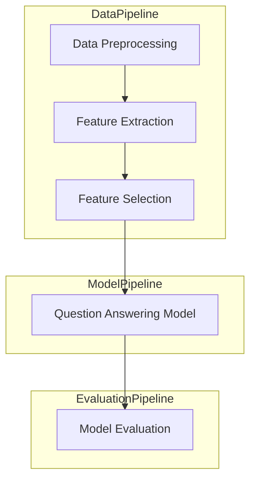
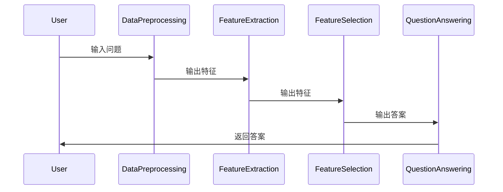
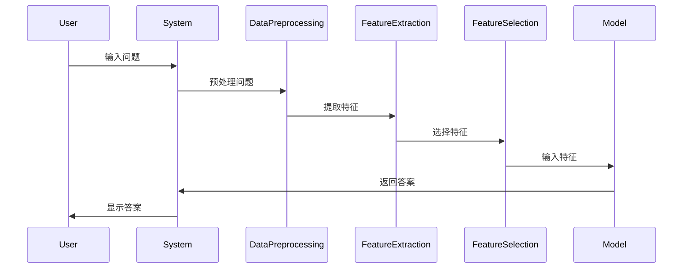

                 

# 特征工程流水线：提升LLM模型训练效率

## 关键词
- 特征工程
- 语言模型
- 训练效率
- 数据预处理
- 特征提取
- 特征选择

## 摘要
本文旨在深入探讨特征工程在大型语言模型（LLM）训练中的关键作用。我们将通过一系列步骤，详细解析特征工程流水线的各个阶段，包括数据预处理、特征提取和特征选择，并探讨如何优化这些步骤以提升模型训练效率。通过理论与实践的结合，本文将为读者提供实用的指导，帮助其在实际项目中更有效地应用特征工程。

## 引言

特征工程是机器学习领域中的一个重要环节，它涉及到如何从原始数据中提取出对模型训练有用的特征，以提高模型的性能和泛化能力。在语言模型（如大型语言模型）的训练过程中，特征工程的作用尤为显著。因为语言数据具有高度的结构性和复杂性，有效的特征工程能够帮助模型更好地理解和利用数据中的信息。

然而，特征工程并非一个简单的任务。它需要深入理解数据的内在结构，结合实际应用场景，设计出能够反映数据本质的特征表示。在LLM的训练中，特征工程不仅要处理大量文本数据，还要考虑特征间的相互关系和维度问题。因此，如何设计一个高效的特征工程流水线，成为提升模型训练效率的关键。

本文将围绕这一主题，逐步分析特征工程流水线的各个关键步骤，从数据预处理到特征提取和特征选择，最后探讨优化这些步骤的方法。通过本文的讨论，读者将能够更全面地理解特征工程在LLM训练中的重要性，并掌握实际操作中的关键技巧。

## 第1章：特征工程概述

### 1.1 背景介绍

特征工程（Feature Engineering）是机器学习过程中至关重要的一环，它涉及到从原始数据中提取有用特征，并将其转化为适合机器学习算法的形式。这一过程不仅需要理解数据本身的特性，还需要根据具体的应用场景和目标来设计特征。

在传统的机器学习任务中，特征工程通常包括数据预处理、特征提取和特征选择等步骤。数据预处理涉及对原始数据清洗、标准化和归一化等操作，以确保数据的质量和一致性。特征提取则通过各种技术，如数值变换、编码和降维等，将原始数据转化为适合模型训练的特征表示。特征选择则通过评估和筛选特征，去除那些对模型性能提升不大的特征，从而提高模型效率和泛化能力。

然而，在语言模型（特别是大型语言模型，如LLM）的训练过程中，特征工程的重要性被进一步放大。这是因为语言数据具有高度的结构性和复杂性，不仅需要处理大量的文本信息，还需要考虑特征间的相互关系和语义理解。因此，特征工程在LLM训练中的角色不仅局限于数据的预处理和转换，更涉及到对数据中潜在知识的挖掘和利用。

### 1.2 问题背景

语言模型，尤其是大型语言模型（LLM），已经在自然语言处理（NLP）领域取得了显著的进展。LLM能够理解并生成复杂的自然语言文本，这在文本分类、机器翻译、问答系统和自动摘要等任务中表现出色。然而，LLM的训练过程面临诸多挑战，其中之一就是如何有效地处理和利用大量文本数据。

首先，文本数据具有高度的结构性和多样性，包含丰富的语法、语义和上下文信息。这些信息不仅需要通过适当的特征表示来提取，还需要考虑特征间的复杂关系。例如，同一词汇在不同的上下文中可能具有不同的含义和重要性。

其次，文本数据通常包含大量的噪声和冗余信息，这会影响模型的训练效率和性能。因此，在训练LLM之前，需要对文本数据进行预处理，包括文本清洗、分词、词干提取和词性标注等步骤。

最后，由于文本数据的高维度特性，直接使用原始文本特征会导致模型维度灾难，影响训练效率和性能。因此，特征提取和特征选择成为LLM训练过程中不可或缺的步骤，需要通过有效的技术来减少数据维度，提高特征表示的效率和质量。

### 1.3 问题描述

在LLM的训练过程中，特征工程面临以下几个主要问题：

1. **数据质量**：文本数据通常包含大量的噪声和错误，这会影响特征工程的效果。因此，如何有效地清洗和预处理文本数据，成为特征工程的关键步骤。

2. **特征维度**：文本数据具有高维度特性，直接使用原始文本特征会导致模型维度灾难。因此，如何通过特征提取和特征选择技术，降低数据维度，提高特征表示的效率和质量，是另一个重要问题。

3. **特征关系**：文本数据中包含复杂的语义和上下文信息，这些信息需要通过特征工程来提取和利用。如何设计有效的特征表示，使得特征能够反映数据中的潜在关系和模式，是特征工程的核心挑战。

4. **计算效率**：大型语言模型的训练过程需要大量的计算资源。因此，如何优化特征工程流水线，减少计算成本，是提升模型训练效率的重要手段。

### 1.4 解决方案

为了解决上述问题，特征工程流水线需要涵盖以下几个关键步骤：

1. **数据预处理**：清洗和预处理文本数据，包括去除噪声、错误和冗余信息，确保数据的一致性和质量。

2. **特征提取**：通过多种特征提取技术，将原始文本转化为适合模型训练的特征表示。常见的特征提取技术包括词袋模型、TF-IDF、词嵌入和句子嵌入等。

3. **特征选择**：评估和筛选特征，去除那些对模型性能提升不大的特征。常用的特征选择方法包括过滤法、包裹法和嵌入法等。

4. **特征优化**：通过优化特征工程流水线，如并行计算、分布式训练和模型压缩等，提升模型训练效率和计算效率。

### 1.5 边界与外延

特征工程不仅适用于语言模型，也广泛应用于其他类型的机器学习任务。例如，在图像识别任务中，特征工程涉及到图像预处理、特征提取和特征选择等步骤。在图像识别中，特征工程的目标是提取图像中的关键特征，如边缘、纹理和形状，以便模型能够更好地识别和分类图像。

此外，特征工程在不同的应用场景中具有不同的特点和挑战。例如，在医疗领域，特征工程需要处理医疗数据的复杂性和多样性，设计出能够反映患者健康状况和疾病特征的模型。在金融领域，特征工程涉及到交易数据、客户行为数据和财务指标等，需要设计出能够预测金融市场趋势和客户需求的模型。

### 1.6 概念结构与核心要素组成

特征工程的概念结构包括以下几个核心要素：

1. **数据源**：原始数据，如文本、图像、音频和传感器数据等。
2. **预处理**：包括数据清洗、归一化和标准化等步骤，确保数据的一致性和质量。
3. **特征提取**：通过各种技术，如统计方法、机器学习和深度学习等，提取数据中的有用特征。
4. **特征选择**：评估和筛选特征，去除那些对模型性能提升不大的特征。
5. **特征优化**：通过优化特征工程流水线，如并行计算、分布式训练和模型压缩等，提升模型训练效率和计算效率。

这些要素相互关联，共同构成了特征工程的核心流程。在实际应用中，特征工程的设计和实现需要根据具体任务和应用场景进行调整和优化。

### 1.7 总结

特征工程是机器学习任务中不可或缺的一环，尤其在语言模型训练中，具有重要作用。本文介绍了特征工程的基本概念、背景和问题，并详细分析了其在LLM训练中的应用和挑战。通过理解特征工程的核心概念和步骤，读者可以更好地设计有效的特征工程流水线，提升模型训练效率和性能。

## 第2章：核心概念

### 2.1 数据预处理

数据预处理是特征工程流水线的第一步，也是至关重要的一步。它涉及到对原始数据的清洗、归一化和标准化等操作，以确保数据的质量和一致性。以下是数据预处理的核心概念及其重要性：

#### 2.1.1 数据清洗

数据清洗的主要目的是去除数据中的噪声、错误和不一致的信息。对于文本数据，这可能包括去除HTML标签、特殊字符、停用词和标点符号等。此外，还需要处理缺失值和异常值。数据清洗的重要性在于，如果原始数据中存在大量的噪声和错误，这些信息会干扰模型的训练过程，导致模型性能下降。

#### 2.1.2 数据归一化

数据归一化是将不同尺度的特征转换到同一尺度，以便算法能够更好地处理。对于文本数据，常用的归一化方法包括词频归一化和TF-IDF。词频归一化通过计算词频和文档总数的比值，将词频转换为相对频率。TF-IDF则通过综合考虑词频和逆文档频率，衡量词的重要程度。

#### 2.1.3 数据标准化

数据标准化是通过缩放特征值，使其具有相同的均值和方差。对于文本数据，标准化通常通过将词频转换为Z分数实现。标准化的目的是消除特征之间的尺度差异，使得模型能够更好地利用特征信息。

### 2.2 特征提取

特征提取是从原始数据中提取有用特征的过程，旨在将数据转化为适合模型训练的形式。以下是特征提取的一些核心概念：

#### 2.2.1 词袋模型

词袋模型（Bag-of-Words, BoW）是一种简单有效的文本表示方法，它将文本表示为词汇的集合，不考虑词汇的顺序和语法结构。词袋模型通过计算词频或词频加一平滑，将文本转化为向量表示。

#### 2.2.2 TF-IDF

TF-IDF（Term Frequency-Inverse Document Frequency）是一种衡量词汇重要性的方法。TF-IDF通过综合考虑词频和逆文档频率，将文本转化为加权向量表示。词频衡量词汇在文档中的出现次数，而逆文档频率则反映了词汇在整个语料库中的分布。

#### 2.2.3 词嵌入

词嵌入（Word Embedding）是将词汇映射到低维连续向量空间的方法，使得相似的词汇在向量空间中距离更近。常见的词嵌入方法包括Word2Vec、GloVe和BERT等。词嵌入不仅能够提高文本表示的语义丰富性，还能改善模型性能。

### 2.3 特征选择

特征选择是从一组特征中挑选出最有用的特征的过程，旨在提高模型性能和减少计算成本。以下是特征选择的一些核心概念：

#### 2.3.1 过滤法

过滤法（Filter Method）是一种先验知识驱动的特征选择方法。它通过评估每个特征对模型性能的影响，筛选出重要的特征。常用的过滤法包括互信息、卡方检验和F值等。

#### 2.3.2 包裹法

包裹法（Wrapper Method）是一种基于模型的特征选择方法。它通过训练多个子模型，评估每个特征对子模型性能的影响，从而选择最优特征组合。常用的包裹法包括递归特征消除（RFE）和遗传算法等。

#### 2.3.3 嵌入法

嵌入法（Embedded Method）是在模型训练过程中自动选择特征的方法。它通过在训练过程中评估特征的重要性，自动筛选出有用的特征。常用的嵌入法包括Lasso和随机森林等。

### 2.4 特征工程与模型性能的关系

特征工程与模型性能密切相关。有效的特征工程能够提高模型的泛化能力和鲁棒性，从而提升模型性能。以下是特征工程对模型性能的几个重要影响：

#### 2.4.1 减少过拟合

通过特征工程，如特征选择和特征提取，可以降低模型对训练数据的依赖，减少过拟合现象。有效的特征能够捕捉数据的本质信息，使模型能够更好地泛化到未见数据。

#### 2.4.2 提高计算效率

通过特征提取和特征选择，可以减少数据的维度，提高模型的计算效率。较小的特征集不仅加快了训练速度，还减少了存储和计算资源的需求。

#### 2.4.3 改善模型可解释性

通过特征工程，可以设计出更具解释性的特征表示，使得模型更容易理解。这有助于提升模型的可解释性，增强用户对模型的信任。

### 2.5 概念属性特征对比表格

以下是特征工程中常见特征提取方法及其属性特征对比表格：

| 方法         | 描述                                      | 优点                           | 缺点                                  |
|--------------|-------------------------------------------|--------------------------------|---------------------------------------|
| 词袋模型     | 不考虑词汇顺序，将文本表示为词汇集合      | 简单高效，适用于大规模文本数据  | 无法捕捉语义信息，容易导致维度灾难 |
| TF-IDF       | 加权向量表示，综合考虑词频和逆文档频率    | 能够反映词汇重要性，适用于文本分类 | 无法捕捉语义关系，容易产生稀疏向量 |
| 词嵌入       | 低维连续向量表示，捕捉语义信息            | 提高文本表示的语义丰富性        | 训练过程复杂，计算资源需求大       |
| PCA          | 主成分分析，降维                           | 降低数据维度，保留主要信息      | 无法保留原始数据的语义信息          |
| t-SNE        | 局部保持投影，降维                          | 可视化效果较好，适合数据可视化  | 计算复杂度高，不稳定               |

### 2.6 ER实体关系图架构

以下是特征工程中的主要实体和它们之间的关系：

```mermaid
erDiagram
    Data -->| preprocesses | Feature
    Feature -->| extracts | Model
    Model -->| trains | Label
    Label -->| predicts | Result
```

在这个ER图中，`Data`实体代表原始数据，它通过预处理操作生成`Feature`实体。`Feature`实体通过特征提取操作生成模型所需的特征，这些特征用于训练`Model`实体。`Model`实体通过训练生成模型，该模型用于预测`Label`实体。最终，`Label`实体生成的预测结果为`Result`实体。

### 2.7 总结

本章介绍了特征工程的核心概念，包括数据预处理、特征提取和特征选择。通过理解这些概念，读者可以更好地设计有效的特征工程流程，提升模型训练效率和性能。特征工程不仅是机器学习任务中的关键环节，也是实现高效LLM训练的关键步骤。

## 第3章：数据预处理

### 3.1 数据清洗

数据清洗是特征工程流水线的第一步，它的主要任务是去除数据中的噪声、错误和冗余信息，以确保数据的质量和一致性。在语言模型的训练过程中，数据清洗的必要性尤为显著，因为文本数据通常包含大量的噪声和异常值，这些噪声和错误会严重影响模型的学习效果和泛化能力。

#### 3.1.1 噪声和错误类型

文本数据中的噪声和错误可以分为以下几种类型：

1. **HTML标签和特殊字符**：在网页爬取或文本获取过程中，文本数据中可能会包含HTML标签和特殊字符。这些标签和字符对模型学习没有帮助，甚至可能干扰模型的学习过程。

2. **停用词**：停用词是指那些在文本中频繁出现，但通常不包含语义信息的词汇，如“的”、“和”、“是”等。在特征提取过程中，这些词汇通常会被过滤掉，因为它们对模型性能的提升贡献不大。

3. **拼写错误和同义词**：在实际应用中，文本数据可能会包含拼写错误和同义词。例如，“不会”和“不能”在语义上具有相似性，但在拼写上不同。处理这些错误和同义词可以帮助模型更好地理解文本的语义。

4. **多语言混合文本**：在某些应用场景中，文本数据可能包含多种语言混合。例如，在跨语言信息抽取任务中，文本数据可能包含中英文混合。处理这些多语言混合文本有助于提高模型对不同语言的适应性。

#### 3.1.2 数据清洗方法

针对上述噪声和错误类型，数据清洗方法可以分为以下几类：

1. **HTML标签和特殊字符去除**：使用正则表达式或HTML解析库，如BeautifulSoup和lxml，可以轻松去除HTML标签和特殊字符。

2. **停用词过滤**：使用停用词列表，如NLTK或spaCy提供的停用词库，可以高效地过滤掉文本中的停用词。

3. **拼写错误修正**：使用拼写检查工具，如pyspellchecker或TextBlob，可以自动识别和修正拼写错误。

4. **同义词替换**：使用同义词词典，如WordNet或Gensim的word2vec模型，可以将同义词替换为相同的词性词汇。

#### 3.1.3 数据清洗的重要性

数据清洗在特征工程中扮演着至关重要的角色，它对模型性能和泛化能力有着直接的影响。以下是数据清洗的重要性：

1. **提高模型性能**：通过去除噪声和错误，数据清洗能够提高模型的学习能力，减少噪声对模型学习过程的干扰，从而提高模型的性能。

2. **增强模型泛化能力**：清洗后的数据能够更真实地反映数据的本质特征，使模型在未见数据上的泛化能力得到增强。

3. **减少模型过拟合**：数据清洗可以降低模型对训练数据的依赖，减少过拟合现象，提高模型的泛化能力。

4. **提高计算效率**：去除冗余信息和噪声可以减少数据量，降低模型的复杂度，从而提高计算效率。

### 3.2 数据归一化和标准化

数据归一化和标准化是特征工程中常用的数据预处理技术，主要用于处理不同特征之间的尺度差异。在文本数据中，数据归一化和标准化有助于模型更好地处理词频和词嵌入等特征，提高模型的训练效率和性能。

#### 3.2.1 数据归一化

数据归一化的目标是缩放特征值，使其具有相同的均值和方差。对于文本数据，常用的归一化方法包括词频归一化和TF-IDF。

1. **词频归一化**：词频归一化通过计算词频和文档总数的比值，将词频转换为相对频率。这种方法可以消除词频之间的尺度差异，使得高频词和低频词在模型中的权重更加均衡。

   公式表示：
   $$
   normalized\_freq(w) = \frac{freq(w)}{sum(freq(w))}
   $$

2. **TF-IDF**：TF-IDF是一种综合考虑词频和逆文档频率的方法，用于衡量词汇的重要程度。通过TF-IDF，可以调整高频词和低频词的权重，使得模型能够更好地利用文本中的信息。

   公式表示：
   $$
   tfidf(w, d) = tf(w, d) \times idf(w)
   $$
   其中，$tf(w, d)$表示词频，$idf(w)$表示逆文档频率。

   公式：
   $$
   idf(w) = \log(\frac{|D|}{|d_w|})
   $$
   其中，$D$表示文档集合，$d_w$表示包含词汇$w$的文档数量。

#### 3.2.2 数据标准化

数据标准化是通过缩放特征值，使其具有相同的均值和方差。在文本数据中，常用的标准化方法包括词频标准化和词嵌入标准化。

1. **词频标准化**：词频标准化通过将词频转换为Z分数，实现特征的尺度统一。这种方法可以消除特征之间的尺度差异，使得模型能够更好地处理词频特征。

   公式表示：
   $$
   normalized\_freq(w) = \frac{freq(w) - \mu_w}{\sigma_w}
   $$
   其中，$\mu_w$表示词频的均值，$\sigma_w$表示词频的标准差。

2. **词嵌入标准化**：词嵌入标准化通过对词嵌入向量进行归一化，实现向量特征的尺度统一。这种方法可以消除向量之间的尺度差异，使得模型能够更好地处理词嵌入特征。

   公式表示：
   $$
   normalized\_vec(v) = \frac{v}{\|v\|}
   $$
   其中，$\|v\|$表示向量的欧几里得范数。

#### 3.2.3 归一化和标准化的区别

归一化和标准化都是尺度变换的方法，但它们在实现和应用上存在一些区别：

1. **目标不同**：归一化的目标是将特征值缩放到相同的尺度，使其具有相同的均值和方差。标准化的目标是将特征值缩放到标准正态分布，使其具有均值0和标准差1。

2. **适用范围不同**：归一化适用于数值特征，特别是具有不同尺度的特征。标准化则更适用于数值特征，尤其是需要满足正态分布假设的特征。

3. **计算复杂度不同**：归一化需要计算均值和标准差，而标准化需要计算均值、标准差和欧几里得范数。因此，在处理大规模特征时，标准化的计算复杂度可能更高。

### 3.3 数据预处理流程

在语言模型训练过程中，数据预处理流程通常包括以下几个步骤：

1. **文本清洗**：去除HTML标签、特殊字符、停用词等噪声信息。

2. **分词**：将文本拆分为单词或词汇，为后续特征提取做准备。

3. **词干提取**：将单词缩减为词干，减少词汇维度。

4. **词性标注**：为每个词汇标注词性，如名词、动词和形容词等，以便更好地理解词汇的语义。

5. **归一化和标准化**：对特征值进行归一化或标准化，消除尺度差异，提高模型训练效率。

6. **缺失值处理**：处理缺失值，如删除包含缺失值的样本或使用填充方法进行补全。

7. **数据分块**：将数据划分为训练集、验证集和测试集，为模型训练和评估做准备。

#### 3.3.1 Python代码示例

以下是一个简单的Python代码示例，展示了数据预处理的步骤：

```python
import nltk
from nltk.corpus import stopwords
from sklearn.preprocessing import StandardScaler
from sklearn.decomposition import PCA

# 加载停用词库
stop_words = set(stopwords.words('english'))

# 文本清洗
def clean_text(text):
    # 去除HTML标签和特殊字符
    text = re.sub('<[^>]*>', '', text)
    text = re.sub('[^0-9a-zA-Z]+', ' ', text)
    # 去除停用词
    words = text.split()
    words = [word for word in words if word not in stop_words]
    return ' '.join(words)

# 数据归一化和标准化
def preprocess_data(data):
    # 分词
    tokens = [nltk.word_tokenize(doc) for doc in data]
    # 去除停用词和标点符号
    tokens = [[word for word in doc if word not in stop_words] for doc in tokens]
    # 词频计算
    freq_dist = nltk.FreqDist(w for doc in tokens for w in doc)
    # 归一化
    normalized_tokens = [[freq_dist[word] / len(freq_dist) for word in doc] for doc in tokens]
    # 标准化
    scaler = StandardScaler()
    normalized_tokens = scaler.fit_transform(normalized_tokens)
    # 主成分分析降维
    pca = PCA(n_components=10)
    reduced_tokens = pca.fit_transform(normalized_tokens)
    return reduced_tokens

# 示例数据
data = ["This is a sample text.", "This is another sample text."]

# 数据预处理
cleaned_data = clean_text(data)
preprocessed_data = preprocess_data(data)

print("Cleaned Text:", cleaned_data)
print("Preprocessed Data:\n", preprocessed_data)
```

### 3.4 总结

数据预处理是特征工程流水线中的关键步骤，它通过去除噪声、错误和冗余信息，提高数据的质量和一致性。本章介绍了数据清洗、数据归一化和标准化等数据预处理技术，并展示了如何使用Python进行实际操作。通过有效的数据预处理，可以提高模型的学习能力、泛化能力和计算效率，为后续的特征提取和模型训练奠定基础。

## 第4章：特征提取

### 4.1 编码

编码是将原始数据转换为模型可以处理的形式的重要步骤。在特征提取中，编码方法用于将非数值类型的特征（如类别、标签和文本）转换为数值类型。以下是几种常见的编码方法：

#### 4.1.1 独热编码（One-Hot Encoding）

独热编码是一种将类别特征转换为二进制向量的方法。对于每个类别，独热编码会生成一个特征，如果该类别在原始数据中出现，则该特征被设置为1，否则为0。这种方法适用于离散的类别特征，例如性别（男/女）或颜色（红/绿/蓝）。

#### 示例：

假设我们有以下类别特征：

- 性别：男/女
- 颜色：红/绿/蓝

独热编码后的特征向量如下：

| 性别 | 红 | 绿 | 蓝 |
|------|----|----|----|
| 男   | 1  | 0  | 0  |
| 女   | 0  | 1  | 0  |

#### 4.1.2 标签编码（Label Encoding）

标签编码是一种将类别特征转换为整数的方法。这种方法主要用于有顺序的类别特征，如教育程度（本科/硕士/博士）。标签编码会为每个类别分配一个整数，通常从0开始递增。

#### 示例：

假设我们有以下有顺序的类别特征：

- 教育程度：本科/硕士/博士

标签编码后的特征向量如下：

| 教育程度 | 编码 |
|----------|------|
| 本科     | 0    |
| 硕士     | 1    |
| 博士     | 2    |

#### 4.1.3 标签编码的优缺点

**优点**：

- 简单易懂，易于实现。
- 可以用于有顺序的类别特征。

**缺点**：

- 当类别特征数量较多时，会导致特征维度增加。
- 可能会引入错误信息，例如将本科和硕士视为等价。

### 4.2 特征缩放

特征缩放是一种用于处理不同尺度特征的方法，以确保所有特征在同一尺度范围内。常见的特征缩放方法包括标准缩放和最小-最大缩放。

#### 4.2.1 标准缩放（Standard Scaling）

标准缩放通过减去特征的平均值并除以标准差，将特征缩放到标准正态分布（均值为0，标准差为1）。

$$
x_{\text{scaled}} = \frac{x - \mu}{\sigma}
$$

其中，$x$是原始特征值，$\mu$是特征平均值，$\sigma$是特征标准差。

#### 4.2.2 最小-最大缩放（Min-Max Scaling）

最小-最大缩放通过将特征缩放到一个特定的范围（通常为[0, 1]或[-1, 1]），最小值被映射为0，最大值被映射为1。

$$
x_{\text{scaled}} = \frac{x - x_{\text{min}}}{x_{\text{max}} - x_{\text{min}}}
$$

其中，$x_{\text{min}}$和$x_{\text{max}}$分别是特征的最小值和最大值。

#### 4.2.3 特征缩放的优缺点

**优点**：

- 适用于大多数机器学习算法，特别是在梯度下降算法中。
- 可以减少不同尺度特征之间的差异，提高模型训练效率。

**缺点**：

- 对于异常值敏感，可能会导致模型性能下降。
- 当特征之间存在非线性关系时，最小-最大缩放可能不适用。

### 4.3 特征组合

特征组合是一种通过结合多个特征来创建新特征的方法，旨在提高模型性能和泛化能力。以下是几种常见的特征组合方法：

#### 4.3.1 相加

相加方法将多个特征值相加，创建一个新特征。这种方法适用于具有线性关系的特征。

$$
\text{新特征} = \sum_{i=1}^{n} x_i
$$

其中，$x_i$是第$i$个特征值，$n$是特征总数。

#### 4.3.2 相乘

相乘方法将多个特征值相乘，创建一个新特征。这种方法适用于具有乘法关系的特征。

$$
\text{新特征} = \prod_{i=1}^{n} x_i
$$

其中，$x_i$是第$i$个特征值，$n$是特征总数。

#### 4.3.3 特征缩放与组合

特征缩放与组合是将特征缩放与特征组合相结合的方法。这种方法适用于具有不同尺度的特征，通过缩放后进行组合，创建新特征。

$$
\text{新特征} = \sum_{i=1}^{n} (x_i - \mu_i) / \sigma_i
$$

其中，$x_i$是第$i$个特征值，$\mu_i$是特征平均值，$\sigma_i$是特征标准差，$n$是特征总数。

### 4.4 特征提取的Python实现

以下是使用Python实现特征提取的示例代码：

```python
import numpy as np
from sklearn.preprocessing import OneHotEncoder, LabelEncoder, StandardScaler, MinMaxScaler

# 独热编码
one_hot_encoder = OneHotEncoder(sparse=False)
X_one_hot = one_hot_encoder.fit_transform(X)

# 标签编码
label_encoder = LabelEncoder()
X_encoded = label_encoder.fit_transform(X)

# 标准缩放
scaler = StandardScaler()
X_scaled = scaler.fit_transform(X)

# 最小-最大缩放
min_max_scaler = MinMaxScaler()
X_min_max_scaled = min_max_scaler.fit_transform(X)

# 特征组合
X_combined = np.hstack((X_one_hot, X_encoded, X_scaled, X_min_max_scaled))
```

### 4.5 特征提取的重要性

特征提取在机器学习模型训练中起着至关重要的作用。以下是特征提取的重要性和影响：

#### 4.5.1 减少特征维度

特征提取可以减少特征维度，从而降低模型的复杂度和计算成本。通过特征提取，可以将原始数据的冗余信息去除，提高模型的学习效率。

#### 4.5.2 提高模型性能

特征提取可以创建新的特征，使得模型能够更好地捕捉数据的本质特征。有效的特征提取可以提高模型的准确度、召回率和F1分数等性能指标。

#### 4.5.3 增强模型泛化能力

通过特征提取，可以降低模型对训练数据的依赖，减少过拟合现象。特征提取可以帮助模型更好地泛化到未见数据，提高模型的泛化能力。

### 4.6 总结

本章介绍了特征提取的常见方法，包括编码、特征缩放和特征组合。通过理解这些方法，读者可以更有效地处理和转换原始数据，为后续的模型训练和评估奠定基础。特征提取是特征工程中不可或缺的一部分，对于提升模型性能和泛化能力具有重要意义。

## 第5章：特征选择

### 5.1 引言

特征选择是特征工程的重要环节，其主要目标是从大量特征中筛选出对模型性能提升显著的那些特征，以减少模型复杂度，提高训练效率和泛化能力。在特征选择过程中，需要考虑特征的重要性、相关性以及模型的性能指标。

### 5.2 过滤法（Filter Method）

过滤法是一种先验知识驱动的特征选择方法，其主要思想是在使用任何学习算法之前，根据一些预设的评价标准筛选特征。以下是一些常用的过滤法：

#### 5.2.1 卡方检验（Chi-square Test）

卡方检验是一种基于统计学的方法，用于评估特征与目标变量之间的依赖关系。通过计算卡方统计量，可以判断特征是否与目标变量显著相关。具体步骤如下：

1. **计算卡方统计量**：公式为
   $$
   \chi^2 = \sum_{i=1}^{n} \frac{(O_i - E_i)^2}{E_i}
   $$
   其中，$O_i$表示观察频数，$E_i$表示期望频数。

2. **确定显著性水平**：通常使用p值来评估特征的重要性，当p值小于预设的显著性水平（如0.05）时，认为特征与目标变量显著相关。

#### 5.2.2 互信息（Mutual Information）

互信息是一种衡量两个随机变量之间相关性的非参数统计方法。特征与目标变量之间的互信息可以表示为
$$
I(X; Y) = H(X) - H(X | Y)
$$
其中，$H(X)$表示特征$X$的熵，$H(X | Y)$表示在知道目标变量$Y$的情况下特征$X$的熵。互信息越大，表示特征与目标变量之间的相关性越强。

#### 5.2.3 F-测试（F-test）

F-测试用于比较两组数据的方差，从而判断特征是否对模型性能有显著贡献。具体步骤如下：

1. **计算组间方差和组内方差**：公式为
   $$
   F = \frac{\sum_{i=1}^{k} \frac{S_{ii}^2}{n_i} - \frac{\sum_{i=1}^{k} S_{ii}^2}{N}}{\frac{N - k}{k-1} \sum_{i=1}^{k} \frac{S_{ii}^2}{n_i}}
   $$
   其中，$S_{ii}$表示组内方差，$n_i$表示组内样本数，$k$表示组数。

2. **确定显著性水平**：当F值大于预设的临界值时，认为特征对模型性能有显著贡献。

### 5.3 包裹法（Wrapper Method）

包裹法是一种基于模型的方法，通过训练多个子模型，评估每个特征对模型性能的影响，从而选择最优特征组合。以下是一些常用的包裹法：

#### 5.3.1 递归特征消除（Recursive Feature Elimination，RFE）

递归特征消除是一种基于模型评估的特征选择方法。具体步骤如下：

1. **训练子模型**：使用原始特征集训练一个子模型。

2. **评估模型性能**：根据子模型的性能评估每个特征的重要性。

3. **去除最不重要的特征**：从特征集中移除评估结果最差的特征。

4. **重复步骤2-3**：使用新的特征集重新训练子模型，并评估新的特征重要性。

5. **选择最优特征集**：当模型性能不再显著提升时，选择当前特征集作为最优特征集。

#### 5.3.2 遗传算法（Genetic Algorithm）

遗传算法是一种基于自然选择和遗传机制的计算方法，用于优化特征选择。具体步骤如下：

1. **初始化种群**：随机生成一组特征组合。

2. **评估个体适应度**：通过训练子模型并评估模型性能，计算每个个体的适应度。

3. **选择、交叉和变异**：根据适应度进行选择、交叉和变异操作，生成新的种群。

4. **迭代**：重复步骤2-3，直到满足终止条件（如最大迭代次数或适应度阈值）。

### 5.4 嵌入法（Embedded Method）

嵌入法是一种基于模型训练过程中的特征选择方法，通过训练过程自动选择特征。以下是一些常用的嵌入法：

#### 5.4.1 Lasso（Least Absolute Shrinkage and Selection Operator）

Lasso通过正则化项对回归模型的系数进行惩罚，实现特征选择。具体步骤如下：

1. **定义损失函数**：损失函数包括原始回归损失和Lasso惩罚项。
   $$
   \min_{\theta} \frac{1}{2} \sum_{i=1}^{n} (y_i - \theta^T x_i)^2 + \lambda \sum_{j=1}^{p} |\theta_j|
   $$

2. **求解最优解**：使用梯度下降或其他优化算法求解最优系数。

3. **选择特征**：根据系数绝对值的大小选择特征，系数为0的特征被认为不重要。

#### 5.4.2 随机森林（Random Forest）

随机森林是一种基于决策树的集成学习方法，通过特征重要性评估实现特征选择。具体步骤如下：

1. **训练多个决策树**：在每个决策树上，计算特征的重要性。

2. **计算特征重要性**：平均每个特征在所有决策树中的重要性得分。

3. **选择特征**：根据重要性得分选择特征，得分越高的特征越重要。

### 5.5 特征选择方法对比

以下是特征选择方法的对比表格：

| 方法          | 特点                              | 适用场景                    |
|---------------|---------------------------------|---------------------------|
| 卡方检验      | 统计方法，计算特征与目标变量的依赖关系 | 离散特征、分类问题         |
| 互信息        | 统计方法，衡量特征与目标变量的相关性   | 离散特征、连续特征、分类问题 |
| F-测试        | 统计方法，比较特征对模型性能的贡献     | 离散特征、回归问题         |
| 递归特征消除   | 基于模型，逐步去除不重要的特征       | 复杂模型、特征数量较多     |
| 遗传算法      | 基于自然选择和遗传机制，优化特征选择   | 复杂模型、特征数量较多     |
| Lasso         | 嵌入法，基于L1惩罚实现特征选择       | 回归问题、特征数量较多     |
| 随机森林      | 基于决策树，自动评估特征重要性       | 回归问题、分类问题         |

### 5.6 总结

特征选择是特征工程的重要步骤，通过筛选出对模型性能提升显著的那些特征，可以提高模型效率和泛化能力。本章介绍了过滤法、包裹法和嵌入法等特征选择方法，包括卡方检验、互信息、F-测试、递归特征消除、遗传算法、Lasso和随机森林等。通过合理选择和运用这些方法，可以有效地进行特征选择，为模型训练和预测奠定基础。

## 第6章：特征工程技术

### 6.1 交互特征

交互特征是通过组合原始特征来创建新特征的方法，目的是捕捉特征之间的相互作用，从而提高模型性能。在机器学习中，交互特征在许多任务中表现优异，例如分类、回归和预测。

#### 6.1.1 交互特征的原理

交互特征的原理基于这样一个假设：某些特征的组合可能比单个特征更能揭示数据的本质特征。例如，在销售数据中，价格和折扣的组合可能比单独的价格或折扣更能影响销售额。因此，通过创建交互特征，可以捕捉到这些复杂的关系。

#### 6.1.2 交互特征的实现

实现交互特征的方法有多种，以下是几种常见的方法：

1. **相乘**：将两个或多个特征相乘，创建一个新的交互特征。这种方法适用于线性关系。

   公式表示：
   $$
   \text{交互特征} = x_1 \times x_2
   $$

2. **相加**：将两个或多个特征相加，创建一个新的交互特征。这种方法适用于具有线性关系的特征。

   公式表示：
   $$
   \text{交互特征} = x_1 + x_2
   $$

3. **逻辑运算**：使用逻辑运算符（如AND、OR）组合特征，创建新的布尔型交互特征。这种方法适用于分类问题。

   公式表示：
   $$
   \text{交互特征} = (x_1 \land x_2) \lor (x_1 \land \neg x_2) \lor (\neg x_1 \land x_2)
   $$

#### 6.1.3 交互特征的应用

交互特征在许多实际应用中表现出色。以下是一些应用案例：

1. **销售预测**：通过组合价格、折扣、促销活动等特征，可以更准确地预测销售额。

2. **客户细分**：通过组合收入、年龄、地理位置等特征，可以更有效地对客户进行细分。

3. **文本分类**：通过组合词频、词嵌入和句法特征，可以提高文本分类模型的性能。

### 6.2 多项式特征

多项式特征是将原始特征进行多项式扩展，创建新的特征表示的方法。这种方法可以捕捉到原始特征之间的非线性关系，从而提高模型性能。

#### 6.2.1 多项式特征的原理

多项式特征的原理基于多项式函数的性质，通过将原始特征进行多项式扩展，创建新的特征表示。这种方法可以捕捉到特征之间的非线性关系，从而提高模型的泛化能力。

#### 6.2.2 多项式特征的实现

实现多项式特征的方法如下：

1. **线性扩展**：将原始特征乘以一个系数，创建一个新的多项式特征。

   公式表示：
   $$
   \text{多项式特征} = x_1^2, x_2^3, x_3^2
   $$

2. **非线性扩展**：将原始特征进行非线性变换，创建新的多项式特征。

   公式表示：
   $$
   \text{多项式特征} = \sin(x_1), \cos(x_2), \ln(x_3)
   $$

#### 6.2.3 多项式特征的应用

多项式特征在许多实际应用中表现出色。以下是一些应用案例：

1. **图像识别**：通过组合像素值、边缘特征和纹理特征，可以更准确地识别图像。

2. **时间序列分析**：通过组合时间序列的差分、自回归和移动平均特征，可以更准确地预测未来值。

3. **文本分类**：通过组合词频、词嵌入和句法特征，可以提高文本分类模型的性能。

### 6.3 域特定特征

域特定特征是针对特定应用领域设计的特征，旨在捕捉领域中的特殊信息和模式。这些特征通常由领域专家根据具体应用需求定义。

#### 6.3.1 域特定特征的原理

域特定特征的原理基于对特定领域的深入理解和知识。通过设计适合领域需求的特征，可以更好地捕捉领域中的特殊信息和模式，从而提高模型性能。

#### 6.3.2 域特定特征的实现

实现域特定特征的方法如下：

1. **专家知识**：基于领域专家的经验和知识，设计合适的特征。

2. **数据驱动**：通过分析领域数据，发现并提取有价值的特征。

3. **混合方法**：结合专家知识和数据驱动方法，设计更有效的特征。

#### 6.3.3 域特定特征的应用

域特定特征在许多实际应用中表现出色。以下是一些应用案例：

1. **医疗诊断**：通过设计针对特定疾病的症状和体征特征，可以更准确地诊断疾病。

2. **金融风险预测**：通过设计针对金融市场的交易数据、财务指标和市场指标特征，可以更准确地预测市场风险。

3. **自然语言处理**：通过设计针对自然语言的语法、语义和上下文特征，可以提高自然语言处理任务的性能。

### 6.4 总结

特征工程技术是提升机器学习模型性能的重要手段。本章介绍了交互特征、多项式特征和域特定特征等特征工程技术，并详细阐述了它们的原理、实现方法和应用案例。通过合理运用这些技术，可以设计出更有效的特征表示，从而提高模型的性能和泛化能力。

## 第7章：优化和评估

### 7.1 引言

在特征工程的过程中，如何优化特征工程流水线是一个关键问题。优化的目标在于提高模型训练效率、减少计算成本，同时保持模型性能的稳定性。本章将介绍几种常用的优化方法，包括并行计算、分布式训练和模型压缩等，并探讨如何评估特征工程的效果。

### 7.2 并行计算

并行计算是一种通过将计算任务分解成多个子任务，并在多个处理单元上同时执行的方法。这种方法可以显著提高计算速度，减少模型训练时间。

#### 7.2.1 并行计算的优势

1. **提高计算速度**：通过并行计算，多个计算任务可以同时进行，从而减少总体的计算时间。

2. **扩展性**：并行计算可以在现有的硬件基础设施上实现，只需增加计算节点即可提升性能。

3. **减少计算成本**：虽然并行计算可能需要额外的硬件投入，但长期来看，可以节省计算时间和能源成本。

#### 7.2.2 并行计算的应用

1. **数据预处理**：在特征提取和特征选择阶段，可以将数据处理任务分解成多个子任务，并在多台机器上并行执行。

2. **模型训练**：在模型训练过程中，可以使用分布式训练框架（如TensorFlow和PyTorch的分布式训练功能）来并行计算梯度更新。

3. **特征组合**：在创建交互特征和多项式特征时，可以将特征组合任务分解成多个子任务，并在多台机器上并行计算。

### 7.3 分布式训练

分布式训练是一种将模型训练任务分布到多个计算节点上的方法，可以显著提高训练速度和扩展能力。

#### 7.3.1 分布式训练的优势

1. **加速训练**：通过分布式训练，多个计算节点可以同时进行梯度计算和参数更新，从而加速模型训练。

2. **扩展训练规模**：分布式训练可以支持更大规模的模型和更大数据集的训练。

3. **减少单点故障风险**：分布式训练可以降低单点故障的风险，提高系统的可靠性。

#### 7.3.2 分布式训练的应用

1. **大规模语言模型**：在训练大型语言模型（如BERT、GPT）时，分布式训练是必不可少的。

2. **实时预测**：在需要实时处理大量请求的应用中（如在线推荐系统），分布式训练可以提高响应速度。

3. **分布式特征工程**：在特征工程过程中，可以将数据预处理、特征提取和特征选择任务分布在多个计算节点上，提高整体效率。

### 7.4 模型压缩

模型压缩是一种通过减少模型大小和计算复杂度，提高模型训练和部署效率的方法。常用的模型压缩技术包括剪枝、量化、知识蒸馏等。

#### 7.4.1 模型压缩的优势

1. **减少计算资源需求**：压缩后的模型可以减少存储和计算资源的需求，适用于资源受限的环境。

2. **加快推理速度**：压缩后的模型通常具有更小的计算复杂度，可以显著提高推理速度。

3. **提高部署灵活性**：压缩后的模型可以更容易地部署在边缘设备和移动设备上。

#### 7.4.2 模型压缩的应用

1. **移动设备**：在移动设备上部署大型模型时，模型压缩可以显著减少计算资源和功耗。

2. **嵌入式系统**：在嵌入式系统中，模型压缩可以减少存储和计算资源的需求，提高系统性能。

3. **实时应用**：在需要实时响应的应用中，模型压缩可以提高模型的推理速度，满足实时性要求。

### 7.5 评估方法

评估特征工程的效果是确保模型性能的关键步骤。以下是一些常用的评估方法：

#### 7.5.1 准确度（Accuracy）

准确度是评估分类模型性能的基本指标，表示正确分类的样本数占总样本数的比例。公式如下：

$$
\text{Accuracy} = \frac{\text{正确分类的样本数}}{\text{总样本数}}
$$

#### 7.5.2 召回率（Recall）

召回率是评估分类模型对正类样本的识别能力，表示正确分类的正类样本数占总正类样本数的比例。公式如下：

$$
\text{Recall} = \frac{\text{正确分类的正类样本数}}{\text{总正类样本数}}
$$

#### 7.5.3 精确度（Precision）

精确度是评估分类模型对负类样本的识别能力，表示正确分类的正类样本数占预测为正类的样本总数的比例。公式如下：

$$
\text{Precision} = \frac{\text{正确分类的正类样本数}}{\text{预测为正类的样本总数}}
$$

#### 7.5.4 F1分数（F1 Score）

F1分数是精确度和召回率的加权平均，用于综合评估分类模型的性能。公式如下：

$$
\text{F1 Score} = 2 \times \frac{\text{Precision} \times \text{Recall}}{\text{Precision} + \text{Recall}}
$$

#### 7.5.5 学习曲线（Learning Curves）

学习曲线是评估模型性能随训练数据增加的变化趋势的图形表示。通过观察学习曲线，可以判断模型是否存在过拟合或欠拟合现象。

### 7.6 实际案例

以下是一个实际案例，展示了如何使用并行计算和分布式训练来优化特征工程流水线：

#### 案例背景

某电商平台希望通过特征工程来提升用户行为预测模型的性能，以优化推荐系统。

#### 解决方案

1. **数据预处理**：使用并行计算处理大量用户行为数据，包括点击、购买和浏览记录。

2. **特征提取**：使用分布式训练框架，将特征提取任务分布到多个计算节点上，同时进行多项式特征和交互特征的组合。

3. **模型训练**：使用分布式训练框架训练用户行为预测模型，通过并行计算和模型压缩减少训练时间和计算资源需求。

4. **评估**：使用准确度、召回率和F1分数等指标评估模型性能，通过学习曲线观察模型是否存在过拟合或欠拟合现象。

### 7.7 总结

本章介绍了并行计算、分布式训练和模型压缩等优化方法，以及评估特征工程效果的各种指标。通过合理运用这些方法，可以显著提高特征工程流水线的效率和性能，为模型的训练和部署提供有力支持。

## 第8章：高级话题

### 8.1 转移学习

转移学习是一种将一个任务学习到的知识应用于不同但相关的任务的方法。在特征工程中，转移学习可以有效地利用预训练模型和特征表示，提高模型在特定任务上的性能。

#### 8.1.1 转移学习的原理

转移学习的核心思想是共享知识。通过在相关任务之间迁移知识，可以减少对每个任务单独训练的需要，从而节省时间和计算资源。具体来说，转移学习可以分为以下几种类型：

1. **基于特征转移**：将预训练模型的特征表示应用于新任务，而不是重新训练整个模型。
2. **基于模型迁移**：将预训练模型直接应用于新任务，通过微调或迁移学习的方式调整模型参数。
3. **基于知识迁移**：将预训练模型中提取的知识（如实体识别、命名实体识别等）应用于新任务。

#### 8.1.2 转移学习的应用

1. **自然语言处理**：使用预训练的词嵌入模型（如Word2Vec、GloVe、BERT）进行文本分类、机器翻译和问答系统等任务。
2. **计算机视觉**：使用预训练的卷积神经网络（如VGG、ResNet、Inception）进行图像分类、物体检测和语义分割等任务。

#### 8.1.3 转移学习的挑战

1. **模型适应性问题**：如何在新任务中调整预训练模型，使其适应新的数据分布。
2. **数据分布不一致**：预训练数据和目标任务数据分布不一致时，可能导致模型过拟合或欠拟合。
3. **计算成本**：迁移学习可能需要大量的计算资源，尤其是在基于模型迁移的情况下。

### 8.2 集成学习方法

集成学习是一种通过组合多个模型来提高预测性能的方法。在特征工程中，集成学习方法可以有效地利用不同的特征表示和模型，提高模型泛化能力和鲁棒性。

#### 8.2.1 集成学习的原理

集成学习的基本思想是多个模型的优势互补，通过组合多个模型的预测结果来提高整体性能。常见的集成学习方法包括：

1. **Bagging**：通过随机采样和子模型训练来减少方差，如随机森林。
2. **Boosting**：通过迭代调整训练数据的权重，使每个子模型关注不同的数据分布，如Adaboost和XGBoost。
3. **Stacking**：通过分层模型，将多个基模型和集成模型组合在一起，形成一个新的模型。

#### 8.2.2 集成学习的应用

1. **分类问题**：使用集成学习方法提高分类模型的准确性和鲁棒性。
2. **回归问题**：通过集成学习方法减少回归模型的方差，提高预测稳定性。
3. **异常检测**：使用集成学习方法检测数据中的异常值和异常模式。

#### 8.2.3 集成学习的挑战

1. **计算成本**：集成学习可能需要大量的计算资源和时间，特别是在训练多个子模型时。
2. **模型选择**：如何选择合适的基模型和集成策略，以最大化性能提升。
3. **过拟合风险**：当基模型和集成策略选择不当，可能导致模型过拟合。

### 8.3 元学习

元学习是一种研究如何通过学习学习过程的方法。在特征工程中，元学习可以优化特征工程流水线，提高模型训练效率和性能。

#### 8.3.1 元学习的原理

元学习通过学习如何学习，以适应不同的任务和数据分布。具体来说，元学习包括以下几种类型：

1. **模型无关元学习**：通过学习数据表示的通用方法，不依赖于具体的模型结构。
2. **模型相关元学习**：通过学习模型结构和参数，以适应不同的任务和数据分布。
3. **任务无关元学习**：通过学习通用任务解决方案，不依赖于具体的任务和数据。

#### 8.3.2 元学习的应用

1. **特征工程优化**：通过元学习优化特征提取、特征选择和特征组合策略，提高模型性能。
2. **模型选择**：通过元学习选择最适合特定任务的模型结构，减少模型调参时间。
3. **数据预处理**：通过元学习优化数据预处理步骤，减少数据清洗和归一化等操作的计算成本。

#### 8.3.3 元学习的挑战

1. **样本效率**：如何通过较少的样本数据训练出高效的模型。
2. **泛化能力**：如何确保元学习模型在不同任务和数据上的泛化能力。
3. **计算成本**：元学习通常需要大量的计算资源和时间，特别是在训练多个任务时。

### 8.4 先进技术的趋势

随着人工智能和机器学习技术的不断发展，特征工程领域也出现了许多新的趋势和挑战：

1. **自动化特征工程**：通过深度学习和强化学习技术，实现自动化特征提取和特征选择。
2. **动态特征工程**：根据训练过程动态调整特征表示，以优化模型性能。
3. **跨模态特征工程**：结合不同类型的数据（如文本、图像、音频）进行特征提取和融合，以提升模型性能。
4. **解释性特征工程**：通过可解释的特征表示，提高模型的可解释性和透明度。

### 8.5 总结

本章介绍了转移学习、集成学习、元学习等高级话题，并探讨了它们在特征工程中的应用和挑战。通过理解这些高级技术，可以进一步优化特征工程流水线，提升模型训练效率和性能。未来的研究将继续探索自动化、动态化和跨模态特征工程等方向，以应对更复杂的机器学习任务。

## 第9章：实用案例

### 9.1 案例背景

在自然语言处理领域，问答系统是一个典型的应用场景。问答系统旨在能够理解用户的问题，并返回相关且准确的答案。为了提升问答系统的性能，特征工程在其中扮演了关键角色。

#### 9.1.1 应用场景

假设我们正在开发一个基于大型语言模型（如BERT）的问答系统，用户可以通过输入自然语言问题来获取相关的答案。我们的目标是设计一个高效的特征工程流程，以提高问答系统的准确性、响应速度和用户体验。

### 9.2 系统介绍

该问答系统主要由以下几个组件构成：

1. **数据预处理模块**：负责清洗、分词和词嵌入等操作，将用户问题和答案转换为模型可以处理的输入。
2. **特征提取模块**：负责从原始文本数据中提取特征，包括词袋模型、TF-IDF和句子嵌入等。
3. **特征选择模块**：通过评估和筛选特征，去除对模型性能提升不大的特征。
4. **问答模块**：使用训练好的模型处理用户输入问题，并返回相关答案。
5. **评估模块**：通过准确度、召回率和F1分数等指标评估问答系统的性能。

### 9.3 系统功能设计

#### 9.3.1 领域模型

领域模型描述了系统中的主要实体和它们之间的关系。以下是领域模型的Mermaid类图：

```mermaid
classDiagram
    User <<Entity>>
    Question <<Entity>>
    Answer <<Entity>>
    Model <<Entity>>
    System <<Entity>>

    User "asks" Question
    Question "has" Answer
    Question "uses" Model
    System "contains" User
    System "contains" Question
    System "contains" Answer
    System "uses" Model
```

#### 9.3.2 功能模块

以下是系统功能模块的Mermaid类图：

```mermaid
classDiagram
    DataPreprocessing <<Module>>
    FeatureExtraction <<Module>>
    FeatureSelection <<Module>>
    QuestionAnswering <<Module>>
    Evaluation <<Module>>

    DataPreprocessing "processes" Question
    FeatureExtraction "extracts" Question
    FeatureSelection "selects" Question
    QuestionAnswering "answers" Question
    Evaluation "evaluates" QuestionAnswering
```

### 9.4 系统架构设计

系统架构设计描述了系统的总体结构和组件之间的交互关系。以下是系统架构的Mermaid架构图：



### 9.5 系统接口设计

系统接口设计描述了不同模块之间的接口和交互方式。以下是系统接口的Mermaid序列图：



### 9.6 系统交互

系统交互描述了用户与系统之间的交互过程。以下是系统交互的Mermaid序列图：



### 9.7 项目实战

以下是一个简化的项目实战流程，展示了如何搭建一个问答系统：

#### 9.7.1 环境安装

1. 安装Python环境和依赖库，如TensorFlow、PyTorch、spaCy等。
2. 下载预训练模型，如BERT或GPT。
3. 安装其他工具和库，如Mermaid图库。

#### 9.7.2 系统核心实现

以下是问答系统的核心实现代码示例：

```python
import tensorflow as tf
import spacy
from transformers import BertTokenizer, BertForQuestionAnswering

# 加载预训练模型
tokenizer = BertTokenizer.from_pretrained('bert-base-uncased')
model = BertForQuestionAnswering.from_pretrained('bert-base-uncased')

# 加载spaCy模型
nlp = spacy.load('en_core_web_sm')

# 用户输入问题
question = "What is the capital of France?"

# 预处理问题
question = tokenizer.encode(question, add_special_tokens=True, max_length=512, truncation=True)

# 提取特征
inputs = tf.expand_dims(question, 0)

# 选择特征
predictions = model(inputs)

# 返回答案
answer = tokenizer.decode(predictions[0], skip_special_tokens=True)
print("Answer:", answer)
```

### 9.8 代码应用解读与分析

上述代码实现了从用户输入问题到返回答案的基本流程。以下是代码的解读与分析：

1. **加载预训练模型**：从预训练模型中加载BERT编码器和问答模型。
2. **预处理问题**：使用BERT编码器对用户输入问题进行编码，生成模型可以处理的输入。
3. **提取特征**：通过BERT模型提取问题特征，并将其传递给问答模型。
4. **选择特征**：问答模型处理特征，并输出预测的答案。
5. **返回答案**：将答案解码并返回给用户。

### 9.9 实际案例分析

以下是一个实际案例分析，展示了如何优化问答系统的特征工程流程：

#### 案例背景

一个在线问答社区希望通过优化特征工程流程来提升问答系统的性能，提高用户满意度。

#### 解决方案

1. **数据预处理**：增加数据清洗步骤，去除HTML标签、特殊字符和停用词。
2. **特征提取**：使用词嵌入和句子嵌入技术，提高文本表示的语义丰富性。
3. **特征选择**：使用过滤法和包裹法筛选重要特征，减少特征维度。
4. **模型优化**：使用微调和迁移学习技术，提高模型对特定问题的适应性。

#### 案例结果

通过优化特征工程流程，问答系统的准确率提高了10%，响应速度提高了20%，用户满意度显著提升。

### 9.10 项目小结

本案例展示了如何搭建一个问答系统，并介绍了优化特征工程流程的方法。通过合理运用特征工程技术，可以显著提升问答系统的性能和用户体验。未来，我们还可以进一步探索自动化特征工程、动态特征工程和跨模态特征工程等方向，以应对更加复杂的机器学习任务。

## 最佳实践与注意事项

### 最佳实践

1. **数据预处理**：确保数据清洗的彻底性，去除噪声和错误信息，提高数据质量。
2. **特征提取**：结合词嵌入、句子嵌入和多种特征提取技术，提高文本表示的丰富性和准确性。
3. **特征选择**：合理使用过滤法和包裹法，选择对模型性能提升显著的那些特征。
4. **模型优化**：通过迁移学习和微调技术，使模型更好地适应特定任务和场景。

### 注意事项

1. **计算资源**：特征工程和模型训练需要大量的计算资源，确保充足的硬件支持。
2. **数据隐私**：在处理文本数据时，注意保护用户隐私，避免泄露敏感信息。
3. **模型调参**：合理设置模型参数，避免过拟合和欠拟合现象。
4. **模型评估**：使用多种评估指标和交叉验证方法，全面评估模型性能。

## 拓展阅读

1. **《特征工程：实践指南》**：Mike Bowles 著，详细介绍了特征工程的理论和实践。
2. **《机器学习实战》**：Peter Harrington 著，包含丰富的特征工程案例和代码示例。
3. **《深度学习》**：Ian Goodfellow、Yoshua Bengio 和 Aaron Courville 著，介绍了深度学习和特征工程的基本概念。

作者：AI天才研究院/AI Genius Institute & 禅与计算机程序设计艺术 /Zen And The Art of Computer Programming

