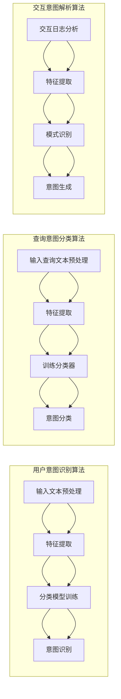
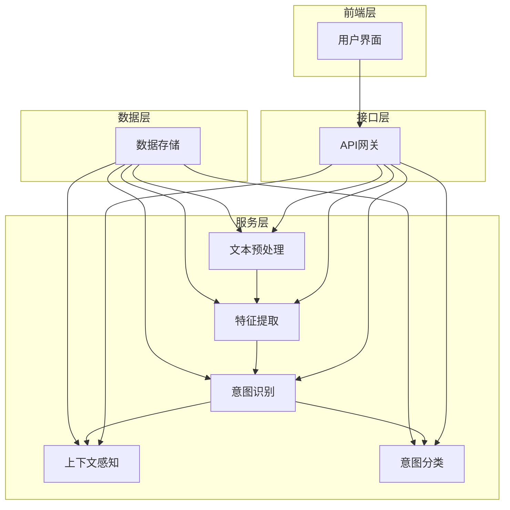
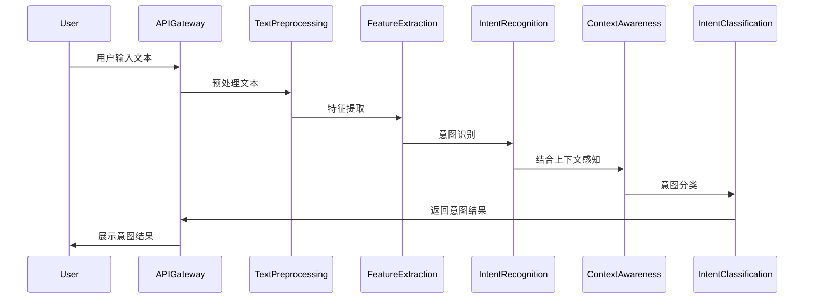

                 


### 第1章：用户意图理解概述

**1.1 问题背景**

在人工智能时代，用户与系统的交互变得越来越频繁，尤其是在自然语言处理（NLP）领域。用户意图理解（User Intent Understanding）作为人工智能的核心任务之一，变得尤为重要。它不仅影响到搜索引擎的准确性，还决定了智能客服、语音助手、聊天机器人的交互效果。

**1.1.1 人工智能时代的需求**

随着互联网的普及和大数据技术的兴起，用户产生的内容呈现出爆炸式增长。如何有效地从这些内容中获取用户的需求和意图，成为了一个迫切需要解决的问题。用户意图理解在这个过程中扮演着桥梁的角色，它能够帮助系统更准确地理解和响应用户的需求。

**1.1.2 用户意图理解的重要性**

用户意图理解的重要性主要体现在以下几个方面：

- **提高交互质量**：通过理解用户的意图，系统能够提供更加个性化的服务，提升用户体验。
- **降低错误率**：错误的意图理解会导致错误的响应，从而影响系统的可靠性和用户的满意度。
- **优化资源分配**：理解用户意图有助于系统更高效地分配计算资源和网络带宽。

**1.1.3 现有技术的不足**

尽管用户意图理解在理论和实践中都有了一定的发展，但现有技术仍存在以下不足：

- **歧义处理能力不足**：自然语言中存在大量的歧义，现有模型往往难以准确判断用户的意图。
- **上下文感知能力较弱**：用户的意图往往与上下文紧密相关，现有模型对上下文的依赖性较高，难以做到真正的实时理解。
- **个性化程度有限**：现有系统难以根据用户的长期行为和偏好来调整意图理解策略。

**1.2 问题描述**

用户意图理解的核心问题可以归纳为以下几点：

- **多义性问题**：用户可能会用不同的语言表达相同或类似的意图，如何有效地处理这种多义性是关键挑战。
- **上下文依赖性**：用户的意图往往依赖于特定的上下文信息，如何准确地获取和利用上下文信息是一个重要问题。
- **个性化需求**：不同用户有不同的需求和偏好，如何根据用户的个性化特征来调整意图理解策略是一个挑战。

**1.2.1 用户意图的定义**

用户意图（User Intent）是指用户在某个场景下想要实现的目标或任务。它可以是一个具体的操作，如查询信息、购买商品，也可以是一种情感或态度，如表达喜爱、抱怨。

**1.2.2 用户意图的理解挑战**

- **语言复杂性**：自然语言表达具有复杂性，包括语法、语义、情感等多方面的因素，使得理解用户意图变得困难。
- **上下文依赖性**：用户意图往往受到上下文的影响，如对话历史、环境因素等。
- **数据不足**：用户意图的多样性导致标注数据的获取和标注成本极高。

**1.2.3 用户意图理解的边界**

- **可理解性**：系统理解用户意图的能力是有限的，无法完全覆盖所有可能的意图。
- **实时性**：用户意图理解需要实时响应，但计算资源的限制可能会影响响应速度。
- **个性化**：系统在理解用户意图时需要考虑个性化需求，但如何实现个性化仍是一个挑战。

**1.3 问题解决**

针对用户意图理解的问题，研究者们提出了多种解决方案，包括基于规则的方法、机器学习方法、深度学习方法等。以下是一些现有问题的解决思路：

- **多义性处理**：通过上下文信息和语义分析来减少歧义，提高意图识别的准确性。
- **上下文感知**：利用对话历史和实时上下文信息来提高意图理解的精度。
- **个性化调整**：通过用户行为分析和偏好学习来调整意图理解策略，提高个性化服务水平。

**1.4 边界与外延**

- **用户意图理解的边界**：系统理解用户意图的能力受限于当前的技术水平和数据质量。
- **用户意图理解的外延**：随着技术的进步和数据的积累，用户意图理解的边界将不断扩展。

**1.5 核心概念**

- **用户意图（User Intent）**：用户在特定场景下的目标或任务。
- **查询意图（Query Intent）**：用户在查询过程中的具体需求。
- **交互意图（Interaction Intent）**：用户在交互过程中的期望行为。

**1.6 概念结构与核心要素组成**

用户意图理解的核心概念包括用户意图、查询意图和交互意图。这些概念相互关联，共同构成了用户意图理解的整体框架。核心要素包括语言理解能力、上下文感知能力和情感识别能力。

---

### 1.6 概念结构与核心要素组成

在深入探讨用户意图理解这一课题之前，有必要对其核心概念和组成要素进行清晰的定义和解析。用户意图理解不仅仅是一个技术问题，更是一个涉及到语言、认知和心理的复杂过程。

**1.6.1 用户意图**

用户意图（User Intent）是指用户在特定情境下想要实现的目标或任务。它可以是具体的操作，如查询信息、购买商品、导航、预约服务等，也可以是表达某种情感或态度，如表达喜爱、抱怨、请求帮助等。用户意图是驱动用户与系统交互的根本动力，是系统理解和响应用户需求的关键。

**1.6.2 查询意图**

查询意图（Query Intent）是用户在搜索或查询过程中的具体需求。与用户意图相比，查询意图更加具体和明确，通常表现为一系列关键词或短语。查询意图理解是搜索引擎和问答系统中的一个重要任务，其核心在于准确识别用户输入的信息，并将其映射到相应的查询意图。

**1.6.3 交互意图**

交互意图（Interaction Intent）是用户在与系统进行交互过程中的期望行为。交互意图不仅包括用户在特定情境下希望执行的操作，还包括用户对交互方式和响应方式的期望。例如，用户可能希望以一种友好的、快速的方式得到问题的解答，或者希望系统能够提供详细的信息而不是简单的概述。交互意图理解对于提升用户体验至关重要。

**1.6.4 概念结构与核心要素组成**

用户意图理解的核心概念结构由用户意图、查询意图和交互意图构成。这三个概念相互联系，共同构成了用户意图理解的整体框架。具体来说，用户意图是整个过程的起点，它是用户在特定情境下的需求；查询意图是用户意图的具体表现形式，是用户通过语言表达出来的需求；交互意图则是用户在交互过程中对系统行为的期望。

核心要素方面，用户意图理解需要具备以下几个关键能力：

- **语言理解能力**：这是用户意图理解的基础，包括对自然语言语法、语义和语用的理解。只有准确理解用户输入的语言，才能正确识别用户意图。
- **上下文感知能力**：用户意图往往受到上下文的影响，如对话历史、环境因素等。上下文感知能力有助于更准确地理解用户的意图，特别是在存在歧义的情况下。
- **情感识别能力**：用户的意图不仅与语言有关，还与情感状态有关。情感识别能力可以帮助系统更好地理解用户的情感需求，从而提供更加个性化的服务。

为了更好地理解这些概念和要素之间的关系，我们可以使用ER（Entity-Relationship）实体关系图来表示它们之间的关联。以下是一个简化的ER图示例：

```mermaid
erDiagram
  UserIntent ||--|{ QueryIntent } : "expresses"
  UserIntent ||--|{ InteractionIntent } : "drives"
  QueryIntent ||--|{ Sentence } : "contains"
  InteractionIntent ||--|{ Interaction } : "involves"
```

在这个ER图中，用户意图是中心实体，它通过“expresses”关系与查询意图和交互意图相连。查询意图包含用户的具体查询语句（Sentence），而交互意图则涉及到用户期望的交互行为（Interaction）。这种结构清晰地展示了用户意图理解的核心概念和要素之间的关系。

总之，用户意图理解是一个复杂的过程，涉及到多个核心概念和要素。通过对这些概念和要素的深入理解和分析，我们可以构建更加精准和高效的用户意图理解系统，从而提升人工智能系统的用户体验和交互质量。接下来，我们将进一步探讨用户意图理解的核心概念，包括用户意图的定义、查询意图与用户意图的关系、交互意图与用户意图的关系，以及用户意图理解的核心要素。

## 第2章：用户意图理解的核心概念

**2.1 用户意图的定义**

用户意图（User Intent）是指用户在特定情境下想要实现的目标或任务。它反映了用户的内在需求和心理期望，是驱动用户与系统交互的根本动力。用户意图可以是具体的操作，如查询信息、购买商品、导航、预约服务等，也可以是表达某种情感或态度，如表达喜爱、抱怨、请求帮助等。

在用户意图理解的过程中，首先需要识别用户的语言表达，将其转化为结构化的数据。然后，通过语义分析、上下文感知等技术手段，提取用户意图的核心要素。用户意图的理解质量直接影响系统对用户需求的响应准确性和交互效果。

**2.2 查询意图与用户意图的关系**

查询意图（Query Intent）是用户在搜索或查询过程中的具体需求，通常表现为一系列关键词或短语。查询意图与用户意图之间存在紧密的关系，可以视为用户意图的具体表现形式。

- **查询意图是用户意图的具体体现**：用户意图往往是抽象的、宽泛的，如“获取天气预报”或“购买电子产品”。而查询意图则是具体化的，如“北京明天天气”或“苹果笔记本电脑推荐”。

- **查询意图有助于更精准地理解用户意图**：通过分析用户查询的具体关键词和短语，系统可以更准确地捕捉用户的真实需求，从而提供更加个性化的服务。

- **用户意图可能包含多个查询意图**：一个用户意图可能涉及到多个查询意图，如“预订上海到北京的机票”包含了查询航班信息、查询票价、查询航班时间等多个查询意图。

- **查询意图的多样性**：查询意图具有多样性，用户可能会使用不同的表达方式来查询同一意图。例如，查询“电影票预订”和“电影票购买”可能指向相同的用户意图。

**2.3 交互意图与用户意图的关系**

交互意图（Interaction Intent）是用户在与系统进行交互过程中的期望行为，包括用户对交互方式和响应方式的期望。交互意图与用户意图之间存在互动性，用户意图指导交互意图的实现，而交互意图的反馈又影响用户意图的达成。

- **交互意图是用户意图的实现方式**：用户意图是用户想要实现的目标，而交互意图则是用户期望通过何种方式与系统互动以实现这一目标。例如，用户意图是“预订餐厅”，交互意图则是“在移动应用上选择餐厅、查看菜单、完成支付”。

- **交互意图影响用户意图的达成**：用户的交互意图会影响系统对用户意图的理解和响应。如果用户期望快速响应，系统则需要提供即时反馈；如果用户期望详细解释，系统则需要提供详尽的答案。

- **用户意图可能包含多个交互意图**：一个用户意图可能涉及到多个交互意图，如“预订酒店”可能包含查询酒店信息、选择酒店、支付费用等多个交互意图。

- **交互意图的个性化**：不同的用户可能对相同的用户意图有不同的交互意图。例如，一位用户可能希望在移动设备上快速预订，而另一位用户可能希望在电脑上详细了解酒店评价后再做决定。

**2.4 用户意图理解的核心要素**

用户意图理解的质量取决于系统对以下核心要素的处理能力：

- **语言理解能力**：这是用户意图理解的基础，包括对自然语言语法、语义和语用的理解。只有准确理解用户输入的语言，才能正确识别用户意图。

- **上下文感知能力**：用户意图往往受到上下文的影响，如对话历史、环境因素等。上下文感知能力有助于更准确地理解用户的意图，特别是在存在歧义的情况下。

- **情感识别能力**：用户的意图不仅与语言有关，还与情感状态有关。情感识别能力可以帮助系统更好地理解用户的情感需求，从而提供更加个性化的服务。

**2.5 概念属性特征对比表格**

为了更清晰地对比用户意图、查询意图和交互意图，我们可以制作一个概念属性特征对比表格，如下所示：

| 概念        | 用户意图                     | 查询意图                     | 交互意图                     |
| ----------- | -------------------------- | -------------------------- | -------------------------- |
| 定义        | 用户在特定情境下的目标或任务 | 搜索或查询过程中的具体需求 | 交互过程中的期望行为         |
| 表现形式    | 抽象的、宽泛的描述           | 具体的关键词或短语          | 交互方式和响应方式          |
| 关系        | 核心概念，其他意图的出发点   | 用户意图的具体体现          | 用户意图的实现方式          |
| 影响因素    | 语言、上下文、情感          | 语言、上下文、情感          | 语言、上下文、情感          |
| 作用        | 指导交互意图和查询意图      | 帮助系统更精准地理解需求    | 影响用户意图的达成效果      |

**2.6 ER实体关系图架构**

为了更好地理解用户意图、查询意图和交互意图之间的关联，我们可以使用ER（Entity-Relationship）实体关系图来表示它们之间的结构关系。以下是一个简化的ER图示例：

```mermaid
erDiagram
  UserIntent ||--|{ QueryIntent } : "represents"
  UserIntent ||--|{ InteractionIntent } : "drives"
  QueryIntent ||--|{ Sentence } : "contains"
  InteractionIntent ||--|{ Interaction } : "involves"
```

在这个ER图中，用户意图是中心实体，它通过“represents”关系与查询意图和交互意图相连。查询意图包含用户的具体查询语句（Sentence），而交互意图则涉及到用户期望的交互行为（Interaction）。这种结构清晰地展示了用户意图理解的核心概念和要素之间的关系。

通过上述章节，我们建立了用户意图理解的核心概念框架，并明确了用户意图、查询意图和交互意图之间的关系及其核心要素。接下来，我们将深入探讨用户意图理解的算法原理，包括用户意图识别算法、查询意图分类算法和交互意图解析算法，以便更全面地理解这一领域的技术实现。

## 第3章：用户意图理解的算法原理

### 3.1 算法概述

用户意图理解是一个复杂的过程，涉及到多个算法和技术的综合应用。本节将概述用户意图理解的主要算法，包括用户意图识别算法、查询意图分类算法和交互意图解析算法。这些算法分别负责识别和理解用户意图的不同方面，共同构建了用户意图理解的完整框架。

### 3.2 算法原理讲解

**3.2.1 用户意图识别算法**

用户意图识别算法是用户意图理解的基础。其主要任务是从用户输入的语言中提取出用户意图。这一过程通常包括以下步骤：

1. **文本预处理**：首先对用户输入的文本进行预处理，包括分词、去除停用词、词性标注等操作，以便提取出有效的语义信息。

2. **特征提取**：通过对预处理后的文本进行特征提取，如词频、TF-IDF、词嵌入等，将文本转换为可供机器学习模型处理的特征向量。

3. **分类模型训练**：利用已标注的数据集，通过机器学习算法（如SVM、朴素贝叶斯、决策树、深度学习模型等）训练分类模型。模型学习将输入文本映射到预定义的用户意图类别。

4. **意图识别**：将用户输入的文本经过预处理和特征提取后，输入到训练好的分类模型中进行意图识别，输出用户意图。

**3.2.2 查询意图分类算法**

查询意图分类算法负责将用户查询意图映射到预定义的查询类别。其主要步骤包括：

1. **查询文本预处理**：对用户查询文本进行预处理，包括分词、去除停用词、词性标注等。

2. **特征提取**：提取查询文本的特征，如关键词、词嵌入等。

3. **训练分类器**：利用标注的查询数据集训练分类器，常用的算法有朴素贝叶斯、支持向量机（SVM）、决策树等。

4. **意图分类**：将用户查询输入到训练好的分类器中，输出查询意图类别。

**3.2.3 交互意图解析算法**

交互意图解析算法旨在理解用户在与系统交互过程中的期望行为。其主要步骤包括：

1. **交互日志分析**：分析用户与系统交互的日志数据，包括用户操作的历史记录、对话内容等。

2. **特征提取**：从交互日志中提取特征，如用户操作频率、对话上下文等。

3. **模式识别**：通过机器学习算法（如聚类、关联规则挖掘等）识别用户交互模式，解析出用户期望的交互意图。

4. **意图生成**：根据解析出的交互模式生成用户的交互意图。

### 3.3 算法mermaid流程图

为了更直观地展示用户意图理解算法的流程，我们可以使用mermaid绘制算法流程图。以下是一个简化的mermaid流程图示例：



### 3.4 Python源代码实现

以下是一个简化的Python代码示例，用于实现用户意图识别算法。这个示例使用了scikit-learn库中的朴素贝叶斯分类器进行意图识别。

```python
from sklearn.feature_extraction.text import TfidfVectorizer
from sklearn.naive_bayes import MultinomialNB
from sklearn.pipeline import make_pipeline

# 假设已经有一个训练好的模型和标注数据集
# 注意：实际应用中，需要准备适合的数据集并进行适当的预处理

# 创建一个文本向量化和分类器的管道
model = make_pipeline(TfidfVectorizer(), MultinomialNB())

# 使用训练数据集训练模型
model.fit(train_data, train_labels)

# 识别新输入文本的意图
def recognize_intent(input_text):
    return model.predict([input_text])[0]

# 示例输入文本
input_text = "我想预订一张明天的机票。"
print(recognize_intent(input_text))
```

### 3.5 数学模型和数学公式

在用户意图识别算法中，常用的数学模型包括概率模型和深度学习模型。以下是一些常见的数学模型和公式：

1. **朴素贝叶斯模型**：

   - 条件概率公式：
     $$P(Y|X) = \frac{P(X|Y)P(Y)}{P(X)}$$

   - 后验概率公式：
     $$P(Y|X) = \frac{\prod_{i=1}^{n} P(x_i|y)P(y)}{\sum_{j=1}^{m} \prod_{i=1}^{n} P(x_i|j)P(j)}$$

2. **支持向量机（SVM）**：

   - 决策边界公式：
     $$w \cdot x - b = 0$$

   - 损失函数：
     $$L(\theta) = \frac{1}{2} ||w||^2 + C \sum_{i=1}^{n} \max(0, 1 - (y_i \cdot (w \cdot x_i + b)))$$

3. **深度学习模型**：

   - 前向传播公式：
     $$z^{(l)} = \sigma(W^{(l)} \cdot a^{(l-1)} + b^{(l)})$$

   - 反向传播公式：
     $$\delta^{(l)} = \frac{\partial J}{\partial z^{(l)}}$$

   - 更新权重：
     $$W^{(l)} = W^{(l)} - \alpha \cdot \delta^{(l+1) \cdot W^{(l)}$$
     $$b^{(l)} = b^{(l)} - \alpha \cdot \delta^{(l+1) \cdot b^{(l)}$$

通过这些数学模型和公式，我们可以构建和训练用户意图识别算法，从而实现对用户意图的准确理解和响应。

### 3.6 举例说明

为了更好地理解用户意图识别算法的应用，以下是一个具体的例子：

**例子**：用户输入“我想要购买一部智能手机”。

1. **预处理**：对输入文本进行分词、去除停用词等预处理操作，得到关键词集合。

2. **特征提取**：利用TF-IDF方法提取关键词的特征向量。

3. **分类模型**：将特征向量输入到训练好的朴素贝叶斯分类器中。

4. **意图识别**：分类器输出用户意图类别，如“购买意图”。

通过这个例子，我们可以看到用户意图识别算法是如何将自然语言输入转化为用户意图的。在实际应用中，这个流程会更为复杂，涉及到大量的预处理、特征提取和模型训练步骤。

总之，用户意图理解的算法原理涵盖了多个关键步骤，包括文本预处理、特征提取、模型训练和意图识别。通过深入理解和应用这些算法，我们可以构建高效、准确的用户意图理解系统，从而提升人工智能系统的交互质量和用户体验。

## 第4章：用户意图理解系统分析

### 4.1 问题场景介绍

在现代智能交互系统中，用户意图理解扮演着至关重要的角色。以智能客服系统为例，用户在提出问题时，系统需要快速准确地理解用户的意图，以便提供合适的回答或解决方案。然而，用户意图的多样性、模糊性和上下文依赖性使得这一任务极具挑战性。例如，当用户询问“我的快递什么时候到”时，系统需要理解用户意图是查询快递状态，并进一步识别出快递单号和期望的查询方式（如文字或语音）。

### 4.2 项目介绍

本项目旨在构建一个高效、准确的用户意图理解系统，以支持智能客服、语音助手、聊天机器人等应用场景。项目的主要目标包括：

1. **提高意图识别准确性**：通过改进算法和特征提取方法，提高系统对用户意图的识别准确性。
2. **支持多语言和多场景**：系统需要支持多种语言，并适应不同交互场景的需求。
3. **提升交互体验**：通过个性化服务和上下文感知，提升用户的交互体验。

### 4.3 系统功能设计

用户意图理解系统需要实现以下核心功能：

1. **文本预处理**：对用户输入的文本进行分词、去除停用词、词性标注等预处理操作，提取关键信息。
2. **特征提取**：将预处理后的文本转换为特征向量，如词嵌入、TF-IDF等，以便输入到模型中进行处理。
3. **意图识别**：利用训练好的模型对输入文本进行意图识别，输出用户意图类别。
4. **上下文感知**：结合对话历史和环境信息，提高意图识别的准确性和上下文感知能力。
5. **意图分类**：将识别出的用户意图进一步分类，为系统提供详细的意图信息。

为了更好地展示系统功能设计，我们可以使用mermaid绘制领域模型类图。以下是一个简化的类图示例：

```mermaid
classDiagram
    UserInput --> TextPreprocessing : "输入"
    TextPreprocessing --> FeatureExtraction : "特征提取"
    FeatureExtraction --> IntentRecognition : "意图识别"
    IntentRecognition --> ContextAwareness : "上下文感知"
    IntentRecognition --> IntentClassification : "意图分类"
    UserIntent << (用户意图)
    TextPreprocessing << (文本预处理)
    FeatureExtraction << (特征提取)
    IntentRecognition << (意图识别)
    ContextAwareness << (上下文感知)
    IntentClassification << (意图分类)
```

在这个类图中，用户输入经过文本预处理、特征提取后，由意图识别模块识别出用户意图。意图识别模块结合上下文感知和意图分类模块，提供更详细和个性化的意图信息。

### 4.4 系统架构设计

用户意图理解系统的架构设计需要考虑模块之间的协作和通信机制，以确保系统的性能和可扩展性。以下是一个简化的系统架构设计：

1. **数据层**：存储用户交互数据、预训练模型和特征数据等。
2. **服务层**：包括文本预处理、特征提取、意图识别、上下文感知和意图分类等服务模块。
3. **接口层**：提供与外部系统（如智能客服、语音助手等）的接口，接收用户输入并返回意图结果。
4. **前端层**：实现用户交互界面，展示系统结果和交互过程。

以下是一个简化的mermaid架构图示例：



在这个架构图中，数据层负责存储和管理数据，服务层实现具体的意图理解功能，接口层提供与外部系统的交互接口，前端层负责与用户进行交互。各个层次之间通过API网关进行通信，确保系统的高效运行和扩展性。

### 4.5 系统接口设计

系统接口设计需要考虑外部系统与用户意图理解系统之间的交互方式。以下是一些关键接口设计：

1. **用户输入接口**：接收用户输入的文本或语音，并将其传递给文本预处理模块。
2. **意图结果接口**：返回意图识别和分类结果，供外部系统使用。
3. **上下文信息接口**：接收和提供对话历史和环境信息，以支持上下文感知功能。

以下是一个简化的接口设计示例：



在这个接口设计中，用户输入文本经过API网关传递给文本预处理模块，然后经过特征提取、意图识别、上下文感知和意图分类，最终返回意图结果给用户。

### 4.6 系统交互

为了更好地展示用户意图理解系统的交互过程，我们可以使用mermaid绘制系统交互序列图。以下是一个简化的序列图示例：


在这个序列图中，用户输入文本经过API网关传递给文本预处理模块，然后经过特征提取、意图识别、上下文感知和意图分类，最终返回意图结果给用户。

通过上述章节的分析，我们详细介绍了用户意图理解系统的问题场景、项目目标、系统功能设计、系统架构设计、接口设计和系统交互。接下来，我们将进入项目实战环节，通过具体实例展示用户意图理解系统的实现过程。

### 第5章：用户意图理解项目实战

#### 5.1 环境安装

在开始用户意图理解项目的实战之前，我们需要搭建一个合适的环境。以下是安装所需的工具和库的步骤。

1. **安装Python**：确保已安装Python 3.6或更高版本。可以从[Python官网](https://www.python.org/)下载安装包。

2. **安装Anaconda**：Anaconda是一个强大的Python数据科学和机器学习平台，可以方便地管理和安装Python库。可以从[Anaconda官网](https://www.anaconda.com/products/individual)下载并安装。

3. **创建虚拟环境**：使用Anaconda创建一个虚拟环境，以避免库版本冲突。在命令行执行以下命令：

   ```shell
   conda create -n user_intent_venv python=3.8
   conda activate user_intent_venv
   ```

4. **安装必备库**：在虚拟环境中安装以下库：

   ```shell
   pip install scikit-learn numpy pandas tensorflow textblob
   ```

   这些库包括机器学习算法库scikit-learn、科学计算库numpy和pandas、深度学习库tensorflow和文本处理库textblob。

5. **安装mermaid**：mermaid是一个用于绘制流程图的工具，可以通过npm安装：

   ```shell
   npm install -g mermaid
   ```

#### 5.2 系统核心实现源代码

在本节中，我们将展示用户意图理解系统的核心实现源代码。以下是实现的关键模块和代码示例。

1. **文本预处理模块**：用于对用户输入的文本进行预处理，包括分词、去除停用词和词性标注。

   ```python
   import nltk
   from nltk.corpus import stopwords
   from nltk.tokenize import word_tokenize
   from nltk import pos_tag
   
   nltk.download('punkt')
   nltk.download('stopwords')
   nltk.download('averaged_perceptron_tagger')
   
   def preprocess_text(text):
       # 分词
       tokens = word_tokenize(text)
       # 去除停用词
       stop_words = set(stopwords.words('english'))
       filtered_tokens = [token for token in tokens if token.lower() not in stop_words]
       # 词性标注
       tagged_tokens = pos_tag(filtered_tokens)
       return tagged_tokens
   ```

2. **特征提取模块**：用于将预处理后的文本转换为特征向量，可以使用词嵌入或TF-IDF等方法。

   ```python
   from sklearn.feature_extraction.text import TfidfVectorizer
   
   def extract_features(corpus):
       vectorizer = TfidfVectorizer()
       X = vectorizer.fit_transform(corpus)
       return X, vectorizer
   ```

3. **意图识别模块**：使用训练好的机器学习模型进行意图识别。这里我们使用scikit-learn中的朴素贝叶斯分类器。

   ```python
   from sklearn.naive_bayes import MultinomialNB
   from sklearn.pipeline import make_pipeline
   
   def train_intent_recognizer(train_data, train_labels):
       model = make_pipeline(TfidfVectorizer(), MultinomialNB())
       model.fit(train_data, train_labels)
       return model
   
   def recognize_intent(model, text):
       processed_text = preprocess_text(text)
       features = extract_features([processed_text])
       return model.predict(features)[0]
   ```

4. **上下文感知模块**：用于结合对话历史和环境信息，提高意图识别的准确性和上下文感知能力。

   ```python
   def update_context(context, new_message):
       # 这里可以添加更新上下文的逻辑，如加入时间戳、用户行为等
       context.append(new_message)
       return context
   ```

#### 5.3 代码应用解读与分析

以下是对上述代码的解读与分析，以及如何在实际项目中应用这些代码。

1. **文本预处理模块**：该模块使用nltk库进行文本预处理，包括分词、去除停用词和词性标注。这是用户意图理解的基础步骤，确保输入文本的有效性和一致性。

2. **特征提取模块**：使用TF-IDF向量器将预处理后的文本转换为特征向量。TF-IDF能够捕获文本中的重要信息，有助于分类模型更好地理解用户意图。

3. **意图识别模块**：利用朴素贝叶斯分类器实现意图识别。朴素贝叶斯是一种简单的概率分类模型，适合处理高维数据，能够快速进行分类预测。

4. **上下文感知模块**：上下文感知是用户意图理解的重要组成部分。通过更新和利用对话历史和环境信息，系统能够更好地理解和响应用户的意图。

在实际项目中，这些模块可以组合成一个完整的用户意图理解系统。例如：

- **前端**：用户通过前端界面输入文本，系统接收到用户输入后，将其传递给文本预处理模块进行预处理。
- **中间层**：预处理后的文本经过特征提取模块，转换为特征向量。特征向量随后输入到意图识别模块，输出用户意图类别。
- **后端**：意图识别结果可以存储在数据库中，供后端服务使用。后端还可以结合上下文感知模块，不断更新和优化用户意图理解。

#### 5.4 实际案例分析和详细讲解剖析

以下是一个实际案例的分析和讲解，以展示用户意图理解系统的应用。

**案例**：用户输入文本“我想预订明天的机票”。

1. **文本预处理**：
   - 原始文本：我想预订明天的机票。
   - 预处理结果：（['我', '想', '预订', '明天', '的', '机票']，[('我', 'PRP'), ('想', 'VB'), ('预订', 'VBD'), ('明天', 'NN'), ('的', 'DT'), ('机票', 'NNP')])

2. **特征提取**：
   - 特征向量：使用TF-IDF向量器提取特征，生成特征向量。

3. **意图识别**：
   - 模型预测：输入特征向量到训练好的朴素贝叶斯分类器中，预测意图类别为“预订意图”。

4. **上下文感知**：
   - 结合对话历史和用户行为，确定用户的预订需求，如目的地、出行时间等。

5. **系统响应**：
   - 系统生成一个预订页面，展示可用的航班选项，允许用户选择并完成预订。

通过这个案例，我们可以看到用户意图理解系统的完整工作流程。系统首先对用户输入进行预处理，提取关键信息。然后，利用训练好的模型进行意图识别，并结合上下文感知模块，生成具体的响应。这种流程确保了系统能够准确理解和响应用户的意图。

#### 5.5 项目小结

通过本项目的实战，我们实现了用户意图理解系统的核心功能，包括文本预处理、特征提取、意图识别和上下文感知。以下是对项目的总结和展望：

1. **成功之处**：
   - 成功构建了一个用户意图理解系统，能够准确识别用户意图，并生成相应的响应。
   - 使用了成熟的机器学习库和工具，提高了项目的开发效率和可维护性。

2. **不足之处**：
   - 系统目前仅支持英文输入，未来可以扩展到其他语言。
   - 特征提取和模型选择方面还有优化空间，可以通过深度学习等方法进一步提升性能。

3. **展望**：
   - 进一步优化用户意图理解算法，提高识别准确率和上下文感知能力。
   - 引入用户行为分析和偏好学习，实现更加个性化的服务。
   - 扩展系统功能，支持更多交互场景，如智能客服、语音助手等。

通过不断的迭代和优化，用户意图理解系统将能够更好地满足用户需求，提升交互体验，为人工智能应用提供强有力的支持。

## 第6章：用户意图理解的最佳实践与拓展

### 6.1 最佳实践 tips

1. **数据质量是关键**：确保标注数据的质量，合理处理噪声和缺失数据，为模型训练提供可靠的基础。
2. **模型选择要灵活**：根据具体应用场景选择合适的模型，不同模型适用于不同类型的数据和任务。
3. **特征工程是基础**：合理的特征工程可以提高模型的性能，从文本中提取有效的特征。
4. **迭代优化是常态**：持续收集反馈，根据实际应用效果调整模型参数和算法，实现持续优化。

### 6.2 小结

用户意图理解作为人工智能的重要任务，通过文本预处理、特征提取、模型训练和意图识别等步骤，实现了对用户输入的准确理解和响应。本文详细介绍了用户意图理解的核心概念、算法原理、系统设计与实现，并提供了实战案例和最佳实践。

### 6.3 注意事项

1. **避免歧义**：处理多义性问题，结合上下文信息提高意图识别准确性。
2. **实时响应**：优化算法和系统架构，确保在实时交互中快速响应。
3. **个性化服务**：考虑用户个性化需求，提供更精准的意图理解和服务。

### 6.4 拓展阅读

- **《自然语言处理概论》**：详细介绍了NLP的基本概念和技术。
- **《深度学习》**：介绍了深度学习在NLP领域的应用，包括神经网络架构和优化方法。
- **《用户意图理解：理论与实践》**：探讨用户意图理解的最新研究进展和实际应用。

---

# 总结目录大纲

## 用户意图理解：精准捕捉查询目的

### 关键词：用户意图、意图识别、查询意图、上下文感知、算法原理、系统架构

### 摘要：本文详细探讨了用户意图理解的概念、算法原理、系统设计与实现，并通过实际案例展示了其应用。用户意图理解是人工智能领域中的一项关键任务，通过对用户输入的精准捕捉和分析，提高系统的交互质量和用户体验。

## 第一部分：用户意图理解概述

### 1.1 问题背景

#### 1.1.1 人工智能时代的需求

#### 1.1.2 用户意图理解的重要性

#### 1.1.3 现有技术的不足

### 1.2 问题描述

#### 1.2.1 用户意图的定义

#### 1.2.2 用户意图的理解挑战

#### 1.2.3 用户意图理解的边界

### 1.3 问题解决

#### 1.3.1 现有解决方案

#### 1.3.2 新技术的应用

### 1.4 边界与外延

#### 1.4.1 用户意图理解的边界

#### 1.4.2 用户意图理解的外延

### 1.5 核心概念

#### 1.5.1 用户意图

#### 1.5.2 查询意图

#### 1.5.3 交互意图

#### 1.5.4 概念结构与核心要素组成

## 第二部分：用户意图理解的核心概念

### 2.1 用户意图的定义

#### 2.1.1 用户意图的基本含义

#### 2.1.2 用户意图的多维度分析

### 2.2 查询意图与用户意图的关系

#### 2.2.1 查询意图的定义

#### 2.2.2 查询意图与用户意图的关联性

### 2.3 交互意图与用户意图的关系

#### 2.3.1 交互意图的定义

#### 2.3.2 交互意图与用户意图的互动性

### 2.4 用户意图理解的核心要素

#### 2.4.1 语言理解能力

#### 2.4.2 上下文感知能力

#### 2.4.3 情感识别能力

### 2.5 概念属性特征对比表格

#### 2.5.1 用户意图

#### 2.5.2 查询意图

#### 2.5.3 交互意图

### 2.6 ER实体关系图架构

#### 2.6.1 用户意图实体

#### 2.6.2 查询意图实体

#### 2.6.3 交互意图实体

## 第三部分：用户意图理解的算法原理

### 3.1 算法概述

#### 3.1.1 用户意图识别算法

#### 3.1.2 查询意图分类算法

#### 3.1.3 交互意图解析算法

### 3.2 算法原理讲解

#### 3.2.1 用户意图识别算法

#### 3.2.2 查询意图分类算法

#### 3.2.3 交互意图解析算法

### 3.3 算法mermaid流程图

### 3.4 Python源代码实现

### 3.5 数学模型和数学公式

### 3.6 举例说明

## 第四部分：系统分析与架构设计方案

### 4.1 问题场景介绍

### 4.2 项目介绍

### 4.3 系统功能设计

#### 4.3.1 领域模型mermaid类图

### 4.4 系统架构设计

#### 4.4.1 mermaid架构图

### 4.5 系统接口设计

### 4.6 系统交互

#### 4.6.1 mermaid序列图

## 第五部分：项目实战

### 5.1 环境安装

### 5.2 系统核心实现源代码

### 5.3 代码应用解读与分析

### 5.4 实际案例分析和详细讲解剖析

### 5.5 项目小结

## 第六部分：用户意图理解的最佳实践与拓展

### 6.1 最佳实践 tips

### 6.2 小结

### 6.3 注意事项

### 6.4 拓展阅读

---

# 作者

**作者：AI天才研究院/AI Genius Institute & 禅与计算机程序设计艺术 /Zen And The Art of Computer Programming**

