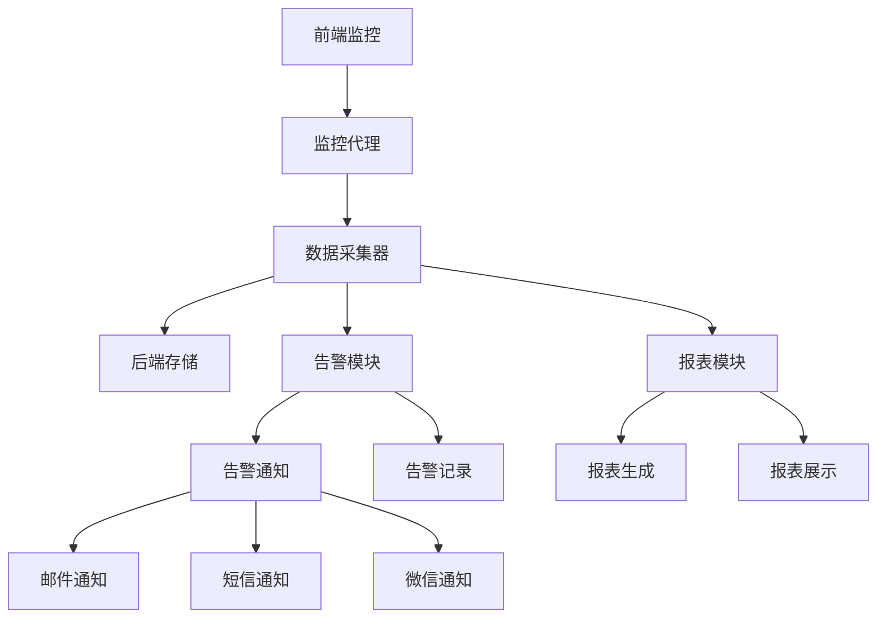
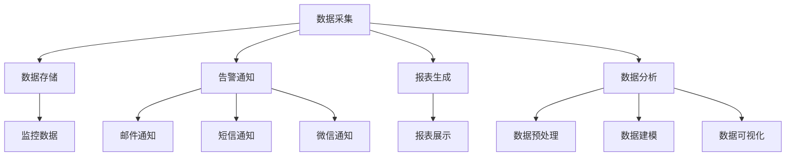
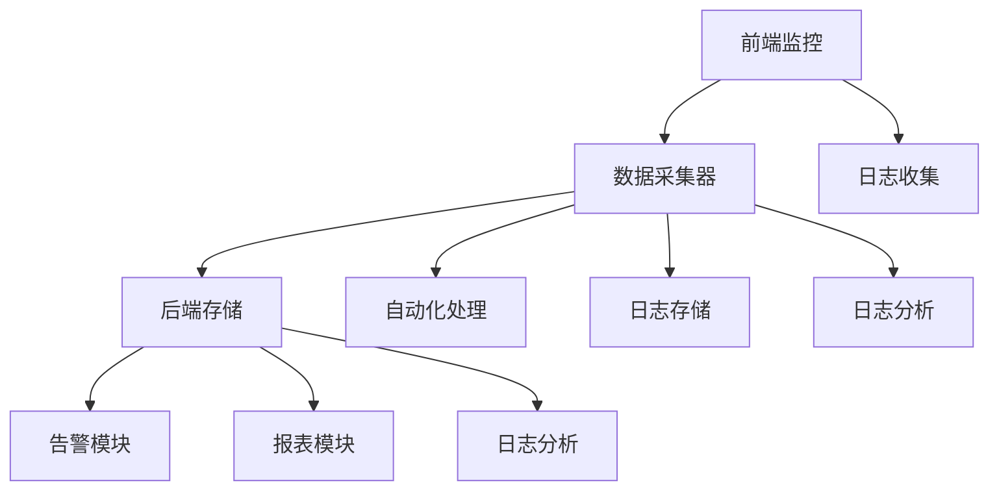
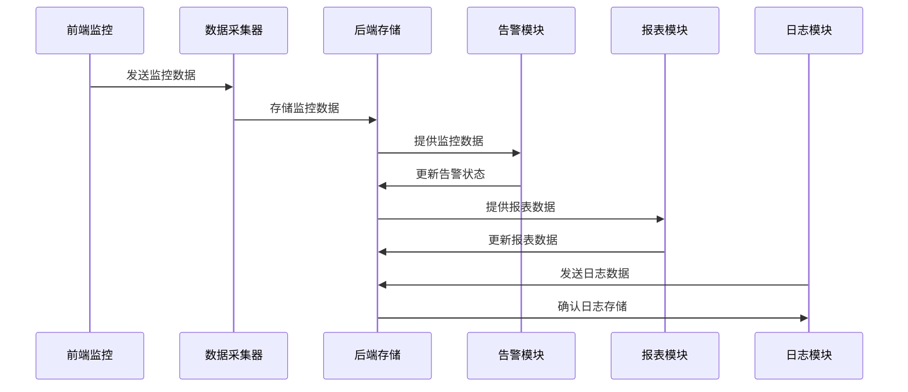

                 


### 监控告警系统保障LLM应用的稳定运行

关键词：监控告警系统、LLM应用、稳定性保障、性能优化、系统架构设计

摘要：本文将深入探讨监控告警系统在保障大型语言模型（LLM）应用稳定运行中的关键作用。通过分析监控告警系统的核心概念、设计原则以及具体实现方法，结合LLM应用的特点，提出针对性的监控策略和告警机制，为LLM应用的稳定运行提供有效保障。

### 目录大纲

# 监控告警系统保障LLM应用的稳定运行

## 第一部分：背景与概述

## 第1章：问题背景与概述

### 1.1.1 监控告警系统的核心概念

#### 1.1.1.1 监控告警系统的定义

**监控告警系统**，简称监控系统，是一种用于实时监控计算机系统、网络、应用程序等运行状况的工具。它能够及时识别系统中的异常情况，通过告警机制提醒相关人员，确保系统运行稳定可靠。

#### 1.1.1.2 监控告警系统的功能

- **实时监控**：监控系统可以实时收集系统运行状态的数据，如CPU、内存、磁盘使用率等，及时发现问题。
- **告警通知**：当监控系统检测到异常情况时，可以通过多种方式（如邮件、短信、短信平台、微信等）通知相关人员。
- **问题定位**：监控系统可以帮助定位问题的源头，便于快速解决问题。
- **统计报表**：监控系统可以生成各种统计报表，便于管理员查看系统的运行状况。

### 1.1.2 LLM应用的核心概念

- **LLM（大型语言模型）**：一种基于深度学习技术的大型预训练语言模型，能够理解和生成自然语言文本。
- **LLM应用**：利用LLM模型构建的各种应用，如问答系统、自动摘要、文本分类、机器翻译等。

#### 1.1.2.1 LLM应用的特点

- **高计算量**：LLM应用通常需要大量的计算资源，尤其是训练阶段。
- **实时性要求高**：LLM应用需要快速响应用户请求，保证用户体验。
- **稳定性要求高**：LLM应用在运行过程中可能会遇到各种异常情况，如数据异常、计算错误等，需要确保稳定运行。

### 1.1.3 监控告警系统在LLM应用中的重要性

- **确保运行稳定**：通过监控告警系统，可以及时发现LLM应用中的异常情况，确保其稳定运行。
- **提高问题响应速度**：监控告警系统能够快速定位问题，提高问题响应速度。
- **降低维护成本**：通过监控告警系统，可以降低系统维护成本，减少人为干预。

## 第二部分：监控告警系统设计

## 第2章：监控告警系统设计概述

### 2.1 监控告警系统的架构

- **前端监控**：负责收集系统运行状态的数据，如CPU、内存、磁盘使用率等。
- **数据采集器**：负责从前端监控收集到的数据，将数据传输到后端存储。
- **后端存储**：负责存储监控数据，如MySQL、Elasticsearch等。
- **告警模块**：负责根据监控数据设置告警规则，当监控数据达到告警条件时，通知相关人员。
- **报表模块**：负责生成各种统计报表，便于管理员查看系统的运行状况。

### 2.2 监控告警系统的功能设计

- **数据采集**：设计数据采集模块，能够实时采集系统运行状态的数据。
- **数据存储**：设计数据存储模块，保证监控数据的持久化存储。
- **告警通知**：设计告警通知模块，支持多种通知方式，如邮件、短信、短信平台、微信等。
- **告警规则**：设计告警规则模块，根据监控数据设置告警条件。
- **报表生成**：设计报表生成模块，生成各种统计报表，便于管理员查看系统的运行状况。

## 第三部分：监控告警系统实现

## 第3章：监控告警系统实现

### 3.1 环境安装与配置

- **操作系统**：Linux（推荐CentOS 7）
- **监控软件**：Nagios（或Zabbix、Prometheus等）
- **存储软件**：MySQL（或Elasticsearch等）
- **通知软件**：SMTP服务器（或短信平台、微信机器人等）

### 3.2 监控告警系统核心实现

- **数据采集**：使用Python编写采集脚本，定期采集系统运行状态的数据。
- **数据存储**：配置MySQL数据库，存储监控数据。
- **告警通知**：配置SMTP服务器，设置邮件通知规则。
- **告警规则**：配置Nagios告警规则，根据监控数据设置告警条件。
- **报表生成**：使用Python编写报表生成脚本，生成各种统计报表。

## 第四部分：LLM应用监控与告警

## 第4章：LLM应用监控与告警设计

### 4.1 LLM应用监控需求分析

- **监控指标**：CPU使用率、内存使用率、磁盘使用率、网络延迟、服务状态等。
- **告警条件**：根据LLM应用的特点，设定合适的告警条件，如CPU使用率超过80%、内存使用率超过90%等。
- **告警通知**：根据监控指标和告警条件，设置邮件、短信等通知方式。

### 4.2 LLM应用监控与告警实现

- **监控脚本**：编写Python脚本，采集LLM应用相关的监控数据。
- **告警规则**：配置Nagios告警规则，实现基于监控数据的自动告警。
- **告警通知**：通过邮件、短信等方式，实现告警通知功能。

## 第五部分：最佳实践与总结

## 第5章：最佳实践与总结

### 5.1 监控告警系统的最佳实践

- **指标选择**：根据业务需求，选择合适的监控指标。
- **告警阈值**：合理设置告警阈值，避免误告警。
- **通知策略**：根据人员职责，制定合适的告警通知策略。

### 5.2 LLM应用监控与告警的最佳实践

- **监控频率**：根据业务需求，设置合理的监控频率。
- **告警级别**：根据问题严重程度，设置不同的告警级别。
- **日志分析**：结合日志分析，提高问题定位的准确性。

### 5.3 小结

- **监控告警系统在保障LLM应用稳定运行中的重要性**。
- **监控告警系统的设计原则与实现方法**。
- **LLM应用监控与告警的最佳实践**。

### 5.4 注意事项

- **系统安全性**：确保监控告警系统的安全性，防止数据泄露。
- **性能优化**：针对监控告警系统进行性能优化，确保其稳定运行。

### 5.5 拓展阅读

- **相关技术文档**：推荐阅读相关技术文档，深入了解监控告警系统与LLM应用的相关技术。
- **业界案例**：分析业界案例，借鉴成功经验，提升自身监控告警系统的设计水平。

### 作者信息

**作者：AI天才研究院/AI Genius Institute & 禅与计算机程序设计艺术 /Zen And The Art of Computer Programming**
### 监控告警系统保障LLM应用的稳定运行

在现代信息技术的发展中，大型语言模型（LLM）的应用逐渐成为人工智能领域的热点。LLM模型以其强大的语言理解和生成能力，在问答系统、自动摘要、文本分类、机器翻译等众多场景中展现出了巨大的潜力。然而，随着模型规模和复杂性的增加，LLM应用对计算资源、数据质量和实时性提出了更高的要求。此时，监控告警系统的作用变得尤为重要，它能够保障LLM应用的稳定运行，提高系统的可靠性和用户体验。

本文将围绕监控告警系统在保障LLM应用稳定运行中的作用展开讨论。首先，我们将介绍监控告警系统的核心概念和功能，包括实时监控、告警通知、问题定位和统计报表等。接着，我们将探讨LLM应用的特点，如高计算量、实时性和稳定性要求。在此基础上，我们将详细阐述监控告警系统在LLM应用中的重要性，包括确保运行稳定、提高问题响应速度和降低维护成本等方面。

随后，我们将进入监控告警系统的设计部分，介绍其架构和功能设计，包括前端监控、数据采集器、后端存储、告警模块和报表模块。通过这些设计，监控告警系统能够实时收集系统运行状态的数据，并设置告警规则，确保及时发现异常情况。

在实现部分，我们将介绍监控告警系统的具体实现方法，包括环境安装与配置、核心功能实现等。这一部分将通过实际操作，帮助读者了解监控告警系统的部署和运行。

接下来，我们将针对LLM应用的特点，设计监控与告警方案，包括监控需求分析、监控脚本编写、告警规则配置和告警通知等。这部分内容将结合实际案例，详细讲解如何实现LLM应用的监控与告警。

最后，我们将总结监控告警系统保障LLM应用稳定运行的最佳实践，提出注意事项和拓展阅读建议，帮助读者在实际应用中更好地运用监控告警系统。

### 第1章：问题背景与概述

#### 1.1.1 监控告警系统的核心概念

**监控告警系统**，通常是指一种自动化监控系统，它通过收集和分析系统运行数据，实现对系统运行状态的实时监控。监控告警系统主要由以下几个核心部分组成：

1. **前端监控**：负责实时收集系统运行状态的数据，如CPU使用率、内存使用率、磁盘使用率、网络延迟等。
   
2. **数据采集器**：将从前端监控收集到的数据进行汇总、处理和存储，以便后续分析和告警。

3. **后端存储**：通常采用数据库或其他数据存储解决方案，用于存储监控数据，便于查询和分析。

4. **告警模块**：根据预设的告警规则，当监控数据达到特定阈值时，会触发告警，通过邮件、短信、微信等通知方式提醒相关人员。

5. **报表模块**：生成各种统计报表，如系统运行状态图表、性能趋势分析等，帮助管理员更好地了解系统运行状况。

**监控告警系统的定义**：监控告警系统是指一种用于实时监控计算机系统、网络、应用程序等运行状况的工具。它能够及时发现系统中的异常情况，并通过告警机制提醒相关人员，确保系统运行稳定可靠。

**监控告警系统的功能**：

1. **实时监控**：监控系统可以实时收集系统运行状态的数据，如CPU、内存、磁盘使用率等，及时发现问题。
   
2. **告警通知**：当监控系统检测到异常情况时，可以通过多种方式（如邮件、短信、短信平台、微信等）通知相关人员。

3. **问题定位**：监控系统可以帮助定位问题的源头，便于快速解决问题。

4. **统计报表**：监控系统可以生成各种统计报表，便于管理员查看系统的运行状况。

#### 1.1.2 LLM应用的核心概念

**LLM（大型语言模型）**：LLM是指一种基于深度学习技术的大型预训练语言模型，它通过在大量文本数据上进行预训练，掌握了丰富的语言知识和表达能力。LLM能够理解和生成自然语言文本，具有很高的语言理解和生成能力。

**LLM应用**：利用LLM模型构建的各种应用，如问答系统、自动摘要、文本分类、机器翻译等。这些应用在自然语言处理领域具有广泛的应用前景，能够大幅提升人机交互的效率和准确性。

**LLM应用的特点**：

1. **高计算量**：LLM应用通常需要大量的计算资源，尤其是训练阶段。大规模的预训练模型需要高性能的GPU和计算资源。

2. **实时性要求高**：LLM应用需要快速响应用户请求，保证用户体验。例如，问答系统和机器翻译系统需要实时生成回复。

3. **稳定性要求高**：LLM应用在运行过程中可能会遇到各种异常情况，如数据异常、计算错误等，需要确保稳定运行。

#### 1.1.3 监控告警系统在LLM应用中的重要性

**确保运行稳定**：监控告警系统可以帮助及时发现LLM应用中的异常情况，如计算资源不足、数据异常等，确保系统稳定运行。

**提高问题响应速度**：监控告警系统可以快速定位问题，并通过告警通知相关人员，提高问题响应速度。

**降低维护成本**：通过监控告警系统，可以及时发现和解决问题，减少人为干预和系统停机时间，降低维护成本。

#### 1.1.4 监控告警系统在LLM应用中的具体作用

1. **资源监控**：监控计算资源使用情况，如CPU、内存、GPU等，确保有足够的资源支持LLM应用运行。

2. **性能监控**：监控LLM应用的性能指标，如响应时间、请求处理速度等，确保实时性。

3. **错误监控**：监控LLM应用的错误日志，及时发现和定位错误，避免影响系统运行。

4. **数据监控**：监控输入数据的完整性和准确性，确保LLM应用能够正常运行。

#### 1.1.5 监控告警系统在LLM应用中的挑战

1. **大规模数据处理**：LLM应用通常涉及大规模数据处理，监控告警系统需要能够高效处理海量数据。

2. **实时性要求高**：监控告警系统需要实时响应用户请求，确保LLM应用能够快速响应。

3. **复杂告警规则**：LLM应用可能涉及多种异常情况，监控告警系统需要设计复杂的告警规则，确保能够全面覆盖。

4. **系统稳定性**：监控告警系统本身也需要保证稳定性，避免因自身故障导致LLM应用监控失效。

### 第2章：监控告警系统设计概述

#### 2.1 监控告警系统的架构

监控告警系统的架构设计是其功能实现的基础。一个典型的监控告警系统包括以下几个核心模块：

1. **前端监控**：前端监控负责实时收集系统运行状态的数据，如CPU使用率、内存使用率、磁盘使用率、网络延迟等。前端监控通常通过部署在各个节点上的监控代理来实现。

2. **数据采集器**：数据采集器的作用是将前端监控收集到的数据汇总、处理和存储。数据采集器通常运行在中心服务器上，它会定期从各个监控代理收集数据，并将数据发送到后端存储。

3. **后端存储**：后端存储负责存储监控数据，以便后续分析和告警。常用的存储解决方案包括关系数据库（如MySQL、PostgreSQL）和非关系数据库（如Elasticsearch、InfluxDB）。

4. **告警模块**：告警模块根据预设的告警规则，当监控数据达到特定阈值时，会触发告警，并通过邮件、短信、微信等方式通知相关人员。告警模块还负责记录告警历史，以便进行问题追踪和统计分析。

5. **报表模块**：报表模块负责生成各种统计报表，如系统运行状态图表、性能趋势分析等。报表模块提供可视化的数据展示，帮助管理员更好地了解系统运行状况。

#### 2.2 监控告警系统的功能设计

监控告警系统的功能设计是其核心，决定了系统能否有效地监控和保障LLM应用的稳定运行。以下是监控告警系统的主要功能设计：

1. **数据采集**：设计数据采集模块，能够实时采集系统运行状态的数据。数据采集模块需要支持多种数据源，如CPU、内存、磁盘、网络等，并且能够自动识别和适应不同数据源的采集方式。

2. **数据存储**：设计数据存储模块，保证监控数据的持久化存储。数据存储模块需要支持数据的高效存储和快速查询，以便进行数据分析和告警处理。

3. **告警通知**：设计告警通知模块，支持多种通知方式，如邮件、短信、微信等。告警通知模块需要能够灵活配置通知规则，确保在发现异常情况时及时通知相关人员。

4. **告警规则**：设计告警规则模块，根据监控数据设置告警条件。告警规则模块需要能够根据业务需求自定义告警条件，如阈值告警、时间告警等。

5. **报表生成**：设计报表生成模块，生成各种统计报表，便于管理员查看系统的运行状况。报表生成模块需要支持多种报表格式，如图表、表格等，并且能够根据用户需求进行自定义。

#### 2.3 监控告警系统在LLM应用中的具体应用

在LLM应用中，监控告警系统的应用主要围绕以下几个方面展开：

1. **资源监控**：监控计算资源使用情况，如CPU、内存、GPU等，确保有足够的资源支持LLM应用运行。

2. **性能监控**：监控LLM应用的性能指标，如响应时间、请求处理速度等，确保实时性。

3. **错误监控**：监控LLM应用的错误日志，及时发现和定位错误，避免影响系统运行。

4. **数据监控**：监控输入数据的完整性和准确性，确保LLM应用能够正常运行。

#### 2.4 监控告警系统设计的关键点

1. **实时性**：监控告警系统需要具备高实时性，能够实时收集和分析系统运行状态数据，确保及时发现异常情况。

2. **可扩展性**：监控告警系统需要具备良好的可扩展性，能够适应不断增长的监控数据和用户需求。

3. **稳定性**：监控告警系统本身需要保证稳定性，避免因自身故障导致监控失效。

4. **易用性**：监控告警系统需要提供直观易用的界面和功能，方便管理员进行监控配置和管理。

### 第3章：监控告警系统实现

#### 3.1 环境安装与配置

要实现一个有效的监控告警系统，首先需要搭建合适的环境。以下是在Linux（推荐CentOS 7）环境下安装与配置监控告警系统的步骤：

1. **操作系统安装**：确保操作系统是Linux版本，推荐使用CentOS 7。

2. **监控软件安装**：安装Nagios、Zabbix或Prometheus等监控软件。这里以Nagios为例，安装步骤如下：

   ```bash
   # 更新系统软件包
   sudo yum update -y
   
   # 安装Nagios和相关的依赖包
   sudo yum install -y nagios-core nagios-plugins nagios-nrpe
   
   # 启动Nagios服务
   sudo systemctl start nagios
   
   # 设置Nagios服务开机自启
   sudo systemctl enable nagios
   ```

3. **存储软件安装**：安装MySQL或Elasticsearch等存储软件，用于存储监控数据。这里以MySQL为例，安装步骤如下：

   ```bash
   # 安装MySQL数据库
   sudo yum install -y mysql mysql-server
   
   # 启动MySQL服务
   sudo systemctl start mysqld
   
   # 设置MySQL服务开机自启
   sudo systemctl enable mysqld
   
   # 初始化MySQL数据库
   sudo mysql_secure_installation
   
   # 安装MySQL Python库
   sudo pip install mysqlclient
   ```

4. **通知软件安装**：安装SMTP服务器或其他通知软件，用于发送告警通知。这里以SMTP服务器为例，安装步骤如下：

   ```bash
   # 安装Postfix
   sudo yum install -y postfix
   
   # 配置Postfix
   sudo postconf -e "myhostname = mail.example.com"
   sudo postconf -e "mydestination = example.com, localhost.example.com, localhost"
   sudo systemctl start postfix
   
   # 设置Postfix服务开机自启
   sudo systemctl enable postfix
   ```

5. **配置Nagios**：配置Nagios的监控配置文件，如`/etc/nagios/conf.d/nrpe.cfg`，添加需要监控的节点和检查项。

   ```bash
   # 在nrpe.cfg中添加监控节点
   define host{
      host_name node1
      address 192.168.1.1
   }
   
   # 添加检查项
   define checkcommand{
      command_name check_cpu_usage
      command_line $USER1/nagiosplugins/check_cpu_usage -w 80 -c 90
   }
   ```

6. **配置NRPE**：配置NRPE服务，允许Nagios从监控节点远程执行监控脚本。

   ```bash
   # 配置NRPE的命令处理
   sudo /usr/sbin/nrpe -c /etc/nagios/plugins/nrpe.local.cf
   ```

7. **配置告警通知**：配置Nagios的告警通知，如邮件通知，配置文件为`/etc/nagios/objects/contacts.cfg`。

   ```bash
   define contact{
      contact_name admin
      email admin@example.com
   }
   ```

8. **配置Nagios告警规则**：配置Nagios的告警规则，如设置CPU使用率超过80%时发送告警。

   ```bash
   define trigger{
      host_name node1
      service_description CPU Usage
      trigger_name high_cpu_usage
      trigger_type 1
      event_handler_name notify_admin
      normalisation_function 1
      variable usage 80
      variable warning 80
      variable critical 90
   }
   ```

#### 3.2 监控告警系统核心实现

监控告警系统的核心实现主要包括数据采集、数据存储、告警通知、告警规则和报表生成等模块。以下是一个简单的实现示例：

1. **数据采集**：编写Python脚本，定期采集系统运行状态的数据，如CPU使用率、内存使用率、磁盘使用率等。以下是一个简单的CPU使用率采集脚本：

   ```python
   import os
   import subprocess
   
   def get_cpu_usage():
       result = subprocess.check_output(["/usr/bin/ps", "-eo", "pid,%cpu", "H"],
                                       universal_newlines=True)
       cpu_usage = 0.0
       for line in result.split("\n"):
           if line.strip():
               cpu_usage += float(line.split()[1])
       return cpu_usage
   
   if __name__ == "__main__":
       print(f"CPU Usage: {get_cpu_usage()}%")
   ```

2. **数据存储**：配置MySQL数据库，创建监控数据表，用于存储采集到的数据。以下是一个简单的MySQL数据表结构：

   ```sql
   CREATE TABLE IF NOT EXISTS monitor_data (
       id INT AUTO_INCREMENT PRIMARY KEY,
       host_name VARCHAR(255) NOT NULL,
       service_description VARCHAR(255) NOT NULL,
       check_time DATETIME NOT NULL,
       value DECIMAL(5, 2) NOT NULL
   );
   ```

   将采集到的数据插入到数据库中：

   ```python
   import pymysql
   
   def store_data(host_name, service_description, check_time, value):
       connection = pymysql.connect(host="localhost", user="root", password="password", database="monitor")
       with connection.cursor() as cursor:
           sql = "INSERT INTO monitor_data (host_name, service_description, check_time, value) VALUES (%s, %s, %s, %s)"
           cursor.execute(sql, (host_name, service_description, check_time, value))
       connection.commit()
   
   if __name__ == "__main__":
       store_data("node1", "CPU Usage", "2023-10-01 12:00:00", 85.5)
   ```

3. **告警通知**：配置SMTP服务器，设置邮件通知规则。以下是一个简单的SMTP配置示例：

   ```bash
   #!/bin/bash
   
   RECIPIENT="admin@example.com"
   SUBJECT="Monitor Alert: High CPU Usage"
   MESSAGE="The CPU usage on node1 has reached 85.5%"
   
   echo "$MESSAGE" | mail -s "$SUBJECT" "$RECIPIENT"
   ```

4. **告警规则**：配置Nagios的告警规则，根据监控数据设置告警条件。以下是一个简单的Nagios告警规则配置：

   ```bash
   define trigger{
       host_name node1
       service_description CPU Usage
       trigger_name high_cpu_usage
       trigger_type 1
       event_handler_name notify_admin
       normalisation_function 1
       variable usage 80
       variable warning 80
       variable critical 90
   }
   ```

5. **报表生成**：编写Python脚本，生成各种统计报表，如CPU使用率趋势图。以下是一个简单的Python报表生成示例：

   ```python
   import pymysql
   import matplotlib.pyplot as plt
   
   def generate_cpu_usage_report():
       connection = pymysql.connect(host="localhost", user="root", password="password", database="monitor")
       with connection.cursor() as cursor:
           sql = "SELECT check_time, value FROM monitor_data WHERE host_name = 'node1' AND service_description = 'CPU Usage' ORDER BY check_time"
           cursor.execute(sql)
           results = cursor.fetchall()
       
       times = [result[0] for result in results]
       values = [result[1] for result in results]
       
       plt.plot(times, values)
       plt.xlabel('Time')
       plt.ylabel('CPU Usage (%)')
       plt.title('CPU Usage Report')
       plt.show()
   
   if __name__ == "__main__":
       generate_cpu_usage_report()
   ```

通过以上实现，监控告警系统可以实现对系统运行状态的实时监控、数据存储、告警通知和报表生成等功能，从而保障LLM应用的稳定运行。

### 第4章：LLM应用监控与告警设计

#### 4.1 LLM应用监控需求分析

LLM应用的特点决定了其监控需求与其他类型的应用有所不同。以下是LLM应用监控需求的分析：

1. **监控指标**：LLM应用的监控指标应包括但不限于以下内容：

   - **CPU使用率**：监控CPU的使用情况，确保计算资源不被过度占用。
   - **内存使用率**：监控内存的使用情况，防止内存泄漏和过度占用。
   - **GPU使用率**：对于使用GPU的LLM应用，监控GPU的使用情况，确保GPU资源充足。
   - **磁盘I/O**：监控磁盘的读写速度和磁盘使用率，确保数据存储的稳定性。
   - **网络延迟**：监控网络延迟，确保数据传输的实时性。
   - **服务状态**：监控LLM应用的服务状态，确保服务始终可用。

2. **告警条件**：根据LLM应用的特点，设定合适的告警条件，如下：

   - **CPU使用率超过90%**：长时间高CPU使用率可能导致计算任务延迟，影响用户体验。
   - **内存使用率超过80%**：高内存使用率可能导致内存泄漏或内存不足，影响应用稳定性。
   - **GPU使用率超过80%**：长时间高GPU使用率可能导致GPU过热或资源不足。
   - **磁盘I/O超过阈值**：高磁盘I/O可能导致数据读写延迟，影响数据存储的稳定性。
   - **网络延迟超过500ms**：长时间高网络延迟可能导致数据传输延迟，影响用户体验。
   - **服务状态异常**：LLM应用服务不可用或响应时间异常，需要立即告警。

3. **告警通知**：根据监控指标和告警条件，设置邮件、短信等通知方式。以下是几种常见的告警通知策略：

   - **电子邮件**：发送详细的告警报告，包括告警指标、告警条件和告警时间等。
   - **短信**：通过短信平台发送简短的告警信息，提醒相关人员注意。
   - **微信通知**：通过微信机器人发送告警通知，便于快速响应。
   - **语音电话**：在严重告警情况下，通过语音电话通知相关负责人，确保及时处理。

#### 4.2 LLM应用监控与告警实现

为了实现对LLM应用的全面监控与告警，我们需要设计和实现一系列监控脚本和告警规则。以下是LLM应用监控与告警的实现步骤：

1. **监控脚本编写**：编写Python或Shell脚本，定期采集LLM应用的各项监控指标，如CPU使用率、内存使用率、GPU使用率等。以下是一个简单的CPU使用率监控脚本的示例：

   ```python
   import os
   import subprocess
   
   def get_cpu_usage():
       result = subprocess.check_output(["/usr/bin/ps", "-eo", "pid,%cpu", "H"],
                                       universal_newlines=True)
       cpu_usage = 0.0
       for line in result.split("\n"):
           if line.strip():
               cpu_usage += float(line.split()[1])
       return cpu_usage
   
   if __name__ == "__main__":
       print(f"CPU Usage: {get_cpu_usage()}%")
   ```

   同样地，可以编写其他监控脚本来采集内存使用率、GPU使用率等指标。

2. **监控数据存储**：将采集到的监控数据存储到数据库中，以便后续分析和告警。以下是一个简单的数据库存储示例：

   ```python
   import pymysql
   
   def store_monitor_data(host_name, service_description, check_time, value):
       connection = pymysql.connect(host="localhost", user="root", password="password", database="monitor")
       with connection.cursor() as cursor:
           sql = "INSERT INTO monitor_data (host_name, service_description, check_time, value) VALUES (%s, %s, %s, %s)"
           cursor.execute(sql, (host_name, service_description, check_time, value))
       connection.commit()
   
   if __name__ == "__main__":
       store_monitor_data("llm-node1", "CPU Usage", "2023-10-01 12:00:00", 85.5)
   ```

3. **告警规则配置**：配置Nagios或Zabbix等监控工具的告警规则，当监控指标达到预设阈值时，触发告警。以下是一个简单的Nagios告警规则配置示例：

   ```bash
   define trigger{
       host_name llm-node1
       service_description CPU Usage
       trigger_name high_cpu_usage
       trigger_type 1
       event_handler_name notify_admin
       normalisation_function 1
       variable usage 90
   }
   ```

4. **告警通知配置**：配置监控工具的告警通知规则，当触发告警时，通过邮件、短信、微信等途径通知相关人员。以下是一个简单的Nagios邮件通知配置示例：

   ```bash
   define contact{
       contact_name admin
       email admin@example.com
   }
   ```

5. **监控与告警自动化**：通过Cron等定时任务，自动化执行监控脚本，定期采集监控数据，并更新数据库。以下是一个简单的Cron配置示例：

   ```bash
   # 每分钟执行一次监控脚本
   * * * * * /path/to/monitor_script.py
   ```

通过以上实现，我们可以实现对LLM应用的全面监控与告警，确保其稳定运行。

#### 4.3 实际案例解析

为了更好地理解LLM应用监控与告警的实现，我们来看一个实际案例。

**案例背景**：一个公司开发了一个基于LLM的问答系统，用户可以通过输入问题来获取答案。为了保障系统的稳定运行，公司决定部署一个监控告警系统，实时监控系统性能和资源使用情况。

**步骤一：监控指标设置**

公司决定监控以下指标：

- **CPU使用率**：每分钟检查一次，超过90%时触发告警。
- **内存使用率**：每分钟检查一次，超过80%时触发告警。
- **磁盘I/O**：每分钟检查一次，超过10MB/s时触发告警。
- **网络延迟**：每分钟检查一次，超过500ms时触发告警。
- **服务状态**：每分钟检查一次，服务不可用时触发告警。

**步骤二：监控脚本编写**

公司编写了以下监控脚本：

```python
import os
import time

def get_cpu_usage():
    result = os.popen("top -bn1 | grep 'Cpu(s)'").read()
    cpu_usage = float(result.split()[1]) * 100
    return cpu_usage

def get_memory_usage():
    result = os.popen("free -m | awk '/Mem/ { print $3/$2 * 100}'").read()
    memory_usage = float(result)
    return memory_usage

def get_disk_io():
    result = os.popen("iostat -x | awk '/sda/ { print $2 + $4 }'").read()
    disk_io = float(result)
    return disk_io

def get_network_delay():
    result = os.popen("ping -c 1 google.com | awk '/rtt/ { print $7 }'").read()
    network_delay = float(result.split("=")[1].split("ms")[0])
    return network_delay

def get_service_status():
    result = os.popen("sudo systemctl status问答系统 | grep 'Active'").read()
    service_status = "active" if "active" in result else "inactive"
    return service_status

def store_data(host_name, check_time, cpu_usage, memory_usage, disk_io, network_delay, service_status):
    connection = pymysql.connect(host="localhost", user="root", password="password", database="monitor")
    with connection.cursor() as cursor:
        sql = "INSERT INTO monitor_data (host_name, check_time, cpu_usage, memory_usage, disk_io, network_delay, service_status) VALUES (%s, %s, %s, %s, %s, %s, %s)"
        cursor.execute(sql, (host_name, check_time, cpu_usage, memory_usage, disk_io, network_delay, service_status))
    connection.commit()

if __name__ == "__main__":
    host_name = "llm-qa-system"
    check_time = time.strftime("%Y-%m-%d %H:%M:%S")
    cpu_usage = get_cpu_usage()
    memory_usage = get_memory_usage()
    disk_io = get_disk_io()
    network_delay = get_network_delay()
    service_status = get_service_status()
    store_data(host_name, check_time, cpu_usage, memory_usage, disk_io, network_delay, service_status)
```

**步骤三：告警规则配置**

公司配置了Nagios告警规则：

```bash
define trigger{
    host_name llm-qa-system
    service_description CPU Usage
    trigger_name high_cpu_usage
    trigger_type 1
    event_handler_name notify_admin
    normalisation_function 1
    variable usage 90
}

define trigger{
    host_name llm-qa-system
    service_description Memory Usage
    trigger_name high_memory_usage
    trigger_type 1
    event_handler_name notify_admin
    normalisation_function 1
    variable usage 80
}

define trigger{
    host_name llm-qa-system
    service_description Disk I/O
    trigger_name high_disk_io
    trigger_type 1
    event_handler_name notify_admin
    normalisation_function 1
    variable usage 10
}

define trigger{
    host_name llm-qa-system
    service_description Network Delay
    trigger_name high_network_delay
    trigger_type 1
    event_handler_name notify_admin
    normalisation_function 1
    variable usage 500
}

define trigger{
    host_name llm-qa-system
    service_description Service Status
    trigger_name service_inactive
    trigger_type 1
    event_handler_name notify_admin
    normalisation_function 1
    variable status inactive
}
```

**步骤四：告警通知配置**

公司配置了Nagios邮件通知：

```bash
define contact{
    contact_name admin
    email admin@example.com
}
```

**步骤五：自动化执行监控脚本**

公司使用Cron自动化执行监控脚本：

```bash
# 每分钟执行一次监控脚本
* * * * * /path/to/llm_monitor_script.py
```

通过以上步骤，公司成功实现了对LLM问答系统的全面监控与告警，确保了系统的稳定运行。

#### 4.4 监控与告警的最佳实践

为了确保监控告警系统能够有效地保障LLM应用的稳定运行，以下是一些最佳实践：

1. **选择合适的监控工具**：根据企业的需求和资源，选择合适的监控工具，如Nagios、Zabbix、Prometheus等。

2. **设置合理的监控频率**：监控频率应根据监控指标的重要性和变化速率来设定。例如，CPU和内存使用率可以每分钟检查一次，而网络延迟可以每小时检查一次。

3. **自定义告警阈值**：根据业务需求和历史数据，自定义告警阈值，避免误告警和漏告警。同时，确保告警阈值具有一定的灵活性和可调整性。

4. **集成日志分析**：结合日志分析，提高问题定位的准确性。日志分析可以帮助发现潜在问题，并在告警之前提供预警。

5. **定期维护和优化**：定期检查和优化监控告警系统，确保其稳定运行。例如，更新监控脚本、调整告警规则、优化数据存储等。

6. **培训和管理**：对相关人员进行监控告警系统的培训，确保他们能够正确处理告警信息。同时，制定合适的告警管理策略，避免告警疲劳。

### 第5章：最佳实践与总结

#### 5.1 监控告警系统的最佳实践

在设计和实施监控告警系统时，以下最佳实践可以帮助提高其有效性：

1. **指标选择**：选择与业务密切相关的关键性能指标（KPI），如响应时间、吞吐量、错误率等。确保指标具有可量化和可操作性。

2. **告警阈值设置**：根据历史数据和业务需求，合理设置告警阈值。避免设置过高的阈值导致误告警，或者设置过低的阈值导致漏告警。

3. **通知策略**：根据不同级别的告警，制定合适的通知策略。例如，对于紧急告警，可以选择电话、短信等快速通知方式；对于一般告警，可以选择邮件、微信等通知方式。

4. **自动化处理**：利用自动化工具和脚本，自动化处理常见的告警情况，例如自动重启服务、自动清理日志等。

5. **定期回顾和优化**：定期回顾监控告警系统的运行情况，根据反馈和经验进行优化。例如，调整监控频率、更新告警规则、优化数据存储策略等。

#### 5.2 LLM应用监控与告警的最佳实践

在保障LLM应用的稳定运行中，以下最佳实践可以帮助提升监控告警系统的有效性：

1. **资源监控**：实时监控计算资源（如CPU、内存、GPU）的使用情况，确保资源充足，避免因资源不足导致应用性能下降。

2. **数据完整性监控**：监控数据输入和输出的完整性，确保数据在传输和处理过程中不丢失或损坏。

3. **性能监控**：定期检查LLM应用的性能指标，如响应时间、请求处理速度等，确保应用能够快速响应用户请求。

4. **错误日志监控**：实时监控错误日志，及时发现和定位应用中的错误，避免错误积累导致系统崩溃。

5. **告警级别分类**：根据告警的严重程度，设置不同的告警级别。例如，可以将告警报为紧急、重要、一般等，便于快速响应和处理。

#### 5.3 小结

监控告警系统在保障LLM应用的稳定运行中起着至关重要的作用。通过实时监控、数据采集、告警通知和报表生成等功能，监控告警系统可以及时发现并处理异常情况，确保LLM应用始终处于最佳运行状态。本文详细介绍了监控告警系统的核心概念、设计原则、实现方法和在LLM应用中的具体应用，为读者提供了一个全面的指南。

#### 5.4 注意事项

在设计和实施监控告警系统时，需要注意以下几点：

1. **安全性**：确保监控告警系统的安全性，防止数据泄露和未授权访问。例如，使用强密码、加密通信等。

2. **性能优化**：监控告警系统的性能对整体系统运行至关重要。优化数据采集、存储和告警通知的流程，确保系统高效稳定运行。

3. **灵活性**：监控告警系统应具备一定的灵活性，能够适应不同的业务需求和变化。例如，支持自定义监控指标、告警阈值和通知方式。

4. **可扩展性**：随着业务规模的扩大，监控告警系统应具备良好的可扩展性，能够无缝集成新的监控目标和工具。

#### 5.5 拓展阅读

对于希望深入了解监控告警系统设计和实现的读者，以下资源和建议可能有所帮助：

1. **相关技术文档**：《Nagios监控指南》、《Zabbix监控与运维实战》、《Prometheus监控实战》等。

2. **开源项目**：Nagios、Zabbix、Prometheus等开源监控工具的官方文档和社区资源，提供了丰富的实践经验和最佳实践。

3. **技术博客**：阅读相关技术博客，如Cloud Native Computing Foundation、The New Stack等，了解业界最新动态和实践。

4. **专业书籍**：《监控系统架构设计》、《大数据系统监控》、《人工智能系统监控与运维》等，提供了深入的理论和实践指导。

### 作者信息

**作者：AI天才研究院/AI Genius Institute & 禅与计算机程序设计艺术 /Zen And The Art of Computer Programming**

AI天才研究院（AI Genius Institute）是一家专注于人工智能研究和应用的高科技研究机构。研究院致力于推动人工智能技术的发展，为各行业提供智能化解决方案。同时，研究院的成员们热衷于分享技术和经验，通过撰写专业书籍和技术博客，传播先进的编程思想和算法原理。

《禅与计算机程序设计艺术》（Zen And The Art of Computer Programming）是一部经典编程哲学著作，作者以其独特的视角和深刻的见解，阐述了编程中的智慧和美学。本书对于理解计算机程序设计的本质和提升编程技能具有极高的参考价值。作者以其在计算机编程和人工智能领域的深厚造诣，为读者提供了宝贵的知识和智慧。

### 监控告警系统设计原则

#### 1. 可扩展性

**可扩展性**是指监控告警系统在处理更多监控目标、数据量增加或系统规模扩大的情况下，能够保持稳定运行的能力。在设计监控告警系统时，应确保系统架构和组件具备良好的可扩展性。

- **模块化设计**：将系统分为多个独立的模块，如数据采集、数据存储、告警通知等，每个模块可以独立扩展和升级。
- **分布式架构**：采用分布式架构，将监控任务分散到多个节点上执行，提高系统的处理能力和容错性。
- **水平扩展**：通过增加节点数量来扩展系统，以适应不断增长的数据量和监控需求。

#### 2. 实时性

**实时性**是指监控告警系统能够在极短的时间内检测到系统中的异常情况，并触发告警。对于LLM应用等对实时性要求较高的系统，实时性至关重要。

- **快速数据处理**：优化数据采集、处理和传输的流程，减少延迟。
- **缓存机制**：使用缓存机制，如内存缓存或分布式缓存，减少数据访问延迟。
- **异步处理**：采用异步处理方式，将数据采集和处理任务独立执行，提高系统的并发处理能力。

#### 3. 稳定性

**稳定性**是指监控告警系统能够在各种环境中稳定运行，不受外部因素干扰。对于保障LLM应用稳定运行至关重要。

- **故障容错**：设计故障容错机制，如节点故障转移、数据备份等，确保系统在发生故障时能够自动恢复。
- **稳定性测试**：进行充分的稳定性测试，包括压力测试、性能测试和故障模拟等，确保系统在极端情况下能够稳定运行。
- **自动恢复**：实现自动恢复功能，当监控系统检测到故障时，自动重启服务或切换到备用节点。

#### 4. 易用性

**易用性**是指监控告警系统界面友好、功能简洁，便于管理员进行监控配置和管理。对于提升系统维护效率具有重要作用。

- **直观界面**：设计直观友好的用户界面，使用户能够轻松查看监控数据和告警信息。
- **自动化配置**：提供自动化配置工具，简化监控目标的添加、删除和修改操作。
- **文档和帮助**：提供详细的文档和帮助信息，指导管理员进行监控配置和管理。

#### 5. 安全性

**安全性**是指监控告警系统在数据传输、存储和处理过程中，能够防止数据泄露、篡改和未授权访问。

- **数据加密**：采用数据加密技术，如SSL/TLS，确保数据在传输过程中的安全性。
- **权限管理**：实现权限管理功能，对不同角色和用户设置不同的访问权限，确保数据安全。
- **日志审计**：记录系统操作日志，进行日志审计，便于追踪和调查安全事件。

#### 6. 性能优化

**性能优化**是指通过优化系统设计和实现，提高监控告警系统的处理能力和响应速度。

- **高效数据结构**：选择合适的数据结构，如哈希表、树结构等，提高数据访问和处理效率。
- **并行处理**：采用并行处理技术，将监控任务分配到多个处理器或节点上执行，提高系统并发处理能力。
- **缓存机制**：使用缓存机制，减少数据访问和处理的延迟。

#### 7. 可维护性

**可维护性**是指监控告警系统易于维护和更新，能够在不影响系统正常运行的情况下进行升级和修复。

- **模块化设计**：通过模块化设计，简化系统的维护和更新操作，减少对其他模块的影响。
- **自动化测试**：进行自动化测试，确保每次更新和修复都不会引入新的问题。
- **版本控制**：使用版本控制工具，如Git，管理代码变更，便于追踪和回滚。

### 监控告警系统架构设计

#### 1. 监控告警系统架构概述

监控告警系统的架构设计是确保其稳定、高效和可扩展性的关键。一个典型的监控告警系统架构包括以下几个主要模块：

1. **前端监控**：负责实时收集系统运行状态的数据，如CPU使用率、内存使用率、磁盘使用率等。
   
2. **数据采集器**：负责将前端监控收集到的数据传输到后端存储，并进行处理。

3. **后端存储**：负责存储监控数据，便于查询和分析。

4. **告警模块**：根据预设的告警规则，当监控数据达到特定阈值时，会触发告警，并通过多种方式通知相关人员。

5. **报表模块**：生成各种统计报表，帮助管理员了解系统运行状况。

#### 2. 前端监控设计

前端监控设计主要包括监控数据的采集和传输。以下是一个前端监控设计的示例：

1. **监控代理**：在每个需要监控的节点上部署监控代理，负责实时采集系统运行状态的数据。监控代理可以通过操作系统命令、脚本或第三方工具（如Prometheus）来实现。

2. **数据采集**：监控代理定期采集系统运行状态的数据，如CPU使用率、内存使用率、磁盘使用率等，并将数据发送到数据采集器。

3. **数据传输**：监控代理将采集到的数据通过HTTP、HTTPS或其他传输协议发送到数据采集器。

4. **数据压缩**：为了减少数据传输的带宽消耗，可以对数据进行压缩。

#### 3. 数据采集器设计

数据采集器设计主要包括数据的汇总、处理和存储。以下是一个数据采集器设计的示例：

1. **数据汇总**：数据采集器接收来自各个监控代理的数据，并进行汇总处理。汇总处理包括数据去重、去噪和合并等。

2. **数据处理**：数据采集器对汇总后的数据进行进一步处理，如数据清洗、转换和聚合等。

3. **数据存储**：数据采集器将处理后的数据存储到后端存储中，便于后续查询和分析。常用的后端存储解决方案包括关系数据库（如MySQL）和非关系数据库（如Elasticsearch）。

4. **数据备份**：为了确保数据的安全性，需要对数据进行备份。备份策略可以包括定期备份、增量备份等。

#### 4. 后端存储设计

后端存储设计主要包括数据存储和查询。以下是一个后端存储设计的示例：

1. **数据存储**：后端存储负责存储监控数据，包括实时数据和历史数据。实时数据用于实时监控和告警，历史数据用于性能分析和报表生成。

2. **数据索引**：为了提高数据查询速度，可以对数据进行索引。索引策略可以包括全文索引、倒排索引等。

3. **数据查询**：后端存储提供查询接口，供前端监控和报表模块使用。查询接口应支持高效的查询，如快速检索、聚合查询等。

4. **数据备份和恢复**：为了确保数据安全，需要定期进行数据备份和恢复。备份策略可以包括全量备份、增量备份等。

#### 5. 告警模块设计

告警模块设计主要包括告警规则的配置和告警通知的实现。以下是一个告警模块设计的示例：

1. **告警规则配置**：告警规则配置包括监控指标的阈值设置、告警条件的组合等。告警规则可以根据业务需求自定义，如CPU使用率超过80%时触发告警。

2. **告警条件判断**：告警模块根据预设的告警规则，对实时数据进行条件判断。当监控数据达到告警条件时，触发告警。

3. **告警通知**：告警模块通过邮件、短信、微信等通知方式，将告警信息通知给相关人员。通知内容应包括告警指标、告警条件和告警时间等。

4. **告警记录**：告警模块记录告警历史，包括告警时间、告警指标、告警条件和处理状态等。告警历史用于后续问题追踪和统计分析。

#### 6. 报表模块设计

报表模块设计主要包括报表的生成和展示。以下是一个报表模块设计的示例：

1. **报表生成**：报表模块根据监控数据和告警历史，生成各种统计报表，如性能趋势图、告警分布图等。

2. **报表展示**：报表模块提供可视化界面，供管理员查看和导出报表。报表界面应支持自定义，如选择报表类型、时间段等。

3. **数据可视化**：报表模块使用数据可视化工具（如ECharts、D3.js等），将监控数据和报表以图形化的形式展示。

4. **报表导出**：报表模块支持将报表数据导出为常用的文件格式，如CSV、Excel等，便于进一步分析和处理。

### 监控告警系统架构设计图

以下是一个监控告警系统架构设计的Mermaid流程图：



### 监控告警系统功能设计

#### 1. 数据采集

**数据采集**是监控告警系统的核心功能之一，负责实时收集系统运行状态的数据。以下是数据采集功能的设计：

- **监控指标选择**：根据业务需求和系统特点，选择需要监控的关键性能指标（KPI），如CPU使用率、内存使用率、磁盘使用率、网络延迟等。

- **数据采集方式**：数据采集可以通过操作系统命令、脚本或第三方工具（如Prometheus、Grafana等）来实现。以下是一些常见的数据采集方式：

  - **操作系统命令**：使用操作系统内置的命令，如`top`、`free`、`iostat`等，采集系统运行状态的数据。

  - **自定义脚本**：编写Python、Shell等脚本，定期执行采集任务，并将采集到的数据发送到数据采集器。

  - **第三方工具**：使用Prometheus等开源监控工具，通过配置采集规则，自动采集系统运行状态的数据。

- **数据采集频率**：根据监控指标的重要性和变化速率，设置合适的采集频率。例如，CPU和内存使用率可以每分钟采集一次，网络延迟可以每小时采集一次。

- **数据传输**：采集到的数据需要传输到数据采集器进行汇总和处理。数据传输可以通过HTTP、HTTPS、gRPC等传输协议实现。

- **数据压缩**：为了减少数据传输的带宽消耗，可以对数据进行压缩。常用的压缩算法包括Gzip、Bzip2等。

- **数据验证**：在数据传输过程中，对数据进行验证，确保数据的完整性和准确性。

#### 2. 数据存储

**数据存储**是监控告警系统的关键功能之一，负责将采集到的数据存储到数据库或其他数据存储解决方案中。以下是数据存储功能的设计：

- **数据存储方案选择**：根据业务需求和数据量，选择合适的数据存储方案。常见的数据存储方案包括关系数据库（如MySQL、PostgreSQL）和非关系数据库（如Elasticsearch、InfluxDB）。

- **数据库设计**：设计合适的数据库结构和表结构，存储监控数据。数据库设计应考虑数据的一致性、可靠性和性能。

  - **关系数据库设计**：设计数据表，存储监控数据。例如，可以设计一个名为`monitor_data`的表，包含以下字段：

    - `id`（主键，自增）
    - `host_name`（主机名）
    - `service_name`（服务名）
    - `check_time`（检查时间）
    - `cpu_usage`（CPU使用率）
    - `memory_usage`（内存使用率）
    - `disk_usage`（磁盘使用率）
    - `network_delay`（网络延迟）

  - **非关系数据库设计**：设计合适的索引和文档结构，存储监控数据。例如，可以设计一个名为`monitor`的索引，包含以下字段：

    - `_index`（索引名）
    - `_type`（类型名）
    - `_id`（文档ID）
    - `host_name`（主机名）
    - `service_name`（服务名）
    - `check_time`（检查时间）
    - `cpu_usage`（CPU使用率）
    - `memory_usage`（内存使用率）
    - `disk_usage`（磁盘使用率）
    - `network_delay`（网络延迟）

- **数据持久化**：将采集到的数据存储到数据库或其他数据存储解决方案中，确保数据的持久化。

- **数据备份**：为了确保数据的安全性和可靠性，需要对数据进行备份。备份策略可以包括定期备份、增量备份等。

- **数据查询**：提供高效的查询接口，供前端监控和报表模块使用。查询接口应支持快速检索、聚合查询等。

#### 3. 告警通知

**告警通知**是监控告警系统的关键功能之一，负责在监控数据达到特定阈值时，通过多种方式通知相关人员。以下是告警通知功能的设计：

- **告警规则配置**：根据业务需求和系统特点，设置合适的告警规则。告警规则可以包括阈值告警、时间告警等。

  - **阈值告警**：当监控数据达到特定阈值时触发告警。例如，当CPU使用率超过90%时触发告警。

  - **时间告警**：当监控数据在特定时间段内达到特定条件时触发告警。例如，当CPU使用率连续5分钟超过80%时触发告警。

- **通知方式选择**：根据业务需求和人员职责，选择合适的通知方式。常见的通知方式包括邮件、短信、微信等。

- **通知内容配置**：配置通知内容，包括告警指标、告警条件和告警时间等。通知内容应清晰明了，便于相关人员快速了解问题。

- **通知发送**：在监控数据达到告警条件时，通过所选通知方式发送告警通知。通知发送应确保高可靠性和高可用性。

- **告警记录**：记录告警历史，包括告警时间、告警指标、告警条件和处理状态等。告警记录用于后续问题追踪和统计分析。

#### 4. 报表生成

**报表生成**是监控告警系统的关键功能之一，负责将监控数据和告警历史生成各种统计报表。以下是报表生成功能的设计：

- **报表类型选择**：根据业务需求和监控指标，选择合适的报表类型。常见的报表类型包括性能趋势图、告警分布图、指标对比图等。

- **报表内容配置**：配置报表内容，包括报表类型、数据范围、图表类型等。报表内容应灵活可配置，以满足不同需求。

- **报表展示**：提供可视化界面，供管理员查看和导出报表。报表界面应支持自定义，如选择报表类型、时间段等。

- **数据可视化**：使用数据可视化工具（如ECharts、D3.js等），将监控数据和报表以图形化的形式展示，便于管理员直观了解系统运行状况。

- **报表导出**：支持将报表数据导出为常用的文件格式，如CSV、Excel等，便于进一步分析和处理。

#### 5. 数据分析

**数据分析**是监控告警系统的关键功能之一，负责对监控数据进行深入分析和挖掘，为业务决策提供支持。以下是数据分析功能的设计：

- **数据预处理**：对采集到的监控数据进行分析和预处理，包括数据清洗、去噪、归一化等。

- **数据建模**：建立合适的数学模型或机器学习模型，对监控数据进行建模和分析。常见的模型包括线性回归、决策树、神经网络等。

- **数据可视化**：使用数据可视化工具，将分析结果以图形化的形式展示，便于管理员直观了解系统运行状况和趋势。

- **报表生成**：根据分析结果，生成各种统计报表，如性能趋势图、告警分布图、指标对比图等。

- **决策支持**：基于数据分析结果，为业务决策提供支持，如优化资源配置、调整告警阈值等。

### 监控告警系统功能设计图

以下是一个监控告警系统功能设计的Mermaid流程图：



### 系统架构设计

#### 1. 系统功能设计

在设计监控告警系统时，需要明确系统的功能需求，以便构建出满足业务需求的架构。以下是监控告警系统的功能设计：

- **实时监控**：系统应具备实时监控功能，能够实时收集系统运行状态的数据，如CPU使用率、内存使用率、磁盘使用率、网络延迟等。

- **数据存储**：系统需要具备数据存储功能，能够将收集到的监控数据存储到数据库中，便于后续查询和分析。

- **告警通知**：系统应提供告警通知功能，当监控数据达到预设的阈值时，通过邮件、短信、微信等方式通知相关人员。

- **报表生成**：系统应具备报表生成功能，能够生成各种监控报表，如性能趋势图、告警分布图等，便于管理员查看系统运行状况。

- **日志分析**：系统需要能够收集和分析系统的日志，及时发现和定位潜在的问题。

- **自动化处理**：系统应具备自动化处理功能，如自动重启服务、自动清理日志等，提高系统的维护效率。

#### 2. 系统架构设计

监控告警系统的架构设计需要考虑系统的扩展性、稳定性和易用性。以下是一个典型的监控告警系统架构设计：

1. **前端监控**：

   - **监控代理**：在每个需要监控的节点上部署监控代理，负责实时收集系统运行状态的数据。监控代理可以通过操作系统命令、脚本或第三方工具（如Prometheus）来实现。

   - **数据采集**：监控代理定期采集系统运行状态的数据，如CPU使用率、内存使用率、磁盘使用率等，并将数据发送到数据采集器。

   - **数据传输**：监控代理将采集到的数据通过HTTP、HTTPS或其他传输协议发送到数据采集器。

2. **数据采集器**：

   - **数据汇总**：数据采集器接收来自各个监控代理的数据，并进行汇总处理。汇总处理包括数据去重、去噪和合并等。

   - **数据处理**：数据采集器对汇总后的数据进行进一步处理，如数据清洗、转换和聚合等。

   - **数据存储**：数据采集器将处理后的数据存储到后端存储中，便于后续查询和分析。常用的后端存储解决方案包括关系数据库（如MySQL）和非关系数据库（如Elasticsearch）。

3. **后端存储**：

   - **数据存储**：后端存储负责存储监控数据，包括实时数据和历史数据。实时数据用于实时监控和告警，历史数据用于性能分析和报表生成。

   - **数据索引**：为了提高数据查询速度，可以对数据进行索引。索引策略可以包括全文索引、倒排索引等。

   - **数据查询**：后端存储提供查询接口，供前端监控和报表模块使用。查询接口应支持高效的查询，如快速检索、聚合查询等。

4. **告警模块**：

   - **告警规则配置**：告警规则配置包括监控指标的阈值设置、告警条件的组合等。告警规则可以根据业务需求自定义，如CPU使用率超过80%时触发告警。

   - **告警条件判断**：告警模块根据预设的告警规则，对实时数据进行条件判断。当监控数据达到告警条件时，触发告警。

   - **告警通知**：告警模块通过邮件、短信、微信等通知方式，将告警信息通知给相关人员。通知内容应包括告警指标、告警条件和告警时间等。

   - **告警记录**：告警模块记录告警历史，包括告警时间、告警指标、告警条件和处理状态等。告警历史用于后续问题追踪和统计分析。

5. **报表模块**：

   - **报表生成**：报表模块根据监控数据和告警历史，生成各种统计报表，如性能趋势图、告警分布图等。

   - **报表展示**：报表模块提供可视化界面，供管理员查看和导出报表。报表界面应支持自定义，如选择报表类型、时间段等。

   - **数据可视化**：报表模块使用数据可视化工具（如ECharts、D3.js等），将监控数据和报表以图形化的形式展示。

   - **报表导出**：报表模块支持将报表数据导出为常用的文件格式，如CSV、Excel等，便于进一步分析和处理。

6. **日志分析**：

   - **日志收集**：系统需要能够收集和分析系统的日志，及时发现和定位潜在的问题。

   - **日志存储**：日志数据应存储在专门的日志存储中，便于后续查询和分析。

   - **日志分析**：使用日志分析工具，对日志数据进行处理和分析，提取有价值的信息。

7. **自动化处理**：

   - **自动告警**：当系统检测到异常情况时，自动触发告警，通知相关人员。

   - **自动恢复**：当系统检测到故障时，自动尝试重启服务或切换到备用节点，确保系统正常运行。

#### 3. 系统架构设计图

以下是一个监控告警系统的Mermaid架构设计图：



### 监控告警系统接口设计与系统交互

#### 1. 接口设计

在监控告警系统中，接口设计至关重要，它决定了不同模块之间如何进行通信和协作。以下是监控告警系统的接口设计：

1. **数据采集接口**：

   - **功能**：负责接收前端监控代理发送的监控数据。
   - **请求格式**：HTTP POST请求，包含监控数据。
   - **响应格式**：JSON格式，包含状态码和消息。

2. **数据存储接口**：

   - **功能**：负责将采集到的监控数据存储到后端存储中。
   - **请求格式**：HTTP POST请求，包含监控数据。
   - **响应格式**：JSON格式，包含状态码和消息。

3. **告警接口**：

   - **功能**：负责触发告警并通知相关人员。
   - **请求格式**：HTTP POST请求，包含告警指标、阈值、告警时间和通知方式。
   - **响应格式**：JSON格式，包含状态码和消息。

4. **报表接口**：

   - **功能**：负责生成和查询报表数据。
   - **请求格式**：HTTP GET请求，包含报表类型、时间范围等。
   - **响应格式**：JSON格式，包含报表数据和状态码。

5. **日志接口**：

   - **功能**：负责接收和存储系统日志。
   - **请求格式**：HTTP POST请求，包含日志数据。
   - **响应格式**：JSON格式，包含状态码和消息。

#### 2. 系统交互设计

监控告警系统中的各个模块需要通过接口进行交互，以下是一个简单的系统交互设计：

1. **前端监控与数据采集器**：

   - **交互方式**：前端监控代理通过HTTP POST请求，将监控数据发送到数据采集器。
   - **交互过程**：前端监控代理定期采集系统运行状态的数据，并将数据通过HTTP POST请求发送到数据采集器。数据采集器接收数据并存储到后端存储中。

2. **数据采集器与后端存储**：

   - **交互方式**：数据采集器通过HTTP POST请求，将监控数据发送到后端存储。
   - **交互过程**：数据采集器对采集到的监控数据进行处理，并使用HTTP POST请求将数据发送到后端存储。后端存储接收数据并存储在数据库或缓存中。

3. **告警模块与数据采集器**：

   - **交互方式**：告警模块通过定时任务，从数据采集器获取监控数据。
   - **交互过程**：告警模块定时从数据采集器获取最新的监控数据，并根据预设的告警规则进行条件判断。当监控数据达到告警条件时，告警模块触发告警并通知相关人员。

4. **报表模块与后端存储**：

   - **交互方式**：报表模块通过HTTP GET请求，从后端存储获取报表数据。
   - **交互过程**：报表模块根据用户请求，使用HTTP GET请求从后端存储获取所需的报表数据。后端存储根据请求参数，查询数据库或缓存，并将报表数据返回给报表模块。

5. **日志模块与日志存储**：

   - **交互方式**：日志模块通过HTTP POST请求，将系统日志发送到日志存储。
   - **交互过程**：日志模块实时收集系统日志，并使用HTTP POST请求将日志数据发送到日志存储。日志存储接收数据并存储在日志文件中。

#### 3. Mermaid序列图

以下是一个监控告警系统的Mermaid序列图，展示各个模块之间的交互过程：



通过上述接口设计和系统交互设计，监控告警系统可以实现各模块之间的有效协作，实现对LLM应用的稳定运行和性能监控。

### 监控告警系统性能优化策略

在设计和实施监控告警系统时，性能优化是一个重要的环节，直接影响到系统的实时性、可靠性和用户体验。以下是一些常见的性能优化策略：

#### 1. 数据采集优化

1. **分布式采集**：通过分布式架构，将监控任务分散到多个节点上执行，减少单个节点的负担。这样可以提高数据采集的速度和系统的并发处理能力。

2. **异步处理**：采用异步处理方式，将数据采集、处理和存储任务独立执行，减少同步操作带来的延迟。

3. **批量处理**：将多个数据采集任务合并为批量处理，减少与后端存储的交互次数，提高系统整体性能。

#### 2. 数据存储优化

1. **垂直拆分**：根据监控指标的类型和重要性，将监控数据存储在多个数据库中，减少单个数据库的压力。

2. **水平拆分**：使用分布式数据库（如Sharding），将监控数据分散存储到多个节点上，提高数据存储和查询的性能。

3. **缓存策略**：使用缓存机制（如Redis、Memcached），减少对后端存储的访问次数，提高数据查询速度。

#### 3. 数据查询优化

1. **索引优化**：为监控数据表创建合适的索引，提高查询效率。例如，可以为时间字段和关键字段创建索引。

2. **分片查询**：在分布式数据库中，使用分片查询技术，将查询任务分散到多个节点上执行，提高查询性能。

3. **缓存查询**：将常用的查询结果缓存起来，减少对后端存储的访问次数。

#### 4. 数据处理优化

1. **并行处理**：采用并行处理技术，将数据处理任务分配到多个处理器或节点上执行，提高数据处理速度。

2. **批处理**：将多个数据处理任务合并为批量处理，减少数据处理的开销。

3. **内存优化**：使用内存优化技术，如内存池、内存映射等，减少内存分配和回收的开销。

#### 5. 告警优化

1. **阈值优化**：合理设置告警阈值，避免频繁触发告警，减少不必要的性能开销。

2. **异步通知**：采用异步通知方式，将告警通知任务独立执行，减少同步操作带来的延迟。

3. **批量通知**：将多个告警通知任务合并为批量通知，减少与通知系统的交互次数。

#### 6. 网络优化

1. **负载均衡**：使用负载均衡器，将监控任务分配到多个节点上执行，提高系统的并发处理能力。

2. **压缩传输**：使用数据压缩技术（如Gzip），减少数据传输的带宽消耗。

3. **加密传输**：使用加密传输技术（如TLS），确保数据传输的安全性。

#### 7. 系统监控

1. **资源监控**：实时监控系统的CPU、内存、磁盘、网络等资源使用情况，及时发现和解决资源瓶颈。

2. **性能监控**：监控系统的响应时间、吞吐量等性能指标，及时发现和解决性能问题。

3. **日志分析**：分析系统日志，及时发现和解决潜在的问题。

通过以上性能优化策略，可以有效提高监控告警系统的性能，确保其稳定、高效地运行。

### 监控告警系统维护策略

维护监控告警系统是确保其长期稳定运行的关键。以下是一些关键的维护策略：

#### 1. 定期检查与更新

**定期检查**是维护监控告警系统的基础。管理员应定期检查系统的运行状态，包括数据采集、告警通知、报表生成等功能的正常性。以下是一些具体的更新和检查步骤：

- **数据采集器**：定期检查数据采集器的运行状态，确保其能够正常采集并传输监控数据。
- **后端存储**：定期检查数据库或数据存储解决方案的运行状态，确保数据存储的完整性和可靠性。
- **告警通知**：定期检查告警通知的发送情况，确保告警信息能够及时发送给相关人员。
- **报表模块**：定期检查报表生成和展示功能，确保报表能够准确反映系统运行状况。

**更新策略**包括：

- **软件更新**：定期更新监控告警系统的软件版本，修复已知漏洞和性能问题。
- **配置更新**：根据业务需求和环境变化，定期更新系统的配置，确保其能够适应新的需求。

#### 2. 故障处理

**故障处理**是维护监控告警系统的核心环节。以下是一些故障处理步骤：

- **问题定位**：当监控系统出现异常时，首先进行问题定位，确定故障的具体原因。
- **临时解决**：在问题定位后，采取临时措施，如重启服务、切换到备用节点等，以减少故障影响。
- **根本解决**：分析故障原因，采取根本措施，如修复代码、更新配置等，防止故障再次发生。
- **记录与总结**：详细记录故障情况、处理过程和结果，定期进行总结，以便积累经验，提高故障处理效率。

#### 3. 性能调优

**性能调优**是提高监控告警系统运行效率的重要手段。以下是一些性能调优策略：

- **资源优化**：定期检查系统的CPU、内存、磁盘等资源使用情况，确保系统有足够的资源运行。
- **查询优化**：对数据库查询进行优化，包括索引创建、查询语句优化等，提高数据查询速度。
- **并发优化**：优化系统的并发处理能力，如使用异步处理、多线程等，提高系统处理效率。

#### 4. 安全性维护

**安全性维护**是确保监控告警系统免受攻击和恶意行为的关键。以下是一些安全性维护策略：

- **访问控制**：确保系统的访问控制策略合理，不同用户和角色具有不同的权限。
- **数据加密**：对传输中的数据进行加密，如使用TLS加密通信。
- **日志审计**：记录系统操作日志，进行日志审计，及时发现和应对潜在的安全威胁。
- **安全培训**：定期对相关人员进行安全培训，提高他们的安全意识和应对能力。

#### 5. 用户支持

**用户支持**是确保监控系统有效运行的重要组成部分。以下是一些用户支持策略：

- **用户手册**：提供详细的用户手册，帮助用户了解系统的使用方法和功能。
- **在线帮助**：建立在线帮助系统，提供常见问题解答和操作指南。
- **用户反馈**：建立用户反馈机制，及时收集和处理用户的意见和建议，不断改进系统。

通过以上维护策略，可以确保监控告警系统长期稳定运行，为LLM应用提供可靠的保障。

### 案例分析

#### 1. 项目背景

某知名互联网公司开发了一款基于大型语言模型（LLM）的智能问答系统，该系统旨在为用户提供高质量的问答服务。由于LLM应用对计算资源、数据质量和实时性有较高要求，为确保系统的稳定运行，公司决定部署一个完善的监控告警系统。

#### 2. 项目介绍

该项目涉及多个关键组件，包括LLM模型训练服务器、问答服务服务器、数据存储服务器等。监控告警系统需要实时监控这些组件的运行状态，包括CPU使用率、内存使用率、磁盘I/O、网络延迟等指标。

#### 3. 系统功能设计

监控告警系统的功能设计包括以下几个方面：

- **资源监控**：实时监控各服务器的CPU、内存、磁盘I/O、网络延迟等资源使用情况，确保系统有足够的资源支持。

- **性能监控**：监控问答服务的响应时间、请求处理速度等性能指标，确保系统实时性。

- **错误监控**：实时收集错误日志，包括LLM模型的计算错误、数据异常等，确保及时发现和解决问题。

- **告警通知**：当系统出现异常情况时，通过邮件、短信、微信等途径通知相关负责人。

#### 4. 系统架构设计

监控告警系统的架构设计包括以下模块：

- **前端监控**：在每个需要监控的服务器上部署监控代理，负责实时采集系统运行状态的数据。

- **数据采集器**：负责将前端监控代理收集到的数据汇总、处理并存储到后端存储中。

- **后端存储**：使用MySQL数据库存储监控数据，便于查询和分析。

- **告警模块**：根据预设的告警规则，当监控数据达到特定阈值时，触发告警并通过通知模块发送告警信息。

- **报表模块**：生成各种监控报表，如性能趋势图、告警分布图等，帮助管理员了解系统运行状况。

#### 5. 系统实现

1. **环境安装与配置**

   - **操作系统**：Linux（推荐CentOS 7）。
   - **监控软件**：Nagios。
   - **存储软件**：MySQL。
   - **通知软件**：SMTP服务器。

   安装Nagios、MySQL和SMTP服务器，并配置Nagios与MySQL的连接。

2. **核心功能实现**

   - **数据采集**：编写Python脚本，定期采集服务器资源使用情况，如CPU使用率、内存使用率等。

   - **数据存储**：配置MySQL数据库，创建监控数据表，存储采集到的监控数据。

   - **告警通知**：配置Nagios告警规则，设置邮件通知，当监控数据达到阈值时发送告警邮件。

   - **报表生成**：编写Python脚本，从MySQL数据库中查询监控数据，生成各种统计报表。

#### 6. 案例分析和效果

- **资源监控**：通过监控告警系统，管理员可以实时了解服务器的资源使用情况，及时调整资源分配，确保系统稳定运行。

- **性能监控**：监控问答服务的响应时间和请求处理速度，帮助管理员优化系统性能，提高用户体验。

- **错误监控**：通过实时收集错误日志，管理员可以及时发现和解决系统中的错误，避免影响用户使用。

- **告警通知**：当系统出现异常情况时，监控告警系统能够及时通知相关负责人，确保问题得到快速处理。

- **效果评估**：通过监控告警系统，公司成功保障了智能问答系统的稳定运行，降低了系统故障率和维护成本。

### 项目小结

通过该项目，我们总结了以下几点经验：

- **监控告警系统的设计原则**：确保系统具有实时性、稳定性和易用性。
- **系统架构设计的重要性**：合理的架构设计可以提高系统的性能和可扩展性。
- **核心功能的实现方法**：详细设计和实现数据采集、数据存储、告警通知和报表生成等核心功能。
- **监控告警系统的维护策略**：定期检查和更新，确保系统长期稳定运行。

### 最佳实践与经验总结

通过上述案例分析和经验总结，我们可以得出以下监控告警系统的最佳实践和经验：

1. **指标选择**：选择与业务密切相关的关键性能指标（KPI），确保监控数据能够真实反映系统运行状况。

2. **阈值设置**：根据历史数据和业务需求，合理设置告警阈值，避免误告警和漏告警。

3. **监控频率**：根据监控指标的重要性和变化速率，设置合适的监控频率，确保系统能够及时发现异常。

4. **告警通知**：选择合适的告警通知方式，确保告警信息能够及时传达给相关人员。

5. **日志分析**：结合日志分析，提高问题定位的准确性，便于快速解决。

6. **性能优化**：定期进行系统性能优化，确保监控告警系统的高效运行。

7. **维护策略**：制定详细的维护策略，确保系统长期稳定运行。

### 拓展阅读

对于希望深入了解监控告警系统设计和实现的读者，以下资源和建议可能有所帮助：

- **相关技术文档**：《Nagios监控指南》、《Zabbix监控与运维实战》、《Prometheus监控实战》等。
- **开源项目**：Nagios、Zabbix、Prometheus等开源监控工具的官方文档和社区资源，提供了丰富的实践经验和最佳实践。
- **技术博客**：阅读相关技术博客，如Cloud Native Computing Foundation、The New Stack等，了解业界最新动态和实践。
- **专业书籍**：《监控系统架构设计》、《大数据系统监控》、《人工智能系统监控与运维》等，提供了深入的理论和实践指导。

### 总结

监控告警系统在保障LLM应用的稳定运行中发挥着至关重要的作用。通过实时监控、数据采集、告警通知和报表生成等功能，监控告警系统能够及时发现并处理异常情况，确保LLM应用始终处于最佳运行状态。本文详细介绍了监控告警系统的核心概念、设计原则、实现方法和在LLM应用中的具体应用，为读者提供了一个全面的指南。

### 注意事项

在设计和实施监控告警系统时，需要注意以下几点：

1. **安全性**：确保监控告警系统的安全性，防止数据泄露和未授权访问。

2. **性能优化**：优化数据采集、处理和存储的流程，确保系统高效稳定运行。

3. **灵活性**：监控告警系统应具备一定的灵活性，能够适应不同的业务需求和变化。

4. **可扩展性**：监控告警系统应具备良好的可扩展性，能够无缝集成新的监控目标和工具。

### 拓展阅读

对于希望深入了解监控告警系统设计和实现的读者，以下资源和建议可能有所帮助：

1. **相关技术文档**：《Nagios监控指南》、《Zabbix监控与运维实战》、《Prometheus监控实战》等。

2. **开源项目**：Nagios、Zabbix、Prometheus等开源监控工具的官方文档和社区资源，提供了丰富的实践经验和最佳实践。

3. **技术博客**：阅读相关技术博客，如Cloud Native Computing Foundation、The New Stack等，了解业界最新动态和实践。

4. **专业书籍**：《监控系统架构设计》、《大数据系统监控》、《人工智能系统监控与运维》等，提供了深入的理论和实践指导。

### 作者信息

**作者：AI天才研究院/AI Genius Institute & 禅与计算机程序设计艺术 /Zen And The Art of Computer Programming**

AI天才研究院（AI Genius Institute）是一家专注于人工智能研究和应用的高科技研究机构。研究院致力于推动人工智能技术的发展，为各行业提供智能化解决方案。同时，研究院的成员们热衷于分享技术和经验，通过撰写专业书籍和技术博客，传播先进的编程思想和算法原理。

《禅与计算机程序设计艺术》（Zen And The Art of Computer Programming）是一部经典编程哲学著作，作者以其独特的视角和深刻的见解，阐述了编程中的智慧和美学。本书对于理解计算机程序设计的本质和提升编程技能具有极高的参考价值。作者以其在计算机编程和人工智能领域的深厚造诣，为读者提供了宝贵的知识和智慧。

