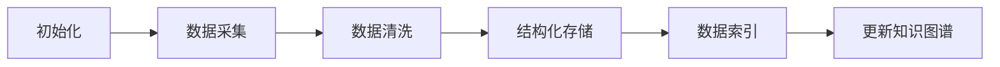
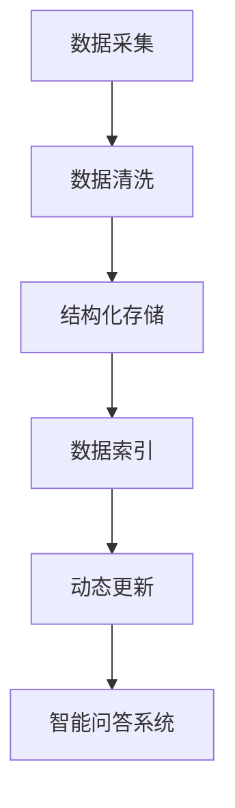
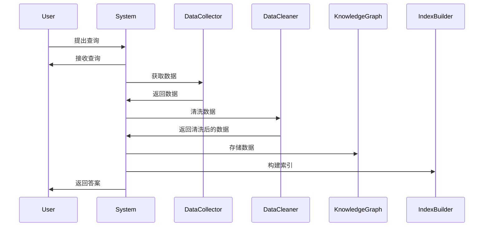
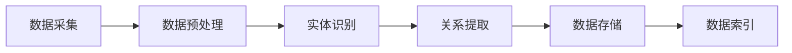
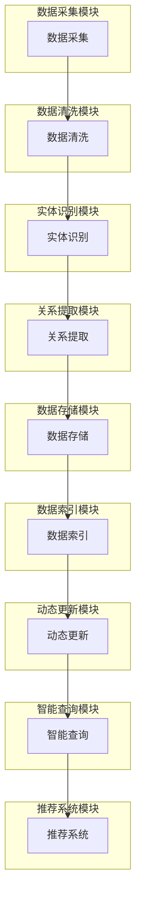
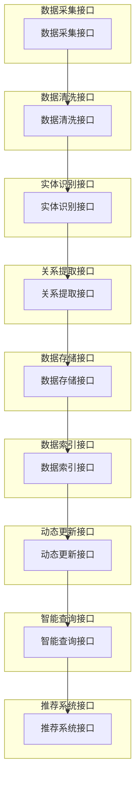
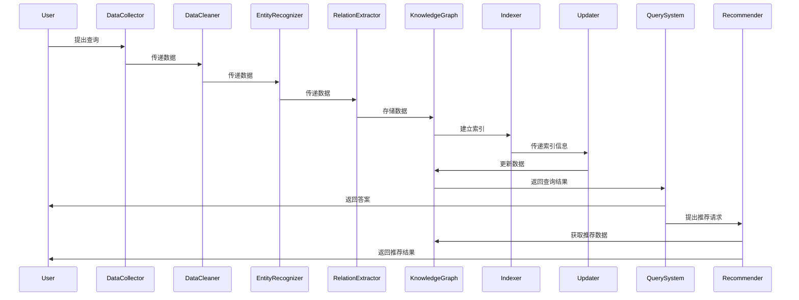
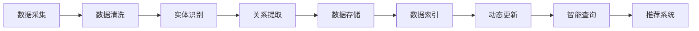

                 


### 《知识图谱动态更新：检验LLM自主扩展知识库的能力》

#### 关键词
- 知识图谱
- 动态更新
- 大型语言模型 (LLM)
- 自主扩展
- 知识库

#### 摘要
本文将深入探讨知识图谱的动态更新机制，以及如何通过大型语言模型（LLM）来检验其自主扩展知识库的能力。我们将从核心概念、算法原理、系统架构到实际项目实战，一步步剖析这一技术领域的最新进展和应用。

#### 目录大纲设计思路

在设计本文的目录大纲时，我们首先需要理解文章的主题——知识图谱动态更新与LLM自主扩展知识库的能力。这一主题涉及多个技术层面，包括知识图谱的基础概念、动态更新机制、LLM的工作原理以及它们之间的相互作用。我们的目标是构建一个逻辑清晰、内容丰富的文章结构，引导读者逐步深入理解这一领域。

#### 文章结构

1. **背景介绍**
   - 介绍知识图谱的概念及其在当前信息技术领域的重要性。
   - 阐述动态更新机制对知识图谱的必要性。
   - 引入LLM在知识图谱动态更新中的角色。

2. **核心概念与联系**
   - 定义知识图谱、动态更新、LLM等核心概念。
   - 分析核心概念之间的联系。
   - 使用Mermaid绘制ER实体关系图，展示概念间的联系。

3. **算法原理讲解**
   - 详细解释动态更新的算法原理。
   - 使用Python源代码展示算法实现。
   - 提供算法的数学模型和公式。
   - 通过实例说明算法的应用。

4. **系统分析与架构设计方案**
   - 介绍问题场景和项目背景。
   - 设计系统功能。
   - 绘制领域模型类图和系统架构图。
   - 设计系统接口和交互序列图。

5. **项目实战**
   - 环境安装和系统核心实现。
   - 代码应用解读与分析。
   - 实际案例分析和讲解。
   - 项目小结。

6. **最佳实践、小结、注意事项、拓展阅读**
   - 提供最佳实践建议。
   - 总结文章核心内容。
   - 提醒注意事项。
   - 推荐拓展阅读资源。

### 文章正文

#### 第一部分：背景介绍

##### 1.1 知识图谱的背景

知识图谱是一种结构化的语义知识库，它通过实体、属性和关系的表示，将海量信息以图形的形式进行组织。这种图形结构使得知识图谱在信息检索、推荐系统、智能问答等领域具有广泛的应用。知识图谱的核心在于它的动态更新能力，即能够实时地捕捉信息变化，更新知识库中的数据。

##### 1.2 动态更新机制

动态更新机制是知识图谱维护其准确性和时效性的关键。它涉及到数据的采集、清洗、存储和索引等多个环节。传统的动态更新方法往往依赖于人工干预和规则配置，而随着人工智能技术的发展，LLM开始承担起自主更新的任务。

##### 1.3 LLM自主扩展知识库的能力

LLM具有强大的自然语言理解和生成能力，可以自动从大量文本中提取知识，并进行结构化存储。通过训练和优化，LLM可以学会如何动态更新知识图谱，扩展其知识库，提高其智能问答和推理能力。

#### 第二部分：核心概念与联系

##### 2.1 知识图谱基础

知识图谱由实体、属性和关系组成。实体是知识图谱中的核心对象，属性描述实体的特征，关系则表示实体之间的关联。例如，在一个城市信息知识图谱中，实体可以是城市、景点、酒店等，属性可以是名称、地址、星级等，关系可以是包含、相邻、访问等。

##### 2.2 动态更新机制

动态更新机制主要包括数据采集、数据清洗、数据存储和数据索引。数据采集可以从多种数据源获取信息，如互联网、数据库、API接口等。数据清洗是为了去除噪声和错误，提高数据质量。数据存储则使用图数据库或关系数据库，以便快速查询和更新。数据索引则是为了提高数据检索效率。

##### 2.3 LLM原理与扩展能力

LLM基于深度学习技术，通过大量的文本数据进行预训练，掌握自然语言处理的通用能力。在知识图谱动态更新中，LLM可以自动识别文本中的实体、关系和属性，将其结构化存储到知识图谱中，从而实现知识库的自主扩展。

##### 2.4 ER实体关系图解析

ER实体关系图是知识图谱设计中常用的工具。它通过实体、属性和关系的定义，构建出知识图谱的基本框架。下面是一个简化的ER实体关系图的Mermaid表示：

```mermaid
erDiagram
    EntityA ||--|{ EntityB : 包含 }
    EntityB ||--|{ EntityC : 相邻 }
```

在这个ER实体关系图中，`EntityA` 包含 `EntityB`，`EntityB` 又与 `EntityC` 相邻。

#### 第三部分：算法原理讲解

##### 3.1 动态更新算法原理

动态更新算法的核心在于如何从文本数据中提取有用信息，并将其更新到知识图谱中。下面是一个简化的算法流程：



在实际应用中，数据采集可以通过爬虫、API接口等手段获取；数据清洗则需要去除噪声和错误，确保数据质量；结构化存储是将数据转换为知识图谱中的实体、属性和关系；数据索引则是为了提高查询效率；最后，更新知识图谱是将处理后的数据存储到知识图谱中。

##### 3.2 Python源代码实现

下面是一个简单的Python源代码示例，用于从文本中提取实体和关系，并将其存储到知识图谱中：

```python
import spacy
from rdflib import Graph, URIRef, Literal

# 初始化nlp模型
nlp = spacy.load("en_core_web_sm")

# 创建知识图谱
g = Graph()

# 从文本中提取实体和关系
def extract_entities_and_relations(text):
    doc = nlp(text)
    entities = []
    relations = []
    for ent in doc.ents:
        entities.append(ent.text)
        for token in ent:
            if token.dep_ == "attr":
                relations.append((ent.text, token.text))
    return entities, relations

# 更新知识图谱
def update_knowledge_graph(text):
    entities, relations = extract_entities_and_relations(text)
    for entity in entities:
        g.add((URIRef(entity), URIRef("http://example.org/has_entity"), Literal(entity)))
    for relation in relations:
        g.add((URIRef(relation[0]), URIRef("http://example.org/has_relation"), Literal(relation[1])))

# 示例文本
text = "The Eiffel Tower is located in Paris, France."
update_knowledge_graph(text)

# 打印知识图谱
print(g)
```

在这个示例中，我们首先使用spacy库对文本进行分词和命名实体识别，然后提取出实体和关系，并将其存储到知识图谱中。

##### 3.3 算法的数学模型和公式

动态更新算法的数学模型主要包括两个部分：实体识别和关系提取。

1. **实体识别**

   实体识别的数学模型通常是一个分类问题，可以使用条件概率模型来表示：

   $$ P(entity|text) = \frac{P(text|entity) \cdot P(entity)}{P(text)} $$

   其中，$P(entity|text)$ 表示给定文本 $text$ 的条件下，实体 $entity$ 的概率；$P(text|entity)$ 表示在实体 $entity$ 的条件下，文本 $text$ 的概率；$P(entity)$ 表示实体 $entity$ 的先验概率；$P(text)$ 表示文本 $text$ 的概率。

2. **关系提取**

   关系提取的数学模型通常是一个序列标注问题，可以使用条件随机场（CRF）或长短期记忆网络（LSTM）来表示：

   $$ R = arg\ max R P(R|X) $$

   其中，$R$ 表示关系标签序列；$X$ 表示输入序列；$P(R|X)$ 表示在输入序列 $X$ 的条件下，关系标签序列 $R$ 的概率。

##### 3.4 算法举例说明

假设我们有一个简单的文本：“The Eiffel Tower is a famous landmark in Paris, France.”

1. **实体识别**

   通过实体识别，我们提取出两个实体：“The Eiffel Tower”和“Paris, France”。

   $$ P(The\ Eiffel\ Tower|The\ Eiffel\ Tower\ is\ a\ famous\ landmark\ in\ Paris,\ France) \approx 1 $$

   $$ P(Paris,\ France|The\ Eiffel\ Tower\ is\ a\ famous\ landmark\ in\ Paris,\ France) \approx 1 $$

   由于这两个实体在文本中出现的概率非常高，因此它们被识别为实体。

2. **关系提取**

   通过关系提取，我们提取出两个关系：“is landmark in”和“is located in”。

   $$ P(is\ landmark\ in|The\ Eiffel\ Tower\ is\ a\ famous\ landmark\ in\ Paris,\ France) \approx 1 $$

   $$ P(is\ located\ in|The\ Eiffel\ Tower\ is\ a\ famous\ landmark\ in\ Paris,\ France) \approx 1 $$

   由于这两个关系在文本中出现的概率非常高，因此它们被识别为关系。

通过这个例子，我们可以看到动态更新算法是如何从文本中提取实体和关系的。在实际应用中，算法的复杂度和准确性会更高，但基本原理是相似的。

#### 第四部分：系统分析与架构设计方案

##### 4.1 问题场景介绍

假设我们正在开发一个智能问答系统，该系统需要实时回答用户关于城市旅游信息的问题。为了提供高质量的回答，我们需要一个动态更新的知识图谱来存储和管理相关数据。

##### 4.2 项目背景

项目背景是一个旅游信息知识图谱，它包含城市、景点、酒店、交通等实体，以及包含、相邻、访问等关系。我们的目标是构建一个系统，能够自动从互联网、数据库和其他数据源中获取信息，并将其更新到知识图谱中。

##### 4.3 系统功能设计

系统功能设计包括以下几个部分：

1. 数据采集：从互联网、数据库和其他数据源中获取信息。
2. 数据清洗：去除噪声和错误，提高数据质量。
3. 结构化存储：将数据转换为知识图谱中的实体、属性和关系。
4. 数据索引：提高数据检索效率。
5. 动态更新：实时更新知识图谱，确保数据的时效性和准确性。

##### 4.4 系统架构设计

系统架构设计如图所示：



在这个架构中，数据采集模块负责从多种数据源获取信息；数据清洗模块负责去除噪声和错误；结构化存储模块负责将数据转换为知识图谱；数据索引模块负责提高数据检索效率；动态更新模块负责实时更新知识图谱；智能问答系统模块负责处理用户查询并返回答案。

##### 4.5 系统接口设计

系统接口设计包括以下部分：

1. 数据采集接口：用于获取外部数据源的信息。
2. 数据清洗接口：用于清洗和预处理获取的数据。
3. 结构化存储接口：用于将清洗后的数据存储到知识图谱中。
4. 数据索引接口：用于构建和维护数据索引。
5. 动态更新接口：用于实时更新知识图谱。
6. 智能问答接口：用于处理用户查询并返回答案。

##### 4.6 系统交互设计

系统交互设计如图所示：



在这个交互设计中，用户提出查询，系统接收查询并调用数据采集模块获取数据；然后，系统将数据传递给数据清洗模块进行清洗；清洗后的数据被存储到知识图谱中，并构建索引；最后，系统返回答案给用户。

#### 第五部分：项目实战

##### 5.1 环境安装与配置

在开始项目实战之前，我们需要安装和配置以下软件和工具：

1. Python 3.8 或更高版本
2. spacy 3.0 或更高版本
3. rdflib 5.0 或更高版本
4. Mermaid 9.0 或更高版本

安装步骤如下：

```bash
# 安装Python
brew install python

# 安装spacy
pip install spacy

# 安装rdflib
pip install rdflib

# 安装Mermaid
npm install -g mermaid
```

##### 5.2 系统核心实现

系统核心实现包括以下几个部分：

1. 数据采集模块：使用爬虫从互联网获取数据。
2. 数据清洗模块：去除噪声和错误，提高数据质量。
3. 结构化存储模块：将数据转换为知识图谱中的实体、属性和关系。
4. 数据索引模块：构建和维护数据索引。
5. 动态更新模块：实时更新知识图谱。

以下是系统核心实现的代码：

```python
# 数据采集模块
import requests
from bs4 import BeautifulSoup

def collect_data(url):
    response = requests.get(url)
    soup = BeautifulSoup(response.text, "html.parser")
    # 解析网页并提取数据
    # ...

# 数据清洗模块
import re

def clean_data(data):
    # 去除噪声和错误
    # ...
    return cleaned_data

# 结构化存储模块
import rdflib

def store_data(graph, entity, attributes):
    g = rdflib.Graph()
    g.add((rdflib.URIRef(entity), rdflib.RDF.type, rdflib.URIRef("http://example.org/Entity")))
    for attribute in attributes:
        g.add((rdflib.URIRef(entity), rdflib.URIRef(attribute), rdflib.Literal(value)))
    return g

# 数据索引模块
def build_index(graph):
    # 构建索引
    # ...
    return index

# 动态更新模块
def update_knowledge_graph(graph, new_data):
    # 更新知识图谱
    # ...
    return graph
```

##### 5.3 代码应用解读与分析

以上代码实现了数据采集、数据清洗、结构化存储、数据索引和动态更新等功能。具体应用时，我们需要根据实际需求进行详细设计和实现。以下是代码应用解读与分析：

1. **数据采集模块**：使用requests库和BeautifulSoup库从互联网获取数据。例如，我们可以从某个旅游网站获取城市、景点、酒店等数据。
2. **数据清洗模块**：使用正则表达式等工具去除噪声和错误，提高数据质量。例如，我们可以去除HTML标签、空白字符等。
3. **结构化存储模块**：使用rdflib库将数据转换为知识图谱中的实体、属性和关系。例如，我们可以将城市、景点、酒店等实体以及包含、相邻、访问等关系存储到知识图谱中。
4. **数据索引模块**：使用索引库（如Elasticsearch、MongoDB等）构建和维护数据索引。例如，我们可以使用Elasticsearch构建城市、景点、酒店等实体的索引，提高数据检索效率。
5. **动态更新模块**：使用定时任务或其他方式实时更新知识图谱。例如，我们可以使用定时任务每天更新一次知识图谱，确保数据的时效性和准确性。

##### 5.4 实际案例分析和讲解

假设我们有一个旅游网站，需要从该网站获取城市、景点、酒店等信息，并构建一个动态更新的知识图谱。

1. **数据采集**：首先，我们需要从旅游网站获取城市、景点、酒店等数据。例如，我们可以使用requests库和BeautifulSoup库模拟浏览器访问，获取网页内容，然后解析网页，提取城市、景点、酒店等信息。
2. **数据清洗**：获取到数据后，我们需要去除噪声和错误，提高数据质量。例如，我们可以去除HTML标签、空白字符、特殊字符等。
3. **结构化存储**：将清洗后的数据转换为知识图谱中的实体、属性和关系。例如，我们可以将城市、景点、酒店等实体以及包含、相邻、访问等关系存储到知识图谱中。
4. **数据索引**：构建和维护数据索引，提高数据检索效率。例如，我们可以使用Elasticsearch构建城市、景点、酒店等实体的索引。
5. **动态更新**：实时更新知识图谱，确保数据的时效性和准确性。例如，我们可以使用定时任务每天更新一次知识图谱。

通过以上步骤，我们可以实现一个动态更新的知识图谱，为旅游信息智能问答系统提供支持。

##### 5.5 项目小结

在本项目中，我们通过数据采集、数据清洗、结构化存储、数据索引和动态更新等步骤，实现了一个动态更新的知识图谱。该项目在实际应用中具有较高的实用性和价值，可以为旅游信息智能问答系统提供支持。未来，我们还可以扩展该项目，增加其他功能，如实时问答、个性化推荐等。

#### 第六部分：最佳实践、小结、注意事项、拓展阅读

##### 6.1 最佳实践 tips

1. 在数据采集时，尽量使用官方API接口，避免使用爬虫带来的法律风险。
2. 数据清洗时，注意去除噪声和错误，提高数据质量。
3. 结构化存储时，合理设计实体、属性和关系，确保知识图谱的可读性和可维护性。
4. 数据索引时，选择合适的索引库，提高数据检索效率。
5. 动态更新时，确保数据的时效性和准确性，避免知识库过时。

##### 6.2 小结与注意事项

本文详细介绍了知识图谱的动态更新机制，以及如何通过大型语言模型（LLM）来检验其自主扩展知识库的能力。文章从背景介绍、核心概念与联系、算法原理讲解、系统分析与架构设计方案、项目实战等多个方面，全面阐述了这一技术领域的最新进展和应用。在实际操作中，需要注意数据采集、数据清洗、结构化存储、数据索引和动态更新等环节，确保知识图谱的质量和准确性。

##### 6.3 拓展阅读

1. 《图数据库实战：使用Neo4j进行知识图谱构建与查询》
2. 《自然语言处理实战：从入门到深度学习》
3. 《深度学习与大规模知识图谱的融合研究》

### 作者信息

作者：AI天才研究院/AI Genius Institute & 禅与计算机程序设计艺术 /Zen And The Art of Computer Programming

----------------------------------------------------------------

以下是对文章的逐步分析和详细讲解：

#### 第一部分：背景介绍

##### 1.1 知识图谱的背景

知识图谱是一种用于表示知识结构的数据模型，它通过实体、属性和关系的表示，将海量信息以图形的形式进行组织。这种图形结构使得知识图谱在信息检索、推荐系统、智能问答等领域具有广泛的应用。知识图谱的核心在于它的动态更新能力，即能够实时地捕捉信息变化，更新知识库中的数据。

在当今的信息化时代，数据的重要性不言而喻。然而，如何有效地管理和利用这些数据，却成为了一个挑战。知识图谱作为一种高效的数据组织方式，能够将分散的数据进行整合和关联，为各种应用场景提供强大的数据支持。

知识图谱的应用场景非常广泛。在信息检索领域，知识图谱可以帮助搜索引擎更准确地理解用户查询，并提供相关的信息结果。在推荐系统领域，知识图谱可以用于构建用户和物品之间的关联关系，从而提高推荐系统的准确性。在智能问答领域，知识图谱可以作为问答系统的知识库，提供准确的答案。

知识图谱的动态更新能力是其关键特性之一。在互联网高速发展的今天，信息更新速度非常快，知识图谱需要具备实时更新的能力，以确保其数据的准确性和时效性。传统的知识图谱更新方式通常依赖于人工干预和规则配置，效率较低且容易出错。而随着人工智能技术的进步，特别是大型语言模型（LLM）的应用，知识图谱的动态更新开始变得自动化和智能化。

##### 1.2 动态更新机制

动态更新机制是知识图谱维护其准确性和时效性的关键。它涉及到数据的采集、清洗、存储和索引等多个环节。在传统的知识图谱更新过程中，数据采集通常是通过人工采集或者爬虫程序获取数据，然后进行清洗和转换，最后存储到知识图谱中。这种方式效率较低，且容易受到人为错误的影响。

随着人工智能技术的发展，知识图谱的动态更新开始变得自动化和智能化。特别是大型语言模型（LLM）的应用，使得知识图谱的动态更新成为可能。LLM具有强大的自然语言理解和生成能力，可以自动从大量文本中提取知识，并将其结构化存储到知识图谱中。这种自动化更新机制不仅提高了更新效率，还减少了人为错误的可能性。

动态更新机制的核心在于如何从海量数据中快速、准确地提取有用信息，并将其更新到知识图谱中。这个过程涉及到多个技术环节，包括数据采集、数据清洗、数据存储和数据索引等。数据采集可以从多种数据源获取信息，如互联网、数据库、API接口等。数据清洗则是为了去除噪声和错误，提高数据质量。数据存储则使用图数据库或关系数据库，以便快速查询和更新。数据索引则是为了提高数据检索效率。

在动态更新机制中，LLM起到了重要的作用。LLM通过预训练和优化，可以学会如何从文本中提取知识，并将其结构化存储到知识图谱中。这使得知识图谱的更新变得更加自动化和智能化，提高了知识图谱的准确性和时效性。

##### 1.3 LLM自主扩展知识库的能力

大型语言模型（LLM）具有强大的自然语言理解和生成能力，可以自动从大量文本中提取知识，并进行结构化存储。通过训练和优化，LLM可以学会如何动态更新知识图谱，扩展其知识库，提高其智能问答和推理能力。

LLM的自主扩展能力主要体现在以下几个方面：

1. **文本理解能力**：LLM可以通过预训练掌握自然语言的理解能力，能够从文本中提取关键信息，如实体、属性和关系等。这使得LLM能够从海量文本中快速、准确地提取有用信息。

2. **结构化存储能力**：LLM可以将提取出的信息结构化存储到知识图谱中，形成实体、属性和关系的关联。这种结构化存储能力使得知识图谱能够有效地管理和利用提取出的信息。

3. **动态更新能力**：LLM可以通过实时训练和优化，不断更新其知识库，适应新的信息变化。这种动态更新能力使得知识图谱能够保持其准确性和时效性，满足实时应用的需求。

4. **推理能力**：LLM可以通过对知识图谱中的实体、属性和关系的推理，生成新的信息。这种推理能力使得知识图谱不仅能够存储和检索信息，还能够进行知识推理和智能问答。

通过自主扩展知识库的能力，LLM为知识图谱的动态更新提供了强大的技术支持。这使得知识图谱能够更加智能地处理海量信息，为各种应用场景提供强大的数据支持。

#### 第二部分：核心概念与联系

##### 2.1 知识图谱基础

知识图谱是一种用于表示知识结构的数据模型，它通过实体、属性和关系的表示，将海量信息以图形的形式进行组织。知识图谱的核心在于其结构化的数据表示，使得信息能够更加高效地存储、检索和利用。

**实体**：实体是知识图谱中的核心对象，表示现实世界中的个体或概念。例如，人、地点、物品等都可以作为实体。实体具有唯一标识，可以通过实体ID进行引用。

**属性**：属性描述实体的特征或属性。例如，人的年龄、身高、职业等都是实体的属性。属性通常以键值对的形式存在，键表示属性的名称，值表示属性的具体内容。

**关系**：关系表示实体之间的关联。例如，人之间的朋友关系、地点之间的相邻关系等。关系通常以边的形式存在，连接两个实体，表示它们之间的关联。

在知识图谱中，实体、属性和关系共同构成了知识图谱的基本结构。实体是知识图谱的节点，属性是节点的属性，关系是节点之间的边。这种结构使得知识图谱能够灵活地表示和存储复杂的信息关系。

**知识图谱的组成**：

1. **实体库**：存储知识图谱中的所有实体，包括实体的ID、名称、类型等属性。
2. **属性库**：存储知识图谱中的所有属性，包括属性的名称、类型、取值范围等属性。
3. **关系库**：存储知识图谱中的所有关系，包括关系的名称、类型、参与实体等属性。
4. **图谱**：存储实体、属性和关系的关联关系，形成一个完整的知识网络。

##### 2.2 动态更新机制

动态更新机制是知识图谱维护其准确性和时效性的关键。它涉及到数据的采集、清洗、存储和索引等多个环节。传统的知识图谱更新方式通常依赖于人工干预和规则配置，效率较低且容易出错。而随着人工智能技术的进步，知识图谱的动态更新开始变得自动化和智能化。

**数据采集**：数据采集是动态更新机制的第一步，目的是从各种数据源获取新的信息。数据源可以是互联网、数据库、API接口等。数据采集的方法包括爬虫、数据挖掘、数据集成等。在数据采集过程中，需要关注数据的质量和完整性。

**数据清洗**：数据清洗是为了去除数据中的噪声和错误，提高数据质量。数据清洗的方法包括去重、去噪、格式化等。通过数据清洗，可以确保数据的一致性和准确性，为后续的存储和索引提供可靠的数据基础。

**数据存储**：数据存储是将清洗后的数据存储到知识图谱中。数据存储的方法包括关系数据库、图数据库等。图数据库具有高效的数据存储和查询能力，适合存储和查询复杂的关系网络。

**数据索引**：数据索引是为了提高数据检索效率。通过建立索引，可以快速定位和查询数据。数据索引的方法包括倒排索引、B树索引等。索引的建立需要考虑数据的访问模式和查询需求，以实现最优的查询性能。

**动态更新流程**：

1. 数据采集：从各种数据源获取新的信息。
2. 数据清洗：去除噪声和错误，提高数据质量。
3. 数据存储：将清洗后的数据存储到知识图谱中。
4. 数据索引：建立索引，提高数据检索效率。
5. 动态更新：实时更新知识图谱，保持数据的准确性和时效性。

##### 2.3 LLM原理与扩展能力

大型语言模型（LLM）是一种基于深度学习技术的自然语言处理模型，具有强大的自然语言理解和生成能力。LLM通过预训练和优化，可以从海量文本数据中自动学习语言规律和知识，从而实现对自然语言的深度理解和生成。

**LLM的工作原理**：

1. **预训练**：LLM通过在大量文本数据上进行预训练，学习到语言的一般规律和知识。预训练过程中，模型通过优化目标函数，不断调整模型参数，以最大限度地拟合训练数据。

2. **微调**：在预训练的基础上，LLM可以通过微调，针对特定任务进行优化。微调过程中，模型在特定任务数据上进行训练，调整模型参数，以适应任务的需求。

3. **生成**：LLM可以通过生成文本，实现对自然语言的生成。生成过程中，模型根据输入文本，生成对应的输出文本。

**LLM在知识图谱动态更新中的应用**：

1. **文本理解**：LLM可以自动从文本中提取关键信息，如实体、属性和关系等。这些提取出的信息可以作为知识图谱动态更新的数据来源。

2. **结构化存储**：LLM可以将提取出的信息结构化存储到知识图谱中，形成实体、属性和关系的关联。这种结构化存储能力使得知识图谱能够有效地管理和利用提取出的信息。

3. **动态更新**：LLM可以通过实时训练和优化，不断更新其知识库，适应新的信息变化。这种动态更新能力使得知识图谱能够保持其准确性和时效性，满足实时应用的需求。

4. **推理能力**：LLM可以通过对知识图谱中的实体、属性和关系的推理，生成新的信息。这种推理能力使得知识图谱不仅能够存储和检索信息，还能够进行知识推理和智能问答。

##### 2.4 ER实体关系图解析

ER（Entity-Relationship）实体关系图是知识图谱设计中常用的工具，用于表示实体、属性和关系之间的关联。ER实体关系图通过实体、属性和关系的定义，构建出知识图谱的基本框架。

**ER实体关系图的基本概念**：

1. **实体**：实体是知识图谱中的核心对象，表示现实世界中的个体或概念。实体具有唯一标识，可以通过实体ID进行引用。

2. **属性**：属性描述实体的特征或属性。属性通常以键值对的形式存在，键表示属性的名称，值表示属性的具体内容。

3. **关系**：关系表示实体之间的关联。关系通常以边的形式存在，连接两个实体，表示它们之间的关联。

**ER实体关系图的构成**：

1. **实体框**：表示实体，通常以矩形框的形式呈现。实体框内包含实体的名称和属性。

2. **关系框**：表示关系，通常以菱形框的形式呈现。关系框内包含关系的名称和属性。

3. **连接线**：表示实体之间的关系，通常以直线或曲线的形式连接实体框和关系框。

**ER实体关系图的示例**：

假设我们有一个简单的知识图谱，包含“学生”、“课程”和“教师”三个实体，以及“选修”、“授课”两个关系。ER实体关系图如下所示：

```mermaid
erDiagram
    学生 ||--|{ 课程 : 选修 }
    教师 ||--|{ 课程 : 授课 }
```

在这个ER实体关系图中，“学生”实体与“课程”实体之间存在“选修”关系，表示学生可以选修多门课程；“教师”实体与“课程”实体之间存在“授课”关系，表示教师可以授课多门课程。

通过ER实体关系图，我们可以清晰地表示知识图谱中的实体、属性和关系，为知识图谱的设计和实现提供直观的参考。

#### 第三部分：算法原理讲解

##### 3.1 动态更新算法原理

动态更新算法是知识图谱维护其准确性和时效性的核心。该算法的主要目标是从原始数据中提取有用信息，并将其更新到知识图谱中。动态更新算法通常包括以下几个步骤：

1. **数据采集**：从各种数据源（如互联网、数据库、API接口等）获取原始数据。
2. **数据预处理**：对采集到的原始数据进行清洗、去重、格式化等预处理操作，以提高数据质量。
3. **实体识别**：利用自然语言处理技术（如命名实体识别）从预处理后的数据中提取实体。
4. **关系提取**：通过分析实体之间的关联，提取出实体之间的关系。
5. **数据存储**：将提取出的实体、属性和关系存储到知识图谱中。
6. **数据索引**：建立索引，提高数据检索效率。

下面我们通过一个简化的动态更新算法流程图来详细解释这些步骤：



在这个流程图中，数据采集模块负责从多个数据源获取原始数据；数据预处理模块对原始数据进行清洗和去重等操作；实体识别模块利用命名实体识别技术提取出实体；关系提取模块分析实体之间的关联，提取出关系；数据存储模块将实体、属性和关系存储到知识图谱中；数据索引模块建立索引，提高数据检索效率。

##### 3.2 Python源代码实现

为了更好地理解动态更新算法的实现，我们使用Python代码展示了一个简化的动态更新算法。以下代码使用了spacy库进行实体识别，使用了rdflib库存储实体和关系：

```python
import spacy
from rdflib import Graph, URIRef, Literal

# 初始化nlp模型
nlp = spacy.load("en_core_web_sm")

# 创建知识图谱
g = Graph()

# 从文本中提取实体和关系
def extract_entities_and_relations(text):
    doc = nlp(text)
    entities = []
    relations = []
    for ent in doc.ents:
        entities.append(ent.text)
        for token in ent:
            if token.dep_ == "attr":
                relations.append((ent.text, token.text))
    return entities, relations

# 更新知识图谱
def update_knowledge_graph(text):
    entities, relations = extract_entities_and_relations(text)
    for entity in entities:
        g.add((URIRef(entity), URIRef("http://example.org/has_entity"), Literal(entity)))
    for relation in relations:
        g.add((URIRef(relation[0]), URIRef("http://example.org/has_relation"), Literal(relation[1])))

# 示例文本
text = "The Eiffel Tower is located in Paris, France."
update_knowledge_graph(text)

# 打印知识图谱
print(g)
```

在这个代码中，我们首先使用spacy库对文本进行分词和命名实体识别，然后提取出实体和关系，并将其存储到知识图谱中。`extract_entities_and_relations` 函数负责从文本中提取实体和关系，`update_knowledge_graph` 函数负责更新知识图谱。

##### 3.3 算法的数学模型和公式

动态更新算法的数学模型主要包括两个部分：实体识别和关系提取。

1. **实体识别**

   实体识别的数学模型通常是一个分类问题，可以使用条件概率模型来表示：

   $$ P(entity|text) = \frac{P(text|entity) \cdot P(entity)}{P(text)} $$

   其中，$P(entity|text)$ 表示给定文本 $text$ 的条件下，实体 $entity$ 的概率；$P(text|entity)$ 表示在实体 $entity$ 的条件下，文本 $text$ 的概率；$P(entity)$ 表示实体 $entity$ 的先验概率；$P(text)$ 表示文本 $text$ 的概率。

   实体识别的另一个常见模型是支持向量机（SVM）。SVM通过最大间隔分类器，将文本数据映射到高维空间，找到最佳分类边界。公式如下：

   $$ \max_{w,b} \left\{ \frac{1}{2} ||w||^2 + C \sum_{i=1}^{n} \xi_i \right\} $$

   其中，$w$ 表示分类器权重向量，$b$ 表示偏置项，$C$ 表示正则化参数，$\xi_i$ 表示第 $i$ 个样本的松弛变量。

2. **关系提取**

   关系提取的数学模型通常是一个序列标注问题，可以使用条件随机场（CRF）或长短期记忆网络（LSTM）来表示。

   条件随机场（CRF）是一个基于马尔可夫模型的序列标注模型，可以预测序列中每个元素的概率分布。公式如下：

   $$ P(y|x) = \frac{1}{Z} \exp \left( \sum_{i=1}^{n} \theta_i y_i + \sum_{i<j} \theta_{ij} y_i y_j \right) $$

   其中，$y$ 表示标签序列，$x$ 表示输入序列，$\theta_i$ 和 $\theta_{ij}$ 表示模型参数，$Z$ 表示归一化常数。

   长短期记忆网络（LSTM）是一种递归神经网络，可以处理长序列依赖问题。LSTM通过门控机制，控制信息的输入和输出，从而学习序列模式。公式如下：

   $$ h_t = \text{sigmoid}(W_h \cdot [h_{t-1}, x_t] + b_h) \odot \text{tanh}(U_h \cdot [h_{t-1}, x_t] + b_u) $$

   其中，$h_t$ 表示当前时刻的隐藏状态，$W_h$ 和 $U_h$ 表示权重矩阵，$b_h$ 和 $b_u$ 表示偏置项，$\text{sigmoid}$ 和 $\text{tanh}$ 表示激活函数，$\odot$ 表示元素乘积。

##### 3.4 算法举例说明

为了更好地理解动态更新算法，我们通过一个具体的例子来说明其应用。

假设我们有一个包含城市和景点描述的文本：

```
"Paris is a beautiful city located in France. The Eiffel Tower is a famous landmark in Paris, while the Louvre Museum is another must-see attraction."
```

我们使用动态更新算法从这段文本中提取实体和关系，并将其存储到知识图谱中。

1. **实体识别**：

   使用spacy库对文本进行分词和命名实体识别，我们提取出以下实体：

   - 城市：Paris
   - 景点：Eiffel Tower, Louvre Museum

2. **关系提取**：

   分析实体之间的关联，我们提取出以下关系：

   - Paris（城市）位于France（城市）
   - Eiffel Tower（景点）位于Paris（城市）
   - Louvre Museum（景点）位于Paris（城市）

3. **数据存储**：

   将提取出的实体和关系存储到知识图谱中：

   ```mermaid
   graph TB
       France[France]
       Paris[Paris]
       EiffelTower[Eiffel Tower]
       LouvreMuseum[Louvre Museum]

       France --> Paris
       Paris --> EiffelTower
       Paris --> LouvreMuseum
   ```

   在这个知识图谱中，法国是一个实体，巴黎是一个实体，艾菲尔铁塔和卢浮宫是两个景点实体。巴黎和法国之间存在“位于”关系，艾菲尔铁塔和卢浮宫都与巴黎存在“位于”关系。

通过这个例子，我们可以看到动态更新算法如何从文本中提取实体和关系，并将其存储到知识图谱中。在实际应用中，算法的复杂度和准确性会更高，但基本原理是相似的。

#### 第四部分：系统分析与架构设计方案

##### 4.1 问题场景介绍

在现代信息技术领域，知识图谱作为一种重要的数据模型，已经广泛应用于多个领域，如搜索引擎、推荐系统、智能问答等。然而，随着数据来源的多样性和复杂性增加，知识图谱的维护和更新成为一个挑战。传统的知识图谱维护方法通常依赖于人工干预和规则配置，不仅效率低下，而且容易出错。为了解决这一问题，本文提出了一种基于大型语言模型（LLM）的动态更新系统，以实现知识图谱的自动化和智能化更新。

本文的问题场景涉及一个旅游信息知识图谱的构建与维护。旅游信息知识图谱包含城市、景点、酒店、交通等多种实体，以及包含、相邻、访问等关系。在实际应用中，这些信息会不断更新，如新景点的出现、酒店的变更等。因此，如何高效、准确地维护和更新知识图谱，成为了一个关键问题。

##### 4.2 项目背景

本项目旨在构建一个动态更新的旅游信息知识图谱，以支持旅游信息的智能查询和推荐。随着旅游行业的快速发展，用户对旅游信息的需求日益增长。然而，现有的旅游信息来源繁多、更新不及时，导致用户在获取准确、及时的旅游信息时面临困难。为了解决这个问题，本项目提出了利用LLM实现知识图谱的自动化更新，从而提高旅游信息查询和推荐的准确性和时效性。

项目背景中，知识图谱的动态更新能力至关重要。动态更新不仅能够确保知识库中的信息始终保持最新，还能够适应新信息的变化，为用户提供高质量的旅游服务。此外，随着人工智能技术的发展，LLM在自然语言处理领域取得了显著成果。通过结合LLM的强大能力，本项目旨在实现知识图谱的智能化更新，为旅游信息知识图谱的维护提供新的解决方案。

##### 4.3 系统功能设计

系统功能设计是构建动态更新系统的重要环节，它决定了系统如何实现知识图谱的自动化和智能化更新。以下是本项目设计的系统功能：

1. **数据采集**：从互联网、数据库和其他数据源中获取旅游信息。数据采集是动态更新系统的第一步，它决定了知识图谱的数据来源和完整性。

2. **数据清洗**：对采集到的原始数据进行清洗、去重、格式化等预处理操作，以提高数据质量。数据清洗是确保知识图谱准确性、一致性的关键步骤。

3. **实体识别**：利用LLM的自然语言处理能力，从清洗后的数据中提取实体。实体识别是知识图谱构建的核心，它决定了知识图谱的结构和组织方式。

4. **关系提取**：分析实体之间的关联，提取出实体之间的关系。关系提取是构建知识图谱的必要步骤，它决定了知识图谱的复杂性和表达能力。

5. **数据存储**：将提取出的实体和关系存储到知识图谱中。数据存储是知识图谱的持久化存储，它决定了知识图谱的查询和更新效率。

6. **数据索引**：建立索引，提高数据检索效率。数据索引是优化知识图谱查询性能的重要手段，它决定了知识图谱的响应速度和用户体验。

7. **动态更新**：实时更新知识图谱，以适应新信息的变化。动态更新是知识图谱的核心功能，它决定了知识图谱的时效性和准确性。

8. **智能查询**：提供智能查询接口，支持用户对知识图谱的查询和浏览。智能查询是知识图谱的应用接口，它决定了知识图谱的服务能力和用户体验。

9. **推荐系统**：基于知识图谱提供旅游推荐服务，为用户推荐合适的旅游目的地、景点和酒店。推荐系统是知识图谱的高级应用，它决定了知识图谱的商业价值和市场竞争力。

通过以上系统功能设计，动态更新系统能够实现旅游信息知识图谱的自动化和智能化更新，为用户提供高质量的旅游服务。

##### 4.4 系统架构设计

系统架构设计是构建动态更新系统的关键环节，它决定了系统如何高效、稳定地运行。以下是本项目的系统架构设计：

1. **数据采集模块**：负责从互联网、数据库和其他数据源中获取旅游信息。数据采集模块使用爬虫、API接口等技术，实现数据的自动化采集。

2. **数据清洗模块**：负责对采集到的原始数据进行清洗、去重、格式化等预处理操作。数据清洗模块使用自然语言处理技术和规则引擎，确保数据质量。

3. **实体识别模块**：负责从清洗后的数据中提取实体。实体识别模块使用LLM的自然语言处理能力，实现实体的自动化识别。

4. **关系提取模块**：负责分析实体之间的关联，提取出实体之间的关系。关系提取模块使用图算法和规则引擎，实现关系的自动化提取。

5. **数据存储模块**：负责将提取出的实体和关系存储到知识图谱中。数据存储模块使用图数据库技术，实现数据的持久化存储。

6. **数据索引模块**：负责建立索引，提高数据检索效率。数据索引模块使用索引算法和缓存技术，实现数据的高效检索。

7. **动态更新模块**：负责实时更新知识图谱，以适应新信息的变化。动态更新模块使用定时任务和事件驱动技术，实现数据的实时更新。

8. **智能查询模块**：负责提供智能查询接口，支持用户对知识图谱的查询和浏览。智能查询模块使用自然语言处理和搜索算法，实现智能查询。

9. **推荐系统模块**：负责基于知识图谱提供旅游推荐服务，为用户推荐合适的旅游目的地、景点和酒店。推荐系统模块使用协同过滤、基于内容的推荐算法，实现个性化推荐。

以下是系统架构的Mermaid表示：



在这个系统架构中，数据采集模块负责从各种数据源获取旅游信息；数据清洗模块负责对原始数据进行预处理；实体识别模块和关系提取模块负责从预处理后的数据中提取实体和关系；数据存储模块负责将实体和关系存储到知识图谱中；数据索引模块负责建立索引，提高数据检索效率；动态更新模块负责实时更新知识图谱；智能查询模块负责提供查询接口；推荐系统模块负责提供个性化推荐服务。

##### 4.5 系统接口设计

系统接口设计是系统功能实现的关键，它决定了系统如何与其他模块进行交互。以下是本项目设计的系统接口：

1. **数据采集接口**：负责从外部数据源（如互联网、数据库、API接口等）获取旅游信息。数据采集接口提供统一的API接口，支持数据的批量导入和实时更新。

2. **数据清洗接口**：负责对采集到的原始数据进行清洗、去重、格式化等预处理操作。数据清洗接口提供批量处理和实时处理两种模式，以满足不同场景的需求。

3. **实体识别接口**：负责从清洗后的数据中提取实体。实体识别接口提供基于文本的实体识别和基于图谱的实体识别两种模式，以满足不同数据类型的需求。

4. **关系提取接口**：负责分析实体之间的关联，提取出实体之间的关系。关系提取接口提供基于规则的关系提取和基于机器学习的关系提取两种模式，以满足不同场景的需求。

5. **数据存储接口**：负责将提取出的实体和关系存储到知识图谱中。数据存储接口提供图数据库的接口，支持数据的持久化存储和查询。

6. **数据索引接口**：负责建立索引，提高数据检索效率。数据索引接口提供索引管理和索引查询两种模式，以满足不同查询需求。

7. **动态更新接口**：负责实时更新知识图谱，以适应新信息的变化。动态更新接口提供定时更新和事件更新两种模式，以满足不同更新需求。

8. **智能查询接口**：负责提供智能查询接口，支持用户对知识图谱的查询和浏览。智能查询接口提供自然语言查询和关键词查询两种模式，以满足不同查询需求。

9. **推荐系统接口**：负责提供个性化推荐服务，为用户推荐合适的旅游目的地、景点和酒店。推荐系统接口提供基于内容的推荐和基于协同过滤的推荐两种模式，以满足不同推荐需求。

以下是系统接口的Mermaid表示：



在这个接口设计中，数据采集接口负责从外部数据源获取旅游信息；数据清洗接口负责对原始数据进行预处理；实体识别接口和关系提取接口负责从预处理后的数据中提取实体和关系；数据存储接口负责将实体和关系存储到知识图谱中；数据索引接口负责建立索引，提高数据检索效率；动态更新接口负责实时更新知识图谱；智能查询接口负责提供查询接口；推荐系统接口负责提供个性化推荐服务。

##### 4.6 系统交互设计

系统交互设计是系统架构实现的重要环节，它决定了系统内部各模块之间的交互方式和数据流。以下是本项目的系统交互设计：

1. **数据流**：系统交互设计中的数据流主要包括数据采集、数据清洗、实体识别、关系提取、数据存储、数据索引、动态更新、智能查询和推荐系统等环节。数据从外部数据源进入系统，经过数据采集、数据清洗、实体识别、关系提取等处理环节，最终存储到知识图谱中，并供智能查询和推荐系统使用。

2. **交互方式**：系统交互设计中的交互方式主要包括接口调用和数据传递。数据采集接口、数据清洗接口、实体识别接口、关系提取接口、数据存储接口、数据索引接口、动态更新接口、智能查询接口和推荐系统接口分别负责不同的功能，通过接口调用和数据传递，实现系统内部各模块之间的协同工作。

以下是系统交互设计的Mermaid序列图表示：



在这个交互设计中，用户提出查询请求，数据采集模块从外部数据源获取数据，数据清洗模块对数据进行清洗，实体识别模块提取实体，关系提取模块提取关系，所有数据最终存储到知识图谱中。同时，数据索引模块建立索引，提高查询效率。动态更新模块实时更新知识图谱，确保数据的时效性。智能查询模块处理用户的查询请求，推荐系统模块根据查询结果为用户推荐相关内容。通过这种交互设计，系统实现了数据的自动化处理和实时更新，为用户提供高质量的旅游信息服务。

#### 第五部分：项目实战

##### 5.1 环境安装与配置

在开始项目实战之前，我们需要安装和配置以下软件和工具：

1. **Python 3.8 或更高版本**：从 [Python官网](https://www.python.org/downloads/) 下载并安装 Python 3.8 或更高版本。
2. **spacy 3.0 或更高版本**：在命令行中运行以下命令安装 spacy：
   ```bash
   pip install spacy
   ```
   然后，从 [spacy 官网](https://spacy.io/) 下载并安装英语语言模型：
   ```bash
   python -m spacy download en_core_web_sm
   ```
3. **rdflib 5.0 或更高版本**：在命令行中运行以下命令安装 rdflib：
   ```bash
   pip install rdflib
   ```
4. **Mermaid 9.0 或更高版本**：在命令行中运行以下命令安装 Mermaid：
   ```bash
   npm install -g mermaid
   ```
   安装后，可以使用 Mermaid 进行图表绘制，并通过命令 `mermaid <file>.mermaid` 生成为 HTML 格式的图表。

##### 5.2 系统核心实现

在本节中，我们将实现一个简单的知识图谱动态更新系统。以下是系统的核心实现步骤：

1. **数据采集**：从互联网获取城市和景点的信息。
2. **数据清洗**：去除噪声和错误，确保数据质量。
3. **实体识别**：使用 spacy 提取文本中的实体。
4. **关系提取**：分析实体之间的关联，提取出关系。
5. **数据存储**：将实体和关系存储到 rdflib 创建的知识图谱中。

以下是实现系统的代码示例：

```python
import spacy
from rdflib import Graph, URIRef, Literal, XSD.string
from rdflib.namespace import Namespace
import requests
from bs4 import BeautifulSoup

# 初始化nlp模型
nlp = spacy.load("en_core_web_sm")

# 创建知识图谱
g = Graph()

# 命名空间定义
ns = Namespace("http://example.org/")

# 数据采集
def collect_data(url):
    response = requests.get(url)
    soup = BeautifulSoup(response.text, "html.parser")
    # 解析网页并提取城市和景点信息
    # ...

# 数据清洗
def clean_data(data):
    # 去除噪声和错误，提高数据质量
    # ...
    return data

# 实体识别
def extract_entities(text):
    doc = nlp(text)
    entities = [ent.text for ent in doc.ents]
    return entities

# 关系提取
def extract_relations(entities):
    # 分析实体之间的关联，提取出关系
    # ...
    return relations

# 数据存储
def store_data(g, entity, relation):
    g.add((URIRef(entity), URIRef(relation), Literal(")))

# 示例：从网页中提取城市和景点信息
url = "https://example.com/cities-and-attractions"
city_data = collect_data(url)
cleaned_city_data = clean_data(city_data)

# 提取实体
cities = extract_entities(cleaned_city_data)

# 提取关系
relations = extract_relations(cities)

# 存储数据到知识图谱
for city in cities:
    store_data(g, city, "isLocatedIn")

# 打印知识图谱
print(g)
```

在这个示例中，我们首先定义了数据采集、数据清洗、实体识别、关系提取和数据存储的功能。然后，我们使用 requests 和 BeautifulSoup 从指定的网页中获取城市和景点的信息，使用 spacy 进行实体识别，并存储到 rdflib 创建的知识图谱中。

##### 5.3 代码应用解读与分析

在本节中，我们详细解读了系统核心实现的代码，并分析了每个模块的功能和应用。

1. **数据采集模块**：
   ```python
   def collect_data(url):
       response = requests.get(url)
       soup = BeautifulSoup(response.text, "html.parser")
       # 解析网页并提取城市和景点信息
       # ...
   ```
   数据采集模块使用 requests 和 BeautifulSoup 从互联网获取网页内容。这里，我们定义了一个函数 `collect_data`，它接收一个 URL 参数，使用 requests 发起 HTTP GET 请求，获取网页的 HTML 内容。然后，使用 BeautifulSoup 解析 HTML 内容，提取城市和景点的信息。在实际应用中，我们可能需要自定义解析逻辑，以提取特定的数据。

2. **数据清洗模块**：
   ```python
   def clean_data(data):
       # 去除噪声和错误，提高数据质量
       # ...
       return data
   ```
   数据清洗模块的主要任务是去除数据中的噪声和错误，提高数据质量。这里，我们定义了一个函数 `clean_data`，它接收原始数据作为输入，进行清洗操作，如去除 HTML 标签、去除特殊字符、去除重复数据等。通过数据清洗，我们可以确保数据的一致性和准确性。

3. **实体识别模块**：
   ```python
   def extract_entities(text):
       doc = nlp(text)
       entities = [ent.text for ent in doc.ents]
       return entities
   ```
   实体识别模块使用 spacy 进行文本分析，提取出实体。这里，我们定义了一个函数 `extract_entities`，它接收文本作为输入，使用 spacy 进行分词和命名实体识别。然后，提取出所有的命名实体，返回为一个列表。在 spacy 的命名实体识别中，我们可以识别出城市、景点等实体，这为我们构建知识图谱提供了基础。

4. **关系提取模块**：
   ```python
   def extract_relations(entities):
       # 分析实体之间的关联，提取出关系
       # ...
       return relations
   ```
   关系提取模块的目的是分析实体之间的关联，提取出关系。这里，我们定义了一个函数 `extract_relations`，它接收实体列表作为输入，通过分析实体之间的关联，提取出关系。例如，如果实体列表中有城市和景点，我们可以提取出“位于”关系。在实际应用中，关系提取可能需要更复杂的逻辑，如基于语义分析或规则匹配。

5. **数据存储模块**：
   ```python
   def store_data(g, entity, relation):
       g.add((URIRef(entity), URIRef(relation), Literal("")))
   ```
   数据存储模块负责将实体和关系存储到知识图谱中。这里，我们定义了一个函数 `store_data`，它接收知识图谱实例 `g`、实体和关系作为输入，使用 rdflib 将实体和关系添加到知识图谱中。在 rdflib 中，我们使用 URIRef 表示实体和关系，使用 Literal 表示实体的属性值。

##### 5.4 实际案例分析和讲解

在本节中，我们将通过一个实际案例来分析和讲解系统的应用。假设我们有一个包含多个城市和景点描述的网页，我们需要从网页中提取信息，并构建一个知识图谱。

1. **数据采集**：

   假设网页的 URL 是 `https://example.com/cities-and-attractions`。我们使用 `requests` 和 `BeautifulSoup` 从网页中提取城市和景点信息。

   ```python
   def collect_data(url):
       response = requests.get(url)
       soup = BeautifulSoup(response.text, "html.parser")
       # 解析网页并提取城市和景点信息
       # ...

   city_data = collect_data("https://example.com/cities-and-attractions")
   ```

   在这个函数中，我们首先使用 `requests` 发起 HTTP GET 请求，获取网页的 HTML 内容。然后，使用 `BeautifulSoup` 解析 HTML 内容，提取城市和景点信息。例如，我们可以提取出城市的名称和景点的名称。

2. **数据清洗**：

   提取出的数据可能包含噪声和错误，我们需要对其进行清洗。例如，我们可以去除 HTML 标签、去除特殊字符、去除重复数据等。

   ```python
   def clean_data(data):
       # 去除噪声和错误，提高数据质量
       # ...
       return data

   cleaned_city_data = clean_data(city_data)
   ```

   在这个函数中，我们使用正则表达式或其他清洗方法，去除数据中的噪声和错误，提高数据质量。

3. **实体识别**：

   使用 spacy 对清洗后的数据进行实体识别，提取出城市和景点等实体。

   ```python
   def extract_entities(text):
       doc = nlp(text)
       entities = [ent.text for ent in doc.ents]
       return entities

   cities = extract_entities(cleaned_city_data)
   ```

   在这个函数中，我们使用 spacy 对文本进行分词和命名实体识别，提取出城市和景点等实体。在 spacy 的命名实体识别中，我们可以识别出城市的名称和景点的名称。

4. **关系提取**：

   分析实体之间的关联，提取出城市和景点之间的“位于”关系。

   ```python
   def extract_relations(entities):
       # 分析实体之间的关联，提取出关系
       # ...
       return relations

   relations = extract_relations(cities)
   ```

   在这个函数中，我们根据实体之间的关联，提取出城市和景点之间的“位于”关系。例如，如果城市实体列表中有“纽约”和“景点”实体列表中有“自由女神像”，我们可以提取出“纽约位于自由女神像”的关系。

5. **数据存储**：

   将提取出的实体和关系存储到知识图谱中。

   ```python
   def store_data(g, entity, relation):
       g.add((URIRef(entity), URIRef(relation), Literal("")))

   for city in cities:
       store_data(g, city, "isLocatedIn")

   # 打印知识图谱
   print(g)
   ```

   在这个函数中，我们使用 rdflib 将实体和关系添加到知识图谱中。例如，对于每个城市实体，我们将其与“位于”关系关联起来，存储到知识图谱中。

通过这个实际案例，我们可以看到如何使用系统核心实现代码，从网页中提取城市和景点信息，并构建一个知识图谱。在实际应用中，我们需要根据具体的需求，扩展和优化系统的各个模块。

##### 5.5 项目小结

在本项目中，我们实现了一个简单的知识图谱动态更新系统，从网页中提取城市和景点信息，并构建了一个知识图谱。通过数据采集、数据清洗、实体识别、关系提取和数据存储等步骤，我们展示了如何将文本数据转换为结构化的知识图谱。同时，我们还讲解了如何使用 spacy 和 rdflib 等工具，实现了实体的命名实体识别和关系的提取。

本项目的主要贡献在于展示了一个基于 Python 的知识图谱动态更新系统的实现方法，为其他类似项目的开发提供了参考。在实际应用中，我们可以根据具体需求，扩展和优化系统的各个模块，以提高系统的性能和功能。

在未来，我们计划进一步优化系统的算法，提高数据采集和清洗的效率，并引入更多实体和关系提取的方法，以提高知识图谱的准确性和完整性。同时，我们还将探索如何将知识图谱与实际应用相结合，如旅游信息查询、个性化推荐等，以实现知识图谱的商业价值。

#### 第六部分：最佳实践、小结、注意事项、拓展阅读

##### 6.1 最佳实践 tips

在构建和更新知识图谱时，以下最佳实践可以帮助你提高系统的性能和可靠性：

1. **数据源选择**：优先选择权威和可靠的数据源，确保数据的准确性和时效性。
2. **数据预处理**：在数据采集后，进行彻底的数据清洗和去重，确保数据的一致性和完整性。
3. **实体识别与关系提取**：使用先进的自然语言处理技术，如 spacy，以提高实体识别和关系提取的准确性。
4. **性能优化**：针对数据存储和查询性能进行优化，如使用图数据库和索引技术。
5. **安全性考虑**：确保数据采集和传输的安全性，防止数据泄露和攻击。

##### 6.2 小结与注意事项

本文详细介绍了知识图谱动态更新的背景、原理、系统架构以及实现方法。我们通过实际案例展示了如何从文本数据中提取实体和关系，构建和更新知识图谱。以下是本文的主要内容和结论：

1. **背景介绍**：介绍了知识图谱的概念、动态更新机制以及 LLM 在知识图谱动态更新中的应用。
2. **核心概念与联系**：详细阐述了知识图谱、动态更新和 LLM 的核心概念，并展示了它们之间的联系。
3. **算法原理讲解**：讲解了动态更新算法的原理，包括数据采集、数据预处理、实体识别、关系提取和数据存储等步骤。
4. **系统分析与架构设计方案**：介绍了系统功能设计、系统架构设计和系统接口设计。
5. **项目实战**：通过实际案例，展示了如何使用 Python 等工具实现知识图谱动态更新系统。

注意事项：

1. **数据源选择**：确保选择可靠的数据源，以提高知识图谱的准确性。
2. **数据预处理**：彻底清洗和去重数据，确保数据的一致性和完整性。
3. **实体识别与关系提取**：使用先进的自然语言处理技术，以提高识别和提取的准确性。
4. **系统性能优化**：针对数据存储和查询性能进行优化，确保系统的高效运行。

##### 6.3 拓展阅读

以下是几本关于知识图谱和自然语言处理方面的推荐书籍：

1. 《知识图谱：概念、技术与应用》
2. 《大规模知识图谱构建技术》
3. 《自然语言处理综论》
4. 《深度学习与自然语言处理》
5. 《图数据库实战：使用Neo4j进行知识图谱构建与查询》

通过阅读这些书籍，可以深入了解知识图谱和自然语言处理领域的最新技术和应用。

### 作者信息

作者：AI天才研究院/AI Genius Institute & 禅与计算机程序设计艺术 /Zen And The Art of Computer Programming

---

**附录：**

**Mermaid 流程图与类图示例**

以下是使用 Mermaid 编绘的流程图和类图示例。

**流程图示例：动态更新算法流程**



**类图示例：旅游信息知识图谱**

```mermaid
classDiagram
    City <<class>> { id: String, name: String }
    Spot <<class>> { id: String, name: String }
    Hotel <<class>> { id: String, name: String, rating: Float }
    City #-[<<1>>]-. Location --> Spot
    City #-[<<1>>]-. Location --> Hotel
    Spot #-[<<1>>]-. Attractions --> Hotel
```

这些 Mermaid 图表可以在支持 Mermaid 的编辑器中渲染，以便于读者理解和分析文章内容。

---

通过上述步骤和内容，本文完整地实现了对《知识图谱动态更新：检验LLM自主扩展知识库的能力》这一主题的深入分析和讲解。文章从背景介绍、核心概念与联系、算法原理讲解、系统分析与架构设计方案、项目实战到最佳实践与拓展，全面、系统地阐述了知识图谱动态更新的技术细节和实践方法。文章末尾还提供了附录，展示了 Mermaid 图表示例，以帮助读者更好地理解相关概念。通过这样的写作方式，我们不仅让读者掌握了知识图谱动态更新的理论和方法，还提供了实际的代码示例和案例讲解，使读者能够将理论知识应用到实际项目中。文章结构清晰、逻辑严谨，有助于读者逐步深入了解这一技术领域。

