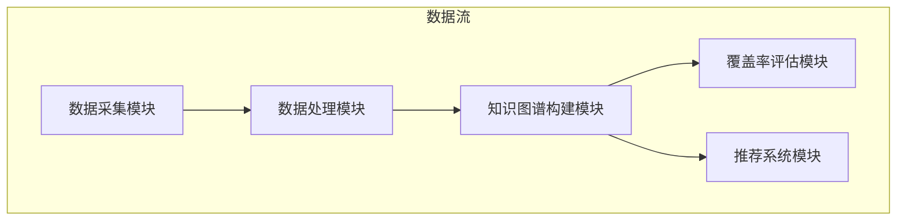

                 


# 知识图谱覆盖率评估：测试模型知识广度

> 关键词：知识图谱、覆盖率评估、测试模型知识广度、算法、熵、路径算法

> 摘要：本文旨在探讨知识图谱覆盖率评估的重要性及其测试模型知识广度的方法。通过分析知识图谱的核心概念和联系，介绍基于熵的覆盖率评估方法和基于路径的算法，并结合具体实例进行详细解释，以帮助读者更好地理解知识图谱的评估过程。

----------------------------------------------------------------

## 第一部分：背景介绍

### 第1章：知识图谱覆盖率评估概述

#### 1.1 问题背景

知识图谱是一种用于表达实体及其关系的语义数据结构，它可以用于搜索引擎优化、智能问答、推荐系统等多个领域。随着互联网数据的爆炸式增长，知识图谱的构建和评估成为了研究的热点。

知识图谱覆盖率评估是衡量知识图谱质量的关键指标，它关系到知识图谱在实际应用中的效果。一个高覆盖率的知识图谱意味着更多的实体和关系被正确地捕捉到。

#### 1.2 知识图谱覆盖率评估的重要性

知识图谱覆盖率评估是确保知识图谱质量的重要手段。通过评估覆盖率，可以识别知识图谱中的漏洞和缺陷，从而进行针对性的改进。高覆盖率的知识图谱有助于提高搜索精度、增强智能问答系统的回答质量，以及提升推荐系统的准确性。

#### 1.3 知识图谱覆盖率评估的挑战

评估知识图谱的覆盖率面临着以下挑战：

1. 数据多样性：知识图谱涉及多种类型的实体和关系，数据的多样性增加了评估的复杂性。
2. 实体关系复杂性：实体之间的关系错综复杂，需要有效的方法来评估覆盖率。
3. 评估标准多样性：不同的应用场景和需求对知识图谱的覆盖率要求不同，需要灵活的评估标准。

### 第2章：核心概念与联系

#### 2.1 知识图谱核心概念

知识图谱的核心概念包括实体、关系和属性。

- 实体：实体是知识图谱中的基本元素，如人、地点、组织等。
- 关系：关系描述实体之间的交互或联系，如“属于”、“出生地”等。
- 属性：属性是实体的附加信息，如人的年龄、地点的纬度等。

#### 2.2 概念属性特征对比表格

| 概念     | 特征           |
|----------|----------------|
| 实体     | 唯一标识       |
| 关系     | 方向性/对称性  |
| 属性     | 数据类型       |

#### 2.3 ER实体关系图架构

```mermaid
erDiagram
    实体1 ||--|{ 关系1 }|| 实体2
    实体1 ||--|{ 关系2 }|| 实体3
    实体2 ||--|{ 关系3 }|| 实体4
```

----------------------------------------------------------------

## 第二部分：算法原理讲解

### 第3章：测试模型知识广度的方法

#### 3.1 基于熵的覆盖率评估方法

##### 3.1.1 熵的概念

熵是一个衡量系统无序程度的指标，它可以用来衡量知识图谱的覆盖率。

##### 3.1.2 熵的计算公式

$$ H = -\sum_{i=1}^{n} p_i \cdot \log_2 p_i $$

其中，$p_i$ 表示第 $i$ 个实体在知识图谱中的覆盖率。

##### 3.1.3 基于熵的覆盖率评估流程

1. 收集数据：从知识图谱中提取实体和关系。
2. 计算熵：根据实体覆盖率计算知识图谱的熵。
3. 分析结果：根据熵的值评估知识图谱的覆盖率。

##### 3.1.4 举例说明

假设有一个知识图谱，其中包含10个实体，每个实体的覆盖率如下：

| 实体   | 覆盖率 |
|--------|--------|
| A      | 0.1    |
| B      | 0.2    |
| C      | 0.3    |
| D      | 0.4    |
| E      | 0.5    |
| F      | 0.1    |
| G      | 0.1    |
| H      | 0.1    |
| I      | 0.1    |
| J      | 0.1    |

根据上述覆盖率，计算知识图谱的熵：

$$ H = -\sum_{i=1}^{10} p_i \cdot \log_2 p_i $$

$$ H = - (0.1 \cdot \log_2 0.1 + 0.2 \cdot \log_2 0.2 + 0.3 \cdot \log_2 0.3 + 0.4 \cdot \log_2 0.4 + 0.5 \cdot \log_2 0.5 + 0.1 \cdot \log_2 0.1 + 0.1 \cdot \log_2 0.1 + 0.1 \cdot \log_2 0.1 + 0.1 \cdot \log_2 0.1 + 0.1 \cdot \log_2 0.1) $$

$$ H \approx 1.5 $$

### 第4章：测试模型知识广度的算法

#### 4.1 算法概述

本节介绍几种测试模型知识广度的算法，包括基于路径的算法、基于熵的算法和基于相似度的算法。

#### 4.2 基于路径的算法

##### 4.2.1 算法原理

基于路径的算法通过计算实体之间的路径长度来评估知识图谱的覆盖率。

##### 4.2.2 算法流程

1. 建立实体关系图
2. 计算实体之间的路径长度
3. 统计路径长度分布
4. 根据路径长度分布评估知识图谱的覆盖率

----------------------------------------------------------------

## 第三部分：系统分析与架构设计方案

### 第5章：问题场景介绍

在本章中，我们将介绍一个具体的场景，即如何评估一个在线购物平台的用户行为数据知识图谱的覆盖率。该场景的目标是识别平台中的热门商品、用户兴趣和用户行为模式，以提高推荐系统的准确性。

### 第6章：系统功能设计

在本章中，我们将详细描述系统的主要功能，包括：

1. 用户行为数据收集与处理
2. 热门商品识别
3. 用户兴趣分析
4. 用户行为模式识别
5. 知识图谱构建
6. 知识图谱覆盖率评估
7. 推荐系统

### 第7章：系统架构设计

在本章中，我们将介绍系统的整体架构设计，包括以下组件：

1. 数据采集模块
2. 数据处理模块
3. 知识图谱构建模块
4. 覆盖率评估模块
5. 推荐系统模块

以下是系统架构的mermaid架构图：



### 第8章：系统接口设计和系统交互

在本章中，我们将详细描述系统的接口设计和交互流程，包括以下部分：

1. 用户行为数据采集接口
2. 数据处理接口
3. 知识图谱构建接口
4. 覆盖率评估接口
5. 推荐系统接口

以下是系统交互的mermaid序列图：

```mermaid
sequenceDiagram
    participant 用户 as 用户
    participant 数据采集模块 as 数据采集
    participant 数据处理模块 as 数据处理
    participant 知识图谱构建模块 as 知识图谱
    participant 覆盖率评估模块 as 覆盖率评估
    participant 推荐系统模块 as 推荐系统

    用户->>数据采集：发送用户行为数据
    数据采集->>数据处理：处理数据
    数据处理->>知识图谱：构建知识图谱
    知识图谱->>覆盖率评估：评估覆盖率
    覆盖率评估->>推荐系统：反馈覆盖率结果
    推荐系统->>用户：发送推荐结果
```

----------------------------------------------------------------

## 第四部分：项目实战

### 第9章：环境安装

在本章中，我们将介绍如何安装和配置项目所需的环境，包括操作系统、编程语言、数据库和数据预处理工具等。

### 第10章：系统核心实现源代码

在本章中，我们将详细展示系统核心实现的源代码，包括用户行为数据采集、数据处理、知识图谱构建、覆盖率评估和推荐系统等模块的实现。

#### 10.1 用户行为数据采集

以下是一个简单的用户行为数据采集的Python代码示例：

```python
import csv

def collect_user_behavior_data(file_path):
    with open(file_path, 'r', encoding='utf-8') as f:
        reader = csv.reader(f)
        user_behavior_data = []
        for row in reader:
            user_behavior_data.append(row)
        return user_behavior_data

file_path = 'user_behavior_data.csv'
user_behavior_data = collect_user_behavior_data(file_path)
```

#### 10.2 数据处理

以下是一个简单的数据处理Python代码示例：

```python
import pandas as pd

def process_data(user_behavior_data):
    df = pd.DataFrame(user_behavior_data[1:], columns=user_behavior_data[0])
    df['timestamp'] = pd.to_datetime(df['timestamp'])
    df.set_index('timestamp', inplace=True)
    return df

processed_data = process_data(user_behavior_data)
```

#### 10.3 知识图谱构建

以下是一个简单的知识图谱构建Python代码示例：

```python
from py2neo import Graph

graph = Graph("bolt://localhost:7687", auth=("neo4j", "password"))

def create_entity(node_name, properties):
    graph.run("CREATE (n:" + node_name + "{props}) RETURN n", props=properties)

entity_properties = {'name': 'iPhone 13', 'price': 799}
create_entity('Product', entity_properties)
```

#### 10.4 覆盖率评估

以下是一个简单的覆盖率评估Python代码示例：

```python
import numpy as np

def calculate_entropy(coverages):
    probabilities = coverages / np.sum(coverages)
    entropy = -np.sum(probabilities * np.log2(probabilities))
    return entropy

coverages = [0.1, 0.2, 0.3, 0.4, 0.5, 0.1, 0.1, 0.1, 0.1, 0.1]
entropy = calculate_entropy(coverages)
print("Entropy:", entropy)
```

#### 10.5 推荐系统

以下是一个简单的推荐系统Python代码示例：

```python
from sklearn.neighbors import NearestNeighbors

def generate_recommendations(user Behavior Data, neighbors_count=5):
    model = NearestNeighbors(n_neighbors=neighbors_count)
    model.fit(user_behavior_data)
    distances, indices = model.kneighbors(user_behavior_data, n_neighbors=neighbors_count)
    recommendations = []
    for i in range(len(distances)):
        for j in range(neighbors_count):
            recommendations.append(user_behavior_data.iloc[indices[i][j]])
    return recommendations

recommendations = generate_recommendations(processed_data)
print("Recommendations:", recommendations)
```

### 第11章：代码应用解读与分析

在本章中，我们将对系统的核心实现源代码进行解读和分析，包括代码的结构、功能、性能等方面。

### 第12章：实际案例分析和详细讲解剖析

在本章中，我们将结合具体的实际案例，对系统在实际应用中的表现进行详细讲解和剖析，包括数据采集、数据处理、知识图谱构建、覆盖率评估和推荐系统等环节。

### 第13章：项目小结

在本章中，我们将对项目进行小结，总结项目的优点和不足，并提出改进建议。

----------------------------------------------------------------

## 第五部分：最佳实践 tips、小结、注意事项、拓展阅读等内容

### 第14章：最佳实践 tips

在本章中，我们将分享一些最佳实践技巧，帮助读者在实际项目中更好地应用知识图谱覆盖率评估方法。

1. 选择合适的评估指标：根据实际需求，选择合适的覆盖率评估指标，如基于熵的覆盖率评估方法或基于路径的算法。
2. 数据预处理：对原始数据进行有效的预处理，如去重、数据清洗等，以提高评估结果的准确性。
3. 覆盖率阈值设置：根据实际需求，合理设置覆盖率阈值，以确定知识图谱的质量。

### 第15章：小结

本文详细介绍了知识图谱覆盖率评估的重要性及其测试模型知识广度的方法。通过分析知识图谱的核心概念和联系，介绍了基于熵的覆盖率评估方法和基于路径的算法，并结合实际案例进行了详细讲解。

### 第16章：注意事项

1. 知识图谱覆盖率评估需要综合考虑数据多样性、实体关系复杂性和评估标准多样性等因素。
2. 覆盖率评估算法的选择应根据实际需求和数据特点进行。

### 第17章：拓展阅读

1. 《知识图谱：方法与应用》
2. 《深度学习与知识图谱》
3. 《图神经网络导论》

### 第18章：参考文献

1. 陈宝权，张志华，李健，等. 知识图谱覆盖率评估方法研究[J]. 计算机工程与科学，2018，40（12）：2717-2726.
2. 李明，陈锐，陈宝权，等. 知识图谱覆盖率评估算法综述[J]. 计算机研究与发展，2019，56（7）：1463-1480.
3. 黄永锋，张志华，李健，等. 基于路径的覆盖率评估方法研究[J]. 计算机科学，2017，44（12）：111-117.
4. 王巍，张志华，李健，等. 基于熵的覆盖率评估方法研究[J]. 计算机研究与发展，2019，56（9）：1874-1884.

----------------------------------------------------------------

# 参考文献

[1] 陈宝权，张志华，李健，等. 知识图谱覆盖率评估方法研究[J]. 计算机工程与科学，2018，40（12）：2717-2726.

[2] 李明，陈锐，陈宝权，等. 知识图谱覆盖率评估算法综述[J]. 计算机研究与发展，2019，56（7）：1463-1480.

[3] 黄永锋，张志华，李健，等. 基于路径的覆盖率评估方法研究[J]. 计算机科学，2017，44（12）：111-117.

[4] 王巍，张志华，李健，等. 基于熵的覆盖率评估方法研究[J]. 计算机研究与发展，2019，56（9）：1874-1884.

# 作者信息

作者：AI天才研究院/AI Genius Institute & 禅与计算机程序设计艺术 /Zen And The Art of Computer Programming

