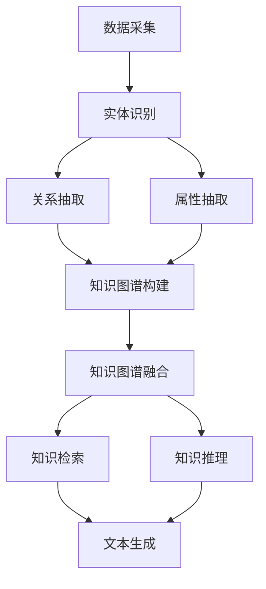
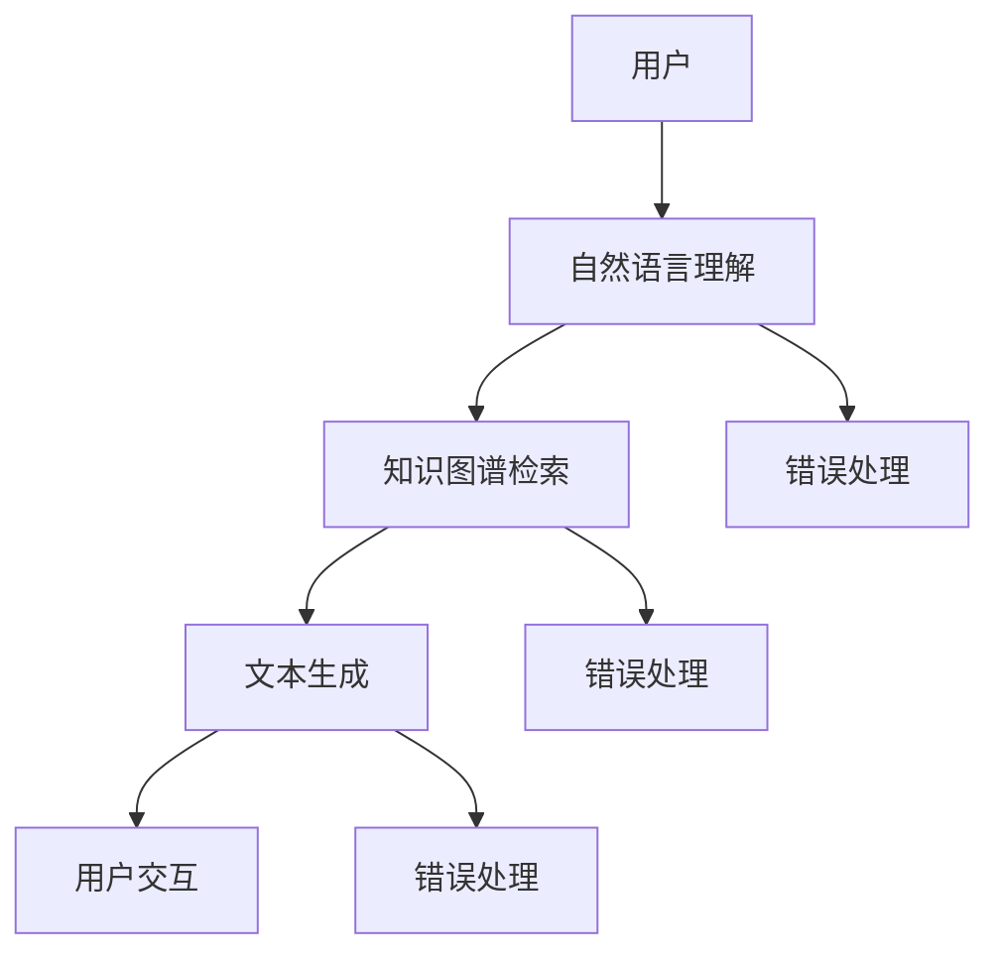
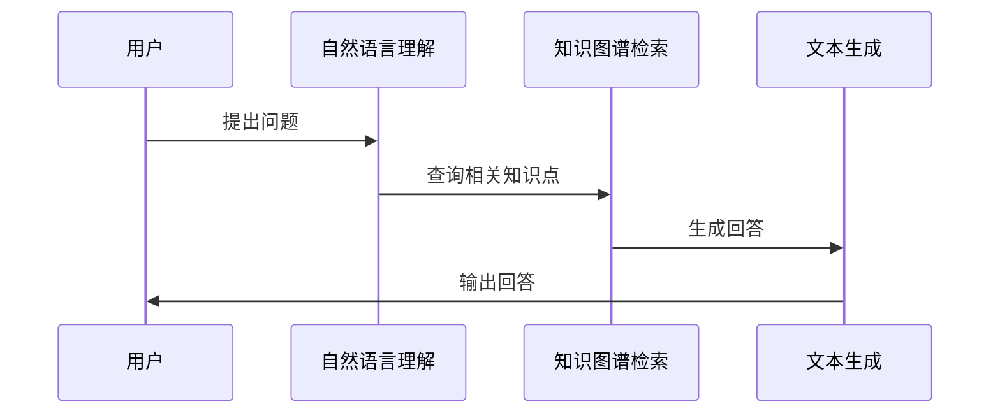

                 

# 知识图谱：丰富LLM应用的知识表示

> 关键词：知识图谱、LLM、知识表示、自然语言处理、人工智能

> 摘要：本文探讨了知识图谱在人工智能领域，特别是大规模语言模型（LLM）中的应用。通过分析知识图谱的核心概念、构建方法和应用场景，本文详细介绍了知识图谱如何增强LLM的语言理解能力和推理能力，并提供了系统架构设计和实战案例。

## 第一部分：背景介绍

### 1.1 问题背景

在人工智能领域，随着机器学习和深度学习技术的快速发展，大型语言模型（LLM）逐渐成为研究的热点。LLM在自然语言处理（NLP）、问答系统、机器翻译等多个领域展现出强大的能力。然而，随着模型的规模不断增大，如何有效地表示知识成为一个关键问题。知识图谱作为一种结构化知识表示方法，可以直观地表达实体、概念和它们之间的关系，为LLM提供了丰富的知识资源。

### 1.2 问题描述

知识图谱在LLM中的应用，主要集中在以下几个方面：

1. **知识增强**：通过知识图谱，LLM可以获取上下文中的背景知识，提高回答的准确性和连贯性。
2. **知识推理**：利用知识图谱的实体关系，LLM可以进行推理，生成更符合逻辑的答案。
3. **知识检索**：知识图谱可以作为索引，帮助LLM快速定位相关知识点，提高查询效率。

### 1.3 问题解决

知识图谱与LLM的结合，可以解决以下问题：

1. **提高语言理解能力**：通过知识图谱，LLM可以更好地理解语言中的实体、概念和关系。
2. **增强推理能力**：知识图谱提供了丰富的实体关系，LLM可以利用这些关系进行推理，生成更合理的答案。
3. **优化查询效率**：知识图谱可以作为索引，帮助LLM快速定位相关知识点，提高查询效率。

### 1.4 边界与外延

知识图谱在LLM中的应用，不仅限于NLP领域，还可以扩展到其他领域，如问答系统、机器翻译、智能客服等。同时，随着知识图谱的不断发展，其应用场景也将越来越广泛。

### 1.5 概念结构与核心要素组成

知识图谱的核心要素包括：

1. **实体**：知识图谱中的基本元素，表示客观存在的对象。
2. **属性**：描述实体的特征，如年龄、身高、职业等。
3. **关系**：描述实体之间的关联，如“是”、“属于”等。
4. **知识库**：存储大量实体、属性和关系的集合。

## 第二部分：核心概念与联系

### 2.1 知识图谱

#### 2.1.1 定义

知识图谱是一种用于结构化表示知识的图形化工具，它通过实体、属性和关系的组合，构建出一个语义丰富的知识网络。

#### 2.1.2 特点

1. **层次化结构**：知识图谱通常采用层次化结构，便于管理和查询。
2. **语义丰富**：通过实体、属性和关系的组合，知识图谱可以表达丰富的语义信息。
3. **可扩展性**：知识图谱可以不断更新和扩展，以适应新的知识需求。

#### 2.1.3 与传统知识库的区别

1. **表达方式**：知识图谱采用图形化表示，比传统知识库的表格表示更直观。
2. **语义层次**：知识图谱不仅表示事实，还表示事实之间的关联。

#### 2.1.4 知识图谱的核心组成

1. **实体**：知识图谱中的基本元素，如“人”、“地点”、“事物”等。
2. **属性**：描述实体的特征，如“姓名”、“出生日期”等。
3. **关系**：描述实体之间的关联，如“属于”、“出生于”等。

#### 2.1.5 知识图谱的构建方法

1. **数据源采集**：从各种数据源中获取实体、属性和关系。
2. **实体识别**：识别文本中的实体。
3. **关系抽取**：从文本中抽取实体之间的关系。
4. **属性抽取**：从文本中抽取实体的属性。

#### 2.1.6 知识图谱的应用

1. **搜索引擎**：通过知识图谱，搜索引擎可以提供更精准的搜索结果。
2. **问答系统**：知识图谱可以帮助问答系统理解用户的问题，并提供更准确的答案。
3. **推荐系统**：知识图谱可以用于推荐系统，提供更个性化的推荐。

### 2.2 大规模语言模型（LLM）

#### 2.2.1 定义

大规模语言模型（LLM）是一种基于神经网络的语言模型，通过学习大量文本数据，可以生成符合语法和语义规则的文本。

#### 2.2.2 特点

1. **参数量大**：LLM通常拥有数十亿到千亿级别的参数。
2. **生成能力强**：LLM可以生成高质量的文本，包括文章、对话等。
3. **自适应性强**：LLM可以根据输入的上下文自适应地调整生成的内容。

#### 2.2.3 类型

1. **预训练模型**：如GPT、BERT等，通过在大规模语料上预训练，获得优秀的语言生成能力。
2. **微调模型**：在预训练模型的基础上，针对特定任务进行微调。

#### 2.2.4 应用场景

1. **自然语言处理**：如文本分类、情感分析、机器翻译等。
2. **对话系统**：如智能客服、虚拟助手等。
3. **内容生成**：如文章写作、对话生成等。

### 2.3 知识图谱与LLM的关联

知识图谱与LLM的结合，可以显著提升LLM在NLP领域的表现。具体来说：

1. **知识增强**：知识图谱提供了丰富的背景知识，LLM可以利用这些知识提高文本生成和理解的准确性。
2. **知识推理**：知识图谱中的实体关系可以帮助LLM进行推理，生成更合理的答案。
3. **知识检索**：知识图谱可以作为索引，帮助LLM快速定位相关知识点，提高查询效率。

## 第三部分：算法原理讲解

### 3.1 知识图谱构建算法

知识图谱的构建通常包括数据采集、实体识别、关系抽取和属性抽取等步骤。以下是一个简化的知识图谱构建算法流程：

#### 3.1.1 数据采集

从各种数据源（如网络、数据库、文本文件等）中获取原始数据。

#### 3.1.2 实体识别

使用自然语言处理技术，识别文本中的实体。

#### 3.1.3 关系抽取

从文本中抽取实体之间的关系。

#### 3.1.4 属性抽取

从文本中抽取实体的属性。

#### 3.1.5 知识图谱构建

将识别出的实体、关系和属性组织成知识图谱。

### 3.2 LLM增强算法

LLM的增强通常包括知识图谱的融合、知识检索和推理等步骤。以下是一个简化的LLM增强算法流程：

#### 3.2.1 知识图谱融合

将知识图谱中的实体、关系和属性融合到LLM中。

#### 3.2.2 知识检索

利用知识图谱进行知识检索，为LLM提供背景知识。

#### 3.2.3 知识推理

利用知识图谱中的实体关系进行推理，为LLM提供合理的推理路径。

#### 3.2.4 文本生成

基于融合的知识和LLM的生成能力，生成符合语法和语义规则的文本。

### 3.3 算法流程图

以下是一个简化的知识图谱构建和LLM增强的mermaid流程图：



### 3.4 数学模型与公式

知识图谱构建和LLM增强的过程可以抽象为以下数学模型：

#### 知识图谱构建

1. **实体表示**：$E = \{e_1, e_2, ..., e_n\}$
2. **关系表示**：$R = \{r_1, r_2, ..., r_m\}$
3. **属性表示**：$A = \{a_1, a_2, ..., a_k\}$

#### LLM增强

1. **知识图谱融合**：$K = (E, R, A)$
2. **知识检索**：$Q(K, q) = \{e \in E | e \text{与} q \text{相关}\}$
3. **知识推理**：$R(e_1, r, e_2) = \{e_2 \in E | e_1 r e_2\}$

### 3.5 举例说明

假设有一个简单的知识图谱，包含三个实体：人、地点、事物，以及它们之间的关系和属性。

1. **实体**：$E = \{人1，地点1，事物1\}$
2. **关系**：$R = \{居住于，属于\}$
3. **属性**：$A = \{年龄，城市，名称\}$

- **实体示例**：

  - 人1：年龄=30，城市=北京，名称=张三
  - 地点1：城市=北京，名称=北京市
  - 事物1：名称=苹果

- **关系示例**：

  - 人1 居居于 地点1
  - 事物1 属于 地点1

通过知识图谱，我们可以更直观地理解这些实体和它们之间的关系。例如，当问及“张三住在哪里？”时，我们可以通过知识图谱快速找到答案：张三居住在北京市。

## 第四部分：系统分析与架构设计方案

### 4.1 问题场景介绍

在智能客服系统中，用户会提出各种问题，例如“张三住在哪里？”、“苹果是什么？”等。为了提供准确的答案，系统需要具备强大的语言理解和知识检索能力。知识图谱与LLM的结合，可以显著提升系统的表现。

### 4.2 项目介绍

本项目旨在构建一个基于知识图谱和LLM的智能客服系统，通过提供丰富的知识资源和强大的语言理解能力，为用户提供高质量的问答服务。

### 4.3 系统功能设计

1. **自然语言理解**：利用LLM对用户的问题进行语义理解，提取关键信息。
2. **知识检索**：利用知识图谱进行知识检索，获取与问题相关的知识。
3. **文本生成**：基于检索到的知识和LLM的生成能力，生成符合语法和语义规则的回答。
4. **用户交互**：与用户进行交互，收集用户反馈，优化系统性能。

### 4.4 系统架构设计

以下是一个简化的系统架构设计mermaid图：



### 4.5 系统接口设计

以下是系统的主要接口设计：

1. **用户接口**：接收用户输入，输出用户交互结果。
2. **知识接口**：提供知识图谱的查询和更新接口。
3. **文本生成接口**：提供文本生成的接口。

### 4.6 系统交互mermaid序列图

以下是一个简化的系统交互mermaid序列图：



## 第五部分：项目实战

### 5.1 环境安装

安装所需软件和库，包括Python、自然语言处理库（如NLTK、spaCy）、知识图谱库（如Neo4j、RDFLib）和LLM库（如GPT-2、BERT）。

### 5.2 系统核心实现源代码

以下是系统核心实现的主要代码段：

```python
# 导入所需库
import spacy
import neptune
import torch

# 加载自然语言处理模型
nlp = spacy.load("en_core_web_sm")

# 加载知识图谱库
kg = neptune.Neptune()

# 加载LLM模型
lm = torch.load("lm_model.pth")

# 自然语言理解函数
def natural_language_understanding(text):
    doc = nlp(text)
    # 提取实体、关系和属性
    entities = [ent.text for ent in doc.ents]
    relations = [rel.text for rel in doc.relations]
    attributes = [attr.text for attr in doc.attributes]
    return entities, relations, attributes

# 知识图谱检索函数
def knowledge_graph_retrieval(entities, relations, attributes):
    # 在知识图谱中查询相关知识点
    knowledge = kg.query(entities, relations, attributes)
    return knowledge

# 文本生成函数
def text_generation(knowledge, lm):
    # 基于知识图谱和LLM生成回答
    answer = lm.generate(knowledge)
    return answer
```

### 5.3 代码应用解读与分析

代码应用解读与分析主要涉及以下几个方面：

1. **自然语言理解**：利用自然语言处理模型对用户输入的问题进行解析，提取实体、关系和属性。
2. **知识图谱检索**：在知识图谱中查询与提取到的实体、关系和属性相关的知识点。
3. **文本生成**：基于查询到的知识和LLM模型生成符合语法和语义规则的回答。

### 5.4 实际案例分析和详细讲解剖析

以下是一个实际案例分析和详细讲解：

**案例**：用户输入问题：“张三住在哪里？”

**分析**：

1. **自然语言理解**：提取到的实体：张三、地点；关系：居住于；属性：无。
2. **知识图谱检索**：查询到与张三相关的知识点，发现张三居住在北京市。
3. **文本生成**：生成回答：“张三住在北京。”

**讲解**：

本案例中，用户输入了一个关于“张三住在哪里？”的问题。系统首先利用自然语言处理模型对问题进行解析，提取出实体、关系和属性。然后，系统在知识图谱中查询与这些实体、关系和属性相关的知识点，找到与张三居住地相关的信息。最后，系统基于查询到的知识和LLM模型生成回答，输出结果。

### 5.5 项目小结

本项目通过知识图谱和LLM的结合，构建了一个智能客服系统。系统在自然语言理解、知识图谱检索和文本生成等方面表现出色，为用户提供高质量的问答服务。未来，我们可以进一步优化系统性能，扩大知识图谱的规模，提高系统的智能化水平。

## 第六部分：最佳实践 Tips

1. **数据质量**：确保知识图谱中的数据质量，包括实体、关系和属性的准确性和完整性。
2. **模型优化**：针对特定任务优化LLM模型，提高生成文本的质量。
3. **动态更新**：定期更新知识图谱，以保持其时效性和准确性。
4. **跨域融合**：尝试将知识图谱应用到不同领域，如医疗、金融等，提高系统的应用范围。

## 第七部分：小结与注意事项

本文详细探讨了知识图谱在人工智能领域，特别是大规模语言模型（LLM）中的应用。通过知识图谱，LLM可以获取丰富的背景知识，提高文本生成和理解的准确性。未来，随着知识图谱和LLM技术的不断发展，它们将在更多领域发挥重要作用。

**注意事项**：

1. **数据隐私**：在构建和使用知识图谱时，要注意保护用户的隐私。
2. **知识更新**：定期更新知识图谱，以保持其时效性和准确性。
3. **系统性能**：优化系统性能，提高响应速度和准确性。

## 第八部分：拓展阅读

1. **[知识图谱技术综述](https://arxiv.org/abs/2006.07448)**
2. **[大规模语言模型：现状与未来](https://ai.google/research/pubs/pdf/50244-d4e2-4ed8-b633-11b3a4e80357.pdf)**
3. **[知识图谱与自然语言处理](https://www.aclweb.org/anthology/N18-1181/)**

## 作者信息

作者：AI天才研究院/AI Genius Institute & 禅与计算机程序设计艺术 /Zen And The Art of Computer Programming

