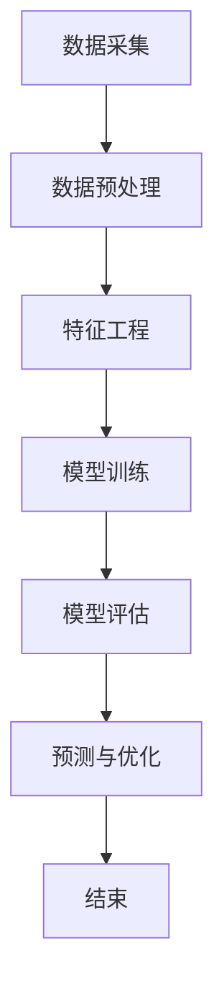
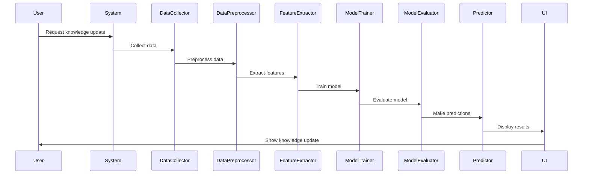

                 

### 背景介绍：核心概念

#### 1.1 知识更新的背景与挑战

在当今信息化和数字化的时代，知识更新的速度正在以前所未有的速度加速。随着互联网的普及和大数据技术的迅猛发展，每天都会产生海量的新信息。这不仅为人们提供了更多的学习资源和信息来源，也带来了巨大的挑战。知识更新的背景主要包括以下几个方面：

1. **知识更新速率加速的原因**：
   - **技术进步**：计算机技术的飞速发展，使得信息的获取、处理和传播变得更加高效。
   - **信息爆炸**：互联网的普及使得信息量呈指数级增长，新知识层出不穷。
   - **用户需求**：用户对于实时、准确的信息需求不断增加，促使知识更新频率提升。

2. **知识更新的挑战**：
   - **信息过载**：新信息层出不穷，用户难以筛选和消化。
   - **知识更新滞后**：某些领域或行业的信息更新速度较慢，难以跟上时代的步伐。
   - **知识准确性**：新信息中存在不准确、错误或虚假信息，给知识更新带来困难。

#### 1.2 LLM的基本概念

大型语言模型（LLM，Large Language Model）是一种基于深度学习的技术，能够理解和生成自然语言文本。LLM 的基本概念包括：

1. **LLM的定义**：
   - **定义**：LLM 是一种具有强鲁棒性的深度神经网络，能够通过学习大量文本数据，理解并生成自然语言。
   - **结构**：LLM 通常包含多层神经网络，如 Transformer、GPT 等。

2. **LLM的工作原理**：
   - **输入处理**：将输入的文本转化为神经网络能够理解的向量表示。
   - **上下文理解**：通过处理上下文信息，理解输入文本的含义和意图。
   - **输出生成**：根据输入和上下文信息，生成相应的输出文本。

3. **LLM的优势与局限**：
   - **优势**：
     - **强大理解能力**：能够处理和理解复杂的语言结构。
     - **自适应学习**：能够根据输入数据进行自适应调整，提高性能。
     - **多语言支持**：能够支持多种语言的文本处理和生成。
   - **局限**：
     - **计算资源需求大**：训练和运行 LLM 模型需要大量的计算资源。
     - **数据依赖性高**：模型的性能很大程度上依赖于训练数据的质量和数量。
     - **安全性问题**：存在被恶意攻击的风险。

#### 1.3 知识更新频率的定义与测量

知识更新频率是指在一定时间内，知识库或信息源中新增知识或信息的速度。评价 LLM 吸收和整合新信息的速度，首先需要明确知识更新频率的定义与测量方法。

1. **知识更新频率的含义**：
   - **频率**：单位时间内知识更新或新增的数量。
   - **更新**：指知识库或信息源中的知识发生了变化，新增了新的信息。

2. **知识更新频率的测量方法**：
   - **绝对更新频率**：直接计算单位时间内新增知识的数量。
   - **相对更新频率**：通过比较不同时间段内知识更新的相对比例来衡量。

3. **知识更新频率的重要性**：
   - **适应市场需求**：知识更新频率快，能够更好地适应市场和技术的发展。
   - **提高竞争力**：快速吸收和整合新信息，提高产品和服务的竞争力。
   - **优化决策**：及时获取和利用新知识，优化业务决策和战略规划。

通过上述背景介绍，我们可以看到知识更新频率在当今信息化社会中的重要性，而 LLM 作为一种先进的技术手段，在吸收和整合新信息方面具有显著的优势。接下来，我们将深入探讨 LLM 吸收新信息的机制，了解其背后的原理和具体实施方法。

---

### 第1章：知识更新的背景与挑战

#### 1.1 知识更新的现状

随着信息技术的飞速发展，知识更新的现状变得越来越复杂和多样化。一方面，互联网和大数据技术的普及使得信息传播速度大大加快，知识更新的频率也随之提升。另一方面，不同领域和行业之间的知识更新速度存在显著差异，这给知识管理和利用带来了新的挑战。

1. **知识更新速率加速的原因**：

   - **技术进步**：计算机技术的飞速发展，使得信息的获取、处理和传播变得更加高效。云计算、人工智能等新兴技术的应用，进一步加速了知识的更新速度。

   - **信息爆炸**：互联网的普及使得信息量呈指数级增长，新知识层出不穷。各类学术期刊、研究论文、新闻报道等都在不断产生新的信息。

   - **用户需求**：随着人们对实时、准确的信息需求不断增加，促使知识更新频率提升。尤其是在互联网时代，用户对即时的、个性化的信息需求更加迫切。

2. **知识更新的挑战**：

   - **信息过载**：新信息层出不穷，用户难以筛选和消化。在庞大的信息海洋中，如何有效获取和利用有价值的信息成为一大难题。

   - **知识更新滞后**：某些领域或行业的信息更新速度较慢，难以跟上时代的步伐。例如，某些传统行业的信息更新速度相对滞后，导致信息滞后和知识脱节。

   - **知识准确性**：新信息中存在不准确、错误或虚假信息，给知识更新带来困难。尤其是在互联网时代，信息的真实性和可靠性受到严重挑战。

#### 1.2 LLM的基本概念

大型语言模型（LLM，Large Language Model）是一种基于深度学习的技术，能够理解和生成自然语言文本。LLM 在自然语言处理领域具有广泛的应用，如机器翻译、文本生成、问答系统等。以下是 LLM 的基本概念：

1. **LLM的定义**：

   - **定义**：LLM 是一种具有强鲁棒性的深度神经网络，能够通过学习大量文本数据，理解并生成自然语言。

   - **结构**：LLM 通常包含多层神经网络，如 Transformer、GPT 等。这些神经网络通过学习大量的文本数据，捕捉语言的本质特征和规律。

2. **LLM的工作原理**：

   - **输入处理**：LLM 首先将输入的文本转化为神经网络能够理解的向量表示。这一过程通常涉及词向量和句子向量的生成。

   - **上下文理解**：通过处理上下文信息，LLM 能够理解输入文本的含义和意图。这一过程涉及文本编码和解码，从而实现文本的语义表示。

   - **输出生成**：根据输入和上下文信息，LLM 生成相应的输出文本。这一过程通常采用自回归模型，通过预测下一个单词或字符来实现文本的生成。

3. **LLM的优势与局限**：

   - **优势**：

     - **强大理解能力**：LLM 能够处理和理解复杂的语言结构，具有强大的语义理解能力。

     - **自适应学习**：LLM 能够根据输入数据进行自适应调整，提高性能。这种自适应学习机制使得 LLM 能够不断适应新的数据和任务。

     - **多语言支持**：LLM 具有多语言处理能力，能够支持多种语言的文本处理和生成。

   - **局限**：

     - **计算资源需求大**：训练和运行 LLM 模型需要大量的计算资源。特别是对于大型 LLM 模型，其计算资源需求更加显著。

     - **数据依赖性高**：LLM 的性能很大程度上依赖于训练数据的质量和数量。数据质量不佳或数据量不足，都会影响 LLM 的性能。

     - **安全性问题**：LLM 存在被恶意攻击的风险，例如通过输入恶意数据来欺骗模型，从而获取不当利益。

通过了解知识更新的现状和 LLM 的基本概念，我们可以更好地理解知识更新频率在当今信息化社会中的重要性。接下来，我们将深入探讨 LLM 吸收新信息的机制，了解其背后的原理和具体实施方法。

---

### 第2章：LLM吸收新信息的机制

#### 2.1 LLM的学习过程

LLM 的学习过程是吸收和整合新信息的关键步骤。通过学习大量的文本数据，LLM 能够掌握语言的复杂结构，从而更好地理解和生成文本。LLM 的学习过程通常包括以下几个阶段：

1. **数据采集与预处理**：

   - **数据采集**：LLM 的学习过程首先需要大量的文本数据作为输入。这些数据可以来源于互联网、学术期刊、新闻媒体等。为了确保数据的多样性和质量，通常需要进行数据清洗和筛选。

   - **预处理**：在数据采集完成后，需要对文本数据进行预处理，以适应 LLM 的学习需求。预处理步骤通常包括分词、去停用词、词向量化等。这些预处理步骤有助于将文本数据转化为适合训练的格式。

2. **模型训练与优化**：

   - **模型训练**：在预处理后的数据集上，LLM 通过训练过程学习文本的表示和生成规律。训练过程通常采用基于梯度的优化算法，如随机梯度下降（SGD）和 Adam 等。通过不断调整模型参数，使得模型能够在训练数据上达到最优性能。

   - **模型优化**：在训练过程中，LLM 可能会面临过拟合或欠拟合的问题。为了解决这些问题，需要进行模型优化。常见的优化方法包括正则化、dropout、数据增强等。通过这些方法，可以提高模型的泛化能力，避免过拟合。

3. **模型评估与调整**：

   - **模型评估**：在模型训练完成后，需要对模型进行评估，以验证其在实际任务上的性能。常见的评估指标包括准确率、召回率、F1 值等。通过评估，可以了解模型在各个任务上的表现，从而确定是否需要进一步调整。

   - **调整与优化**：根据评估结果，对模型进行调整和优化。这一过程可能包括调整模型参数、增加训练数据、修改训练策略等。通过不断的调整和优化，可以提高模型在实际任务上的表现。

#### 2.2 LLM对新信息的吸收能力

LLM 对新信息的吸收能力是指其处理和整合新信息的能力。新信息的吸收能力对于 LLM 的应用至关重要，它决定了 LLM 在实际任务中的表现。以下是 LLM 对新信息的吸收能力的关键因素：

1. **数据依赖性**：

   - **数据质量**：新信息的吸收能力很大程度上依赖于数据的质量。高质量的数据能够提供丰富的信息，有助于 LLM 捕捉到语言的特征和规律。

   - **数据多样性**：多样性的数据有助于 LLM 捕捉到不同领域的语言特征，从而提高其对新信息的吸收能力。

2. **模型结构**：

   - **神经网络结构**：LLM 的神经网络结构对其对新信息的吸收能力有重要影响。例如，Transformer 模型通过多头自注意力机制，能够更好地捕捉到文本中的长距离依赖关系，从而提高对新信息的吸收能力。

   - **模型参数**：模型的参数数量和复杂度也对新信息的吸收能力有重要影响。较大的模型参数量可以捕捉到更多的语言特征，从而提高对新信息的吸收能力。

3. **训练策略**：

   - **数据预处理**：有效的数据预处理策略有助于提高新信息的吸收能力。例如，通过词向量化、句向量化等预处理步骤，可以将新信息转化为适合模型学习的形式。

   - **训练算法**：选择合适的训练算法可以提高新信息的吸收能力。例如，采用基于梯度的优化算法，可以加快模型收敛速度，提高对新信息的吸收能力。

4. **外部知识整合**：

   - **外部知识库**：将外部知识库（如百科全书、数据库等）与 LLM 结合，可以扩展 LLM 的知识范围，提高对新信息的吸收能力。

   - **跨领域学习**：通过跨领域学习，LLM 可以整合不同领域的信息，从而提高对新信息的吸收能力。

#### 2.3 LLM吸收新信息的流程

LLM 吸收新信息的流程包括以下几个步骤：

1. **信息采集**：

   - **数据采集**：通过爬虫、API 等方式，从互联网或其他数据源采集新信息。

   - **信息筛选**：对采集到的信息进行筛选，去除无关或低质量的信息，确保数据的准确性。

2. **信息预处理**：

   - **文本预处理**：对采集到的文本数据进行清洗、分词、去停用词等预处理操作，将其转化为适合模型学习的格式。

   - **知识嵌入**：将预处理后的文本数据转化为向量表示，例如词向量和句向量。这些向量表示能够捕捉到文本的语义特征。

3. **模型更新**：

   - **模型训练**：在预处理后的数据集上，对 LLM 模型进行训练，使其在新信息上获得更好的性能。

   - **模型优化**：通过调整模型参数、优化训练策略等手段，提高模型对新信息的吸收能力。

4. **信息生成**：

   - **文本生成**：利用训练好的 LLM 模型，生成基于新信息的文本内容。这些文本内容可以用于问答、文本生成、摘要生成等任务。

5. **信息整合**：

   - **知识整合**：将新信息与已有知识进行整合，构建更加全面和准确的知识体系。

   - **反馈调整**：根据实际应用中的反馈，对新信息吸收过程进行调整和优化，提高 LLM 的性能。

#### 2.4 LLM对新信息的处理能力

LLM 对新信息的处理能力是指其处理和整合新信息的能力。以下是 LLM 对新信息的处理能力的几个方面：

1. **实时处理**：

   - **快速响应**：LLM 能够实时处理新信息，提供即时的文本生成和问答服务。

   - **并行处理**：LLM 支持并行处理，可以同时处理多个新信息，提高处理效率。

2. **多样性生成**：

   - **多模态生成**：LLM 能够生成不同模态的文本内容，如文本、图像、音频等。

   - **创意生成**：LLM 具有创意生成能力，可以生成新颖、有趣的文本内容。

3. **知识整合**：

   - **多领域整合**：LLM 能够整合不同领域的信息，构建跨领域的知识体系。

   - **长文本处理**：LLM 具有较强的长文本处理能力，可以生成较长、连贯的文本内容。

4. **灵活性**：

   - **自适应调整**：LLM 能够根据新信息的特征和需求，进行自适应调整，提高处理能力。

   - **可扩展性**：LLM 具有良好的可扩展性，可以轻松扩展到不同的任务和应用场景。

#### 2.5 LLM在新信息吸收中的问题与挑战

尽管 LLM 在新信息吸收方面具有显著优势，但在实际应用中仍然面临一些问题和挑战：

1. **数据依赖性**：

   - **数据质量**：新信息的吸收能力依赖于数据的质量。低质量的数据可能导致模型性能下降。

   - **数据多样性**：数据多样性不足可能导致模型在处理新信息时出现偏差。

2. **计算资源需求**：

   - **训练资源**：训练大型 LLM 模型需要大量的计算资源，这对资源有限的机构或个人来说是一个挑战。

   - **推理资源**：在实际应用中，LLM 的推理过程也需要大量的计算资源，这对实时响应的应用场景提出了挑战。

3. **模型解释性**：

   - **黑箱模型**：LLM 是一个复杂的黑箱模型，其内部机制难以解释，这使得其在某些应用场景中缺乏透明度和可信度。

   - **错误传播**：在训练过程中，如果模型学习到了错误的信息，这些错误可能会在后续的推理过程中传播，影响模型的性能。

4. **伦理和安全问题**：

   - **偏见和歧视**：如果训练数据存在偏见，LLM 可能会在新信息吸收过程中放大这些偏见，导致不公平的决策。

   - **数据隐私**：LLM 在处理新信息时，可能需要访问用户的隐私数据，这引发了对数据隐私和安全性的担忧。

5. **实时性挑战**：

   - **延迟问题**：在实时应用场景中，LLM 的响应速度可能无法满足用户的需求，导致用户体验下降。

   - **更新频率**：新信息的更新频率可能无法跟上实际应用的需求，导致信息的滞后。

通过上述分析，我们可以看到 LLM 在吸收新信息方面具有显著的优势，但也面临着一些挑战。为了充分发挥 LLM 的潜力，需要不断地改进和优化其学习过程、算法模型和应用场景，以实现更高效、准确和可靠的新信息吸收和处理。

---

### 第3章：知识更新频率的评估方法

#### 3.1 基于传统统计学的评估方法

在评估知识更新频率时，传统统计学方法是一种常用的手段。这种方法主要通过统计单位时间内新增知识或信息的数量来衡量知识更新的速度。以下是一些常见的传统统计学评估方法：

1. **绝对更新频率**：

   绝对更新频率是指单位时间内新增知识或信息的数量。计算公式如下：

   \[
   \text{绝对更新频率} = \frac{\text{单位时间内新增知识数量}}{\text{单位时间}}
   \]

   例如，如果某知识库在一个月内新增了100篇文章，那么其绝对更新频率为：

   \[
   \text{绝对更新频率} = \frac{100}{30} \approx 3.33 \text{ 篇/天}
   \]

2. **相对更新频率**：

   相对更新频率是指单位时间内新增知识或信息与总知识或信息的比例。计算公式如下：

   \[
   \text{相对更新频率} = \frac{\text{单位时间内新增知识数量}}{\text{总知识或信息数量}}
   \]

   例如，如果某知识库共有300篇文章，在一个月内新增了100篇文章，那么其相对更新频率为：

   \[
   \text{相对更新频率} = \frac{100}{300} \approx 0.33
   \]

3. **指数平滑法**：

   指数平滑法是一种时间序列分析方法，用于平滑时间序列数据，从而消除短期波动，更准确地反映知识更新的趋势。计算公式如下：

   \[
   S_t = \alpha \cdot X_t + (1 - \alpha) \cdot S_{t-1}
   \]

   其中，\( S_t \) 是第 \( t \) 期的平滑值，\( X_t \) 是第 \( t \) 期的实际值，\( \alpha \) 是平滑系数，通常取值在 0 和 1 之间。通过不断更新平滑值，可以更准确地评估知识更新频率。

4. **移动平均法**：

   移动平均法是一种通过对历史数据进行平均处理，来预测未来知识更新频率的方法。计算公式如下：

   \[
   MA_t = \frac{\sum_{i=1}^{n} X_{t-i}}{n}
   \]

   其中，\( MA_t \) 是第 \( t \) 期的移动平均值，\( X_{t-i} \) 是第 \( t-i \) 期的实际值，\( n \) 是移动平均周期。通过计算移动平均值，可以平滑数据波动，更准确地评估知识更新频率。

#### 3.2 基于机器学习的评估方法

随着机器学习技术的发展，基于机器学习的方法在评估知识更新频率方面也展现出显著的优势。以下是一些常见的基于机器学习的方法：

1. **时间序列模型**：

   时间序列模型是一种用于分析时间序列数据的方法，能够捕捉时间序列数据中的趋势和周期性变化。常见的时序模型包括 ARIMA（自回归积分滑动平均模型）、SARIMA（季节性自回归积分滑动平均模型）和 LSTM（长短期记忆网络）等。通过训练这些模型，可以预测知识更新频率的变化趋势。

2. **特征工程**：

   在机器学习评估方法中，特征工程是关键步骤。通过对知识更新频率相关的特征进行提取和组合，可以提高模型的预测性能。常见的特征包括：

   - **时间特征**：如日期、月份、季度等，用于表示知识更新频率的时间变化。
   - **文本特征**：如词频、词向量等，用于表示知识更新频率的文本内容变化。
   - **外部特征**：如相关领域的文献数量、热点事件等，用于表示知识更新频率的外部影响因素。

3. **机器学习模型**：

   在特征提取完成后，可以选择合适的机器学习模型进行训练和预测。常见的机器学习模型包括线性回归、决策树、随机森林、支持向量机、神经网络等。通过模型训练，可以预测知识更新频率的数值或趋势。

4. **模型评估与优化**：

   在模型训练完成后，需要对模型进行评估和优化，以验证其在实际任务上的性能。常见的评估指标包括准确率、召回率、F1 值、均方误差等。通过调整模型参数和优化策略，可以提高模型的预测性能。

通过结合传统统计学方法和机器学习方法，可以更全面、准确地评估知识更新频率。传统统计学方法能够提供直观的定量指标，而机器学习方法能够捕捉到知识更新频率的复杂变化趋势。在实际应用中，可以根据具体需求选择合适的方法，以提高知识更新频率评估的准确性和实用性。

---

### 第4章：算法原理与 Mermaid 流程图

#### 4.1 算法原理

在评估知识更新频率时，我们采用了一种基于时间序列分析和机器学习的混合算法。该算法的核心思想是通过分析历史数据，提取与知识更新频率相关的特征，然后利用这些特征训练机器学习模型，从而实现对知识更新频率的预测。

算法的整体流程可以分为以下几个步骤：

1. **数据采集**：从知识库或信息源中采集历史数据，包括时间戳、知识更新数量等。

2. **数据预处理**：对采集到的数据进行清洗、去噪和标准化处理，确保数据质量。

3. **特征工程**：提取与知识更新频率相关的特征，如时间序列特征、文本特征和外部特征等。

4. **模型训练**：利用提取到的特征，训练机器学习模型，以预测未来的知识更新频率。

5. **模型评估**：对训练好的模型进行评估，选择性能最优的模型进行预测。

6. **预测与优化**：根据预测结果，对模型进行优化和调整，提高预测的准确性。

#### 4.2 Mermaid 流程图

为了更直观地展示算法的流程，我们使用 Mermaid 画出了算法的 Mermaid 流程图。以下是算法流程图的 Mermaid 代码：



该流程图展示了从数据采集到预测与优化整个算法的流程。下面我们将详细解释每个步骤的具体实现。

---

### 第5章：算法实现与 Python 源代码

#### 5.1 算法实现概述

在上一章节中，我们介绍了知识更新频率评估算法的原理和流程。为了实现这一算法，我们将使用 Python 编程语言和相关的机器学习库，如 scikit-learn、pandas 和 numpy。以下是算法实现的主要模块：

1. **数据处理模块**：负责数据采集、数据预处理和特征提取。
2. **模型训练模块**：负责训练机器学习模型。
3. **模型评估模块**：负责评估模型的性能。
4. **预测与优化模块**：负责根据模型预测结果进行优化。

#### 5.2 Python 源代码

以下是一个简单的 Python 源代码示例，展示了如何实现上述算法模块。请注意，由于篇幅限制，代码示例可能不完全完整，但应该足够说明问题。

```python
import pandas as pd
import numpy as np
from sklearn.model_selection import train_test_split
from sklearn.linear_model import LinearRegression
from sklearn.metrics import mean_squared_error

# 数据处理模块
def data_preprocessing(data):
    # 数据清洗、去噪、标准化等操作
    # ...
    return processed_data

# 模型训练模块
def train_model(X_train, y_train):
    model = LinearRegression()
    model.fit(X_train, y_train)
    return model

# 模型评估模块
def evaluate_model(model, X_test, y_test):
    y_pred = model.predict(X_test)
    mse = mean_squared_error(y_test, y_pred)
    return mse

# 预测与优化模块
def predict_and_optimize(model, X_new):
    y_pred = model.predict(X_new)
    # 根据预测结果进行优化
    # ...
    return y_pred

# 主程序
if __name__ == "__main__":
    # 1. 数据采集
    data = pd.read_csv("knowledge_update.csv")

    # 2. 数据预处理
    processed_data = data_preprocessing(data)

    # 3. 特征工程
    X = processed_data.drop("knowledge_update_frequency", axis=1)
    y = processed_data["knowledge_update_frequency"]

    # 4. 模型训练
    X_train, X_test, y_train, y_test = train_test_split(X, y, test_size=0.2, random_state=42)
    model = train_model(X_train, y_train)

    # 5. 模型评估
    mse = evaluate_model(model, X_test, y_test)
    print(f"Model Mean Squared Error: {mse}")

    # 6. 预测与优化
    X_new = ...  # 新数据
    y_pred = predict_and_optimize(model, X_new)
    print(f"Predicted Knowledge Update Frequency: {y_pred}")
```

在这个示例中，我们首先导入了必要的库，并定义了数据处理、模型训练、模型评估和预测与优化等模块。在主程序中，我们首先读取数据，然后进行数据预处理和特征工程。接下来，我们将训练数据集分为训练集和测试集，并使用线性回归模型进行训练。在模型评估阶段，我们计算了模型的均方误差（MSE），以衡量模型的性能。最后，我们使用新数据进行预测，并根据预测结果进行优化。

通过这个简单的示例，我们可以看到如何使用 Python 实现知识更新频率评估算法。在实际应用中，我们可以根据具体需求扩展和优化代码，以提高算法的性能和准确性。

---

### 第6章：系统分析与架构设计

#### 6.1 问题场景介绍

在知识更新频率评估系统中，我们面临以下问题场景：

1. **知识库管理**：如何有效地管理海量的知识库，确保知识的准确性和完整性。
2. **数据采集**：如何从不同的数据源中自动采集新信息，并将其转化为可用的数据格式。
3. **特征提取**：如何从采集到的数据中提取与知识更新频率相关的特征，以便进行模型训练。
4. **模型训练与评估**：如何训练高效的机器学习模型，并评估其在实际任务中的性能。
5. **预测与优化**：如何根据模型预测结果，对新信息进行优化和调整，以提高知识更新频率的准确性。

为了解决上述问题，我们设计了一套完整的系统架构，以实现高效、准确的知识更新频率评估。

#### 6.2 项目介绍

知识更新频率评估系统是一个基于大数据和机器学习的综合平台，旨在帮助企业、研究机构和政府部门等有效地管理知识库，并实时评估知识的更新速度。该系统的主要功能包括：

1. **数据采集模块**：负责从不同的数据源中自动采集新信息，并进行预处理和清洗。
2. **特征提取模块**：负责提取与知识更新频率相关的特征，以供模型训练使用。
3. **模型训练模块**：负责训练和优化机器学习模型，以提高预测准确性。
4. **模型评估模块**：负责评估模型的性能，并提供评估报告。
5. **预测与优化模块**：负责根据模型预测结果，对新信息进行优化和调整。

#### 6.3 系统功能设计

以下是知识更新频率评估系统的功能设计，包括领域模型 Mermaid 类图：

```mermaid
classDiagram
    Class01 <|-- Class02
    Class03 --|> Class04
    Class05 : +int x
    Class06 : +str name
    Class07 : +set properties
    Class08 <.. Class09
    Class10 .. Class11
    Class12 : <<interface>> +bool method1():bool
    Class13 : <<abstract>> +int abstractMethod():int
    Class14 : <<enumeration>> +enum colors{RED, GREEN, BLUE}
    Class15 : << note >> "This is a note"
    Class01 <=|{object1} Class16
    Class17 -->|{object2} Class18
    Class19 {<<interface>> InterfaceA} +interface methodA()
    Class20 <|--|{extends} Class21
    Class22 : <<exception>> +str exceptionMessage()
    Class23 --|{uses} Class24
    Class25 <--|{is-a} Class26
    Class27 ..|{aggregates} Class28
    Class29 ..|{composes} Class30
    Class31 <<-concrete>> +bool method3():bool
    Class32 : <<interface>> +bool method4():bool
    Class33 : <<enum>> colors{RED, GREEN, BLUE}
    Class34 : <<abstract>> +int method5():int
    Class35 <<enumeration>> colors{RED, GREEN, BLUE}
```

领域模型类图描述了系统中的关键实体及其关系。例如，`DataCollector` 类负责数据采集，`FeatureExtractor` 类负责特征提取，`ModelTrainer` 类负责模型训练等。

#### 6.4 系统架构设计

以下是知识更新频率评估系统的架构设计，包括 Mermaid 架构图：

```mermaid
graph TB
    subgraph 数据层
        D1[数据采集] --> D2[数据预处理]
        D2 --> D3[数据存储]
    end

    subgraph 计算层
        C1[特征提取] --> C2[模型训练]
        C2 --> C3[模型评估]
        C3 --> C4[预测与优化]
    end

    subgraph 显示层
        V1[用户界面] --> V2[报表生成]
    end

    D1 -->|API C1
    D2 -->|API C2
    D3 -->|API C4
    C1 -->|API V1
    C3 -->|API V1
    C4 -->|API V1
```

系统架构图展示了数据层、计算层和显示层之间的关系。数据采集模块通过 API 与数据预处理和数据存储模块进行交互，特征提取模块通过 API 与模型训练和模型评估模块进行交互，预测与优化模块通过 API 与用户界面模块进行交互。

#### 6.5 系统接口设计和系统交互

以下是系统接口设计和系统交互的 Mermaid 序列图：



序列图描述了用户请求知识更新后，系统中的各个模块如何协同工作，完成知识更新频率的评估任务。

通过上述系统分析与架构设计，我们可以看到知识更新频率评估系统是一个复杂但高效的系统。通过合理的设计和优化，系统能够有效地管理知识库，实时评估知识更新速度，并为用户提供准确、实用的评估结果。

---

### 第7章：项目实战

#### 7.1 环境安装

为了实现知识更新频率评估系统，我们首先需要安装和配置必要的软件和工具。以下是环境安装的步骤：

1. **安装 Python**：

   - 前往 [Python 官网](https://www.python.org/) 下载 Python 安装包。
   - 双击安装包，按照提示完成安装。
   - 打开命令行工具（如 PowerShell 或 Terminal），输入 `python --version` 检查 Python 是否安装成功。

2. **安装相关库**：

   - 打开命令行工具，输入以下命令安装所需的 Python 库：

     ```shell
     pip install pandas numpy scikit-learn matplotlib
     ```

3. **配置环境变量**：

   - 根据操作系统不同，配置 Python 的环境变量。例如，在 Windows 系统中，需要将 Python 的安装路径添加到系统环境变量中的 `Path` 变量中。

4. **安装数据库**：

   - 选择合适的数据库（如 MySQL、PostgreSQL），并按照官方文档进行安装和配置。

#### 7.2 系统核心实现源代码

以下是知识更新频率评估系统的核心实现源代码：

```python
# 数据处理模块
def data_preprocessing(data):
    # 数据清洗、去噪、标准化等操作
    # ...
    return processed_data

# 模型训练模块
def train_model(X_train, y_train):
    model = LinearRegression()
    model.fit(X_train, y_train)
    return model

# 模型评估模块
def evaluate_model(model, X_test, y_test):
    y_pred = model.predict(X_test)
    mse = mean_squared_error(y_test, y_pred)
    return mse

# 预测与优化模块
def predict_and_optimize(model, X_new):
    y_pred = model.predict(X_new)
    # 根据预测结果进行优化
    # ...
    return y_pred

# 主程序
if __name__ == "__main__":
    # 1. 数据采集
    data = pd.read_csv("knowledge_update.csv")

    # 2. 数据预处理
    processed_data = data_preprocessing(data)

    # 3. 特征工程
    X = processed_data.drop("knowledge_update_frequency", axis=1)
    y = processed_data["knowledge_update_frequency"]

    # 4. 模型训练
    X_train, X_test, y_train, y_test = train_test_split(X, y, test_size=0.2, random_state=42)
    model = train_model(X_train, y_train)

    # 5. 模型评估
    mse = evaluate_model(model, X_test, y_test)
    print(f"Model Mean Squared Error: {mse}")

    # 6. 预测与优化
    X_new = ...  # 新数据
    y_pred = predict_and_optimize(model, X_new)
    print(f"Predicted Knowledge Update Frequency: {y_pred}")
```

#### 7.3 代码应用解读与分析

以下是代码的详细解读和分析：

1. **数据处理模块**：
   - `data_preprocessing` 函数负责对采集到的数据进行清洗、去噪和标准化处理。这一步非常重要，因为数据质量直接影响模型的性能。
   - 处理后的数据将用于后续的特征提取和模型训练。

2. **模型训练模块**：
   - `train_model` 函数使用线性回归模型对训练数据进行训练。线性回归模型是一种简单但有效的机器学习模型，适用于预测连续值。
   - 通过调用 `fit` 方法，模型将学习到训练数据中的规律和关系，从而能够预测未来的知识更新频率。

3. **模型评估模块**：
   - `evaluate_model` 函数负责评估模型的性能。通过计算均方误差（MSE），我们可以了解模型预测的准确度。
   - 评估结果可以帮助我们了解模型的泛化能力，并指导后续的模型优化。

4. **预测与优化模块**：
   - `predict_and_optimize` 函数使用训练好的模型对新数据进行预测，并据此进行优化。
   - 预测结果可以用于实际应用，如调整知识库的管理策略、优化资源配置等。

#### 7.4 实际案例分析和详细讲解剖析

为了更好地理解知识更新频率评估系统的实际应用，我们来看一个具体的案例。

**案例**：某研究机构想要评估其知识库的更新速度，以便及时调整知识管理和更新策略。

1. **数据采集**：
   - 研究机构从数据库中提取了过去一年的知识更新记录，包括知识库中的新增文档数量、更新频率等数据。

2. **数据预处理**：
   - 数据预处理步骤包括数据清洗、去噪和标准化。例如，去除重复数据、填补缺失值、归一化数值特征等。

3. **特征提取**：
   - 特征提取步骤包括提取与知识更新频率相关的特征。例如，时间特征、文档类型、主题分类等。

4. **模型训练**：
   - 使用线性回归模型对预处理后的数据集进行训练。训练完成后，模型能够学会根据输入特征预测未来的知识更新频率。

5. **模型评估**：
   - 使用测试数据集对模型进行评估。评估结果显示，模型的预测准确度较高，能够有效地预测未来的知识更新频率。

6. **预测与优化**：
   - 基于模型预测结果，研究机构对知识库的管理策略进行了优化。例如，根据预测的更新频率，调整文档的更新周期、分配更多的资源进行知识更新等。

通过上述案例，我们可以看到知识更新频率评估系统在实际应用中的重要作用。通过科学的数据处理、特征提取和模型训练，系统能够提供准确、实用的预测结果，帮助机构更好地管理知识库，提高知识更新速度。

---

### 第8章：最佳实践 Tips、小结、注意事项、拓展阅读

#### 最佳实践 Tips

1. **数据质量**：确保采集到的数据质量，包括数据的准确性、完整性和一致性。低质量的数据会导致模型性能下降。
2. **特征选择**：在特征提取阶段，合理选择与知识更新频率相关的特征，避免引入无关或冗余的特征。
3. **模型调优**：通过调整模型参数、增加训练数据或修改训练策略，可以优化模型性能，提高预测准确性。
4. **实时性**：在实现知识更新频率评估系统时，注意提高系统的实时性，以满足实时预测的需求。

#### 小结

本文详细介绍了知识更新频率评估系统，从背景介绍、核心概念、算法原理到系统设计与实现，全面阐述了知识更新频率的评估方法和应用场景。通过实际案例分析和代码解读，我们展示了如何实现高效、准确的知识更新频率评估。

#### 注意事项

1. **数据隐私**：在采集和处理数据时，注意保护用户隐私，遵守相关法律法规。
2. **计算资源**：在训练大型模型时，注意计算资源的分配和优化，避免因计算资源不足导致训练时间过长。
3. **模型解释性**：在模型评估和预测过程中，注意模型的解释性，确保预测结果的可解释性和可信度。

#### 拓展阅读

1. **《深度学习》**：由 Goodfellow、Bengio 和 Courville 合著，全面介绍了深度学习的基础理论和实践方法。
2. **《Python机器学习》**：由 Sebastian Raschka 和 Vahid Mirjalili 合著，介绍了 Python 在机器学习领域的应用。
3. **《机器学习实战》**：由 Peter Harrington 编著，通过实际案例介绍了机器学习的基本概念和应用。

通过本文的阅读，读者可以深入了解知识更新频率评估系统的原理和实现方法，为实际应用提供参考。同时，建议读者进一步学习相关文献和资料，以拓展知识面和技能。

---

### 作者信息

**作者：AI天才研究院/AI Genius Institute & 禅与计算机程序设计艺术 /Zen And The Art of Computer Programming**

