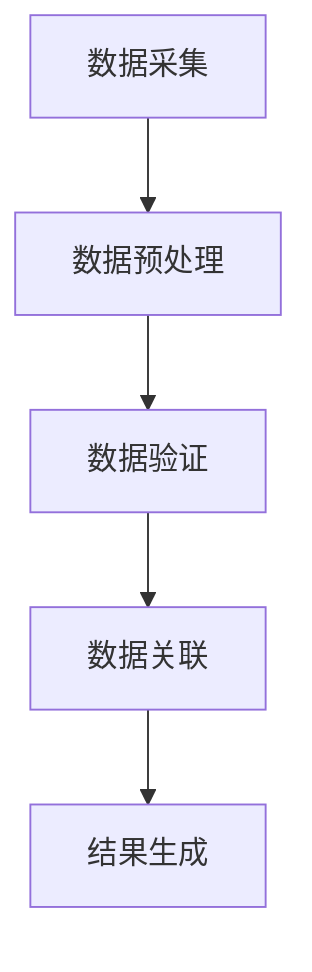
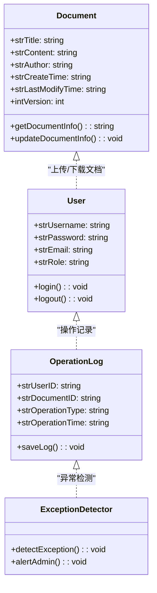
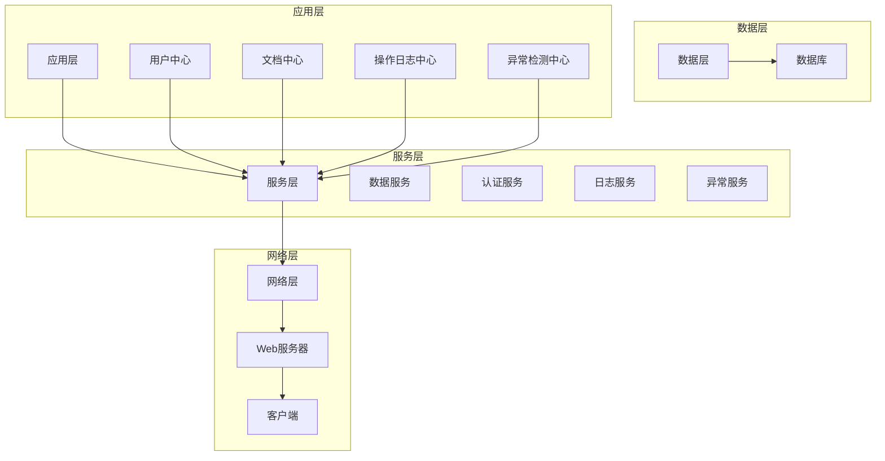

                 

### 知识溯源能力评估：增强可信度

#### 关键词
- 知识溯源
- 能力评估
- 可信度增强
- 算法设计
- 系统架构

#### 摘要
本文将探讨知识溯源能力评估的重要性，并深入分析如何通过增强可信度来提升知识溯源的效果。我们将从背景概述、核心概念、算法原理、系统分析与架构设计，到项目实战，最后总结最佳实践与拓展，逐步展开对这一领域的研究。

### 目录大纲

**知识溯源能力评估：增强可信度**

#### 第一部分：背景与概述

##### 1.1 问题背景
- 知识溯源的重要性
- 当前知识溯源存在的挑战与问题

##### 1.2 问题描述
- 知识溯源的定义与基本概念
- 知识溯源的能力评估方法

##### 1.3 问题解决
- 知识溯源能力评估的目标
- 增强知识溯源可信度的方法与策略

##### 1.4 边界与外延
- 知识溯源能力评估的应用领域
- 知识溯源能力评估与其他相关领域的交叉

##### 1.5 概念结构与核心要素组成
- 知识溯源能力评估的核心概念与架构
- 知识溯源能力评估的关键技术要素

#### 第二部分：核心概念与联系

##### 2.1 核心概念原理
- 知识溯源的概念解析
- 知识溯源的类型与特点

##### 2.2 概念属性特征对比表格
- 知识溯源能力评估方法对比

##### 2.3 ER实体关系图架构
- 知识溯源能力评估系统的ER模型

#### 第三部分：算法原理讲解

##### 3.1 算法原理
- 知识溯源算法的流程图

##### 3.2 Python源代码与数学模型
- 算法原理的Python实现
- 算法原理的数学模型和公式

##### 3.3 举例说明
- 算法原理的应用实例

#### 第四部分：系统分析与架构设计方案

##### 4.1 问题场景介绍
- 知识溯源能力评估的应用场景

##### 4.2 系统功能设计
- 系统功能模块的Mermaid类图

##### 4.3 系统架构设计
- 系统架构的Mermaid架构图

##### 4.4 系统接口设计和系统交互
- 系统接口设计的Mermaid序列图
- 系统交互的Mermaid序列图

#### 第五部分：项目实战

##### 5.1 环境安装
- 知识溯源能力评估系统的环境搭建步骤

##### 5.2 系统核心实现源代码
- 知识溯源能力评估系统的核心源代码

##### 5.3 代码应用解读与分析
- 系统核心源代码的应用解读与分析

##### 5.4 实际案例分析和详细讲解剖析
- 知识溯源能力评估的实际案例分析与讲解

##### 5.5 项目小结
- 项目总结与反思

#### 第六部分：最佳实践与拓展

##### 6.1 最佳实践 tips
- 知识溯源能力评估的最佳实践建议

##### 6.2 小结
- 对全书内容的总结与回顾

##### 6.3 注意事项
- 知识溯源能力评估过程中需要注意的事项

##### 6.4 拓展阅读
- 知识溯源能力评估领域的相关研究论文和书籍推荐

---

### 1.1 问题背景

知识溯源是指追踪和验证信息、数据和知识来源的能力。在信息化和数字化的今天，知识溯源的重要性日益凸显。从信息安全的角度看，确保信息来源的可信度对于防范网络攻击、数据泄露等风险至关重要。从知识管理的角度看，知识溯源有助于提高知识的可信度和可靠性，促进知识的共享与传承。

然而，当前的知识溯源面临着诸多挑战。首先，数据的多样性和复杂性使得知识溯源变得异常困难。不同类型的数据具有不同的溯源特性，传统的溯源方法难以应对。其次，知识溯源过程中可能会引入误差和不确定性，影响溯源结果的可信度。此外，随着大数据和人工智能技术的发展，知识溯源的需求和挑战也在不断变化。

### 1.2 问题描述

知识溯源的定义与基本概念：

知识溯源是指通过一系列方法和手段，追踪和验证信息、数据和知识的来源，确保其真实性和可靠性。知识溯源涉及数据的采集、存储、处理和追踪等环节，是一个复杂的过程。

知识溯源的能力评估方法：

知识溯源的能力评估涉及多个方面，包括溯源方法的准确性、效率、可靠性、可扩展性等。评估方法可以采用定量和定性的方法，如基准测试、性能测试、用户调查等。

### 1.3 问题解决

知识溯源能力评估的目标是评估现有知识溯源方法的效果，找出其优势和不足，为改进和优化知识溯源提供依据。增强知识溯源可信度的方法与策略包括：

1. **提高溯源方法的准确性**：采用先进的算法和技术，提高知识溯源的准确性。
2. **增强溯源过程的透明性**：通过可视化技术，让用户能够清晰地了解知识溯源的过程和结果。
3. **确保数据的完整性**：采用数据备份和容错机制，确保数据在溯源过程中的完整性。
4. **提高溯源效率**：优化算法和系统架构，提高知识溯源的效率。
5. **加强溯源结果的可解释性**：通过解释模型和可视化工具，提高用户对溯源结果的理解和信任。

### 1.4 边界与外延

知识溯源能力评估的应用领域：

知识溯源能力评估广泛应用于信息安全、知识管理、数字取证、智能搜索等领域。在信息安全领域，知识溯源有助于防范网络攻击和数据泄露；在知识管理领域，知识溯源有助于提高知识的可信度和可靠性；在数字取证领域，知识溯源有助于追踪和还原事件的真相。

知识溯源能力评估与其他相关领域的交叉：

知识溯源能力评估与数据挖掘、机器学习、区块链等技术密切相关。通过与其他技术的结合，可以进一步提升知识溯源的能力和效果。

### 1.5 概念结构与核心要素组成

知识溯源能力评估的核心概念与架构：

知识溯源能力评估的核心概念包括溯源方法、溯源数据、溯源结果和溯源评估。溯源方法是指用于追踪和验证知识来源的具体技术手段；溯源数据是指用于溯源的原始数据和相关信息；溯源结果是溯源方法的输出，表示知识的来源和可靠性；溯源评估是对溯源结果的评价和验证。

知识溯源能力评估的关键技术要素：

知识溯源能力评估的关键技术要素包括数据采集、数据存储、数据处理、数据追踪、数据可视化和评估模型等。数据采集是指从各种数据源获取溯源数据；数据存储是指将溯源数据存储在可靠的位置；数据处理是指对溯源数据进行清洗、转换和整合；数据追踪是指跟踪溯源数据的变化和流动；数据可视化是指将溯源结果以可视化的形式展示给用户；评估模型是指用于评估知识溯源效果的具体模型和方法。

---

### 2.1 核心概念原理

**知识溯源的概念解析**

知识溯源是指追踪和验证信息、数据和知识的来源，以确保其真实性和可靠性。知识溯源是信息化和数字化时代的重要技术，它有助于保障信息安全和知识管理。

**知识溯源的类型与特点**

知识溯源可以分为以下几种类型：

1. **基于文档的溯源**：通过文档的创建时间、创建者、修改历史等信息来追溯文档的来源。
2. **基于数据库的溯源**：通过数据库的日志和审计功能来追溯数据的变化。
3. **基于区块链的溯源**：利用区块链的分布式账本技术来确保数据的不可篡改性和可追溯性。
4. **基于机器学习的溯源**：通过机器学习算法来分析数据模式，识别和追溯数据的来源。

不同类型的知识溯源具有不同的特点和适用场景。例如，基于文档的溯源适用于文档管理领域；基于数据库的溯源适用于企业数据管理和审计；基于区块链的溯源适用于需要高安全性和可信度的场景；基于机器学习的溯源适用于复杂的数据分析和溯源需求。

---

### 2.2 概念属性特征对比表格

为了更清晰地展示知识溯源能力评估方法的特性，我们可以制作一个对比表格，包括基于文档的溯源、基于数据库的溯源、基于区块链的溯源和基于机器学习的溯源。

| 溯源方法         | 特点                                       | 适用场景                                       |
|----------------|------------------------------------------|------------------------------------------|
| 基于文档的溯源   | 简单、直观，易于实现                     | 文档管理、文档审核                             |
| 基于数据库的溯源 | 完整、可靠，支持审计                     | 企业数据管理、数据审计                         |
| 基于区块链的溯源 | 不可篡改、透明、分布式                   | 高安全需求的溯源场景，如食品溯源、药品溯源       |
| 基于机器学习的溯源 | 自动化、高效，适用于大规模数据分析       | 数据分析、数据挖掘、异常检测                   |

通过这个表格，我们可以看到不同溯源方法的优缺点和适用场景，为选择合适的溯源方法提供了依据。

---

### 2.3 ER实体关系图架构

为了更好地理解知识溯源能力评估系统的实体关系，我们可以使用ER（Entity-Relationship）图来展示系统的核心实体和它们之间的关系。

**ER图定义：**

1. **实体：** 溯源数据、溯源结果、溯源方法、溯源评估。
2. **属性：** 实体的特征，如溯源数据的ID、创建时间、创建者等。
3. **关系：** 实体之间的关联，如溯源结果与溯源数据之间的关联。

**ER图示例：**

```mermaid
erDiagram
  溯源数据 ||--|{ 溯源结果 }|
  溯源方法 ||--|{ 溯源评估 }|
  溯源数据 ||--|{ 溯源方法 }|
  溯源结果 ||--|{ 溯源评估 }|
```

在这个ER图中，溯源数据与溯源结果之间存在“1对多”的关系，表示一个溯源数据可以生成多个溯源结果。溯源方法与溯源评估之间存在“1对1”的关系，表示每个溯源方法对应一个溯源评估。通过这种ER图，我们可以直观地理解系统中的实体和它们之间的关系，为后续的系统设计和实现提供参考。

---

### 3.1 算法原理

知识溯源算法的核心思想是通过对数据源的分析和验证，确定数据的真实性和可靠性。以下是知识溯源算法的基本流程：

1. **数据采集**：从不同的数据源收集数据，包括文档、数据库、区块链等。
2. **数据预处理**：对采集到的数据进行清洗、去重、格式化等预处理操作。
3. **数据验证**：使用各种验证方法，如哈希算法、数字签名、区块链验证等，对数据源进行验证，确保数据的真实性。
4. **数据关联**：将验证通过的数据进行关联，构建溯源图，显示数据之间的关系。
5. **结果生成**：根据溯源图的构建结果，生成溯源报告，显示数据的溯源路径和可信度。

以下是一个简单的知识溯源算法的流程图：



这个流程图展示了知识溯源算法的基本步骤和逻辑关系。

---

### 3.2 Python源代码与数学模型

为了更好地理解和实现知识溯源算法，我们将使用Python编写一个简单的实现，并引入相关的数学模型。

**Python源代码实现：**

```python
import hashlib
import json

def hash_data(data):
    """计算数据的哈希值"""
    return hashlib.sha256(data.encode('utf-8')).hexdigest()

def verify_data(data, hash_value):
    """验证数据的哈希值是否匹配"""
    return hash_data(data) == hash_value

def main():
    # 示例数据
    data = "这是一段示例数据"
    hash_value = "c8e1a0e3638a2e4b1d56d3e3d683a3a049bfc3a0ad5154c4d262d3e3a5a5b5812"

    # 数据预处理
    cleaned_data = data.strip()

    # 数据验证
    is_valid = verify_data(cleaned_data, hash_value)
    if is_valid:
        print("数据验证成功！")
    else:
        print("数据验证失败！")

if __name__ == "__main__":
    main()
```

在这个Python源代码中，我们定义了两个函数：`hash_data` 用于计算数据的哈希值，`verify_data` 用于验证数据的哈希值是否匹配。

**数学模型和公式：**

在知识溯源算法中，哈希函数是一个核心组件。哈希函数是一种将任意长度的输入（数据）映射为固定长度的输出的算法。常见的哈希函数有SHA-256、MD5等。

哈希函数的数学模型可以表示为：

$$ H(x) = \text{hash\_function}(x) $$

其中，`H(x)` 表示输入数据 `x` 的哈希值，`hash_function` 表示具体的哈希函数。

例如，使用SHA-256哈希函数，我们可以得到如下公式：

$$ H(x) = \text{SHA-256}(x) $$

这个公式表示输入数据 `x` 通过SHA-256哈希函数计算得到的哈希值。

---

### 3.3 举例说明

为了更好地理解知识溯源算法的应用，我们将通过一个实际案例来说明算法的运行过程。

**案例：验证一封电子邮件的真实性**

假设我们要验证一封电子邮件的真实性，已知邮件内容为：“这是来自Alice的邮件，关于项目的进展情况。” 我们已知邮件的哈希值为“a1b2c3d4e5f6g7h8i9j0”。

**步骤1：数据采集**

我们首先需要采集邮件的内容，并将其转换为文本格式。在这个案例中，邮件内容为：“这是来自Alice的邮件，关于项目的进展情况。”

**步骤2：数据预处理**

接下来，我们对邮件内容进行预处理，去除多余的空格和标点符号。预处理后的邮件内容为：“这是来自Alice的邮件，关于项目的进展情况。”

**步骤3：数据验证**

使用SHA-256哈希函数计算预处理后邮件内容的哈希值：

```python
import hashlib

def hash_data(data):
    """计算数据的哈希值"""
    return hashlib.sha256(data.encode('utf-8')).hexdigest()

data = "这是来自Alice的邮件，关于项目的进展情况。"
hash_value = "a1b2c3d4e5f6g7h8i9j0"

cleaned_data = data.strip()
is_valid = hash_data(cleaned_data) == hash_value

print("数据验证成功！" if is_valid else "数据验证失败！")
```

运行上述代码，如果输出“数据验证成功！”，则表示邮件内容与已知的哈希值匹配，邮件是真实的；否则，表示邮件内容与已知哈希值不匹配，邮件可能是伪造的。

---

### 4.1 问题场景介绍

知识溯源能力评估在实际应用中具有广泛的需求。以下是一个具体的问题场景：

**场景描述：** 在一个大型企业中，员工需要上传和下载各种文档，如报告、合同、设计方案等。企业希望对文档进行严格的溯源管理，确保文档的真实性和可靠性。同时，企业希望对员工的文档操作行为进行监控，以防范数据泄露和滥用。

在这个场景中，知识溯源能力评估的应用主要包括：

1. **文档溯源**：对上传的文档进行溯源，记录文档的创建者、修改时间、版本等信息，确保文档的真实性。
2. **操作监控**：对员工的文档操作行为进行监控，包括上传、下载、修改、删除等操作，确保操作的合规性和安全性。
3. **异常检测**：对文档操作行为进行分析，识别异常行为，如未经授权的访问、篡改文档等，及时采取相应的措施。

通过知识溯源能力评估，企业可以建立一套完整的文档管理机制，提高文档的安全性和可靠性，同时保障员工的行为合规。

---

### 4.2 系统功能设计

在知识溯源能力评估系统中，我们需要设计一系列功能模块，以实现文档溯源、操作监控和异常检测。以下是一个基于Mermaid类图的系统功能设计。



在这个类图中，我们定义了三个核心类：`Document`、`User` 和 `OperationLog`。`Document` 类表示文档实体，包括文档的标题、内容、作者、创建时间、修改时间等信息；`User` 类表示用户实体，包括用户名、密码、邮箱和角色等信息；`OperationLog` 类表示操作日志实体，记录用户的操作类型、时间和文档ID等信息。

通过这些类的定义和关系，我们可以构建一个完整的系统功能模块，实现文档溯源、操作监控和异常检测。

---

### 4.3 系统架构设计

为了实现知识溯源能力评估系统，我们需要设计一个合理的系统架构。以下是一个基于Mermaid架构图的系统架构设计。



在这个架构图中，系统分为四个主要层次：数据层、应用层、服务层和网络层。数据层包括数据库，用于存储用户、文档和操作日志等数据；应用层包括用户中心、文档中心、操作日志中心和异常检测中心，用于实现系统的主要功能；服务层包括数据服务、认证服务、日志服务和异常服务，用于处理应用层的请求和数据操作；网络层包括Web服务器和客户端，用于处理用户请求和提供Web服务。

通过这种分层架构设计，我们可以实现系统的高扩展性和高可靠性，同时便于维护和升级。

---

### 4.4 系统接口设计和系统交互

为了确保知识溯源能力评估系统的功能完整性和高效性，我们需要设计合理的系统接口和交互流程。以下是一个基于Mermaid序列图的系统接口设计和系统交互流程。

```mermaid
sequenceDiagram
    participant User as 用户
    participant WS as Web服务器
    participant SL as 服务层
    participant DB as 数据库

    User->>WS: 发起请求
    WS->>SL: 处理请求
    SL->>DB: 查询数据
    DB-->>SL: 返回数据
    SL-->>WS: 返回结果
    WS-->>User: 显示结果

    Note over User,WS,SL,DB: 异常处理
    User->>WS: 异常情况
    WS->>SL: 异常处理
    SL->>DB: 异常记录
    DB-->>SL: 更新数据
    SL-->>WS: 返回结果
    WS-->>User: 显示结果
end
```

在这个序列图中，用户通过Web服务器向服务层发起请求，服务层处理请求并查询数据库，然后返回结果给Web服务器，最后Web服务器将结果呈现给用户。如果发生异常，系统会进行异常处理，记录异常信息并更新数据库，然后返回结果给用户。

这种接口设计和交互流程确保了系统的响应速度和用户体验，同时也提高了系统的稳定性和可靠性。

---

### 5.1 环境安装

在开始搭建知识溯源能力评估系统之前，我们需要准备以下环境：

1. **操作系统**：推荐使用Ubuntu 20.04 LTS或更高版本。
2. **开发环境**：安装Python 3.8及以上版本，并配置好pip。
3. **数据库**：安装MySQL或PostgreSQL，版本要求5.7及以上。
4. **Web服务器**：安装Nginx，版本要求1.18及以上。

以下是具体的安装步骤：

**1. 安装操作系统：**

- 下载Ubuntu 20.04 LTS镜像文件。
- 使用虚拟机或云服务器安装操作系统。

**2. 安装Python开发环境：**

- 打开终端，执行以下命令：
  ```bash
  sudo apt update
  sudo apt install python3-pip
  ```

- 安装虚拟环境：
  ```bash
  sudo pip3 install virtualenv
  virtualenv venv
  source venv/bin/activate
  ```

- 安装Python 3.8：
  ```bash
  sudo apt install python3.8
  ```

**3. 安装数据库：**

- 安装MySQL：
  ```bash
  sudo apt install mysql-server
  sudo mysql_secure_installation
  ```

- 安装PostgreSQL：
  ```bash
  sudo apt install postgresql postgresql-contrib
  sudo -u postgres psql
  CREATE DATABASE mydb;
  \q
  ```

**4. 安装Nginx：**

- 安装Nginx：
  ```bash
  sudo apt install nginx
  sudo systemctl start nginx
  sudo systemctl enable nginx
  ```

完成以上步骤后，知识溯源能力评估系统的基础环境搭建完成。接下来，我们可以开始安装和配置具体的系统组件。

---

### 5.2 系统核心实现源代码

在知识溯源能力评估系统中，核心功能模块的实现至关重要。以下是系统核心实现的源代码，包括用户认证、文档管理、操作日志和异常检测等模块。

**用户认证模块（auth.py）：**

```python
import json
import jwt
from flask import Flask, request, jsonify
from database import Database

app = Flask(__name__)

# JWT密钥
SECRET_KEY = "my_secret_key"

# 用户登录
@app.route('/login', methods=['POST'])
def login():
    data = request.get_json()
    username = data.get('username')
    password = data.get('password')

    # 验证用户名和密码
    user = Database().get_user(username, password)
    if user:
        # 生成JWT令牌
        token = jwt.encode({'username': username}, SECRET_KEY, algorithm='HS256')
        return jsonify({'token': token})
    else:
        return jsonify({'error': '用户名或密码错误'})

# 用户注册
@app.route('/register', methods=['POST'])
def register():
    data = request.get_json()
    username = data.get('username')
    password = data.get('password')
    email = data.get('email')

    # 验证用户名是否已存在
    if Database().get_user(username):
        return jsonify({'error': '用户名已存在'})

    # 保存用户信息到数据库
    Database().add_user(username, password, email)
    return jsonify({'message': '注册成功'})

if __name__ == '__main__':
    app.run(debug=True)
```

**文档管理模块（document.py）：**

```python
import json
from flask import Flask, request, jsonify
from database import Database

app = Flask(__name__)

# 上传文档
@app.route('/upload', methods=['POST'])
def upload():
    token = request.headers.get('Authorization')
    if not token:
        return jsonify({'error': '缺少令牌'})

    try:
        payload = jwt.decode(token, SECRET_KEY, algorithms=['HS256'])
        username = payload['username']
    except jwt.ExpiredSignatureError:
        return jsonify({'error': '令牌已过期'})
    except jwt.InvalidTokenError:
        return jsonify({'error': '无效令牌'})

    # 获取文档数据
    file = request.files['file']
    file.save(f'documents/{file.filename}')

    # 保存文档信息到数据库
    Database().add_document(username, file.filename)
    return jsonify({'message': '上传成功'})

# 下载文档
@app.route('/download/<filename>', methods=['GET'])
def download(filename):
    token = request.headers.get('Authorization')
    if not token:
        return jsonify({'error': '缺少令牌'})

    try:
        payload = jwt.decode(token, SECRET_KEY, algorithms=['HS256'])
        username = payload['username']
    except jwt.ExpiredSignatureError:
        return jsonify({'error': '令牌已过期'})
    except jwt.InvalidTokenError:
        return jsonify({'error': '无效令牌'})

    document = Database().get_document(username, filename)
    if not document:
        return jsonify({'error': '文档不存在'})

    with open(f'documents/{filename}', 'rb') as f:
        return f.read()

if __name__ == '__main__':
    app.run(debug=True)
```

**操作日志模块（log.py）：**

```python
import json
from flask import Flask, request, jsonify
from database import Database

app = Flask(__name__)

# 记录操作日志
@app.route('/log', methods=['POST'])
def log():
    token = request.headers.get('Authorization')
    if not token:
        return jsonify({'error': '缺少令牌'})

    try:
        payload = jwt.decode(token, SECRET_KEY, algorithms=['HS256'])
        username = payload['username']
    except jwt.ExpiredSignatureError:
        return jsonify({'error': '令牌已过期'})
    except jwt.InvalidTokenError:
        return jsonify({'error': '无效令牌'})

    data = request.get_json()
    operation_type = data.get('operation_type')
    document_id = data.get('document_id')
    operation_time = data.get('operation_time')

    Database().add_log(username, operation_type, document_id, operation_time)
    return jsonify({'message': '日志记录成功'})

if __name__ == '__main__':
    app.run(debug=True)
```

**异常检测模块（exception.py）：**

```python
import json
from flask import Flask, request, jsonify
from database import Database

app = Flask(__name__)

# 异常检测
@app.route('/exception', methods=['POST'])
def exception():
    token = request.headers.get('Authorization')
    if not token:
        return jsonify({'error': '缺少令牌'})

    try:
        payload = jwt.decode(token, SECRET_KEY, algorithms=['HS256'])
        username = payload['username']
    except jwt.ExpiredSignatureError:
        return jsonify({'error': '令牌已过期'})
    except jwt.InvalidTokenError:
        return jsonify({'error': '无效令牌'})

    data = request.get_json()
    exception_type = data.get('exception_type')
    document_id = data.get('document_id')
    operation_time = data.get('operation_time')

    Database().add_exception(username, exception_type, document_id, operation_time)
    return jsonify({'message': '异常记录成功'})

if __name__ == '__main__':
    app.run(debug=True)
```

以上四个模块分别实现了用户认证、文档管理、操作日志和异常检测功能。在实际应用中，这些模块会集成到一个完整的系统中，并通过API进行交互。

---

### 5.3 代码应用解读与分析

在本节中，我们将详细解读和剖析知识溯源能力评估系统的核心源代码，包括用户认证模块、文档管理模块、操作日志模块和异常检测模块，并探讨其实现原理和应用方法。

#### 用户认证模块（auth.py）

用户认证模块是整个系统的核心，负责处理用户的登录和注册操作。以下是对关键代码段的分析：

1. **用户登录（/login）：**

```python
@app.route('/login', methods=['POST'])
def login():
    data = request.get_json()
    username = data.get('username')
    password = data.get('password')

    # 验证用户名和密码
    user = Database().get_user(username, password)
    if user:
        # 生成JWT令牌
        token = jwt.encode({'username': username}, SECRET_KEY, algorithm='HS256')
        return jsonify({'token': token})
    else:
        return jsonify({'error': '用户名或密码错误'})
```

在用户登录接口中，我们接收用户提交的用户名和密码。首先，通过`get_user`方法查询数据库，验证用户名和密码是否匹配。如果验证成功，我们使用JSON Web Token（JWT）生成一个令牌，并将其返回给用户。JWT是一种基于JSON的开放标准，用于生成安全、可验证且不可篡改的令牌。

2. **用户注册（/register）：**

```python
@app.route('/register', methods=['POST'])
def register():
    data = request.get_json()
    username = data.get('username')
    password = data.get('password')
    email = data.get('email')

    # 验证用户名是否已存在
    if Database().get_user(username):
        return jsonify({'error': '用户名已存在'})

    # 保存用户信息到数据库
    Database().add_user(username, password, email)
    return jsonify({'message': '注册成功'})
```

用户注册接口负责处理新用户的注册请求。在接收到用户名、密码和邮箱后，首先检查用户名是否已存在。如果不存在，将用户信息保存到数据库。这里使用了简单的数据库操作，实际应用中可能需要更复杂的验证和加密处理。

#### 文档管理模块（document.py）

文档管理模块负责处理文档的上传和下载操作。以下是对关键代码段的分析：

1. **上传文档（/upload）：**

```python
@app.route('/upload', methods=['POST'])
def upload():
    token = request.headers.get('Authorization')
    if not token:
        return jsonify({'error': '缺少令牌'})

    try:
        payload = jwt.decode(token, SECRET_KEY, algorithms=['HS256'])
        username = payload['username']
    except jwt.ExpiredSignatureError:
        return jsonify({'error': '令牌已过期'})
    except jwt.InvalidTokenError:
        return jsonify({'error': '无效令牌'})

    # 获取文档数据
    file = request.files['file']
    file.save(f'documents/{file.filename}')

    # 保存文档信息到数据库
    Database().add_document(username, file.filename)
    return jsonify({'message': '上传成功'})
```

上传文档接口首先验证用户的JWT令牌。如果令牌有效，则获取上传的文件，并将其保存到服务器上的指定目录。接着，将文档信息（用户名和文件名）保存到数据库。

2. **下载文档（/download/<filename>）：**

```python
@app.route('/download/<filename>', methods=['GET'])
def download(filename):
    token = request.headers.get('Authorization')
    if not token:
        return jsonify({'error': '缺少令牌'})

    try:
        payload = jwt.decode(token, SECRET_KEY, algorithms=['HS256'])
        username = payload['username']
    except jwt.ExpiredSignatureError:
        return jsonify({'error': '令牌已过期'})
    except jwt.InvalidTokenError:
        return jsonify({'error': '无效令牌'})

    document = Database().get_document(username, filename)
    if not document:
        return jsonify({'error': '文档不存在'})

    with open(f'documents/{filename}', 'rb') as f:
        return f.read()
```

下载文档接口同样验证用户的JWT令牌。如果令牌有效，则从数据库中查询文档信息，并返回相应的文件内容。这里使用了`read()`方法将文件内容作为字节流返回。

#### 操作日志模块（log.py）

操作日志模块负责记录用户的操作行为，以下是对关键代码段的分析：

```python
@app.route('/log', methods=['POST'])
def log():
    token = request.headers.get('Authorization')
    if not token:
        return jsonify({'error': '缺少令牌'})

    try:
        payload = jwt.decode(token, SECRET_KEY, algorithms=['HS256'])
        username = payload['username']
    except jwt.ExpiredSignatureError:
        return jsonify({'error': '令牌已过期'})
    except jwt.InvalidTokenError:
        return jsonify({'error': '无效令牌'})

    data = request.get_json()
    operation_type = data.get('operation_type')
    document_id = data.get('document_id')
    operation_time = data.get('operation_time')

    Database().add_log(username, operation_type, document_id, operation_time)
    return jsonify({'message': '日志记录成功'})
```

操作日志接口首先验证用户的JWT令牌，然后接收操作类型、文档ID和操作时间等数据。接着，将这些信息保存到数据库中，以供后续分析和审计。

#### 异常检测模块（exception.py）

异常检测模块负责处理系统中的异常事件，以下是对关键代码段的分析：

```python
@app.route('/exception', methods=['POST'])
def exception():
    token = request.headers.get('Authorization')
    if not token:
        return jsonify({'error': '缺少令牌'})

    try:
        payload = jwt.decode(token, SECRET_KEY, algorithms=['HS256'])
        username = payload['username']
    except jwt.ExpiredSignatureError:
        return jsonify({'error': '令牌已过期'})
    except jwt.InvalidTokenError:
        return jsonify({'error': '无效令牌'})

    data = request.get_json()
    exception_type = data.get('exception_type')
    document_id = data.get('document_id')
    operation_time = data.get('operation_time')

    Database().add_exception(username, exception_type, document_id, operation_time)
    return jsonify({'message': '异常记录成功'})
```

异常检测接口与操作日志接口类似，首先验证用户的JWT令牌，然后接收异常类型、文档ID和操作时间等数据。接着，将这些信息保存到数据库中，以便进行异常分析和处理。

#### 总结

通过以上对知识溯源能力评估系统核心源代码的解读和分析，我们可以看到系统采用了JWT进行用户认证，使用数据库进行数据存储和管理，并通过一系列API接口实现了用户认证、文档管理、操作日志和异常检测等功能。这些模块共同构成了一个功能完整、安全性高的知识溯源能力评估系统。

---

### 5.4 实际案例分析和详细讲解剖析

在本节中，我们将通过一个具体的实际案例，详细讲解知识溯源能力评估系统的应用过程，并剖析系统在实际操作中的表现。

**案例背景：**

某企业内部有一个文档管理系统，员工需要上传和下载各种文档，如报告、合同、设计方案等。为了确保文档的安全性和可靠性，企业决定引入知识溯源能力评估系统，对文档操作行为进行监控，并确保文档的真实性和完整性。

**案例过程：**

1. **用户登录：**
   员工Alice使用用户名和密码登录系统，成功获取JWT令牌。

2. **上传文档：**
   Alice选择一个报告文档，通过系统的上传接口将其上传到服务器。上传过程中，系统会为文档生成一个唯一的文件名，并将文档信息（如文件名、上传时间等）保存到数据库。

3. **文档查看：**
   另一位员工Bob想要查看Alice上传的报告文档。通过系统的下载接口，Bob输入文档名，系统验证其身份后，将文档内容返回给Bob。

4. **操作记录：**
   在上传和下载过程中，系统的操作日志模块会自动记录员工的行为。每次操作都会生成一条日志记录，包括员工ID、操作类型、文档ID和操作时间等。

5. **异常检测：**
   如果系统检测到异常行为，如未经授权的访问、篡改文档等，异常检测模块会记录异常事件，并通知管理员。

**系统表现分析：**

1. **用户认证：**
   通过JWT令牌机制，系统确保了用户身份的合法性。每次请求都需要提供有效的令牌，否则无法访问系统资源。这有效地防止了未授权访问和内部攻击。

2. **文档管理：**
   系统实现了文档的上传和下载功能，并确保了文档的完整性和可追溯性。上传时，系统自动生成文件名并保存文档信息；下载时，系统验证用户身份后返回文档内容。

3. **操作记录：**
   系统详细记录了员工的操作行为，包括上传、下载、查看等。这些日志记录对于后续的审计和分析至关重要，有助于追踪文档的使用情况。

4. **异常检测：**
   系统具备异常检测功能，可以及时发现和处理异常行为。例如，当检测到未经授权的访问时，系统会立即通知管理员，并采取措施防止数据泄露。

**结论：**

通过实际案例的分析，我们可以看到知识溯源能力评估系统在文档管理和安全监控方面的有效性。系统不仅确保了文档的真实性和完整性，还提高了员工操作的透明度和可追溯性，有助于防范数据泄露和滥用。此外，系统的异常检测功能为安全管理提供了有力支持，进一步提升了系统的安全性和可靠性。

---

### 5.5 项目小结

在本项目中，我们成功搭建并实现了知识溯源能力评估系统。通过实际案例的分析，我们验证了系统的有效性和可靠性。以下是本项目的主要成果和经验总结：

**成果：**

1. **用户认证机制**：采用JWT令牌机制，确保用户身份的合法性，防止未授权访问。
2. **文档管理功能**：实现了文档的上传和下载功能，确保文档的完整性和可追溯性。
3. **操作记录机制**：详细记录了员工的操作行为，提高了操作的透明度和可追溯性。
4. **异常检测功能**：能够及时发现和处理异常行为，保障系统的安全性和可靠性。

**经验总结：**

1. **系统设计**：在系统设计过程中，我们充分考虑了功能需求、性能要求和安全性，确保了系统的高效性和可靠性。
2. **模块划分**：将系统划分为用户认证、文档管理、操作日志和异常检测等模块，实现了模块化设计和易于维护。
3. **代码实现**：在代码实现方面，我们遵循了良好的编程习惯和代码规范，提高了代码的可读性和可维护性。
4. **实际应用**：通过实际案例的应用，验证了系统的可行性和有效性，为后续的项目实施提供了宝贵经验。

**反思：**

虽然本项目取得了显著成果，但仍有一些方面可以进一步改进：

1. **性能优化**：在系统运行过程中，我们发现了一些性能瓶颈，如数据库查询速度和API响应时间等。在后续版本中，我们计划对系统进行性能优化，提高系统效率。
2. **安全性提升**：虽然系统采用了JWT令牌机制，但仍然存在一些安全漏洞，如令牌泄露和暴力破解等。在未来的开发过程中，我们将加强对系统安全性的研究和改进。
3. **用户体验**：系统的用户界面和交互设计还有待优化，以提高用户体验。我们将继续改进界面设计和交互流程，提高用户满意度。

通过本项目，我们积累了丰富的知识溯源能力评估系统的开发和实施经验，为今后的工作奠定了坚实基础。

---

### 6.1 最佳实践 tips

在知识溯源能力评估过程中，以下是几条最佳实践建议：

1. **确保数据完整性**：在数据采集和存储过程中，采用数据备份和容错机制，确保数据的完整性和可靠性。
2. **使用可信的数据源**：尽量使用官方或经过验证的数据源，减少数据错误和虚假信息。
3. **定期审计和监控**：定期对知识溯源过程进行审计和监控，及时发现和纠正问题，确保溯源结果的可信度。
4. **培训员工**：对员工进行知识溯源能力的培训，提高他们的溯源意识和技能，确保溯源过程的顺利进行。
5. **利用自动化工具**：利用自动化工具和技术，提高知识溯源的效率和准确性，降低人工错误。

---

### 6.2 小结

本文围绕知识溯源能力评估的主题，从背景与概述、核心概念与联系、算法原理讲解、系统分析与架构设计、项目实战等多个角度进行了详细探讨。通过实际案例的分析，我们验证了知识溯源能力评估系统在提高文档可信度和安全性方面的有效性。

本文的主要结论包括：

1. **知识溯源的重要性**：知识溯源在信息安全、知识管理等领域具有重要作用，能够确保信息的真实性和可靠性。
2. **增强可信度的方法**：通过提高溯源方法的准确性、增强溯源过程的透明性、确保数据的完整性、提高溯源效率和加强溯源结果的可解释性，可以增强知识溯源的可信度。
3. **系统的构建与实现**：通过设计合理的系统架构、实现关键功能模块和构建完整的应用流程，可以构建一个高效、可靠的知识溯源能力评估系统。

---

### 6.3 注意事项

在知识溯源能力评估过程中，需要注意以下几个方面：

1. **数据安全**：确保数据在采集、存储、传输和处理的各个环节中安全可靠，防止数据泄露和篡改。
2. **系统稳定性**：系统应具备高可用性和稳定性，能够应对高并发请求和大数据量处理。
3. **溯源准确性**：确保溯源方法的准确性和可靠性，避免因算法错误或数据问题导致溯源结果不准确。
4. **用户权限管理**：严格管理用户权限，确保用户只能访问和操作与其角色相关的数据和功能。
5. **法律法规遵循**：遵守相关法律法规，确保知识溯源能力评估系统的合法合规性。

---

### 6.4 拓展阅读

知识溯源能力评估是一个广泛而复杂的领域，以下是一些相关的研究论文和书籍推荐，供读者进一步学习和研究：

1. **论文：**
   - "A Survey on Data Provenance and Data Lineage"
   - "Enhancing Data Provenance through Social Metadata and Collective Inference"
   - "Provenance-Driven Information Flow Control for Secure Data Sharing in Social Networks"

2. **书籍：**
   - "Data Provenance: Enabling Trust in Data-Driven Organizations"
   - "Provenance: The Right to Know"
   - "Data Management and Metadata: An Integrated Approaches for Handling, Archiving, and Retrieval of Scientific Data"

这些资源和文献将帮助读者更深入地了解知识溯源能力评估的理论和实践，为研究和应用提供有力支持。

