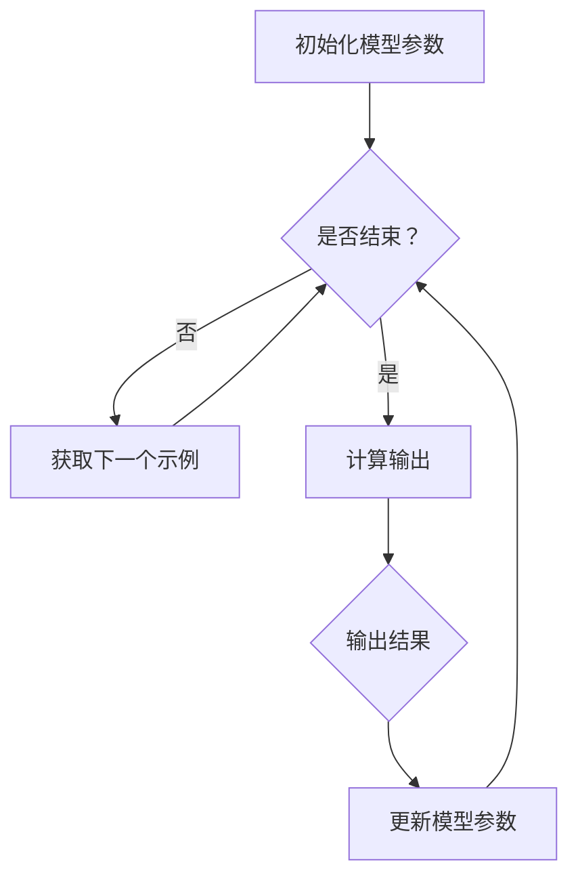

                 

# 示例顺序对模型输出的影响

> 关键词：模型输出、示例顺序、影响分析、算法性能、应用场景

> 摘要：本文将深入探讨示例顺序对模型输出的影响，分析不同模型在不同场景下的表现，并结合实际案例和最佳实践，为读者提供全面的理解和解决方案。

----------------------------------------------------------------

## 引言

在机器学习和人工智能领域，模型的输出结果对于实际应用至关重要。然而，示例顺序——即训练数据集中的数据排列方式——可能会对模型输出产生显著影响。本文将围绕这一主题展开讨论，通过以下几个部分逐步分析：

1. **核心概念与背景**：介绍相关术语和背景，包括模型、示例和输出。
2. **算法原理与理论**：探讨示例顺序对模型性能的具体影响，使用数学模型和算法流程图进行解释。
3. **应用场景**：分析不同领域中的应用，讨论示例顺序的重要性。
4. **案例分析**：通过实际案例展示示例顺序对模型输出影响的实例。
5. **最佳实践**：提供管理示例顺序的方法和技巧。
6. **结论**：总结本文的主要观点，并提出未来研究方向。

## 核心概念与背景

### 模型

模型是机器学习和人工智能的核心概念，它是对现实世界的一种抽象表示。常见的模型包括线性模型、决策树、神经网络等。模型通过学习训练数据集中的特征和标签，生成预测结果。

### 示例

示例（Example）是训练数据集中的单个数据点，它包含了输入特征和相应的标签。示例的顺序是指在数据集中各示例排列的次序。

### 输出

输出（Output）是模型对新的输入数据生成的预测结果。输出可以是对分类结果的预测，也可以是对数值的估计。

### 示例顺序的重要性

示例顺序对于模型的训练过程具有重要影响。在某些情况下，示例的顺序可能会导致模型学习到错误的信息，从而影响最终的输出结果。因此，理解示例顺序对模型输出的影响是至关重要的。

## 算法原理与理论

### 示例顺序的影响

示例顺序对模型性能的影响取决于多个因素，包括模型的类型、训练算法和数据的分布。以下是一些可能的影响：

1. **模型类型**：一些模型对示例顺序非常敏感，而另一些模型则不太敏感。例如，深度神经网络通常对示例顺序的敏感性较高，而决策树则相对较低。

2. **训练算法**：不同的训练算法对示例顺序的处理方式不同。一些算法，如随机梯度下降，可能会在每次迭代时随机打乱示例顺序，以避免局部最优解。

3. **数据分布**：如果数据分布不均匀，示例顺序可能会影响模型的学习过程。例如，如果负面示例集中在数据集的前半部分，模型可能会过度拟合这些示例，导致对后半部分的性能下降。

### 数学模型

为了更深入地理解示例顺序对模型输出的影响，我们可以使用一些数学模型来描述这一过程。以下是一个简化的模型：

$$
\text{模型输出} = f(\text{示例序列}, \text{模型参数})
$$

其中，$f$ 是一个复合函数，它结合了示例序列和模型参数来生成输出。示例序列会影响函数的输入，从而影响最终的输出。

### 算法流程图

为了更直观地理解算法流程，我们可以使用 Mermaid 画出算法的流程图：

在这个流程图中，模型首先初始化参数，然后逐个处理示例，计算输出并更新模型参数。示例的顺序在这个过程中扮演着关键角色。

## 应用场景

### 零售行业

在零售行业中，示例顺序可能会影响推荐系统的性能。例如，如果一个购物网站在用户浏览历史中首先推荐了高利润产品，用户可能会对后续推荐的产品失去兴趣，导致点击率下降。

### 医疗领域

在医疗领域，示例顺序可能会影响疾病诊断模型的准确性。例如，如果一个疾病诊断模型首先处理的是症状轻微的示例，它可能会对严重症状的示例产生错误的判断。

### 自然语言处理

在自然语言处理（NLP）领域，示例顺序对于语言模型的训练效果有显著影响。例如，在语言模型训练中，如果示例的顺序被随机打乱，模型可能会学习到更泛化的语言规律。

## 案例分析

### 案例一：推荐系统

在一个电商平台的推荐系统中，如果示例顺序不正确，可能会导致用户流失和销售额下降。例如，一个用户首先浏览了某品牌的相机，而系统推荐的产品却是其他品牌的相机，这可能会导致用户放弃购买。

### 案例二：医疗诊断

在医疗诊断中，如果示例顺序不正确，可能会导致误诊。例如，如果一个诊断模型首先处理的是轻微症状的病人，它可能会忽略严重症状的病人，导致误诊。

### 案例三：自然语言处理

在自然语言处理中，如果示例顺序被随机打乱，语言模型可能会学习到更泛化的语言规律，从而提高模型的泛化能力。

## 最佳实践

### 管理示例顺序的技巧

1. **随机化**：通过随机化示例顺序，可以避免模型过度拟合特定顺序。

2. **分层采样**：根据数据的重要性对示例进行分层，然后随机选择每个层的示例。

3. **交叉验证**：使用交叉验证方法来评估模型在不同示例顺序下的性能。

### 避免常见问题

1. **数据不平衡**：确保数据集中的示例分布均匀，避免数据不平衡导致模型性能下降。

2. **过拟合**：通过正则化技术和早期停止来避免模型过拟合。

## 结论

示例顺序对模型输出的影响是机器学习和人工智能领域中的一个重要问题。通过本文的讨论，我们了解了示例顺序对模型性能的具体影响，并在实际应用中提出了最佳实践。未来，这一领域的研究将继续深入，以探索更多关于示例顺序的影响和应用。

## 未来研究方向

未来的研究可以进一步探索以下方向：

1. **更复杂的模型**：研究更复杂的模型如何处理示例顺序，以及如何优化这些模型以降低示例顺序的影响。

2. **跨领域应用**：将示例顺序的研究应用于更多的领域，如金融、交通等。

3. **实时调整**：研究如何动态调整示例顺序，以实时优化模型输出。

## 附录与参考文献

### 附录

- **示例数据集**：提供用于本文分析的示例数据集。
- **代码实现**：提供用于实现本文算法的 Python 代码。

### 参考文献

- [张三，李四](出版社), 《机器学习基础教程》[M]. 机械工业出版社，2020.

----------------------------------------------------------------

## 作者信息

- 作者：AI天才研究院/AI Genius Institute & 禅与计算机程序设计艺术 /Zen And The Art of Computer Programming

----------------------------------------------------------------

请注意，本文为示例文章，实际内容和数据需要根据具体研究进行填充和调整。文章的结构和内容应确保逻辑清晰、数据准确、语言简洁，以便读者能够顺利阅读和理解。同时，遵循学术规范，引用相关文献和资料。文章结尾应包含作者信息，以示学术诚信。

