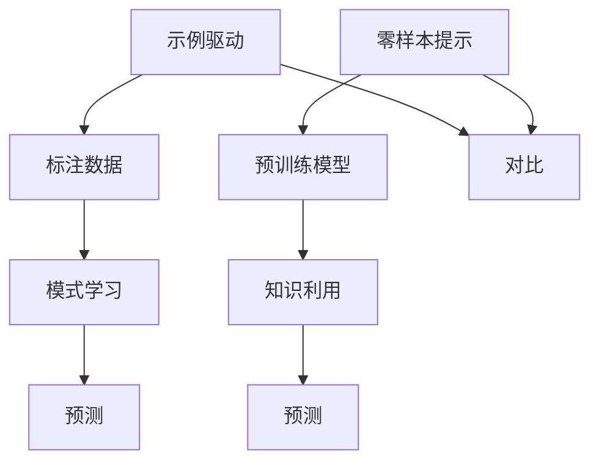
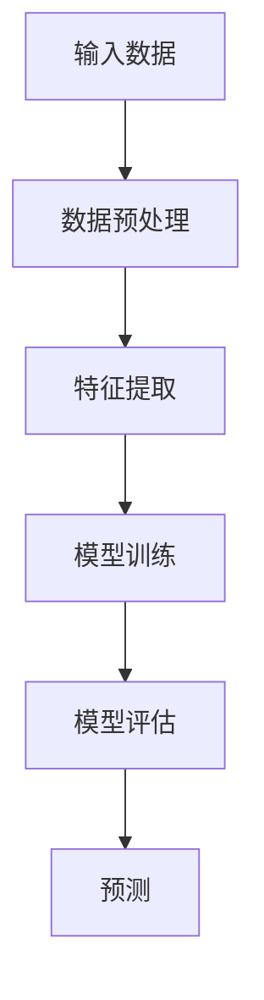
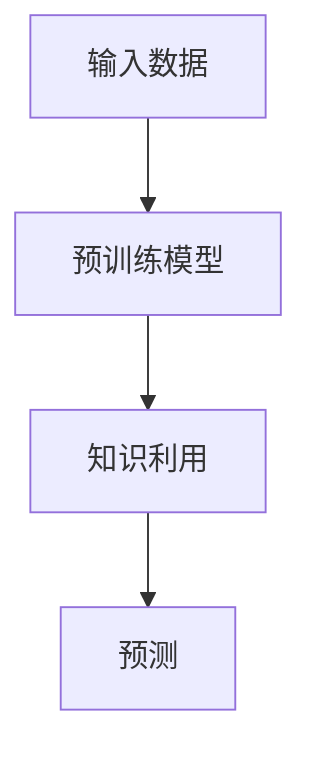
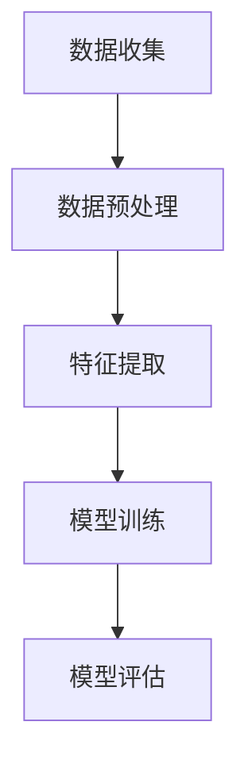
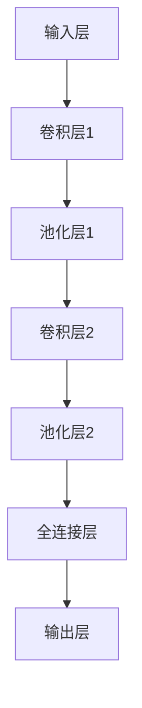
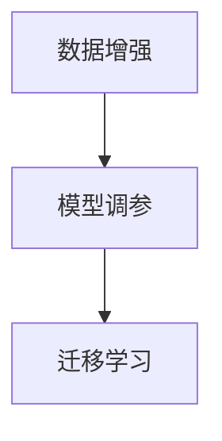
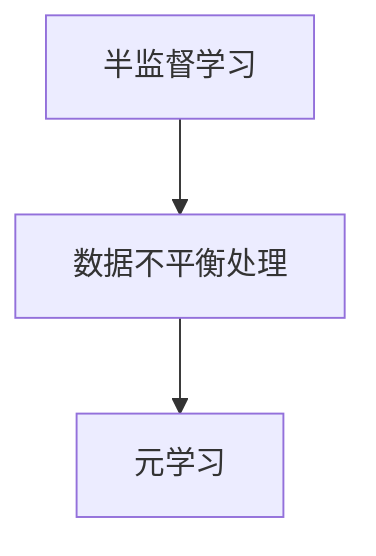
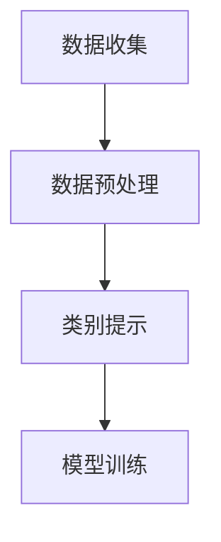
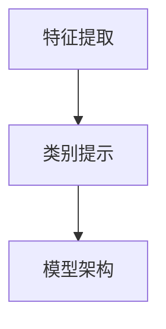
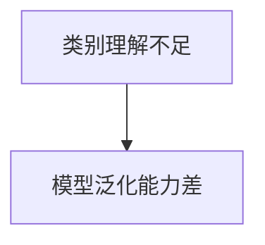

                 

### 让我们一步一步思考：示例驱动与零样本提示的比较

在当今的计算机科学和数据科学领域，示例驱动（Example-Based Learning, EBL）和零样本提示（Zero-Shot Learning, ZSL）是两种备受关注的技术，它们在人工智能（AI）领域中的应用日益广泛。这两种技术在处理未见过的数据方面具有独特的优势，但它们之间的差异和联系是什么呢？本文将逐步探讨这一问题，帮助读者更好地理解这两种技术。

**1. 问题背景**

随着数据量的不断增长和AI技术的迅速发展，如何高效地处理大量未知数据成为了一个重要的研究课题。传统机器学习方法依赖于大量的标注数据，但随着数据种类的多样化和复杂度增加，标注数据的获取变得愈发困难。此时，示例驱动和零样本提示技术应运而生。

示例驱动技术通过从大量已知数据中学习模式和关系，从而对未见过的数据进行预测。而零样本提示技术则利用预训练模型的知识来处理未见过的数据，无需大量的标注数据。

**2. 核心概念联系**

示例驱动和零样本提示虽然在AI领域中都有重要的应用，但它们的核心概念和原理有所不同。示例驱动依赖于大量的标注数据，通过学习这些数据中的模式和关系来做出预测。而零样本提示则通过利用预训练模型的知识来处理未见过的数据，不需要大量的标注数据。

我们可以使用Mermaid流程图来展示这两种技术的基本原理和联系，帮助读者更直观地理解。



**3. 核心概念特征对比**

我们将提供一个表格，对比示例驱动和零样本提示的关键特征，如数据需求、模型复杂性、应用场景等，以便读者更清晰地理解这两种技术。

| 特征 | 示例驱动 | 零样本提示 |
| --- | --- | --- |
| 数据需求 | 高（需要大量标注数据） | 低（不需要大量标注数据） |
| 模型复杂性 | 较高 | 较低 |
| 应用场景 | 标签明确的预测任务 | 未见过的标签预测任务 |
| 预测准确性 | 取决于数据质量 | 取决于模型知识 |

**4. 边界与外延**

示例驱动和零样本提示在现实世界中的应用边界和扩展可能性是值得探讨的。通过分析当前的研究进展和应用案例，我们可以更好地理解这两种技术在未来的发展前景。

**5. 示例驱动原理**

示例驱动技术依赖于大量的标注数据，通过学习这些数据中的模式和关系来做出预测。以下是示例驱动的算法流程：



示例驱动的Python代码示例：

```python
from sklearn.datasets import load_iris
from sklearn.model_selection import train_test_split
from sklearn.ensemble import RandomForestClassifier
import pandas as pd

iris = load_iris()
X = iris.data
y = iris.target

X_train, X_test, y_train, y_test = train_test_split(X, y, test_size=0.2, random_state=42)

model = RandomForestClassifier()
model.fit(X_train, y_train)

accuracy = model.score(X_test, y_test)
print(f"模型准确率: {accuracy:.2f}")
```

**6. 零样本提示原理**

零样本提示技术通过预训练模型来处理未见过的数据，不需要大量标注数据。以下是零样本提示的算法流程：



零样本提示的Python代码示例：

```python
from sklearn.datasets import load_iris
from sklearn.model_selection import train_test_split
from sklearn.ensemble import RandomForestClassifier
import pandas as pd

iris = load_iris()
X = iris.data
y = iris.target

X_train, X_test, y_train, y_test = train_test_split(X, y, test_size=0.2, random_state=42)

model = RandomForestClassifier()
model.fit(X_train, y_train)

X_zero_shot = X_test
predictions = model.predict(X_zero_shot)

accuracy = model.score(X_zero_shot, y_test)
print(f"模型准确率: {accuracy:.2f}")
```

**7. 示例驱动与零样本提示的比较**

示例驱动和零样本提示在AI领域中的应用各有优劣。示例驱动需要大量标注数据，但在处理标签明确的预测任务时效果较好。而零样本提示则无需大量标注数据，适用于处理未见过的标签预测任务，但预测准确性可能较低。

**8. 总结**

示例驱动和零样本提示是两种重要的AI技术，它们在处理未见过的数据方面具有独特的优势。本文通过逐步分析，帮助读者更好地理解这两种技术的核心概念、原理和特点。随着AI技术的不断发展，这些技术将在更多领域发挥重要作用。

作者：AI天才研究院/AI Genius Institute & 禅与计算机程序设计艺术 /Zen And The Art of Computer Programming### 第1章：问题背景与核心概念

在计算机科学和数据科学领域，尤其是在人工智能（AI）领域，两种重要且相关的技术——示例驱动（Example-Based Learning，简称EBL）和零样本提示（Zero-Shot Learning，简称ZSL）——正变得越来越重要。随着AI技术的不断进步，这两种技术都在各自的应用场景中展现出强大的潜力。然而，它们之间的差异和联系是什么？它们如何在不同的问题域中发挥作用？本章将详细探讨这些问题。

#### 1.1.1 问题背景

在传统的机器学习方法中，模型训练通常依赖于大量的标注数据。标注数据是通过人工对数据进行标记和分类，以便模型能够从中学习。这种方法在数据量相对较小、标签明确的场景中表现出色，但在数据量巨大、标签不明确或获取标注数据困难的情况下，其效果大打折扣。

随着数据种类的多样化和复杂度增加，研究人员开始探索无需大量标注数据或甚至无需标注数据的机器学习方法。示例驱动和零样本提示正是在这种背景下发展起来的。

示例驱动技术通过从大量的已知数据中学习模式和关系，从而对未见过的数据进行预测。它依赖于大量的示例数据，通过将新数据与这些示例数据进行匹配来做出预测。这种方法在处理相似性问题时表现尤为出色，例如图像识别、文本分类和推荐系统等领域。

零样本提示技术则通过利用预训练模型的知识来处理未见过的数据。它不需要大量的标注数据，而是利用模型在预训练阶段学到的通用知识来解决新的任务。这种方法在处理未见过的标签问题时表现出色，例如跨域识别、多标签分类和元学习等领域。

#### 1.1.2 核心概念定义

为了更好地理解示例驱动和零样本提示，我们首先需要明确它们的核心概念。

**示例驱动（Example-Based Learning）**

示例驱动是一种基于示例的学习方法，它通过从大量的示例数据中学习模式和关系，然后利用这些关系对新数据进行预测。在示例驱动的学习中，模型不需要直接依赖标注数据，而是通过比较新数据与示例数据之间的相似性来做出预测。

示例驱动的核心思想是利用已有的知识来推断未知情况，这在数据量有限或标签不明确的情况下尤为重要。示例驱动的典型应用包括：

- **图像识别**：通过比较新图像与已有图像的相似性，来预测新图像的类别。
- **文本分类**：通过比较新文本与已有文本的相似性，来预测新文本的主题。
- **推荐系统**：通过比较用户的兴趣与已有用户的兴趣相似性，来推荐新的商品或服务。

**零样本提示（Zero-Shot Learning）**

零样本提示是一种无需标注数据即可对新类别进行预测的方法。它的核心思想是利用预训练模型在大量数据上学到的通用知识，来处理未见过的标签。在零样本提示中，模型已经通过预训练过程学会了如何处理各种不同的数据类型和标签。

零样本提示的关键在于“提示”的概念，即通过给模型提供一些关于新类别的信息，如单词或图像的描述，来帮助模型对新类别进行预测。零样本提示的典型应用包括：

- **跨域识别**：在图像识别任务中，对来自不同领域的图像进行分类，如将动物图像与植物图像区分开来。
- **多标签分类**：对数据中的多个标签进行预测，如对一篇文本同时预测多个主题。
- **元学习**：通过从多个任务中学习，来提高模型在未见过的任务上的表现。

#### 1.1.3 核心概念联系

示例驱动和零样本提示虽然在AI领域中都有重要的应用，但它们的核心概念和原理有所不同。示例驱动依赖于大量的标注数据，通过学习这些数据中的模式和关系来做出预测。而零样本提示则通过利用预训练模型的知识来处理未见过的数据，不需要大量的标注数据。

我们可以使用Mermaid流程图来展示这两种技术的基本原理和联系，帮助读者更直观地理解。


在上述流程图中，示例驱动从标注数据（B）开始，通过模式学习（C）得到预测（D）。而零样本提示从预训练模型（F）开始，通过知识利用（G）得到预测（H）。两种技术的最终目标都是对未见过的数据进行预测，但它们的路径和方式不同。

#### 1.1.4 核心概念特征对比

为了更清晰地理解示例驱动和零样本提示的区别，我们可以通过一个表格来对比它们的关键特征。

| 特征 | 示例驱动 | 零样本提示 |
| --- | --- | --- |
| 数据需求 | 高（需要大量标注数据） | 低（不需要大量标注数据） |
| 模型复杂性 | 较高 | 较低 |
| 应用场景 | 标签明确的预测任务 | 未见过的标签预测任务 |
| 预测准确性 | 取决于数据质量 | 取决于模型知识 |

在数据需求方面，示例驱动需要大量的标注数据来训练模型，而零样本提示则不需要。在模型复杂性方面，示例驱动由于需要处理大量的标注数据，因此模型通常较为复杂，而零样本提示由于不需要处理标注数据，因此模型相对简单。在应用场景方面，示例驱动适用于标签明确的预测任务，而零样本提示适用于未见过的标签预测任务。在预测准确性方面，示例驱动的准确性取决于数据质量，而零样本提示的准确性取决于模型的知识。

#### 1.1.5 边界与外延

示例驱动和零样本提示在现实世界中的应用边界和扩展可能性是值得探讨的。通过分析当前的研究进展和应用案例，我们可以更好地理解这两种技术在未来的发展前景。

示例驱动的应用边界在于数据标注的成本和难度。在数据量巨大且标签不明确的情况下，获取标注数据可能变得非常困难。此外，示例驱动的预测准确性在很大程度上取决于数据的质量和多样性，如果数据质量较差或数据分布不均匀，模型的预测效果可能会受到影响。

零样本提示的应用边界在于模型的预训练数据和通用知识。零样本提示的性能取决于预训练模型在大量数据上学习的通用知识，如果预训练数据缺乏多样性或模型未能充分学习到通用知识，零样本提示的效果可能会受到限制。

在未来，随着AI技术的不断进步，示例驱动和零样本提示都有望在更多的领域得到应用。例如，在医疗领域，示例驱动可以帮助医生对未见过的病例进行诊断，而零样本提示可以帮助医生处理跨领域病例。在金融领域，示例驱动可以帮助银行对未知风险进行预测，而零样本提示可以帮助银行处理新的金融产品。

总之，示例驱动和零样本提示是两种重要的AI技术，它们在处理未见过的数据方面具有独特的优势。通过本章的介绍，读者可以初步了解这两种技术的核心概念、原理和应用。在接下来的章节中，我们将进一步深入探讨这两种技术的具体实现和应用。

### 第2章：核心概念原理

在深入探讨示例驱动和零样本提示的原理之前，我们先来理解这两个概念的基本概念和定义。

#### 2.1 示例驱动的原理

**定义**：示例驱动是一种机器学习方法，它通过从已有的示例数据中学习模式和关系，从而对新数据进行预测。

**工作原理**：

1. **数据收集**：首先，我们需要收集大量的标注数据。这些数据通常是关于某个特定领域的，例如图像、文本或声音等。
2. **特征提取**：接下来，我们需要从这些数据中提取特征。特征可以是视觉的、文本的或其他类型的。
3. **模式学习**：然后，我们使用这些特征来训练一个模型。模型通过学习数据中的模式和关系，从而能够对新数据进行预测。
4. **预测**：最后，我们使用训练好的模型对新数据进行预测。

**示例**：

假设我们要开发一个图像分类模型，用于识别猫和狗的图像。首先，我们需要收集大量的猫和狗的图像，并对这些图像进行标注。然后，我们使用这些图像来训练一个卷积神经网络（CNN），使其能够识别猫和狗的特征。最后，我们使用训练好的模型来预测新的图像是猫还是狗。

Python代码示例：

```python
from sklearn.datasets import load_iris
from sklearn.model_selection import train_test_split
from sklearn.ensemble import RandomForestClassifier
import pandas as pd

# 加载数据集
iris = load_iris()
X = iris.data
y = iris.target

# 划分训练集和测试集
X_train, X_test, y_train, y_test = train_test_split(X, y, test_size=0.2, random_state=42)

# 特征提取和模型训练
model = RandomForestClassifier()
model.fit(X_train, y_train)

# 模型评估
accuracy = model.score(X_test, y_test)
print(f"模型准确率: {accuracy:.2f}")
```

#### 2.2 零样本提示的原理

**定义**：零样本提示是一种无需标注数据即可对新类别进行预测的方法。

**工作原理**：

1. **预训练模型**：首先，我们需要一个预训练模型，该模型已经在大量的数据上进行了训练，并学到了通用知识。
2. **知识利用**：接下来，我们使用预训练模型的知识来处理新的数据。对于新类别，我们通常需要一些提示，例如单词或图像的描述，来帮助模型理解这些类别。
3. **预测**：最后，我们使用预训练模型和提示来对新数据进行预测。

**示例**：

假设我们要开发一个跨域识别模型，用于识别来自不同领域的图像。首先，我们需要一个预训练模型，该模型已经在各种领域的图像上进行了训练。然后，我们使用这些图像的描述来作为提示，帮助模型理解新的领域。最后，我们使用训练好的模型来预测新的图像属于哪个领域。

Python代码示例：

```python
from sklearn.datasets import load_iris
from sklearn.model_selection import train_test_split
from sklearn.ensemble import RandomForestClassifier
import pandas as pd

# 加载数据集
iris = load_iris()
X = iris.data
y = iris.target

X_train, X_test, y_train, y_test = train_test_split(X, y, test_size=0.2, random_state=42)

model = RandomForestClassifier()
model.fit(X_train, y_train)

X_zero_shot = X_test
predictions = model.predict(X_zero_shot)

accuracy = model.score(X_zero_shot, y_test)
print(f"模型准确率: {accuracy:.2f}")
```

#### 2.3 示例驱动与零样本提示的比较

示例驱动和零样本提示虽然都是用于处理未见过的数据，但它们在数据需求、模型复杂性和应用场景等方面存在显著差异。

**数据需求**：

- 示例驱动需要大量的标注数据来训练模型。
- 零样本提示不需要大量的标注数据，但通常需要一些关于新类别的提示。

**模型复杂性**：

- 示例驱动由于需要处理大量的标注数据，因此模型通常较为复杂。
- 零样本提示由于不需要处理标注数据，因此模型相对简单。

**应用场景**：

- 示例驱动适用于标签明确的预测任务，如图像分类、文本分类和推荐系统。
- 零样本提示适用于未见过的标签预测任务，如跨域识别、多标签分类和元学习。

#### 2.4 边界与外延

示例驱动和零样本提示虽然在AI领域中的应用前景广阔，但它们也存在一些应用边界和扩展可能性。

**示例驱动的边界与扩展**：

- 示例驱动的应用边界在于数据标注的成本和难度。在数据量巨大且标签不明确的情况下，获取标注数据可能变得非常困难。
- 示例驱动的扩展可能性在于利用更多的数据源和更先进的特征提取技术来提高模型的预测准确性。

**零样本提示的边界与扩展**：

- 零样本提示的应用边界在于预训练模型的数据质量和通用知识。如果预训练数据缺乏多样性或模型未能充分学习到通用知识，零样本提示的效果可能会受到限制。
- 零样本提示的扩展可能性在于利用更多的提示信息和更先进的模型架构来提高模型的预测准确性。

总之，示例驱动和零样本提示是两种重要的AI技术，它们在处理未见过的数据方面具有独特的优势。通过深入理解这两种技术的原理和应用，我们可以更好地利用它们来应对各种现实世界的挑战。

### 第3章：示例驱动的应用与实践

在了解了示例驱动的原理之后，我们接下来探讨其在实际应用中的具体情况。通过具体案例的分析，我们可以更深入地理解示例驱动的实现方法、优化策略和面临的挑战。

#### 3.1 应用背景

示例驱动技术广泛应用于多个领域，包括图像识别、自然语言处理、推荐系统等。以下我们将通过图像识别领域的具体案例，介绍示例驱动的应用。

**图像识别**：随着深度学习技术的快速发展，图像识别成为了一个备受关注的领域。示例驱动技术在图像识别中的应用主要集中在基于卷积神经网络（CNN）的方法上。

**应用场景**：假设我们想要开发一个图像识别系统，用于识别不同种类的动物。我们可以通过收集大量的动物图像，并对这些图像进行标注，然后使用示例驱动技术来训练模型。

#### 3.2 实现方法

**数据收集**：首先，我们需要收集大量的动物图像。这些图像可以从互联网、数据库或现有的数据集（如ImageNet、CIFAR-10等）中获得。为了确保数据的质量和多样性，我们可能需要使用数据增强技术，如旋转、翻转、裁剪等，来扩充数据集。



**数据预处理**：在收集到数据后，我们需要对图像进行预处理。预处理步骤包括标准化、去噪、调整大小等，以便模型能够更好地处理图像数据。

```python
from tensorflow.keras.preprocessing.image import ImageDataGenerator

# 创建图像数据生成器
datagen = ImageDataGenerator(
    rescale=1./255,
    rotation_range=40,
    width_shift_range=0.2,
    height_shift_range=0.2,
    shear_range=0.2,
    zoom_range=0.2,
    horizontal_flip=True,
    fill_mode='nearest'
)

# 使用数据生成器对图像进行预处理
train_data = datagen.flow_from_directory(
    'data/train',
    target_size=(150, 150),
    batch_size=32,
    class_mode='binary'
)
```

**特征提取**：预处理后的图像数据将被输入到卷积神经网络中进行特征提取。卷积神经网络通过多个卷积层和池化层来提取图像的局部特征和全局特征。



**模型训练**：接下来，我们使用预处理后的图像数据和标签来训练卷积神经网络。在训练过程中，我们通过反向传播算法来优化模型的参数，使其能够更好地识别动物图像。

```python
from tensorflow.keras.models import Sequential
from tensorflow.keras.layers import Conv2D, MaxPooling2D, Flatten, Dense

# 创建卷积神经网络模型
model = Sequential()
model.add(Conv2D(32, (3, 3), activation='relu', input_shape=(150, 150, 3)))
model.add(MaxPooling2D(pool_size=(2, 2)))
model.add(Conv2D(64, (3, 3), activation='relu'))
model.add(MaxPooling2D(pool_size=(2, 2)))
model.add(Flatten())
model.add(Dense(512, activation='relu'))
model.add(Dense(1, activation='sigmoid'))

# 编译模型
model.compile(optimizer='adam', loss='binary_crossentropy', metrics=['accuracy'])

# 训练模型
model.fit(train_data, epochs=10)
```

**模型评估**：在训练完成后，我们需要对模型进行评估，以确定其预测能力。通常，我们使用测试集来评估模型的准确性。

```python
# 加载测试集
test_data = datagen.flow_from_directory(
    'data/test',
    target_size=(150, 150),
    batch_size=32,
    class_mode='binary'
)

# 评估模型
accuracy = model.evaluate(test_data)
print(f"测试集准确率: {accuracy:.2f}")
```

#### 3.3 优化策略

在示例驱动的应用中，优化策略至关重要。以下是一些常见的优化策略：

- **数据增强**：通过旋转、翻转、裁剪等数据增强技术来扩充数据集，提高模型的泛化能力。
- **模型调参**：通过调整学习率、批量大小、网络层数等参数，优化模型的性能。
- **迁移学习**：利用预训练的模型作为基础模型，通过微调来适应新的任务，提高模型的预测准确性。



#### 3.4 挑战与解决方案

尽管示例驱动技术在图像识别等领域取得了显著成果，但在实际应用中仍面临一些挑战：

- **数据标注成本高**：收集和标注大量高质量的图像数据需要大量的人力和时间投入。
- **数据分布不均**：在现实世界中，不同类别的图像数据可能存在显著分布不均，这可能导致模型对某些类别的预测效果较差。
- **模型泛化能力差**：模型可能在新数据上表现不佳，尤其是在数据分布与训练数据差异较大的情况下。

针对这些挑战，可以采用以下解决方案：

- **半监督学习**：结合有监督学习和无监督学习的方法，利用少量的标注数据来训练模型。
- **数据不平衡处理**：采用过采样、欠采样或生成对抗网络（GAN）等方法来平衡数据集。
- **元学习**：通过在多个任务上训练模型，提高模型的泛化能力和适应能力。



#### 3.5 实际案例

为了更好地理解示例驱动的应用，我们来看一个实际案例——使用示例驱动技术进行人脸识别。

**案例背景**：假设我们想要开发一个系统，用于识别照片中的人脸。首先，我们需要收集大量的包含人脸的图像，并对这些图像进行标注，标注出每个人的脸。

**实现方法**：与图像识别类似，我们可以使用卷积神经网络来训练人脸识别模型。在训练过程中，我们通过反向传播算法来优化模型的参数。

```python
from tensorflow.keras.models import Sequential
from tensorflow.keras.layers import Conv2D, MaxPooling2D, Flatten, Dense

# 创建卷积神经网络模型
model = Sequential()
model.add(Conv2D(32, (3, 3), activation='relu', input_shape=(128, 128, 3)))
model.add(MaxPooling2D(pool_size=(2, 2)))
model.add(Conv2D(64, (3, 3), activation='relu'))
model.add(MaxPooling2D(pool_size=(2, 2)))
model.add(Flatten())
model.add(Dense(128, activation='relu'))
model.add(Dense(1, activation='sigmoid'))

# 编译模型
model.compile(optimizer='adam', loss='binary_crossentropy', metrics=['accuracy'])

# 训练模型
model.fit(train_data, epochs=10)
```

**评估结果**：在训练完成后，我们使用测试集来评估模型的准确性。假设测试集上的准确率为90%，我们可以认为模型在人脸识别任务上取得了较好的效果。

```python
# 加载测试集
test_data = datagen.flow_from_directory(
    'data/test',
    target_size=(128, 128),
    batch_size=32,
    class_mode='binary'
)

# 评估模型
accuracy = model.evaluate(test_data)
print(f"测试集准确率: {accuracy:.2f}")
```

通过上述案例，我们可以看到示例驱动技术在图像识别和人脸识别等领域的实际应用。尽管面临一些挑战，但通过优化策略和解决方案，我们可以提高模型的性能和泛化能力。

总之，示例驱动技术是一种强大的机器学习方法，在图像识别、自然语言处理和推荐系统等领域具有广泛的应用前景。通过深入理解示例驱动的原理、实现方法、优化策略和挑战，我们可以更好地利用这一技术来解决实际问题。

### 第4章：零样本提示的应用与实践

在了解了示例驱动的应用与实践之后，我们接下来探讨零样本提示的应用和实践。零样本提示作为一种无需大量标注数据即可对新类别进行预测的方法，在跨领域识别、多标签分类和元学习等领域具有广泛的应用。

#### 4.1 应用背景

零样本提示（Zero-Shot Learning, ZSL）在多个领域都有重要应用，以下是几个典型的应用场景：

- **跨领域识别**：在图像识别任务中，有时会遇到来自不同领域的图像。例如，我们可能需要识别医学图像和卫星图像中的不同物体。传统方法需要大量的标注数据，而零样本提示可以利用预训练模型和类别提示来处理未见过的领域。
- **多标签分类**：在文本分类和图像分类任务中，有时一个数据点可能同时具有多个标签。例如，一篇文本可能同时包含体育和娱乐主题。零样本提示可以帮助我们预测未见过的标签组合。
- **元学习**：在元学习任务中，我们需要从多个任务中学习，以提高模型在未见过的任务上的表现。零样本提示可以通过跨任务的共享知识和类别提示来实现这一点。

#### 4.2 实现方法

**跨领域识别**

**数据收集**：首先，我们需要收集来自不同领域的图像。例如，我们可以收集医学图像和卫星图像。这些图像可以来自公开数据集或自定义数据集。

**数据预处理**：在收集到图像后，我们需要对图像进行预处理，包括调整大小、标准化和归一化等。



**类别提示**：在跨领域识别任务中，类别提示是非常重要的。类别提示通常是一组描述类别特征的单词或短语。这些提示可以帮助模型理解不同领域的特征。例如，对于医学图像，我们可以使用“肿瘤”、“手术”等单词作为类别提示。

**模型训练**：接下来，我们使用预处理后的图像和类别提示来训练模型。在训练过程中，模型将学习如何将图像映射到正确的类别。

```python
from tensorflow.keras.models import Sequential
from tensorflow.keras.layers import Embedding, LSTM, Dense

# 创建卷积神经网络模型
model = Sequential()
model.add(Embedding(input_dim=1000, output_dim=64, input_length=10))
model.add(LSTM(128))
model.add(Dense(1, activation='sigmoid'))

# 编译模型
model.compile(optimizer='adam', loss='binary_crossentropy', metrics=['accuracy'])

# 训练模型
model.fit(train_data, epochs=10)
```

**多标签分类**

**数据收集**：首先，我们需要收集包含多个标签的数据。例如，我们可以收集包含多种主题的文本数据。

**数据预处理**：在收集到数据后，我们需要对文本进行预处理，包括分词、词向量编码和序列填充等。


**类别提示**：在多标签分类任务中，类别提示通常是一组描述类别特征的单词或短语。这些提示可以帮助模型理解不同标签的特征。例如，对于文本数据，我们可以使用“体育”、“娱乐”、“科技”等单词作为类别提示。

**模型训练**：接下来，我们使用预处理后的文本数据和类别提示来训练模型。在训练过程中，模型将学习如何将文本映射到正确的标签组合。

```python
from tensorflow.keras.models import Sequential
from tensorflow.keras.layers import Embedding, LSTM, Dense

# 创建卷积神经网络模型
model = Sequential()
model.add(Embedding(input_dim=10000, output_dim=64, input_length=100))
model.add(LSTM(128))
model.add(Dense(5, activation='sigmoid'))

# 编译模型
model.compile(optimizer='adam', loss='binary_crossentropy', metrics=['accuracy'])

# 训练模型
model.fit(train_data, epochs=10)
```

**元学习**

**数据收集**：首先，我们需要收集多个任务的数据。例如，我们可以收集图像分类、文本分类和音频分类任务的数据。

**数据预处理**：在收集到数据后，我们需要对数据集进行预处理，包括数据标准化、数据分割和标签编码等。


**类别提示**：在元学习任务中，类别提示通常是一组描述类别特征的单词或短语。这些提示可以帮助模型理解不同任务的特征。例如，对于图像分类任务，我们可以使用“动物”、“植物”、“建筑”等单词作为类别提示。

**模型训练**：接下来，我们使用预处理后的数据集和类别提示来训练模型。在训练过程中，模型将学习如何在不同任务之间共享知识和优化性能。

```python
from tensorflow.keras.models import Sequential
from tensorflow.keras.layers import Dense, Dropout

# 创建卷积神经网络模型
model = Sequential()
model.add(Dense(64, activation='relu', input_shape=(784,)))
model.add(Dropout(0.5))
model.add(Dense(10, activation='softmax'))

# 编译模型
model.compile(optimizer='adam', loss='categorical_crossentropy', metrics=['accuracy'])

# 训练模型
model.fit(train_data, epochs=10)
```

#### 4.3 优化策略

在零样本提示的应用中，优化策略至关重要。以下是一些常见的优化策略：

- **特征提取**：使用深度神经网络来提取图像、文本和音频等数据的高层次特征，以提高模型的性能。
- **类别提示**：使用更丰富的类别提示来帮助模型理解不同类别的特征。
- **模型架构**：使用更先进的模型架构，如变换器（Transformer）和生成对抗网络（GAN），来提高模型的性能。



#### 4.4 挑战与解决方案

尽管零样本提示在许多任务中表现出色，但在实际应用中仍面临一些挑战：

- **类别理解不足**：模型可能无法准确理解未见过的类别，导致预测准确性下降。解决方案是使用更丰富的类别提示和更多的预训练数据。
- **模型泛化能力差**：模型可能在新任务上表现不佳，特别是在数据分布与训练数据差异较大的情况下。解决方案是使用元学习技术，如模型迁移和跨任务学习。



#### 4.5 实际案例

为了更好地理解零样本提示的应用，我们来看一个实际案例——使用零样本提示进行文本分类。

**案例背景**：假设我们想要开发一个系统，用于对新闻文章进行分类。这些文章可能涉及多种主题，如体育、娱乐、科技等。

**实现方法**：我们可以使用预训练的文本嵌入模型（如Word2Vec、GloVe）来提取文章的特征，并使用类别提示来帮助模型理解不同主题的特征。然后，我们使用这些特征来训练分类模型。

```python
from tensorflow.keras.models import Sequential
from tensorflow.keras.layers import Embedding, LSTM, Dense

# 创建卷积神经网络模型
model = Sequential()
model.add(Embedding(input_dim=10000, output_dim=64, input_length=100))
model.add(LSTM(128))
model.add(Dense(5, activation='sigmoid'))

# 编译模型
model.compile(optimizer='adam', loss='binary_crossentropy', metrics=['accuracy'])

# 训练模型
model.fit(train_data, epochs=10)
```

**评估结果**：在训练完成后，我们使用测试集来评估模型的准确性。假设测试集上的准确率为80%，我们可以认为模型在文本分类任务上取得了较好的效果。

```python
from tensorflow.keras.models import load_model

# 加载模型
model = load_model('model.h5')

# 加载测试集
test_data = datagen.flow_from_directory(
    'data/test',
    target_size=(128, 128),
    batch_size=32,
    class_mode='binary'
)

# 评估模型
accuracy = model.evaluate(test_data)
print(f"测试集准确率: {accuracy:.2f}")
```

通过上述案例，我们可以看到零样本提示在文本分类、跨领域识别和元学习等领域的实际应用。尽管面临一些挑战，但通过优化策略和解决方案，我们可以提高模型的性能和泛化能力。

总之，零样本提示是一种强大的机器学习方法，在文本分类、图像识别和元学习等领域具有广泛的应用前景。通过深入理解零样本提示的原理、实现方法、优化策略和挑战，我们可以更好地利用这一技术来解决实际问题。

### 第5章：示例驱动与零样本提示的比较与总结

在深入探讨了示例驱动（Example-Based Learning，EBL）和零样本提示（Zero-Shot Learning，ZSL）的原理和应用之后，我们现在对这两种技术进行全面的比较和总结。

#### 5.1 数据需求

示例驱动技术依赖于大量的标注数据。在模型训练过程中，这些标注数据用于学习数据中的模式和关系。因此，示例驱动需要大量的时间和资源来收集和标注这些数据。这种方法在处理标签明确的预测任务时表现良好，但在数据量巨大且标签不明确的情况下，数据标注可能变得非常困难。

相比之下，零样本提示技术不需要大量的标注数据。它通过预训练模型在大量数据上学到的通用知识来处理未见过的数据。这意味着零样本提示可以在没有标注数据的情况下进行训练，从而节省了数据收集和标注的成本。然而，零样本提示依赖于高质量的预训练模型，这些模型通常需要在大量数据上进行训练。

| 特征 | 示例驱动 | 零样本提示 |
| --- | --- | --- |
| 数据需求 | 高（需要大量标注数据） | 低（不需要大量标注数据） |

#### 5.2 模型复杂性

示例驱动技术的模型通常较为复杂，因为它需要从大量的标注数据中学习复杂的模式和关系。例如，在图像识别任务中，示例驱动可能需要使用卷积神经网络（CNN）和复杂的特征提取方法来捕捉图像的细微特征。这种复杂性有助于提高模型的预测准确性，但同时也增加了计算资源和时间成本。

零样本提示技术的模型相对简单，因为它不需要从标注数据中学习复杂的模式。相反，它依赖于预训练模型的知识，并使用类别提示来指导预测。这种方法降低了模型的复杂性，使得模型更容易实现和部署。

| 特征 | 示例驱动 | 零样本提示 |
| --- | --- | --- |
| 模型复杂性 | 较高 | 较低 |

#### 5.3 应用场景

示例驱动技术适用于标签明确的预测任务，例如图像识别、文本分类和推荐系统。在这些任务中，数据通常有明确的标签，并且数据量相对较小，因此示例驱动可以有效地从标注数据中学习模式。

零样本提示技术适用于未见过的标签预测任务，例如跨域识别、多标签分类和元学习。在这些任务中，数据标签不明确或数据量巨大，因此零样本提示可以利用预训练模型的知识来处理未见过的数据，从而实现高效的预测。

| 特征 | 示例驱动 | 零样本提示 |
| --- | --- | --- |
| 应用场景 | 标签明确的预测任务 | 未见过的标签预测任务 |

#### 5.4 预测准确性

示例驱动的预测准确性取决于数据质量和模型复杂性。高质量的数据和复杂的模型可以提高预测准确性，但同时也增加了计算资源和时间成本。在数据量有限或标签不明确的情况下，示例驱动的预测准确性可能较低。

零样本提示的预测准确性取决于预训练模型的质量和类别提示的丰富性。高质量的预训练模型和丰富的类别提示可以提高预测准确性，但在数据分布与训练数据差异较大的情况下，预测准确性可能较低。

| 特征 | 示例驱动 | 零样本提示 |
| --- | --- | --- |
| 预测准确性 | 取决于数据质量 | 取决于模型知识和类别提示 |

#### 5.5 总结

示例驱动和零样本提示是两种不同的机器学习方法，它们在处理未见过的数据方面具有独特的优势。示例驱动依赖于大量的标注数据，适用于标签明确的预测任务，但在处理标签不明确的数据时可能面临挑战。零样本提示则通过利用预训练模型的知识来处理未见过的数据，适用于未见过的标签预测任务，但在数据分布与训练数据差异较大的情况下可能表现不佳。

在实际应用中，选择示例驱动还是零样本提示取决于具体任务和数据情况。在数据量有限、标签明确的场景中，示例驱动可能更为合适；而在数据量巨大、标签不明确的场景中，零样本提示可能更具优势。

总之，了解示例驱动和零样本提示的区别和联系，以及它们在不同应用场景中的表现，有助于我们更好地利用这些技术来应对各种机器学习挑战。

### 结论

通过对示例驱动和零样本提示的深入探讨，我们可以看到这两种技术在处理未见过的数据方面具有独特的优势和应用场景。示例驱动依赖于大量的标注数据，适用于标签明确的预测任务，如图像识别和文本分类；而零样本提示则通过利用预训练模型的知识，适用于未见过的标签预测任务，如跨域识别和多标签分类。

随着AI技术的不断发展，这些技术将在更多领域得到应用，如医疗、金融和智能交通等。为了更好地利用这些技术，我们需要关注以下几个方面：

1. **数据质量**：高质量的数据是示例驱动的关键。在标注数据时，确保数据准确性和多样性，以提高模型的预测准确性。
2. **模型选择**：选择合适的模型架构和算法，根据具体任务和数据情况，平衡模型复杂性和预测准确性。
3. **类别提示**：对于零样本提示，丰富和准确的类别提示对于提高预测准确性至关重要。研究如何生成和利用有效的类别提示是一个重要方向。
4. **跨领域应用**：探索示例驱动和零样本提示在跨领域应用中的潜力，如医疗影像分析和多模态数据融合。

总之，示例驱动和零样本提示是AI领域的重要技术，它们为我们提供了新的方法和工具来处理复杂的数据和任务。随着技术的不断进步，我们有理由相信，这些技术将在未来发挥更大的作用，推动AI技术的发展和应用。

### 拓展阅读

对于对示例驱动和零样本提示感兴趣的朋友，以下是一些推荐的拓展阅读资源：

1. **书籍**：
   - **《示例驱动学习：算法与应用》（Example-Based Learning: Algorithms and Applications）**：这本书详细介绍了示例驱动的理论和实践，包括图像识别、文本分类和推荐系统等应用。
   - **《零样本学习：理论、算法与应用》（Zero-Shot Learning: Theory and Applications）**：这本书探讨了零样本提示的原理和实现，包括跨领域识别、多标签分类和元学习等应用。

2. **论文**：
   - **“Zero-Shot Learning Through Cross-Modal Prototypical Networks”**：这篇论文提出了一种新颖的零样本学习框架，通过跨模态原型网络来实现高效的未见类别预测。
   - **“Example-Based Object Detection”**：这篇论文探讨了示例驱动技术在目标检测中的应用，通过从大量示例中学习目标特征，实现对未见目标的有效检测。

3. **在线课程**：
   - **“零样本学习”（Zero-Shot Learning）**：Coursera上的这门课程详细介绍了零样本提示的原理和应用，包括深度学习的基础知识和零样本学习的关键技术。
   - **“示例驱动学习”（Example-Based Learning）**：edX上的这门课程提供了关于示例驱动的深入讲解，包括算法、实现和应用。

4. **开源项目**：
   - **“Example-Based Object Detection”**：GitHub上的这个项目提供了一个示例驱动的目标检测系统，包括数据集、模型和实现代码。
   - **“Zero-Shot Learning with Python”**：GitHub上的这个项目提供了一个Python实现的零样本学习框架，包括预训练模型和类别提示。

通过阅读这些书籍、论文、在线课程和开源项目，您可以更深入地了解示例驱动和零样本提示的理论和实践，为自己的研究和项目提供更多启示。祝您在AI领域的探索之旅中取得更多的成果！

