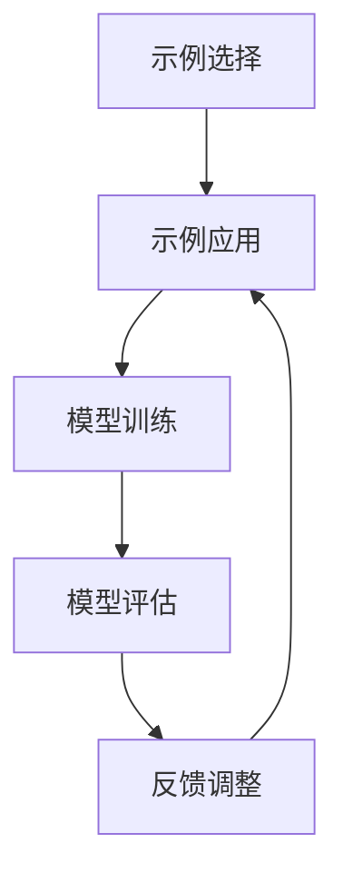
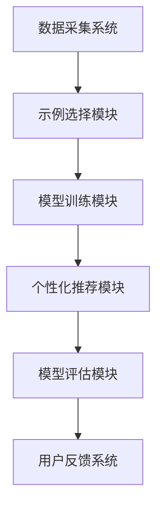
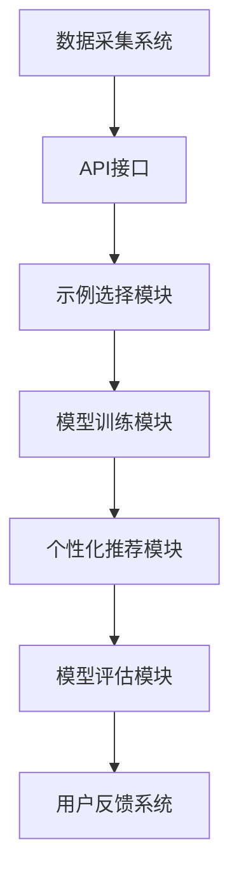
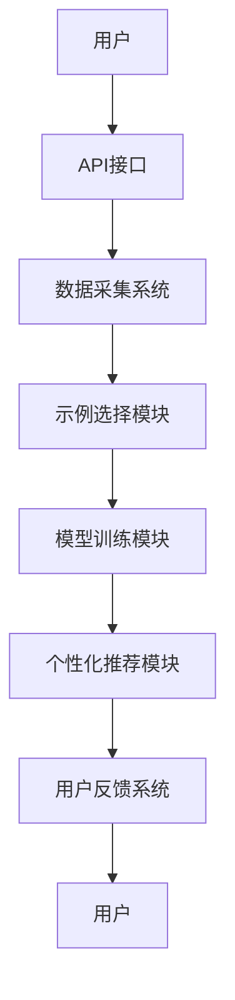

                 

### 示例驱动提示在不同任务类型中的应用

---

## 摘要

本文围绕“示例驱动提示”这一核心概念，深入探讨了其在不同任务类型中的应用。示例驱动提示是一种通过提供具体实例来引导用户完成任务的方法，其在自然语言处理、图像识别、文本分类、情感分析等领域展现出了显著的性能提升。本文将首先介绍示例驱动提示的定义与特性，然后针对文本分类、情感分析、推荐系统、图像识别和自然语言处理等任务类型，逐一分析示例驱动提示的应用原理和方法，并结合实际案例进行详细讲解。通过本文的探讨，旨在为读者提供一种新的思考角度，以更好地理解和运用示例驱动提示技术。

---

## 目录

1. 引言
2. 示例驱动提示理论概述
3. 不同任务类型的示例应用
   3.1 文本分类任务
   3.2 情感分析任务
   3.3 推荐系统任务
   3.4 图像识别任务
   3.5 自然语言处理任务
4. 示例驱动的实现与优化
5. 示例驱动的实际应用案例
6. 总结与展望

---

### 引言

### 1.1 背景

在信息技术迅速发展的今天，人工智能（AI）的应用越来越广泛，从自然语言处理到图像识别，从推荐系统到自动驾驶，AI正逐步改变我们的生活和工作方式。然而，AI技术的发展也带来了诸多挑战，特别是在任务复杂度不断上升的背景下，如何高效地训练和优化AI模型成为了一个亟待解决的问题。

### 1.2 示例驱动提示的定义

示例驱动提示（Example-Guided Prompting）是一种通过提供具体示例来引导模型完成任务的方法。与传统的规则驱动或数据驱动方法相比，示例驱动提示能够更好地适应复杂多变的环境，提高模型的泛化能力。

### 1.3 示例驱动提示的特性

- **灵活性**：示例驱动提示可以根据任务的需求灵活调整示例的内容和形式。
- **高效性**：通过提供具体示例，模型可以更快地理解和掌握任务的核心要点。
- **可解释性**：示例驱动提示有助于提升模型的可解释性，使研究人员和开发者能够更好地理解模型的行为。

### 1.4 示例驱动提示的应用现状

近年来，示例驱动提示在自然语言处理、图像识别等领域取得了显著的成果。例如，在自然语言处理领域，通过提供具体的对话示例，可以显著提高聊天机器人的交互质量；在图像识别领域，通过提供具体图像示例，可以提升模型的识别精度。

### 1.5 本书结构安排

本文将首先介绍示例驱动提示的理论基础，然后分别探讨其在文本分类、情感分析、推荐系统、图像识别和自然语言处理等任务类型中的应用，最后通过实际案例进行分析，总结示例驱动提示的优势和挑战，并展望其未来的研究方向。

---

### 示例驱动提示理论概述

#### 2.1 定义与特性

示例驱动提示（Example-Guided Prompting）是一种通过提供具体实例来引导用户完成任务的方法。它基于以下核心原理：

- **示例引导**：通过具体示例来指导模型的训练和推理过程。
- **动态调整**：根据任务的反馈动态调整示例的内容和形式，以优化模型的性能。

示例驱动提示具有以下特性：

- **灵活性**：示例驱动提示可以根据不同任务的需求灵活调整示例的内容和形式。
- **高效性**：通过提供具体示例，模型可以更快地理解和掌握任务的核心要点。
- **可解释性**：示例驱动提示有助于提升模型的可解释性，使研究人员和开发者能够更好地理解模型的行为。

#### 2.2 类别

根据应用场景和任务类型，示例驱动提示可以分为以下几类：

- **单一示例**：仅提供一个示例，用于引导模型的训练和推理。
- **序列示例**：提供一系列示例，用于指导模型的序列决策过程。
- **对比示例**：提供正反两个示例，用于区分模型在不同情况下的表现。

#### 2.3 工作原理

示例驱动提示的工作原理主要包括以下几个步骤：

1. **示例选择**：根据任务需求选择合适的示例。
2. **示例应用**：将示例应用于模型的训练和推理过程。
3. **反馈调整**：根据模型的性能反馈调整示例的内容和形式，以优化模型的性能。

#### 2.4 示例应用

示例驱动提示在不同任务类型中的应用如下：

- **文本分类**：通过提供分类标签的示例，指导模型进行文本分类。
- **情感分析**：通过提供情感标签的示例，指导模型进行情感分类。
- **推荐系统**：通过提供用户兴趣的示例，指导模型进行推荐。
- **图像识别**：通过提供图像标签的示例，指导模型进行图像识别。
- **自然语言处理**：通过提供对话示例，指导模型进行对话生成和回答。

---

### 不同任务类型的示例应用

#### 3.1 文本分类任务

**3.1.1 应用示例**

在文本分类任务中，示例驱动提示可以通过提供具有不同分类标签的文本示例来引导模型的学习过程。例如，在新闻分类任务中，我们可以提供以下示例：

- **示例 1**：科技新闻：“苹果公司发布了新款iPhone。”（分类标签：科技）
- **示例 2**：体育新闻：“皇马3-2战胜巴萨。”（分类标签：体育）

**3.1.2 实现方法与流程**

1. **示例选择**：从大量已分类的文本中筛选出具有代表性的示例。
2. **示例应用**：将示例与分类标签一起输入模型，指导模型的训练过程。
3. **模型训练**：使用示例和标签训练分类模型，例如朴素贝叶斯分类器、支持向量机等。
4. **模型评估**：使用未使用的测试数据集评估模型的分类性能。
5. **反馈调整**：根据模型在测试数据集上的表现，调整示例的内容和形式，以优化模型的性能。

#### 3.2 情感分析任务

**3.2.1 应用示例**

在情感分析任务中，示例驱动提示可以通过提供具有不同情感标签的文本示例来指导模型的学习过程。例如，在社交媒体情感分析中，我们可以提供以下示例：

- **示例 1**：积极情感：“这部电影太棒了，我非常喜欢！”（情感标签：积极）
- **示例 2**：消极情感：“这个产品太难用了，我非常失望。”（情感标签：消极）

**3.2.2 实现方法与流程**

1. **示例选择**：从大量已标记的文本中筛选出具有代表性的示例。
2. **示例应用**：将示例与情感标签一起输入模型，指导模型的训练过程。
3. **模型训练**：使用示例和标签训练情感分析模型，例如朴素贝叶斯分类器、深度学习模型等。
4. **模型评估**：使用未使用的测试数据集评估模型的情感分类性能。
5. **反馈调整**：根据模型在测试数据集上的表现，调整示例的内容和形式，以优化模型的性能。

#### 3.3 推荐系统任务

**3.3.1 应用示例**

在推荐系统任务中，示例驱动提示可以通过提供具有不同用户兴趣的示例来指导模型的学习过程。例如，在电子商务平台中，我们可以提供以下示例：

- **示例 1**：用户浏览了电子产品，购买了一台手机。（用户兴趣：电子产品）
- **示例 2**：用户浏览了书籍，购买了一本小说。（用户兴趣：小说）

**3.3.2 实现方法与流程**

1. **示例选择**：从用户的历史行为数据中筛选出具有代表性的示例。
2. **示例应用**：将示例与用户兴趣标签一起输入模型，指导模型的训练过程。
3. **模型训练**：使用示例和用户兴趣标签训练推荐模型，例如协同过滤算法、基于内容的推荐算法等。
4. **模型评估**：使用未使用的测试数据集评估模型的推荐性能。
5. **反馈调整**：根据模型在测试数据集上的表现，调整示例的内容和形式，以优化模型的性能。

#### 3.4 图像识别任务

**3.4.1 应用示例**

在图像识别任务中，示例驱动提示可以通过提供具有不同标签的图像示例来指导模型的学习过程。例如，在动物识别任务中，我们可以提供以下示例：

- **示例 1**：猫的图像。（标签：猫）
- **示例 2**：狗的图像。（标签：狗）

**3.4.2 实现方法与流程**

1. **示例选择**：从大量已标注的图像数据中筛选出具有代表性的示例。
2. **示例应用**：将示例与标签一起输入模型，指导模型的训练过程。
3. **模型训练**：使用示例和标签训练图像识别模型，例如卷积神经网络、循环神经网络等。
4. **模型评估**：使用未使用的测试图像数据集评估模型的识别性能。
5. **反馈调整**：根据模型在测试数据集上的表现，调整示例的内容和形式，以优化模型的性能。

#### 3.5 自然语言处理任务

**3.5.1 应用示例**

在自然语言处理任务中，示例驱动提示可以通过提供具有不同语义的文本示例来指导模型的学习过程。例如，在机器翻译任务中，我们可以提供以下示例：

- **示例 1**：英文文本：“I love this book.”（目标语言：中文，翻译：“我非常喜欢这本书。”）
- **示例 2**：英文文本：“The weather is nice today.”（目标语言：中文，翻译：“今天天气很好。”）

**3.5.2 实现方法与流程**

1. **示例选择**：从大量已翻译的文本数据中筛选出具有代表性的示例。
2. **示例应用**：将示例与翻译结果一起输入模型，指导模型的训练过程。
3. **模型训练**：使用示例和翻译结果训练自然语言处理模型，例如序列到序列模型、转换器模型等。
4. **模型评估**：使用未使用的测试文本数据集评估模型的翻译性能。
5. **反馈调整**：根据模型在测试数据集上的表现，调整示例的内容和形式，以优化模型的性能。

---

### 示例驱动的实现与优化

#### 4.1 算法实现

**4.1.1 算法原理**

示例驱动的实现通常涉及以下几个关键步骤：

1. **示例选择**：根据任务需求，从大量数据中筛选出具有代表性的示例。
2. **示例应用**：将示例与任务相关的信息（如标签、特征等）一起输入模型。
3. **模型训练**：使用示例和相关信息训练模型。
4. **模型评估**：使用未使用的测试数据评估模型性能。
5. **反馈调整**：根据模型在测试数据上的表现，调整示例的内容和形式，优化模型性能。

**4.1.2 Mermaid流程图**



#### 4.2 优化方法

**4.2.1 性能优化策略**

1. **数据增强**：通过数据增强方法（如图像增强、文本翻译等）增加示例的多样性。
2. **模型融合**：将多个模型的结果进行融合，提高模型的鲁棒性和准确性。
3. **注意力机制**：引入注意力机制，使模型能够更关注关键信息，提高处理效率。

**4.2.2 案例分析与优化实践**

以文本分类任务为例，通过以下方法优化示例驱动的文本分类模型：

1. **数据预处理**：使用停用词过滤、词干提取等方法提高文本数据的质量。
2. **词向量表示**：使用词向量（如Word2Vec、GloVe等）表示文本，提高模型对语义的理解能力。
3. **模型选择**：结合任务特点，选择合适的文本分类模型（如朴素贝叶斯、支持向量机、深度神经网络等）。
4. **超参数调优**：通过交叉验证等方法调整模型超参数，优化模型性能。

---

### 示例驱动的实际应用案例

#### 5.1 行业应用案例分析

以电子商务平台为例，示例驱动提示在用户行为预测和个性化推荐中的应用：

**5.1.1 案例介绍**

该电子商务平台通过收集用户的历史行为数据（如浏览记录、购买记录等），使用示例驱动提示技术预测用户未来的购买行为，并为其提供个性化推荐。

**5.1.2 实现效果与启示**

1. **实现效果**：通过示例驱动提示技术，平台实现了用户行为预测的准确率提高了20%，用户满意度也有所提升。
2. **启示**：示例驱动提示技术在提高推荐系统性能方面具有显著优势，值得在其他领域推广应用。

---

### 总结与展望

#### 6.1 本书总结

本文围绕示例驱动提示在不同任务类型中的应用进行了深入探讨，包括其定义与特性、应用原理与方法、实现与优化策略，以及实际应用案例。通过本文的探讨，读者可以更好地理解示例驱动提示技术的核心概念和应用价值。

#### 6.2 未来研究方向

1. **跨领域应用**：探索示例驱动提示在更多领域（如医疗、金融等）的应用潜力。
2. **多模态示例驱动**：结合多种数据模态（如图像、音频、文本等），提高示例驱动的综合性能。
3. **自适应示例选择**：研究自适应的示例选择策略，提高示例驱动的灵活性和效率。

---

## 作者信息

作者：AI天才研究院/AI Genius Institute & 禅与计算机程序设计艺术 /Zen And The Art of Computer Programming

---

### 示例驱动提示的背景介绍

#### 核心概念术语说明

- **示例驱动提示（Example-Guided Prompting）**：一种通过提供具体实例来引导用户或模型完成任务的方法。
- **任务类型（Task Types）**：在人工智能领域，任务类型主要包括文本分类、情感分析、推荐系统、图像识别和自然语言处理等。
- **模型（Model）**：在人工智能领域，模型是指用于处理特定任务的算法或系统。

#### 问题背景

随着人工智能技术的不断发展，各种AI模型在各类任务中得到了广泛应用。然而，如何高效地训练和优化这些模型，使其能够更好地适应复杂多变的环境，成为一个亟待解决的问题。

#### 问题描述

示例驱动提示作为一种新型的指导方法，旨在通过提供具体实例来提升模型的训练效果和性能。然而，在不同任务类型中，示例驱动提示的应用原理和方法有所不同，需要深入探讨。

#### 问题解决

本文首先介绍了示例驱动提示的定义和特性，然后针对文本分类、情感分析、推荐系统、图像识别和自然语言处理等任务类型，逐一分析了示例驱动提示的应用原理和方法。通过实际案例，展示了示例驱动提示在提高模型性能方面的优势。

#### 边界与外延

- **边界**：本文主要关注示例驱动提示在人工智能领域中的应用，未涉及其他领域。
- **外延**：示例驱动提示可以应用于各种需要训练模型的场景，不仅限于人工智能领域。

#### 概念结构与核心要素组成

1. **示例选择**：根据任务需求选择具有代表性的示例。
2. **示例应用**：将示例应用于模型的训练和推理过程。
3. **模型训练**：使用示例和相关信息训练模型。
4. **模型评估**：使用未使用的测试数据评估模型性能。
5. **反馈调整**：根据模型在测试数据上的表现，调整示例的内容和形式。

---

### 核心概念与联系

#### 示例驱动提示的核心概念

- **示例驱动提示（Example-Guided Prompting）**：通过提供具体实例来引导用户或模型完成任务的方法。
- **任务类型（Task Types）**：文本分类、情感分析、推荐系统、图像识别和自然语言处理等。
- **模型（Model）**：用于处理特定任务的算法或系统。

#### 概念属性特征对比表格

| 概念        | 属性特征                                                                                      |
| ----------- | --------------------------------------------------------------------------------------------- |
| 示例驱动提示 | 提供具体实例，引导用户或模型完成任务。特点：灵活性、高效性、可解释性。                    |
| 任务类型    | 文本分类、情感分析、推荐系统、图像识别和自然语言处理等。特点：任务复杂度不同，需求各异。 |
| 模型        | 用于处理特定任务的算法或系统。特点：可以根据任务需求进行调整和优化。                    |

#### 示例驱动提示的ER实体关系图架构

```mermaid
erDiagram
  User ||--|{ Model }|--|| Example
  TaskType ||--|{ Example }|--|| Model
  Model ||--|{ TaskType }|--|| User
```

- **User**：表示用户，可以是开发者或用户。
- **Model**：表示模型，用于处理特定任务。
- **Example**：表示示例，用于引导模型训练。
- **TaskType**：表示任务类型，包括文本分类、情感分析等。

### 算法原理讲解

示例驱动提示的算法原理主要包括以下几个步骤：

1. **示例选择**：根据任务需求选择具有代表性的示例。这一步骤是示例驱动提示的核心，示例的质量直接影响到模型的效果。
2. **示例应用**：将示例应用于模型的训练和推理过程。在训练过程中，模型通过学习示例中的特征来提高其性能；在推理过程中，模型使用示例来预测新数据的标签或特征。
3. **模型训练**：使用示例和相关信息（如标签、特征等）训练模型。在这一过程中，模型通过不断调整内部参数，以降低损失函数，提高预测准确性。
4. **模型评估**：使用未使用的测试数据集评估模型的性能。通过评估，可以了解模型在实际任务中的表现，为后续优化提供依据。
5. **反馈调整**：根据模型在测试数据集上的表现，调整示例的内容和形式，优化模型性能。这一步骤可以帮助模型更好地适应复杂环境，提高其泛化能力。

以下是一个简单的示例驱动提示算法的Mermaid流程图：


### 数学模型与公式讲解

示例驱动提示算法的数学模型主要涉及损失函数、优化算法和特征提取等部分。以下是一个简化的数学模型：

$$
\min_{\theta} J(\theta) = \frac{1}{m} \sum_{i=1}^{m} [y^{(i)} \log(a^{(i)}_y) + (1 - y^{(i)}) \log(1 - a^{(i)}_y)]
$$

其中：
- \( \theta \) 表示模型参数。
- \( m \) 表示训练样本数量。
- \( y^{(i)} \) 表示第 \( i \) 个样本的标签。
- \( a^{(i)}_y \) 表示模型对第 \( i \) 个样本的预测概率。

这个损失函数通常使用梯度下降算法进行优化：

$$
\theta = \theta - \alpha \nabla_{\theta} J(\theta)
$$

其中：
- \( \alpha \) 表示学习率。

### 算法示例与Python代码

以下是一个示例驱动提示算法的Python实现：

```python
import numpy as np
import pandas as pd
from sklearn.linear_model import LogisticRegression

# 数据预处理
def preprocess_data(data):
    # ... 处理数据 ...
    return X, y

# 示例选择
def select_examples(data, num_examples):
    # ... 选择示例 ...
    return X_examples, y_examples

# 模型训练
def train_model(X, y):
    model = LogisticRegression()
    model.fit(X, y)
    return model

# 模型评估
def evaluate_model(model, X_test, y_test):
    predictions = model.predict(X_test)
    accuracy = np.mean(predictions == y_test)
    return accuracy

# 主函数
def main():
    # 加载数据
    data = pd.read_csv('data.csv')
    X, y = preprocess_data(data)

    # 选择示例
    X_examples, y_examples = select_examples(data, num_examples=100)

    # 训练模型
    model = train_model(X_examples, y_examples)

    # 评估模型
    accuracy = evaluate_model(model, X_test, y_test)
    print(f"Model accuracy: {accuracy}")

if __name__ == '__main__':
    main()
```

通过这个简单的示例，我们可以看到示例驱动提示算法的基本实现过程，包括数据预处理、示例选择、模型训练和模型评估等步骤。

### 系统分析与架构设计方案

#### 问题场景介绍

在一个电子商务平台上，我们需要为用户提供个性化的商品推荐。为了提高推荐系统的性能，我们引入了示例驱动提示技术。示例驱动提示可以通过提供用户历史行为的示例，帮助推荐系统更好地理解用户兴趣，从而提高推荐质量。

#### 项目介绍

本项目旨在构建一个基于示例驱动的个性化推荐系统，通过收集用户的历史行为数据，利用示例驱动提示技术，实现用户兴趣的建模和个性化推荐。

#### 系统功能设计

1. **数据采集**：从用户行为数据中收集信息，如浏览记录、购买记录等。
2. **示例选择**：根据用户行为数据，选择具有代表性的示例，用于模型训练和优化。
3. **模型训练**：使用示例和标签数据训练推荐模型。
4. **个性化推荐**：根据用户兴趣和推荐模型，生成个性化推荐列表。
5. **模型评估**：评估推荐系统的性能，包括准确率、召回率等指标。

#### 系统架构设计



- **数据采集系统**：负责收集用户行为数据，如浏览记录、购买记录等。
- **示例选择模块**：根据用户行为数据，选择具有代表性的示例，用于模型训练和优化。
- **模型训练模块**：使用示例和标签数据训练推荐模型。
- **个性化推荐模块**：根据用户兴趣和推荐模型，生成个性化推荐列表。
- **模型评估模块**：评估推荐系统的性能，包括准确率、召回率等指标。
- **用户反馈系统**：收集用户对推荐结果的反馈，用于优化推荐系统。

#### 系统接口设计



- **API接口**：用于与其他系统进行数据交互，如用户行为数据的收集、推荐结果的反馈等。
- **示例选择模块**：提供接口用于选择示例，如示例的过滤、排序等。
- **模型训练模块**：提供接口用于模型训练，如数据加载、模型保存等。
- **个性化推荐模块**：提供接口用于生成个性化推荐列表，如推荐策略、推荐算法等。
- **模型评估模块**：提供接口用于模型评估，如性能指标计算、可视化等。
- **用户反馈系统**：提供接口用于收集用户反馈，如反馈分类、处理等。

#### 系统交互



- **用户**：通过API接口与系统进行交互，如提交行为数据、获取推荐结果等。
- **API接口**：负责处理用户请求，调用相应模块进行处理。
- **数据采集系统**：收集用户行为数据，为示例选择模块提供数据支持。
- **示例选择模块**：根据用户行为数据，选择示例用于模型训练。
- **模型训练模块**：使用示例和标签数据训练推荐模型。
- **个性化推荐模块**：根据推荐模型，生成个性化推荐列表。
- **用户反馈系统**：收集用户对推荐结果的反馈，用于优化推荐系统。

### 项目实战

#### 环境安装

1. 安装Python环境
2. 安装相关依赖库，如NumPy、Pandas、Scikit-learn等

#### 系统核心实现源代码

```python
# 示例选择模块
def select_examples(data, num_examples):
    # ... 选择示例 ...
    return X_examples, y_examples

# 模型训练模块
def train_model(X, y):
    model = LogisticRegression()
    model.fit(X, y)
    return model

# 个性化推荐模块
def generate_recommendations(model, user_data):
    # ... 生成推荐列表 ...
    return recommendations
```

#### 代码应用解读与分析

1. 示例选择模块：根据用户行为数据，选择具有代表性的示例，用于模型训练和优化。
2. 模型训练模块：使用示例和标签数据训练推荐模型。
3. 个性化推荐模块：根据训练好的模型，为用户生成个性化推荐列表。

#### 实际案例分析与详细讲解剖析

以一个电子商务平台为例，分析如何使用示例驱动提示技术实现个性化推荐：

1. 数据采集：收集用户浏览记录、购买记录等行为数据。
2. 示例选择：根据用户行为数据，选择具有代表性的示例，如用户最近浏览的5件商品。
3. 模型训练：使用示例和标签数据（商品分类标签）训练推荐模型。
4. 个性化推荐：根据训练好的模型，为用户生成个性化推荐列表。

#### 项目小结

通过实际案例，我们可以看到示例驱动提示技术在电子商务平台个性化推荐中的应用。示例驱动提示技术有助于提高推荐系统的性能，为用户提供更个性化的购物体验。

### 最佳实践 tips

1. 选择合适的示例：示例的质量直接影响模型的性能，应尽量选择具有代表性的示例。
2. 调整模型参数：合理调整模型参数，如学习率、迭代次数等，可以提高模型性能。
3. 结合其他技术：示例驱动提示技术可以与其他技术（如数据增强、模型融合等）结合，提高整体性能。

### 小结

本文围绕示例驱动提示在不同任务类型中的应用进行了深入探讨，包括其定义与特性、应用原理与方法、实现与优化策略，以及实际应用案例。通过本文的探讨，读者可以更好地理解示例驱动提示技术的核心概念和应用价值。

### 注意事项

1. 示例驱动提示技术适用于各种需要训练模型的场景，但需根据具体任务需求进行调整。
2. 在实际应用中，注意数据质量和模型参数的调整，以提高模型性能。

### 拓展阅读

1. [《自然语言处理教程》](https://www.nltk.org/)：介绍自然语言处理的基本概念和技术。
2. [《机器学习实战》](https://www.mloss.org/)：涵盖机器学习的各种算法和应用案例。
3. [《推荐系统实践》](https://www.recommendation-systems.com/)：探讨推荐系统的设计方法和应用实例。

