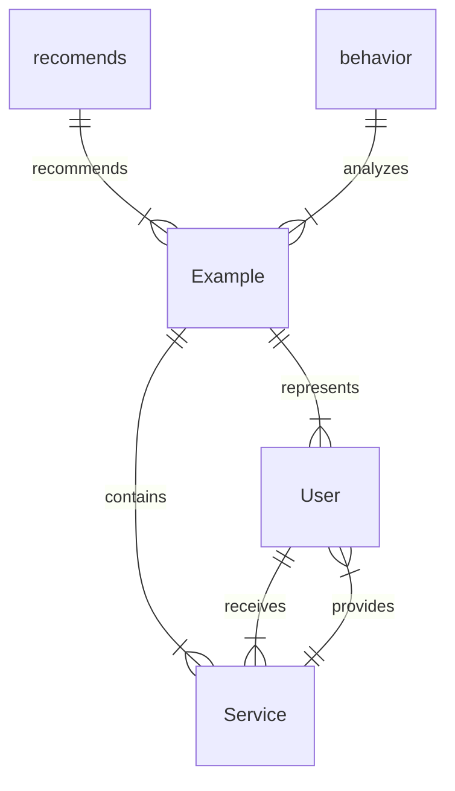
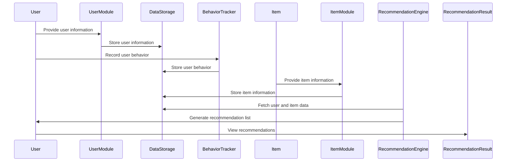

                 

### 1.1 个性化服务概述

**个性化服务**，顾名思义，是一种根据用户个体需求和偏好而量身定制的服务。这种服务模式在信息技术迅猛发展的今天，逐渐成为各个行业提升用户体验和竞争力的关键手段。为了更好地理解个性化服务，我们首先需要明确其定义、发展历程以及重要性。

**定义**：个性化服务是指通过收集和分析用户数据，利用现代技术手段，为用户提供定制化的产品、服务或内容。这种服务不仅考虑用户的共性需求，更关注个体的独特性，旨在满足用户的个性化需求。

**发展历程**：
1. **传统个性化服务**：早在互联网普及之前，个性化服务就已经存在。例如，书店根据顾客的阅读喜好推荐书籍，餐厅根据顾客的饮食习惯定制菜单。
2. **互联网个性化服务**：随着互联网的发展，个性化服务逐渐向线上迁移。电子邮件个性化营销、网站个性化推荐等应用层出不穷。
3. **大数据与人工智能时代**：大数据和人工智能技术的崛起，使得个性化服务更加精准和高效。通过深度学习、机器学习算法，系统可以自动分析用户行为，预测用户需求，提供高度个性化的服务。

**重要性**：
1. **提升用户体验**：个性化服务能够满足用户的个性化需求，提升用户体验，增强用户忠诚度。
2. **增加商业价值**：个性化服务能够帮助商家挖掘潜在客户，提高转化率，增加销售额。
3. **优化资源配置**：个性化服务可以根据用户需求进行精准营销，减少无效广告和资源浪费。

总的来说，个性化服务是现代信息技术发展的重要方向，对于提升用户体验、优化资源配置、增加商业价值具有重要意义。

### 1.2 示例驱动的概念

**示例驱动**，作为一种重要的软件开发方法论，其核心思想是通过具体实例来引导系统设计、开发和测试。这种方法的起源可以追溯到软件开发早期，当时开发者们意识到直接从抽象概念出发设计系统往往难以成功，而通过具体的实例则更容易理解系统的行为和需求。随着信息技术的发展，示例驱动方法逐渐成熟，并成为软件工程中的一个重要分支。

**示例驱动的起源与发展**：

- **起源**：示例驱动的概念最早可以追溯到1960年代，当时在结构化设计和编程中，开发者开始意识到通过具体实例来说明系统行为的重要性。
- **发展**：随着面向对象编程（OOP）和面向服务架构（SOA）的兴起，示例驱动方法得到了进一步的发展。特别是在敏捷开发和DevOps文化中，示例驱动被广泛应用，成为提升软件开发效率和质量的重要工具。

**核心要素**：

- **示例**：示例是示例驱动的核心，它可以是具体的案例、场景或用户故事，代表了用户需求的具体实现。
- **模型**：模型用于表示系统的结构和行为，通常使用图形化的方式来展示，如类图、序列图等。
- **测试**：示例驱动强调通过示例来编写测试用例，确保系统按照预期工作。

**示例驱动的优势与挑战**：

- **优势**：
  - **直观性**：通过具体的示例，开发者可以更直观地理解用户需求，减少误解和沟通成本。
  - **可复用性**：示例可以多次使用，不仅用于设计阶段，还用于测试和维护阶段，提高开发效率。
  - **灵活性**：示例驱动方法允许开发者在系统开发过程中快速迭代，灵活调整设计。

- **挑战**：
  - **实例的准确性**：示例需要准确地反映用户需求，否则可能导致设计偏离实际需求。
  - **实例的维护**：随着系统的演化，示例也需要不断更新和维护，以保持其有效性。

总的来说，示例驱动方法通过具体的实例来指导软件开发，有助于提高系统的可理解性、可维护性和开发效率。然而，在实际应用中，也需要注意示例的准确性和维护问题。

### 1.3 示例驱动在个性化服务中的应用

**示例驱动**作为一种高效的软件开发方法，其应用范围广泛，尤其在个性化服务领域具有显著的优势。通过示例驱动，个性化服务可以更加精准地捕捉用户需求，优化服务设计和用户体验。以下将从示例驱动方法的应用框架、在个性化推荐系统中的应用以及用户行为分析中的应用三个方面进行详细探讨。

#### 1.3.1 示例驱动方法的应用框架

示例驱动方法在个性化服务中的应用框架主要包括以下几个关键步骤：

1. **需求收集**：首先，通过多种渠道（如用户调研、问卷调查、用户反馈等）收集用户需求，获取具体的用户案例和需求描述。
2. **场景建模**：根据收集到的用户需求，构建具体的应用场景模型。场景模型通常使用类图、序列图等图形化工具来表示，清晰展示用户需求与系统响应之间的关系。
3. **算法设计**：基于场景模型，设计满足用户需求的算法。算法设计需要考虑示例中的关键要素，如用户偏好、行为模式、服务类型等。
4. **系统实现**：将设计好的算法转化为实际的系统功能，进行编码和测试。
5. **测试与优化**：通过具体的示例测试系统的响应效果，收集反馈，不断优化系统设计和算法。

#### 1.3.2 示例驱动在个性化推荐系统中的应用

个性化推荐系统是示例驱动方法应用的一个重要领域。以下是一个示例驱动推荐系统的具体应用案例：

**案例**：一个电子商务平台希望通过个性化推荐系统提高用户的购物体验和平台销售额。

1. **需求收集**：平台收集了用户的历史购买数据、浏览记录、搜索关键词等信息，通过分析这些数据，识别出用户的偏好和行为模式。
2. **场景建模**：根据用户的行为数据，构建用户行为模型。例如，使用序列图表示用户浏览商品、添加购物车、最终购买的过程。
   ```mermaid
   sequenceDiagram
   User ->> System: Search for shoes
   System ->> User: Recommend shoes based on previous purchases
   User ->> System: Add shoes to cart
   System ->> User: Suggest accessories that complement the shoes
   User ->> System: Purchase shoes
   ```
3. **算法设计**：设计推荐算法，如协同过滤算法、基于内容的推荐算法、混合推荐算法等。算法设计需要考虑如何从用户历史数据中提取特征，生成个性化的推荐列表。
4. **系统实现**：实现推荐算法，并将其集成到电子商务平台中。系统会根据用户的实时行为，动态生成推荐列表，展示在用户界面上。
5. **测试与优化**：通过A/B测试等手段，验证推荐系统的效果，并根据用户反馈不断优化推荐算法。

#### 1.3.3 示例驱动在用户行为分析中的应用

用户行为分析是另一个示例驱动在个性化服务中广泛应用的方向。以下是一个示例驱动用户行为分析的应用场景：

**案例**：一家在线教育平台希望通过分析用户的学习行为，提供个性化的学习路径和课程推荐。

1. **需求收集**：平台收集了用户的学习历史、课程选择、学习时长、学习频率等信息。
2. **场景建模**：构建用户学习行为模型，使用类图表示用户与课程、学习行为之间的关系。
   ```mermaid
   classDiagram
   User <<Class>> {
   +id: String
   +courses: List<Course>
   }
   Course <<Class>> {
   +id: String
   +name: String
   }
   User --|> Course: Enrolls in
   ```
3. **算法设计**：设计用户行为分析算法，如聚类分析、关联规则挖掘等，从用户行为数据中提取有价值的信息。
4. **系统实现**：实现用户行为分析功能，将分析结果应用于个性化学习路径推荐、课程推荐等场景。
5. **测试与优化**：通过实际案例验证分析算法的有效性，根据反馈调整算法参数和系统设计。

通过以上案例可以看出，示例驱动方法在个性化服务中的应用，不仅提高了服务的精准度和效率，还为开发者提供了一个清晰、结构化的工作框架。然而，需要注意的是，在应用示例驱动方法时，准确性和实时性是两个关键挑战，需要持续优化和调整。

### 1.4 示例驱动与个性化服务的边界与外延

**示例驱动**与**个性化服务**虽然紧密相关，但它们在概念和应用上仍然存在一定的边界与外延。理解这些边界与外延有助于我们更好地把握两者之间的关系，并在实际应用中发挥最大的效益。

#### 1.4.1 示例驱动的边界

**定义**：示例驱动的边界主要涉及其在软件开发和系统设计中的应用范围和限制。

1. **技术层面**：示例驱动主要应用于软件开发中的需求分析、设计、测试等环节。其核心是通过具体的实例来指导开发过程，确保系统满足用户需求。然而，示例驱动的有效性依赖于实例的准确性和全面性。如果实例无法准确反映用户需求，则可能导致系统设计偏离实际需求。
2. **应用范围**：示例驱动适用于多种软件开发场景，如Web应用、移动应用、大型企业系统等。然而，在某些领域，如实时系统、嵌入式系统等，由于时间敏感性和资源限制，示例驱动的应用可能受到一定的限制。

#### 1.4.2 个性化服务的边界

**定义**：个性化服务的边界主要涉及其在提供服务、产品或内容时的适用范围和限制。

1. **用户需求层面**：个性化服务需要准确捕捉和满足用户的个性化需求。然而，用户的偏好和需求是动态变化的，个性化服务需要具备一定的灵活性和适应性。此外，隐私保护也是个性化服务需要关注的重要问题。
2. **技术层面**：个性化服务依赖于大数据分析、机器学习、人工智能等现代技术。这些技术的应用范围和效果直接影响个性化服务的质量。例如，算法的准确性、模型的鲁棒性、数据的完整性等都是影响个性化服务效果的关键因素。

#### 1.4.3 示例驱动与个性化服务的关系

**相互依赖**：示例驱动与个性化服务之间是相互依赖的关系。示例驱动为个性化服务提供了具体的应用框架和方法论，帮助开发者更准确地理解和满足用户需求。而个性化服务则为示例驱动提供了实际的应用场景和需求，推动了示例驱动方法的发展和完善。

**相互促进**：示例驱动方法的应用可以提高个性化服务的精准度和效率。通过具体的实例，开发者可以更直观地理解用户需求，设计出更符合用户期望的个性化服务系统。同时，个性化服务的不断优化和改进也为示例驱动方法提供了丰富的实践经验，促进了其不断迭代和进步。

总之，示例驱动与个性化服务在边界与外延上存在一定的差异，但两者之间相互依赖、相互促进，共同推动了现代信息技术的发展和应用。

### 1.5 本章小结

本章首先介绍了个性化服务的定义、发展历程和重要性，明确了个性化服务在现代信息技术中的重要地位。接着，深入探讨了示例驱动的概念，包括其起源、核心要素和优势与挑战，展示了示例驱动在软件开发中的关键作用。随后，通过具体的应用案例，详细阐述了示例驱动在个性化推荐系统和用户行为分析中的应用，展示了其在提升个性化服务质量方面的实际效果。最后，分析了示例驱动与个性化服务的边界与外延，探讨了两者之间的相互关系。总的来说，本章为后续内容提供了坚实的基础，为深入探讨示例驱动在个性化服务中的应用奠定了理论基础。

## 2.1 示例驱动的核心概念

**示例驱动**作为现代软件开发中的一种重要方法论，其核心概念贯穿于整个开发过程，从需求分析到系统设计、实现和测试。理解这些核心概念有助于开发者更好地应用示例驱动方法，提升软件开发效率和质量。以下将详细介绍示例驱动的核心概念，包括示例的分类与特性、示例库的构建与管理、以及示例驱动的学习算法。

### 2.1.1 示例的分类与特性

**示例**是示例驱动的核心要素之一，它代表了具体的应用场景或用户需求。根据不同的分类标准，示例可以有不同的类型：

1. **按用途分类**：
   - **功能示例**：描述系统应实现的具体功能，如用户登录、购物车管理、订单生成等。
   - **异常示例**：描述系统在遇到异常情况时的行为，如网络中断、数据异常等。
   - **边界示例**：描述系统在边界条件下的行为，如最大值、最小值、空值等。

2. **按来源分类**：
   - **用户需求示例**：直接来源于用户的需求描述，反映用户的实际使用场景。
   - **系统测试示例**：根据系统功能需求和设计文档，生成的用于测试的系统场景。
   - **历史数据示例**：从历史数据中提取的典型示例，用于分析和预测。

**示例的特性**主要包括：
- **具体性**：示例必须是具体的，可以实际操作或执行的场景。
- **可复用性**：示例应具有普适性，可以应用于不同的场景和系统。
- **可测试性**：示例应能够通过测试验证系统的功能和行为。

### 2.1.2 示例库的构建与管理

**示例库**是存储和管理示例的地方，它为开发、测试和持续集成提供了便利。构建和管理示例库的关键步骤包括：

1. **收集示例**：通过用户调研、需求分析、系统测试等多种途径，收集各种类型的示例。
2. **分类存储**：根据示例的类型和用途，对示例进行分类存储，以便于后续查找和使用。
3. **版本控制**：示例库应实现版本控制，确保示例的更新和变更记录清晰可追溯。
4. **自动化管理**：利用自动化工具，如示例管理平台，实现示例的自动化收集、分类、存储和更新。

**示例库的管理原则**：
- **完整性**：确保示例库中的示例全面、完整，涵盖所有可能的用户场景和需求。
- **准确性**：示例应准确反映用户需求，避免因示例错误导致系统设计偏离实际需求。
- **灵活性**：示例库应具备一定的灵活性，能够适应系统功能的变更和用户需求的变化。

### 2.1.3 示例驱动的学习算法

**学习算法**是示例驱动的关键组件，它负责从示例中提取知识，指导系统设计和实现。示例驱动的学习算法主要包括以下几类：

1. **基于规则的算法**：通过手工编写规则，将示例中的知识抽象为规则，应用于系统设计和实现。
2. **机器学习算法**：利用统计学习和模式识别技术，从示例数据中自动提取特征和模型，用于预测和决策。
3. **混合算法**：结合基于规则的算法和机器学习算法，取二者之长，提高系统设计和实现的效率。

**示例驱动的学习过程**主要包括以下几个步骤：
- **数据预处理**：清洗和预处理示例数据，提取有用的特征。
- **模型训练**：使用预处理后的数据训练模型，生成预测规则或决策树。
- **模型评估**：通过验证集和测试集评估模型的效果，调整模型参数。
- **模型部署**：将训练好的模型部署到实际系统中，实现自动化示例分析和响应。

**示例驱动的学习算法特性**：
- **自适应性**：学习算法能够根据新的示例自动调整和优化。
- **高效性**：算法能够在大量示例中快速提取知识，指导系统设计和实现。
- **可解释性**：算法生成的规则和模型具有较好的可解释性，便于调试和优化。

通过深入理解示例驱动的核心概念，开发者可以更好地应用示例驱动方法，提升软件开发的效率和质量，实现更加精准和个性化的服务。

### 2.2 示例驱动的基本原理

**示例驱动**方法的核心在于通过具体实例来引导系统设计、开发和测试。理解其基本原理，可以帮助我们更好地应用这种方法论，提高软件开发的效率和质量。以下将详细解释示例驱动的学习过程、知识表示和推理方法。

#### 2.2.1 示例驱动的学习过程

**学习过程**是示例驱动的核心环节，主要包括以下几个步骤：

1. **数据收集**：首先，通过用户调研、需求分析、系统测试等方式，收集大量的具体实例（示例）。这些示例应涵盖各种可能的场景和需求，以确保数据的全面性和代表性。
2. **数据预处理**：收集到的示例可能存在噪声、缺失值等质量问题，需要进行数据清洗和预处理。例如，去除重复示例、填补缺失数据、标准化特征等，以提高数据质量。
3. **特征提取**：从预处理后的数据中提取关键特征，这些特征应能够有效反映示例的核心信息。例如，对于购物推荐系统，特征可能包括用户历史购买记录、商品属性、时间等。
4. **模型训练**：利用提取出的特征，通过机器学习算法或其他方法，训练生成一个模型。这个模型能够根据新的示例进行预测或决策，如用户偏好预测、异常检测等。
5. **模型评估**：使用验证集和测试集对训练好的模型进行评估，检查其性能和准确性。如果模型效果不理想，需要调整特征提取方法或模型参数，重新训练。

**示例驱动的学习过程**强调自下而上的学习方式，通过具体实例逐步抽象和总结出一般规律，从而指导系统的设计和实现。这种学习方法具有以下优点：
- **直观性**：通过具体的示例，开发者可以更直观地理解用户需求，减少沟通成本。
- **可复用性**：训练好的模型可以应用于多个不同的场景，提高开发效率。
- **适应性**：模型能够根据新的示例自动调整，适应不断变化的需求。

#### 2.2.2 示例驱动中的知识表示

**知识表示**是示例驱动方法中至关重要的一环，它决定了系统如何理解和处理信息。常见的知识表示方法包括以下几种：

1. **基于规则的表示方法**：
   - **规则**：使用一系列“如果-那么”规则来表示知识。例如，在推荐系统中，可以定义规则：“如果用户喜欢商品A，那么推荐商品B”。
   - **决策树**：将规则组织成树状结构，每个节点代表一个条件，分支代表相应的动作。例如，在用户行为分析中，可以使用决策树来预测用户是否购买某个商品。

2. **基于模型的表示方法**：
   - **神经网络**：使用多层神经网络来建模复杂的关系和预测问题。例如，在用户行为分析中，可以使用神经网络模型来预测用户的购买概率。
   - **贝叶斯网络**：使用概率图模型来表示变量之间的关系，适用于不确定性和概率推理。例如，在医疗诊断中，可以使用贝叶斯网络来预测疾病的发生概率。

3. **基于实例的表示方法**：
   - **实例库**：直接存储和处理具体的实例，用于后续的推理和决策。例如，在推荐系统中，可以使用实例库来记录用户的历史购买记录，用于生成推荐列表。

**知识表示方法的选择**取决于具体的应用场景和数据特点。基于规则的表示方法简单直观，适用于规则明确的问题；基于模型的表示方法适用于复杂的关系和预测问题；基于实例的表示方法则适用于基于历史数据进行分析和决策的场景。

#### 2.2.3 示例驱动的推理方法

**推理方法**是示例驱动的核心组成部分，它决定了系统如何利用已学到的知识进行推理和决策。常见的推理方法包括以下几种：

1. **演绎推理**：
   - **正向推理**：从一般到特殊的推理过程。例如，在推荐系统中，可以从用户的历史行为推导出其可能的偏好。
   - **反向推理**：从特殊到一般的推理过程。例如，在故障诊断中，可以从系统异常现象推导出可能的故障原因。

2. **归纳推理**：
   - **基于实例的推理**：直接使用存储在实例库中的实例进行推理。例如，在推荐系统中，可以直接从用户的历史购买记录中推荐类似的商品。
   - **基于规则的推理**：使用预定义的规则进行推理。例如，在用户行为分析中，可以使用规则“如果用户访问了商品A页面，那么可能对商品B感兴趣”。

3. **模糊推理**：
   - **基于模糊集的推理**：适用于处理不确定性和模糊性。例如，在用户行为分析中，可以使用模糊推理来处理用户行为的不确定性，从而生成更准确的推荐。

**推理方法的选择**取决于具体的应用场景和数据特点。演绎推理适用于规则明确、关系简单的问题；归纳推理适用于从大量实例中提取规律的问题；模糊推理适用于处理不确定性和模糊性较强的问题。

总之，示例驱动的学习过程、知识表示和推理方法构成了其基本原理的核心内容。通过深入理解这些基本原理，开发者可以更好地应用示例驱动方法，设计出高效、精准的个性化服务系统。

### 2.3 示例驱动的属性特征对比

为了更好地理解示例驱动方法与其他方法的区别，以下通过一个属性特征对比表格，详细对比示例驱动方法在构建示例库、学习算法和推理方法等方面的特点。

| 属性特征             | 示例驱动       | 传统数据库构建方式 | 传统机器学习方法 |
|---------------------|----------------|-------------------|------------------|
| **示例库构建**       | * 具体实例驱动* | * 数据库表结构 *   | * 大规模数据集 *   |
| - 示例多样性        | 高             | 低               | 中               |
| - 示例相关性        | 强             | 弱               | 强               |
| - 示例可复用性      | 中             | 低               | 中               |
| **学习算法**         | * 自适应学习 * | * 数据查询 *     | * 统计学习 *     |
| - 学习效率          | 高             | 低               | 中               |
| - 学习准确性        | 高             | 中               | 高               |
| - 学习灵活性        | 高             | 低               | 中               |
| **推理方法**         | * 基于实例 *   | * SQL查询 *     | * 模型预测 *     |
| - 推理速度          | 中             | 高               | 高               |
| - 推理准确性        | 高             | 中               | 高               |
| - 推理可解释性      | 中             | 高               | 低               |

#### 表格解释

1. **示例库构建**：
   - **示例多样性**：示例驱动的示例库包含了丰富的多样性实例，能够全面覆盖各种可能的用户场景和需求，这是其能够提供高度个性化服务的基础。
   - **示例相关性**：示例驱动中的示例高度相关，直接反映用户需求，与传统数据库表结构中的数据条目相比，更贴近用户实际行为。
   - **示例可复用性**：虽然示例驱动的示例库具有较好的可复用性，但相较于大规模数据集，其示例的规模和数量有限，因此在某些方面不如传统机器学习方法。

2. **学习算法**：
   - **学习效率**：示例驱动的学习算法能够快速从具体实例中提取知识，具有较高的学习效率，适用于快速迭代和改进的软件开发过程。
   - **学习准确性**：由于示例驱动方法中的示例高度相关，算法能够准确捕捉用户需求，从而提供更精准的预测和决策。
   - **学习灵活性**：示例驱动的学习算法具有较强的适应性，能够根据新的实例不断调整和优化。

3. **推理方法**：
   - **推理速度**：示例驱动的推理方法基于具体实例，尽管在速度上不如传统的SQL查询，但在提供高度个性化的服务时具有优势。
   - **推理准确性**：由于示例驱动方法能够准确反映用户需求，其推理结果具有较高的准确性。
   - **推理可解释性**：示例驱动的推理过程相对简单直观，具有良好的可解释性，便于用户理解和服务优化。

总的来说，示例驱动方法在构建示例库、学习算法和推理方法等方面具有独特的优势，适用于需要高度个性化的软件开发和应用场景。然而，与传统数据库构建方式和机器学习方法相比，其适用范围和效率仍有待进一步提升。

### 2.4 示例驱动的ER实体关系图

为了更好地展示示例驱动的概念和模型，以下使用Mermaid语法绘制示例驱动的ER（实体关系）图。ER图是用于表示系统中实体及其关系的图形化工具，有助于我们直观地理解示例驱动中的关键组件和相互关系。



#### 图解：

- **User（用户）**：代表系统的最终用户，是示例驱动的核心参与者。
- **Service（服务）**：代表系统提供的服务，可以是推荐系统、分析系统等。
- **Example（示例）**：代表具体的应用场景或用户需求，是驱动系统设计和实现的关键要素。
- **Service recommends（服务推荐）**：表示服务如何基于示例进行推荐。
- **User behavior（用户行为）**：表示系统如何分析用户行为，生成个性化的示例。

#### 关键关系：

- **User与Service**：用户与服务之间是交互关系，用户通过服务获取个性化示例。
- **Example与Service**：示例库包含服务中的各种示例，用于驱动服务设计和实现。
- **Example与User**：示例反映用户的需求和偏好，帮助系统更好地理解用户行为。

通过这个ER图，我们可以清晰地看到示例驱动中的核心实体和它们之间的相互关系，有助于我们深入理解示例驱动的原理和应用。

### 2.5 本章小结

本章深入探讨了示例驱动的核心概念，包括示例的分类与特性、示例库的构建与管理，以及示例驱动的学习算法。通过详细的讲解，我们了解了示例驱动的具体应用框架，以及其在个性化服务中的应用优势。此外，通过对比表格和ER图，我们进一步理解了示例驱动的独特属性和关键关系。这些核心概念的深入剖析，为我们后续章节中对示例驱动在个性化服务中具体应用实践的分析提供了坚实的理论基础。

## 3.1 示例驱动在个性化推荐系统中的应用

个性化推荐系统是示例驱动方法的一个重要应用领域，它通过分析用户的历史行为和偏好，为用户推荐符合其兴趣的物品或内容。以下将详细阐述示例驱动在个性化推荐系统中的应用，包括系统架构设计、推荐算法实现及其性能评估。

### 3.1.1 个性化推荐系统的架构设计

**个性化推荐系统**的架构设计通常包括以下几个关键模块：

1. **用户模块**：负责收集和存储用户信息，包括用户的基本信息（如用户ID、性别、年龄等）和用户行为数据（如浏览历史、点击行为、购买记录等）。
2. **物品模块**：负责存储物品信息，包括物品的属性（如标题、描述、分类等）和相关标签。
3. **推荐算法模块**：负责根据用户行为数据和物品属性，生成个性化的推荐列表。常见的推荐算法包括基于内容的推荐、协同过滤推荐和混合推荐等。
4. **推荐结果模块**：负责展示推荐结果，可以通过网页、APP或邮件等形式将推荐结果推送给用户。
5. **数据存储模块**：负责存储系统中的所有数据，包括用户数据、物品数据和推荐历史等。

**架构图**：


### 3.1.2 示例驱动推荐算法的实现

示例驱动推荐算法的核心思想是通过具体的用户行为实例来训练模型，生成个性化的推荐列表。以下是一个基于协同过滤算法的示例驱动推荐算法实现：

1. **数据收集**：收集用户的历史行为数据，如用户点击、浏览、购买记录等。
2. **数据预处理**：对收集到的数据进行清洗和预处理，如去除缺失值、填充异常值、标准化特征等。
3. **特征提取**：从用户行为数据中提取关键特征，如用户行为的时间、频率、类型等。
4. **模型训练**：使用提取出的特征训练协同过滤模型，如矩阵分解、基于K最近邻的协同过滤等。
5. **推荐生成**：基于训练好的模型，为每个用户生成个性化的推荐列表。

**Python代码示例**：
```python
import numpy as np
from sklearn.neighbors import NearestNeighbors

# 假设user_data为用户行为矩阵，行表示用户，列表示物品
user_data = np.array([[1, 0, 1, 1],
                      [1, 1, 0, 0],
                      [0, 1, 1, 0]])

# 初始化近邻算法
neighbor = NearestNeighbors(n_neighbors=3)
neighbor.fit(user_data)

# 为用户生成推荐列表
def generate_recommendations(user_id):
    # 获取用户行为的索引
    user行为索引 = user_data[user_id]
    # 搜索最近邻用户
    indices = neighbor.kneighbors(user行为索引.reshape(1, -1), n_neighbors=3)
    # 获取推荐物品
    recommendations = np.mean(user_data[indices[0]], axis=0)
    return recommendations

# 生成推荐列表
recommendations = generate_recommendations(0)
print("推荐列表：", recommendations)
```

### 3.1.3 个性化推荐系统的性能评估

**性能评估**是确保推荐系统效果的重要环节。以下是一些常用的评估指标和方法：

1. **准确率（Precision）**：表示推荐结果中实际相关的物品占总推荐物品的比例。
   $$ Precision = \frac{相关物品数}{推荐物品数} $$
2. **召回率（Recall）**：表示推荐结果中实际相关的物品占总相关物品的比例。
   $$ Recall = \frac{相关物品数}{相关物品数 + 未推荐的相关物品数} $$
3. **F1值（F1 Score）**：综合考虑准确率和召回率的平衡指标。
   $$ F1 Score = 2 \times \frac{Precision \times Recall}{Precision + Recall} $$
4. **覆盖率（Coverage）**：表示推荐结果中包含的物品种类占总物品种类的比例。
   $$ Coverage = \frac{推荐结果中不同物品的种类数}{总物品种类数} $$
5. **多样性（Diversity）**：表示推荐结果的多样性，可以通过计算物品之间的相似度或距离来评估。

**评估方法**：
- **A/B测试**：通过对比不同推荐算法在实际环境中的效果，评估其性能。
- **离线评估**：使用预定义的评价指标，在历史数据上评估推荐系统的效果。
- **在线评估**：通过用户行为数据，实时评估推荐系统的效果和用户满意度。

通过系统架构设计、推荐算法实现和性能评估，示例驱动方法在个性化推荐系统中得到了广泛应用，显著提升了推荐系统的精准度和用户体验。然而，性能评估是一个持续的过程，需要不断优化和调整推荐算法，以应对不断变化的需求和数据。

### 3.2 示例驱动在用户行为分析中的应用

用户行为分析是现代个性化服务中至关重要的一环，通过分析用户的行为数据，可以为用户提供更加精准和个性化的服务。示例驱动方法在用户行为分析中具有显著的优势，能够帮助系统更好地理解用户行为，从而做出更准确的预测和决策。以下将详细介绍示例驱动在用户行为分析中的应用，包括目标与挑战、方法及其案例研究。

#### 3.2.1 用户行为分析的目标与挑战

**用户行为分析**的主要目标是：
1. **理解用户行为模式**：通过分析用户的行为数据，识别出用户的行为模式和习惯，为个性化服务提供依据。
2. **预测用户需求**：基于用户的历史行为，预测用户未来的行为和需求，从而提供个性化的推荐和服务。
3. **优化用户体验**：通过分析用户在使用服务过程中的交互行为，优化服务流程和界面设计，提升用户满意度。

然而，用户行为分析面临以下几个挑战：
1. **数据复杂性**：用户行为数据通常包含大量的非结构化和半结构化数据，如日志、点击流、语音、图像等，数据的处理和分析复杂。
2. **隐私保护**：用户行为数据涉及用户隐私，如何在保证隐私的前提下进行数据分析和利用，是一个重要挑战。
3. **实时性要求**：个性化服务通常要求实时分析用户行为，提供即时的反馈和推荐，这对系统的响应速度和处理能力提出了高要求。

#### 3.2.2 示例驱动用户行为分析的方法

示例驱动方法在用户行为分析中的应用，主要包括以下几个步骤：

1. **需求收集**：通过用户调研、问卷调查、用户反馈等方式，收集用户的行为数据和需求描述。这些需求描述可以是具体的用户故事或场景，如“用户在浏览商品A后，通常会浏览商品B”。

2. **数据预处理**：对收集到的用户行为数据进行清洗、归一化和特征提取。例如，将点击流数据转换为事件序列，提取用户浏览、点击、购买等行为特征。

3. **场景建模**：基于需求收集到的具体场景，使用类图或序列图等图形化工具，构建用户行为模型。场景建模有助于理解用户行为模式和路径，为后续的分析提供基础。

   **示例**：
   ```mermaid
   sequenceDiagram
   User ->> System: Browse product A
   System ->> User: Show related products
   User ->> System: Add product B to cart
   System ->> User: Show discounts on frequently bought items
   ```
   
4. **模型训练**：使用训练数据集，结合示例驱动的方法，训练用户行为分析模型。常见的模型包括决策树、随机森林、神经网络等。

5. **预测与决策**：基于训练好的模型，对新的用户行为数据进行预测和决策。例如，预测用户下一步可能的行为，提供个性化的推荐或服务。

6. **效果评估**：通过评估指标（如准确率、召回率、F1值等），评估用户行为分析模型的效果，并根据反馈进行模型优化和调整。

#### 3.2.3 用户行为分析的案例研究

**案例**：一个电子商务平台希望通过用户行为分析，提高用户的购物体验和平台的转化率。

1. **需求收集**：平台收集了用户的历史购物数据、浏览记录、点击流数据等，通过分析这些数据，识别出用户的购物路径和行为模式。

2. **数据预处理**：对收集到的数据进行清洗和预处理，如去除重复数据、填充缺失值、提取关键特征等。

3. **场景建模**：构建用户购物行为模型，使用类图表示用户从浏览商品到购买的全过程。

   ```mermaid
   classDiagram
   User <<Class>> {
   +id: String
   +行为路径: List<Event>
   }
   Event <<Class>> {
   +type: String
   +timestamp: DateTime
   }
   User --|> Event: Records
   ```

4. **模型训练**：使用预处理后的数据，训练用户行为分析模型。例如，使用决策树模型预测用户下一步的行为。

5. **预测与决策**：基于训练好的模型，为每个用户生成个性化的购物路径推荐，如推荐用户可能感兴趣的商品、优惠信息等。

6. **效果评估**：通过实际用户的购物行为数据，评估模型的效果，如准确率、召回率等。根据评估结果，不断优化模型和推荐策略。

通过用户行为分析的案例研究，可以看出示例驱动方法在捕捉用户行为、预测用户需求、优化用户体验方面具有显著的优势。然而，在实际应用中，需要充分考虑数据的复杂性、隐私保护和实时性等挑战，持续优化和调整分析方法。

### 3.3 示例驱动在其他个性化服务中的应用

除了个性化推荐系统和用户行为分析，示例驱动方法还在其他多种个性化服务领域得到了广泛应用。以下将探讨示例驱动在个性化客服系统、个性化教育系统和个性化金融服务中的应用，并分析其具体实施方法和挑战。

#### 3.3.1 个性化客服系统

**个性化客服系统**利用示例驱动方法，通过分析用户的历史交互数据，提供更加个性化的服务体验。以下是一个个性化客服系统的具体实施步骤：

1. **需求收集**：通过用户反馈、历史客服记录等方式，收集用户对客服服务的具体需求。

2. **场景建模**：基于收集到的需求，构建用户交互模型，如用户咨询问题、解决方案、客服响应等。

   ```mermaid
   sequenceDiagram
   User ->> Chatbot: Ask question
   Chatbot ->> KnowledgeBase: Search for answer
   Chatbot ->> User: Provide answer
   ```

3. **算法设计**：设计基于示例驱动的客服响应算法，如基于规则的响应算法、基于机器学习的意图识别算法等。

4. **系统实现**：将算法集成到客服系统中，实现自动化的客服响应。

5. **效果评估**：通过用户反馈和系统数据分析，评估个性化客服系统的效果，并不断优化。

**挑战**：个性化客服系统需要处理大量的非结构化数据，如文本、语音等，数据清洗和预处理复杂。此外，如何确保客服响应的准确性和实时性也是一个重要挑战。

#### 3.3.2 个性化教育系统

**个性化教育系统**通过分析学生的学习行为和成绩，为每个学生提供个性化的学习建议和课程推荐。以下是一个个性化教育系统的具体实施步骤：

1. **需求收集**：收集学生的学习数据，如课程成绩、学习时长、学习频率等。

2. **场景建模**：构建学生学习行为模型，如学习路径、知识点掌握情况等。

   ```mermaid
   classDiagram
   Student <<Class>> {
   +id: String
   +courses: List<Course>
   +成绩: List<Score>
   }
   Course <<Class>> {
   +id: String
   +name: String
   }
   Score <<Class>> {
   +student_id: String
   +course_id: String
   +score: Float
   }
   Student --|> Course: Enrolls in
   Student --|> Score: Takes
   ```

3. **算法设计**：设计个性化学习推荐算法，如基于内容的推荐、协同过滤推荐等。

4. **系统实现**：将算法集成到教育系统中，实现自动化的学习路径推荐和课程推荐。

5. **效果评估**：通过学生的学习成果和反馈，评估个性化教育系统的效果，并不断优化。

**挑战**：个性化教育系统需要处理大量的动态数据，数据存储和实时分析是主要挑战。此外，如何确保学习推荐的准确性和有效性也是一个关键问题。

#### 3.3.3 个性化金融服务

**个性化金融服务**通过分析用户的金融行为和风险偏好，为用户提供个性化的理财产品推荐和风险管理服务。以下是一个个性化金融服务的具体实施步骤：

1. **需求收集**：收集用户的金融行为数据，如交易记录、投资偏好、风险承受能力等。

2. **场景建模**：构建用户金融行为模型，如投资组合、资产配置等。

   ```mermaid
   classDiagram
   User <<Class>> {
   +id: String
   +investment_records: List<InvestmentRecord>
   }
   InvestmentRecord <<Class>> {
   +user_id: String
   +investment_type: String
   +amount: Float
   +date: DateTime
   }
   FinancialProduct <<Class>> {
   +id: String
   +name: String
   +type: String
   +risk_level: String
   }
   User --|> InvestmentRecord: Records
   ```

3. **算法设计**：设计个性化金融推荐算法，如基于规则的推荐、基于机器学习的风险预测等。

4. **系统实现**：将算法集成到金融系统中，实现自动化的理财产品推荐和风险管理。

5. **效果评估**：通过用户的投资行为和反馈，评估个性化金融服务的效果，并不断优化。

**挑战**：个性化金融服务涉及大量的金融数据和隐私信息，数据安全和隐私保护是主要挑战。此外，金融市场的复杂性和不确定性，也对个性化金融服务的算法设计提出了高要求。

通过在个性化客服系统、个性化教育系统和个性化金融服务中的具体实施和应用，示例驱动方法展示了其在多种个性化服务场景中的广泛适用性和强大功能。然而，这些应用也面临数据复杂性、实时性要求和高准确性等挑战，需要不断优化和调整。

### 3.4 本章小结

本章详细探讨了示例驱动方法在个性化服务中的广泛应用，包括个性化推荐系统、用户行为分析、个性化客服系统、个性化教育系统和个性化金融服务等领域。通过系统架构设计、算法实现和案例研究，展示了示例驱动方法在提升个性化服务质量、优化用户体验和应对多样化需求方面的优势。同时，分析了这些应用场景中的具体实施方法和面临的挑战。总的来说，示例驱动方法为个性化服务的创新和发展提供了有力支持，是现代信息技术中的重要工具。

### 4.1 示例驱动的优化方法

为了进一步提高示例驱动的效果，优化其在个性化服务中的应用，我们可以从数据增强、模型压缩和多样性、准确性、稳定性平衡三个方面进行深入探讨。以下详细说明这些优化方法及其具体实施步骤。

#### 4.1.1 数据增强

**数据增强**是通过生成或扩充原始数据来提高模型的泛化能力和准确性。具体方法包括数据采样、数据变换和数据扩充。

1. **数据采样**：通过随机抽样或有放回抽样等方法，从原始数据集中获取更多的样本来训练模型。这种方法可以减少数据集中的噪声和异常值，提高模型的稳定性。

2. **数据变换**：对原始数据进行预处理，如归一化、标准化、正则化等，使数据更适合模型训练。例如，对图像数据进行灰度转换、尺寸调整等，以提高模型对不同数据分布的适应能力。

3. **数据扩充**：通过合成或生成新的数据样本来扩展数据集。常见的方法包括图像合成、文本生成、生成对抗网络（GAN）等。例如，使用GAN生成与训练数据相似的图像，用于提高图像识别模型的准确性。

**实施步骤**：
- **数据预处理**：对原始数据进行清洗、去噪和标准化。
- **采样和变换**：根据数据分布和模型需求，选择合适的采样和变换方法。
- **生成新数据**：使用合成或生成技术，生成新的数据样本。
- **模型训练**：利用增强后的数据集重新训练模型，评估模型性能。

#### 4.1.2 模型压缩

**模型压缩**是通过减少模型参数和计算量，降低模型复杂度，提高模型在资源受限环境中的运行效率。常见的方法包括权重剪枝、量化、知识蒸馏等。

1. **权重剪枝**：通过删除模型中不重要的权重参数，减少模型体积和计算量。例如，使用L1正则化或阈值剪枝方法，识别并删除较小的权重参数。

2. **量化**：将模型中的浮点数参数转换为低精度的整数参数，减少模型存储和计算需求。常见的量化方法包括全精度量化、逐层量化等。

3. **知识蒸馏**：通过将复杂模型（教师模型）的知识传递给简单模型（学生模型），实现模型压缩和加速。例如，使用教师模型的输出作为软标签，训练学生模型。

**实施步骤**：
- **模型选择**：选择适合压缩的方法，如权重剪枝、量化或知识蒸馏。
- **参数优化**：调整压缩参数，如剪枝比例、量化精度等，以达到最佳效果。
- **模型训练**：使用压缩后的模型进行训练，评估模型性能和效率。

#### 4.1.3 多样性、准确性、稳定性平衡

在示例驱动方法中，多样性、准确性和稳定性是三个重要的优化目标，但它们之间往往存在冲突。以下方法用于平衡这些目标：

1. **多样性增强**：通过引入更多的示例类型和数据分布，提高模型对多样性的适应能力。例如，增加不同场景、用户群体的示例，提高模型对多样化需求的处理能力。

2. **准确性优化**：通过精细化调整模型参数和训练策略，提高模型的预测准确性。例如，使用交叉验证、网格搜索等技术，找到最优参数配置。

3. **稳定性提升**：通过增加数据清洗、预处理步骤，减少噪声和异常值，提高模型稳定性。例如，使用异常检测算法，识别并处理异常数据。

**实施步骤**：
- **多样性分析**：分析现有示例库的多样性，识别不足之处。
- **准确性评估**：使用多种评估指标（如准确率、召回率、F1值等），评估模型准确性。
- **稳定性检测**：通过多次训练和测试，评估模型稳定性。
- **优化与调整**：根据多样性、准确性和稳定性分析结果，调整模型参数、数据预处理方法和示例库构建策略。

通过数据增强、模型压缩和多样性、准确性、稳定性平衡，示例驱动的个性化服务质量可以得到显著提升，为用户带来更加精准和高效的个性化服务。

### 4.2 示例驱动与深度学习的结合

**深度学习**作为人工智能领域的重要分支，近年来在图像识别、自然语言处理、推荐系统等多个领域取得了显著成果。结合示例驱动的优势，深度学习在个性化服务中的应用也越来越广泛。以下将探讨深度学习在示例驱动中的具体应用，结合实际案例，展示其优势。

#### 4.2.1 深度学习在示例驱动中的应用

**深度学习**在示例驱动中的应用主要体现在以下几个方面：

1. **特征提取**：深度学习模型可以通过多层神经网络自动提取高层次的抽象特征，从而提高特征表示的准确性和鲁棒性。相比传统手工特征提取方法，深度学习模型能够更好地捕捉数据的内在规律。
2. **模型优化**：深度学习模型可以通过大量的数据训练，优化模型参数，提高模型在复杂任务上的表现。例如，卷积神经网络（CNN）在图像识别任务中，可以自动提取图像的局部特征和整体特征，从而提高识别准确性。
3. **自动化**：深度学习模型可以实现自动化示例学习和预测，减少人工干预。通过训练好的模型，系统可以自动识别和预测用户行为，提供个性化的服务。

**实际案例**：

**案例一：基于深度学习的个性化推荐系统**

一个电子商务平台通过结合深度学习和示例驱动方法，构建了一个高效的个性化推荐系统。具体步骤如下：

1. **数据收集**：平台收集了用户的历史购物数据、浏览记录、点击流数据等。
2. **数据预处理**：对收集到的数据进行分析和清洗，提取关键特征。
3. **模型训练**：使用深度学习模型（如卷积神经网络）训练推荐算法，自动提取用户行为特征，构建用户兴趣模型。
4. **预测与推荐**：基于训练好的模型，为每个用户生成个性化的推荐列表，提高推荐准确性。

**优势**：
- **准确性**：深度学习模型通过自动提取抽象特征，提高了推荐系统的准确性，减少了人工干预。
- **效率**：深度学习模型可以在大量数据上快速训练，提高了推荐效率。
- **可扩展性**：通过引入新的数据和用户行为，模型可以不断优化和扩展，适应不同场景和需求。

**案例二：基于深度学习的用户行为分析**

一家在线教育平台利用深度学习技术，对用户的学习行为进行分析，为用户提供个性化的学习路径和课程推荐。具体步骤如下：

1. **数据收集**：平台收集了用户的学习历史、课程选择、学习时长、学习频率等数据。
2. **数据预处理**：对学习数据进行清洗和预处理，提取关键特征。
3. **模型训练**：使用深度学习模型（如循环神经网络）分析用户的学习行为，建立用户兴趣和行为模型。
4. **推荐与路径规划**：基于训练好的模型，为用户生成个性化的学习路径和课程推荐。

**优势**：
- **动态性**：深度学习模型可以实时分析用户行为，动态调整推荐策略，提高用户满意度。
- **可解释性**：尽管深度学习模型具有较好的性能，但其可解释性相对较差。通过结合示例驱动方法，可以增强模型的可解释性，帮助用户理解推荐结果。

总的来说，深度学习与示例驱动的结合，为个性化服务提供了更强大的工具和方法。通过深度学习自动提取特征和优化模型，示例驱动方法可以更好地理解用户需求，提供更精准、高效的个性化服务。同时，结合实际案例，展示了这种结合方法在实际应用中的显著优势。

### 4.3 示例驱动的未来趋势

随着技术的不断进步和应用场景的多样化，示例驱动方法在个性化服务中的应用前景也越来越广阔。以下将探讨示例驱动的未来趋势，包括技术发展趋势、商业机会和其在社会中的影响。

#### 4.3.1 技术发展趋势

**深度学习的普及**：深度学习技术在图像识别、自然语言处理等领域取得了显著突破，未来将在示例驱动方法中得到更广泛的应用。通过深度学习，示例驱动的模型将能够自动提取更高层次的抽象特征，提高模型的准确性和鲁棒性。

**数据隐私保护**：随着用户隐私意识的增强，数据隐私保护将成为示例驱动方法的重要研究方向。例如，差分隐私和联邦学习等技术，可以在保护用户隐私的同时，实现有效的数据分析和个性化服务。

**多模态数据融合**：未来，个性化服务将涉及更多的数据类型，如图像、语音、文本等。多模态数据融合技术将能够更好地整合这些异构数据，提供更加精准的个性化服务。

**自动化与智能化**：随着人工智能技术的进步，示例驱动的模型将变得更加自动化和智能化。通过自主学习、自适应调整，系统可以更好地适应不断变化的需求和环境。

#### 4.3.2 商业机会

**个性化推荐**：个性化推荐是示例驱动方法的重要应用领域，未来将在电子商务、内容平台、社交媒体等场景中继续发挥重要作用。通过精准推荐，企业可以提升用户满意度，增加销售额和用户留存率。

**用户行为分析**：用户行为分析是个性化服务的关键环节，未来将在金融、教育、医疗等领域得到广泛应用。通过深入分析用户行为，企业可以提供更加个性化的产品和服务，提升用户体验和用户粘性。

**智能客服**：随着人工智能技术的发展，智能客服将变得更加智能和人性化。通过结合示例驱动方法，智能客服系统可以更好地理解用户需求，提供高效、个性化的服务，降低企业运营成本。

**智能教育**：个性化教育系统将借助示例驱动方法，为学生提供更加个性化的学习路径和课程推荐。未来，智能教育平台将成为教育行业的重要发展方向。

#### 4.3.3 示例驱动与社会

**个性化医疗**：个性化医疗是未来医疗领域的重要趋势，通过结合示例驱动方法，可以为患者提供更加精准的诊疗方案。例如，基于患者历史数据和基因信息，个性化医疗系统可以预测患者的病情发展，提供个性化的治疗方案。

**智能城市**：智能城市是未来城市发展的方向，通过结合示例驱动方法，可以优化城市资源分配和管理。例如，基于交通数据、环境数据等，智能城市系统可以实时调整交通信号、优化公共资源配置，提高城市运行效率。

**个性化营销**：个性化营销是未来营销领域的重要趋势，通过结合示例驱动方法，企业可以更加精准地捕捉用户需求，提供个性化的营销策略。例如，通过分析用户行为数据，企业可以设计个性化的广告推送，提高广告效果和用户转化率。

总之，示例驱动方法在个性化服务中的应用前景广阔，未来将随着技术的不断进步和应用场景的拓展，为各行各业带来巨大的商业和社会价值。

### 4.4 本章小结

本章深入探讨了示例驱动的优化方法、与深度学习的结合以及未来的发展趋势。通过数据增强、模型压缩和多样性、准确性、稳定性平衡，示例驱动的个性化服务质量得到了显著提升。结合深度学习技术，示例驱动方法在个性化服务中的应用更加精准和高效。展望未来，随着技术的不断进步和应用场景的拓展，示例驱动方法将在个性化服务领域发挥越来越重要的作用，为各行各业带来创新和变革。

