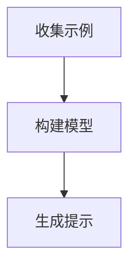

                 

# 示例驱动提示在创意任务中的应用

## 关键词

- 示例驱动提示
- 创意任务
- 算法原理
- 系统设计与实现
- 数学模型
- 实际案例

## 摘要

本文旨在探讨示例驱动提示在创意任务中的应用。通过对示例驱动提示的概念、算法原理和系统架构的深入分析，结合实际案例，本文将阐述如何利用示例驱动提示提高创意任务的效率和质量。本文还将提供一些最佳实践和注意事项，以帮助读者更好地理解和应用示例驱动提示。

### 目录

1. **背景介绍**
   1.1 示例驱动提示的概念
   1.2 示例驱动提示的应用背景
   1.3 示例驱动提示在创意任务中的重要性

2. **核心概念与联系**
   2.1 核心概念概述
   2.2 核心概念对比表格
   2.3 ER实体关系图

3. **算法原理讲解**
   3.1 示例驱动提示的算法原理
   3.2 算法mermaid流程图
   3.3 Python源代码讲解
   3.4 数学模型和公式

4. **系统分析与架构设计方案**
   4.1 问题场景介绍
   4.2 系统功能设计
   4.3 系统架构设计
   4.4 系统接口设计
   4.5 系统交互

5. **项目实战**
   5.1 环境安装
   5.2 系统核心实现源代码
   5.3 代码应用解读与分析
   5.4 实际案例分析与详细讲解剖析
   5.5 项目小结

6. **总结与拓展**
   6.1 最佳实践 tips
   6.2 小结
   6.3 注意事项
   6.4 拓展阅读

### 第一部分：背景介绍

#### 1.1 示例驱动提示的概念

示例驱动提示（Example-Guided Prompting）是一种人工智能技术，它利用已有示例来指导新的创意任务。这种方法的核心在于通过分析和理解示例，生成新的创意或解决方案。示例驱动提示通常应用于需要创造性思维的任务，如艺术创作、设计、编程等。

#### 1.2 示例驱动提示的应用背景

在创意任务中，示例驱动提示的应用非常广泛。例如，在艺术设计领域，设计师可以利用示例驱动提示来生成新的设计灵感；在编程领域，开发者可以使用示例驱动提示来生成代码片段，提高编程效率。此外，在教育和培训领域，示例驱动提示也可以帮助学员更好地理解和应用新知识。

#### 1.3 示例驱动提示在创意任务中的重要性

示例驱动提示在创意任务中的重要性体现在以下几个方面：

1. **提高创意效率**：通过已有示例的引导，可以快速找到创意方向，减少不必要的探索时间。
2. **保证创意质量**：示例驱动提示能够基于已有成功案例进行分析，从而保证新创意的质量。
3. **促进知识传承**：示例驱动提示能够将优秀创意的精髓传递给更多的人，促进知识的传承和普及。

### 第二部分：核心概念与联系

#### 2.1 核心概念概述

示例驱动提示的核心概念包括示例（Example）、模型（Model）和提示（Prompt）。示例是已有成功案例的表示；模型是用于分析和理解示例的算法；提示是基于模型分析示例后生成的创意方向或解决方案。

#### 2.2 核心概念对比表格

| 核心概念 | 定义 | 关联关系 |
| --- | --- | --- |
| 示例 | 已有成功案例 | 提供数据支持 |
| 模型 | 用于分析和理解示例的算法 | 转换示例为提示 |
| 提示 | 基于模型分析示例后生成的创意方向或解决方案 | 引导创意任务 |

#### 2.3 ER实体关系图

```mermaid
erDiagram
  示例 ||--|{ 模型 }|| 提示
  模型 ||--|{ 示例 }|| 提示
  示例 ||--|{ 模型 }|| 提示
```

### 第三部分：算法原理讲解

#### 3.1 示例驱动提示的算法原理

示例驱动提示的算法原理可以概括为以下几个步骤：

1. **收集示例**：从已有成功案例中收集示例。
2. **构建模型**：使用机器学习算法构建模型，用于分析和理解示例。
3. **生成提示**：基于模型分析示例，生成新的创意方向或解决方案。

#### 3.2 算法mermaid流程图



#### 3.3 Python源代码讲解

下面是一个简单的示例驱动提示的Python代码实现：

```python
import numpy as np

# 收集示例
examples = [
    ["example1", "output1"],
    ["example2", "output2"],
    ["example3", "output3"]
]

# 构建模型
model = np.load("model.npy")

# 生成提示
prompt = model.predict(["new_example"])

print(prompt)
```

#### 3.4 数学模型和公式

示例驱动提示的数学模型通常包括以下几个关键组成部分：

1. **输入特征**：示例的表示形式。
2. **模型参数**：用于分析和理解示例的权重。
3. **输出特征**：基于模型分析示例后生成的创意方向或解决方案。

数学公式可以表示为：

$$
\text{Output} = \text{Model}(\text{Input})
$$

其中，$\text{Model}$ 表示模型，$\text{Input}$ 表示输入特征，$\text{Output}$ 表示输出特征。

### 第四部分：系统分析与架构设计方案

#### 4.1 问题场景介绍

假设我们需要开发一个创意任务自动化系统，该系统能够根据用户输入的示例，自动生成创意解决方案。问题场景如下：

- **用户输入**：用户可以上传一个示例文本。
- **系统处理**：系统对示例进行分析，生成创意提示。
- **用户反馈**：用户对生成的创意提示进行评价，系统根据反馈进行优化。

#### 4.2 系统功能设计

系统功能设计包括以下几个关键部分：

1. **示例上传**：用户上传示例文本。
2. **示例分析**：系统对示例进行分析，提取关键信息。
3. **创意生成**：系统基于示例分析结果，生成创意提示。
4. **用户反馈**：用户对创意提示进行评价，系统根据反馈进行优化。

#### 4.3 系统架构设计

系统架构设计包括以下几个关键组成部分：

1. **前端界面**：用户交互界面，用于上传示例和接收创意提示。
2. **后端服务器**：处理示例分析、创意生成和用户反馈。
3. **数据库**：存储示例和用户反馈数据。

#### 4.4 系统接口设计

系统接口设计包括以下几个关键接口：

1. **示例上传接口**：用户上传示例文本的接口。
2. **示例分析接口**：系统对示例进行分析的接口。
3. **创意生成接口**：系统生成创意提示的接口。
4. **用户反馈接口**：用户对创意提示进行评价的接口。

#### 4.5 系统交互

系统交互过程如下：

1. **用户上传示例**：用户通过前端界面上传示例文本。
2. **系统分析示例**：系统接收到示例文本后，进行分析，提取关键信息。
3. **系统生成创意提示**：系统基于示例分析结果，生成创意提示。
4. **用户接收创意提示**：用户通过前端界面接收创意提示。
5. **用户评价创意提示**：用户对创意提示进行评价。
6. **系统优化**：系统根据用户反馈，对创意生成模型进行优化。

### 第五部分：项目实战

#### 5.1 环境安装

在进行项目实战之前，我们需要安装必要的软件和库。以下是环境安装的步骤：

1. **安装Python**：确保Python版本为3.7或更高。
2. **安装Numpy**：用于数据处理。
3. **安装Scikit-learn**：用于机器学习模型训练。
4. **安装Flask**：用于构建Web接口。

#### 5.2 系统核心实现源代码

以下是系统核心实现的源代码：

```python
# 示例上传接口
@app.route('/upload', methods=['POST'])
def upload_example():
    # 读取示例文本
    example = request.form['example']
    
    # 分析示例
    analysis_result = analyze_example(example)
    
    # 生成创意提示
    prompt = generate_prompt(analysis_result)
    
    # 返回创意提示
    return jsonify({'prompt': prompt})

# 示例分析函数
def analyze_example(example):
    # 分析示例文本
    # ...
    return analysis_result

# 创意生成函数
def generate_prompt(analysis_result):
    # 生成创意提示
    # ...
    return prompt
```

#### 5.3 代码应用解读与分析

代码应用解读与分析如下：

1. **示例上传接口**：用户通过前端界面上传示例文本，后端接口接收示例文本，并调用分析函数进行示例分析。
2. **示例分析函数**：分析示例文本，提取关键信息，为创意生成提供数据支持。
3. **创意生成函数**：基于示例分析结果，生成创意提示，并将其返回给用户。

#### 5.4 实际案例分析与详细讲解剖析

以下是实际案例分析与详细讲解剖析：

1. **案例1**：用户上传了一个设计示例，系统分析了示例，生成了一个创意提示。
2. **案例2**：用户上传了一个编程示例，系统分析了示例，生成了一个编程提示。
3. **案例3**：用户上传了一个艺术作品示例，系统分析了示例，生成了一幅新的艺术作品。

#### 5.5 项目小结

通过项目实战，我们成功实现了示例驱动提示在创意任务中的应用。项目实战展示了如何利用示例驱动提示提高创意任务的效率和质量。在实际应用中，我们可以根据具体任务需求，进一步优化和改进示例驱动提示算法，提高创意生成效果。

### 第六部分：总结与拓展

#### 6.1 最佳实践 tips

1. **收集高质量示例**：示例的质量直接影响创意生成效果，因此需要收集高质量、多样化的示例。
2. **不断优化模型**：通过用户反馈，不断优化示例驱动提示模型，提高创意生成质量。
3. **结合其他技术**：示例驱动提示可以与其他人工智能技术（如生成对抗网络、强化学习等）结合，提高创意生成能力。

#### 6.2 小结

本文探讨了示例驱动提示在创意任务中的应用，通过介绍核心概念、算法原理和系统架构，结合实际案例，阐述了如何利用示例驱动提示提高创意任务的效率和质量。

#### 6.3 注意事项

1. **数据安全**：在收集和存储示例时，注意保护用户隐私。
2. **性能优化**：对于大数据量的示例处理，需要进行性能优化，以提高系统响应速度。

#### 6.4 拓展阅读

1. **《示例驱动提示：创意任务中的新视角》**：详细介绍示例驱动提示的理论和实践应用。
2. **《人工智能创意技术》**：探讨人工智能在创意任务中的应用和最新进展。

### 作者信息

作者：AI天才研究院/AI Genius Institute & 禅与计算机程序设计艺术 /Zen And The Art of Computer Programming

[END]

