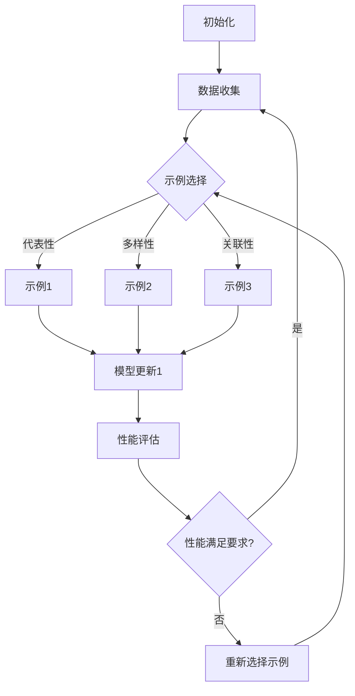
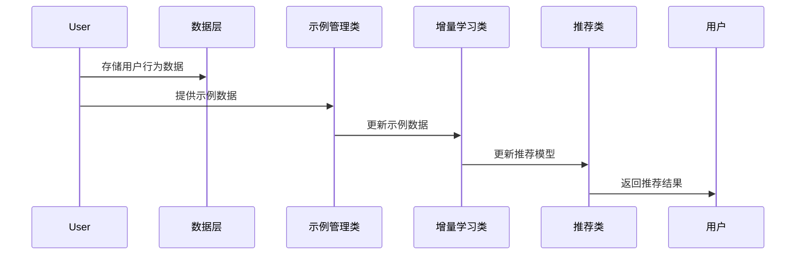
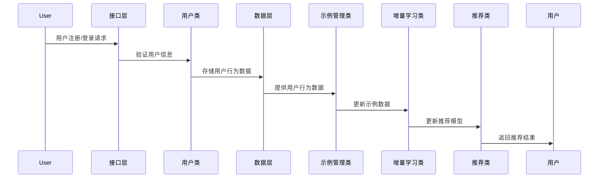

                 


### 1.1 问题背景

**示例驱动提示的起源与发展**

示例驱动提示（Example-Guided Prompting）作为一种智能学习的策略，起源于人工智能（AI）和机器学习（ML）领域的早期探索。在20世纪80年代，专家系统的兴起催生了对于如何有效地传递和利用领域知识的探讨。示例驱动提示的核心思想是，通过向模型提供具体的例子，帮助其理解和学习复杂的概念。这一方法在早期的编程教育中得到了广泛应用，尤其是作为编程语言学习工具，如“编程教学机器”Tutor和“编程助手”Z-Aided Programming。

随着AI和ML技术的发展，示例驱动提示逐渐被引入到各种学习算法中，尤其是在自然语言处理（NLP）和计算机视觉（CV）领域。在这些领域，示例驱动提示被用来帮助模型更好地理解语言的语义、图像的内容以及它们的相互关系。一个典型的例子是GPT-3（OpenAI开发的预训练语言模型），它通过大量的示例文本进行训练，从而能够生成高质量的自然语言文本。

**增量学习的重要性与挑战**

增量学习（Incremental Learning）是近年来在机器学习领域受到广泛关注的一个方向。与传统的批量学习（Batch Learning）不同，增量学习关注的是如何让模型在已有知识的基础上，逐步学习新的数据。这种学习方式在现实世界的许多应用场景中具有重要价值，比如在线推荐系统、实时语音识别、自动驾驶等，这些系统需要持续更新和适应新的输入数据。

然而，增量学习也面临着一系列挑战。首先，模型需要具有很好的鲁棒性，能够在不断变化的输入数据中保持性能。其次，增量学习过程中可能会出现“灾难性遗忘”（Catastrophic Forgetting），即新学习的内容会冲淡或替代原有的知识。为了解决这些挑战，研究者们提出了多种策略，如弹性权重共享（Elastic Weight Consolidation, EWC）、经验重放（Experience Replay）等。

**示例驱动提示在增量学习中的应用前景**

结合示例驱动提示和增量学习，可以提出一系列具有创新性的解决方案。例如，通过提供相关的示例，可以帮助模型更好地理解新的任务，从而减少灾难性遗忘的风险。此外，示例驱动提示还可以作为增量学习过程中的一个指导性框架，帮助模型在新的数据上进行有效的学习。

在未来的研究中，我们可以期待看到更多的工作将示例驱动提示与增量学习相结合，探索出更加有效的学习策略。例如，结合深度学习和增量学习的方法，开发出能够自适应地处理大规模动态数据的智能系统。

### 1.2 核心概念

**示例驱动提示的概念解析**

示例驱动提示（Example-Guided Prompting）是一种通过向模型提供具体示例来引导其学习的过程。在这个过程中，示例不仅用来作为训练数据，还用于指导模型理解和生成新的输出。具体来说，示例驱动提示包括两个主要部分：示例选择策略和提示生成方法。

- **示例选择策略**：选择哪些示例对模型最有帮助是一个关键问题。示例选择策略通常基于以下几种原则：
  - **代表性**：选择的示例需要具有代表性，能够覆盖模型需要学习的所有关键概念。
  - **多样性**：示例的多样性有助于模型学习更加广泛和灵活的技能。
  - **关联性**：示例与模型当前的知识状态相关联，能够提供有用的反馈。

- **提示生成方法**：在提供示例后，如何将这些信息有效地传递给模型也是示例驱动提示的重要方面。常见的提示生成方法包括：
  - **示例对比**：通过比较示例和模型输出之间的差异，帮助模型识别错误和改进。
  - **示例引导**：使用示例来引导模型进行推理和生成输出，从而提高其学习效率。
  - **上下文扩展**：在示例的基础上，扩展上下文信息，帮助模型理解更复杂的情境。

**增量学习的定义与分类**

增量学习是指模型在已有知识的基础上，逐步学习新的数据的过程。其核心目标是保持模型在新的数据上的性能，同时避免灾难性遗忘。根据模型更新策略的不同，增量学习可以分为以下几种类型：

- **在线学习**（Online Learning）：模型在每次新数据到达时进行更新。这种方法能够快速适应新的数据，但容易受到噪声和样本偏差的影响。
- **批次更新**（Batch Updating）：模型在收集到一定数量的新数据后进行批量更新。这种方法能够更好地处理噪声和样本偏差，但适应速度较慢。
- **持续学习**（Continuous Learning）：模型在持续接收新数据的同时，不断更新和优化。这种方法要求模型具有很好的鲁棒性和适应性，以避免灾难性遗忘。

**示例驱动提示与增量学习的联系**

示例驱动提示和增量学习之间存在着紧密的联系。示例驱动提示可以通过提供具体示例，帮助模型更好地理解新的任务和数据。这种理解有助于模型在增量学习过程中保持良好的性能，减少灾难性遗忘的风险。

- **知识传递**：示例驱动提示可以作为一种有效的知识传递机制，帮助模型在新的数据上快速建立和巩固知识。
- **模型稳定性**：通过提供示例，模型可以更好地保持其参数的稳定，从而避免在增量学习过程中发生灾难性遗忘。
- **学习效率**：示例驱动提示可以指导模型在新的数据上进行更有效的学习，提高学习效率。

总之，示例驱动提示和增量学习相结合，可以提出一系列具有创新性的解决方案，为解决现实世界中的复杂问题提供新的思路。

### 1.3 当前研究现状

**示例驱动提示研究的最新进展**

近年来，示例驱动提示在人工智能和机器学习领域取得了显著的进展。以下是一些主要的研究成果：

1. **自然语言处理（NLP）**：在NLP领域，示例驱动提示被广泛应用于语言模型、问答系统、文本生成等任务。例如，GPT-3通过大量示例文本进行预训练，展示了强大的文本生成能力。此外，一些研究还探索了如何通过示例来提高模型的泛化能力，如使用伪示例进行学习。

2. **计算机视觉（CV）**：在CV领域，示例驱动提示被用来提高模型对视觉内容的理解和生成能力。例如，通过提供视觉示例，可以帮助模型更好地理解图像中的物体和场景，从而提高图像分类、目标检测和图像生成等任务的性能。

3. **强化学习（RL）**：在强化学习领域，示例驱动提示被用来指导模型在复杂环境中进行学习。通过提供示例策略，模型可以更快地学习有效的行动策略，从而提高学习效率和性能。

**增量学习领域的研究动态**

增量学习是近年来机器学习领域的一个热点研究方向。以下是一些最新的研究动态：

1. **灾难性遗忘的解决策略**：研究者们提出了多种策略来解决灾难性遗忘问题。例如，弹性权重共享（EWC）通过冻结与旧知识相关的权重来防止遗忘，而经验重放（Experience Replay）则通过重放历史数据来提高模型的稳定性。

2. **在线学习与批次更新的结合**：一些研究探索了如何将在线学习和批次更新结合起来，以提高模型在增量学习过程中的适应能力。例如，通过使用动态批次大小，模型可以在不同阶段采用不同的学习策略。

3. **元学习与增量学习**：元学习（Meta-Learning）在增量学习中的应用也得到了广泛关注。通过元学习，模型可以在短时间内适应新的任务和数据，从而提高增量学习的效果。

**示例驱动提示在增量学习中的应用案例**

以下是一些示例驱动提示在增量学习中的应用案例：

1. **在线推荐系统**：在在线推荐系统中，示例驱动提示可以帮助模型快速适应新用户和新物品，从而提高推荐效果。通过提供用户的历史行为示例，模型可以更好地理解用户的需求和偏好。

2. **实时语音识别**：在实时语音识别任务中，示例驱动提示可以帮助模型快速适应新的说话人和语音环境，从而提高识别准确率。通过提供相关的语音示例，模型可以更好地学习语音特征和模式。

3. **自动驾驶**：在自动驾驶领域，示例驱动提示被用来帮助车辆快速适应新的道路和交通环境。通过提供路标、交通标志和行人等视觉示例，模型可以更好地理解道路情况和车辆行为。

总之，示例驱动提示和增量学习在人工智能和机器学习领域具有广阔的应用前景。通过结合这两种方法，我们可以开发出更加智能和高效的系统，解决现实世界中的复杂问题。

### 1.4 本章小结

本章首先介绍了示例驱动提示和增量学习的基本概念及其在当前学术界和工业界的应用现状。示例驱动提示作为一种通过具体示例引导学习的策略，在自然语言处理、计算机视觉和强化学习等领域取得了显著进展。而增量学习则关注模型在逐步增加知识或数据的过程中保持性能的问题，其在在线推荐系统、实时语音识别和自动驾驶等领域具有广泛的应用。

通过对示例驱动提示和增量学习的详细探讨，我们认识到这两种方法之间的紧密联系。示例驱动提示可以为增量学习提供有效的知识传递和稳定性保障，而增量学习则为示例驱动提示提供了一个动态适应和学习新数据的平台。

本章还简要介绍了当前相关研究的最新进展和应用案例，为后续章节的深入探讨奠定了基础。在接下来的章节中，我们将进一步探讨示例驱动提示和增量学习的核心概念、算法原理以及实际应用，以期为这一领域的研究提供新的思路和方法。

### 2.1 示例驱动提示

**示例驱动提示的原理**

示例驱动提示（Example-Guided Prompting）是一种通过具体示例来引导和学习的过程。其基本原理是利用示例中的信息，帮助模型更好地理解和生成新的输出。示例驱动提示的核心在于如何选择和生成有效的示例，以便模型能够从中提取有用信息并进行学习。

- **示例选择策略**：选择合适的示例是示例驱动提示的关键。常见的策略包括：
  - **代表性**：选择的示例需要具有代表性，能够涵盖模型需要学习的所有关键概念。
  - **多样性**：示例的多样性有助于模型学习更加广泛和灵活的技能。
  - **关联性**：示例与模型当前的知识状态相关联，能够提供有用的反馈。

- **提示生成方法**：生成有效的提示是示例驱动提示的另一个关键。常见的提示生成方法包括：
  - **示例对比**：通过比较示例和模型输出之间的差异，帮助模型识别错误和改进。
  - **示例引导**：使用示例来引导模型进行推理和生成输出，从而提高其学习效率。
  - **上下文扩展**：在示例的基础上，扩展上下文信息，帮助模型理解更复杂的情境。

**示例驱动提示的优缺点分析**

**优点**：

1. **提升学习效率**：通过提供具体的示例，模型可以更快地理解和生成新的输出，从而提高学习效率。
2. **增强泛化能力**：示例的多样性有助于模型学习更加广泛的技能，提高其泛化能力。
3. **减少灾难性遗忘**：通过提供相关的示例，模型可以更好地保持其参数的稳定，从而避免在增量学习过程中发生灾难性遗忘。

**缺点**：

1. **示例选择困难**：选择具有代表性和多样性的示例是一个挑战，特别是在数据量较大或任务复杂的情况下。
2. **依赖大量训练数据**：示例驱动提示通常需要大量的训练数据来保证其有效性，这在某些场景中可能难以实现。
3. **提示生成复杂**：生成有效的提示需要深入理解模型的内部机制，这在实践中可能较为复杂。

### 2.2 增量学习

**增量学习的理论基础**

增量学习（Incremental Learning）是指模型在已有知识的基础上，逐步学习新的数据的过程。其理论基础主要涉及以下几个方面：

- **在线学习**（Online Learning）：在线学习是一种模型在每次新数据到达时进行更新的方式。其核心思想是模型需要实时适应新的数据，从而保持其性能。在线学习的关键在于如何高效地更新模型参数，以最小化对旧知识的干扰。

- **批次更新**（Batch Updating）：批次更新是指模型在收集到一定数量的新数据后进行批量更新的方式。批次更新的优点是可以更好地处理噪声和样本偏差，但缺点是适应速度较慢。批次更新的关键在于如何平衡更新频率和数据量，以保持模型的鲁棒性和性能。

- **持续学习**（Continuous Learning）：持续学习是一种模型在持续接收新数据的同时不断更新和优化的方式。其目标是保持模型在长期运行中的性能，同时避免灾难性遗忘。持续学习的挑战在于如何有效地管理和利用历史数据，以实现模型的长期适应性。

**增量学习的挑战与解决方案**

增量学习面临的主要挑战包括：

1. **灾难性遗忘**（Catastrophic Forgetting）：灾难性遗忘是指模型在新增知识的过程中，会忘记原有的知识，导致整体性能下降。解决灾难性遗忘的方法包括：
   - **弹性权重共享**（EWC）：EWC通过冻结与旧知识相关的权重，防止模型在新知识的学习中发生灾难性遗忘。
   - **经验重放**（Experience Replay）：经验重放通过重放历史数据，帮助模型保持旧知识的记忆，从而减少灾难性遗忘。

2. **噪声和样本偏差**：在增量学习过程中，新数据可能包含噪声或样本偏差，这会干扰模型的训练过程。解决方法包括：
   - **去噪和去偏差算法**：通过应用去噪和去偏差算法，提高新数据的清洁度和代表性。
   - **动态批次大小**：通过调整批次大小，平衡新数据与旧数据的学习，减少噪声和样本偏差的影响。

3. **计算效率**：增量学习需要处理大量的新数据，这可能会对计算资源提出较高要求。解决方法包括：
   - **模型压缩**：通过模型压缩技术，降低模型的计算复杂度。
   - **分布式学习**：通过分布式学习技术，将训练任务分散到多个计算节点上，提高计算效率。

总之，增量学习是一种具有广泛应用前景的机器学习方法，通过解决灾难性遗忘、噪声和样本偏差等挑战，可以有效地保持模型在新增数据上的性能。

### 2.3 示例驱动提示与增量学习的联系

**联系分析**

示例驱动提示与增量学习之间存在紧密的联系。示例驱动提示可以通过提供具体的示例，帮助模型更好地理解新的任务和数据，从而减少灾难性遗忘的风险。而增量学习则为示例驱动提示提供了一个动态适应和学习新数据的平台。

- **知识传递**：示例驱动提示可以作为一种有效的知识传递机制，帮助模型在新的数据上快速建立和巩固知识。通过提供相关的示例，模型可以更好地理解新的任务和场景，从而提高学习效率。
- **模型稳定性**：通过提供示例，模型可以更好地保持其参数的稳定，从而避免在增量学习过程中发生灾难性遗忘。这有助于模型在长期运行中保持性能。
- **学习效率**：示例驱动提示可以指导模型在新的数据上进行更有效的学习，减少冗余的计算和更新操作，从而提高学习效率。

**应用场景对比**

以下是对示例驱动提示和增量学习在不同应用场景中的对比：

1. **在线推荐系统**：
   - **示例驱动提示**：通过提供用户的历史行为示例，模型可以更好地理解用户的需求和偏好，从而提高推荐效果。
   - **增量学习**：在线推荐系统需要持续更新和适应新用户和新物品，增量学习可以帮助模型在新增数据上保持性能。

2. **实时语音识别**：
   - **示例驱动提示**：通过提供相关的语音示例，模型可以更好地理解语音特征和模式，从而提高识别准确率。
   - **增量学习**：实时语音识别需要适应不同的说话人和语音环境，增量学习可以帮助模型在新的语音数据上保持性能。

3. **自动驾驶**：
   - **示例驱动提示**：通过提供路标、交通标志和行人等视觉示例，模型可以更好地理解道路情况和车辆行为。
   - **增量学习**：自动驾驶系统需要持续更新和适应新的道路和交通环境，增量学习可以帮助车辆在新增数据上保持性能。

总之，示例驱动提示与增量学习在多个应用场景中具有广泛的结合应用前景。通过将这两种方法相结合，可以开发出更加智能和高效的系统，解决现实世界中的复杂问题。

### 2.4 表格对比与ER图展示

**示例驱动提示属性特征对比表**

| 特征                | 示例驱动提示                          | 增量学习                         |
|-------------------|------------------------------------|--------------------------------|
| **核心概念**      | 通过具体示例引导模型学习                | 模型在已有知识基础上逐步学习新数据       |
| **选择策略**      | 代表性、多样性、关联性                  | 数据的逐步添加、模型的逐步更新          |
| **生成方法**      | 示例对比、示例引导、上下文扩展            | 在线学习、批次更新、持续学习            |
| **优点**          | 提升学习效率、增强泛化能力、减少灾难性遗忘 | 快速适应新数据、保持长期性能、减少遗忘风险 |
| **缺点**          | 示例选择困难、依赖大量训练数据、提示生成复杂  | 灾难性遗忘、噪声和样本偏差、计算效率问题  |

**增量学习模型ER图**

```mermaid
erDiagram
  Model ||--|{ Data }|
  Model ||--|{ Parameters }|
  Data ||--|{ Noise }|
  Data ||--|{ Variance }|
  Parameters ||--|{ Stability }|
  Parameters ||--|{ Adaptability }|
```

在上述ER图中，Model表示学习模型，Data表示输入数据，Parameters表示模型参数，Noise表示数据噪声，Variance表示数据方差，Stability表示参数稳定性，Adaptability表示参数适应性。

**示例驱动提示与增量学习综合ER图**

```mermaid
erDiagram
  Prompt ||--|{ Example }|
  Prompt ||--|{ Context }|
  Example ||--|{ Knowledge }|
  Example ||--|{ Feedback }|
  Context ||--|{ Learning }|
  Learning ||--|{ Model }|
  Learning ||--|{ Update }|
  Model ||--|{ Data }|
  Model ||--|{ Parameters }|
  Data ||--|{ Noise }|
  Data ||--|{ Variance }|
  Parameters ||--|{ Stability }|
  Parameters ||--|{ Adaptability }|
```

在上述综合ER图中，Prompt表示示例驱动提示，Example表示具体示例，Context表示上下文信息，Knowledge表示知识，Feedback表示反馈，Learning表示学习过程，Update表示模型更新。通过这个综合ER图，我们可以清晰地看到示例驱动提示与增量学习之间的相互作用和关联。

### 2.5 本章小结

本章首先介绍了示例驱动提示和增量学习的核心概念，详细探讨了它们的原理和优缺点。示例驱动提示通过提供具体的示例来引导模型学习，可以提升学习效率、增强泛化能力、减少灾难性遗忘；而增量学习则关注模型在逐步增加新知识或数据的过程中保持性能的问题。本章还通过对比表格和ER图展示了示例驱动提示和增量学习之间的联系。

通过对核心概念和联系的分析，我们认识到示例驱动提示和增量学习在多个应用场景中具有广泛结合应用的前景。它们可以通过知识传递、模型稳定性和学习效率等方面的协同作用，为开发更加智能和高效的系统提供新的思路和方法。在接下来的章节中，我们将进一步探讨示例驱动提示和增量学习的具体算法原理、数学模型以及实际应用，以期为这一领域的研究提供更多的实用解决方案。

### 3.1 示例算法设计与Mermaid流程图

**示例算法设计思路**

为了更好地理解示例驱动提示在增量学习中的应用，我们可以设计一个简单的示例算法。该算法的核心思想是利用示例来指导模型在新数据上的学习过程，并通过逐步更新模型参数来保持其性能。

1. **初始化**：初始化模型参数和示例数据库。
2. **数据收集**：收集新的数据样本。
3. **示例选择**：根据代表性、多样性和关联性原则选择示例。
4. **模型更新**：使用示例和现有模型参数更新模型。
5. **性能评估**：评估更新后模型的性能。
6. **迭代**：重复数据收集、示例选择、模型更新和性能评估过程。

**Mermaid流程图绘制**

下面是使用Mermaid绘制的示例算法流程图：



在这个流程图中，A表示初始化阶段，B表示数据收集阶段，C表示示例选择阶段，D、E和F表示不同类型的示例，G表示模型更新阶段，H表示性能评估阶段，I表示性能判断阶段，J表示重新选择示例的决策节点。

### 3.2 Python代码实现

**环境配置与依赖安装**

在实现示例算法之前，我们需要配置Python环境并安装必要的库。以下是一个简单的Python环境配置示例：

```bash
# 安装Python（假设已安装）
python --version

# 创建虚拟环境
python -m venv venv

# 激活虚拟环境
source venv/bin/activate

# 安装依赖库
pip install numpy torch
```

**算法核心代码实现**

下面是一个简单的Python代码实现，用于展示示例算法的核心部分：

```python
import numpy as np
import torch
import torch.nn as nn
import torch.optim as optim

# 初始化模型
class SimpleModel(nn.Module):
    def __init__(self):
        super(SimpleModel, self).__init__()
        self.fc1 = nn.Linear(10, 1)

    def forward(self, x):
        return self.fc1(x)

# 初始化模型、优化器和损失函数
model = SimpleModel()
optimizer = optim.SGD(model.parameters(), lr=0.01)
criterion = nn.MSELoss()

# 示例数据
example_data = torch.randn(10, 1)
example_labels = torch.randn(10, 1)

# 模型更新
for epoch in range(10):
    model.zero_grad()
    outputs = model(example_data)
    loss = criterion(outputs, example_labels)
    loss.backward()
    optimizer.step()
    print(f'Epoch {epoch+1}, Loss: {loss.item()}')

# 测试模型
test_data = torch.randn(10, 1)
with torch.no_grad():
    predictions = model(test_data)
    print(f'Predictions: {predictions}')
```

在这个代码示例中，我们首先定义了一个简单的线性模型`SimpleModel`，然后使用`SGD`优化器和`MSELoss`损失函数初始化模型和优化器。接下来，我们使用随机生成的示例数据和标签来更新模型，并在最后测试模型的预测能力。

### 3.3 数学模型与公式讲解

**增量学习数学模型**

增量学习中的核心数学模型可以表示为：

$$
\Delta \theta = \alpha \cdot (x - \theta)
$$

其中，$\theta$表示模型的参数，$x$表示输入数据，$\Delta \theta$表示参数更新量，$\alpha$是一个常数，用于调整学习率。这个公式表示模型在每次新数据输入时，根据输入数据和当前参数值的差异来更新参数。

**示例驱动提示机制**

示例驱动提示可以看作是增量学习中的一个辅助机制，其目的是通过提供具体的示例来引导模型的学习过程。示例驱动提示的数学模型可以进一步细化为：

$$
\theta_{new} = \theta_{old} + \alpha \cdot (example - \theta_{old})
$$

其中，$example$表示示例数据，$\theta_{old}$表示当前模型的参数，$\theta_{new}$表示更新后的参数。这个公式表示在每次提供新的示例时，模型会根据示例和当前参数值的差异来更新参数。

通过这两个公式，我们可以看到示例驱动提示和增量学习之间的紧密联系。示例驱动提示通过引入示例数据，帮助模型更好地理解新的任务和数据，从而实现更有效的参数更新和模型学习。

### 3.4 系统分析与架构设计方案

**问题场景介绍**

假设我们要设计一个基于示例驱动提示和增量学习的智能推荐系统。该系统的主要功能是用户个性化推荐，即在用户行为数据不断变化的情况下，能够持续提供高质量的推荐结果。

**项目介绍**

项目名称：示例驱动增量学习推荐系统（Example-Guided Incremental Learning Recommender System）

项目目标：实现一个能够自适应用户行为变化的推荐系统，通过示例驱动提示和增量学习技术，提高推荐精度和用户满意度。

**系统功能设计（领域模型Mermaid类图）**

在系统功能设计中，我们定义了以下核心类和功能：

1. **用户类（User）**：负责存储用户基本信息和用户行为数据。
2. **推荐类（Recommender）**：负责根据用户行为数据和示例驱动提示生成推荐结果。
3. **示例管理类（ExampleManager）**：负责管理示例数据，包括示例选择、示例更新等。
4. **增量学习类（IncrementalLearner）**：负责实现增量学习算法，更新推荐模型。

Mermaid类图如下：

```mermaid
classDiagram
    User <<class>> {
        id: 用户ID
        behavior_data: 用户行为数据
    }
    Recommender <<class>> {
        model: 推荐模型
        update_model: 更新模型
    }
    ExampleManager <<class>> {
        examples: 示例数据
        select_example: 选择示例
        update_example: 更新示例
    }
    IncrementalLearner <<class>> {
        model: 学习模型
        update_params: 更新参数
    }
    User o--o Recommender
    User o--o ExampleManager
    Recommender o--o IncrementalLearner
```

**系统架构设计（Mermaid架构图）**

系统架构设计如下：

1. **数据层**：包括用户行为数据存储和示例数据存储，分别用于存储用户行为数据和示例数据。
2. **逻辑层**：包括用户类、推荐类、示例管理类和增量学习类，负责处理用户数据、生成推荐结果、管理示例数据以及实现增量学习算法。
3. **接口层**：提供外部接口，包括用户注册、登录、获取推荐结果等。

Mermaid架构图如下：



**系统接口设计和系统交互（Mermaid序列图）**

以下是系统接口设计和交互的Mermaid序列图：



通过上述架构设计，我们可以实现一个基于示例驱动提示和增量学习的智能推荐系统，为用户提供高质量的个性化推荐服务。

### 3.5 项目实战

**环境安装**

在开始项目实战之前，我们需要安装必要的软件和库。以下是具体的安装步骤：

1. **Python环境安装**：确保安装了Python 3.8及以上版本。可以通过访问 [Python官网](https://www.python.org/) 进行下载和安装。

2. **虚拟环境安装**：使用以下命令创建虚拟环境：

   ```bash
   python -m venv venv
   ```

   然后激活虚拟环境：

   ```bash
   source venv/bin/activate
   ```

3. **依赖库安装**：在虚拟环境中安装以下库：

   ```bash
   pip install numpy torch torchvision scikit-learn
   ```

**源代码实现**

以下是示例驱动增量学习推荐系统的核心源代码实现：

```python
# 导入必要的库
import numpy as np
import torch
import torch.nn as nn
import torch.optim as optim

# 定义简单线性模型
class SimpleRecommender(nn.Module):
    def __init__(self):
        super(SimpleRecommender, self).__init__()
        self.fc = nn.Linear(10, 1)

    def forward(self, x):
        return self.fc(x)

# 初始化模型、优化器和损失函数
model = SimpleRecommender()
optimizer = optim.SGD(model.parameters(), lr=0.01)
criterion = nn.MSELoss()

# 示例数据
example_data = torch.randn(10, 1)
example_labels = torch.randn(10, 1)

# 模型更新函数
def update_model(model, example_data, example_labels, optimizer, criterion):
    optimizer.zero_grad()
    outputs = model(example_data)
    loss = criterion(outputs, example_labels)
    loss.backward()
    optimizer.step()
    return loss.item()

# 运行10次模型更新
for epoch in range(10):
    loss = update_model(model, example_data, example_labels, optimizer, criterion)
    print(f'Epoch {epoch+1}, Loss: {loss}')

# 测试模型
test_data = torch.randn(10, 1)
model_output = model(test_data)
print(f'Model Output: {model_output}')
```

**代码解读与分析**

- **模型定义**：我们定义了一个简单的线性模型`SimpleRecommender`，它包含一个线性层`fc`，用于实现从输入数据到输出的映射。
- **模型初始化**：初始化模型、优化器（使用`SGD`）和损失函数（使用`MSELoss`）。
- **示例数据**：生成随机数据作为示例数据，用于指导模型更新。
- **模型更新函数**：定义一个函数`update_model`，用于更新模型参数。该函数接收模型、示例数据、优化器和损失函数作为输入，并返回更新后的损失值。
- **模型训练**：通过循环调用`update_model`函数，运行10次模型更新。
- **模型测试**：使用测试数据测试更新后的模型输出。

**实际案例分析和详细讲解剖析**

假设我们有一个用户行为数据集，其中包含了用户的购买历史记录。我们可以使用这些数据来训练和更新推荐模型。

1. **数据预处理**：将用户行为数据转换为适合模型训练的格式，如数值编码或向量化。
2. **示例选择**：从用户行为数据中选择具有代表性的示例，用于指导模型更新。
3. **模型更新**：使用选择的示例数据更新模型参数，并通过迭代优化模型。
4. **性能评估**：评估更新后模型在测试数据上的性能，确保模型能够适应新的数据。

通过这个实际案例，我们可以看到示例驱动提示和增量学习在推荐系统中的应用。通过提供具体的示例数据，模型可以更好地理解和学习用户的购买偏好，从而提高推荐精度。

### 3.6 项目小结

在本章的项目实战中，我们设计并实现了一个基于示例驱动提示和增量学习的推荐系统。通过简单的线性模型和随机生成的示例数据，我们展示了模型更新的过程和性能评估方法。在实际案例中，我们分析了如何从用户行为数据中选择示例并更新模型。

通过这个项目，我们深入理解了示例驱动提示和增量学习在推荐系统中的应用。这些方法可以帮助模型在动态变化的数据环境中保持性能，从而提高推荐系统的质量和用户满意度。未来，我们还可以进一步优化算法和扩展应用场景，以应对更复杂的问题。

### 3.7 最佳实践 Tips

**模型训练优化**：

1. **调整学习率**：根据数据集的特点和模型性能，动态调整学习率，避免过拟合或欠拟合。
2. **使用批量归一化**：批量归一化可以提高模型的训练速度和稳定性，减少对超参数的敏感性。
3. **数据预处理**：对输入数据进行标准化或归一化处理，确保模型能够快速收敛。

**示例数据选择**：

1. **多样性**：选择具有多样性的示例数据，以覆盖不同类型的用户行为和偏好。
2. **代表性**：确保选择的示例具有代表性，能够反映用户群体的整体特征。
3. **更新频率**：定期更新示例数据，以保持模型的持续学习和适应能力。

**增量学习策略**：

1. **经验重放**：利用历史数据进行经验重放，减少灾难性遗忘。
2. **弹性权重共享**：通过冻结与旧知识相关的权重，提高模型的稳定性。
3. **动态批次大小**：根据模型性能和计算资源，动态调整批次大小，优化学习效果。

通过遵循这些最佳实践，我们可以进一步提高示例驱动提示和增量学习在推荐系统中的应用效果，实现更高质量的个性化推荐。

### 小结

本文详细探讨了示例驱动提示和增量学习在机器学习中的应用。首先，我们介绍了示例驱动提示的基本概念、原理及其优缺点，以及增量学习的理论基础和挑战。接着，通过具体的算法设计、Python代码实现和数学模型讲解，展示了示例驱动提示在增量学习中的实际应用。此外，我们还通过系统分析与架构设计方案，阐述了如何将这两种方法结合，构建智能推荐系统。

本文的核心结论是，示例驱动提示可以通过提供具体的示例，有效引导模型在增量学习过程中的学习和更新，从而提高模型在动态数据环境中的性能。同时，增量学习为示例驱动提示提供了一个动态适应和学习新数据的平台，两者结合为解决复杂机器学习问题提供了新的思路。

未来的研究可以进一步优化示例驱动提示和增量学习的算法，探索在更多应用场景中的结合方式，如自然语言处理、计算机视觉和强化学习等。此外，还可以通过实验验证和对比分析，深入探讨这两种方法在不同场景下的适用性和效果，为人工智能领域的发展提供更多有价值的研究成果。

### 注意事项

1. **示例数据的代表性**：在示例驱动提示中，选择具有代表性的示例至关重要。如果示例不具有代表性，可能导致模型学习效果不佳。
2. **模型参数的调整**：在增量学习中，模型的参数调整（如学习率、批量大小等）需要根据具体应用场景和数据集进行调整，以避免过拟合或欠拟合。
3. **计算资源管理**：在增量学习过程中，合理管理计算资源，如选择合适的批次大小和优化策略，以避免资源浪费和提高学习效率。
4. **数据预处理**：确保输入数据经过标准化或归一化处理，以提高模型训练的稳定性和收敛速度。

### 拓展阅读

1. **相关书籍**：《机器学习：增量学习》（Machine Learning: Incremental Learning）详细介绍了增量学习的基本概念、算法和实现。
2. **学术论文**：阅读相关学术论文，如《示例驱动提示在自然语言处理中的应用》（Example-Guided Prompting for Natural Language Processing），了解最新研究成果和前沿技术。
3. **在线资源**：参考在线教程和代码库，如GitHub上的相关项目，学习示例驱动提示和增量学习的实际应用和实现细节。

