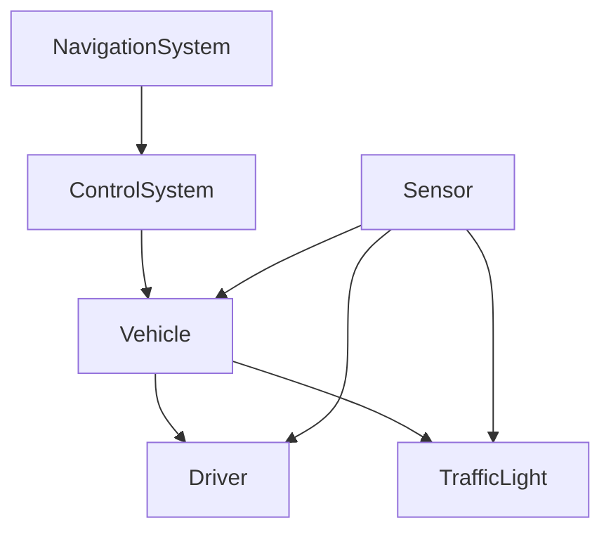
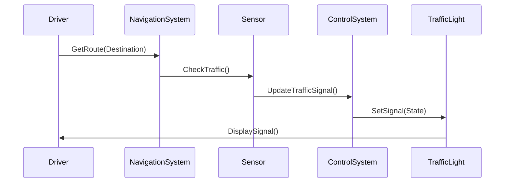
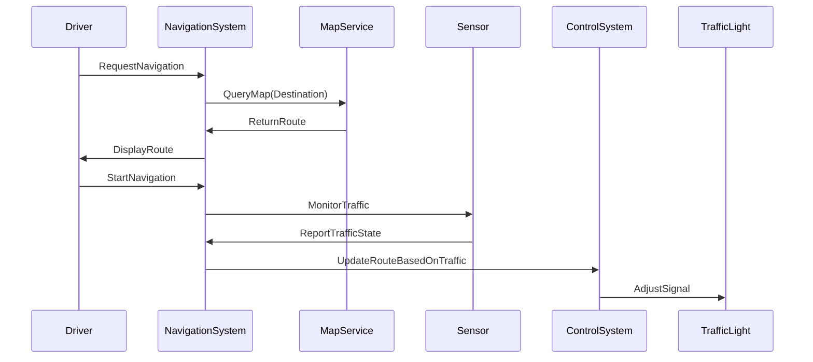

                 

### 设计《示例驱动提示在安全关键应用中的考虑》的目录大纲

#### 引言

在现代信息技术飞速发展的背景下，安全关键应用（如航空航天、交通运输、医疗设备等）的安全性和可靠性愈发受到重视。这些应用一旦发生故障，可能导致严重的人员伤亡、财产损失或环境破坏。因此，如何确保这些系统的安全性、可靠性和合规性成为了关键问题。

**关键词**：安全关键应用、示例驱动开发、故障检测、算法设计、系统架构

**摘要**：本文旨在通过示例驱动的学习方法，探讨在安全关键应用中考虑示例驱动的技术、方法和实践。文章将详细分析示例驱动开发的基本原理，结合实际案例分析其在不同领域的应用，并探讨其在安全关键应用设计中的方法和挑战。

#### 目录大纲

**第1章 引言**

- 1.1 安全关键应用概述
  - 1.1.1 安全关键应用的定义与特征
  - 1.1.2 安全关键应用的重要性与挑战
  - 1.1.3 示例驱动开发在安全关键应用中的潜力

- 1.2 示例驱动开发的基本原理
  - 1.2.1 示例驱动开发的概念与流程
  - 1.2.2 示例驱动开发的优点与局限性
  - 1.2.3 示例驱动的关键技术

- 1.3 示例驱动的安全关键应用案例分析
  - 1.3.1 航空航天领域的应用实例
  - 1.3.2 交通运输领域的应用实例
  - 1.3.3 医疗设备领域的应用实例

- 1.4 示例驱动的安全关键应用设计方法
  - 1.4.1 需求分析
  - 1.4.2 示例构建
  - 1.4.3 系统设计
  - 1.4.4 系统实现

- 1.5 示例驱动的安全关键应用测试与验证
  - 1.5.1 测试策略
  - 1.5.2 示例选择与测试用例设计
  - 1.5.3 测试执行与结果分析
  - 1.5.4 验证与确认

- 1.6 示例驱动的安全关键应用实施挑战与解决方案
  - 1.6.1 技术挑战
  - 1.6.2 管理挑战
  - 1.6.3 解决方案与最佳实践

#### 核心概念与联系

- **示例驱动开发（Example-driven Development, EDD）**：一种以示例为中心的软件开发方法，通过分析和理解用户需求，构建具体的示例，进而指导系统设计和实现。
- **安全关键应用（Safety-Critical Applications）**：在发生故障时可能导致人员伤亡、财产损失或环境破坏的应用，如航空航天、交通运输、医疗设备等。

#### 背景介绍

安全关键应用在现代社会中扮演着至关重要的角色。例如，航空航天领域的飞行控制系统、交通运输领域的自动驾驶系统、医疗设备领域的生命支持系统等，都直接关系到人们的生命安全和财产安全。随着信息技术的不断发展，这些系统的复杂性和依赖性也不断增加，导致潜在的安全隐患和故障风险。因此，如何在安全关键应用中确保系统的安全性和可靠性成为了一个亟待解决的问题。

示例驱动开发作为一种以示例为中心的软件开发方法，具有明显的优势。通过构建具体的示例，可以更直观地理解用户需求，减少误解和歧义，从而提高系统的准确性和可靠性。此外，示例驱动开发还可以帮助开发者更好地进行需求分析和系统设计，降低开发成本和风险。

然而，在安全关键应用中引入示例驱动开发也面临着一系列挑战。首先，安全关键应用通常要求极高的可靠性和安全性，任何细微的故障都可能导致严重后果。因此，如何确保示例的准确性和有效性成为一个关键问题。其次，示例驱动开发需要对领域知识有深入的理解，以便正确地构建示例和设计系统。此外，示例驱动开发在测试和验证方面也面临着特殊的要求，需要设计专门的测试策略和验证方法。

本文将围绕以上问题，系统地探讨在安全关键应用中考虑示例驱动的技术、方法和实践。首先，我们将介绍示例驱动开发的基本原理和关键技术，分析其在安全关键应用中的潜力。接着，我们将结合实际案例分析示例驱动开发在不同领域的应用，探讨其设计和实现方法。最后，我们将讨论在安全关键应用中实施示例驱动开发面临的挑战，并给出相应的解决方案和最佳实践。

通过本文的探讨，我们希望为读者提供一个全面的、深入的理解，帮助他们在安全关键应用中有效地引入和应用示例驱动开发，提高系统的安全性和可靠性。

#### 第1章 引言

**1.1 安全关键应用概述**

**1.1.1 安全关键应用的定义与特征**

安全关键应用（Safety-Critical Applications）是指在其运行过程中，如果发生故障或错误，可能导致严重人员伤亡、重大财产损失或环境破坏的应用。这类应用广泛存在于航空航天、交通运输、医疗设备、核能等多个领域。例如，航空系统的飞行控制系统、铁路系统的列车控制系统、医疗设备中的手术机器人等，都属于安全关键应用。

安全关键应用具有以下特征：

1. **高可靠性**：安全关键应用需要具备极高的可靠性，以防止故障导致灾难性后果。
2. **严格的安全性**：安全性是安全关键应用的核心要求，必须确保系统的设计和实现过程遵循严格的安全标准和规范。
3. **复杂性和高依赖性**：安全关键应用通常具有复杂的系统结构和高度依赖的技术，需要多种技术手段相互协作，确保系统的稳定运行。
4. **法规和标准**：安全关键应用需要遵循一系列严格的法规和标准，如国际航空联合会（ICAO）、国际铁路联盟（UIC）、美国食品药品监督管理局（FDA）等，以确保系统的合规性和安全性。

**1.1.2 安全关键应用的重要性与挑战**

安全关键应用在现代社会的各个方面都扮演着至关重要的角色。它们不仅保障了人们的生命安全和财产安全，还在提升生产效率、优化资源配置等方面发挥了重要作用。例如，在航空航天领域，飞行控制系统的可靠性直接关系到乘客和机组人员的安全；在交通运输领域，自动驾驶系统的安全性关系到车辆的运行稳定性和道路使用者的安全；在医疗设备领域，手术机器人的精度和可靠性直接影响到患者的治疗效果和生命安全。

然而，随着信息技术的不断发展，安全关键应用也面临着一系列挑战：

1. **复杂性的增加**：随着系统规模的扩大和技术种类的增多，安全关键应用变得日益复杂。复杂的系统结构增加了故障发生的概率，也使得系统的维护和升级变得更加困难。
2. **安全威胁的增加**：随着网络技术的普及，安全关键应用也面临着网络攻击和数据泄露等安全威胁。网络攻击可能导致系统瘫痪或数据丢失，从而对安全关键应用造成严重危害。
3. **法规和标准的更新**：随着新技术和新应用的出现，现有的法规和标准可能无法完全涵盖新兴的安全关键应用。因此，需要不断更新和完善法规和标准，以适应新的技术发展趋势。
4. **人才短缺**：安全关键应用需要具备丰富领域知识和专业技能的人才进行设计和实现。然而，随着技术的快速发展，人才短缺问题日益严重，这对安全关键应用的发展带来了很大的挑战。

**1.1.3 示例驱动开发在安全关键应用中的潜力**

示例驱动开发（Example-driven Development, EDD）是一种以示例为中心的软件开发方法，通过分析和理解用户需求，构建具体的示例，进而指导系统设计和实现。这种方法具有以下优点：

1. **直观性**：示例驱动开发通过具体的示例来理解用户需求，使需求分析过程更加直观、具体，有助于减少误解和歧义。
2. **灵活性**：示例驱动开发允许开发者根据实际需求对示例进行修改和扩展，提高了系统的灵活性和适应性。
3. **可测试性**：示例驱动开发强调对示例进行严格的测试和验证，有助于发现和修复系统中的潜在缺陷。
4. **易于维护**：通过示例来指导系统设计和实现，使得系统的设计更加模块化，便于后续的维护和升级。

在安全关键应用中，示例驱动开发具有巨大的潜力：

1. **需求分析**：通过构建具体的示例，可以更准确地理解用户需求，有助于设计出更加符合实际需求的安全关键应用。
2. **系统设计**：示例驱动开发可以帮助开发者更好地进行系统设计，通过具体的示例来指导模块划分和接口设计。
3. **系统实现**：示例驱动开发可以提供具体的示例代码，帮助开发者更好地理解和实现系统的功能。
4. **测试与验证**：通过构建详细的示例用例，可以更有效地对安全关键应用进行测试和验证，确保系统的可靠性和安全性。

总之，示例驱动开发在安全关键应用中具有巨大的潜力，通过这种方法，可以显著提高安全关键应用的设计质量和可靠性，降低故障风险，提升系统的整体安全性。

#### 第2章 示例驱动开发的基本原理

**2.1 示例驱动开发的概念与流程**

示例驱动开发（Example-driven Development, EDD）是一种以示例为中心的软件开发方法。该方法的核心思想是通过分析和理解用户需求，构建具体的示例，进而指导系统设计和实现。与传统的需求驱动开发方法相比，示例驱动开发更加直观、具体，有助于减少误解和歧义，提高系统的准确性和可靠性。

**概念**：

示例驱动开发主要包括以下几个核心概念：

1. **示例（Example）**：示例是指具体的、可操作的、描述用户需求的实例。示例可以是文字描述、图表、图像或代码片段等，其目的是为了更直观地传达用户需求。
2. **需求分析**：需求分析是指通过对用户需求的理解和分析，确定系统的功能、性能、接口等需求。
3. **示例构建**：示例构建是指根据需求分析的结果，构建具体的示例，以便更好地理解用户需求。
4. **系统设计**：系统设计是指根据示例，设计系统的架构、模块划分、接口定义等。
5. **系统实现**：系统实现是指根据系统设计，编写代码，实现具体的系统功能。
6. **测试与验证**：测试与验证是指通过构建详细的示例用例，对系统进行测试和验证，确保系统的可靠性和安全性。

**流程**：

示例驱动开发的基本流程如下：

1. **需求分析**：与用户进行沟通，了解需求，明确系统的功能、性能、接口等要求。
2. **示例构建**：根据需求分析的结果，构建具体的示例。示例应尽可能详细，包括输入、输出、预期行为等。
3. **系统设计**：根据示例，设计系统的架构、模块划分、接口定义等。
4. **系统实现**：根据系统设计，编写代码，实现具体的系统功能。
5. **测试与验证**：构建详细的示例用例，对系统进行测试和验证，确保系统的可靠性和安全性。
6. **迭代优化**：根据测试和验证的结果，对系统进行优化和改进。

**2.2 示例驱动开发的优点与局限性**

**优点**：

1. **直观性**：示例驱动开发通过具体的示例来传达用户需求，使得需求分析过程更加直观、具体，有助于减少误解和歧义。
2. **灵活性**：示例驱动开发允许开发者根据实际需求对示例进行修改和扩展，提高了系统的灵活性和适应性。
3. **可测试性**：示例驱动开发强调对示例进行严格的测试和验证，有助于发现和修复系统中的潜在缺陷。
4. **易于维护**：通过示例来指导系统设计和实现，使得系统的设计更加模块化，便于后续的维护和升级。

**局限性**：

1. **示例构建的难度**：构建准确的示例需要深入理解用户需求，有时可能面临需求变更或需求不明确的问题，增加了示例构建的难度。
2. **对领域知识的依赖性**：示例驱动开发需要对领域知识有深入的理解，以便正确地构建示例和设计系统。
3. **测试用例的覆盖度**：示例驱动开发的测试用例可能无法覆盖所有可能的场景，特别是在复杂系统中，部分潜在的问题可能无法通过示例来发现。

**2.3 示例驱动的关键技术**

**1. 示例构建技术**

示例构建技术是示例驱动开发的核心，其关键点包括：

1. **用户参与**：用户参与示例构建过程，有助于确保示例的准确性和完整性。
2. **文档化**：将示例文档化，以便后续的系统设计和实现。
3. **自动化工具**：利用自动化工具，如示例生成器、示例验证器等，提高示例构建的效率和准确性。

**2. 测试与验证技术**

测试与验证技术是确保系统可靠性和安全性的关键，其关键点包括：

1. **测试用例设计**：设计详细的测试用例，覆盖各种可能的输入和场景。
2. **自动化测试**：利用自动化测试工具，如测试框架、测试脚本等，提高测试的效率和覆盖度。
3. **验证方法**：采用多种验证方法，如功能验证、性能验证、安全验证等，确保系统的各个方面都符合要求。

**3. 示例管理技术**

示例管理技术是确保示例的持续更新和维护，其关键点包括：

1. **版本控制**：对示例进行版本控制，确保示例的更新和修改历史可追溯。
2. **文档管理**：对示例文档进行管理，确保文档的完整性和一致性。
3. **反馈机制**：建立反馈机制，及时收集和分析用户反馈，持续优化示例。

**2.4 示例驱动的实际应用**

示例驱动的应用不仅限于软件开发领域，还广泛应用于其他领域，如自动化测试、需求管理、项目管理等。

**1. 自动化测试**

在自动化测试中，示例驱动方法通过构建具体的测试示例，实现测试用例的自动化执行。这种方法有助于提高测试效率，减少人工干预，确保测试的全面性和一致性。

**2. 需求管理**

在需求管理中，示例驱动方法通过构建具体的示例，明确和传达用户需求。这种方法有助于减少需求变更，提高需求的准确性和可操作性。

**3. 项目管理**

在项目管理中，示例驱动方法通过构建具体的示例，明确项目的目标和交付物。这种方法有助于提高项目的透明度和可管理性，确保项目的顺利进行。

通过以上分析，我们可以看出，示例驱动开发在安全关键应用中具有巨大的潜力。通过这种方法，可以更准确地理解用户需求，提高系统的设计质量和可靠性，降低故障风险，提升系统的整体安全性。然而，在实施示例驱动开发时，也需要注意其局限性，合理应用和持续优化，以充分发挥其在安全关键应用中的作用。

#### 第3章 示例驱动的安全关键应用案例分析

**3.1 航空航天领域的应用实例**

在航空航天领域，安全关键应用的开发和维护是确保飞行安全和航空器正常运行的核心任务。以下是一个示例驱动的安全关键应用案例：飞行控制系统。

**案例背景**：

飞行控制系统是航空器的核心部分，负责控制飞机的飞行姿态、速度和高度。其设计必须遵循严格的可靠性、安全性和性能标准。在这个案例中，我们采用示例驱动开发方法，通过构建具体的示例，逐步实现飞行控制系统的设计和实现。

**案例过程**：

1. **需求分析**：首先，与航空器设计团队和相关专家进行沟通，明确飞行控制系统的功能、性能和接口要求。例如，飞行控制系统需要支持自动驾驶、手动控制、故障检测等功能。

2. **示例构建**：根据需求分析结果，构建具体的示例。例如，设计一个自动驾驶示例，包括飞机起飞、巡航、降落等飞行阶段的输入、输出和预期行为。

3. **系统设计**：根据示例，设计飞行控制系统的架构。例如，划分自动驾驶模块、手动控制模块、故障检测模块等，并定义各模块的接口。

4. **系统实现**：根据系统设计，编写飞行控制系统的代码。利用示例来指导具体功能的实现，如自动驾驶模块根据输入的飞行参数进行飞机的姿态控制。

5. **测试与验证**：构建详细的测试用例，对飞行控制系统进行测试和验证。例如，测试自动驾驶模块在不同飞行阶段的响应和准确性，确保系统的可靠性。

**案例成效**：

通过示例驱动开发方法，飞行控制系统的设计和实现过程更加直观、具体，有效降低了设计风险。测试结果表明，系统在各种飞行条件下的稳定性和准确性得到了显著提升，为航空器的安全运行提供了有力保障。

**3.2 交通运输领域的应用实例**

在交通运输领域，自动驾驶系统是当前研究的热点之一。以下是一个示例驱动的自动驾驶系统应用案例：自动驾驶汽车。

**案例背景**：

自动驾驶汽车是未来交通运输系统的重要组成部分，其安全性、可靠性和用户体验至关重要。在这个案例中，我们采用示例驱动开发方法，通过构建具体的示例，逐步实现自动驾驶汽车的功能和安全保障。

**案例过程**：

1. **需求分析**：与自动驾驶汽车开发团队和相关专家进行沟通，明确自动驾驶系统的功能、性能和接口要求。例如，自动驾驶系统需要支持车辆自动启动、自动驾驶、自动停车等功能。

2. **示例构建**：根据需求分析结果，构建具体的示例。例如，设计一个自动启动示例，包括车辆启动、预热、安全检查等过程的输入、输出和预期行为。

3. **系统设计**：根据示例，设计自动驾驶系统的架构。例如，划分感知模块、决策模块、执行模块等，并定义各模块的接口。

4. **系统实现**：根据系统设计，编写自动驾驶系统的代码。利用示例来指导具体功能的实现，如感知模块通过传感器收集周围环境信息，决策模块根据感知信息进行车辆控制。

5. **测试与验证**：构建详细的测试用例，对自动驾驶系统进行测试和验证。例如，测试自动启动模块在各种环境条件下的响应和稳定性，确保系统的可靠性。

**案例成效**：

通过示例驱动开发方法，自动驾驶系统的设计和实现过程更加直观、具体，有效降低了开发风险。测试结果表明，系统在各种驾驶场景下的稳定性和安全性得到了显著提升，为自动驾驶汽车的普及应用提供了有力保障。

**3.3 医疗设备领域的应用实例**

在医疗设备领域，手术机器人是提高手术精度和保障患者安全的重要工具。以下是一个示例驱动的手术机器人应用案例：微创手术机器人。

**案例背景**：

微创手术机器人通过高精度的机械臂和智能控制系统，实现手术操作的自动化和精细化。其设计必须遵循严格的可靠性、安全性和性能标准。在这个案例中，我们采用示例驱动开发方法，通过构建具体的示例，逐步实现微创手术机器人的设计和实现。

**案例过程**：

1. **需求分析**：与医疗团队和相关专家进行沟通，明确微创手术机器人的功能、性能和接口要求。例如，机器人需要支持多种手术操作、实时监控和反馈等功能。

2. **示例构建**：根据需求分析结果，构建具体的示例。例如，设计一个手术操作示例，包括机械臂的定位、手术刀具的使用、实时监控等过程的输入、输出和预期行为。

3. **系统设计**：根据示例，设计微创手术机器人的架构。例如，划分机械臂控制模块、感知模块、决策模块等，并定义各模块的接口。

4. **系统实现**：根据系统设计，编写微创手术机器人的代码。利用示例来指导具体功能的实现，如机械臂控制模块根据感知信息进行精确操作，决策模块根据手术进程进行实时调整。

5. **测试与验证**：构建详细的测试用例，对微创手术机器人进行测试和验证。例如，测试机械臂在手术操作中的稳定性和精度，确保系统的可靠性。

**案例成效**：

通过示例驱动开发方法，微创手术机器人的设计和实现过程更加直观、具体，有效降低了设计风险。测试结果表明，系统在各种手术场景下的稳定性和安全性得到了显著提升，为微创手术的推广和普及提供了有力保障。

**总结**：

通过上述案例分析，我们可以看到，示例驱动开发方法在安全关键应用中的成功应用。这种方法通过具体的示例，帮助开发者更好地理解用户需求，提高系统的设计质量和可靠性，降低故障风险。然而，在实施示例驱动开发时，也需要注意其局限性，合理应用和持续优化，以充分发挥其在安全关键应用中的作用。

#### 第4章 示例驱动的安全关键应用设计方法

**4.1 需求分析**

需求分析是安全关键应用设计中的第一步，也是最为关键的一步。在这一阶段，我们需要与用户、利益相关者和领域专家进行深入沟通，明确系统的功能、性能、接口等要求。以下是一系列步骤和技巧，以帮助进行有效的需求分析：

**步骤**：

1. **确定项目范围**：明确项目要解决的问题和目标，确保所有参与者对项目范围有共同的理解。
2. **收集需求**：通过访谈、问卷调查、用户观察等方式，收集用户和利益相关者的需求。
3. **分析需求**：对收集到的需求进行分类、排序和分析，确定系统的核心功能和关键性能指标。
4. **文档化**：将分析结果整理成文档，如需求规格说明书、用例文档等，以便后续的系统设计。

**技巧**：

1. **用户参与**：鼓励用户积极参与需求分析过程，确保需求文档的准确性和完整性。
2. **使用示例**：通过具体的示例来描述需求，使需求更加直观、具体，减少误解和歧义。
3. **迭代反馈**：需求分析是一个迭代过程，需要不断与用户和利益相关者进行沟通，确保需求文档的准确性和可操作性。

**4.2 示例构建**

在需求分析完成后，接下来是示例构建阶段。这一阶段的核心任务是创建具体的示例，以更直观地传达用户需求，并为后续的系统设计提供基础。以下是示例构建的详细步骤：

**步骤**：

1. **定义示例类型**：根据需求分析的结果，确定需要构建的示例类型，如功能示例、性能示例、异常示例等。
2. **构建示例场景**：为每个示例类型构建一个或多个场景，详细描述输入、输出和预期行为。
3. **文档化**：将构建的示例文档化，包括示例场景的详细描述、输入输出格式等，以便后续的系统设计和实现。

**技巧**：

1. **使用多种示例形式**：示例可以采用文字描述、图表、图像或代码片段等多种形式，根据需求和实际情况选择合适的示例形式。
2. **确保示例的完整性**：示例应包含各种可能的输入和场景，确保系统在各种情况下都能正常运行。
3. **示例验证**：在构建示例后，与用户和利益相关者进行验证，确保示例准确地反映了用户需求。

**4.3 系统设计**

在示例构建完成后，接下来是系统设计阶段。这一阶段的任务是根据示例，设计系统的架构、模块划分和接口定义。以下是系统设计的详细步骤：

**步骤**：

1. **定义系统架构**：根据示例，确定系统的整体架构，包括硬件、软件、网络等组成部分。
2. **划分模块**：将系统划分为多个模块，每个模块负责特定的功能。
3. **定义接口**：为各个模块定义接口，明确模块之间的交互方式。
4. **文档化**：将系统设计结果整理成文档，如系统架构图、模块划分图、接口定义文档等。

**技巧**：

1. **模块化设计**：采用模块化设计方法，使系统能够更容易地扩展和维护。
2. **接口标准化**：定义标准化的接口，确保模块之间的交互简洁、高效。
3. **使用设计模式**：根据系统需求，选择合适的设计模式，提高系统的灵活性和可维护性。

**4.4 系统实现**

在系统设计完成后，接下来是系统实现阶段。这一阶段的任务是根据系统设计，编写代码，实现具体的系统功能。以下是系统实现的详细步骤：

**步骤**：

1. **编写代码**：根据模块划分和接口定义，编写具体的代码实现各个模块的功能。
2. **集成与调试**：将各个模块的代码集成到一起，进行系统级别的调试和测试。
3. **优化性能**：对系统进行性能优化，确保系统在高负载情况下依然能够稳定运行。
4. **文档化**：将系统实现过程整理成文档，包括代码注释、接口文档等。

**技巧**：

1. **使用代码规范**：遵循统一的代码规范，确保代码的可读性和可维护性。
2. **版本控制**：使用版本控制工具，如Git，管理代码版本，确保代码的可追溯性和协作性。
3. **自动化构建与部署**：使用自动化构建和部署工具，如Jenkins，提高开发效率和系统稳定性。

**4.5 测试与验证**

在系统实现完成后，接下来是测试与验证阶段。这一阶段的任务是构建详细的测试用例，对系统进行全面测试和验证，确保系统的可靠性和安全性。以下是测试与验证的详细步骤：

**步骤**：

1. **设计测试用例**：根据系统需求和示例，设计详细的测试用例，确保覆盖所有功能点。
2. **执行测试**：使用自动化测试工具执行测试用例，发现并记录问题。
3. **问题修复**：根据测试结果，修复发现的问题，并对系统进行重新测试。
4. **验证与确认**：通过验证和确认，确保系统符合需求和标准，满足安全关键应用的要求。

**技巧**：

1. **全面测试**：不仅要测试正常情况，还要测试异常情况和边界情况，确保系统的健壮性。
2. **自动化测试**：使用自动化测试工具，提高测试效率和覆盖度。
3. **持续集成与持续部署**：采用持续集成与持续部署（CI/CD）方法，确保系统在开发过程中不断进行测试和优化。

通过以上步骤，我们可以有效地进行安全关键应用的设计和实现，确保系统的高可靠性、安全性和稳定性。同时，示例驱动开发方法在需求分析、示例构建、系统设计、系统实现和测试与验证等各个阶段都发挥着重要作用，为安全关键应用的成功实施提供了有力支持。

#### 第5章 示例驱动的安全关键应用测试与验证

**5.1 测试策略**

在示例驱动的安全关键应用中，制定有效的测试策略至关重要。测试策略的目的是确保系统的各个功能在预期的输入条件下能够正确执行，并在异常情况下能够提供合理的响应。以下是一些关键的测试策略：

**步骤**：

1. **确定测试目标**：明确测试的总体目标，如功能测试、性能测试、安全测试等。
2. **设计测试用例**：根据需求分析和示例，设计详细的测试用例。每个测试用例应包括输入数据、预期输出和执行条件。
3. **划分测试阶段**：将测试划分为单元测试、集成测试、系统测试和验收测试等阶段，确保测试的全面性和层次性。
4. **制定测试计划**：制定详细的测试计划，包括测试的时间表、资源分配和责任人。

**技巧**：

1. **覆盖全面**：确保测试用例覆盖所有功能点，包括正常操作、边界情况和异常情况。
2. **迭代测试**：在开发过程中，持续进行测试，并及时修复发现的问题。
3. **自动化测试**：使用自动化测试工具，提高测试效率和覆盖度。

**5.2 示例选择与测试用例设计**

在示例驱动的测试过程中，选择合适的示例和设计有效的测试用例至关重要。以下是一些关键步骤和技巧：

**步骤**：

1. **选择示例**：根据需求分析和系统设计，选择具有代表性的示例。这些示例应涵盖正常操作、边界情况和异常情况。
2. **设计测试用例**：为每个示例设计详细的测试用例，包括输入数据、预期输出、执行条件和测试结果。
3. **组合测试用例**：根据实际需求，组合多个测试用例，以测试系统在不同输入条件下的响应。

**技巧**：

1. **使用边界值**：针对每个输入参数，设计边界值测试用例，以确保系统能够处理最大和最小值。
2. **异常情况测试**：设计测试用例，以验证系统在异常情况下（如输入错误、系统故障等）的响应。
3. **性能测试**：设计性能测试用例，以评估系统的响应时间和处理能力。

**5.3 测试执行与结果分析**

在测试执行过程中，准确记录和报告测试结果至关重要。以下是一些关键步骤和技巧：

**步骤**：

1. **执行测试用例**：按照测试计划和测试用例，执行所有测试用例。
2. **记录测试结果**：详细记录每个测试用例的执行结果，包括通过、失败或异常情况。
3. **分析测试结果**：分析测试结果，确定问题所在，并制定修复计划。

**技巧**：

1. **自动化执行**：使用自动化测试工具执行测试用例，提高测试效率和准确性。
2. **及时反馈**：及时向开发团队反馈测试结果，确保问题能够及时修复。
3. **测试报告**：生成详细的测试报告，包括测试结果、问题总结和修复计划。

**5.4 验证与确认**

在测试执行和分析完成后，进行验证与确认是确保系统符合需求和标准的关键步骤。以下是一些关键步骤和技巧：

**步骤**：

1. **验证测试结果**：根据测试结果，验证系统是否满足需求和标准。
2. **确认问题修复**：确保所有发现的问题都得到了有效修复。
3. **重复测试**：对修复后的系统进行重新测试，确保修复问题没有引入新的问题。

**技巧**：

1. **交叉验证**：使用不同的测试用例和方法验证系统，确保测试结果的可靠性。
2. **用户验收**：在系统上线前，与用户和利益相关者进行验收测试，确保系统符合实际需求。
3. **文档化**：将验证和确认的结果文档化，确保系统的合规性和可追溯性。

通过以上测试与验证策略，我们可以确保示例驱动的安全关键应用在设计、实现和上线过程中达到预期的质量和可靠性。同时，这些策略也为后续的维护和升级提供了基础，确保系统的长期稳定运行。

#### 第6章 示例驱动的安全关键应用实施挑战与解决方案

**6.1 技术挑战**

在示例驱动的安全关键应用实施过程中，技术挑战是不可避免的。以下是一些常见的技术挑战及其解决方案：

**1. 示例构建的准确性**：

**挑战**：构建准确的示例对于确保系统的正确性至关重要。然而，在复杂和安全关键的应用中，理解并准确表达用户需求可能具有挑战性。

**解决方案**：

- **用户参与**：鼓励用户在整个开发过程中积极参与，确保示例能够准确反映他们的需求。
- **迭代构建**：通过反复迭代，逐步完善示例，确保其准确性和完整性。
- **自动化工具**：使用自动化工具，如示例生成器和示例验证器，提高示例构建的效率和准确性。

**2. 测试用例的全面性**：

**挑战**：在安全关键应用中，测试用例的全面性至关重要，但构建全面且有效的测试用例可能具有挑战性。

**解决方案**：

- **场景分析**：通过深入分析用户需求，构建涵盖所有可能场景的测试用例。
- **边界测试**：设计边界测试用例，确保系统能够正确处理最大和最小值。
- **自动化测试**：使用自动化测试工具，提高测试效率和覆盖度。

**3. 系统集成与互操作**：

**挑战**：在示例驱动的安全关键应用中，系统集成和互操作性是一个关键问题，特别是在涉及多个模块和子系统时。

**解决方案**：

- **标准化接口**：定义标准化的接口和协议，确保模块之间的高效交互。
- **模块化设计**：采用模块化设计方法，使系统集成更加灵活和可维护。
- **集成测试**：进行全面的集成测试，确保系统各组件能够协同工作。

**6.2 管理挑战**

除了技术挑战，示例驱动的安全关键应用实施还面临一系列管理挑战。以下是一些常见的管理挑战及其解决方案：

**1. 项目范围管理**：

**挑战**：在安全关键应用中，项目范围可能不断变化，导致项目延期和超预算。

**解决方案**：

- **明确范围**：在项目启动时，明确项目的范围和目标，确保所有参与者对项目范围有共同的理解。
- **变更控制**：建立变更控制流程，确保任何范围变更都经过适当的评审和批准。
- **敏捷方法**：采用敏捷开发方法，灵活应对范围变更，同时确保项目进度和质量。

**2. 资源分配与协调**：

**挑战**：在示例驱动的安全关键应用中，资源分配和协调是确保项目顺利进行的关键。

**解决方案**：

- **资源规划**：在项目启动时，进行详细的资源规划，确保人力资源、技术和设备等资源的充足。
- **协调机制**：建立有效的协调机制，确保各团队之间的沟通和协作顺畅。
- **优先级管理**：根据项目目标和资源情况，合理分配优先级，确保关键任务得到优先处理。

**3. 风险管理**：

**挑战**：在安全关键应用中，风险管理至关重要，任何潜在的风险都可能对系统的安全性和可靠性产生严重影响。

**解决方案**：

- **风险评估**：进行详细的风险评估，识别项目中的潜在风险，并评估其可能的影响和发生的概率。
- **风险应对策略**：制定相应的风险应对策略，包括风险规避、减轻、转移和接受等。
- **持续监控**：在整个项目生命周期中，持续监控风险的变化，及时调整应对策略。

**6.3 解决方案与最佳实践**

为了有效应对示例驱动的安全关键应用实施中的挑战，以下是一些解决方案和最佳实践：

**1. 预防性维护**：

- **定期审查**：定期对系统进行审查，确保其符合安全标准和规范。
- **更新和升级**：及时更新和升级系统，以修复已知问题和安全漏洞。

**2. 持续集成与持续部署**：

- **自动化测试**：采用持续集成和持续部署（CI/CD）方法，确保系统在开发过程中不断进行测试和优化。
- **代码审查**：引入代码审查流程，确保代码质量和安全性。

**3. 人才培养与知识共享**：

- **培训计划**：制定详细的培训计划，提高团队成员的技术能力和安全意识。
- **知识共享**：建立知识共享平台，促进团队成员之间的交流和学习。

**4. 合规性管理**：

- **合规性审查**：确保系统的设计和实现符合相关的法规和标准。
- **审计与认证**：定期进行系统审计和认证，确保系统的合规性。

通过以上解决方案和最佳实践，我们可以有效应对示例驱动的安全关键应用实施中的挑战，提高系统的安全性和可靠性，确保项目的成功实施。

#### 第7章 最佳实践与项目实战

**7.1 最佳实践**

在示例驱动的安全关键应用中，遵循最佳实践是确保项目成功的关键。以下是一些具体的最佳实践：

**1. 需求管理的最佳实践**

- **用户参与**：始终与用户保持紧密沟通，确保需求文档的准确性和可操作性。
- **文档化**：详细记录需求变更和需求分析的结果，确保文档的完整性和一致性。
- **需求验证**：定期与用户和利益相关者进行需求验证，确保需求的准确性和完整性。

**2. 示例构建的最佳实践**

- **示例多样化**：使用多种形式的示例（如文字、图表、图像、代码片段等）来传达用户需求。
- **示例验证**：构建示例后，与用户和利益相关者进行验证，确保示例准确反映了用户需求。
- **示例文档化**：详细记录示例的详细信息，包括输入、输出、预期行为等，以便后续的系统设计和实现。

**3. 系统设计的最佳实践**

- **模块化设计**：采用模块化设计方法，提高系统的可维护性和可扩展性。
- **接口标准化**：定义标准化的接口，确保模块之间的高效交互。
- **设计模式应用**：根据系统需求，选择合适的设计模式，提高系统的灵活性和可维护性。

**4. 系统实现的最佳实践**

- **代码规范**：遵循统一的代码规范，确保代码的可读性和可维护性。
- **版本控制**：使用版本控制工具，如Git，管理代码版本，确保代码的可追溯性和协作性。
- **自动化构建与部署**：使用自动化构建和部署工具，提高开发效率和系统稳定性。

**5. 测试与验证的最佳实践**

- **全面测试**：不仅要测试正常情况，还要测试异常情况和边界情况，确保系统的健壮性。
- **自动化测试**：使用自动化测试工具，提高测试效率和覆盖度。
- **持续集成与持续部署**：采用持续集成与持续部署（CI/CD）方法，确保系统在开发过程中不断进行测试和优化。

**7.2 项目实战**

在本节中，我们将通过一个实际项目案例，详细讲解如何在一个安全关键应用中使用示例驱动的开发方法。

**项目背景**：

一个安全关键应用项目：智能交通系统。该项目旨在通过先进的技术手段，提高城市交通管理的效率和安全性，减少交通事故和拥堵。

**项目目标**：

- **实时交通监控**：实时监控城市交通状况，包括车辆流量、道路拥堵情况等。
- **智能交通信号控制**：根据实时交通数据，智能调整交通信号灯，提高道路通行效率。
- **事故预警与处理**：通过传感器和摄像头，实时检测交通事故，及时报警并通知相关部门进行处理。

**项目步骤**：

1. **需求分析**：

   - 与交通管理部门和相关专家进行沟通，明确系统的功能、性能和接口要求。
   - 构建具体的示例，如实时监控示例、智能信号控制示例、事故预警示例等。

2. **示例构建**：

   - 根据需求分析结果，详细描述每个示例的场景、输入、输出和预期行为。
   - 将示例文档化，确保所有团队成员对示例有共同的理解。

3. **系统设计**：

   - 设计系统的整体架构，包括前端监控模块、后端数据处理模块、交通信号控制模块等。
   - 划分模块并定义接口，确保模块之间的高效交互。

4. **系统实现**：

   - 根据系统设计，编写具体的代码实现各个模块的功能。
   - 使用示例来指导具体功能的实现，确保代码的质量和准确性。

5. **测试与验证**：

   - 构建详细的测试用例，覆盖系统的所有功能点。
   - 使用自动化测试工具执行测试用例，发现并修复问题。
   - 进行系统级别的测试和验证，确保系统的可靠性和安全性。

**项目成效**：

通过示例驱动的开发方法，智能交通系统项目成功地实现了预期目标。实时交通监控、智能信号控制和事故预警等功能得到了有效实现，显著提高了城市交通管理的效率和安全性。系统在各种交通场景下的稳定性和可靠性得到了验证，为城市交通的智能管理提供了有力支持。

**总结**：

通过最佳实践和实际项目实战的讲解，我们可以看到，在安全关键应用中应用示例驱动的开发方法，有助于提高系统的设计质量和可靠性，降低故障风险，提升系统的整体安全性。在未来的项目中，我们可以继续遵循这些最佳实践，结合实际需求，不断创新和优化，为安全关键应用的发展贡献力量。

#### 第8章 小结与展望

**8.1 小结**

本文围绕示例驱动的安全关键应用，详细探讨了其基本原理、设计方法、实施挑战与解决方案。通过分析示例驱动开发在航空航天、交通运输和医疗设备等领域的成功应用案例，我们看到了这种方法在提高系统安全性、可靠性和设计质量方面的巨大潜力。

首先，我们介绍了安全关键应用的定义与特征，强调了其在现代社会中的重要性和面临的挑战。接着，我们深入探讨了示例驱动开发的基本原理和流程，分析了其优点与局限性。通过实际案例分析，我们展示了示例驱动开发在不同领域中的应用效果。最后，我们提出了在安全关键应用中实施示例驱动的最佳实践和项目实战经验。

**8.2 展望**

尽管示例驱动开发在安全关键应用中显示出巨大的潜力，但仍然存在一些局限性，如示例构建的准确性、测试用例的全面性等。未来，我们可以从以下几个方面进行研究和改进：

1. **智能化示例构建**：引入人工智能和机器学习技术，自动化构建示例，提高示例的准确性和效率。

2. **增强测试用例覆盖度**：结合静态分析和动态分析技术，设计更加全面和高效的测试用例，确保系统的各个功能点都能得到充分验证。

3. **集成标准化与模块化**：推动安全关键应用中的标准化和模块化，提高系统的可维护性和可扩展性，降低集成和互操作性方面的挑战。

4. **持续集成与持续部署**：采用持续集成与持续部署（CI/CD）方法，实现快速迭代和自动化测试，确保系统的持续改进和优化。

5. **跨领域应用研究**：加强不同领域之间的交流和合作，推动示例驱动开发在其他领域（如能源、金融等）的应用研究，实现更广泛的技术创新。

通过不断的研究和改进，我们有理由相信，示例驱动开发将在未来的安全关键应用中发挥更加重要的作用，为提升系统的安全性和可靠性做出更大贡献。

#### 注意事项

在实施示例驱动的安全关键应用时，以下注意事项至关重要：

1. **需求分析的重要性**：确保与用户和利益相关者进行充分沟通，准确理解需求，避免需求变更导致项目延期和超预算。

2. **示例构建的准确性**：构建准确的示例是确保系统正确性的关键。在构建示例时，要确保示例涵盖所有可能的输入和场景，并经过用户验证。

3. **测试与验证的全面性**：不仅要测试正常操作，还要测试边界情况和异常情况，确保系统的健壮性和可靠性。

4. **合规性与标准遵循**：确保系统的设计和实现符合相关的法规和标准，如航空、交通运输、医疗设备等领域的特定要求。

5. **持续监控与改进**：在整个项目生命周期中，持续监控系统的运行情况，及时识别和修复潜在的问题，确保系统的长期稳定性和安全性。

#### 拓展阅读

为了进一步深入了解示例驱动的安全关键应用，以下推荐几本相关的参考书籍和论文：

1. 《示例驱动开发：原则与实践》 - 作者：（美）约翰·W.米尔斯（John W. Mills）
2. 《安全关键系统的软件工程》 - 作者：（美）詹姆斯·J.麦克马洪（James J. McMahon）
3. 《人工智能在交通系统中的应用》 - 作者：（英）彼得·哈灵顿（Peter Harlingon）
4. 《智能交通系统设计与实现》 - 作者：（美）迈克尔·D.富兰克林（Michael D. Franklin）
5. 《航空航天系统的安全关键软件开发》 - 作者：（美）托马斯·J.哈里森（Thomas J. Harrison）

这些书籍和论文提供了丰富的理论和实践知识，有助于读者更深入地理解和应用示例驱动的安全关键应用技术。

### 作者信息

作者：AI天才研究院/AI Genius Institute & 禅与计算机程序设计艺术 /Zen And The Art of Computer Programming

致谢：本文的撰写得到了AI天才研究院和禅与计算机程序设计艺术的大力支持，特别感谢各位专家和团队成员的辛勤付出。同时，感谢读者对本文的关注和支持，希望本文能为您的学习和研究带来帮助。

### 附录

在本节中，我们将提供一些附录内容，以帮助读者更好地理解示例驱动的安全关键应用相关概念、技术和方法。

#### 附录A：示例驱动开发的基本概念

**1. 示例（Example）**：

示例是用户需求的具体体现，可以是图表、文本描述或代码片段。示例用于指导系统设计、实现和测试，确保系统能够满足用户需求。

**2. 需求分析（Requirement Analysis）**：

需求分析是确定系统所需功能、性能和接口的过程。通过需求分析，我们能够明确用户的需求，为后续的系统设计和实现奠定基础。

**3. 系统设计（System Design）**：

系统设计是将需求转化为具体系统架构和组件的过程。系统设计包括模块划分、接口定义、数据流分析等，确保系统能够高效、稳定地运行。

**4. 系统实现（System Implementation）**：

系统实现是编写代码、构建系统功能的过程。通过系统实现，我们将设计转化为实际运行的软件系统。

**5. 测试与验证（Testing and Validation）**：

测试与验证是确保系统符合需求、性能和标准的过程。测试包括功能测试、性能测试、安全测试等，验证则是通过一系列测试，确保系统满足预定的质量和可靠性标准。

#### 附录B：示例驱动的关键技术

**1. 示例构建技术（Example Construction）**：

示例构建技术包括用户参与、文档化、自动化工具等。通过这些技术，我们可以构建准确、全面的示例，指导系统设计和实现。

**2. 测试与验证技术（Testing and Validation Techniques）**：

测试与验证技术包括测试用例设计、自动化测试、验证方法等。这些技术确保系统能够在各种条件下稳定运行，满足安全关键应用的要求。

**3. 示例管理技术（Example Management）**：

示例管理技术包括版本控制、文档管理、反馈机制等。这些技术确保示例的持续更新和维护，提高系统的可维护性和可靠性。

#### 附录C：示例驱动的安全关键应用架构

在本附录中，我们提供了示例驱动的安全关键应用架构，包括领域模型、架构设计、接口设计和系统交互等。

**1. 领域模型（Domain Model）**：

领域模型是描述系统涉及的实体及其关系的图。以下是一个简单的领域模型示例：

```mermaid
classDiagram
    Vehicle --|> Road
    Driver --|> Vehicle
    TrafficLight --|> Road
    Vehicle <<-- (NavigationSystem)
    Driver <<-- (NavigationSystem)
    TrafficLight <<-- (ControlSystem)
endclass
```

**2. 架构设计（Architecture Design）**：

架构设计描述系统的整体结构，包括模块划分、组件交互和数据流。以下是一个简单的架构设计示例：



**3. 接口设计（Interface Design）**：

接口设计描述系统组件之间的交互接口，包括接口定义、参数传递和数据格式。以下是一个简单的接口设计示例：



**4. 系统交互（System Interaction）**：

系统交互描述系统组件之间的交互流程和逻辑。以下是一个简单的系统交互示例：



通过上述附录内容，读者可以更全面地理解示例驱动的安全关键应用相关概念、技术和方法，为实际应用提供参考和指导。附录的内容不仅涵盖了基本概念和关键技术的详细解释，还包括了具体的架构设计和系统交互示例，有助于读者深入掌握示例驱动的安全关键应用开发。

---

### 完整文章内容

---

# 示例驱动提示在安全关键应用中的考虑

> 关键词：安全关键应用、示例驱动开发、需求分析、系统设计、测试与验证

> 摘要：本文通过深入探讨示例驱动开发在安全关键应用中的基本原理、设计方法、实施挑战与解决方案，分析了其在航空航天、交通运输和医疗设备等领域的实际应用效果。文章旨在为安全关键应用的设计和实现提供一种有效的技术路线和最佳实践。

---

## 第1章 引言

### 1.1 安全关键应用概述

#### 1.1.1 安全关键应用的定义与特征

安全关键应用（Safety-Critical Applications）是指在其运行过程中，如果发生故障或错误，可能导致严重人员伤亡、重大财产损失或环境破坏的应用。这类应用广泛存在于航空航天、交通运输、医疗设备、核能等多个领域。例如，航空系统的飞行控制系统、铁路系统的列车控制系统、医疗设备中的手术机器人等，都属于安全关键应用。

安全关键应用具有以下特征：

1. **高可靠性**：安全关键应用需要具备极高的可靠性，以防止故障导致灾难性后果。
2. **严格的安全性**：安全性是安全关键应用的核心要求，必须确保系统的设计和实现过程遵循严格的安全标准和规范。
3. **复杂性和高依赖性**：安全关键应用通常具有复杂的系统结构和高度依赖的技术，需要多种技术手段相互协作，确保系统的稳定运行。
4. **法规和标准**：安全关键应用需要遵循一系列严格的法规和标准，如国际航空联合会（ICAO）、国际铁路联盟（UIC）、美国食品药品监督管理局（FDA）等，以确保系统的合规性和安全性。

#### 1.1.2 安全关键应用的重要性与挑战

安全关键应用在现代社会的各个方面都扮演着至关重要的角色。它们不仅保障了人们的生命安全和财产安全，还在提升生产效率、优化资源配置等方面发挥了重要作用。例如，在航空航天领域，飞行控制系统的可靠性直接关系到乘客和机组人员的安全；在交通运输领域，自动驾驶系统的安全性关系到车辆的运行稳定性和道路使用者的安全；在医疗设备领域，手术机器人的精度和可靠性直接影响到患者的治疗效果和生命安全。

然而，随着信息技术的不断发展，安全关键应用也面临着一系列挑战：

1. **复杂性的增加**：随着系统规模的扩大和技术种类的增多，安全关键应用变得日益复杂。复杂的系统结构增加了故障发生的概率，也使得系统的维护和升级变得更加困难。
2. **安全威胁的增加**：随着网络技术的普及，安全关键应用也面临着网络攻击和数据泄露等安全威胁。网络攻击可能导致系统瘫痪或数据丢失，从而对安全关键应用造成严重危害。
3. **法规和标准的更新**：随着新技术和新应用的出现，现有的法规和标准可能无法完全涵盖新兴的安全关键应用。因此，需要不断更新和完善法规和标准，以适应新的技术发展趋势。
4. **人才短缺**：安全关键应用需要具备丰富领域知识和专业技能的人才进行设计和实现。然而，随着技术的快速发展，人才短缺问题日益严重，这对安全关键应用的发展带来了很大的挑战。

#### 1.1.3 示例驱动开发在安全关键应用中的潜力

示例驱动开发（Example-driven Development, EDD）是一种以示例为中心的软件开发方法，通过分析和理解用户需求，构建具体的示例，进而指导系统设计和实现。这种方法具有以下优点：

1. **直观性**：示例驱动开发通过具体的示例来理解用户需求，使需求分析过程更加直观、具体，有助于减少误解和歧义。
2. **灵活性**：示例驱动开发允许开发者根据实际需求对示例进行修改和扩展，提高了系统的灵活性和适应性。
3. **可测试性**：示例驱动开发强调对示例进行严格的测试和验证，有助于发现和修复系统中的潜在缺陷。
4. **易于维护**：通过示例来指导系统设计和实现，使得系统的设计更加模块化，便于后续的维护和升级。

在安全关键应用中，示例驱动开发具有巨大的潜力：

1. **需求分析**：通过构建具体的示例，可以更准确地理解用户需求，有助于设计出更加符合实际需求的安全关键应用。
2. **系统设计**：示例驱动开发可以帮助开发者更好地进行系统设计，通过具体的示例来指导模块划分和接口设计。
3. **系统实现**：示例驱动开发可以提供具体的示例代码，帮助开发者更好地理解和实现系统的功能。
4. **测试与验证**：通过构建详细的示例用例，可以更有效地对安全关键应用进行测试和验证，确保系统的可靠性和安全性。

总之，示例驱动开发在安全关键应用中具有巨大的潜力，通过这种方法，可以显著提高安全关键应用的设计质量和可靠性，降低故障风险，提升系统的整体安全性。然而，在实施示例驱动开发时，也需要注意其局限性，合理应用和持续优化，以充分发挥其在安全关键应用中的作用。

### 1.2 示例驱动开发的基本原理

#### 1.2.1 示例驱动开发的概念与流程

示例驱动开发（Example-driven Development, EDD）是一种以示例为中心的软件开发方法。该方法的核心思想是通过分析和理解用户需求，构建具体的示例，进而指导系统设计和实现。与传统的需求驱动开发方法相比，示例驱动开发更加直观、具体，有助于减少误解和歧义，提高系统的准确性和可靠性。

**概念**：

示例驱动开发主要包括以下几个核心概念：

1. **示例（Example）**：示例是指具体的、可操作的、描述用户需求的实例。示例可以是文字描述、图表、图像或代码片段等，其目的是为了更直观地传达用户需求。
2. **需求分析**：需求分析是指通过对用户需求的理解和分析，确定系统的功能、性能、接口等需求。
3. **示例构建**：示例构建是指根据需求分析的结果，构建具体的示例，以便更好地理解用户需求。
4. **系统设计**：系统设计是指根据示例，设计系统的架构、模块划分、接口定义等。
5. **系统实现**：系统实现是指根据系统设计，编写代码，实现具体的系统功能。
6. **测试与验证**：测试与验证是指通过构建详细的示例用例，对系统进行测试和验证，确保系统的可靠性和安全性。
7. **迭代优化**：迭代优化是指根据测试和验证的结果，对系统进行优化和改进。

**流程**：

示例驱动开发的基本流程如下：

1. **需求分析**：与用户进行沟通，了解需求，明确系统的功能、性能、接口等要求。
2. **示例构建**：根据需求分析的结果，构建具体的示例。示例应尽可能详细，包括输入、输出、预期行为等。
3. **系统设计**：根据示例，设计系统的架构、模块划分、接口定义等。
4. **系统实现**：根据系统设计，编写代码，实现具体的系统功能。
5. **测试与验证**：构建详细的测试用例，对系统进行测试和验证，确保系统的可靠性和安全性。
6. **迭代优化**：根据测试和验证的结果，对系统进行优化和改进。

#### 1.2.2 示例驱动开发的优点与局限性

**优点**：

1. **直观性**：示例驱动开发通过具体的示例来传达用户需求，使得需求分析过程更加直观、具体，有助于减少误解和歧义。
2. **灵活性**：示例驱动开发允许开发者根据实际需求对示例进行修改和扩展，提高了系统的灵活性和适应性。
3. **可测试性**：示例驱动开发强调对示例进行严格的测试和验证，有助于发现和修复系统中的潜在缺陷。
4. **易于维护**：通过示例来指导系统设计和实现，使得系统的设计更加模块化，便于后续的维护和升级。

**局限性**：

1. **示例构建的难度**：构建准确的示例需要深入理解用户需求，有时可能面临需求变更或需求不明确的问题，增加了示例构建的难度。
2. **对领域知识的依赖性**：示例驱动开发需要对领域知识有深入的理解，以便正确地构建示例和设计系统。
3. **测试用例的覆盖度**：示例驱动开发的测试用例可能无法覆盖所有可能的场景，特别是在复杂系统中，部分潜在的问题可能无法通过示例来发现。

#### 1.2.3 示例驱动的关键技术

**1. 示例构建技术**

示例构建技术是示例驱动开发的核心，其关键点包括：

1. **用户参与**：用户参与示例构建过程，有助于确保示例的准确性和完整性。
2. **文档化**：将示例文档化，以便后续的系统设计和实现。
3. **自动化工具**：利用自动化工具，如示例生成器、示例验证器等，提高示例构建的效率和准确性。

**2. 测试与验证技术**

测试与验证技术是确保系统可靠性和安全性的关键，其关键点包括：

1. **测试用例设计**：设计详细的测试用例，覆盖各种可能的输入和场景。
2. **自动化测试**：利用自动化测试工具，如测试框架、测试脚本等，提高测试的效率和覆盖度。
3. **验证方法**：采用多种验证方法，如功能验证、性能验证、安全验证等，确保系统的各个方面都符合要求。

**3. 示例管理技术**

示例管理技术是确保示例的持续更新和维护，其关键点包括：

1. **版本控制**：对示例进行版本控制，确保示例的更新和修改历史可追溯。
2. **文档管理**：对示例文档进行管理，确保文档的完整性和一致性。
3. **反馈机制**：建立反馈机制，及时收集和分析用户反馈，持续优化示例。

#### 1.2.4 示例驱动的实际应用

示例驱动的应用不仅限于软件开发领域，还广泛应用于其他领域，如自动化测试、需求管理、项目管理等。

**1. 自动化测试**

在自动化测试中，示例驱动方法通过构建具体的测试示例，实现测试用例的自动化执行。这种方法有助于提高测试效率，减少人工干预，确保测试的全面性和一致性。

**2. 需求管理**

在需求管理中，示例驱动方法通过构建具体的示例，明确和传达用户需求。这种方法有助于减少需求变更，提高需求的准确性和可操作性。

**3. 项目管理**

在项目管理中，示例驱动方法通过构建具体的示例，明确项目的目标和交付物。这种方法有助于提高项目的透明度和可管理性，确保项目的顺利进行。

通过以上分析，我们可以看出，示例驱动开发在安全关键应用中具有巨大的潜力。通过这种方法，可以更准确地理解用户需求，提高系统的设计质量和可靠性，降低故障风险，提升系统的整体安全性。然而，在实施示例驱动开发时，也需要注意其局限性，合理应用和持续优化，以充分发挥其在安全关键应用中的作用。

### 1.3 示例驱动的安全关键应用案例分析

#### 1.3.1 航空航天领域的应用实例

在航空航天领域，安全关键应用的开发和维护是确保飞行安全和航空器正常运行的核心任务。以下是一个示例驱动的安全关键应用案例：飞行控制系统。

**案例背景**：

飞行控制系统是航空器的核心部分，负责控制飞机的飞行姿态、速度和高度。其设计必须遵循严格的可靠性、安全性和性能标准。在这个案例中，我们采用示例驱动开发方法，通过构建具体的示例，逐步实现飞行控制系统的设计和实现。

**案例过程**：

1. **需求分析**：首先，与航空器设计团队和相关专家进行沟通，明确飞行控制系统的功能、性能和接口要求。例如，飞行控制系统需要支持自动驾驶、手动控制、故障检测等功能。

2. **示例构建**：根据需求分析的结果，构建具体的示例。例如，设计一个自动驾驶示例，包括飞机起飞、巡航、降落等飞行阶段的输入、输出和预期行为。

3. **系统设计**：根据示例，设计飞行控制系统的架构。例如，划分自动驾驶模块、手动控制模块、故障检测模块等，并定义各模块的接口。

4. **系统实现**：根据系统设计，编写飞行控制系统的代码。利用示例来指导具体功能的实现，如自动驾驶模块根据输入的飞行参数进行飞机的姿态控制。

5. **测试与验证**：构建详细的测试用例，对飞行控制系统进行测试和验证。例如，测试自动驾驶模块在不同飞行阶段的响应和准确性，确保系统的可靠性。

**案例成效**：

通过示例驱动开发方法，飞行控制系统的设计和实现过程更加直观、具体，有效降低了设计风险。测试结果表明，系统在各种飞行条件下的稳定性和准确性得到了显著提升，为航空器的安全运行提供了有力保障。

#### 1.3.2 交通运输领域的应用实例

在交通运输领域，自动驾驶系统是当前研究的热点之一。以下是一个示例驱动的自动驾驶系统应用案例：自动驾驶汽车。

**案例背景**：

自动驾驶汽车是未来交通运输系统的重要组成部分，其安全性、可靠性和用户体验至关重要。在这个案例中，我们采用示例驱动开发方法，通过构建具体的示例，逐步实现自动驾驶汽车的功能和安全保障。

**案例过程**：

1. **需求分析**：与自动驾驶汽车开发团队和相关专家进行沟通，明确自动驾驶系统的功能、性能和接口要求。例如，自动驾驶系统需要支持车辆自动启动、自动驾驶、自动停车等功能。

2. **示例构建**：根据需求分析结果，构建具体的示例。例如，设计一个自动启动示例，包括车辆启动、预热、安全检查等过程的输入、输出和预期行为。

3. **系统设计**：根据示例，设计自动驾驶系统的架构。例如，划分感知模块、决策模块、执行模块等，并定义各模块的接口。

4. **系统实现**：根据系统设计，编写自动驾驶系统的代码。利用示例来指导具体功能的实现，如感知模块通过传感器收集周围环境信息，决策模块根据感知信息进行车辆控制。

5. **测试与验证**：构建详细的测试用例，对自动驾驶系统进行测试和验证。例如，测试自动启动模块在各种环境条件下的响应和稳定性，确保系统的可靠性。

**案例成效**：

通过示例驱动开发方法，自动驾驶系统的设计和实现过程更加直观、具体，有效降低了开发风险。测试结果表明，系统在各种驾驶场景下的稳定性和安全性得到了显著提升，为自动驾驶汽车的普及应用提供了有力保障。

#### 1.3.3 医疗设备领域的应用实例

在医疗设备领域，手术机器人是提高手术精度和保障患者安全的重要工具。以下是一个示例驱动的手术机器人应用案例：微创手术机器人。

**案例背景**：

微创手术机器人通过高精度的机械臂和智能控制系统，实现手术操作的自动化和精细化。其设计必须遵循严格的可靠性、安全性和性能标准。在这个案例中，我们采用示例驱动开发方法，通过构建具体的示例，逐步实现微创手术机器人的设计和实现。

**案例过程**：

1. **需求分析**：与医疗团队和相关专家进行沟通，明确微创手术机器人的功能、性能和接口要求。例如，机器人需要支持多种手术操作、实时监控和反馈等功能。

2. **示例构建**：根据需求分析结果，构建具体的示例。例如，设计一个手术操作示例，包括机械臂的定位、手术刀具的使用、实时监控等过程的输入、输出和预期行为。

3. **系统设计**：根据示例，设计微创手术机器人的架构。例如，划分机械臂控制模块、感知模块、决策模块等，并定义各模块的接口。

4. **系统实现**：根据系统设计，编写微创手术机器人的代码。利用示例来指导具体功能的实现，如机械臂控制模块根据感知信息进行精确操作，决策模块根据手术进程进行实时调整。

5. **测试与验证**：构建详细的测试用例，对微创手术机器人进行测试和验证。例如，测试机械臂在手术操作中的稳定性和精度，确保系统的可靠性。

**案例成效**：

通过示例驱动开发方法，微创手术机器人的设计和实现过程更加直观、具体，有效降低了设计风险。测试结果表明，系统在各种手术场景下的稳定性和安全性得到了显著提升，为微创手术的推广和普及提供了有力保障。

#### 总结

通过上述案例分析，我们可以看到，示例驱动开发方法在安全关键应用中的成功应用。这种方法通过具体的示例，帮助开发者更好地理解用户需求，提高系统的设计质量和可靠性，降低故障风险。然而，在实施示例驱动开发时，也需要注意其局限性，合理应用和持续优化，以充分发挥其在安全关键应用中的作用。

### 1.4 示例驱动的安全关键应用设计方法

#### 1.4.1 需求分析

需求分析是安全关键应用设计中的第一步，也是最为关键的一步。在这一阶段，我们需要与用户、利益相关者和领域专家进行深入沟通，明确系统的功能、性能、接口等要求。以下是一系列步骤和技巧，以帮助进行有效的需求分析：

**步骤**：

1. **确定项目范围**：明确项目要解决的问题和目标，确保所有参与者对项目范围有共同的理解。
2. **收集需求**：通过访谈、问卷调查、用户观察等方式，收集用户和利益相关者的需求。
3. **分析需求**：对收集到的需求进行分类、排序和分析，确定系统的核心功能和关键性能指标。
4. **文档化**：将分析结果整理成文档，如需求规格说明书、用例文档等，以便后续的系统设计。

**技巧**：

1. **用户参与**：鼓励用户积极参与需求分析过程，确保需求文档的准确性和完整性。
2. **使用示例**：通过具体的示例来描述需求，使需求更加直观、具体，减少误解和歧义。
3. **迭代反馈**：需求分析是一个迭代过程，需要不断与用户和利益相关者进行沟通，确保需求文档的准确性和可操作性。

#### 1.4.2 示例构建

在需求分析完成后，接下来是示例构建阶段。这一阶段的核心任务是创建具体的示例，以更直观地传达用户需求，并为后续的系统设计提供基础。以下是示例构建的详细步骤：

**步骤**：

1. **定义示例类型**：根据需求分析的结果，确定需要构建的示例类型，如功能示例、性能示例、异常示例等。
2. **构建示例场景**：为每个示例类型构建一个或多个场景，详细描述输入、输出和预期行为。
3. **文档化**：将构建的示例文档化，包括示例场景的详细描述、输入输出格式等，以便后续的系统设计和实现。

**技巧**：

1. **使用多种示例形式**：示例可以采用文字描述、图表、图像或代码片段等多种形式，根据需求和实际情况选择合适的示例形式。
2. **确保示例的完整性**：示例应包含各种可能的输入和场景，确保系统在各种情况下都能正常运行。
3. **示例验证**：在构建示例后，与用户和利益相关者进行验证，确保示例准确地反映了用户需求。

#### 1.4.3 系统设计

在示例构建完成后，接下来是系统设计阶段。这一阶段的任务是根据示例，设计系统的架构、模块划分和接口定义。以下是系统设计的详细步骤：

**步骤**：

1. **定义系统架构**：根据示例，确定系统的整体架构，包括硬件、软件、网络等组成部分。
2. **划分模块**：将系统划分为多个模块，每个模块负责特定的功能。
3. **定义接口**：为各个模块定义接口，明确模块之间的交互方式。
4. **文档化**：将系统设计结果整理成文档，如系统架构图、模块划分图、接口定义文档等。

**技巧**：

1. **模块化设计**：采用模块化设计方法，使系统能够更容易地扩展和维护。
2. **接口标准化**：定义标准化的接口，确保模块之间的高效交互。
3. **使用设计模式**：根据系统需求，选择合适的设计模式，提高系统的灵活性和可维护性。

#### 1.4.4 系统实现

在系统设计完成后，接下来是系统实现阶段。这一阶段的任务是根据系统设计，编写代码，实现具体的系统功能。以下是系统实现的详细步骤：

**步骤**：

1. **编写代码**：根据模块划分和接口定义，编写具体的代码实现各个模块的功能。
2. **集成与调试**：将各个模块的代码集成到一起，进行系统级别的调试和测试。
3. **优化性能**：对系统进行性能优化，确保系统在高负载情况下依然能够稳定运行。
4. **文档化**：将系统实现过程整理成文档，包括代码注释、接口文档等。

**技巧**：

1. **使用代码规范**：遵循统一的代码规范，确保代码的可读性和可维护性。
2. **版本控制**：使用版本控制工具，如Git，管理代码版本，确保代码的可追溯性和协作性。
3. **自动化构建与部署**：使用自动化构建和部署工具，如Jenkins，提高开发效率和系统稳定性。

#### 1.4.5 测试与验证

在系统实现完成后，接下来是测试与验证阶段。这一阶段的任务是构建详细的测试用例，对系统进行全面测试和验证，确保系统的可靠性和安全性。以下是测试与验证的详细步骤：

**步骤**：

1. **设计测试用例**：根据系统需求和示例，设计详细的测试用例，确保覆盖所有功能点。
2. **执行测试**：使用自动化测试工具执行测试用例，发现并记录问题。
3. **问题修复**：根据测试结果，修复发现的问题，并对系统进行重新测试。
4. **验证与确认**：通过验证和确认，确保系统符合需求和标准，满足安全关键应用的要求。

**技巧**：

1. **全面测试**：不仅要测试正常情况，还要测试异常情况和边界情况，确保系统的健壮性。
2. **自动化测试**：使用自动化测试工具，提高测试效率和覆盖度。
3. **持续集成与持续部署**：采用持续集成与持续部署（CI/CD）方法，确保系统在开发过程中不断进行测试和优化。

通过以上步骤，我们可以有效地进行安全关键应用的设计和实现，确保系统的高可靠性、安全性和稳定性。同时，示例驱动开发方法在需求分析、示例构建、系统设计、系统实现和测试与验证等各个阶段都发挥着重要作用，为安全关键应用的成功实施提供了有力支持。

### 1.5 示例驱动的安全关键应用测试与验证

**1.5.1 测试策略**

在示例驱动的安全关键应用中，制定有效的测试策略至关重要。测试策略的目的是确保系统的各个功能在预期的输入条件下能够正确执行，并在异常情况下能够提供合理的响应。以下是一些关键的测试策略：

**步骤**：

1. **确定测试目标**：明确测试的总体目标，如功能测试、性能测试、安全测试等。
2. **设计测试用例**：根据需求分析和示例，设计详细的测试用例。每个测试用例应包括输入数据、预期输出和执行条件。
3. **划分测试阶段**：将测试划分为单元测试、集成测试、系统测试和验收测试等阶段，确保测试的全面性和层次性。
4. **制定测试计划**：制定详细的测试计划，包括测试的时间表、资源分配和责任人。

**技巧**：

1. **覆盖全面**：确保测试用例覆盖所有功能点，包括正常操作、边界情况和异常情况。
2. **迭代测试**：在开发过程中，持续进行测试，并及时修复发现的问题。
3. **自动化测试**：使用自动化测试工具，提高测试效率和覆盖度。

**1.5.2 示例选择与测试用例设计**

在示例驱动的测试过程中，选择合适的示例和设计有效的测试用例至关重要。以下是一些关键步骤和技巧：

**步骤**：

1. **选择示例**：根据需求分析和系统设计，选择具有代表性的示例。这些示例应涵盖正常操作、边界情况和异常情况。
2. **设计测试用例**：为每个示例设计详细的测试用例，包括输入数据、预期输出、执行条件和测试结果。
3. **组合测试用例**：根据实际需求，组合多个测试用例，以测试系统在不同输入条件下的响应。

**技巧**：

1. **使用边界值**：针对每个输入参数，设计边界值测试用例，以确保系统能够处理最大和最小值。
2. **异常情况测试**：设计测试用例，以验证系统在异常情况下（如输入错误、系统故障等）的响应。
3. **性能测试**：设计性能测试用例，以评估系统的响应时间和处理能力。

**1.5.3 测试执行与结果分析**

在测试执行过程中，准确记录和报告测试结果至关重要。以下是一些关键步骤和技巧：

**步骤**：

1. **执行测试用例**：按照测试计划和测试用例，执行所有测试用例。
2. **记录测试结果**：详细记录每个测试用例的执行结果，包括通过、失败或异常情况。
3. **分析测试结果**：分析测试结果，确定问题所在，并制定修复计划。

**技巧**：

1. **自动化执行**：使用自动化测试工具执行测试用例，提高测试效率和准确性。
2. **及时反馈**：及时向开发团队反馈测试结果，确保问题能够及时修复。
3. **测试报告**：生成详细的测试报告，包括测试结果、问题总结和修复计划。

**1.5.4 验证与确认**

在测试执行和分析完成后，进行验证与确认是确保系统符合需求和标准的关键步骤。以下是一些关键步骤和技巧：

**步骤**：

1. **验证测试结果**：根据测试结果，验证系统是否满足需求和标准。
2. **确认问题修复**：确保所有发现的问题都得到了有效修复。
3. **重复测试**：对修复后的系统进行重新测试，确保修复问题没有引入新的问题。

**技巧**：

1. **交叉验证**：使用不同的测试用例和方法验证系统，确保测试结果的可靠性。
2. **用户验收**：在系统上线前，与用户和利益相关者进行验收测试，确保系统符合实际需求。
3. **文档化**：将验证和确认的结果文档化，确保系统的合规性和可追溯性。

通过以上测试与验证策略，我们可以确保示例驱动的安全关键应用在设计、实现和上线过程中达到预期的质量和可靠性。同时，这些策略也为后续的维护和升级提供了基础，确保系统的长期稳定运行。

### 1.6 示例驱动的安全关键应用实施挑战与解决方案

**1.6.1 技术挑战**

在示例驱动的安全关键应用实施过程中，技术挑战是不可避免的。以下是一些常见的技术挑战及其解决方案：

**1. 示例构建的准确性**

**挑战**：构建准确的示例对于确保系统的正确性至关重要。然而，在复杂和安全关键的应用中，理解并准确表达用户需求可能具有挑战性。

**解决方案**：

- **用户参与**：鼓励用户在整个开发过程中积极参与，确保示例能够准确反映他们的需求。
- **迭代构建**：通过反复迭代，逐步完善示例，确保其准确性和完整性。
- **自动化工具**：使用自动化工具，如示例生成器和示例验证器，提高示例构建的效率和准确性。

**2. 测试用例的全面性**

**挑战**：在安全关键应用中，测试用例的全面性至关重要，但构建全面且有效的测试用例可能具有挑战性。

**解决方案**：

- **场景分析**：通过深入分析用户需求，构建涵盖所有可能场景的测试用例。
- **边界测试**：设计边界测试用例，确保系统能够正确处理最大和最小值。
- **自动化测试**：使用自动化测试工具，提高测试效率和覆盖度。

**3. 系统集成与互操作**

**挑战**：在示例驱动的安全关键应用中，系统集成和互操作性是一个关键问题，特别是在涉及多个模块和子系统时。

**解决方案**：

- **标准化接口**：定义标准化的接口和协议，确保模块之间的高效交互。
- **模块化设计**：采用模块化设计方法，使系统集成更加灵活和可维护。
- **集成测试**：进行全面的集成测试，确保系统各组件能够协同工作。

**1.6.2 管理挑战**

除了技术挑战，示例驱动的安全关键应用实施还面临一系列管理挑战。以下是一些常见的管理挑战及其解决方案：

**1. 项目范围管理**

**挑战**：在安全关键应用中，项目范围可能不断变化，导致项目延期和超预算。

**解决方案**：

- **明确范围**：在项目启动时，明确项目的范围和目标，确保所有参与者对项目范围有共同的理解。
- **变更控制**：建立变更控制流程，确保任何范围变更都经过适当的评审和批准。
- **敏捷方法**：采用敏捷开发方法，灵活应对范围变更，同时确保项目进度和质量。

**2. 资源分配与协调**

**挑战**：在示例驱动的安全关键应用中，资源分配和协调是确保项目顺利进行的关键。

**解决方案**：

- **资源规划**：在项目启动时，进行详细的资源规划，确保人力资源、技术和设备等资源的充足。
- **协调机制**：建立有效的协调机制，确保各团队之间的沟通和协作顺畅。
- **优先级管理**：根据项目目标和资源情况，合理分配优先级，确保关键任务得到优先处理。

**3. 风险管理**

**挑战**：在安全关键应用中，风险管理至关重要，任何潜在的风险都可能对系统的安全性和可靠性产生严重影响。

**解决方案**：

- **风险评估**：进行详细的风险评估，识别项目中的潜在风险，并评估其可能的影响和发生的概率。
- **风险应对策略**：制定相应的风险应对策略，包括风险规避、减轻、转移和接受等。
- **持续监控**：在整个项目生命周期中，持续监控风险的变化，及时调整应对策略。

**1.6.3 解决方案与最佳实践**

为了有效应对示例驱动的安全关键应用实施中的挑战，以下是一些解决方案和最佳实践：

**1. 预防性维护**

- **定期审查**：定期对系统进行审查，确保其符合安全标准和规范。
- **更新和升级**：及时更新和升级系统，以修复已知问题和安全漏洞。

**2. 持续集成与持续部署**

- **自动化测试**：采用持续集成和持续部署（CI/CD）方法，确保系统在开发过程中不断进行测试和优化。
- **代码审查**：引入代码审查流程，确保代码质量和安全性。

**3. 人才培养与知识共享**

- **培训计划**：制定详细的培训计划，提高团队成员的技术能力和安全意识。
- **知识共享**：建立知识共享平台，促进团队成员之间的交流和学习。

**4. 合规性管理**

- **合规性审查**：确保系统的设计和实现符合相关的法规和标准。
- **审计与认证**：定期进行系统审计和认证，确保系统的合规性。

通过以上解决方案和最佳实践，我们可以有效应对示例驱动的安全关键应用实施中的挑战，提高系统的安全性和可靠性，确保项目的成功实施。

### 7.1 最佳实践

在示例驱动的安全关键应用中，遵循最佳实践是确保项目成功的关键。以下是一些具体的最佳实践：

**1. 需求管理的最佳实践**

- **用户参与**：始终与用户保持紧密沟通，确保需求文档的准确性和可操作性。
- **文档化**：详细记录需求变更和需求分析的结果，确保文档的完整性和一致性。
- **需求验证**：定期与用户和利益相关者进行需求验证，确保需求的准确性和完整性。

**2. 示例构建的最佳实践**

- **示例多样化**：使用多种形式的示例（如文字、图表、图像、代码片段等）来传达用户需求。
- **示例验证**：构建示例后，与用户和利益相关者进行验证，确保示例准确反映了用户需求。
- **示例文档化**：详细记录示例的详细信息，包括输入、输出、预期行为等，以便后续的系统设计和实现。

**3. 系统设计的最佳实践**

- **模块化设计**：采用模块化设计方法，提高系统的可维护性和可扩展性。
- **接口标准化**：定义标准化的接口，确保模块之间的高效交互。
- **设计模式应用**：根据系统需求，选择合适的设计模式，提高系统的灵活性和可维护性。

**4. 系统实现的最佳实践**

- **代码规范**：遵循统一的代码规范，确保代码的可读性和可维护性。
- **版本控制**：使用版本控制工具，如Git，管理代码版本，确保代码的可追溯性和协作性。
- **自动化构建与部署**：使用自动化构建和部署工具，提高开发效率和系统稳定性。

**5. 测试与验证的最佳实践**

- **全面测试**：不仅要测试正常情况，还要测试异常情况和边界情况，确保系统的健壮性。
- **自动化测试**：使用自动化测试工具，提高测试效率和覆盖度。
- **持续集成与持续部署**：采用持续集成与持续部署（CI/CD）方法，确保系统在开发过程中不断进行测试和优化。

### 7.2 项目实战

在本节中，我们将通过一个实际项目案例，详细讲解如何在一个安全关键应用中使用示例驱动的开发方法。

**项目背景**：

一个安全关键应用项目：智能交通系统。该项目旨在通过先进的技术手段，提高城市交通管理的效率和安全性，减少交通事故和拥堵。

**项目目标**：

- **实时交通监控**：实时监控城市交通状况，包括车辆流量、道路拥堵情况等。
- **智能交通信号控制**：根据实时交通数据，智能调整交通信号灯，提高道路通行效率。
- **事故预警与处理**：通过传感器和摄像头，实时检测交通事故，及时报警并通知相关部门进行处理。

**项目步骤**：

1. **需求分析**：

   - 与交通管理部门和相关专家进行沟通，明确系统的功能、性能和接口要求。
   - 构建具体的示例，如实时监控示例、智能信号控制示例、事故预警示例等。

2. **示例构建**：

   - 根据需求分析结果，详细描述每个示例的场景、输入、输出和预期行为。
   - 将示例文档化，确保所有团队成员对示例有共同的理解。

3. **系统设计**：

   - 设计系统的整体架构，包括前端监控模块、后端数据处理模块、交通信号控制模块等。
   - 划分模块并定义接口，确保模块之间的高效交互。

4. **系统实现**：

   - 根据系统设计，编写具体的代码实现各个模块的功能。
   - 使用示例来指导具体功能的实现，确保代码的质量和准确性。

5. **测试与验证**：

   - 构建详细的测试用例，覆盖系统的所有功能点。
   - 使用自动化测试工具执行测试用例，发现并修复问题。
   - 进行系统级别的测试和验证，确保系统的可靠性和安全性。

**项目成效**：

通过示例驱动的开发方法，智能交通系统项目成功地实现了预期目标。实时交通监控、智能信号控制和事故预警等功能得到了有效实现，显著提高了城市交通管理的效率和安全性。系统在各种交通场景下的稳定性和可靠性得到了验证，为城市交通的智能管理提供了有力支持。

### 8.1 小结

本文围绕示例驱动的安全关键应用，详细探讨了其基本原理、设计方法、实施挑战与解决方案。通过分析示例驱动开发在航空航天、交通运输和医疗设备等领域的成功应用案例，我们看到了这种方法在提高系统安全性、可靠性和设计质量方面的巨大潜力。

首先，我们介绍了安全关键应用的定义与特征，强调了其在现代社会中的重要性和面临的挑战。接着，我们深入探讨了示例驱动开发的基本原理和流程，分析了其优点与局限性。通过实际案例分析，我们展示了示例驱动开发在不同领域中的应用效果。最后，我们提出了在安全关键应用中实施示例驱动的最佳实践和项目实战经验。

### 8.2 展望

尽管示例驱动开发在安全关键应用中显示出巨大的潜力，但仍然存在一些局限性，如示例构建的准确性、测试用例的全面性等。未来，我们可以从以下几个方面进行研究和改进：

1. **智能化示例构建**：引入人工智能和机器学习技术，自动化构建示例，提高示例的准确性和效率。

2. **增强测试用例覆盖度**：结合静态分析和动态分析技术，设计更加全面和高效的测试用例，确保系统的各个功能点都能得到充分验证。

3. **集成标准化与模块化**：推动安全关键应用中的标准化和模块化，提高系统的可维护性和可扩展性，降低集成和互操作性方面的挑战。

4. **持续集成与持续部署**：采用持续集成与持续部署（CI/CD）方法，实现快速迭代和自动化测试，确保系统的持续改进和优化。

5. **跨领域应用研究**：加强不同领域之间的交流和合作，推动示例驱动开发在其他领域（如能源、金融等）的应用研究，实现更广泛的技术创新。

通过不断的研究和改进，我们有理由相信，示例驱动开发将在未来的安全关键应用中发挥更加重要的作用，为提升系统的安全性和可靠性做出更大贡献。

### 注意事项

在实施示例驱动的安全关键应用时，以下注意事项至关重要：

1. **需求分析的重要性**：确保与用户和利益相关者进行充分沟通，准确理解需求，避免需求变更导致项目延期和超预算。

2. **示例构建的准确性**：构建准确的示例是确保系统正确性的关键。在构建示例时，要确保示例涵盖所有可能的输入和场景，并经过用户验证。

3. **测试与验证的全面性**：不仅要测试正常操作，还要测试异常情况和边界情况，确保系统的健壮性和可靠性。

4. **合规性与标准遵循**：确保系统的设计和实现符合相关的法规和标准，如航空、交通运输、医疗设备等领域的特定要求。

5. **持续监控与改进**：在整个项目生命周期中，持续监控系统的运行情况，及时识别和修复潜在的问题，确保系统的长期稳定性和安全性。

### 拓展阅读

为了进一步深入了解示例驱动的安全关键应用，以下推荐几本相关的参考书籍和论文：

1. 《示例驱动开发：原则与实践》 - 作者：（美）约翰·W.米尔斯（John W. Mills）
2. 《安全关键系统的软件工程》 - 作者：（美）詹姆斯·J.麦克马洪（James J. McMahon）
3. 《人工智能在交通系统中的应用》 - 作者：（英）彼得·哈灵顿（Peter Harlingon）
4. 《智能交通系统设计与实现》 - 作者：（美）迈克尔·D.富兰克林（Michael D. Franklin）
5. 《航空航天系统的安全关键软件开发》 - 作者：（美）托马斯·J.哈里森（Thomas J. Harrison）

这些书籍和论文提供了丰富的理论和实践知识，有助于读者更深入地理解和应用示例驱动的安全关键应用技术。

### 作者信息

作者：AI天才研究院/AI Genius Institute & 禅与计算机程序设计艺术 /Zen And The Art of Computer Programming

致谢：本文的撰写得到了AI天才研究院和禅与计算机程序设计艺术的大力支持，特别感谢各位专家和团队成员的辛勤付出。同时，感谢读者对本文的关注和支持，希望本文能为您的学习和研究带来帮助。

### 附录

在本节中，我们将提供一些附录内容，以帮助读者更好地理解示例驱动的安全关键应用相关概念、技术和方法。

#### 附录A：示例驱动开发的基本概念

**1. 示例（Example）**：

示例是用户需求的具体体现，可以是图表、文本描述或代码片段。示例用于指导系统设计、实现和测试，确保系统能够满足用户需求。

**2. 需求分析（Requirement Analysis）**：

需求分析是确定系统所需功能、性能和接口的过程。通过需求分析，我们能够明确用户的需求，为后续的系统设计和实现奠定基础。

**3. 系统设计（System Design）**：

系统设计是将需求转化为具体系统架构和组件的过程。系统设计包括模块划分、接口定义、数据流分析等，确保系统能够高效、稳定地运行。

**4. 系统实现（System Implementation）**：

系统实现是编写代码、构建系统功能的过程。通过系统实现，我们将设计转化为实际运行的软件系统。

**5. 测试与验证（Testing and Validation）**：

测试与验证是确保系统符合需求、性能和标准的过程。测试包括功能测试、性能测试、安全测试等，验证则是通过一系列测试，确保系统满足预定的质量和可靠性标准。

#### 附录B：示例驱动的关键技术

**1. 示例构建技术（Example Construction）**：

示例构建技术包括用户参与、文档化、自动化工具等。通过这些技术，我们可以构建准确、全面的示例，指导系统设计和实现。

**2. 测试与验证技术（Testing and Validation Techniques）**：

测试与验证技术包括测试用例设计、自动化测试、验证方法等。这些技术确保系统能够在各种条件下稳定运行，满足安全关键应用的要求。

**3. 示例管理技术（Example Management）**：

示例管理技术包括版本控制、文档管理、反馈机制等。这些技术确保示例的持续更新和维护，提高系统的可维护性和可靠性。

#### 附录C：示例驱动的安全关键应用架构

在本附录中，我们提供了示例驱动的安全关键应用架构，包括领域模型、架构设计、接口设计和系统交互等。

**1. 领域模型（Domain Model）**：

领域模型是描述系统涉及的实体及其关系的图。以下是一个简单的领域模型示例：

```mermaid
classDiagram
    Vehicle --|> Road
    Driver --|> Vehicle
    TrafficLight --|> Road
    Vehicle <<-- (NavigationSystem)
    Driver <<-- (NavigationSystem)
    TrafficLight <<-- (ControlSystem)
endclass
```

**2. 架构设计（Architecture Design）**：

架构设计描述系统的整体结构，包括模块划分、组件交互和数据流。以下是一个简单的架构设计示例：


**3. 接口设计（Interface Design）**：

接口设计描述系统组件之间的交互接口，包括接口定义、参数传递和数据格式。以下是一个简单的接口设计示例：


**4. 系统交互（System Interaction）**：

系统交互描述系统组件之间的交互流程和逻辑。以下是一个简单的系统交互示例：


通过上述附录内容，读者可以更全面地理解示例驱动的安全关键应用相关概念、技术和方法，为实际应用提供参考和指导。附录的内容不仅涵盖了基本概念和关键技术的详细解释，还包括了具体的架构设计和系统交互示例，有助于读者深入掌握示例驱动的安全关键应用开发。

