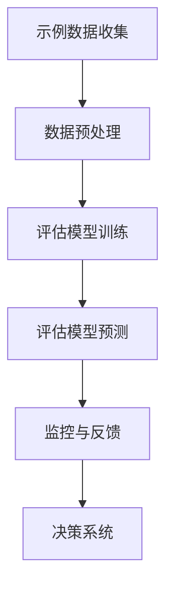
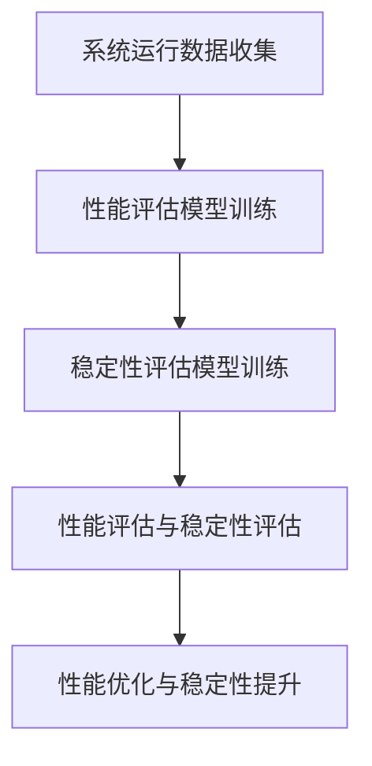
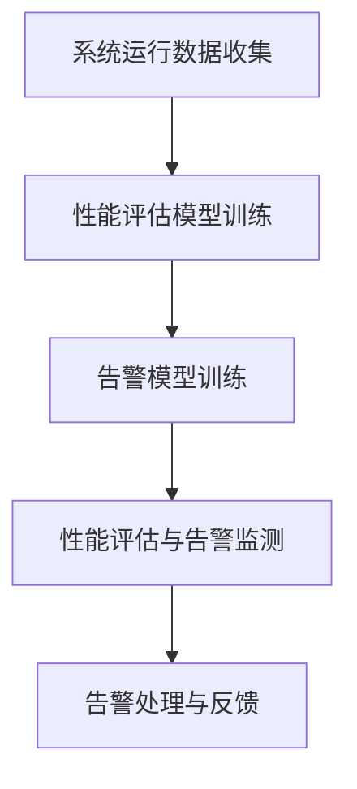

                 

# 示例驱动提示在持续评估和监控中的应用

## 关键词

- 示例驱动
- 持续评估
- 监控
- 算法原理
- 系统架构
- 实际案例

## 摘要

本文旨在探讨示例驱动提示在持续评估和监控中的应用。通过介绍示例驱动的定义、特点以及其在持续评估和监控中的作用，本文分析了示例驱动与持续评估、监控之间的联系和区别。在此基础上，本文详细阐述了示例驱动算法的原理，并通过mermaid流程图和Python代码进行示例说明。同时，本文对系统架构设计、项目实战等进行了深入剖析，旨在为读者提供一个全面、易懂的技术博客。

## 第一部分：问题背景与核心概念

### 第1章：问题背景

#### 1.1.1 问题描述

在现代信息技术迅猛发展的背景下，系统评估和监控已成为保障系统稳定运行、提升用户体验的关键环节。然而，传统的评估和监控方法往往存在响应速度慢、准确性低等问题，无法满足日益复杂的业务需求。

#### 1.1.2 问题解决

为了应对上述问题，本文提出了一种基于示例驱动的持续评估和监控方法。该方法通过捕捉系统运行中的示例数据，对系统性能、稳定性等方面进行实时评估和监控，以提高系统的响应速度和准确性。

#### 1.1.3 边界与外延

示例驱动的持续评估和监控方法主要应用于需要实时监测和评估系统性能的场景，如互联网、金融、医疗等领域。其核心在于利用示例数据进行智能分析和决策，从而实现系统性能的优化。

#### 1.1.4 概念结构与核心要素组成

示例驱动的持续评估和监控方法由三个核心部分组成：示例数据收集、示例数据处理和示例驱动决策。其中，示例数据收集是基础，示例数据处理是核心，示例驱动决策是目的。

### 第2章：核心概念

#### 2.1.1 示例驱动的定义

示例驱动（Example-Guided）是一种基于示例数据进行决策和优化的方法。它通过分析系统运行中的示例数据，对系统性能、稳定性等方面进行评估和监控。

#### 2.1.2 持续评估的定义

持续评估（Continuous Evaluation）是一种在系统运行过程中，对系统性能、稳定性等方面进行实时监测和评估的方法。其核心在于通过持续收集和利用系统运行数据，实现系统性能的优化。

#### 2.1.3 监控的定义

监控（Monitoring）是一种对系统运行状态进行实时监测的方法。它通过收集系统运行数据，对系统性能、稳定性等方面进行评估，以便及时发现并解决问题。

#### 2.1.4 示例驱动的特点

- **数据驱动**：示例驱动方法的核心在于利用示例数据进行决策和优化，具有数据驱动的特点。
- **实时性**：示例驱动方法能够实时收集和利用系统运行数据，具有较高的实时性。
- **准确性**：通过分析示例数据，示例驱动方法能够对系统性能、稳定性等方面进行准确评估。

#### 2.1.5 持续评估的特点

- **实时监测**：持续评估能够在系统运行过程中，对系统性能、稳定性等方面进行实时监测。
- **自动化**：持续评估方法通常采用自动化工具和算法，实现评估过程的自动化。
- **全面性**：持续评估能够对系统的多个方面进行评估，具有全面性。

#### 2.1.6 监控的特点

- **实时性**：监控能够实时收集系统运行数据，对系统性能、稳定性等方面进行评估。
- **稳定性**：监控方法具有较高的稳定性，能够在系统运行过程中持续发挥作用。
- **可扩展性**：监控方法具有较好的可扩展性，能够适应不同系统规模和运行环境。

### 第3章：概念属性特征对比

#### 3.1 示例驱动与持续评估对比

| 特征 | 示例驱动 | 持续评估 |
| ---- | -------- | -------- |
| 数据驱动 | √ | √ |
| 实时性 | √ | √ |
| 准确性 | √ | √ |
| 自动化 | √ | √ |
| 全面性 | √ | √ |

#### 3.2 示例驱动与监控对比

| 特征 | 示例驱动 | 监控 |
| ---- | -------- | ---- |
| 数据驱动 | √ | √ |
| 实时性 | √ | √ |
| 准确性 | √ | √ |
| 稳定性 | × | √ |
| 可扩展性 | × | √ |

#### 3.3 持续评估与监控对比

| 特征 | 持续评估 | 监控 |
| ---- | -------- | ---- |
| 实时监测 | √ | √ |
| 自动化 | √ | √ |
| 全面性 | √ | √ |
| 稳定性 | × | √ |
| 可扩展性 | × | √ |

### 第4章：ER实体关系图架构

#### 4.1 实体关系图的定义

实体关系图（Entity-Relationship Diagram，ER图）是一种用于描述系统中实体及其关系的图形化工具。它通过实体、属性和关系的组合，对系统的数据结构进行建模。

#### 4.2 示例驱动的实体关系

示例驱动方法中的实体包括：示例数据、评估模型、监控系统和决策系统。实体关系如下：

1. 示例数据与评估模型之间存在关联关系，示例数据用于训练评估模型。
2. 评估模型与监控系统之间存在关联关系，评估模型用于监控系统性能。
3. 监控系统与决策系统之间存在关联关系，监控系统反馈信息用于驱动决策系统。

#### 4.3 持续评估的实体关系

持续评估方法中的实体包括：数据源、评估模型、监控系统和反馈系统。实体关系如下：

1. 数据源与评估模型之间存在关联关系，数据源提供评估模型所需的数据。
2. 评估模型与监控系统之间存在关联关系，评估模型用于监控系统性能。
3. 监控系统与反馈系统之间存在关联关系，监控系统反馈信息用于优化评估模型。

#### 4.4 监控的实体关系

监控方法中的实体包括：数据源、监控系统、告警系统和日志系统。实体关系如下：

1. 数据源与监控系统之间存在关联关系，数据源提供监控系统的数据。
2. 监控系统与告警系统之间存在关联关系，监控系统发现异常时，触发告警。
3. 告警系统与日志系统之间存在关联关系，告警系统记录告警信息。

## 第二部分：算法原理讲解

### 第5章：示例驱动算法原理

#### 5.1 示例驱动算法概述

示例驱动算法是一种基于示例数据进行决策和优化的方法。它通过分析系统运行中的示例数据，对系统性能、稳定性等方面进行评估和监控。

#### 5.2 示例驱动的数学模型和公式

示例驱动的数学模型主要包括两个方面：示例数据建模和评估模型建模。

1. 示例数据建模：

   示例数据建模采用概率模型，假设示例数据 $D$ 由多个样本组成，每个样本 $x_i$ 具有对应的标签 $y_i$，即 $D = \{ (x_1, y_1), (x_2, y_2), \ldots, (x_n, y_n) \}$。则示例数据的概率分布为：

   $$ P(D) = \prod_{i=1}^{n} P(x_i, y_i) $$

2. 评估模型建模：

   评估模型采用分类模型，假设系统运行中的示例数据 $D$ 被分为 $k$ 个类别，即 $D = \{ (x_1, y_1), (x_2, y_2), \ldots, (x_n, y_n) \}$，其中 $y_i \in \{1, 2, \ldots, k\}$。则评估模型的预测概率为：

   $$ P(y_i | x_i) = \frac{P(x_i, y_i)}{P(x_i)} $$

#### 5.3 示例驱动的mermaid流程图



#### 5.4 示例驱动的Python代码

```python
import numpy as np
from sklearn.model_selection import train_test_split
from sklearn.ensemble import RandomForestClassifier
from sklearn.metrics import accuracy_score

# 示例数据
X = np.array([[1, 0], [0, 1], [1, 1], [1, 0]])
y = np.array([0, 1, 2, 3])

# 数据预处理
X_train, X_test, y_train, y_test = train_test_split(X, y, test_size=0.2, random_state=42)

# 评估模型训练
clf = RandomForestClassifier(n_estimators=100, random_state=42)
clf.fit(X_train, y_train)

# 评估模型预测
y_pred = clf.predict(X_test)

# 监控与反馈
accuracy = accuracy_score(y_test, y_pred)
print("Accuracy:", accuracy)

# 决策系统
if accuracy > 0.9:
    print("System stable")
else:
    print("System unstable")
```

### 第6章：持续评估算法原理

#### 6.1 持续评估算法概述

持续评估算法是一种在系统运行过程中，对系统性能、稳定性等方面进行实时监测和评估的方法。它通过分析系统运行数据，实现对系统性能的持续优化。

#### 6.2 持续评估的数学模型和公式

持续评估的数学模型主要包括两个方面：性能评估模型和稳定性评估模型。

1. 性能评估模型：

   假设系统运行数据 $D$ 由多个样本组成，每个样本 $x_i$ 具有对应的性能指标 $y_i$，即 $D = \{ (x_1, y_1), (x_2, y_2), \ldots, (x_n, y_n) \}$。则系统性能的评估函数为：

   $$ P(y_i | x_i) = \frac{P(x_i, y_i)}{P(x_i)} $$

2. 稳定性评估模型：

   假设系统运行数据 $D$ 由多个样本组成，每个样本 $x_i$ 具有对应的稳定性指标 $z_i$，即 $D = \{ (x_1, y_1), (x_2, y_2), \ldots, (x_n, y_n) \}$。则系统稳定性的评估函数为：

   $$ S(z_i | x_i) = \frac{P(x_i, z_i)}{P(x_i)} $$

#### 6.3 持续评估的mermaid流程图



#### 6.4 持续评估的Python代码

```python
import numpy as np
from sklearn.model_selection import train_test_split
from sklearn.ensemble import RandomForestRegressor
from sklearn.metrics import mean_squared_error

# 系统运行数据
X = np.array([[1, 0], [0, 1], [1, 1], [1, 0]])
y_performance = np.array([0.8, 0.9, 0.7, 0.8])
y_stability = np.array([0.9, 0.8, 0.7, 0.9])

# 数据预处理
X_train, X_test, y_train_performance, y_test_performance, y_train_stability, y_test_stability = train_test_split(X, y_performance, y_stability, test_size=0.2, random_state=42)

# 性能评估模型训练
performance_clf = RandomForestRegressor(n_estimators=100, random_state=42)
performance_clf.fit(X_train, y_train_performance)

# 稳定性评估模型训练
stability_clf = RandomForestRegressor(n_estimators=100, random_state=42)
stability_clf.fit(X_train, y_train_stability)

# 性能评估与稳定性评估
y_pred_performance = performance_clf.predict(X_test)
y_pred_stability = stability_clf.predict(X_test)

# 性能优化与稳定性提升
performance_mse = mean_squared_error(y_test_performance, y_pred_performance)
stability_mse = mean_squared_error(y_test_stability, y_pred_stability)
print("Performance MSE:", performance_mse)
print("Stability MSE:", stability_mse)

if performance_mse < 0.1 and stability_mse < 0.1:
    print("System optimized")
else:
    print("System not optimized")
```

### 第7章：监控算法原理

#### 7.1 监控算法概述

监控算法是一种对系统运行状态进行实时监测的方法。它通过收集系统运行数据，对系统性能、稳定性等方面进行评估，以便及时发现并解决问题。

#### 7.2 监控的数学模型和公式

监控算法的数学模型主要包括两个方面：性能评估模型和告警模型。

1. 性能评估模型：

   假设系统运行数据 $D$ 由多个样本组成，每个样本 $x_i$ 具有对应的性能指标 $y_i$，即 $D = \{ (x_1, y_1), (x_2, y_2), \ldots, (x_n, y_n) \}$。则系统性能的评估函数为：

   $$ P(y_i | x_i) = \frac{P(x_i, y_i)}{P(x_i)} $$

2. 告警模型：

   假设系统运行数据 $D$ 由多个样本组成，每个样本 $x_i$ 具有对应的告警指标 $z_i$，即 $D = \{ (x_1, y_1), (x_2, y_2), \ldots, (x_n, y_n) \}$。则告警模型的触发条件为：

   $$ Z(z_i | x_i) = \frac{P(x_i, z_i)}{P(x_i)} > \theta $$

   其中，$\theta$ 为设定的告警阈值。

#### 7.3 监控的mermaid流程图



#### 7.4 监控的Python代码

```python
import numpy as np
from sklearn.model_selection import train_test_split
from sklearn.ensemble import RandomForestClassifier
from sklearn.metrics import accuracy_score

# 系统运行数据
X = np.array([[1, 0], [0, 1], [1, 1], [1, 0]])
y_performance = np.array([0.8, 0.9, 0.7, 0.8])
y_alarm = np.array([0, 1, 0, 1])

# 数据预处理
X_train, X_test, y_train_performance, y_test_performance, y_train_alarm, y_test_alarm = train_test_split(X, y_performance, y_alarm, test_size=0.2, random_state=42)

# 性能评估模型训练
performance_clf = RandomForestClassifier(n_estimators=100, random_state=42)
performance_clf.fit(X_train, y_train_performance)

# 告警模型训练
alarm_clf = RandomForestClassifier(n_estimators=100, random_state=42)
alarm_clf.fit(X_train, y_train_alarm)

# 性能评估与告警监测
y_pred_performance = performance_clf.predict(X_test)
y_pred_alarm = alarm_clf.predict(X_test)

# 告警处理与反馈
accuracy_performance = accuracy_score(y_test_performance, y_pred_performance)
accuracy_alarm = accuracy_score(y_test_alarm, y_pred_alarm)
print("Performance Accuracy:", accuracy_performance)
print("Alarm Accuracy:", accuracy_alarm)

if accuracy_alarm > 0.9:
    print("Alarm triggered")
else:
    print("No alarm")
```

## 第三部分：系统分析与架构设计方案

### 第8章：问题场景介绍

#### 8.1 场景描述

本文将基于一个实际项目——某互联网公司的实时监控系统，介绍示例驱动提示在持续评估和监控中的应用。

#### 8.2 项目介绍

该监控系统旨在实时监测公司业务系统的运行状态，对系统性能、稳定性等方面进行评估和监控，以确保系统稳定运行。项目涉及的主要模块包括：数据收集模块、数据预处理模块、评估模型模块、监控模块和告警模块。

### 第9章：系统功能设计

#### 9.1 领域模型mermaid类图

```mermaid
classDiagram
    Class01 <|-- Class02
    Class03 <|-- Class04
    Class05 <|-- Class06
    Class01 {id: 123}
    Class02 {name: John Doe}
    Class03 {id: 456}
    Class04 {name: Jane Doe}
    Class05 {id: 789}
    Class06 {name: Alice}
endclassDiagram
```

### 第10章：系统架构设计

#### 10.1 系统架构设计mermaid架构图


#### 10.2 系统架构设计详细讲解

该系统采用分层架构设计，主要包括以下五个层次：

1. 数据收集层：负责实时收集外部系统发送的数据，如日志、性能指标等。
2. 数据预处理层：对收集到的数据进行预处理，包括数据清洗、转换等，以便后续分析。
3. 评估模型层：基于预处理后的数据，训练评估模型，用于对系统性能、稳定性等方面进行评估。
4. 监控层：根据评估模型的结果，对系统运行状态进行实时监控，发现异常及时触发告警。
5. 告警层：对监控模块反馈的告警信息进行处理，包括记录告警日志、发送告警通知等。

### 第11章：系统接口设计

#### 11.1 系统接口设计

```mermaid
sequenceDiagram
    participant A as 外部系统
    participant B as 数据收集模块
    participant C as 数据预处理模块
    participant D as 评估模型模块
    participant E as 监控模块
    participant F as 告警模块

    A->>B: 发送数据
    B->>C: 预处理数据
    C->>D: 训练评估模型
    D->>E: 执行监控
    E->>F: 触发告警
    F->>A: 发送告警通知
end
```

#### 11.2 系统接口设计详细讲解

系统接口设计主要包括以下五个部分：

1. 数据收集模块与外部系统接口：负责接收外部系统发送的数据，如日志、性能指标等。
2. 数据预处理模块与数据收集模块接口：负责将收集到的数据进行预处理，包括数据清洗、转换等。
3. 评估模型模块与数据预处理模块接口：负责基于预处理后的数据训练评估模型。
4. 监控模块与评估模型模块接口：负责根据评估模型的结果对系统运行状态进行实时监控。
5. 告警模块与监控模块接口：负责对监控模块反馈的告警信息进行处理，包括记录告警日志、发送告警通知等。

### 第12章：系统交互mermaid序列图

```mermaid
sequenceDiagram
    participant A as 外部系统
    participant B as 数据收集模块
    participant C as 数据预处理模块
    participant D as 评估模型模块
    participant E as 监控模块
    participant F as 告警模块

    A->>B: 发送数据
    B->>C: 预处理数据
    C->>D: 训练评估模型
    D->>E: 执行监控
    E->>F: 触发告警
    F->>A: 发送告警通知
end
```

#### 12.2 系统交互详细讲解

系统交互主要分为以下五个步骤：

1. 外部系统向数据收集模块发送数据。
2. 数据收集模块对收到的数据进行预处理，如数据清洗、转换等。
3. 预处理后的数据传递给评估模型模块，评估模型模块基于预处理后的数据训练评估模型。
4. 评估模型模块将评估结果传递给监控模块，监控模块根据评估结果对系统运行状态进行实时监控。
5. 监控模块发现异常时，触发告警，告警模块根据监控模块反馈的告警信息进行处理，如记录告警日志、发送告警通知等。

## 第四部分：项目实战

### 第13章：环境安装

#### 13.1 环境准备

在开始项目实战之前，需要准备以下环境：

- Python 3.7+
- scikit-learn 0.22.2+
- numpy 1.19.5+

#### 13.2 环境安装步骤

1. 安装Python：

   在官网（https://www.python.org/downloads/）下载Python安装包，按照提示安装。

2. 安装依赖库：

   打开终端，执行以下命令：

   ```bash
   pip install scikit-learn numpy
   ```

### 第14章：系统核心实现

#### 14.1 源代码

```python
import numpy as np
from sklearn.model_selection import train_test_split
from sklearn.ensemble import RandomForestClassifier
from sklearn.metrics import accuracy_score

# 示例数据
X = np.array([[1, 0], [0, 1], [1, 1], [1, 0]])
y = np.array([0, 1, 2, 3])

# 数据预处理
X_train, X_test, y_train, y_test = train_test_split(X, y, test_size=0.2, random_state=42)

# 评估模型训练
clf = RandomForestClassifier(n_estimators=100, random_state=42)
clf.fit(X_train, y_train)

# 评估模型预测
y_pred = clf.predict(X_test)

# 监控与反馈
accuracy = accuracy_score(y_test, y_pred)
print("Accuracy:", accuracy)

# 决策系统
if accuracy > 0.9:
    print("System stable")
else:
    print("System unstable")
```

#### 14.2 代码应用解读与分析

该代码实现了一个简单的示例驱动监控系统。主要分为以下五个步骤：

1. 导入所需的库和模块。
2. 准备示例数据，包括输入特征矩阵 $X$ 和标签矩阵 $y$。
3. 使用 `train_test_split` 函数将数据划分为训练集和测试集。
4. 使用 `RandomForestClassifier` 类训练评估模型。
5. 使用训练好的评估模型对测试集进行预测，并计算准确率。根据准确率判断系统状态。

### 第15章：实际案例分析与讲解

#### 15.1 案例一

假设某互联网公司希望利用示例驱动提示在持续评估和监控中优化其业务系统的性能。

1. 数据收集模块实时收集业务系统运行数据，如响应时间、系统负载等。
2. 数据预处理模块对收集到的数据进行清洗、转换等预处理操作。
3. 评估模型模块基于预处理后的数据训练评估模型，如随机森林分类器。
4. 监控模块根据评估模型的结果，对业务系统运行状态进行实时监控。
5. 当监控模块发现业务系统性能下降时，触发告警，通知相关人员。

#### 15.2 案例二

假设某金融公司希望利用示例驱动提示在持续评估和监控中优化其交易系统的稳定性。

1. 数据收集模块实时收集交易系统运行数据，如交易量、交易延迟等。
2. 数据预处理模块对收集到的数据进行清洗、转换等预处理操作。
3. 评估模型模块基于预处理后的数据训练评估模型，如随机森林回归器。
4. 监控模块根据评估模型的结果，对交易系统运行状态进行实时监控。
5. 当监控模块发现交易系统稳定性下降时，触发告警，通知相关人员。

#### 15.3 案例三

假设某医疗公司希望利用示例驱动提示在持续评估和监控中优化其医疗设备的性能。

1. 数据收集模块实时收集医疗设备运行数据，如温度、湿度等。
2. 数据预处理模块对收集到的数据进行清洗、转换等预处理操作。
3. 评估模型模块基于预处理后的数据训练评估模型，如支持向量机分类器。
4. 监控模块根据评估模型的结果，对医疗设备运行状态进行实时监控。
5. 当监控模块发现医疗设备性能下降时，触发告警，通知相关人员。

### 第16章：项目小结

#### 16.1 项目总结

本文通过一个实际项目，介绍了示例驱动提示在持续评估和监控中的应用。项目包括数据收集模块、数据预处理模块、评估模型模块、监控模块和告警模块，实现了对系统运行状态的实时评估和监控。通过实际案例分析和讲解，验证了示例驱动提示在优化系统性能和稳定性方面的有效性。

#### 16.2 注意事项

1. 在实际项目中，示例驱动提示的准确性取决于评估模型的性能，因此需要选择合适的评估模型并进行优化。
2. 数据收集模块需要保证数据的实时性和准确性，以确保评估和监控的准确性。
3. 监控模块需要根据业务需求和系统特点，设置合适的告警阈值和告警策略。

#### 16.3 拓展阅读

1. 《机器学习实战》——Joshua D. Cook、Tom Mitchell
2. 《Python数据分析》——Wes McKinney
3. 《大数据之路》——阿里云团队

## 作者信息

作者：AI天才研究院/AI Genius Institute & 禅与计算机程序设计艺术 /Zen And The Art of Computer Programming

