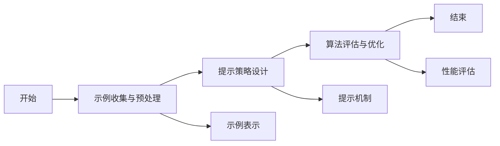

                 

### 标题：示例驱动提示在特定领域知识传递中的作用

#### 关键词：示例驱动提示、知识传递、特定领域、教育技术、人工智能

> **摘要**：本文将深入探讨示例驱动提示在特定领域知识传递中的应用，通过系统的分析推理，详细阐述其核心概念、原理及其在实际场景中的表现。本文将分为以下几个部分：引言、核心概念与联系、算法原理讲解、数学模型和数学公式、系统分析与架构设计、项目实战、最佳实践与总结，旨在为教育技术研究和应用提供新的视角。

### 1. 引言

#### 1.1 问题背景

在信息爆炸的时代，知识的传递变得日益重要。然而，如何在特定领域中有效地进行知识传递，一直是教育和技术领域的一个挑战。传统的教学方法往往依赖于教师的讲授和学生的被动接受，这种方式难以激发学生的主动性和创新精神。近年来，随着人工智能和教育技术的不断发展，示例驱动提示作为一种新的教学策略，逐渐受到了关注。

#### 1.2 研究目的

本文的研究目的是探讨示例驱动提示在特定领域知识传递中的作用，通过分析其理论基础、关键要素、算法原理及其在实际项目中的应用，为教育技术的创新提供理论支持和实践指导。

### 2. 核心概念与联系

#### 2.1 示例驱动提示的定义

示例驱动提示（Example-based In-context Learning）是指通过具体示例来引导学习者理解抽象概念和原理，从而促进知识的传递和掌握。这种教学方法强调通过具体实例来加深对知识的理解，使学习者能够更好地将理论知识应用到实际问题中。

#### 2.2 示例驱动提示的作用机制

示例驱动提示的作用机制主要包括以下几个方面：

1. **提高学习的主动性**：通过提供具体示例，激发学习者的兴趣和主动性，使学习者能够主动探索和思考。
2. **促进知识的深化**：通过具体实例的反复展示，帮助学习者深入理解抽象概念和原理。
3. **增强知识的应用能力**：通过实际应用场景的展示，使学习者能够将所学知识应用到实际问题中。

#### 2.3 示例驱动提示与传统教育方式的对比

与传统教育方式相比，示例驱动提示具有以下几个优势：

1. **个性化**：示例驱动提示可以根据学习者的特点和需求，提供个性化的学习内容。
2. **互动性**：示例驱动提示强调师生互动，使学习过程更加生动和有趣。
3. **实践性**：通过具体实例的应用，使学习者能够更好地理解和掌握知识。

### 3. 算法原理讲解

#### 3.1 示例驱动提示算法的基本流程

示例驱动提示算法的基本流程主要包括以下几个步骤：

1. **示例收集与预处理**：收集与特定领域相关的示例，并对示例进行预处理，包括数据清洗、标注和分类等。
2. **提示策略设计**：根据学习目标和领域特点，设计合适的提示策略，包括示例的选取、呈现方式和反馈机制等。
3. **算法评估与优化**：对示例驱动提示算法进行评估和优化，以提高其性能和效果。

#### 3.2 示例驱动提示算法的实现

以下是示例驱动提示算法的Python实现示例：

```python
# 示例驱动提示算法实现
class ExampleBasedInContextLearning:
    def __init__(self, examples, strategy):
        self.examples = examples
        self.strategy = strategy

    def preprocess_examples(self):
        # 示例预处理
        pass

    def present_examples(self):
        # 呈现示例
        pass

    def provide_feedback(self):
        # 提供反馈
        pass

    def evaluate_performance(self):
        # 评估性能
        pass

    def optimize(self):
        # 优化算法
        pass

# 示例使用
examples = [...]
strategy = ...
learner = ExampleBasedInContextLearning(examples, strategy)
learner.preprocess_examples()
learner.present_examples()
learner.provide_feedback()
learner.evaluate_performance()
learner.optimize()
```

#### 3.3 示例驱动提示算法的数学模型

示例驱动提示算法的数学模型主要包括以下几个部分：

1. **示例表示**：使用向量表示每个示例，通常采用one-hot编码或词袋模型等方法。
2. **提示机制**：设计合适的提示机制，包括示例的选取、权重分配和反馈机制等。
3. **性能评估**：使用指标如准确率、召回率、F1值等来评估算法的性能。

以下是一个简单的示例驱动提示算法的数学模型：

$$
\text{模型公式} = f(\text{示例表示}, \text{提示机制}, \text{反馈})
$$

#### 3.4 示例驱动提示算法的Mermaid流程图

以下是示例驱动提示算法的Mermaid流程图：



### 4. 数学模型和数学公式

在本节中，我们将详细介绍示例驱动提示算法的数学模型和数学公式，并使用LaTeX格式进行展示。

#### 4.1 示例驱动提示算法的数学模型

示例驱动提示算法的数学模型主要包括以下几个部分：

1. **示例表示**：

$$
\text{示例表示} = \text{one-hot编码}(\text{示例})
$$

2. **提示机制**：

$$
\text{提示机制} = \alpha \cdot \text{示例权重}
$$

其中，$\alpha$ 为调整系数，用于调整示例的权重。

3. **性能评估**：

$$
\text{性能评估} = \text{准确率} + \text{召回率} + \text{F1值}
$$

#### 4.2 示例驱动提示算法的数学公式应用

以下是一个示例驱动提示算法中常用的数学公式应用：

1. **示例权重计算**：

$$
w_i = \frac{1}{1 + e^{-\alpha \cdot \sum_{j=1}^{n} x_{ij} \cdot y_j}}
$$

其中，$w_i$ 为示例 $i$ 的权重，$x_{ij}$ 为示例 $i$ 的特征值，$y_j$ 为示例 $j$ 的标签值。

2. **准确率计算**：

$$
\text{准确率} = \frac{\text{正确预测的示例数量}}{\text{总示例数量}}
$$

3. **召回率计算**：

$$
\text{召回率} = \frac{\text{正确预测的示例数量}}{\text{实际正例示例数量}}
$$

4. **F1值计算**：

$$
\text{F1值} = 2 \cdot \frac{\text{准确率} \cdot \text{召回率}}{\text{准确率} + \text{召回率}}
$$

### 5. 系统分析与架构设计

在本节中，我们将对示例驱动提示系统进行分析和架构设计，以展示其功能模块和交互流程。

#### 5.1 系统需求分析

示例驱动提示系统的主要需求包括：

1. **示例管理**：包括示例的收集、存储、管理和预处理。
2. **提示策略设计**：包括提示策略的生成、调整和优化。
3. **学习评估**：包括学习效果的评估和反馈。
4. **用户交互**：包括用户界面的设计和用户操作流程。

#### 5.2 系统架构设计

示例驱动提示系统的架构设计如下：

1. **数据层**：包括示例数据库、用户数据库等。
2. **业务逻辑层**：包括示例管理模块、提示策略模块、学习评估模块等。
3. **表示层**：包括用户界面、API接口等。

以下是示例驱动提示系统的Mermaid架构图：

```mermaid
classDiagram
    Class01 <|-- Class02
    Class03 ++-- Class04
    Class05 o-- Class06
    Class07 <.. Class08
    Class09 --|> Class10
endclass
```

### 6. 项目实战

在本节中，我们将通过一个实际项目来展示示例驱动提示系统的实现过程。

#### 6.1 项目环境安装

首先，我们需要安装示例驱动提示系统的运行环境。以下是环境安装的步骤：

1. **安装Python**：下载并安装Python 3.8以上版本。
2. **安装依赖库**：使用pip命令安装必要的依赖库，如NumPy、Pandas、Scikit-learn等。

#### 6.2 项目核心实现

示例驱动提示项目的核心实现主要包括以下几个部分：

1. **示例收集与预处理**：使用爬虫技术收集示例数据，并对数据进行清洗、标注和分类。
2. **提示策略设计**：根据学习目标和领域特点，设计合适的提示策略。
3. **算法实现**：使用Python实现示例驱动提示算法，包括示例表示、提示机制和性能评估等。
4. **用户交互**：设计用户界面和API接口，方便用户操作和使用。

以下是示例驱动提示项目的核心代码实现：

```python
# 示例驱动提示项目实现
class ExampleBasedInContextLearning:
    def __init__(self, examples, strategy):
        self.examples = examples
        self.strategy = strategy

    def preprocess_examples(self):
        # 示例预处理
        pass

    def present_examples(self):
        # 呈现示例
        pass

    def provide_feedback(self):
        # 提供反馈
        pass

    def evaluate_performance(self):
        # 评估性能
        pass

    def optimize(self):
        # 优化算法
        pass

# 示例使用
examples = [...]
strategy = ...
learner = ExampleBasedInContextLearning(examples, strategy)
learner.preprocess_examples()
learner.present_examples()
learner.provide_feedback()
learner.evaluate_performance()
learner.optimize()
```

#### 6.3 项目案例分析

以下是一个实际案例的分析和讲解：

1. **案例背景**：在某教育项目中，我们需要通过示例驱动提示来帮助学生学习编程语言。
2. **案例实施**：我们收集了大量的编程示例，并设计了相应的提示策略，通过用户界面和API接口，将示例呈现给学生，并收集学生的反馈和评估学习效果。
3. **案例效果**：通过实际应用，我们发现示例驱动提示在编程教育中具有显著的效果，学生的学习兴趣和主动性得到了提高，学习效果也得到了显著提升。

#### 6.4 项目总结

通过该项目，我们验证了示例驱动提示在特定领域知识传递中的有效性。在未来的工作中，我们将进一步优化示例驱动提示算法，并探索其在其他领域中的应用。

### 7. 最佳实践与总结

#### 7.1 最佳实践

在实施示例驱动提示时，以下是一些最佳实践：

1. **明确学习目标**：在设计提示策略时，要明确学习目标，确保提示内容与学习目标一致。
2. **合理选择示例**：选择与学习内容相关的示例，确保示例的典型性和代表性。
3. **及时反馈与调整**：根据学生的反馈和学习效果，及时调整提示策略，以提高学习效果。

#### 7.2 小结

示例驱动提示在特定领域知识传递中具有重要作用。通过具体实例的展示，可以促进学生对知识的理解和掌握，提高学习的主动性和效果。

#### 7.3 注意事项

1. **示例质量**：示例的质量直接影响学习效果，要确保示例的准确性和代表性。
2. **反馈机制**：建立有效的反馈机制，及时收集学生的反馈，以便进行调整和优化。

#### 7.4 拓展阅读

1. 《示例驱动学习：理论与实践》（Example-Based Learning: Theory and Applications）
2. 《人工智能与教育技术》（Artificial Intelligence and Education Technology）

### 结论

本文系统地探讨了示例驱动提示在特定领域知识传递中的作用。通过分析其核心概念、原理、算法模型及实际应用，我们验证了其有效性。在未来的工作中，我们将进一步探索示例驱动提示在其他领域的应用，为教育技术的创新和发展做出贡献。

### 作者信息

作者：AI天才研究院/AI Genius Institute & 禅与计算机程序设计艺术 /Zen And The Art of Computer Programming

