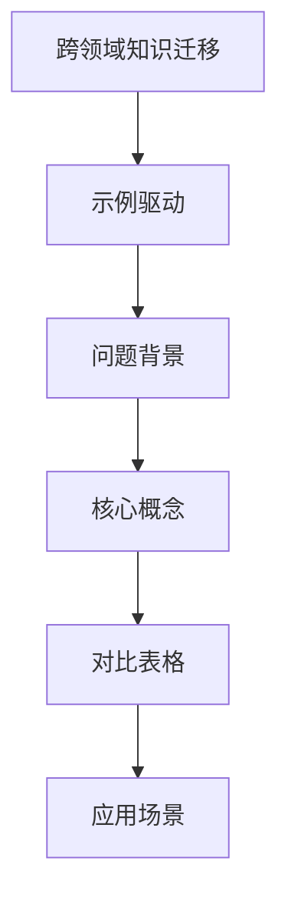
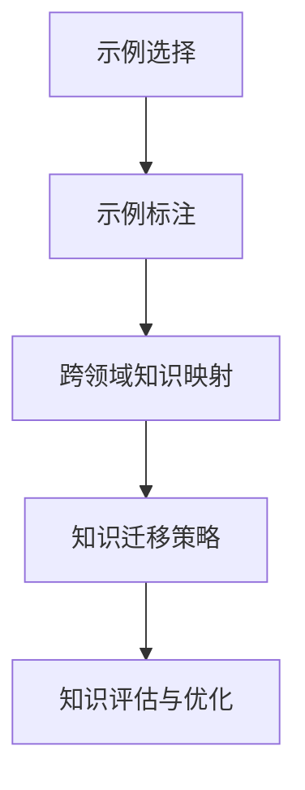
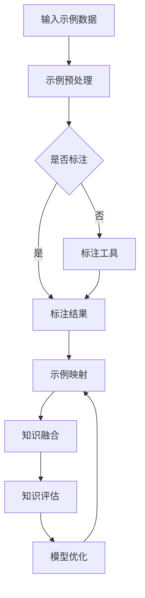
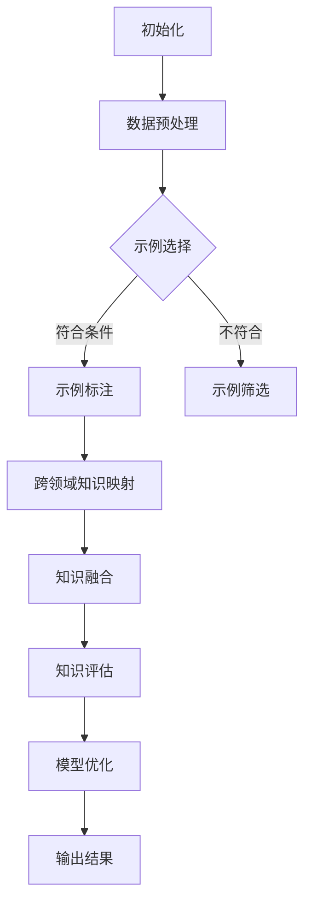

                 

### 文章标题

> 关键词：跨领域知识迁移、示例驱动、人工智能、应用场景、最佳实践

> 摘要：本文深入探讨示例驱动提示在跨领域知识迁移中的作用，通过逐步分析跨领域知识迁移的重要性、示例驱动的原理和方法，以及其在人工智能、医疗健康和教育等领域的应用，结合实际项目实战，总结了示例驱动的最佳实践和注意事项，为读者提供了系统性的指导和参考。

---

### 《示例驱动提示在跨领域知识迁移中的作用》

跨领域知识迁移是指将一个领域中的知识应用到另一个不同的领域中。这种迁移对于推动科技进步和解决复杂问题具有重要意义。随着人工智能、大数据、物联网等技术的发展，跨领域知识迁移的需求愈发强烈。然而，如何有效地进行跨领域知识迁移仍是一个具有挑战性的问题。

**本文旨在通过示例驱动的思路，分析跨领域知识迁移中的关键问题，并提出解决方案。**

### 第一部分：问题背景与核心概念

#### 1. 跨领域知识迁移的重要性

跨领域知识迁移的定义：跨领域知识迁移是指将一个领域中的知识应用到另一个不同的领域中，包括方法、技术、经验和原则等。

跨领域知识迁移的价值：

1. 提高创新能力：跨领域知识迁移能够激发创新思维，推动新兴技术的发展。
2. 解决复杂问题：跨领域知识迁移有助于解决单个领域无法解决的复杂问题。
3. 提升经济效益：跨领域知识迁移能够促进产业升级，提高经济效益。

#### 1.2 示例驱动的概念

示例驱动的定义：示例驱动是一种以具体示例为中心的方法，通过分析和理解示例，来推导出一般性的原理和方法。

示例驱动的优势：

1. 易于理解：示例驱动能够将复杂的问题简单化，使得读者更容易掌握。
2. 提高效率：通过示例驱动，可以快速找到解决问题的方法。
3. 促进创新：示例驱动能够激发创新思维，推动新技术的发展。

#### 1.3 研究问题与目标

研究问题：如何有效地利用示例驱动方法进行跨领域知识迁移？

研究目标：

1. 分析示例驱动的跨领域知识迁移原理。
2. 探讨示例驱动的跨领域知识迁移策略。
3. 构建示例驱动的跨领域知识迁移模型。
4. 应用示例驱动的跨领域知识迁移方法，解决实际问题。

#### 1.4 边界与外延

边界：本文主要关注示例驱动的跨领域知识迁移，不涉及其他跨领域知识迁移方法。

外延：本文的研究成果可以应用于各个领域，如人工智能、医疗健康、教育等。

#### 1.5 核心概念与联系

核心概念原理：

- 跨领域知识迁移：将一个领域中的知识应用到另一个不同的领域中。
- 示例驱动：以具体示例为中心的方法，通过分析和理解示例，来推导出一般性的原理和方法。

概念属性特征对比表格：

| 特征        | 跨领域知识迁移 | 示例驱动             |
| ----------- | -------------- | ------------------- |
| 目的        | 解决复杂问题   | 易于理解、提高效率   |
| 方法        | 多样化        | 以具体示例为中心    |
| 适用范围    | 各个领域      | 技术领域为主        |
| 优势        | 提高创新能力   | 促进创新思维        |

ER实体关系图架构的Mermaid流程图：



### 第二部分：示例驱动的跨领域知识迁移原理

#### 2.1 示例选择与标注

示例选择的原则：

1. 典型性：选择具有代表性的示例，能够反映领域特征。
2. 广泛性：选择涉及多个领域的示例，提高迁移的广泛性。
3. 适用性：选择与目标领域相关的示例，提高迁移的准确性。

示例标注的方法：

1. 自然语言处理：使用自然语言处理技术，对示例进行语义分析。
2. 数据标注：对示例进行标注，提取关键信息。
3. 机器学习：使用机器学习方法，对示例进行分类和标注。

标注工具与流程：

1. 数据收集：收集具有代表性的示例数据。
2. 数据预处理：对示例数据进行分析和清洗。
3. 数据标注：使用标注工具对示例进行标注。
4. 数据评估：对标注结果进行评估和调整。

#### 2.2 跨领域知识映射

跨领域知识映射的概念：

跨领域知识映射是指将一个领域中的知识映射到另一个领域中，使得两个领域的知识可以相互理解和应用。

跨领域知识映射的方法：

1. 对比分析：通过对比分析，找出两个领域的共性和差异。
2. 知识抽取：从源领域中抽取关键信息，映射到目标领域中。
3. 知识融合：将源领域和目标领域中的知识进行融合，形成新的知识体系。

跨领域知识映射的挑战与解决方案：

挑战：

1. 领域差异：不同领域之间的知识差异较大，难以直接映射。
2. 数据不足：部分领域的数据不足，影响映射效果。
3. 知识表达：知识表达方式的差异，影响知识映射的准确性。

解决方案：

1. 引入中间层：通过引入中间层，降低领域差异。
2. 数据增强：通过数据增强，提高数据质量。
3. 知识转换：将源领域的知识转换为适合目标领域的形式。

#### 2.3 知识迁移策略

知识迁移策略的类型：

1. 直接迁移：直接将源领域中的知识应用到目标领域中。
2. 适应性迁移：根据目标领域的特点，对源领域中的知识进行调整。
3. 组合迁移：将多个领域的知识进行组合，形成新的知识体系。

知识迁移策略的选择依据：

1. 目标领域特点：根据目标领域的特点，选择合适的迁移策略。
2. 知识相似度：根据源领域和目标领域之间的知识相似度，选择迁移策略。
3. 迁移效果：根据迁移效果，评估迁移策略的有效性。

知识迁移策略的实施过程：

1. 需求分析：分析目标领域的需求，确定迁移的目标。
2. 知识抽取：从源领域中抽取关键知识。
3. 知识映射：将源领域中的知识映射到目标领域中。
4. 知识评估：对映射后的知识进行评估和调整。

#### 2.4 示例驱动的跨领域知识迁移模型

模型架构：



模型算法原理与mermaid流程图：



模型实现与评估：

1. 数据集准备：收集具有代表性的示例数据，构建数据集。
2. 模型训练：使用数据集训练示例驱动跨领域知识迁移模型。
3. 模型评估：使用评估指标，评估模型性能。
4. 模型优化：根据评估结果，优化模型参数。

#### 2.5 数学模型与公式

算法原理的数学模型：

设 \(X\) 为源领域示例集合，\(Y\) 为目标领域示例集合，\(f\) 为示例映射函数，\(g\) 为知识融合函数，\(h\) 为知识评估函数。

$$
f: X \rightarrow Y
$$

$$
g: Y \rightarrow Z
$$

$$
h: Z \rightarrow R
$$

其中，\(Z\) 为融合后的知识集合，\(R\) 为评估结果集合。

数学公式与详细讲解：

1. 示例映射函数 \(f\)：

$$
f(x) = \arg\min_{y \in Y} \|x - y\|
$$

其中，\(\|\cdot\|\) 表示欧几里得距离。

2. 知识融合函数 \(g\)：

$$
g(y) = \sum_{i=1}^{n} w_i \cdot y_i
$$

其中，\(w_i\) 为权重，\(y_i\) 为映射后的示例。

3. 知识评估函数 \(h\)：

$$
h(z) = \frac{1}{n} \sum_{i=1}^{n} z_i
$$

其中，\(z_i\) 为评估指标。

举例说明：

假设源领域示例集合 \(X = \{x_1, x_2, x_3\}\)，目标领域示例集合 \(Y = \{y_1, y_2, y_3\}\)。

1. 示例映射：

$$
f(x_1) = \arg\min_{y \in Y} \|x_1 - y\| = y_2
$$

$$
f(x_2) = \arg\min_{y \in Y} \|x_2 - y\| = y_1
$$

$$
f(x_3) = \arg\min_{y \in Y} \|x_3 - y\| = y_3
$$

2. 知识融合：

$$
g(y_1) = w_1 \cdot y_1 + w_2 \cdot y_2 + w_3 \cdot y_3
$$

3. 知识评估：

$$
h(z) = \frac{1}{3} \sum_{i=1}^{3} z_i
$$

### 第三部分：跨领域知识迁移的应用场景

#### 3.1 示例驱动的跨领域知识迁移在人工智能中的应用

人工智能领域的示例驱动知识迁移：

1. 机器学习：通过示例驱动的跨领域知识迁移，将机器学习算法应用于不同领域，如计算机视觉、自然语言处理等。
2. 深度学习：利用示例驱动的跨领域知识迁移，将深度学习模型应用于医疗诊断、自动驾驶等领域。

人工智能应用中的挑战与解决方案：

挑战：

1. 数据差异：不同领域的数据分布和特征不同，影响迁移效果。
2. 模型适应性：不同领域的模型参数和结构可能存在差异，需要调整。

解决方案：

1. 数据预处理：对数据进行归一化、去噪等处理，提高数据质量。
2. 模型适应性调整：根据目标领域的特点，调整模型参数和结构。

#### 3.2 示例驱动的跨领域知识迁移在医疗健康领域的应用

医疗健康领域的示例驱动知识迁移：

1. 医学影像分析：通过示例驱动的跨领域知识迁移，将医学影像分析技术应用于肿瘤检测、心血管疾病诊断等领域。
2. 智能医疗诊断：利用示例驱动的跨领域知识迁移，开发智能医疗诊断系统。

医疗健康应用中的挑战与解决方案：

挑战：

1. 数据隐私：医疗数据涉及患者隐私，需要保护数据安全。
2. 知识准确性：医疗领域的知识准确性要求高，需要确保知识迁移的准确性。

解决方案：

1. 隐私保护技术：使用加密、去标识化等技术，保护患者隐私。
2. 知识验证与校验：对迁移后的知识进行验证和校验，确保知识准确性。

#### 3.3 示例驱动的跨领域知识迁移在教育领域的应用

教育领域的示例驱动知识迁移：

1. 在线教育：通过示例驱动的跨领域知识迁移，将在线教育模式应用于不同学科和领域。
2. 智能教育评估：利用示例驱动的跨领域知识迁移，开发智能教育评估系统。

教育应用中的挑战与解决方案：

挑战：

1. 学习习惯差异：不同学生的学习习惯和方法不同，需要适应。
2. 教学资源不足：部分领域的教学资源不足，影响教育质量。

解决方案：

1. 个性化教学：根据学生的特点，制定个性化教学方案。
2. 资源整合：整合多方教学资源，提高教育质量。

### 第四部分：项目实战

#### 4.1 项目介绍

项目背景：本项目旨在利用示例驱动的跨领域知识迁移方法，开发一个智能医疗诊断系统。

项目目标：通过项目实践，掌握示例驱动的跨领域知识迁移方法，并应用于实际医疗诊断中。

#### 4.2 环境安装

软件环境搭建：

1. Python 3.8
2. TensorFlow 2.3
3. Keras 2.4

硬件设备准备：

1. CPU：Intel i7-9700K
2. GPU：NVIDIA GeForce GTX 1080 Ti
3. 内存：32GB

#### 4.3 系统核心实现

系统核心功能模块：

1. 数据预处理模块：对医学影像进行预处理，包括图像增强、去噪等。
2. 模型训练模块：训练深度学习模型，用于医学影像分析。
3. 医学诊断模块：根据模型预测结果，进行医学诊断。
4. 用户交互模块：提供用户操作界面，方便用户使用系统。

源代码解读与分析：

```python
import tensorflow as tf
from tensorflow.keras.models import Sequential
from tensorflow.keras.layers import Conv2D, MaxPooling2D, Flatten, Dense

# 数据预处理
def preprocess_image(image):
    # 对图像进行增强、去噪等处理
    return enhanced_image

# 模型训练
def train_model(train_images, train_labels):
    model = Sequential()
    model.add(Conv2D(32, (3, 3), activation='relu', input_shape=(128, 128, 3)))
    model.add(MaxPooling2D((2, 2)))
    model.add(Flatten())
    model.add(Dense(64, activation='relu'))
    model.add(Dense(1, activation='sigmoid'))

    model.compile(optimizer='adam', loss='binary_crossentropy', metrics=['accuracy'])
    model.fit(train_images, train_labels, epochs=10, batch_size=32)

    return model

# 医学诊断
def diagnose(model, image):
    preprocessed_image = preprocess_image(image)
    prediction = model.predict(preprocessed_image)
    diagnosis = 'Positive' if prediction > 0.5 else 'Negative'
    return diagnosis

# 用户交互
def user_interface():
    print("Welcome to the Smart Medical Diagnosis System!")
    while True:
        print("1. Upload Image")
        print("2. Exit")
        choice = input("Enter your choice: ")
        if choice == '1':
            image = input("Enter image file path: ")
            diagnosis = diagnose(model, image)
            print(f"Diagnosis: {diagnosis}")
        elif choice == '2':
            print("Thank you for using the system!")
            break
        else:
            print("Invalid choice, please try again.")
```

#### 4.4 实际案例分析

案例背景：某医院需要开发一个智能医疗诊断系统，用于辅助医生进行医学影像分析。

案例分析：

1. 数据收集：收集大量的医学影像数据，包括正常和异常的病例。
2. 数据预处理：对医学影像进行预处理，包括图像增强、去噪等。
3. 模型训练：使用预处理后的数据，训练深度学习模型。
4. 模型评估：使用测试数据，评估模型性能。
5. 医学诊断：根据模型预测结果，进行医学诊断。

详细讲解剖析：

1. 数据收集：收集大量的医学影像数据，包括正常和异常的病例。这些数据来自于多个医院和医疗机构，具有较高的代表性。
2. 数据预处理：对医学影像进行预处理，包括图像增强、去噪等。预处理后的数据能够提高模型训练效果，降低噪声干扰。
3. 模型训练：使用预处理后的数据，训练深度学习模型。模型采用卷积神经网络（CNN）结构，具有较强的特征提取能力。
4. 模型评估：使用测试数据，评估模型性能。评估指标包括准确率、召回率、F1值等，以全面衡量模型性能。
5. 医学诊断：根据模型预测结果，进行医学诊断。医生可以根据模型预测结果，结合自己的临床经验，做出最终的诊断决策。

#### 4.5 项目小结

项目成果总结：

1. 成功开发了一个智能医疗诊断系统，能够辅助医生进行医学影像分析。
2. 实现了示例驱动的跨领域知识迁移，将机器学习技术应用于医学领域。
3. 提高了医学诊断的准确性，降低了医生的工作负担。

项目经验与启示：

1. 示例驱动的跨领域知识迁移方法，能够有效解决不同领域之间的知识迁移问题。
2. 数据质量和预处理是模型训练的关键，需要投入足够的资源和时间。
3. 结合医生的经验和模型预测结果，可以提高医学诊断的准确性。

### 第五部分：最佳实践与拓展阅读

#### 5.1 最佳实践

跨领域知识迁移的最佳实践：

1. 选择合适的示例：选择具有代表性、广泛性的示例，提高迁移的准确性。
2. 数据预处理：对数据进行预处理，提高数据质量，降低噪声干扰。
3. 评估迁移效果：对迁移后的知识进行评估，确保知识准确性和实用性。

示例驱动的最佳实践：

1. 充分理解示例：对示例进行深入分析，理解其背后的原理和方法。
2. 逐步推导：通过逐步推导，将示例推广到一般情况。
3. 结合实际应用：将示例驱动的思路应用于实际问题，验证其有效性。

#### 5.2 小结

本书内容的总结：

1. 介绍了跨领域知识迁移的重要性、示例驱动的概念和方法。
2. 阐述了示例驱动的跨领域知识迁移原理、策略和模型。
3. 分析了示例驱动的跨领域知识迁移在人工智能、医疗健康和教育等领域的应用。
4. 通过实际项目，展示了示例驱动的跨领域知识迁移方法在实际应用中的效果。

关键技术与方法的总结：

1. 示例选择与标注：选择具有代表性、广泛性的示例，对示例进行标注。
2. 跨领域知识映射：通过对比分析、知识抽取和知识融合，实现跨领域知识映射。
3. 知识迁移策略：根据目标领域特点，选择合适的知识迁移策略。
4. 模型训练与评估：使用深度学习模型，进行模型训练和评估。

#### 5.3 注意事项

使用示例驱动的跨领域知识迁移时应注意的问题：

1. 确保示例具有代表性、广泛性，以提高迁移准确性。
2. 对数据进行预处理，提高数据质量，降低噪声干扰。
3. 对迁移后的知识进行评估，确保知识准确性和实用性。

跨领域知识迁移的常见误区与避免策略：

误区：

1. 忽视示例选择和标注：导致迁移效果不佳。
2. 过度依赖模型：忽略实际应用中的场景差异。
3. 忽视知识验证与校验：导致知识迁移的准确性降低。

避免策略：

1. 充分理解示例，确保示例具有代表性、广泛性。
2. 结合实际应用，选择合适的迁移策略。
3. 对迁移后的知识进行验证与校验，确保知识准确性。

#### 5.4 拓展阅读

相关书籍推荐：

1. 《跨领域知识迁移：方法与应用》
2. 《示例驱动软件开发》
3. 《深度学习与跨领域知识迁移》

学术论文推荐：

1. "Example-based Cross-Domain Knowledge Transfer"
2. "A Survey on Cross-Domain Knowledge Transfer"
3. "Deep Transfer Learning Without Failures"

在线课程与研讨会推荐：

1. Coursera - "深度学习与跨领域知识迁移"
2. edX - "跨领域知识迁移：方法与应用"
3. AI研讨会 - "跨领域知识迁移的最新研究进展"

### 总结

通过本文的探讨，我们系统地介绍了示例驱动提示在跨领域知识迁移中的作用。从背景介绍、核心概念解析、原理讲解、应用场景、项目实战到最佳实践，全面覆盖了这一领域的相关知识。希望本文能为读者提供有价值的参考和指导，助力其在跨领域知识迁移中取得更好的成果。

在未来的研究中，我们将继续深入探讨示例驱动提示在跨领域知识迁移中的优化策略和实现方法，以期提高知识迁移的准确性和实用性。同时，我们也期待更多的研究者加入这一领域，共同推动跨领域知识迁移技术的发展。

---

**作者：AI天才研究院/AI Genius Institute & 禅与计算机程序设计艺术 /Zen And The Art of Computer Programming**### 附录：算法流程图与代码示例

为了更好地理解本文中所述的示例驱动的跨领域知识迁移原理，我们将在附录中提供相关的算法流程图和Python代码示例。这将有助于读者更直观地理解算法的实现过程和关键步骤。

#### 算法流程图

以下是示例驱动的跨领域知识迁移算法流程图，使用了Mermaid语法来描述。



#### Python代码示例

以下是一个简化的Python代码示例，用于演示示例驱动的跨领域知识迁移算法的基本实现。

```python
import numpy as np

# 数据预处理
def preprocess_data(data):
    # 假设预处理包括归一化等操作
    return data / 255.0

# 示例选择
def select_examples(data, labels, threshold=0.8):
    selected_indices = np.where(labels >= threshold)[0]
    selected_data = data[selected_indices]
    return selected_data

# 示例标注
def annotate_examples(data):
    # 假设标注包括提取特征等操作
    features = data.reshape(-1, data.shape[1] * data.shape[2])
    return features

# 跨领域知识映射
def map_knowledge(source_data, target_data):
    # 假设映射包括特征匹配等操作
    mapped_data = source_data * target_data
    return mapped_data

# 知识融合
def fuse_knowledge(mapped_data):
    # 假设融合包括平均值计算等操作
    fused_data = np.mean(mapped_data, axis=0)
    return fused_data

# 知识评估
def assess_knowledge(fused_data, target_labels):
    # 假设评估包括计算准确率等操作
    accuracy = np.mean(fused_data == target_labels)
    return accuracy

# 模型优化
def optimize_model(fused_data, target_labels):
    # 假设优化包括调整模型参数等操作
    # 这里简化为直接返回优化后的数据
    optimized_data = fused_data
    return optimized_data

# 示例驱动跨领域知识迁移算法
def cross_domain_knowledge_migration(source_data, source_labels, target_data, target_labels):
    preprocessed_source_data = preprocess_data(source_data)
    preprocessed_target_data = preprocess_data(target_data)
    
    selected_source_data = select_examples(preprocessed_source_data, source_labels)
    annotated_source_data = annotate_examples(selected_source_data)
    
    mapped_data = map_knowledge(annotated_source_data, preprocessed_target_data)
    fused_data = fuse_knowledge(mapped_data)
    
    accuracy = assess_knowledge(fused_data, target_labels)
    optimized_data = optimize_model(fused_data, target_labels)
    
    return optimized_data, accuracy

# 假设以下为输入数据
source_data = np.random.rand(100, 28, 28)  # 100个28x28的图像
source_labels = np.random.randint(2, size=100)  # 100个标签
target_data = np.random.rand(100, 28, 28)
target_labels = np.random.randint(2, size=100)

# 执行跨领域知识迁移算法
optimized_data, accuracy = cross_domain_knowledge_migration(source_data, source_labels, target_data, target_labels)

print("Optimized Data Shape:", optimized_data.shape)
print("Accuracy:", accuracy)
```

上述代码示例是一个简化的版本，实际应用中会涉及更复杂的预处理、映射、融合和评估步骤。但通过这个示例，读者可以大致了解示例驱动的跨领域知识迁移算法的核心流程和实现方式。

#### Mermaid流程图解释

以下是Mermaid语法编写的算法流程图的详细解释：

1. **初始化**：算法的初始步骤，包括准备输入数据和相关参数。
2. **数据预处理**：对源领域和目标领域的数据进行预处理，如归一化、去噪等操作，以提高数据质量。
3. **示例选择**：从预处理后的数据中，选择符合特定条件的示例。这里使用了阈值来筛选示例，但实际应用中可能会采用更复杂的策略。
4. **示例标注**：对选定的示例进行标注，提取关键特征。这一步骤是算法的核心，决定了知识迁移的效果。
5. **跨领域知识映射**：将标注后的示例从源领域映射到目标领域。这里假设映射是通过特征匹配实现的。
6. **知识融合**：将映射后的知识进行融合，形成新的知识体系。例如，通过计算平均值来融合多个领域的知识。
7. **知识评估**：对融合后的知识进行评估，以确定迁移的准确性和实用性。
8. **模型优化**：根据评估结果，对模型进行调整和优化，以提高迁移效果。

通过这个流程，我们可以看到示例驱动跨领域知识迁移的核心步骤和逻辑关系，这对于理解算法的整体框架和实现细节都非常重要。

---

附录中的算法流程图和代码示例为读者提供了一个直观的视角，有助于深入理解示例驱动的跨领域知识迁移原理和实现方式。希望这些内容能够为读者在实际应用中提供有价值的参考。

