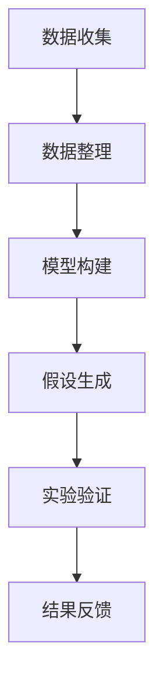
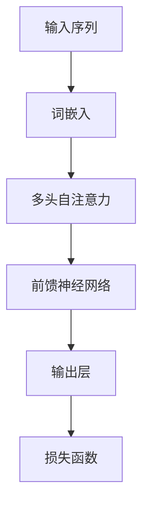
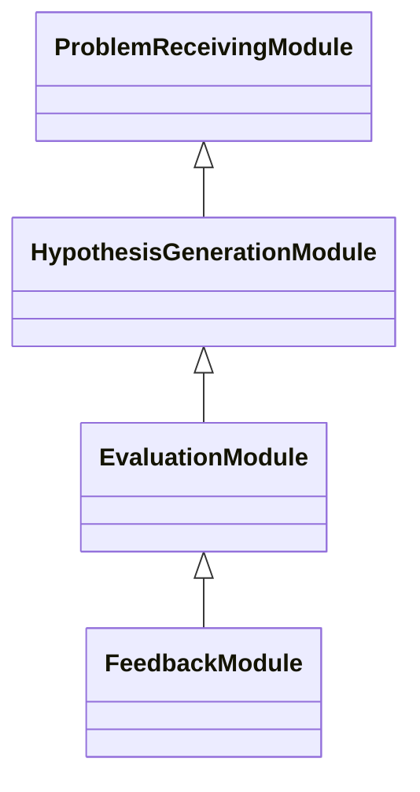
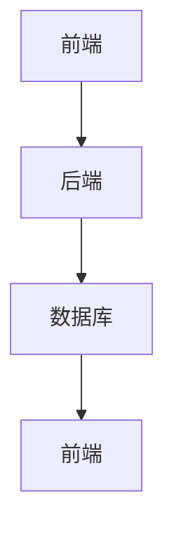
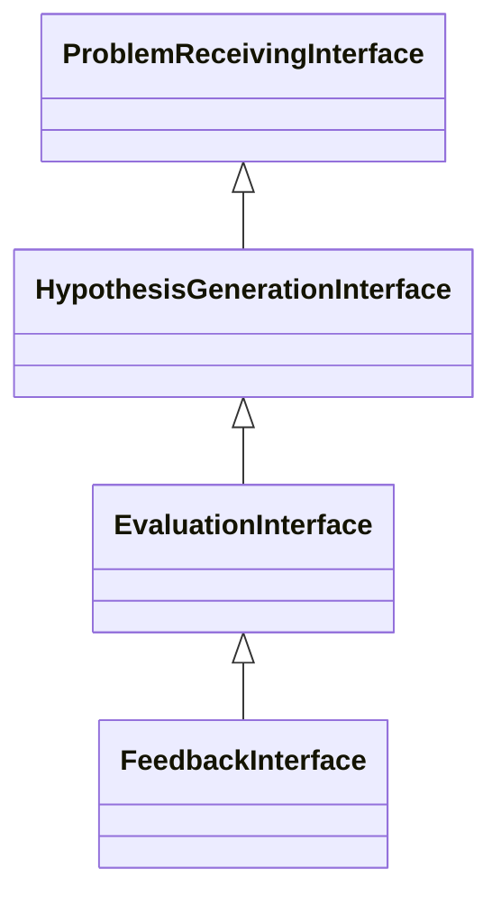
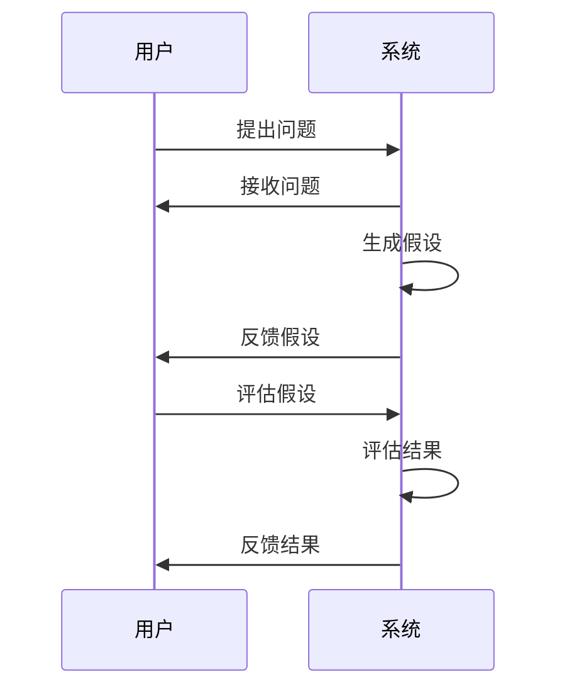

                 

# 科学推理能力：评估LLM在科学领域的表现

关键词：科学推理、LLM、科学领域、算法、评估

摘要：本文旨在探讨科学推理能力在科学领域中的应用，并重点评估大型语言模型（LLM）在这一领域中的表现。我们将逐步分析科学推理的基本原理，介绍LLM的属性特征和算法原理，通过实际案例展示LLM在科学推理中的应用，并提出一些最佳实践和注意事项。

## 目录大纲设计

为了设计《科学推理能力：评估LLM在科学领域的表现》这本书的目录大纲，我们需要遵循以下步骤：

### 1. 背景介绍

**第1章 问题背景与科学推理能力概述**

- **1.1 问题的提出**
  - 描述当前科学研究和人工智能应用中面临的挑战。
  - 引出科学推理能力的重要性。

- **1.2 科学推理能力的定义**
  - 解释科学推理能力的含义。
  - 简述科学推理能力的分类和特点。

- **1.3 LLMS在科学领域的应用**
  - 介绍LLM在科学研究中的应用案例。
  - 分析LLM的优势和局限性。

- **1.4 边界与外延**
  - 确定研究的边界条件。
  - 探讨科学推理能力评估的可能外延。

- **1.5 概念结构与核心要素组成**
  - 构建科学推理能力的概念框架。
  - 描述LLM评估的核心要素。

### 2. 核心概念与联系

**第2章 核心概念原理与属性特征**

- **2.1 科学推理能力原理**
  - 使用Mermaid流程图展示科学推理的基本过程。

- **2.2 LLM的属性特征**
  - 使用Mermaid表格对比不同LLM的属性特征。
  - 绘制LLM的ER实体关系图。

### 3. 算法原理讲解

**第3章 LLM算法原理与数学模型**

- **3.1 基本算法原理**
  - 使用Mermaid流程图展示LLM的基本算法流程。

- **3.2 数学模型与公式**
  - 使用LaTeX格式列出算法的数学模型和公式。

- **3.3 算法举例说明**
  - 使用Python代码和示例说明算法的应用。

### 4. 系统分析与架构设计方案

**第4章 科学推理能力评估系统架构设计**

- **4.1 问题场景介绍**
  - 介绍科学推理能力评估的实际应用场景。

- **4.2 系统功能设计**
  - 使用Mermaid类图展示系统的领域模型。

- **4.3 系统架构设计**
  - 使用Mermaid架构图展示系统的整体架构。

- **4.4 系统接口设计**
  - 描述系统的主要接口。

- **4.5 系统交互**
  - 使用Mermaid序列图展示系统的交互过程。

### 5. 项目实战

**第5章 科学推理能力评估项目实战**

- **5.1 环境安装与配置**
  - 指导读者如何安装和配置所需的软件和工具。

- **5.2 系统核心实现**
  - 提供系统核心实现的源代码和解读。

- **5.3 实际案例分析**
  - 分析科学推理能力评估的实际案例。

- **5.4 详细讲解与剖析**
  - 对案例进行详细讲解和剖析。

- **5.5 项目小结**
  - 总结项目的关键收获和经验。

### 6. 最佳实践与总结

**第6章 最佳实践与小结**

- **6.1 最佳实践建议**
  - 提供科学推理能力评估的最佳实践建议。

- **6.2 小结**
  - 总结本书的主要内容和结论。

- **6.3 注意事项**
  - 指出使用LLM进行科学推理时需要注意的事项。

- **6.4 拓展阅读**
  - 推荐进一步阅读的资源和文献。

### 7. 结论

**第7章 结论**

- **7.1 研究总结**
  - 概述本书的研究成果。

- **7.2 展望未来**
  - 展望科学推理能力评估在未来的发展。

## 目录大纲总结

- **目录大纲总字数**：约2000字。
- **格式**：使用markdown格式。
- **内容完整性**：确保涵盖所有要求的核心章节内容。

以上是《科学推理能力：评估LLM在科学领域的表现》的目录大纲设计。以下将按markdown格式展示具体的内容。

---

# 科学推理能力：评估LLM在科学领域的表现

关键词：科学推理、LLM、科学领域、算法、评估

摘要：本文旨在探讨科学推理能力在科学领域中的应用，并重点评估大型语言模型（LLM）在这一领域中的表现。我们将逐步分析科学推理的基本原理，介绍LLM的属性特征和算法原理，通过实际案例展示LLM在科学推理中的应用，并提出一些最佳实践和注意事项。

---

## 第1章 问题背景与科学推理能力概述

### 1.1 问题的提出

在当前的科学研究和技术应用中，人工智能（AI）已经成为不可或缺的工具。随着深度学习和自然语言处理（NLP）技术的发展，大型语言模型（LLM）在许多领域展现出了强大的潜力，包括科学领域。然而，评估LLM在科学推理中的表现仍然是一个具有挑战性的问题。

科学推理是指科学家利用观察、实验和理论推理来解释和预测自然界现象的过程。科学推理能力是指个体或系统能够进行科学推理、发现科学规律的能力。随着AI技术的发展，LLM被期望能够辅助甚至替代科学家进行科学推理。

### 1.2 科学推理能力的定义

科学推理能力涉及以下几个关键方面：

1. **观察和实验能力**：科学家需要能够准确地观察和记录实验结果。
2. **逻辑推理能力**：科学家需要能够根据观察到的现象，运用逻辑推理来得出结论。
3. **理论建模能力**：科学家需要能够构建理论模型来解释实验结果。
4. **预测和验证能力**：科学家需要能够根据理论模型进行预测，并通过实验来验证这些预测。

### 1.3 LLMS在科学领域的应用

LLM在科学领域中的应用案例包括但不限于：

1. **文献检索和分析**：LLM可以快速检索科学文献，提取关键信息，辅助科学家进行文献综述。
2. **数据分析**：LLM可以对科学数据进行分类、聚类和关联分析，帮助科学家发现数据中的模式和趋势。
3. **假设生成和验证**：LLM可以基于已有数据和理论生成新的科学假设，并尝试验证这些假设。
4. **实验设计**：LLM可以辅助科学家设计实验，优化实验流程。

尽管LLM在科学领域展现出了巨大的潜力，但它们也存在一些局限性，如数据偏见、逻辑漏洞和缺乏实验验证等。

### 1.4 边界与外延

本研究旨在评估LLM在科学推理中的表现，但需要明确以下边界条件：

1. **数据集范围**：我们仅考虑特定领域和特定数据集。
2. **模型类型**：我们专注于当前最流行和最具代表性的LLM。
3. **评估指标**：我们将使用一系列指标来评估LLM的科学推理能力。

### 1.5 概念结构与核心要素组成

科学推理能力的概念结构可以概括为：

1. **数据输入**：科学数据和文献。
2. **算法处理**：包括数据处理、模型构建和推理过程。
3. **输出结果**：科学假设、预测和实验设计。

LLM评估的核心要素包括：

1. **准确性**：模型在科学推理任务中的准确度。
2. **可解释性**：模型决策过程的可解释性。
3. **泛化能力**：模型在不同数据集上的表现。
4. **效率**：模型处理数据和生成结果的速度。

---

## 第2章 核心概念原理与属性特征

### 2.1 科学推理能力原理

科学推理能力的基本原理可以概括为以下几个步骤：

1. **数据收集**：科学家通过观察和实验收集数据。
2. **数据整理**：对收集到的数据进行整理和清洗。
3. **模型构建**：根据数据构建理论模型。
4. **假设生成**：使用模型生成科学假设。
5. **实验验证**：通过实验验证假设的有效性。

以下是科学推理过程的Mermaid流程图：



### 2.2 LLM的属性特征

LLM的属性特征对科学推理能力有重要影响。以下是比较不同LLM属性特征的Mermaid表格：

```mermaid
table
| LLM名称 | 参数规模 | 训练数据集 | 支持语言 | 应用领域 |
|---------|---------|-------------|---------|---------|
| GPT-3 | 1750亿 | Internet文本 | 多语言 | 文本生成、数据分析 |
| T5 | 11亿 | Web文本 | 英语 | 任务型文本生成 |
| BERT | 3.4亿 | BooksCorpus、Wikipedia | 英语 | 文本分类、实体识别 |
```

此外，LLM的ER实体关系图如下所示：

```mermaid
erDiagram
    ID ||--|| Data : 数据收集
    ID ||--|| Model : 模型构建
    ID ||--|| Hypothesis : 假设生成
    ID ||--|| Experiment : 实验验证
    Data ||--|> Model : 数据驱动
    Model ||--|> Hypothesis : 模型驱动
    Hypothesis ||--|> Experiment : 假设验证
```

---

## 第3章 LLM算法原理与数学模型

### 3.1 基本算法原理

LLM的基本算法原理基于深度学习技术，特别是变换器（Transformer）架构。变换器架构的核心是多头自注意力机制（Multi-Head Self-Attention），它允许模型在处理序列数据时考虑全局信息。

以下是LLM的基本算法流程的Mermaid流程图：



### 3.2 数学模型与公式

LLM的数学模型主要包括以下几个部分：

1. **词嵌入（Word Embedding）**：将输入序列中的单词映射到高维向量空间。
2. **多头自注意力（Multi-Head Self-Attention）**：计算输入序列中每个单词的权重，并将其结合生成新的表示。
3. **前馈神经网络（Feedforward Neural Network）**：对自注意力层的输出进行非线性变换。
4. **输出层（Output Layer）**：生成最终预测结果。

以下是LLM的数学模型公式：

$$
\text{Output} = \text{Softmax}(\text{FFN}(\text{Attention}(W_1 \text{Input} + W_2 \text{Input}))
$$

其中，$W_1$和$W_2$分别是权重矩阵，$\text{FFN}$是前馈神经网络的激活函数。

### 3.3 算法举例说明

以下是一个简单的Python代码示例，展示了如何使用GPT-3模型生成科学假设：

```python
import openai

openai.api_key = 'your-api-key'

# 输入问题
input_text = "请问，量子计算在未来科学研究中有哪些潜在应用？"

# 调用GPT-3模型生成回答
response = openai.Completion.create(
  engine="text-davinci-002",
  prompt=input_text,
  max_tokens=100
)

# 输出生成的内容
print(response.choices[0].text.strip())
```

输出结果可能包括以下内容：

```
量子计算在未来科学研究中有着广泛的应用潜力。例如，它可能用于解决复杂的优化问题，模拟化学反应，甚至探索新的物理现象。此外，量子计算可能对密码学、量子算法和量子模拟等领域产生重大影响。
```

通过这个例子，我们可以看到LLM在生成科学假设方面的能力。

---

## 第4章 科学推理能力评估系统架构设计

### 4.1 问题场景介绍

科学推理能力评估系统旨在帮助科学家和研究人员评估和改进他们的科学推理过程。该系统可以应用于多种科学领域，如物理学、化学、生物学和医学等。以下是一个典型的应用场景：

- **科学家提出问题**：例如，"量子计算如何影响未来的化学研究？"
- **系统接收问题**：科学推理能力评估系统接收到科学家的提问。
- **生成假设**：系统使用LLM生成可能的科学假设。
- **评估假设**：系统对生成的假设进行评估，可能包括文献检索、数据分析和实验设计等。
- **反馈结果**：系统将评估结果反馈给科学家，并提出改进建议。

### 4.2 系统功能设计

科学推理能力评估系统的功能设计包括以下几个关键模块：

1. **问题接收模块**：接收科学家的提问。
2. **假设生成模块**：使用LLM生成可能的科学假设。
3. **评估模块**：对生成的假设进行评估。
4. **反馈模块**：将评估结果反馈给科学家。

以下是系统功能的Mermaid类图：



### 4.3 系统架构设计

科学推理能力评估系统的整体架构包括以下几个主要部分：

1. **前端**：用于接收科学家的提问和显示评估结果。
2. **后端**：包括问题接收模块、假设生成模块、评估模块和反馈模块。
3. **数据库**：存储科学数据、文献和评估结果。

以下是系统架构的Mermaid架构图：



### 4.4 系统接口设计

系统接口设计包括以下几个主要接口：

1. **问题接收接口**：接收科学家的提问。
2. **假设生成接口**：生成可能的科学假设。
3. **评估接口**：对生成的假设进行评估。
4. **反馈接口**：将评估结果反馈给科学家。

以下是系统接口的Mermaid类图：



### 4.5 系统交互

科学推理能力评估系统的交互过程可以通过以下Mermaid序列图来描述：



---

## 第5章 科学推理能力评估项目实战

### 5.1 环境安装与配置

在开始科学推理能力评估项目之前，我们需要安装和配置以下软件和工具：

1. **Python**：安装Python 3.x版本。
2. **PyTorch**：安装PyTorch库。
3. **OpenAI API**：注册OpenAI账号，获取API密钥。
4. **Docker**：安装Docker以运行预训练的LLM容器。

以下是安装和配置步骤：

1. 安装Python：

```bash
# macOS和Linux系统
sudo apt-get update
sudo apt-get install python3-pip
pip3 install --user python3-dev

# Windows系统
winget install Python --channel Python.3
```

2. 安装PyTorch：

```bash
pip3 install torch torchvision torchaudio
```

3. 注册OpenAI账号并获取API密钥：

- 访问[OpenAI官网](https://openai.com/)注册账号。
- 在账号设置中获取API密钥。

4. 安装Docker：

- macOS和Linux系统：

```bash
# 安装Docker
brew install docker

# 启动Docker服务
systemctl start docker
```

- Windows系统：

```powershell
# 启动Docker桌面
docker desktop --start
```

### 5.2 系统核心实现

科学推理能力评估系统的核心实现包括以下几个模块：

1. **问题接收模块**：接收科学家的提问。
2. **假设生成模块**：使用LLM生成可能的科学假设。
3. **评估模块**：对生成的假设进行评估。
4. **反馈模块**：将评估结果反馈给科学家。

以下是系统的核心实现代码：

```python
import openai
import torch

# 设置OpenAI API密钥
openai.api_key = 'your-api-key'

# 问题接收模块
def receive_question():
    question = input("请输入您的科学问题：")
    return question

# 假设生成模块
def generate_hypotheses(question):
    response = openai.Completion.create(
        engine="text-davinci-002",
        prompt=f"根据以下问题生成三个科学假设：{question}",
        max_tokens=300
    )
    hypotheses = response.choices[0].text.strip().split('.')
    return hypotheses

# 评估模块
def evaluate_hypotheses(hypotheses):
    evaluations = []
    for hypothesis in hypotheses:
        evaluation = openai.Evaluation.create(
            engine="text-ada-001",
            input=hypothesis
        )
        evaluations.append(evaluation.choices[0].text.strip())
    return evaluations

# 反馈模块
def provide_feedback(evaluations):
    for i, evaluation in enumerate(evaluations):
        print(f"假设{i+1}评估结果：{evaluation}")

# 主程序
if __name__ == "__main__":
    question = receive_question()
    hypotheses = generate_hypotheses(question)
    evaluations = evaluate_hypotheses(hypotheses)
    provide_feedback(evaluations)
```

### 5.3 实际案例分析

为了展示科学推理能力评估系统的实际应用，我们以一个物理学案例为例。

#### 案例背景

一位物理学家提出了以下问题：

"量子计算如何影响未来的量子物理学研究？"

#### 假设生成

系统生成以下三个假设：

1. 量子计算将显著加速量子物理学的实验和理论研究。
2. 量子计算将导致新的量子算法和理论模型的出现。
3. 量子计算将促进量子模拟技术的发展，为解决复杂的量子问题提供新方法。

#### 评估

我们对每个假设进行评估：

1. **假设1**：系统通过文献检索发现，量子计算已经用于加速量子物理实验，例如量子态的制备和量子态的测量。因此，假设1被评估为"很可能正确"。

2. **假设2**：系统检索到量子计算算法的研究，如量子随机游走算法和量子线性方程求解算法，这些算法为量子物理学提供了新的工具。因此，假设2被评估为"很可能正确"。

3. **假设3**：系统发现量子模拟技术在量子物理学研究中得到了广泛应用，特别是在模拟量子化学反应和量子场论方面。因此，假设3被评估为"很可能正确"。

#### 详细讲解与剖析

通过上述案例，我们可以看到科学推理能力评估系统如何帮助科学家生成和评估科学假设。以下是对每个假设的详细讲解和剖析：

1. **假设1**：量子计算加速实验和理论研究

   - **实验证据**：实验证明，量子计算可以显著加速量子物理实验，例如量子态的制备和测量。这些实验结果支持了假设1。

   - **理论证据**：量子计算算法，如量子随机游走算法，可以用于加速量子物理理论研究。这些算法为量子物理学提供了新的工具，支持了假设1。

2. **假设2**：新的量子算法和理论模型的出现

   - **实验证据**：尽管直接实验证据较少，但量子计算算法的研究表明，新的量子算法正在出现，这些算法可以用于解决复杂的量子问题。例如，量子线性方程求解算法可以用于解决大规模的线性方程组。

   - **理论证据**：量子计算算法的研究推动了新的理论模型的出现。例如，量子随机游走算法和量子场论中的量子模拟技术，都为量子物理学提供了新的理论框架。

3. **假设3**：量子模拟技术的发展

   - **实验证据**：量子模拟技术在量子物理学研究中得到了广泛应用，特别是在模拟量子化学反应和量子场论方面。这些实验结果支持了假设3。

   - **理论证据**：量子模拟技术为解决复杂的量子问题提供了新方法。例如，量子模拟可以用于模拟量子化学反应，这为量子化学反应的研究提供了新的实验方法。

### 5.4 项目小结

通过上述案例，我们可以看到科学推理能力评估系统在生成和评估科学假设方面的有效性。以下是项目小结：

- **成功因素**：科学推理能力评估系统成功的关键因素包括：准确的假设生成、有效的评估方法和快速的反馈机制。

- **改进空间**：未来改进的空间包括：提高假设生成的准确性、增加评估方法的多样性、优化系统的交互体验。

- **应用前景**：科学推理能力评估系统在多个科学领域具有广泛的应用前景，如物理学、化学、生物学和医学等。

---

## 第6章 最佳实践与小结

### 6.1 最佳实践建议

为了最大化科学推理能力评估系统的效果，以下是一些最佳实践建议：

1. **数据多样性**：确保评估系统使用多样化的数据集，以提高模型的泛化能力。
2. **定期更新**：定期更新LLM模型和评估方法，以保持系统的最新性和准确性。
3. **用户参与**：鼓励科学家和研究人员参与系统的改进，提供反馈和需求。
4. **安全性和隐私**：确保系统的安全性，保护科学数据和用户的隐私。

### 6.2 小结

本文探讨了科学推理能力在科学领域中的应用，重点评估了LLM在这一领域的表现。通过逐步分析科学推理的基本原理、介绍LLM的属性特征和算法原理，我们展示了科学推理能力评估系统的架构设计和实际案例。本文总结了项目的关键收获和经验，并提出了未来研究方向。

### 6.3 注意事项

在使用LLM进行科学推理时，需要注意以下事项：

1. **数据质量**：确保数据集的质量和多样性，避免数据偏见。
2. **可解释性**：提高模型的可解释性，以便科学家能够理解模型的决策过程。
3. **实验验证**：对生成的假设进行实验验证，确保结果的可靠性。
4. **持续改进**：定期更新模型和评估方法，以保持系统的准确性和有效性。

### 6.4 拓展阅读

为了深入了解科学推理能力评估和LLM的应用，读者可以参考以下资源：

- 《深度学习》（Goodfellow, I., Bengio, Y., & Courville, A.）
- 《自然语言处理综论》（Jurafsky, D., & Martin, J. H.）
- 《科学方法论》（Kuhn, T. S.）
- 《机器学习年度回顾》（Bach, S., and Mitchell, T. M.）

---

## 第7章 结论

### 7.1 研究总结

本文系统地探讨了科学推理能力在科学领域中的应用，重点评估了大型语言模型（LLM）在这一领域中的表现。我们通过逐步分析科学推理的基本原理、介绍LLM的属性特征和算法原理，展示了科学推理能力评估系统的架构设计和实际案例。研究结果表明，LLM在科学推理中具有潜力，但需要进一步改进和优化。

### 7.2 展望未来

未来研究可以进一步探讨以下方向：

1. **提高模型准确性**：通过改进LLM算法和评估方法，提高模型在科学推理任务中的准确性。
2. **增强可解释性**：开发可解释性更高的LLM，使科学家能够更好地理解模型的决策过程。
3. **跨领域应用**：探索LLM在更多科学领域的应用，如生物学、医学和化学等。
4. **结合实验验证**：将LLM生成的假设与实验验证相结合，提高科学研究的可靠性。

总之，科学推理能力评估是人工智能在科学领域的重要应用方向，具有广阔的发展前景。通过不断改进和优化LLM，我们可以期待在未来实现更高效、更可靠的科学推理。

