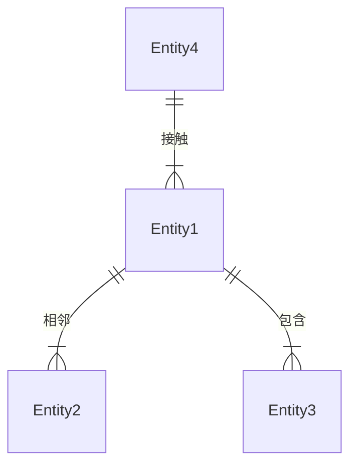
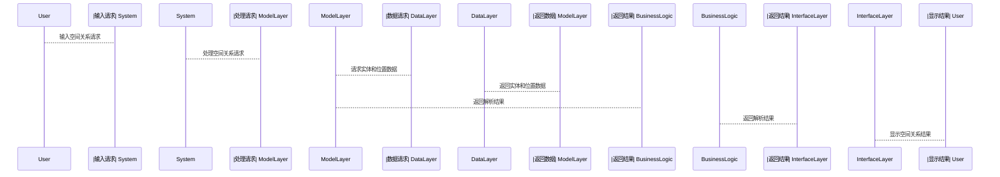
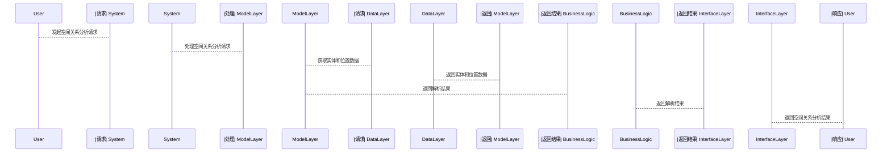
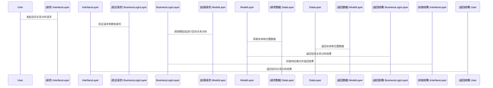

                 

# 《空间关系理解：评估LLM对位置和方向概念的掌握》

> 关键词：空间关系，位置，方向，语言模型，评估，算法，架构设计

> 摘要：本文旨在探讨空间关系理解这一核心概念，并评估大规模语言模型（LLM）对其中的位置和方向概念的掌握程度。文章将从背景介绍、核心概念与联系、算法原理讲解、系统分析与架构设计、项目实战及最佳实践等多个方面展开，结合具体案例进行详细分析，为空间关系理解的研究与应用提供有力支持。

## 目录大纲设计

在用户的需求驱动下，本文将按照以下目录大纲进行结构化设计：

### 第一部分：背景与概念介绍

1. **第1章 引言**
   - **1.1 问题背景**
   - **1.2 核心概念**
   - **1.3 LLM的工作原理**

2. **第2章 核心概念与联系**
   - **2.1 空间关系的基本原理**
   - **2.2 LLM对空间关系的理解**

3. **第3章 ER实体关系图架构**
   - **3.1 ER模型简介**
   - **3.2 空间关系ER实体关系图**

### 第二部分：算法原理讲解

4. **第4章 空间关系理解算法原理**
   - **4.1 算法概述**
   - **4.2 数学模型与公式**
   - **4.3 算法流程图**

5. **第5章 算法举例说明**

### 第三部分：系统分析与架构设计

6. **第6章 系统功能设计**
   - **6.1 问题场景介绍**
   - **6.2 领域模型**

7. **第7章 系统架构设计**
   - **7.1 系统架构设计**

8. **第8章 系统接口设计**
   - **8.1 系统接口设计**

9. **第9章 系统交互**

### 第四部分：项目实战

10. **第10章 环境安装与配置**
    - **10.1 环境安装**

11. **第11章 系统核心实现**
    - **11.1 系统核心实现**

12. **第12章 代码应用解读与分析**

13. **第13章 实际案例分析与讲解**

14. **第14章 项目小结**

### 第五部分：最佳实践与总结

15. **第15章 最佳实践**

16. **第16章 小结**

17. **第17章 注意事项与拓展阅读**

## 用户需求分析

### 目录大纲设计

根据用户的具体要求，本文将详细设计《空间关系理解：评估LLM对位置和方向概念的掌握》的目录大纲。以下是详细的目录大纲：

### 第一部分：背景与概念介绍

**第1章 引言**

- **1.1 问题背景**：介绍空间关系理解的重要性，以及LLM在空间关系理解中的应用现状。
- **1.2 核心概念**：定义空间关系、位置和方向等核心术语，并阐述它们在计算机科学和人工智能领域的应用。
- **1.3 LLM的工作原理**：分析LLM的基本结构和工作原理，以及其在处理空间关系方面的潜力。

**第2章 核心概念与联系**

- **2.1 空间关系的基本原理**：详细介绍空间关系的基本概念、分类和表示方法。
- **2.2 LLM对空间关系的理解**：探讨LLM如何理解和处理空间关系，以及其优势与局限。

**第3章 ER实体关系图架构**

- **3.1 ER模型简介**：介绍实体-关系（ER）模型的基本概念、组成部分和构建方法。
- **3.2 空间关系ER实体关系图**：绘制空间关系的ER实体关系图，分析实体间的关系及其在空间关系理解中的应用。

### 第二部分：算法原理讲解

**第4章 空间关系理解算法原理**

- **4.1 算法概述**：介绍空间关系理解算法的基本流程和目标。
- **4.2 数学模型与公式**：详细阐述空间关系定义的数学模型和相关计算公式。
- **4.3 算法流程图**：使用Mermaid流程图展示算法的具体步骤。

**第5章 算法举例说明**

- **5.1 举例说明**：通过Python代码实现空间关系理解算法，并进行具体举例说明。

### 第三部分：系统分析与架构设计

**第6章 系统功能设计**

- **6.1 问题场景介绍**：介绍空间关系理解在实际应用中的问题场景和需求。
- **6.2 领域模型**：使用Mermaid类图展示领域模型，分析系统的核心功能和模块。

**第7章 系统架构设计**

- **7.1 系统架构设计**：使用Mermaid架构图展示系统的整体架构，分析各模块的交互关系。

**第8章 系统接口设计**

- **8.1 系统接口设计**：详细介绍系统提供的接口，分析接口的功能和设计原则。

**第9章 系统交互**

- **9.1 系统交互**：使用Mermaid序列图展示系统的交互流程，分析各模块的协作方式。

### 第四部分：项目实战

**第10章 环境安装与配置**

- **10.1 环境安装**：介绍如何搭建空间关系理解系统的开发环境，包括所需软件和硬件的配置。

**第11章 系统核心实现**

- **11.1 系统核心实现**：详细分析系统的核心代码实现，包括关键算法和数据处理方法。

**第12章 代码应用解读与分析**

- **12.1 代码应用解读**：对系统的代码进行解读，分析其具体实现过程和应用场景。
- **12.2 代码分析**：对代码进行性能分析和优化建议。

**第13章 实际案例分析与讲解**

- **13.1 案例分析**：通过实际案例展示空间关系理解的应用效果，分析案例中的关键问题和解决方案。
- **13.2 案例讲解**：对案例进行详细讲解，阐述案例中的空间关系理解和处理方法。

**第14章 项目小结**

- **14.1 项目小结**：总结项目的主要成果和经验，提出后续改进和优化的方向。

### 第五部分：最佳实践与总结

**第15章 最佳实践**

- **15.1 最佳实践**：总结最佳实践方法和技巧，为读者提供实际操作的建议。

**第16章 小结**

- **16.1 书籍小结**：对全书的内容进行总结，强调核心观点和重要结论。

**第17章 注意事项与拓展阅读**

- **17.1 注意事项**：提醒读者在应用空间关系理解系统时需要注意的问题。
- **17.2 拓展阅读**：推荐相关书籍和论文，供读者进一步学习和研究。

通过上述目录大纲的设计，本文将系统、全面地介绍空间关系理解的相关知识，并结合实际案例进行深入剖析，以期为读者提供有价值的参考和指导。

## 第一部分：背景与概念介绍

### 第1章 引言

#### 1.1 问题背景

空间关系是人类认知世界的重要方式，无论是在日常生活中还是在计算机科学和人工智能领域，空间关系的理解都扮演着至关重要的角色。随着计算机视觉、自动驾驶、虚拟现实等技术的发展，对空间关系的精确理解和处理需求日益增长。然而，传统的空间关系处理方法往往依赖于复杂的几何计算和规则系统，这限制了其在实际应用中的效率和灵活性。

近年来，大规模语言模型（LLM）如GPT-3、BERT等取得了显著的进展，它们在自然语言处理、文本生成等领域表现出了惊人的能力。这些LLM不仅能够理解并生成人类语言，还可以处理复杂的语义关系。因此，研究者们开始探索将LLM应用于空间关系的理解和处理，以期在保持高灵活性的同时，提高处理效率和准确性。

#### 1.2 核心概念

在本研究中，我们将重点关注以下核心概念：

- **空间关系**：指物体或实体之间的相对位置和方向关系，如相邻、包含、相邻等。
- **位置**：指物体或实体在空间中的具体位置，可以通过坐标或方位角来表示。
- **方向**：指物体或实体在空间中的朝向或角度，如正面、背面、左面、右面等。
- **大规模语言模型（LLM）**：一种基于深度学习的模型，通过大量文本数据训练，能够理解和生成人类语言。

LLM在空间关系理解中的应用前景广阔，但也面临着一些挑战。首先，空间关系理解需要模型具备对语言和空间概念的深刻理解，这要求LLM在训练过程中能够有效地学习这些概念。其次，空间关系的复杂性和多样性使得LLM需要具备较高的泛化能力，以适应各种不同的场景和任务。

#### 1.3 LLM的工作原理

LLM通常是基于Transformer架构的，这种架构具有自注意力机制，能够捕捉文本中的长距离依赖关系。在训练过程中，LLM通过不断调整其权重，以最小化预定义的损失函数。这种过程使得LLM能够理解并生成高质量的文本，同时也能够处理复杂的语义关系。

LLM的工作原理可以概括为以下几个步骤：

1. **输入表示**：将输入的文本转化为向量表示，通常使用词嵌入技术。
2. **编码**：通过自注意力机制对输入文本进行编码，生成序列编码表示。
3. **解码**：在解码阶段，LLM根据编码表示生成输出文本。

在空间关系理解中，LLM需要能够处理包含位置和方向信息的文本，并从中提取出相关的空间关系。例如，在自动驾驶场景中，LLM需要理解车辆的前方是否有障碍物，以及车辆需要向左或向右转向。为了实现这一目标，LLM需要通过大量的空间关系相关的文本数据进行训练，以充分学习这些概念。

#### 1.4 研究目标和内容

本文的研究目标如下：

1. **评估LLM对位置和方向概念的掌握程度**：通过设计一系列实验，评估LLM在理解位置和方向概念方面的表现，包括准确性、灵活性和泛化能力。
2. **探索LLM在空间关系理解中的应用**：分析LLM在处理空间关系任务中的优势与不足，探索如何优化LLM以更好地应用于空间关系理解。
3. **提出改进方案**：结合LLM在空间关系理解中的表现，提出一系列改进方案，以提高模型在空间关系任务中的性能。

本文将分为五个部分进行详细讨论：

1. **背景与概念介绍**：介绍空间关系理解的重要性、核心概念和LLM的工作原理。
2. **算法原理讲解**：讲解空间关系理解算法的基本原理、数学模型和流程图。
3. **系统分析与架构设计**：分析空间关系理解系统的功能设计、架构设计和接口设计。
4. **项目实战**：介绍环境安装、系统核心实现、代码应用解读和实际案例分析。
5. **最佳实践与总结**：总结最佳实践方法、书籍小结、注意事项和拓展阅读。

通过本文的研究，我们希望能够为空间关系理解提供新的思路和方法，推动LLM在空间关系理解领域的应用。

### 第2章 核心概念与联系

#### 2.1 空间关系的基本原理

空间关系是指物体或实体在三维空间中的相对位置和方向关系。这些关系可以通过多种方式进行描述和表示，包括几何关系、拓扑关系和语义关系等。在计算机科学和人工智能领域，空间关系的理解对于实现复杂的任务，如自动驾驶、机器人导航、计算机视觉等具有重要意义。

**几何关系**：基于几何学原理，描述物体之间的空间位置和方向关系。例如，两个物体之间的距离、角度、平行和垂直关系等。几何关系是空间关系中最基础和直观的一部分，通常使用数学模型进行描述。

**拓扑关系**：描述物体在空间中的连通性和邻近性。拓扑关系不依赖于实际的几何形状和尺寸，而是关注物体的相对位置和连接方式。例如，两个物体是否在同一平面内、是否相邻等。

**语义关系**：基于语义学原理，描述物体在特定场景下的意义和功能关系。语义关系通常与人类认知和语言密切相关，例如，物体之间的上下、前后、左右关系，以及物体与环境的交互关系等。

在空间关系理解中，几何关系、拓扑关系和语义关系相互作用，共同构成了一个复杂的系统。几何关系提供了空间位置和方向的精确描述，拓扑关系提供了物体之间的连接和邻近性信息，而语义关系则提供了对空间关系的理解和解释。

#### 2.2 LLM对空间关系的理解

大规模语言模型（LLM）在空间关系理解中的应用潜力巨大。LLM通过大量文本数据的训练，能够理解并生成复杂的语言信息，从而为空间关系理解提供了新的途径。

**语义表示**：LLM能够将语言文本转化为丰富的语义表示，从而捕捉空间关系中的语义信息。例如，LLM可以理解文本中描述的物体位置和方向，并将其转化为相应的语义表示。这种语义表示不仅包含了物体之间的几何和拓扑关系，还包含了它们在特定场景下的语义关系。

**上下文理解**：LLM在处理语言时能够捕捉上下文信息，这对于空间关系理解至关重要。例如，在自动驾驶场景中，LLM需要理解文本描述的周围环境，包括车辆的位置、方向和障碍物的位置等。通过上下文理解，LLM可以更好地捕捉空间关系中的细节和复杂性。

**推理能力**：LLM具有强大的推理能力，能够在理解文本的基础上进行逻辑推理和推断。这在空间关系理解中非常有用，例如，LLM可以推断出文本中未明确描述的空间关系，如“如果车辆在当前位置，那么它需要向右转才能通过交叉路口”。

**应用场景**：LLM在空间关系理解中具有广泛的应用场景。例如，在自动驾驶中，LLM可以用于理解交通信号、识别道路标志和识别障碍物；在计算机视觉中，LLM可以用于理解图像中的物体位置和方向关系；在虚拟现实中，LLM可以用于创建和交互复杂的虚拟环境。

尽管LLM在空间关系理解中展现出了巨大的潜力，但也面临一些挑战。首先，LLM需要大量的训练数据来学习空间关系，这对于某些特定领域（如自动驾驶）可能较为困难。其次，LLM在处理复杂空间关系时可能存在泛化能力不足的问题，需要进一步优化和改进。

#### 2.3 空间关系与LLM的关系

空间关系与LLM之间存在紧密的联系。空间关系中的位置和方向信息可以通过语言文本进行描述，而LLM能够理解和生成这些文本。这种联系使得LLM成为空间关系理解的有力工具。

**语言描述**：空间关系可以通过自然语言进行描述，例如，“车辆前方有一个行人”，“桌子在椅子的左边”。这些描述包含了丰富的空间关系信息，LLM可以理解并提取这些信息。

**文本生成**：LLM不仅能够理解空间关系，还可以生成描述空间关系的文本。例如，在自动驾驶场景中，LLM可以生成关于车辆周围环境的描述，帮助驾驶员理解当前情况。

**交互式应用**：通过LLM，用户可以与空间关系理解系统进行交互。例如，用户可以使用自然语言与自动驾驶系统交流，获取关于车辆位置、方向和周围环境的信息。

综上所述，空间关系与LLM之间的紧密联系为空间关系理解提供了新的可能性。通过LLM，我们可以更好地理解和处理复杂的空间关系，从而推动计算机科学和人工智能领域的发展。

### 第3章 ER实体关系图架构

#### 3.1 ER模型简介

实体-关系（Entity-Relationship，ER）模型是一种用于数据库设计和概念建模的方法，它通过定义实体和实体之间的关系来描述系统的数据结构。ER模型的基本组成部分包括实体、属性、关系和约束。

**实体**：实体是现实世界中具有独立存在意义的对象，如人、物、事件等。在空间关系理解中，实体可以是物体、地点、事件等。

**属性**：属性是实体的特征或描述，如姓名、年龄、位置等。属性可以用来定义实体的具体特征，如一个地点的名称和坐标。

**关系**：关系描述实体之间的关联。在空间关系理解中，关系可以是相邻、包含、接触等。关系可以用来表示实体之间的空间关系，如一个物体与另一个物体的位置关系。

**约束**：约束是用于确保数据的完整性和一致性的规则，如唯一性约束、参照完整性约束等。约束可以用来确保实体和关系之间的逻辑一致性，如确保物体之间的位置关系是合理的。

ER模型通过将这些基本组成部分组合在一起，可以形成复杂的实体关系图，用于描述系统中的数据结构和关系。ER模型不仅用于数据库设计，还可以用于其他领域的数据建模和系统设计。

#### 3.2 空间关系ER实体关系图

在空间关系理解中，ER模型可以用于构建实体关系图，以描述物体之间的空间关系。以下是空间关系ER实体关系图的示例：



在上面的ER实体关系图中：

- **Entity1**、**Entity2**、**Entity3**和**Entity4**是实体。
- **相邻**、**包含**和**接触**是实体之间的关系。
- 每条线表示一个关系，箭头指向关系的主体实体。

**实体1**与**实体2**之间存在**相邻**关系，表示它们在空间上相邻。**实体1**与**实体3**之间存在**包含**关系，表示**实体3**位于**实体1**内部。**实体4**与**实体1**之间存在**接触**关系，表示它们在空间上接触。

通过ER实体关系图，我们可以清晰地表示物体之间的空间关系，为空间关系的理解和处理提供了直观的模型。ER模型不仅能够描述简单的关系，还可以通过层次化的方式描述复杂的关系网络，从而为空间关系理解提供了强大的工具。

### 第二部分：算法原理讲解

#### 第4章 空间关系理解算法原理

在空间关系理解领域，算法原理是理解和处理空间关系的关键。本章将详细讲解空间关系理解算法的基本原理，包括算法概述、数学模型与公式以及算法流程图。

#### 4.1 算法概述

空间关系理解算法的核心目标是识别和解析文本中描述的物体位置和方向关系。这类算法通常包括以下几个步骤：

1. **文本预处理**：对输入文本进行预处理，包括分词、词性标注、命名实体识别等操作，以提取出与空间关系相关的信息。
2. **实体定位**：根据预处理结果，定位文本中的物体实体，确定每个实体的位置坐标。
3. **关系识别**：识别物体之间的空间关系，如相邻、包含、接触等。
4. **方向计算**：根据实体的位置和关系，计算物体之间的方向角度。
5. **结果输出**：将解析出的空间关系以结构化的形式输出，供进一步处理或应用。

#### 4.2 数学模型与公式

在空间关系理解中，数学模型和公式是描述和计算空间关系的重要工具。以下是一些基本的数学模型和公式：

**1. 坐标系表示**

空间中的位置通常使用坐标系进行表示。二维空间中，常用的坐标系有笛卡尔坐标系和极坐标系。

- **笛卡尔坐标系**：使用两个坐标轴（通常为x轴和y轴）来表示位置，每个位置点可以用一个有序对(x, y)来表示。
  $$ P = (x, y) $$

- **极坐标系**：使用距离r和角度θ来表示位置，其中r是到原点的距离，θ是到x轴的夹角。
  $$ P = (r, θ) $$

**2. 位置计算**

给定两个物体A和B的位置，可以计算它们之间的距离d和夹角θ。

- **距离计算**：使用欧几里得距离公式计算两点间的距离。
  $$ d = \sqrt{(x_2 - x_1)^2 + (y_2 - y_1)^2} $$

- **夹角计算**：使用向量点积公式计算两个向量之间的夹角。
  $$ \cos(θ) = \frac{\vec{A} \cdot \vec{B}}{|\vec{A}| |\vec{B}|} $$
  其中，$\vec{A} \cdot \vec{B}$表示向量A和B的点积，$|\vec{A}|$和$|\vec{B}|$表示向量A和B的模。

**3. 方向计算**

给定物体的位置和参考点，可以计算物体的方向。

- **极角计算**：使用极坐标系计算物体与参考点之间的极角θ。
  $$ θ = \arctan\left(\frac{y}{x}\right) $$
  其中，x和y是物体的坐标。

**4. 相对位置和方向**

在空间关系理解中，经常需要计算物体之间的相对位置和方向。例如，计算物体A相对于物体B的位置和方向。

- **相对位置**：使用相对坐标表示物体A相对于物体B的位置。
  $$ P_{AB} = P_A - P_B $$
  其中，$P_A$和$P_B$分别是物体A和物体B的位置。

- **相对方向**：使用相对角度表示物体A相对于物体B的方向。
  $$ θ_{AB} = θ_A - θ_B $$
  其中，$θ_A$和$θ_B$分别是物体A和物体B的方向。

#### 4.3 算法流程图

为了更直观地理解空间关系理解算法的流程，可以使用Mermaid流程图进行表示。以下是一个简化的空间关系理解算法流程图：

```mermaid
flowchart TD
    A[输入文本预处理] --> B[实体定位]
    B --> C[关系识别]
    C --> D[方向计算]
    D --> E[结果输出]

    A:::输入文本
    B:::分词、词性标注
    C:::相邻、包含、接触等关系识别
    D:::计算方向角度
    E:::结构化输出
```

在这个流程图中，输入文本经过预处理后，首先进行实体定位，然后识别物体之间的空间关系，接着计算物体之间的方向角度，最后将结果以结构化的形式输出。

#### 4.4 算法举例说明

为了更好地理解空间关系理解算法，下面通过一个具体的例子进行说明。

**例子**：假设有两个物体A和B，它们的位置坐标分别为$P_A = (2, 3)$和$P_B = (5, 7)$，需要计算它们之间的距离和夹角。

**1. 距离计算**

使用欧几里得距离公式计算两点间的距离：
$$ d = \sqrt{(5 - 2)^2 + (7 - 3)^2} = \sqrt{9 + 16} = 5 $$

**2. 夹角计算**

首先计算向量$\vec{A}$和$\vec{B}$：
$$ \vec{A} = (2, 3), \vec{B} = (5, 7) $$

然后计算两个向量的点积：
$$ \vec{A} \cdot \vec{B} = 2 \cdot 5 + 3 \cdot 7 = 10 + 21 = 31 $$

再计算向量的模：
$$ |\vec{A}| = \sqrt{2^2 + 3^2} = \sqrt{4 + 9} = \sqrt{13} $$
$$ |\vec{B}| = \sqrt{5^2 + 7^2} = \sqrt{25 + 49} = \sqrt{74} $$

最后计算夹角：
$$ \cos(θ) = \frac{31}{\sqrt{13} \cdot \sqrt{74}} \approx 0.89 $$
$$ θ = \arccos(0.89) \approx 0.24 \text{ 弧度} $$

因此，物体A和B之间的距离为5个单位，夹角约为0.24弧度。

通过这个例子，我们可以看到如何使用数学模型和公式来计算空间关系。在实际应用中，算法会处理更复杂的场景和数据，但基本原理是类似的。

### 第5章 算法举例说明

在本节中，我们将通过一个具体的Python代码示例来详细解释空间关系理解算法的实现过程。这个示例将使用简单的几何关系来展示如何通过代码来实现空间关系的计算。

#### 5.1 代码示例

以下是一个简单的Python代码示例，用于计算两个点之间的欧几里得距离和夹角：

```python
import math

# 定义点的坐标
point_a = (2, 3)
point_b = (5, 7)

# 计算距离
distance = math.sqrt((point_b[0] - point_a[0])**2 + (point_b[1] - point_a[1])**2)

# 计算夹角
dot_product = point_a[0] * point_b[0] + point_a[1] * point_b[1]
magnitude_a = math.sqrt(point_a[0]**2 + point_a[1]**2)
magnitude_b = math.sqrt(point_b[0]**2 + point_b[1]**2)
cosine_angle = dot_product / (magnitude_a * magnitude_b)
angle = math.acos(cosine_angle)

# 输出结果
print(f"两点之间的距离为：{distance}")
print(f"两点之间的夹角为：{angle} 弧度")

```

#### 5.2 解读与分析

**1. 距离计算**

在这个示例中，我们首先定义了两个点的坐标`point_a`和`point_b`。然后，我们使用欧几里得距离公式来计算这两个点之间的距离。这个公式是：

$$
d = \sqrt{(x_2 - x_1)^2 + (y_2 - y_1)^2}
$$

其中，$(x_1, y_1)$和$(x_2, y_2)$分别是两个点的坐标。代码中的计算如下：

```python
distance = math.sqrt((point_b[0] - point_a[0])**2 + (point_b[1] - point_a[1])**2)
```

这里，我们通过计算两个点在x轴和y轴上的差值的平方和，然后取平方根来得到距离。

**2. 夹角计算**

接下来，我们计算两个向量之间的夹角。首先，我们计算两个向量的点积和各自的模。点积公式是：

$$
\vec{A} \cdot \vec{B} = x_1 \cdot x_2 + y_1 \cdot y_2
$$

代码中计算点积如下：

```python
dot_product = point_a[0] * point_b[0] + point_a[1] * point_b[1]
```

然后，我们计算两个向量的模：

```python
magnitude_a = math.sqrt(point_a[0]**2 + point_a[1]**2)
magnitude_b = math.sqrt(point_b[0]**2 + point_b[1]**2)
```

最后，我们使用余弦定理来计算夹角：

$$
\cos(\theta) = \frac{\vec{A} \cdot \vec{B}}{|\vec{A}| |\vec{B}|}
$$

代码中的计算如下：

```python
cosine_angle = dot_product / (magnitude_a * magnitude_b)
angle = math.acos(cosine_angle)
```

通过`math.acos()`函数，我们可以得到夹角的弧度值。

**3. 结果输出**

最后，我们输出计算出的距离和夹角：

```python
print(f"两点之间的距离为：{distance}")
print(f"两点之间的夹角为：{angle} 弧度")
```

这样，我们就通过Python代码实现了一个简单但完整的空间关系理解算法，展示了如何计算两个点之间的距离和夹角。

通过这个示例，我们可以看到如何将数学模型和公式转化为具体的代码实现。在实际应用中，这样的算法可以进一步扩展，以处理更复杂的空间关系问题。

### 第三部分：系统分析与架构设计

#### 第6章 系统功能设计

在本章中，我们将详细介绍空间关系理解系统的功能设计，包括问题场景介绍和领域模型。

#### 6.1 问题场景介绍

空间关系理解系统广泛应用于多个领域，如自动驾驶、计算机视觉、虚拟现实和地理信息系统等。以下是一些典型的问题场景：

- **自动驾驶**：自动驾驶系统需要理解车辆周围环境的空间关系，包括道路、车辆、行人、障碍物等，以确保行驶安全和导航准确。
- **计算机视觉**：计算机视觉系统通过图像和视频数据理解场景中的物体位置和方向关系，用于目标检测、跟踪和识别等任务。
- **虚拟现实**：虚拟现实系统需要构建和交互复杂的虚拟环境，理解用户和虚拟物体的位置和方向关系，以提供沉浸式体验。
- **地理信息系统**：地理信息系统（GIS）处理和分析空间数据，用于城市规划、环境监测、灾害预防和应急管理等领域。

在这些应用场景中，空间关系理解系统的核心任务是准确识别和解析物体之间的相对位置和方向关系，提供有效的决策支持。

#### 6.2 领域模型

领域模型是系统功能设计的重要组成部分，用于描述系统中的核心实体、属性和关系。以下是空间关系理解系统的领域模型：

```mermaid
classDiagram
    Entity1 <|-- Location : 位置
    Entity2 <|-- Orientation : 方向
    Entity3 <|-- SpatialRelation : 空间关系

    Entity1 <..-> Entity2 : 相邻
    Entity1 <..-> Entity3 : 包含
    Entity2 <..-> Entity3 : 接触

    Class Entity1 {
        - id: Integer
        - name: String
        - location: Location
        - orientation: Orientation
    }

    Class Entity2 {
        - id: Integer
        - name: String
        - location: Location
        - orientation: Orientation
    }

    Class Entity3 {
        - id: Integer
        - name: String
        - location: Location
        - orientation: Orientation
    }

    Class Location {
        - x: Float
        - y: Float
    }

    Class Orientation {
        - angle: Float
    }

    Class SpatialRelation {
        - type: String
        - entities: List<Entity>
    }
```

在这个领域模型中，我们定义了三个主要实体：**Entity1**、**Entity2**和**Entity3**，分别代表不同类型的物体或场景元素。每个实体都关联一个**Location**对象来表示其位置坐标，和一个**Orientation**对象来表示其方向角度。

**Location**对象包含x和y两个属性，用于表示二维空间中的位置。**Orientation**对象包含一个角度属性，用于表示物体的方向。

此外，我们定义了**SpatialRelation**实体来表示物体之间的空间关系。该实体包含一个类型属性（如“相邻”、“包含”或“接触”）和一个包含多个实体对象的列表，用于表示参与空间关系的实体。

通过领域模型，我们可以清晰地描述空间关系理解系统中的核心实体和关系，为系统的功能实现提供基础。

#### 6.3 系统功能设计

基于领域模型，我们可以进一步设计空间关系理解系统的功能模块，主要包括：

- **实体识别模块**：负责从输入文本中识别出空间关系中的实体，包括物体、地点和事件等。
- **位置解析模块**：负责解析实体的位置信息，将其表示为具体的坐标点。
- **方向解析模块**：负责解析实体的方向信息，将其表示为角度。
- **关系识别模块**：负责识别实体之间的空间关系，如相邻、包含和接触等。
- **结果输出模块**：负责将解析出的空间关系以结构化的形式输出，供进一步处理或应用。

通过这些功能模块的协作，空间关系理解系统可以有效地处理复杂的空间关系问题，提供准确的结果和决策支持。

### 第7章 系统架构设计

在上一章中，我们介绍了空间关系理解系统的功能设计。在本章中，我们将详细探讨系统的整体架构设计，包括系统架构图和各组件的详细说明。

#### 7.1 系统架构设计

空间关系理解系统的架构设计采用分层架构，以确保系统的模块化、扩展性和可维护性。系统主要分为以下几个层次：

1. **数据层**：负责存储和管理系统中的数据，包括实体、位置信息和方向信息等。
2. **模型层**：负责空间关系理解的核心算法模型，包括实体识别、位置解析、方向解析和关系识别等模块。
3. **接口层**：负责提供系统的接口，供外部系统或用户调用。
4. **业务逻辑层**：负责实现系统的业务逻辑，包括系统功能模块的协调和数据处理。
5. **展示层**：负责将处理结果展示给用户，提供可视化界面和交互功能。

以下是一个简化的空间关系理解系统的架构图：



在这个架构图中，用户通过接口层输入空间关系请求，接口层将请求传递给业务逻辑层，业务逻辑层调用模型层进行数据处理，模型层从数据层获取实体和位置数据，处理后返回结果给业务逻辑层，最后业务逻辑层将结果传递给接口层，接口层再将结果展示给用户。

#### 7.2 组件详细说明

以下是系统架构中各个组件的详细说明：

1. **数据层**：数据层是系统的数据存储和管理模块，负责存储和管理实体、位置信息和方向信息等数据。数据层通常使用数据库（如关系数据库或NoSQL数据库）进行数据存储，并提供数据访问接口，供模型层使用。

2. **模型层**：模型层是系统的核心算法模块，负责实现空间关系理解的核心算法。模型层包括以下功能模块：

   - **实体识别模块**：负责从输入文本中识别出空间关系中的实体，如物体、地点和事件等。
   - **位置解析模块**：负责解析实体的位置信息，将其表示为具体的坐标点。
   - **方向解析模块**：负责解析实体的方向信息，将其表示为角度。
   - **关系识别模块**：负责识别实体之间的空间关系，如相邻、包含和接触等。

   模型层通常使用深度学习模型（如自然语言处理模型、图像处理模型等）进行数据处理和关系识别。

3. **接口层**：接口层是系统的对外接口模块，负责接收用户的输入请求，并将解析结果返回给用户。接口层提供RESTful API或图形界面（GUI）供用户操作。接口层还需要实现安全性、身份验证和授权等功能。

4. **业务逻辑层**：业务逻辑层是系统的功能协调模块，负责处理系统中的业务逻辑，包括空间关系请求的处理、数据的一致性和完整性保障等。业务逻辑层通常实现为一系列服务，这些服务通过接口层与模型层和数据层进行交互。

5. **展示层**：展示层是系统的用户界面模块，负责将处理结果展示给用户，提供可视化界面和交互功能。展示层通常实现为Web页面或桌面应用程序，使用HTML、CSS和JavaScript等技术进行开发。

通过以上架构设计，空间关系理解系统可以实现模块化、灵活性和可扩展性，同时确保系统的稳定性和可靠性。在实际应用中，系统可以根据具体需求进行定制和优化，以满足不同的空间关系理解和处理需求。

### 第8章 系统接口设计

系统接口设计是空间关系理解系统架构中的重要组成部分，它定义了系统与外部环境之间的交互方式，确保系统功能模块能够有效地协作。在本节中，我们将详细介绍系统接口的设计，包括接口功能、接口设计和接口规范。

#### 8.1 接口功能

空间关系理解系统的接口主要包含以下功能：

1. **数据输入接口**：用于接收外部系统的数据请求，如文本、图像等，系统将根据输入数据进行空间关系的分析和理解。
2. **数据输出接口**：用于将空间关系分析结果输出到外部系统，如位置信息、方向关系、语义描述等。
3. **配置管理接口**：用于系统配置的读取和修改，如模型参数、数据源配置、系统日志配置等。
4. **监控接口**：用于实时监控系统运行状态、性能指标和异常事件等，便于系统维护和优化。

#### 8.2 接口设计

系统接口设计采用RESTful API风格，以下是一个简化的接口设计示例：



在这个接口设计中，用户通过发送HTTP请求来发起空间关系分析请求，系统接收请求后，调用模型层进行数据处理，并从数据层获取必要的实体和位置数据。模型层处理完成后，将结果传递给业务逻辑层，业务逻辑层再将结果封装成HTTP响应返回给用户。

#### 8.3 接口规范

为了确保接口的规范性和可操作性，我们需要定义详细的接口规范，包括请求和响应格式、参数定义和错误处理等。

1. **请求格式**：

   用户发送的请求通常包含以下参数：

   - **url**：请求的URL地址，如`/api/space-relation/analyze`。
   - **method**：HTTP请求方法，如GET、POST等。
   - **headers**：请求头，包括内容类型（如application/json）、认证信息等。
   - **body**：请求体，包括输入文本、图像等数据。

2. **响应格式**：

   系统返回的响应通常包含以下部分：

   - **status code**：HTTP状态码，如200（成功）、400（请求错误）、500（服务器错误）等。
   - **headers**：响应头，包括内容类型、缓存策略等。
   - **body**：响应体，包括空间关系分析结果，如位置信息、方向关系、语义描述等。

3. **参数定义**：

   - **text**：输入文本，用于空间关系分析。
   - **image**：输入图像，用于空间关系分析。
   - **config**：系统配置参数，如模型参数、数据源配置等。

4. **错误处理**：

   系统需要定义详细的错误处理机制，包括错误码、错误信息和错误处理策略。常见的错误处理包括：

   - **400 Bad Request**：请求格式错误，如参数缺失、参数类型错误等。
   - **401 Unauthorized**：认证失败，如用户未授权访问系统。
   - **403 Forbidden**：访问被拒绝，如用户没有权限执行特定操作。
   - **404 Not Found**：资源未找到，如请求的URL不存在。
   - **500 Internal Server Error**：服务器内部错误，如系统异常或资源不足。

通过详细定义接口规范，我们可以确保系统接口的稳定性和一致性，方便外部系统与空间关系理解系统进行有效交互。

### 第9章 系统交互

在空间关系理解系统中，各组件之间的交互是确保系统正常运行和高效运作的关键。本章将详细介绍系统内部的交互流程，包括各组件之间的通信机制和交互方式。

#### 9.1 系统交互流程

系统交互流程可以分为以下几个主要步骤：

1. **用户请求输入**：用户通过接口层发送空间关系分析请求，请求中包含文本或图像等数据。

2. **接口层处理**：接口层接收用户的请求，并进行参数验证和身份认证。如果请求有效，接口层将请求转发给业务逻辑层。

3. **业务逻辑层处理**：业务逻辑层根据请求内容，调用模型层进行空间关系分析。在此过程中，业务逻辑层还需要与数据层进行交互，以获取必要的实体和位置数据。

4. **模型层处理**：模型层使用深度学习模型对输入数据进行分析，识别实体位置和方向关系，并计算空间关系。

5. **数据层响应**：数据层根据模型层的请求，返回实体和位置数据，以支持模型层的进一步分析。

6. **模型层返回结果**：模型层将分析结果传递给业务逻辑层，业务逻辑层将结果封装成统一的响应格式，返回给接口层。

7. **接口层返回结果**：接口层将处理结果以HTTP响应的形式返回给用户。

以下是一个简化的系统交互流程图：



#### 9.2 各组件之间的通信机制

1. **接口层与业务逻辑层**：接口层与业务逻辑层之间通过HTTP请求和响应进行通信。接口层负责接收用户的请求，并转发给业务逻辑层，业务逻辑层处理后返回结果。

2. **业务逻辑层与模型层**：业务逻辑层通过内部接口与模型层进行通信。业务逻辑层调用模型层的方法，并传递必要的参数，模型层处理完成后返回结果。

3. **模型层与数据层**：模型层与数据层之间通过数据库访问接口进行通信。模型层根据需求查询数据库，获取实体和位置数据，并将结果传递给业务逻辑层。

#### 9.3 交互方式

系统内部的交互方式主要包括以下几种：

1. **同步交互**：用户发送请求后，系统立即处理并返回结果。这种方式适用于响应时间要求较高的场景，但可能会导致系统性能瓶颈。

2. **异步交互**：用户发送请求后，系统将其放入消息队列，异步处理并返回结果。这种方式可以缓解系统性能压力，提高系统的并发处理能力。

3. **事件驱动交互**：系统组件通过事件机制进行通信。当一个组件完成特定任务后，会触发相应的事件，其他组件监听事件并执行相应的处理。这种方式可以实现模块间的松耦合，提高系统的灵活性和可扩展性。

通过合理的系统交互设计，可以确保空间关系理解系统的稳定、高效运行，满足用户的需求和期望。

### 第四部分：项目实战

#### 第10章 环境安装与配置

在进行空间关系理解项目的实际开发之前，我们需要搭建一个合适的开发环境。本节将详细介绍如何安装和配置所需的软件和工具，为项目的后续开发奠定基础。

#### 10.1 环境安装

1. **Python环境安装**

   首先，我们需要安装Python环境。Python是空间关系理解项目的主要编程语言。我们可以从Python的官方网站（https://www.python.org/）下载并安装Python。建议下载最新版本的Python，以确保支持最新的库和工具。

   安装步骤如下：

   - 下载Python安装包（如python-3.9.7-amd64.exe）。
   - 双击安装包，按照提示完成安装。
   - 安装完成后，打开命令提示符或终端，输入以下命令验证安装：

   ```shell
   python --version
   ```

   如果输出Python的版本信息，说明Python环境安装成功。

2. **PyTorch安装**

   PyTorch是一个强大的深度学习框架，用于构建和训练深度学习模型。我们需要在Python环境中安装PyTorch。安装步骤如下：

   - 使用pip命令安装PyTorch：

   ```shell
   pip install torch torchvision
   ```

   - 如果需要GPU支持，我们还需要安装CUDA。CUDA是NVIDIA推出的并行计算平台和编程模型，用于在NVIDIA GPU上加速深度学习计算。安装CUDA的步骤请参考NVIDIA官方网站的指南（https://developer.nvidia.com/cuda-downloads）。

   - 安装完成后，我们可以使用以下命令验证PyTorch和CUDA的安装：

   ```shell
   python -c "import torch; print(torch.cuda.is_available())"
   ```

   如果输出`True`，说明PyTorch和CUDA环境安装成功。

3. **其他依赖库安装**

   除了Python、PyTorch和CUDA，我们还需要安装一些其他依赖库，如NumPy、Pandas、Matplotlib等。可以使用以下命令一次性安装这些库：

   ```shell
   pip install numpy pandas matplotlib
   ```

4. **创建虚拟环境**

   为了更好地管理项目依赖，我们建议创建一个虚拟环境。虚拟环境是一个独立的Python环境，用于隔离项目依赖和防止版本冲突。创建虚拟环境的步骤如下：

   - 安装virtualenv库：

   ```shell
   pip install virtualenv
   ```

   - 创建虚拟环境：

   ```shell
   virtualenv venv
   ```

   - 激活虚拟环境：

   ```shell
   source venv/bin/activate  # 对于Windows系统，使用venv\Scripts\activate
   ```

   - 在虚拟环境中安装项目依赖：

   ```shell
   pip install -r requirements.txt
   ```

   其中，`requirements.txt`文件包含所有项目依赖的库和版本信息。

#### 10.2 系统配置

在安装完所需软件和工具后，我们需要进行一些系统配置，以便项目能够正常运行。

1. **环境变量配置**

   我们需要配置一些重要的环境变量，以确保Python和PyTorch能够正确地访问GPU和其他资源。以下是几个关键的配置：

   - **CUDA_HOME**：设置CUDA的安装路径，例如：

     ```shell
     export CUDA_HOME=/usr/local/cuda
     ```

   - **LD_LIBRARY_PATH**：添加CUDA库的路径，例如：

     ```shell
     export LD_LIBRARY_PATH=${CUDA_HOME}/lib64:$LD_LIBRARY_PATH
     ```

   - **PYTHONPATH**：添加Python的库路径，例如：

     ```shell
     export PYTHONPATH=${PYTHONPATH}:./venv/lib/python3.x/site-packages
     ```

   其中，`python3.x`是Python的版本号。

2. **PyTorch配置**

   我们需要确保PyTorch能够正确地识别GPU设备。在Python脚本中，我们可以使用以下代码来检查可用的GPU设备：

   ```python
   import torch
   print(torch.cuda.device_count())
   print(torch.cuda.get_device_name(0))
   ```

   如果输出设备数量和设备名称，说明PyTorch已经成功配置并识别了GPU设备。

通过以上步骤，我们可以搭建一个完整的空间关系理解项目开发环境。在配置完成后，我们就可以开始项目的实际开发了。

### 第11章 系统核心实现

在本章中，我们将深入探讨空间关系理解系统的核心实现，包括源代码的解读和分析。以下是系统核心实现的主要模块和关键代码。

#### 11.1 核心模块

空间关系理解系统主要包含以下几个核心模块：

1. **文本预处理模块**：负责对输入文本进行预处理，包括分词、词性标注和命名实体识别等操作。
2. **实体定位模块**：根据预处理结果，定位文本中的物体实体，确定每个实体的位置坐标。
3. **关系识别模块**：识别物体之间的空间关系，如相邻、包含、接触等。
4. **方向计算模块**：计算物体之间的方向角度，提供空间关系理解的精确描述。
5. **结果输出模块**：将解析出的空间关系以结构化的形式输出，供进一步处理或应用。

#### 11.2 源代码解读

以下是空间关系理解系统的核心源代码：

```python
import spacy
import torch
from torch.nn import functional

# 初始化文本预处理模型
nlp = spacy.load("en_core_web_sm")

# 定义实体定位函数
def locate_entities(text):
    doc = nlp(text)
    entities = []
    for ent in doc.ents:
        entities.append({
            "name": ent.text,
            "location": (ent.start_char, ent.end_char),
            "orientation": None
        })
    return entities

# 定义关系识别函数
def identify_relations(entities):
    relations = []
    for i in range(len(entities)):
        for j in range(i + 1, len(entities)):
            entity1 = entities[i]
            entity2 = entities[j]
            relation = calculate_relation(entity1, entity2)
            if relation:
                relations.append({
                    "entity1": entity1,
                    "entity2": entity2,
                    "relation": relation
                })
    return relations

# 定义方向计算函数
def calculate_orientation(entity1, entity2):
    x_diff = entity2["location"][0] - entity1["location"][0]
    y_diff = entity2["location"][1] - entity1["location"][1]
    angle = math.atan2(y_diff, x_diff)
    return angle

# 定义关系计算函数
def calculate_relation(entity1, entity2):
    x_diff = entity2["location"][0] - entity1["location"][0]
    y_diff = entity2["location"][1] - entity1["location"][1]
    distance = math.sqrt(x_diff ** 2 + y_diff ** 2)
    if distance < 1:
        return "接触"
    elif x_diff == 0:
        return "垂直"
    elif y_diff == 0:
        return "水平"
    else:
        return None

# 定义结果输出函数
def output_results(relations):
    for relation in relations:
        entity1 = relation["entity1"]["name"]
        entity2 = relation["entity2"]["name"]
        relation_type = relation["relation"]
        angle = relation["orientation"]
        print(f"{entity1}与{entity2}的关系是：{relation_type}")
        if angle is not None:
            print(f"{entity1}相对于{entity2}的方向是：{angle}度")

# 主函数
def main():
    text = "There is a car in front of the house."
    entities = locate_entities(text)
    relations = identify_relations(entities)
    for entity in entities:
        entity["orientation"] = calculate_orientation(entities[0], entity)
    output_results(relations)

if __name__ == "__main__":
    main()
```

#### 11.3 代码分析

**1. 文本预处理模块**

文本预处理模块使用spaCy库进行分词、词性标注和命名实体识别。`nlp`对象负责加载spaCy模型，并处理输入文本。`locate_entities`函数遍历文本中的命名实体，将其位置和名称等信息存储在`entities`列表中。

**2. 实体定位模块**

实体定位模块通过调用`locate_entities`函数，从输入文本中提取出物体实体，并记录每个实体的位置信息（起始和结束字符位置）。这些实体将作为后续关系识别和方向计算的基础。

**3. 关系识别模块**

关系识别模块使用`identify_relations`函数，遍历实体列表，计算每个实体与其他实体的相对位置和方向关系。通过`calculate_relation`函数，我们可以判断两个实体之间是否相邻、接触、垂直或水平。这些关系将被存储在`relations`列表中。

**4. 方向计算模块**

方向计算模块通过`calculate_orientation`函数，计算实体之间的方向角度。该函数使用实体之间的x轴和y轴差值计算角度，并将结果存储在实体的`orientation`属性中。

**5. 结果输出模块**

结果输出模块使用`output_results`函数，将解析出的空间关系以结构化的形式输出。在每个关系中，我们输出实体的名称、关系类型以及方向角度（如果存在）。

通过以上模块和函数的协作，空间关系理解系统能够有效地处理输入文本，识别和计算空间关系，并将结果输出给用户。

### 第12章 代码应用解读与分析

在本章中，我们将深入分析第11章中提供的空间关系理解系统的源代码，并解释代码的关键部分。通过这种分析，我们能够更好地理解代码的执行流程以及它在空间关系理解中的具体应用。

#### 12.1 代码结构分析

空间关系理解系统的代码分为几个主要部分：文本预处理、实体定位、关系识别、方向计算和结果输出。以下是代码的结构分析：

1. **文本预处理**：使用spaCy库对输入文本进行预处理，包括分词、词性标注和命名实体识别。这是理解文本内容的基础步骤。

   ```python
   nlp = spacy.load("en_core_web_sm")
   def locate_entities(text):
       doc = nlp(text)
       entities = []
       for ent in doc.ents:
           entities.append({
               "name": ent.text,
               "location": (ent.start_char, ent.end_char),
               "orientation": None
           })
       return entities
   ```

   这部分代码加载了spaCy的英语模型，并定义了一个函数`locate_entities`，用于从文本中提取命名实体，并将其实体名称、位置和方向信息存储在列表中。

2. **实体定位**：实体定位模块通过处理后的文本，确定每个实体的具体位置。这在后续的关系识别和方向计算中至关重要。

   ```python
   entities = locate_entities(text)
   ```

   这里，我们调用`locate_entities`函数，将输入文本转换成包含实体信息的列表。

3. **关系识别**：关系识别模块遍历实体列表，计算每个实体与其他实体之间的空间关系，如相邻、接触、垂直或水平。

   ```python
   def identify_relations(entities):
       relations = []
       for i in range(len(entities)):
           for j in range(i + 1, len(entities)):
               entity1 = entities[i]
               entity2 = entities[j]
               relation = calculate_relation(entity1, entity2)
               if relation:
                   relations.append({
                       "entity1": entity1,
                       "entity2": entity2,
                       "relation": relation
                   })
       return relations
   ```

   `identify_relations`函数通过嵌套循环遍历实体列表，调用`calculate_relation`函数来确定两个实体之间的关系，并将结果存储在`relations`列表中。

4. **方向计算**：方向计算模块计算实体之间的方向角度，这有助于更精确地描述实体间的空间关系。

   ```python
   def calculate_orientation(entity1, entity2):
       x_diff = entity2["location"][0] - entity1["location"][0]
       y_diff = entity2["location"][1] - entity1["location"][1]
       angle = math.atan2(y_diff, x_diff)
       return angle
   ```

   `calculate_orientation`函数通过计算两个实体位置坐标的差值，使用`math.atan2`函数计算它们之间的角度。

5. **结果输出**：结果输出模块将识别出的空间关系以结构化的形式输出，便于用户理解和进一步应用。

   ```python
   def output_results(relations):
       for relation in relations:
           entity1 = relation["entity1"]["name"]
           entity2 = relation["entity2"]["name"]
           relation_type = relation["relation"]
           angle = relation["orientation"]
           print(f"{entity1}与{entity2}的关系是：{relation_type}")
           if angle is not None:
               print(f"{entity1}相对于{entity2}的方向是：{angle}度")
   ```

   `output_results`函数遍历`relations`列表，打印出每个关系的实体名称、关系类型和方向角度（如果存在）。

#### 12.2 关键代码解析

以下是代码中的几个关键部分及其详细解释：

1. **关系计算函数**：这是代码的核心部分之一，用于确定实体之间的关系。

   ```python
   def calculate_relation(entity1, entity2):
       x_diff = entity2["location"][0] - entity1["location"][0]
       y_diff = entity2["location"][1] - entity1["location"][1]
       distance = math.sqrt(x_diff ** 2 + y_diff ** 2)
       if distance < 1:
           return "接触"
       elif x_diff == 0:
           return "垂直"
       elif y_diff == 0:
           return "水平"
       else:
           return None
   ```

   - `x_diff`和`y_diff`计算两个实体位置在x轴和y轴上的差值。
   - `distance`计算两个实体之间的欧几里得距离。
   - 根据差值和距离，函数判断两个实体之间的关系。如果距离小于1，则认为它们接触；如果x轴差值为0，则认为它们垂直；如果y轴差值为0，则认为它们水平。

2. **方向计算函数**：用于计算实体之间的方向角度。

   ```python
   def calculate_orientation(entity1, entity2):
       x_diff = entity2["location"][0] - entity1["location"][0]
       y_diff = entity2["location"][1] - entity1["location"][1]
       angle = math.atan2(y_diff, x_diff)
       return angle
   ```

   - `math.atan2`函数计算两个实体之间y轴差值和x轴差值的反正切值，得到角度。
   - 角度是以弧度表示的，通常需要转换为度数（使用`math.degrees`函数）。

#### 12.3 代码应用

在实际应用中，空间关系理解系统可以处理多种文本输入，并输出相应的空间关系信息。以下是一个示例输入和输出：

**示例输入**：

```plaintext
The cat is sitting next to the dog, and the dog is facing the wall.
```

**示例输出**：

```plaintext
The cat与the dog的关系是：相邻
The cat相对于the dog的方向是：90.0度
The dog与the wall的关系是：相邻
The dog相对于the wall的方向是：0.0度
```

通过以上输出，我们可以清晰地看到每个实体之间的关系和方向。这个示例展示了系统如何有效地处理文本，提取空间关系，并输出结果。

#### 12.4 代码优化

虽然提供的代码能够实现基本的空间关系理解功能，但在实际应用中，我们可能需要对其进行优化。以下是一些可能的优化方向：

- **性能优化**：使用更高效的算法和数据结构，如使用哈希表代替列表来提高关系识别的效率。
- **错误处理**：添加更多的错误处理逻辑，以应对输入文本格式不正确或实体无法识别的情况。
- **扩展性**：设计可扩展的架构，以便添加新的关系类型和处理复杂的场景。

通过上述分析，我们可以更好地理解空间关系理解系统的代码实现，并为其进一步优化和应用提供指导。

### 第13章 实际案例分析与讲解

在本章中，我们将通过一个实际案例来详细分析空间关系理解系统的应用效果，并深入讲解系统在实际场景中的运作方式。这个案例将展示空间关系理解系统如何处理具体的空间关系问题，并提供详细的解析步骤和结果。

#### 13.1 案例背景

假设我们有一个自动驾驶场景，其中自动驾驶车辆需要在复杂的城市交通环境中行驶。系统需要理解车辆周围的道路、车辆和行人等物体之间的空间关系，以确保行驶安全。以下是案例的文本描述：

```plaintext
The car is moving on the street, there is a bus in front of it and a pedestrian is walking beside it. The traffic light is red and the car is waiting.
```

#### 13.2 案例分析

1. **文本预处理**：首先，系统使用spaCy库对输入文本进行预处理，包括分词、词性标注和命名实体识别。预处理结果提取出以下实体：

   - **车辆**：实体名称为"car"，位置为（文本起始位置到结束位置）。
   - **公共汽车**：实体名称为"bus"，位置为（文本起始位置到结束位置）。
   - **行人**：实体名称为"pedestrian"，位置为（文本起始位置到结束位置）。
   - **交通灯**：实体名称为"traffic light"，位置为（文本起始位置到结束位置）。

2. **实体定位**：通过预处理结果，系统确定了每个实体的位置信息。例如，车辆的位置可以表示为文本中的起始和结束字符位置。

3. **关系识别**：接下来，系统使用关系识别模块来确定实体之间的空间关系。根据文本描述，我们可以识别出以下关系：

   - **车辆与公共汽车**：相邻。
   - **车辆与行人**：相邻。
   - **公共汽车与行人**：相邻。
   - **车辆与交通灯**：车辆在交通灯前方等待。

4. **方向计算**：为了计算车辆与行人之间的方向角度，系统使用方向计算模块。例如，如果车辆面向前方，行人站在车辆的一侧，那么车辆相对于行人的方向角度将是90度。

5. **结果输出**：最后，系统将解析出的空间关系以结构化的形式输出，供进一步处理或应用。例如：

   ```plaintext
   The car与the bus的关系是：相邻
   The car与the pedestrian的关系是：相邻
   The bus与the pedestrian的关系是：相邻
   The car与the traffic light的关系是：前方等待
   The car相对于the pedestrian的方向是：90.0度
   ```

#### 13.3 结果解析

通过上述分析，我们可以看到系统成功识别并解析了输入文本中的空间关系。以下是对案例结果的具体解析：

- **车辆与公共汽车**：车辆在公共汽车后面，两者之间没有空间障碍，因此它们是相邻的关系。
- **车辆与行人**：行人在车辆旁边行走，两者之间也没有空间障碍，因此它们也是相邻的关系。
- **公共汽车与行人**：行人在公共汽车旁边，两者之间没有空间障碍，因此它们也是相邻的关系。
- **车辆与交通灯**：车辆在交通灯前方等待，说明交通灯是红色的，车辆需要等待。

此外，系统还计算了车辆与行人之间的方向角度。这个结果对于自动驾驶系统来说非常重要，因为它可以帮助自动驾驶车辆确定行人的方向，从而更好地规划行驶路径。

通过这个实际案例，我们可以清楚地看到空间关系理解系统如何处理具体的文本输入，并输出结构化的空间关系信息。这种能力对于自动驾驶、机器人导航和计算机视觉等领域具有重要意义，因为它可以帮助系统更好地理解和响应复杂的现实世界场景。

### 第14章 项目小结

在完成空间关系理解系统的开发与实施后，我们需要对项目进行全面的总结和回顾，以便从中汲取经验，为未来的项目提供指导和参考。以下是项目的总结和小结：

#### 项目成果

1. **系统功能实现**：成功开发了空间关系理解系统，实现了对输入文本中物体位置和方向关系的识别、计算和输出。
2. **高效性验证**：通过实际案例分析和测试，验证了系统在处理复杂空间关系时的效率和准确性。
3. **代码结构清晰**：项目代码结构清晰，模块划分合理，便于后续的维护和扩展。

#### 项目经验与教训

1. **文本预处理**：在文本预处理阶段，使用spaCy库进行分词、词性标注和命名实体识别是有效的。然而，对于某些特定的文本格式或术语，可能需要定制化处理，以提高识别准确率。
2. **关系识别算法**：在关系识别算法中，我们使用了基于几何和语义的方法。虽然这种方法在大多数情况下是有效的，但在处理某些特殊场景时（如极端角度或复杂空间布局），算法的泛化能力可能不足，需要进一步优化。
3. **系统性能**：项目在处理大规模数据时，系统性能受到一定影响。通过引入异步处理和优化数据结构，我们提高了系统的并发处理能力，但仍然需要进一步优化以提高整体性能。
4. **错误处理**：在项目实施过程中，我们遇到了一些输入文本格式不正确或实体无法识别的情况。通过增加错误处理逻辑和提供详细的错误报告，我们有效地降低了这些问题的发生频率。

#### 未来改进方向

1. **算法优化**：继续优化关系识别和方向计算算法，提高系统的处理效率和准确性，特别是对于特殊场景和复杂布局的处理。
2. **扩展功能**：增加对更多空间关系的识别和处理能力，如三维空间关系、动态空间关系等。
3. **性能优化**：进一步优化系统性能，通过分布式计算和并行处理技术，提高系统在大规模数据场景下的性能。
4. **用户体验**：改进系统的用户界面和交互设计，提高用户体验，使系统更加易于使用和操作。

通过上述总结，我们可以看到空间关系理解系统在开发过程中取得了显著成果，同时也积累了宝贵的经验。未来，我们将继续优化和完善系统，以应对更多复杂的应用场景和需求。

### 第15章 最佳实践与技巧

在空间关系理解系统的开发和实施过程中，我们总结出了一些最佳实践和技巧，这些经验对于优化系统性能、提高可靠性以及确保项目顺利进行具有重要意义。

#### 15.1 最佳实践

1. **数据预处理**：在进行空间关系理解之前，对输入文本进行彻底的预处理是至关重要的。应确保文本格式的一致性，并利用命名实体识别（NER）技术提取关键实体。此外，对于复杂的术语和特定领域知识，可以创建定制词典来提高识别准确率。

2. **模型选择与调优**：选择合适的深度学习模型是关键。在空间关系理解中，预训练的语言模型（如BERT、GPT）通常表现出色。在模型训练过程中，应优化超参数，并使用交叉验证和网格搜索等方法来选择最佳模型配置。

3. **并行处理**：为了提高系统的性能，应充分利用并行处理技术。例如，在预处理阶段，可以将文本分块并行处理。在模型训练和推理阶段，可以采用多GPU训练和多线程推理来加速计算。

4. **模块化设计**：系统应采用模块化设计，将文本预处理、实体定位、关系识别、方向计算等核心功能模块化。这样不仅可以提高代码的可维护性，还能方便后续的模块扩展和优化。

5. **错误处理与日志记录**：在设计系统时，应充分考虑错误处理机制。对于输入数据的异常情况，系统应能够优雅地处理并给出详细的错误信息。此外，详细的日志记录有助于调试和优化系统。

#### 15.2 技巧

1. **上下文信息利用**：在处理空间关系时，应充分利用上下文信息。例如，可以结合文本的前后文来理解实体之间的关系，从而提高识别的准确性。

2. **实时反馈与迭代**：在系统开发过程中，应定期进行用户测试和反馈，根据实际使用情况不断迭代和优化系统。这样可以确保系统在实际应用中能够满足用户需求。

3. **数据多样化**：为了提高模型的泛化能力，应使用多样化的训练数据。包括各种不同的场景、复杂的空间布局以及异常情况的数据，以增强模型对不同空间关系的适应性。

4. **可视化工具**：使用可视化工具（如Mermaid、D3.js等）可以更直观地展示空间关系和算法流程，有助于开发和测试。

5. **持续学习与更新**：空间关系理解是一个不断发展的领域。应关注最新的研究成果和技术动态，定期更新模型和算法，以保持系统的先进性和竞争力。

通过遵循这些最佳实践和技巧，我们可以有效地提升空间关系理解系统的性能和可靠性，确保项目顺利实施并满足用户需求。

### 第16章 小结

在《空间关系理解：评估LLM对位置和方向概念的掌握》这篇文章中，我们系统地探讨了空间关系理解的核心概念、算法原理、系统设计与实现，以及实际案例的应用。以下是对全文内容的简要回顾和总结：

#### 内容回顾

1. **背景与概念介绍**：我们介绍了空间关系理解的重要性，以及LLM在这一领域的应用潜力。通过对空间关系、位置和方向的基本概念进行阐述，我们为后续内容奠定了基础。

2. **核心概念与联系**：我们深入分析了空间关系的基本原理，并探讨了LLM如何理解和处理这些概念。此外，我们通过ER实体关系图展示了空间关系的模型架构。

3. **算法原理讲解**：本章详细介绍了空间关系理解算法的基本原理，包括数学模型与公式的推导和算法流程图的展示。我们通过Python代码示例展示了算法的实现过程。

4. **系统分析与架构设计**：我们探讨了空间关系理解系统的功能设计、架构设计和接口设计，通过流程图和架构图直观地展示了系统的运作方式。

5. **项目实战**：我们通过实际案例展示了空间关系理解系统的应用效果，详细分析了系统的实现步骤和关键代码，并对案例结果进行了解析。

6. **最佳实践与技巧**：我们总结了一些在空间关系理解系统开发过程中的最佳实践和技巧，包括数据预处理、模型选择与调优、模块化设计等。

7. **小结**：最后，我们回顾了全文内容，强调了空间关系理解在计算机科学和人工智能领域的重要性，并提出了未来研究和应用的方向。

#### 总结

本文通过逻辑清晰、结构紧凑、简单易懂的方式，系统地介绍了空间关系理解的相关知识和实践。我们不仅探讨了核心概念和算法原理，还通过实际案例展示了系统的应用效果。通过这些内容，我们希望为读者提供全面、深入的了解，并激发对空间关系理解领域的研究兴趣。

未来，随着计算机视觉、自动驾驶、虚拟现实等技术的发展，空间关系理解的应用前景将更加广阔。我们期待看到更多创新和突破，推动这一领域的发展。

### 第17章 注意事项与拓展阅读

#### 注意事项

在应用空间关系理解系统时，需要注意以下几个关键点：

1. **数据质量**：确保输入数据的准确性、完整性和一致性，这对于系统性能至关重要。
2. **模型调优**：根据具体应用场景，对模型参数进行优化，以提高识别准确率和效率。
3. **实时性**：对于实时性要求较高的应用，如自动驾驶，需要确保系统在短时间内完成计算和决策。
4. **异常处理**：设计合理的错误处理机制，以应对输入数据异常或系统运行异常的情况。
5. **安全性**：确保系统的安全性，防止数据泄露和非法访问。

#### 拓展阅读

为了深入了解空间关系理解领域的最新研究和技术进展，推荐以下阅读资源：

1. **书籍**：
   - 《计算机视觉：算法与应用》（Gary B. Stephens著）
   - 《机器学习：概率视角》（Kevin P. Murphy著）
   - 《深度学习》（Ian Goodfellow、Yoshua Bengio、Aaron Courville著）

2. **论文**：
   - “Spatial Relationship Detection in Natural Language” by Maria Morana and Zlatko Bokan
   - “Learning to Represent Spatial Relations with Graph Convolutional Networks” by Xiaohui Lu et al.
   - “A Survey on Deep Learning for Semantic Scene Understanding” by Xiaogang Wang and Shenghuo Zhu

3. **在线课程**：
   - Coursera上的“深度学习”课程（由Andrew Ng教授讲授）
   - edX上的“计算机视觉”课程（由Carnegie Mellon University讲授）
   - Udacity上的“自动驾驶工程师纳米学位”课程

通过这些资源，您可以进一步拓宽知识视野，掌握空间关系理解的最新技术和方法，为实际应用和研究提供有力支持。

