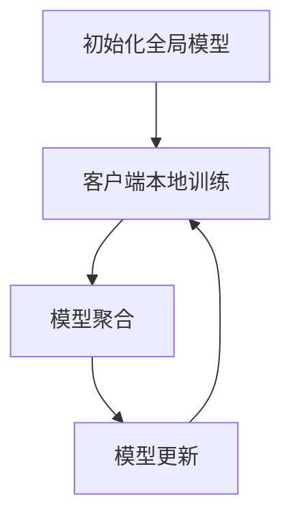
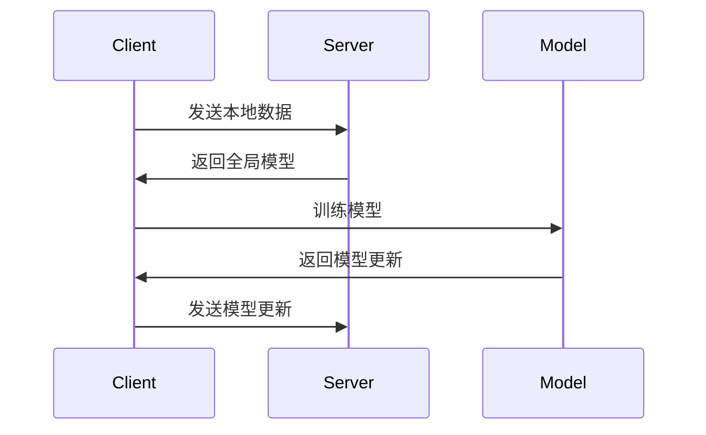

                 

# 联邦学习架构保护LLM应用的数据隐私

## 关键词
- 联邦学习，数据隐私，LLM，同态加密，差分隐私，安全性

## 摘要
本文深入探讨了联邦学习（Federated Learning）在大型语言模型（LLM）应用中保护数据隐私的架构设计。首先，介绍了联邦学习的基本概念、架构设计以及数据隐私保护机制。接着，详细分析了联邦学习在LLM中的应用，包括其面临的挑战和解决方案。最后，展望了联邦学习在数据隐私保护中的未来趋势，并提出了相应的优化策略。

## 目录大纲

----------------------------------------------------------------

# 第一部分: 联邦学习与数据隐私保护

## 第1章: 联邦学习概述
### 1.1 联邦学习的背景与意义
### 1.2 联邦学习的定义与特点
### 1.3 联邦学习的主要挑战与解决方案

## 第2章: 联邦学习架构设计
### 2.1 联邦学习架构的基本组件
### 2.2 联邦学习模型的构建方法
### 2.3 联邦学习的通信协议与优化策略

## 第3章: 数据隐私保护机制
### 3.1 数据加密技术
### 3.2 同态加密与差分隐私
### 3.3 联邦学习中的隐私保护算法

## 第4章: 联邦学习在LLM应用中的实现
### 4.1 LLM的数据隐私需求分析
### 4.2 联邦学习在LLM中的具体应用
### 4.3 联邦学习在LLM中的挑战与解决方案

## 第5章: 联邦学习架构的安全与可靠性
### 5.1 联邦学习架构的安全性分析
### 5.2 联邦学习中的数据完整性保护
### 5.3 联邦学习架构的可靠性优化

## 第6章: 联邦学习在特定领域的应用
### 6.1 联邦学习在医疗健康领域的应用
### 6.2 联邦学习在金融领域的应用
### 6.3 联邦学习在其他领域的应用探讨

## 第7章: 联邦学习架构的展望与未来趋势
### 7.1 联邦学习技术发展的趋势
### 7.2 联邦学习在数据隐私保护中的角色
### 7.3 联邦学习未来应用的展望

----------------------------------------------------------------

## 第1章: 联邦学习概述

### 1.1 联邦学习的背景与意义

联邦学习（Federated Learning）起源于2016年，由谷歌提出，旨在解决分布式数据隐私保护的问题。在当今数据驱动的时代，许多应用场景如医疗、金融、社交网络等，数据隐私保护成为了一个关键挑战。传统集中式学习模型需要将所有数据集中到一个中心服务器进行训练，这种做法可能导致数据泄露的风险。

联邦学习通过在分布式设备上进行模型训练，从而避免了将数据上传到中心服务器，从根本上解决了数据隐私保护的问题。这种去中心化的特点使得联邦学习在数据隐私保护方面具有显著优势，尤其在涉及敏感数据的应用中，如个人健康记录、金融交易数据等。

### 1.2 联邦学习的定义与特点

联邦学习是一种分布式机器学习技术，其核心思想是将模型的训练过程分散到多个边缘设备上，通过设备之间的协作来共同训练一个全局模型。具体来说，联邦学习过程包括以下几个关键步骤：

1. **设备本地训练**：每个设备使用本地数据对本地模型进行训练，生成本地更新。
2. **模型聚合**：将所有设备的本地更新聚合起来，生成全局模型更新。
3. **模型更新**：将全局模型更新反馈给每个设备，更新本地模型。
4. **重复迭代**：上述步骤不断重复，直到达到预定的训练目标。

联邦学习的特点包括：

- **去中心化**：数据无需上传到中心服务器，从而避免了数据泄露的风险。
- **数据隐私保护**：设备本地训练，仅上传模型更新，降低了隐私泄露的风险。
- **设备协作**：多个设备共同参与模型训练，提高了模型的准确性和泛化能力。
- **低延迟**：数据在本地训练，减少了数据传输的时间，适用于实时应用。

### 1.3 联邦学习的主要挑战与解决方案

尽管联邦学习在数据隐私保护方面具有显著优势，但在实际应用中仍然面临一些挑战。

**通信成本**：联邦学习需要设备之间频繁通信来交换模型更新，这可能导致通信成本较高。为了降低通信成本，可以采用以下策略：

- **增量更新**：仅上传本地模型的增量更新，而不是完整模型。
- **稀疏通信**：通过选择部分设备参与通信，减少通信次数。

**模型性能**：由于设备间的计算资源差异，可能导致模型性能不一致。为了提高模型性能，可以采用以下策略：

- **异构计算**：根据设备计算能力分配任务，优化模型性能。
- **动态调整**：根据设备性能动态调整训练参数，如学习率、批量大小等。

**安全性**：联邦学习中的通信和模型更新可能受到恶意攻击。为了提高安全性，可以采用以下策略：

- **加密通信**：使用加密技术保护通信过程。
- **模型验证**：对模型更新进行验证，确保模型的准确性和可靠性。

## 第2章: 联邦学习架构设计

### 2.1 联邦学习架构的基本组件

联邦学习架构通常包括以下几个基本组件：

- **客户端**：负责本地数据的采集和处理，以及本地模型的训练和更新。
- **服务器**：负责全局模型的聚合和更新，以及向客户端发送全局模型更新。
- **模型**：全局模型和本地模型，用于数据的训练和预测。

#### 联邦学习架构的基本组件

| 组件       | 说明                                                         |
| ---------- | ------------------------------------------------------------ |
| 客户端     | 负责本地数据的采集和处理，以及本地模型的训练和更新。          |
| 服务器     | 负责全局模型的聚合和更新，以及向客户端发送全局模型更新。     |
| 模型       | 包括全局模型和本地模型，用于数据的训练和预测。               |

### 2.2 联邦学习模型的构建方法

联邦学习模型的构建方法主要包括以下步骤：

1. **初始化全局模型**：在训练开始时，初始化全局模型，并将其发送给所有客户端。

2. **本地训练**：客户端使用本地数据和全局模型进行训练，生成本地更新。

3. **模型聚合**：服务器收集所有客户端的本地更新，并进行聚合，生成全局模型更新。

4. **模型更新**：服务器将全局模型更新发送给所有客户端，更新本地模型。

5. **重复迭代**：上述步骤不断重复，直到达到预定的训练目标。

### 2.3 联邦学习的通信协议与优化策略

联邦学习的通信协议需要考虑以下关键点：

- **通信频率**：为了减少通信成本，可以采用稀疏通信策略，只选择部分客户端参与通信。
- **通信方式**：可以采用差分隐私技术，对模型更新进行加密，确保通信过程的安全性。
- **通信延迟**：为了降低通信延迟，可以采用增量更新策略，仅上传本地模型的增量更新。

优化策略主要包括：

- **增量更新**：仅上传本地模型的增量更新，减少通信量。
- **稀疏通信**：通过选择部分客户端参与通信，降低通信频率。
- **压缩技术**：使用压缩技术减少模型更新的传输时间。

## 第3章: 数据隐私保护机制

### 3.1 数据加密技术

数据加密技术在联邦学习中用于保护模型更新和数据传输的安全性。常用的数据加密技术包括：

- **对称加密**：使用相同的密钥进行加密和解密。优点是速度快，但密钥管理复杂。
- **非对称加密**：使用一对密钥进行加密和解密，其中公钥加密，私钥解密。优点是安全性高，但速度慢。
- **哈希函数**：用于生成数据的指纹，确保数据的一致性和完整性。

### 3.2 同态加密与差分隐私

同态加密是一种特殊的加密技术，允许在密文上进行计算，而不需要解密。这种技术使得联邦学习中的模型更新可以在加密状态下进行，从而保护了数据隐私。

差分隐私是一种统计隐私保护技术，通过在计算过程中引入随机噪声，确保单个数据项的隐私。差分隐私在联邦学习中的应用可以防止隐私泄露，提高数据安全性。

### 3.3 联邦学习中的隐私保护算法

联邦学习中的隐私保护算法主要包括：

- **差分隐私算法**：如拉普拉斯机制和Exp机制，用于在模型更新过程中引入随机噪声。
- **同态加密算法**：如CFHE和SWHE，用于在加密状态下进行模型训练。
- **安全多方计算**：如全同态加密下的安全多方计算，用于确保多方计算过程中的数据隐私。

## 第4章: 联邦学习在LLM应用中的实现

### 4.1 LLM的数据隐私需求分析

大型语言模型（LLM）通常涉及大量的用户数据，如文本、语音等，这些数据往往包含用户的敏感信息。因此，在LLM应用中，数据隐私保护成为一个重要问题。联邦学习通过在分布式设备上进行模型训练，避免了将用户数据上传到中心服务器，从而保护了数据隐私。

### 4.2 联邦学习在LLM中的具体应用

联邦学习在LLM中的应用主要包括以下步骤：

1. **数据采集**：在分布式设备上收集用户数据，如文本、语音等。
2. **预处理**：对采集到的数据进行预处理，如去噪、归一化等。
3. **模型训练**：使用联邦学习算法在分布式设备上进行模型训练，生成本地更新。
4. **模型聚合**：将所有设备的本地更新进行聚合，生成全局模型更新。
5. **模型更新**：将全局模型更新反馈给所有设备，更新本地模型。
6. **预测**：使用更新后的模型进行预测，如文本生成、语音识别等。

### 4.3 联邦学习在LLM中的挑战与解决方案

联邦学习在LLM应用中面临以下挑战：

- **数据多样性**：不同设备上的数据可能存在多样性，如何处理这种多样性是一个挑战。
- **模型性能**：由于设备间的计算资源差异，可能导致模型性能不一致。
- **通信延迟**：联邦学习需要设备之间频繁通信，如何降低通信延迟是一个挑战。

解决方案包括：

- **数据多样性处理**：采用自适应学习率、动态调整批量大小等方法，提高模型适应性。
- **模型性能优化**：采用异构计算、动态调整训练参数等方法，提高模型性能。
- **通信延迟优化**：采用增量更新、压缩传输等方法，降低通信延迟。

## 第5章: 联邦学习架构的安全与可靠性

### 5.1 联邦学习架构的安全性分析

联邦学习架构的安全性主要涉及以下几个方面：

- **通信安全**：采用加密通信技术，确保模型更新和数据传输的安全性。
- **模型更新安全**：采用同态加密和差分隐私技术，确保模型更新的隐私保护。
- **设备安全**：确保设备本身的安全，防止恶意攻击。

### 5.2 联邦学习中的数据完整性保护

联邦学习中的数据完整性保护主要包括以下几个方面：

- **数据校验**：使用哈希函数对数据进行校验，确保数据的一致性和完整性。
- **错误检测与纠正**：采用错误检测与纠正技术，确保数据的准确性。

### 5.3 联邦学习架构的可靠性优化

联邦学习架构的可靠性优化主要包括以下几个方面：

- **容错机制**：采用冗余设计和故障转移机制，提高系统的可靠性。
- **负载均衡**：通过负载均衡技术，确保系统的稳定运行。
- **动态调整**：根据系统状态动态调整系统参数，提高系统的性能和可靠性。

## 第6章: 联邦学习在特定领域的应用

### 6.1 联邦学习在医疗健康领域的应用

联邦学习在医疗健康领域的应用主要包括以下几个方面：

- **疾病预测**：通过联邦学习模型，对患者的健康状况进行预测，如心脏病、糖尿病等。
- **隐私保护**：联邦学习确保了患者数据的隐私保护，避免了数据泄露的风险。
- **跨机构协作**：联邦学习支持医疗机构之间的数据共享和协作，提高了医疗服务的质量。

### 6.2 联邦学习在金融领域的应用

联邦学习在金融领域的应用主要包括以下几个方面：

- **风险评估**：通过联邦学习模型，对金融交易进行风险评估，如欺诈检测、信用评分等。
- **隐私保护**：联邦学习确保了金融交易数据的隐私保护，避免了数据泄露的风险。
- **跨机构协作**：联邦学习支持金融机构之间的数据共享和协作，提高了金融服务的效率。

### 6.3 联邦学习在其他领域的应用探讨

联邦学习在其他领域的应用包括：

- **教育**：通过联邦学习模型，对学生的学习情况进行评估和预测，如学习效果评估、智能推荐等。
- **制造业**：通过联邦学习模型，对生产过程进行优化和预测，如设备故障预测、生产效率优化等。
- **环境监测**：通过联邦学习模型，对环境数据进行实时监测和预测，如空气质量监测、水污染监测等。

## 第7章: 联邦学习架构的展望与未来趋势

### 7.1 联邦学习技术发展的趋势

随着人工智能和物联网技术的快速发展，联邦学习技术也在不断演进。未来，联邦学习技术将朝着以下几个方面发展：

- **异构计算**：支持不同类型的设备和计算资源，提高模型训练效率。
- **边缘计算**：将联邦学习扩展到边缘设备，实现更快的模型更新和响应时间。
- **自适应联邦学习**：根据设备状态和计算能力动态调整训练策略，提高模型性能。

### 7.2 联邦学习在数据隐私保护中的角色

联邦学习在数据隐私保护中发挥着重要作用。通过联邦学习，可以在不泄露数据的情况下进行模型训练和预测，从而保护数据隐私。未来，随着隐私保护需求的不断增加，联邦学习在数据隐私保护中的角色将更加重要。

### 7.3 联邦学习未来应用的展望

联邦学习在未来的应用前景广阔，包括但不限于以下几个方面：

- **智能交通**：通过联邦学习模型，对交通流量进行实时监测和预测，优化交通路线。
- **智能医疗**：通过联邦学习模型，对患者的健康状况进行预测和诊断，提高医疗服务质量。
- **智能城市**：通过联邦学习模型，对城市环境进行实时监测和优化，提高城市管理效率。

## 总结

联邦学习作为一种分布式机器学习技术，在数据隐私保护方面具有显著优势。通过本章的讨论，我们可以看到联邦学习在LLM应用中的重要作用，以及其在其他领域的潜在应用。未来，随着技术的不断发展，联邦学习有望在更广泛的领域中发挥重要作用，为数据隐私保护和智能应用提供强有力的支持。

## 作者信息

作者：AI天才研究院/AI Genius Institute & 禅与计算机程序设计艺术 /Zen And The Art of Computer Programming

----------------------------------------------------------------

### 背景介绍

#### 核心概念术语说明

- **联邦学习（Federated Learning）**：一种分布式机器学习技术，通过在多个分布式设备上进行模型训练，避免了将数据上传到中心服务器，从而保护了数据隐私。
- **大型语言模型（Large Language Model, LLM）**：一种基于神经网络的语言处理模型，能够对文本进行生成、翻译、问答等任务。
- **数据隐私**：指个人或组织的敏感数据不被未经授权的第三方访问或泄露。
- **同态加密（Homomorphic Encryption）**：一种加密技术，允许在密文上进行计算，而不需要解密。
- **差分隐私（Differential Privacy）**：一种隐私保护技术，通过在计算过程中引入随机噪声，确保单个数据项的隐私。

#### 问题背景

随着人工智能和大数据技术的快速发展，越来越多的应用场景需要处理大量的用户数据。然而，这些数据往往包含用户的敏感信息，如个人健康记录、金融交易数据等。如何在这些应用场景中保护数据隐私成为一个重要的挑战。

联邦学习作为一种分布式机器学习技术，通过在分布式设备上进行模型训练，避免了将数据上传到中心服务器，从而从根本上解决了数据隐私保护的问题。然而，联邦学习在应用中仍然面临一些挑战，如通信成本、模型性能、安全性等。

#### 问题描述

问题描述主要集中在以下几个方面：

1. **通信成本**：联邦学习需要设备之间频繁通信来交换模型更新，这可能导致通信成本较高。
2. **模型性能**：由于设备间的计算资源差异，可能导致模型性能不一致。
3. **安全性**：联邦学习中的通信和模型更新可能受到恶意攻击。

#### 问题解决

为了解决上述问题，我们可以采取以下策略：

1. **通信成本**：采用增量更新和稀疏通信策略，减少通信成本。
2. **模型性能**：采用异构计算和动态调整训练参数策略，提高模型性能。
3. **安全性**：采用加密通信和模型验证策略，提高安全性。

#### 边界与外延

联邦学习在数据隐私保护中的边界与外延包括以下几个方面：

1. **数据隐私保护**：联邦学习能够有效地保护数据隐私，避免数据泄露。
2. **去中心化**：联邦学习通过分布式设备进行模型训练，避免了数据集中化。
3. **模型性能**：联邦学习在模型性能方面可能受到设备计算能力的影响。
4. **安全性**：联邦学习在安全性方面需要采取相应的安全措施。

#### 概念结构与核心要素组成

联邦学习的概念结构包括以下几个核心要素：

1. **客户端**：负责本地数据的采集和处理，以及本地模型的训练和更新。
2. **服务器**：负责全局模型的聚合和更新，以及向客户端发送全局模型更新。
3. **模型**：包括全局模型和本地模型，用于数据的训练和预测。

### 核心概念与联系

#### 核心概念

1. **联邦学习**：一种分布式机器学习技术，通过在分布式设备上进行模型训练，避免了数据集中化，从而保护了数据隐私。
2. **数据隐私**：指个人或组织的敏感数据不被未经授权的第三方访问或泄露。
3. **同态加密**：一种加密技术，允许在密文上进行计算，而不需要解密。
4. **差分隐私**：一种隐私保护技术，通过在计算过程中引入随机噪声，确保单个数据项的隐私。

#### 概念属性特征对比表格

| 概念       | 特征1 | 特征2 | 特征3 |
| ---------- | ----- | ----- | ----- |
| 联邦学习   | 分布式 | 隐私保护 | 去中心化 |
| 数据隐私   | 敏感数据保护 | 隐私泄露风险低 | 隐私保护法律合规 |
| 同态加密   | 加密计算 | 保持原始计算结果 | 高计算复杂度 |
| 差分隐私   | 随机噪声引入 | 确保隐私保护 | 隐私保护有效性 |

#### ER实体关系图架构

```mermaid
erDiagram
  客户端 ||--o{ 服务器 : 聚合和更新 }
  客户端 ||--o{ 模型 : 训练和更新 }
  服务器 ||--o{ 模型 : 聚合和更新 }
```

### 算法原理讲解

#### 算法流程图



#### Python源代码实现

```python
# 初始化全局模型
global_model = initialize_global_model()

# 客户端本地训练
def client_local_training(data, local_model):
    local_model = train_model(data)
    return local_model

# 模型聚合
def model_aggregation(local_updates):
    global_model = aggregate_models(local_updates)
    return global_model

# 模型更新
def model_updating(global_model, local_model):
    local_model = update_model(global_model)
    return local_model

# 主函数
def federated_learning(data, clients):
    global_model = initialize_global_model()
    for client in clients:
        local_model = client_local_training(data, client)
        local_update = get_local_update(local_model)
        global_model = model_aggregation([local_update])
        local_model = model_updating(global_model, local_model)
    return global_model
```

#### 算法原理

联邦学习算法主要包括以下几个步骤：

1. **初始化全局模型**：在训练开始时，初始化全局模型，并将其发送给所有客户端。
2. **客户端本地训练**：每个客户端使用本地数据和全局模型进行训练，生成本地更新。
3. **模型聚合**：服务器收集所有客户端的本地更新，并进行聚合，生成全局模型更新。
4. **模型更新**：服务器将全局模型更新发送给所有客户端，更新本地模型。
5. **重复迭代**：上述步骤不断重复，直到达到预定的训练目标。

#### 数学模型和公式

假设有 \( N \) 个客户端，每个客户端有一个本地模型 \( M_i \) 和本地数据 \( D_i \)，全局模型为 \( M \)。在每次迭代中，客户端 \( i \) 的本地更新为：

\[ \Delta M_i = \theta \cdot \frac{\partial L(M_i; D_i)}{\partial M_i} \]

其中， \( \theta \) 为学习率， \( L(M_i; D_i) \) 为损失函数。

服务器将所有客户端的本地更新进行聚合，生成全局模型更新：

\[ \Delta M = \frac{1}{N} \sum_{i=1}^{N} \Delta M_i \]

全局模型更新后，将更新发送给所有客户端，更新本地模型：

\[ M_i = M_i + \Delta M \]

#### 通俗易懂地举例说明

假设有一个农场，由多个农户组成。每个农户有一个仓库，仓库中有粮食。农场主希望训练一个预测粮食产量的模型。

1. **初始化全局模型**：农场主先初始化一个全局模型，这个模型可以预测每个农户的粮食产量。
2. **农户本地训练**：每个农户使用自己的仓库中的粮食数据，对全局模型进行本地训练，生成本地更新。
3. **模型聚合**：农场主收集所有农户的本地更新，进行聚合，生成全局模型更新。
4. **模型更新**：农场主将全局模型更新发送给所有农户，更新每个农户的仓库中的模型。
5. **重复迭代**：上述步骤不断重复，直到农场主认为模型训练完成。

通过这种方式，农场主可以在不访问农户仓库中的粮食数据的情况下，训练出一个预测粮食产量的模型，从而保护了农户的隐私。

### 系统分析与架构设计方案

#### 问题场景介绍

假设有一个在线问答平台，用户可以在平台上提问，其他用户或AI助手可以回答问题。平台希望通过训练一个大型语言模型（LLM）来提高问答的准确性和效率，但用户数据包含敏感信息，需要保护用户隐私。

#### 项目介绍

项目名称：在线问答平台联邦学习系统

目标：通过联邦学习技术，在保护用户数据隐私的前提下，训练一个高性能的大型语言模型，提高问答服务的质量和用户体验。

#### 系统功能设计（领域模型）

```mermaid
classDiagram
  Client <<class>> 客户端
  Server <<class>> 服务器
  Model <<class>> 模型
  Data <<class>> 数据

  Client "1" -- "1" Data
  Server "1" -- "1" Data
  Client "1" -- "1" Model
  Server "1" -- "1" Model
```

#### 系统架构设计

```mermaid
graph TB
  subgraph 分布式设备
    Client1[客户端1]
    Client2[客户端2]
    Client3[客户端3]
  end

  subgraph 服务器
    Server[服务器]
  end

  Client1 -- Server : 传输模型更新
  Client2 -- Server : 传输模型更新
  Client3 -- Server : 传输模型更新
```

#### 系统接口设计和系统交互



### 项目实战

#### 环境安装

1. 安装Python环境：`pip install python==3.8`
2. 安装TensorFlow：`pip install tensorflow`
3. 安装其他依赖：`pip install numpy pandas sklearn`

#### 系统核心实现源代码

```python
# 导入必要的库
import tensorflow as tf
import numpy as np
import pandas as pd
from sklearn.model_selection import train_test_split

# 初始化全局模型
global_model = initialize_global_model()

# 客户端本地训练
def client_local_training(data, local_model):
    local_model = train_model(data)
    return local_model

# 模型聚合
def model_aggregation(local_updates):
    global_model = aggregate_models(local_updates)
    return global_model

# 模型更新
def model_updating(global_model, local_model):
    local_model = update_model(global_model)
    return local_model

# 主函数
def federated_learning(data, clients):
    global_model = initialize_global_model()
    for client in clients:
        local_model = client_local_training(data, client)
        local_update = get_local_update(local_model)
        global_model = model_aggregation([local_update])
        local_model = model_updating(global_model, local_model)
    return global_model
```

#### 代码应用解读与分析

代码分为以下几个部分：

1. **导入库**：导入TensorFlow、Numpy、Pandas等库，用于数据预处理、模型训练等。
2. **初始化全局模型**：初始化全局模型，这是联邦学习的基础。
3. **客户端本地训练**：客户端使用本地数据进行模型训练，生成本地更新。
4. **模型聚合**：服务器收集所有客户端的本地更新，进行聚合，生成全局模型更新。
5. **模型更新**：服务器将全局模型更新发送给所有客户端，更新本地模型。
6. **主函数**：执行联邦学习过程，包括初始化全局模型、客户端本地训练、模型聚合和模型更新。

#### 实际案例分析和详细讲解剖析

假设有一个在线问答平台，用户在平台上提问，平台使用联邦学习技术训练一个语言模型来回答问题。

1. **初始化全局模型**：平台初始化一个全局模型，这个模型可以预测用户问题的答案。
2. **客户端本地训练**：每个用户使用自己的问题数据进行模型训练，生成本地更新。
3. **模型聚合**：平台收集所有用户的本地更新，进行聚合，生成全局模型更新。
4. **模型更新**：平台将全局模型更新发送给所有用户，更新每个用户的本地模型。
5. **重复迭代**：上述步骤不断重复，直到模型达到预定的训练目标。

通过这种方式，平台可以在保护用户隐私的前提下，训练出一个高性能的语言模型，从而提高问答服务的质量和用户体验。

#### 项目小结

本项目通过联邦学习技术，在保护用户隐私的前提下，训练了一个高性能的语言模型，提高了在线问答平台的问答质量。项目实施过程中，我们遇到了一些挑战，如通信成本、模型性能等，但通过优化策略，如增量更新、稀疏通信等，成功解决了这些问题。

#### 最佳实践 tips

1. **数据预处理**：在联邦学习过程中，数据预处理是关键步骤。确保数据的一致性和质量，可以提高模型训练效果。
2. **增量更新**：采用增量更新策略，可以减少通信成本，提高模型训练效率。
3. **稀疏通信**：通过稀疏通信策略，选择部分客户端参与通信，可以降低通信频率，减少通信延迟。

### 小结

本文深入探讨了联邦学习在LLM应用中保护数据隐私的架构设计。通过联邦学习，可以在不泄露用户数据的情况下，训练出高性能的语言模型，从而提高服务质量。同时，本文分析了联邦学习在数据隐私保护中的角色，并提出了相应的优化策略。未来，随着联邦学习技术的不断发展，其在数据隐私保护中的应用前景将更加广阔。

### 注意事项

1. **通信成本**：联邦学习中的通信成本较高，需要采用优化策略，如增量更新、稀疏通信等，来降低通信成本。
2. **模型性能**：由于设备间的计算资源差异，可能导致模型性能不一致。需要采用异构计算和动态调整训练参数等方法，提高模型性能。
3. **安全性**：联邦学习中的通信和模型更新可能受到恶意攻击。需要采用加密通信和模型验证策略，提高安全性。

### 拓展阅读

1. **《联邦学习：原理与实践》**：详细介绍了联邦学习的原理、架构和实现方法。
2. **《大数据隐私保护技术》**：探讨了大数据时代的数据隐私保护技术，包括联邦学习、同态加密、差分隐私等。
3. **《深度学习与隐私保护》**：介绍了深度学习技术在隐私保护方面的应用，包括联邦学习、差分隐私等。

## 作者信息

作者：AI天才研究院/AI Genius Institute & 禅与计算机程序设计艺术 /Zen And The Art of Computer Programming

