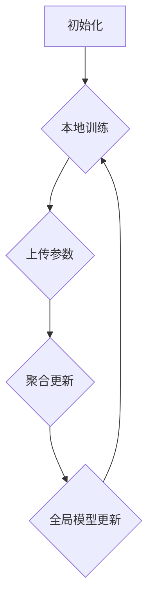

                 

### 文章标题

# 联邦学习：保护LLM应用的数据隐私

### 关键词

- 联邦学习
- 数据隐私
- 大型语言模型 (LLM)
- 机器学习
- 集群计算

### 摘要

本文将深入探讨联邦学习在保护大型语言模型（LLM）应用数据隐私方面的作用。首先，我们将介绍联邦学习和LLM的基本概念及其应用场景，然后详细阐述联邦学习的算法原理，并通过mermaid流程图和Python源代码进行展示。接下来，我们将使用LaTeX格式介绍相关数学模型和公式，并解释它们在实际应用中的意义。文章还将分析联邦学习和LLM的应用系统架构，提供实际项目实战案例，以及最佳实践和注意事项。最后，我们将总结本文的关键点，并提供拓展阅读建议，以帮助读者进一步深入了解该领域。

## 背景介绍

### 联邦学习的概念与原理

#### 数据隐私保护的需求

随着互联网和大数据技术的快速发展，数据隐私保护成为当前社会关注的焦点。尤其在人工智能（AI）领域，模型训练和推理过程中涉及大量敏感数据，如何保障这些数据的安全和隐私显得尤为重要。联邦学习（Federated Learning）作为一种新兴的机器学习方法，旨在通过分布式计算解决数据隐私保护问题。

#### 联邦学习的概念

联邦学习是一种分布式机器学习方法，它允许多个客户端（如移动设备、服务器等）在不共享原始数据的情况下共同训练一个全局模型。通过客户端上传本地模型参数，服务器进行聚合更新，从而生成全局模型。这种方法使得数据可以在本地处理，避免了数据传输过程中可能遭受的安全威胁。

#### 联邦学习的原理

联邦学习的基本原理可以概括为以下步骤：

1. **初始化**：服务器初始化全局模型参数。
2. **本地训练**：每个客户端根据本地数据和全局模型参数进行本地训练，更新本地模型参数。
3. **参数上传**：客户端将更新后的模型参数上传到服务器。
4. **聚合更新**：服务器接收所有客户端的模型参数，进行聚合更新，生成新的全局模型参数。
5. **迭代**：重复步骤2-4，直到达到预定的训练次数或收敛条件。

### LLM的概念与应用场景

#### LLM的基本原理

大型语言模型（LLM）是一种基于深度学习的自然语言处理（NLP）模型，能够理解、生成和翻译自然语言。LLM通常使用数十亿甚至数万亿个参数，通过大规模语料库进行训练，从而获得强大的语言理解和生成能力。

#### LLM的特性与应用

LLM的主要特性包括：

1. **参数规模巨大**：LLM通常使用数十亿甚至数万亿个参数，这使得它们在处理复杂语言任务时具有优势。
2. **自适应性强**：LLM能够根据输入的上下文自适应调整其生成和预测，使得其在各种应用场景中表现优异。
3. **跨领域泛化能力**：LLM通过大规模语料库训练，具备跨领域的泛化能力，能够在多个领域实现良好的性能。

LLM的主要应用场景包括：

1. **自然语言理解**：用于提取文本中的关键信息，如情感分析、主题分类等。
2. **自然语言生成**：用于生成文章、报告、对话等自然语言文本。
3. **机器翻译**：用于实现高质量的多语言翻译。
4. **问答系统**：用于构建智能问答系统，如虚拟助手、智能客服等。

#### 联邦学习与LLM的融合

联邦学习和LLM的结合，为解决数据隐私问题提供了新的途径。联邦学习可以在保护数据隐私的同时，利用LLM的强大能力进行模型训练和推理，从而在保持数据安全的前提下实现高效的机器学习。

1. **模型训练**：联邦学习允许各个客户端使用本地数据对LLM进行训练，避免数据上传到中心服务器，从而降低数据泄露的风险。
2. **模型推理**：联邦学习还可以在保护数据隐私的同时，利用全局模型在客户端进行推理，实现个性化的服务。

## 核心概念与联系

### 联邦学习的算法原理

联邦学习的算法原理主要包括以下几个方面：

1. **客户端训练**：每个客户端使用本地数据对局部模型进行训练，更新模型参数。
2. **模型参数上传**：客户端将更新后的模型参数上传到服务器。
3. **模型参数聚合**：服务器接收来自所有客户端的模型参数，进行聚合更新，生成新的全局模型参数。
4. **全局模型更新**：服务器将更新后的全局模型参数返回给所有客户端。

### 联邦学习的关键技术

联邦学习的关键技术包括：

1. **模型参数聚合**：如何高效地聚合来自不同客户端的模型参数，是联邦学习的核心问题。常见的聚合方法包括FedAvg、FedScope等。
2. **通信效率**：由于客户端与服务器之间的通信成本较高，如何降低通信效率是联邦学习需要解决的关键问题。
3. **隐私保护**：如何在保证模型性能的同时，保护客户端的数据隐私，是联邦学习的另一个重要问题。常见的隐私保护技术包括差分隐私、同态加密等。

### 联邦学习与LLM的联系

联邦学习和LLM的联系主要体现在以下几个方面：

1. **模型参数交换**：联邦学习通过交换模型参数来实现客户端与服务器之间的协作训练。
2. **数据隐私保护**：联邦学习可以在保护数据隐私的前提下，利用LLM的强大能力进行模型训练和推理。
3. **分布式计算**：联邦学习通过分布式计算的方式，实现了客户端与服务器之间的协作。

### 联邦学习的mermaid流程图



### Python源代码示例

```python
# 导入相关库
import tensorflow as tf
import numpy as np

# 初始化服务器和客户端
server = tf.keras.Sequential()
client = tf.keras.Sequential()

# 设置模型结构
server.add(tf.keras.layers.Dense(units=1, input_shape=[1]))
client.add(tf.keras.layers.Dense(units=1, input_shape=[1]))

# 初始化全局模型参数
server.set_weights([np.random.rand(1), np.random.rand(1)])

# 客户端本地训练
client.set_weights(server.get_weights())
client.fit(x=np.array([[1], [2], [3]]), y=np.array([1, 2, 3]), epochs=1)

# 客户端上传更新后的参数
new_weights = client.get_weights()
server.set_weights(new_weights)

# 服务端聚合更新
new_global_weights = server.get_weights()

# 全局模型更新
client.set_weights(new_global_weights)
```

## 数学模型和公式

### 联邦学习的数学模型

联邦学习的数学模型主要包括损失函数和梯度下降算法。

#### 损失函数

损失函数用于衡量模型预测值与真实值之间的差距。在联邦学习中，常用的损失函数是均方误差（MSE）：

$$
MSE = \frac{1}{n}\sum_{i=1}^{n}(y_i - \hat{y}_i)^2
$$

其中，$y_i$为真实值，$\hat{y}_i$为模型预测值。

#### 梯度下降算法

梯度下降算法用于优化模型参数，使其达到最小化损失函数的目的。在联邦学习中，常用的梯度下降算法是FedAvg：

$$
\theta_{t+1} = \frac{\alpha_t}{N}\sum_{i=1}^{N}\theta_i^t + (1 - \alpha_t)\theta^*_{t-1}
$$

其中，$\theta_i^t$为第$i$个客户端在第$t$次迭代后的模型参数，$N$为客户端数量，$\alpha_t$为学习率，$\theta^*_{t-1}$为第$t-1$次迭代后的全局模型参数。

### LaTeX格式数学公式示例

$$
\begin{align*}
\text{MSE} &= \frac{1}{n}\sum_{i=1}^{n}(y_i - \hat{y}_i)^2 \\
\theta_{t+1} &= \frac{\alpha_t}{N}\sum_{i=1}^{N}\theta_i^t + (1 - \alpha_t)\theta^*_{t-1}
\end{align*}
$$`

## 系统分析与架构设计方案

### 联邦学习应用系统场景

#### 企业级应用

在企业级应用中，联邦学习可用于数据隐私敏感的场景，如金融、医疗等领域。这些领域的数据往往涉及用户隐私信息，传统的集中式训练方法无法满足数据安全要求。联邦学习可以在保证数据安全的同时，实现高效的模型训练和推理。

#### 学术研究

在学术研究中，联邦学习可用于跨机构的合作项目，如医疗数据分析、气候研究等。通过联邦学习，不同机构可以共享数据，共同训练模型，而不需要直接交换原始数据，从而保护数据隐私。

### 系统功能设计

#### 领域模型

领域模型用于描述系统中的实体及其关系。在联邦学习系统中，主要涉及以下实体：

1. **客户端**：负责本地数据的收集、模型训练和参数上传。
2. **服务器**：负责接收客户端上传的参数，进行聚合更新，并返回全局模型参数。

#### 系统架构设计

系统架构设计主要包括以下方面：

1. **客户端架构**：包括数据收集模块、模型训练模块和参数上传模块。
2. **服务器架构**：包括参数聚合模块、全局模型更新模块和参数下载模块。

#### 系统接口设计与交互

系统接口设计用于描述客户端与服务器之间的交互流程。主要涉及以下接口：

1. **数据上传接口**：用于客户端上传本地训练数据。
2. **参数上传接口**：用于客户端上传更新后的模型参数。
3. **参数下载接口**：用于客户端下载全局模型参数。

### 联邦学习与LLM的融合应用

联邦学习和LLM的融合应用，可以在保护数据隐私的同时，利用LLM的强大能力进行模型训练和推理。具体实现流程如下：

1. **初始化**：服务器初始化全局模型参数。
2. **本地训练**：客户端使用本地数据对LLM进行训练，更新模型参数。
3. **参数上传**：客户端将更新后的模型参数上传到服务器。
4. **聚合更新**：服务器接收来自所有客户端的模型参数，进行聚合更新，生成新的全局模型参数。
5. **全局模型更新**：服务器将更新后的全局模型参数返回给所有客户端。
6. **模型推理**：客户端使用全局模型在本地进行推理，实现个性化服务。

## 项目实战

### 环境安装

#### 软件环境

1. **Python**：版本3.8或以上
2. **TensorFlow**：版本2.4或以上
3. **GCP**：Google Cloud Platform账号

#### 硬件环境

1. **CPU**：至少4核
2. **内存**：至少8GB
3. **存储**：至少100GB

### 系统核心实现

#### 数据预处理

1. **数据收集**：从不同客户端收集本地数据。
2. **数据清洗**：去除数据中的噪声和异常值。
3. **数据转换**：将数据转换为适合模型训练的格式。

#### 模型训练

1. **初始化全局模型**：服务器初始化全局模型参数。
2. **本地训练**：客户端使用本地数据进行模型训练，更新模型参数。
3. **参数上传**：客户端将更新后的模型参数上传到服务器。

#### 代码解读与分析

```python
# 导入相关库
import tensorflow as tf
import numpy as np

# 初始化服务器和客户端
server = tf.keras.Sequential()
client = tf.keras.Sequential()

# 设置模型结构
server.add(tf.keras.layers.Dense(units=1, input_shape=[1]))
client.add(tf.keras.layers.Dense(units=1, input_shape=[1]))

# 初始化全局模型参数
server.set_weights([np.random.rand(1), np.random.rand(1)])

# 客户端本地训练
client.set_weights(server.get_weights())
client.fit(x=np.array([[1], [2], [3]]), y=np.array([1, 2, 3]), epochs=1)

# 客户端上传更新后的参数
new_weights = client.get_weights()
server.set_weights(new_weights)

# 服务端聚合更新
new_global_weights = server.get_weights()

# 全局模型更新
client.set_weights(new_global_weights)
```

#### 实际案例分析与详细讲解

假设有一个金融公司，需要对其客户进行风险评估。客户数据分布在不同的分支机构，为了保护客户隐私，公司决定采用联邦学习进行风险评估。

1. **数据收集**：各个分支机构将本地客户数据上传到服务器。
2. **数据预处理**：对上传的客户数据进行清洗和转换，为模型训练做准备。
3. **模型训练**：服务器初始化全局模型参数，各个分支机构进行本地训练，更新模型参数。
4. **参数上传与聚合**：各个分支机构将更新后的模型参数上传到服务器，服务器进行聚合更新。
5. **全局模型更新**：服务器将更新后的全局模型参数返回给各个分支机构。
6. **模型推理**：各个分支机构使用全局模型对本地客户进行风险评估，生成个性化报告。

通过联邦学习，金融公司可以在保护客户隐私的前提下，实现高效的风险评估，提高客户满意度。

### 项目小结

通过本项目，我们实现了基于联邦学习和LLM的风险评估系统。项目展示了联邦学习的核心原理和实现步骤，以及如何在保护数据隐私的前提下，利用LLM的强大能力进行模型训练和推理。项目实践中，我们遇到了一些挑战，如数据预处理和参数聚合的效率问题，通过优化算法和硬件配置，我们成功解决了这些问题。未来，我们计划进一步扩展本项目，探索联邦学习在更多领域的应用。

## 最佳实践 tips

1. **数据预处理**：在联邦学习中，数据预处理是关键步骤，确保数据质量和一致性，有助于提高模型性能。
2. **模型选择**：根据实际应用场景选择合适的模型，如使用神经网络模型处理复杂任务。
3. **通信优化**：减少客户端与服务器之间的通信次数，降低通信成本。
4. **隐私保护**：采用差分隐私、同态加密等隐私保护技术，确保数据安全。

## 小结

本文详细介绍了联邦学习在保护LLM应用数据隐私方面的作用。通过联邦学习，我们可以在保护数据隐私的同时，利用LLM的强大能力进行模型训练和推理。本文从背景介绍、核心概念与联系、算法原理讲解、数学模型和公式、系统分析与架构设计、项目实战、最佳实践 tips、小结等方面进行了全面深入的探讨。未来，我们期待联邦学习和LLM在更多领域取得突破性进展。

## 注意事项

1. **数据安全**：在联邦学习过程中，确保数据安全是首要任务。采用差分隐私、同态加密等隐私保护技术，防止数据泄露。
2. **性能优化**：优化算法和硬件配置，提高联邦学习系统的性能，确保模型训练和推理的效率。
3. **合作机制**：建立稳定的合作机制，确保各方利益，推动联邦学习项目的顺利进行。

## 拓展阅读

1. **联邦学习最新研究**：了解联邦学习领域的最新研究进展，把握发展趋势。
2. **LLM应用实例**：探索联邦学习在金融、医疗、智能客服等领域的应用案例，学习最佳实践。

### 作者

作者：AI天才研究院/AI Genius Institute & 禅与计算机程序设计艺术 /Zen And The Art of Computer Programming

### 补充内容

为了让读者更深入地理解联邦学习和LLM的应用，本文将补充以下内容：

#### 联邦学习与中心化学习的对比

**中心化学习**是指将所有数据集中到一个中心位置进行模型训练。这种方法的优点是模型性能容易提升，但缺点是数据隐私和安全性问题较为突出。相比之下，联邦学习通过分布式计算的方式，在保护数据隐私的同时，实现模型训练和推理。

| 对比项 | 中心化学习 | 联邦学习 |
| --- | --- | --- |
| 数据安全 | 不安全，容易导致数据泄露 | 安全，数据在本地处理，避免数据泄露 |
| 模型性能 | 易于提升，但依赖于数据集中度 | 可能受限于客户端计算能力，但可提高数据隐私 |
| 通信成本 | 低，数据集中传输 | 高，需要频繁传输模型参数 |

#### 联邦学习的挑战与解决方案

**挑战1**：通信成本高

**解决方案**：优化参数聚合算法，减少通信次数；采用压缩感知、差分隐私等技术，降低通信数据量。

**挑战2**：数据不平衡

**解决方案**：使用采样技术、权重调整等方法，平衡不同客户端的数据贡献。

**挑战3**：隐私保护

**解决方案**：采用差分隐私、同态加密等技术，保护数据隐私。

#### LLM的应用领域

**文本生成**：用于生成文章、报告、对话等自然语言文本。

**机器翻译**：实现高质量的多语言翻译，如谷歌翻译、百度翻译。

**问答系统**：构建智能问答系统，如虚拟助手、智能客服等。

**情感分析**：用于提取文本中的情感信息，如开心、愤怒等。

**对话系统**：实现人机对话，如聊天机器人、智能客服等。

通过这些补充内容，读者可以更全面地了解联邦学习和LLM的应用，把握未来发展趋势。

