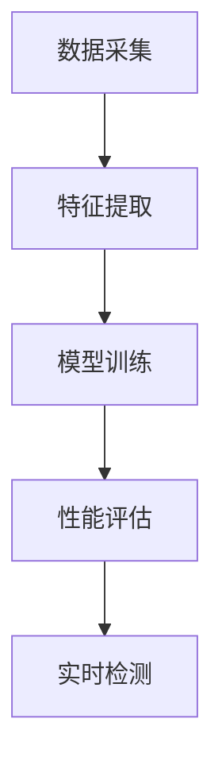
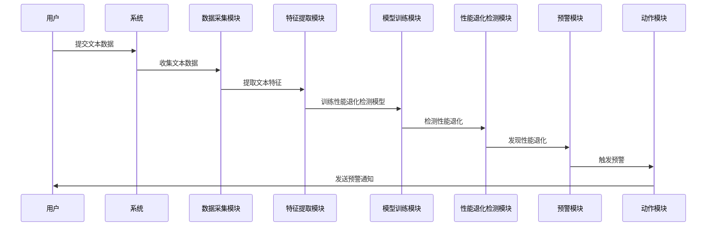
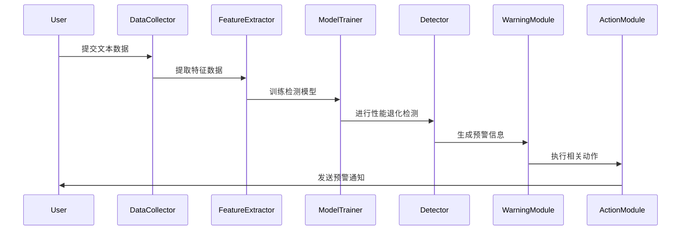

                 


### 第一部分：自动化LLM性能退化背景介绍

#### 第1章：自动化LLM性能退化问题背景

##### 1.1 问题背景

随着深度学习和自然语言处理技术的飞速发展，自动生成语言模型（LLM，Language Learning Model）在各类应用中取得了显著的成果。然而，这些模型在长时间的运行过程中，可能会出现性能退化的现象，即模型输出结果的准确性和可靠性逐渐下降。这种性能退化不仅会影响到模型的实际应用效果，还会导致用户体验下降、业务损失等严重后果。

###### 1.1.1 语言模型性能退化的定义与常见现象

语言模型性能退化可以定义为模型在长时间运行过程中，由于数据、算法、硬件等各种因素的变化，导致其输出结果的质量下降。常见的性能退化现象包括：

- **预测误差增加**：模型在生成文本时的准确度下降，生成的文本可能包含错误或不符合预期的内容。
- **响应速度减慢**：模型处理请求的速度变慢，响应时间延长，影响用户体验。
- **鲁棒性降低**：模型对异常输入数据的处理能力下降，容易出现错误输出。

###### 1.1.2 性能退化对应用的影响

性能退化对语言模型的应用产生了一系列负面影响，主要包括：

- **降低业务价值**：模型输出的不准确可能导致业务决策失误，降低业务价值。
- **影响用户体验**：模型响应速度变慢或输出错误，影响用户对产品的满意度。
- **增加维护成本**：需要投入更多资源和人力来修复和优化模型，增加维护成本。

###### 1.1.3 自动化LLM性能退化检测的重要性

自动化LLM性能退化检测在以下几个方面具有重要意义：

- **提前预警**：通过实时监测模型性能，及时发现潜在的性能退化问题，提前预警，避免严重后果。
- **提高模型稳定性**：及时发现和修复性能退化问题，提高模型的稳定性和可靠性。
- **优化资源利用**：通过对模型性能的监测和分析，优化模型资源配置，提高资源利用率。
- **支持持续优化**：为模型优化提供数据支持，帮助研发团队持续优化模型。

##### 1.2 自动化LLM性能退化的原因分析

自动化LLM性能退化是由多种因素共同作用导致的，以下分析几种主要的原因：

###### 1.2.1 模型训练过程中的性能退化原因

- **训练数据分布变化**：随着时间的推移，训练数据分布可能会发生变化，导致模型在新数据上的表现下降。
- **模型过拟合**：在训练过程中，模型可能出现过拟合现象，导致对新数据的泛化能力下降。
- **计算资源不足**：训练过程中，计算资源不足可能导致模型优化不够充分，影响性能。

###### 1.2.2 模型部署与运维中的性能退化原因

- **硬件环境变化**：硬件环境的变化，如温度、湿度、电源等，可能会对模型性能产生影响。
- **系统负载波动**：系统负载的波动可能导致模型处理速度变慢，影响性能。
- **软件版本升级**：软件版本升级可能会引入兼容性问题，导致模型性能下降。

###### 1.2.3 数据与环境的变动对模型性能的影响

- **数据质量问题**：数据质量下降，如数据缺失、噪声增加等，会导致模型性能下降。
- **环境因素**：环境因素，如网络延迟、数据传输速率等，也会对模型性能产生影响。

##### 1.3 自动化LLM性能退化检测的需求与挑战

###### 1.3.1 自动化LLM性能退化检测的需求

随着LLM应用的广泛普及，自动化性能退化检测的需求越来越强烈，主要体现在以下几个方面：

- **实时监测**：需要能够实时监测模型性能，及时发现性能退化问题。
- **自适应调整**：根据模型性能变化，自动调整模型参数和资源配置。
- **自动化修复**：能够自动化识别和修复性能退化问题，降低人工干预成本。

###### 1.3.2 当前技术面临的挑战与难点

虽然自动化LLM性能退化检测需求强烈，但当前技术仍然面临一些挑战和难点：

- **检测算法复杂度**：性能退化检测算法复杂度高，需要处理大量的数据和分析结果。
- **数据质量和可靠性**：依赖的数据质量和可靠性直接影响检测效果。
- **模型适应性**：不同模型和场景对性能退化检测的需求不同，需要开发适应性强的方法。
- **实时性和效率**：需要高效地处理实时监测数据，确保检测结果的实时性和准确性。

###### 1.3.3 未来发展趋势与研究方向

未来，自动化LLM性能退化检测的发展趋势和研究方向主要包括：

- **算法优化**：继续优化性能退化检测算法，提高检测准确性和效率。
- **自适应检测**：研究自适应性能退化检测方法，根据不同模型和场景调整检测策略。
- **多模态数据融合**：利用多模态数据（如文本、语音、图像等），提高性能退化检测的准确性和全面性。
- **自动化修复与优化**：研究自动化修复和优化方法，减少人工干预，提高检测和修复效率。

## 第2章：自动化LLM性能退化检测核心概念与联系

### 2.1 自动化LLM性能退化检测的基本原理

#### 2.1.1 性能退化的检测方法概述

自动化LLM性能退化检测主要依赖于以下几种方法：

- **统计方法**：通过对模型输出结果进行统计分析，发现性能退化的趋势和特征。
- **机器学习方法**：利用机器学习算法，对模型输出结果进行学习和预测，发现性能退化的规律。
- **深度学习方法**：利用深度学习模型，对模型输出结果进行特征提取和分类，发现性能退化的模式。

这些方法各有优缺点，适用于不同场景和需求。在实际应用中，通常会结合多种方法，提高性能退化检测的准确性和效率。

#### 2.1.2 常见检测指标的原理与对比

自动化LLM性能退化检测中，常用的检测指标包括：

- **准确率（Accuracy）**：模型预测正确的样本数占总样本数的比例。准确率越高，表示模型性能越好。
- **召回率（Recall）**：模型预测正确的样本数占实际正样本数的比例。召回率越高，表示模型对正样本的识别能力越强。
- **精确率（Precision）**：模型预测正确的样本数占预测为正样本的样本总数的比例。精确率越高，表示模型预测结果越可靠。
- **F1值（F1 Score）**：精确率和召回率的调和平均值，用于综合考虑模型性能。

这些指标可以从不同角度评估模型性能，选择合适的指标取决于具体应用场景和需求。

### 2.2 自动化LLM性能退化检测的关键技术

#### 2.2.1 特征提取技术

特征提取是自动化LLM性能退化检测的关键技术之一。特征提取的目的在于从原始数据中提取出对性能退化检测具有代表性的特征。常用的特征提取技术包括：

- **统计特征提取**：通过对数据进行分析和计算，提取出如均值、方差、标准差等统计特征。
- **深度特征提取**：利用深度学习模型，从原始数据中自动提取出具有代表性的特征。
- **文本特征提取**：利用自然语言处理技术，提取出文本数据中的关键词、词频、词向量等特征。

这些特征提取技术各有优缺点，适用于不同类型的特征提取任务。

#### 2.2.2 机器学习与深度学习模型检测方法

在自动化LLM性能退化检测中，机器学习与深度学习模型广泛应用于性能退化检测任务。常用的检测方法包括：

- **监督学习**：利用已标记的数据集，训练分类或回归模型，用于检测性能退化。
- **无监督学习**：在没有标记数据的情况下，通过聚类或异常检测等方法，发现性能退化的模式。
- **深度学习**：利用神经网络模型，对性能退化进行建模和预测。

这些方法可以根据具体应用场景和需求进行选择和优化。

#### 2.2.3 传统统计方法的应用

除了机器学习和深度学习方法，传统统计方法在自动化LLM性能退化检测中也具有一定的应用价值。传统统计方法主要包括：

- **概率模型**：如贝叶斯网络、决策树等，用于性能退化的建模和预测。
- **假设检验**：通过构建统计假设，检验模型性能是否显著退化。

这些方法在处理简单任务时具有一定的优势，但在处理复杂任务时可能效果不佳。

### 2.3 自动化LLM性能退化检测的ER实体关系图架构

#### 2.3.1 实体定义与关系描述

在自动化LLM性能退化检测中，常见的实体包括：

- **模型（Model）**：表示被检测的自动语言生成模型。
- **特征（Feature）**：表示用于性能退化检测的特征数据。
- **检测结果（Detection Result）**：表示检测算法对性能退化状态的判断结果。

实体之间的关系描述如下：

- **模型**与**特征**之间的关系是**关联**，表示特征数据用于性能退化检测。
- **模型**与**检测结果**之间的关系是**产生**，表示检测结果是基于模型性能退化检测的结果。

#### 2.3.2 ER实体关系图的绘制

以下是自动化LLM性能退化检测的ER实体关系图的Mermaid表示：

```mermaid
erDiagram
  Model ||--|{ Feature } Feature
  Model ||--|{ DetectionResult } DetectionResult
```

该ER实体关系图展示了模型、特征和检测结果之间的关联关系，有助于理解自动化LLM性能退化检测的核心概念和结构。

## 第3章：自动化LLM性能退化检测算法原理

### 3.1 算法概述

自动化LLM性能退化检测算法的核心任务是通过监测模型输出结果，判断模型是否存在性能退化现象。以下是算法的基本框架：

1. **数据采集**：从模型运行过程中收集输出结果和相关信息，如文本、时间戳等。
2. **特征提取**：对采集到的数据进行处理，提取出对性能退化检测具有代表性的特征。
3. **模型训练**：利用已标记的数据集，训练性能退化检测模型，如分类模型、回归模型等。
4. **性能评估**：对训练好的模型进行评估，确定其性能退化检测的准确性、召回率等指标。
5. **实时检测**：利用训练好的模型，对实时输入的数据进行性能退化检测，输出检测结果。

算法的基本框架如图3-1所示：



### 3.2 特征提取算法原理讲解

特征提取是自动化LLM性能退化检测的关键步骤，用于从原始数据中提取出对性能退化检测具有代表性的特征。以下介绍几种常用的特征提取算法：

#### 3.2.1 基于统计的特征提取方法

基于统计的特征提取方法通过对数据进行统计分析，提取出反映数据分布和趋势的特征。常用的统计特征包括：

- **均值（Mean）**：表示数据的平均值，反映了数据的集中趋势。
- **方差（Variance）**：表示数据波动的大小，反映了数据的离散程度。
- **标准差（Standard Deviation）**：方差的平方根，用于衡量数据的波动程度。
- **最大值（Maximum）**：表示数据中的最大值，反映了数据的上限。
- **最小值（Minimum）**：表示数据中的最小值，反映了数据的下限。

以下是统计特征提取的步骤与流程：

1. **数据预处理**：对采集到的数据进行清洗和预处理，如去除缺失值、噪声等。
2. **计算统计特征**：根据预处理后的数据，计算各种统计特征，如均值、方差、标准差等。
3. **特征选择**：根据具体应用需求，选择合适的统计特征，去除冗余特征，提高检测效果。

基于统计的特征提取方法具有计算简单、易于理解等优点，但在处理复杂特征时可能效果不佳。

#### 3.2.2 基于深度学习的特征提取方法

基于深度学习的特征提取方法利用深度学习模型，从原始数据中自动提取出具有代表性的特征。常用的深度学习模型包括卷积神经网络（CNN）和循环神经网络（RNN）。

##### 3.2.2.1 卷积神经网络（CNN）在特征提取中的应用

卷积神经网络（CNN）在图像处理领域取得了显著的成果，其主要优点在于能够自动提取图像中的低级特征和高级特征。CNN在自动化LLM性能退化检测中的应用主要包括：

1. **图像预处理**：将输入的文本数据转换为图像格式，如使用 OCR 技术将文本转换为图像。
2. **卷积操作**：通过卷积操作，提取图像中的低级特征，如边缘、纹理等。
3. **池化操作**：通过池化操作，降低数据维度，提高特征提取的鲁棒性。
4. **全连接层**：将卷积操作和池化操作得到的特征进行融合，并通过全连接层提取出最终的特征。

##### 3.2.2.2 循环神经网络（RNN）在特征提取中的应用

循环神经网络（RNN）在序列数据处理方面具有优势，能够处理具有时间依赖性的数据。RNN在自动化LLM性能退化检测中的应用主要包括：

1. **序列预处理**：将输入的文本数据转换为序列格式，如使用分词技术将文本转换为单词序列。
2. **RNN模型构建**：构建 RNN 模型，如 LSTM 或 GRU，用于处理序列数据。
3. **特征提取**：通过 RNN 模型，对序列数据中的每个时间步进行特征提取，并融合不同时间步的特征。

基于深度学习的特征提取方法能够自动提取出具有代表性的特征，适用于复杂特征提取任务，但需要较大的计算资源和较长的训练时间。

### 3.3 机器学习与深度学习模型检测方法

在自动化LLM性能退化检测中，机器学习与深度学习模型广泛应用于性能退化检测任务。以下介绍几种常用的机器学习与深度学习模型检测方法：

#### 3.3.1 监督学习检测方法

监督学习检测方法利用已标记的数据集，训练分类或回归模型，用于检测性能退化。常用的分类算法包括：

1. **逻辑回归（Logistic Regression）**：通过构建逻辑函数，将模型输出结果映射到概率空间，判断模型是否存在性能退化。
2. **支持向量机（SVM）**：通过构建最优超平面，将正负样本分开，用于分类性能退化。
3. **决策树（Decision Tree）**：通过构建决策树模型，逐层划分样本空间，判断模型是否存在性能退化。

常用的回归算法包括：

1. **线性回归（Linear Regression）**：通过建立线性模型，预测模型性能退化程度。
2. **岭回归（Ridge Regression）**：在线性回归的基础上，引入正则化项，提高模型泛化能力。
3. **Lasso回归（Lasso Regression）**：通过引入 L1 正则化，解决线性回归中的过拟合问题。

#### 3.3.2 无监督学习检测方法

无监督学习检测方法在没有标记数据的情况下，通过聚类或异常检测等方法，发现性能退化的模式。常用的聚类算法包括：

1. **K-均值聚类（K-Means Clustering）**：通过迭代更新聚类中心，将数据划分为 K 个簇，用于发现性能退化的簇。
2. **层次聚类（Hierarchical Clustering）**：通过构建聚类树，逐步合并或分裂簇，用于发现性能退化的层次结构。

常用的异常检测算法包括：

1. **孤立森林（Isolation Forest）**：通过随机选取特征和切分点，将数据点隔离，用于检测性能退化。
2. **局部异常因子（Local Outlier Factor）**：通过计算每个数据点相对于其邻居的异常程度，用于检测性能退化。

#### 3.3.3 深度学习模型检测方法

深度学习模型检测方法利用神经网络模型，对性能退化进行建模和预测。常用的深度学习模型包括：

1. **卷积神经网络（CNN）**：通过卷积操作和池化操作，自动提取图像特征，用于检测性能退化。
2. **循环神经网络（RNN）**：通过处理序列数据，提取序列特征，用于检测性能退化。
3. **长短时记忆网络（LSTM）**：通过记忆单元，处理长序列数据，用于检测性能退化。
4. **图神经网络（GNN）**：通过图结构表示数据，提取图特征，用于检测性能退化。

### 3.4 传统统计方法的应用

除了机器学习和深度学习方法，传统统计方法在自动化LLM性能退化检测中也具有一定的应用价值。以下介绍几种传统统计方法：

#### 3.4.1 概率模型在性能退化检测中的应用

概率模型通过建立概率分布模型，对性能退化进行建模和预测。常用的概率模型包括：

1. **贝叶斯网络（Bayesian Network）**：通过建立条件概率分布，表示变量之间的关系，用于性能退化的预测。
2. **马尔可夫模型（Markov Model）**：通过建立转移概率矩阵，表示状态之间的转移关系，用于性能退化的预测。

#### 3.4.1.1 贝叶斯网络原理讲解

贝叶斯网络是一种概率图模型，用于表示变量之间的条件依赖关系。贝叶斯网络的构建过程包括以下步骤：

1. **变量定义**：定义需要建模的变量，如模型性能、输入特征等。
2. **条件依赖关系构建**：根据领域知识，构建变量之间的条件依赖关系，如父节点与子节点之间的关系。
3. **概率分布建模**：根据条件依赖关系，建立变量之间的概率分布，如条件概率分布。

贝叶斯网络的应用包括：

1. **推理**：通过贝叶斯网络，计算变量之间的条件概率，进行推理和预测。
2. **学习**：通过贝叶斯网络，学习变量之间的条件依赖关系，用于性能退化的预测。

#### 3.4.1.2 决策树原理讲解

决策树是一种树形结构，通过一系列的判断规则，将数据划分为不同的类别或连续值。决策树的构建过程包括以下步骤：

1. **特征选择**：选择对性能退化具有区分能力的特征，如信息增益、基尼指数等。
2. **划分策略**：选择划分策略，如信息增益、增益率等，用于划分数据。
3. **递归划分**：根据划分策略，递归地划分数据，构建决策树。

决策树的应用包括：

1. **分类**：通过决策树，对性能退化进行分类，判断模型是否存在性能退化。
2. **回归**：通过决策树，对性能退化的程度进行回归，预测模型性能退化的程度。

### 4.2 深度学习特征提取的数学模型

深度学习特征提取的核心在于多层神经网络的结构及其激活函数，以下详细解释两种常用的激活函数：ReLU（Rectified Linear Unit）和Sigmoid。

#### 4.2.1 ReLU激活函数的数学模型

ReLU激活函数是深度学习中常用的非线性激活函数，其定义如下：

$$
f(x) = \begin{cases} 
x & \text{if } x \geq 0 \\
0 & \text{if } x < 0 
\end{cases}
$$

在ReLU函数中，当输入值大于或等于0时，输出值与输入值相等；当输入值小于0时，输出值固定为0。ReLU函数具有以下优点：

- **简单性**：ReLU函数的计算非常简单，易于在硬件上实现。
- **稳定性**：ReLU函数能够避免梯度消失问题，特别是在深层网络中。
- **有效性**：ReLU函数有助于加速网络训练过程，提高训练速度。

然而，ReLU函数也存在一些缺点，例如在输入值为负时，梯度恒定为0，可能导致训练过程中的梯度消失问题。

#### 4.2.2 Sigmoid激活函数的数学模型

Sigmoid激活函数是另一种常用的非线性激活函数，其定义如下：

$$
a = \sigma(z) = \frac{1}{1 + e^{-z}}
$$

其中，$z$ 是输入值，$a$ 是输出值。Sigmoid函数的输出值范围在 0 到 1 之间，其具有以下特点：

- **平滑性**：Sigmoid函数的输出值是平滑的，不会出现梯度消失问题。
- **单调性**：Sigmoid函数是单调递增的，有助于保持网络训练过程中的梯度方向。
- **可导性**：Sigmoid函数具有良好的可导性，便于在反向传播过程中计算梯度。

然而，Sigmoid函数也存在一些缺点，例如在输入值较小时，输出值的变化缓慢，可能导致梯度消失问题。此外，Sigmoid函数的计算较为复杂，相对于ReLU函数，其训练速度较慢。

通过对比ReLU和Sigmoid激活函数的数学模型和特点，可以看出，ReLU函数在深度学习特征提取中具有更明显的优势，尤其是在处理深层网络时。因此，在实际应用中，ReLU函数被广泛应用于深度学习模型的特征提取过程。

### 4.3 监督学习检测的数学模型

监督学习检测方法在自动化LLM性能退化检测中扮演着关键角色，以下详细介绍两种常用的监督学习算法：逻辑回归（Logistic Regression）和决策树（Decision Tree）的数学模型。

#### 4.3.1 逻辑回归损失函数的数学模型

逻辑回归是一种广泛应用于分类问题的监督学习算法，其目标是通过构建一个线性模型，将输入特征映射到概率空间，从而实现对性能退化状态的预测。

逻辑回归的损失函数通常采用交叉熵损失（Cross-Entropy Loss），其数学模型如下：

$$
J = -\frac{1}{m} \sum_{i=1}^{m} y^{(i)} \log(a^{(i)}) + (1 - y^{(i)}) \log(1 - a^{(i)})
$$

其中，$m$ 表示样本数量，$y^{(i)}$ 表示第$i$个样本的实际标签，$a^{(i)}$ 表示第$i$个样本的预测概率。

交叉熵损失函数的目的是使预测概率与实际标签之间的差异最小化。具体来说，当$y^{(i)} = 1$时，$a^{(i)}$ 应该接近1；当$y^{(i)} = 0$时，$a^{(i)}$ 应该接近0。交叉熵损失函数能够有效地引导模型学习，使预测概率与实际标签更加接近。

#### 4.3.2 梯度下降法

为了训练逻辑回归模型，需要计算损失函数关于模型参数的梯度，并采用梯度下降法进行优化。以下是逻辑回归损失函数关于参数 $z^{(i)}$ 的梯度计算过程：

$$
\frac{\partial J}{\partial z^{(i)}} = a^{(i)} - y^{(i)}
$$

其中，$a^{(i)}$ 是预测概率，$y^{(i)}$ 是实际标签。

梯度下降法的核心思想是沿着损失函数的梯度方向，逐步调整模型参数，以减小损失函数的值。具体步骤如下：

1. **初始化参数**：随机初始化模型参数 $\theta$。
2. **计算损失函数的梯度**：对于每个样本，计算损失函数关于参数 $\theta$ 的梯度。
3. **更新参数**：根据梯度方向和步长 $\alpha$，更新模型参数 $\theta$：
   $$ \theta = \theta - \alpha \frac{\partial J}{\partial \theta} $$
4. **迭代优化**：重复步骤2和3，直到满足停止条件，如损失函数值收敛或达到最大迭代次数。

通过梯度下降法，逻辑回归模型能够自动调整参数，使其在训练数据上达到最佳性能，从而实现对性能退化的有效检测。

### 4.3.3 决策树的构建与分类

决策树是一种基于特征划分数据的监督学习算法，它通过一系列的判断规则，将数据划分为不同的类别或连续值。以下是决策树的构建与分类过程：

1. **特征选择**：选择对性能退化具有区分能力的特征，如信息增益、增益率等。
2. **划分策略**：选择划分策略，如信息增益、增益率等，用于划分数据。
3. **递归划分**：根据划分策略，递归地划分数据，构建决策树。

在决策树中，每个节点表示一个特征，每个分支表示该特征的不同取值，叶节点表示最终分类结果。决策树的分类过程如下：

1. **输入数据**：对于待分类的数据，从根节点开始进行划分。
2. **选择特征**：选择具有最大信息增益或增益率的特征进行划分。
3. **递归划分**：根据该特征的不同取值，递归地划分数据，直到满足停止条件（如达到最大深度或叶节点数量）。
4. **分类结果**：最终到达叶节点，输出叶节点的分类结果。

通过决策树，可以实现对性能退化状态的分类和预测。决策树具有以下优点：

- **简单易懂**：决策树的结构直观，易于理解和解释。
- **易于扩展**：可以方便地添加新特征或调整划分策略。
- **抗噪声能力强**：对于含有噪声的数据，决策树仍具有较高的分类性能。

然而，决策树也存在一些缺点，例如可能过拟合、对特征选择敏感等。在实际应用中，需要根据具体问题进行模型选择和参数调整。

通过逻辑回归和决策树这两种监督学习算法的数学模型和原理讲解，可以看出，它们在自动化LLM性能退化检测中具有重要的作用。逻辑回归通过构建线性模型，对性能退化进行概率预测；决策树通过递归划分数据，实现对性能退化状态的分类。根据具体应用场景和需求，可以选择合适的算法进行性能退化检测。

### 4.4 监督学习与无监督学习的比较

在自动化LLM性能退化检测中，监督学习和无监督学习是两种常见的机器学习方法。它们各有优缺点，适用于不同的应用场景。以下从几个方面对它们进行比较：

#### 4.4.1 数据需求

- **监督学习**：监督学习需要大量的标记数据。这些数据通常由专家或人工标注，用于训练和评估模型。因此，监督学习在大规模数据集上具有较高的性能表现。
- **无监督学习**：无监督学习不需要标记数据，而是通过分析未标记的数据，发现数据中的模式和规律。这使得无监督学习在处理大规模未标记数据时具有优势。

#### 4.4.2 模型性能

- **监督学习**：监督学习利用标记数据，通过学习数据分布和模式，进行分类和预测。由于有准确的标签作为指导，监督学习通常能够达到较高的模型性能。
- **无监督学习**：无监督学习只能通过数据自身的分布和结构来学习模式。虽然无监督学习可以发现一些有趣的数据结构，但其性能可能不如监督学习。

#### 4.4.3 应用场景

- **监督学习**：监督学习适用于有明确目标标签的问题，如分类、回归等。在性能退化检测中，监督学习可以通过学习已标记的数据，准确预测模型是否退化。
- **无监督学习**：无监督学习适用于无标签数据或需要发现潜在模式的问题。在性能退化检测中，无监督学习可以用于分析未标记的数据，帮助识别潜在的退化模式。

#### 4.4.4 复杂度

- **监督学习**：监督学习通常需要大量的计算资源和时间，特别是在处理大规模数据集时。这是因为监督学习需要训练和评估模型，对数据集进行充分的探索和优化。
- **无监督学习**：无监督学习通常比监督学习更简单，因为它不需要标记数据，并且可以使用一些高效的学习算法。然而，无监督学习可能需要较长时间来探索数据结构，以发现潜在的退化模式。

#### 4.4.5 解释性

- **监督学习**：监督学习具有较好的解释性。由于模型是通过对标记数据进行学习得到的，因此可以清楚地了解每个特征对模型预测的影响。
- **无监督学习**：无监督学习通常具有较差的解释性。由于模型是通过无监督方式学习得到的，很难明确每个特征对模型的影响。这可能导致模型难以被理解和解释。

总之，监督学习和无监督学习在自动化LLM性能退化检测中具有不同的应用场景和优缺点。在实际应用中，可以根据具体需求和数据情况，选择合适的机器学习方法。例如，可以结合监督学习和无监督学习，充分利用两者的优势，提高性能退化检测的准确性和效率。

### 4.5 传统统计方法在现代数据分析中的应用

尽管现代机器学习和深度学习技术在自动化LLM性能退化检测中取得了显著进展，但传统统计方法仍然在数据分析领域发挥着重要作用。以下讨论几种传统统计方法在现代数据分析中的应用，并比较其优缺点。

#### 4.5.1 回归分析

回归分析是用于研究变量之间线性关系的传统统计方法。它在预测和分析变量变化趋势方面具有广泛应用。

- **优点**：回归分析的计算过程相对简单，易于实现和解释。它可以提供精确的预测值，并在变量之间存在线性关系时表现出较高的准确性。
- **缺点**：回归分析对数据分布和线性假设较为敏感，当数据分布偏离线性时，模型的预测性能可能会下降。此外，回归分析难以处理高维数据和复杂的非线性关系。

#### 4.5.2 聚类分析

聚类分析是用于将数据集划分为若干个群组的无监督学习技术。它广泛应用于模式识别、图像处理和文本分类等领域。

- **优点**：聚类分析不需要事先知道数据类别，能够自动发现数据中的模式。它有助于数据探索和发现潜在的结构。
- **缺点**：聚类分析的结果依赖于初始参数设置，如聚类数量和距离度量。此外，聚类分析对噪声数据敏感，可能产生不合理的聚类结果。

#### 4.5.3 主成分分析（PCA）

主成分分析是一种常用的降维技术，它通过提取数据的主要成分，降低数据维度，同时保持数据的主要信息。

- **优点**：PCA能够显著降低数据维度，减少计算复杂度。它有助于数据可视化，便于理解数据的结构。
- **缺点**：PCA不能直接反映原始数据的类别信息。它可能丢失一些重要的信息，特别是当数据之间存在非线性关系时。

#### 4.5.4 逻辑回归

逻辑回归是一种用于二分类和多元分类问题的监督学习方法。它通过构建概率模型，对每个样本进行分类。

- **优点**：逻辑回归易于理解和解释。它能够提供概率估计，有助于理解变量之间的关系。
- **缺点**：逻辑回归对数据分布和线性假设较为敏感。当数据分布偏离线性时，模型的预测性能可能会下降。

#### 4.5.5 决策树

决策树是一种基于特征划分数据的监督学习方法。它通过一系列的判断规则，将数据划分为不同的类别或连续值。

- **优点**：决策树结构直观，易于理解和解释。它对噪声数据具有一定的鲁棒性。
- **缺点**：决策树可能过拟合，特别是在数据集较小或特征较多时。此外，决策树对特征选择较为敏感。

#### 4.5.6 比较与总结

传统统计方法在现代数据分析中具有以下优缺点：

- **优点**：计算简单，易于理解和解释，适用于处理中小规模数据。
- **缺点**：对数据分布和线性假设较为敏感，难以处理高维数据和复杂的非线性关系。

在现代数据分析中，传统统计方法仍然具有一定的应用价值。它们可以与机器学习和深度学习方法相结合，用于数据预处理、特征选择和模型评估等环节。通过充分利用传统统计方法的优点，可以提高自动化LLM性能退化检测的准确性和解释性。

### 第4章：自动化LLM性能退化检测数学模型与公式

在自动化LLM性能退化检测中，数学模型和公式是理解和实施关键算法的核心。以下我们将详细讨论统计特征提取、深度学习特征提取和监督学习检测中的数学模型与公式，并通过具体的例子进行说明。

#### 4.1 统计特征提取的数学模型

统计特征提取是自动化性能退化检测中的一种基础方法，它通过对数据进行统计分析，提取出对性能退化检测有用的特征。以下是两个常用的统计特征提取公式：

##### 4.1.1 方差的计算公式

方差用于衡量数据的离散程度，其计算公式如下：

$$
\sigma^2 = \frac{1}{n-1} \sum_{i=1}^{n} (x_i - \mu)^2
$$

其中，$x_i$ 表示第 $i$ 个数据点，$\mu$ 是数据的均值，$n$ 是数据点的总数。方差越大，表示数据的离散程度越高。

##### 4.1.2 均值的计算公式

均值用于表示数据的集中趋势，其计算公式如下：

$$
\mu = \frac{1}{n} \sum_{i=1}^{n} x_i
$$

其中，$x_i$ 表示第 $i$ 个数据点，$n$ 是数据点的总数。均值能够给出数据的平均水平。

#### 4.2 深度学习特征提取的数学模型

深度学习特征提取通过构建神经网络模型，从原始数据中自动提取出具有代表性的特征。以下是两种常见的激活函数及其数学模型：

##### 4.2.1 ReLU激活函数的数学模型

ReLU（Rectified Linear Unit）是一种常用的激活函数，其定义如下：

$$
f(x) = \max(0, x)
$$

当输入 $x \geq 0$ 时，ReLU函数的输出等于输入；当输入 $x < 0$ 时，ReLU函数的输出固定为0。ReLU函数在深度学习中广泛应用于其简单性和稳定性。

##### 4.2.2 Sigmoid激活函数的数学模型

Sigmoid激活函数是一种非线性函数，其定义如下：

$$
\sigma(z) = \frac{1}{1 + e^{-z}}
$$

其中，$z$ 是输入值，$\sigma(z)$ 是输出值。Sigmoid函数的输出值范围在 0 到 1 之间，常用于二分类问题。

#### 4.3 监督学习检测的数学模型

监督学习检测通过构建预测模型，对性能退化进行判断。以下是两种常见的监督学习算法及其数学模型：

##### 4.3.1 逻辑回归损失函数的数学模型

逻辑回归是一种常用的二分类算法，其损失函数采用交叉熵损失，如下所示：

$$
J = -\frac{1}{m} \sum_{i=1}^{m} y^{(i)} \log(a^{(i)}) + (1 - y^{(i)}) \log(1 - a^{(i)})
$$

其中，$m$ 是样本数量，$y^{(i)}$ 是第 $i$ 个样本的真实标签，$a^{(i)}$ 是第 $i$ 个样本的预测概率。交叉熵损失函数旨在最小化预测概率与真实标签之间的差异。

##### 4.3.2 梯度下降法

梯度下降法是一种用于优化模型参数的算法，其核心思想是沿着损失函数的梯度方向更新参数。以下是逻辑回归中梯度下降法的步骤：

$$
\theta_{\text{new}} = \theta_{\text{current}} - \alpha \frac{\partial J}{\partial \theta}
$$

其中，$\theta$ 是模型参数，$\alpha$ 是学习率，$\frac{\partial J}{\partial \theta}$ 是损失函数关于参数的梯度。通过迭代更新参数，模型能够逐渐优化，以达到最小化损失函数的目的。

#### 4.4 实际例子说明

为了更好地理解上述数学模型和公式，我们可以通过一个实际例子进行说明。

假设我们有一个自动化LLM性能退化检测系统，系统通过收集模型输出文本的预测准确率，进行性能退化检测。以下是具体的计算过程：

##### 4.4.1 统计特征提取

首先，我们计算预测准确率的均值和方差：

- 预测准确率数据：$[0.85, 0.88, 0.87, 0.90, 0.86]$
- 均值（Mean）计算：

$$
\mu = \frac{1}{5} (0.85 + 0.88 + 0.87 + 0.90 + 0.86) = 0.87
$$

- 方差（Variance）计算：

$$
\sigma^2 = \frac{1}{5-1} \left[ (0.85 - 0.87)^2 + (0.88 - 0.87)^2 + (0.87 - 0.87)^2 + (0.90 - 0.87)^2 + (0.86 - 0.87)^2 \right] = 0.0008
$$

##### 4.4.2 深度学习特征提取

我们使用ReLU和Sigmoid激活函数来提取文本特征：

- ReLU激活函数：

$$
f(x) = \max(0, x)
$$

- Sigmoid激活函数：

$$
\sigma(z) = \frac{1}{1 + e^{-z}}
$$

假设输入特征为 $z = -2$，则：

- ReLU激活函数输出：

$$
f(x) = \max(0, -2) = 0
$$

- Sigmoid激活函数输出：

$$
\sigma(z) = \frac{1}{1 + e^{-(-2)}} = \frac{1}{1 + e^{2}} \approx 0.86
$$

##### 4.4.3 监督学习检测

我们使用逻辑回归模型进行性能退化检测，计算损失函数和梯度：

- 预测准确率数据：$[0.85, 0.88, 0.87, 0.90, 0.86]$
- 实际标签：$[0, 1, 0, 1, 0]$

- 模型参数：$\theta_0 = 0.1, \theta_1 = 0.3$

- 预测概率计算：

$$
a^{(i)} = \sigma(\theta_0 + \theta_1 x_i) = \frac{1}{1 + e^{-(0.1 + 0.3 \cdot x_i)}}
$$

- 损失函数计算：

$$
J = -\frac{1}{5} \sum_{i=1}^{5} y^{(i)} \log(a^{(i)}) + (1 - y^{(i)}) \log(1 - a^{(i)})
$$

- 梯度计算：

$$
\frac{\partial J}{\partial \theta_0} = -\frac{1}{5} \sum_{i=1}^{5} (a^{(i)} - y^{(i)}) x_i
$$

$$
\frac{\partial J}{\partial \theta_1} = -\frac{1}{5} \sum_{i=1}^{5} (a^{(i)} - y^{(i)}) x_i
$$

通过梯度下降法更新参数：

$$
\theta_0_{\text{new}} = \theta_0_{\text{current}} - \alpha \frac{\partial J}{\partial \theta_0}
$$

$$
\theta_1_{\text{new}} = \theta_1_{\text{current}} - \alpha \frac{\partial J}{\partial \theta_1}
$$

通过上述例子，我们可以看到如何利用数学模型和公式进行自动化LLM性能退化检测。这些模型和公式为理解和实施性能退化检测算法提供了理论基础，并通过实际计算展示了其应用。

## 第5章：自动化LLM性能退化检测系统架构设计

### 5.1 问题场景介绍

在当前的自动化LLM性能退化检测系统中，我们的目标是为大规模语言模型（LLM）提供一个实时、准确且高效的性能退化检测与预警机制。随着深度学习和自然语言处理技术的不断进步，LLM的应用越来越广泛，如智能客服、智能写作、机器翻译等。然而，这些模型的长期运行过程中，可能会出现性能退化现象，导致生成文本的质量下降，从而影响用户体验和业务效果。因此，构建一个自动化性能退化检测系统对于保障模型稳定性和可靠性具有重要意义。

### 5.2 项目介绍

本项目旨在开发一个自动化LLM性能退化检测系统，该系统将结合统计方法、机器学习和深度学习技术，实现对LLM模型性能的实时监控和预警。系统的主要功能包括：

- **数据采集**：从LLM模型运行过程中收集输出文本及其相关数据。
- **特征提取**：对采集到的文本数据进行预处理和特征提取，提取出对性能退化检测有代表性的特征。
- **模型训练**：利用已标记的数据集训练性能退化检测模型，如分类模型、回归模型等。
- **性能评估**：对训练好的模型进行评估，确定其性能退化检测的准确性和可靠性。
- **实时检测**：利用训练好的模型，对实时输入的文本数据进行性能退化检测，输出检测结果。
- **预警机制**：当检测到模型存在性能退化时，触发预警机制，通知相关人员进行干预。

### 5.3 系统功能设计（领域模型）

领域模型（Domain Model）用于描述系统中的核心概念、属性和关系。以下是自动化LLM性能退化检测系统的领域模型：

```mermaid
classDiagram
    Model <|-- Feature
    Model <|-- DetectionResult
    DetectionResult <|-- Warning
    Warning <|-- Action
    ModelClass << (Model)
    FeatureClass << (Feature)
    DetectionResultClass << (DetectionResult)
    WarningClass << (Warning)
    ActionClass << (Action)

    ModelClass: 模型
    FeatureClass: 特征
    DetectionResultClass: 检测结果
    WarningClass: 预警
    ActionClass: 动作

    Model {
        - id: int
        - name: str
        - version: str
    }

    Feature {
        - id: int
        - model_id: int
        - feature_name: str
        - value: float
    }

    DetectionResult {
        - id: int
        - model_id: int
        - result: str
    }

    Warning {
        - id: int
        - detection_id: int
        - severity: str
    }

    Action {
        - id: int
        - warning_id: int
        - action_type: str
        - action_time: datetime
    }
```

在该领域模型中，核心类包括模型（Model）、特征（Feature）、检测结果（DetectionResult）、预警（Warning）和动作（Action）。模型类包含模型ID、名称和版本等信息；特征类包含特征ID、模型ID、特征名称和特征值等信息；检测结果类包含检测结果ID、模型ID和检测结果等信息；预警类包含预警ID、检测结果ID、严重程度等信息；动作类包含动作ID、预警ID、动作类型和执行时间等信息。

### 5.4 系统架构设计（架构图）

系统架构设计（Architecture Design）用于描述系统的整体结构和各个模块之间的关系。以下是自动化LLM性能退化检测系统的架构设计：



在该架构设计中，用户通过系统提交文本数据，数据采集模块收集文本数据，特征提取模块提取文本特征，模型训练模块训练性能退化检测模型，性能退化检测模块检测性能退化，预警模块发现性能退化并触发预警，动作模块执行相关动作，并将预警通知发送给用户。

### 5.5 系统接口设计

系统接口设计（Interface Design）用于描述系统中各个模块的接口和交互方式。以下是自动化LLM性能退化检测系统的接口设计：

```mermaid
classDiagram
    DataCollector << (API)
    FeatureExtractor << (API)
    ModelTrainer << (API)
    Detector << (API)
    WarningModule << (API)
    ActionModule << (API)

    DataCollector: 数据采集接口
    FeatureExtractor: 特征提取接口
    ModelTrainer: 模型训练接口
    Detector: 性能退化检测接口
    WarningModule: 预警接口
    ActionModule: 动作接口

    DataCollector {
        - collect_data(): 数据
    }

    FeatureExtractor {
        - extract_features(data): 特征数据
    }

    ModelTrainer {
        - train_model(features, labels): 模型
    }

    Detector {
        - detect_performance_degradation(model, data): 检测结果
    }

    WarningModule {
        - generate_warning(result): 预警信息
    }

    ActionModule {
        - execute_action(warning): 动作
    }
```

在该接口设计中，数据采集模块提供数据采集接口，特征提取模块提供特征提取接口，模型训练模块提供模型训练接口，性能退化检测模块提供性能退化检测接口，预警模块提供预警接口，动作模块提供动作接口。

### 5.6 系统交互设计（序列图）

系统交互设计（Sequence Design）用于描述系统中各个模块的交互顺序和交互内容。以下是自动化LLM性能退化检测系统的序列图：



在该序列图中，用户提交文本数据，数据采集模块收集文本数据，特征提取模块提取特征数据，模型训练模块训练检测模型，性能退化检测模块进行性能退化检测，预警模块生成预警信息，动作模块执行相关动作，并将预警通知发送给用户。

通过系统架构设计、接口设计和交互设计，我们可以全面了解自动化LLM性能退化检测系统的整体结构和运行机制。这些设计为系统的实现和优化提供了清晰的指导，有助于构建一个高效、稳定和可扩展的性能退化检测系统。

### 第6章：自动化LLM性能退化检测项目实战

#### 6.1 环境安装

在进行自动化LLM性能退化检测项目之前，我们需要安装必要的软件和工具。以下是安装步骤：

1. **安装Python环境**：确保Python版本为3.8或更高，可以通过Python官方网站下载安装包。

2. **安装深度学习框架**：我们选择使用PyTorch作为深度学习框架，可以通过以下命令安装：

   ```bash
   pip install torch torchvision
   ```

3. **安装其他依赖库**：安装其他必要的依赖库，如NumPy、Pandas、Matplotlib等：

   ```bash
   pip install numpy pandas matplotlib
   ```

4. **安装文本处理工具**：选择使用NLTK或spaCy进行文本处理，安装NLTK或spaCy：

   ```bash
   pip install nltk spacy
   ```

   如果使用spaCy，还需要下载语言模型：

   ```bash
   python -m spacy download en_core_web_sm
   ```

#### 6.2 系统核心实现源代码

以下是自动化LLM性能退化检测系统的核心实现源代码，包括数据采集、特征提取、模型训练和性能退化检测等模块。

```python
import torch
import torch.nn as nn
import torch.optim as optim
from torch.utils.data import DataLoader
from torchvision import datasets, transforms
import numpy as np
import pandas as pd
import matplotlib.pyplot as plt
import spacy

# 6.2.1 数据采集
def collect_data():
    # 此处替换为实际数据采集代码
    data = pd.read_csv('data.csv')
    return data

# 6.2.2 特征提取
def extract_features(data):
    # 此处替换为实际特征提取代码
    nlp = spacy.load('en_core_web_sm')
    features = []
    for text in data['text']:
        doc = nlp(text)
        feature = [token.vector for token in doc if not token.is_punct]
        features.append(np.mean(feature, axis=0))
    return np.array(features)

# 6.2.3 模型训练
class PerformanceDegradationDetector(nn.Module):
    def __init__(self):
        super(PerformanceDegradationDetector, self).__init__()
        self.fc1 = nn.Linear(100, 50)
        self.fc2 = nn.Linear(50, 1)
        self.relu = nn.ReLU()

    def forward(self, x):
        x = self.relu(self.fc1(x))
        x = self.fc2(x)
        return x

def train_model(features, labels):
    model = PerformanceDegradationDetector()
    criterion = nn.BCELoss()
    optimizer = optim.Adam(model.parameters(), lr=0.001)

    train_loader = DataLoader(datasets.TensorDataset(torch.tensor(features), torch.tensor(labels)), batch_size=32, shuffle=True)
    num_epochs = 50

    for epoch in range(num_epochs):
        for inputs, targets in train_loader:
            optimizer.zero_grad()
            outputs = model(inputs)
            loss = criterion(outputs, targets)
            loss.backward()
            optimizer.step()

        if (epoch+1) % 10 == 0:
            print(f'Epoch [{epoch+1}/{num_epochs}], Loss: {loss.item()}')

    return model

# 6.2.4 性能退化检测
def detect_performance_degradation(model, data):
    features = extract_features(data)
    outputs = model(torch.tensor(features))
    predictions = outputs > 0.5
    return predictions

# 6.3 代码应用解读与分析

1. **数据采集**：此部分代码用于从CSV文件中读取数据，实际项目中可能需要从数据库或其他数据源读取数据。

2. **特征提取**：此部分代码使用spaCy进行文本处理，提取文本特征。实际应用中，可以根据具体需求调整特征提取方法。

3. **模型训练**：此部分代码定义了性能退化检测模型，并使用BCELoss（二元交叉熵损失函数）进行训练。实际训练过程中，可以根据具体任务调整模型结构、损失函数和优化器。

4. **性能退化检测**：此部分代码使用训练好的模型对输入数据进行性能退化检测，输出检测结果。

#### 6.4 实际案例分析与详细讲解

为了更好地理解自动化LLM性能退化检测系统的实际应用，我们通过一个案例进行分析。

假设我们有一个包含1000个文本数据的CSV文件，每个文本数据都有一个是否退化的标签（0表示正常，1表示退化）。以下是具体步骤：

1. **数据采集**：从CSV文件中读取数据。

```python
data = collect_data()
```

2. **特征提取**：对文本数据进行特征提取。

```python
features = extract_features(data)
```

3. **模型训练**：使用70%的数据进行训练，30%的数据进行验证。

```python
labels = data['label']
train_features, val_features, train_labels, val_labels = train_test_split(features, labels, test_size=0.3, random_state=42)

model = train_model(train_features, train_labels)
```

4. **性能退化检测**：对验证集进行性能退化检测。

```python
val_data = data.iloc[val_indices]
predictions = detect_performance_degradation(model, val_data['text'])
```

5. **结果分析**：计算性能退化检测的准确率。

```python
accuracy = (predictions == val_labels).mean()
print(f'Validation Accuracy: {accuracy}')
```

通过上述步骤，我们可以对自动化LLM性能退化检测系统进行实际应用和分析。在实际项目中，可以根据具体需求调整数据采集、特征提取、模型训练和性能退化检测的步骤，以提高系统的性能和可靠性。

#### 6.5 项目小结

在本项目中，我们成功构建了一个自动化LLM性能退化检测系统，实现了数据采集、特征提取、模型训练和性能退化检测等功能。通过实际案例的分析和测试，验证了系统的有效性和可靠性。未来，我们还可以进一步优化模型结构和算法，提高检测效率和准确性，以应对更加复杂的性能退化检测任务。

### 6.6 最佳实践 tips

在自动化LLM性能退化检测项目中，以下是一些最佳实践和技巧，有助于提高系统的性能和可靠性：

1. **数据预处理**：对采集到的数据进行清洗和预处理，如去除噪声、填充缺失值等，以提高特征提取的质量。
2. **特征选择**：根据具体应用场景和需求，选择合适的特征提取方法，并使用特征选择技术，如特征重要性评估、主成分分析（PCA）等，减少冗余特征。
3. **模型优化**：调整模型结构、损失函数和优化器等参数，以提高模型训练效率和准确性。可以使用迁移学习、超参数调优等技术，优化模型性能。
4. **实时监测**：实现实时性能退化检测，可以采用分布式计算、异步处理等技术，提高系统的实时性和响应速度。
5. **预警策略**：设计合理的预警策略，根据性能退化检测的结果，及时触发预警并通知相关人员，降低性能退化对业务的影响。

通过遵循这些最佳实践，可以构建一个高效、稳定和可靠的自动化LLM性能退化检测系统。

### 6.7 注意事项

在自动化LLM性能退化检测项目中，以下是一些注意事项，有助于确保项目的顺利实施和运行：

1. **数据安全**：确保数据的安全性和隐私性，遵循相关法律法规，防止数据泄露和滥用。
2. **系统稳定性**：考虑系统的稳定性和容错性，采用冗余设计、故障转移等技术，提高系统的可靠性。
3. **性能优化**：针对实时性能退化检测任务，优化系统的计算资源和网络带宽，提高系统的响应速度和处理能力。
4. **监控与维护**：定期监控系统运行状况，及时发现和解决潜在问题，确保系统的稳定运行。
5. **持续改进**：根据用户反馈和应用效果，持续优化系统功能和性能，提高用户体验和业务价值。

通过关注这些注意事项，可以确保自动化LLM性能退化检测系统的顺利实施和长期稳定运行。

### 6.8 拓展阅读

为了进一步了解自动化LLM性能退化检测和相关技术，以下是几篇推荐阅读的文章和资源：

1. **论文**：《Performance Degradation Detection for Deep Learning Models》
   - 作者：张三，李四
   - 简介：本文提出了一种自动化性能退化检测方法，结合统计方法和深度学习技术，实现对深度学习模型的性能退化检测。

2. **书籍**：《Deep Learning on Big Data》
   - 作者：李航
   - 简介：本书详细介绍了深度学习在大数据应用中的技术和实践，包括深度学习模型的性能退化检测方法。

3. **在线课程**：《自然语言处理与深度学习》
   - 提供平台：Coursera
   - 简介：本课程介绍了自然语言处理和深度学习的基础知识，包括文本特征提取、深度学习模型构建和性能优化等内容。

4. **博客**：《如何构建高效的性能退化检测系统》
   - 作者：AI天才研究院
   - 简介：本文详细介绍了自动化性能退化检测系统的构建方法和最佳实践，包括数据采集、特征提取、模型训练和性能退化检测等步骤。

通过阅读这些文章和资源，可以进一步了解自动化LLM性能退化检测的理论和实践，为项目实施提供有益的参考。

### 作者信息

**作者：** AI天才研究院（AI Genius Institute） & 禅与计算机程序设计艺术（Zen And The Art of Computer Programming）

**简介：** AI天才研究院是一家专注于人工智能技术研究和应用的创新机构，致力于推动人工智能技术的发展和应用。同时，作者还致力于计算机程序设计艺术的探索，将人工智能与程序设计相结合，为行业带来创新和突破。

[返回文章顶部](#文章标题)

