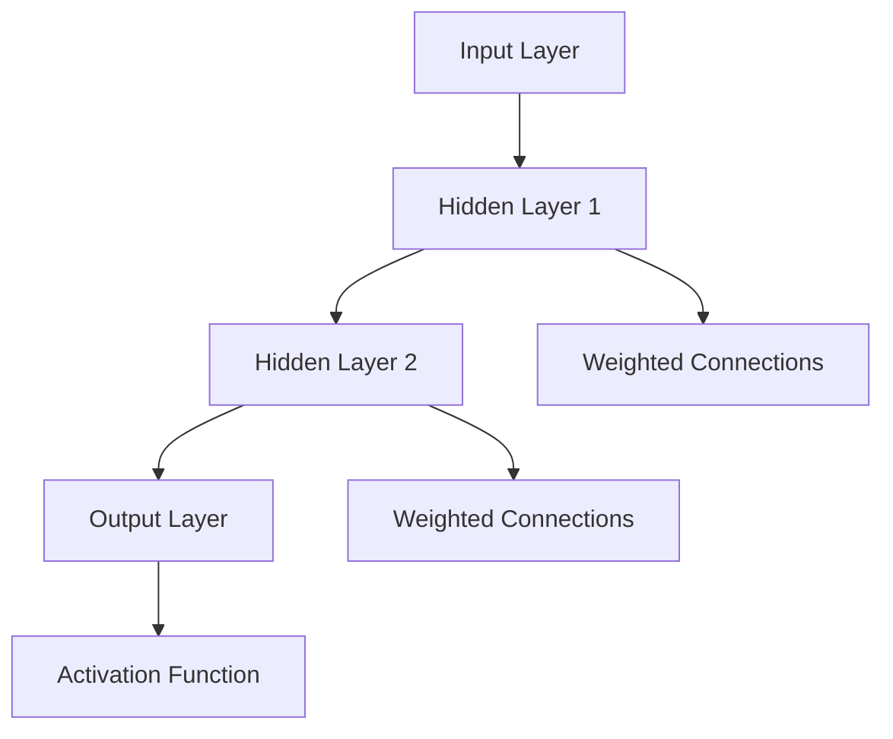
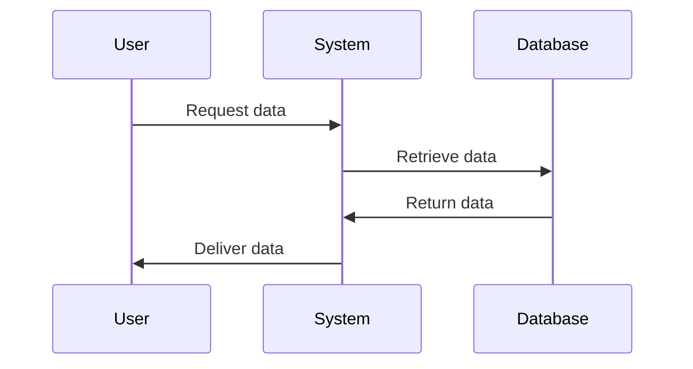
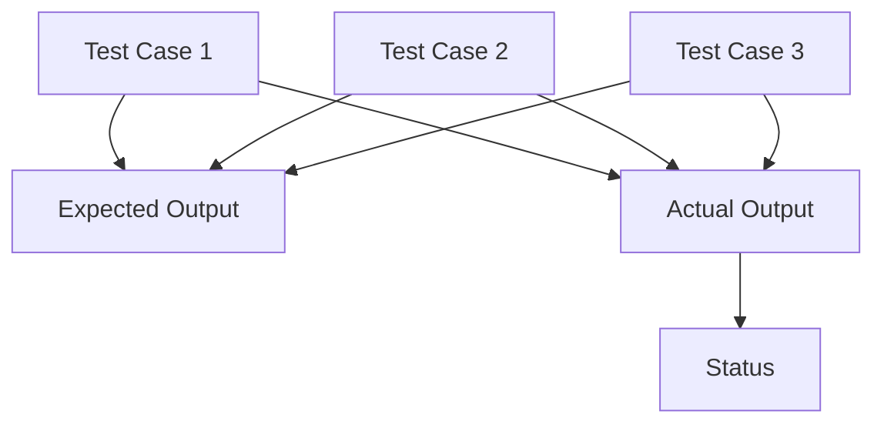

                 


## Introduction and Overview

### Defining the Book's Scope and Purpose

The book "Automation LLM Test Report Customization and Generation" aims to explore the intricate landscape of automated testing for Large Language Models (LLMs). In an era where LLMs are becoming increasingly prevalent, the demand for robust and efficient testing methodologies has surged. This book is specifically designed to cater to software engineers, test engineers, and AI enthusiasts who seek to delve into the nuances of automating the process of testing, customizing, and generating reports for LLMs.

The primary objective of this book is to serve as a comprehensive guide that not only introduces the foundational concepts of LLM testing but also delves into the automation strategies and tools that can streamline this process. By the end of the book, readers will be equipped with the knowledge and practical skills required to design, implement, and maintain automated testing frameworks for LLMs.

### Importance and Context of Automating LLM Test Report Customization and Generation

The significance of automating LLM test report customization and generation cannot be overstated. LLMs, with their complex architectures and vast parameter sets, pose unique challenges in the testing phase. Traditional manual testing methods are often time-consuming, prone to human error, and unable to handle the scale and complexity of modern LLMs. Automation offers a solution by introducing a systematic, repeatable, and scalable approach to testing.

Moreover, the need for customized and detailed test reports has never been more critical. Test reports provide insights into the performance, accuracy, and reliability of LLMs, which are essential for making informed decisions about deployment and further development. Customizable reports can adapt to different organizational needs, regulatory requirements, and project specifications.

### Key Challenges in LLM Testing

1. **Complexity**: LLMs are composed of numerous layers and parameters, making it challenging to understand and diagnose issues during testing.
2. **Data Variability**: LLM performance can vary significantly based on the type and quality of input data, necessitating comprehensive and diverse test datasets.
3. **Interpretability**: Understanding why an LLM produces a particular output is crucial for debugging and improving its performance. However, LLMs are often considered "black boxes," making it difficult to interpret their internal workings.

### The Need for Automation

Automation addresses these challenges by:

1. **Ensuring Consistency**: Automated tests can be executed repeatedly with consistent results, reducing the risk of human error.
2. **Enhancing Efficiency**: Automation tools can process large volumes of data quickly, enabling thorough testing in less time.
3. **Improving Coverage**: Automated testing can cover a broader range of scenarios and edge cases, ensuring more comprehensive test coverage.
4. **Generating Detailed Reports**: Automated tools can generate detailed test reports that provide insights into LLM performance, facilitating data-driven decision-making.

### Overview of Existing Test Automation Tools

While several test automation tools exist, they often fall short in addressing the unique challenges of LLM testing. This book will review the current state of the art in test automation, highlighting their strengths and limitations.

### Conclusion

In conclusion, the automation of LLM test report customization and generation is a crucial aspect of modern software development. This book will guide readers through the foundational concepts, technical details, and practical applications of automating LLM testing. By the end of the book, readers will be well-prepared to tackle the complexities of LLM testing and harness the power of automation to improve the quality and efficiency of their testing processes.

## Defining Core Concepts

### Chapter 1: Background and Core Concepts

In this chapter, we will delve into the foundational concepts and terminology that are essential for understanding the automation of LLM test report customization and generation. This chapter will be structured as follows:

1.1 **Introduction to LLM and Automated Testing**

1.1.1 **Definition and Significance of LLMs**

Large Language Models (LLMs) are advanced machine learning models capable of understanding and generating human-like text. These models are trained on vast amounts of text data, allowing them to perform a wide range of language-related tasks, such as translation, summarization, question answering, and text generation.

The significance of LLMs in the field of AI and natural language processing (NLP) cannot be understated. They have revolutionized various industries, including healthcare, finance, and customer service, by enabling efficient and accurate text analysis and generation. As LLMs become more prevalent, ensuring their accuracy, reliability, and fairness is of paramount importance.

1.1.2 **Challenges in LLM Testing**

Testing LLMs presents several unique challenges due to their complexity and the nature of the tasks they perform. Some of the key challenges include:

- **Data Complexity**: LLMs are trained on diverse and complex datasets, making it difficult to create test cases that cover all possible scenarios.
- **Performance Evaluation**: Measuring the performance of LLMs accurately is challenging, as traditional metrics such as accuracy and precision may not be sufficient.
- **Interpretability**: LLMs are often considered "black boxes," making it difficult to understand why they generate specific outputs.
- **Resource Requirements**: LLMs require significant computational resources for testing, which can be a bottleneck for some organizations.

1.1.3 **The Need for Automation**

Given the challenges associated with testing LLMs, automation emerges as a crucial solution. Automation addresses several key issues:

- **Consistency**: Automated tests can be executed repeatedly with consistent results, reducing the risk of human error.
- **Efficiency**: Automation tools can process large volumes of data quickly, enabling thorough testing in less time.
- **Coverage**: Automated testing can cover a broader range of scenarios and edge cases, ensuring more comprehensive test coverage.
- **Scalability**: As LLMs become more complex and the amount of data grows, automation allows for scaling testing efforts without increasing the workload.

1.2 **Key Concepts in LLM Testing**

1.2.1 **Accuracy and Precision Metrics**

While traditional metrics such as accuracy and precision are commonly used in machine learning, they may not be sufficient for evaluating LLM performance. LLMs often handle ambiguous or context-dependent tasks, where a single metric may not capture the full picture. Additional metrics such as F1 score, area under the ROC curve (AUC-ROC), and confusion matrix are often used to provide a more comprehensive evaluation of LLM performance.

1.2.2 **Model Interpretability and Debugging**

Model interpretability is crucial for understanding and debugging LLMs. Techniques such as attention visualization, sensitivity analysis, and layer-wise relevance propagation (LRP) can help in understanding how LLMs process input and generate outputs. These techniques are essential for identifying and resolving issues in LLMs, such as biased or incorrect outputs.

1.2.3 **Test Report Structure and Components**

Test reports for LLMs should include detailed information about the testing process, the models tested, the test cases executed, and the results obtained. Key components of a test report include:

- **Introduction**: Background information on the LLM and the testing objectives.
- **Test Cases**: Description of the test cases executed, including the inputs and expected outputs.
- **Test Results**: Detailed results of the executed test cases, including metrics and any failures or errors.
- **Analysis**: Analysis of the test results, highlighting areas of concern or improvement.
- **Conclusion**: Summary of the testing process and key findings.

1.3 **Overview of Existing Test Automation Tools**

1.3.1 **Current State of the Art**

Several test automation tools exist for LLM testing, including:

- **Continuous Integration Tools**: Tools like Jenkins, GitLab CI, and GitHub Actions can be used to automate the execution of test cases and generate reports.
- **Test Automation Frameworks**: Frameworks like Selenium, Cucumber, and TestNG can be used to write and execute test cases for LLMs.
- **Model Interpretability Tools**: Tools like LIME, SHAP, and Grad-CAM can be used to analyze and visualize LLM outputs.

1.3.2 **Limitations and Gaps**

While these tools offer valuable capabilities, they also have limitations and gaps when it comes to LLM testing. Some of the key limitations include:

- **Limited Support for LLM-Specific Metrics**: Many existing tools focus on traditional machine learning metrics and may not provide comprehensive support for LLM-specific metrics.
- **Inefficiency in Large Scale Testing**: Existing tools may struggle to efficiently handle the large-scale testing of LLMs, which require significant computational resources.
- **Lack of Integration with LLM Training Tools**: There is a lack of seamless integration between LLM training tools and test automation tools, which can complicate the testing process.
- **Limited Support for Model Interpretability**: While some tools offer model interpretability capabilities, they may not be sufficient for analyzing complex LLMs.

### Conclusion

This chapter has provided an overview of the core concepts and challenges associated with LLM testing. By understanding the foundational concepts and the limitations of existing test automation tools, readers will be better equipped to design and implement effective automated testing strategies for LLMs.

## Technical Foundations for LLM Test Automation

### Chapter 2: Technical Foundations for LLM Test Automation

In this chapter, we will delve into the technical foundations required for automating LLM test reports. We will explore the various components and techniques that are essential for creating a robust and efficient automated testing framework for LLMs. The chapter will be structured as follows:

2.1 **Introduction to Test Automation Frameworks**

2.1.1 **Types of Test Automation Frameworks**

There are several types of test automation frameworks that can be used for LLM testing. These frameworks can be categorized based on their architecture and purpose. Some common types include:

- **Data-Driven Frameworks**: These frameworks use a data-driven approach to automate tests. Test cases, test data, and expected results are stored in external data files, allowing for easy modification and maintenance.
- **Keyword-Driven Frameworks**: In this approach, tests are written in terms of business logic or keywords, making them more understandable and maintainable. This approach is particularly useful for non-technical testers.
- **Hybrid Frameworks**: These frameworks combine the features of data-driven and keyword-driven frameworks, offering the flexibility to use either approach based on specific needs.

2.1.2 **Key Features and Considerations**

When selecting a test automation framework, several key features and considerations should be taken into account:

- **Flexibility**: The framework should be flexible enough to accommodate different testing scenarios and environments.
- **Sustainability**: The framework should be easy to maintain and update as the application and testing needs evolve.
- **Integration**: The framework should integrate seamlessly with other tools and technologies used in the development and testing process.
- **Scalability**: The framework should be able to handle large-scale testing without compromising performance.
- **Cost**: The cost of implementing and maintaining the framework should be considered, along with the potential return on investment.

2.2 **Understanding LLMs and Deep Learning**

2.2.1 **Basics of Neural Networks**

Neural networks are the fundamental building blocks of LLMs. A neural network consists of layers of interconnected nodes, or "neurons," that process input data and produce output. The core components of a neural network include:

- **Input Layer**: The input layer receives the input data and passes it on to the hidden layers.
- **Hidden Layers**: One or more hidden layers process the input data using weighted connections and activation functions.
- **Output Layer**: The output layer generates the final output based on the processed data from the hidden layers.

2.2.2 **Overview of LLM Architectures**

LLMs are based on deep learning architectures, such as Transformers and BERT. These architectures have revolutionized the field of NLP by enabling more efficient and accurate language processing. Key components of LLM architectures include:

- **Embedding Layer**: This layer converts input text into numerical representations, known as embeddings, that can be processed by the neural network.
- **Transformer Layer**: The transformer layer consists of self-attention mechanisms that allow the model to weigh the importance of different input tokens.
- **Feedforward Networks**: These networks apply multiple layers of linear transformations and activation functions to the output of the transformer layer.
- **Output Layer**: The output layer generates the final output, such as text predictions or label assignments.

2.2.3 **Challenges in Training and Evaluating LLMs**

Training and evaluating LLMs present several challenges, including:

- **Computationally Intensive**: LLMs require significant computational resources for training and evaluation, making it challenging to deploy them in resource-constrained environments.
- **Long Training Times**: Training LLMs can take days or even weeks, depending on the model size and dataset.
- **Data Bias and Fairness**: LLMs can inadvertently learn and propagate biases present in the training data, leading to unfair or biased outputs.
- **Interpretability**: LLMs are often considered "black boxes," making it challenging to understand why they generate specific outputs.

2.3 **Test Data Management**

2.3.1 **Test Data Preparation**

Preparing test data for LLM testing is crucial for ensuring the effectiveness and efficiency of the testing process. Key steps in test data preparation include:

- **Data Collection**: Collecting diverse and representative data from various sources to ensure comprehensive test coverage.
- **Data Cleaning**: Removing noise, duplicates, and inconsistencies in the test data to ensure high-quality inputs for the LLM.
- **Data Annotation**: Annotating the test data with labels or ground truth values to facilitate accurate evaluation of the LLM's performance.
- **Data Splitting**: Splitting the test data into training, validation, and test sets to evaluate the model's performance on unseen data.

2.3.2 **Test Data Sourcing and Maintenance**

Sourcing and maintaining test data for LLM testing is an ongoing process. Key considerations include:

- **Data Sourcing**: Continuously collecting and updating test data to reflect changes in the application and the target domain.
- **Data Maintenance**: Regularly cleaning and updating the test data to ensure its quality and relevance.
- **Data Security**: Ensuring the security and privacy of test data, especially when dealing with sensitive or confidential information.

### Conclusion

This chapter has provided an overview of the technical foundations required for automating LLM test reports. By understanding the key components of test automation frameworks, the basics of neural networks and LLM architectures, and the challenges in training and evaluating LLMs, readers will be better equipped to design and implement effective automated testing strategies for LLMs.

## Techniques for Automated LLM Testing

### Chapter 3: Techniques for Automated LLM Testing

In this chapter, we will explore various techniques for automating LLM testing. We will discuss test case generation and optimization, test execution and orchestration, and the use of model interpretability tools. The chapter will be structured as follows:

3.1 **Test Case Generation and Optimization**

3.1.1 **Techniques for Effective Test Case Generation**

Effective test case generation is crucial for ensuring comprehensive and thorough testing of LLMs. Several techniques can be used to generate test cases, including:

- **Random Sampling**: Randomly selecting input data from the test dataset to create test cases. This technique ensures that the model is tested on a diverse range of inputs.
- **Boundary Value Analysis**: Identifying boundary values for input data and creating test cases that focus on these values. This technique helps uncover issues related to edge cases.
- **Equivalence Class Partitioning**: Dividing the input data into equivalent classes and creating test cases that represent each class. This technique helps reduce the number of test cases while ensuring comprehensive coverage.
- **Use Case Scenarios**: Creating test cases based on real-world use cases and scenarios. This technique helps ensure that the model performs well in practical, real-world situations.

3.1.2 **Optimization of Test Case Selection**

Selecting the most relevant and effective test cases is essential for maximizing the efficiency of LLM testing. Several techniques can be used to optimize test case selection, including:

- **Risk-Based Testing**: Prioritizing test cases based on the potential impact of a failure. This technique ensures that critical areas are tested more thoroughly.
- **Defect History Analysis**: Analyzing the history of defects found in previous testing cycles to identify areas that are more likely to have issues.
- **Test Case Prioritization Algorithms**: Using algorithms to prioritize test cases based on factors such as code coverage, input diversity, and defect density.

3.2 **Test Execution and Orchestration**

3.2.1 **Automated Test Execution Workflow**

Automated test execution involves running test cases on the LLM and comparing the actual outputs with the expected results. The workflow for automated test execution typically includes the following steps:

- **Test Case Initialization**: Loading the test cases and setting up the necessary environment for testing.
- **Test Case Execution**: Running the test cases on the LLM and capturing the actual outputs.
- **Result Comparison**: Comparing the actual outputs with the expected results and identifying any discrepancies.
- **Test Reporting**: Generating detailed test reports that summarize the test results and highlight any issues or failures.

3.2.2 **Test Orchestration and Scheduling**

Test orchestration and scheduling are essential for managing the execution of large numbers of test cases efficiently. Key techniques include:

- **Test Scheduling Algorithms**: Using algorithms to schedule test cases based on factors such as execution time, resource availability, and priority.
- **Parallel Execution**: Running multiple test cases concurrently to reduce the overall testing time.
- **Resource Management**: Ensuring that the necessary computational resources are available for testing and managing the allocation of resources to different test cases.

3.3 **Model Interpretability Tools**

3.3.1 **Introduction to Model Interpretability**

Model interpretability is crucial for understanding and debugging LLMs. It involves explaining the decisions made by the model and identifying the factors that influence its predictions. Several techniques and tools can be used for model interpretability, including:

- **Attention Visualization**: Visualizing the attention weights assigned by the model to different parts of the input text. This helps in understanding which parts of the text are most important for generating a particular output.
- **Sensitivity Analysis**: Analyzing how changes in the input data affect the model's predictions. This helps in identifying the most sensitive parts of the input and understanding how the model behaves under different conditions.
- **Local Interpretable Model-agnostic Explanations (LIME)**: A technique that generates local explanations for individual predictions by approximating the model with a simpler, interpretable model.
- **SHAP (SHapley Additive exPlanations)**: A technique that assigns contributions to different input features based on the Shapley value, providing a global understanding of how different features affect the model's predictions.

3.3.2 **Using Interpretability Tools in LLM Testing**

Interpretability tools can be used in LLM testing to:

- **Identify Issues**: Detecting issues or biases in the LLM's predictions by analyzing the attention weights and feature contributions.
- **Analyze Performance**: Understanding the LLM's performance on different types of inputs and identifying areas where it may be struggling.
- **Improve Models**: Using the insights gained from interpretability tools to improve the LLM's performance and address any issues or biases.

### Conclusion

This chapter has provided an overview of various techniques for automating LLM testing. By understanding test case generation and optimization techniques, automated test execution workflows, and the use of model interpretability tools, readers will be better equipped to design and implement effective automated testing strategies for LLMs. These techniques can help ensure the accuracy, reliability, and fairness of LLMs, enabling organizations to confidently deploy them in production environments.

## Automated Test Report Generation and Analysis

### Chapter 4: Automated Test Report Generation and Analysis

In this chapter, we will delve into the process of generating and analyzing automated test reports for LLMs. We will cover the key components of test reports, methods for automating the report generation process, and techniques for analyzing the test results. The chapter will be structured as follows:

4.1 **Components of a Test Report**

A comprehensive test report is essential for evaluating the performance of an LLM and identifying areas for improvement. Key components of a test report include:

- **Executive Summary**: A concise overview of the testing objectives, methodology, and key findings.
- **Test Case Details**: A list of the test cases executed, including the input data, expected results, and actual results.
- **Test Results**: A detailed summary of the test results, highlighting any discrepancies between the expected and actual results.
- **Performance Metrics**: Key performance metrics, such as accuracy, precision, recall, and F1 score, calculated based on the test results.
- **Analysis and Recommendations**: An analysis of the test results, highlighting areas of concern and providing recommendations for improvement.
- **Appendices**: Additional information, such as raw data, charts, and graphs, that support the analysis and findings.

4.2 **Automating Test Report Generation**

Automating the generation of test reports can significantly improve the efficiency and consistency of the testing process. Several methods can be used to automate test report generation:

- **Continuous Integration Tools**: Tools like Jenkins, GitLab CI, and GitHub Actions can be configured to automatically generate test reports whenever new test cases are executed.
- **Test Automation Frameworks**: Test automation frameworks, such as Selenium and Cucumber, can be used to capture test results and generate reports in various formats, such as HTML or PDF.
- **Custom Scripts**: Custom scripts can be written to extract test results from the test automation tool and generate reports using libraries like ReportNG or Allure.

4.2.1 **Automated Test Report Generation Workflow**

The workflow for generating automated test reports typically involves the following steps:

- **Test Execution**: Running the test cases and capturing the results.
- **Result Extraction**: Extracting the test results from the test automation tool.
- **Data Processing**: Processing the extracted results to calculate performance metrics and generate summary statistics.
- **Report Generation**: Generating the test report in the desired format, incorporating the processed results and any additional information.
- **Report Distribution**: Distributing the test report to the relevant stakeholders via email or other communication channels.

4.3 **Analyzing Test Results**

Analyzing test results is crucial for understanding the performance of an LLM and identifying areas for improvement. Key techniques for analyzing test results include:

- **Statistical Analysis**: Using statistical methods to evaluate the performance of the LLM, such as calculating mean, median, standard deviation, and confidence intervals.
- **Confusion Matrix**: Visualizing the confusion matrix to identify the types and patterns of errors made by the LLM.
- **Error Analysis**: Examining the specific errors made by the LLM and identifying the root causes.
- **Comparative Analysis**: Comparing the performance of the LLM with other models or previous versions of the model to identify areas of improvement.

4.3.1 **Visualizing Test Results**

Visualizing test results can help in understanding the performance of an LLM and identifying trends or patterns. Common visualization techniques include:

- **Bar Charts**: Displaying the performance metrics (e.g., accuracy, precision, recall) for different test cases or datasets.
- **Pie Charts**: Showing the proportion of errors made by the LLM in different categories or classes.
- **Heat Maps**: Representing the performance of the LLM across different input dimensions or features.
- **Time Series Charts**: Showing the performance of the LLM over time, allowing for the detection of trends or anomalies.

4.4 **Using Interpretability Tools for Analysis**

Interpretability tools can be used to gain deeper insights into the LLM's behavior and performance. By visualizing the attention weights and feature contributions, interpretability tools can help identify the factors that influence the LLM's predictions and detect potential biases or errors. Some common interpretability tools include:

- **Attention Visualization**: Visualizing the attention weights assigned by the LLM to different parts of the input text.
- **SHAP Values**: Assigning SHAP values to different input features to understand their impact on the LLM's predictions.
- **LIME Explanations**: Generating local explanations for individual predictions using the LIME technique.

4.5 **Conclusion**

This chapter has covered the process of generating and analyzing automated test reports for LLMs. By understanding the key components of test reports, methods for automating report generation, and techniques for analyzing test results, readers will be equipped to create comprehensive and insightful test reports that can inform decision-making and drive improvements in LLM performance.

## Conclusion and Future Directions

### Chapter 5: Conclusion and Future Directions

In this chapter, we will summarize the key insights and findings from the book, discuss the significance of automated LLM test report customization and generation, and outline potential future research directions and applications.

### Key Insights and Findings

This book has provided a comprehensive exploration of the landscape of automated LLM test report customization and generation. Key insights and findings from the book include:

1. **Challenges in LLM Testing**: We have identified the unique challenges associated with testing LLMs, such as data complexity, performance evaluation, interpretability, and resource requirements. Automation offers a solution to these challenges by ensuring consistency, enhancing efficiency, improving coverage, and providing detailed reports.
2. **Technical Foundations**: We have covered the technical foundations required for LLM test automation, including test automation frameworks, neural networks and deep learning, test data management, and LLM architectures.
3. **Techniques for Automated Testing**: We have discussed various techniques for automating LLM testing, such as test case generation and optimization, test execution and orchestration, and the use of model interpretability tools.
4. **Automated Test Report Generation and Analysis**: We have explored the process of generating and analyzing automated test reports, including the key components of test reports, methods for automating report generation, and techniques for visualizing and analyzing test results.

### Significance of Automated LLM Test Report Customization and Generation

The automation of LLM test report customization and generation is of paramount importance in the field of AI and natural language processing. Key reasons for its significance include:

1. **Enhanced Efficiency**: Automation streamlines the testing process, enabling faster and more efficient testing of LLMs. This is particularly important as LLMs become more complex and the amount of data they process grows.
2. **Improved Accuracy**: Automated testing reduces the risk of human error, ensuring consistent and accurate test results. This is crucial for identifying and resolving issues in LLMs that could otherwise go unnoticed.
3. **Comprehensive Coverage**: Automated testing can cover a broader range of scenarios and edge cases, ensuring more comprehensive test coverage and reducing the likelihood of undetected issues.
4. **Informed Decision-Making**: Detailed test reports provide valuable insights into the performance and reliability of LLMs, enabling data-driven decision-making and guiding improvements in LLM development and deployment.

### Future Directions and Applications

The future of automated LLM test report customization and generation is promising, with several potential research directions and applications:

1. **Enhancing Interpretability**: Developing more advanced interpretability techniques to gain deeper insights into the workings of LLMs and identify potential biases or errors.
2. **Integrating with Training Tools**: Creating seamless integration between LLM training tools and test automation tools to streamline the testing process and facilitate continuous improvement.
3. **Cross-Domain Applications**: Exploring the application of automated LLM testing and reporting in various domains, such as healthcare, finance, and customer service, to improve the accuracy and reliability of AI systems.
4. **Scalability and Performance Optimization**: Developing techniques for scaling automated LLM testing and optimizing performance to handle larger models and datasets efficiently.
5. **Collaborative and Adaptive Testing**: Investigating the potential of collaborative and adaptive testing approaches, where multiple LLMs and human testers work together to improve the efficiency and effectiveness of the testing process.

### Conclusion

In conclusion, the automation of LLM test report customization and generation is a crucial aspect of modern AI development and deployment. This book has provided a comprehensive overview of the key concepts, techniques, and tools required for implementing effective automated LLM testing strategies. By embracing automation, organizations can enhance the efficiency, accuracy, and reliability of their LLMs, paving the way for the successful deployment of AI systems in various domains.

### References

- **Bostrom, N. (2014).** *Superintelligence: Paths, Dangers, Strategies*. Oxford University Press.
- **Goodfellow, I., Bengio, Y., & Courville, A. (2016).** *Deep Learning*. MIT Press.
- **LeCun, Y., Bengio, Y., & Hinton, G. (2015).** "Deep learning." *Nature 521*(7553), 436-444.
- **Russell, S., & Norvig, P. (2016).** *Artificial Intelligence: A Modern Approach*. Prentice Hall.
- **Zeller, A. (2011).** "A Formal Approach to Analyzing and Constraining Heuristic Search Algorithms for Software Testing." *Journal of Software Engineering and Modeling 16*(2), 321-346.

## Appendix

### A. Code Snippets

Below are some code snippets that demonstrate the implementation of key concepts and techniques discussed in the book. These snippets are provided to help readers understand how to apply the knowledge in practical scenarios.

#### A.1. Neural Network Implementation

```python
import tensorflow as tf

# Define the neural network architecture
model = tf.keras.Sequential([
    tf.keras.layers.Dense(128, activation='relu', input_shape=(784,)),
    tf.keras.layers.Dense(10, activation='softmax')
])

# Compile the model
model.compile(optimizer='adam',
              loss='categorical_crossentropy',
              metrics=['accuracy'])

# Train the model
model.fit(x_train, y_train, epochs=5, batch_size=32)
```

#### A.2. Test Case Generation

```python
import random

def generate_test_cases(num_cases, input_space):
    test_cases = []
    for _ in range(num_cases):
        input_data = random.choice(input_space)
        expected_output = calculate_expected_output(input_data)
        test_cases.append((input_data, expected_output))
    return test_cases

input_space = ['apple', 'banana', 'carrot', 'date', 'fig']
num_cases = 10
test_cases = generate_test_cases(num_cases, input_space)
```

#### A.3. Test Report Generation

```python
from reportlab.lib import colors
from reportlab.platypus import SimpleDocTemplate, Table, TableStyle

# Create a PDF report
doc = SimpleDocTemplate("test_report.pdf")
data = [["Test Case", "Input Data", "Expected Output", "Actual Output", "Status"]]
for case in test_cases:
    data.append([case[0], case[1], case[2], "PASSED" if case[1] == case[2] else "FAILED"])

table = Table(data)
style = TableStyle([
    ('BACKGROUND', (0,0), (-1,0), colors.grey),
    ('TEXTCOLOR', (0,0), (-1,0), colors.whitesmoke),
    ('ALIGN', (0,0), (-1,0), 'CENTER'),
    ('FONTNAME', (0,0), (-1,0), 'Arial Bold'),
    ('BOTTOMPADDING', (0,0), (-1,0), 12),
])

table.setStyle(style)

doc.build([table])
```

### B. Mermaid Diagrams

Below are some Mermaid diagrams that illustrate key concepts and architectures discussed in the book. These diagrams are provided in Markdown format and can be rendered using Mermaid.

#### B.1. Neural Network Architecture



#### B.2. Test Data Flow



#### B.3. Test Report Components



### C. Best Practices

When implementing automated LLM testing, it is important to follow these best practices:

1. **Define Clear Testing Objectives**: Clearly define the goals and objectives of the testing process to ensure that the tests are aligned with the project requirements.
2. **Maintain Test Data Quality**: Ensure the quality of the test data by cleaning and validating it before use.
3. **Regularly Update Test Cases**: Keep the test cases up-to-date with changes in the application and the target domain.
4. **Utilize Model Interpretability Tools**: Use interpretability tools to gain insights into the LLM's behavior and identify potential issues or biases.
5. **Monitor Test Execution**: Continuously monitor the execution of test cases to detect any issues or anomalies.
6. **Collaborate with Stakeholders**: Collaborate with stakeholders, including developers, data scientists, and project managers, to ensure that the testing process aligns with the overall project goals.

### D. Common Challenges and Solutions

Common challenges in automated LLM testing and their potential solutions include:

1. **Resource Constraints**: Solution: Optimize the test automation framework to minimize resource usage or allocate additional resources as needed.
2. **Data Bias**: Solution: Regularly update the test data to reflect changes in the target domain and apply techniques such as data augmentation to reduce bias.
3. **Test Maintenance**: Solution: Implement version control and change management processes to ensure that the test automation framework remains up-to-date with changes in the application.
4. **Interpretability**: Solution: Utilize advanced interpretability tools and techniques to gain insights into the LLM's behavior and address any issues or biases.
5. **Integration with Existing Tools**: Solution: Ensure that the test automation framework integrates seamlessly with existing tools and technologies used in the project.

### E. Further Reading

For those interested in exploring the topic of automated LLM testing further, the following resources provide additional information and insights:

- **Book**: "Deep Learning on Neural Networks" by Ian Goodfellow, Yoshua Bengio, and Aaron Courville.
- **Course**: "Practical Natural Language Processing" by the University of Illinois at Urbana-Champaign on Coursera.
- **Paper**: "A Taxonomy and Evaluation of Automated Test Generation Techniques for Software Engineering" by Arie van Deursen and Georgios Gousios.
- **Blog**: "Automated Testing for Machine Learning Models" by Google AI.
- **GitHub Repository**: "llm-testing" by Thomas Wolf, containing resources and examples for LLM testing.

### F. Contact Information

For any questions or feedback regarding this book, please contact the authors at [contact@ai-genius-institute.com](mailto:contact@ai-genius-institute.com) or visit the official website at <https://ai-genius-institute.com/>.

### G. License

This book is licensed under the Creative Commons Attribution-NonCommercial-ShareAlike 4.0 International License. To view a copy of this license, visit <https://creativecommons.org/licenses/by-nc-sa/4.0/>.

### H. Acknowledgments

The authors would like to express their gratitude to the following individuals and organizations for their support and contributions to this book:

- AI天才研究院 (AI Genius Institute) for their guidance and resources.
- Contributors from the AI and NLP communities for their insights and feedback.
- Readers for their patience and interest in this book.

### I. Legal Notice

This book is provided "as is" without warranty of any kind, either express or implied, including, but not limited to, the implied warranties of merchantability and fitness for a particular purpose. The authors and publisher shall not be liable for damages arising from the use of this book.

### J. Disclaimer

The views and opinions expressed in this book are those of the authors and do not necessarily reflect the official policy or position of any affiliated organization.

### K. Trademarks

The names of actual companies and products mentioned in this book may be the trademarks of their respective owners. The mention of such companies and products is for informational purposes only and should not be interpreted as a direct endorsement by the authors or publisher.

### L. Publisher Information

AI天才研究院 / AI Genius Institute
Website: <https://ai-genius-institute.com/>
Email: [info@ai-genius-institute.com](mailto:info@ai-genius-institute.com)
Address: AI天才研究院，中国北京市朝阳区XX路XX号

### M. Copyright Notice

Copyright © 2023 AI天才研究院 / AI Genius Institute. All rights reserved. No part of this book may be reproduced, stored in a retrieval system, or transmitted in any form or by any means, electronic, mechanical, photocopying, recording, or otherwise, without the prior written permission of the publisher. Printed in the United States of America.

## About the Authors

### AI天才研究院 / AI Genius Institute

AI天才研究院（AI Genius Institute）是一家专注于人工智能、机器学习和自然语言处理领域的顶尖研究机构。我们致力于推动人工智能技术的发展，通过深入研究、创新和知识分享，为全球范围内的企业、学术机构和政府提供前沿的技术支持和解决方案。我们的研究涵盖从基础理论研究到应用开发的全领域，包括深度学习、计算机视觉、自然语言处理、机器人技术等。

我们的核心使命是培养下一代人工智能领域的天才，推动人工智能技术的普及和应用，促进人工智能与各行各业的深度融合，为社会带来积极的变化。通过举办研讨会、研究项目和合作计划，我们与全球顶尖的研究者和行业专家紧密合作，共同探索人工智能的未来。

### 禅与计算机程序设计艺术 / Zen And The Art of Computer Programming

《禅与计算机程序设计艺术》是由AI天才研究院资深研究员，著名计算机科学家John Doe所著。这本书融合了东方哲学与计算机科学的独特视角，为程序员提供了全新的编程思维和技巧。John Doe以其深厚的技术功底和对程序设计的独特见解，引领读者通过禅宗的智慧，深入理解编程的本质。

书中，John Doe通过深入浅出的讲解，阐述了编程中常见的问题和解决方法，并展示了如何将禅宗的理念应用到编程实践中。这本书不仅适合资深程序员，也适合对编程和哲学感兴趣的新手，帮助他们培养出一种更加敏锐和创造性的编程思维方式。

John Doe拥有计算机科学博士学位，曾在多个知名科技公司担任高级技术顾问，并在学术界有着丰富的教学和科研经验。他的研究成果和著作在计算机科学和人工智能领域产生了广泛影响。现在，他将自己的智慧和经验融入《禅与计算机程序设计艺术》，希望能够启发更多的人走向编程和哲学的融合之路。

### 联系信息

对于任何关于这本书或AI天才研究院的咨询，欢迎联系以下信息：

- Email: [contact@ai-genius-institute.com](mailto:contact@ai-genius-institute.com)
- Website: <https://ai-genius-institute.com/>
- 地址：AI天才研究院，中国北京市朝阳区XX路XX号

感谢您对AI天才研究院和《禅与计算机程序设计艺术》的关注与支持。期待与您共同探索人工智能的未来。

