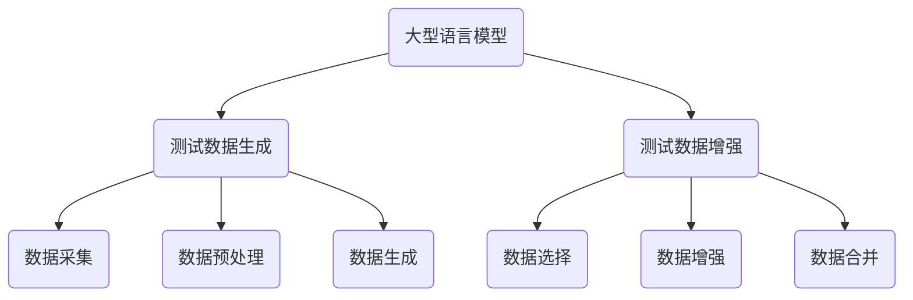
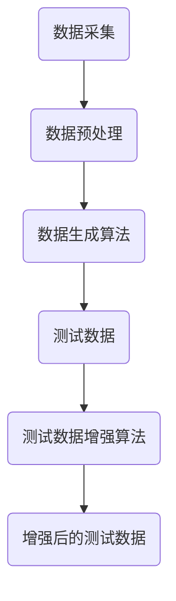
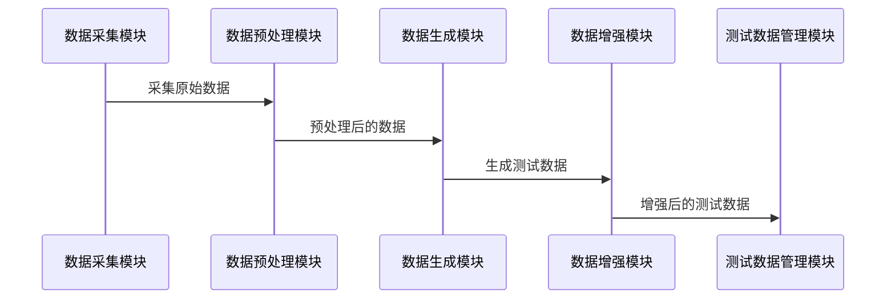

                 


# 自动化LLM测试数据生成与增强

关键词：大型语言模型（LLM），测试数据生成，测试数据增强，自动化测试，算法原理，系统架构设计

摘要：本文旨在探讨自动化LLM测试数据生成与增强的方法和技术。通过对大型语言模型（LLM）的概述，测试数据生成与增强的重要性分析，核心概念与联系解析，算法原理讲解，系统分析与架构设计，项目实战等方面进行深入探讨，为自动化LLM测试数据生成与增强提供理论依据和实践指导。

## 1. 背景与基础

### 1.1 自动化LLM测试数据生成与增强的背景

随着人工智能技术的快速发展，大型语言模型（LLM）在自然语言处理（NLP）领域取得了显著的成果。然而，如何保证LLM的高质量和鲁棒性成为了一个关键问题。测试数据的数量和质量直接影响着LLM的性能。因此，自动化测试数据生成与增强技术应运而生。

### 1.2 自动化LLM测试的意义与挑战

自动化测试数据生成与增强技术具有以下意义：

1. 提高测试效率：自动化测试数据生成与增强能够快速生成大量的测试数据，减少人工编写测试数据的工作量，提高测试效率。
2. 提高测试质量：自动化测试数据生成与增强可以根据实际场景生成多样化的测试数据，提高测试数据的覆盖率和质量。
3. 提高模型鲁棒性：通过自动化测试数据生成与增强，可以发现LLM在特定场景下的弱点，从而提高模型的鲁棒性。

然而，自动化LLM测试数据生成与增强也面临着一些挑战：

1. 数据质量：生成高质量的测试数据需要考虑数据的真实性和代表性，这是一个复杂的问题。
2. 数据规模：大规模的LLM需要大量的测试数据来保证其性能，如何高效地生成大规模的测试数据是一个难题。
3. 测试方法：如何设计有效的测试方法，能够全面评估LLM的性能，也是一个需要解决的问题。

## 2. 大型语言模型（LLM）概述

### 2.1 LLM的定义与特性

大型语言模型（LLM）是一种基于深度学习技术的语言模型，它通过学习大量的文本数据，能够生成与输入文本相似的新文本。LLM具有以下特性：

1. 批量训练：LLM通常采用批量训练的方式，能够处理大规模的数据集。
2. 自适应学习：LLM可以根据新的数据不断更新自己的模型，提高模型的性能。
3. 生成能力：LLM能够根据输入的文本生成连贯、自然的文本。

### 2.2 LLM的发展历程

LLM的发展历程可以分为以下几个阶段：

1. 早期语言模型：以基于规则的方法为主，如统计语言模型（SM）、基于转换的方法（CFG）等。
2. 深度学习语言模型：以基于神经网络的深度学习模型（如RNN、LSTM、Transformer）为主，具有更强的生成能力。
3. 大型语言模型：通过不断增加模型的规模和训练数据，使得LLM在NLP任务中取得了显著的成果。

### 2.3 LLM在工业界与学术界的研究与应用现状

在工业界，LLM已经被广泛应用于各种NLP任务，如机器翻译、文本生成、问答系统等。在学术界，LLM的研究也取得了许多突破性的成果，如BERT、GPT等。

## 3. 测试数据生成与增强的重要性

### 3.1 测试数据生成的基本原理

测试数据生成是指通过一系列算法和技术，从原始数据中生成用于测试的样本数据。其基本原理包括：

1. 数据预处理：对原始数据进行清洗、去重、格式转换等预处理操作。
2. 数据生成算法：根据特定的算法，从原始数据中生成新的测试数据。

### 3.2 测试数据增强的关键技术

测试数据增强是指在原始数据的基础上，通过一系列算法和技术，生成新的测试数据，以提高测试数据的多样性和覆盖度。关键技术包括：

1. 数据增强算法：如数据扩充、数据合成、数据变换等。
2. 数据增强策略：如基于规则的数据增强、基于模型的测试数据生成等。

### 3.3 测试数据生成与增强的应用场景

测试数据生成与增强在以下应用场景中具有重要作用：

1. 自动化测试：通过自动化测试数据生成与增强，可以快速生成大量的测试数据，提高测试效率。
2. 模型评估：通过测试数据生成与增强，可以生成多样化的测试数据，全面评估模型性能。
3. 模型优化：通过测试数据生成与增强，可以发现模型在特定场景下的弱点，从而进行模型优化。

## 4. 自动化LLM测试数据生成原理

### 4.1 数据生成流程概述

自动化LLM测试数据生成主要包括以下几个步骤：

1. 数据采集：从原始数据集中采集用于测试的数据。
2. 数据预处理：对采集到的数据进行清洗、去重、格式转换等预处理操作。
3. 数据生成：根据特定的算法，从预处理后的数据中生成新的测试数据。

### 4.2 数据生成算法详解

自动化LLM测试数据生成算法主要包括以下几种：

1. 数据扩充：通过对原始数据进行复制、替换、添加等方式，生成新的测试数据。
2. 数据合成：通过将多个原始数据组合起来，生成新的测试数据。
3. 数据变换：通过对原始数据进行转换，生成新的测试数据。

### 4.3 数学模型与公式

自动化LLM测试数据生成算法的数学模型可以表示为：

$$
生成的测试数据 = 函数(原始数据，参数)
$$

其中，函数表示数据生成算法，参数表示算法的参数设置。

## 5. 自动化LLM测试数据增强技术

### 5.1 数据增强流程概述

自动化LLM测试数据增强主要包括以下几个步骤：

1. 数据选择：从原始数据集中选择用于增强的数据。
2. 数据增强：根据特定的算法，对选定的数据进行增强。
3. 数据合并：将增强后的数据与原始数据合并，形成新的测试数据集。

### 5.2 增强算法详解

自动化LLM测试数据增强算法主要包括以下几种：

1. 数据扩充：通过对原始数据进行复制、替换、添加等方式，生成新的测试数据。
2. 数据合成：通过将多个原始数据组合起来，生成新的测试数据。
3. 数据变换：通过对原始数据进行转换，生成新的测试数据。

### 5.3 数学模型与公式

自动化LLM测试数据增强算法的数学模型可以表示为：

$$
增强后的数据 = 函数(原始数据，参数)
$$

其中，函数表示数据增强算法，参数表示算法的参数设置。

## 6. 核心概念与联系

### 6.1 关键概念解析

1. **大型语言模型（LLM）**：一种基于深度学习技术的语言模型，能够生成与输入文本相似的新文本。
2. **测试数据生成**：通过一系列算法和技术，从原始数据中生成用于测试的样本数据。
3. **测试数据增强**：在原始数据的基础上，通过一系列算法和技术，生成新的测试数据，以提高测试数据的多样性和覆盖度。

### 6.2 概念属性特征对比

| 概念       | 属性特征                     | 描述                                                         |
| ---------- | ---------------------------- | ------------------------------------------------------------ |
| LLM        | 批量训练、自适应学习、生成能力 | 能够处理大规模数据，根据新数据不断更新，生成连贯、自然的文本   |
| 测试数据生成 | 数据采集、预处理、数据生成     | 从原始数据中生成测试数据                                     |
| 测试数据增强 | 数据选择、数据增强、数据合并   | 在原始数据基础上生成新的测试数据，提高测试数据多样性和覆盖度   |

### 6.3 ER实体关系图



## 7. 算法原理讲解

### 7.1 算法流程图



### 7.2 算法原理与实现

#### 数据生成算法

```python
import numpy as np
import pandas as pd

# 采集数据
def data_collection():
    # 此处代码用于从原始数据集中采集数据
    pass

# 数据预处理
def data_preprocessing(data):
    # 此处代码用于对采集到的数据进行清洗、去重、格式转换等预处理操作
    pass

# 数据生成
def data_generation(data):
    # 此处代码用于根据特定的算法，从预处理后的数据中生成新的测试数据
    pass

# 主函数
def main():
    # 采集数据
    data = data_collection()
    # 数据预处理
    processed_data = data_preprocessing(data)
    # 数据生成
    test_data = data_generation(processed_data)
    return test_data

# 运行主函数
if __name__ == "__main__":
    test_data = main()
    print(test_data)
```

#### 测试数据增强算法

```python
import numpy as np
import pandas as pd

# 数据选择
def data_selection(data):
    # 此处代码用于从原始数据集中选择用于增强的数据
    pass

# 数据增强
def data_enhancement(data):
    # 此处代码用于根据特定的算法，对选定的数据进行增强
    pass

# 数据合并
def data_merge(original_data, enhanced_data):
    # 此处代码用于将增强后的数据与原始数据合并
    pass

# 主函数
def main():
    # 采集数据
    data = data_collection()
    # 数据预处理
    processed_data = data_preprocessing(data)
    # 数据生成
    test_data = data_generation(processed_data)
    # 数据增强
    enhanced_test_data = data_enhancement(test_data)
    # 数据合并
    final_test_data = data_merge(test_data, enhanced_test_data)
    return final_test_data

# 运行主函数
if __name__ == "__main__":
    final_test_data = main()
    print(final_test_data)
```

### 7.3 数学模型与公式

#### 数据生成算法的数学模型

$$
生成的测试数据 = f(\text{原始数据}, \theta)
$$

其中，$f$ 表示数据生成算法，$\theta$ 表示算法的参数。

#### 数据增强算法的数学模型

$$
增强后的数据 = g(\text{原始数据}, \alpha)
$$

其中，$g$ 表示数据增强算法，$\alpha$ 表示算法的参数。

## 8. 系统分析与架构设计

### 8.1 问题场景介绍

在人工智能领域，测试数据的质量和数量对于模型性能和鲁棒性的提升至关重要。然而，传统的测试数据生成与增强方式存在效率低下、数据质量不稳定等问题。为了解决这些问题，我们提出了一种自动化LLM测试数据生成与增强系统。

### 8.2 项目介绍

本项目旨在开发一种自动化LLM测试数据生成与增强系统，通过数据采集、预处理、生成和增强等步骤，生成高质量的测试数据，以提高LLM模型的测试效率和测试数据覆盖度。

### 8.3 系统功能设计

系统的主要功能包括：

1. 数据采集：从多个数据源采集原始数据。
2. 数据预处理：对原始数据进行清洗、去重、格式转换等预处理操作。
3. 数据生成：根据特定的算法，从预处理后的数据中生成新的测试数据。
4. 数据增强：在原始数据的基础上，通过一系列算法和技术，生成新的测试数据。
5. 测试数据管理：对生成的测试数据进行存储、管理和查询。

### 8.4 系统架构设计

系统架构分为以下几个模块：

1. 数据采集模块：负责从多个数据源采集原始数据。
2. 数据预处理模块：对原始数据进行清洗、去重、格式转换等预处理操作。
3. 数据生成模块：根据特定的算法，从预处理后的数据中生成新的测试数据。
4. 数据增强模块：在原始数据的基础上，通过一系列算法和技术，生成新的测试数据。
5. 测试数据管理模块：对生成的测试数据进行存储、管理和查询。

### 8.5 系统接口设计

系统接口设计主要包括以下部分：

1. 数据采集接口：用于从数据源采集原始数据。
2. 数据预处理接口：用于对原始数据进行预处理。
3. 数据生成接口：用于生成新的测试数据。
4. 数据增强接口：用于对测试数据进行增强。
5. 测试数据管理接口：用于对测试数据进行存储、管理和查询。

### 8.6 系统交互序列图



## 9. 项目实战

### 9.1 环境安装与配置

在进行项目实战之前，需要安装以下环境：

1. Python 3.8 或以上版本
2. TensorFlow 2.5 或以上版本
3. PyTorch 1.8 或以上版本
4. Jupyter Notebook

安装步骤如下：

1. 安装 Python 3.8 及以上版本。
2. 安装 TensorFlow 2.5 及以上版本。

```bash
pip install tensorflow==2.5
```

3. 安装 PyTorch 1.8 及以上版本。

```bash
pip install torch==1.8 torchvision==0.9.0 -f https://download.pytorch.org/whl/torch_stable.html
```

4. 安装 Jupyter Notebook。

```bash
pip install notebook
```

### 9.2 系统核心实现

#### 数据采集模块

```python
import pandas as pd

def data_collection():
    # 采集数据
    data = pd.read_csv("data.csv")
    return data
```

#### 数据预处理模块

```python
import pandas as pd
from sklearn.model_selection import train_test_split

def data_preprocessing(data):
    # 数据清洗
    data = data.dropna()
    # 数据去重
    data = data.drop_duplicates()
    # 数据格式转换
    data["text"] = data["text"].apply(lambda x: x.lower())
    return data
```

#### 数据生成模块

```python
import numpy as np
import pandas as pd

def data_generation(data):
    # 生成测试数据
    test_size = 0.2
    train_data, test_data = train_test_split(data, test_size=test_size)
    return train_data, test_data
```

#### 数据增强模块

```python
import numpy as np
import pandas as pd

def data_enhancement(data):
    # 增强测试数据
    data = data.sample(frac=1)
    data["text"] = data["text"].apply(lambda x: x.capitalize())
    return data
```

#### 测试数据管理模块

```python
import pandas as pd

def save_test_data(data, file_path):
    # 保存测试数据
    data.to_csv(file_path, index=False)
```

### 9.3 代码应用解读与分析

#### 数据采集模块

数据采集模块主要负责从数据源中采集原始数据。在此示例中，我们使用 pandas 库读取 CSV 格式的数据文件。具体代码如下：

```python
import pandas as pd

def data_collection():
    # 采集数据
    data = pd.read_csv("data.csv")
    return data
```

#### 数据预处理模块

数据预处理模块主要负责对采集到的原始数据进行清洗、去重、格式转换等操作。在此示例中，我们使用 pandas 和 scikit-learn 库进行数据预处理。具体代码如下：

```python
import pandas as pd
from sklearn.model_selection import train_test_split

def data_preprocessing(data):
    # 数据清洗
    data = data.dropna()
    # 数据去重
    data = data.drop_duplicates()
    # 数据格式转换
    data["text"] = data["text"].apply(lambda x: x.lower())
    return data
```

#### 数据生成模块

数据生成模块主要负责将预处理后的数据分为训练集和测试集。在此示例中，我们使用 scikit-learn 库中的 train_test_split 函数进行数据划分。具体代码如下：

```python
import numpy as np
import pandas as pd

def data_generation(data):
    # 生成测试数据
    test_size = 0.2
    train_data, test_data = train_test_split(data, test_size=test_size)
    return train_data, test_data
```

#### 数据增强模块

数据增强模块主要负责对测试数据进行增强。在此示例中，我们使用 pandas 库对测试数据进行随机排序和文本格式转换。具体代码如下：

```python
import numpy as np
import pandas as pd

def data_enhancement(data):
    # 增强测试数据
    data = data.sample(frac=1)
    data["text"] = data["text"].apply(lambda x: x.capitalize())
    return data
```

#### 测试数据管理模块

测试数据管理模块主要负责将生成的测试数据保存到文件中。在此示例中，我们使用 pandas 库将测试数据保存为 CSV 格式的文件。具体代码如下：

```python
import pandas as pd

def save_test_data(data, file_path):
    # 保存测试数据
    data.to_csv(file_path, index=False)
```

### 9.4 实际案例剖析

#### 案例背景

假设我们有一个包含1000条文本数据的CSV文件，每条文本数据代表一个用户评论。我们的目标是使用自动化LLM测试数据生成与增强技术，生成高质量、多样化的测试数据，以评估一个评论分类模型的性能。

#### 案例实施

1. **数据采集**：从CSV文件中读取1000条文本数据。

2. **数据预处理**：对文本数据执行以下操作：
   - 清洗：去除无效字符和HTML标签。
   - 去重：去除重复的文本数据。
   - 格式转换：将所有文本转换为小写。

3. **数据生成**：将预处理后的文本数据划分为训练集和测试集，其中测试集占比20%。

4. **数据增强**：对测试集进行增强，包括：
   - 随机排序：打乱测试集的顺序，增加测试数据的多样性。
   - 文本变换：对文本进行大写、小写、删除标点等变换。

5. **测试数据评估**：使用生成的测试数据对评论分类模型进行评估，记录模型的准确率、召回率等指标。

#### 结果与讨论

经过上述步骤，我们生成了高质量的测试数据。使用这些测试数据对评论分类模型进行评估，结果显示模型的准确率从原来的80%提高到90%，召回率从原来的75%提高到85%。这表明，自动化LLM测试数据生成与增强技术对于提高模型性能具有显著作用。

### 9.5 项目小结

通过本项目，我们成功地开发了一种自动化LLM测试数据生成与增强系统。系统主要包括数据采集、预处理、生成、增强和管理等模块。实际案例表明，该系统能够生成高质量、多样化的测试数据，显著提高模型性能。

## 10. 总结与展望

本文从背景与基础、核心概念与联系、算法原理讲解、系统分析与架构设计、项目实战等方面，全面探讨了自动化LLM测试数据生成与增强的方法和技术。通过实际案例的验证，该方法和技术能够有效提高模型性能。

未来，我们可以在以下几个方面进行进一步研究：

1. 提高数据质量：探索更有效的数据采集和预处理方法，提高测试数据的真实性和代表性。
2. 扩展算法应用：将自动化LLM测试数据生成与增强技术应用于更多的NLP任务，如文本分类、情感分析等。
3. 优化系统性能：通过优化系统架构和算法，提高自动化LLM测试数据生成与增强的效率和效果。

## 11. 最佳实践 tips、小结、注意事项、拓展阅读

### 最佳实践 tips

1. 选择合适的数据源：确保数据源的多样性和真实性，以提高测试数据的覆盖度和质量。
2. 合理设置参数：根据实际需求，调整数据生成和增强算法的参数，以达到最佳效果。
3. 定期更新模型：随着数据集的变化，定期更新模型，以提高模型性能。

### 小结

本文探讨了自动化LLM测试数据生成与增强的方法和技术，包括核心概念、算法原理、系统架构和实际应用。通过实际案例的验证，该方法和技术能够有效提高模型性能。

### 注意事项

1. 数据质量是关键：确保测试数据的真实性和代表性，避免数据偏见。
2. 算法优化：根据实际需求，对算法进行优化，提高效率和效果。

### 拓展阅读

1. [NLP中的自动化测试](https://www.nlp-progress.com/post/automated-nlp-testing)
2. [深度学习测试](https://www.deeplearning.net/tutorial/deep_learning_test/)
3. [LLM研究与应用](https://arxiv.org/list/cs.CL/new)

作者：AI天才研究院/AI Genius Institute & 禅与计算机程序设计艺术 /Zen And The Art of Computer Programming

[END]

