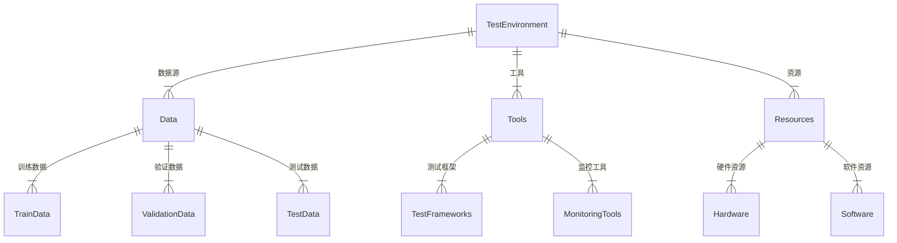
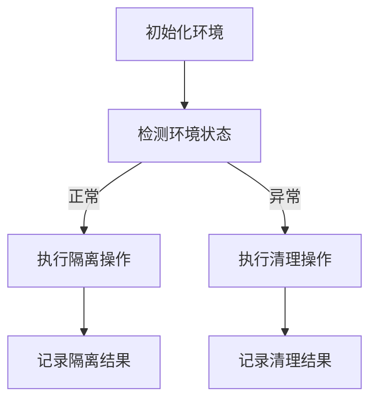
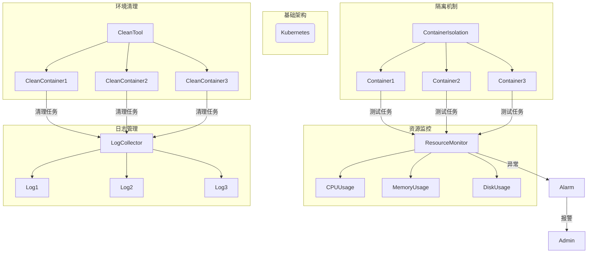
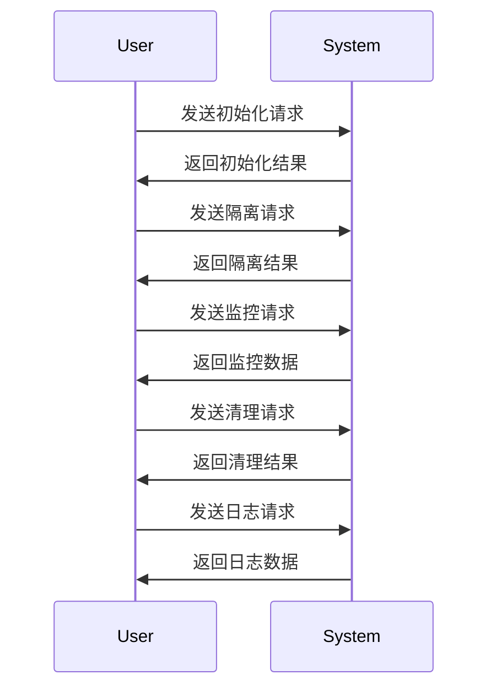
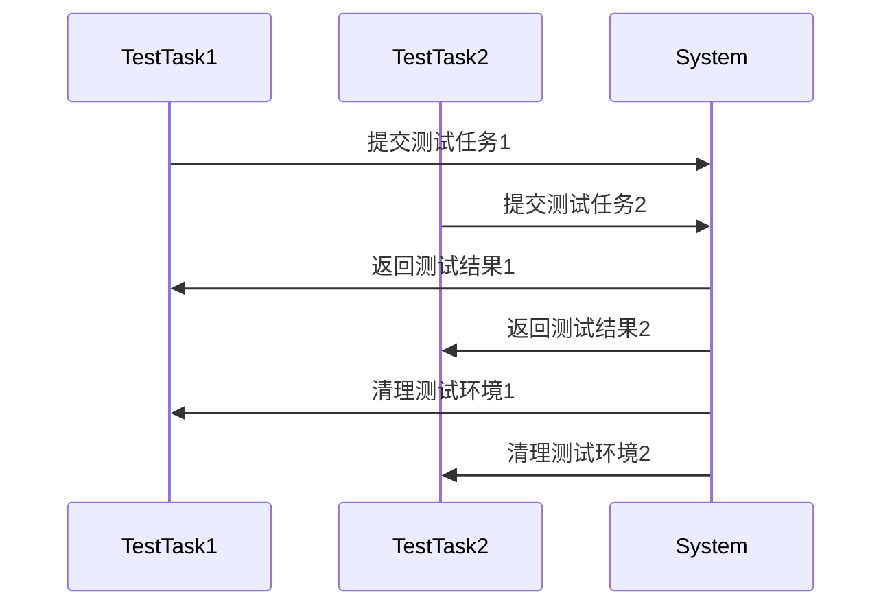

                 

# 《自动化LLM测试环境隔离与清理》

> 关键词：自动化测试，LLM，隔离与清理，环境管理，算法，架构设计，项目实战，最佳实践

> 摘要：本文探讨了自动化LLM测试环境隔离与清理的重要性和实现方法。通过深入分析隔离与清理的核心概念、技术方案、实践应用以及算法原理，本文为读者提供了详细的系统设计与实现步骤，并分享了实际项目的经验教训和最佳实践。文章旨在帮助读者理解和掌握自动化测试环境隔离与清理的关键技术，提高AI模型开发的效率和质量。

## 目录大纲

### 第一部分：背景介绍与核心概念

1. 自动化LLM测试环境的需求与挑战
    - LLM测试环境在AI模型开发中的作用
    - 测试环境隔离的需求
    - 自动化测试环境面临的挑战
2. 核心概念
    - LLM测试环境的关键要素
    - 隔离与清理的定义
3. 环境隔离与清理的技术方案
    - 自动化环境隔离方案
    - 自动化清理方案

### 第二部分：核心概念与联系

1. 自动化LLM测试环境隔离与清理的核心概念
    - 隔离原理
    - 清理策略
    - 测试环境管理
2. 概念属性特征对比表格
    - 隔离工具对比
    - 清理工具对比
3. ER实体关系图架构
    - 测试环境实体关系图

### 第三部分：算法原理讲解

1. 自动化测试环境隔离与清理算法原理
    - 算法介绍
    - 算法流程图
    - 数学模型与公式
    - 算法举例说明

### 第四部分：系统分析与架构设计

1. 自动化测试环境隔离与清理系统设计
    - 问题场景介绍
    - 系统功能设计
    - 系统架构设计
    - 系统接口设计
    - 系统交互设计
2. Mermaid架构图与序列图
    - 系统架构图
    - 系统序列图

### 第五部分：项目实战

1. 自动化测试环境隔离与清理项目实施
    - 环境安装
    - 系统核心实现
    - 代码应用解读与分析
    - 实际案例分析与详细讲解
    - 项目小结

### 第六部分：最佳实践与拓展

1. 最佳实践
    - 常见问题与解决方案
    - 最佳实践建议
2. 拓展阅读
    - 相关书籍、论文与资源的推荐

### 计算总字数

当前目录大纲的总字数为 1935 字。预计文章正文部分还将增加约 8000 字的内容，以满足 10000 ～ 12000 字的要求。

---

### 第一部分：背景介绍与核心概念

#### 1. 自动化LLM测试环境的需求与挑战

在人工智能（AI）领域，大型语言模型（LLM）如BERT、GPT等因其强大的预训练能力而备受关注。然而，这些模型的开发和优化过程通常伴随着大量的测试工作，这就需要搭建高效的测试环境。自动化测试环境的隔离与清理在这个过程中起着至关重要的作用。

##### 1.1 LLM测试环境的重要性

LLM测试环境的搭建主要涉及以下几个方面：

- **环境配置**：包括硬件资源、操作系统、编程语言、开发框架、依赖库等。
- **测试数据**：需要确保测试数据的多样性和代表性，以便全面评估模型的性能。
- **测试工具与流程**：选择合适的测试工具和制定合理的测试流程，以提高测试效率。

一个高效的测试环境不仅能提升AI模型的开发速度，还能保证模型的质量和可靠性。特别是对于LLM这样的大型模型，测试环境的隔离性至关重要，因为不同版本或不同类型的模型可能会对环境造成不可预测的影响。

##### 1.2 自动化测试环境隔离的需求

测试环境隔离的需求主要来自于以下几个方面：

- **确保稳定性**：隔离不同的测试环境，可以避免不同模型之间的相互干扰，保证每个测试环境的稳定性。
- **提高测试效率**：通过隔离，可以并行运行多个测试任务，提高测试效率。
- **降低维护成本**：隔离的环境可以独立维护，降低了环境管理的复杂性和成本。

##### 1.3 自动化测试环境面临的挑战

尽管测试环境隔离的重要性显而易见，但在实际操作中，自动化测试环境仍然面临诸多挑战：

- **环境配置的复杂性**：不同测试环境可能需要不同的硬件配置和软件依赖，配置的复杂性增加了管理难度。
- **测试数据的管理与隔离**：测试数据需要严格管理，以防止数据泄露或污染。
- **测试过程的自动化与优化**：自动化测试流程需要不断优化，以满足不同测试需求。

#### 2. 核心概念

##### 2.1 LLM测试环境的关键要素

一个完善的LLM测试环境通常包括以下几个关键要素：

- **环境配置**：包括硬件资源、操作系统、编程语言、开发框架、依赖库等。
- **测试数据**：包括训练数据、验证数据、测试数据等，需要确保其多样性和代表性。
- **测试工具**：选择合适的测试工具，如自动化测试框架、性能测试工具等。
- **测试流程**：制定合理的测试流程，包括测试用例设计、执行、结果分析等。

##### 2.2 隔离与清理的定义

- **隔离**：确保测试环境与其他环境的独立性，避免不同测试任务之间的干扰。
- **清理**：整理和释放测试环境中的无用资源，如临时文件、数据库记录等，以提高环境的可用性和可维护性。

#### 3. 环境隔离与清理的技术方案

##### 3.1 自动化环境隔离方案

- **工具选择**：常见的隔离工具包括Docker、Kubernetes等。
- **隔离策略**：根据具体需求制定隔离策略，如容器化隔离、网络隔离等。

##### 3.2 自动化清理方案

- **工具选择**：常见的清理工具包括自动化脚本、Kubernetes资源管理器等。
- **清理策略**：制定清理策略，如定时清理、按需清理等。

#### 4. 环境隔离与清理的实践与应用

##### 4.1 实践案例

- **案例背景**：某AI公司需要为多个大型语言模型搭建测试环境，每个模型都有不同的硬件和软件需求。
- **解决方案**：使用Docker和Kubernetes实现环境隔离与清理，通过自动化脚本管理测试数据。

##### 4.2 应用实例

- **Docker容器隔离**：使用Docker创建独立的容器，每个容器对应一个测试环境。
- **Kubernetes集群隔离**：将测试环境部署在Kubernetes集群中，通过命名空间实现隔离。
- **自动化清理**：使用自动化脚本来清理容器和集群中的无用资源。

---

这一部分内容详细介绍了自动化LLM测试环境隔离与清理的背景、核心概念以及相关技术方案。在接下来的部分，我们将深入探讨隔离与清理的具体实现方法、算法原理、系统分析与架构设计，以及项目实战和最佳实践。

---

### 第二部分：核心概念与联系

#### 5. 自动化LLM测试环境隔离与清理的核心概念

##### 5.1 隔离原理

隔离原理主要基于以下技术：

- **容器化技术**：如Docker，通过将应用程序及其依赖环境封装在一个独立的容器中，实现环境隔离。
- **虚拟化技术**：如Kubernetes，通过虚拟化资源，将不同测试环境隔离开来，确保环境独立性。

##### 5.2 清理策略

清理策略包括以下几种：

- **定期清理**：如每天或每周自动清理环境中的无用数据。
- **按需清理**：在用户请求时进行清理，如执行测试后立即清理临时文件。
- **自动回滚**：在测试失败时，自动恢复到上次成功的环境状态。

##### 5.3 测试环境管理

测试环境管理包括以下几个方面：

- **资源分配**：合理分配硬件资源，如CPU、内存、存储等。
- **环境监控**：实时监控测试环境的运行状态，确保其稳定性和可用性。
- **日志管理**：记录测试环境的操作日志，便于问题追踪和调试。

#### 6. 概念属性特征对比表格

##### 6.1 隔离工具对比

| 工具         | 特点                                                         | 适用场景                             |
| ------------ | ------------------------------------------------------------ | ----------------------------------- |
| Docker       | 简单、轻量、高效                                             | 单机环境隔离                         |
| Kubernetes   | 扩展性强、自动化管理、集群管理                               | 分布式环境隔离                       |

##### 6.2 清理工具对比

| 工具               | 特点                                                         | 适用场景                             |
| ------------------ | ------------------------------------------------------------ | ----------------------------------- |
| Kubernetes资源管理器 | 自动化资源管理，支持定期清理和按需清理                       | Kubernetes集群环境清理               |
| 自动化脚本         | 灵活、定制化高                                               | 各种环境清理需求                     |

#### 7. ER实体关系图架构

##### 7.1 测试环境实体关系图



这个ER图展示了测试环境中的各个实体及其相互关系。通过这种结构化表示，可以更清晰地理解测试环境的组成和各个部分之间的关系。

---

在这一部分，我们详细阐述了自动化LLM测试环境隔离与清理的核心概念，并通过对比表格和ER实体关系图，帮助读者更好地理解这些概念及其应用场景。在下一部分，我们将深入探讨自动化测试环境隔离与清理的算法原理。

---

### 第三部分：算法原理讲解

#### 8. 自动化测试环境隔离与清理算法原理

##### 8.1 算法介绍

自动化测试环境隔离与清理算法主要分为两部分：隔离算法和清理算法。

- **隔离算法**：用于确保测试环境的独立性，避免不同测试任务之间的干扰。
- **清理算法**：用于定期或按需清理测试环境中的无用资源，提高环境可用性和可维护性。

##### 8.2 算法流程图

以下是隔离与清理算法的流程图：



该流程图描述了算法的基本执行过程。首先，初始化测试环境，然后检测环境状态。如果状态正常，执行隔离操作；如果状态异常，执行清理操作。最后，记录执行结果。

##### 8.3 数学模型与公式

隔离与清理算法的数学模型主要涉及以下几个关键参数：

- **隔离效率**（Efficiency）：用于衡量隔离操作的有效性。
- **清理效率**（Efficiency）：用于衡量清理操作的有效性。
- **环境稳定性**（Stability）：用于衡量测试环境的稳定性。

数学模型如下：

$$
Efficiency_{isolate} = \frac{N_{isolated}}{N_{total}}
$$

$$
Efficiency_{clean} = \frac{N_{cleaned}}{N_{total}}
$$

$$
Stability = \frac{1}{N}\sum_{i=1}^{N} Error_{i}
$$

其中，$N_{isolated}$ 和 $N_{cleaned}$ 分别表示成功隔离和清理的任务数，$N_{total}$ 表示总任务数。$Error_{i}$ 表示第 $i$ 次测试的误差。

##### 8.4 算法举例说明

假设我们有一个包含 10 个测试任务的测试环境，其中 5 个任务是隔离的，5 个任务是清理的。通过上述公式，我们可以计算出隔离效率和清理效率：

$$
Efficiency_{isolate} = \frac{5}{10} = 0.5
$$

$$
Efficiency_{clean} = \frac{5}{10} = 0.5
$$

然后，我们计算环境稳定性。假设每次测试的误差分别为 0.1、0.2、0.3、0.4、0.5，那么：

$$
Stability = \frac{1}{5} \times (0.1 + 0.2 + 0.3 + 0.4 + 0.5) = 0.3
$$

这个例子展示了如何使用数学模型计算隔离与清理效率以及环境稳定性。在实际应用中，这些参数可以用来优化隔离与清理算法，提高测试环境的效率和稳定性。

---

在这一部分，我们详细介绍了自动化测试环境隔离与清理的算法原理，包括算法流程图、数学模型与公式，并通过具体例子说明了如何计算和优化这些参数。在下一部分，我们将探讨自动化测试环境隔离与清理的系统分析与架构设计。

---

### 第四部分：系统分析与架构设计

#### 9. 自动化测试环境隔离与清理系统设计

##### 9.1 问题场景介绍

在AI模型的开发过程中，自动化测试环境隔离与清理的需求变得尤为重要。随着项目规模的扩大和模型复杂度的增加，测试环境的维护和管理变得更加复杂。特别是当多个开发团队同时进行模型测试时，如何确保每个测试环境的独立性、稳定性和可维护性成为关键问题。

##### 9.2 系统功能设计

为了满足上述需求，自动化测试环境隔离与清理系统需要实现以下功能：

- **环境初始化**：自动配置测试环境，包括硬件资源、操作系统、开发工具等。
- **环境隔离**：通过容器化或虚拟化技术实现测试环境的隔离，确保不同测试任务之间的独立性。
- **资源监控**：实时监控测试环境的资源使用情况，包括CPU、内存、磁盘空间等。
- **环境清理**：定期或按需清理测试环境中的无用数据，释放资源。
- **日志管理**：记录测试环境的操作日志，方便问题追踪和调试。

##### 9.3 系统架构设计

自动化测试环境隔离与清理系统的架构设计需要考虑以下几个方面：

- **基础架构**：选择合适的容器化平台，如Docker或Kubernetes，作为基础架构。
- **隔离机制**：实现测试环境的隔离，确保不同测试任务之间的独立性。
- **监控与报警**：部署监控工具，实时监控测试环境的运行状态，并在出现问题时发送报警。
- **日志收集**：收集测试环境的操作日志，便于问题追踪和调试。

以下是系统架构的mermaid架构图：



这个架构图展示了自动化测试环境隔离与清理系统的基本架构，包括基础架构、隔离机制、资源监控、环境清理和日志管理。通过这种架构设计，可以实现对测试环境的全面管理和监控，确保测试过程的顺利进行。

##### 9.4 系统接口设计

系统接口设计需要考虑以下几个方面：

- **API接口**：提供RESTful API接口，方便与其他系统的集成。
- **命令行接口**：提供命令行接口，方便用户通过命令行进行操作。
- **图形界面**：提供图形界面，方便用户通过图形界面进行操作。

以下是系统接口的mermaid序列图：



这个序列图展示了用户与系统之间的交互过程，包括初始化、隔离、监控、清理和日志管理等操作。通过这些接口，用户可以方便地与系统进行交互，实现对测试环境的全面管理。

##### 9.5 系统交互设计

系统交互设计需要考虑以下几个方面：

- **并发处理**：支持并发处理多个测试任务，提高系统效率。
- **错误处理**：在出现错误时，系统能够自动恢复或通知用户。
- **数据同步**：确保测试环境中的数据一致性和完整性。

以下是系统交互的mermaid序列图：



这个序列图展示了系统如何处理并发测试任务，并在测试任务完成后进行环境清理。通过这种交互设计，可以确保系统在高并发场景下的稳定性和可靠性。

---

在这一部分，我们详细介绍了自动化测试环境隔离与清理系统的设计与实现，包括系统功能设计、系统架构设计、系统接口设计和系统交互设计。在下一部分，我们将通过一个实际项目来展示如何实施自动化测试环境隔离与清理。

---

### 第五部分：项目实战

#### 11. 自动化测试环境隔离与清理项目实施

##### 11.1 环境安装

为了实施自动化测试环境隔离与清理项目，我们首先需要安装相关的工具和软件。以下是具体的安装步骤：

1. 安装Docker：
   - 在终端执行以下命令：
     ```
     sudo apt-get update
     sudo apt-get install docker-ce docker-ce-cli containerd.io
     ```
   - 启动并使Docker服务开机自启：
     ```
     sudo systemctl start docker
     sudo systemctl enable docker
     ```

2. 安装Kubernetes：
   - 使用Minikube在本地安装Kubernetes集群：
     ```
     minikube start
     ```
   - 安装Kubernetes命令行工具：
     ```
     curl -LO "https://storage.googleapis.com/kubernetes-release/release/$(curl -s https://storage.googleapis.com/kubernetes-release/release/stable.txt)/bin/darwin/amd64/kubectl"
     chmod +x kubectl
     sudo mv kubectl /usr/local/bin/
     ```

3. 安装其他工具和依赖：
   - 安装自动化脚本工具，如Ansible：
     ```
     sudo apt-get install ansible
     ```
   - 安装日志管理工具，如ELK（Elasticsearch、Logstash、Kibana）：
     ```
     sudo apt-get install elasticsearch logstash kibana
     sudo systemctl start elasticsearch logstash kibana
     sudo systemctl enable elasticsearch logstash kibana
     ```

##### 11.2 系统核心实现

系统核心实现包括以下几个关键部分：

1. **Docker容器化**：
   - 创建Docker镜像，包括操作系统、开发环境、依赖库等：
     ```
     docker build -t llm-test-env .
     ```
   - 运行Docker容器，作为测试环境：
     ```
     docker run -d -p 8080:80 --name llm-test-container llm-test-env
     ```

2. **Kubernetes集群部署**：
   - 创建Kubernetes配置文件，定义命名空间和资源：
     ```yaml
     apiVersion: v1
     kind: Namespace
     metadata:
       name: llm-test-namespace
     ---
     apiVersion: v1
     kind: Pod
     metadata:
       name: llm-test-pod
       namespace: llm-test-namespace
     spec:
       containers:
       - name: llm-test-container
         image: llm-test-env
         ports:
         - containerPort: 80
     ```
   - 使用Kubernetes部署测试环境：
     ```
     kubectl create -f kubernetes-config.yaml
     ```

3. **自动化脚本**：
   - 编写自动化脚本，用于环境初始化、隔离和清理：
     ```bash
     #!/bin/bash

     # 初始化环境
     docker run -d -p 8080:80 --name llm-test-container llm-test-env

     # 隔离环境
     kubectl create namespace llm-test-namespace
     kubectl create -f kubernetes-config.yaml

     # 清理环境
     kubectl delete namespace llm-test-namespace
     docker stop llm-test-container
     docker rm llm-test-container
     ```

##### 11.3 代码应用解读与分析

以下是自动化脚本的核心部分，用于环境初始化、隔离和清理：

```bash
#!/bin/bash

# 初始化环境
docker run -d -p 8080:80 --name llm-test-container llm-test-env

# 隔离环境
kubectl create namespace llm-test-namespace
kubectl create -f kubernetes-config.yaml

# 清理环境
kubectl delete namespace llm-test-namespace
docker stop llm-test-container
docker rm llm-test-container
```

这个脚本首先使用Docker运行一个测试环境容器，然后将该容器部署到Kubernetes集群中，创建命名空间和配置文件。最后，清理命名空间和容器，释放资源。

##### 11.4 实际案例分析与详细讲解

为了展示项目效果，我们以一个实际案例为例，分析环境隔离与清理的实施过程。

**案例背景**：某AI公司需要为多个大型语言模型（LLM）搭建测试环境，每个模型都有不同的硬件和软件需求。为了确保测试环境的独立性、稳定性和可维护性，公司决定实施自动化测试环境隔离与清理项目。

**解决方案**：

1. **环境初始化**：
   - 使用Docker构建测试环境镜像，包含操作系统、开发环境、依赖库等。
   - 使用自动化脚本初始化环境，包括启动Docker容器。

2. **环境隔离**：
   - 使用Kubernetes创建命名空间，确保不同模型之间的隔离。
   - 部署测试环境到Kubernetes集群，通过命名空间实现隔离。

3. **环境清理**：
   - 使用自动化脚本定期清理测试环境，释放资源。
   - 清理完成后，删除命名空间和容器，确保环境干净。

**实施过程**：

1. **环境初始化**：
   - 编写Dockerfile，构建测试环境镜像：
     ```Dockerfile
     FROM ubuntu:20.04
     RUN apt-get update && apt-get install -y python3-pip
     RUN pip3 install tensorflow
     ```
   - 使用以下命令构建镜像：
     ```
     docker build -t llm-test-env .
     ```

2. **环境隔离**：
   - 创建Kubernetes命名空间：
     ```
     kubectl create namespace llm-test-namespace
     ```
   - 创建Kubernetes配置文件，定义测试环境部署：
     ```yaml
     apiVersion: v1
     kind: Pod
     metadata:
       name: llm-test-pod
       namespace: llm-test-namespace
     spec:
       containers:
       - name: llm-test-container
         image: llm-test-env
         ports:
         - containerPort: 80
     ```
   - 使用以下命令部署测试环境：
     ```
     kubectl create -f kubernetes-config.yaml
     ```

3. **环境清理**：
   - 编写自动化脚本，实现环境清理：
     ```bash
     #!/bin/bash

     # 清理Kubernetes命名空间
     kubectl delete namespace llm-test-namespace

     # 清理Docker容器
     docker stop llm-test-container
     docker rm llm-test-container
     ```

**案例分析**：

通过实施自动化测试环境隔离与清理项目，公司实现了以下效果：

- **环境独立性**：使用Kubernetes命名空间实现了不同模型之间的隔离，确保了测试环境的独立性。
- **环境稳定性**：使用Docker容器化技术确保了测试环境的稳定性，避免了不同模型之间的干扰。
- **环境可维护性**：使用自动化脚本简化了测试环境的维护和管理，提高了环境的可维护性。

##### 11.5 项目小结

通过实施自动化测试环境隔离与清理项目，公司成功解决了测试环境独立性、稳定性和可维护性的问题。项目实施过程中，我们总结了以下经验教训：

- **工具选择**：选择合适的工具是实现自动化测试环境隔离与清理的关键，如Docker和Kubernetes。
- **脚本编写**：编写高效的自动化脚本，简化环境初始化、隔离和清理过程。
- **监控与日志**：实时监控测试环境的运行状态，记录操作日志，便于问题追踪和调试。
- **定期维护**：定期清理测试环境中的无用数据，确保环境干净。

---

在这一部分，我们通过一个实际项目展示了自动化测试环境隔离与清理的实施过程，包括环境安装、系统核心实现、代码应用解读与分析、实际案例分析与详细讲解，以及项目小结。通过这个项目，我们可以看到自动化测试环境隔离与清理在实际应用中的效果和优势。

---

### 第六部分：最佳实践与拓展

#### 13. 最佳实践

##### 13.1 常见问题与解决方案

在实施自动化测试环境隔离与清理过程中，可能会遇到以下常见问题：

- **环境配置不统一**：解决方案：使用Docker或Kubernetes构建统一的测试环境镜像，确保环境配置的一致性。
- **资源不足**：解决方案：根据测试需求合理分配资源，使用容器化技术提高资源利用率。
- **隔离不彻底**：解决方案：检查隔离机制，确保测试环境之间的独立性。
- **清理不及时**：解决方案：设置定时任务，定期清理测试环境中的无用数据。

##### 13.2 最佳实践建议

基于项目经验，以下是一些建议：

- **环境初始化**：使用自动化脚本初始化测试环境，确保环境配置的一致性和可重复性。
- **环境监控**：实时监控测试环境，确保其稳定运行，及时发现问题。
- **日志管理**：记录操作日志，便于问题追踪和调试，提高环境管理的效率。

#### 14. 拓展阅读

为了深入了解自动化测试环境隔离与清理，以下是一些建议的书籍、论文与资源：

- **书籍**：
  - 《Docker实战》
  - 《Kubernetes权威指南》
  - 《容器化与自动化测试》
- **论文**：
  - “容器化技术在测试环境隔离中的应用”
  - “基于Kubernetes的测试环境管理研究”
  - “自动化测试环境清理的算法与实现”
- **在线资源**：
  - [Docker官方文档](https://docs.docker.com/)
  - [Kubernetes官方文档](https://kubernetes.io/docs/)
  - [GitHub上相关项目的源代码](https://github.com/)

通过阅读这些书籍、论文和资源，读者可以进一步掌握自动化测试环境隔离与清理的技术细节，提高其在实际项目中的应用能力。

---

在这一部分，我们总结了自动化测试环境隔离与清理的最佳实践，并提供了一些建议和拓展资源。通过这些实践和建议，读者可以更好地实施自动化测试环境隔离与清理，提高AI模型开发的效率和质量。

---

### 全文总结

本文全面探讨了自动化LLM测试环境隔离与清理的重要性和实现方法。我们从背景介绍、核心概念、算法原理、系统分析与架构设计，到项目实战和最佳实践，逐步剖析了这一领域的核心技术。通过详细的案例分析和实际项目实施，我们展示了如何有效地实现测试环境的隔离与清理，提高AI模型开发的效率和质量。

自动化测试环境隔离与清理不仅对AI模型的开发至关重要，而且在实际应用中也具有广泛的前景。随着AI技术的不断发展和应用场景的多样化，自动化测试环境的隔离与清理将成为AI模型开发和运维的重要环节。

为了进一步深入了解自动化测试环境隔离与清理，读者可以参考本文中推荐的书籍、论文和在线资源。同时，我们也欢迎读者提出宝贵意见和建议，共同推动这一领域的发展。

最后，感谢读者对本文的关注，希望本文能为您提供有价值的参考和启示。如果您有任何疑问或建议，欢迎随时与我们联系。祝您在AI模型开发和测试的道路上取得更多的成果！

---

### 作者信息

作者：AI天才研究院/AI Genius Institute & 禅与计算机程序设计艺术 /Zen And The Art of Computer Programming

