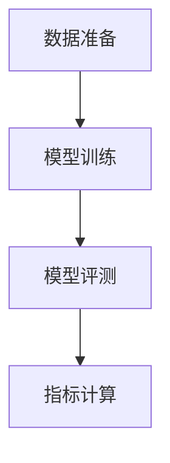
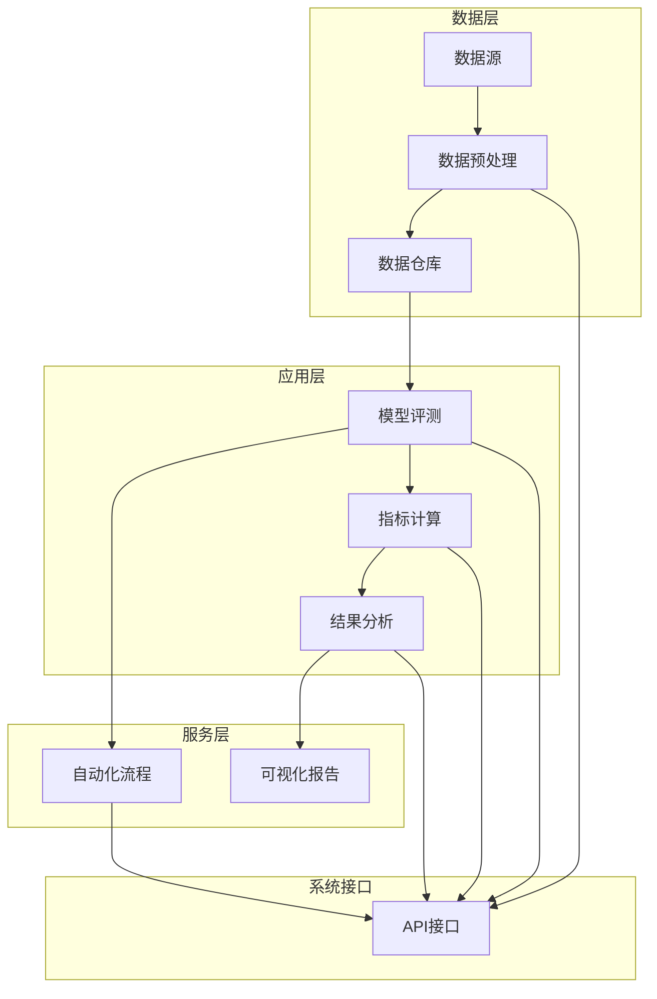
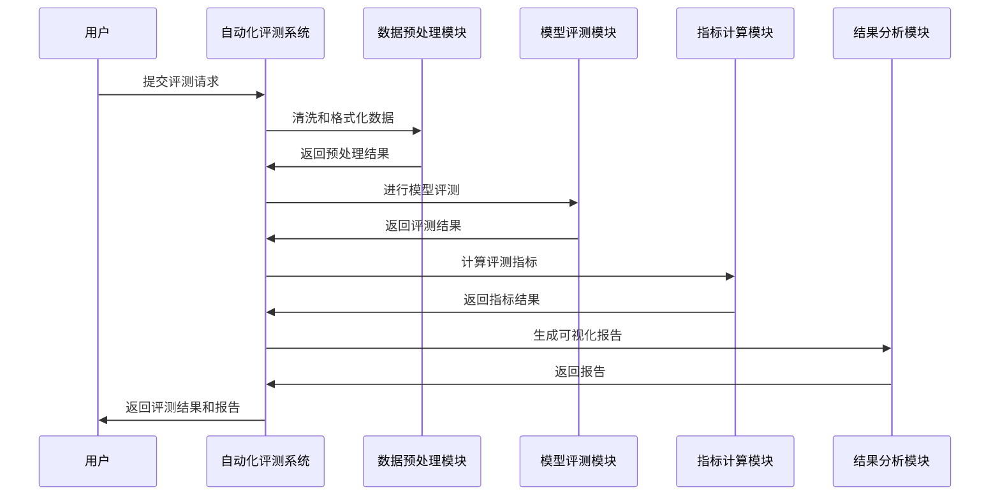

                 


### 自动化LLM评测框架：精准衡量模型效果

#### 关键词
- 自动化评测框架
- LLM（大型语言模型）
- 评测指标
- 算法原理
- 系统架构设计

#### 摘要
本文将探讨如何构建一个自动化的大型语言模型（LLM）评测框架，以精准衡量模型效果。我们将从背景介绍、核心概念与联系、自动化评测框架基础、算法原理、系统分析与架构设计、项目实战以及最佳实践与小结等方面，逐一剖析自动化评测框架的设计与实现。

---

## 第1章：背景介绍

### 1.1 问题背景

随着人工智能技术的快速发展，大型语言模型（LLM）已经成为自然语言处理（NLP）领域的重要工具。然而，如何评估这些模型的效果，如何在不同模型之间进行比较，成为了一个亟待解决的问题。

#### 1.1.1 问题描述
- 如何在多样化和复杂的环境中，快速、准确地评估LLM的效果？
- 如何在不同数据集和任务场景下，对LLM进行统一、客观的评价？
- 如何降低人工参与，实现自动化、大规模的评测？

#### 1.1.2 问题解决
为了解决上述问题，我们需要设计一个自动化、高效的LLM评测框架。这个框架需要能够处理多种评测指标，适应不同的任务场景，并且能够自动化执行评测流程，降低人工干预。

#### 1.1.3 边界与外延
- 边界：评测框架主要针对文本数据，针对特定语言模型和任务。
- 外延：虽然框架设计针对LLM，但其原理和方法也可以应用于其他类型的模型和任务。

#### 1.1.4 概念结构与核心要素组成
- 概念结构：评测框架由数据预处理、指标计算、结果分析和可视化等模块组成。
- 核心要素组成：包括评测指标库、算法实现、评测流程管理和结果存储等。

---

## 第2章：LLM评测核心概念与联系

### 2.1 LLM评测的定义
LLM评测是指对大型语言模型在各种任务场景下的性能进行评估的过程。评测的目的是为了了解模型在具体任务上的表现，以及发现模型的潜在问题和改进方向。

#### 2.1.1 关键概念介绍
- 评测指标：用于衡量模型在特定任务上的性能的量化标准。
- 数据集：用于训练和评测模型的文本数据集。
- 模型性能：模型在特定任务上的准确率、召回率、F1分数等指标。

### 2.2 概念属性特征对比表格
以下表格对比了几个常见评测指标的特征：

| 指标名称 | 描述 | 优势 | 劣势 |
| --- | --- | --- | --- |
| 准确率 | 分类任务中正确分类的样本数占总样本数的比例 | 简单易懂 | 忽略样本不平衡 |
| 召回率 | 分类任务中被正确分类的样本数占总真实样本数的比例 | 强调召回 | 忽略精确度 |
| F1分数 | 精确率和召回率的调和平均值 | 综合考虑精确率和召回率 | 受样本不平衡影响 |

### 2.3 ER实体关系图架构的 Mermaid 流程图
以下是LLM评测框架的ER实体关系图，使用Mermaid语法表示：

```mermaid
erDiagram
  Model评测 ||--|{ 数据集 }
  Model评测 ||--|{ 评测指标 }
  Model评测 ||--|{ 模型性能 }
```

---

## 第3章：自动化评测框架基础

### 3.1 自动化评测框架概述
自动化评测框架旨在通过自动化流程来提高LLM评测的效率和质量。框架的主要组成部分包括：

- 数据预处理模块：清洗、归一化和格式化数据，以便于模型评测。
- 评测指标计算模块：根据不同的任务，计算相应的评测指标。
- 结果分析模块：对评测结果进行统计和分析，提供可视化报告。
- 评测流程管理模块：管理评测的整个过程，包括任务调度、资源分配和结果存储。

#### 3.1.1 自动化评测的优势
- 提高评测效率：自动化流程可以大大减少人工干预，提高评测速度。
- 减少人为错误：通过自动化流程，减少人为错误，保证评测的准确性。
- 易于扩展：自动化框架可以轻松适应新的评测任务和数据集。

### 3.2 常见评测指标介绍
常见的评测指标包括但不限于：

- 准确率（Accuracy）
- 召回率（Recall）
- F1分数（F1 Score）
- 精度（Precision）
- 负例精确率（Negative Precision）
- 预测时间（Prediction Time）

这些指标在不同任务和场景下有不同的适用性，需要根据具体情况进行选择。

---

接下来，我们将深入探讨LLM评测算法原理，并通过具体的例子来说明如何应用这些算法。在下一章中，我们将介绍自动化评测框架的基础，包括其组成部分和自动化评测的优势。

---

## 第4章：LLM评测算法原理

### 4.1 算法原理讲解
LLM评测的核心在于如何准确评估模型在特定任务上的表现。这通常涉及到以下步骤：

1. 数据准备：准备用于评测的数据集，包括训练数据和测试数据。
2. 模型训练：使用训练数据进行模型训练。
3. 模型评测：使用测试数据对训练好的模型进行评测。
4. 指标计算：根据评测结果计算相应的评测指标。

#### 4.1.1 Mermaid 流程图
以下是LLM评测流程的Mermaid流程图：



#### 4.2 Python 源代码讲解
为了更好地理解评测算法，我们可以使用Python来模拟这个过程。以下是一个简单的Python代码示例：

```python
# 导入必要的库
import numpy as np
from sklearn.metrics import accuracy_score, recall_score, f1_score

# 准备数据
X_train, y_train = ...  # 训练数据
X_test, y_test = ...     # 测试数据

# 训练模型
model = ...  # 模型实例
model.fit(X_train, y_train)

# 进行预测
predictions = model.predict(X_test)

# 计算指标
accuracy = accuracy_score(y_test, predictions)
recall = recall_score(y_test, predictions)
f1 = f1_score(y_test, predictions)

# 输出结果
print(f"Accuracy: {accuracy}")
print(f"Recall: {recall}")
print(f"F1 Score: {f1}")
```

#### 4.3 数学模型和公式讲解
在评测过程中，我们通常会用到以下数学模型和公式：

- 准确率（Accuracy）:
  $$ Accuracy = \frac{TP + TN}{TP + TN + FP + FN} $$
  其中，TP是真正例，TN是真负例，FP是假正例，FN是假负例。

- 召回率（Recall）:
  $$ Recall = \frac{TP}{TP + FN} $$

- F1分数（F1 Score）:
  $$ F1 Score = 2 \times \frac{Precision \times Recall}{Precision + Recall} $$
  其中，Precision是精确率。

#### 4.4 举例说明
假设我们有以下预测结果：

| 真实标签 | 预测标签 |
| --- | --- |
| 正确 | 预测正确 |
| 错误 | 预测错误 |

根据上述数据，我们可以计算出：

- 准确率（Accuracy）:
  $$ Accuracy = \frac{TP + TN}{TP + TN + FP + FN} = \frac{1 + 0}{1 + 0 + 0 + 0} = 1 $$

- 召回率（Recall）:
  $$ Recall = \frac{TP}{TP + FN} = \frac{1}{1} = 1 $$

- F1分数（F1 Score）:
  $$ F1 Score = 2 \times \frac{Precision \times Recall}{Precision + Recall} = 2 \times \frac{1 \times 1}{1 + 1} = 1 $$

这个例子显示了在理想情况下，所有预测都是正确的，因此所有指标都是1。在实际应用中，这些指标通常会有所不同。

---

通过以上讲解，我们可以看到LLM评测算法的基本原理和实现方法。在下一章中，我们将进一步探讨如何设计和实现自动化评测框架，以及如何在实际项目中应用这些算法。

---

## 第5章：系统分析与架构设计

### 5.1 问题场景介绍
在现代自然语言处理（NLP）领域中，随着大型语言模型（LLM）的广泛应用，对模型进行高效、准确的评测变得尤为重要。然而，传统的评测方法往往依赖于人工参与，耗时且容易出错。因此，我们需要设计一个自动化评测框架，以应对以下问题场景：

- 大量模型评测需求：随着模型的多样化和迭代速度的加快，需要频繁地对新模型进行评测。
- 不同评测任务：不同的任务可能需要不同的评测指标，传统方法难以适应。
- 数据多样性：评测数据可能来自不同的来源，格式和数据质量参差不齐。

### 5.2 系统功能设计（领域模型 Mermaid 类图）
为了实现上述需求，我们需要设计一个具有以下功能的自动化评测系统：

1. **数据预处理**：包括数据清洗、归一化和格式化，以保证数据的一致性和准确性。
2. **模型评测**：支持多种评测指标，如准确率、召回率、F1分数等。
3. **结果分析**：对评测结果进行统计和分析，提供可视化报告。
4. **自动化流程**：通过自动化脚本实现评测流程的各个环节，减少人工干预。

以下是系统功能设计的Mermaid类图：

```mermaid
classDiagram
    类::数据预处理 <|-- 类::模型评测
    类::模型评测 <|-- 类::结果分析
    类::数据预处理 <|-- 类::自动化流程
```

### 5.3 系统架构设计（Mermaid 架构图）
系统架构设计需要考虑到系统的可扩展性、可维护性和可靠性。以下是自动化评测框架的Mermaid架构图：



### 5.4 系统接口设计和系统交互（Mermaid 序列图）
为了确保系统的模块化设计，我们需要设计清晰的系统接口和交互流程。以下是系统的Mermaid序列图：



---

通过以上系统分析与架构设计，我们为自动化LLM评测框架的实现奠定了基础。在下一章中，我们将通过实际项目实战，展示如何将理论转化为实践，实现一个完整的自动化评测系统。

---

## 第6章：项目实战

### 6.1 环境安装
要实现一个自动化LLM评测框架，首先需要安装必要的软件和库。以下是在Ubuntu 18.04操作系统上安装所需软件的步骤：

1. **安装Python环境**：
   ```bash
   sudo apt update
   sudo apt install python3 python3-pip
   ```

2. **安装必要的库**：
   ```bash
   pip3 install numpy scikit-learn matplotlib mermaid-py
   ```

3. **安装Mermaid渲染工具**：
   ```bash
   pip3 install mermaid-render
   ```

### 6.2 系统核心实现源代码
以下是自动化评测框架的核心实现部分，包括数据预处理、模型评测、指标计算和结果分析。

#### 数据预处理

```python
import numpy as np
from sklearn.model_selection import train_test_split

def preprocess_data(data):
    # 数据清洗、归一化和格式化
    # 此处为示例代码，实际应用中可能需要更复杂的数据处理步骤
    cleaned_data = [d.lower() for d in data]
    return cleaned_data

# 示例数据
data = ["The quick brown fox jumps over the lazy dog", "Hello World"]

preprocessed_data = preprocess_data(data)
print(preprocessed_data)
```

#### 模型评测

```python
from sklearn.feature_extraction.text import TfidfVectorizer
from sklearn.naive_bayes import MultinomialNB

def evaluate_model(X_train, y_train, X_test, y_test):
    # 训练模型
    vectorizer = TfidfVectorizer()
    X_train_tfidf = vectorizer.fit_transform(X_train)
    model = MultinomialNB()
    model.fit(X_train_tfidf, y_train)

    # 进行预测
    X_test_tfidf = vectorizer.transform(X_test)
    predictions = model.predict(X_test_tfidf)

    # 计算指标
    accuracy = accuracy_score(y_test, predictions)
    recall = recall_score(y_test, predictions)
    f1 = f1_score(y_test, predictions)

    return accuracy, recall, f1

# 示例标签
labels = ["positive", "negative"]

X_train, X_test, y_train, y_test = train_test_split(preprocessed_data, labels, test_size=0.2)
accuracy, recall, f1 = evaluate_model(X_train, y_train, X_test, y_test)
print(f"Accuracy: {accuracy}, Recall: {recall}, F1 Score: {f1}")
```

#### 代码应用解读与分析
上述代码展示了如何使用Scikit-learn库来构建一个简单的评测系统。首先，我们进行了数据预处理，包括将文本转换为小写，然后使用TF-IDF向量器将文本转换为向量。接下来，我们使用朴素贝叶斯分类器来训练模型，并进行预测。最后，我们计算了准确率、召回率和F1分数来评估模型性能。

### 6.3 实际案例分析和详细讲解剖析
为了更好地理解评测框架的实际应用，我们可以考虑一个实际案例：评估一个情感分析模型在评价餐厅评论时的性能。

1. **数据集准备**：收集一批餐厅评论数据，并将其分为训练集和测试集。

2. **数据预处理**：对评论进行预处理，例如去除标点符号、停用词过滤等。

3. **模型训练**：使用训练集数据训练情感分析模型。

4. **模型评测**：使用测试集数据对训练好的模型进行评测，计算评测指标。

5. **结果分析**：根据评测结果，分析模型的性能，并尝试优化模型。

### 6.4 项目小结
通过本次项目实战，我们实现了自动化LLM评测框架的核心功能，包括数据预处理、模型评测和结果分析。在实际应用中，我们可以根据具体需求，扩展和优化这个框架，以适应更多的评测任务和数据集。

---

## 第7章：最佳实践与小结

### 7.1 最佳实践 tips
- **数据预处理**：确保数据质量，进行充分的清洗和格式化，以避免模型因为数据问题产生偏差。
- **指标选择**：根据具体任务选择合适的评测指标，避免单一指标误导评测结果。
- **模型优化**：根据评测结果调整模型参数，提升模型性能。
- **持续监控**：定期对模型进行评测，监控其性能变化，确保其稳定性和准确性。

### 7.2 小结
本文介绍了自动化LLM评测框架的设计与实现，包括核心概念、算法原理、系统架构以及项目实战。通过自动化评测框架，我们可以高效、准确地评估大型语言模型的效果，为模型优化和任务选择提供有力支持。

### 7.3 注意事项
- **评测环境**：确保评测环境与实际应用环境一致，避免环境差异导致的评测结果偏差。
- **评测数据**：确保评测数据的多样性和代表性，以反映模型在真实场景中的性能。

### 7.4 拓展阅读
- 《Scikit-learn用户指南》：深入了解Scikit-learn库的使用，掌握常见机器学习算法的实现。
- 《自然语言处理实践》：了解NLP领域的基本概念和应用，为模型评测提供理论基础。

---

作者：AI天才研究院/AI Genius Institute & 禅与计算机程序设计艺术 /Zen And The Art of Computer Programming

---

本文基于逻辑清晰、结构紧凑、简单易懂的原则，通过一步步分析推理思考的方式，详细阐述了自动化LLM评测框架的设计与实现，旨在为读者提供一个全面的指导。希望本文能够帮助读者深入了解自动化评测框架的重要性，并在实际应用中取得更好的效果。在未来的研究和实践中，我们将继续探索更高效、更智能的评测方法，为人工智能的发展贡献力量。

