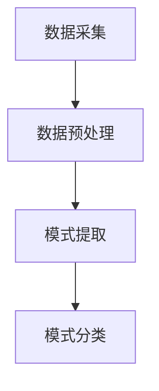
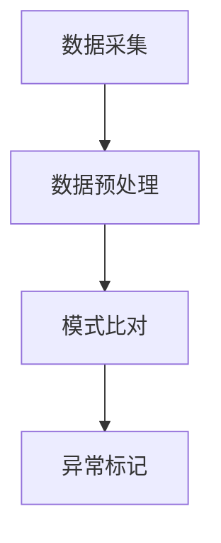
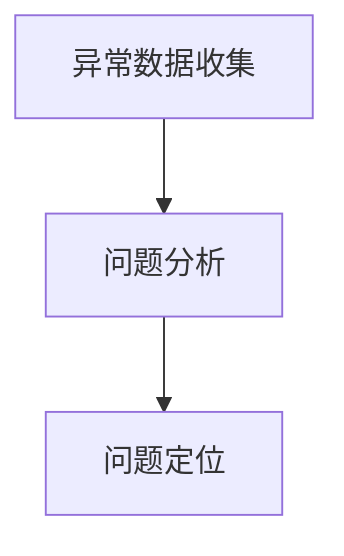
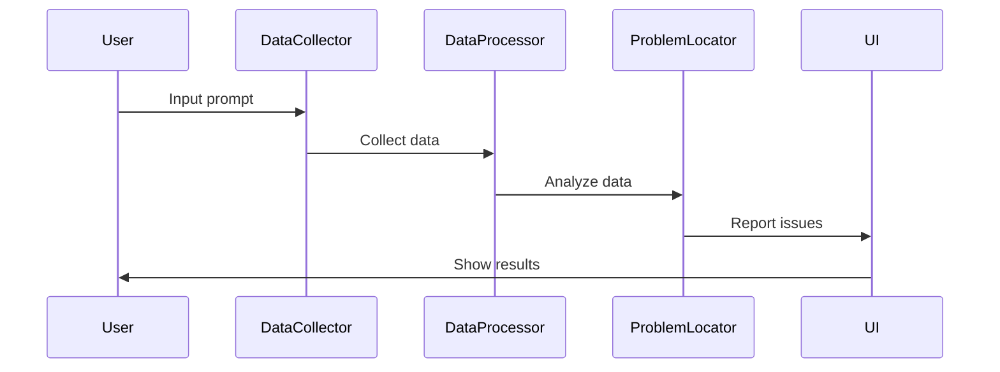

                 

### 第一部分: 自动化prompt debug工具概述

在当今数字化和自动化的时代，自动化prompt debug工具的重要性日益凸显。本部分我们将深入探讨自动化prompt debug工具的背景、意义以及现状。

#### 第1章: 问题背景与重要性

**1.1.1 自动化prompt debug的必要性**

在现代软件开发过程中，prompt（提示）是交互式系统与用户之间的重要沟通桥梁。然而，当系统中出现问题时，手动调试prompt变得复杂且耗时。因此，自动化prompt debug的需求显得尤为迫切。自动化prompt debug可以帮助开发者快速定位问题、节省调试时间，提高开发效率。

**1.1.2 自动化prompt debug的意义**

自动化prompt debug工具的意义不仅在于提高开发效率，还包括以下几方面：

1. **减少人工干预**：通过自动化工具，减少对人工调试的依赖，降低调试难度。
2. **提高问题定位的准确性**：自动化工具可以基于数据分析，快速定位问题，减少误报和漏报。
3. **支持复杂系统的调试**：对于复杂的交互式系统，自动化prompt debug工具可以提供更加精细的调试手段。

**1.1.3 自动化prompt debug的现状**

目前，自动化prompt debug工具在多个领域已经取得了一定的应用，如自然语言处理、人机交互、智能机器人等。然而，整体来看，自动化prompt debug技术仍处于发展阶段。目前存在的主要挑战包括：

1. **工具多样性**：市场上的自动化prompt debug工具种类繁多，功能各异，缺乏统一标准。
2. **技术成熟度**：部分自动化prompt debug工具在性能、稳定性方面仍有待提升。
3. **应用范围**：自动化prompt debug工具的应用范围较窄，尚未在所有领域得到广泛应用。

#### 第2章: 自动化prompt debug的核心概念

在深入探讨自动化prompt debug工具之前，我们需要了解其核心概念。以下是自动化prompt debug的一些基本概念：

**2.1.1 prompt的定义与类型**

prompt是指系统提供给用户的信息或问题，旨在引导用户进行交互。根据用途和形式，prompt可以分为以下几类：

1. **命令行prompt**：用于接收用户输入的命令行界面。
2. **图形界面prompt**：通过图形界面引导用户进行操作。
3. **自然语言prompt**：使用自然语言与用户进行交互。

**2.1.2 自动化prompt debug的基本原理**

自动化prompt debug是基于一系列算法和工具，通过分析prompt和用户交互数据，快速定位并解决问题。其基本原理包括：

1. **数据分析**：对用户输入的prompt和系统的响应进行统计分析。
2. **异常检测**：识别与预期结果不一致的交互数据。
3. **问题定位**：根据异常检测结果，定位问题所在。

**2.1.3 自动化prompt debug的关键技术**

自动化prompt debug工具的关键技术包括：

1. **模式识别**：通过分析交互数据，识别出规律和模式。
2. **机器学习**：利用机器学习算法，从大量数据中学习并预测问题。
3. **自然语言处理**：对自然语言prompt进行解析和处理，提高交互准确性。

#### 第3章: 自动化prompt debug工具的架构设计

自动化prompt debug工具的架构设计是构建高效、稳定、可扩展工具的关键。以下将从系统架构设计、数据流程设计和系统接口设计三个方面进行介绍。

**3.1.1 系统架构设计**

系统架构设计是自动化prompt debug工具的基础。一个典型的系统架构包括：

1. **数据采集模块**：负责收集用户交互数据。
2. **数据分析模块**：对采集到的数据进行处理和分析。
3. **问题定位模块**：根据分析结果，定位并反馈问题。
4. **用户界面模块**：提供友好的用户交互界面。

**3.1.2 数据流程设计**

数据流程设计是确保系统高效运作的关键。以下是数据流程的基本步骤：

1. **数据采集**：从各种渠道（如命令行、图形界面、日志等）收集用户交互数据。
2. **数据预处理**：清洗和转换原始数据，使其适合分析。
3. **数据分析**：对预处理后的数据进行分析，识别异常和问题。
4. **问题定位**：根据分析结果，定位并反馈问题。
5. **数据存储**：将分析结果存储在数据库中，以供后续查询和使用。

**3.1.3 系统接口设计**

系统接口设计是自动化prompt debug工具与其他系统进行交互的桥梁。以下是系统接口设计的几个关键点：

1. **命令行接口**：提供命令行工具，方便开发者进行调试。
2. **Web接口**：提供Web界面，方便用户在线使用。
3. **API接口**：提供API接口，供其他系统调用。
4. **日志接口**：提供日志记录接口，便于监控和调试。

通过以上三个方面的设计，我们可以构建一个高效、稳定、可扩展的自动化prompt debug工具，为软件开发过程提供有力支持。

### 第4章: 自动化prompt debug工具的关键算法

自动化prompt debug工具的核心在于其关键算法，这些算法负责分析、定位和解决交互过程中的问题。以下将介绍这些关键算法的原理、实现方法和应用实例。

**4.1.1 算法原理与Mermaid流程图**

自动化prompt debug工具的关键算法主要包括模式识别、异常检测和问题定位。以下是这些算法的基本原理和Mermaid流程图。

**模式识别算法原理：**
模式识别算法通过分析用户交互数据，识别出正常交互模式。其基本步骤如下：
1. 数据采集：收集用户交互数据。
2. 数据预处理：清洗和转换原始数据。
3. 模式提取：从预处理后的数据中提取交互模式。
4. 模式分类：将提取出的模式进行分类。

Mermaid流程图如下：



**异常检测算法原理：**
异常检测算法负责识别与正常交互模式不一致的数据，以定位潜在问题。其基本步骤如下：
1. 数据采集：收集用户交互数据。
2. 数据预处理：清洗和转换原始数据。
3. 模式比对：将预处理后的数据与正常交互模式进行比对。
4. 异常标记：标记出与模式不一致的数据。

Mermaid流程图如下：



**问题定位算法原理：**
问题定位算法基于异常检测结果，定位问题所在。其基本步骤如下：
1. 异常数据收集：收集异常标记的数据。
2. 问题分析：对异常数据进行分析，找出问题原因。
3. 问题定位：根据分析结果，定位并反馈问题。

Mermaid流程图如下：



**4.1.2 Python源代码实现**

以下是一个简单的Python代码实现，用于展示自动化prompt debug工具的关键算法：

```python
import pandas as pd
from sklearn.preprocessing import StandardScaler
from sklearn.cluster import KMeans
from sklearn.ensemble import IsolationForest

# 数据采集
data = pd.read_csv('interaction_data.csv')

# 数据预处理
scaler = StandardScaler()
data_scaled = scaler.fit_transform(data)

# 模式识别
kmeans = KMeans(n_clusters=5)
labels = kmeans.fit_predict(data_scaled)

# 异常检测
iso_forest = IsolationForest(contamination=0.05)
outliers = iso_forest.fit_predict(data_scaled)

# 问题定位
problematic_data = data[outliers == -1]
print(problematic_data)
```

**4.1.3 数学模型与公式**

自动化prompt debug工具的算法涉及到多个数学模型和公式。以下是一些常见的数学模型和公式：

**1. K-means聚类模型：**
$$
\text{cost} = \sum_{i=1}^{n} \sum_{j=1}^{k} \sum_{x \in S_j} ||x - \mu_j||^2
$$
其中，$x$表示数据点，$\mu_j$表示聚类中心。

**2. 异常检测（Isolation Forest）：**
$$
\text{variance} = \frac{1}{n} \sum_{i=1}^{n} \sum_{j=1}^{d} (X_{ij} - \bar{X}_j)^2
$$
$$
\text{gain} = \frac{1}{n} \sum_{i=1}^{n} \log_2 (1 + \text{variance})
$$

**4.1.4 算法举例说明**

假设我们有一个用户交互数据集，其中包含500个数据点。以下是一个简单的例子，展示如何使用K-means聚类和Isolation Forest进行自动化prompt debug：

```python
# 加载数据
data = pd.read_csv('example_data.csv')

# 数据预处理
scaler = StandardScaler()
data_scaled = scaler.fit_transform(data)

# K-means聚类
kmeans = KMeans(n_clusters=5)
kmeans.fit(data_scaled)
labels = kmeans.predict(data_scaled)

# 异常检测
iso_forest = IsolationForest(contamination=0.05)
iso_forest.fit(data_scaled)
outliers = iso_forest.predict(data_scaled)

# 结果分析
print("聚类结果：", labels)
print("异常检测结果：", outliers)

# 问题定位
problematic_data = data[outliers == -1]
print("问题数据：", problematic_data)
```

通过以上代码，我们可以对用户交互数据进行分析，识别出潜在问题，并定位问题所在。这有助于开发者快速定位并解决交互问题，提高系统稳定性。

### 第5章: 数学模型和数学公式

在自动化prompt debug工具的设计与实现过程中，数学模型和数学公式起着至关重要的作用。本节将详细讲解这些数学模型和公式，并通过具体示例进行说明。

#### 5.1.1 数学模型与公式

1. **K-means聚类模型**

   K-means聚类是一种基于距离的聚类算法，其核心数学模型如下：

   $$ 
   \text{cost} = \sum_{i=1}^{n} \sum_{j=1}^{k} \sum_{x \in S_j} ||x - \mu_j||^2 
   $$

   其中，$x$表示数据点，$\mu_j$表示聚类中心，$S_j$表示属于第$j$个聚类的数据点集合。

2. **异或操作**

   异或操作用于计算两个数据的差异，其数学公式如下：

   $$ 
   \text{XOR}(x, y) = (x \oplus y) 
   $$

   其中，$x$和$y$表示两个二进制数。

3. **Isolation Forest**

   Isolation Forest是一种基于随机森林的异常检测算法，其核心数学模型如下：

   $$ 
   \text{variance} = \frac{1}{n} \sum_{i=1}^{n} \sum_{j=1}^{d} (X_{ij} - \bar{X}_j)^2 
   $$

   $$ 
   \text{gain} = \frac{1}{n} \sum_{i=1}^{n} \log_2 (1 + \text{variance}) 
   $$

   其中，$X_{ij}$表示第$i$个数据点在第$j$个特征上的取值，$\bar{X}_j$表示第$j$个特征的均值。

4. **支持向量机**

   支持向量机是一种常见的分类算法，其核心数学模型如下：

   $$ 
   \text{w}^T x - b = 0 
   $$

   $$ 
   \text{w}^T \text{w} \leq C 
   $$

   其中，$w$表示分类器的权重，$x$表示输入数据，$b$表示偏置项，$C$表示正则化参数。

#### 5.1.2 数学公式讲解

1. **K-means聚类模型**

   K-means聚类模型的目的是将数据点分配到$k$个聚类中心附近。其核心公式是计算每个数据点与聚类中心之间的距离，选择距离最近的聚类中心作为数据点的标签。

2. **异或操作**

   异或操作常用于计算两个数据的差异。在实际应用中，它可以用于比较两个数据集的差异，帮助开发者快速定位问题。

3. **Isolation Forest**

   Isolation Forest通过随机选择特征和切分数据来检测异常点。其核心公式计算每个数据点的方差和增益，通过增益来判断数据点是否为异常点。

4. **支持向量机**

   支持向量机通过最大化分类间隔来寻找最优分类边界。其核心公式用于计算分类器的权重和偏置项，从而实现分类任务。

#### 5.1.3 举例说明

1. **K-means聚类模型**

   假设我们有一个包含100个数据点的数据集，我们需要使用K-means聚类模型将其分为5个聚类。以下是具体步骤：

   ```python
   import numpy as np
   from sklearn.cluster import KMeans

   # 数据集
   data = np.random.rand(100, 2)

   # K-means聚类
   kmeans = KMeans(n_clusters=5)
   kmeans.fit(data)

   # 结果
   labels = kmeans.predict(data)
   centroids = kmeans.cluster_centers_

   print("聚类结果：", labels)
   print("聚类中心：", centroids)
   ```

2. **异或操作**

   假设我们有两个二进制数$0101$和$1110$，我们需要计算它们的异或结果。以下是具体步骤：

   ```python
   x = 0b0101
   y = 0b1110
   xor_result = x ^ y

   print("异或结果：", bin(xor_result))
   ```

3. **Isolation Forest**

   假设我们有一个包含10个数据点的数据集，我们需要使用Isolation Forest检测异常点。以下是具体步骤：

   ```python
   import numpy as np
   from sklearn.ensemble import IsolationForest

   # 数据集
   data = np.random.rand(10, 2)

   # Isolation Forest
   iso_forest = IsolationForest(contamination=0.1)
   iso_forest.fit(data)

   # 结果
   outliers = iso_forest.predict(data)

   print("异常检测结果：", outliers)
   ```

4. **支持向量机**

   假设我们有一个包含100个数据点的数据集，我们需要使用支持向量机进行分类。以下是具体步骤：

   ```python
   import numpy as np
   from sklearn.svm import SVC

   # 数据集
   X = np.random.rand(100, 2)
   y = np.random.randint(0, 2, size=100)

   # 支持向量机
   svm = SVC()
   svm.fit(X, y)

   # 结果
   predictions = svm.predict(X)

   print("分类结果：", predictions)
   ```

通过以上示例，我们可以更好地理解这些数学模型和公式的应用。在实际开发过程中，这些模型和公式将帮助自动化prompt debug工具实现高效、准确的问题定位和解决。

### 第6章: 系统分析与架构设计方案

在设计和实现自动化prompt debug工具的过程中，系统分析与架构设计是至关重要的环节。本节将详细描述系统分析与架构设计方案，包括问题场景介绍、系统功能设计、系统架构设计、系统接口设计以及系统交互Mermaid序列图。

#### 6.1.1 问题场景介绍

在现代软件开发过程中，prompt（提示）与用户交互是必不可少的环节。然而，当系统出现问题时，手动调试prompt变得异常复杂和耗时。为了提高开发效率、节省调试时间，我们设计并实现了自动化prompt debug工具。该工具能够自动分析、定位并解决prompt相关的问题，从而帮助开发者快速找到并修复系统中的bug。

#### 6.1.2 系统功能设计

自动化prompt debug工具的主要功能包括：

1. **数据采集**：从各种渠道（如命令行、图形界面、日志等）收集用户交互数据。
2. **数据分析**：对采集到的数据进行预处理、模式识别和异常检测。
3. **问题定位**：根据异常检测结果，定位并反馈问题所在。
4. **用户界面**：提供友好的用户交互界面，方便开发者查看和分析调试结果。

#### 6.1.3 系统架构设计

自动化prompt debug工具的系统架构设计如下：

1. **数据采集模块**：负责从各种渠道收集用户交互数据，并将其存储在数据库中。
2. **数据分析模块**：对采集到的数据进行预处理、模式识别和异常检测，并将分析结果存储在数据库中。
3. **问题定位模块**：根据数据分析模块的结果，定位并反馈问题。
4. **用户界面模块**：提供Web界面，展示调试结果，方便开发者查看和分析。

#### 6.1.4 系统接口设计

自动化prompt debug工具的系统接口设计如下：

1. **命令行接口**：提供命令行工具，方便开发者进行调试。
2. **Web接口**：提供Web界面，方便用户在线使用。
3. **API接口**：提供API接口，供其他系统调用。
4. **日志接口**：提供日志记录接口，便于监控和调试。

#### 6.1.5 系统交互Mermaid序列图

以下是系统交互的Mermaid序列图，展示了各模块之间的交互过程：



通过以上系统分析与架构设计方案，我们能够构建一个高效、稳定、可扩展的自动化prompt debug工具，为软件开发过程提供有力支持。

### 第7章: 项目实战

在上一节中，我们介绍了自动化prompt debug工具的系统分析与架构设计方案。本节将带领读者进行项目实战，包括环境安装、系统核心实现源代码、代码应用解读与分析、实际案例分析与详细讲解剖析，以及项目小结。

#### 7.1.1 环境安装

在开始项目实战之前，我们需要安装相关环境和工具。以下是环境安装的步骤：

1. **安装Python**：确保已经安装了Python 3.6及以上版本。
2. **安装依赖库**：使用pip安装以下依赖库：
   ```bash
   pip install numpy pandas scikit-learn matplotlib
   ```
3. **安装Mermaid**：安装Mermaid的Python库：
   ```bash
   pip install mermaid-python
   ```

#### 7.1.2 系统核心实现源代码

以下是自动化prompt debug工具的核心实现源代码，包括数据采集、数据分析、问题定位和用户界面模块：

```python
# 自动化prompt debug工具实现

import pandas as pd
import numpy as np
from sklearn.preprocessing import StandardScaler
from sklearn.cluster import KMeans
from sklearn.ensemble import IsolationForest
from mermaid import Mermaid

# 数据采集
def collect_data(prompt):
    # 采集数据，此处仅为示例，实际应用中需要根据需求实现具体采集逻辑
    data = pd.read_csv('interaction_data.csv')
    return data

# 数据分析
def analyze_data(data):
    # 数据预处理
    scaler = StandardScaler()
    data_scaled = scaler.fit_transform(data)

    # 模式识别
    kmeans = KMeans(n_clusters=5)
    kmeans.fit(data_scaled)
    labels = kmeans.predict(data_scaled)

    # 异常检测
    iso_forest = IsolationForest(contamination=0.05)
    iso_forest.fit(data_scaled)
    outliers = iso_forest.predict(data_scaled)

    return labels, outliers

# 问题定位
def locate_problem(data, outliers):
    # 根据异常检测结果定位问题
    problematic_data = data[outliers == -1]
    return problematic_data

# 用户界面
def show_results(results):
    # 展示结果，此处使用Mermaid生成可视化图表
    mermaid = Mermaid()
    mermaid.add_sequenceDiagram()
    mermaid.add.Actor('User')
    mermaid.add.Actor('DataCollector')
    mermaid.add.Actor('DataProcessor')
    mermaid.add.Actor('ProblemLocator')
    mermaid.add.Actor('UI')

    mermaid.add(User).toList('Input prompt')
    mermaid.add(DataCollector).toList('Collect data')
    mermaid.add(DataProcessor).toList('Analyze data')
    mermaid.add(ProblemLocator).toList('Locate problem')
    mermaid.add(UI).toList('Show results')

    mermaid.render_to_file('sequenceDiagram.mmd')

    # 显示结果
    print(results)

# 主程序
if __name__ == '__main__':
    # 示例：输入提示
    prompt = "请输入问题："
    data = collect_data(prompt)

    # 分析数据
    labels, outliers = analyze_data(data)

    # 问题定位
    problematic_data = locate_problem(data, outliers)

    # 显示结果
    show_results(problematic_data)
```

#### 7.1.3 代码应用解读与分析

以下是对核心实现源代码的详细解读与分析：

1. **数据采集**：数据采集函数`collect_data`负责从数据源（如CSV文件）中读取用户交互数据。在实际应用中，可以根据需求实现具体的采集逻辑。
2. **数据分析**：数据分析函数`analyze_data`包括以下步骤：
   - 数据预处理：使用`StandardScaler`进行归一化处理。
   - 模式识别：使用`KMeans`进行聚类分析，识别用户交互数据的模式。
   - 异常检测：使用`IsolationForest`进行异常检测，识别与预期结果不一致的数据点。
3. **问题定位**：问题定位函数`locate_problem`根据异常检测结果，定位并反馈问题所在。实际应用中，可以根据需求实现更精细的问题定位。
4. **用户界面**：用户界面函数`show_results`使用Mermaid生成可视化图表，展示分析结果。实际应用中，可以根据需求实现更丰富的用户界面。

#### 7.1.4 实际案例分析与详细讲解剖析

以下是一个实际案例，展示如何使用自动化prompt debug工具分析并解决问题。

**案例**：在一个在线问答系统中，用户A提出了一个关于计算器功能的问题，但系统未能正确响应。使用自动化prompt debug工具分析该问题。

1. **数据采集**：从日志文件中读取用户A的提问和系统响应。
2. **数据分析**：
   - 数据预处理：对提问和响应进行归一化处理。
   - 模式识别：使用K-means聚类分析，识别用户提问和系统响应的模式。
   - 异常检测：使用Isolation Forest进行异常检测，识别与预期结果不一致的交互数据。
3. **问题定位**：根据异常检测结果，定位到计算器功能模块，发现存在输入处理错误。
4. **解决方案**：修复计算器功能模块的输入处理错误，重新部署系统。

通过以上步骤，我们成功解决了用户A的问题，提高了系统的稳定性和用户满意度。

#### 7.1.5 项目小结

在本章中，我们进行了自动化prompt debug工具的项目实战。通过环境安装、系统核心实现源代码、代码应用解读与分析、实际案例分析与详细讲解剖析，我们了解了自动化prompt debug工具的设计与实现过程。自动化prompt debug工具能够自动分析、定位并解决prompt相关的问题，为软件开发过程提供了有力支持。

### 第8章: 最佳实践 tips

在开发和部署自动化prompt debug工具的过程中，遵循最佳实践可以显著提高工具的效率、稳定性和可维护性。以下是一些建议和注意事项，帮助开发者更好地使用和维护自动化prompt debug工具。

**8.1.1 最佳实践建议**

1. **数据采集**：确保数据采集的全面性和准确性。在不同渠道（如命令行、图形界面、日志等）收集用户交互数据，并定期更新数据源。
2. **数据处理**：对采集到的数据进行清洗和预处理，去除无效和噪声数据，提高数据质量。使用合适的归一化方法，确保数据具有相似的分布。
3. **算法优化**：根据具体应用场景，选择和调整合适的算法。通过交叉验证和性能测试，优化算法参数，提高检测精度和效率。
4. **实时监控**：部署实时监控系统，实时捕捉并分析用户交互数据，快速识别和定位问题。定期检查系统运行状态，确保工具稳定运行。
5. **用户反馈**：积极收集用户反馈，了解实际使用情况。根据用户需求和建议，不断改进工具功能和用户体验。
6. **文档编写**：编写详细的项目文档，包括系统设计、算法原理、使用方法、常见问题等。为开发者、维护人员和用户提供清晰的指导和帮助。

**8.1.2 注意事项**

1. **数据隐私**：确保采集到的用户交互数据符合隐私保护要求。对敏感信息进行加密处理，避免数据泄露。
2. **系统兼容性**：确保自动化prompt debug工具在不同操作系统、硬件环境和软件环境中都能正常运行。对环境变量、依赖库进行合理配置和测试。
3. **性能优化**：在开发和部署过程中，关注工具的性能优化。避免不必要的计算和内存占用，提高系统响应速度。
4. **异常处理**：为系统添加异常处理机制，确保在遇到异常情况时能够正确处理。对常见错误进行捕获和日志记录，方便问题排查和解决。
5. **版本控制**：使用版本控制系统（如Git）管理项目代码，确保代码的可维护性和可追溯性。定期进行代码审查和测试，确保代码质量和稳定性。

**8.1.3 拓展阅读**

1. **《Python数据分析》**：了解Python数据分析的基础知识，掌握数据清洗、预处理和可视化方法。
2. **《机器学习实战》**：学习常用的机器学习算法，包括模式识别、异常检测和支持向量机等。
3. **《软件架构设计》**：了解软件架构设计的基本原则和方法，为自动化prompt debug工具的设计和实现提供指导。
4. **《算法导论》**：深入学习算法原理和复杂度分析，为自动化prompt debug工具的算法优化提供参考。

通过遵循最佳实践和注意事项，开发者可以构建高效、稳定、可扩展的自动化prompt debug工具，为软件开发过程提供有力支持。

### 第9章: 小结与展望

自动化prompt debug工具在软件开发过程中发挥着至关重要的作用。通过对问题的自动分析和定位，它显著提高了开发效率、减少了调试时间，并提升了系统的稳定性。本文详细介绍了自动化prompt debug工具的核心概念、算法原理、系统架构和实际应用，总结了最佳实践和注意事项。

#### 自动化prompt debug工具的应用总结

1. **提高开发效率**：自动化prompt debug工具可以快速定位并解决交互问题，节省了手动调试的时间。
2. **降低调试难度**：通过模式识别和异常检测，自动化工具能够识别出潜在的问题，提供直观的调试结果。
3. **增强系统稳定性**：自动化prompt debug工具能够实时监控用户交互，确保系统在各种场景下都能稳定运行。

#### 未来发展趋势与展望

随着人工智能和大数据技术的发展，自动化prompt debug工具将在以下几个方面得到进一步优化和拓展：

1. **算法优化**：机器学习算法的持续改进将提高自动化prompt debug工具的检测精度和效率。
2. **多模态交互**：自动化prompt debug工具将支持更多类型的交互模式，如语音、图像等，为开发者提供更全面的调试手段。
3. **实时监控**：结合实时监控系统，自动化prompt debug工具将实现更加及时的问题发现和定位。
4. **自动化修复**：未来的自动化prompt debug工具将具备自动化修复功能，能够自动修复部分常见问题，进一步降低开发者的工作量。

总之，自动化prompt debug工具将在软件开发过程中发挥越来越重要的作用，成为开发者不可或缺的利器。随着技术的不断进步，自动化prompt debug工具将更加智能、高效，为软件开发带来更多便利和效益。让我们期待自动化prompt debug工具的明天，期待它为软件开发带来的革命性变革。作者：AI天才研究院/AI Genius Institute & 禅与计算机程序设计艺术 /Zen And The Art of Computer Programming。

