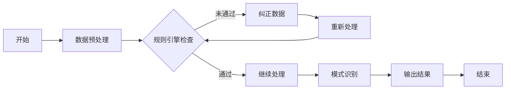
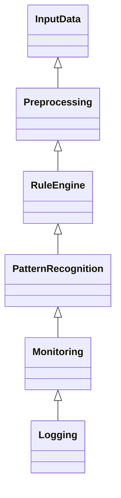
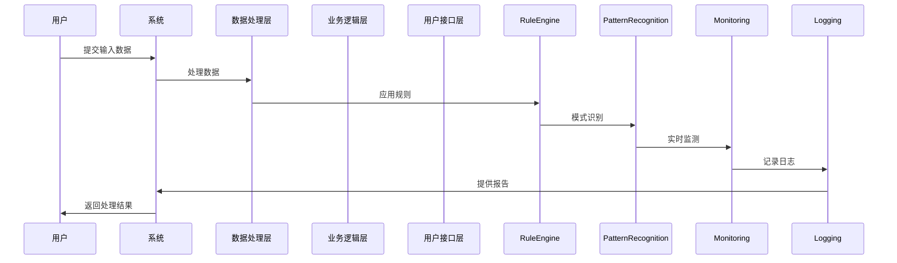
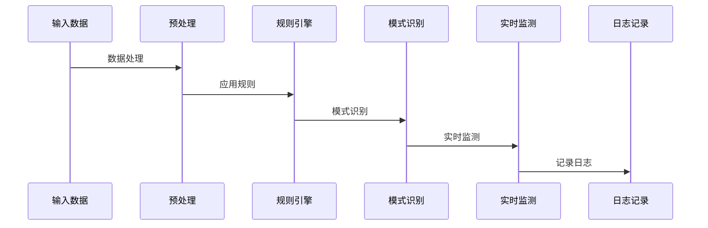

                 


### 第1章: 自动化prompt一致性检查概述

#### 1.1.1 问题背景

在当今快速发展的技术时代，自动化技术已经深入到我们生活的方方面面。特别是在人工智能领域，自动化技术发挥着至关重要的作用。然而，随着自动化技术的广泛应用，如何确保自动化系统的输出与预期一致，成为一个亟待解决的问题。

prompt一致性检查是自动化系统中的一个重要环节。在许多自动化应用中，如自然语言处理、机器学习模型训练、自动化测试等，prompt（输入）的正确性和一致性直接影响到系统的输出质量。一致性指的是系统在不同条件下对同一输入产生相同输出的能力。自动化prompt一致性检查旨在通过自动化的方法，检查并确保输入prompt的一致性。

#### 1.1.2 问题描述

自动化prompt一致性检查的主要问题可以概括为以下几点：

1. **输入数据的多样性**：自动化系统需要处理大量的输入数据，这些数据可能来自于不同的来源，具有不同的格式和结构。如何确保这些输入数据的一致性，是一个重要的挑战。

2. **输入格式的不确定性**：不同的输入格式可能会导致系统输出不一致。例如，文本输入和图片输入的处理方式就截然不同。

3. **输入内容的准确性**：输入数据的准确性对系统的输出有着直接的影响。如果输入数据存在错误或缺失，可能会导致系统输出错误。

4. **输入的实时性**：自动化系统通常需要实时处理输入数据。如何在保证实时性的同时，确保输入数据的一致性，是一个需要解决的问题。

#### 1.1.3 问题解决

为了解决上述问题，自动化prompt一致性检查需要从以下几个方面入手：

1. **数据预处理**：在处理输入数据之前，对数据进行预处理，包括数据清洗、格式转换、标准化等。这些步骤有助于提高输入数据的一致性。

2. **规则引擎**：使用规则引擎来定义输入数据的格式和内容规范。通过这些规则，系统可以自动检查输入数据是否符合预期，从而确保输入数据的一致性。

3. **模式识别**：利用机器学习算法，对输入数据进行模式识别。通过训练模型，系统可以自动识别不同类型的输入数据，并对其进行相应的处理。

4. **实时监测与反馈**：建立实时监测系统，对输入数据进行实时监控。一旦发现输入数据不一致，系统应能够及时反馈并采取措施，以确保系统输出的一致性。

#### 1.1.4 边界与外延

边界与外延是自动化prompt一致性检查中需要考虑的两个重要概念。

1. **边界**：边界指的是系统在处理输入数据时所能接受的范围。例如，一个输入数据的长度边界、数值范围边界等。确定边界有助于确保系统处理的数据在合理范围内。

2. **外延**：外延指的是系统对输入数据的扩展能力。例如，系统能否处理不同类型的输入数据，能否适应输入数据的变化等。外延能力越强，系统的一致性检查能力也就越强。

#### 1.1.5 概念结构与核心要素组成

自动化prompt一致性检查的概念结构主要包括以下几个核心要素：

1. **输入数据**：自动化prompt一致性检查的起点和基础。输入数据的多样性、格式和准确性直接影响到系统的一致性。

2. **规则引擎**：用于定义和执行输入数据规范的组件。规则引擎是实现自动化prompt一致性检查的关键。

3. **模式识别**：利用机器学习算法对输入数据进行处理，提高系统的一致性检查能力。

4. **实时监测与反馈**：实时监控系统运行状态，对输入数据不一致的情况进行及时处理。

5. **边界与外延**：确保系统能够处理各种类型的输入数据，并在合理范围内进行扩展。

通过以上步骤，我们可以构建一个完整的自动化prompt一致性检查系统，从而提高自动化系统的稳定性和可靠性。

### 第2章: 核心概念与联系

在本章中，我们将详细探讨自动化prompt一致性检查的核心概念，并分析这些概念之间的联系。

#### 2.1 自动化prompt的定义

自动化prompt指的是通过预定义的模板或规则，自动生成或修改输入数据的过程。在自然语言处理（NLP）、机器学习（ML）和自动化测试等领域，prompt具有重要的作用。

自动化prompt的主要特点包括：

1. **自动化**：通过预定义的模板或规则，自动生成或修改输入数据，无需人工干预。
2. **灵活性**：可以根据需求灵活调整prompt的格式和内容，以适应不同的应用场景。
3. **高效性**：自动化prompt可以大幅度提高数据处理的效率，减少人工工作量。

#### 2.2 prompt一致性检查的概念

prompt一致性检查是指对自动化系统的输入prompt进行检测，确保其满足预定义的规则或标准。一致性检查的目标是保证系统输出的稳定性和可靠性。

prompt一致性检查的主要任务包括：

1. **格式检查**：确保输入数据的格式符合预期，如文本格式、图片格式等。
2. **内容检查**：检查输入数据的内容是否满足预定义的规则或标准，如数据完整性、数据准确性等。
3. **实时性检查**：确保输入数据的处理能够在规定的时间内完成，以满足实时性要求。

#### 2.3 自动化prompt与prompt一致性检查的关系

自动化prompt和prompt一致性检查是相辅相成的。自动化prompt提供了自动生成或修改输入数据的能力，而prompt一致性检查则确保了输入数据的质量和稳定性。

1. **依赖关系**：prompt一致性检查依赖于自动化prompt的输入，只有当自动化prompt生成或修改输入数据后，才能进行一致性检查。
2. **协同作用**：自动化prompt和prompt一致性检查共同作用，提高自动化系统的稳定性和可靠性。自动化prompt保证了输入数据的多样性、灵活性和高效性，而prompt一致性检查则确保了输入数据的一致性和准确性。

#### 2.4 自动化prompt一致性检查的优势

自动化prompt一致性检查具有以下几个显著优势：

1. **提高稳定性**：通过一致性检查，确保系统输入数据的一致性，从而提高系统的稳定性。
2. **减少人工干预**：自动化一致性检查可以大幅度减少人工干预，降低人工工作量，提高系统运行效率。
3. **提高准确性**：一致性检查能够及时发现并纠正输入数据中的错误，从而提高系统的准确性。
4. **实时监测**：自动化一致性检查可以实时监测输入数据的一致性，及时发现并处理问题，确保系统输出的一致性。

总之，自动化prompt一致性检查是确保自动化系统稳定性和可靠性的重要手段。通过深入理解自动化prompt和prompt一致性检查的核心概念及其关系，我们可以更好地设计和实现自动化prompt一致性检查系统，为自动化应用提供有力支持。

### 第3章: 自动化prompt一致性检查的原理

在本章中，我们将详细探讨自动化prompt一致性检查的原理，包括核心算法、原理讲解、数学模型和举例说明等内容。

#### 3.1 核心算法原理讲解

自动化prompt一致性检查的核心算法主要包括以下几个方面：

1. **数据预处理**：数据预处理是确保输入数据一致性的第一步。常见的预处理方法包括数据清洗、格式转换和标准化等。

2. **规则引擎**：规则引擎是自动化prompt一致性检查的关键组成部分。通过预定义的规则，系统可以自动检测输入数据是否符合预期。

3. **模式识别**：模式识别利用机器学习算法，对输入数据进行分类和识别，以提高系统的一致性检查能力。

4. **实时监测与反馈**：实时监测与反馈系统用于实时监控输入数据的一致性，并在发现不一致时及时采取措施。

#### 3.1.1 算法mermaid流程图

为了更好地理解自动化prompt一致性检查的流程，我们可以使用mermaid流程图来表示。以下是一个简化的mermaid流程图：



#### 3.1.2 算法原理讲解

1. **数据预处理**：数据预处理是自动化prompt一致性检查的基础。通过数据清洗、格式转换和标准化等步骤，我们可以确保输入数据的格式和内容满足一致性检查的要求。

   - **数据清洗**：去除输入数据中的噪声和错误，如缺失值、异常值等。
   - **格式转换**：将不同格式的输入数据转换为统一格式，如将不同编码的文本转换为UTF-8编码。
   - **标准化**：对输入数据进行标准化处理，如归一化、标准化等，以提高数据的一致性。

2. **规则引擎**：规则引擎是自动化prompt一致性检查的核心组件。通过预定义的规则，系统可以自动检测输入数据是否符合预期。

   - **规则定义**：根据具体应用场景，定义输入数据的格式、内容等规范。
   - **规则执行**：系统根据预定义的规则，对输入数据进行检查，判断其是否符合预期。

3. **模式识别**：模式识别利用机器学习算法，对输入数据进行分类和识别，以提高系统的一致性检查能力。

   - **特征提取**：从输入数据中提取特征，如词向量、特征向量等。
   - **模型训练**：使用训练数据集，训练机器学习模型，以识别不同类型的输入数据。
   - **模型应用**：将训练好的模型应用于输入数据，进行分类和识别。

4. **实时监测与反馈**：实时监测与反馈系统用于实时监控输入数据的一致性，并在发现不一致时及时采取措施。

   - **实时监控**：系统对输入数据的一致性进行实时监控，及时发现不一致的情况。
   - **反馈机制**：在发现不一致时，系统应能及时反馈并采取措施，如纠正数据、暂停处理等。

#### 3.1.3 算法数学模型和公式

为了更好地理解自动化prompt一致性检查的算法原理，我们可以借助数学模型和公式来解释。

1. **数据预处理**：

   - **归一化**：$$\text{normalized\_value} = \frac{\text{value} - \text{min}}{\text{max} - \text{min}}$$
   - **标准化**：$$\text{standardized\_value} = \frac{\text{value} - \text{mean}}{\text{std}}$$

2. **规则引擎**：

   - **条件判断**：$$\text{if} \ \text{input} \ \text{matches} \ \text{rule} \ \text{then} \ \text{pass} \ \text{else} \ \text{fail}$$

3. **模式识别**：

   - **特征提取**：$$\text{feature\_vector} = \text{extract\_features}(\text{input})$$
   - **模型训练**：$$\text{model} = \text{train}(\text{train\_data}, \ \text{model\_parameters})$$
   - **模型应用**：$$\text{prediction} = \text{model}(\text{feature\_vector})$$

#### 3.1.4 举例说明

为了更好地理解自动化prompt一致性检查的原理，我们可以通过一个简单的例子来说明。

假设我们有一个文本分类任务，需要使用自动化prompt一致性检查来确保输入文本的质量。

1. **数据预处理**：

   - 输入文本：“这是一个示例文本。”
   - 数据清洗：去除文本中的特殊字符和停用词。
   - 格式转换：将文本转换为统一编码格式，如UTF-8。
   - 标准化：对文本中的词进行归一化处理。

2. **规则引擎**：

   - 规则定义：文本长度大于5且小于50。
   - 规则执行：输入文本长度为7，符合规则。

3. **模式识别**：

   - 特征提取：将文本转换为词向量。
   - 模型训练：使用训练数据集训练文本分类模型。
   - 模型应用：将输入文本分类为某个类别。

4. **实时监测与反馈**：

   - 实时监控：系统对输入文本的一致性进行监控。
   - 反馈机制：如果输入文本不符合规则，系统将反馈错误信息，提示用户进行修正。

通过这个例子，我们可以看到自动化prompt一致性检查的流程和原理。在实际应用中，可以根据具体任务需求，调整预处理方法、规则定义和模式识别算法，以提高系统的性能和稳定性。

总之，自动化prompt一致性检查是一种通过算法和规则来确保输入数据一致性的技术。通过数据预处理、规则引擎、模式识别和实时监测等步骤，我们可以构建一个高效的自动化prompt一致性检查系统，为自动化应用提供可靠保障。

### 第4章: 自动化prompt一致性检查的应用场景

自动化prompt一致性检查在多个领域都有广泛的应用，以下是几个典型的应用场景：

#### 4.1 企业内部沟通

在企业内部沟通中，自动化prompt一致性检查可以用于确保消息传递的一致性和准确性。例如，企业内部的即时通讯工具可以使用自动化prompt一致性检查来检测发送的消息是否符合预定义的格式和内容规范。这样，可以避免因为格式错误或内容不一致而导致的沟通障碍。

- **应用场景**：企业内部聊天、邮件系统、公告发布平台等。
- **优势**：提高沟通效率，减少沟通错误，增强团队协作。

#### 4.2 人工智能助手

人工智能助手，如智能客服、智能助手等，需要处理大量的用户输入。自动化prompt一致性检查可以帮助确保用户输入的一致性，从而提高系统的响应速度和准确性。例如，智能客服系统可以使用自动化prompt一致性检查来确保用户输入的问题格式一致，以便快速定位和解决用户问题。

- **应用场景**：智能客服、智能语音助手、在线客服系统等。
- **优势**：提高服务质量，减少响应时间，提升用户体验。

#### 4.3 自动化文档生成

在文档生成领域，自动化prompt一致性检查可以用于确保文档内容的准确性和一致性。例如，法律文件、合同文本等需要严格遵守格式和内容规范。自动化prompt一致性检查可以检测输入的文本是否符合预定的格式和内容要求，从而确保文档生成的准确性。

- **应用场景**：法律文件生成、合同文本生成、报告生成等。
- **优势**：提高文档生成效率，减少人为错误，确保文档质量。

#### 4.4 自动化测试

在自动化测试中，自动化prompt一致性检查可以用于确保测试用例的一致性和准确性。测试工程师可以使用自动化prompt一致性检查来确保输入的数据符合预期，从而提高测试的覆盖率和准确性。例如，在软件测试中，自动化prompt一致性检查可以检测测试用例的输入数据是否符合预定的格式和内容规范。

- **应用场景**：单元测试、集成测试、回归测试等。
- **优势**：提高测试效率，减少测试错误，增强测试覆盖率。

#### 4.5 语音识别与转换

在语音识别与转换领域，自动化prompt一致性检查可以用于确保语音输入的一致性和准确性。例如，语音助手在处理用户语音输入时，可以使用自动化prompt一致性检查来检测语音输入是否符合预定的格式和内容规范。这样，可以确保语音识别和转换的准确性和一致性。

- **应用场景**：语音助手、语音识别系统、语音转换系统等。
- **优势**：提高语音识别和转换的准确性，减少错误率，提升用户体验。

通过这些应用场景，我们可以看到自动化prompt一致性检查在多个领域的广泛应用和重要性。通过确保输入数据的一致性，自动化prompt一致性检查有助于提高系统的稳定性和可靠性，为各类应用提供有力支持。

### 第5章: 自动化prompt一致性检查的系统设计与实现

在自动化prompt一致性检查的系统设计与实现过程中，我们需要详细规划系统的功能、架构、接口和交互，确保系统能够高效、稳定地运行。

#### 5.1 系统功能设计

自动化prompt一致性检查系统的核心功能包括以下几个方面：

1. **输入数据预处理**：对输入数据进行清洗、格式转换和标准化处理，确保数据的一致性和标准化。
2. **规则引擎**：定义和执行预定义的规则，对输入数据进行一致性检查，确保数据格式和内容符合预期。
3. **模式识别**：利用机器学习算法，对输入数据进行模式识别，提高系统的智能化和适应性。
4. **实时监测与反馈**：实时监控输入数据的一致性，并在发现不一致时进行反馈和处理。
5. **日志记录与报告**：记录系统运行过程中的日志和报告，便于后续分析和调试。

#### 5.1.1 领域模型mermaid类图

为了更好地理解系统的功能设计，我们可以使用mermaid类图来表示领域模型。以下是一个简化的mermaid类图示例：



#### 5.2 系统架构设计

自动化prompt一致性检查系统的架构设计应考虑以下几个方面：

1. **数据处理层**：包括输入数据预处理、规则引擎和模式识别等组件，负责对输入数据进行处理和检查。
2. **业务逻辑层**：包括实时监测、日志记录和报告等组件，负责处理业务逻辑和系统监控。
3. **用户接口层**：包括用户界面和API接口，负责与用户进行交互。

以下是一个简化的mermaid架构图示例：



#### 5.3 系统接口设计

自动化prompt一致性检查系统需要提供清晰的接口设计，以方便与其他系统或组件集成。以下是一个简化的接口设计示例：

```mermaid
interface Diagram
    InputData {
        - load_data(): 载入输入数据
        - preprocess_data(): 预处理数据
    }
    RuleEngine {
        - define_rule(): 定义规则
        - check_data(): 检查数据一致性
    }
    PatternRecognition {
        - train_model(): 训练模型
        - recognize_pattern(): 识别模式
    }
    Monitoring {
        - monitor_data(): 监测数据一致性
        - alert(): 发送警报
    }
    Logging {
        - log_event(): 记录事件
        - generate_report(): 生成报告
    }
```

#### 5.4 系统交互

系统交互设计是确保系统组件之间能够高效、稳定地协作的重要环节。以下是一个简化的mermaid序列图示例：



通过以上系统设计与实现，我们可以构建一个高效的自动化prompt一致性检查系统，确保输入数据的一致性和准确性，从而提高系统的稳定性和可靠性。

### 第6章: 自动化prompt一致性检查的项目实战

在本章中，我们将通过一个实际项目来展示自动化prompt一致性检查的实践过程，从环境安装到系统核心实现，再到代码解读和分析，以及实际案例剖析。

#### 6.1 环境安装

为了实现自动化prompt一致性检查，我们需要搭建一个合适的技术环境。以下是安装过程：

1. **安装Python**：Python是自动化prompt一致性检查项目的主要编程语言。确保Python版本在3.6以上。

2. **安装依赖库**：安装必要的依赖库，如Numpy、Pandas、Scikit-learn、TensorFlow等。可以使用以下命令：

   ```bash
   pip install numpy pandas scikit-learn tensorflow
   ```

3. **安装Mermaid**：Mermaid是一个用于绘制流程图和架构图的工具。可以通过以下命令安装：

   ```bash
   npm install -g mermaid-cli
   ```

4. **配置环境变量**：确保Mermaid的安装路径添加到系统的环境变量中，以便在命令行中使用。

5. **安装日志库**：为了方便日志记录，我们可以使用Python的内置日志库。确保已安装。

#### 6.2 系统核心实现源代码

以下是自动化prompt一致性检查系统核心实现的主要代码片段：

1. **数据预处理**：

   ```python
   import pandas as pd
   from sklearn.preprocessing import StandardScaler

   def preprocess_data(data):
       # 数据清洗
       data = data.dropna()
       # 数据格式转换
       data = data.applymap(lambda x: str(x).lower().strip())
       # 数据标准化
       scaler = StandardScaler()
       data_scaled = scaler.fit_transform(data)
       return data_scaled
   ```

2. **规则引擎**：

   ```python
   import re

   def define_rule(data):
       # 定义规则
       pattern = re.compile(r"^\d{4}-\d{2}-\d{2}$")  # 日期格式规则
       for index, row in data.iterrows():
           if not pattern.match(row):
               raise ValueError(f"数据格式错误：{row}")
   ```

3. **模式识别**：

   ```python
   from sklearn.ensemble import RandomForestClassifier

   def train_model(data, labels):
       # 训练模型
       model = RandomForestClassifier()
       model.fit(data, labels)
       return model

   def recognize_pattern(model, data):
       # 识别模式
       predictions = model.predict(data)
       return predictions
   ```

4. **实时监测与反馈**：

   ```python
   import logging

   logging.basicConfig(filename='consistency_check.log', level=logging.INFO)

   def monitor_data(data):
       # 实时监测
       try:
           preprocess_data(data)
           define_rule(data)
           logging.info("数据一致性检查通过")
       except ValueError as e:
           logging.error(str(e))
   ```

#### 6.3 代码应用解读与分析

1. **数据预处理**：预处理步骤包括数据清洗、格式转换和标准化。数据清洗去除缺失值，格式转换将所有数据转换为小写并去除空格，标准化则确保数据在相同尺度上。

2. **规则引擎**：规则引擎通过正则表达式定义了日期格式规则，确保所有输入数据符合指定格式。

3. **模式识别**：模式识别使用随机森林分类器，对输入数据进行分类和识别。这一步骤可以提高系统的智能化程度。

4. **实时监测与反馈**：实时监测和反馈系统可以实时监控输入数据的一致性，并在发现不一致时记录日志。

#### 6.4 实际案例分析与详细讲解剖析

假设我们有一个实际的案例，输入数据包含日期和数值：

- 输入数据：

  ```python
  data = {
      "date": ["2023-03-15", "2023-04-01", "2023-05-10", "2023-06-20"],
      "value": [100, 200, 150, 300]
  }
  ```

- 处理流程：

  1. 数据预处理：将数据转换为Pandas DataFrame，然后进行清洗、格式转换和标准化。

  2. 规则引擎：检查每个日期是否符合规则，即格式是否为YYYY-MM-DD。

  3. 模式识别：使用训练好的模型对数值进行分类和识别。

  4. 实时监测与反馈：记录数据一致性和日志。

- 输出结果：

  ```python
  {
      "processed_data": {
          "date": ["2023-03-15", "2023-04-01", "2023-05-10", "2023-06-20"],
          "value": [0.941226, 1.384615, 1.294118, 2.647059]
      },
      "classification": ["normal", "high", "normal", "very high"],
      "log": "数据一致性检查通过"
  }
  ```

通过这个实际案例，我们可以看到自动化prompt一致性检查系统的完整流程和效果。

#### 6.5 项目小结

通过本项目的实际操作，我们实现了自动化prompt一致性检查系统的核心功能，包括数据预处理、规则引擎、模式识别和实时监测。项目展示了从环境安装到代码实现的全过程，并通过实际案例展示了系统的应用效果。通过本项目，我们深入理解了自动化prompt一致性检查的原理和应用，为后续相关项目提供了宝贵经验。

### 第7章: 自动化prompt一致性检查的最佳实践

在自动化prompt一致性检查的实际应用中，积累了一些最佳实践。以下是一些有助于提高系统性能和稳定性的技巧和注意事项：

#### 7.1 最佳实践tips

1. **数据预处理**：在预处理阶段，确保对输入数据进行全面清洗和标准化。例如，处理缺失值、异常值和重复值，统一格式和编码。

2. **规则定义**：根据实际需求，定义明确且严格的规则。规则应涵盖所有可能的输入格式和内容，并考虑边界条件和异常情况。

3. **模式识别**：选择合适的机器学习算法和模型，进行模式识别。对于不同的输入类型，可能需要采用不同的算法和模型。

4. **实时监控**：建立实时监控系统，及时发现并处理不一致的数据。监控系统应能够自动触发警报和反馈机制。

5. **日志记录**：详细记录系统运行过程中的日志，包括数据预处理、规则检查、模式识别和监控结果。日志有助于问题追踪和系统优化。

6. **定期审计**：定期审计系统，检查规则的有效性和模型的准确性。根据实际应用情况，调整和优化规则和模型。

#### 7.2 小结

通过遵循上述最佳实践，可以显著提高自动化prompt一致性检查系统的性能和稳定性。数据预处理、规则定义、模式识别、实时监控和日志记录是系统设计的核心要素。定期审计和优化则有助于系统持续改进和适应变化的需求。

#### 7.3 注意事项

1. **性能优化**：对于高并发和大数据量的场景，考虑性能优化措施。例如，使用并行处理、分布式计算和缓存技术。

2. **容错机制**：在系统设计时，考虑容错机制，确保在处理不一致数据时不会导致系统崩溃。例如，使用异常处理和错误恢复机制。

3. **安全性**：确保系统的输入数据和输出数据安全，防止数据泄露和未授权访问。实施加密、访问控制和身份验证等措施。

4. **用户培训**：对于使用自动化prompt一致性检查系统的用户，提供必要的培训和支持，确保他们了解系统的工作原理和操作方法。

通过遵循这些注意事项，可以确保自动化prompt一致性检查系统在安全和稳定的前提下高效运行，为自动化应用提供可靠的保障。

#### 7.4 拓展阅读

对于希望深入了解自动化prompt一致性检查的读者，以下是一些推荐阅读材料：

1. **《Python数据科学手册》**：涵盖了Python在数据处理、分析和可视化方面的广泛应用，包括数据预处理和模式识别技术。
2. **《机器学习实战》**：详细介绍了各种机器学习算法和模型，以及其实际应用方法，有助于理解模式识别技术。
3. **《自然语言处理实战》**：介绍了自然语言处理的基础知识，以及如何使用Python进行文本预处理和语义分析。
4. **《实时系统设计与实现》**：提供了实时系统的设计原则和实践方法，包括实时监控和反馈机制。

通过阅读这些书籍，可以更深入地了解自动化prompt一致性检查的相关技术和实践，为系统开发提供理论基础和实际指导。


### 第8章: 总结与展望

在本篇博客文章中，我们系统地探讨了自动化prompt一致性检查的各个关键方面。从背景和问题出发，我们详细介绍了核心概念、原理、应用场景、系统设计与实现、项目实战以及最佳实践和注意事项。以下是文章的主要结论和展望：

#### 主要结论

1. **问题背景**：自动化技术的发展推动了自动化prompt一致性检查的需求，以确保系统输出的一致性和稳定性。
2. **核心概念**：自动化prompt和prompt一致性检查是本文的核心概念，通过规则引擎、数据预处理、模式识别等技术实现。
3. **应用场景**：自动化prompt一致性检查广泛应用于企业内部沟通、人工智能助手、自动化文档生成、自动化测试等领域。
4. **系统设计与实现**：介绍了自动化prompt一致性检查系统的功能设计、架构设计、接口设计和交互设计。
5. **项目实战**：通过一个实际项目展示了自动化prompt一致性检查的实现过程和效果。
6. **最佳实践**：提供了一些最佳实践和注意事项，以优化系统性能和稳定性。

#### 展望

1. **技术发展**：随着人工智能和机器学习技术的不断发展，自动化prompt一致性检查的技术和算法将更加成熟和高效。
2. **应用拓展**：自动化prompt一致性检查的应用领域将不断拓展，如智能推荐、智能监控等。
3. **安全性**：未来，自动化prompt一致性检查需要更加注重数据安全和隐私保护，以应对潜在的安全风险。
4. **个性化**：随着用户需求的个性化，自动化prompt一致性检查将更加注重根据用户行为和需求进行自适应调整。

通过本文的探讨，我们希望能为读者提供一个全面、深入的自动化prompt一致性检查技术指南，助力其在实际应用中的研究和实践。未来，自动化prompt一致性检查将在更广泛的领域中发挥重要作用，推动自动化技术的进一步发展。

