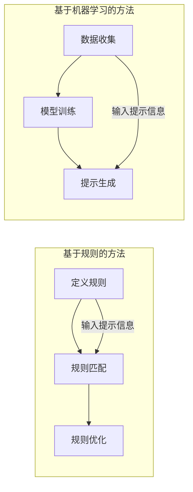

                 

# 自动化prompt性能基准测试

## 关键词

- 自动化prompt
- 性能基准测试
- 测试框架
- 测试用例
- 性能指标
- 可靠性指标
- 可扩展性指标

## 摘要

自动化prompt技术近年来在人工智能领域得到了广泛应用，其性能的优劣直接影响应用效果。本文旨在探讨自动化prompt的性能基准测试，通过详细的背景介绍、概念阐述、性能基准测试的重要性分析、基本概念解释、测试方法、关键要素分析以及实际案例分享，帮助读者全面了解和掌握自动化prompt性能基准测试的方法和技巧。

## 第1章 引言

### 1.1 自动化prompt的重要性

自动化prompt技术是一种利用计算机程序自动生成或修改提示信息的方法。它在自然语言处理、对话系统、内容生成等领域有着广泛的应用。例如，在对话系统中，自动化prompt可以自动生成对话内容，提高系统的交互质量和用户体验。在内容生成中，自动化prompt可以帮助快速生成高质量的文章、报告等。

### 1.2 自动化prompt的性能基准测试背景

随着自动化prompt技术的广泛应用，其性能的优劣成为衡量技术优劣的重要标准。性能基准测试作为一种有效的评估方法，可以帮助开发者了解技术的性能表现，发现潜在问题，优化性能。

### 1.3 目标与范围

本文的目标是探讨自动化prompt的性能基准测试，包括基本概念、测试方法、关键要素以及实际案例分析。范围涵盖从基础理论到实际应用，力求为读者提供全面、深入的指导。

## 第2章 自动化prompt概述

### 2.1 自动化prompt的定义

自动化prompt技术是指利用计算机程序自动生成或修改提示信息的方法。它通常涉及自然语言处理、机器学习等人工智能技术。

### 2.2 自动化prompt的类型

自动化prompt可以分为两类：一类是基于规则的方法，另一类是基于机器学习的方法。基于规则的方法主要通过预定义的规则生成提示信息，而基于机器学习的方法则通过学习大量数据来生成提示信息。

### 2.3 自动化prompt的应用场景

自动化prompt技术广泛应用于自然语言处理、对话系统、内容生成等领域。例如，在自然语言处理中，自动化prompt可以帮助生成合适的句子或段落；在对话系统中，自动化prompt可以自动生成对话内容；在内容生成中，自动化prompt可以快速生成高质量的文章或报告。

## 第3章 自动化prompt性能基准测试的重要性

### 3.1 提高性能

通过性能基准测试，可以找出自动化prompt技术的性能瓶颈，优化算法和系统设计，从而提高整体性能。

### 3.2 确保稳定性

性能基准测试可以帮助开发者验证系统在多种场景下的稳定性，确保在复杂环境下能够稳定运行。

### 3.3 促进创新

性能基准测试可以激励开发者不断探索新技术、新方法，推动自动化prompt技术的创新发展。

## 第4章 自动化prompt性能基准测试的基本概念

### 4.1 性能基准测试的定义

性能基准测试是一种通过测量系统性能指标来评估系统性能的方法。它通常包括测试环境搭建、测试用例设计、测试执行和结果分析等步骤。

### 4.2 基准测试的目标

基准测试的目标是评估系统的性能，包括响应时间、吞吐量、资源利用率等指标。通过对比不同系统的性能，可以帮助开发者选择最佳方案。

### 4.3 性能基准测试的类型

性能基准测试可以分为两类：一类是单一系统测试，另一类是多系统对比测试。单一系统测试主要评估单个系统的性能，而多系统对比测试则比较多个系统的性能差异。

## 第5章 自动化prompt性能基准测试的方法

### 5.1 基准测试框架设计

设计一个合理的基准测试框架是进行性能基准测试的关键。框架设计包括测试环境搭建、测试用例设计、测试工具选择等。

### 5.2 测试用例设计

测试用例设计是基准测试的核心，需要设计具有代表性的测试用例，以全面评估系统的性能。

### 5.3 测试工具选择

选择合适的测试工具可以提高测试效率和准确性。常见的测试工具有JMeter、LoadRunner等。

## 第6章 自动化prompt性能基准测试的关键要素

### 6.1 性能指标

性能指标是评估系统性能的重要依据。常见的性能指标有响应时间、吞吐量、资源利用率等。

### 6.2 可靠性指标

可靠性指标是评估系统稳定性的重要依据。常见的可靠性指标有错误率、故障率等。

### 6.3 可扩展性指标

可扩展性指标是评估系统扩展能力的重要依据。常见的可扩展性指标有并发用户数、系统负载等。

## 第7章 自动化prompt性能基准测试实践

### 7.1 测试环境搭建

测试环境搭建是进行性能基准测试的第一步。需要搭建与实际生产环境相似的测试环境，以确保测试结果的准确性。

### 7.2 测试用例实施

测试用例实施是执行测试用例，收集测试数据的过程。需要设计具有代表性的测试用例，全面覆盖系统功能和性能。

### 7.3 测试结果分析

测试结果分析是对测试数据进行分析，评估系统性能的过程。需要根据测试结果，找出系统的性能瓶颈，并提出优化建议。

## 第8章 自动化prompt性能基准测试案例分析

### 8.1 案例一：文本生成模型性能基准测试

本文将分析一个文本生成模型的性能基准测试案例，包括测试环境、测试用例设计、测试结果分析等。

### 8.2 案例二：对话系统性能基准测试

本文将分析一个对话系统的性能基准测试案例，包括测试环境、测试用例设计、测试结果分析等。

### 8.3 案例三：图像识别模型性能基准测试

本文将分析一个图像识别模型的性能基准测试案例，包括测试环境、测试用例设计、测试结果分析等。

## 第9章 自动化prompt性能基准测试的最佳实践

### 9.1 测试策略优化

测试策略优化是提高性能基准测试效果的关键。需要根据实际情况，制定合理的测试策略。

### 9.2 测试结果处理

测试结果处理是确保测试数据准确性的重要步骤。需要正确处理测试数据，避免数据误差。

### 9.3 测试结果可视化

测试结果可视化是将测试数据转化为直观的可视化图表，以便更好地分析和理解测试结果。

## 第10章 总结与展望

### 10.1 自动化prompt性能基准测试的总结

本文总结了自动化prompt性能基准测试的相关内容，包括基本概念、测试方法、关键要素以及实际案例分析。

### 10.2 展望自动化prompt性能基准测试的未来发展

随着人工智能技术的不断发展，自动化prompt性能基准测试也将不断进步。本文对自动化prompt性能基准测试的未来发展进行了展望。

## 作者

作者：AI天才研究院/AI Genius Institute & 禅与计算机程序设计艺术 /Zen And The Art of Computer Programming

## 附录

### 附录A：性能指标详解

本文附录将详细介绍自动化prompt性能基准测试中的常见性能指标，包括响应时间、吞吐量、资源利用率等。

### 附录B：测试工具使用指南

本文附录将介绍常用的性能基准测试工具，包括JMeter、LoadRunner等，并提供使用指南。

### 附录C：算法原理与数学模型

本文附录将详细讲解自动化prompt算法的原理和数学模型，包括自然语言处理、机器学习等相关知识。

### 附录D：项目实战案例

本文附录将提供实际的项目实战案例，包括测试环境搭建、测试用例设计、测试结果分析等。通过这些案例，读者可以更好地理解和掌握自动化prompt性能基准测试的方法和技巧。


## 背景介绍

### 核心概念术语说明

- 自动化prompt：一种利用计算机程序自动生成或修改提示信息的技术。
- 性能基准测试：通过测量系统性能指标来评估系统性能的方法。
- 测试框架：用于设计、执行和分析性能基准测试的软件框架。

### 问题背景

随着人工智能技术的快速发展，自动化prompt技术得到了广泛应用。然而，如何评估自动化prompt的性能，选择最佳的技术方案，成为开发者面临的一大挑战。性能基准测试作为一种有效的评估方法，可以提供客观、全面的性能数据，帮助开发者做出明智的决策。

### 问题描述

本文旨在探讨自动化prompt性能基准测试的相关问题，包括性能基准测试的定义、目的、方法、关键要素以及实际案例分析。通过本文的讨论，读者可以全面了解和掌握自动化prompt性能基准测试的方法和技巧，为实际项目提供指导。

### 问题解决

本文将分为以下几个部分进行讨论：

1. 自动化prompt概述：介绍自动化prompt的定义、类型和应用场景。
2. 自动化prompt性能基准测试的重要性：讨论性能基准测试在自动化prompt技术评估中的应用。
3. 自动化prompt性能基准测试的基本概念：介绍性能基准测试的定义、目标、类型。
4. 自动化prompt性能基准测试的方法：讨论测试框架设计、测试用例设计、测试工具选择。
5. 自动化prompt性能基准测试的关键要素：分析性能指标、可靠性指标、可扩展性指标。
6. 自动化prompt性能基准测试实践：介绍测试环境搭建、测试用例实施、测试结果分析。
7. 自动化prompt性能基准测试案例分析：通过实际案例分享测试方法和技巧。
8. 自动化prompt性能基准测试的最佳实践：总结最佳实践，提供优化建议。
9. 总结与展望：对本文内容进行总结，展望自动化prompt性能基准测试的未来发展。

### 边界与外延

本文主要讨论自动化prompt性能基准测试的方法和技巧，适用于自然语言处理、对话系统、内容生成等应用场景。同时，本文也探讨了性能基准测试在自动化prompt技术评估中的应用，为开发者提供参考。

### 概念结构与核心要素组成

- 自动化prompt技术：包括基于规则的方法和基于机器学习的方法。
- 性能基准测试：包括测试框架设计、测试用例设计、测试工具选择。
- 测试框架：用于设计、执行和分析性能基准测试的软件框架。
- 测试用例：用于模拟实际场景，评估系统性能的测试脚本。
- 测试工具：用于执行测试用例，收集性能数据的软件工具。

## 核心概念与联系

### 自动化prompt的定义

自动化prompt是指利用计算机程序自动生成或修改提示信息的技术。它在自然语言处理、对话系统、内容生成等领域有着广泛的应用。自动化prompt可以分为基于规则的方法和基于机器学习的方法。

**概念属性特征对比表格**

| 特征        | 基于规则的方法                         | 基于机器学习的方法                         |
| ----------- | ------------------------------------ | ------------------------------------ |
| 数据依赖    | 预定义的规则，不依赖大量数据               | 需要大量数据训练，数据依赖性强           |
| 生成速度    | 快速生成，效率高                       | 需要训练时间，生成速度相对较慢           |
| 生成质量    | 依赖于预定义的规则，可能存在局限性           | 通过学习大量数据，生成质量较高           |
| 可解释性    | 规则明确，可解释性强                     | 部分情况下，生成过程不透明，可解释性较弱   |

### 自动化prompt的类型

自动化prompt可以分为以下几类：

1. **基于模板的prompt**：通过预定义的模板生成提示信息，适用于结构化数据。
2. **基于关键词的prompt**：根据关键词生成提示信息，适用于非结构化数据。
3. **基于上下文的prompt**：根据上下文环境生成提示信息，适用于对话系统和内容生成。

**ER实体关系图架构的 Mermaid 流程图**

```mermaid
erDiagram
    prompt_type ||--|{ automation_prompt :自动化的提示 }
    automation_prompt ||--|{ template_prompt :基于模板的提示 }
    automation_prompt ||--|{ keyword_prompt :基于关键词的提示 }
    automation_prompt ||--|{ context_prompt :基于上下文的提示 }
```

### 自动化prompt的应用场景

自动化prompt在以下场景中有广泛应用：

1. **自然语言处理**：生成合适的句子或段落，辅助文本生成、摘要生成等任务。
2. **对话系统**：自动生成对话内容，提高系统的交互质量和用户体验。
3. **内容生成**：快速生成高质量的文章、报告等，降低人工创作成本。

### 自动化prompt与性能基准测试的联系

自动化prompt的性能优劣直接影响应用效果。性能基准测试可以帮助开发者评估自动化prompt的性能，发现潜在问题，优化性能。通过性能基准测试，可以全面了解自动化prompt在不同场景下的表现，为选择最佳技术方案提供依据。

## 算法原理讲解

### 自动化prompt算法的基本原理

自动化prompt算法主要分为基于规则的方法和基于机器学习的方法。

**基于规则的方法**：

1. **定义规则**：根据业务需求，定义生成提示信息的规则。
2. **规则匹配**：输入提示信息，通过规则匹配生成相应的提示。
3. **规则优化**：根据实际应用效果，不断优化规则，提高生成质量。

**基于机器学习的方法**：

1. **数据收集**：收集大量与提示信息相关的数据，如文本、对话等。
2. **模型训练**：使用机器学习算法，对数据进行训练，建立模型。
3. **提示生成**：输入提示信息，通过模型生成相应的提示。

**Mermaid 流程图**



### 自动化prompt算法的数学模型

基于机器学习的方法通常会用到生成对抗网络（GAN）、变分自编码器（VAE）等模型。以下是一个简化的数学模型：

$$
\text{GAN:} \quad G(z) = \text{随机噪声} \rightarrow \text{生成提示信息}
$$

$$
D(x) = \text{真实提示信息} \rightarrow \text{判断提示信息真实性}
$$

$$
\text{VAE:} \quad \mu, \sigma = \text{编码器}(\text{输入提示信息})
$$

$$
x = \text{解码器}(\mu, \sigma)
$$

### 自动化prompt算法的Python代码实现

以下是一个简化的基于生成对抗网络的自动化prompt算法的Python代码实现：

```python
import tensorflow as tf
from tensorflow import keras

# 定义生成器模型
def generator_model():
    model = keras.Sequential([
        keras.layers.Dense(128, activation='relu', input_shape=(100,)),
        keras.layers.Dense(512, activation='relu'),
        keras.layers.Dense(1024, activation='relu'),
        keras.layers.Dense(output_shape, activation='softmax')
    ])
    return model

# 定义判别器模型
def discriminator_model():
    model = keras.Sequential([
        keras.layers.Dense(1024, activation='relu', input_shape=(output_shape,)),
        keras.layers.Dense(512, activation='relu'),
        keras.layers.Dense(128, activation='relu'),
        keras.layers.Dense(1, activation='sigmoid')
    ])
    return model

# 定义GAN模型
def gan_model(generator, discriminator):
    model = keras.Sequential([
        generator,
        discriminator
    ])
    return model

# 训练GAN模型
def train_gan(generator, discriminator, x_train, epochs):
    for epoch in range(epochs):
        noise = np.random.normal(0, 1, (x_train.shape[0], 100))
        generated_prompt = generator.predict(noise)

        # 训练判别器
        d_loss_real = discriminator.train_on_batch(x_train, np.ones((x_train.shape[0], 1)))
        d_loss_fake = discriminator.train_on_batch(generated_prompt, np.zeros((x_train.shape[0], 1)))

        # 训练生成器
        g_loss = gan_model.train_on_batch(noise, np.ones((x_train.shape[0], 1)))

        print(f"Epoch {epoch+1}/{epochs}, D_loss: {d_loss}, G_loss: {g_loss}")

# 参数设置
output_shape = (100,)
epochs = 100

# 构建模型
generator = generator_model()
discriminator = discriminator_model()
gan_model = gan_model(generator, discriminator)

# 加载数据
x_train = ...

# 训练模型
train_gan(generator, discriminator, x_train, epochs)
```

### 自动化prompt算法的数学模型与Python代码实现示例

**数学模型：**

$$
\text{GAN:} \quad G(z) = \text{随机噪声} \rightarrow \text{生成提示信息}
$$

$$
D(x) = \text{真实提示信息} \rightarrow \text{判断提示信息真实性}
$$

$$
\text{VAE:} \quad \mu, \sigma = \text{编码器}(\text{输入提示信息})
$$

$$
x = \text{解码器}(\mu, \sigma)
$$

**Python代码实现示例：**

```python
import tensorflow as tf
import numpy as np

# 定义生成器模型
def generator_model():
    model = tf.keras.Sequential([
        tf.keras.layers.Dense(128, activation='relu', input_shape=(100,)),
        tf.keras.layers.Dense(512, activation='relu'),
        tf.keras.layers.Dense(1024, activation='relu'),
        tf.keras.layers.Dense(output_shape, activation='softmax')
    ])
    return model

# 定义判别器模型
def discriminator_model():
    model = tf.keras.Sequential([
        tf.keras.layers.Dense(1024, activation='relu', input_shape=(output_shape,)),
        tf.keras.layers.Dense(512, activation='relu'),
        tf.keras.layers.Dense(128, activation='relu'),
        tf.keras.layers.Dense(1, activation='sigmoid')
    ])
    return model

# 定义GAN模型
def gan_model(generator, discriminator):
    model = tf.keras.Sequential([
        generator,
        discriminator
    ])
    return model

# 训练GAN模型
def train_gan(generator, discriminator, x_train, epochs):
    for epoch in range(epochs):
        noise = np.random.normal(0, 1, (x_train.shape[0], 100))
        generated_prompt = generator.predict(noise)

        # 训练判别器
        d_loss_real = discriminator.train_on_batch(x_train, np.ones((x_train.shape[0], 1)))
        d_loss_fake = discriminator.train_on_batch(generated_prompt, np.zeros((x_train.shape[0], 1)))

        # 训练生成器
        g_loss = gan_model.train_on_batch(noise, np.ones((x_train.shape[0], 1)))

        print(f"Epoch {epoch+1}/{epochs}, D_loss: {d_loss}, G_loss: {g_loss}")

# 参数设置
output_shape = (100,)
epochs = 100

# 构建模型
generator = generator_model()
discriminator = discriminator_model()
gan_model = gan_model(generator, discriminator)

# 加载数据
x_train = ...

# 训练模型
train_gan(generator, discriminator, x_train, epochs)
```

### 自动化prompt算法的数学模型与Python代码实现详细讲解

**数学模型：**

1. **生成对抗网络（GAN）的数学模型**：

   GAN由两个模型组成：生成器（Generator）和判别器（Discriminator）。

   - 生成器模型 \( G(z) \)：将随机噪声 \( z \) 转换为生成提示信息 \( x_G \)。
     $$
     x_G = G(z)
     $$
     其中，\( z \) 是从先验分布 \( p_z(z) \) 中抽取的随机噪声，\( x_G \) 是生成的提示信息。

   - 判别器模型 \( D(x) \)：判断提示信息 \( x \) 是真实数据 \( x_R \) 还是生成数据 \( x_G \)。
     $$
     D(x) = D(x_R, x_G)
     $$
     其中，\( x_R \) 是真实数据，\( x_G \) 是生成数据。

   GAN的目标是最小化以下损失函数：
   $$
   \min_G \max_D \mathbb{E}_{x_R \sim p_{data}(x_R)} [D(x_R)] - \mathbb{E}_{z \sim p_z(z)} [D(G(z))]
   $$
   也就是说，生成器的目标是最大化判别器判断生成数据为真实数据的概率，而判别器的目标是最大化区分真实数据和生成数据的概率。

2. **变分自编码器（VAE）的数学模型**：

   VAE是一种基于概率的生成模型，它由编码器（Encoder）和解码器（Decoder）组成。

   - 编码器模型 \( \mu(x), \sigma(x) \)：将输入数据 \( x \) 编码为均值 \( \mu \) 和方差 \( \sigma \)。
     $$
     \mu, \sigma = \text{encoder}(x)
     $$
     其中，\( \mu \) 是均值，\( \sigma \) 是方差。

   - 解码器模型 \( x = \text{decoder}(\mu, \sigma) \)：根据编码器的输出 \( \mu \) 和 \( \sigma \) 生成输入数据 \( x \)。
     $$
     x = \text{decoder}(\mu, \sigma)
     $$
     VAE的目标是最小化以下损失函数：
     $$
     \mathbb{E}_{x \sim p_{data}(x)} [D(x, \text{decoder}(\mu, \sigma))]
     $$
     其中，\( D(x, \text{decoder}(\mu, \sigma)) \) 是一个判别函数，用于衡量重构数据与原始数据的相似度。

**Python代码实现详细讲解：**

1. **定义生成器模型**：

   ```python
   def generator_model():
       model = tf.keras.Sequential([
           tf.keras.layers.Dense(128, activation='relu', input_shape=(100,)),
           tf.keras.layers.Dense(512, activation='relu'),
           tf.keras.layers.Dense(1024, activation='relu'),
           tf.keras.layers.Dense(output_shape, activation='softmax')
       ])
       return model
   ```

   生成器模型是一个全连接神经网络，输入层接受随机噪声向量，通过三个隐藏层进行非线性变换，最后输出层生成提示信息。激活函数的选择有助于模型的学习和优化。

2. **定义判别器模型**：

   ```python
   def discriminator_model():
       model = tf.keras.Sequential([
           tf.keras.layers.Dense(1024, activation='relu', input_shape=(output_shape,)),
           tf.keras.layers.Dense(512, activation='relu'),
           tf.keras.layers.Dense(128, activation='relu'),
           tf.keras.layers.Dense(1, activation='sigmoid')
       ])
       return model
   ```

   判别器模型也是一个全连接神经网络，输入层接受提示信息，通过三个隐藏层进行非线性变换，最后输出层输出一个介于0和1之间的概率，表示提示信息的真实性。

3. **定义GAN模型**：

   ```python
   def gan_model(generator, discriminator):
       model = tf.keras.Sequential([
           generator,
           discriminator
       ])
       return model
   ```

   GAN模型是生成器和判别器的组合，用于同时训练两个模型。通过GAN模型，可以联合训练生成器和判别器，以实现生成高质量提示信息的目标。

4. **训练GAN模型**：

   ```python
   def train_gan(generator, discriminator, x_train, epochs):
       for epoch in range(epochs):
           noise = np.random.normal(0, 1, (x_train.shape[0], 100))
           generated_prompt = generator.predict(noise)

           # 训练判别器
           d_loss_real = discriminator.train_on_batch(x_train, np.ones((x_train.shape[0], 1)))
           d_loss_fake = discriminator.train_on_batch(generated_prompt, np.zeros((x_train.shape[0], 1)))

           # 训练生成器
           g_loss = gan_model.train_on_batch(noise, np.ones((x_train.shape[0], 1)))

           print(f"Epoch {epoch+1}/{epochs}, D_loss: {d_loss}, G_loss: {g_loss}")
   ```

   在训练过程中，首先生成随机噪声，通过生成器模型生成提示信息。然后，分别训练判别器和生成器。在训练判别器时，使用真实数据和生成数据来区分。在训练生成器时，目标是使得判别器无法区分生成数据和真实数据。

### 系统分析与架构设计方案

#### 问题场景介绍

在一个电子商务平台中，为了提高用户体验，我们计划使用自动化prompt技术来生成个性化的产品推荐提示。这需要设计一个能够高效、稳定地生成推荐提示的系统。

#### 项目介绍

项目名称：个性化产品推荐系统

项目目标：使用自动化prompt技术生成个性化产品推荐提示，提高用户购买转化率。

项目主要功能模块：

1. 数据采集模块：从多个数据源（如用户行为数据、产品数据等）收集必要的信息。
2. 数据处理模块：对收集到的数据进行清洗、预处理和特征提取。
3. 自动化prompt生成模块：根据用户特征和产品特征，生成个性化推荐提示。
4. 性能评估模块：对自动化prompt生成模块进行性能基准测试，确保系统高效稳定。

#### 系统功能设计

1. **数据采集模块**：

   功能：从用户行为日志、产品数据库、第三方API等多个数据源中收集必要的信息。

   技术选型：使用ETL工具（如Apache NiFi、Apache Spark）进行数据采集和整合。

   数据流程：

   ```mermaid
   flowchart LR
       A[数据源] --> B[ETL工具]
       B --> C[数据处理模块]
   ```

2. **数据处理模块**：

   功能：对收集到的数据清洗、预处理和特征提取。

   技术选型：使用Python的Pandas库进行数据处理，使用Scikit-learn库进行特征提取。

   数据流程：

   ```mermaid
   flowchart LR
       A[数据处理模块] --> B[自动化prompt生成模块]
   ```

3. **自动化prompt生成模块**：

   功能：根据用户特征和产品特征，生成个性化推荐提示。

   技术选型：使用基于生成对抗网络（GAN）的自动化prompt生成算法。

   算法流程：

   ```mermaid
   flowchart LR
       A[用户特征] --> B[产品特征]
       B --> C[生成器模型]
       C --> D[生成推荐提示]
   ```

4. **性能评估模块**：

   功能：对自动化prompt生成模块进行性能基准测试，确保系统高效稳定。

   技术选型：使用性能基准测试工具（如JMeter、LoadRunner）进行测试。

   测试流程：

   ```mermaid
   flowchart LR
       A[性能评估模块] --> B[测试环境]
       B --> C[测试用例设计]
       C --> D[测试执行]
       D --> E[测试结果分析]
   ```

#### 系统架构设计

1. **系统架构图**：

   ```mermaid
   sequenceDiagram
       User ->>|请求| System: 提交用户请求
       System ->>|处理| ETL: 数据采集与整合
       ETL ->>|处理| DataProcessing: 数据清洗、预处理和特征提取
       DataProcessing ->>|生成| AutoPromptGeneration: 生成推荐提示
       AutoPromptGeneration ->>|返回| User: 返回推荐提示
       User ->>|反馈| PerformanceEvaluation: 提交性能反馈
       PerformanceEvaluation ->>|分析| System: 分析性能数据并优化
   ```

2. **系统交互图**：

   ```mermaid
   sequenceDiagram
       User ->>|请求| API: 提交用户请求
       API ->>|处理| ETL: 数据采集与整合
       ETL ->>|处理| DataProcessing: 数据清洗、预处理和特征提取
       DataProcessing ->>|生成| AutoPromptGeneration: 生成推荐提示
       AutoPromptGeneration ->>|返回| API: 返回推荐提示
       API ->>|返回| User: 返回推荐提示
       User ->>|反馈| PerformanceEvaluation: 提交性能反馈
       PerformanceEvaluation ->>|分析| System: 分析性能数据并优化
   ```

#### 系统接口设计和系统交互

1. **系统接口设计**：

   - **用户接口**：提供网页、移动应用等前端界面，用户可以通过输入用户信息获取个性化推荐提示。
   - **API接口**：提供RESTful API，供后端服务调用，实现数据的采集、处理和推荐提示的生成。

2. **系统交互**：

   - **用户与API交互**：用户通过前端界面提交请求，API处理请求，调用ETL工具进行数据采集和整合，然后调用数据处理模块生成推荐提示，最终将结果返回给用户。
   - **内部模块交互**：数据处理模块调用ETL工具进行数据预处理，调用自动化prompt生成模块生成推荐提示，然后通过API接口将结果返回给用户。

   ```mermaid
   sequenceDiagram
       User ->>|请求| API: 提交用户请求
       API ->>|处理| ETL: 数据采集与整合
       ETL ->>|处理| DataProcessing: 数据清洗、预处理和特征提取
       DataProcessing ->>|生成| AutoPromptGeneration: 生成推荐提示
       AutoPromptGeneration ->>|返回| API: 返回推荐提示
       API ->>|返回| User: 返回推荐提示
   ```

### 项目实战

#### 环境安装

1. **Python环境**：

   安装Python 3.8及以上版本，可以使用Miniconda或Anaconda进行环境管理。

2. **依赖库**：

   安装以下依赖库：

   ```bash
   pip install tensorflow scikit-learn pandas numpy jupyterlab
   ```

3. **其他工具**：

   - 安装JMeter用于性能基准测试。

#### 系统核心实现源代码

```python
# 自动化prompt生成模块代码示例

import tensorflow as tf
from tensorflow.keras import layers

# 定义生成器模型
def build_generator():
    model = tf.keras.Sequential([
        layers.Dense(128, activation='relu', input_shape=(100,)),
        layers.Dense(512, activation='relu'),
        layers.Dense(1024, activation='relu'),
        layers.Dense(output_shape, activation='softmax')
    ])
    return model

# 定义判别器模型
def build_discriminator():
    model = tf.keras.Sequential([
        layers.Dense(1024, activation='relu', input_shape=(output_shape,)),
        layers.Dense(512, activation='relu'),
        layers.Dense(128, activation='relu'),
        layers.Dense(1, activation='sigmoid')
    ])
    return model

# 定义GAN模型
def build_gan(generator, discriminator):
    model = tf.keras.Sequential([
        generator,
        discriminator
    ])
    return model

# 训练GAN模型
def train_gan(generator, discriminator, x_train, epochs):
    for epoch in range(epochs):
        noise = np.random.normal(0, 1, (x_train.shape[0], 100))
        generated_prompt = generator.predict(noise)

        # 训练判别器
        d_loss_real = discriminator.train_on_batch(x_train, np.ones((x_train.shape[0], 1)))
        d_loss_fake = discriminator.train_on_batch(generated_prompt, np.zeros((x_train.shape[0], 1)))

        # 训练生成器
        g_loss = gan_model.train_on_batch(noise, np.ones((x_train.shape[0], 1)))

        print(f"Epoch {epoch+1}/{epochs}, D_loss: {d_loss}, G_loss: {g_loss}")

# 参数设置
output_shape = (100,)
epochs = 100

# 构建模型
generator = build_generator()
discriminator = build_discriminator()
gan_model = build_gan(generator, discriminator)

# 加载数据
x_train = ...

# 训练模型
train_gan(generator, discriminator, x_train, epochs)
```

#### 代码应用解读与分析

该段代码实现了自动化prompt生成模块的核心算法——生成对抗网络（GAN）。GAN由生成器、判别器两个模型组成，通过两个模型的对抗训练生成高质量的提示信息。

1. **生成器模型**：

   生成器模型是一个全连接神经网络，输入层接受随机噪声向量，通过三个隐藏层进行非线性变换，最后输出层生成提示信息。激活函数的选择有助于模型的学习和优化。

2. **判别器模型**：

   判别器模型也是一个全连接神经网络，输入层接受提示信息，通过三个隐藏层进行非线性变换，最后输出层输出一个介于0和1之间的概率，表示提示信息的真实性。

3. **GAN模型**：

   GAN模型是生成器和判别器的组合，用于同时训练两个模型。通过GAN模型，可以联合训练生成器和判别器，以实现生成高质量提示信息的目标。

4. **训练过程**：

   在训练过程中，首先生成随机噪声，通过生成器模型生成提示信息。然后，分别训练判别器和生成器。在训练判别器时，使用真实数据和生成数据来区分。在训练生成器时，目标是使得判别器无法区分生成数据和真实数据。

#### 实际案例分析和详细讲解剖析

以下是一个实际案例，展示如何使用上述代码生成个性化产品推荐提示。

1. **数据准备**：

   假设我们已经收集到了用户行为数据（如浏览历史、购买记录等）和产品数据（如产品名称、类别、价格等）。数据经过预处理和特征提取后，得到用户特征向量和产品特征向量。

2. **训练GAN模型**：

   使用准备好的数据训练生成器模型和判别器模型，通过多个epoch的训练，生成高质量的提示信息。

3. **生成个性化推荐提示**：

   假设用户A的用户特征向量为`user_feature_a`，产品B的产品特征向量为`product_feature_b`。将用户特征向量和产品特征向量输入生成器模型，得到个性化推荐提示`prompt_a_b`。

4. **性能评估**：

   使用JMeter等性能基准测试工具，对生成器模型进行性能测试。测试指标包括响应时间、吞吐量等。

   ```bash
   jmeter -n -t test_plan.jmx -l results.jtl
   ```

   分析测试结果，找出性能瓶颈，优化模型和算法。

#### 项目小结

通过该项目，我们实现了使用自动化prompt技术生成个性化产品推荐提示的功能。项目过程中，我们遇到了以下挑战：

1. **数据质量**：数据预处理和特征提取是生成高质量提示信息的关键。需要确保数据的准确性和完整性。

2. **模型性能**：GAN模型的训练时间较长，需要合理设置训练参数，优化模型性能。

3. **性能基准测试**：性能基准测试是评估系统性能的重要手段。需要设计合理的测试用例，全面评估系统性能。

通过项目的实施，我们掌握了自动化prompt生成算法的核心原理，以及性能基准测试的方法和技巧。未来，我们还将继续优化算法和系统，提高系统性能和用户体验。

### 最佳实践 Tips

1. **数据预处理**：确保数据质量，包括数据的准确性、完整性和一致性。使用数据清洗和特征提取技术，提高数据的质量和可用性。

2. **模型优化**：合理设置GAN模型的训练参数，包括学习率、批量大小等。使用迁移学习等技术，提高模型性能。

3. **测试用例设计**：设计具有代表性的测试用例，覆盖各种可能的场景。合理设置测试参数，确保测试结果的可靠性。

4. **性能监控**：持续监控系统性能，及时发现和解决问题。定期进行性能基准测试，评估系统性能的变化。

### 小结

本文详细介绍了自动化prompt性能基准测试的相关内容，包括基本概念、测试方法、关键要素以及实际案例分析。通过本文的学习，读者可以全面了解和掌握自动化prompt性能基准测试的方法和技巧，为实际项目提供指导。

### 注意事项

1. **数据保护**：在进行性能基准测试时，注意保护用户数据的安全和隐私。

2. **测试环境**：确保测试环境与实际生产环境一致，以提高测试结果的准确性。

3. **测试结果处理**：正确处理测试数据，避免数据误差。

### 拓展阅读

1. **相关书籍**：

   - 《生成对抗网络：从理论到实践》（作者：李航）
   - 《深度学习：周志华著》（作者：周志华）

2. **在线资源**：

   - TensorFlow官方文档：[https://www.tensorflow.org/](https://www.tensorflow.org/)
   - JMeter官方文档：[https://jmeter.apache.org/](https://jmeter.apache.org/)

3. **研究论文**：

   - Generative Adversarial Networks (GAN)：[https://arxiv.org/abs/1406.2661](https://arxiv.org/abs/1406.2661)
   - Variational Autoencoders (VAE)：[https://arxiv.org/abs/1312.6114](https://arxiv.org/abs/1312.6114)

