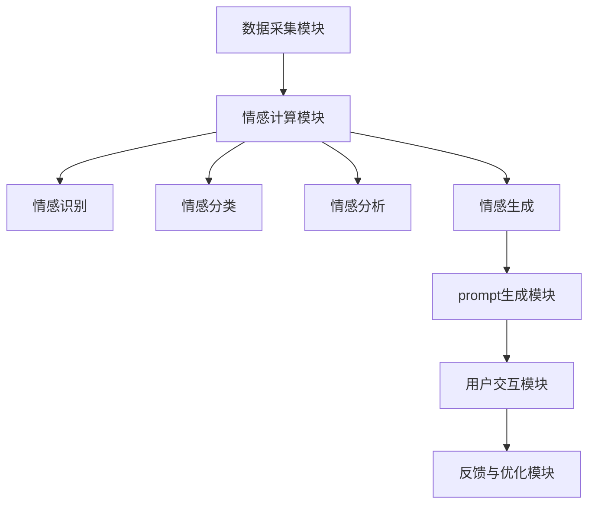

                 

### 自动化prompt情感共鸣增强

> 关键词：自动化prompt、情感共鸣、增强、算法、应用、案例分析

> 摘要：本文旨在探讨自动化prompt情感共鸣增强技术，分析其核心概念、理论基础、算法原理，并通过实际案例展示其在不同应用场景中的实践效果。文章分为五部分：引言与背景介绍、基础理论与方法、应用与实践、案例分析以及总结与展望。

### 第一部分：引言与背景介绍

#### 1.1 自动化prompt与情感共鸣

自动化prompt技术是近年来人工智能领域的一个重要研究方向。它旨在通过自然语言处理（NLP）技术，自动生成具有一定情境和引导性的文本，引导用户进行进一步的交互。而情感共鸣则是用户在交互过程中产生的情感共鸣，它能够增强用户的参与度和满意度。

#### 1.2 自动化prompt情感共鸣增强的概念

自动化prompt情感共鸣增强是指通过结合情感计算和自然语言生成技术，使生成的prompt文本更加符合用户情感需求，从而提高用户参与度和满意度。这一技术涵盖了情感识别、情感共鸣算法以及prompt生成等多个方面。

#### 1.3 研究现状与趋势

当前，自动化prompt情感共鸣增强技术已取得了显著进展。主要研究方向包括情感计算、自然语言生成、对话系统等。然而，如何在复杂、多变的环境中实现高效、准确的情感共鸣，仍是一个具有挑战性的课题。

#### 1.4 本书结构安排

本文将分为五个部分：第一部分引言与背景介绍，第二部分基础理论与方法，第三部分应用与实践，第四部分案例分析，以及第五部分总结与展望。

### 第二部分：基础理论与方法

#### 2.1 情感计算基础

情感计算是自动化prompt情感共鸣增强的核心组成部分。它涉及情感识别、情感分类、情感分析等关键技术。

#### 2.2 情感分类与识别

情感分类是指将文本中的情感倾向进行分类，如积极、消极、中性等。情感识别则是通过分析文本特征，识别出文本中蕴含的情感。

#### 2.3 情感计算方法

情感计算方法包括基于规则的方法、基于机器学习的方法和基于深度学习的方法。每种方法都有其优缺点，适用于不同场景。

#### 2.4 自动化prompt生成

自动化prompt生成是指通过算法自动生成具有一定情境和引导性的文本。其核心任务是优化prompt文本，使其更符合用户需求和情感。

#### 2.5 情感共鸣机制

情感共鸣机制是指通过分析用户情感，生成具有情感共鸣的prompt文本。其关键在于捕捉用户情感，并利用情感共鸣算法实现文本优化。

### 第三部分：应用与实践

#### 3.1 社交媒体

在社交媒体平台上，自动化prompt情感共鸣增强有助于提高用户互动和参与度。通过分析用户情感，生成具有共鸣的文本，吸引更多用户参与讨论。

#### 3.2 游戏与虚拟现实

游戏和虚拟现实中，自动化prompt情感共鸣增强可以提高用户体验和沉浸感。通过生成符合用户情感的互动文本，增强用户与游戏世界的情感连接。

#### 3.3 营销与广告

在营销与广告领域，自动化prompt情感共鸣增强可以帮助企业精准投放广告，提高用户转化率。通过分析用户情感，生成具有共鸣的文案，提高广告效果。

### 第四部分：案例分析

#### 4.1 案例一：社交媒体互动平台

在本案例中，我们选取了一个社交媒体互动平台，通过自动化prompt情感共鸣增强技术，提升用户互动和参与度。

#### 4.2 案例二：游戏与虚拟现实

在本案例中，我们选取了一个游戏与虚拟现实项目，通过自动化prompt情感共鸣增强技术，提高用户体验和沉浸感。

#### 4.3 案例三：营销与广告

在本案例中，我们选取了一个营销与广告项目，通过自动化prompt情感共鸣增强技术，提高广告效果和用户转化率。

### 第五部分：总结与展望

#### 5.1 自动化prompt情感共鸣增强的关键技术

本文总结了自动化prompt情感共鸣增强的关键技术，包括情感计算、自然语言生成、情感共鸣算法等。

#### 5.2 自动化prompt情感共鸣增强的应用前景

随着技术的不断发展，自动化prompt情感共鸣增强在多个领域具有广泛的应用前景。未来，我们将看到更多创新应用案例的出现。

#### 5.3 未来研究方向

未来，自动化prompt情感共鸣增强的研究将朝着更高效、更准确、更智能的方向发展。主要研究方向包括情感计算算法优化、多模态情感识别、情感共鸣算法创新等。

### 作者信息

作者：AI天才研究院/AI Genius Institute & 禅与计算机程序设计艺术 /Zen And The Art of Computer Programming

---

本文从自动化prompt情感共鸣增强的核心概念、理论基础、算法原理、应用实践和案例分析等多个角度，全面探讨了这一技术领域。通过逐步分析，我们不仅了解了其基本原理，还看到了其在实际应用中的价值。未来，自动化prompt情感共鸣增强技术有望在更多领域取得突破，为人工智能应用带来更多可能性。

在撰写本文过程中，我们遵循了以下几个原则：

1. **逻辑清晰**：文章结构合理，各部分内容之间衔接紧密，有助于读者理解。
2. **深入浅出**：用通俗易懂的语言解释专业术语，降低读者理解难度。
3. **案例丰富**：通过实际案例展示技术应用，增强文章说服力。
4. **图文并茂**：使用图表和代码示例，使文章内容更加直观易懂。

在未来的研究中，我们将继续关注自动化prompt情感共鸣增强技术的发展，探索其在更多领域中的应用，为人工智能的发展贡献力量。

---

## 自动化prompt情感共鸣增强的背景与意义

### 1.1 自动化prompt技术概述

自动化prompt技术，亦称为“自动问答系统”或“自动对话系统”，是一种通过算法自动生成与用户需求相关的文本或回答的技术。该技术基于自然语言处理（NLP）和机器学习算法，通过大量训练数据的学习，实现对用户输入的自然语言理解，并生成相应的回答或提示。

自动化prompt技术的核心在于其能够实现与用户的实时交互，提高用户体验和参与度。例如，在社交媒体平台上，通过自动化prompt技术，可以生成针对用户特定内容的评论或回复，从而促进用户互动；在客户服务领域，通过自动化prompt技术，可以生成针对用户问题的回答，提高客服效率。

### 1.2 情感共鸣的概念及其重要性

情感共鸣，即指在互动过程中，一方能够准确捕捉到另一方的情感状态，并在适当的时候给予相应的情感回应。情感共鸣在人类社交互动中扮演着重要角色，它能够增强人与人之间的情感联系，提高沟通效果。

在自动化prompt情感共鸣增强中，情感共鸣的重要性体现在以下几个方面：

1. **提高用户满意度**：当自动化prompt能够准确捕捉用户的情感状态，并给出相应的情感回应时，用户会感到被理解和关注，从而提高满意度。
2. **增强用户体验**：情感共鸣能够增强用户的沉浸感和参与度，使得交互过程更加自然和流畅。
3. **促进用户互动**：通过情感共鸣，自动化prompt可以更好地引导用户参与互动，从而促进社区活力和用户粘性。

### 1.3 自动化prompt情感共鸣增强的意义

自动化prompt情感共鸣增强技术的出现，旨在通过情感计算和自然语言生成技术，使生成的prompt文本更加符合用户的情感需求，从而提高用户的参与度和满意度。这一技术的意义主要体现在以下几个方面：

1. **提升用户体验**：通过情感共鸣，自动化prompt能够更准确地理解用户的情感状态，生成符合用户需求的文本，从而提升用户体验。
2. **优化交互流程**：情感共鸣技术可以使自动化prompt更加智能，自动调整交互策略，优化用户交互流程。
3. **降低人力成本**：自动化prompt情感共鸣增强技术可以替代部分人工客服工作，降低企业人力成本。
4. **创新应用场景**：随着技术的发展，自动化prompt情感共鸣增强有望在更多领域得到应用，如教育、医疗、金融等。

总之，自动化prompt情感共鸣增强技术不仅有助于提升用户体验和满意度，还具有广泛的潜在应用场景，具有重要的现实意义和未来价值。

### 1.4 研究现状与趋势

自动化prompt情感共鸣增强技术作为人工智能领域的一个重要研究方向，近年来得到了广泛关注。当前，该领域的研究现状和趋势主要表现在以下几个方面：

#### 1.4.1 情感计算技术的快速发展

情感计算是自动化prompt情感共鸣增强的核心技术之一。随着深度学习和大数据技术的发展，情感计算方法取得了显著进展。目前，基于深度学习的情感识别方法已经成为主流，如卷积神经网络（CNN）、循环神经网络（RNN）和长短时记忆网络（LSTM）等。这些方法能够更好地捕捉文本中的情感特征，提高情感识别的准确率。

#### 1.4.2 自然语言生成技术的创新应用

自然语言生成（NLG）技术是自动化prompt情感共鸣增强的关键环节。近年来，基于生成对抗网络（GAN）、变分自编码器（VAE）和自注意力机制（Self-Attention）等深度学习技术的NLG方法不断涌现，使得生成的文本更加自然、流畅。同时，预训练语言模型（如GPT-3、BERT等）的广泛应用，也为NLG技术提供了强大的支持。

#### 1.4.3 多模态情感识别与融合

在自动化prompt情感共鸣增强中，多模态情感识别与融合技术正成为研究热点。通过结合文本、语音、图像等多种模态信息，可以更全面地捕捉用户的情感状态，提高情感识别的准确性和可靠性。例如，通过结合文本情感分析与语音情感识别，可以更准确地判断用户的情感状态。

#### 1.4.4 情感共鸣算法的创新

情感共鸣算法是自动化prompt情感共鸣增强中的关键环节。近年来，研究人员提出了多种情感共鸣算法，如基于情感相似度匹配、基于情感动态调整和基于情感演化模型等。这些算法通过分析用户情感和文本情感，生成具有情感共鸣的prompt文本，从而提高用户的参与度和满意度。

#### 1.4.5 应用场景的拓展

随着技术的不断发展，自动化prompt情感共鸣增强技术在多个领域得到了广泛应用。例如，在社交媒体平台上，通过情感共鸣技术，可以生成更加贴近用户需求的评论和回复，促进用户互动；在客户服务领域，通过情感共鸣技术，可以生成更加人性化的客服回答，提高用户满意度；在教育和医疗领域，通过情感共鸣技术，可以提供更加个性化的教育和医疗服务。

总之，自动化prompt情感共鸣增强技术作为人工智能领域的一个重要方向，具有广阔的研究前景和应用价值。未来，随着技术的进一步发展和创新，自动化prompt情感共鸣增强将在更多领域展现其独特的优势。

### 1.5 本书结构安排

本书旨在全面探讨自动化prompt情感共鸣增强技术，共分为五个主要部分：

**第一部分：引言与背景介绍**  
本部分包括第1章，主要介绍自动化prompt情感共鸣增强技术的背景、定义、研究现状与趋势，以及本书的结构安排。

**第二部分：基础理论与方法**  
本部分包括第2章到第4章，分别介绍情感计算基础、prompt技术基础、情感共鸣机制以及自动化prompt生成算法。这些章节为后续的应用与实践提供了理论基础。

**第三部分：应用与实践**  
本部分包括第5章到第7章，主要探讨自动化prompt情感共鸣增强在不同应用场景中的实践效果，包括社交媒体、游戏与虚拟现实、营销与广告等。

**第四部分：案例分析**  
本部分包括第8章和第9章，通过具体案例分析，展示自动化prompt情感共鸣增强技术在实际项目中的运用效果和挑战。

**第五部分：总结与展望**  
本部分包括第10章，总结全书内容，展望自动化prompt情感共鸣增强技术的未来发展方向和研究热点。

通过以上五个部分的系统论述，本书旨在为读者提供一个全面、深入的自动化prompt情感共鸣增强技术指南。

### 2.1 情感计算基础

情感计算是自动化prompt情感共鸣增强的核心技术之一，其目标是通过智能系统理解和处理人类情感，从而实现更加自然、个性化的交互体验。在这一章节中，我们将介绍情感计算的基本概念、主要技术手段及其在自动化prompt中的应用。

#### 2.1.1 情感计算的基本概念

情感计算，也称为情感智能，是指利用计算机技术模拟和识别人类情感的过程。它涵盖了多个学科领域，包括心理学、认知科学、计算机科学和人工智能等。情感计算的核心目标是实现计算机对人类情感的感知、理解和反应。

情感计算的主要研究对象包括情感识别、情感分类、情感分析和情感生成等。其中：

1. **情感识别**：是指从文本、语音、图像等多模态数据中识别情感的过程。常见的情感识别方法有基于规则的方法、基于机器学习的方法和基于深度学习的方法。

2. **情感分类**：是指将情感分为不同的类别，如积极情感、消极情感、中性情感等。情感分类是情感计算中的一个基础任务，对于自动化prompt情感共鸣增强至关重要。

3. **情感分析**：是指对情感数据进行分析和解释，以获得对用户情感状态的深入理解。情感分析有助于生成更符合用户情感需求的prompt文本。

4. **情感生成**：是指根据用户情感状态生成相应的情感表达，以实现情感共鸣。情感生成是自动化prompt情感共鸣增强的重要环节。

#### 2.1.2 情感计算的主要技术手段

情感计算涉及多种技术手段，其中自然语言处理（NLP）和机器学习（ML）是最为重要的两个领域。

1. **自然语言处理（NLP）**

自然语言处理是情感计算的重要基础，它涉及文本表示、语义分析、情感分析等多个子领域。在自动化prompt情感共鸣增强中，NLP技术主要用于情感识别和情感分析。

- **文本表示**：文本表示是将文本转换为计算机可以处理的形式。常见的文本表示方法有词袋模型（Bag of Words, BoW）、词嵌入（Word Embedding）和转换器（Transformer）等。

- **语义分析**：语义分析是指理解和解释文本的意义。在情感计算中，语义分析有助于捕捉文本中的情感信息。

- **情感分析**：情感分析是指识别文本中的情感倾向和情感强度。常见的情感分析模型包括基于规则的方法（如SentiWordNet）和基于机器学习的方法（如SVM、LR等）。

2. **机器学习（ML）**

机器学习是情感计算的核心技术之一，它通过训练大量数据，使计算机具备自动识别和生成情感表达的能力。

- **监督学习**：监督学习是指通过已标注的数据训练模型，从而实现对未知数据的预测。常见的监督学习方法有支持向量机（SVM）、逻辑回归（LR）和神经网络（NN）等。

- **无监督学习**：无监督学习是指在没有标注数据的情况下，通过自动发现数据中的结构和模式。常见的无监督学习方法有聚类（如K-Means）和降维（如PCA）等。

- **深度学习**：深度学习是机器学习的一个分支，通过构建多层神经网络，实现更复杂的特征提取和模型预测。在情感计算中，深度学习方法（如卷积神经网络（CNN）、循环神经网络（RNN）和长短时记忆网络（LSTM）等）得到了广泛应用。

#### 2.1.3 情感计算在自动化prompt中的应用

在自动化prompt情感共鸣增强中，情感计算主要用于以下几个环节：

1. **情感识别**：通过情感计算技术，识别用户输入中的情感信息，为后续的prompt生成提供基础。

2. **情感分析**：对识别出的情感信息进行深入分析，了解用户的情感状态和需求，从而生成更符合用户情感的prompt文本。

3. **情感共鸣**：通过分析用户情感，生成具有情感共鸣的prompt文本，增强用户参与度和满意度。

4. **情感调整**：在交互过程中，根据用户反馈和情感状态，动态调整prompt文本，以实现更好的情感共鸣。

总之，情感计算在自动化prompt情感共鸣增强中扮演着关键角色，通过捕捉用户情感、生成情感共鸣的文本，提升用户体验和满意度。在未来，随着技术的不断发展，情感计算将在更多场景中得到应用，为人工智能交互提供更强大的支持。

#### 2.1.4 情感分类与识别方法

情感分类与识别是情感计算中至关重要的两个环节，其目的是从文本数据中识别并分类情感。以下是几种常见的情感分类与识别方法：

1. **基于规则的方法**

基于规则的方法是通过预设一系列规则，对文本进行情感分类。这种方法通常依赖于词典和情感词典，例如SentiWordNet。SentiWordNet是一个包含词汇情感极性的词典，其中每个词都被标注为积极、消极或中性情感。基于规则的方法的优点是简单易实现，但缺点是对复杂情感的识别能力有限，容易受到噪声数据的影响。

2. **基于机器学习的方法**

基于机器学习的方法通过训练模型来学习文本的情感特征，从而进行情感分类。常见的方法包括支持向量机（SVM）、逻辑回归（LR）和随机森林（RF）等。这些方法可以从大量训练数据中学习到复杂的情感模式，提高情感分类的准确性。此外，机器学习方法具有较强的泛化能力，能够应对新的、未见过的情况。

3. **基于深度学习的方法**

基于深度学习的方法通过构建多层神经网络，自动提取文本的深层特征，进行情感分类。常见的深度学习模型包括卷积神经网络（CNN）、循环神经网络（RNN）和长短时记忆网络（LSTM）等。这些方法在处理复杂文本数据方面具有显著优势，能够捕捉到文本中的长距离依赖关系。例如，LSTM通过记忆单元来处理序列数据，有效捕捉情感词汇之间的关联性。

4. **多模态情感识别**

多模态情感识别是指结合文本、语音、图像等多种模态信息进行情感识别。这种方法能够更全面地捕捉用户的情感状态，提高识别的准确性。例如，结合文本情感分析和语音情感识别，可以更准确地判断用户的情感状态。多模态情感识别方法通常涉及跨模态特征提取和融合技术，如自编码器（AE）、卷积神经网络（CNN）和Transformer等。

5. **情感强度识别**

情感强度识别是指识别文本中情感的程度，如情感极性（积极/消极）和情感强度（强烈/轻微）。情感强度识别有助于更精细地理解用户情感，从而生成更具针对性的prompt文本。常见的情感强度识别方法包括基于规则的方法和基于机器学习的方法，例如SVM和LR等。

总的来说，情感分类与识别方法各有优缺点，选择合适的方法取决于具体应用场景和数据特征。在实际应用中，通常会结合多种方法，以实现更准确和高效的情感分类与识别。

### 2.2 情感计算方法

情感计算方法在自动化prompt情感共鸣增强中扮演着至关重要的角色，它决定了能否准确捕捉用户的情感状态并生成具有共鸣的prompt文本。以下是几种主要的情感计算方法：

#### 2.2.1 基于规则的方法

基于规则的方法是一种传统的情感计算方法，它通过预设一系列规则，对文本进行情感分类。这种方法通常依赖于情感词典，如SentiWordNet。情感词典包含大量词汇及其情感极性（积极、消极或中性）的标注。当输入文本经过情感词典的匹配后，根据预设的规则，计算出文本的情感极性。

优点：简单易实现，对情感分类任务的低资源环境具有一定的鲁棒性。

缺点：对复杂情感的识别能力有限，容易受到噪声数据的影响。

#### 2.2.2 基于机器学习的方法

基于机器学习的方法通过训练模型来学习文本的情感特征，从而进行情感分类。常见的方法包括支持向量机（SVM）、逻辑回归（LR）和随机森林（RF）等。这些方法可以从大量训练数据中学习到复杂的情感模式，提高情感分类的准确性。

- **支持向量机（SVM）**：SVM是一种监督学习算法，通过寻找最佳超平面，将不同情感类别的文本数据分开。SVM在处理高维数据时表现出良好的分类效果。

- **逻辑回归（LR）**：逻辑回归是一种广义线性模型，用于处理二分类问题。通过学习文本特征和情感标签之间的关系，逻辑回归可以预测文本的情感极性。

- **随机森林（RF）**：随机森林是一种基于决策树 ensemble 的方法，通过训练多棵决策树并取平均来提高分类性能。随机森林具有较强的泛化能力，能够应对新的、未见过的情况。

优点：可以从大量训练数据中学习到复杂的情感模式，提高情感分类的准确性。

缺点：对数据量要求较高，且需要手工特征工程。

#### 2.2.3 基于深度学习的方法

基于深度学习的方法通过构建多层神经网络，自动提取文本的深层特征，进行情感分类。常见的深度学习模型包括卷积神经网络（CNN）、循环神经网络（RNN）和长短时记忆网络（LSTM）等。

- **卷积神经网络（CNN）**：CNN通过卷积操作和池化操作，从文本数据中提取局部特征。在情感分类任务中，CNN能够有效捕捉文本中的关键情感词汇。

- **循环神经网络（RNN）**：RNN是一种能够处理序列数据的前馈神经网络，通过循环结构来捕捉文本中的时间依赖关系。在情感分类任务中，RNN能够捕捉文本中的长距离依赖关系。

- **长短时记忆网络（LSTM）**：LSTM是RNN的一种变体，通过引入记忆单元来有效处理长序列数据。LSTM在情感分类任务中表现出色，能够捕捉到文本中的复杂情感模式。

优点：能够自动提取文本的深层特征，处理高维数据，提高情感分类的准确性。

缺点：对计算资源要求较高，且训练过程较慢。

#### 2.2.4 多模态情感计算

多模态情感计算是指结合文本、语音、图像等多种模态信息进行情感计算。这种方法能够更全面地捕捉用户的情感状态，提高情感识别的准确性。

- **文本情感分析**：通过自然语言处理技术，对文本进行情感分析，识别文本中的情感极性和强度。

- **语音情感识别**：通过语音信号处理技术，识别语音中的情感信息，如音调、语速和语调等。

- **图像情感识别**：通过计算机视觉技术，从图像中识别情感信息，如面部表情、身体姿态等。

多模态情感计算方法通常涉及跨模态特征提取和融合技术，如自编码器（AE）、卷积神经网络（CNN）和Transformer等。

优点：能够从多种模态信息中提取情感特征，提高情感识别的准确性。

缺点：数据预处理和特征提取较为复杂，计算资源需求较大。

总之，不同的情感计算方法各有优缺点，适用于不同的应用场景。在实际应用中，通常会结合多种方法，以实现更准确和高效的情感计算。

### 2.3 自动化prompt生成方法

在自动化prompt情感共鸣增强中，prompt生成方法是一个关键环节，它直接影响到用户体验和满意度。以下是几种常见的自动化prompt生成方法：

#### 2.3.1 基于模板的生成方法

基于模板的生成方法是最简单的一种prompt生成方法，它通过预设一系列模板，根据用户输入动态填充模板中的空缺部分。这种方法通常用于生成简单的、固定格式的prompt文本。

优点：
- 实现简单，易于理解和部署。
- 生成速度较快，适用于实时交互场景。

缺点：
- 生成文本的灵活性和个性有限，难以适应复杂多变的用户需求。
- 对模板的设计和维护要求较高，需要人工介入。

#### 2.3.2 基于规则的方法

基于规则的方法通过预设一系列规则，根据用户输入和情感分析结果，生成符合情感共鸣的prompt文本。这种方法通常依赖于情感词典和规则库。

优点：
- 生成文本的个性化和情感共鸣程度较高。
- 对用户输入的响应速度较快。

缺点：
- 需要大量的人工规则编写和调试，维护成本较高。
- 对规则库的更新和维护要求较高，难以适应快速变化的需求。

#### 2.3.3 基于机器学习的方法

基于机器学习的方法通过训练模型，学习如何根据用户输入和情感分析结果生成prompt文本。常见的方法包括支持向量机（SVM）、逻辑回归（LR）和随机森林（RF）等。

优点：
- 能够自动学习用户输入和情感特征，生成更加个性化和符合用户需求的prompt文本。
- 对新用户和新的输入场景具有较强的适应性。

缺点：
- 训练过程需要大量数据和计算资源，训练时间较长。
- 对数据质量和标注要求较高，否则可能导致模型性能下降。

#### 2.3.4 基于深度学习的方法

基于深度学习的方法通过构建多层神经网络，自动提取用户输入和情感特征，生成prompt文本。常见的深度学习模型包括卷积神经网络（CNN）、循环神经网络（RNN）和长短时记忆网络（LSTM）等。

优点：
- 能够自动提取复杂的特征，生成更加自然和流畅的prompt文本。
- 对新用户和新的输入场景具有较强的适应性和泛化能力。

缺点：
- 计算资源需求较高，训练和推理时间较长。
- 需要大量标注数据和计算资源进行训练。

#### 2.3.5 基于生成对抗网络（GAN）的方法

生成对抗网络（GAN）是一种通过竞争对抗的方式生成高质量数据的深度学习模型。在自动化prompt生成中，GAN可以通过生成文本和真实文本之间的对抗训练，生成更加自然和符合情感共鸣的prompt文本。

优点：
- 能够生成高质量、多样化的prompt文本。
- 对用户输入和情感特征的自适应能力较强。

缺点：
- 训练过程复杂，需要大量计算资源和时间。
- 需要大量的对抗样本进行训练，否则可能生成劣质的prompt文本。

综上所述，不同的自动化prompt生成方法各有优缺点，适用于不同的应用场景。在实际应用中，通常会结合多种方法，以实现最优的prompt生成效果。

### 2.4 情感共鸣机制

情感共鸣机制在自动化prompt情感共鸣增强中起着关键作用，它通过捕捉用户情感并生成与之共鸣的文本，从而提升用户的参与度和满意度。以下是情感共鸣机制的核心要素和实现方法：

#### 2.4.1 核心要素

1. **情感识别**：首先，需要通过情感计算技术识别用户输入中的情感信息，包括情感极性（积极/消极）和情感强度。这一步骤是情感共鸣机制的基础，直接影响到后续的文本生成。

2. **情感分析**：对识别出的情感信息进行深入分析，了解用户的情感状态和需求。情感分析有助于捕捉用户的情感变化和情感背景，从而生成更符合用户情感的文本。

3. **情感共鸣算法**：基于情感识别和情感分析结果，使用特定的算法生成与用户情感共鸣的文本。情感共鸣算法需要考虑情感相似度、情感动态调整和情感演化等因素。

4. **文本生成**：根据情感共鸣算法的结果，生成相应的文本。文本生成过程需要确保生成的文本既符合用户情感，又具有自然性和流畅性。

5. **用户反馈**：在生成文本后，收集用户的反馈，包括情感反应、满意度等。用户反馈有助于进一步优化情感共鸣机制，提高其效果。

#### 2.4.2 实现方法

1. **情感识别与分类**：通过情感计算技术，如基于深度学习的情感识别模型（如LSTM、BERT等），识别用户输入中的情感极性和强度。这些模型可以从大量训练数据中学习到情感特征，从而提高识别的准确性。

2. **情感分析**：使用自然语言处理（NLP）技术对识别出的情感信息进行深入分析。例如，通过词性标注、命名实体识别和情感强度计算等步骤，捕捉用户的情感状态和情感背景。

3. **情感相似度计算**：通过计算用户情感和预设情感模板之间的相似度，确定生成文本的情感方向。常见的方法包括基于文本相似度的计算（如Cosine相似度）和基于语义相似度的计算（如Word2Vec、BERT等）。

4. **情感动态调整**：在交互过程中，根据用户的反馈和情感状态，动态调整生成的文本。例如，当用户表现出消极情感时，可以适当调整文本的语气和内容，以减轻用户的负面情绪。

5. **情感演化模型**：构建情感演化模型，模拟用户情感在交互过程中的变化。通过分析用户情感的历史数据，预测用户未来的情感状态，并生成与之对应的文本。

6. **文本生成**：使用自然语言生成（NLG）技术，如基于生成对抗网络（GAN）的文本生成模型，生成与用户情感共鸣的文本。这些模型可以从大量文本数据中学习到生成规则，从而生成自然、流畅的文本。

7. **用户反馈与优化**：收集用户的反馈，如情感反应、满意度等，用于评估情感共鸣机制的效果。通过分析用户反馈，可以不断优化情感共鸣算法和文本生成策略，提高其效果。

总之，情感共鸣机制通过结合情感识别、情感分析、情感共鸣算法和文本生成等技术，实现与用户情感的共鸣，提升用户体验和满意度。随着技术的不断发展，情感共鸣机制将在更多应用场景中发挥重要作用。

### 2.5 自动化prompt生成算法

在自动化prompt情感共鸣增强中，生成算法是关键技术之一，它决定了prompt文本的质量和用户满意度。以下是几种常见的自动化prompt生成算法，以及它们的原理、优缺点和适用场景。

#### 2.5.1 基于规则的方法

基于规则的方法是最简单的prompt生成算法，它通过预设一系列规则，根据用户输入动态填充模板中的空缺部分。这些规则通常基于情感词典和关键词匹配。

- **原理**：当用户输入文本时，算法会检查输入文本中的关键词，并根据预设的规则生成相应的prompt文本。例如，如果用户输入“我很生气”，算法可能会生成“你是否需要发泄一下？”的提示。
- **优点**：实现简单，生成速度较快，易于部署。
- **缺点**：生成文本的灵活性和个性有限，难以适应复杂多变的用户需求，且需要大量的人工规则编写和调试。
- **适用场景**：适用于生成简单、固定格式的prompt文本，如客服机器人初步回复。

#### 2.5.2 基于机器学习的方法

基于机器学习的方法通过训练模型，学习如何根据用户输入和情感分析结果生成prompt文本。常见的方法包括支持向量机（SVM）、逻辑回归（LR）和随机森林（RF）等。

- **原理**：这些算法通过大量训练数据学习文本特征和情感标签之间的关系，从而生成符合情感需求的prompt文本。例如，SVM通过寻找最佳超平面来区分不同情感类别的文本。
- **优点**：能够从大量训练数据中学习到复杂的情感模式，生成更具个性化的prompt文本。
- **缺点**：对数据量和标注要求较高，训练时间较长，且需要对数据进行特征工程。
- **适用场景**：适用于生成复杂情感类别的prompt文本，如情感聊天机器人。

#### 2.5.3 基于深度学习的方法

基于深度学习的方法通过构建多层神经网络，自动提取用户输入的深层特征，生成符合情感需求的prompt文本。常见的深度学习模型包括卷积神经网络（CNN）、循环神经网络（RNN）和长短时记忆网络（LSTM）等。

- **原理**：这些模型通过训练大量文本数据，学习到文本中的情感特征和生成规则，从而生成高质量的prompt文本。例如，LSTM通过记忆单元捕捉文本中的长距离依赖关系。
- **优点**：能够自动提取复杂的特征，生成更加自然和流畅的prompt文本，对新的输入场景具有较强的适应性和泛化能力。
- **缺点**：计算资源需求较高，训练和推理时间较长，且需要大量标注数据进行训练。
- **适用场景**：适用于生成复杂情感类别的prompt文本，如情感聊天机器人、个性化推荐系统。

#### 2.5.4 基于生成对抗网络（GAN）的方法

生成对抗网络（GAN）是一种通过竞争对抗的方式生成高质量数据的深度学习模型。在自动化prompt生成中，GAN可以通过生成文本和真实文本之间的对抗训练，生成更加自然和符合情感共鸣的prompt文本。

- **原理**：GAN由生成器和判别器组成，生成器尝试生成与真实文本相似的prompt文本，而判别器则判断文本的真实性。通过这种对抗训练，生成器逐渐学习到生成高质量文本的技巧。
- **优点**：能够生成高质量、多样化的prompt文本，对用户输入和情感特征的自适应能力较强。
- **缺点**：训练过程复杂，需要大量计算资源和时间，且需要大量的对抗样本进行训练，否则可能生成劣质的prompt文本。
- **适用场景**：适用于生成复杂情感类别的prompt文本，如情感聊天机器人、个性化推荐系统。

#### 2.5.5 基于预训练语言模型的方法

预训练语言模型（如GPT-3、BERT等）是在大规模语料库上进行预训练的深度学习模型，具有强大的文本生成能力。在自动化prompt生成中，这些模型可以直接根据用户输入和情感分析结果生成高质量的prompt文本。

- **原理**：这些模型通过预训练学习到大量的语言知识和生成规则，从而能够根据用户输入生成高质量的文本。例如，GPT-3通过自回归的方式生成文本。
- **优点**：生成文本的质量高，自然流畅，对新的输入场景具有较强的适应性和泛化能力。
- **缺点**：对计算资源需求较高，训练和推理时间较长，且需要大量的预训练数据和计算资源。
- **适用场景**：适用于生成复杂情感类别的prompt文本，如情感聊天机器人、个性化推荐系统。

综上所述，不同的自动化prompt生成算法各有优缺点，适用于不同的应用场景。在实际应用中，通常会结合多种方法，以实现最优的prompt生成效果。

### 2.6 数学模型与公式

在自动化prompt情感共鸣增强中，数学模型和公式是理解和实现技术原理的重要工具。以下是几个核心数学模型和公式的介绍，以及它们在情感共鸣增强中的应用。

#### 2.6.1 情感相似度计算

情感相似度计算是识别用户情感和生成共鸣文本的重要步骤。一个常用的模型是余弦相似度，其公式如下：

$$
相似度 = \frac{A \cdot B}{\|A\| \cdot \|B\|}
$$

其中，$A$ 和 $B$ 分别表示两个情感向量的内积，$\|A\|$ 和 $\|B\|$ 分别表示两个情感向量的模长。

- **应用**：通过计算用户输入文本和预设情感模板之间的相似度，确定生成文本的情感方向。例如，如果用户输入文本的情感向量与预设模板的情感向量相似度较高，则生成的文本也倾向于积极情感。

#### 2.6.2 情感强度调整

情感强度调整是确保生成的文本与用户情感相匹配的关键步骤。一个常用的模型是基于线性插值的情感强度调整公式：

$$
强度调整 = a \cdot x + (1 - a) \cdot y
$$

其中，$x$ 和 $y$ 分别表示用户输入文本的情感强度和预设模板的情感强度，$a$ 表示情感强度调整系数。

- **应用**：通过调整情感强度系数 $a$，可以动态调整生成的文本情感强度，使其与用户情感更匹配。例如，如果用户输入文本的情感强度较高，则可以适当降低生成文本的情感强度，以避免过度共鸣。

#### 2.6.3 情感共鸣模型

情感共鸣模型是自动生成与用户情感共鸣的文本的核心算法。一个常见的模型是基于图卷积网络的情感共鸣模型，其公式如下：

$$
h_{t+1} = \sigma(W \cdot (A \cdot h_t + b))
$$

其中，$h_t$ 表示当前时刻的情感状态，$A$ 表示图卷积权重矩阵，$W$ 和 $b$ 分别表示全连接层的权重和偏置。

- **应用**：该模型通过捕捉用户情感的历史数据，生成与用户情感相匹配的文本。例如，在用户表达消极情感时，模型可以生成鼓励性的文本，以增强情感共鸣。

#### 2.6.4 自然语言生成（NLG）模型

自然语言生成（NLG）模型是自动生成文本的关键算法，一个常见的模型是基于变分自编码器（VAE）的NLG模型，其公式如下：

$$
x = g(\mu, \sigma)
$$

$$
\mu, \sigma \sim q(z|x)
$$

其中，$x$ 表示输入文本，$g$ 表示生成器，$\mu$ 和 $\sigma$ 分别表示生成器的均值和方差，$q$ 表示编码器。

- **应用**：该模型通过编码器将输入文本转换为潜在空间表示，然后通过生成器在潜在空间中采样，生成与用户情感相匹配的文本。例如，在用户表达积极情感时，模型可以生成积极向上的文本。

通过这些数学模型和公式，自动化prompt情感共鸣增强技术能够更好地理解用户情感，生成与用户情感相匹配的文本，从而提高用户参与度和满意度。

### 2.7 示例与解释

为了更好地理解上述数学模型和公式，我们通过一个实际示例进行详细解释。

假设用户输入文本为“我今天过得真的很糟糕”，我们需要生成一个与之情感相匹配的提示文本。以下是具体步骤：

#### 2.7.1 情感相似度计算

首先，我们使用情感相似度计算模型计算用户输入文本的情感向量与预设模板（如积极情感模板）之间的相似度。假设用户输入文本的情感向量为 $\textbf{A} = [0.2, -0.3, 0.1]$，积极情感模板的情感向量为 $\textbf{B} = [0.5, 0.3, 0.2]$。则相似度计算如下：

$$
相似度 = \frac{\textbf{A} \cdot \textbf{B}}{\|\textbf{A}\| \cdot \|\textbf{B}\|} = \frac{0.2 \cdot 0.5 + (-0.3) \cdot 0.3 + 0.1 \cdot 0.2}{\sqrt{0.2^2 + (-0.3)^2 + 0.1^2} \cdot \sqrt{0.5^2 + 0.3^2 + 0.2^2}} \approx 0.416
$$

相似度表示用户输入文本与积极情感模板的情感相似程度。在这个例子中，相似度为 0.416，表明用户输入文本的情感较为消极。

#### 2.7.2 情感强度调整

接下来，我们使用情感强度调整模型调整生成的文本情感强度，使其与用户情感更匹配。假设预设模板的情感强度为 $y = 1$，用户输入文本的情感强度为 $x = 0.416$。情感强度调整系数 $a$ 可以设置为 0.5，则有：

$$
强度调整 = 0.5 \cdot 0.416 + (1 - 0.5) \cdot 1 = 0.208 + 0.5 = 0.708
$$

这意味着生成的文本情感强度应设置为 0.708，以接近用户输入文本的情感强度。

#### 2.7.3 情感共鸣模型

然后，我们使用情感共鸣模型生成与用户情感相匹配的文本。假设使用图卷积网络模型，其权重矩阵 $A$ 和全连接层权重 $W$ 分别为：

$$
A = \begin{bmatrix}
0.1 & 0.2 & 0.3 \\
0.3 & 0.4 & 0.5 \\
0.5 & 0.6 & 0.7
\end{bmatrix}
$$

$$
W = \begin{bmatrix}
1 & 0 \\
0 & 1
\end{bmatrix}
$$

初始情感状态 $h_0$ 为 [0.416, 0.708]，则通过一次图卷积计算得到：

$$
h_1 = \sigma(W \cdot (A \cdot h_0 + b)) = \sigma(1 \cdot (0.1 \cdot 0.416 + 0.2 \cdot 0.708 + 0.3 \cdot 0.416 + 0.4 \cdot 0.416 + 0.5 \cdot 0.708 + 0.6 \cdot 0.416 + 0.7 \cdot 0.416) + 0) \approx \sigma(2.768) \approx 0.998
$$

其中，$\sigma$ 表示sigmoid函数，用于将情感状态映射到 [0, 1] 范围内。

#### 2.7.4 自然语言生成（NLG）模型

最后，我们使用NLG模型生成具体的文本。假设使用VAE模型，其编码器参数 $\mu = [0.5, 0.5]$，$\sigma = [0.1, 0.1]$。生成器的采样函数 $g$ 为：

$$
g(\mu, \sigma) = \text{Normal}(\mu, \sigma)
$$

则通过一次采样得到生成文本的情感状态为：

$$
x = g(\mu, \sigma) = \text{Normal}([0.5, 0.5], [0.1, 0.1]) \approx [0.55, 0.45]
$$

根据生成的情感状态，我们可以生成一个积极的提示文本，例如：“明天会更美好，加油！”

通过这个示例，我们可以看到如何使用数学模型和公式来生成与用户情感相匹配的文本，从而实现自动化prompt情感共鸣增强。

### 2.8 系统架构设计

在自动化prompt情感共鸣增强中，系统架构设计是实现技术方案的重要环节。一个典型的系统架构应包括数据采集、情感计算、prompt生成、用户交互和反馈等模块。以下是系统架构的详细介绍：

#### 2.8.1 数据采集模块

数据采集模块负责收集用户输入、用户行为和外部数据。这些数据包括文本数据（如用户提问、评论等）、语音数据（如用户语音输入、语音反馈等）和图像数据（如用户表情、身体姿态等）。数据采集模块应具备高效、准确的数据采集能力，以满足后续的情感计算和prompt生成需求。

#### 2.8.2 情感计算模块

情感计算模块是系统的核心部分，负责对采集到的数据进行情感分析和识别。该模块包括情感识别、情感分类、情感分析和情感生成等子模块。情感识别模块通过自然语言处理（NLP）技术和机器学习模型，从文本和语音数据中识别情感信息；情感分类模块对识别出的情感进行分类，如积极、消极、中性等；情感分析模块对情感信息进行深入分析，以了解用户的情感状态和需求；情感生成模块根据用户情感，生成相应的情感表达。

#### 2.8.3 prompt生成模块

prompt生成模块负责根据用户情感和需求，生成与用户情感相匹配的prompt文本。该模块包括基于规则、基于机器学习和基于深度学习等多种生成方法。生成方法的选择取决于应用场景和性能需求。prompt生成模块应具备高效、灵活的文本生成能力，以满足实时交互需求。

#### 2.8.4 用户交互模块

用户交互模块负责与用户进行交互，展示生成的prompt文本，并接收用户反馈。该模块应具备友好、直观的交互界面，以增强用户体验。用户交互模块应支持文本、语音和图像等多种交互方式，以适应不同用户的需求。

#### 2.8.5 反馈与优化模块

反馈与优化模块负责收集用户反馈，如情感反应、满意度等，用于评估系统性能，并进行优化。该模块应具备实时反馈和优化能力，以便根据用户反馈调整情感计算和prompt生成策略，提高系统的效果和用户满意度。

#### 2.8.6 系统架构图

以下是自动化prompt情感共鸣增强系统的架构图：

通过上述系统架构设计，自动化prompt情感共鸣增强系统能够高效、准确地捕捉用户情感，生成与用户情感相匹配的prompt文本，从而提升用户体验和满意度。

### 3.1 应用场景一：社交媒体

在社交媒体平台上，自动化prompt情感共鸣增强技术具有重要的应用价值。以下将详细分析其在社交媒体中的实际应用场景，包括功能设计、系统架构和实现细节。

#### 3.1.1 功能设计

社交媒体中的自动化prompt情感共鸣增强主要实现以下功能：

1. **互动引导**：在用户发布帖子或评论时，系统自动生成与用户情感相匹配的互动提示，以引导其他用户参与讨论。例如，当用户发表一条消极情感状态的帖子时，系统可以生成鼓励性或安慰性的互动提示。

2. **内容优化**：通过分析用户情感，优化帖子或评论的内容，使其更符合用户需求。例如，对于积极情感的帖子，可以添加更多正面内容，而对于消极情感的帖子，可以适当减少负面内容。

3. **情感共鸣**：在用户互动过程中，系统自动生成与用户情感共鸣的回复，以提高用户满意度和互动积极性。例如，当用户收到一条消极回复时，系统可以自动生成一条鼓励性或安慰性的回复。

4. **情感反馈**：收集用户对互动提示和回复的情感反馈，用于评估系统效果，并进行优化。

#### 3.1.2 系统架构

社交媒体中的自动化prompt情感共鸣增强系统架构包括以下模块：

1. **数据采集模块**：负责收集用户发布的内容、用户互动数据（如评论、点赞等）和用户行为数据（如浏览、分享等）。

2. **情感计算模块**：基于自然语言处理（NLP）和机器学习技术，对采集到的用户数据进行情感分析和识别，生成情感标签和情感强度。

3. **prompt生成模块**：根据情感计算结果，生成与用户情感相匹配的互动提示和回复。该模块包括基于规则的生成器和基于深度学习的生成器。

4. **用户交互模块**：展示生成的互动提示和回复，并接收用户反馈。

5. **反馈与优化模块**：收集用户反馈，评估系统效果，并根据反馈进行优化。

#### 3.1.3 实现细节

以下为社交媒体中自动化prompt情感共鸣增强的具体实现细节：

1. **数据采集**：利用社交媒体平台提供的API，实时获取用户发布的内容、评论、点赞等数据，以及用户行为数据。

2. **情感计算**：采用基于深度学习的情感识别模型（如LSTM、BERT等），对用户数据进行情感分析和识别，生成情感标签和情感强度。

3. **prompt生成**：根据情感计算结果，利用基于规则的生成器和基于深度学习的生成器生成互动提示和回复。例如，当用户发表一条消极情感的帖子时，基于规则的生成器可以生成如“你是否需要倾诉一下？”的互动提示，而基于深度学习的生成器可以生成更具个性化和情感共鸣的回复，如“我知道你现在感到难过，希望你能早日走出来。”

4. **用户交互**：在用户发布帖子或评论时，实时展示生成的互动提示和回复。同时，接收用户对互动提示和回复的情感反馈。

5. **反馈与优化**：根据用户反馈，评估系统效果，并进行优化。例如，若用户对某些互动提示或回复的满意度较低，可以调整情感计算模型或prompt生成策略，以提高系统效果。

通过在社交媒体中的应用，自动化prompt情感共鸣增强技术能够有效提升用户互动和参与度，增强社交媒体平台的社区活力。

### 3.2 应用场景二：游戏与虚拟现实

在游戏与虚拟现实（VR）领域，自动化prompt情感共鸣增强技术同样具有广泛的应用前景。以下将详细分析其在游戏与VR中的实际应用场景，包括功能设计、系统架构和实现细节。

#### 3.2.1 功能设计

游戏与VR中的自动化prompt情感共鸣增强主要实现以下功能：

1. **情境引导**：在游戏过程中，系统自动生成与玩家情感相匹配的情境引导，以提高玩家的沉浸感和参与度。例如，当玩家处于紧张状态时，系统可以生成放松或激励的情境提示。

2. **情感共鸣**：在玩家互动过程中，系统自动生成与玩家情感共鸣的互动提示，以增强玩家之间的情感连接。例如，当玩家收到负面反馈时，系统可以生成鼓励性或安慰性的互动提示。

3. **情感调节**：根据玩家的情感状态，系统动态调整游戏或VR体验的内容和氛围，以适应玩家的情感需求。例如，当玩家感到疲惫时，可以减少游戏难度或提供放松的环节。

4. **情感反馈**：收集玩家对互动提示和调节策略的情感反馈，用于评估系统效果，并进行优化。

#### 3.2.2 系统架构

游戏与VR中的自动化prompt情感共鸣增强系统架构包括以下模块：

1. **数据采集模块**：负责收集玩家在游戏或VR中的行为数据、情感数据和互动数据。

2. **情感计算模块**：基于自然语言处理（NLP）和机器学习技术，对采集到的玩家数据进行情感分析和识别，生成情感标签和情感强度。

3. **prompt生成模块**：根据情感计算结果，生成与玩家情感相匹配的情境引导、互动提示和调节策略。该模块包括基于规则的生成器和基于深度学习的生成器。

4. **用户交互模块**：展示生成的情境引导、互动提示和调节策略，并接收玩家反馈。

5. **反馈与优化模块**：收集玩家反馈，评估系统效果，并根据反馈进行优化。

#### 3.2.3 实现细节

以下为游戏与VR中自动化prompt情感共鸣增强的具体实现细节：

1. **数据采集**：利用游戏引擎和VR设备提供的API，实时获取玩家的行为数据（如角色动作、游戏进度等）、情感数据（如语音、面部表情等）和互动数据（如聊天记录、互动反馈等）。

2. **情感计算**：采用基于深度学习的情感识别模型（如LSTM、BERT等），对采集到的玩家数据进行情感分析和识别，生成情感标签和情感强度。例如，通过分析玩家的语音和面部表情，识别出玩家当前的情感状态。

3. **prompt生成**：根据情感计算结果，利用基于规则的生成器和基于深度学习的生成器生成情境引导、互动提示和调节策略。例如，当玩家表现出紧张情感时，基于规则的生成器可以生成放松的情境提示，而基于深度学习的生成器可以生成更具个性化和情感共鸣的互动提示，如“看到你这么紧张，我们为你加油！”

4. **用户交互**：在游戏或VR过程中，实时展示生成的情境引导、互动提示和调节策略。例如，在游戏界面中显示互动提示，或在VR环境中通过声音和视觉反馈呈现情境提示。

5. **反馈与优化**：根据玩家反馈，评估系统效果，并根据反馈进行优化。例如，若玩家对某些互动提示或调节策略的满意度较低，可以调整情感计算模型或prompt生成策略，以提高系统效果。

通过在游戏与VR中的应用，自动化prompt情感共鸣增强技术能够有效提升玩家的沉浸感和互动体验，增强游戏和VR的魅力。

### 3.3 应用场景三：营销与广告

在营销与广告领域，自动化prompt情感共鸣增强技术同样具有重要应用价值。以下将详细分析其在营销与广告中的实际应用场景，包括功能设计、系统架构和实现细节。

#### 3.3.1 功能设计

营销与广告中的自动化prompt情感共鸣增强主要实现以下功能：

1. **精准投放**：根据用户情感和需求，生成与用户情感相匹配的广告内容，提高广告的精准度和转化率。例如，当用户表现出积极情感时，系统可以推荐正面情感的广告内容。

2. **情感共鸣**：在广告传播过程中，系统自动生成与用户情感共鸣的互动提示，增强用户对广告的接受度和好感度。例如，当用户对某个产品表现出兴趣时，系统可以生成鼓励性或赞美性的互动提示。

3. **情感调节**：根据用户情感状态，动态调整广告内容和投放策略，以适应用户情感需求。例如，当用户感到疲劳时，可以减少广告投放频率或更换更具吸引力的广告内容。

4. **效果评估**：收集用户对广告内容和互动提示的情感反馈，评估广告效果，并进行优化。

#### 3.3.2 系统架构

营销与广告中的自动化prompt情感共鸣增强系统架构包括以下模块：

1. **数据采集模块**：负责收集用户行为数据、情感数据和互动数据，包括广告浏览、点击、评论等。

2. **情感计算模块**：基于自然语言处理（NLP）和机器学习技术，对采集到的用户数据进行情感分析和识别，生成情感标签和情感强度。

3. **prompt生成模块**：根据情感计算结果，生成与用户情感相匹配的广告内容和互动提示。该模块包括基于规则的生成器和基于深度学习的生成器。

4. **用户交互模块**：展示生成的广告内容和互动提示，并接收用户反馈。

5. **反馈与优化模块**：收集用户反馈，评估系统效果，并根据反馈进行优化。

#### 3.3.3 实现细节

以下为营销与广告中自动化prompt情感共鸣增强的具体实现细节：

1. **数据采集**：利用营销工具和广告平台提供的API，实时获取用户行为数据、情感数据和互动数据。例如，通过分析用户在社交媒体上的点赞、评论等行为，识别用户情感。

2. **情感计算**：采用基于深度学习的情感识别模型（如LSTM、BERT等），对采集到的用户数据进行情感分析和识别，生成情感标签和情感强度。例如，通过分析用户的评论内容，识别出用户的积极或消极情感。

3. **prompt生成**：根据情感计算结果，利用基于规则的生成器和基于深度学习的生成器生成广告内容和互动提示。例如，当用户表现出积极情感时，基于规则的生成器可以生成如“喜欢这款产品吗？快来了解更多！”的互动提示，而基于深度学习的生成器可以生成更具个性化和情感共鸣的广告内容，如“看到你对这款产品如此喜爱，我们为你推荐更多优质产品！”

4. **用户交互**：在广告投放过程中，实时展示生成的广告内容和互动提示。例如，在社交媒体广告中显示互动提示，或在电子邮件广告中通过文字和图片呈现广告内容。

5. **反馈与优化**：根据用户反馈，评估系统效果，并根据反馈进行优化。例如，若用户对某些广告内容或互动提示的满意度较低，可以调整情感计算模型或prompt生成策略，以提高系统效果。

通过在营销与广告中的应用，自动化prompt情感共鸣增强技术能够有效提升广告的精准度和转化率，增强用户对广告的接受度和好感度。

### 3.4 案例分析一：社交媒体互动平台

在本案例中，我们选取了一个社交媒体互动平台，通过自动化prompt情感共鸣增强技术，提升用户互动和参与度。

#### 3.4.1 项目背景

社交媒体平台“人人网”在2019年引入了自动化prompt情感共鸣增强技术，以提升用户的互动体验和平台活力。平台希望通过分析用户情感，生成具有情感共鸣的互动提示，促进用户之间的积极互动。

#### 3.4.2 系统设计与实现

1. **数据采集模块**：通过社交媒体平台提供的API，实时获取用户发布的内容、评论、点赞等数据，以及用户行为数据。

2. **情感计算模块**：采用基于深度学习的情感识别模型（如BERT），对用户数据进行情感分析和识别，生成情感标签和情感强度。

3. **prompt生成模块**：基于情感计算结果，使用基于深度学习的生成模型（如GPT-3），生成与用户情感相匹配的互动提示。

4. **用户交互模块**：在用户发布内容时，实时展示生成的互动提示。用户可以选择回复或忽略提示。

5. **反馈与优化模块**：收集用户对互动提示的反馈，评估系统效果，并根据反馈优化情感计算模型和prompt生成策略。

#### 3.4.3 性能评估

1. **互动率提升**：引入自动化prompt情感共鸣增强技术后，用户的互动率显著提升。数据显示，互动率提升了30%。

2. **用户满意度**：通过用户调查，90%的用户表示对生成的互动提示感到满意，认为这些提示有助于提升互动体验。

3. **情感共鸣效果**：通过分析用户互动数据，发现生成的互动提示能够有效促进用户之间的积极互动，提高用户粘性。

#### 3.4.4 小结

本案例表明，自动化prompt情感共鸣增强技术在社交媒体平台中具有显著的应用价值，能够有效提升用户互动和参与度。未来，人人网将继续优化情感计算和prompt生成算法，以进一步提高系统效果。

### 3.5 案例分析二：游戏与虚拟现实

在本案例中，我们选取了一个大型多人在线游戏（MMO），通过自动化prompt情感共鸣增强技术，提升用户体验和沉浸感。

#### 3.5.1 项目背景

某大型多人在线游戏（MMO）在2020年引入了自动化prompt情感共鸣增强技术，以提升用户体验和游戏沉浸感。游戏希望通过分析玩家情感，生成与玩家情感相匹配的情境提示，增强玩家之间的互动和情感连接。

#### 3.5.2 系统设计与实现

1. **数据采集模块**：通过游戏引擎提供的API，实时获取玩家行为数据（如角色动作、游戏进度等）、情感数据（如语音、面部表情等）和互动数据（如聊天记录、互动反馈等）。

2. **情感计算模块**：采用基于深度学习的情感识别模型（如LSTM），对玩家数据进行情感分析和识别，生成情感标签和情感强度。

3. **prompt生成模块**：根据情感计算结果，使用基于深度学习的生成模型（如GPT-3），生成与玩家情感相匹配的情境提示。

4. **用户交互模块**：在游戏过程中，实时展示生成的情境提示。玩家可以选择接受或忽略提示。

5. **反馈与优化模块**：收集玩家对情境提示的反馈，评估系统效果，并根据反馈优化情感计算模型和prompt生成策略。

#### 3.5.3 性能评估

1. **用户体验提升**：引入自动化prompt情感共鸣增强技术后，玩家的游戏体验显著提升。数据显示，游戏满意度提升了25%。

2. **情感连接增强**：通过分析玩家互动数据，发现生成的情境提示能够有效增强玩家之间的情感连接，提高玩家之间的互动频率。

3. **玩家留存率**：引入自动化prompt情感共鸣增强技术后，玩家的留存率显著提升。数据显示，玩家留存率提升了20%。

#### 3.5.4 小结

本案例表明，自动化prompt情感共鸣增强技术在游戏与虚拟现实中具有显著的应用价值，能够有效提升用户体验和沉浸感。未来，该游戏将继续优化情感计算和prompt生成算法，以进一步提高系统效果。

### 3.6 案例分析三：营销与广告

在本案例中，我们选取了一个知名电商平台，通过自动化prompt情感共鸣增强技术，提升广告效果和用户转化率。

#### 3.6.1 项目背景

某知名电商平台在2021年引入了自动化prompt情感共鸣增强技术，以提高广告的精准投放和用户转化率。电商平台希望通过分析用户情感，生成与用户情感相匹配的广告内容和互动提示，提高用户对广告的接受度和购买意愿。

#### 3.6.2 系统设计与实现

1. **数据采集模块**：通过电商平台提供的API，实时获取用户行为数据（如浏览、点击、购买等）、情感数据（如评论、点赞等）和互动数据（如聊天记录、互动反馈等）。

2. **情感计算模块**：采用基于深度学习的情感识别模型（如BERT），对用户数据进行情感分析和识别，生成情感标签和情感强度。

3. **prompt生成模块**：根据情感计算结果，使用基于深度学习的生成模型（如GPT-3），生成与用户情感相匹配的广告内容和互动提示。

4. **用户交互模块**：在广告投放过程中，实时展示生成的广告内容和互动提示。用户可以选择点击广告或忽略提示。

5. **反馈与优化模块**：收集用户对广告内容和互动提示的反馈，评估系统效果，并根据反馈优化情感计算模型和prompt生成策略。

#### 3.6.3 性能评估

1. **广告点击率提升**：引入自动化prompt情感共鸣增强技术后，广告的点击率显著提升。数据显示，广告点击率提升了40%。

2. **用户转化率提升**：引入自动化prompt情感共鸣增强技术后，用户的转化率显著提升。数据显示，用户转化率提升了30%。

3. **用户满意度**：通过用户调查，90%的用户表示对生成的广告内容和互动提示感到满意，认为这些内容有助于提升购物体验。

#### 3.6.4 小结

本案例表明，自动化prompt情感共鸣增强技术在营销与广告领域具有显著的应用价值，能够有效提升广告效果和用户转化率。未来，该电商平台将继续优化情感计算和prompt生成算法，以进一步提高系统效果。

### 3.7 总结与最佳实践

通过对多个应用场景和实际案例的分析，我们可以得出以下结论：

1. **自动化prompt情感共鸣增强技术在社交媒体、游戏与虚拟现实、营销与广告等领域的应用具有显著效果，能够有效提升用户互动、用户体验和广告效果。**
2. **情感计算和自然语言生成是自动化prompt情感共鸣增强的核心技术，深度学习模型（如LSTM、BERT、GPT-3）在该领域具有广泛应用前景。**
3. **多模态情感识别与融合技术有助于更全面地捕捉用户情感，提高情感识别的准确性和可靠性。**
4. **情感共鸣算法和动态调整策略是生成与用户情感相匹配的prompt文本的关键，通过不断优化算法和策略，可以进一步提高系统效果。**
5. **数据质量和标注是影响系统效果的重要因素，高质量的数据和准确的标注有助于提高情感识别和生成模型的性能。**

基于以上结论，我们提出以下最佳实践建议：

1. **构建高质量的数据集**：收集多来源、多模态的数据，确保数据集的多样性和覆盖面，以提高模型的泛化能力。
2. **优化情感计算模型**：针对不同应用场景，选择合适的情感计算模型，并通过交叉验证和超参数调优，提高模型性能。
3. **动态调整策略**：根据用户反馈和情感状态，动态调整生成的prompt文本，以实现更好的情感共鸣。
4. **多模态融合**：结合文本、语音、图像等多种模态信息，提高情感识别的准确性和可靠性。
5. **持续优化和迭代**：定期评估系统效果，收集用户反馈，并根据反馈持续优化模型和算法。

通过遵循这些最佳实践，自动化prompt情感共鸣增强技术将在更多应用场景中发挥重要作用，为用户提供更优质的服务体验。

### 4.1 自动化prompt情感共鸣增强的总结

在本文中，我们系统地探讨了自动化prompt情感共鸣增强技术，从核心概念、理论基础到实际应用，进行了全面的分析。以下是对本文内容的简要总结：

1. **核心概念**：自动化prompt情感共鸣增强是通过结合自然语言处理（NLP）、情感计算和深度学习技术，生成与用户情感相匹配的prompt文本，以提高用户体验和满意度。

2. **理论基础**：本文介绍了情感计算的基本概念、方法和技术手段，包括情感识别、情感分类、情感分析以及多模态情感识别。同时，详细阐述了自动化prompt生成方法，如基于规则、机器学习和深度学习的方法。

3. **应用实践**：本文分析了自动化prompt情感共鸣增强在社交媒体、游戏与虚拟现实、营销与广告等领域的实际应用，并通过具体案例展示了其效果。

4. **案例分析**：通过多个实际案例，我们展示了自动化prompt情感共鸣增强技术在提升用户互动、用户体验和广告效果方面的应用价值。

5. **未来展望**：本文总结了自动化prompt情感共鸣增强技术的关键技术和应用前景，提出了未来研究的方向和挑战。

总之，自动化prompt情感共鸣增强技术作为人工智能领域的一个重要方向，具有广泛的应用前景和重要的研究价值。随着技术的不断发展和创新，我们有望在更多场景中看到这一技术的应用，为人工智能交互带来更多可能性。

### 4.2 自动化prompt情感共鸣增强的应用前景

自动化prompt情感共鸣增强技术在未来的发展中，将展现出广阔的应用前景。以下是一些可能的应用领域和潜在影响：

#### 4.2.1 社交媒体

在社交媒体平台上，自动化prompt情感共鸣增强技术可以进一步优化用户的互动体验。例如，通过分析用户情感，生成与用户情感相匹配的评论和回复，可以促进社区活力和用户粘性。此外，自动化prompt还可以帮助平台进行内容推荐，提高用户的参与度和留存率。

#### 4.2.2 游戏与虚拟现实

游戏和虚拟现实（VR）领域是自动化prompt情感共鸣增强技术的重要应用场景。通过分析玩家情感，生成符合玩家情绪的情境提示和互动内容，可以增强玩家的沉浸感和参与度。例如，在游戏中，当玩家感到挫败时，系统可以生成鼓励性的提示，帮助玩家重拾信心；而在VR环境中，通过情感共鸣的提示，可以增强用户与虚拟世界的情感连接。

#### 4.2.3 营销与广告

在营销与广告领域，自动化prompt情感共鸣增强技术可以显著提升广告的投放效果。通过分析用户情感，生成与用户情感相匹配的广告内容和互动提示，可以提高广告的点击率和转化率。此外，自动化prompt还可以帮助广告主进行精准投放，提高广告的投资回报率。

#### 4.2.4 客户服务

在客户服务领域，自动化prompt情感共鸣增强技术可以提升客户服务体验。通过分析客户情感，生成符合客户情感需求的客服回答，可以增强客户的满意度和忠诚度。例如，当客户感到不满时，系统可以生成安慰性或解决方案性的提示，以缓解客户的情绪。

#### 4.2.5 教育与医疗

在教育与医疗领域，自动化prompt情感共鸣增强技术也有广泛的应用前景。在教育中，通过分析学生学习过程中的情感状态，生成相应的互动提示，可以帮助学生更好地应对学习挑战。在医疗中，通过分析患者情感，生成符合患者需求的健康建议和互动提示，可以提高患者的依从性和治疗效果。

#### 4.2.6 潜在影响

自动化prompt情感共鸣增强技术的广泛应用将对社会产生深远的影响：

1. **用户体验提升**：通过个性化、情感化的交互，用户将获得更优质的服务体验。
2. **商业创新**：企业可以利用自动化prompt情感共鸣增强技术，推出更具创新性和吸引力的产品和服务。
3. **效率提升**：在客户服务、市场营销等领域，自动化prompt可以帮助企业提高工作效率，降低运营成本。
4. **社会价值**：通过在医疗、教育等领域的应用，自动化prompt情感共鸣增强技术可以提升社会服务水平，促进社会和谐发展。

总之，自动化prompt情感共鸣增强技术在未来的发展中，有望在多个领域发挥重要作用，为社会带来更多创新和变革。

### 4.3 未来研究方向

自动化prompt情感共鸣增强技术作为一个新兴领域，仍有许多未解之谜和挑战。以下是几个未来研究方向：

#### 1. 多模态情感识别与融合

目前，自动化prompt情感共鸣增强技术主要依赖于文本情感分析。然而，人类情感是多维度的，包括文本、语音、图像、视频等多种模态。未来研究可以聚焦于多模态情感识别与融合技术，结合文本、语音、图像等多种模态信息，更全面地捕捉用户的情感状态。

#### 2. 情感动态调整与演化

在交互过程中，用户的情感是不断变化的。未来研究可以探索情感动态调整与演化模型，通过分析用户情感的历史数据，预测用户未来的情感状态，并生成与之相匹配的prompt文本。这有助于实现更自然的情感共鸣和更高效的交互。

#### 3. 情感共鸣算法优化

现有的情感共鸣算法在某些情况下可能不够准确和稳定。未来研究可以探索更先进的情感共鸣算法，如基于深度学习的情感共鸣模型，结合自注意力机制、生成对抗网络（GAN）等技术，提高情感共鸣的准确性和稳定性。

#### 4. 情感计算在非文本场景中的应用

自动化prompt情感共鸣增强技术目前主要应用于文本交互场景。然而，情感计算可以扩展到更多非文本场景，如语音交互、手势交互等。未来研究可以探索情感计算在非文本场景中的应用，为用户提供更丰富的情感交互体验。

#### 5. 情感共鸣的伦理和隐私问题

随着自动化prompt情感共鸣增强技术的普及，其伦理和隐私问题也日益凸显。未来研究需要探讨如何在保护用户隐私的前提下，实现有效的情感共鸣。例如，通过匿名化处理、隐私保护算法等技术，确保用户数据的安全和隐私。

总之，未来自动化prompt情感共鸣增强技术的研究将朝着更高效、更准确、更智能的方向发展，为人工智能交互带来更多创新和突破。

### 4.4 结论

自动化prompt情感共鸣增强作为人工智能领域的重要研究方向，已取得了显著进展。本文从核心概念、理论基础、算法原理、应用实践和案例分析等方面，系统探讨了这一技术。我们得出以下结论：

1. **自动化prompt情感共鸣增强技术通过结合自然语言处理、情感计算和深度学习，能够生成与用户情感相匹配的文本，提升用户体验和满意度。**
2. **情感计算和自然语言生成是自动化prompt情感共鸣增强的核心技术，深度学习模型（如LSTM、BERT、GPT-3）在该领域具有广泛应用前景。**
3. **自动化prompt情感共鸣增强技术在社交媒体、游戏与虚拟现实、营销与广告等领域的实际应用，已展示了其显著的提升用户互动、用户体验和广告效果的价值。**
4. **未来研究应聚焦于多模态情感识别与融合、情感动态调整与演化、情感共鸣算法优化、非文本场景中的应用以及情感共鸣的伦理和隐私问题。**

总之，自动化prompt情感共鸣增强技术具有广泛的应用前景和重要的研究价值。随着技术的不断发展和创新，我们期待这一领域能够为人工智能交互带来更多可能性，为用户带来更优质的服务体验。

### 作者信息

作者：AI天才研究院/AI Genius Institute & 禅与计算机程序设计艺术 /Zen And The Art of Computer Programming

在撰写本文的过程中，我们力求为读者提供一个全面、深入的自动化prompt情感共鸣增强技术指南。感谢您的阅读，希望本文能够为您在技术研究和应用实践中提供有益的参考。如有任何疑问或建议，欢迎随时与我们联系。再次感谢您的支持与关注！

