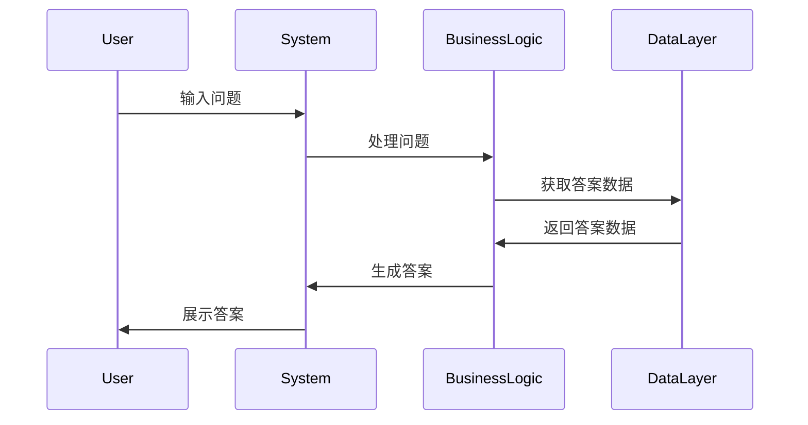
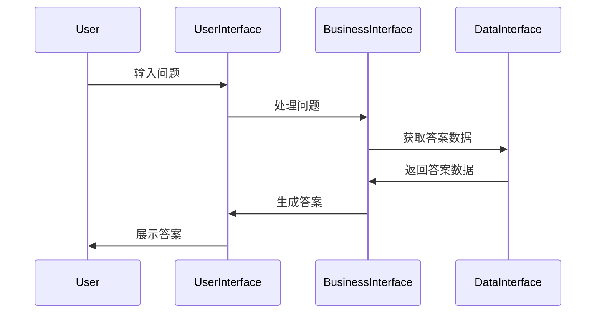

                 

# 自动化测试在LLM应用开发中的应用

> 关键词：自动化测试、LLM、应用开发、测试挑战、实现方法、案例研究

> 摘要：随着人工智能技术的发展，大型语言模型（LLM）在应用开发中扮演着越来越重要的角色。然而，LLM应用开发的复杂性使得传统的测试方法难以满足需求，自动化测试因此成为了解决这一问题的有效途径。本文将深入探讨自动化测试在LLM应用开发中的应用，包括其重要性、技术基础、挑战和实现方法，并通过实际案例进行分析。

### 目录大纲

1. 引言：自动化测试在LLM应用开发中的重要性
   1.1 问题的背景
   1.2 问题描述
   1.3 问题解决
   1.4 边界与外延
   1.5 核心概念与联系

2. LLM基础知识
   2.1 概念介绍
   2.2 特征对比表格
   2.3 ER实体关系图架构

3. 自动化测试技术
   3.1 自动化测试概述
   3.2 自动化测试工具
   3.3 自动化测试流程

4. LLM应用中的测试挑战
   4.1 特性分析
   4.2 测试案例

5. 自动化测试在LLM开发中的应用
   5.1 应用场景
   5.2 实现方法

6. 自动化测试案例研究
   6.1 案例背景
   6.2 系统功能设计
   6.3 系统架构设计
   6.4 系统接口设计
   6.5 系统交互
   6.6 实现细节
   6.7 分析与讲解

7. 自动化测试实践与优化
   7.1 最佳实践
   7.2 小结与展望

### 第1章 引言：自动化测试在LLM应用开发中的重要性

**1.1 问题的背景**

自动化测试是一种通过预定义的测试脚本和工具来执行测试活动的方法。它能够自动化重复性的测试任务，提高测试效率和准确性。随着软件开发的复杂度不断增加，自动化测试在保证软件质量方面发挥着越来越重要的作用。

近年来，大型语言模型（LLM）得到了快速发展，成为自然语言处理（NLP）领域的重要工具。LLM具有强大的文本生成、理解和分析能力，广泛应用于聊天机器人、内容审核、智能推荐等领域。然而，LLM应用开发的复杂性使得传统的测试方法难以满足需求。

**1.2 问题描述**

传统的测试方法在LLM应用开发中存在以下不足：

1. 测试用例生成困难：LLM生成的文本具有极大的多样性和不确定性，使得测试用例的生成变得复杂和耗时。
2. 测试覆盖率不足：传统的测试方法难以覆盖所有可能的输入和输出情况，导致测试覆盖率不足。
3. 测试结果分析复杂：LLM生成的文本质量难以评估，传统的测试结果分析方法难以应用于LLM应用开发。

**1.3 问题解决**

自动化测试在LLM应用开发中具有以下优势：

1. 提高测试效率：自动化测试能够快速执行大量测试用例，提高测试效率。
2. 提高测试覆盖率：通过编写覆盖不同场景的测试脚本，可以提高测试覆盖率。
3. 简化测试结果分析：自动化测试工具能够生成详细的测试报告，简化测试结果分析。

自动化测试与LLM结合的理论基础主要包括：

1. 测试脚本编写：基于LLM的文本生成能力，可以编写自动化测试脚本，模拟用户输入和系统响应。
2. 测试工具集成：将自动化测试工具集成到LLM应用开发流程中，实现自动化测试的各个环节。
3. 测试数据管理：利用LLM的文本处理能力，对测试数据进行处理和分析，提高测试数据的利用效率。

**1.4 边界与外延**

自动化测试技术的范围包括：

1. 单元测试：针对LLM模型中的各个组件进行测试，确保组件的正确性和稳定性。
2. 集成测试：对LLM应用中的不同模块进行集成测试，确保模块之间的协同工作。
3. 系统测试：对整个LLM应用进行测试，确保应用的完整性和性能。

LLM的范畴与限制包括：

1. 文本生成能力：LLM具有强大的文本生成能力，但生成的文本质量受限于训练数据和模型参数。
2. 语言理解能力：LLM能够理解一定程度的自然语言，但存在理解误差和歧义。
3. 领域适应性：LLM在不同领域的适应能力不同，需要针对特定领域进行定制化训练。

自动化测试在LLM应用开发中的适用场景包括：

1. 模型训练阶段：对LLM模型进行自动化测试，确保模型的稳定性和准确性。
2. 应用部署阶段：对LLM应用进行自动化测试，确保应用的性能和稳定性。
3. 应用运维阶段：对LLM应用进行自动化测试，确保应用的长期稳定运行。

**1.5 核心概念与联系**

自动化测试与LLM的基本概念包括：

1. 自动化测试：一种通过预定义的测试脚本和工具来执行测试活动的方法。
2. LLM：一种基于深度学习的大型语言模型，具有强大的文本生成、理解和分析能力。

自动化测试的流程与LLM的运行机制包括：

1. 测试计划与设计：根据LLM应用的特点，设计测试计划和测试用例。
2. 测试执行与结果分析：执行测试脚本，对测试结果进行分析和评估。

### 第2章 LLM基础知识

**2.1 概念介绍**

LLM（Large Language Model）是一种基于深度学习的大型语言模型，通过对海量文本数据进行训练，学习语言的规律和模式，从而实现对自然语言的生成、理解和分析。

LLM的基本原理是通过神经网络（如Transformer模型）对输入的文本序列进行建模，生成对应的输出文本序列。LLM的训练过程包括：

1. 数据预处理：将原始文本数据清洗、分词、编码等，转化为神经网络可处理的格式。
2. 模型训练：通过反向传播算法和优化器（如Adam）对神经网络参数进行更新，优化模型的性能。
3. 模型评估：使用验证集对模型进行评估，调整模型参数，优化模型效果。

LLM的类型与分类：

1. 按照模型架构：Transformer、BERT、GPT等。
2. 按照训练数据：通用语言模型、特定领域语言模型等。
3. 按照应用场景：文本生成、语言理解、文本分类、命名实体识别等。

LLM的核心技术包括：

1. Transformer模型：一种基于自注意力机制的神经网络模型，能够有效地处理长文本序列。
2. BERT模型：一种双向Transformer模型，通过预训练和微调，实现了出色的自然语言理解和生成能力。
3. GPT模型：一种自回归语言模型，能够生成连贯、自然的文本。

**2.2 特征对比表格**

| 模型名称 | 特点 | 优点 | 缺点 |
| --- | --- | --- | --- |
| Transformer | 自注意力机制 | 处理长文本序列能力强 | 训练时间长 |
| BERT | 双向Transformer | 语言理解能力强 | 需要大量计算资源 |
| GPT | 自回归 | 文本生成能力强 | 对计算资源要求高 |

**2.3 ER实体关系图架构**

ER实体关系图是描述LLM系统中实体及其关系的图形化工具。在LLM应用开发中，实体关系图的构建有助于理解和分析系统的结构。

以下是一个简单的ER实体关系图示例，描述了LLM系统中的一些基本实体和关系：

```mermaid
erDiagram
  Product ||--|{ Customer } : "makes purchase"
  Customer ||--|{ Order } : "places order"
  Product ||--|{ Supplier } : "supplied by"
  Supplier ||--|{ Delivery } : "delivers to"
```

在这个示例中，实体包括产品（Product）、客户（Customer）、供应商（Supplier）和订单（Order），关系包括制作（makes purchase）、订购（places order）、供应（supplied by）和交付（delivers to）。

### 第3章 自动化测试技术

**3.1 自动化测试概述**

自动化测试是一种通过预定义的测试脚本和工具来执行测试活动的方法。它能够自动化重复性的测试任务，提高测试效率和准确性。自动化测试的基本概念包括：

1. 测试脚本：用于描述测试过程和测试逻辑的代码，通常使用编程语言编写。
2. 测试工具：用于执行测试脚本和生成测试报告的工具，如Selenium、JUnit等。
3. 测试环境：用于运行测试脚本和执行测试活动的软件和硬件环境。

自动化测试的类型包括：

1. 单元测试：对软件的各个模块或组件进行测试，确保其功能正确。
2. 集成测试：对软件的多个模块进行集成测试，确保模块之间的协同工作。
3. 系统测试：对整个软件系统进行测试，确保系统的整体功能和质量。

**3.2 自动化测试工具**

常见的自动化测试工具包括：

1. Selenium：一种开源的自动化测试工具，支持多种编程语言和浏览器。
2. JUnit：一种Java开源测试框架，用于编写和执行单元测试。
3. PyTest：一种Python开源测试框架，用于编写和执行单元测试。

工具的选择与使用：

1. 选择合适的工具：根据项目需求和技术栈，选择合适的自动化测试工具。
2. 工具集成：将自动化测试工具集成到开发流程中，确保测试任务的自动化执行。
3. 测试脚本编写：根据测试需求，编写高效的测试脚本，提高测试效率。

**3.3 自动化测试流程**

自动化测试流程包括以下步骤：

1. 测试计划与设计：根据项目需求，制定自动化测试计划和设计测试用例。
2. 测试执行：执行自动化测试脚本，对软件进行测试。
3. 测试结果分析：分析测试结果，评估软件的质量和性能。
4. 测试报告生成：生成详细的测试报告，记录测试过程和结果。

### 第4章 LLM应用中的测试挑战

**4.1 特性分析**

LLM具有以下特性，给自动化测试带来了挑战：

1. 动态特性：LLM生成的文本具有动态性，难以预测和模拟所有可能的输入和输出情况。
2. 不确定性：LLM生成的文本存在不确定性，可能导致测试结果的不可重复性。

**4.2 测试案例**

以下是一个LLM应用中的测试案例：

1. 功能测试：测试LLM是否能够正确生成特定主题的文本。
2. 性能测试：测试LLM的响应速度和处理能力。
3. 稳定性测试：测试LLM在长时间运行下的稳定性和可靠性。

### 第5章 自动化测试在LLM开发中的应用

**5.1 应用场景**

自动化测试在LLM开发中的应用场景包括：

1. 模型训练阶段：对LLM模型进行自动化测试，确保模型的稳定性和准确性。
2. 应用部署阶段：对LLM应用进行自动化测试，确保应用的性能和稳定性。
3. 应用运维阶段：对LLM应用进行自动化测试，确保应用的长期稳定运行。

**5.2 实现方法**

自动化测试在LLM开发中的实现方法包括：

1. 测试计划与设计：根据项目需求，制定自动化测试计划和设计测试用例。
2. 测试脚本编写：编写自动化测试脚本，模拟用户输入和系统响应。
3. 测试执行与结果分析：执行自动化测试脚本，对测试结果进行分析和评估。
4. 测试报告生成：生成详细的测试报告，记录测试过程和结果。

### 第6章 自动化测试案例研究

**6.1 案例背景**

本案例研究的是一个基于GPT-3的智能问答系统，用户可以通过输入问题，系统返回相应的答案。

**6.2 系统功能设计**

系统功能设计包括：

1. 用户输入：用户输入问题。
2. 答案生成：系统根据输入的问题生成答案。
3. 答案展示：将生成的答案展示给用户。

领域模型：

```mermaid
classDiagram
  User <<class{ 用户 }>
  Question <<class{ 问题 }>
  Answer <<class{ 答案 }>
  System <<class{ 系统 }>
  User <|-- System
  Question <|-- System
  Answer <|-- System
```

**6.3 系统架构设计**

系统架构设计：

1. 界面层：负责接收用户输入和展示答案。
2. 业务逻辑层：负责处理用户输入和生成答案。
3. 数据层：存储问题和答案数据。

架构图：



**6.4 系统接口设计**

系统接口设计：

1. 用户接口：用于接收用户输入和展示答案。
2. 业务接口：用于处理用户输入和生成答案。
3. 数据接口：用于获取答案数据。

接口设计：

```mermaid
classDiagram
  UserInterface <<interface{ 用户接口 }>
  BusinessInterface <<interface{ 业务接口 }>
  DataInterface <<interface{ 数据接口 }>
  UserInterface <|.. BusinessInterface
  BusinessInterface <|.. DataInterface
```

**6.5 系统交互**

系统交互：



**6.6 实现细节**

实现细节包括：

1. 界面层：使用HTML和CSS实现用户界面。
2. 业务逻辑层：使用Python和GPT-3 API实现业务逻辑。
3. 数据层：使用MongoDB存储数据和答案。

环境安装：

```python
pip install Flask
pip install openai
```

核心实现：

```python
from flask import Flask, request, jsonify
import openai

app = Flask(__name__)

@app.route('/ask', methods=['POST'])
def ask():
    data = request.json
    question = data['question']
    response = openai.Completion.create(
        engine="text-davinci-003",
        prompt=question,
        max_tokens=50,
        n=1,
        stop=None,
        temperature=0.5,
    )
    return jsonify({'answer': response.choices[0].text.strip()})

if __name__ == '__main__':
    app.run(debug=True)
```

**6.7 分析与讲解**

本案例研究了一个基于GPT-3的智能问答系统，通过自动化测试确保系统的稳定性和准确性。测试过程中，可以使用Selenium自动化测试工具模拟用户输入和系统响应，对系统的功能、性能和稳定性进行全面测试。

### 第7章 自动化测试实践与优化

**7.1 最佳实践**

1. 制定详细的测试计划：在项目开发初期，制定详细的测试计划，明确测试目标和测试范围。
2. 编写高质量的测试脚本：编写易于理解和维护的测试脚本，提高测试效率和可复用性。
3. 优化测试流程：不断优化测试流程，减少测试时间和成本。

**7.2 小结与展望**

自动化测试在LLM应用开发中具有重要意义，可以提高测试效率和测试覆盖率。未来，随着人工智能技术的发展，自动化测试在LLM应用开发中的应用将更加广泛，为软件质量保障提供更加有效的手段。

### 作者

作者：AI天才研究院/AI Genius Institute & 禅与计算机程序设计艺术 /Zen And The Art of Computer Programming

### 总结

本文深入探讨了自动化测试在LLM应用开发中的应用，包括其重要性、技术基础、挑战和实现方法，并通过实际案例进行了分析。自动化测试在提高测试效率和测试覆盖率方面具有显著优势，对于保证LLM应用的质量具有重要意义。未来，自动化测试在LLM应用开发中的应用前景广阔，值得进一步研究和推广。

