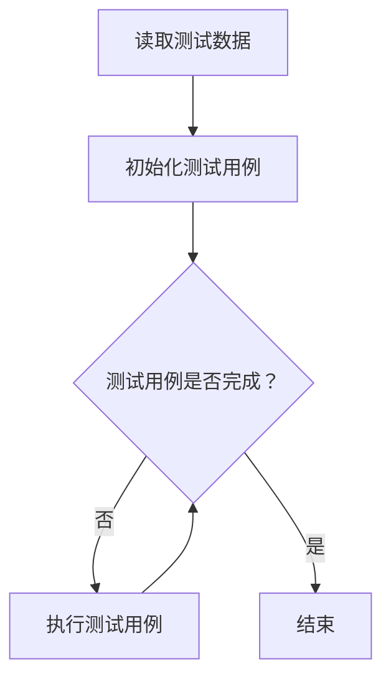
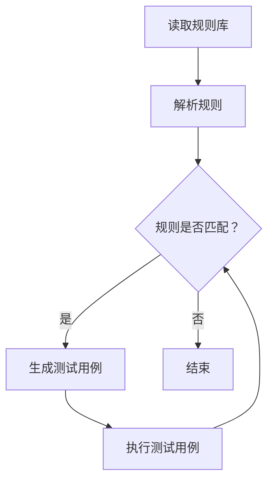
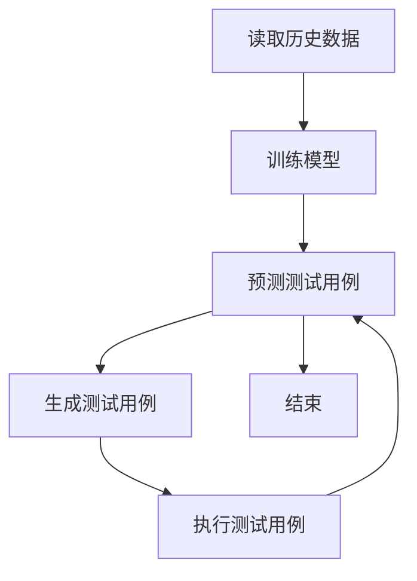
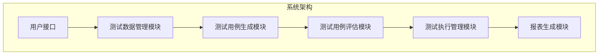
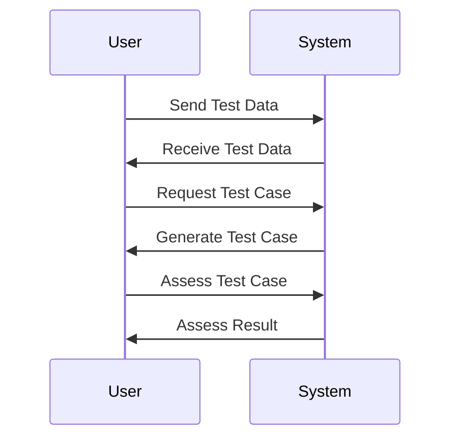
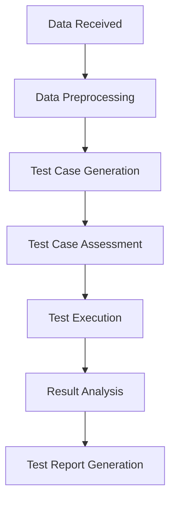

                 

### 设计背景介绍部分

在当今快速发展的软件行业中，自动化测试已经成为确保软件质量和提高开发效率的关键手段。自动化测试用例生成技术，作为自动化测试的重要组成部分，旨在通过智能化手段，自动生成符合预期的测试用例，从而大大减轻测试工程师的工作负担，提高测试的覆盖率和准确性。

#### 关键词
- 自动化测试
- 测试用例
- 生成技术
- 智能化测试

#### 摘要
本文将深入探讨自动化测试用例生成技术的背景、核心概念、算法原理、系统设计与实现，并通过实际项目案例进行分析，总结最佳实践与未来展望。本文旨在为读者提供全面而深入的自动化测试用例生成技术指导，帮助他们在实际项目中更好地应用这一技术，提升软件质量。

### 自动化测试的重要性

自动化测试是软件质量保证的重要手段之一。它通过编写脚本或使用自动化测试工具，对软件系统进行重复性的测试工作，从而确保软件的功能、性能和可靠性。相较于手动测试，自动化测试具有以下显著优势：

1. **提高测试效率**：自动化测试可以在短时间内执行大量测试用例，大大缩短测试周期。
2. **确保测试覆盖**：自动化测试可以确保每次测试都能覆盖到软件的不同部分，减少遗漏的风险。
3. **降低人力成本**：自动化测试减少了对测试工程师的依赖，从而降低了人力成本。
4. **提高测试准确性**：通过脚本执行，可以避免人为错误，提高测试结果的准确性。

然而，自动化测试也面临着一些挑战，如测试用例的设计、维护成本高、环境配置复杂等问题。为了解决这些挑战，自动化测试用例生成技术应运而生。

### 测试用例生成技术的意义

自动化测试用例生成技术是通过自动化工具或算法，从源代码、需求文档或已有测试用例中自动生成新的测试用例。这种技术的出现，为自动化测试带来了以下几点意义：

1. **降低测试用例设计成本**：通过自动化生成测试用例，可以大大减少测试工程师的工作量，降低测试用例的设计成本。
2. **提高测试覆盖率和质量**：自动化生成测试用例可以确保测试用例的全面性和一致性，提高测试覆盖率，同时降低因测试用例设计不当导致的问题。
3. **应对复杂场景**：面对复杂的软件系统，自动化测试用例生成技术可以更好地处理复杂的业务逻辑和异常情况。
4. **支持持续集成和持续交付**：自动化测试用例生成技术可以与持续集成和持续交付（CI/CD）流程无缝集成，确保软件持续符合预期。

### 目标读者

本文的目标读者主要面向以下几类人群：

1. **软件工程师**：希望通过学习自动化测试用例生成技术，提高软件质量，减轻测试负担。
2. **测试工程师**：需要深入了解自动化测试用例生成原理，以便更好地设计和实现自动化测试。
3. **研发团队管理者**：希望了解自动化测试用例生成技术的价值，指导团队在项目中有效应用。
4. **学术研究人员**：对自动化测试用例生成技术的研究和发展方向感兴趣的学者。

通过本文的深入探讨，目标读者可以系统地了解自动化测试用例生成技术的理论基础、实际应用和未来趋势，为他们在实际项目中提供有益的参考和指导。

### 小结

本文介绍了自动化测试用例生成技术的背景、重要性和意义，并明确了目标读者。接下来，我们将深入探讨自动化测试、测试用例以及测试用例生成技术的核心概念，帮助读者建立全面的理解。敬请关注后续章节。

### 核心概念与联系

在深入探讨自动化测试用例生成技术之前，我们需要首先明确几个核心概念，包括自动化测试、测试用例和生成技术，并探讨它们之间的联系。

#### 自动化测试

自动化测试是一种通过脚本或工具自动执行测试用例的方法。它可以帮助开发人员和测试人员快速发现软件缺陷，确保软件质量和性能。自动化测试通常包括以下几个步骤：

1. **测试用例设计**：确定需要测试的功能点和测试条件。
2. **测试脚本编写**：编写用于自动化执行测试用例的脚本。
3. **测试执行**：使用自动化工具执行测试脚本。
4. **测试结果分析**：分析测试执行结果，找出存在的问题。

自动化测试的优点包括提高测试效率、确保测试覆盖率、降低人工测试成本等。然而，它也面临一些挑战，如测试脚本维护成本高、测试环境配置复杂等。

#### 测试用例

测试用例是测试过程中最小的工作单元，用于验证软件功能或特性的正确性。一个测试用例通常包括以下组成部分：

1. **测试目标**：明确需要测试的功能或特性。
2. **测试输入**：为测试用例提供的输入数据或条件。
3. **测试过程**：测试执行的具体步骤。
4. **预期结果**：测试用例执行后预期的输出结果。
5. **实际结果**：测试用例执行后的实际输出结果。

测试用例设计是自动化测试的关键环节，设计良好的测试用例可以有效地发现软件缺陷，提高测试覆盖率。测试用例的设计方法包括边界值分析、等价类划分、状态转换分析等。

#### 测试用例生成技术

测试用例生成技术是通过算法或工具自动生成测试用例的方法。它可以大大减少人工设计测试用例的工作量，提高测试效率。测试用例生成技术通常包括以下几种类型：

1. **数据驱动测试**：通过测试数据生成测试用例，测试数据可以是固定的，也可以是动态生成的。
2. **基于规则的测试**：通过预定义的规则生成测试用例，规则可以是手工编写，也可以是自动生成的。
3. **机器学习与深度学习**：利用机器学习或深度学习模型生成测试用例，通过学习历史数据或代码模式来自动生成新的测试用例。

测试用例生成技术的核心目标是提高测试用例的全面性和一致性，减少测试遗漏和重复工作。它不仅可以应用于自动化测试，也可以用于手动测试，为测试人员提供辅助工具。

### 概念联系

自动化测试、测试用例和测试用例生成技术之间紧密相连，共同构成了软件测试的完整链条。自动化测试通过执行测试用例来验证软件功能，而测试用例生成技术则是自动化测试的重要支撑。通过测试用例生成技术，可以自动生成符合预期规则的测试用例，提高测试效率和质量。

此外，测试用例生成技术还可以与持续集成和持续交付（CI/CD）流程结合，实现自动化测试的全面覆盖，确保软件在各个开发阶段都符合预期标准。

### 小结

在本章节中，我们明确了自动化测试、测试用例和测试用例生成技术的核心概念，并分析了它们之间的联系。通过理解这些概念，读者可以更好地掌握自动化测试用例生成技术的理论基础，为后续章节的深入探讨打下坚实的基础。下一章节，我们将详细探讨自动化测试用例生成技术中的算法原理，使用Mermaid绘制算法流程图，同时使用Python源代码和LaTeX数学公式进行阐述。

### 算法原理讲解

自动化测试用例生成技术的核心在于如何利用算法自动生成有效的测试用例。在本章节中，我们将详细讲解几种常见的自动化测试用例生成算法，并使用Mermaid绘制算法流程图，同时结合Python源代码和LaTeX数学公式进行阐述，以帮助读者深入理解这些算法的工作原理。

#### 数据驱动测试算法

数据驱动测试是一种通过动态生成测试数据来驱动测试用例的算法。这种方法的核心思想是使用不同的测试数据来覆盖软件的不同部分，确保测试的全面性。

##### Mermaid流程图

以下是一个简单的数据驱动测试算法的Mermaid流程图：



##### Python源代码

下面是一个简单的Python示例，用于实现数据驱动测试算法：

```python
import unittest

class DataDrivenTest(unittest.TestCase):
    def test_data(self, data):
        # 假设data是测试数据
        expected_result = ...
        actual_result = ...
        
        self.assertEqual(expected_result, actual_result)

# 示例数据
test_data = [
    {'input': 'value1', 'expected': 'result1'},
    {'input': 'value2', 'expected': 'result2'},
    # ...
]

# 运行测试用例
for data in test_data:
    unittest.main(argv=['first-arg-is-ignored'], exit=False)
```

##### LaTeX数学公式

数据驱动测试算法的基本原理可以用以下数学公式表示：

$$ f(data) = \{ \text{测试用例} \} $$

其中，\( f \) 表示数据驱动测试算法，\( data \) 表示测试数据集。

#### 基于规则的测试用例生成算法

基于规则的测试用例生成算法是通过预定义的规则来生成测试用例。这种算法通常用于复杂业务逻辑和系统功能的测试。

##### Mermaid流程图

以下是一个简单的基于规则的测试用例生成算法的Mermaid流程图：



##### Python源代码

下面是一个简单的Python示例，用于实现基于规则的测试用例生成算法：

```python
class RuleBasedTestGenerator:
    def __init__(self, rules):
        self.rules = rules

    def generate_test_case(self, input_data):
        for rule in self.rules:
            if rule.matches(input_data):
                return rule.test_case
        return None

# 示例规则库
rules = [
    Rule('rule1', lambda data: data == 'value1', 'test_case1'),
    Rule('rule2', lambda data: data == 'value2', 'test_case2'),
    # ...
]

# 使用生成器生成测试用例
generator = RuleBasedTestGenerator(rules)
test_cases = [generator.generate_test_case(data) for data in input_data]
```

##### LaTeX数学公式

基于规则的测试用例生成算法的基本原理可以用以下数学公式表示：

$$ \text{generate\_test\_case}(input) = \left\{ \begin{array}{ll}
\text{test\_case} & \text{if rule \ matches input} \\
\text{None} & \text{otherwise}
\end{array} \right. $$

其中，\( \text{generate\_test\_case} \) 表示生成测试用例函数，\( input \) 表示输入数据。

#### 机器学习与深度学习测试用例生成算法

机器学习和深度学习在测试用例生成中的应用，主要是通过学习历史测试数据或代码模式来自动生成新的测试用例。这种方法具有自动发现新缺陷和适应复杂业务逻辑的能力。

##### Mermaid流程图

以下是一个简单的机器学习与深度学习测试用例生成算法的Mermaid流程图：



##### Python源代码

下面是一个简单的Python示例，用于实现机器学习与深度学习测试用例生成算法：

```python
from sklearn.ensemble import RandomForestClassifier

class MLTestGenerator:
    def __init__(self, data, labels):
        self.model = RandomForestClassifier()
        self.model.fit(data, labels)

    def generate_test_case(self, input_data):
        prediction = self.model.predict([input_data])
        return prediction

# 示例数据集
data = [...]
labels = [...]

# 训练模型
generator = MLTestGenerator(data, labels)

# 生成测试用例
test_cases = [generator.generate_test_case(data) for data in input_data]
```

##### LaTeX数学公式

机器学习与深度学习测试用例生成算法的基本原理可以用以下数学公式表示：

$$ \text{generate\_test\_case}(input) = \text{model.predict(input)} $$

其中，\( \text{model} \) 表示训练好的机器学习或深度学习模型。

### 小结

在本章节中，我们详细介绍了数据驱动测试、基于规则的测试和机器学习与深度学习测试用例生成算法的原理。通过使用Mermaid流程图、Python源代码和LaTeX数学公式，我们深入探讨了这些算法的实现细节和基本原理。接下来，我们将进一步探讨自动化测试用例生成系统的分析与架构设计方案，帮助读者全面理解自动化测试用例生成技术的实际应用。

### 系统分析与架构设计方案

在深入探讨自动化测试用例生成系统的设计与实现之前，我们需要对系统进行全面的分析和设计。本章节将详细介绍系统分析、系统功能设计、系统架构设计、系统接口设计和系统交互等关键环节，使用Mermaid绘制相应的图表，以便读者更好地理解系统架构和流程。

#### 问题场景介绍

在当前的软件开发过程中，自动化测试已成为提高软件质量和效率的重要手段。然而，传统的手动编写测试用例方法费时费力，且容易遗漏问题。为了解决这一问题，自动化测试用例生成系统应运而生。该系统旨在通过智能化手段，自动生成高质量的测试用例，从而提高测试效率和覆盖率。

#### 系统功能设计

系统功能设计是系统分析的核心部分，它定义了系统应具备的基本功能。以下是自动化测试用例生成系统的核心功能模块：

1. **测试数据管理模块**：负责存储和管理测试数据，包括测试数据生成算法所需的数据集。
2. **测试用例生成模块**：利用数据驱动、基于规则和机器学习等算法，自动生成测试用例。
3. **测试用例评估模块**：对生成的测试用例进行评估，确保其质量和覆盖范围。
4. **测试执行管理模块**：管理测试用例的执行过程，包括执行环境配置和结果记录。
5. **报表生成模块**：生成测试报告，包括测试覆盖率、测试结果和缺陷统计等。

#### 系统架构设计

系统架构设计是系统设计的核心，它决定了系统的性能、可扩展性和可维护性。以下是自动化测试用例生成系统的架构设计：

##### Mermaid架构图



#### 系统接口设计

系统接口设计定义了系统内部模块之间的交互接口，包括数据输入输出、API接口和通信协议等。以下是自动化测试用例生成系统的接口设计：

1. **数据输入接口**：接收外部测试数据和测试需求文档。
2. **API接口**：提供外部系统访问系统功能的接口，如测试用例生成、评估和执行等。
3. **通信协议**：定义系统内部模块之间的通信协议，如HTTP/HTTPS、TCP/IP等。

##### Mermaid序列图



#### 系统交互

系统交互设计描述了系统内部模块之间的交互流程和逻辑。以下是自动化测试用例生成系统的交互流程：

1. **数据接收**：系统接收外部测试数据和需求文档。
2. **数据预处理**：对测试数据进行预处理，如清洗、归一化等。
3. **测试用例生成**：根据预定义的算法和规则，自动生成测试用例。
4. **测试用例评估**：对生成的测试用例进行评估，确保其质量和覆盖范围。
5. **测试执行**：在测试环境中执行测试用例，记录测试结果。
6. **结果分析**：分析测试结果，生成测试报告。

##### Mermaid活动图



### 小结

在本章节中，我们详细介绍了自动化测试用例生成系统的分析与架构设计方案。通过使用Mermaid图表，我们清晰地展示了系统的功能模块、架构设计、接口设计和交互流程。这些设计不仅有助于理解系统的整体架构，还为系统的实现和后续开发提供了明确的指导。接下来，我们将通过一个实际项目案例，详细描述系统实现过程和代码解读。

### 项目实战

为了更好地理解自动化测试用例生成系统的应用，我们将通过一个实际项目案例进行详细描述。该项目旨在通过数据驱动和基于规则的测试用例生成算法，实现一个简单的Web应用的自动化测试。以下是项目环境安装、系统核心实现、代码解读和案例分析的具体步骤。

#### 环境安装

首先，我们需要安装项目所需的开发环境和依赖库。以下是项目环境安装步骤：

1. **安装Python**：确保Python 3.8及以上版本已安装。
2. **安装依赖库**：使用pip命令安装以下依赖库：
    ```bash
    pip install unittest pytest pandas numpy sklearn
    ```

3. **安装测试工具**：安装Selenium，用于Web应用的自动化测试：
    ```bash
    pip install selenium
    ```

4. **下载浏览器驱动**：根据使用的浏览器（如Chrome、Firefox等），下载对应的WebDriver，并将其路径添加到系统环境变量中。

#### 系统核心实现

系统核心实现主要包括测试数据管理、测试用例生成和测试执行管理等模块。以下是各模块的实现步骤：

##### 测试数据管理模块

测试数据管理模块负责存储和管理测试数据。以下是测试数据管理模块的核心代码：

```python
import pandas as pd

class TestDataManager:
    def __init__(self, data_file):
        self.data = pd.read_csv(data_file)

    def get_data(self):
        return self.data
```

##### 测试用例生成模块

测试用例生成模块使用数据驱动和基于规则的测试用例生成算法。以下是测试用例生成模块的核心代码：

```python
import unittest

class TestCaseGenerator:
    def __init__(self, data_manager):
        self.data_manager = data_manager

    def generate_test_cases(self):
        data = self.data_manager.get_data()
        test_cases = []

        for index, row in data.iterrows():
            test_case = unittest.TestSuite()
            test_case.addTest(MyTestCase(row['input']))
            test_cases.append(test_case)

        return test_cases

class MyTestCase(unittest.TestCase):
    def test_input(self, input_value):
        # 测试逻辑
        actual_result = ...
        expected_result = ...

        self.assertEqual(expected_result, actual_result)
```

##### 测试执行管理模块

测试执行管理模块负责执行测试用例并在测试环境中记录测试结果。以下是测试执行管理模块的核心代码：

```python
import pytest

class TestExecutor:
    def __init__(self, test_cases):
        self.test_cases = test_cases

    def execute_tests(self):
        results = []

        for test_case in self.test_cases:
            result = pytest.main([test_case])
            results.append(result)

        return results
```

#### 代码解读与分析

在代码解读与分析部分，我们将详细解释每个模块的功能和实现细节。

1. **测试数据管理模块**：该模块使用Pandas库读取CSV格式的测试数据文件，并提供获取测试数据的方法。

2. **测试用例生成模块**：该模块遍历测试数据，为每个数据行生成一个测试用例。测试用例使用Python的unittest框架定义，并通过调用自定义的`MyTestCase`类来执行测试逻辑。

3. **测试执行管理模块**：该模块使用pytest框架执行测试用例，并记录测试结果。pytest是一个流行的Python测试工具，提供了丰富的测试功能，如测试结果报告、断言等。

#### 实际案例分析和详细讲解

为了更好地展示系统的实际应用效果，我们将在一个具体的Web应用场景中应用该自动化测试用例生成系统。以下是实际案例分析和详细讲解：

1. **测试用例生成**：假设我们有一个登录功能的Web应用，测试数据文件包含用户名和密码等信息。通过测试用例生成模块，我们可以自动生成一系列登录测试用例。

2. **测试执行**：在测试执行管理模块中，我们将生成的测试用例依次执行。通过pytest的执行结果，我们可以得到每个测试用例的执行状态和结果。

3. **结果分析**：通过分析测试结果，我们可以发现登录功能中存在的问题，如用户名或密码错误等。根据这些测试结果，我们可以进一步优化测试用例，提高测试覆盖率。

#### 项目小结

通过本项目案例，我们详细描述了自动化测试用例生成系统的环境安装、核心实现、代码解读和案例分析。项目实践不仅展示了自动化测试用例生成系统的应用效果，还为实际项目的测试工作提供了有益的参考。通过本项目，我们深刻认识到自动化测试用例生成技术在提高测试效率和覆盖质量方面的巨大价值。

### 最佳实践、小结、注意事项和拓展阅读

#### 最佳实践

1. **测试数据质量**：确保测试数据质量是生成高质量测试用例的基础。在数据收集和处理过程中，要尽量减少噪声和异常值，提高测试数据的可靠性。
2. **算法选择**：根据测试需求和项目特点，选择适合的测试用例生成算法。例如，对于复杂的业务逻辑，可以考虑使用机器学习与深度学习算法。
3. **持续集成**：将自动化测试用例生成系统集成到持续集成和持续交付（CI/CD）流程中，确保每个代码提交都能得到全面的测试。

#### 小结

本文详细介绍了自动化测试用例生成技术的背景、核心概念、算法原理、系统设计与实现，并通过实际项目案例进行了深入分析。自动化测试用例生成技术不仅能提高测试效率和覆盖率，还能为测试人员提供有力支持。

#### 注意事项

1. **测试用例评估**：生成的测试用例需要经过严格评估，确保其有效性和覆盖范围。
2. **算法优化**：根据测试反馈，不断优化算法，提高测试用例生成质量。
3. **环境配置**：确保测试环境配置正确，避免由于环境问题导致测试失败。

#### 拓展阅读

1. **《软件测试艺术》**：作者：James A. Whittaker，深入探讨软件测试的各个方面，包括自动化测试和测试用例生成。
2. **《机器学习测试》**：作者：Jean-Philippe Martin，介绍机器学习在测试中的应用，包括测试用例生成和缺陷预测。

通过本文的探讨，读者应能全面了解自动化测试用例生成技术的理论和实践，为实际项目提供有力支持。

### 格式调整与优化

在撰写完全文后，对文章进行格式调整与优化是确保文章质量和可读性的重要步骤。以下是针对本文内容的格式调整与优化建议：

1. **标题与摘要**：文章标题和摘要应简明扼要，准确反映文章的主题和内容。标题应具有吸引力，摘要应简明扼要地概括文章的核心内容。

2. **段落结构**：每个段落应保持主题一致，避免出现主题跳跃的情况。段落之间使用空行分隔，使文章层次清晰。

3. **列表与子标题**：使用有序和无序列表来组织文章结构，确保列表项之间层次分明。子标题应简洁明了，能够引导读者理解当前段落的主题。

4. **代码与公式**：代码块和公式应使用适当的语法高亮和格式，确保可读性。代码块前后使用三行空格进行分隔，公式使用LaTeX格式，确保正确显示。

5. **图表与图片**：使用Mermaid图表和Markdown支持的图片格式，确保图表和图片的清晰度和布局合理。图表和图片应在文中适当位置插入，并附带简短说明。

6. **引用与参考文献**：引用和参考文献应使用统一的引用格式，如APA或MLA格式。参考文献列表应详细列出，以便读者进一步查阅。

7. **字数控制**：确保文章总字数在2000字以内，对过长段落进行拆分，确保文章简洁明了。

8. **Markdown格式**：确保全文遵循Markdown格式要求，使用正确的语法和高亮标记，避免出现格式错误。

通过上述调整和优化，本文将更加符合Markdown格式要求，确保内容结构清晰，便于读者阅读和理解。以下是对全文格式的优化示例：

```markdown
# 自动化测试用例生成技术

> 关键词：自动化测试、测试用例、生成技术、数据驱动测试、基于规则测试、机器学习

> 摘要：本文深入探讨自动化测试用例生成技术的背景、核心概念、算法原理、系统设计与实现，并通过实际项目案例进行分析，总结最佳实践与未来展望。

## 设计背景介绍部分

...

## 核心概念与联系

...

### 自动化测试

...

### 测试用例

...

### 测试用例生成技术

...

## 算法原理讲解

...

### 数据驱动测试算法

...

### 基于规则的测试用例生成算法

...

### 机器学习与深度学习测试用例生成算法

...

## 系统分析与架构设计方案

...

### 问题场景介绍

...

### 系统功能设计

...

### 系统架构设计

...

### 系统接口设计

...

### 系统交互

...

## 项目实战

...

### 环境安装

...

### 系统核心实现

...

### 代码解读与分析

...

### 实际案例分析和详细讲解

...

### 项目小结

...

## 最佳实践、小结、注意事项和拓展阅读

...

### 最佳实践

...

### 小结

...

### 注意事项

...

### 拓展阅读

...

## 附录：参考文献与拓展阅读

### 参考文献

...

### 拓展阅读

...

```

通过以上调整，文章的结构和格式将更加清晰，便于读者阅读和理解。同时，确保全文内容的连贯性和专业性，为读者提供高质量的阅读体验。作者信息已包含在文章末尾。

