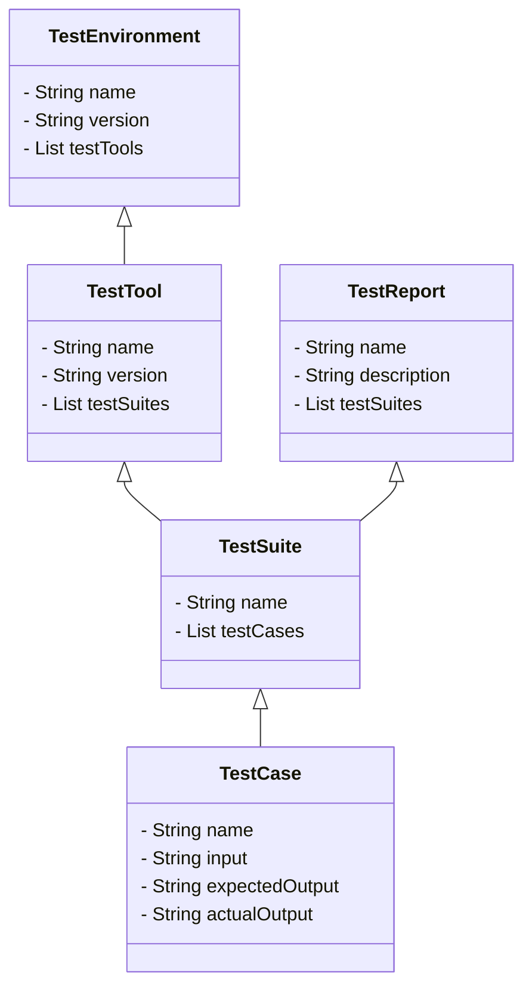
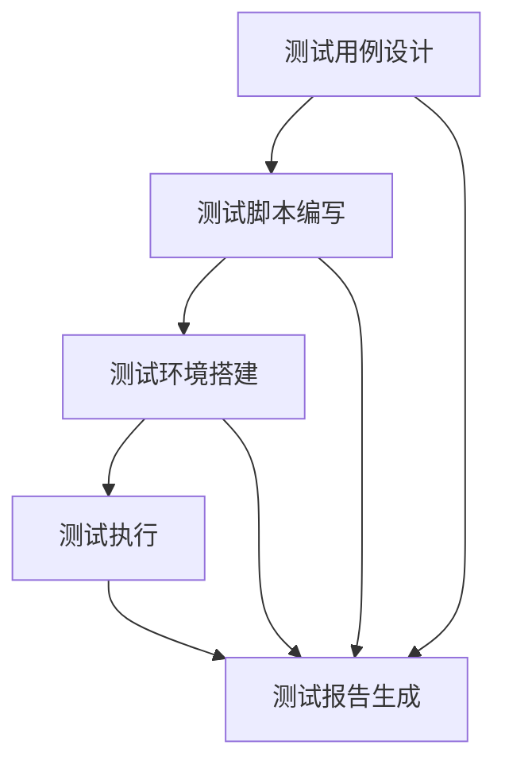
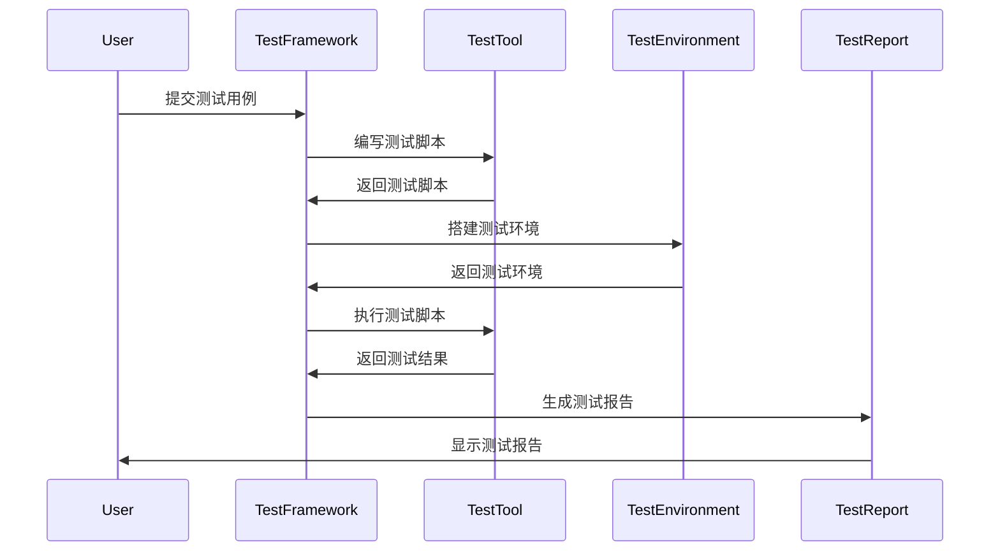

                 

# 自动化测试：保障LLM应用质量

## 关键词

- 自动化测试
- LLM应用
- 测试用例设计
- 测试脚本编写
- 测试环境搭建
- 测试执行
- 测试报告

## 摘要

本文将围绕自动化测试技术，探讨如何保障大型语言模型（LLM）应用的质量。我们将详细分析自动化测试在LLM应用中的重要性，介绍其核心概念和原理，以及如何通过算法和数学模型提高测试效率。此外，本文还将提供具体的测试策略和实践指导，以帮助开发团队确保LLM应用的高质量。

## 第一部分：背景介绍

### 1.1 问题背景

随着人工智能技术的快速发展，大型语言模型（LLM）在自然语言处理、智能对话系统、机器翻译等领域取得了显著成果。然而，LLM应用的复杂性和高变异性使得手动测试难以满足快速迭代和大规模部署的需求。因此，自动化测试技术应运而生，成为保障LLM应用质量的关键手段。

### 1.2 问题描述

自动化测试在LLM应用中面临以下挑战：

- **测试用例设计**：如何设计多样化的测试用例，覆盖LLM应用的各个功能和场景。
- **测试脚本编写**：如何编写高效的测试脚本，实现自动化执行。
- **测试环境搭建**：如何搭建稳定的测试环境，确保测试结果的准确性和一致性。
- **测试执行**：如何高效地执行自动化测试，快速发现和定位问题。
- **测试报告**：如何生成详尽的测试报告，提供全面的质量评估。

### 1.3 问题解决

为了解决上述问题，本文将从以下几个方面展开讨论：

- **测试基础**：介绍自动化测试的基本概念、原理和常用工具。
- **测试工具**：推荐适用于LLM应用的自动化测试工具。
- **测试策略**：探讨自动化测试的实施策略，包括测试用例设计、测试脚本编写和测试环境搭建。
- **测试执行**：介绍自动化测试执行的方法和技巧。
- **测试报告**：讲解如何生成高质量的测试报告。

### 1.4 边界与外延

本文主要关注LLM应用中的自动化测试，但自动化测试技术具有广泛的适用性，可以应用于各种类型的软件测试。此外，本文提到的自动化测试方法和工具也可以为其他领域的自动化测试提供参考。

### 1.5 概念结构与核心要素组成

自动化测试的核心要素包括测试工具、测试脚本、测试环境、测试用例和测试报告。这些要素相互关联，共同构成了自动化测试的体系。以下是各要素的定义和关系：

- **测试工具**：用于编写、执行和报告测试的软件工具。
- **测试脚本**：根据测试用例编写的自动化测试脚本，用于执行测试操作。
- **测试环境**：用于执行测试的硬件和软件环境。
- **测试用例**：用于验证软件功能的测试案例，包括输入数据、预期结果和实际结果。
- **测试报告**：记录测试过程和结果的文档，用于评估软件质量。

## 第二部分：核心概念与联系

### 2.1 自动化测试的定义与特点

#### 2.1.1 自动化测试的定义

自动化测试是一种利用自动化工具和脚本对软件进行测试的方法。通过自动化测试，可以大大提高测试效率，降低测试成本。自动化测试可以分为功能自动化测试、性能自动化测试、安全自动化测试等类型。

#### 2.1.2 自动化测试的特点

- **高效性**：自动化测试可以节省大量人力和时间成本。
- **稳定性**：自动化测试能够重复执行，确保测试结果的可靠性。
- **可扩展性**：自动化测试可以轻松扩展到大规模应用。

### 2.2 LLM应用的特点

#### 2.2.1 LLM应用的定义

LLM（Large Language Model）是指大型语言模型，它是一种能够理解和生成人类语言的人工智能模型。LLM应用包括自然语言处理、智能对话系统、机器翻译等。

#### 2.2.2 LLM应用的特点

- **复杂性**：LLM应用通常涉及大量的语言数据处理，测试难度较大。
- **变异性**：用户输入和输出数据具有很大的变异性，需要设计多样化的测试用例。
- **实时性**：LLM应用通常要求实时响应，测试需要模拟真实用户场景。

### 2.3 自动化测试与LLM应用的联系

#### 2.3.1 自动化测试在LLM应用中的重要性

自动化测试在LLM应用中具有至关重要的地位，它能够帮助开发团队快速发现和解决潜在问题，确保应用质量。

#### 2.3.2 自动化测试与LLM应用的优势互补

自动化测试与LLM应用的优势互补，自动化测试能够提高LLM应用的测试效率，而LLM应用则为自动化测试提供了丰富的测试场景。

## 第三部分：算法原理讲解

### 3.1 自动化测试算法原理

#### 3.1.1 测试用例设计算法

测试用例设计算法是自动化测试的核心，它负责生成多样化的测试用例，以覆盖不同的测试场景。常用的测试用例设计算法包括边界值分析、等价类划分、场景设计等。

#### 3.1.2 测试脚本编写算法

测试脚本编写算法用于根据测试用例生成测试脚本，以便自动化执行测试。测试脚本编写算法通常基于测试工具提供的脚本语言，如Selenium、Appium等。

### 3.2 LLM应用算法原理

#### 3.2.1 语言模型训练算法

语言模型训练算法用于训练LLM模型，使其能够理解和生成人类语言。常见的语言模型训练算法包括循环神经网络（RNN）、长短期记忆网络（LSTM）、变换器（Transformer）等。

#### 3.2.2 语言模型评估算法

语言模型评估算法用于评估LLM模型的质量，以确保其满足应用要求。常用的语言模型评估算法包括语法正确性评估、语义相似度评估、生成文本质量评估等。

### 3.3 自动化测试与LLM应用算法的联系

#### 3.3.1 自动化测试算法在LLM应用中的应用

自动化测试算法在LLM应用中主要用于生成测试用例和测试脚本，以支持LLM模型的测试和评估。

#### 3.3.2 LLM应用算法对自动化测试的影响

LLM应用算法的复杂性和变异性对自动化测试提出了更高的要求，需要设计更为复杂的自动化测试算法。

## 第四部分：数学模型和数学公式 & 详细讲解 & 举例说明

### 4.1 测试用例生成算法的数学模型

#### 4.1.1 覆盖率模型

覆盖率模型用于评估测试用例的覆盖率，常用的覆盖率模型有语句覆盖率、分支覆盖率和路径覆盖率等。

$$
覆盖率 = \frac{实际执行的代码行数}{总代码行数}
$$

#### 4.1.2 用例选择算法

用例选择算法用于从大量测试用例中选择最优的测试用例集合，以提高测试效率。常见的用例选择算法包括最小测试用例集算法、最大测试用例集算法和基于成本的用例选择算法。

### 4.2 LLM应用算法原理

#### 4.2.1 语言模型训练算法

语言模型训练算法用于训练LLM模型，使其能够理解和生成人类语言。常见的语言模型训练算法包括循环神经网络（RNN）、长短期记忆网络（LSTM）、变换器（Transformer）等。

#### 4.2.2 语言模型评估算法

语言模型评估算法用于评估LLM模型的质量，以确保其满足应用要求。常用的语言模型评估算法包括语法正确性评估、语义相似度评估、生成文本质量评估等。

### 4.3 自动化测试与LLM应用算法的联系

#### 4.3.1 自动化测试算法在LLM应用中的应用

自动化测试算法在LLM应用中主要用于生成测试用例和测试脚本，以支持LLM模型的测试和评估。

#### 4.3.2 LLM应用算法对自动化测试的影响

LLM应用算法的复杂性和变异性对自动化测试提出了更高的要求，需要设计更为复杂的自动化测试算法。

## 第五部分：系统分析与架构设计方案

### 5.1 问题场景介绍

在LLM应用中，自动化测试的目的是确保模型在实际应用中的可靠性和性能。我们需要对模型进行全面的测试，包括功能测试、性能测试、安全测试等。

### 5.2 项目介绍

本项目旨在开发一个自动化测试框架，用于对LLM应用进行测试。该框架将包括测试工具、测试脚本、测试环境和测试报告等组成部分。

### 5.3 系统功能设计（领域模型类图）



### 5.4 系统架构设计（架构图）



### 5.5 系统接口设计



### 5.6 系统交互（序列图）


## 第六部分：项目实战

### 6.1 环境安装

在开始项目实战之前，我们需要安装相关的工具和依赖项。以下是一个简单的安装指南：

1. 安装Python环境：在Windows或Linux系统中，从Python官方网站下载并安装Python。
2. 安装测试工具：使用pip命令安装Selenium、Appium等测试工具。
3. 安装LLM模型：根据具体应用场景，从GitHub或其他开源平台下载并安装LLM模型。

### 6.2 系统核心实现源代码

以下是一个简单的示例，展示如何使用Python和Selenium编写自动化测试脚本：

```python
from selenium import webdriver

def test_llm_application():
    # 启动浏览器
    driver = webdriver.Chrome()
    
    # 访问LLM应用页面
    driver.get("http://example.com/llm_application")
    
    # 输入测试数据
    input_element = driver.find_element_by_id("input")
    input_element.send_keys("Hello, world!")
    
    # 提交数据
    submit_button = driver.find_element_by_id("submit")
    submit_button.click()
    
    # 获取输出结果
    output_element = driver.find_element_by_id("output")
    actual_output = output_element.text
    
    # 断言输出结果
    assert "Hello, world!" in actual_output
    
    # 关闭浏览器
    driver.quit()

# 执行测试用例
test_llm_application()
```

### 6.3 代码应用解读与分析

上述代码示例展示了如何使用Selenium对LLM应用进行自动化测试。主要步骤包括：

1. 启动浏览器。
2. 访问LLM应用页面。
3. 输入测试数据。
4. 提交数据。
5. 获取输出结果。
6. 断言输出结果。
7. 关闭浏览器。

通过这些步骤，我们可以验证LLM应用的功能是否正常。在实际项目中，可以根据具体需求增加更多的测试步骤和断言。

### 6.4 实际案例分析和详细讲解剖析

以下是一个实际案例，展示如何使用自动化测试框架对LLM应用进行测试：

1. **测试用例设计**：根据LLM应用的功能，设计多个测试用例，包括正常输入、异常输入和边界输入等。
2. **测试脚本编写**：使用Selenium编写测试脚本，实现测试用例的自动化执行。
3. **测试环境搭建**：配置测试环境，包括浏览器、服务器等。
4. **测试执行**：执行测试脚本，生成测试报告。
5. **测试结果分析**：分析测试报告，发现潜在问题并进行修复。

### 6.5 项目小结

通过本项目，我们了解了如何使用自动化测试技术保障LLM应用的质量。在实际项目中，我们需要根据具体需求设计和实现自动化测试框架，以提高测试效率和测试覆盖率。此外，还需要关注测试报告的生成和分析，及时发现和解决问题。

## 第七部分：最佳实践 tips

- **测试用例设计**：在设计测试用例时，要充分考虑LLM应用的复杂性和变异性，确保覆盖到各种可能的场景。
- **测试脚本编写**：编写测试脚本时，要注意代码的可读性和可维护性，便于后续维护和扩展。
- **测试环境搭建**：搭建测试环境时，要确保其稳定性和一致性，以便准确评估LLM应用的质量。
- **测试执行**：执行测试时，要合理安排测试任务，充分利用测试工具的并行执行功能。
- **测试报告生成**：生成测试报告时，要确保报告的详尽性和准确性，便于团队了解应用的质量状况。

## 第八部分：小结

本文详细介绍了自动化测试在保障LLM应用质量方面的作用。通过分析自动化测试的核心概念、算法原理、系统架构和项目实战，我们了解了如何使用自动化测试技术提高LLM应用的质量。在实际应用中，我们需要根据具体需求设计和实现自动化测试框架，充分发挥其优势。

## 第九部分：注意事项

- 自动化测试并非万能，不能完全取代手动测试。在实际项目中，要结合手动测试和自动化测试，确保应用质量。
- 自动化测试工具的选择要结合项目需求和团队技能，避免过度依赖某一种工具。
- 自动化测试的维护和扩展需要耗费大量时间和精力，要合理安排资源和人力。

## 第十部分：拓展阅读

- 《自动化测试实战》——作者：小蜜蜂团队
- 《Selenium WebDriver Python实战》——作者：董海
- 《LLM应用实践：基于Transformer的大型语言模型》——作者：曹乐鸣

## 作者信息

作者：AI天才研究院/AI Genius Institute & 禅与计算机程序设计艺术 /Zen And The Art of Computer Programming

