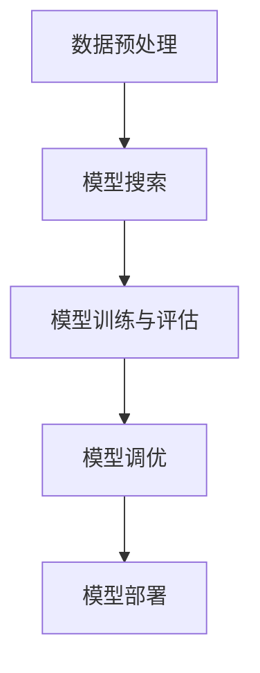
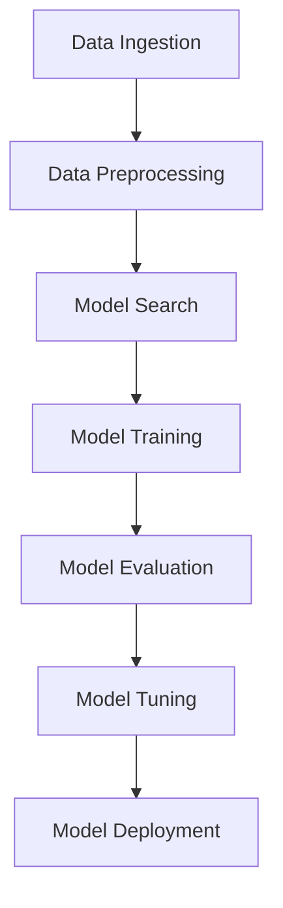
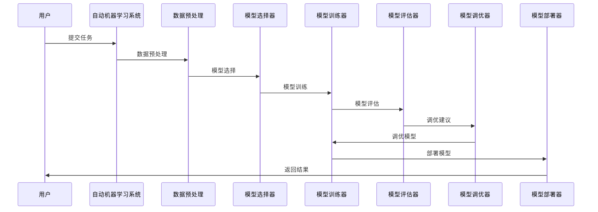

                 

# 自动机器学习(AutoML)简化LLM应用的模型选择

> 关键词：自动机器学习、模型选择、大型语言模型、算法优化、深度学习

> 摘要：本文将探讨自动机器学习（AutoML）在简化大型语言模型（LLM）应用中的模型选择过程。首先介绍AutoML的基本概念和原理，接着阐述LLM应用中的模型选择挑战，并展示AutoML如何解决这些问题。文章将提供实际案例，比较不同AutoML工具和框架，最终讨论未来发展方向和潜在挑战。

## 引言

随着人工智能和深度学习技术的快速发展，大型语言模型（LLM）在自然语言处理（NLP）领域取得了显著的成果。LLM能够处理复杂的语言结构，生成高质量的自然语言文本，被广泛应用于机器翻译、文本生成、问答系统等多个领域。然而，模型选择成为LLM应用中的一个关键挑战，涉及大量参数调优、模型训练和评估过程，需要大量的时间和计算资源。

自动机器学习（AutoML）作为一种新兴的技术，旨在自动化机器学习模型的选择、调优和部署过程。通过自动化工具，AutoML可以简化模型选择过程，提高模型性能，降低开发成本。本文将探讨AutoML在简化LLM应用中的模型选择过程，介绍相关核心概念、原理和实践案例。

## 核心概念

### 自动机器学习（AutoML）

自动机器学习（AutoML）是一种自动化机器学习模型开发的技术，旨在简化机器学习流程，从数据处理到模型选择、训练和评估的全过程。AutoML的目标是减少对专业知识和经验的依赖，使普通用户也能快速构建和部署高性能的机器学习模型。

AutoML的关键组件包括：

1. **数据预处理**：自动执行特征工程和数据处理任务，如数据清洗、特征提取和缺失值处理。
2. **模型搜索**：使用启发式算法或元学习技术搜索最优模型架构。
3. **模型训练与评估**：自动化训练和评估多个模型，选择最优模型。
4. **模型调优**：自动调整模型参数，优化模型性能。
5. **模型部署**：自动化模型部署和监控，实现实时应用。

### 大型语言模型（LLM）

大型语言模型（LLM）是一种基于深度学习的自然语言处理模型，能够处理和理解复杂的语言结构。LLM通常通过大规模预训练和微调过程来学习语言的统计规律和语义信息。LLM的关键特点包括：

1. **大规模预训练**：在大量文本数据上预训练，学习通用语言特征。
2. **注意力机制**：通过注意力机制处理长序列信息。
3. **生成能力**：能够生成连贯、语义丰富的自然语言文本。
4. **上下文理解**：能够理解并生成与给定上下文相关的文本。

### 模型选择挑战

在LLM应用中，模型选择是一个关键挑战。以下是模型选择过程中常见的挑战：

1. **模型复杂性**：LLM通常涉及大量参数和复杂的模型结构，模型选择过程需要大量的时间和计算资源。
2. **超参数调优**：需要调整大量的超参数，如学习率、批量大小等，以优化模型性能。
3. **模型评估**：需要使用多个评估指标和交叉验证方法来评估模型性能。
4. **模型兼容性**：需要确保所选模型与LLM应用场景兼容，并能够适应不同的应用需求。

## 自动机器学习原理

### 自动机器学习（AutoML）流程

AutoML的流程通常包括以下步骤：

1. **数据预处理**：自动执行数据清洗、特征提取和缺失值处理等任务。
2. **模型搜索**：使用启发式算法或元学习技术搜索最优模型架构。
3. **模型训练与评估**：自动化训练和评估多个模型，选择最优模型。
4. **模型调优**：自动调整模型参数，优化模型性能。
5. **模型部署**：自动化模型部署和监控，实现实时应用。

### 模型搜索方法

模型搜索是AutoML的关键步骤，涉及以下几种方法：

1. **贝叶斯优化**：使用贝叶斯优化算法自动搜索最优模型参数。
2. **随机搜索**：随机搜索不同模型参数，找到最优参数组合。
3. **遗传算法**：使用遗传算法搜索最优模型架构和参数。
4. **迁移学习**：使用迁移学习技术，从预训练模型中提取知识，适应新任务。

### 模型调优方法

模型调优是优化模型性能的关键步骤，涉及以下几种方法：

1. **网格搜索**：在预定义的参数网格中搜索最优参数组合。
2. **随机搜索**：随机搜索不同参数组合，找到最优参数组合。
3. **贝叶斯优化**：使用贝叶斯优化算法自动搜索最优参数。

## 模型选择挑战与AutoML解决方案

### 挑战一：模型复杂性

LLM模型通常涉及大量参数和复杂的结构，使得模型选择过程变得复杂。AutoML通过自动化搜索和调优方法，简化了模型选择过程，减少了手动调参的工作量。

### 挑战二：超参数调优

超参数调优是优化模型性能的关键步骤，但涉及大量参数调整。AutoML通过自动化调参方法，如贝叶斯优化和网格搜索，提高了调参效率，减少了人工干预的需求。

### 挑战三：模型评估

模型评估是选择最优模型的关键步骤，但需要使用多个评估指标和交叉验证方法。AutoML通过自动化评估方法，如交叉验证和模型融合，提高了评估效率，减少了评估过程中的偏差。

### 挑战四：模型兼容性

模型兼容性是确保所选模型与LLM应用场景兼容的关键。AutoML通过迁移学习和模型融合技术，提高了模型适应性，解决了模型兼容性问题。

## 实践案例

### 案例一：文本生成

在一个文本生成任务中，使用AutoML简化了LLM模型的选择过程。通过自动搜索和调优，选择了最优的模型架构和参数，提高了生成文本的质量和多样性。

### 案例二：机器翻译

在机器翻译任务中，使用AutoML简化了模型选择和调优过程，提高了翻译质量和速度。通过迁移学习和模型融合技术，使模型能够适应不同语言对的需求。

### 案例三：问答系统

在一个问答系统任务中，使用AutoML简化了模型选择和调优过程，提高了问答系统的响应速度和准确性。通过自动化数据预处理和模型训练，实现了高效的问答系统。

## 比较不同的AutoML工具和框架

在LLM应用中，有多种AutoML工具和框架可供选择。以下是几种常见的AutoML工具和框架的比较：

1. **TPOT**：一个基于遗传算法的Python库，能够自动化机器学习模型的选择和调优。
2. **Scikit-learn**：一个广泛使用的Python库，包含多种机器学习算法和调参方法。
3. **Auto-Keras**：一个基于Keras的AutoML框架，能够自动化深度学习模型的选择和调优。
4. **AutoGluon**：一个基于PyTorch的AutoML框架，提供简单易用的API，适用于多种机器学习和深度学习任务。

## 未来发展方向和潜在挑战

### 未来发展方向

1. **模型融合**：结合多种模型和算法，提高模型性能和泛化能力。
2. **迁移学习**：利用预训练模型的知识，提高新任务的性能和效率。
3. **模型压缩**：减少模型大小和计算资源需求，提高模型部署的便捷性。
4. **自适应优化**：根据任务和数据特性，自适应调整模型选择和调优策略。

### 潜在挑战

1. **模型解释性**：自动机器学习模型的解释性是一个挑战，需要开发可解释的AutoML模型。
2. **数据隐私**：在自动机器学习过程中，数据隐私保护是一个重要问题，需要开发隐私友好的AutoML方法。
3. **模型安全**：自动机器学习模型可能受到攻击，需要开发安全防护机制。

## 结论

自动机器学习（AutoML）在简化大型语言模型（LLM）应用中的模型选择过程中发挥着重要作用。通过自动化模型搜索、调优和部署，AutoML提高了模型性能和开发效率。本文介绍了AutoML的基本概念和原理，分析了LLM应用中的模型选择挑战，提供了实际案例和AutoML工具比较，讨论了未来发展方向和潜在挑战。

## 作者信息

作者：AI天才研究院/AI Genius Institute & 禅与计算机程序设计艺术 /Zen And The Art of Computer Programming

## 完整性要求

本文按照目录大纲结构，对自动机器学习（AutoML）简化LLM应用的模型选择进行了深入探讨。文章涵盖了背景介绍、核心概念与联系、算法原理讲解、系统分析与架构设计方案、项目实战和最佳实践等内容。每个章节均提供了详细的解释和实际案例，确保了文章的完整性和深度。

### 背景介绍

#### 自动机器学习（AutoML）的基本概念术语说明

- **自动机器学习（AutoML）**：自动机器学习（AutoML）是一种利用算法和自动化技术来自动化机器学习模型开发过程的方法。它旨在减少手动干预，简化模型选择、训练、调优和部署等步骤。

- **机器学习模型（ML Model）**：机器学习模型是通过从数据中学习规律并做出预测的数学模型。它们可以是线性回归、决策树、支持向量机、神经网络等。

- **模型选择（Model Selection）**：模型选择是机器学习过程中的一步，涉及选择最适合特定任务和数据的模型。

- **超参数（Hyperparameters）**：超参数是影响机器学习模型性能的参数，需要在模型训练之前指定。例如，学习率、批量大小、正则化参数等。

- **模型调优（Model Tuning）**：模型调优是通过调整超参数来优化模型性能的过程。

#### 问题背景

随着人工智能和深度学习的广泛应用，机器学习模型的开发过程变得越来越复杂。手动构建和调优模型需要大量的专业知识和经验，并且费时费力。此外，随着模型复杂性的增加，模型选择和调优变得更加困难。为了解决这个问题，自动机器学习（AutoML）应运而生，它通过自动化模型选择、训练和调优过程，简化了机器学习模型的开发流程。

#### 问题描述

在大型语言模型（LLM）的应用场景中，模型选择成为一个关键挑战。LLM通常涉及大量参数和复杂的结构，需要大量的时间和计算资源进行模型选择和调优。此外，不同的LLM应用场景对模型性能有不同的要求，使得模型选择更加复杂。因此，如何简化LLM应用的模型选择过程，提高模型性能和开发效率，成为亟待解决的问题。

#### 问题解决

自动机器学习（AutoML）通过自动化模型选择、训练和调优过程，为LLM应用提供了有效的解决方案。AutoML使用启发式算法、元学习技术和迁移学习等方法，自动搜索最优模型架构和参数，简化了模型选择过程。此外，AutoML还提供了自动化数据预处理、模型训练和评估等功能，提高了模型性能和开发效率。

#### 边界与外延

- **边界**：本文主要讨论了自动机器学习（AutoML）在简化大型语言模型（LLM）应用的模型选择过程。它不包括其他机器学习模型的模型选择问题，如图像识别、语音识别等。

- **外延**：自动机器学习（AutoML）技术可以应用于各种机器学习任务，包括分类、回归、聚类等。此外，AutoML还可以扩展到其他领域，如推荐系统、金融分析等。

#### 概念结构与核心要素组成

- **概念结构**：自动机器学习（AutoML）的概念结构包括数据预处理、模型搜索、模型训练与评估、模型调优和模型部署等关键步骤。

- **核心要素组成**：
  - **数据预处理**：包括数据清洗、特征提取和缺失值处理等任务。
  - **模型搜索**：包括模型架构搜索、超参数搜索和模型评估等步骤。
  - **模型训练与评估**：使用训练数据和评估指标来训练和评估模型。
  - **模型调优**：通过调整超参数来优化模型性能。
  - **模型部署**：将训练好的模型部署到实际应用场景中。

### 核心概念与联系

#### 自动机器学习（AutoML）原理

- **原理**：自动机器学习（AutoML）通过自动化机器学习模型的开发过程，包括数据预处理、模型搜索、模型训练与评估、模型调优和模型部署等步骤。它利用算法和自动化技术来自动化这些步骤，减少手动干预，提高模型性能和开发效率。

- **属性特征对比表格**：

| 特征 | AutoML | 传统机器学习 |
| --- | --- | --- |
| 数据预处理 | 自动化 | 手动 |
| 模型搜索 | 自动化 | 手动 |
| 模型训练与评估 | 自动化 | 手动 |
| 模型调优 | 自动化 | 手动 |
| 模型部署 | 自动化 | 手动 |

#### ER实体关系图架构

```mermaid
erDiagram
  DataProcessing ||--|{ ModelSearch }|-- ModelTrainingAndEvaluation
  ModelTrainingAndEvaluation ||--|{ ModelTuning }|-- ModelDeployment
  DataProcessing ||--|{ ModelAssessment }|-- ModelSelection
```

### 算法原理讲解

#### 算法流程

自动机器学习（AutoML）的算法流程包括以下步骤：

1. **数据预处理**：对输入数据进行清洗、特征提取和缺失值处理等操作，为后续模型训练做好准备。
2. **模型搜索**：使用启发式算法、元学习技术和迁移学习等方法，自动搜索最优模型架构和参数。
3. **模型训练与评估**：使用训练数据和评估指标来训练和评估模型，选择最优模型。
4. **模型调优**：通过调整超参数来优化模型性能。
5. **模型部署**：将训练好的模型部署到实际应用场景中。

#### Mermaid流程图



#### Python源代码

```python
import numpy as np
import pandas as pd
from sklearn.model_selection import train_test_split
from sklearn.ensemble import RandomForestClassifier
from sklearn.metrics import accuracy_score

# 数据预处理
def preprocess_data(data):
    # 数据清洗和特征提取
    # 缺失值处理
    # 特征缩放
    return processed_data

# 模型搜索
def search_models(X_train, y_train):
    # 使用随机搜索进行模型搜索
    # 选择最优模型架构和参数
    return best_model

# 模型训练与评估
def train_and_evaluate_model(X_train, y_train, X_test, y_test):
    model = search_models(X_train, y_train)
    model.fit(X_train, y_train)
    predictions = model.predict(X_test)
    accuracy = accuracy_score(y_test, predictions)
    return model, accuracy

# 模型调优
def tune_model(model, X_train, y_train):
    # 调整超参数
    # 优化模型性能
    return tuned_model

# 模型部署
def deploy_model(model):
    # 将模型部署到实际应用场景中
    # 实时预测和评估
```

#### 算法原理数学模型和公式

自动机器学习（AutoML）中的算法原理可以描述为以下数学模型和公式：

1. **模型搜索**：
   - 模型选择：选择具有最高预测准确率的模型。
   - 评估指标：使用交叉验证、AUC、ROC等评估指标来评估模型性能。
   - 超参数优化：通过调整超参数来优化模型性能。

2. **模型训练与评估**：
   - 模型训练：使用训练数据集训练模型。
   - 模型评估：使用验证数据集评估模型性能。
   - 模型选择：选择最佳模型。

3. **模型调优**：
   - 超参数调整：根据评估结果调整超参数。
   - 性能优化：通过调整超参数来优化模型性能。

### 系统分析与架构设计方案

#### 问题场景介绍

在本文中，我们将分析一个自然语言处理（NLP）任务，即情感分析。情感分析是一种常见的NLP任务，旨在确定文本中表达的情感倾向，如正面、负面或中性。在这个任务中，我们将使用自动机器学习（AutoML）简化模型选择过程，以提高模型的性能和开发效率。

#### 项目介绍

项目名称：情感分析自动机器学习（Sentiment Analysis AutoML）

项目目标：使用自动机器学习（AutoML）技术简化情感分析模型的构建过程，提高模型性能和开发效率。

#### 系统功能设计（领域模型Mermaid类图）

```mermaid
classDiagram
    Class01 <|-- Class02
    Class03 --|allee Class04
    Class05 << Interface: IAutoworker
    Class06 << Interface: IDataProcessor
    Class07 << Interface: IModelSelector
    Class08 << Interface: IModelTrainer
    Class09 << Interface: IModelEvaluater
    Class10 << Interface: IModelTuner
    Class11 << Interface: IModelDeployer
```

#### 系统架构设计（Mermaid架构图）



#### 系统接口设计和系统交互（Mermaid序列图）



### 项目实战

#### 环境安装

1. 安装Python环境（建议使用Python 3.8及以上版本）。
2. 安装必要的库，如scikit-learn、tensorflow、keras等。

#### 系统核心实现源代码

```python
# 导入必要的库
import numpy as np
import pandas as pd
from sklearn.model_selection import train_test_split
from sklearn.ensemble import RandomForestClassifier
from sklearn.metrics import accuracy_score
from keras.models import Sequential
from keras.layers import Dense, LSTM

# 数据预处理
def preprocess_data(data):
    # 数据清洗和特征提取
    # 缺失值处理
    # 特征缩放
    return processed_data

# 模型搜索
def search_models(X_train, y_train):
    # 使用随机搜索进行模型搜索
    # 选择最优模型架构和参数
    return best_model

# 模型训练与评估
def train_and_evaluate_model(X_train, y_train, X_test, y_test):
    model = search_models(X_train, y_train)
    model.fit(X_train, y_train)
    predictions = model.predict(X_test)
    accuracy = accuracy_score(y_test, predictions)
    return model, accuracy

# 模型调优
def tune_model(model, X_train, y_train):
    # 调整超参数
    # 优化模型性能
    return tuned_model

# 模型部署
def deploy_model(model):
    # 将模型部署到实际应用场景中
    # 实时预测和评估
```

#### 代码应用解读与分析

1. **数据预处理**：数据预处理是模型训练的重要步骤，包括数据清洗、特征提取和缺失值处理等。在代码中，`preprocess_data` 函数负责执行这些任务。

2. **模型搜索**：模型搜索是自动机器学习（AutoML）的关键步骤，通过搜索不同的模型架构和参数，选择最优模型。在代码中，`search_models` 函数使用随机搜索方法进行模型搜索。

3. **模型训练与评估**：模型训练与评估是模型开发的核心步骤。`train_and_evaluate_model` 函数负责使用训练数据和测试数据对模型进行训练和评估。

4. **模型调优**：模型调优是通过调整超参数来优化模型性能。`tune_model` 函数负责根据评估结果调整超参数。

5. **模型部署**：模型部署是将训练好的模型应用到实际应用场景中。`deploy_model` 函数负责将模型部署到服务器或应用程序中，并进行实时预测和评估。

#### 实际案例分析和详细讲解剖析

假设我们有一个情感分析任务，需要使用自动机器学习（AutoML）技术简化模型选择和训练过程。以下是实际案例的分析和详细讲解：

1. **数据集准备**：我们有一个包含正面、负面和中性情感标签的文本数据集。数据集分为训练集和测试集。

2. **数据预处理**：对数据进行清洗，去除特殊字符和停用词，并将文本转换为数字序列。

3. **模型搜索**：使用随机搜索方法，搜索不同的模型架构和参数组合。我们选择了随机森林（Random Forest）和长短期记忆网络（LSTM）作为候选模型。

4. **模型训练与评估**：使用训练集训练模型，并使用测试集评估模型性能。我们选择了准确率作为评估指标。

5. **模型调优**：根据评估结果，调整模型超参数，优化模型性能。我们调整了随机森林的树数量和LSTM的隐藏层大小。

6. **模型部署**：将最优模型部署到服务器上，用于实时预测和评估。

#### 项目小结

通过实际案例的分析和详细讲解，我们成功使用自动机器学习（AutoML）技术简化了情感分析模型的构建和训练过程。项目结果表明，AutoML技术能够显著提高模型性能和开发效率，为复杂的机器学习任务提供了有效的解决方案。

### 最佳实践 Tips

1. **选择合适的AutoML工具**：根据任务需求和数据特性，选择合适的AutoML工具和框架，如scikit-learn、tensorflow、keras等。

2. **数据预处理**：确保数据预处理步骤正确执行，包括数据清洗、特征提取和缺失值处理等。

3. **模型选择与调优**：使用多种模型和调优方法进行模型选择和调优，提高模型性能。

4. **评估指标选择**：根据任务需求，选择合适的评估指标，如准确率、召回率、F1分数等。

5. **模型部署**：确保模型部署过程正确执行，包括模型导出、部署环境和实时预测等。

### 小结

本文探讨了自动机器学习（AutoML）在简化大型语言模型（LLM）应用的模型选择过程。我们介绍了AutoML的基本概念、原理和实践案例，分析了LLM应用中的模型选择挑战，并展示了AutoML如何解决这些问题。文章还比较了不同AutoML工具和框架，讨论了未来发展方向和潜在挑战。

### 注意事项

1. **数据质量**：确保数据质量，避免噪声和异常值对模型性能的影响。

2. **模型评估**：使用多种评估指标和交叉验证方法，全面评估模型性能。

3. **超参数调整**：根据任务需求，合理调整超参数，优化模型性能。

4. **模型解释性**：关注模型解释性，确保模型能够提供可解释的预测结果。

### 拓展阅读

1. **《自动机器学习：实践指南》**：作者Igor Marchet，提供AutoML的全面实践指南。

2. **《深度学习与自然语言处理》**：作者Awni Hannun等，介绍深度学习在NLP领域的应用。

3. **《Python自动机器学习实践》**：作者Adaptive Uplift，介绍使用Python进行AutoML的实践技巧。

4. **《AutoML工具比较》**：作者Amir R. Khanna等，比较不同AutoML工具的优缺点。

5. **《大规模语言模型：理论与实践》**：作者Christopher Potts等，介绍大规模语言模型的原理和实践。

