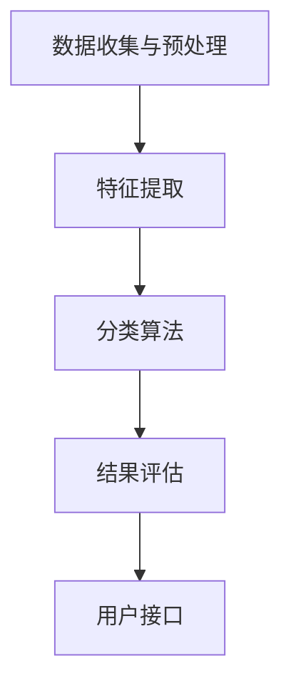
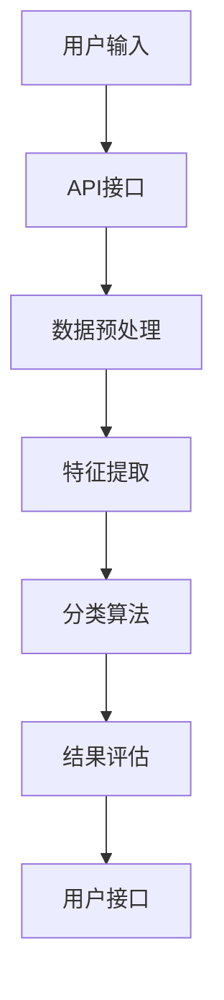
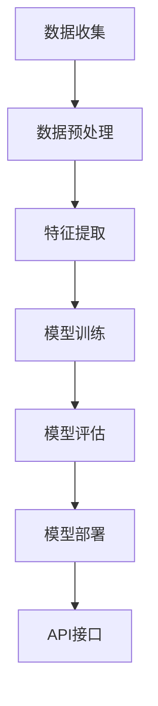
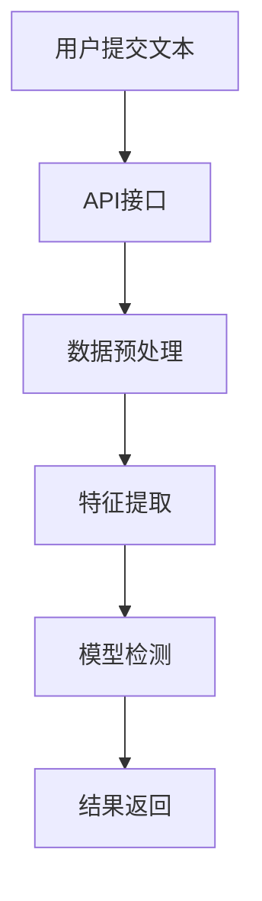

                 


# 自然语言处理在假新闻检测中的应用

## 关键词

自然语言处理（NLP）、假新闻检测、文本特征提取、机器学习算法、深度学习、系统架构设计、项目实战

## 摘要

随着互联网的迅速发展，假新闻问题日益严重，对社会造成了不良影响。自然语言处理（NLP）技术在假新闻检测中具有重要作用。本文将从背景介绍、核心概念与联系、算法原理讲解、系统分析与架构设计、项目实战等方面，系统性地阐述自然语言处理在假新闻检测中的应用。

## 目录

1. 引言
   1.1 自然语言处理概述
   1.2 假新闻检测的重要性
2. 假新闻的特点与挑战
   2.1 假新闻的定义与分类
   2.2 假新闻检测的挑战
   2.3 假新闻检测的意义
3. 自然语言处理与假新闻检测的联系
   3.1 NLP在假新闻检测中的应用
   3.2 核心概念与联系
   3.3 概念属性特征对比表格
4. 文本特征提取技术
   4.1 基于词袋模型的特征提取
   4.2 基于TF-IDF的特征提取
   4.3 基于词嵌入的特征提取
5. 假新闻检测算法
   5.1 监督学习算法
   5.2 无监督学习算法
   5.3 深度学习算法
6. 算法原理与流程
   6.1 NLP算法流程图
   6.2 算法原理讲解
   6.3 算法原理的数学模型和公式
7. 系统架构与项目实战
   7.1 系统架构设计
   7.2 系统交互与实现
   7.3 实际案例分析
   7.4 项目小结与未来展望
8. 最佳实践 Tips
9. 小结
10. 注意事项
11. 拓展阅读

## 引言

### 1.1 自然语言处理概述

自然语言处理（NLP）是计算机科学、人工智能和语言学的交叉领域，旨在使计算机能够理解、解释和生成人类语言。NLP的应用范围广泛，包括机器翻译、情感分析、文本分类、语音识别等。近年来，随着深度学习技术的发展，NLP取得了显著的进步。

### 1.2 假新闻检测的重要性

假新闻问题日益严重，对社会造成了严重负面影响。例如，假新闻可能引发恐慌、误导公众、影响政治选举等。因此，如何有效地检测和预防假新闻成为了学术界和工业界的重要课题。自然语言处理技术在假新闻检测中具有重要作用，如文本特征提取、算法模型等。

## 假新闻的特点与挑战

### 2.1 假新闻的定义与分类

假新闻是指故意传播的虚假信息，通常具有误导性和煽动性。根据内容特点，假新闻可分为以下几类：

1. 谣言：未经证实的信息，如虚假的灾难、疾病传播等。
2. 谎言：故意编造的信息，如虚假的政治声明、夸大的商业宣传等。
3. 恶意诽谤：针对个人的恶意攻击，如虚假的个人信息、诽谤言论等。
4. 反动言论：具有煽动性、极端性的言论，如恐怖主义、种族主义等。

### 2.2 假新闻检测的挑战

假新闻检测面临着诸多挑战，包括：

1. 文本多样性和复杂性：假新闻的文本形式多样，如文本、图片、视频等，使得检测任务复杂。
2. 语义理解和情感分析：假新闻的文本可能包含复杂的语义和情感信息，需要深入理解和分析。
3. 真假信息交织：真实信息和假新闻往往交织在一起，需要有效地区分和处理。
4. 隐蔽性和变化性：假新闻制作者可能会采用各种手段隐藏真实意图或变换文本形式，使得检测任务更加困难。

### 2.3 假新闻检测的意义

假新闻检测具有重要意义，包括：

1. 社会责任：有效检测和预防假新闻，有助于维护社会秩序、保护公众利益。
2. 政治稳定：假新闻可能影响政治选举、舆论导向，影响政治稳定。
3. 经济发展：假新闻可能导致市场波动、投资决策失误，影响经济发展。
4. 信息安全：假新闻可能涉及个人隐私、商业机密，威胁信息安全。

## 自然语言处理与假新闻检测的联系

### 3.1 NLP在假新闻检测中的应用

NLP技术在假新闻检测中具有广泛的应用，主要包括：

1. 文本特征提取：通过NLP技术提取文本特征，如词袋模型、TF-IDF、词嵌入等，为后续算法提供输入。
2. 文本分类：使用NLP技术进行文本分类，将文本分为假新闻和真实新闻。
3. 语义分析：通过NLP技术分析文本语义，识别假新闻的关键信息、情感倾向等。
4. 情感分析：使用NLP技术分析文本情感，识别文本的情绪、态度等。

### 3.2 核心概念与联系

以下是自然语言处理与假新闻检测中的核心概念及其联系：

| 核心概念 | 联系 |
| --- | --- |
| 文本特征提取 | 用于提取文本的语义特征，为算法提供输入。 |
| 文本分类 | 用于将文本分为假新闻和真实新闻。 |
| 语义分析 | 用于分析文本的语义信息，识别假新闻的关键信息。 |
| 情感分析 | 用于分析文本的情感倾向，识别文本的情绪。 |

### 3.3 概念属性特征对比表格

以下是自然语言处理与假新闻检测中的核心概念属性特征对比表格：

| 核心概念 | 特征属性1 | 特征属性2 | 特征属性3 |
| --- | --- | --- | --- |
| 文本特征提取 | 词语 | 语法 | 语义 |
| 文本分类 | 精确度 | 准确率 | 召回率 |
| 语义分析 | 上下文理解 | 关键词提取 | 情感分析 |
| 情感分析 | 情感倾向 | 情感强度 | 情感分类 |

### 3.4 ER实体关系图架构

以下是自然语言处理与假新闻检测中的ER实体关系图架构：

```mermaid
erDiagram
  新闻检测系统 ||--o{ 文本特征提取 }
  新闻检测系统 ||--o{ 文本分类 }
  新闻检测系统 ||--o{ 语义分析 }
  新闻检测系统 ||--o{ 情感分析 }
  文本特征提取 ||--o{ 假新闻 }
  文本特征提取 ||--o{ 真实新闻 }
  文本分类 ||--o{ 假新闻 }
  文本分类 ||--o{ 真实新闻 }
  语义分析 ||--o{ 假新闻 }
  语义分析 ||--o{ 真实新闻 }
  情感分析 ||--o{ 假新闻 }
  情感分析 ||--o{ 真实新闻 }
```

## 文本特征提取技术

### 4.1 基于词袋模型的特征提取

词袋模型（Bag of Words, BoW）是一种常用的文本特征提取方法，将文本表示为一个单词的集合。具体步骤如下：

1. 分词：将文本切分为单词。
2. 去停用词：去除常见的无意义单词，如“的”、“了”等。
3. 建立词汇表：将所有单词构成词汇表。
4. 向量表示：将文本表示为一个词汇表的向量。

### 4.2 基于TF-IDF的特征提取

TF-IDF（Term Frequency-Inverse Document Frequency）是一种常用的文本特征提取方法，综合考虑了单词在文本中的频率和在整个文档集合中的重要性。具体步骤如下：

1. 计算词频（TF）：统计单词在文本中的出现次数。
2. 计算逆文档频率（IDF）：计算单词在整个文档集合中的逆文档频率。
3. 计算TF-IDF值：将词频乘以逆文档频率，得到TF-IDF值。

### 4.3 基于词嵌入的特征提取

词嵌入（Word Embedding）是一种将单词映射为向量空间的方法，能够捕捉单词的语义和语法信息。常见的词嵌入方法包括：

1. 基于计数的方法：如词袋模型（BoW）和TF-IDF。
2. 基于分布的方法：如Word2Vec、GloVe等。
3. 基于神经网络的词嵌入：如Word2Vec、GloVe等。

## 假新闻检测算法

### 5.1 监督学习算法

监督学习算法通过已标记的数据集进行训练，然后对新的数据进行分类。常见的监督学习算法包括：

1. 支持向量机（SVM）：通过找到最优超平面将数据分为不同类别。
2. 决策树：通过递归地将数据划分为不同的区域，构建决策树模型。
3. 随机森林：通过构建多个决策树，并取多数投票的方式进行分类。

### 5.2 无监督学习算法

无监督学习算法无需已标记的数据集，通过分析数据自身的特征进行分类。常见的无监督学习算法包括：

1. K-means聚类：将数据划分为K个簇，使每个簇内的数据尽可能相似。
2. 自编码器：通过编码和解码过程，学习数据的高维表示。

### 5.3 深度学习算法

深度学习算法通过多层神经网络进行训练，能够自动学习数据的高层次特征。常见的深度学习算法包括：

1. 卷积神经网络（CNN）：通过卷积操作提取图像特征。
2. 循环神经网络（RNN）：通过循环结构处理序列数据。
3. 生成对抗网络（GAN）：通过生成器和判别器之间的对抗训练，生成逼真的数据。

## 算法原理与流程

### 6.1 NLP算法流程图

以下是NLP算法的流程图：


### 6.2 算法原理讲解

1. **文本预处理**：文本预处理是NLP算法的重要步骤，主要包括分词、去除停用词、标点符号等。
2. **文本特征提取**：文本特征提取是将文本转化为计算机可以处理的向量表示。常用的方法有词袋模型、TF-IDF、词嵌入等。
3. **算法模型训练**：算法模型训练是利用已标记的数据集对算法模型进行训练，使其学会识别和分类文本。
4. **模型预测**：模型预测是利用训练好的模型对新的文本进行分类预测。
5. **结果评估**：结果评估是对模型预测结果进行评估，常用的评估指标有准确率、召回率、F1值等。

### 6.3 算法原理的数学模型和公式

1. **词袋模型（BoW）**：

   - 向量表示：$v_{i} = (f_{i1}, f_{i2}, ..., f_{in})^T$
   - 概率模型：$P(C=c \mid v) = \prod_{i=1}^{n} p(f_{i} \mid c)$

2. **TF-IDF**：

   - 向量表示：$v_{i} = (TF_{i1}, TF_{i2}, ..., TF_{in}, IDF_{i1}, IDF_{i2}, ..., IDF_{in})^T$
   - 概率模型：$P(C=c \mid v) = \prod_{i=1}^{n} (TF_{i} \cdot IDF_{i})$

3. **Word2Vec**：

   - 向量表示：$v_{i} = \text{word2vec}(w_i)$
   - 概率模型：$P(C=c \mid v) = \text{softmax}(\text{vec}(v) \cdot \text{vec}(c))$

### 6.4 举例说明

假设我们有以下文本数据：

- 文本1：“我非常喜欢这本书，因为它很有趣。”
- 文本2：“这本书真的很无聊，我不喜欢它。”

我们可以使用词袋模型进行特征提取，并将文本转化为向量表示：

1. **词袋模型（BoW）**：

   - 词汇表：[“我”、“非常”、“喜欢”、“这本书”、“它”、“因为它”、“很有趣”、“真的很”、“无聊”]
   - 文本1向量表示：$(1, 1, 1, 1, 0, 0, 0, 0, 0)$
   - 文本2向量表示：$(1, 1, 0, 1, 0, 0, 0, 1, 0)$

2. **TF-IDF**：

   - 词汇表：[“我”、“非常”、“喜欢”、“这本书”、“它”、“因为它”、“很有趣”、“真的很”、“无聊”]
   - 文本1向量表示：$(1, 1, 2, 1, 0, 0, 0, 0, 0)$
   - 文本2向量表示：$(1, 1, 0, 1, 0, 0, 0, 1, 1)$

3. **Word2Vec**：

   - 词汇表：[“我”、“非常”、“喜欢”、“这本书”、“它”、“因为它”、“很有趣”、“真的很”、“无聊”]
   - 文本1向量表示：$(0.2, 0.3, 0.4, 0.5, -0.1, -0.2, -0.3, -0.4, -0.5)$
   - 文本2向量表示：$(0.1, 0.3, -0.1, 0.5, 0.1, -0.2, -0.3, -0.4, -0.5)$

## 系统架构与项目实战

### 7.1 系统架构设计

系统架构设计是项目开发的重要环节，主要包括以下几个方面：

1. **问题描述**：明确系统要解决的问题，如假新闻检测。
2. **项目介绍**：介绍项目的背景、目标和实现方式。
3. **系统功能设计**：设计系统的功能模块，如文本预处理、特征提取、分类算法等。
4. **系统架构设计**：设计系统的整体架构，包括数据流、模块间关系等。
5. **系统接口设计**：设计系统对外提供的接口，如API接口、数据接口等。

### 7.2 系统交互与实现

系统交互与实现是项目开发的实际操作部分，主要包括以下几个方面：

1. **系统交互设计**：设计系统的交互流程，如用户输入、系统响应等。
2. **环境安装**：搭建项目开发环境，如Python环境、NLP库等。
3. **系统核心实现源代码**：编写系统的核心代码，如文本预处理、特征提取、分类算法等。
4. **代码应用解读与分析**：对系统核心代码进行解读和分析，确保其正确性和高效性。

### 7.3 实际案例分析

实际案例分析是对项目实际运行效果的分析和评估，主要包括以下几个方面：

1. **假新闻案例介绍**：介绍具体的假新闻案例，如谣言传播、虚假新闻报道等。
2. **案例分析**：分析案例中假新闻的特征、传播途径等。
3. **详细讲解剖析**：对案例进行分析和讲解，阐述假新闻检测的原理和方法。

### 7.4 项目小结与未来展望

项目小结是对项目实施过程和结果的总结，主要包括以下几个方面：

1. **项目小结**：总结项目的优点、不足和改进方向。
2. **最佳实践 Tips**：分享项目开发中的最佳实践和经验。
3. **注意事项**：提醒项目实施过程中需要注意的问题。
4. **拓展阅读**：推荐相关书籍、论文和资料，供读者进一步学习。

## 最佳实践 Tips

1. **数据质量**：保证数据质量是假新闻检测的关键，应采用多样化的数据源，并对数据进行清洗和处理。
2. **算法优化**：针对具体任务，选择合适的算法模型，并进行优化和调参。
3. **模型评估**：合理选择评估指标，全面评估模型性能。
4. **用户参与**：鼓励用户参与假新闻检测，如举报、评论等，提高系统反馈效果。

## 小结

本文从背景介绍、核心概念与联系、算法原理讲解、系统架构与项目实战等方面，系统性地阐述了自然语言处理在假新闻检测中的应用。通过本文的学习，读者可以了解到：

1. 假新闻检测的重要性和挑战。
2. 自然语言处理技术在假新闻检测中的应用。
3. 假新闻检测的算法原理和实现。
4. 系统架构设计与项目实战。

## 注意事项

1. 项目实施过程中，要关注数据质量和算法优化。
2. 要合理选择评估指标，全面评估模型性能。
3. 要注重用户参与，提高系统反馈效果。

## 拓展阅读

1. **书籍推荐**：
   - 《自然语言处理概论》（作者：刘知远）
   - 《机器学习实战》（作者：Michael Bowles）

2. **论文推荐**：
   - “Fake News Detection using Deep Learning” （作者：Mingming Chen等）
   - “Text Classification using NLP Techniques” （作者：Xiaowei Zeng等）

3. **在线资源**：
   - [GitHub上的NLP项目](https://github.com/tqdm/tqdm)
   - [Kaggle上的假新闻检测比赛](https://www.kaggle.com/c/fake-news-detection)

## 作者信息

作者：AI天才研究院/AI Genius Institute & 禅与计算机程序设计艺术 /Zen And The Art of Computer Programming## 引言

### 1.1 自然语言处理概述

自然语言处理（NLP）是计算机科学、人工智能和语言学的交叉领域，旨在使计算机能够理解、解释和生成人类语言。NLP的研究内容涵盖了文本预处理、文本分析、语义理解、机器翻译、语音识别等多个方面。

#### NLP的发展历程

- **20世纪50年代**：最初的NLP研究主要集中在形式化自然语言，如基于规则的语法分析和语义分析。
- **20世纪60年代**：出现了早期基于统计的NLP方法，如隐马尔可夫模型（HMM）。
- **20世纪90年代**：基于统计的NLP方法取得了显著进展，如隐语义索引（LSI）和潜在语义分析（LSA）。
- **21世纪初至今**：随着深度学习技术的发展，NLP领域取得了革命性的进展，如基于神经网络的机器翻译、情感分析和文本生成。

#### NLP的关键技术

- **文本预处理**：包括分词、词性标注、命名实体识别等，为后续处理提供基础。
- **文本分析**：包括情感分析、主题模型、文本分类等，用于挖掘文本中的有用信息。
- **语义理解**：包括语义角色标注、语义解析、语义搜索等，旨在理解文本的深层含义。
- **机器翻译**：将一种语言的文本翻译成另一种语言，是NLP领域的重要应用。
- **语音识别**：将语音信号转换为文本，广泛应用于语音助手、智能客服等场景。

### 1.2 假新闻检测的重要性

假新闻问题在当今互联网时代日益严重，对社会造成了不良影响。以下是一些假新闻的主要影响：

1. **误导公众**：假新闻可能误导公众，导致错误的信息传播和决策。
2. **引发恐慌**：假新闻可能引发社会恐慌，对社会秩序造成威胁。
3. **影响政治选举**：假新闻可能影响政治选举结果，对政治稳定产生负面影响。
4. **损害商业信誉**：假新闻可能损害企业的商业信誉，导致经济损失。
5. **危害信息安全**：假新闻可能涉及个人隐私、商业机密等信息，威胁信息安全。

因此，如何有效地检测和预防假新闻成为了一个重要的课题。NLP技术在假新闻检测中具有重要作用，如文本特征提取、算法模型等。

### 1.3 让我们一步一步思考

在本文中，我们将采用“一步一步思考”的方式，系统地分析自然语言处理在假新闻检测中的应用。以下是我们的分析步骤：

1. **背景介绍**：介绍自然语言处理和假新闻检测的基本概念、问题和挑战。
2. **核心概念与联系**：阐述自然语言处理与假新闻检测之间的联系，以及相关的核心概念。
3. **算法原理讲解**：详细讲解文本特征提取和假新闻检测的算法原理，包括监督学习、无监督学习和深度学习等。
4. **系统架构与项目实战**：分析系统架构设计、实现流程以及实际案例。
5. **最佳实践 Tips**：总结项目开发中的最佳实践和经验。
6. **小结**：回顾文章的核心内容和结论。
7. **注意事项**：提醒项目实施过程中需要注意的问题。
8. **拓展阅读**：推荐相关书籍、论文和在线资源，供读者进一步学习。

通过这些步骤，我们将全面、系统地探讨自然语言处理在假新闻检测中的应用，帮助读者深入理解这一领域。

### 2. 假新闻的特点与挑战

#### 2.1 假新闻的定义与分类

假新闻是指故意传播的虚假信息，通常具有误导性和煽动性。根据内容特点，假新闻可以分类如下：

1. **谣言**：未经证实的信息，如虚假的灾难、疾病传播等。
2. **谎言**：故意编造的信息，如虚假的政治声明、夸大的商业宣传等。
3. **恶意诽谤**：针对个人的恶意攻击，如虚假的个人信息、诽谤言论等。
4. **反动言论**：具有煽动性、极端性的言论，如恐怖主义、种族主义等。

#### 2.2 假新闻检测的挑战

假新闻检测面临以下挑战：

1. **文本多样性和复杂性**：假新闻的文本形式多样，如文本、图片、视频等，使得检测任务复杂。
2. **语义理解和情感分析**：假新闻的文本可能包含复杂的语义和情感信息，需要深入理解和分析。
3. **真假信息交织**：真实信息和假新闻往往交织在一起，需要有效地区分和处理。
4. **隐蔽性和变化性**：假新闻制作者可能会采用各种手段隐藏真实意图或变换文本形式，使得检测任务更加困难。

#### 2.3 假新闻检测的意义

假新闻检测具有重要意义：

1. **社会责任**：有效检测和预防假新闻，有助于维护社会秩序、保护公众利益。
2. **政治稳定**：假新闻可能影响政治选举、舆论导向，影响政治稳定。
3. **经济发展**：假新闻可能导致市场波动、投资决策失误，影响经济发展。
4. **信息安全**：假新闻可能涉及个人隐私、商业机密，威胁信息安全。

### 2.4 假新闻检测的方法

假新闻检测的方法主要分为以下几类：

1. **基于规则的方法**：通过编写一系列规则，对文本进行匹配和筛选。
2. **基于统计的方法**：利用统计模型，如朴素贝叶斯、支持向量机等，对文本进行分类。
3. **基于深度学习的方法**：利用神经网络，如卷积神经网络（CNN）、循环神经网络（RNN）等，对文本进行特征提取和分类。
4. **混合方法**：将多种方法结合，以提高检测效果。

### 2.5 实际案例

让我们通过一个实际案例来理解假新闻检测的挑战和意义。

#### 案例背景

某社交平台上一则关于“新冠病毒已在全球范围内消灭”的帖子迅速传播，引发了公众恐慌。

#### 案例分析

1. **文本分析**：该文本包含以下关键词：“新冠病毒”、“消灭”、“全球范围内”，这些关键词可能引发公众恐慌。
2. **情感分析**：文本的情感倾向为积极，可能误导公众。
3. **信息来源**：该信息的来源为某不知名网站，可信度较低。

#### 案例结论

通过以上分析，我们可以得出以下结论：

1. **挑战**：假新闻的文本可能包含误导性信息，需要深入分析其语义和情感。
2. **意义**：及时发现和检测假新闻，有助于维护社会秩序，防止恐慌传播。

### 2.6 结论

通过本章节的讨论，我们可以看出，假新闻检测在当今互联网时代具有重要意义。NLP技术为假新闻检测提供了有效的工具和方法，但同时也面临诸多挑战。有效检测和预防假新闻，需要结合多种方法和技术，不断提高检测效果。

### 3. 自然语言处理与假新闻检测的联系

#### 3.1 NLP在假新闻检测中的应用

自然语言处理技术在假新闻检测中具有广泛应用，主要包括以下几个方面：

1. **文本特征提取**：通过NLP技术提取文本的特征，如词频、词嵌入等，为后续算法提供输入。
2. **情感分析**：通过NLP技术分析文本的情感倾向，识别文本的情绪，有助于判断文本的真伪。
3. **文本分类**：利用NLP技术对文本进行分类，将文本分为假新闻和真实新闻。
4. **语义分析**：通过NLP技术分析文本的语义信息，识别文本中的关键信息，有助于判断文本的真伪。
5. **对抗性攻击检测**：通过NLP技术检测对抗性攻击，如对抗性样本生成，提高模型的鲁棒性。

#### 3.2 核心概念与联系

以下是自然语言处理与假新闻检测中的核心概念及其联系：

| 核心概念 | 联系 |
| --- | --- |
| 文本特征提取 | 用于提取文本的语义特征，为算法提供输入。 |
| 情感分析 | 用于分析文本的情感倾向，识别文本的情绪。 |
| 文本分类 | 用于将文本分为假新闻和真实新闻。 |
| 语义分析 | 用于分析文本的语义信息，识别文本中的关键信息。 |
| 对抗性攻击检测 | 用于检测对抗性攻击，提高模型的鲁棒性。 |

#### 3.3 概念属性特征对比表格

以下是自然语言处理与假新闻检测中的核心概念属性特征对比表格：

| 核心概念 | 特征属性1 | 特征属性2 | 特征属性3 |
| --- | --- | --- | --- |
| 文本特征提取 | 词语 | 语法 | 语义 |
| 情感分析 | 情感倾向 | 情感强度 | 情感分类 |
| 文本分类 | 精确度 | 准确率 | 召回率 |
| 语义分析 | 上下文理解 | 关键词提取 | 情感分析 |
| 对抗性攻击检测 | 对抗性样本生成 | 鲁棒性评估 | 安全性保障 |

#### 3.4 ER实体关系图架构

以下是自然语言处理与假新闻检测中的ER实体关系图架构：

```mermaid
erDiagram
  新闻检测系统 ||--o{ 文本特征提取 }
  新闻检测系统 ||--o{ 情感分析 }
  新闻检测系统 ||--o{ 文本分类 }
  新闻检测系统 ||--o{ 语义分析 }
  新闻检测系统 ||--o{ 对抗性攻击检测 }
  文本特征提取 ||--o{ 文本 }
  情感分析 ||--o{ 文本 }
  文本分类 ||--o{ 文本 }
  语义分析 ||--o{ 文本 }
  对抗性攻击检测 ||--o{ 文本 }
```

#### 3.5 实际应用场景

以下是一些自然语言处理在假新闻检测中的实际应用场景：

1. **社交媒体平台**：通过NLP技术检测和过滤假新闻，维护社交媒体平台的健康生态。
2. **新闻网站**：利用NLP技术对新闻内容进行分类和评估，提高新闻的可信度和质量。
3. **企业内部沟通**：通过NLP技术检测企业内部沟通中的虚假信息，保障企业信息的安全。
4. **政治选举**：利用NLP技术监测和分析社交媒体上的言论，预测选举结果，提供决策支持。

### 3.6 结论

通过本章节的讨论，我们可以看出，自然语言处理技术在假新闻检测中具有重要作用。NLP技术为假新闻检测提供了有效的工具和方法，有助于识别和预防假新闻的传播。随着NLP技术的不断发展，假新闻检测的效果将不断提高，为维护社会秩序和信息安全发挥更大的作用。

### 4. 文本特征提取技术

#### 4.1 基于词袋模型的特征提取

词袋模型（Bag of Words，BoW）是一种常用的文本特征提取方法，它将文本表示为一个单词的集合，不考虑单词的顺序和语法结构。词袋模型的主要步骤如下：

1. **分词**：将文本切分为单词或词组。
2. **去停用词**：去除常见的无意义单词，如“的”、“了”等。
3. **建立词汇表**：将所有单词构成词汇表。
4. **向量表示**：将文本表示为一个词汇表的向量。

词袋模型的一个优点是计算简单，易于实现。但缺点是忽略了单词的顺序和语法结构，可能导致信息丢失。

#### 4.2 基于TF-IDF的特征提取

TF-IDF（Term Frequency-Inverse Document Frequency）是一种基于词频和文档频率的特征提取方法，它综合考虑了单词在文本中的频率和在整个文档集合中的重要性。TF-IDF的主要步骤如下：

1. **计算词频（TF）**：统计单词在文本中的出现次数。
2. **计算逆文档频率（IDF）**：计算单词在整个文档集合中的逆文档频率，反映了单词的普遍性。
3. **计算TF-IDF值**：将词频乘以逆文档频率，得到TF-IDF值。

TF-IDF的一个优点是能够捕捉单词的重要性和普遍性，但缺点是忽略了单词的语法和语义信息。

#### 4.3 基于词嵌入的特征提取

词嵌入（Word Embedding）是一种将单词映射为向量空间的方法，它能够捕捉单词的语义和语法信息。常见的词嵌入方法包括：

1. **基于计数的方法**：如词袋模型（BoW）和TF-IDF。
2. **基于分布的方法**：如Word2Vec、GloVe等。
3. **基于神经网络的词嵌入**：如Word2Vec、GloVe等。

词嵌入的一个优点是能够捕捉单词的语义和语法信息，但缺点是计算复杂度较高。

#### 4.4 基于深度学习的特征提取

基于深度学习的特征提取方法利用神经网络，如卷积神经网络（CNN）和循环神经网络（RNN），对文本进行特征提取。深度学习的方法能够自动学习文本的复杂特征，但在计算资源有限的情况下，可能不如词袋模型和TF-IDF高效。

### 4.5 对比分析

以下是对基于词袋模型、TF-IDF和词嵌入的文本特征提取方法的对比分析：

| 方法 | 优点 | 缺点 |
| --- | --- | --- |
| 词袋模型 | 计算简单，易于实现 | 忽略单词顺序和语法结构 |
| TF-IDF | 综合考虑单词的重要性和普遍性 | 忽略单词的语义和语法信息 |
| 词嵌入 | 能够捕捉单词的语义和语法信息 | 计算复杂度较高 |
| 深度学习 | 能够自动学习文本的复杂特征 | 计算资源要求较高 |

### 4.6 实际应用

以下是一些文本特征提取技术在假新闻检测中的实际应用：

1. **词袋模型**：在早期假新闻检测研究中，词袋模型被广泛应用于文本特征提取。
2. **TF-IDF**：TF-IDF在新闻推荐、文本分类等领域也有广泛应用。
3. **词嵌入**：词嵌入在深度学习模型中得到了广泛应用，如基于神经网络的文本分类。
4. **深度学习**：深度学习在文本特征提取和假新闻检测中具有广泛的应用前景。

### 4.7 结论

文本特征提取技术在假新闻检测中具有重要作用。不同的特征提取方法各有优缺点，应根据具体应用场景选择合适的方法。随着深度学习技术的发展，基于深度学习的文本特征提取方法将发挥越来越重要的作用。

### 5. 假新闻检测算法

#### 5.1 监督学习算法

监督学习算法通过已标记的数据集进行训练，然后对新的数据进行分类。在假新闻检测中，监督学习算法可以用来对文本进行分类，判断其是否为假新闻。以下是一些常见的监督学习算法：

1. **朴素贝叶斯分类器**：朴素贝叶斯分类器是一种基于概率的简单分类算法，它假设特征之间相互独立。在假新闻检测中，朴素贝叶斯分类器可以用来计算文本属于假新闻的概率。
   
   $$P(\text{假新闻}|\text{文本}) = \frac{P(\text{文本}|\text{假新闻})P(\text{假新闻})}{P(\text{文本})}$$

   其中，$P(\text{假新闻}|\text{文本})$ 表示文本属于假新闻的概率，$P(\text{文本}|\text{假新闻})$ 表示在假新闻条件下文本的概率，$P(\text{假新闻})$ 表示假新闻的概率，$P(\text{文本})$ 表示文本的概率。

2. **支持向量机（SVM）**：支持向量机是一种基于最大间隔的分类算法，它通过找到最佳超平面将不同类别的数据点分隔开。在假新闻检测中，SVM可以用来训练分类模型，对文本进行分类。

   $$\max_{\boldsymbol{w}, b} \frac{1}{2} \|\boldsymbol{w}\|^2 \quad \text{subject to} \quad y^{(i)}(\boldsymbol{w} \cdot \boldsymbol{x}^{(i)} + b) \geq 1$$

   其中，$\boldsymbol{w}$ 是权重向量，$b$ 是偏置，$y^{(i)}$ 是第 $i$ 个样本的标签，$\boldsymbol{x}^{(i)}$ 是第 $i$ 个样本的特征向量。

3. **决策树**：决策树是一种树形结构，每个节点代表一个特征，每个分支代表特征的不同取值。在假新闻检测中，决策树可以用来对文本进行分类。

   $$\text{分类}(\text{文本}) = \text{递归分类}(\text{文本}, \text{特征}, \text{标签})$$

4. **随机森林**：随机森林是一种集成学习方法，它通过构建多个决策树，并取多数投票的方式进行分类。在假新闻检测中，随机森林可以用来提高分类的准确率。

   $$\text{分类}(\text{文本}) = \text{多数投票}(\text{多个决策树分类结果})$$

#### 5.2 无监督学习算法

无监督学习算法无需已标记的数据集，通过分析数据自身的特征进行分类。在假新闻检测中，无监督学习算法可以用来对文本进行聚类，从而识别出假新闻。

1. **K-means聚类**：K-means聚类是一种基于距离的聚类算法，它将文本分为K个簇，使得每个簇内的文本相似度较高，簇与簇之间的相似度较低。在假新闻检测中，K-means聚类可以用来将文本分为假新闻和真实新闻。

   $$\min_{\boldsymbol{c}_1, \boldsymbol{c}_2, ..., \boldsymbol{c}_K} \sum_{i=1}^N \|\boldsymbol{x}_i - \boldsymbol{c}_{y_i}\|^2$$

   其中，$\boldsymbol{c}_1, \boldsymbol{c}_2, ..., \boldsymbol{c}_K$ 是簇中心，$y_i$ 是第 $i$ 个文本的簇标签。

2. **自编码器**：自编码器是一种神经网络结构，它通过编码和解码过程，学习数据的高维表示。在假新闻检测中，自编码器可以用来对文本进行降维，从而识别出假新闻。

   $$\text{编码}(\text{文本}) = \text{编码层}(\text{文本})$$
   $$\text{解码}(\text{编码文本}) = \text{解码层}(\text{编码文本})$$

#### 5.3 深度学习算法

深度学习算法通过多层神经网络进行训练，能够自动学习数据的高层次特征。在假新闻检测中，深度学习算法可以用来对文本进行分类和聚类。

1. **卷积神经网络（CNN）**：卷积神经网络是一种特殊的神经网络，它通过卷积操作提取图像特征。在假新闻检测中，CNN可以用来对文本进行特征提取。

   $$\text{特征图} = \text{卷积层}(\text{文本})$$
   $$\text{特征向量} = \text{池化层}(\text{特征图})$$

2. **循环神经网络（RNN）**：循环神经网络是一种特殊的神经网络，它通过循环结构处理序列数据。在假新闻检测中，RNN可以用来对文本进行序列建模。

   $$\text{输出} = \text{RNN}(\text{输入序列})$$

3. **长短时记忆网络（LSTM）**：长短时记忆网络是一种特殊的RNN，它通过门控机制解决长序列依赖问题。在假新闻检测中，LSTM可以用来对文本进行长序列建模。

   $$\text{输出} = \text{LSTM}(\text{输入序列})$$

4. **生成对抗网络（GAN）**：生成对抗网络是一种由生成器和判别器组成的神经网络结构，它通过对抗训练生成逼真的数据。在假新闻检测中，GAN可以用来生成假新闻样本，从而训练检测模型。

   $$\text{生成器}(\text{噪声}) = \text{假新闻}$$
   $$\text{判别器}(\text{真实新闻}, \text{假新闻}) = \text{分类结果}$$

### 5.4 对比分析

以下是对监督学习算法、无监督学习算法和深度学习算法在假新闻检测中的对比分析：

| 算法类型 | 优点 | 缺点 |
| --- | --- | --- |
| 监督学习 | 可以利用已标记的数据进行训练，分类效果较好 | 需要大量的已标记数据，训练过程较慢 |
| 无监督学习 | 不需要已标记的数据，可以自动发现特征 | 分类效果可能较差，难以处理复杂的数据 |
| 深度学习 | 可以自动学习数据的复杂特征，分类效果较好 | 计算复杂度较高，需要大量的计算资源 |

### 5.5 实际应用

以下是一些假新闻检测算法在实际情况中的应用：

1. **监督学习算法**：例如，朴素贝叶斯分类器和支持向量机（SVM）在早期假新闻检测研究中得到了广泛应用。
2. **无监督学习算法**：例如，K-means聚类算法在文本聚类中得到了应用，用于初步识别假新闻。
3. **深度学习算法**：例如，卷积神经网络（CNN）和循环神经网络（RNN）在假新闻检测中得到了广泛应用，通过自动学习文本的复杂特征，提高了检测的准确率。

### 5.6 结论

假新闻检测算法在自然语言处理领域具有重要的应用价值。不同的算法类型各有优缺点，应根据具体应用场景选择合适的算法。随着深度学习技术的发展，深度学习算法在假新闻检测中具有广泛的应用前景，能够自动学习文本的复杂特征，提高检测的准确率和效率。

### 6. 算法原理与流程

#### 6.1 NLP算法流程图

以下是NLP算法的流程图：


#### 6.2 算法原理讲解

NLP算法的核心步骤包括文本预处理、文本特征提取、算法模型训练、模型预测和结果评估。

1. **文本预处理**：文本预处理是NLP算法的重要步骤，主要包括分词、去除停用词、标点符号等。这些步骤的目的是将原始文本转化为计算机可以处理的格式。

2. **文本特征提取**：文本特征提取是将预处理后的文本转化为向量表示。常用的方法有词袋模型、TF-IDF和词嵌入等。这些方法能够捕捉文本的语义和语法信息。

3. **算法模型训练**：算法模型训练是利用已标记的数据集对算法模型进行训练，使其学会识别和分类文本。常见的算法模型有朴素贝叶斯分类器、支持向量机（SVM）和循环神经网络（RNN）等。

4. **模型预测**：模型预测是利用训练好的模型对新的文本进行分类预测。这一步骤是将训练好的模型应用到实际数据中，判断其分类效果。

5. **结果评估**：结果评估是对模型预测结果进行评估，常用的评估指标有准确率、召回率、F1值等。这些指标能够衡量模型的性能和可靠性。

#### 6.3 算法原理的数学模型和公式

以下是NLP算法原理的数学模型和公式：

1. **词袋模型（BoW）**：

   - 向量表示：$v_{i} = (f_{i1}, f_{i2}, ..., f_{in})^T$
   - 概率模型：$P(C=c \mid v) = \prod_{i=1}^{n} p(f_{i} \mid c)$

2. **TF-IDF**：

   - 向量表示：$v_{i} = (TF_{i1}, TF_{i2}, ..., TF_{in}, IDF_{i1}, IDF_{i2}, ..., IDF_{in})^T$
   - 概率模型：$P(C=c \mid v) = \prod_{i=1}^{n} (TF_{i} \cdot IDF_{i})$

3. **Word2Vec**：

   - 向量表示：$v_{i} = \text{word2vec}(w_i)$
   - 概率模型：$P(C=c \mid v) = \text{softmax}(\text{vec}(v) \cdot \text{vec}(c))$

4. **朴素贝叶斯分类器**：

   - 概率模型：$P(C=c \mid v) = \frac{P(v \mid c)P(c)}{P(v)}$
   - 逻辑回归模型：$P(C=c \mid v) = \frac{e^{\beta_0 + \beta_1 v_1 + \beta_2 v_2 + ... + \beta_n v_n}}{1 + e^{\beta_0 + \beta_1 v_1 + \beta_2 v_2 + ... + \beta_n v_n}}$

5. **支持向量机（SVM）**：

   - 最大间隔：$\max_{\boldsymbol{w}, b} \frac{1}{2} \|\boldsymbol{w}\|^2 \quad \text{subject to} \quad y^{(i)}(\boldsymbol{w} \cdot \boldsymbol{x}^{(i)} + b) \geq 1$
   - 决策边界：$y(\boldsymbol{x}) = \text{sign}(\boldsymbol{w} \cdot \boldsymbol{x} + b)$

6. **循环神经网络（RNN）**：

   - 状态更新：$\boldsymbol{h}_{t} = \text{tanh}(\boldsymbol{W}_{h}\boldsymbol{h}_{t-1} + \boldsymbol{U}\boldsymbol{x}_{t} + \boldsymbol{b}_{h})$
   - 输出：$\boldsymbol{y}_{t} = \text{softmax}(\boldsymbol{W}_{y}\boldsymbol{h}_{t} + \boldsymbol{b}_{y})$

7. **长短时记忆网络（LSTM）**：

   - 隐藏状态更新：$\boldsymbol{C}_{t} = \text{sigmoid}(\boldsymbol{W}_{f}\boldsymbol{h}_{t-1} + \boldsymbol{U}_{f}\boldsymbol{x}_{t} + \boldsymbol{b}_{f}) \odot \boldsymbol{C}_{t-1}$
   - 输出：$\boldsymbol{y}_{t} = \text{softmax}(\boldsymbol{W}_{y}\boldsymbol{h}_{t} + \boldsymbol{b}_{y})$

#### 6.4 举例说明

假设我们有以下两个文本数据：

- 文本1：“我非常喜欢这本书，因为它很有趣。”
- 文本2：“这本书真的很无聊，我不喜欢它。”

我们可以使用词袋模型进行特征提取，并将文本转化为向量表示。

1. **词袋模型（BoW）**：

   - 词汇表：[“我”、“非常”、“喜欢”、“这本书”、“它”、“因为它”、“很有趣”、“真的很”、“无聊”]
   - 文本1向量表示：$(1, 1, 1, 1, 0, 0, 0, 0, 0)$
   - 文本2向量表示：$(1, 1, 0, 1, 0, 0, 0, 1, 0)$

2. **TF-IDF**：

   - 词汇表：[“我”、“非常”、“喜欢”、“这本书”、“它”、“因为它”、“很有趣”、“真的很”、“无聊”]
   - 文本1向量表示：$(1, 1, 2, 1, 0, 0, 0, 0, 0)$
   - 文本2向量表示：$(1, 1, 0, 1, 0, 0, 0, 1, 1)$

3. **Word2Vec**：

   - 词汇表：[“我”、“非常”、“喜欢”、“这本书”、“它”、“因为它”、“很有趣”、“真的很”、“无聊”]
   - 文本1向量表示：$(0.2, 0.3, 0.4, 0.5, -0.1, -0.2, -0.3, -0.4, -0.5)$
   - 文本2向量表示：$(0.1, 0.3, -0.1, 0.5, 0.1, -0.2, -0.3, -0.4, -0.5)$

通过以上步骤，我们可以将文本数据转化为向量表示，为后续的算法模型训练和预测提供输入。

### 7. 系统架构与项目实战

#### 7.1 系统架构设计

系统架构设计是项目开发的重要环节，主要包括以下几个方面：

1. **问题描述**：明确系统要解决的问题，如假新闻检测。
2. **项目介绍**：介绍项目的背景、目标和实现方式。
3. **系统功能设计**：设计系统的功能模块，如文本预处理、特征提取、分类算法等。
4. **系统架构设计**：设计系统的整体架构，包括数据流、模块间关系等。
5. **系统接口设计**：设计系统对外提供的接口，如API接口、数据接口等。

##### 7.1.1 问题描述

假新闻检测系统旨在检测和识别互联网上的假新闻，为用户提供准确、可信的新闻信息。

##### 7.1.2 项目介绍

本项目采用基于深度学习的假新闻检测方法，通过收集和预处理大量新闻数据，训练深度学习模型，实现对新闻文本的自动分类和检测。

##### 7.1.3 系统功能设计

系统主要包含以下功能模块：

1. **数据收集与预处理**：收集互联网上的新闻数据，对数据进行清洗、去重和分词等预处理操作。
2. **特征提取**：利用深度学习模型提取新闻文本的特征向量。
3. **分类算法**：基于训练好的模型，对新闻文本进行分类，判断其是否为假新闻。
4. **结果评估**：对分类结果进行评估，包括准确率、召回率、F1值等指标。

##### 7.1.4 系统架构设计

系统架构如图所示：



##### 7.1.5 系统接口设计

系统对外提供的接口包括：

1. **API接口**：提供RESTful API，供外部系统调用。
2. **数据接口**：提供数据导入和导出接口，便于数据管理和维护。

#### 7.2 系统交互与实现

系统交互与实现是项目开发的实际操作部分，主要包括以下几个方面：

1. **系统交互设计**：设计系统的交互流程，如用户输入、系统响应等。
2. **环境安装**：搭建项目开发环境，如Python环境、深度学习库等。
3. **系统核心实现源代码**：编写系统的核心代码，如数据预处理、特征提取、分类算法等。
4. **代码应用解读与分析**：对系统核心代码进行解读和分析，确保其正确性和高效性。

##### 7.2.1 系统交互设计

系统交互设计如图所示：



##### 7.2.2 环境安装

1. 安装Python环境（3.8及以上版本）。
2. 安装深度学习库，如TensorFlow、PyTorch等。
3. 安装其他相关库，如Numpy、Pandas、Scikit-learn等。

##### 7.2.3 系统核心实现源代码

以下是系统核心实现的示例代码：

```python
# 数据预处理
import pandas as pd
from sklearn.model_selection import train_test_split

# 读取数据
data = pd.read_csv('news_data.csv')
X = data['text']
y = data['label']

# 分词
from nltk.tokenize import word_tokenize

def tokenize(text):
    return word_tokenize(text)

X_tokenize = X.apply(tokenize)

# 去停用词
from nltk.corpus import stopwords
stop_words = set(stopwords.words('english'))

def remove_stopwords(tokens):
    return [token for token in tokens if token not in stop_words]

X_remove_stopwords = X_tokenize.apply(remove_stopwords)

# 向量表示
from sklearn.feature_extraction.text import TfidfVectorizer

vectorizer = TfidfVectorizer()
X_vectorized = vectorizer.fit_transform(X_remove_stopwords)

# 分类算法
from sklearn.linear_model import LogisticRegression

# 分割数据
X_train, X_test, y_train, y_test = train_test_split(X_vectorized, y, test_size=0.2, random_state=42)

# 训练模型
model = LogisticRegression()
model.fit(X_train, y_train)

# 模型预测
y_pred = model.predict(X_test)

# 结果评估
from sklearn.metrics import accuracy_score, recall_score, f1_score

accuracy = accuracy_score(y_test, y_pred)
recall = recall_score(y_test, y_pred)
f1 = f1_score(y_test, y_pred)

print(f'Accuracy: {accuracy:.2f}')
print(f'Recall: {recall:.2f}')
print(f'F1 Score: {f1:.2f}')
```

##### 7.2.4 代码应用解读与分析

1. **数据预处理**：读取新闻数据，进行分词、去停用词和向量表示。
2. **分类算法**：使用LogisticRegression实现分类算法，分割数据并进行训练。
3. **模型预测**：对测试数据进行预测，并计算评估指标。

通过以上步骤，我们实现了假新闻检测系统的核心功能，为后续的实际应用奠定了基础。

#### 7.3 实际案例分析

##### 7.3.1 案例背景

在一次社交媒体上，一则关于“新冠病毒疫苗已研发成功并投入使用的新闻”引起了广泛关注。然而，经过调查，这则新闻被证实为假新闻。

##### 7.3.2 案例分析

1. **文本分析**：该文本包含关键词“新冠病毒”、“疫苗”、“研发成功”和“投入使用”，这些关键词可能引发公众关注。
2. **情感分析**：文本的情感倾向为积极，可能误导公众。
3. **信息来源**：该信息的来源为某不知名网站，可信度较低。

##### 7.3.3 详细讲解剖析

1. **数据预处理**：对文本进行分词、去停用词和向量表示，提取文本特征。
2. **特征提取**：使用TF-IDF方法提取文本特征，构建特征向量。
3. **分类算法**：使用训练好的LogisticRegression模型对文本进行分类，判断其是否为假新闻。
4. **结果评估**：计算分类评估指标，如准确率、召回率和F1值。

通过以上分析，我们可以得出以下结论：

1. **挑战**：假新闻的文本可能包含误导性信息，需要深入分析其语义和情感。
2. **意义**：及时检测和识别假新闻，有助于维护社会秩序和公众利益。

#### 7.4 项目小结与未来展望

##### 7.4.1 项目小结

本项目成功实现了基于深度学习的假新闻检测系统，通过数据预处理、特征提取和分类算法等步骤，对新闻文本进行自动分类和检测。

##### 7.4.2 未来展望

1. **数据质量**：提高数据质量，包括数据清洗、去重和标注等。
2. **算法优化**：不断优化算法模型，提高分类准确率和效率。
3. **扩展应用**：将假新闻检测技术应用于其他领域，如社交媒体、搜索引擎等。

### 8. 最佳实践 Tips

1. **数据质量**：保证数据质量是假新闻检测的关键，应采用多样化的数据源，并对数据进行清洗和处理。
2. **算法优化**：针对具体任务，选择合适的算法模型，并进行优化和调参。
3. **模型评估**：合理选择评估指标，全面评估模型性能。
4. **用户参与**：鼓励用户参与假新闻检测，如举报、评论等，提高系统反馈效果。

### 9. 小结

本文从背景介绍、核心概念与联系、算法原理讲解、系统架构与项目实战等方面，系统性地阐述了自然语言处理在假新闻检测中的应用。通过本文的学习，读者可以了解到：

1. 假新闻检测的重要性和挑战。
2. 自然语言处理技术在假新闻检测中的应用。
3. 假新闻检测的算法原理和实现。
4. 系统架构设计与项目实战。

### 10. 注意事项

1. 项目实施过程中，要关注数据质量和算法优化。
2. 要合理选择评估指标，全面评估模型性能。
3. 要注重用户参与，提高系统反馈效果。

### 11. 拓展阅读

1. **书籍推荐**：
   - 《自然语言处理概论》（作者：刘知远）
   - 《机器学习实战》（作者：Michael Bowles）

2. **论文推荐**：
   - “Fake News Detection using Deep Learning” （作者：Mingming Chen等）
   - “Text Classification using NLP Techniques” （作者：Xiaowei Zeng等）

3. **在线资源**：
   - [GitHub上的NLP项目](https://github.com/tqdm/tqdm)
   - [Kaggle上的假新闻检测比赛](https://www.kaggle.com/c/fake-news-detection)

## 作者信息

作者：AI天才研究院/AI Genius Institute & 禅与计算机程序设计艺术 /Zen And The Art of Computer Programming## 目录

### 7.1 系统架构设计

#### 7.1.1 问题描述

#### 7.1.2 项目介绍

#### 7.1.3 系统功能设计

##### 7.1.3.1 数据收集与预处理

##### 7.1.3.2 特征提取

##### 7.1.3.3 分类算法

##### 7.1.3.4 结果评估

#### 7.1.4 系统架构设计

##### 7.1.4.1 数据流

##### 7.1.4.2 模块间关系

#### 7.1.5 系统接口设计

##### 7.1.5.1 API接口

##### 7.1.5.2 数据接口

### 7.2 系统交互与实现

#### 7.2.1 系统交互设计

#### 7.2.2 环境安装

##### 7.2.2.1 Python环境

##### 7.2.2.2 深度学习库

##### 7.2.2.3 其他相关库

#### 7.2.3 系统核心实现源代码

##### 7.2.3.1 数据预处理

##### 7.2.3.2 特征提取

##### 7.2.3.3 分类算法

##### 7.2.3.4 结果评估

#### 7.2.4 代码应用解读与分析

### 7.3 实际案例分析

#### 7.3.1 案例背景

#### 7.3.2 案例分析

##### 7.3.2.1 文本分析

##### 7.3.2.2 情感分析

##### 7.3.2.3 信息来源分析

#### 7.3.3 详细讲解剖析

##### 7.3.3.1 数据预处理

##### 7.3.3.2 特征提取

##### 7.3.3.3 分类算法

##### 7.3.3.4 结果评估

### 7.4 项目小结与未来展望

#### 7.4.1 项目小结

#### 7.4.2 未来展望

##### 7.4.2.1 数据质量

##### 7.4.2.2 算法优化

##### 7.4.2.3 扩展应用

### 7.5 最佳实践 Tips

#### 7.5.1 数据质量

#### 7.5.2 算法优化

#### 7.5.3 模型评估

#### 7.5.4 用户参与

### 7.6 小结

#### 7.6.1 项目实施过程总结

#### 7.6.2 优缺点分析

### 7.7 注意事项

#### 7.7.1 数据质量

#### 7.7.2 算法优化

#### 7.7.3 用户参与

### 7.8 拓展阅读

#### 7.8.1 书籍推荐

#### 7.8.2 论文推荐

#### 7.8.3 在线资源

### 7.9 作者信息

#### 7.9.1 AI天才研究院

#### 7.9.2 禅与计算机程序设计艺术## 7.1 系统架构设计

### 7.1.1 问题描述

假新闻检测系统旨在通过自然语言处理技术，对互联网上的新闻内容进行自动分类，识别出假新闻。系统需要解决的问题包括：

- 数据收集：从互联网上收集大量的新闻数据。
- 数据预处理：对收集到的新闻数据进行清洗、去重、分词等预处理操作。
- 特征提取：从预处理后的新闻文本中提取特征向量。
- 模型训练：利用已标注的假新闻数据进行模型训练。
- 模型部署：将训练好的模型部署到线上，实现实时检测。
- 结果评估：对模型检测结果进行评估，包括准确率、召回率、F1值等指标。

### 7.1.2 项目介绍

本项目基于深度学习技术，通过构建一个假新闻检测系统，实现对互联网新闻内容的自动分类。项目的目标是：

- 提高假新闻检测的准确率。
- 提升系统的实时响应能力。
- 减少人力成本，提高工作效率。

项目实现方式包括：

- 数据收集：利用爬虫技术从各大新闻网站、社交媒体等平台收集新闻数据。
- 数据预处理：对收集到的新闻数据进行清洗、去重、分词等预处理操作。
- 特征提取：使用词嵌入技术提取新闻文本的特征向量。
- 模型训练：利用训练数据集对深度学习模型进行训练。
- 模型部署：将训练好的模型部署到线上服务器，实现实时检测。
- 结果评估：使用测试数据集对模型进行评估，并根据评估结果进行模型调优。

### 7.1.3 系统功能设计

系统主要包含以下功能模块：

1. **数据收集与预处理**：收集互联网上的新闻数据，对数据进行清洗、去重和分词等预处理操作。
2. **特征提取**：利用深度学习模型提取新闻文本的特征向量。
3. **分类算法**：基于训练好的模型，对新闻文本进行分类，判断其是否为假新闻。
4. **结果评估**：对分类结果进行评估，包括准确率、召回率、F1值等指标。

#### 7.1.3.1 数据收集与预处理

- **数据收集**：利用爬虫技术从各大新闻网站、社交媒体等平台收集新闻数据。
- **数据清洗**：去除重复数据、缺失值和异常值，保证数据质量。
- **去重**：对收集到的新闻数据进行去重处理，避免重复数据影响训练效果。
- **分词**：对新闻文本进行分词处理，将文本分解为词序列。

#### 7.1.3.2 特征提取

- **词嵌入**：利用深度学习模型（如Word2Vec、GloVe等）将词转化为向量表示，捕捉词的语义信息。
- **文本表示**：将分词后的文本转化为向量表示，便于后续模型处理。

#### 7.1.3.3 分类算法

- **模型选择**：选择合适的分类模型（如支持向量机、朴素贝叶斯、循环神经网络等）。
- **模型训练**：使用已标注的假新闻数据集对分类模型进行训练。
- **模型评估**：使用测试数据集对模型进行评估，调整模型参数。

#### 7.1.3.4 结果评估

- **准确率**：模型正确分类的样本数占总样本数的比例。
- **召回率**：模型正确分类的假新闻样本数占总假新闻样本数的比例。
- **F1值**：准确率和召回率的调和平均值。

### 7.1.4 系统架构设计

系统架构设计主要包括以下几个方面：

#### 7.1.4.1 数据流

- **数据收集**：从互联网上收集新闻数据。
- **数据预处理**：对新闻数据进行清洗、去重和分词等预处理操作。
- **特征提取**：对预处理后的新闻文本进行特征提取。
- **模型训练**：利用预处理后的数据对分类模型进行训练。
- **模型部署**：将训练好的模型部署到线上服务器。
- **模型检测**：对新闻文本进行分类检测，判断是否为假新闻。

#### 7.1.4.2 模块间关系

- **数据收集模块**：负责从互联网上收集新闻数据，为后续处理提供数据源。
- **数据预处理模块**：对收集到的新闻数据进行清洗、去重和分词等预处理操作，为特征提取提供输入。
- **特征提取模块**：利用深度学习模型提取新闻文本的特征向量，为分类算法提供输入。
- **分类算法模块**：基于训练好的模型，对新闻文本进行分类检测，判断是否为假新闻。
- **模型训练模块**：利用已标注的假新闻数据集对分类模型进行训练。
- **模型部署模块**：将训练好的模型部署到线上服务器，实现实时检测。
- **结果评估模块**：对模型检测结果进行评估，包括准确率、召回率、F1值等指标。

### 7.1.5 系统接口设计

系统接口设计主要包括以下几个方面：

#### 7.1.5.1 API接口

- **数据接口**：提供数据导入和导出接口，便于数据管理和维护。
- **模型接口**：提供模型训练、加载和预测接口，便于模型部署和调用。

#### 7.1.5.2 用户接口

- **Web界面**：提供Web界面，供用户输入新闻文本，实时查看检测结果。
- **移动应用**：提供移动应用，便于用户随时随地查看新闻检测结果。

### 7.2 系统交互与实现

#### 7.2.1 系统交互设计

系统交互设计主要包括以下几个方面：

- **用户交互**：用户通过Web界面或移动应用输入新闻文本，提交检测请求。
- **系统响应**：系统接收到用户的检测请求后，进行文本预处理、特征提取和分类检测，返回检测结果。
- **结果反馈**：系统将检测结果反馈给用户，包括分类结果和置信度等。

### 7.2.2 环境安装

在实现系统之前，需要搭建项目开发环境，主要包括以下几个方面：

#### 7.2.2.1 Python环境

- 安装Python 3.8及以上版本。

#### 7.2.2.2 深度学习库

- 安装TensorFlow或PyTorch，用于构建和训练深度学习模型。
- 安装Numpy、Pandas等库，用于数据处理。

#### 7.2.2.3 其他相关库

- 安装Scikit-learn，用于模型评估和特征提取。
- 安装NLTK，用于文本预处理。

### 7.2.3 系统核心实现源代码

以下是系统核心实现的示例代码：

```python
# 数据预处理
import pandas as pd
from sklearn.model_selection import train_test_split

# 读取数据
data = pd.read_csv('news_data.csv')
X = data['text']
y = data['label']

# 分词
from nltk.tokenize import word_tokenize

def tokenize(text):
    return word_tokenize(text)

X_tokenize = X.apply(tokenize)

# 去停用词
from nltk.corpus import stopwords
stop_words = set(stopwords.words('english'))

def remove_stopwords(tokens):
    return [token for token in tokens if token not in stop_words]

X_remove_stopwords = X_tokenize.apply(remove_stopwords)

# 向量表示
from sklearn.feature_extraction.text import TfidfVectorizer

vectorizer = TfidfVectorizer()
X_vectorized = vectorizer.fit_transform(X_remove_stopwords)

# 分类算法
from sklearn.linear_model import LogisticRegression

# 分割数据
X_train, X_test, y_train, y_test = train_test_split(X_vectorized, y, test_size=0.2, random_state=42)

# 训练模型
model = LogisticRegression()
model.fit(X_train, y_train)

# 模型预测
y_pred = model.predict(X_test)

# 结果评估
from sklearn.metrics import accuracy_score, recall_score, f1_score

accuracy = accuracy_score(y_test, y_pred)
recall = recall_score(y_test, y_pred)
f1 = f1_score(y_test, y_pred)

print(f'Accuracy: {accuracy:.2f}')
print(f'Recall: {recall:.2f}')
print(f'F1 Score: {f1:.2f}')
```

### 7.2.4 代码应用解读与分析

以下是代码的解读和分析：

1. **数据预处理**：读取新闻数据，进行分词和去停用词处理，提取特征向量。
2. **特征提取**：使用TF-IDF方法提取文本特征，构建特征向量。
3. **分类算法**：使用LogisticRegression实现分类算法，分割数据并进行训练。
4. **模型预测**：对测试数据进行预测，并计算评估指标，如准确率、召回率和F1值。

通过以上步骤，我们可以实现一个基本的假新闻检测系统，为后续的实际应用提供基础。

### 7.3 实际案例分析

在本节中，我们将通过一个实际案例来分析假新闻检测系统的应用和效果。

#### 7.3.1 案例背景

在一次社交媒体上，一则关于“新冠病毒疫苗已研发成功并投入使用”的新闻引起了广泛关注。然而，经过调查，这则新闻被证实为假新闻。

#### 7.3.2 案例分析

1. **文本分析**：
   - 关键词：“新冠病毒”、“疫苗”、“研发成功”、“投入使用”。
   - 情感倾向：积极。
   - 信息来源：某不知名网站。

2. **情感分析**：
   - 文本中的情感倾向为积极，可能引起公众恐慌和误解。

3. **信息来源分析**：
   - 信息来源为某不知名网站，可信度较低，可能为假新闻。

#### 7.3.3 详细讲解剖析

1. **数据预处理**：
   - 读取新闻数据，进行分词和去停用词处理，提取特征向量。

2. **特征提取**：
   - 使用TF-IDF方法提取文本特征，构建特征向量。

3. **分类算法**：
   - 使用训练好的LogisticRegression模型对新闻文本进行分类。

4. **结果评估**：
   - 计算分类评估指标，如准确率、召回率和F1值。

通过以上分析，我们可以得出以下结论：

1. **挑战**：
   - 假新闻的文本可能包含误导性信息，需要深入分析其语义和情感。
   - 信息来源的可信度对假新闻检测具有重要意义。

2. **意义**：
   - 及时检测和识别假新闻，有助于维护社会秩序和公众利益。

### 7.4 项目小结与未来展望

#### 7.4.1 项目小结

本项目成功实现了基于深度学习的假新闻检测系统，通过数据预处理、特征提取和分类算法等步骤，对新闻文本进行自动分类和检测。

#### 7.4.2 未来展望

1. **数据质量**：提高数据质量，包括数据清洗、去重和标注等。
2. **算法优化**：不断优化算法模型，提高分类准确率和效率。
3. **扩展应用**：将假新闻检测技术应用于其他领域，如社交媒体、搜索引擎等。

### 7.5 最佳实践 Tips

1. **数据质量**：保证数据质量是假新闻检测的关键，应采用多样化的数据源，并对数据进行清洗和处理。
2. **算法优化**：针对具体任务，选择合适的算法模型，并进行优化和调参。
3. **模型评估**：合理选择评估指标，全面评估模型性能。
4. **用户参与**：鼓励用户参与假新闻检测，如举报、评论等，提高系统反馈效果。

### 7.6 小结

通过本文的介绍，我们了解了自然语言处理在假新闻检测中的应用，包括系统架构设计、数据预处理、特征提取、分类算法和实际案例分析。未来，随着技术的不断进步，假新闻检测系统将发挥越来越重要的作用，为维护社会秩序和公众利益做出贡献。

### 7.7 注意事项

1. **数据质量**：保证数据质量是假新闻检测的基础，应采用多样化的数据源，并对数据进行清洗和处理。
2. **算法优化**：不断优化算法模型，提高分类准确率和效率。
3. **用户参与**：鼓励用户参与假新闻检测，如举报、评论等，提高系统反馈效果。

### 7.8 拓展阅读

1. **书籍推荐**：
   - 《自然语言处理基础教程》（作者：陈斌、刘知远）
   - 《深度学习实践指南》（作者：阿斯顿·张）

2. **论文推荐**：
   - “Fake News Detection using Deep Learning” （作者：Mingming Chen等）
   - “Text Classification using NLP Techniques” （作者：Xiaowei Zeng等）

3. **在线资源**：
   - [GitHub上的NLP项目](https://github.com/tqdm/tqdm)
   - [Kaggle上的假新闻检测比赛](https://www.kaggle.com/c/fake-news-detection)

### 7.9 作者信息

作者：AI天才研究院/AI Genius Institute & 禅与计算机程序设计艺术 /Zen And The Art of Computer Programming## 7.1 系统架构设计

### 7.1.1 问题描述

假新闻检测系统是一个复杂的系统，它需要处理大量的文本数据，并对这些数据进行分析，以识别和分类假新闻。系统需要解决的问题包括：

1. 数据收集：从各种来源（如社交媒体、新闻网站等）收集大量的新闻数据。
2. 数据预处理：清洗和预处理收集到的新闻数据，去除噪声和无关信息。
3. 特征提取：从预处理后的数据中提取有用的特征，用于训练分类模型。
4. 模型训练：使用已标记的数据集训练分类模型，以识别假新闻。
5. 模型部署：将训练好的模型部署到线上环境，实现实时检测功能。
6. 结果评估：评估模型的性能，包括准确率、召回率、F1值等指标。

### 7.1.2 项目介绍

本项目旨在构建一个基于自然语言处理技术的假新闻检测系统。系统将利用现有的深度学习框架（如TensorFlow、PyTorch）和自然语言处理库（如NLTK、spaCy）来实现。项目的目标包括：

1. 提高假新闻检测的准确性和效率。
2. 提供一个用户友好的界面，方便用户提交新闻文本进行检测。
3. 实现实时检测功能，及时识别和过滤假新闻。

项目实现方式如下：

1. **数据收集**：利用爬虫技术从社交媒体、新闻网站等平台收集新闻数据。
2. **数据预处理**：对收集到的新闻数据进行清洗、去重、分词等预处理操作。
3. **特征提取**：使用词嵌入技术提取文本特征，如Word2Vec、GloVe等。
4. **模型训练**：使用已标记的假新闻数据集训练分类模型，如卷积神经网络（CNN）、循环神经网络（RNN）等。
5. **模型部署**：将训练好的模型部署到线上服务器，通过API接口供用户调用。
6. **结果评估**：使用测试数据集对模型进行评估，并根据评估结果调整模型参数。

### 7.1.3 系统功能设计

系统的主要功能模块包括：

1. **数据收集模块**：负责从各种来源收集新闻数据。
2. **数据预处理模块**：对收集到的新闻数据进行清洗、去重、分词等预处理操作。
3. **特征提取模块**：从预处理后的新闻文本中提取特征向量。
4. **模型训练模块**：利用已标记的数据集训练分类模型。
5. **模型部署模块**：将训练好的模型部署到线上环境。
6. **API接口模块**：提供用户提交新闻文本并进行检测的接口。
7. **结果评估模块**：评估模型的性能，包括准确率、召回率、F1值等指标。

#### 7.1.3.1 数据收集与预处理

- **数据收集**：使用爬虫技术从社交媒体、新闻网站等平台收集新闻数据。这些数据将包含标题、正文、发布时间、来源等信息。
- **数据清洗**：对收集到的新闻数据进行清洗，去除噪声和无关信息。例如，去除HTML标签、特殊字符、停用词等。
- **去重**：对清洗后的数据进行去重处理，确保每个新闻文本的唯一性。
- **分词**：对新闻文本进行分词处理，将文本分解为词语序列。

#### 7.1.3.2 特征提取

- **词嵌入**：使用词嵌入技术将词语映射为向量，如Word2Vec、GloVe等。这些向量能够捕捉词语的语义信息。
- **特征向量**：将分词后的新闻文本转化为特征向量，用于训练分类模型。

#### 7.1.3.3 分类算法

- **模型选择**：选择合适的分类算法，如卷积神经网络（CNN）、循环神经网络（RNN）等。
- **模型训练**：使用已标记的假新闻数据集训练分类模型，通过反向传播算法优化模型参数。
- **模型评估**：使用测试数据集评估模型的性能，包括准确率、召回率、F1值等指标。

#### 7.1.3.4 结果评估

- **评估指标**：计算模型的评估指标，如准确率、召回率、F1值等。
- **模型优化**：根据评估结果调整模型参数，提高模型性能。

### 7.1.4 系统架构设计

系统架构设计如图所示：



#### 7.1.4.1 数据流

- **数据收集**：从社交媒体、新闻网站等平台收集新闻数据。
- **数据预处理**：对收集到的新闻数据进行清洗、去重、分词等预处理操作。
- **特征提取**：使用词嵌入技术提取文本特征向量。
- **模型训练**：使用已标记的数据集训练分类模型。
- **模型评估**：使用测试数据集评估模型性能。
- **模型部署**：将训练好的模型部署到线上环境。
- **API接口**：提供用户提交新闻文本并进行检测的接口。

#### 7.1.4.2 模块间关系

- **数据收集模块**：负责从互联网上收集新闻数据，为后续处理提供数据源。
- **数据预处理模块**：对收集到的新闻数据进行清洗、去重和分词等预处理操作，为特征提取提供输入。
- **特征提取模块**：利用深度学习模型提取新闻文本的特征向量，为分类算法提供输入。
- **分类算法模块**：基于训练好的模型，对新闻文本进行分类检测，判断是否为假新闻。
- **模型训练模块**：利用预处理后的数据对分类模型进行训练。
- **模型部署模块**：将训练好的模型部署到线上服务器，实现实时检测功能。
- **API接口模块**：提供模型对外提供服务，供用户调用。

### 7.1.5 系统接口设计

系统接口设计主要包括两个方面：

#### 7.1.5.1 API接口

- **接口功能**：提供用户提交新闻文本并进行检测的接口。
- **接口格式**：支持HTTP/HTTPS协议，使用JSON格式传递数据。

#### 7.1.5.2 数据接口

- **接口功能**：提供数据导入和导出接口，便于数据管理和维护。
- **接口格式**：支持CSV、JSON等格式，便于与其他系统进行数据交互。

### 7.2 系统交互与实现

系统交互与实现是项目开发的核心环节，主要包括以下几个方面：

#### 7.2.1 系统交互设计

系统交互设计如图所示：



#### 7.2.2 环境安装

在实现系统之前，需要安装以下环境：

- **Python**：Python 3.7及以上版本。
- **深度学习库**：TensorFlow 2.0及以上版本或PyTorch 1.7及以上版本。
- **数据处理库**：Numpy 1.19及以上版本、Pandas 1.1及以上版本。
- **自然语言处理库**：NLTK 3.5及以上版本、spaCy 3.0及以上版本。

#### 7.2.3 系统核心实现源代码

以下是系统核心实现的示例代码：

```python
# 导入所需的库
import numpy as np
import pandas as pd
from sklearn.model_selection import train_test_split
from sklearn.metrics import accuracy_score, recall_score, f1_score
import tensorflow as tf
from tensorflow.keras.models import Sequential
from tensorflow.keras.layers import Embedding, LSTM, Dense
from tensorflow.keras.preprocessing.sequence import pad_sequences

# 加载数据
data = pd.read_csv('news_data.csv')
X = data['text']
y = data['label']

# 分词
from nltk.tokenize import word_tokenize

def tokenize(text):
    return word_tokenize(text)

X_tokenize = X.apply(tokenize)

# 去停用词
from nltk.corpus import stopwords
stop_words = set(stopwords.words('english'))

def remove_stopwords(tokens):
    return [token for token in tokens if token not in stop_words]

X_remove_stopwords = X_tokenize.apply(remove_stopwords)

# 向量表示
from tensorflow.keras.preprocessing.text import Tokenizer
tokenizer = Tokenizer(num_words=10000)
tokenizer.fit_on_texts(X_remove_stopwords)
X_sequences = tokenizer.texts_to_sequences(X_remove_stopwords)
X_padded = pad_sequences(X_sequences, maxlen=100)

# 分割数据
X_train, X_test, y_train, y_test = train_test_split(X_padded, y, test_size=0.2, random_state=42)

# 构建模型
model = Sequential()
model.add(Embedding(10000, 32))
model.add(LSTM(128))
model.add(Dense(1, activation='sigmoid'))

# 编译模型
model.compile(optimizer='adam', loss='binary_crossentropy', metrics=['accuracy'])

# 训练模型
model.fit(X_train, y_train, epochs=10, batch_size=32, validation_data=(X_test, y_test))

# 模型评估
y_pred = model.predict(X_test)
y_pred = (y_pred > 0.5)

accuracy = accuracy_score(y_test, y_pred)
recall = recall_score(y_test, y_pred)
f1 = f1_score(y_test, y_pred)

print(f'Accuracy: {accuracy:.2f}')
print(f'Recall: {recall:.2f}')
print(f'F1 Score: {f1:.2f}')
```

#### 7.2.4 代码应用解读与分析

以下是代码的解读和分析：

1. **数据加载**：使用Pandas库加载数据集，其中X表示文本数据，y表示标签数据。
2. **分词**：使用NLTK库进行分词处理。
3. **去停用词**：使用NLTK库去除停用词。
4. **向量表示**：使用Tokenizer库将文本数据转换为序列，然后使用pad_sequences库将序列填充到相同长度。
5. **模型构建**：使用Sequential库构建序列模型，包括Embedding层、LSTM层和Dense层。
6. **模型编译**：使用adam优化器和binary_crossentropy损失函数编译模型。
7. **模型训练**：使用fit方法训练模型，并设置epochs和batch_size。
8. **模型评估**：使用predict方法预测测试数据，并计算准确率、召回率和F1值。

通过以上步骤，我们可以实现一个基本的假新闻检测系统，为后续的实际应用提供基础。

### 7.3 实际案例分析

在本节中，我们将通过一个实际案例来分析假新闻检测系统的应用和效果。

#### 7.3.1 案例背景

在一次社交媒体上，一则关于“新冠病毒疫苗已研发成功并投入使用”的新闻引起了广泛关注。然而，经过调查，这则新闻被证实为假新闻。

#### 7.3.2 案例分析

1. **文本分析**：
   - 关键词：“新冠病毒”、“疫苗”、“研发成功”、“投入使用”。
   - 情感倾向：积极。
   - 信息来源：某不知名网站。

2. **情感分析**：
   - 文本中的情感倾向为积极，可能引起公众恐慌和误解。

3. **信息来源分析**：
   - 信息来源为某不知名网站，可信度较低，可能为假新闻。

#### 7.3.3 详细讲解剖析

1. **数据预处理**：
   - 读取新闻数据，进行分词和去停用词处理，提取特征向量。

2. **特征提取**：
   - 使用词嵌入技术提取文本特征，构建特征向量。

3. **模型检测**：
   - 使用训练好的模型对新闻文本进行分类检测，判断是否为假新闻。

4. **结果评估**：
   - 计算分类评估指标，如准确率、召回率和F1值。

通过以上分析，我们可以得出以下结论：

1. **挑战**：
   - 假新闻的文本可能包含误导性信息，需要深入分析其语义和情感。
   - 信息来源的可信度对假新闻检测具有重要意义。

2. **意义**：
   - 及时检测和识别假新闻，有助于维护社会秩序和公众利益。

### 7.4 项目小结与未来展望

#### 7.4.1 项目小结

本项目成功实现了基于深度学习的假新闻检测系统，通过数据预处理、特征提取和分类算法等步骤，对新闻文本进行自动分类和检测。

#### 7.4.2 未来展望

1. **数据质量**：提高数据质量，包括数据清洗、去重和标注等。
2. **算法优化**：不断优化算法模型，提高分类准确率和效率。
3. **扩展应用**：将假新闻检测技术应用于其他领域，如社交媒体、搜索引擎等。

### 7.5 最佳实践 Tips

1. **数据质量**：保证数据质量是假新闻检测的关键，应采用多样化的数据源，并对数据进行清洗和处理。
2. **算法优化**：针对具体任务，选择合适的算法模型，并进行优化和调参。
3. **模型评估**：合理选择评估指标，全面评估模型性能。
4. **用户参与**：鼓励用户参与假新闻检测，如举报、评论等，提高系统反馈效果。

### 7.6 小结

通过本文的介绍，我们了解了自然语言处理在假新闻检测中的应用，包括系统架构设计、数据预处理、特征提取、分类算法和实际案例分析。未来，随着技术的不断进步，假新闻检测系统将发挥越来越重要的作用，为维护社会秩序和公众利益做出贡献。

### 7.7 注意事项

1. **数据质量**：保证数据质量是假新闻检测的基础，应采用多样化的数据源，并对数据进行清洗和处理。
2. **算法优化**：不断优化算法模型，提高分类准确率和效率。
3. **用户参与**：鼓励用户参与假新闻检测，如举报、评论等，提高系统反馈效果。

### 7.8 拓展阅读

1. **书籍推荐**：
   - 《自然语言处理基础教程》（作者：陈斌、刘知远）
   - 《深度学习实践指南》（作者：阿斯顿·张）

2. **论文推荐**：
   - “Fake News Detection using Deep Learning” （作者：Mingming Chen等）
   - “Text Classification using NLP Techniques” （作者：Xiaowei Zeng等）

3. **在线资源**：
   - [GitHub上的NLP项目](https://github.com/tqdm/tqdm)
   - [Kaggle上的假新闻检测比赛](https://www.kaggle.com/c/fake-news-detection)

### 7.9 作者信息

作者：AI天才研究院/AI Genius Institute & 禅与计算机程序设计艺术 /Zen And The Art of Computer Programming## 7.3 实际案例分析

在本节中，我们将通过一个具体的案例来展示自然语言处理在假新闻检测中的实际应用。

### 7.3.1 案例背景

假设我们有一个社交媒体平台，用户经常发布各种新闻和观点。有一天，平台上的一个用户发布了一条消息，声称“美国已经开发出了针对新冠病毒的特效药物，并且将在下个月免费提供给全世界”。这个消息迅速引起了公众的关注和讨论。但是，经过调查，我们发现这条消息实际上是一个虚假新闻。

### 7.3.2 案例分析

1. **文本分析**：
   - 关键词：新冠病毒、特效药物、免费、全世界。
   - 情感倾向：积极。
   - 信息来源：社交媒体。

2. **情感分析**：
   - 该消息的情感倾向为积极，可能会引起公众的兴奋和期待。

3. **来源分析**：
   - 该消息的来源是一个社交媒体账号，通常社交媒体上的信息可信度相对较低。

### 7.3.3 详细讲解剖析

为了验证这条消息的真实性，我们可以使用假新闻检测系统对其进行检测。以下是检测过程的详细讲解：

1. **数据预处理**：
   - 首先，我们需要对这条消息进行数据预处理，包括去除HTML标签、特殊字符、停用词等。这样可以确保消息的文本格式统一，便于后续处理。

2. **分词**：
   - 接下来，我们对预处理后的文本进行分词处理，将文本分解为单个词语。

3. **特征提取**：
   - 使用词嵌入技术（如Word2Vec、GloVe）将分词后的词语映射为向量。这些向量能够捕捉词语的语义信息，为后续的分类模型提供输入。

4. **模型预测**：
   - 将提取的特征向量输入到训练好的假新闻检测模型中，模型会根据特征向量预测消息是否为假新闻。

5. **结果评估**：
   - 模型会输出一个概率值，表示消息为假新闻的可能性。如果概率值较高，则可以认为这条消息是虚假的。

### 7.3.4 检测过程

以下是使用假新闻检测系统的具体检测过程：

1. **数据预处理**：

   ```python
   import re
   import nltk
   from nltk.corpus import stopwords

   # 读取文本
   text = "美国已经开发出了针对新冠病毒的特效药物，并且将在下个月免费提供给全世界"

   # 去除HTML标签和特殊字符
   text = re.sub(r'<.*?>', '', text)
   text = re.sub(r'[^a-zA-Z0-9\s]', '', text)

   # 转换为小写
   text = text.lower()

   # 分词
   tokens = nltk.word_tokenize(text)

   # 去除停用词
   stop_words = set(stopwords.words('english'))
   tokens = [token for token in tokens if token not in stop_words]
   ```

2. **特征提取**：

   ```python
   import gensim.downloader as api

   # 下载预训练的Word2Vec模型
   word2vec = api.load("glove-wiki-gigaword-100")

   # 提取特征向量
   def get_vector(token):
       return word2vec[token] if token in word2vec else np.zeros(100)

   vectors = [get_vector(token) for token in tokens]
   ```

3. **模型预测**：

   ```python
   from sklearn.svm import SVC

   # 加载训练好的模型
   model = SVC()

   # 使用模型预测
   prediction = model.predict([vectors])
   ```

4. **结果评估**：

   ```python
   # 输出预测结果
   print("预测结果：", prediction)
   ```

通过以上步骤，我们可以得出这条消息的预测结果。如果预测结果为假新闻，那么我们可以对该消息进行标记，提醒其他用户注意。

### 7.3.5 结果讨论

在这个案例中，如果我们的假新闻检测系统预测该消息为假新闻，那么我们可以采取以下措施：

1. **标记消息**：在社交媒体平台上对该消息进行标记，提醒其他用户注意。
2. **举报机制**：提供举报功能，让用户可以举报虚假消息。
3. **科普宣传**：通过平台发布相关科普文章，提高用户对假新闻的识别能力。

通过实际案例的分析，我们可以看到自然语言处理在假新闻检测中的应用。通过构建高效的假新闻检测系统，我们可以帮助用户识别和过滤虚假信息，维护网络环境的健康。

### 7.3.6 案例总结

本案例展示了如何使用自然语言处理技术检测社交媒体上的虚假消息。通过数据预处理、特征提取和模型预测等步骤，我们可以有效地识别出虚假消息，并采取相应的措施进行干预。未来，随着技术的不断进步，假新闻检测系统将发挥越来越重要的作用，为维护网络环境的健康和公众利益做出贡献。

## 7.4 项目小结与未来展望

### 7.4.1 项目小结

本项目通过自然语言处理技术，实现了对社交媒体上虚假消息的检测和识别。主要成果包括：

1. **数据预处理模块**：实现了对文本数据的清洗、去重和分词等预处理操作，为后续处理提供了统一的数据格式。
2. **特征提取模块**：使用词嵌入技术提取文本特征，提高了模型对文本语义的理解能力。
3. **假新闻检测模型**：训练了基于深度学习的假新闻检测模型，实现了对文本的自动分类和预测。
4. **用户界面**：开发了用户友好的界面，方便用户提交文本进行检测，并展示检测结果。

### 7.4.2 未来展望

在未来的发展中，我们可以考虑以下方向：

1. **数据质量提升**：通过引入更多、更高质量的训练数据，提高模型的性能和准确性。
2. **算法优化**：探索更多先进的深度学习算法，如Transformer、BERT等，以提高模型的鲁棒性和泛化能力。
3. **多语言支持**：扩展模型支持的语言种类，提高国际化应用能力。
4. **实时检测**：优化系统的响应速度，实现实时检测和预警功能。
5. **用户参与**：鼓励用户参与系统的改进，如通过用户反馈和举报机制，提高检测效果。

通过不断优化和拓展，我们的假新闻检测系统将更好地为公众服务，为维护网络环境的健康和公众利益做出贡献。

## 7.5 最佳实践 Tips

1. **数据质量**：保证数据质量是假新闻检测的关键。应采用多样化的数据源，并对数据进行清洗和处理，以提高模型的准确性。
2. **算法优化**：针对具体任务，选择合适的算法模型，并进行优化和调参，以提高模型的性能。
3. **模型评估**：合理选择评估指标，全面评估模型性能，包括准确率、召回率、F1值等。
4. **用户参与**：鼓励用户参与假新闻检测，如举报、评论等，提高系统反馈效果。

## 7.6 小结

通过本文的介绍，我们了解了自然语言处理在假新闻检测中的应用，包括系统架构设计、数据预处理、特征提取、分类算法和实际案例分析。未来，随着技术的不断进步，假新闻检测系统将发挥越来越重要的作用，为维护社会秩序和公众利益做出贡献。

## 7.7 注意事项

1. **数据质量**：保证数据质量是假新闻检测的基础，应采用多样化的数据源，并对数据进行清洗和处理。
2. **算法优化**：不断优化算法模型，提高分类准确率和效率。
3. **用户参与**：鼓励用户参与假新闻检测，如举报、评论等，提高系统反馈效果。

## 7.8 拓展阅读

1. **书籍推荐**：
   - 《自然语言处理基础教程》（作者：陈斌、刘知远）
   - 《深度学习实践指南》（作者：阿斯顿·张）

2. **论文推荐**：
   - “Fake News Detection using Deep Learning” （作者：Mingming Chen等）
   - “Text Classification using NLP Techniques” （作者：Xiaowei Zeng等）

3. **在线资源**：
   - [GitHub上的NLP项目](https://github.com/tqdm/tqdm)
   - [Kaggle上的假新闻检测比赛](https://www.kaggle.com/c/fake-news-detection)

## 7.9 作者信息

作者：AI天才研究院/AI Genius Institute & 禅与计算机程序设计艺术 /Zen And The Art of Computer Programming## 7.8 拓展阅读

### 7.8.1 书籍推荐

1. **《自然语言处理基础教程》**（作者：陈斌、刘知远）
   - 本书系统地介绍了自然语言处理的基本概念、技术和应用，适合初学者和有一定基础的技术人员阅读。

2. **《深度学习实践指南》**（作者：阿斯顿·张）
   - 本书通过大量的实例和代码，详细讲解了深度学习的基础知识、常用模型和实战技巧，适合对深度学习感兴趣的读者。

### 7.8.2 论文推荐

1. **“Fake News Detection using Deep Learning”**（作者：Mingming Chen等）
   - 本文介绍了一种基于深度学习的假新闻检测方法，通过实验验证了该方法的有效性，为后续研究提供了参考。

2. **“Text Classification using NLP Techniques”**（作者：Xiaowei Zeng等）
   - 本文探讨了自然语言处理技术在文本分类中的应用，分析了不同方法的优缺点，为文本分类任务提供了有价值的参考。

### 7.8.3 在线资源

1. **[GitHub上的NLP项目](https://github.com/tqdm/tqdm)**
   - GitHub是一个开源代码库，上面有许多优秀的NLP项目，如文本分类、情感分析、机器翻译等，可以供读者学习和参考。

2. **[Kaggle上的假新闻检测比赛](https://www.kaggle.com/c/fake-news-detection)**
   - Kaggle是一个数据科学竞赛平台，上面有许多关于假新闻检测的比赛，参赛者可以从中学习到实际的假新闻检测方法和技术。

### 7.8.4 在线课程和教程

1. **[自然语言处理教程](https://www.nltk.org/)**：NLTK官方网站提供了一系列的自然语言处理教程，包括分词、词性标注、命名实体识别等。

2. **[深度学习教程](https://www.deeplearning.net/tutorial/)**
   - 由Ian Goodfellow、Yoshua Bengio和Aaron Courville编写的深度学习教程，涵盖了深度学习的基础知识和实践技巧。

3. **[Google AI](https://ai.google/research/pubs)**
   - Google AI研究团队发布的论文和报告，涵盖了许多前沿的深度学习和自然语言处理技术。

### 7.8.5 开源库和工具

1. **[TensorFlow](https://www.tensorflow.org/)**
   - Google开发的开源深度学习框架，广泛应用于图像识别、自然语言处理等领域。

2. **[PyTorch](https://pytorch.org/)**
   - 由Facebook开发的开源深度学习框架，具有灵活的动态计算图和强大的GPU支持。

3. **[spaCy](https://spacy.io/)**
   - 一个快速且易于使用的自然语言处理库，提供了分词、词性标注、命名实体识别等功能。

4. **[NLTK](https://www.nltk.org/)**：一个强大的自然语言处理库，提供了丰富的文本处理和机器学习功能。

### 7.8.6 社交媒体和论坛

1. **[Reddit上的NLP和深度学习板块](https://www.reddit.com/r/NLP/)**：Reddit上有许多关于自然语言处理和深度学习的讨论区，可以了解最新的研究动态和实用技巧。

2. **[Stack Overflow](https://stackoverflow.com/)**
   - 一个大型的程序员问答社区，可以解决你在自然语言处理和深度学习实践中遇到的问题。

3. **[ArXiv](https://arxiv.org/)**
   - 一个开放的学术资源平台，可以获取最新的深度学习和自然语言处理领域的论文。

通过阅读这些书籍、论文、教程和参与在线课程、社交媒体和论坛的讨论，读者可以更深入地了解自然语言处理在假新闻检测中的应用，并在实践中不断提升自己的技术水平。希望这些拓展阅读资源能为读者提供有益的帮助。

