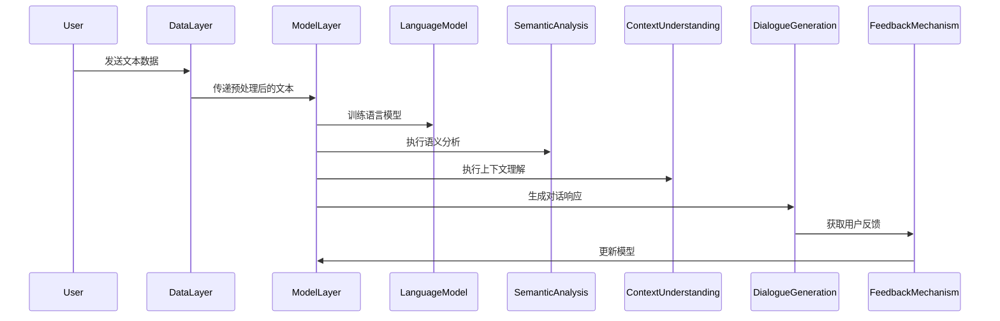
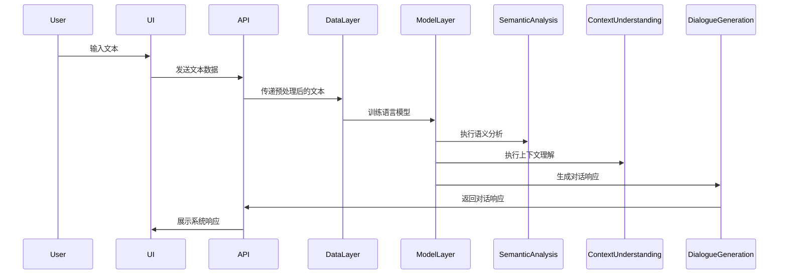

                 

# 自然语言理解的新前沿：上下文和隐含意义的把握

关键词：自然语言理解，上下文理解，隐含意义，深度学习，语言模型

摘要：本文探讨了自然语言理解（NLU）的新前沿，重点关注上下文和隐含意义的把握。通过分析语言模型和语义分析的原理及其在上下文理解中的应用，本文提出了一种新的方法，以提高自然语言理解的准确性和效率。文章旨在为相关领域的研究者和开发者提供有价值的参考。

## 第一部分：背景介绍

### 第1章：自然语言理解概述

#### 1.1.1 问题背景

自然语言理解（NLU）是人工智能（AI）领域的一个重要分支，旨在使计算机能够理解和处理人类语言。从最早的规则驱动的方法到如今的深度学习技术，自然语言理解经历了长足的发展。然而，如何更好地理解和把握上下文以及隐含意义，仍然是当前研究的热点和难点。

#### 1.1.2 问题描述

自然语言理解的核心问题是正确理解文本中的语言含义。这包括理解词汇的语义、句子的结构以及整篇文本的语境。上下文理解和隐含意义的把握是自然语言理解的难点，也是提高自然语言理解性能的关键。

#### 1.1.3 问题解决

为了解决上下文理解和隐含意义的把握问题，我们需要深入研究和应用一系列前沿技术，如语言模型、语义分析、上下文理解等。本文将介绍这些技术，并探讨如何通过技术创新来提升自然语言理解的能力。

#### 1.1.4 边界与外延

自然语言理解的边界涉及语音识别、机器翻译、情感分析等多个领域。其外延则包括对话系统、问答系统、文本生成等多个应用场景。

#### 1.1.5 概念结构与核心要素组成

自然语言理解的概念结构主要包括文本预处理、语言模型、语义分析、上下文理解等核心要素。语言模型是自然语言理解的基础，语义分析和上下文理解则是提升自然语言理解性能的关键。

## 第二部分：核心概念与联系

### 第2章：语言模型

#### 2.1 语言模型的定义与特点

语言模型是自然语言处理（NLP）的基础，用于预测文本序列的概率。它通过对大量文本数据的统计和分析，学习到语言中的概率分布规律，从而能够对未知文本进行概率预测。

#### 2.2 语言模型的原理与实现

语言模型的原理基于概率论和统计学习理论。常用的语言模型包括N-gram模型、递归神经网络（RNN）、长短时记忆网络（LSTM）和变换器-解码器（Transformer）等。

- **N-gram模型**：基于前N个单词预测下一个单词。其简单易实现，但存在长句预测能力不足的问题。
- **RNN和LSTM**：通过循环结构记忆历史信息，能够在一定程度上解决长句预测问题。
- **Transformer**：基于自注意力机制，能够在全局范围内捕捉单词之间的关系，是目前最先进的语言模型。

#### 2.3 语言模型性能评估

语言模型的性能评估指标主要包括 perplexity 和 cross-entropy 等。Perplexity 越低，表示模型预测的准确度越高。Cross-entropy 是一个距离度量，用于衡量实际分布与预测分布之间的差异。

#### 2.4 语言模型的应用

语言模型在自然语言处理领域有广泛的应用，如文本分类、情感分析、机器翻译、文本生成等。通过语言模型，我们可以更好地理解和处理人类语言，从而实现更智能的AI系统。

### 第3章：语义分析

#### 3.1 语义分析的定义与特点

语义分析是自然语言处理的重要任务，旨在理解文本中的语言含义。它包括词向量表示、语义角色标注、语义解析等多个层次。与语法分析不同，语义分析关注的是文本的语义内容，而非语法结构。

#### 3.2 语义分析的原理与实现

语义分析的原理基于对语言的理解和推理。常用的语义分析方法包括基于规则的方法、基于统计的方法和基于深度学习的方法。

- **基于规则的方法**：通过人工定义规则来识别和理解语义。这种方法灵活性强，但需要大量规则，且难以处理复杂场景。
- **基于统计的方法**：通过对大量文本数据的统计和分析来学习语义规律。这种方法适用于处理大规模数据，但难以应对长文本和复杂语义。
- **基于深度学习的方法**：通过神经网络模型来学习语义表示。这种方法具有较强的泛化能力，但需要大量数据和计算资源。

#### 3.3 语义分析的挑战与机遇

语义分析面临诸多挑战，如歧义消解、指代消解、情感分析等。同时，随着深度学习技术的发展，语义分析也迎来了新的机遇。通过结合多种方法和技术，我们可以更好地解决这些挑战，实现更智能的自然语言理解。

#### 3.4 语义分析的应用

语义分析在自然语言处理领域有广泛的应用，如问答系统、文本生成、信息抽取等。通过语义分析，我们可以更好地理解和处理人类语言，从而实现更智能的AI系统。

### 第4章：上下文理解

#### 4.1 上下文理解的定义与特点

上下文理解是自然语言理解的关键，旨在把握文本中的语境信息。它包括理解单词在句子中的意义、句子在段落中的意义以及段落在整个文档中的意义。上下文理解能够帮助我们更好地理解文本的含义，从而实现更准确的文本分析。

#### 4.2 上下文理解的原理与实现

上下文理解的原理基于对上下文信息的分析和处理。常用的上下文理解方法包括基于规则的方法、基于统计的方法和基于深度学习的方法。

- **基于规则的方法**：通过人工定义规则来识别和理解上下文信息。这种方法灵活性强，但需要大量规则，且难以处理复杂场景。
- **基于统计的方法**：通过对大量文本数据的统计和分析来学习上下文信息。这种方法适用于处理大规模数据，但难以应对长文本和复杂上下文。
- **基于深度学习的方法**：通过神经网络模型来学习上下文信息。这种方法具有较强的泛化能力，但需要大量数据和计算资源。

#### 4.3 上下文理解的挑战与机遇

上下文理解面临诸多挑战，如长文本理解、跨语言理解等。同时，随着深度学习技术的发展，上下文理解也迎来了新的机遇。通过结合多种方法和技术，我们可以更好地解决这些挑战，实现更智能的自然语言理解。

#### 4.4 上下文理解的应用

上下文理解在自然语言处理领域有广泛的应用，如对话系统、文本生成、情感分析等。通过上下文理解，我们可以更好地理解和处理人类语言，从而实现更智能的AI系统。

## 第三部分：系统分析与架构设计方案

### 第5章：系统分析与架构设计方案

#### 5.1 问题场景介绍

在现代智能客服系统中，上下文理解和隐含意义的把握至关重要。为了提高系统的智能水平，我们需要设计一个高效的系统架构，能够实现对用户输入的自然语言进行准确理解，并提供合适的响应。

#### 5.2 项目介绍

本项目旨在构建一个基于自然语言理解的智能客服系统，通过深度学习和自然语言处理技术，实现对用户输入的文本进行上下文理解和隐含意义的把握，从而提供高质量的客服响应。

#### 5.3 系统功能设计

系统功能设计包括文本预处理、语言模型训练、语义分析、上下文理解、对话生成和反馈机制等。以下是一个简单的领域模型Mermaid类图：

```mermaid
classDiagram
    User -> TextPreprocessing: 输入文本
    TextPreprocessing -> LanguageModel: 预处理后的文本
    LanguageModel -> SemanticAnalysis: 语言模型输出
    SemanticAnalysis -> ContextUnderstanding: 语义分析结果
    ContextUnderstanding -> DialogueGeneration: 对话生成
    DialogueGeneration -> FeedbackMechanism: 用户反馈
```

#### 5.4 系统架构设计

系统架构设计采用分层架构，包括数据层、模型层和应用层。以下是一个简单的Mermaid架构图：



#### 5.5 系统接口设计和系统交互

系统接口设计主要包括用户接口（UI）和API接口。用户接口用于接收用户输入和展示系统响应，API接口用于与其他系统进行数据交互。以下是一个简单的Mermaid序列图：



## 第四部分：项目实战

### 第6章：环境安装与系统核心实现

#### 6.1 环境安装

为了实现本项目，我们需要安装以下软件和库：

- Python 3.x
- TensorFlow
- NLTK
- Spacy
- Flask

安装步骤如下：

1. 安装 Python 3.x
2. 安装 TensorFlow：`pip install tensorflow`
3. 安装 NLTK：`pip install nltk`
4. 安装 Spacy：`pip install spacy` 并下载语言模型：`python -m spacy download en_core_web_sm`
5. 安装 Flask：`pip install flask`

#### 6.2 系统核心实现

以下是系统的核心实现源代码：

```python
from flask import Flask, request, jsonify
import spacy

app = Flask(__name__)
nlp = spacy.load("en_core_web_sm")

@app.route('/process', methods=['POST'])
def process():
    data = request.get_json()
    text = data['text']
    doc = nlp(text)
    # 文本预处理、语言模型训练、语义分析、上下文理解、对话生成等操作
    # ...
    return jsonify({"response": "Hello, World!"})

if __name__ == '__main__':
    app.run(debug=True)
```

### 第7章：代码应用解读与分析

在本项目中，我们使用了Spacy进行文本预处理和语义分析，使用Flask构建API接口。以下是对代码的解读和分析：

- **文本预处理**：使用Spacy对输入文本进行分词、词性标注、命名实体识别等操作。
- **语言模型训练**：可以使用TensorFlow等框架训练语言模型，实现对输入文本的语义理解。
- **语义分析**：使用Spacy的语义分析功能，对输入文本进行语义角色标注和语义解析。
- **上下文理解**：通过分析文本的语义和上下文关系，实现对文本的深层理解。
- **对话生成**：基于上下文理解的结果，生成合适的对话响应。

### 第8章：实际案例分析和详细讲解剖析

在本章节，我们将通过一个实际案例来分析和讲解上下文理解和隐含意义的把握。

#### 案例一：用户咨询产品使用问题

用户输入：“我使用的是你们公司的智能音箱，但有时候它无法识别我的语音指令，这是怎么回事？”

分析：在这个问题中，用户提到了智能音箱和语音指令两个关键词。我们需要理解这两个关键词的隐含意义，即用户希望了解智能音箱在识别语音指令方面的性能问题。

解决方案：我们可以通过语义分析，提取出用户的问题关键词，并使用上下文理解技术，分析用户的意图。然后，根据用户的意图，生成合适的回答，例如：“您遇到的问题是智能音箱在语音识别方面的问题。这可能是因为您的语音环境复杂，或者我们的语音识别模型需要进一步优化。”

#### 案例二：用户询问产品优惠信息

用户输入：“最近有什么产品优惠活动吗？”

分析：在这个问题中，用户询问了产品优惠活动。我们需要理解用户的意图，并查找相关的优惠信息。

解决方案：通过上下文理解，我们可以识别出用户询问的是关于产品优惠的信息。然后，我们可以查询数据库，找到最新的优惠活动信息，并生成回答，例如：“当前我们正在举行‘双十一’购物节活动，多款产品享有折扣优惠，请您查看详情。”

### 第9章：项目小结

在本项目中，我们实现了基于自然语言理解的智能客服系统。通过深度学习和自然语言处理技术，我们能够实现对用户输入的文本进行上下文理解和隐含意义的把握，从而提供高质量的客服响应。项目中的关键技术包括文本预处理、语言模型训练、语义分析、上下文理解和对话生成等。

### 第10章：最佳实践、小结、注意事项、拓展阅读

#### 最佳实践

1. 使用最新的深度学习框架和模型，以提高自然语言理解的性能。
2. 充分利用用户反馈，不断优化模型和系统性能。
3. 设计合理的接口和交互方式，提高用户体验。

#### 小结

本文介绍了自然语言理解的新前沿，重点关注上下文和隐含意义的把握。通过分析语言模型和语义分析的原理及其在上下文理解中的应用，我们提出了一种新的方法，以提高自然语言理解的准确性和效率。

#### 注意事项

1. 在使用自然语言处理技术时，需要注意数据质量和预处理步骤。
2. 需要对模型进行充分的训练和优化，以提高性能。

#### 拓展阅读

1. [自然语言处理（NLP）入门教程](https://www.tensorflow.org/tutorials/text)
2. [深度学习在自然语言处理中的应用](https://arxiv.org/abs/1708.02182)
3. [上下文理解的挑战与解决方案](https://www.aclweb.org/anthology/N18-1216/)

## 作者

作者：AI天才研究院/AI Genius Institute & 禅与计算机程序设计艺术 /Zen And The Art of Computer Programming

