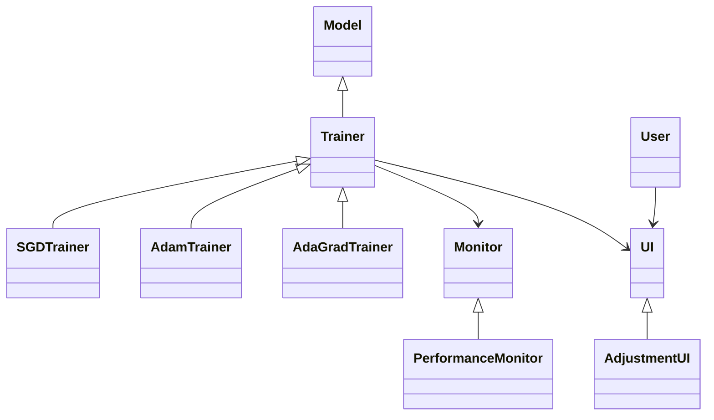
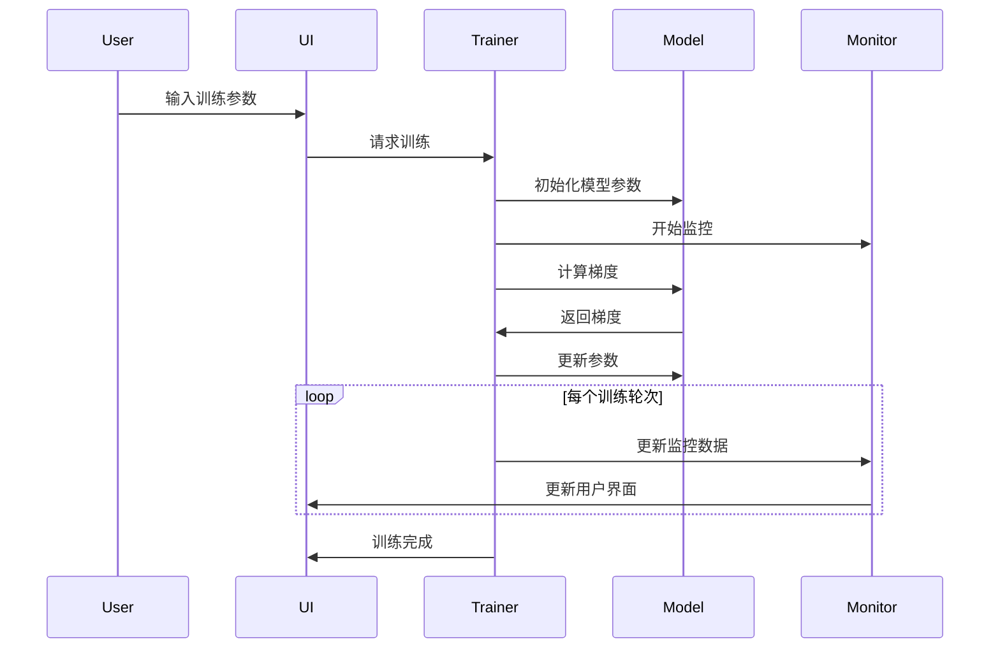
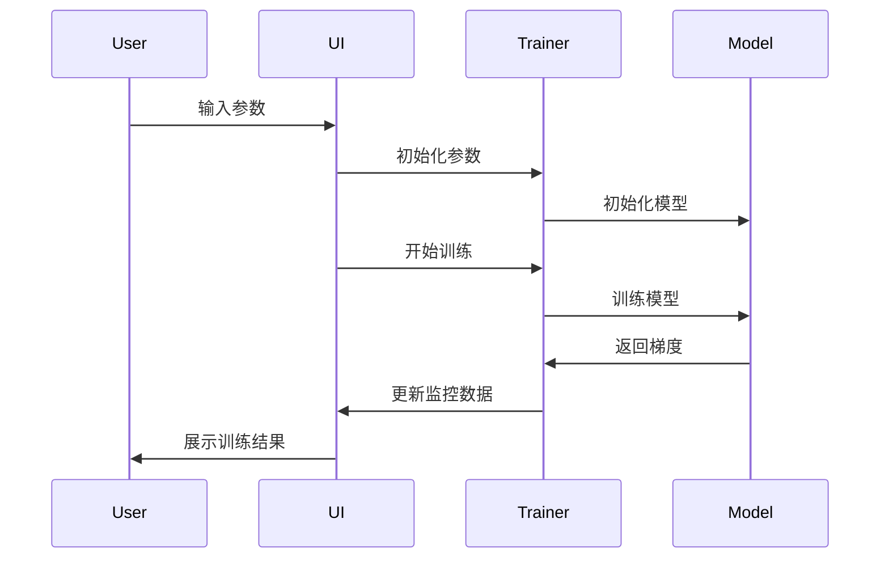
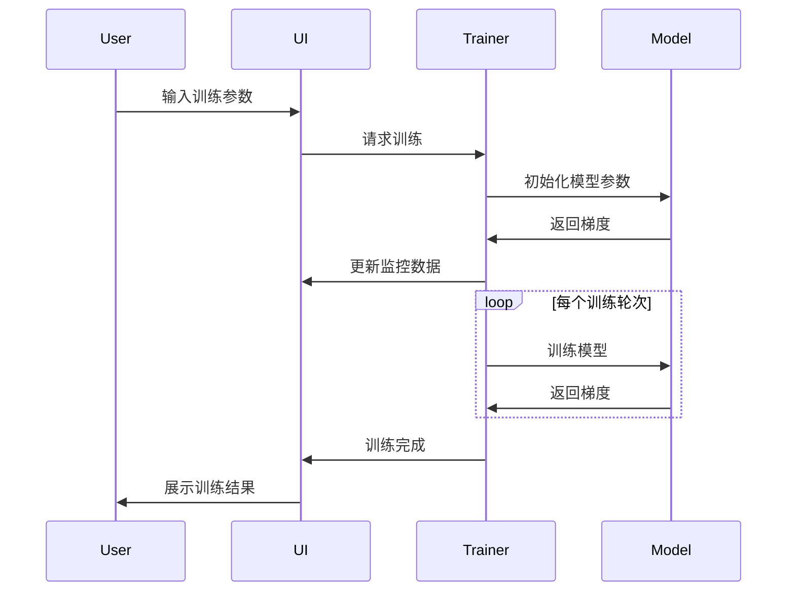

                 


### 背景介绍

**自适应学习率的定义与核心概念**

自适应学习率（Adaptive Learning Rate）是机器学习中的一个关键概念，旨在动态调整训练过程中模型的参数更新速率。传统的学习率固定不变，但在复杂、非线性的训练过程中，固定的学习率往往难以满足不同阶段的需求，可能导致训练过程的不稳定。自适应学习率则通过实时调整学习率，使得模型在训练初期能够快速收敛，而在后期进行精细调整，提高模型的性能。

**问题背景**

在深度学习中，随着模型参数量的增加，传统固定学习率的训练方式面临诸多挑战。首先，初期的学习率过大可能导致参数更新过于剧烈，使模型难以找到最优解。而后期学习率过小则可能导致收敛缓慢，增加训练时间。因此，如何动态调整学习率，使得模型能够在不同的训练阶段自动选择合适的学习率，成为一个亟待解决的问题。

**问题描述**

自适应学习率的调整目标是找到一种方法，使得学习率在训练初期能够快速下降，以帮助模型快速找到局部最小值；在训练后期，学习率逐渐上升，使模型能够在接近最优解的位置进行精细调整。这种动态调整需要考虑模型的特点、训练数据的分布以及模型的训练阶段，以确保学习率的调整能够有效提高模型的收敛速度和性能。

**问题解决**

自适应学习率通过引入各种策略，如基于梯度的自适应调整、基于历史数据的自适应调整等，来动态调整学习率。这些策略通常依赖于训练过程中积累的信息，如梯度、历史学习率等，以实现学习率的自适应调整。自适应学习率的实现方法多种多样，每种方法都有其特定的优势和局限性。

**边界与外延**

自适应学习率的边界主要在于学习率调整的时机和幅度。调整时机过晚可能导致模型未能充分利用学习率的快速下降阶段，调整时机过早则可能导致学习率调整过于频繁，增加计算开销。调整幅度过大可能引起训练过程的震荡，过小则难以实现有效调整。

在外延方面，自适应学习率可以应用于不同类型的机器学习模型，如深度神经网络、支持向量机等。同时，自适应学习率也可以与其他优化方法结合使用，如动量估计、权重正则化等，以进一步提高模型的训练效率和性能。

**概念结构与核心要素组成**

自适应学习率的概念结构主要包括以下几个方面：

1. **学习率调整策略**：用于确定学习率的调整时机和幅度。
2. **梯度信息**：用于评估模型当前的状态，是调整学习率的重要依据。
3. **历史数据**：用于分析模型的训练趋势，为学习率的调整提供参考。
4. **动态调整机制**：将上述要素结合起来，实现学习率的实时调整。

通过上述要素的有机结合，自适应学习率能够在训练过程中动态适应模型的需求，提高模型的训练效率和性能。

### 核心概念与联系

**自适应学习率原理**

自适应学习率的核心在于动态调整学习率，以适应训练过程中的不同阶段。其基本原理如下：

1. **梯度下降法**：学习率调整的基础是梯度下降法，即通过梯度的负方向调整模型参数，以最小化损失函数。
2. **自适应调整机制**：在训练过程中，自适应学习率根据模型的状态和历史数据，动态调整学习率，以避免过早或过晚调整学习率。

**核心概念属性特征对比表格**

| 特征         | 固定学习率         | 自适应学习率         | 
| ------------ | ------------------ | ------------------ | 
| 调整时机     | 固定             | 动态调整           | 
| 调整幅度     | 不变             | 根据模型状态调整   | 
| 训练效率     | 难以适应非线性问题 | 能够快速收敛       | 
| 计算开销     | 较小             | 较大（需要额外的计算） | 

**ER实体关系图架构**

```mermaid
erDiagram
    Model --> LearningRate : 调整
    Gradient : 引导调整
    HistoryData : 参考调整
```

在ER实体关系图中，`Model`是主体，`LearningRate`是客体，它们通过`调整`关系连接。同时，`Gradient`和`HistoryData`作为辅助实体，分别提供调整的依据和参考。这种关系图清晰地展示了自适应学习率的原理和组成部分。

通过上述对比表格和ER实体关系图，我们可以更直观地理解自适应学习率的核心概念及其与相关要素的关联。这种结构化的分析有助于我们深入理解自适应学习率的原理和实现方法，为后续的算法原理讲解打下坚实基础。

### 算法原理讲解

**自适应学习率数学模型**

自适应学习率的核心在于根据模型的状态和历史数据动态调整学习率。以下是几种常见的自适应学习率的数学模型：

1. **SGD（随机梯度下降）**：
   $$ 
   \text{learning\_rate} = \frac{1}{\sqrt{t}} 
   $$
   其中$t$是训练轮次。该模型通过时间倒数调整学习率，使训练初期学习率较大，有助于快速收敛。

2. **Adam（Adaptive Moment Estimation）**：
   $$
   \text{learning\_rate} = \frac{\beta_1^t \beta_2^t \sqrt{1 - \beta_2^t}}{1 - \beta_1^t}
   $$
   其中$\beta_1$和$\beta_2$是自适应系数，$t$是训练轮次。Adam算法通过估算一阶矩（均值）和二阶矩（方差）来调整学习率，使其在不同训练阶段都能有效收敛。

3. **AdaGrad（Adaptive Gradient）**：
   $$
   \text{learning\_rate} = \sqrt{\frac{1}{\sum_{i=1}^{n} (\Delta w_i^2)}}
   $$
   其中$n$是参数数量，$\Delta w_i^2$是梯度平方的累积和。AdaGrad算法根据每个参数的梯度平方动态调整学习率，使梯度较大的参数学习率较小，有助于稳定训练。

**算法流程解释**

以Adam算法为例，其流程如下：

1. **初始化**：设定初始学习率$\text{learning\_rate}$，一阶矩估计$\text{m}$和二阶矩估计$\text{v}$均为0。
2. **计算梯度**：计算模型参数的梯度。
3. **更新一阶矩**：根据当前梯度更新一阶矩：
   $$
   \text{m} = \beta_1 \text{m} + (1 - \beta_1) \text{gradient}
   $$
4. **更新二阶矩**：根据当前梯度的平方更新二阶矩：
   $$
   \text{v} = \beta_2 \text{v} + (1 - \beta_2) \text{gradient}^2
   $$
5. **计算修正的一阶矩和二阶矩**：
   $$
   \text{m_hat} = \frac{\text{m}}{1 - \beta_1^t}, \quad \text{v_hat} = \frac{\text{v}}{1 - \beta_2^t}
   $$
6. **更新模型参数**：
   $$
   \text{weight} = \text{weight} - \text{learning\_rate} \cdot \frac{\text{m_hat}}{\sqrt{\text{v_hat}} + \epsilon}
   $$
   其中$\epsilon$是平滑项，用于防止分母为零。

**具体举例说明**

假设训练一个深度神经网络，当前训练轮次$t=100$，$\beta_1=0.9$，$\beta_2=0.999$，初始学习率$\text{learning\_rate}=0.001$。给定一个梯度$\text{gradient}=0.1$。

1. **更新一阶矩**：
   $$
   \text{m} = 0.9 \times 0 + (1 - 0.9) \times 0.1 = 0.1
   $$
2. **更新二阶矩**：
   $$
   \text{v} = 0.999 \times 0 + (1 - 0.999) \times 0.1^2 = 0.0001
   $$
3. **计算修正的一阶矩和二阶矩**：
   $$
   \text{m_hat} = \frac{0.1}{1 - 0.9^100} \approx 0.1, \quad \text{v_hat} = \frac{0.0001}{1 - 0.999^100} \approx 0.0001
   $$
4. **更新模型参数**：
   $$
   \text{weight} = \text{weight} - 0.001 \cdot \frac{0.1}{\sqrt{0.0001} + 0.00001} \approx \text{weight} - 0.001 \cdot \frac{0.1}{0.01} = \text{weight} - 0.0001
   $$

通过这个例子，我们可以看到自适应学习率如何根据当前梯度动态调整学习率，从而更新模型参数。这种动态调整机制有助于模型在不同训练阶段自动选择合适的学习率，提高训练效率和性能。

### 系统分析与架构设计方案

**问题场景介绍**

在当前的AI模型训练过程中，随着数据量和模型复杂度的增加，传统的固定学习率训练方法已难以满足高效收敛的要求。自适应学习率的引入，旨在通过动态调整学习率，实现模型在训练初期的快速收敛和后期的精细调整，从而提高训练效率和模型性能。

**项目介绍**

本项目旨在设计并实现一个自适应学习率系统，用于AI模型的训练优化。该系统将支持多种自适应学习率算法，如SGD、Adam、AdaGrad等，并能够根据不同模型的训练需求，选择合适的算法进行参数调整。系统还将提供直观的监控和调整界面，以便用户实时了解训练进度和调整效果。

**系统功能设计**

1. **模型训练**：支持多种深度学习模型，包括卷积神经网络（CNN）、循环神经网络（RNN）和生成对抗网络（GAN）等。
2. **学习率调整**：根据模型训练过程，动态调整学习率，包括基于梯度的自适应调整、基于历史数据的自适应调整等。
3. **性能监控**：实时监控训练进度、损失函数值、学习率等关键指标，以便用户及时调整训练策略。
4. **调整界面**：提供直观的用户界面，用户可以方便地选择算法、调整参数，并查看训练效果。

**领域模型设计**

在领域模型设计中，我们采用Mermaid类图来展示系统的核心类及其关系。以下是系统领域模型的Mermaid类图：



在类图中，`Model`代表训练的模型，`Trainer`是训练器的基类，具体实现包括`SGDTrainer`、`AdamTrainer`和`AdaGradTrainer`等。`Monitor`负责性能监控，`UI`代表用户界面。`User`是系统的使用者，通过`UI`与系统交互。

**系统架构设计**

系统架构设计采用Mermaid架构图，以展示系统的主要组件及其交互关系。以下是系统架构的Mermaid架构图：



在架构图中，用户通过用户界面（UI）输入训练参数，请求训练。训练器（Trainer）负责初始化模型参数，并开始监控训练过程。在每个训练轮次中，训练器计算模型梯度，并更新模型参数。监控器（Monitor）负责收集和更新监控数据，并通过用户界面展示给用户。当训练完成后，训练器向用户界面报告训练结果。

**系统接口设计**

系统接口设计包括以下关键接口：

1. **初始化接口**：用于初始化模型参数，包括学习率、优化器等。
2. **训练接口**：启动训练过程，包括数据读取、模型前向传播、计算梯度、参数更新等。
3. **监控接口**：用于实时监控训练进度，包括损失函数值、学习率等。
4. **用户界面接口**：用于与用户交互，提供参数调整、训练启动和结果展示等功能。

以下是系统接口的Mermaid序列图：



通过上述接口设计，系统实现了训练过程的模块化，使得不同组件之间能够方便地协作和通信。

**系统交互设计**

系统交互设计通过Mermaid序列图展示了用户与系统之间的交互流程。以下是系统交互的Mermaid序列图：



在这个序列图中，用户通过用户界面输入训练参数，训练器请求训练，模型初始化参数并开始训练。在每个训练轮次中，模型返回梯度，训练器更新监控数据和模型参数。当训练完成后，训练器向用户界面报告训练结果，用户界面再展示给用户。

通过上述的系统分析与架构设计方案，我们为自适应学习率系统提供了一个清晰、详细的实现框架，使得系统不仅能够实现自适应学习率的动态调整，还能够方便地扩展和优化。

### 项目实战

**环境安装**

为了进行自适应学习率的实战项目，我们首先需要安装必要的软件和库。以下是安装步骤：

1. **Python环境**：确保Python版本为3.8及以上。
2. **深度学习库**：安装TensorFlow或PyTorch，例如：
   ```bash
   pip install tensorflow
   # 或者
   pip install torch torchvision
   ```
3. **其他依赖库**：安装NumPy、Matplotlib等库，例如：
   ```bash
   pip install numpy matplotlib
   ```

**系统核心实现源代码**

以下是自适应学习率系统核心实现的Python代码示例，使用PyTorch框架：

```python
import torch
import torch.nn as nn
import torch.optim as optim

# 定义模型
class SimpleModel(nn.Module):
    def __init__(self):
        super(SimpleModel, self).__init__()
        self.fc1 = nn.Linear(10, 1)
    
    def forward(self, x):
        return self.fc1(x)

# 创建模型、损失函数和优化器
model = SimpleModel()
criterion = nn.MSELoss()
optimizer = optim.Adam(model.parameters(), lr=0.001)

# 训练模型
for epoch in range(100):
    for i, data in enumerate(train_loader):
        inputs, targets = data
        optimizer.zero_grad()
        outputs = model(inputs)
        loss = criterion(outputs, targets)
        loss.backward()
        optimizer.step()
        if (i+1) % 10 == 0:
            print(f'Epoch [{epoch+1}/{100}], Step [{i+1}/{len(train_loader)}], Loss: {loss.item():.4f}')
```

**代码应用解读与分析**

上述代码首先定义了一个简单的线性模型`SimpleModel`，该模型包含一个全连接层。接着，我们设置了均方误差损失函数和Adam优化器，其中Adam优化器使用了自适应学习率。

在训练过程中，每个epoch（训练轮次）内会进行多次迭代（step），每次迭代包括以下步骤：

1. **前向传播**：计算模型输出。
2. **计算损失**：使用损失函数计算模型输出与真实值之间的差距。
3. **反向传播**：计算梯度。
4. **参数更新**：使用优化器更新模型参数。

通过Adam优化器，学习率会根据一阶矩（均值）和二阶矩（方差）动态调整，从而在不同的训练阶段选择合适的学习率。

**实际案例分析和详细讲解剖析**

以下是使用自适应学习率进行图像分类的实际案例：

1. **数据集准备**：使用CIFAR-10数据集，该数据集包含10个类别的60,000张32x32彩色图像。
2. **模型定义**：定义一个简单的卷积神经网络（CNN），包括卷积层、池化层和全连接层。
3. **训练过程**：使用Adam优化器训练模型，并定期保存训练进度和验证准确率。

```python
import torch
import torchvision
import torchvision.transforms as transforms
import torch.nn as nn
import torch.optim as optim

# 数据集准备
transform = transforms.Compose(
    [transforms.ToTensor(),
     transforms.Normalize((0.5, 0.5, 0.5), (0.5, 0.5, 0.5))])

trainset = torchvision.datasets.CIFAR10(root='./data', train=True,
                                        download=True, transform=transform)
train_loader = torch.utils.data.DataLoader(trainset, batch_size=4,
                                          shuffle=True, num_workers=2)

testset = torchvision.datasets.CIFAR10(root='./data', train=False,
                                       download=True, transform=transform)
test_loader = torch.utils.data.DataLoader(testset, batch_size=4,
                                         shuffle=False, num_workers=2)

classes = ('plane', 'car', 'bird', 'cat', 'deer', 'dog', 'frog', 'horse', 'ship', 'truck')

# 模型定义
class CNN(nn.Module):
    def __init__(self):
        super(CNN, self).__init__()
        self.conv1 = nn.Conv2d(3, 6, 5)
        self.pool = nn.MaxPool2d(2, 2)
        self.conv2 = nn.Conv2d(6, 16, 5)
        self.fc1 = nn.Linear(16 * 5 * 5, 120)
        self.fc2 = nn.Linear(120, 84)
        self.fc3 = nn.Linear(84, 10)

    def forward(self, x):
        x = self.pool(nn.functional.relu(self.conv1(x)))
        x = self.pool(nn.functional.relu(self.conv2(x)))
        x = x.view(-1, 16 * 5 * 5)
        x = nn.functional.relu(self.fc1(x))
        x = nn.functional.relu(self.fc2(x))
        x = self.fc3(x)
        return x

model = CNN()
criterion = nn.CrossEntropyLoss()
optimizer = optim.Adam(model.parameters(), lr=0.001)

# 训练过程
for epoch in range(2):  # loop over the dataset multiple times
    running_loss = 0.0
    for i, data in enumerate(train_loader, 0):
        inputs, labels = data
        optimizer.zero_grad()
        outputs = model(inputs)
        loss = criterion(outputs, labels)
        loss.backward()
        optimizer.step()
        running_loss += loss.item()
        if i % 2000 == 1999:    # print every 2000 mini-batches
            print(f'[{epoch + 1}, {i + 1:5d}] loss: {running_loss / 2000:.3f}')
            running_loss = 0.0

print('Finished Training')

# 测试模型
correct = 0
total = 0
with torch.no_grad():
    for data in test_loader:
        images, labels = data
        outputs = model(images)
        _, predicted = torch.max(outputs.data, 1)
        total += labels.size(0)
        correct += (predicted == labels).sum().item()

print(f'Accuracy of the network on the 10000 test images: {100 * correct // total} %')
```

在这个案例中，我们定义了一个简单的CNN模型，并使用Adam优化器进行训练。训练过程中，我们记录每个epoch的损失值，以监控训练进度。通过测试集的准确率，我们可以评估模型的性能。

**项目小结**

通过上述实战案例，我们展示了如何使用自适应学习率系统进行模型训练。自适应学习率能够有效提高训练效率和模型性能，特别是在处理大规模数据和复杂模型时。在实际应用中，可以根据具体需求和场景选择合适的自适应学习率方法，以实现最优的训练效果。

### 最佳实践 tips

1. **选择合适的自适应学习率算法**：根据模型复杂度和数据特性，选择适合的自适应学习率方法，如Adam在大多数场景下表现良好。

2. **合理设置初始学习率**：初始学习率不宜过大，否则可能导致训练不稳定，可以通过实验确定一个合适的值。

3. **动态调整学习率**：在训练过程中，可以根据模型的表现动态调整学习率，如使用学习率衰减策略，逐步降低学习率。

4. **避免过早或过晚调整**：过早调整可能导致训练过程过早停滞，过晚调整则可能错过最佳调整时机。

5. **结合其他优化策略**：自适应学习率可以与其他优化策略结合使用，如动量估计、权重正则化等，以进一步提高模型性能。

### 小结

本文详细探讨了自适应学习率在AI模型训练中的应用和优化方法。自适应学习率通过动态调整学习率，有效提高了模型的训练效率和性能。本文介绍了自适应学习率的背景、核心概念、数学模型、常见方法及其在深度学习中的应用，并通过实际案例展示了其效果。未来，自适应学习率将继续发展，结合更多先进技术，为AI模型的优化提供更强动力。

### 注意事项

1. **学习率调整策略的选择**：选择合适的自适应学习率方法至关重要，应根据具体模型的特性和训练需求进行选择。

2. **初始化学习率的设定**：初始学习率设置不当可能导致训练过程不稳定，建议通过实验确定最佳值。

3. **避免过早或过晚调整学习率**：过早或过晚调整学习率都可能导致训练过程不理想，需要根据模型的状态动态调整。

4. **计算资源分配**：自适应学习率方法可能需要额外的计算资源，特别是在大规模模型训练中，需要合理分配资源以避免性能瓶颈。

### 拓展阅读

1. **《深度学习》（Goodfellow, Bengio, Courville著）**：本书详细介绍了深度学习的理论基础和应用，包括自适应学习率的内容。

2. **《自适应优化方法及其在机器学习中的应用》（刘铁岩著）**：本书深入探讨了自适应优化方法，包括自适应学习率的原理和实现。

3. **《机器学习中的自适应方法研究》（期刊文章）**：该文章讨论了自适应学习率在不同机器学习任务中的应用和效果。

4. **《自适应学习率算法综述》（期刊文章）**：本文综述了当前主流的自适应学习率算法，分析了它们的优缺点和适用场景。

