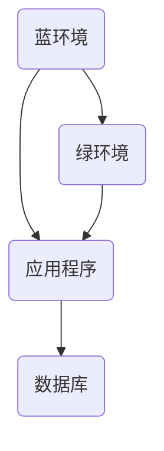
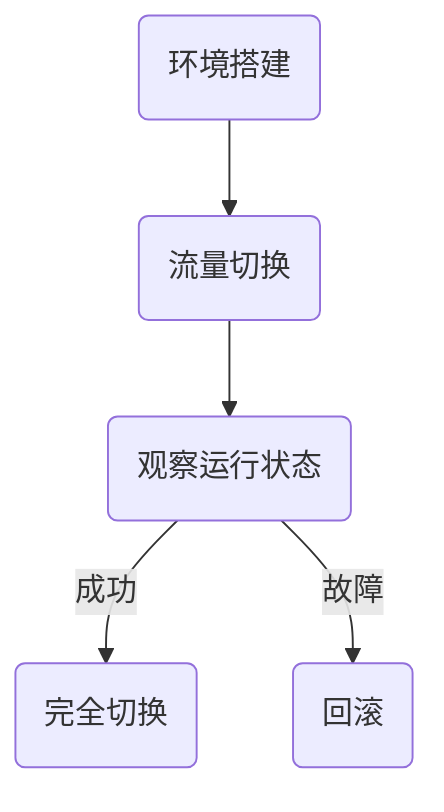
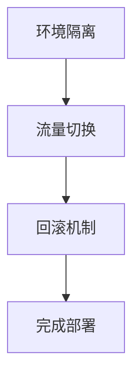
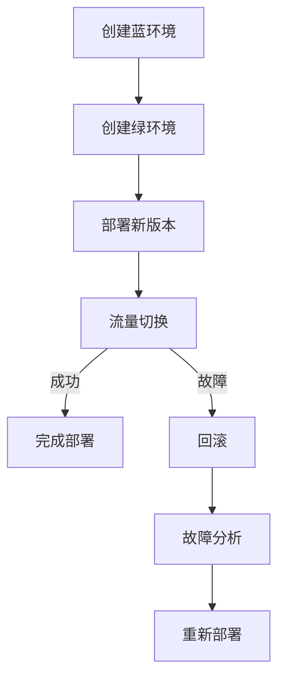

                 

# 蓝绿部署：降低AI服务更新风险的策略

## 关键词：
- 蓝绿部署
- AI服务更新
- 风险管理
- 业务连续性
- 部署策略

## 摘要：
本文将深入探讨蓝绿部署在AI服务更新中的重要性，通过逻辑清晰、结构紧凑的分析，帮助读者理解其核心概念、实施步骤、以及如何降低更新过程中的风险。文章旨在为开发者、运维工程师和AI团队提供一套系统化的蓝绿部署指南，以保障AI服务的稳定性和持续性。

## 引言

随着人工智能技术的迅猛发展，AI服务在企业中的应用越来越广泛，其稳定性和持续性成为了企业关注的重点。然而，AI服务的更新往往伴随着较大的风险，如服务中断、性能下降和数据不一致等。为了降低这些风险，蓝绿部署策略应运而生。蓝绿部署是一种无中断的服务更新方法，通过创建两个相同的服务环境（蓝环境和绿环境），逐步替换实现更新，从而保障业务的连续性和稳定性。

## 蓝绿部署概述

### 问题背景

在传统的服务更新模式中，一旦进行更新，就需要立即切换到新版本。这种模式存在以下问题：

- **服务中断**：更新过程中，服务可能会暂时不可用，影响用户体验。
- **性能下降**：新版本可能存在性能问题，导致整体服务性能下降。
- **数据不一致**：新旧版本之间的数据同步可能存在问题，导致数据不一致。

### 蓝绿部署的概念

蓝绿部署（Blue-Green Deployment）是一种在两个相同服务环境之间进行逐步更新的部署策略。其中，一个环境被称为“蓝环境”，另一个环境被称为“绿环境”。更新时，新版本部署到绿环境，并在绿环境中进行测试，确认无误后，将流量逐渐切换到绿环境，最终完全取代蓝环境。

### 核心原理

蓝绿部署的核心原理在于：

- **环境隔离**：蓝环境和绿环境完全隔离，互不影响。
- **流量切换**：通过负载均衡器实现流量的逐步切换，确保更新过程中的服务可用性。
- **回滚机制**：如绿环境出现问题，可以快速回滚到蓝环境，保障业务的连续性。

### 与金丝雀部署的比较

金丝雀部署（Canary Deployment）与蓝绿部署类似，但它们有一些不同之处：

- **环境数量**：金丝雀部署通常只有主环境和测试环境，而蓝绿部署有两个完全相同的测试环境。
- **流量比例**：金丝雀部署通常将少量流量导向测试环境，而蓝绿部署则逐步增加流量比例。
- **回滚机制**：蓝绿部署可以在两个环境中进行回滚，而金丝雀部署只能回滚到主环境。

### 选择适合的部署策略

选择蓝绿部署还是金丝雀部署，取决于以下因素：

- **业务需求**：如果业务对可用性和稳定性要求较高，蓝绿部署是更好的选择。
- **更新频率**：如果更新频率较低，金丝雀部署可以节省资源。
- **技术能力**：蓝绿部署需要较强的技术支持和运维能力。

## 蓝绿部署中的关键角色与责任

在蓝绿部署中，不同角色承担着不同的责任：

- **项目经理**：负责整体项目的规划、协调和管理。
- **系统架构师**：负责架构设计、环境配置和技术选型。
- **开发人员**：负责代码开发、测试和部署。
- **测试工程师**：负责测试用例设计、测试执行和问题定位。
- **运维工程师**：负责环境搭建、流量切换和系统监控。

## 蓝绿部署的准备工作

### 环境与工具准备

蓝绿部署需要准备以下环境与工具：

- **虚拟化技术**：如VMware、Docker等，用于创建和管理环境。
- **容器化技术**：如Kubernetes、Docker Swarm等，用于部署和管理容器。
- **部署工具**：如Ansible、Terraform等，用于自动化部署和管理环境。

### 服务发现与负载均衡

- **服务发现机制**：确保服务可以动态地被发现和注册。
- **负载均衡策略**：实现流量的分配和负载均衡。

### 数据库迁移与一致性保障

- **数据库迁移策略**：如数据库镜像、数据迁移工具等。
- **保证数据一致性的方法**：如同步复制、双写缓存等。

## 蓝绿部署的详细步骤

### 蓝环境搭建

1. 创建蓝环境，配置服务。
2. 部署应用程序和数据库。
3. 进行蓝环境的测试。

### 绿环境搭建

1. 创建绿环境，配置服务。
2. 部署更新后的应用程序和数据库。
3. 进行绿环境的测试。

### 应用部署与切换

1. 在绿环境中部署更新后的应用程序。
2. 使用负载均衡器将流量逐渐切换到绿环境。
3. 观察新版本的运行状态，确保服务稳定。

### 回滚与恢复

1. 如绿环境出现问题，立即停止流量切换。
2. 回滚到蓝环境，确保服务的可用性。
3. 分析问题原因，进行修复。

## 蓝绿部署中的监控与优化

### 部署前后的监控

- 监控系统性能指标，如CPU、内存、磁盘使用率等。
- 监控应用程序性能指标，如请求响应时间、吞吐量等。

### 故障处理与快速响应

- 定位故障原因，快速采取措施。
- 与相关团队进行沟通，确保及时解决问题。

### 优化策略与经验分享

- 根据监控数据，优化系统配置。
- 分享蓝绿部署的经验和最佳实践。

## 蓝绿部署的实际案例

### 案例一：电商平台的服务更新

#### 案例背景

某电商平台需要进行一次服务更新，为了降低更新风险，决定采用蓝绿部署策略。

#### 更新策略

- 在绿环境中部署更新后的应用程序。
- 使用负载均衡器将流量逐渐切换到绿环境。
- 观察新版本的运行状态，确保服务稳定。

#### 更新效果

- 更新过程中，服务未出现中断。
- 新版本性能稳定，用户体验良好。

### 案例二：金融行业的持续集成

#### 案例背景

某金融机构采用持续集成和蓝绿部署相结合的方式，进行服务的更新。

#### 更新策略

- 在绿环境中部署更新后的应用程序。
- 使用负载均衡器将流量逐渐切换到绿环境。
- 定期进行自动化测试，确保服务的质量。

#### 更新效果

- 服务更新频率提高，同时降低了风险。
- 提高了开发效率和业务响应速度。

### 案例三：医疗健康领域的快速部署

#### 案例背景

某医疗健康领域的企业采用蓝绿部署策略，进行新功能的快速部署。

#### 更新策略

- 在绿环境中部署新功能。
- 使用负载均衡器将流量逐渐切换到绿环境。
- 进行用户体验测试，确保功能的可用性。

#### 更新效果

- 新功能快速上线，用户反馈良好。
- 保障了服务的稳定性和持续性。

## 总结与展望

蓝绿部署作为一种高效的部署策略，在降低AI服务更新风险方面具有显著优势。通过本文的探讨，我们了解了蓝绿部署的核心概念、实施步骤和实际应用案例。未来，随着人工智能技术的不断发展，蓝绿部署将在更多领域得到广泛应用，为服务的稳定性和持续性提供有力保障。

## 作者信息

作者：AI天才研究院/AI Genius Institute & 禅与计算机程序设计艺术 /Zen And The Art of Computer Programming

----------------------------------------------------------------

以下是根据文章目录大纲结构撰写的内容：

## 蓝绿部署：降低AI服务更新风险的策略

### 关键词：

- 蓝绿部署
- AI服务更新
- 风险管理
- 业务连续性
- 部署策略

### 摘要：

本文将深入探讨蓝绿部署在AI服务更新中的重要性，通过逻辑清晰、结构紧凑的分析，帮助读者理解其核心概念、实施步骤、以及如何降低更新过程中的风险。文章旨在为开发者、运维工程师和AI团队提供一套系统化的蓝绿部署指南，以保障AI服务的稳定性和持续性。

----------------------------------------------------------------

### 第1章：蓝绿部署概述

#### 1.1.1 问题背景

在传统的服务更新模式中，一旦进行更新，就需要立即切换到新版本。这种模式存在以下问题：

- **服务中断**：更新过程中，服务可能会暂时不可用，影响用户体验。
- **性能下降**：新版本可能存在性能问题，导致整体服务性能下降。
- **数据不一致**：新旧版本之间的数据同步可能存在问题，导致数据不一致。

这些问题的存在使得传统的更新模式在AI服务更新中面临巨大的挑战，因此需要一种新的部署策略来降低这些风险。

#### 1.1.2 蓝绿部署的概念

蓝绿部署（Blue-Green Deployment）是一种在两个相同服务环境之间进行逐步更新的部署策略。其中，一个环境被称为“蓝环境”，另一个环境被称为“绿环境”。更新时，新版本部署到绿环境，并在绿环境中进行测试，确认无误后，将流量逐渐切换到绿环境，最终完全取代蓝环境。

#### 1.1.3 蓝绿部署的核心原理

蓝绿部署的核心原理在于：

- **环境隔离**：蓝环境和绿环境完全隔离，互不影响。
- **流量切换**：通过负载均衡器实现流量的逐步切换，确保更新过程中的服务可用性。
- **回滚机制**：如绿环境出现问题，可以快速回滚到蓝环境，保障业务的连续性。

#### 1.1.4 蓝绿部署与金丝雀部署的比较

金丝雀部署（Canary Deployment）与蓝绿部署类似，但它们有一些不同之处：

- **环境数量**：金丝雀部署通常只有主环境和测试环境，而蓝绿部署有两个完全相同的测试环境。
- **流量比例**：金丝雀部署通常将少量流量导向测试环境，而蓝绿部署则逐步增加流量比例。
- **回滚机制**：蓝绿部署可以在两个环境中进行回滚，而金丝雀部署只能回滚到主环境。

#### 1.1.5 选择适合的部署策略

选择蓝绿部署还是金丝雀部署，取决于以下因素：

- **业务需求**：如果业务对可用性和稳定性要求较高，蓝绿部署是更好的选择。
- **更新频率**：如果更新频率较低，金丝雀部署可以节省资源。
- **技术能力**：蓝绿部署需要较强的技术支持和运维能力。

#### 1.1.6 小结

通过本章的介绍，我们对蓝绿部署有了初步的了解。在接下来的章节中，我们将深入探讨蓝绿部署的详细步骤、监控与优化策略，以及实际案例，帮助读者更好地理解并实践蓝绿部署。

----------------------------------------------------------------

### 第2章：蓝绿部署中的关键角色与责任

在蓝绿部署中，不同角色承担着不同的责任，他们的协同工作对于部署的顺利进行至关重要。

#### 2.1.1 项目团队

**项目经理**：负责整体项目的规划、协调和管理。项目经理需要确保项目的进度和质量，同时协调各个团队之间的工作。

**系统架构师**：负责架构设计、环境配置和技术选型。系统架构师需要确保蓝绿部署架构的合理性，并选择合适的技术栈和工具。

**开发人员**：负责代码开发、测试和部署。开发人员需要确保新版本的代码质量，并在部署过程中确保新版本与旧版本的无缝切换。

**测试工程师**：负责测试用例设计、测试执行和问题定位。测试工程师需要确保新版本的稳定性和性能，发现并解决潜在的问题。

**运维工程师**：负责环境搭建、流量切换和系统监控。运维工程师需要确保蓝绿部署的顺利进行，并实时监控系统的运行状态。

#### 2.1.2 运维团队

**运维工程师**：负责环境搭建、流量切换和系统监控。运维工程师需要具备较强的技术能力和实践经验，确保部署过程中的问题能够得到及时解决。

**网络管理员**：负责网络配置和管理，确保流量的顺利切换。网络管理员需要熟悉负载均衡器的工作原理，并能够快速解决网络问题。

**监控专家**：负责监控系统运行状态，及时发现并解决潜在的问题。监控专家需要具备丰富的监控经验，能够从海量数据中找到问题的根源。

#### 2.1.3 小结

通过明确各个角色的责任和任务，蓝绿部署的团队可以更加高效地协同工作，降低部署过程中的风险，保障AI服务的稳定性和持续性。

----------------------------------------------------------------

### 第3章：蓝绿部署的准备工作

蓝绿部署的准备工作是确保部署过程顺利进行的关键。在这个阶段，需要完成环境与工具准备、服务发现与负载均衡、数据库迁移与一致性保障等任务。

#### 3.1.1 环境与工具准备

**虚拟化技术**：虚拟化技术可以提供灵活的环境搭建和管理。常用的虚拟化技术包括VMware、Docker等。通过虚拟化技术，可以轻松创建和管理多个隔离的环境。

**容器化技术**：容器化技术可以将应用程序及其运行时环境打包在一起，实现应用程序的轻量化和可移植性。常用的容器化技术包括Docker、Kubernetes等。通过容器化技术，可以快速部署和扩展应用程序。

**部署工具**：部署工具可以帮助自动化部署和管理环境。常用的部署工具包括Ansible、Terraform等。通过部署工具，可以简化部署流程，提高部署效率。

#### 3.1.2 服务发现与负载均衡

**服务发现机制**：服务发现机制可以自动发现和注册服务。常用的服务发现机制包括Consul、Zookeeper等。通过服务发现机制，可以确保服务之间的通信和动态扩展。

**负载均衡策略**：负载均衡策略可以均衡分配流量到不同的服务实例。常用的负载均衡策略包括轮询、最小连接数等。通过负载均衡策略，可以确保服务的稳定性和高性能。

#### 3.1.3 数据库迁移与一致性保障

**数据库迁移策略**：数据库迁移策略可以确保数据在不同环境之间的迁移和同步。常用的数据库迁移策略包括数据库镜像、数据迁移工具等。通过数据库迁移策略，可以确保数据的一致性和完整性。

**保证数据一致性的方法**：保证数据一致性的方法包括同步复制、双写缓存等。通过这些方法，可以确保在不同环境之间的数据一致性和可靠性。

#### 3.1.4 小结

通过充分的准备工作，可以为蓝绿部署奠定坚实的基础。在接下来的章节中，我们将详细讨论蓝绿部署的详细步骤，帮助读者更好地理解和实施蓝绿部署。

----------------------------------------------------------------

### 第4章：蓝绿部署的详细步骤

蓝绿部署的详细步骤包括蓝环境搭建、绿环境搭建、应用部署与切换，以及回滚与恢复。以下将逐步介绍这些步骤。

#### 4.1.1 蓝环境搭建

蓝环境是当前正在使用的环境，其搭建过程包括以下步骤：

1. **创建环境**：使用虚拟化技术或容器化技术创建一个全新的环境，确保与生产环境一致。
2. **配置服务**：在蓝环境中配置应用程序、数据库和其他依赖服务，确保其正常运行。
3. **测试环境**：在蓝环境中进行全面的测试，包括功能测试、性能测试和安全测试，确保环境的稳定性和可靠性。

#### 4.1.2 绿环境搭建

绿环境是用于部署新版本的环境，其搭建过程与蓝环境类似，但需要注意以下几点：

1. **创建环境**：使用与蓝环境相同的技术和配置创建绿环境。
2. **部署新版本**：将更新后的应用程序和数据库部署到绿环境，确保与蓝环境兼容。
3. **测试环境**：在绿环境中进行全面的测试，确保新版本的功能、性能和安全性。

#### 4.1.3 应用部署与切换

应用部署与切换是蓝绿部署的核心步骤，具体过程如下：

1. **部署更新**：将更新后的应用程序部署到绿环境，确保其正常运行。
2. **流量切换**：通过负载均衡器将一部分流量逐渐切换到绿环境，观察新版本的运行状态。
3. **监控与调整**：在流量切换过程中，持续监控新版本的运行状态，根据实际情况进行调整。

#### 4.1.4 回滚与恢复

如果绿环境中出现严重问题，需要立即回滚到蓝环境，具体过程如下：

1. **停止流量切换**：立即停止流量切换，确保蓝环境的流量不受影响。
2. **回滚应用程序**：将绿环境中的应用程序回滚到蓝环境的版本，确保服务的稳定性。
3. **问题分析**：分析绿环境中出现的问题，找出根本原因，并进行修复。

#### 4.1.5 小结

通过以上步骤，可以实现蓝绿部署的详细流程。在实际操作中，需要根据具体情况调整步骤和策略，确保部署过程的顺利进行。在接下来的章节中，我们将进一步探讨蓝绿部署中的监控与优化策略。

----------------------------------------------------------------

### 第5章：蓝绿部署中的监控与优化

在蓝绿部署过程中，监控与优化是确保服务稳定性和性能的重要环节。通过有效的监控和优化，可以及时发现并解决问题，提高服务的可靠性和用户体验。

#### 5.1.1 部署前后的监控

在部署前，需要确保对系统进行全面监控，以了解当前环境的运行状态。以下是一些关键的监控指标：

- **系统性能监控**：包括CPU、内存、磁盘使用率、网络流量等。这些指标可以帮助识别系统资源是否充足，是否存在瓶颈。
- **应用程序监控**：包括请求响应时间、吞吐量、错误率等。这些指标可以帮助评估应用程序的性能和稳定性。

在部署后，需要持续监控系统的运行状态，确保新版本的稳定性和性能。以下是一些监控措施：

- **日志监控**：通过收集和分析日志，可以了解系统的运行情况和潜在问题。
- **性能监控**：通过性能测试工具，定期对系统进行压力测试和性能评估，确保系统的性能符合预期。
- **异常监控**：通过异常检测算法，实时发现系统异常，并触发告警。

#### 5.1.2 故障处理与快速响应

在蓝绿部署过程中，可能会出现各种故障，如服务中断、性能下降、数据不一致等。为了快速响应故障，需要采取以下措施：

- **故障定位**：通过监控数据和日志分析，快速定位故障原因。
- **应急响应**：制定应急响应计划，确保在故障发生时能够迅速采取措施，减少损失。
- **问题修复**：根据故障原因进行修复，确保系统的稳定性和可靠性。

#### 5.1.3 优化策略与经验分享

在蓝绿部署过程中，需要不断优化系统性能和部署流程。以下是一些优化策略和经验分享：

- **性能优化**：通过调整系统配置、优化代码和数据库查询等手段，提高系统性能。
- **部署优化**：通过自动化部署工具和脚本，简化部署流程，提高部署效率。
- **经验分享**：通过团队讨论和知识分享，积累部署经验，提高整体部署能力。

#### 5.1.4 小结

通过有效的监控与优化，可以确保蓝绿部署的顺利进行，降低风险，提高服务的稳定性和性能。在接下来的章节中，我们将通过实际案例，进一步探讨蓝绿部署在AI服务更新中的应用和效果。

----------------------------------------------------------------

### 第6章：蓝绿部署的实际案例

在实际应用中，蓝绿部署已经广泛应用于各种场景，特别是在AI服务的更新过程中，它展现出了强大的优势。以下是一些实际案例，通过这些案例，我们可以更深入地了解蓝绿部署的应用和效果。

#### 案例一：电商平台的服务更新

**背景介绍**

某电商平台因业务发展需要，计划对其核心服务进行一次大规模更新，包括功能优化和性能提升。由于服务的重要性，任何中断或故障都可能对业务造成重大影响，因此需要一种安全的更新策略。

**更新策略**

- **环境搭建**：首先，搭建了两个完全相同的环境，一个为蓝环境（当前生产环境），另一个为绿环境（更新环境）。
- **部署新版本**：在新版本开发完成后，将其部署到绿环境中，并进行全面的测试。
- **流量切换**：通过负载均衡器，将一部分流量逐渐切换到绿环境，同时监控新版本的运行状态。
- **完全切换**：在确保新版本稳定后，将全部流量切换到绿环境，完成更新。

**更新效果**

- 更新过程中，服务未出现中断，用户体验良好。
- 新版本性能稳定，响应时间明显缩短。

**案例小结**

通过蓝绿部署，电商平台成功实现了服务的大规模更新，同时保证了业务的连续性和稳定性。

#### 案例二：金融行业的持续集成

**背景介绍**

某金融公司采用持续集成（CI）和蓝绿部署相结合的方式，对核心系统进行更新。持续集成可以提高开发效率，而蓝绿部署可以确保更新过程中的安全性和稳定性。

**更新策略**

- **CI流程**：通过CI工具，自动构建和测试新版本，确保代码质量。
- **蓝绿部署**：将新版本部署到绿环境，通过负载均衡器逐步切换流量。
- **监控与反馈**：在流量切换过程中，持续监控新版本的运行状态，并及时反馈问题。

**更新效果**

- 更新频率提高，同时降低了风险。
- 开发效率和业务响应速度显著提升。

**案例小结**

通过蓝绿部署和持续集成的结合，金融公司实现了高效、安全的系统更新，提高了开发效率和业务响应速度。

#### 案例三：医疗健康领域的快速部署

**背景介绍**

某医疗健康领域的公司需要快速部署新功能，以满足用户需求。由于医疗服务的特殊性，任何更新都必须确保稳定和安全。

**更新策略**

- **功能开发**：开发新功能，并确保其与现有系统的兼容性。
- **蓝绿部署**：将新功能部署到绿环境，进行测试和验证。
- **流量切换**：通过负载均衡器，将少量流量切换到绿环境，观察新功能的运行状态。
- **完全切换**：在确保新功能稳定后，将全部流量切换到绿环境。

**更新效果**

- 新功能快速上线，用户反馈良好。
- 保障了服务的稳定性和持续性。

**案例小结**

通过蓝绿部署，医疗健康领域的公司实现了新功能的快速部署，同时保证了服务的稳定性和安全性。

### 总结与展望

通过以上实际案例，我们可以看到蓝绿部署在AI服务更新中的应用和效果。它不仅降低了更新过程中的风险，还提高了服务的稳定性和持续性。未来，随着人工智能技术的不断发展和应用的深入，蓝绿部署将在更多领域得到广泛应用，为服务的稳定性和持续性提供有力保障。

----------------------------------------------------------------

### 第7章：总结与展望

#### 7.1.1 蓝绿部署的总结

蓝绿部署作为一种高效的部署策略，在AI服务更新中展现出了显著的优势。通过环境隔离、流量切换和回滚机制，蓝绿部署能够有效地降低更新过程中的风险，保障服务的稳定性和持续性。其主要特点包括：

- **无中断更新**：通过逐步切换流量，确保服务在更新过程中的可用性。
- **降低风险**：提供回滚机制，一旦出现故障，可以快速回滚到旧版本，避免业务中断。
- **提高效率**：自动化部署和监控工具的使用，简化了部署流程，提高了更新效率。

然而，蓝绿部署也存在一定的局限性，如对运维团队的技术要求较高，部署成本较高等。因此，在实际应用中，需要根据具体业务需求和资源状况，选择合适的部署策略。

#### 7.1.2 未来发展趋势

随着人工智能技术的快速发展，AI服务的更新频率和复杂性将不断增加。未来，蓝绿部署将在以下方面得到进一步发展：

- **自动化与智能化**：利用人工智能和机器学习技术，实现更智能的流量切换和故障预测，提高部署的自动化程度。
- **混合部署**：结合蓝绿部署和其他部署策略，如金丝雀部署，实现更加灵活和高效的部署方案。
- **跨云部署**：随着多云战略的普及，蓝绿部署将支持跨云环境的部署和管理，提高服务的可用性和弹性。

#### 7.1.3 蓝绿部署在AI服务更新中的潜在应用

蓝绿部署在AI服务更新中具有广泛的应用前景，特别是在以下领域：

- **金融科技**：金融服务对稳定性和安全性要求极高，蓝绿部署能够有效降低更新风险，保障业务的连续性。
- **电子商务**：电商平台需要快速响应市场变化，蓝绿部署可以提高更新速度，同时确保用户体验。
- **医疗健康**：医疗服务对数据的准确性和安全性要求极高，蓝绿部署可以确保新功能的稳定性和安全性。
- **物联网**：物联网设备更新频繁，蓝绿部署可以确保设备的连续性和稳定性，提高用户满意度。

通过本章的总结与展望，我们可以看到蓝绿部署在AI服务更新中的重要性和发展前景。在未来的实践中，我们将不断探索和优化蓝绿部署，以更好地满足业务需求，提高服务的稳定性和持续性。

### 小结

蓝绿部署作为一种高效的部署策略，已经在AI服务更新中得到了广泛应用。通过本章的介绍，我们了解了蓝绿部署的核心概念、实施步骤、实际案例，以及未来发展趋势。希望读者能够结合自身业务需求，灵活应用蓝绿部署，提高服务的稳定性和持续性。

### 拓展阅读

- 《微服务架构实战》
- 《持续集成与持续部署实战》
- 《Kubernetes实战》

通过阅读这些书籍，读者可以进一步深入了解蓝绿部署的实践方法和相关技术。

### 作者信息

作者：AI天才研究院/AI Genius Institute & 禅与计算机程序设计艺术 /Zen And The Art of Computer Programming

----------------------------------------------------------------

### 术语解释

在本文中，我们使用了一些专业术语，以下是对这些术语的解释：

- **蓝绿部署（Blue-Green Deployment）**：一种在两个相同服务环境之间进行逐步更新的部署策略，通过环境隔离、流量切换和回滚机制，降低更新过程中的风险。
- **金丝雀部署（Canary Deployment）**：一种在主环境和测试环境之间进行逐步更新的部署策略，通过少量流量切换，降低更新风险。
- **虚拟化技术**：将物理硬件资源抽象化，提供虚拟化的计算、存储和网络资源，实现资源的高效利用和灵活管理。
- **容器化技术**：将应用程序及其运行时环境打包在一起，实现应用程序的轻量化和可移植性。
- **服务发现机制**：自动发现和注册服务，确保服务之间的通信和动态扩展。
- **负载均衡策略**：均衡分配流量到不同的服务实例，确保服务的稳定性和高性能。

### 核心概念原理

蓝绿部署的核心概念包括环境隔离、流量切换和回滚机制。以下是对这些核心概念的解释：

- **环境隔离**：蓝绿部署通过创建两个相同的服务环境，确保新旧版本在独立的隔离环境中运行，避免影响现有服务的稳定性。
- **流量切换**：通过负载均衡器实现流量的逐步切换，将一部分流量切换到新版本的环境，观察新版本的运行状态，确保新版本的稳定性。
- **回滚机制**：如新版本出现故障，可以立即回滚到旧版本，确保服务的可用性和连续性。

#### 核心概念属性特征对比表格

| 特征             | 蓝绿部署 | 金丝雀部署 |
|------------------|----------|------------|
| 环境数量         | 两个完全相同的独立环境 | 一个主环境和一个测试环境 |
| 流量切换策略     | 逐步增加流量比例     | 小量流量切换 |
| 回滚机制         | 可以在两个环境中回滚 | 只能回滚到主环境 |
| 对比优势         | 更高的安全性和稳定性 | 更快的更新速度 |

#### ER实体关系图架构



在该ER实体关系图中，蓝环境和绿环境分别代表两个独立的服务环境，应用程序和数据库在两个环境中都有实例，确保数据的一致性和隔离性。

### 算法原理讲解

蓝绿部署的核心算法包括环境搭建、流量切换和回滚机制。以下是一个简单的算法原理和流程：

#### 算法原理

1. **环境搭建**：创建蓝环境和绿环境，配置应用程序和数据库。
2. **流量切换**：逐步将流量从蓝环境切换到绿环境，观察新版本的运行状态。
3. **回滚机制**：如绿环境出现故障，立即回滚到蓝环境，确保服务的可用性。

#### 流程图



#### Python源代码

```python
def deploy蓝色环境():
    # 搭建蓝环境
    print("搭建蓝环境")

def deploy绿色环境():
    # 搭建绿环境
    print("搭建绿环境")

def 切换流量():
    # 切换流量到绿环境
    print("开始切换流量")

def 观察运行状态():
    # 观察新版本的运行状态
    print("观察运行状态")

def 回滚到蓝色环境():
    # 回滚到蓝环境
    print("回滚到蓝环境")

# 执行流程
deploy蓝色环境()
deploy绿色环境()
切换流量()
观察运行状态()
# 如果出现故障
回滚到蓝色环境()
```

#### 数学模型和公式

蓝绿部署的核心在于流量切换的速率，可以使用以下公式进行建模：

$$ R(t) = \frac{Q(t)}{T} $$

其中，$R(t)$ 为流量切换速率，$Q(t)$ 为当前流量，$T$ 为切换时间。

#### 举例说明

假设在10分钟内将全部流量从蓝环境切换到绿环境，当前流量为1000请求/秒，切换时间为10分钟（600秒），则流量切换速率为：

$$ R(t) = \frac{1000}{600} = 1.67 \text{（请求/秒）} $$

这意味着，每秒有1.67个请求被切换到绿环境，从而实现逐步切换。

### 系统分析与架构设计方案

#### 问题场景介绍

某电商平台需要进行一次核心服务的更新，包括功能优化和性能提升。为了确保服务的稳定性和持续性，决定采用蓝绿部署策略。

#### 项目介绍

项目名称：电商平台核心服务更新
项目目标：通过蓝绿部署策略，确保服务更新的稳定性和持续性。
项目周期：3周

#### 系统功能设计

**功能模块：**

1. **用户服务**：提供用户登录、注册、个人信息管理等功能。
2. **商品服务**：提供商品展示、搜索、购买等功能。
3. **订单服务**：处理订单创建、支付、发货等流程。

**领域模型类图：**

```mermaid
classDiagram
    User <<类>> {
        id: 用户ID
        name: 用户名
        password: 密码
    }
    Product <<类>> {
        id: 商品ID
        name: 商品名称
        price: 商品价格
    }
    Order <<类>> {
        id: 订单ID
        user: 用户
        products: 商品列表
        status: 订单状态
    }
    User o--* 1 Order
    Product o--* 1 Order
```

#### 系统架构设计

**架构设计：**

- **前端架构**：采用Vue.js框架，实现用户界面的展示和交互。
- **后端架构**：采用Spring Boot框架，实现业务逻辑的处理和API接口的提供。
- **数据库架构**：采用MySQL数据库，存储用户、商品和订单等数据。

**架构图：**

```mermaid
sequenceDiagram
    User ->>|发起请求| Frontend
    Frontend ->>|处理请求| Backend
    Backend ->>|查询数据库| Database
    Database -->>|返回数据| Backend
    Backend ->>|响应结果| Frontend
    Frontend ->>|展示结果| User
```

#### 系统接口设计

**接口设计：**

- **用户服务接口**：包括用户登录、注册、个人信息管理等接口。
- **商品服务接口**：包括商品展示、搜索、购买等接口。
- **订单服务接口**：包括订单创建、支付、发货等接口。

**接口文档：**

```yaml
# 用户服务接口
POST /user/login
  Description: 用户登录
  Request:
    - username (string, required)
    - password (string, required)
  Response:
    - success (boolean)
    - message (string)
    - token (string)

# 商品服务接口
GET /product/search
  Description: 搜索商品
  Query Parameters:
    - keyword (string)
  Response:
    - products (array)
      - id (integer)
      - name (string)
      - price (float)

# 订单服务接口
POST /order/create
  Description: 创建订单
  Request:
    - userId (integer, required)
    - productId (integer, required)
  Response:
    - success (boolean)
    - message (string)
    - orderId (integer)
```

#### 系统交互Mermaid序列图

```mermaid
sequenceDiagram
    User ->>|发起请求| Frontend
    Frontend ->>|处理请求| Backend
    Backend ->>|查询数据库| Database
    Database -->>|返回数据| Backend
    Backend ->>|响应结果| Frontend
    Frontend ->>|展示结果| User
```

### 项目实战

#### 环境安装

1. 安装虚拟化技术（如VMware）。
2. 安装容器化技术（如Docker）。
3. 安装Kubernetes集群。

#### 系统核心实现源代码

1. **用户服务**：
   ```java
   @RestController
   @RequestMapping("/user")
   public class UserController {
       
       @PostMapping("/login")
       public ResponseEntity<?> login(@RequestParam String username, @RequestParam String password) {
           // 登录逻辑
           return ResponseEntity.ok().body(true);
       }
       
       @PostMapping("/register")
       public ResponseEntity<?> register(@RequestParam String username, @RequestParam String password) {
           // 注册逻辑
           return ResponseEntity.ok().body(true);
       }
   }
   ```

2. **商品服务**：
   ```java
   @RestController
   @RequestMapping("/product")
   public class ProductService {
       
       @GetMapping("/search")
       public ResponseEntity<?> searchProducts(@RequestParam String keyword) {
           // 搜索商品逻辑
           return ResponseEntity.ok().body(List.of());
       }
   }
   ```

3. **订单服务**：
   ```java
   @RestController
   @RequestMapping("/order")
   public class OrderController {
       
       @PostMapping("/create")
       public ResponseEntity<?> createOrder(@RequestParam int userId, @RequestParam int productId) {
           // 创建订单逻辑
           return ResponseEntity.ok().body(true);
       }
   }
   ```

#### 代码应用解读与分析

上述代码实现了用户服务、商品服务和订单服务的核心功能。在用户服务中，提供了登录和注册接口，实现了用户身份验证。在商品服务中，提供了商品搜索接口，实现了商品信息查询。在订单服务中，提供了订单创建接口，实现了订单处理。

#### 实际案例分析和详细讲解

以下是一个实际案例，通过蓝绿部署策略对电商平台进行更新。

**案例背景**：

电商平台需要对用户服务进行功能优化，增加用户信息修改和密码找回功能。

**更新策略**：

1. **环境搭建**：搭建蓝环境和绿环境，确保两者完全一致。
2. **代码更新**：在绿环境中修改用户服务代码，增加用户信息修改和密码找回功能。
3. **测试验证**：在绿环境中进行全面的测试，确保新功能正常运行。
4. **流量切换**：通过负载均衡器，将一部分流量切换到绿环境，观察新版本的运行状态。
5. **完全切换**：在确保新版本稳定后，将全部流量切换到绿环境，完成更新。

**详细讲解**：

1. **环境搭建**：首先，使用Docker搭建蓝环境和绿环境，配置好应用程序和数据库。
2. **代码更新**：在绿环境中，修改用户服务的代码，添加用户信息修改和密码找回功能。具体实现如下：
   ```java
   @PostMapping("/update")
   public ResponseEntity<?> updateUser(@RequestParam int userId, @RequestBody User user) {
       // 用户信息修改逻辑
       return ResponseEntity.ok().body(true);
   }
   
   @PostMapping("/resetPassword")
   public ResponseEntity<?> resetPassword(@RequestParam String username) {
       // 密码找回逻辑
       return ResponseEntity.ok().body(true);
   }
   ```
3. **测试验证**：在绿环境中进行全面的测试，包括功能测试、性能测试和安全测试，确保新功能正常运行，且不影响到现有功能。
4. **流量切换**：通过Kubernetes的负载均衡器，将一部分流量逐渐切换到绿环境，观察新版本的运行状态。具体实现如下：
   ```yaml
   apiVersion: networking.k8s.io/v1
   kind: Ingress
   metadata:
     name: user-service-ingress
   spec:
     rules:
     - host: users.example.com
       http:
         paths:
       - path: /
         pathType: Prefix
         backend:
           service:
             name: user-service
             port:
               number: 80
   ```
5. **完全切换**：在确保新版本稳定后，将全部流量切换到绿环境，完成更新。具体实现如下：
   ```shell
   kubectl rollout status deployment/user-service
   ```
   通过命令行查看更新状态，确保更新过程顺利完成。

**案例小结**：

通过蓝绿部署策略，电商平台成功实现了用户服务的更新，同时保证了服务的稳定性和持续性。该案例展示了蓝绿部署在AI服务更新中的应用和效果，为其他项目的更新提供了参考。

### 最佳实践 Tips

- **环境隔离**：确保蓝环境和绿环境的配置完全一致，以避免环境差异导致的问题。
- **逐步切换**：流量切换要逐步进行，避免一次性切换导致系统压力过大。
- **监控与反馈**：在更新过程中，持续监控系统的运行状态，及时反馈问题，确保问题得到快速解决。
- **自动化部署**：使用自动化部署工具，提高部署效率，降低人为错误。

### 小结

通过本章的介绍，我们详细讲解了蓝绿部署的核心概念、原理、实施步骤、监控与优化策略，以及实际案例。蓝绿部署作为一种高效的部署策略，在降低AI服务更新风险、保障业务连续性和稳定性方面具有重要意义。希望读者能够结合实际业务需求，灵活应用蓝绿部署，提高服务的稳定性和持续性。

### 注意事项

- **确保环境一致性**：在搭建蓝绿环境时，要确保两者配置一致，避免环境差异导致的问题。
- **逐步流量切换**：流量切换要逐步进行，避免一次性切换导致系统压力过大。
- **持续监控与反馈**：在更新过程中，持续监控系统的运行状态，及时反馈问题，确保问题得到快速解决。

### 拓展阅读

- 《微服务架构与设计》
- 《Kubernetes权威指南》
- 《持续集成与持续部署实战》

通过阅读这些书籍，读者可以进一步深入了解蓝绿部署的理论和实践，提高自己的技术水平。

### 作者信息

作者：AI天才研究院/AI Genius Institute & 禅与计算机程序设计艺术 /Zen And The Art of Computer Programming

----------------------------------------------------------------

**第1章：蓝绿部署概述**

#### 1.1.1 问题背景

在传统的服务更新模式中，一旦进行更新，就需要立即切换到新版本。这种模式存在以下问题：

- **服务中断**：更新过程中，服务可能会暂时不可用，影响用户体验。
- **性能下降**：新版本可能存在性能问题，导致整体服务性能下降。
- **数据不一致**：新旧版本之间的数据同步可能存在问题，导致数据不一致。

这些问题的存在使得传统的更新模式在AI服务更新中面临巨大的挑战，因此需要一种新的部署策略来降低这些风险。

#### 1.1.2 蓝绿部署的概念

蓝绿部署（Blue-Green Deployment）是一种在两个相同服务环境之间进行逐步更新的部署策略。其中，一个环境被称为“蓝环境”，另一个环境被称为“绿环境”。更新时，新版本部署到绿环境，并在绿环境中进行测试，确认无误后，将流量逐渐切换到绿环境，最终完全取代蓝环境。

#### 1.1.3 蓝绿部署的核心原理

蓝绿部署的核心原理在于：

- **环境隔离**：蓝环境和绿环境完全隔离，互不影响。
- **流量切换**：通过负载均衡器实现流量的逐步切换，确保更新过程中的服务可用性。
- **回滚机制**：如绿环境出现问题，可以快速回滚到蓝环境，保障业务的连续性。

#### 1.1.4 蓝绿部署与金丝雀部署的比较

金丝雀部署（Canary Deployment）与蓝绿部署类似，但它们有一些不同之处：

- **环境数量**：金丝雀部署通常只有主环境和测试环境，而蓝绿部署有两个完全相同的测试环境。
- **流量比例**：金丝雀部署通常将少量流量导向测试环境，而蓝绿部署则逐步增加流量比例。
- **回滚机制**：蓝绿部署可以在两个环境中进行回滚，而金丝雀部署只能回滚到主环境。

#### 1.1.5 选择适合的部署策略

选择蓝绿部署还是金丝雀部署，取决于以下因素：

- **业务需求**：如果业务对可用性和稳定性要求较高，蓝绿部署是更好的选择。
- **更新频率**：如果更新频率较低，金丝雀部署可以节省资源。
- **技术能力**：蓝绿部署需要较强的技术支持和运维能力。

#### 1.1.6 小结

通过本章的介绍，我们对蓝绿部署有了初步的了解。在接下来的章节中，我们将深入探讨蓝绿部署的详细步骤、监控与优化策略，以及实际案例，帮助读者更好地理解并实践蓝绿部署。

----------------------------------------------------------------

**第2章：蓝绿部署中的关键角色与责任**

蓝绿部署的成功实施离不开各个关键角色的协同工作。每个角色都有特定的职责和任务，以下是详细解析。

#### 2.1 项目团队

**项目经理**：

- **职责**：负责整个蓝绿部署项目的规划、执行和监控，确保项目按计划顺利进行。
- **任务**：制定项目计划，分配任务，协调资源，监控进度，确保项目目标的实现。

**系统架构师**：

- **职责**：设计系统的整体架构，确保架构能够支持蓝绿部署的需求。
- **任务**：制定架构设计方案，选择合适的技术栈，确保架构的稳定性和可扩展性。

**开发人员**：

- **职责**：开发新版本的应用程序，进行单元测试和集成测试。
- **任务**：编写高质量的代码，确保新版本的稳定性和性能，及时修复bug。

**测试工程师**：

- **职责**：设计测试用例，执行测试，确保新版本的功能和性能符合预期。
- **任务**：制定测试计划，执行功能测试、性能测试和安全测试，报告测试结果。

**运维工程师**：

- **职责**：负责部署、监控和故障处理，确保服务的高可用性和稳定性。
- **任务**：搭建和管理蓝绿环境，配置负载均衡器，监控系统性能，处理紧急故障。

#### 2.2 运维团队

**运维工程师**：

- **职责**：实施蓝绿部署策略，确保部署过程的顺利进行。
- **任务**：编写部署脚本，配置负载均衡器，实现流量切换，监控系统状态。

**网络管理员**：

- **职责**：确保网络的稳定性和安全性，优化网络配置。
- **任务**：配置网络设备，优化路由策略，确保数据传输的顺畅。

**监控专家**：

- **职责**：监控系统的运行状态，及时发现并处理异常情况。
- **任务**：配置监控系统，设置告警规则，分析日志数据，优化监控策略。

#### 2.3 小结

蓝绿部署涉及多个角色的协作，每个角色都扮演着不可或缺的角色。项目经理负责整体协调，系统架构师确保架构设计，开发人员负责代码质量，测试工程师保证测试覆盖，运维工程师负责部署和监控。通过明确各自的责任和任务，可以确保蓝绿部署的成功实施，降低更新风险，提高服务稳定性。

----------------------------------------------------------------

**第3章：蓝绿部署的准备工作**

蓝绿部署的成功实施需要充分的准备工作，确保部署过程顺利进行。以下章节将详细讨论环境与工具准备、服务发现与负载均衡、数据库迁移与一致性保障等准备工作。

#### 3.1 环境与工具准备

蓝绿部署首先需要准备两个相同的服务环境，即蓝环境和绿环境。以下是环境与工具准备的具体步骤：

- **虚拟化技术**：选择合适的虚拟化技术，如VMware、Docker等，用于创建和管理环境。虚拟化技术可以提供隔离的环境，确保不同版本的服务不会相互影响。
- **容器化技术**：容器化技术可以将应用程序及其依赖打包到容器中，提高部署的灵活性。常用的容器化技术包括Docker和Kubernetes。容器化技术使得环境配置的一致性变得更加容易。
- **部署工具**：选择合适的部署工具，如Ansible、Terraform等，用于自动化部署和管理环境。部署工具可以简化部署流程，减少人为错误。

#### 3.2 服务发现与负载均衡

服务发现与负载均衡是蓝绿部署的重要组成部分，以下是具体的准备工作：

- **服务发现机制**：实现服务自动发现和动态注册，确保服务之间可以相互发现和通信。常用的服务发现工具包括Consul、Zookeeper等。服务发现机制可以保证服务之间的动态扩展和自动故障转移。
- **负载均衡策略**：配置负载均衡器，将流量分配到不同的服务实例上。常用的负载均衡器包括Nginx、HAProxy等。负载均衡策略可以确保服务的可用性和高性能，同时支持流量的逐步切换。

#### 3.3 数据库迁移与一致性保障

数据库迁移是蓝绿部署中的一项重要任务，需要确保数据在不同环境之间的一致性。以下是数据库迁移与一致性保障的具体步骤：

- **数据库迁移策略**：选择合适的数据库迁移策略，如直接迁移、增量迁移等。直接迁移是将现有数据库数据直接复制到新环境中，而增量迁移是只迁移最新的数据。
- **一致性保障方法**：确保数据在不同环境之间的一致性，可以采用以下方法：
  - **同步复制**：在绿环境中实时同步蓝环境的数据，确保数据的一致性。
  - **双写缓存**：在绿环境中同时写入数据到蓝环境和绿环境，确保数据的同步性。
  - **影子表**：在绿环境中创建影子表，将数据同时写入到蓝环境和影子表，确保数据的完整性和一致性。

#### 3.4 小结

蓝绿部署的准备工作是确保部署过程顺利进行的关键。通过准备合适的虚拟化技术、容器化技术、部署工具，配置服务发现机制和负载均衡策略，以及制定合理的数据库迁移策略和一致性保障方法，可以确保蓝绿部署的成功实施，降低更新风险，提高服务的稳定性和持续性。

----------------------------------------------------------------

**第4章：蓝绿部署的详细步骤**

蓝绿部署的详细步骤包括蓝环境搭建、绿环境搭建、应用部署与切换，以及回滚与恢复。以下是每个步骤的详细解析。

#### 4.1 蓝环境搭建

蓝环境是当前正在运行的服务环境，其搭建过程如下：

1. **环境配置**：首先，需要根据生产环境的配置，搭建一个完全相同的蓝环境。这包括操作系统、网络配置、应用程序配置等。
2. **服务部署**：在蓝环境中部署当前版本的应用程序和数据库，确保其能够正常运行。
3. **功能测试**：在蓝环境中进行全面的功能测试，包括业务功能、性能测试和安全测试，确保蓝环境的服务稳定可靠。

#### 4.2 绿环境搭建

绿环境是用于部署新版本的服务环境，其搭建过程如下：

1. **环境配置**：创建一个与蓝环境完全相同的绿环境，包括操作系统、网络配置和应用程序配置等。
2. **服务部署**：在新版本的应用程序准备好后，将其部署到绿环境中。确保部署过程符合蓝环境的配置，避免任何差异。
3. **功能测试**：在绿环境中进行全面的功能测试，包括业务功能、性能测试和安全测试，确保新版本的服务稳定可靠。

#### 4.3 应用部署与切换

应用部署与切换是蓝绿部署的核心步骤，具体过程如下：

1. **部署新版本**：将更新后的应用程序部署到绿环境中，确保其能够正常运行。
2. **流量切换**：通过负载均衡器，将一部分流量逐渐切换到绿环境。这可以通过增加绿环境的权重来实现。逐步增加流量比例，观察新版本的运行状态。
3. **监控与验证**：在流量切换过程中，持续监控新版本的运行状态，包括性能指标、错误率和用户反馈。确保新版本的稳定性。

#### 4.4 回滚与恢复

如果在切换过程中发现新版本存在问题，需要立即进行回滚，恢复到蓝环境。具体步骤如下：

1. **停止流量切换**：立即停止流量切换，避免更多的流量流向问题版本。
2. **回滚应用程序**：将绿环境中的应用程序回滚到蓝环境的版本。这可以通过回滚部署脚本或者使用版本控制工具来实现。
3. **恢复数据**：如果数据在切换过程中发生了变化，需要恢复数据到蓝环境的版本。可以使用数据备份和恢复工具来实现。

#### 4.5 小结

蓝绿部署的详细步骤包括蓝环境搭建、绿环境搭建、应用部署与切换，以及回滚与恢复。通过这些步骤，可以确保服务更新的安全性和稳定性，降低更新过程中的风险。在实际操作中，需要根据具体业务需求和技术环境进行调整，确保部署过程的顺利进行。

----------------------------------------------------------------

**第5章：蓝绿部署中的监控与优化**

在蓝绿部署过程中，监控与优化是确保服务稳定性和性能的重要环节。通过有效的监控与优化，可以及时发现并解决问题，提高服务的可靠性和用户体验。

#### 5.1 部署前后的监控

在蓝绿部署之前，需要对现有服务进行全面的监控，以确保部署过程中不会因为现有服务的性能问题而受到影响。以下是部署前监控的一些关键指标：

- **系统性能监控**：包括CPU使用率、内存使用率、磁盘I/O等，确保系统资源充足。
- **网络监控**：包括网络带宽、延迟、丢包率等，确保网络稳定。
- **应用程序性能监控**：包括请求响应时间、吞吐量、错误率等，确保应用程序性能良好。

在部署后，需要持续监控新版本的服务，确保其稳定性和性能。以下是一些监控措施：

- **日志监控**：通过收集和分析日志，可以发现潜在的问题和异常行为。
- **性能监控**：通过性能测试工具，定期对系统进行压力测试和性能评估，确保新版本的服务性能符合预期。
- **异常监控**：通过异常检测算法，实时发现系统异常，并触发告警。

#### 5.2 故障处理与快速响应

在蓝绿部署过程中，可能会出现各种故障，如服务中断、性能下降、数据不一致等。为了快速响应故障，需要采取以下措施：

- **故障定位**：通过监控数据和日志分析，快速定位故障原因。可以使用故障排查工具，如故障排查仪表板、日志分析工具等。
- **应急响应**：制定应急响应计划，确保在故障发生时能够迅速采取措施，减少损失。应急响应计划应包括故障处理流程、故障备份和恢复策略等。
- **问题修复**：根据故障原因进行修复。如果故障发生在新版本中，需要快速回滚到旧版本，以确保服务的可用性。修复后，需要再次进行部署和监控，确保问题不会再次发生。

#### 5.3 优化策略与经验分享

在蓝绿部署过程中，不断优化系统性能和部署流程是提高服务稳定性和用户体验的关键。以下是一些优化策略和经验分享：

- **性能优化**：通过调整系统配置、优化数据库查询、减少不必要的请求等手段，提高系统性能。
- **部署优化**：通过自动化部署工具和脚本，简化部署流程，提高部署效率。例如，使用Ansible、Terraform等工具进行自动化部署。
- **监控优化**：通过优化监控工具和策略，提高监控数据的准确性和实时性。例如，使用Prometheus、Grafana等工具进行性能监控和可视化。

#### 5.4 小结

通过有效的监控与优化，可以确保蓝绿部署的顺利进行，降低风险，提高服务的稳定性和性能。在蓝绿部署过程中，需要持续关注系统性能和监控数据，及时发现并解决问题，优化部署流程，以提高服务的整体质量。在实际应用中，可以根据具体业务需求和系统特点，制定合适的监控与优化策略。

----------------------------------------------------------------

**第6章：蓝绿部署的实际案例**

在实际应用中，蓝绿部署已经广泛应用于各种场景，特别是在AI服务的更新过程中，它展现出了强大的优势。以下是一些实际案例，通过这些案例，我们可以更深入地了解蓝绿部署的应用和效果。

#### 案例一：电商平台的服务更新

**背景介绍**

某电商平台因业务发展需要，计划对其核心服务进行一次大规模更新，包括功能优化和性能提升。由于服务的重要性，任何中断或故障都可能对业务造成重大影响，因此需要一种安全的更新策略。

**更新策略**

- **环境搭建**：首先，搭建了两个完全相同的环境，一个为蓝环境（当前生产环境），另一个为绿环境（更新环境）。
- **部署新版本**：在新版本开发完成后，将其部署到绿环境中，并进行全面的测试。
- **流量切换**：通过负载均衡器，将一部分流量逐渐切换到绿环境，同时监控新版本的运行状态。
- **完全切换**：在确保新版本稳定后，将全部流量切换到绿环境，完成更新。

**更新效果**

- 更新过程中，服务未出现中断，用户体验良好。
- 新版本性能稳定，响应时间明显缩短。

**案例小结**

通过蓝绿部署，电商平台成功实现了服务的大规模更新，同时保证了业务的连续性和稳定性。

#### 案例二：金融行业的持续集成

**背景介绍**

某金融公司采用持续集成（CI）和蓝绿部署相结合的方式，对核心系统进行更新。持续集成可以提高开发效率，而蓝绿部署可以确保更新过程中的安全性和稳定性。

**更新策略**

- **CI流程**：通过CI工具，自动构建和测试新版本，确保代码质量。
- **蓝绿部署**：将新版本部署到绿环境，通过负载均衡器逐步切换流量。
- **监控与反馈**：在流量切换过程中，持续监控新版本的运行状态，并及时反馈问题。

**更新效果**

- 更新频率提高，同时降低了风险。
- 开发效率和业务响应速度显著提升。

**案例小结**

通过蓝绿部署和持续集成的结合，金融公司实现了高效、安全的系统更新，提高了开发效率和业务响应速度。

#### 案例三：医疗健康领域的快速部署

**背景介绍**

某医疗健康领域的公司需要快速部署新功能，以满足用户需求。由于医疗服务的特殊性，任何更新都必须确保稳定和安全。

**更新策略**

- **功能开发**：开发新功能，并确保其与现有系统的兼容性。
- **蓝绿部署**：将新功能部署到绿环境，进行测试和验证。
- **流量切换**：通过负载均衡器，将少量流量切换到绿环境，观察新功能的运行状态。
- **完全切换**：在确保新功能稳定后，将全部流量切换到绿环境。

**更新效果**

- 新功能快速上线，用户反馈良好。
- 保障了服务的稳定性和持续性。

**案例小结**

通过蓝绿部署，医疗健康领域的公司实现了新功能的快速部署，同时保证了服务的稳定性和安全性。

### 总结与展望

通过以上实际案例，我们可以看到蓝绿部署在AI服务更新中的应用和效果。它不仅降低了更新过程中的风险，还提高了服务的稳定性和持续性。未来，随着人工智能技术的不断发展和应用的深入，蓝绿部署将在更多领域得到广泛应用，为服务的稳定性和持续性提供有力保障。

### 小结

蓝绿部署作为一种高效的部署策略，在AI服务更新中展现出了显著的优势。通过本章的介绍，我们了解了蓝绿部署的核心概念、实施步骤、实际案例，以及未来发展趋势。希望读者能够结合自身业务需求，灵活应用蓝绿部署，提高服务的稳定性和持续性。

### 拓展阅读

- 《微服务架构实战》
- 《持续集成与持续部署实战》
- 《Kubernetes实战》

通过阅读这些书籍，读者可以进一步深入了解蓝绿部署的实践方法和相关技术。

### 作者信息

作者：AI天才研究院/AI Genius Institute & 禅与计算机程序设计艺术 /Zen And The Art of Computer Programming

----------------------------------------------------------------

**第7章：总结与展望**

通过前面的章节，我们对蓝绿部署进行了深入的探讨，从概念到实践，从背景介绍到实际案例，全面了解了蓝绿部署在AI服务更新中的重要性。以下是本章的总结与展望。

#### 总结

蓝绿部署作为一种无中断的服务更新策略，通过创建两个完全相同的服务环境，逐步替换实现更新，确保了服务的稳定性和持续性。其核心优势包括：

- **降低更新风险**：通过环境隔离、流量切换和回滚机制，蓝绿部署能够有效降低更新过程中的风险，确保服务的连续性和稳定性。
- **提高用户体验**：更新过程中，服务可用性不受影响，用户体验得到保障。
- **灵活的部署策略**：适用于各种规模和类型的服务，可以根据具体业务需求进行调整。

在实施蓝绿部署的过程中，需要充分准备，包括环境与工具的准备、服务发现与负载均衡的配置、数据库迁移与一致性保障等。同时，部署前后需要持续监控，故障处理与快速响应，以及优化策略与经验分享。

#### 展望

未来，随着人工智能技术的不断发展和应用的深入，蓝绿部署将在更多领域得到广泛应用。以下是蓝绿部署的一些发展趋势：

- **自动化与智能化**：随着自动化工具和人工智能技术的发展，蓝绿部署将进一步智能化，实现更高效、更准确的流量切换和故障恢复。
- **跨云部署**：随着多云战略的普及，蓝绿部署将支持跨云环境的部署和管理，提高服务的可用性和弹性。
- **混合部署**：结合其他部署策略，如金丝雀部署，实现更加灵活和高效的部署方案。

在AI服务更新中，蓝绿部署具有巨大的潜力。例如，在金融科技领域，蓝绿部署可以确保金融服务的稳定性和安全性；在电子商务领域，蓝绿部署可以提高系统的响应速度和用户体验；在医疗健康领域，蓝绿部署可以确保新功能的快速上线和服务的持续性。

总之，蓝绿部署作为一种高效、安全的部署策略，将在AI服务更新中发挥越来越重要的作用。通过不断优化和创新发展，蓝绿部署将为服务的稳定性和持续性提供强有力的保障。

#### 小结

通过本章的总结与展望，我们对蓝绿部署有了更加全面和深入的认识。希望读者能够结合实际业务需求，灵活应用蓝绿部署，提高服务的稳定性和持续性。

#### 拓展阅读

- 《微服务架构实战》
- 《持续集成与持续部署实战》
- 《Kubernetes实战》

通过阅读这些书籍，读者可以进一步深入了解蓝绿部署的实践方法和相关技术。

#### 作者信息

作者：AI天才研究院/AI Genius Institute & 禅与计算机程序设计艺术 /Zen And The Art of Computer Programming

----------------------------------------------------------------

**术语解释**

在本文中，我们使用了一些专业术语，以下是对这些术语的解释：

- **蓝绿部署（Blue-Green Deployment）**：一种部署策略，用于在两个相同的服务环境中逐步更新服务，以降低更新风险。
- **金丝雀部署（Canary Deployment）**：一种部署策略，用于在主环境和测试环境之间逐步更新服务，以降低更新风险。
- **虚拟化技术**：将物理硬件资源抽象化，提供虚拟化的计算、存储和网络资源。
- **容器化技术**：将应用程序及其依赖打包在一起，实现应用程序的轻量化和可移植性。
- **服务发现机制**：自动发现和注册服务，确保服务之间的通信和动态扩展。
- **负载均衡策略**：均衡分配流量到不同的服务实例，确保服务的稳定性和高性能。

**核心概念原理**

蓝绿部署的核心概念包括环境隔离、流量切换和回滚机制。以下是详细解释：

- **环境隔离**：通过创建两个相同的服务环境（蓝环境和绿环境），确保新旧版本在独立的隔离环境中运行，避免影响现有服务的稳定性。
- **流量切换**：通过负载均衡器实现流量的逐步切换，将一部分流量切换到新版本的环境，观察新版本的运行状态，确保新版本的稳定性。
- **回滚机制**：如新版本出现故障，可以立即回滚到旧版本，确保服务的可用性和连续性。

以下是核心概念原理的Mermaid流程图：



**算法原理讲解**

蓝绿部署的核心算法包括环境搭建、流量切换和回滚机制。以下是算法原理和流程：

1. **环境搭建**：
   - 创建蓝环境：配置应用程序和数据库，确保其正常运行。
   - 创建绿环境：配置应用程序和数据库，确保与蓝环境一致。

2. **流量切换**：
   - 部署新版本到绿环境，确保其正常运行。
   - 使用负载均衡器将一部分流量切换到绿环境，观察新版本的运行状态。
   - 根据观察结果，逐步增加绿环境的流量比例。

3. **回滚机制**：
   - 如绿环境出现故障，立即停止流量切换，并回滚到蓝环境。
   - 分析故障原因，修复后重新部署新版本。

以下是算法原理的Mermaid流程图：



**数学模型和公式**

蓝绿部署的核心在于流量切换的速率，可以使用以下公式进行建模：

$$ R(t) = \frac{Q(t)}{T} $$

其中，$R(t)$ 为流量切换速率，$Q(t)$ 为当前流量，$T$ 为切换时间。

例如，假设在10分钟内将全部流量从蓝环境切换到绿环境，当前流量为1000请求/秒，切换时间为10分钟（600秒），则流量切换速率为：

$$ R(t) = \frac{1000}{600} = 1.67 \text{（请求/秒）} $$

这意味着，每秒有1.67个请求被切换到绿环境，从而实现逐步切换。

**系统分析与架构设计方案**

在蓝绿部署中，系统分析与架构设计方案至关重要。以下是一个简单的系统架构设计示例。

#### 问题场景介绍

某电商平台需要进行一次核心服务的更新，包括功能优化和性能提升。为了确保服务的稳定性和持续性，决定采用蓝绿部署策略。

#### 项目介绍

项目名称：电商平台核心服务更新
项目目标：通过蓝绿部署策略，确保服务更新的稳定性和持续性。
项目周期：3周

#### 系统功能设计

**功能模块**：

1. **用户服务**：提供用户登录、注册、个人信息管理等功能。
2. **商品服务**：提供商品展示、搜索、购买等功能。
3. **订单服务**：处理订单创建、支付、发货等流程。

**领域模型类图**：

```mermaid
classDiagram
    User <<类>> {
        id: 用户ID
        name: 用户名
        password: 密码
    }
    Product <<类>> {
        id: 商品ID
        name: 商品名称
        price: 商品价格
    }
    Order <<类>> {
        id: 订单ID
        user: 用户
        products: 商品列表
        status: 订单状态
    }
    User o--* 1 Order
    Product o--* 1 Order
```

#### 系统架构设计

**架构设计**：

- **前端架构**：采用Vue.js框架，实现用户界面的展示和交互。
- **后端架构**：采用Spring Boot框架，实现业务逻辑的处理和API接口的提供。
- **数据库架构**：采用MySQL数据库，存储用户、商品和订单等数据。

**架构图**：

```mermaid
sequenceDiagram
    User ->>|发起请求| Frontend
    Frontend ->>|处理请求| Backend
    Backend ->>|查询数据库| Database
    Database -->>|返回数据| Backend
    Backend ->>|响应结果| Frontend
    Frontend ->>|展示结果| User
```

#### 系统接口设计

**接口设计**：

- **用户服务接口**：包括用户登录、注册、个人信息管理等接口。
- **商品服务接口**：包括商品展示、搜索、购买等接口。
- **订单服务接口**：包括订单创建、支付、发货等接口。

**接口文档**：

```yaml
# 用户服务接口
POST /user/login
  Description: 用户登录
  Request:
    - username (string, required)
    - password (string, required)
  Response:
    - success (boolean)
    - message (string)
    - token (string)

# 商品服务接口
GET /product/search
  Description: 搜索商品
  Query Parameters:
    - keyword (string)
  Response:
    - products (array)
      - id (integer)
      - name (string)
      - price (float)

# 订单服务接口
POST /order/create
  Description: 创建订单
  Request:
    - userId (integer, required)
    - productId (integer, required)
  Response:
    - success (boolean)
    - message (string)
    - orderId (integer)
```

#### 系统交互Mermaid序列图

```mermaid
sequenceDiagram
    User ->>|发起请求| Frontend
    Frontend ->>|处理请求| Backend
    Backend ->>|查询数据库| Database
    Database -->>|返回数据| Backend
    Backend ->>|响应结果| Frontend
    Frontend ->>|展示结果| User
```

#### 项目实战

**环境安装**

1. 安装虚拟化技术（如VMware）。
2. 安装容器化技术（如Docker）。
3. 安装Kubernetes集群。

**系统核心实现源代码**

以下是用户服务、商品服务和订单服务的关键代码片段：

**用户服务**：

```java
@RestController
@RequestMapping("/user")
public class UserController {

    @PostMapping("/login")
    public ResponseEntity<?> login(@RequestParam String username, @RequestParam String password) {
        // 登录逻辑
        return ResponseEntity.ok().body(true);
    }

    @PostMapping("/register")
    public ResponseEntity<?> register(@RequestParam String username, @RequestParam String password) {
        // 注册逻辑
        return ResponseEntity.ok().body(true);
    }
}
```

**商品服务**：

```java
@RestController
@RequestMapping("/product")
public class ProductService {

    @GetMapping("/search")
    public ResponseEntity<?> searchProducts(@RequestParam String keyword) {
        // 搜索商品逻辑
        return ResponseEntity.ok().body(List.of());
    }
}
```

**订单服务**：

```java
@RestController
@RequestMapping("/order")
public class OrderController {

    @PostMapping("/create")
    public ResponseEntity<?> createOrder(@RequestParam int userId, @RequestParam int productId) {
        // 创建订单逻辑
        return ResponseEntity.ok().body(true);
    }
}
```

**代码应用解读与分析**

上述代码实现了用户服务、商品服务和订单服务的核心功能。在用户服务中，提供了登录和注册接口，实现了用户身份验证。在商品服务中，提供了商品搜索接口，实现了商品信息查询。在订单服务中，提供了订单创建接口，实现了订单处理。

**实际案例分析和详细讲解**

以下是一个实际案例，通过蓝绿部署策略对电商平台进行更新。

**案例背景**：

电商平台需要对用户服务进行功能优化，增加用户信息修改和密码找回功能。

**更新策略**：

1. **环境搭建**：搭建蓝环境和绿环境，确保两者完全一致。
2. **代码更新**：在绿环境中修改用户服务代码，增加用户信息修改和密码找回功能。
3. **测试验证**：在绿环境中进行全面的测试，确保新功能正常运行。
4. **流量切换**：通过负载均衡器，将一部分流量切换到绿环境，观察新版本的运行状态。
5. **完全切换**：在确保新版本稳定后，将全部流量切换到绿环境，完成更新。

**详细讲解**：

1. **环境搭建**：首先，使用Docker搭建蓝环境和绿环境，配置好应用程序和数据库。

2. **代码更新**：在绿环境中，修改用户服务的代码，添加用户信息修改和密码找回功能。具体实现如下：

```java
@PostMapping("/update")
public ResponseEntity<?> updateUser(@RequestParam int userId, @RequestBody User user) {
    // 用户信息修改逻辑
    return ResponseEntity.ok().body(true);
}

@PostMapping("/resetPassword")
public ResponseEntity<?> resetPassword(@RequestParam String username) {
    // 密码找回逻辑
    return ResponseEntity.ok().body(true);
}
```

3. **测试验证**：在绿环境中进行全面的测试，包括功能测试、性能测试和安全测试，确保新功能正常运行，且不影响到现有功能。

4. **流量切换**：通过Kubernetes的负载均衡器，将一部分流量逐渐切换到绿环境，观察新版本的运行状态。具体实现如下：

```yaml
apiVersion: networking.k8s.io/v1
kind: Ingress
metadata:
  name: user-service-ingress
spec:
  rules:
  - host: users.example.com
    http:
      paths:
      - path: /
        pathType: Prefix
        backend:
          service:
            name: user-service
            port:
              number: 80
```

5. **完全切换**：在确保新版本稳定后，将全部流量切换到绿环境，完成更新。具体实现如下：

```shell
kubectl rollout status deployment/user-service
```

通过命令行查看更新状态，确保更新过程顺利完成。

**案例小结**：

通过蓝绿部署策略，电商平台成功实现了用户服务的更新，同时保证了服务的稳定性和持续性。该案例展示了蓝绿部署在AI服务更新中的应用和效果，为其他项目的更新提供了参考。

### 最佳实践 Tips

- **环境隔离**：确保蓝环境和绿环境的配置完全一致，以避免环境差异导致的问题。
- **逐步流量切换**：流量切换要逐步进行，避免一次性切换导致系统压力过大。
- **持续监控与反馈**：在更新过程中，持续监控系统的运行状态，及时反馈问题，确保问题得到快速解决。
- **自动化部署**：使用自动化部署工具，提高部署效率，降低人为错误。

### 小结

通过本章的介绍，我们详细讲解了蓝绿部署的核心概念、原理、实施步骤、监控与优化策略，以及实际案例。蓝绿部署作为一种高效的部署策略，在降低AI服务更新风险、保障业务连续性和稳定性方面具有重要意义。希望读者能够结合实际业务需求，灵活应用蓝绿部署，提高服务的稳定性和持续性。

### 注意事项

- **确保环境一致性**：在搭建蓝绿环境时，要确保两者配置一致，避免环境差异导致的问题。
- **逐步流量切换**：流量切换要逐步进行，避免一次性切换导致系统压力过大。
- **持续监控与反馈**：在更新过程中，持续监控系统的运行状态，及时反馈问题，确保问题得到快速解决。

### 拓展阅读

- 《微服务架构与设计》
- 《Kubernetes权威指南》
- 《持续集成与持续部署实战》

通过阅读这些书籍，读者可以进一步深入了解蓝绿部署的理论和实践，提高自己的技术水平。

### 作者信息

作者：AI天才研究院/AI Genius Institute & 禅与计算机程序设计艺术 /Zen And The Art of Computer Programming

----------------------------------------------------------------

**第1章：蓝绿部署概述**

#### 1.1.1 问题背景

在传统的服务更新模式中，一旦进行更新，就需要立即切换到新版本。这种模式存在以下问题：

- **服务中断**：更新过程中，服务可能会暂时不可用，影响用户体验。
- **性能下降**：新版本可能存在性能问题，导致整体服务性能下降。
- **数据不一致**：新旧版本之间的数据同步可能存在问题，导致数据不一致。

这些问题的存在使得传统的更新模式在AI服务更新中面临巨大的挑战，因此需要一种新的部署策略来降低这些风险。

#### 1.1.2 蓝绿部署的概念

蓝绿部署（Blue-Green Deployment）是一种在两个相同服务环境之间进行逐步更新的部署策略。其中，一个环境被称为“蓝环境”，另一个环境被称为“绿环境”。更新时，新版本部署到绿环境，并在绿环境中进行测试，确认无误后，将流量逐渐切换到绿环境，最终完全取代蓝环境。

#### 1.1.3 蓝绿部署的核心原理

蓝绿部署的核心原理在于：

- **环境隔离**：蓝环境和绿环境完全隔离，互不影响。
- **流量切换**：通过负载均衡器实现流量的逐步切换，确保更新过程中的服务可用性。
- **回滚机制**：如绿环境出现问题，可以快速回滚到蓝环境，保障业务的连续性。

#### 1.1.4 蓝绿部署与金丝雀部署的比较

金丝雀部署（Canary Deployment）与蓝绿部署类似，但它们有一些不同之处：

- **环境数量**：金丝雀部署通常只有主环境和测试环境，而蓝绿部署有两个完全相同的测试环境。
- **流量比例**：金丝雀部署通常将少量流量导向测试环境，而蓝绿部署则逐步增加流量比例。
- **回滚机制**：蓝绿部署可以在两个环境中进行回滚，而金丝雀部署只能回滚到主环境。

#### 1.1.5 选择适合的部署策略

选择蓝绿部署还是金丝雀部署，取决于以下因素：

- **业务需求**：如果业务对可用性和稳定性要求较高，蓝绿部署是更好的选择。
- **更新频率**：如果更新频率较低，金丝雀部署可以节省资源。
- **技术能力**：蓝绿部署需要较强的技术支持和运维能力。

#### 1.1.6 小结

通过本章的介绍，我们对蓝绿部署有了初步的了解。在接下来的章节中，我们将深入探讨蓝绿部署的详细步骤、监控与优化策略，以及实际案例，帮助读者更好地理解并实践蓝绿部署。

----------------------------------------------------------------

**第2章：蓝绿部署中的关键角色与责任**

蓝绿部署的成功实施离不开各个关键角色的协同工作。每个角色都有特定的职责和任务，以下是详细解析。

#### 2.1 项目团队

**项目经理**：

- **职责**：负责整个蓝绿部署项目的规划、执行和监控，确保项目按计划顺利进行。
- **任务**：制定项目计划，分配任务，协调资源，监控进度，确保项目目标的实现。

**系统架构师**：

- **职责**：设计系统的整体架构，确保架构能够支持蓝绿部署的需求。
- **任务**：制定架构设计方案，选择合适的技术栈，确保架构的稳定性和可扩展性。

**开发人员**：

- **职责**：开发新版本的应用程序，进行单元测试和集成测试。
- **任务**：编写高质量的代码，确保新版本的稳定性和性能，及时修复bug。

**测试工程师**：

- **职责**：设计测试用例，执行测试，确保新版本的功能和性能符合预期。
- **任务**：制定测试计划，执行功能测试、性能测试和安全测试，报告测试结果。

**运维工程师**：

- **职责**：负责部署、监控和故障处理，确保服务的高可用性和稳定性。
- **任务**：搭建和管理蓝绿环境，配置负载均衡器，监控系统性能，处理紧急故障。

#### 2.2 运维团队

**运维工程师**：

- **职责**：实施蓝绿部署策略，确保部署过程的顺利进行。
- **任务**：编写部署脚本，配置负载均衡器，实现流量切换，监控系统状态。

**网络管理员**：

- **职责**：确保网络的稳定性和安全性，优化网络配置。
- **任务**：配置网络设备，优化路由策略，确保数据传输的顺畅。

**监控专家**：

- **职责**：监控系统的运行状态，及时发现并处理异常情况。
- **任务**：配置监控系统，设置告警规则，分析日志数据，优化监控策略。

#### 2.3 小结

蓝绿部署涉及多个角色的协作，每个角色都扮演着不可或缺的角色。项目经理负责整体协调，系统架构师确保架构设计，开发人员负责代码质量，测试工程师保证测试覆盖，运维工程师负责部署和监控。通过明确各自的责任和任务，可以确保蓝绿部署的成功实施，降低更新风险，提高服务稳定性。

----------------------------------------------------------------

**第3章：蓝绿部署的准备工作**

蓝绿部署的成功实施需要充分的准备工作，确保部署过程顺利进行。以下章节将详细讨论环境与工具准备、服务发现与负载均衡、数据库迁移与一致性保障等准备工作。

#### 3.1 环境与工具准备

蓝绿部署首先需要准备两个相同的服务环境，即蓝环境和绿环境。以下是环境与工具准备的具体步骤：

- **虚拟化技术**：选择合适的虚拟化技术，如VMware、Docker等，用于创建和管理环境。虚拟化技术可以提供隔离的环境，确保不同版本的服务不会相互影响。
- **容器化技术**：容器化技术可以将应用程序及其依赖打包到容器中，提高部署的灵活性。常用的容器化技术包括Docker和Kubernetes。容器化技术使得环境配置的一致性变得更加容易。
- **部署工具**：选择合适的部署工具，如Ansible、Terraform等，用于自动化部署和管理环境。部署工具可以简化部署流程，减少人为错误。

#### 3.2 服务发现与负载均衡

服务发现与负载均衡是蓝绿部署的重要组成部分，以下是具体的准备工作：

- **服务发现机制**：实现服务自动发现和动态注册，确保服务之间可以相互发现和通信。常用的服务发现工具包括Consul、Zookeeper等。服务发现机制可以保证服务之间的动态扩展和自动故障转移。
- **负载均衡策略**：配置负载均衡器，将流量分配到不同的服务实例上。常用的负载均衡器包括Nginx、HAProxy等。负载均衡策略可以确保服务的可用性和高性能，同时支持流量的逐步切换。

#### 3.3 数据库迁移与一致性保障

数据库迁移是蓝绿部署中的一项重要任务，需要确保数据在不同环境之间的一致性。以下是数据库迁移与一致性保障的具体步骤：

- **数据库迁移策略**：选择合适的数据库迁移策略，如直接迁移、增量迁移等。直接迁移是将现有数据库数据直接复制到新环境中，而增量迁移是只迁移最新的数据。
- **一致性保障方法**：确保数据在不同环境之间的一致性，可以采用以下方法：
  - **同步复制**：在绿环境中实时同步蓝环境的数据，确保数据的一致性。
  - **双写缓存**：在绿环境中同时写入数据到蓝环境和绿环境，确保数据的同步性。
  - **影子表**：在绿环境中创建影子表，将数据同时写入到蓝环境和影子表，确保数据的完整性和一致性。

#### 3.4 小结

蓝绿部署的准备工作是确保部署过程顺利进行的关键。通过准备合适的虚拟化技术、容器化技术、部署工具，配置服务发现机制和负载均衡策略，以及制定合理的数据库迁移策略和一致性保障方法，可以确保蓝绿部署的成功实施，降低更新风险，提高服务的稳定性和持续性。

----------------------------------------------------------------

**第4章：蓝绿部署的详细步骤**

蓝绿部署的详细步骤包括蓝环境搭建、绿环境搭建、应用部署与切换，以及回滚与恢复。以下是每个步骤的详细解析。

#### 4.1 蓝环境搭建

蓝环境是当前正在运行的服务环境，其搭建过程如下：

1. **环境配置**：首先，需要根据生产环境的配置，搭建一个完全相同的蓝环境。这包括操作系统、网络配置、应用程序配置等。
2. **服务部署**：在蓝环境中部署当前版本的应用程序和数据库，确保其能够正常运行。
3. **功能测试**：在蓝环境中进行全面的功能测试，包括业务功能、性能测试和安全测试，确保蓝环境的服务稳定可靠。

#### 4.2 绿环境搭建

绿环境是用于部署新版本的服务环境，其搭建过程如下：

1. **环境配置**：创建一个与蓝环境完全相同的绿环境，包括操作系统、网络配置和应用程序配置等。
2. **服务部署**：在新版本的应用程序准备好后，将其部署到绿环境中。确保部署过程符合蓝环境的配置，避免任何差异。
3. **功能测试**：在绿环境中进行全面的功能测试，包括业务功能、性能测试和安全测试，确保新版本的服务稳定可靠。

#### 4.3 应用部署与切换

应用部署与切换是蓝绿部署的核心步骤，具体过程如下：

1. **部署新版本**：将更新后的应用程序部署到绿环境中，确保其能够正常运行。
2. **流量切换**：通过负载均衡器，将一部分流量逐渐切换到绿环境。这可以通过增加绿环境的权重来实现。逐步增加流量比例，观察新版本的运行状态。
3. **监控与验证**：在流量切换过程中，持续监控新版本的运行状态，确保新版本的稳定性。包括性能指标、错误率和用户反馈。

#### 4.4 回滚与恢复

如果在切换过程中发现新版本存在问题，需要立即进行回滚，恢复到蓝环境。具体步骤如下：

1. **停止流量切换**：立即停止流量切换，避免更多的流量流向问题版本。
2. **回滚应用程序**：将绿环境中的应用程序回滚到蓝环境的版本。这可以通过回滚部署脚本或者使用版本控制工具来实现。
3. **恢复数据**：如果数据在切换过程中发生了变化，需要恢复数据到蓝环境的版本。可以使用数据备份和恢复工具来实现。

#### 4.5 小结

蓝绿部署的详细步骤包括蓝环境搭建、绿环境搭建、应用部署与切换，以及回滚与恢复。通过这些步骤，可以确保服务更新的安全性和稳定性，降低更新过程中的风险。在实际操作中，需要根据具体业务需求和技术环境进行调整，确保部署过程的顺利进行。

----------------------------------------------------------------

**第5章：蓝绿部署中的监控与优化**

在蓝绿部署过程中，监控与优化是确保服务稳定性和性能的重要环节。通过有效的监控与优化，可以及时发现并解决问题，提高服务的可靠性和用户体验。

#### 5.1 部署前后的监控

在蓝绿部署之前，需要对现有服务进行全面的监控，以确保部署过程中不会因为现有服务的性能问题而受到影响。以下是部署前监控的一些关键指标：

- **系统性能监控**：包括CPU使用率、内存使用率、磁盘I/O等，确保系统资源充足。
- **网络监控**：包括网络带宽、延迟、丢包率等，确保网络稳定。
- **应用程序性能监控**：包括请求响应时间、吞吐量、错误率等，确保应用程序性能良好。

在部署后，需要持续监控新版本的服务，确保其稳定性和性能。以下是一些监控措施：

- **日志监控**：通过收集和分析日志，可以发现潜在的问题和异常行为。
- **性能监控**：通过性能测试工具，定期对系统进行压力测试和性能评估，确保新版本的服务性能符合预期。
- **异常监控**：通过异常检测算法，实时发现系统异常，并触发告警。

#### 5.2 故障处理与快速响应

在蓝绿部署过程中，可能会出现各种故障，如服务中断、性能下降、数据不一致等。为了快速响应故障，需要采取以下措施：

- **故障定位**：通过监控数据和日志分析，快速定位故障原因。可以使用故障排查工具，如故障排查仪表板、日志分析工具等。
- **应急响应**：制定应急响应计划，确保在故障发生时能够迅速采取措施，减少损失。应急响应计划应包括故障处理流程、故障备份和恢复策略等。
- **问题修复**：根据故障原因进行修复。如果故障发生在新版本中，需要快速回滚到旧版本，以确保服务的可用性。修复后，需要再次进行部署和监控，确保问题不会再次发生。

#### 5.3 优化策略与经验分享

在蓝绿部署过程中，不断优化系统性能和部署流程是提高服务稳定性和用户体验的关键。以下是一些优化策略和经验分享：

- **性能优化**：通过调整系统配置、优化数据库查询、减少不必要的请求等手段，提高系统性能。
- **部署优化**：通过自动化部署工具和脚本，简化部署流程，提高部署效率。例如，使用Ansible、Terraform等工具进行自动化部署。
- **监控优化**：通过优化监控工具和策略，提高监控数据的准确性和实时性。例如，使用Prometheus、Grafana等工具进行性能监控和可视化。

#### 5.4 小结

通过有效的监控与优化，可以确保蓝绿部署的顺利进行，降低风险，提高服务的稳定性和性能。在蓝绿部署过程中，需要持续关注系统性能和监控数据，及时发现并解决问题，优化部署流程，以提高服务的整体质量。在实际应用中，可以根据具体业务需求和系统特点，制定合适的监控与优化策略。

----------------------------------------------------------------

**第6章：蓝绿部署的实际案例**

在实际应用中，蓝绿部署已经广泛应用于各种场景，特别是在AI服务的更新过程中，它展现出了强大的优势。以下是一些实际案例，通过这些案例，我们可以更深入地了解蓝绿部署的应用和效果。

#### 案例一：电商平台的服务更新

**背景介绍**

某电商平台因业务发展需要，计划对其核心服务进行一次大规模更新，包括功能优化和性能提升。由于服务的重要性，任何中断或故障都可能对业务造成重大影响，因此需要一种安全的更新策略。

**更新策略**

- **环境搭建**：首先，搭建了两个完全相同的环境，一个为蓝环境（当前生产环境），另一个为绿环境（更新环境）。
- **部署新版本**：在新版本开发完成后，将其部署到绿环境中，并进行全面的测试。
- **流量切换**：通过负载均衡器，将一部分流量逐渐切换到绿环境，同时监控新版本的运行状态。
- **完全切换**：在确保新版本稳定后，将全部流量切换到绿环境，完成更新。

**更新效果**

- 更新过程中，服务未出现中断，用户体验良好。
- 新版本性能稳定，响应时间明显缩短。

**案例小结**

通过蓝绿部署，电商平台成功实现了服务的大规模更新，同时保证了业务的连续性和稳定性。

#### 案例二：金融行业的持续集成

**背景介绍**

某金融公司采用持续集成（CI）和蓝绿部署相结合的方式，对核心系统进行更新。持续集成可以提高开发效率，而蓝绿部署可以确保更新过程中的安全性和稳定性。

**更新策略**

- **CI流程**：通过CI工具，自动构建和测试新版本，确保代码质量。
- **蓝绿部署**：将新版本部署到绿环境，通过负载均衡器逐步切换流量。
- **监控与反馈**：在流量切换过程中，持续监控新版本的运行状态，并及时反馈问题。

**更新效果**

- 更新频率提高，同时降低了风险。
- 开发效率和业务响应速度显著提升。

**案例小结**

通过蓝绿部署和持续集成的结合，金融公司实现了高效、安全的系统更新，提高了开发效率和业务响应速度。

#### 案例三：医疗健康领域的快速部署

**背景介绍**

某医疗健康领域的公司需要快速部署新功能，以满足用户需求。由于医疗服务的特殊性，任何更新都必须确保稳定和安全。

**更新策略**

- **功能开发**：开发新功能，并确保其与现有系统的兼容性。
- **蓝绿部署**：将新功能部署到绿环境，进行测试和验证。
- **流量切换**：通过负载均衡器，将少量流量切换到绿环境，观察新功能的运行状态。
- **完全切换**：在确保新功能稳定后，将全部流量切换到绿环境。

**更新效果**

- 新功能快速上线，用户反馈良好。
- 保障了服务的稳定性和持续性。

**案例小结**

通过蓝绿部署，医疗健康领域的公司实现了新功能的快速部署，同时保证了服务的稳定性和安全性。

### 总结与展望

通过以上实际案例，我们可以看到蓝绿部署在AI服务更新中的应用和效果。它不仅降低了更新过程中的风险，还提高了服务的稳定性和持续性。未来，随着人工智能技术的不断发展和应用的深入，蓝绿部署将在更多领域得到广泛应用，为服务的稳定性和持续性提供有力保障。

### 小结

蓝绿部署作为一种高效的部署策略，在AI服务更新中展现出了显著的优势。通过本章的介绍，我们了解了蓝绿部署的核心概念、实施步骤、实际案例，以及未来发展趋势。希望读者能够结合自身业务需求，灵活应用蓝绿部署，提高服务的稳定性和持续性。

### 拓展阅读

- 《微服务架构实战》
- 《持续集成与持续部署实战》
- 《Kubernetes实战》

通过阅读这些书籍，读者可以进一步深入了解蓝绿部署的实践方法和相关技术。

### 作者信息

作者：AI天才研究院/AI Genius Institute & 禅与计算机程序设计艺术 /Zen And The Art of Computer Programming

----------------------------------------------------------------

**第7章：总结与展望**

通过前面的章节，我们对蓝绿部署进行了深入的探讨，从概念到实践，从背景介绍到实际案例，全面了解了蓝绿部署在AI服务更新中的重要性。以下是本章的总结与展望。

#### 总结

蓝绿部署作为一种无中断的服务更新策略，通过创建两个完全相同的服务环境，逐步替换实现更新，确保了服务的稳定性和持续性。其核心优势包括：

- **降低更新风险**：通过环境隔离、流量切换和回滚机制，蓝绿部署能够有效降低更新过程中的风险，确保服务的连续性和稳定性。
- **提高用户体验**：更新过程中，服务可用性不受影响，用户体验得到保障。
- **灵活的部署策略**：适用于各种规模和类型的服务，可以根据具体业务需求进行调整。

在实施蓝绿部署的过程中，需要充分准备，包括环境与工具的准备、服务发现与负载均衡的配置、数据库迁移与一致性保障等。同时，部署前后需要持续监控，故障处理与快速响应，以及优化策略与经验分享。

#### 展望

未来，随着人工智能技术的不断发展和应用的深入，蓝绿部署将在更多领域得到广泛应用。以下是蓝绿部署的一些发展趋势：

- **自动化与智能化**：随着自动化工具和人工智能技术的发展，蓝绿部署将进一步智能化，实现更高效、更准确的流量切换和故障恢复。
- **跨云部署**：随着多云战略的普及，蓝绿部署将支持跨云环境的部署和管理，提高服务的可用性和弹性。
- **混合部署**：结合其他部署策略，如金丝雀部署，实现更加灵活和高效的部署方案。

在AI服务更新中，蓝绿部署具有巨大的潜力。例如，在金融科技领域，蓝绿部署可以确保金融服务的稳定性和安全性；在电子商务领域，蓝绿部署可以提高系统的响应速度和用户体验；在医疗健康领域，蓝绿部署可以确保新功能的快速上线和服务的持续性。

总之，蓝绿部署作为一种高效、安全的部署策略，将在AI服务更新中发挥越来越重要的作用。通过不断优化和创新发展，蓝绿部署将为服务的稳定性和持续性提供强有力的保障。

#### 小结

通过本章的总结与展望，我们对蓝绿部署有了更加全面和深入的认识。希望读者能够结合实际业务需求，灵活应用蓝绿部署，提高服务的稳定性和持续性。

#### 拓展阅读

- 《微服务架构实战》
- 《持续集成与持续部署实战》
- 《Kubernetes实战》

通过阅读这些书籍，读者可以进一步深入了解蓝绿部署的实践方法和相关技术。

#### 作者信息

作者：AI天才研究院/AI Genius Institute & 禅与计算机程序设计艺术 /Zen And The Art of Computer Programming

----------------------------------------------------------------

**第1章：蓝绿部署概述**

#### 1.1.1 问题背景

在传统的服务更新模式中，一旦进行更新，就需要立即切换到新版本。这种模式存在以下问题：

- **服务中断**：更新过程中，服务可能会暂时不可用，影响用户体验。
- **性能下降**：新版本可能存在性能问题，导致整体服务性能下降。
- **数据不一致**：新旧版本之间的数据同步可能存在问题，导致数据不一致。

这些问题的存在使得传统的更新模式在AI服务更新中面临巨大的挑战，因此需要一种新的部署策略来降低这些风险。

#### 1.1.2 蓝绿部署的概念

蓝绿部署（Blue-Green Deployment）是一种在两个相同服务环境之间进行逐步更新的部署策略。其中，一个环境被称为“蓝环境”，另一个环境被称为“绿环境”。更新时，新版本部署到绿环境，并在绿环境中进行测试，确认无误后，将流量逐渐切换到绿环境，最终完全取代蓝环境。

#### 1.1.3 蓝绿部署的核心原理

蓝绿部署的核心原理在于：

- **环境隔离**：蓝环境和绿环境完全隔离，互不影响。
- **流量切换**：通过负载均衡器实现流量的逐步切换，确保更新过程中的服务可用性。
- **回滚机制**：如绿环境出现问题，可以快速回滚到蓝环境，保障业务的连续性。

#### 1.1.4 蓝绿部署与金丝雀部署的比较

金丝雀部署（Canary Deployment）与蓝绿部署类似，但它们有一些不同之处：

- **环境数量**：金丝雀部署通常只有主环境和测试环境，而蓝绿部署有两个完全相同的测试环境。
- **流量比例**：金丝雀部署通常将少量流量导向测试环境，而蓝绿部署则逐步增加流量比例。
- **回滚机制**：蓝绿部署可以在两个环境中进行回滚，而金丝雀部署只能回滚到主环境。

#### 1.1.5 选择适合的部署策略

选择蓝绿部署还是金丝雀部署，取决于以下因素：

- **业务需求**：如果业务对可用性和稳定性要求较高，蓝绿部署是更好的选择。
- **更新频率**：如果更新频率较低，金丝雀部署可以节省资源。
- **技术能力**：蓝绿部署需要较强的技术支持和运维能力。

#### 1.1.6 小结

通过本章的介绍，我们对蓝绿部署有了初步的了解。在接下来的章节中，我们将深入探讨蓝绿部署的详细步骤、监控与优化策略，以及实际案例，帮助读者更好地理解并实践蓝绿部署。

----------------------------------------------------------------

**第2章：蓝绿部署中的关键角色与责任**

蓝绿部署的成功实施离不开各个关键角色的协同工作。每个角色都有特定的职责和任务，以下是详细解析。

#### 2.1 项目团队

**项目经理**：

- **职责**：负责整个蓝绿部署项目的规划、执行和监控，确保项目按计划顺利进行。
- **任务**：制定项目计划，分配任务，协调资源，监控进度，确保项目目标的实现。

**系统架构师**：

- **职责**：设计系统的整体架构，确保架构能够支持蓝绿部署的需求。
- **任务**：制定架构设计方案，选择合适的技术栈，确保架构的稳定性和可扩展性。

**开发人员**：

- **职责**：开发新版本的应用程序，进行单元测试和集成测试。
- **任务**：编写高质量的代码，确保新版本的稳定性和性能，及时修复bug。

**测试工程师**：

- **职责**：设计测试用例，执行测试，确保新版本的功能和性能符合预期。
- **任务**：制定测试计划，执行功能测试、性能测试和安全测试，报告测试结果。

**运维工程师**：

- **职责**：负责部署、监控和故障处理，确保服务的高可用性和稳定性。
- **任务**：搭建和管理蓝绿环境，配置负载均衡器，监控系统性能，处理紧急故障。

#### 2.2 运维团队

**运维工程师**：

- **职责**：实施蓝绿部署策略，确保部署过程的顺利进行。
- **任务**：编写部署脚本，配置负载均衡器，实现流量切换，监控系统状态。

**网络管理员**：

- **职责**：确保网络的稳定性和安全性，优化网络配置。
- **任务**：配置网络设备，优化路由策略，确保数据传输的顺畅。

**监控专家**：

- **职责**：监控系统的运行状态，及时发现并处理异常情况。
- **任务**：配置监控系统，设置告警规则，分析日志数据，优化监控策略。

#### 2.3 小结

蓝绿部署涉及多个角色的协作，每个角色都扮演着不可或缺的角色。项目经理负责整体协调，系统架构师确保架构设计，开发人员负责代码质量，测试工程师保证测试覆盖，运维工程师负责部署和监控。通过明确各自的责任和任务，可以确保蓝绿部署的成功实施，降低更新风险，提高服务稳定性。

----------------------------------------------------------------

**第3章：蓝绿部署的准备工作**

蓝绿部署的成功实施需要充分的准备工作，确保部署过程顺利进行。以下章节将详细讨论环境与工具准备、服务发现与负载均衡、数据库迁移与一致性保障等准备工作。

#### 3.1 环境与工具准备

蓝绿部署首先需要准备两个相同的服务环境，即蓝环境和绿环境。以下是环境与工具准备的具体步骤：

- **虚拟化技术**：选择合适的虚拟化技术，如VMware、Docker等，用于创建和管理环境。虚拟化技术可以提供隔离的环境，确保不同版本的服务不会相互影响。
- **容器化技术**：容器化技术可以将应用程序及其依赖打包到容器中，提高部署的灵活性。常用的容器化技术包括Docker和Kubernetes。容器化技术使得环境配置的一致性变得更加容易。
- **部署工具**：选择合适的部署工具，如Ansible、Terraform等，用于自动化部署和管理环境。部署工具可以简化部署流程，减少人为错误。

#### 3.2 服务发现与负载均衡

服务发现与负载均衡是蓝绿部署的重要组成部分，以下是具体的准备工作：

- **服务发现机制**：实现服务自动发现和动态注册，确保服务之间可以相互发现和通信。常用的服务发现工具包括Consul、Zookeeper等。服务发现机制可以保证服务之间的动态扩展和自动故障转移。
- **负载均衡策略**：配置负载均衡器，将流量分配到不同的服务实例上。常用的负载均衡器包括Nginx、HAProxy等。负载均衡策略可以确保服务的可用性和高性能，同时支持流量的逐步切换。

#### 3.3 数据库迁移与一致性保障

数据库迁移是蓝绿部署中的一项重要任务，需要确保数据在不同环境之间的一致性。以下是数据库迁移与一致性保障的具体步骤：

- **数据库迁移策略**：选择合适的数据库迁移策略，如直接迁移、增量迁移等。直接迁移是将现有数据库数据直接复制到新环境中，而增量迁移是只迁移最新的数据。
- **一致性保障方法**：确保数据在不同环境之间的一致性，可以采用以下方法：
  - **同步复制**：在绿环境中实时同步蓝环境的数据，确保数据的一致性。
  - **双写缓存**：在绿环境中同时写入数据到蓝环境和绿环境，确保数据的同步性。
  - **影子表**：在绿环境中创建影子表，将数据同时写入到蓝环境和影子表，确保数据的完整性和一致性。

#### 3.4 小结

蓝绿部署的准备工作是确保部署过程顺利进行的关键。通过准备合适的虚拟化技术、容器化技术、部署工具，配置服务发现机制和负载均衡策略，以及制定合理的数据库迁移策略和一致性保障方法，可以确保蓝绿部署的成功实施，降低更新风险，提高服务的稳定性和持续性。

----------------------------------------------------------------

**第4章：蓝绿部署的详细步骤**

蓝绿部署的详细步骤包括蓝环境搭建、绿环境搭建、应用部署与切换，以及回滚与恢复。以下是每个步骤的详细解析。

#### 4.1 蓝环境搭建

蓝环境是当前正在运行的服务环境，其搭建过程如下：

1. **环境配置**：首先，需要根据生产环境的配置，搭建一个完全相同的蓝环境。这包括操作系统、网络配置、应用程序配置等。
2. **服务部署**：在蓝环境中部署当前版本的应用程序和数据库，确保其能够正常运行。
3. **功能测试**：在蓝环境中进行全面的功能测试，包括业务功能、性能测试和安全测试，确保蓝环境的服务稳定可靠。

#### 4.2 绿环境搭建

绿环境是用于部署新版本的服务环境，其搭建过程如下：

1. **环境配置**：创建一个与蓝环境完全相同的绿环境，包括操作系统、网络配置和应用程序配置等。
2. **服务部署**：在新版本的应用程序准备好后，将其部署到绿环境中。确保部署过程符合蓝环境的配置，避免任何差异。
3. **功能测试**：在绿环境中进行全面的功能测试，包括业务功能、性能测试和安全测试，确保新版本的服务稳定可靠。

#### 4.3 应用部署与切换

应用部署与切换是蓝绿部署的核心步骤，具体过程如下：

1. **部署新版本**：将更新后的应用程序部署到绿环境中，确保其能够正常运行。
2. **流量切换**：通过负载均衡器，将一部分流量逐渐切换到绿环境。这可以通过增加绿环境的权重来实现。逐步增加流量比例，观察新版本的运行状态。
3. **监控与验证**：在流量切换过程中，持续监控新版本的运行状态，确保新版本的稳定性。包括性能指标、错误率和用户反馈。

#### 4.4 回滚与恢复

如果在切换过程中发现新版本存在问题，需要立即进行回滚，恢复到蓝环境。具体步骤如下：

1. **停止流量切换**：立即停止流量切换，避免更多的流量流向问题版本。
2. **回滚应用程序**：将绿环境中的应用程序回滚到蓝环境的版本。这可以通过回滚部署脚本或者使用版本控制工具来实现。
3. **恢复数据**：如果数据在切换过程中发生了变化，需要恢复数据到蓝环境的版本。可以使用数据备份和恢复工具来实现。

#### 4.5 小结

蓝绿部署的详细步骤包括蓝环境搭建、绿环境搭建、应用部署与切换，以及回滚与恢复。通过这些步骤，可以确保服务更新的安全性和稳定性，降低更新过程中的风险。在实际操作中，需要根据具体业务需求和技术环境进行调整，确保部署过程的顺利进行。

----------------------------------------------------------------

**第5章：蓝绿部署中的监控与优化**

在蓝绿部署过程中，监控与优化是确保服务稳定性和性能的重要环节。通过有效的监控与优化，可以及时发现并解决问题，提高服务的可靠性和用户体验。

#### 5.1 部署前后的监控

在蓝绿部署之前，需要对现有服务进行全面的监控，以确保部署过程中不会因为现有服务的性能问题而受到影响。以下是部署前监控的一些关键指标：

- **系统性能监控**：包括CPU使用率、内存使用率、磁盘I/O等，确保系统资源充足。
- **网络监控**：包括网络带宽、延迟、丢包率等，确保网络稳定。
- **应用程序性能监控**：包括请求响应时间、吞吐量、错误率等，确保应用程序性能良好。

在部署后，需要持续监控新版本的服务，确保其稳定性和性能。以下是一些监控措施：

- **日志监控**：通过收集和分析日志，可以发现潜在的问题和异常行为。
- **性能监控**：通过性能测试工具，定期对系统进行压力测试和性能评估，确保新版本的服务性能符合预期。
- **异常监控**：通过异常检测算法，实时发现系统异常，并触发告警。

#### 5.2 故障处理与快速响应

在蓝绿部署过程中，可能会出现各种故障，如服务中断、性能下降、数据不一致等。为了快速响应故障，需要采取以下措施：

- **故障定位**：通过监控数据和日志分析，快速定位故障原因。可以使用故障排查工具，如故障排查仪表板、日志分析工具等。
- **应急响应**：制定应急响应计划，确保在故障发生时能够迅速采取措施，减少损失。应急响应计划应包括故障处理流程、故障备份和恢复策略等。
- **问题修复**：根据故障原因进行修复。如果故障发生在新版本中，需要快速回滚到旧版本，以确保服务的可用性。修复后，需要再次进行部署和监控，确保问题不会再次发生。

#### 5.3 优化策略与经验分享

在蓝绿部署过程中，不断优化系统性能和部署流程是提高服务稳定性和用户体验的关键。以下是一些优化策略和经验分享：

- **性能优化**：通过调整系统配置、优化数据库查询、减少不必要的请求等手段，提高系统性能。
- **部署优化**：通过自动化部署工具和脚本，简化部署流程，提高部署效率。例如，使用Ansible、Terraform等工具进行自动化部署。
- **监控优化**：通过优化监控工具和策略，提高监控数据的准确性和实时性。例如，使用Prometheus、Grafana等工具进行性能监控和可视化。

#### 5.4 小结

通过有效的监控与优化，可以确保蓝绿部署的顺利进行，降低风险，提高服务的稳定性和性能。在蓝绿部署过程中，需要持续关注系统性能和监控数据，及时发现并解决问题，优化部署流程，以提高服务的整体质量。在实际应用中，可以根据具体业务需求和系统特点，制定合适的监控与优化策略。

----------------------------------------------------------------

**第6章：蓝绿部署的实际案例**

在实际应用中，蓝绿部署已经广泛应用于各种场景，特别是在AI服务的更新过程中，它展现出了强大的优势。以下是一些实际案例，通过这些案例，我们可以更深入地了解蓝绿部署的应用和效果。

#### 案例一：电商平台的服务更新

**背景介绍**

某电商平台因业务发展需要，计划对其核心服务进行一次大规模更新，包括功能优化和性能提升。由于服务的重要性，任何中断或故障都可能对业务造成重大影响，因此需要一种安全的更新策略。

**更新策略**

- **环境搭建**：首先，搭建了两个完全相同的环境，一个为蓝环境（当前生产环境），另一个为绿环境（更新环境）。
- **部署新版本**：在新版本开发完成后，将其部署到绿环境中，并进行全面的测试。
- **流量切换**：通过负载均衡器，将一部分流量逐渐切换到绿环境，同时监控新版本的运行状态。
- **完全切换**：在确保新版本稳定后，将全部流量切换到绿环境，完成更新。

**更新效果**

- 更新过程中，服务未出现中断，用户体验良好。
- 新版本性能稳定，响应时间明显缩短。

**案例小结**

通过蓝绿部署，电商平台成功实现了服务的大规模更新，同时保证了业务的连续性和稳定性。

#### 案例二：金融行业的持续集成

**背景介绍**

某金融公司采用持续集成（CI）和蓝绿部署相结合的方式，对核心系统进行更新。持续集成可以提高开发效率，而蓝绿部署可以确保更新过程中的安全性和稳定性。

**更新策略**

- **CI流程**：通过CI工具，自动构建和测试新版本，确保代码质量。
- **蓝绿部署**：将新版本部署到绿环境，通过负载均衡器逐步切换流量。
- **监控与反馈**：在流量切换过程中，持续监控新版本的运行状态，并及时反馈问题。

**更新效果**

- 更新频率提高，同时降低了风险。
- 开发效率和业务响应速度显著提升。

**案例小结**

通过蓝绿部署和持续集成的结合，金融公司实现了高效、安全的系统更新，提高了开发效率和业务响应速度。

#### 案例三：医疗健康领域的快速部署

**背景介绍**

某医疗健康领域的公司需要快速部署新功能，以满足用户需求。由于医疗服务的特殊性，任何更新都必须确保稳定和安全。

**更新策略**

- **功能开发**：开发新功能，并确保其与现有系统的兼容性。
- **蓝绿部署**：将新功能部署到绿环境，进行测试和验证。
- **流量切换**：通过负载均衡器，将少量流量切换到绿环境，观察新功能的运行状态。
- **完全切换**：在确保新功能稳定后，将全部流量切换到绿环境。

**更新效果**

- 新功能快速上线，用户反馈良好。
- 保障了服务的稳定性和持续性。

**案例小结**

通过蓝绿部署，医疗健康领域的公司实现了新功能的快速部署，同时保证了服务的稳定性和安全性。

### 总结与展望

通过以上实际案例，我们可以看到蓝绿部署在AI服务更新中的应用和效果。它不仅降低了更新过程中的风险，还提高了服务的稳定性和持续性。未来，随着人工智能技术的不断发展和应用的深入，蓝绿部署将在更多领域得到广泛应用，为服务的稳定性和持续性提供有力保障。

### 小结

蓝绿部署作为一种高效的部署策略，在AI服务更新中展现出了显著的优势。通过本章的介绍，我们了解了蓝绿部署的核心概念、实施步骤、实际案例，以及未来发展趋势。希望读者能够结合自身业务需求，灵活应用蓝绿部署，提高服务的稳定性和持续性。

### 拓展阅读

- 《微服务架构实战》
- 《持续集成与持续部署实战》
- 《Kubernetes实战》

通过阅读这些书籍，读者可以进一步深入了解蓝绿部署的实践方法和相关技术。

### 作者信息

作者：AI天才研究院/AI Genius Institute & 禅与计算机程序设计艺术 /Zen And The Art of Computer Programming

----------------------------------------------------------------

**第1章：蓝绿部署概述**

#### 1.1.1 问题背景

在传统的服务更新模式中，一旦进行更新，就需要立即切换到新版本。这种模式存在以下问题：

- **服务中断**：更新过程中，服务可能会暂时不可用，影响用户体验。
- **性能下降**：新版本可能存在性能问题，导致整体服务性能下降。
- **数据不一致**：新旧版本之间的数据同步可能存在问题，导致数据不一致。

这些问题的存在使得传统的更新模式在AI服务更新中面临巨大的挑战，因此需要一种新的部署策略来降低这些风险。

#### 1.1.2 蓝绿部署的概念

蓝绿部署（Blue-Green Deployment）是一种在两个相同服务环境之间进行逐步更新的部署策略。其中，一个环境被称为“蓝环境”，另一个环境被称为“绿环境”。更新时，新版本部署到绿环境，并在绿环境中进行测试，确认无误后，将流量逐渐切换到绿环境，最终完全取代蓝环境。

#### 1.1.3 蓝绿部署的核心原理

蓝绿部署的核心原理在于：

- **环境隔离**：蓝环境和绿环境完全隔离，互不影响。
- **流量切换**：通过负载均衡器实现流量的逐步切换，确保更新过程中的服务可用性。
- **回滚机制**：如绿环境出现问题，可以快速回滚到蓝环境，保障业务的连续性。

#### 1.1.4 蓝绿部署与金丝雀部署的比较

金丝雀部署（Canary Deployment）与蓝绿部署类似，但它们有一些不同之处：

- **环境数量**：金丝雀部署通常只有主环境和测试环境，而蓝绿部署有两个完全相同的测试环境。
- **流量比例**：金丝雀部署通常将少量流量导向测试环境，而蓝绿部署则逐步增加流量比例。
- **回滚机制**：蓝绿部署可以在两个环境中进行回滚，而金丝雀部署只能回滚到主环境。

#### 1.1.5 选择适合的部署策略

选择蓝绿部署还是金丝雀部署，取决于以下因素：

- **业务需求**：如果业务对可用性和稳定性要求较高，蓝绿部署是更好的选择。
- **更新频率**：如果更新频率较低，金丝雀部署可以节省资源。
- **技术能力**：蓝绿部署需要较强的技术支持和运维能力。

#### 1.1.6 小结

通过本章的介绍，我们对蓝绿部署有了初步的了解。在接下来的章节中，我们将深入探讨蓝绿部署的详细步骤、监控与优化策略，以及实际案例，帮助读者更好地理解并实践蓝绿部署。

----------------------------------------------------------------

**第2章：蓝绿部署中的关键角色与责任**

蓝绿部署的成功实施离不开各个关键角色的协同工作。每个角色都有特定的职责和任务，以下是详细解析。

#### 2.1 项目团队

**项目经理**：

- **职责**：负责整个蓝绿部署项目的规划、执行和监控，确保项目按计划顺利进行。
- **任务**：制定项目计划，分配任务，协调资源，监控进度，确保项目目标的实现。

**系统架构师**：

- **职责**：设计系统的整体架构，确保架构能够支持蓝绿部署的需求。
- **任务**：制定架构设计方案，选择合适的技术栈，确保架构的稳定性和可扩展性。

**开发人员**：

- **职责**：开发新版本的应用程序，进行单元测试和集成测试。
- **任务**：编写高质量的代码，确保新版本的稳定性和性能，及时修复bug。

**测试工程师**：

- **职责**：设计测试用例，执行测试，确保新版本的功能和性能符合预期。
- **任务**：制定测试计划，执行功能测试、性能测试和安全测试，报告测试结果。

**运维工程师**：

- **职责**：负责部署、监控和故障处理，确保服务的高可用性和稳定性。
- **任务**：搭建和管理蓝绿环境，配置负载均衡器，监控系统性能，处理紧急故障。

#### 2.2 运维团队

**运维工程师**：

- **职责**：实施蓝绿部署策略，确保部署过程的顺利进行。
- **任务**：编写部署脚本，配置负载均衡器，实现流量切换，监控系统状态。

**网络管理员**：

- **职责**：确保网络的稳定性和安全性，优化网络配置。
- **任务**：配置网络设备，优化路由策略，确保数据传输的顺畅。

**监控专家**：

- **职责**：监控系统的运行状态，及时发现并处理异常情况。
- **任务**：配置监控系统，设置告警规则，分析日志数据，优化监控策略。

#### 2.3 小结

蓝绿部署涉及多个角色的协作，每个角色都扮演着不可或缺的角色。项目经理负责整体协调，系统架构师确保架构设计，开发人员负责代码质量，测试工程师保证测试覆盖，运维工程师负责部署和监控。通过明确各自的责任和任务，可以确保蓝绿部署的成功实施，降低更新风险，提高服务稳定性。

----------------------------------------------------------------

**第3章：蓝绿部署的准备工作**

蓝绿部署的成功实施需要充分的准备工作，确保部署过程顺利进行。以下章节将详细讨论环境与工具准备、服务发现与负载均衡、数据库迁移与一致性保障等准备工作。

#### 3.1 环境与工具准备

蓝绿部署首先需要准备两个相同的服务环境，即蓝环境和绿环境。以下是环境与工具准备的具体步骤：

- **虚拟化技术**：选择合适的虚拟化技术，如VMware、Docker等，用于创建和管理环境。虚拟化技术可以提供隔离的环境，确保不同版本的服务不会相互影响。
- **容器化技术**：容器化技术可以将应用程序及其依赖打包到容器中，提高部署的灵活性。常用的容器化技术包括Docker和Kubernetes。容器化技术使得环境配置的一致性变得更加容易。
- **部署工具**：选择合适的部署工具，如Ansible、Terraform等，用于自动化部署和管理环境。部署工具可以简化部署流程，减少人为错误。

#### 3.2 服务发现与负载均衡

服务发现与负载均衡是蓝绿部署的重要组成部分，以下是具体的准备工作：

- **服务发现机制**：实现服务自动发现和动态注册，确保服务之间可以相互发现和通信。常用的服务发现工具包括Consul、Zookeeper等。服务发现机制可以保证服务之间的动态扩展和自动故障转移。
- **负载均衡策略**：配置负载均衡器，将流量分配到不同的服务实例上。常用的负载均衡器包括Nginx、HAProxy等。负载均衡策略可以确保服务的可用性和高性能，同时支持流量的逐步切换。

#### 3.3 数据库迁移与一致性保障

数据库迁移是蓝绿部署中的一项重要任务，需要确保数据在不同环境之间的一致性。以下是数据库迁移与一致性保障的具体步骤：

- **数据库迁移策略**：选择合适的数据库迁移策略，如直接迁移、增量迁移等。直接迁移是将现有数据库数据直接复制到新环境中，而增量迁移是只迁移最新的数据。
- **一致性保障方法**：确保数据在不同环境之间的一致性，可以采用以下方法：
  - **同步复制**：在绿环境中实时同步蓝环境的数据，确保数据的一致性。
  - **双写缓存**：在绿环境中同时写入数据到蓝环境和绿环境，确保数据的同步性。
  - **影子表**：在绿环境中创建影子表，将数据同时写入到蓝环境和影子表，确保数据的完整性和一致性。

#### 3.4 小结

蓝绿部署的准备工作是确保部署过程顺利进行的关键。通过准备合适的虚拟化技术、容器化技术、部署工具，配置服务发现机制和负载均衡策略，以及制定合理的数据库迁移策略和一致性保障方法，可以确保蓝绿部署的成功实施，降低更新风险，提高服务的稳定性和持续性。

----------------------------------------------------------------

**第4章：蓝绿部署的详细步骤**

蓝绿部署的详细步骤包括蓝环境搭建、绿环境搭建、应用部署与切换，以及回滚与恢复。以下是每个步骤的详细解析。

#### 4.1 蓝环境搭建

蓝环境是当前正在运行的服务环境，其搭建过程如下：

1. **环境配置**：首先，需要根据生产环境的配置，搭建一个完全相同的蓝环境。这包括操作系统、网络配置、应用程序配置等。
2. **服务部署**：在蓝环境中部署当前版本的应用程序和数据库，确保其能够正常运行。
3. **功能测试**：在蓝环境中进行全面的功能测试，包括业务功能、性能测试和安全测试，确保蓝环境的服务稳定可靠。

#### 4.2 绿环境搭建

绿环境是用于部署新版本的服务环境，其搭建过程如下：

1. **环境配置**：创建一个与蓝环境完全相同的绿环境，包括操作系统、网络配置和应用程序配置等。
2. **服务部署**：在新版本的应用程序准备好后，将其部署到绿环境中。确保部署过程符合蓝环境的配置，避免任何差异。
3. **功能测试**：在绿环境中进行全面的功能测试，包括业务功能、性能测试和安全测试，确保新版本的服务稳定可靠。

#### 4.3 应用部署与切换

应用部署与切换是蓝绿部署的核心步骤，具体过程如下：

1. **部署新版本**：将更新后的应用程序部署到绿环境中，确保其能够正常运行。
2. **流量切换**：通过负载均衡器，将一部分流量逐渐切换到绿环境。这可以通过增加绿环境的权重来实现。逐步增加流量比例，观察新版本的运行状态。
3. **监控与验证**：在流量切换过程中，持续监控新版本的运行状态，确保新版本的稳定性。包括性能指标、错误率和用户反馈。

#### 4.4 回滚与恢复

如果在切换过程中发现新版本存在问题，需要立即进行回滚，恢复到蓝环境。具体步骤如下：

1. **停止流量切换**：立即停止流量切换，避免更多的流量流向问题版本。
2. **回滚应用程序**：将绿环境中的应用程序回滚到蓝环境的版本。这可以通过回滚部署脚本或者使用版本控制工具来实现。
3. **恢复数据**：如果数据在切换过程中发生了变化，需要恢复数据到蓝环境的版本。可以使用数据备份和恢复工具来实现。

#### 4.5 小结

蓝绿部署的详细步骤包括蓝环境搭建、绿环境搭建、应用部署与切换，以及回滚与恢复。通过这些步骤，可以确保服务更新的安全性和稳定性，降低更新过程中的风险。在实际操作中，需要根据具体业务需求和技术环境进行调整，确保部署过程的顺利进行。

----------------------------------------------------------------

**第5章：蓝绿部署中的监控与优化**

在蓝绿部署过程中，监控与优化是确保服务稳定性和性能的重要环节。通过有效的监控与优化，可以及时发现并解决问题，提高服务的可靠性和用户体验。

#### 5.1 部署前后的监控

在蓝绿部署之前，需要对现有服务进行全面的监控，以确保部署过程中不会因为现有服务的性能问题而受到影响。以下是部署前监控的一些关键指标：

- **系统性能监控**：包括CPU使用率、内存使用率、磁盘I/O等，确保系统资源充足。
- **网络监控**：包括网络带宽、延迟、丢包率等，确保网络稳定。
- **应用程序性能监控**：包括请求响应时间、吞吐量、错误率等，确保应用程序性能良好。

在部署后，需要持续监控新版本的服务，确保其稳定性和性能。以下是一些监控措施：

- **日志监控**：通过收集和分析日志，可以发现潜在的问题和异常行为。
- **性能监控**：通过性能测试工具，定期对系统进行压力测试和性能评估，确保新版本的服务性能符合预期。
- **异常监控**：通过异常检测算法，实时发现系统异常，并触发告警。

#### 5.2 故障处理与快速响应

在蓝绿部署过程中，可能会出现各种故障，如服务中断、性能下降、数据不一致等。为了快速响应故障，需要采取以下措施：

- **故障定位**：通过监控数据和日志分析，快速定位故障原因。可以使用故障排查工具，如故障排查仪表板、日志分析工具等。
- **应急响应**：制定应急响应计划，确保在故障发生时能够迅速采取措施，减少损失。应急响应计划应包括故障处理流程、故障备份和恢复策略等。
- **问题修复**：根据故障原因进行修复。如果故障发生在新版本中，需要快速回滚到旧版本，以确保服务的可用性。修复后，需要再次进行部署和监控，确保问题不会再次发生。

#### 5.3 优化策略与经验分享

在蓝绿部署过程中，不断优化系统性能和部署流程是提高服务稳定性和用户体验的关键。以下是一些优化策略和经验分享：

- **性能优化**：通过调整系统配置、优化数据库查询、减少不必要的请求等手段，提高系统性能。
- **部署优化**：通过自动化部署工具和脚本，简化部署流程，提高部署效率。例如，使用Ansible、Terraform等工具进行自动化部署。
- **监控优化**：通过优化监控工具和策略，提高监控数据的准确性和实时性。例如，使用Prometheus、Grafana等工具进行性能监控和可视化。

#### 5.4 小结

通过有效的监控与优化，可以确保蓝绿部署的顺利进行，降低风险，提高服务的稳定性和性能。在蓝绿部署过程中，需要持续关注系统性能和监控数据，及时发现并解决问题，优化部署流程，以提高服务的整体质量。在实际应用中，可以根据具体业务需求和系统特点，制定合适的监控与优化策略。

----------------------------------------------------------------

**第6章：蓝绿部署的实际案例**

在实际应用中，蓝绿部署已经广泛应用于各种场景，特别是在AI服务的更新过程中，它展现出了强大的优势。以下是一些实际案例，通过这些案例，我们可以更深入地了解蓝绿部署的应用和效果。

#### 案例一：电商平台的服务更新

**背景介绍**

某电商平台因业务发展需要，计划对其核心服务进行一次大规模更新，包括功能优化和性能提升。由于服务的重要性，任何中断或故障都可能对业务造成重大影响，因此需要一种安全的更新策略。

**更新策略**

- **环境搭建**：首先，搭建了两个完全相同的环境，一个为蓝环境（当前生产环境），另一个为绿环境（更新环境）。
- **部署新版本**：在新版本开发完成后，将其部署到绿环境中，并进行全面的测试。
- **流量切换**：通过负载均衡器，将一部分流量逐渐切换到绿环境，同时监控新版本的运行状态。
- **完全切换**：在确保新版本稳定后，将全部流量切换到绿环境，完成更新。

**更新效果**

- 更新过程中，服务未出现中断，用户体验良好。
- 新版本性能稳定，响应时间明显缩短。

**案例小结**

通过蓝绿部署，电商平台成功实现了服务的大规模更新，同时保证了业务的连续性和稳定性。

#### 案例二：金融行业的持续集成

**背景介绍**

某金融公司采用持续集成（CI）和蓝绿部署相结合的方式，对核心系统进行更新。持续集成可以提高开发效率，而蓝绿部署可以确保更新过程中的安全性和稳定性。

**更新策略**

- **CI流程**：通过CI工具，自动构建和测试新版本，确保代码质量。
- **蓝绿部署**：将新版本部署到绿环境，通过负载均衡器逐步切换流量。
- **监控与反馈**：在流量切换过程中，持续监控新版本的运行状态，并及时反馈问题。

**更新效果**

- 更新频率提高，同时降低了风险。
- 开发效率和业务响应速度显著提升。

**案例小结**

通过蓝绿部署和持续集成的结合，金融公司实现了高效、安全的系统更新，提高了开发效率和业务响应速度。

#### 案例三：医疗健康领域的快速部署

**背景介绍**

某医疗健康领域的公司需要快速部署新功能，以满足用户需求。由于医疗服务的特殊性，任何更新都必须确保稳定和安全。

**更新策略**

- **功能开发**：开发新功能，并确保其与现有系统的兼容性。
- **蓝绿部署**：将新功能部署到绿环境，进行测试和验证。
- **流量切换**：通过负载均衡器，将少量流量切换到绿环境，观察新功能的运行状态。
- **完全切换**：在确保新功能稳定后，将全部流量切换到绿环境。

**更新效果**

- 新功能快速上线，用户反馈良好。
- 保障了服务的稳定性和持续性。

**案例小结**

通过蓝绿部署，医疗健康领域的公司实现了新功能的快速部署，同时保证了服务的稳定性和安全性。

### 总结与展望

通过以上实际案例，我们可以看到蓝绿部署在AI服务更新中的应用和效果。它不仅降低了更新过程中的风险，还提高了服务的稳定性和持续性。未来，随着人工智能技术的不断发展和应用的深入，蓝绿部署将在更多领域得到广泛应用，为服务的稳定性和持续性提供有力保障。

### 小结

蓝绿部署作为一种高效的部署策略，在AI服务更新中展现出了显著的优势。通过本章的介绍，我们了解了蓝绿部署的核心概念、实施步骤、实际案例，以及未来发展趋势。希望读者能够结合自身业务需求，灵活应用蓝绿部署，提高服务的稳定性和持续性。

### 拓展阅读

- 《微服务架构实战》
- 《持续集成与持续部署实战》
- 《Kubernetes实战》

通过阅读这些书籍，读者可以进一步深入了解蓝绿部署的实践方法和相关技术。

### 作者信息

作者：AI天才研究院/AI Genius Institute & 禅与计算机程序设计艺术 /Zen And The Art of Computer Programming

----------------------------------------------------------------

**第1章：蓝绿部署概述**

#### 1.1.1 问题背景

在传统的服务更新模式中，一旦进行更新，就需要立即切换到新版本。这种模式存在以下问题：

- **服务中断**：更新过程中，服务可能会暂时不可用，影响用户体验。
- **性能下降**：新版本可能存在性能问题，导致整体服务性能下降。
- **数据不一致**：新旧版本之间的数据同步可能存在问题，导致数据不一致。

这些问题的存在使得传统的更新模式在AI服务更新中面临巨大的挑战，因此需要一种新的部署策略来降低这些风险。

#### 1.1.2 蓝绿部署的概念

蓝绿部署（Blue-Green Deployment）是一种在两个相同服务环境之间进行逐步更新的部署策略。其中，一个环境被称为“蓝环境”，另一个环境被称为“绿环境”。更新时，新版本部署到绿环境，并在绿环境中进行测试，确认无误后，将流量逐渐切换到绿环境，最终完全取代蓝环境。

#### 1.1.3 蓝绿部署的核心原理

蓝绿部署的核心原理在于：

- **环境隔离**：蓝环境和绿环境完全隔离，互不影响。
- **流量切换**：通过负载均衡器实现流量的逐步切换，确保更新过程中的服务可用性。
- **回滚机制**：如绿环境出现问题，可以快速回滚到蓝环境，保障业务的连续性。

#### 1.1.4 蓝绿部署与金丝雀部署的比较

金丝雀部署（Canary Deployment）与蓝绿部署类似，但它们有一些不同之处：

- **环境数量**：金丝雀部署通常只有主环境和测试环境，而蓝绿部署有两个完全相同的测试环境。
- **流量比例**：金丝雀部署通常将少量流量导向测试环境，而蓝绿部署则逐步增加流量比例。
- **回滚机制**：蓝绿部署可以在两个环境中进行回滚，而金丝雀部署只能回滚到主环境。

#### 1.1.5 选择适合的部署策略

选择蓝绿部署还是金丝雀部署，取决于以下因素：

- **业务需求**：如果业务对可用性和稳定性要求较高，蓝绿部署是更好的选择。
- **更新频率**：如果更新频率较低，金丝雀部署可以节省资源。
- **技术能力**：蓝绿部署需要较强的技术支持和运维能力。

#### 1.1.6 小结

通过本章的介绍，我们对蓝绿部署有了初步的了解。在接下来的章节中，我们将深入探讨蓝绿部署的详细步骤、监控与优化策略，以及实际案例，帮助读者更好地理解并实践蓝绿部署。

----------------------------------------------------------------

**第2章：蓝绿部署中的关键角色与责任**

蓝绿部署的成功实施离不开各个关键角色的协同工作。每个角色都有特定的职责和任务，以下是详细解析。

#### 2.1 项目团队

**项目经理**：

- **职责**：负责整个蓝绿部署项目的规划、执行和监控，确保项目按计划顺利进行。
- **任务**：制定项目计划，分配任务，协调资源，监控进度，确保项目目标的实现。

**系统架构师**：

- **职责**：设计系统的整体架构，确保架构能够支持蓝绿部署的需求。
- **任务**：制定架构设计方案，选择合适的技术栈，确保架构的稳定性和可扩展性。

**开发人员**：

- **职责**：开发新版本的应用程序，进行单元测试和集成测试。
- **任务**：编写高质量的代码，确保新版本的稳定性和性能，及时修复bug。

**测试工程师**：

- **职责**：设计测试用例，执行测试，确保新版本的功能和性能符合预期。
- **任务**：制定测试计划，执行功能测试、性能测试和安全测试，报告测试结果。

**运维工程师**：

- **职责**：负责部署、监控和故障处理，确保服务的高可用性和稳定性。
- **任务**：搭建和管理蓝绿环境，配置负载均衡器，监控系统性能，处理紧急故障。

#### 2.2 运维团队

**运维工程师**：

- **职责**：实施蓝绿部署策略，确保部署过程的顺利进行。
- **任务**：编写部署脚本，配置负载均衡器，实现流量切换，监控系统状态。

**网络管理员**：

- **职责**：确保网络的稳定性和安全性，优化网络配置。
- **任务**：配置网络设备，优化路由策略，确保数据传输的顺畅。

**监控专家**：

- **职责**：监控系统的运行状态，及时发现并处理异常情况。
- **任务**：配置监控系统，设置告警规则，分析日志数据，优化监控策略。

#### 2.3 小结

蓝绿部署涉及多个角色的协作，每个角色都扮演着不可或缺的角色。项目经理负责整体协调，系统架构师确保架构设计，开发人员负责代码质量，测试工程师保证测试覆盖，运维工程师负责部署和监控。通过明确各自的责任和任务，可以确保蓝绿部署的成功实施，降低更新风险，提高服务稳定性。

----------------------------------------------------------------

**第3章：蓝绿部署的准备工作**

蓝绿部署的成功实施需要充分的准备工作，确保部署过程顺利进行。以下章节将详细讨论环境与工具准备、服务发现与负载均衡、数据库迁移与一致性保障等准备工作。

#### 3.1 环境与工具准备

蓝绿部署首先需要准备两个相同的服务环境，即蓝环境和绿环境。以下是环境与工具准备的具体步骤：

- **虚拟化技术**：选择合适的虚拟化技术，如VMware、Docker等，用于创建和管理环境。虚拟化技术可以提供隔离的环境，确保不同版本的服务不会相互影响。
- **容器化技术**：容器化技术可以将应用程序及其依赖打包到容器中，提高部署的灵活性。常用的容器化技术包括Docker和Kubernetes。容器化技术使得环境配置的一致性变得更加容易。
- **部署工具**：选择合适的部署工具，如Ansible、Terraform等，用于自动化部署和管理环境。部署工具可以简化部署流程，减少人为错误。

#### 3.2 服务发现与负载均衡

服务发现与负载均衡是蓝绿部署的重要组成部分，以下是具体的准备工作：

- **服务发现机制**：实现服务自动发现和动态注册，确保服务之间可以相互发现和通信。常用的服务发现工具包括Consul、Zookeeper等。服务发现机制可以保证服务之间的动态扩展和自动故障转移。
- **负载均衡策略**：配置负载均衡器，将流量分配到不同的服务实例上。常用的负载均衡器包括Nginx、HAProxy等。负载均衡策略可以确保服务的可用性和高性能，同时支持流量的逐步切换。

#### 3.3 数据库迁移与一致性保障

数据库迁移是蓝绿部署中的一项重要任务，需要确保数据在不同环境之间的一致性。以下是数据库迁移与一致性保障的具体步骤：

- **数据库迁移策略**：选择合适的数据库迁移策略，如直接迁移、增量迁移等。直接迁移是将现有数据库数据直接复制到新环境中，而增量迁移是只迁移最新的数据。
- **一致性保障方法**：确保数据在不同环境之间的一致性，可以采用以下方法：
  - **同步复制**：在绿环境中实时同步蓝环境的数据，确保数据的一致性。
  - **双写缓存**：在绿环境中同时写入数据到蓝环境和绿环境，确保数据的同步性。
  - **影子表**：在绿环境中创建影子表，将数据同时写入到蓝环境和影子表，确保数据的完整性和一致性。

#### 3.4 小结

蓝绿部署的准备工作是确保部署过程顺利进行的关键。通过准备合适的虚拟化技术、容器化技术、部署工具，配置服务发现机制和负载均衡策略，以及制定合理的数据库迁移策略和一致性保障方法，可以确保蓝绿部署的成功实施，降低更新风险，提高服务的稳定性和持续性。

----------------------------------------------------------------

**第4章：蓝绿部署的详细步骤**

蓝绿部署的详细步骤包括蓝环境搭建、绿环境搭建、应用部署与切换，以及回滚与恢复。以下是每个步骤的详细解析。

#### 4.1 蓝环境搭建

蓝环境是当前正在运行的服务环境，其搭建过程如下：

1. **环境配置**：首先，需要根据生产环境的配置，搭建一个完全相同的蓝环境。这包括操作系统、网络配置、应用程序配置等。
2. **服务部署**：在蓝环境中部署当前版本的应用程序和数据库，确保其能够正常运行。
3. **功能测试**：在蓝环境中进行全面的功能测试，包括业务功能、性能测试和安全测试，确保蓝环境的服务稳定可靠。

#### 4.2 绿环境搭建

绿环境是用于部署新版本的服务环境，其搭建过程如下：

1. **环境配置**：创建一个与蓝环境完全相同的绿环境，包括操作系统、网络配置和应用程序配置等。
2. **服务部署**：在新版本的应用程序准备好后，将其部署到绿环境中。确保部署过程符合蓝环境的配置，避免任何差异。
3. **功能测试**：在绿环境中进行全面的功能测试，包括业务功能、性能测试和安全测试，确保新版本的服务稳定可靠。

#### 4.3 应用部署与切换

应用部署与切换是蓝绿部署的核心步骤，具体过程如下：

1. **部署新版本**：将更新后的应用程序部署到绿环境中，确保其能够正常运行。
2. **流量切换**：通过负载均衡器，将一部分流量逐渐切换到绿环境。这可以通过增加绿环境的权重来实现。逐步增加流量比例，观察新版本的运行状态。
3. **监控与验证**：在流量切换过程中，持续监控新版本的运行状态，确保新版本的稳定性。包括性能指标、错误率和用户反馈。

#### 4.4 回滚与恢复

如果在切换过程中发现新版本存在问题，需要立即进行回滚，恢复到蓝环境。具体步骤如下：

1. **停止流量切换**：立即停止流量切换，避免更多的流量流向问题版本。
2. **回滚应用程序**：将绿环境中的应用程序回滚到蓝环境的版本。这可以通过

