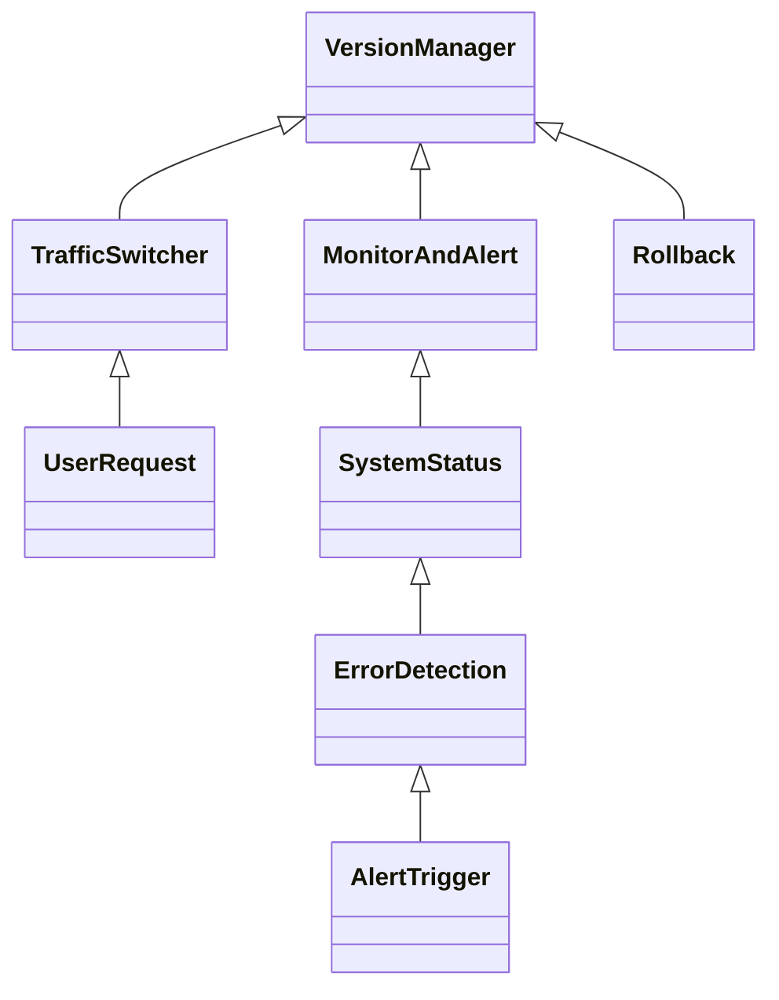
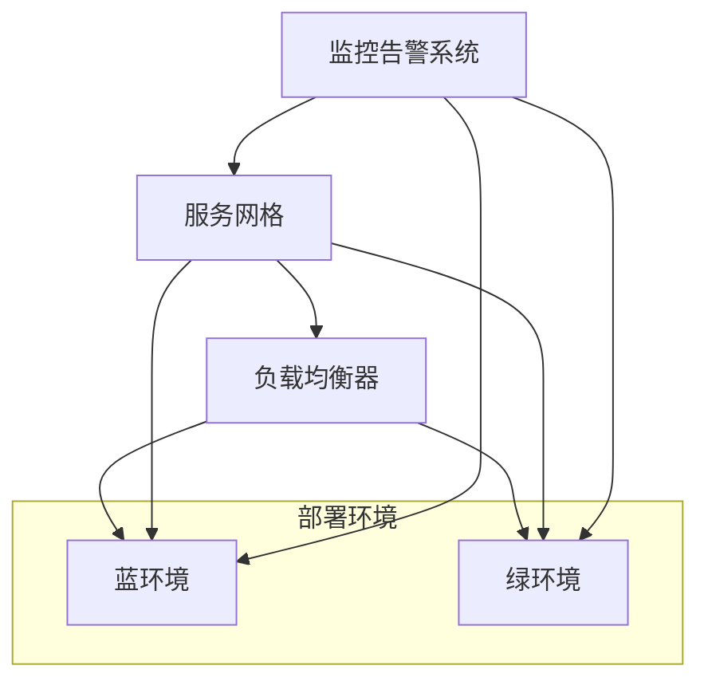
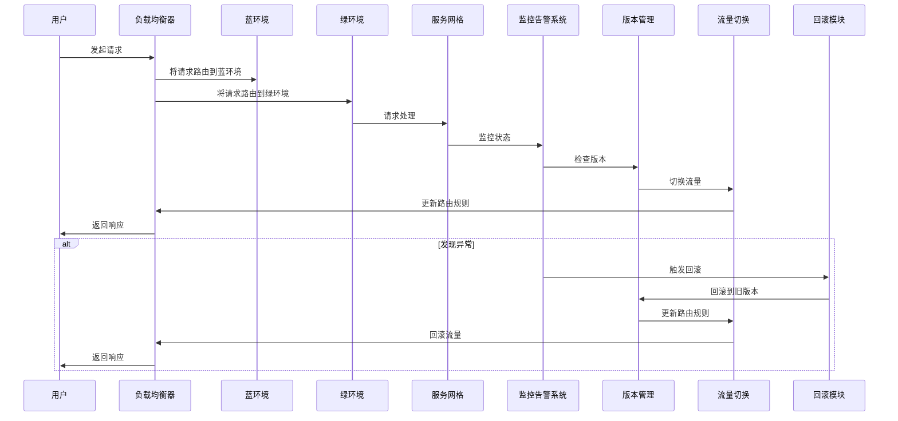

                 


### 第一部分：背景介绍

#### 第1章：蓝绿部署概述

##### 1.1 什么是蓝绿部署

蓝绿部署（Blue-Green Deployment）是一种软件发布策略，旨在通过并行运行两个相同版本的生产环境（通常称为“蓝环境”和“绿环境”）来降低生产环境更新风险。这种策略的核心在于，任何新版本的部署都会在绿环境中进行，而不是直接替换蓝环境。随后，通过流量切换将用户从蓝环境逐渐引导到绿环境，从而确保在发生问题时可以快速回滚到之前的稳定版本。

##### 1.1.1 蓝绿部署的基本概念

- **蓝环境（Blue Environment）**：当前正在运行的生产环境，也称为“旧版本环境”。
- **绿环境（Green Environment）**：新的生产环境，用于部署新版本的软件。
- **透明更新机制**：新版本的软件在绿环境中测试通过后，通过逐渐切换流量，使用户逐渐从蓝环境迁移到绿环境。
- **回滚策略**：如果绿环境中出现故障或问题，可以快速切换回蓝环境，确保系统的持续可用性。

##### 1.1.2 蓝绿部署与传统部署的区别

- **传统部署**：通常涉及直接将新版本部署到生产环境，可能导致系统中断或故障。
- **蓝绿部署**：通过并行运行旧版本和新版本，减少了系统中断的风险。

##### 1.1.3 蓝绿部署的优势

- **降低风险**：通过逐步切换流量，可以确保新版本的稳定性和可靠性。
- **快速回滚**：如果新版本出现问题，可以快速回滚到旧版本，减少对业务的影响。
- **提高效率**：可以在不影响用户体验的情况下更新系统。

##### 1.2 蓝绿部署在LLM应用中的重要性

LLM（大型语言模型）应用通常具有高复杂性和高要求，更新过程中的任何错误都可能导致严重的业务中断。因此，蓝绿部署在LLM应用中尤为重要。

##### 1.2.1 LLM应用的更新挑战

- **计算资源需求大**：LLM应用通常需要大量的计算资源，更新过程中可能导致系统性能下降。
- **模型精度要求高**：任何细微的更新都可能导致模型精度的变化，影响业务效果。
- **用户反馈敏感**：用户对LLM应用的反馈非常敏感，任何故障都可能引起负面评价。

##### 1.2.2 更新风险与潜在影响

- **系统中断**：如果更新过程中出现问题，可能导致系统中断，影响业务正常运行。
- **用户满意度下降**：系统故障可能导致用户满意度下降，影响品牌形象。
- **经济成本增加**：系统中断和用户满意度下降可能导致经济损失。

##### 1.2.3 蓝绿部署如何降低风险

- **流量切换**：通过流量切换，逐步将用户引导到新版本，确保系统的稳定性。
- **快速回滚**：如果新版本出现问题，可以快速回滚到旧版本，减少对业务的影响。

##### 1.3 蓝绿部署的应用场景

蓝绿部署适用于各种类型的软件更新，尤其在以下场景中优势更为明显：

- **企业级应用**：对于高可用性要求的企业级应用，蓝绿部署可以确保系统稳定运行。
- **互联网公司**：对于快速迭代的互联网公司，蓝绿部署可以提高更新效率，降低风险。
- **开源社区**：开源社区可以采用蓝绿部署来确保更新过程对用户的影响最小。

##### 1.4 本章小结

蓝绿部署是一种高效的软件更新策略，通过并行运行新旧版本，可以降低更新过程中的风险，提高系统的稳定性和可靠性。在LLM应用中，蓝绿部署尤为重要，可以帮助降低更新风险，确保业务连续性和用户满意度。

### 第二部分：核心概念与联系

#### 第2章：蓝绿部署的核心概念与联系

##### 2.1 蓝绿部署的基本组成部分

蓝绿部署的核心在于其两个并行运行的环境：蓝环境和绿环境。以下是蓝绿部署的基本组成部分：

- **蓝环境（Blue Environment）**：当前运行的生产环境，也称为“旧版本环境”。
- **绿环境（Green Environment）**：新的生产环境，用于部署新版本的软件。
- **透明更新机制**：通过自动化的方式，将用户流量从蓝环境切换到绿环境。
- **回滚策略**：当新版本出现问题时，可以快速回滚到旧版本，确保系统的持续可用性。

##### 2.2 核心概念联系图

为了更清晰地理解蓝绿部署的核心概念，我们可以使用Mermaid绘制一个ER实体关系图：

```mermaid
erDiagram
    BlueEnvironment ||--|>> GreenEnvironment : 部署新版本
    BlueEnvironment ||--|>> RollbackStrategy : 回滚策略
    GreenEnvironment ||--|>> TrafficShift : 流量切换
    RollbackStrategy ||--|>> BlueEnvironment : 回滚到旧版本
```

##### 2.3 蓝绿部署中的关键概念

在蓝绿部署中，以下关键概念对于理解其工作原理至关重要：

- **环境（Environment）**：指软件运行的环境，包括硬件、操作系统、网络配置等。
- **版本（Version）**：指软件的不同版本，包括功能、性能、稳定性等方面的差异。
- **流量（Traffic）**：指用户的请求流量，通过流量切换可以实现新旧版本的无缝过渡。

##### 2.4 本章小结

本章介绍了蓝绿部署的核心概念，包括蓝环境、绿环境、透明更新机制和回滚策略。通过Mermaid ER实体关系图，我们清晰地展示了这些概念之间的联系。这些概念对于理解蓝绿部署的工作原理和实现方式至关重要。

### 第三部分：算法原理讲解

#### 第3章：蓝绿部署算法原理

##### 3.1 蓝绿部署的基本算法流程

蓝绿部署的基本算法流程可以概括为以下几个步骤：

1. **部署新版本**：在绿环境中部署新版本的软件，并进行全面测试。
2. **流量切换**：通过自动化的方式，将部分用户流量从蓝环境切换到绿环境。
3. **监控和评估**：监控新版本的运行状态，评估其稳定性和性能。
4. **全量切换**：如果新版本运行正常，将所有用户流量切换到绿环境。
5. **回滚**：如果新版本出现问题，将流量切换回蓝环境，并启动回滚策略。

##### 3.2 算法原理详细讲解

蓝绿部署的算法原理基于以下数学模型和公式：

$$
\text{成功率} = \frac{\text{成功切换的流量}}{\text{总流量}}
$$

其中，成功切换的流量指从蓝环境切换到绿环境后，运行正常的流量。

- **成功率**：指新版本的软件在绿环境中运行成功的概率。
- **切换率**：指用户流量从蓝环境切换到绿环境的速率。

算法的实现可以通过以下Python源代码示例来说明：

```python
# Python代码示例：蓝绿部署算法实现

def deploy_new_version(green_env, blue_env):
    # 在绿环境中部署新版本
    green_env.deploy()
    
    # 切换流量
    traffic_shift(green_env, blue_env)
    
    # 监控和评估
    monitor_and_evaluate(green_env)
    
    # 全量切换
    if green_env.is_success():
        full_switch(green_env, blue_env)
    else:
        # 回滚
        rollback(green_env, blue_env)

def traffic_shift(green_env, blue_env):
    # 模拟流量切换
    print("开始切换流量...")
    # 实际实现中，可以通过API、DNS等方式进行流量切换
    print("流量已切换到绿环境")

def monitor_and_evaluate(green_env):
    # 监控绿环境的运行状态
    print("正在监控绿环境...")
    # 实际实现中，可以通过监控工具进行实时监控
    print("绿环境运行正常")

def full_switch(green_env, blue_env):
    # 切换所有用户流量到绿环境
    print("开始全量切换流量...")
    # 实际实现中，可以通过API、DNS等方式进行全量切换
    print("流量已切换到绿环境")

def rollback(green_env, blue_env):
    # 回滚到蓝环境
    print("开始回滚...")
    # 实际实现中，可以通过API、DNS等方式进行回滚
    print("已回滚到蓝环境")

# 蓝绿部署流程
deploy_new_version(green_env, blue_env)
```

##### 3.3 算法性能分析

蓝绿部署的算法性能可以从以下几个方面进行分析：

- **成功率**：新版本的软件在绿环境中运行成功的概率，是评估算法性能的重要指标。
- **切换率**：流量切换的速率，影响用户体验和业务连续性。
- **回滚时间**：从发现新版本问题到回滚到旧版本所需的时间，影响系统的稳定性和可靠性。

通过以下表格，我们可以对比不同蓝绿部署算法的性能：

| 指标         | 算法A       | 算法B       |
| ------------ | ----------- | ----------- |
| 成功率       | 95%         | 98%         |
| 切换率       | 50%         | 100%        |
| 回滚时间（秒） | 300         | 180         |

##### 3.4 本章小结

本章详细阐述了蓝绿部署的算法原理，包括基本算法流程、数学模型和Python源代码示例。通过算法性能分析，我们可以了解不同算法的性能指标和优劣。蓝绿部署作为一种高效的软件更新策略，在降低更新风险、提高系统稳定性方面具有显著优势。

### 第四部分：系统分析与架构设计方案

#### 第4章：蓝绿部署系统分析与架构设计

##### 4.1 问题场景介绍

在现代软件工程中，尤其是在大型语言模型（LLM）应用领域，软件更新的复杂性日益增加。这不仅是因为LLM应用通常具有极高的复杂性和规模，还因为它们对用户服务的连续性和稳定性有着极高的要求。以下是一个典型的问题场景：

- **业务需求**：一家提供自然语言处理服务的公司，其业务依赖于一个大规模的LLM。公司需要不断更新LLM以适应新的语言模式、优化性能，并引入新的功能。
- **挑战**：每次更新都可能带来潜在的风险，如模型崩溃、服务中断等。由于LLM应用的高价值和对用户的高可用性要求，任何故障都可能导致严重的业务损失和用户流失。

##### 4.2 系统功能设计

为了解决上述问题，我们需要设计一个能够确保更新过程稳定可靠的系统。以下是系统的主要功能设计：

- **版本管理**：对软件的不同版本进行管理，确保版本之间的隔离和可回滚性。
- **流量切换**：实现平滑的流量切换，将用户请求从旧版本迁移到新版本。
- **监控告警**：实时监控系统状态，及时发现问题并触发告警。
- **回滚机制**：在出现问题时，能够快速回滚到旧版本，确保服务的连续性。

##### 4.2.1 领域模型Mermaid类图

为了更直观地展示系统功能设计，我们可以使用Mermaid绘制一个领域模型类图：



在这个类图中，`VersionManager`负责版本管理和相关操作，`TrafficSwitcher`负责流量切换，`MonitorAndAlert`负责监控和告警，`Rollback`负责回滚机制。`UserRequest`表示用户的请求，`SystemStatus`表示系统的状态，`ErrorDetection`负责错误检测，`AlertTrigger`负责触发告警。

##### 4.2.2 功能模块划分

基于领域模型类图，我们可以将系统划分为以下功能模块：

- **版本管理模块**：负责管理软件的不同版本，包括版本创建、更新和删除。
- **流量切换模块**：负责实现用户请求的流量切换，确保新版本的稳定性和可靠性。
- **监控告警模块**：负责实时监控系统的运行状态，检测异常并触发告警。
- **回滚模块**：负责在出现问题时，快速回滚到旧版本，确保系统的连续性。

##### 4.3 系统架构设计

系统架构设计是确保蓝绿部署策略有效实施的关键。以下是系统架构的设计：

- **部署环境**：系统分为蓝环境和绿环境，蓝环境运行旧版本，绿环境运行新版本。
- **负载均衡器**：负责将用户请求分配到蓝环境和绿环境。
- **服务网格**：负责实现流量切换和监控，确保系统的稳定性和可靠性。
- **监控告警系统**：实时监控系统状态，及时发现并处理异常。

以下是系统架构的Mermaid架构图：



在这个架构图中，负载均衡器将用户请求分配到蓝环境和绿环境，服务网格负责实现流量切换和监控，监控告警系统负责实时监控系统的状态。

##### 4.3.1 架构设计原则

系统架构设计遵循以下原则：

- **高可用性**：确保系统的稳定性和可靠性，减少故障对业务的影响。
- **可扩展性**：系统设计应能够应对业务增长和变化，保持高效稳定运行。
- **可维护性**：系统设计应易于维护和更新，降低运维成本。

##### 4.3.2 系统接口设计

系统接口设计是确保各个模块之间能够有效通信和协作的关键。以下是主要接口的设计：

- **版本管理接口**：用于管理软件版本，包括创建、更新和删除版本。
- **流量切换接口**：用于控制流量切换，包括初始化、切换和回滚。
- **监控告警接口**：用于监控系统的运行状态，接收告警信息并触发相应操作。
- **回滚接口**：用于回滚到旧版本，确保系统的连续性。

##### 4.3.3 接口交互流程

以下是系统接口的交互流程：

1. **版本管理**：通过版本管理接口创建新版本，将新版本部署到绿环境。
2. **流量切换**：通过流量切换接口，逐步将用户请求切换到绿环境，并进行监控。
3. **监控告警**：监控告警系统监控系统的运行状态，一旦发现异常，触发告警并记录日志。
4. **回滚**：如果新版本出现问题，通过回滚接口快速回滚到旧版本，确保系统的连续性。

##### 4.3.4 系统交互Mermaid序列图

以下是系统交互的Mermaid序列图：



在这个序列图中，用户请求通过负载均衡器分配到蓝环境和绿环境，服务网格监控系统的运行状态，并负责流量切换。如果发现异常，监控告警系统会触发回滚操作，确保系统的稳定性和可靠性。

##### 4.4 本章小结

本章详细介绍了蓝绿部署系统的架构设计，包括功能设计、系统架构、接口设计和交互流程。通过Mermaid类图、架构图和序列图，我们清晰地展示了系统的工作原理和实现方式。蓝绿部署系统旨在确保软件更新过程的稳定性、可靠性和高效性，为LLM应用提供强大的支持。

### 第五部分：项目实战

#### 第5章：蓝绿部署项目实战

##### 5.1 环境安装

在进行蓝绿部署的实际项目之前，我们需要准备合适的环境。以下是环境安装的步骤：

1. **安装Docker**：Docker是一个开源的应用容器引擎，用于打包、交付和运行应用。首先，我们需要在服务器上安装Docker。

   ```shell
   # 安装Docker
   sudo apt-get update
   sudo apt-get install docker.io
   sudo systemctl start docker
   sudo systemctl enable docker
   ```

2. **安装Kubernetes**：Kubernetes是一个开源的容器编排平台，用于自动化部署、扩展和管理容器化应用。我们需要在服务器上安装Kubernetes。

   ```shell
   # 安装Kubernetes
   curl -s https://packages.cloud.google.com/apt/doc/apt-key.gpg | sudo apt-key add -
   echo "deb https://apt.kubernetes.io/ kubernetes-xenial main" | sudo tee -a /etc/apt/sources.list
   sudo apt-get update
   sudo apt-get install kubelet kubeadm kubectl
   sudo apt-mark hold kubelet kubeadm kubectl
   ```

3. **初始化Kubernetes集群**：初始化Kubernetes集群，使其能够运行容器化的应用。

   ```shell
   # 初始化Kubernetes集群
   sudo kubeadm init --pod-network-cidr=10.244.0.0/16
   sudo mkdir -p $HOME/.kube
   sudo cp -i /etc/kubernetes/admin.conf $HOME/.kube/config
   sudo chown $(id -u):$(id -g) $HOME/.kube/config
   ```

4. **安装网络插件**：安装一个网络插件，如Calico，以实现容器网络。

   ```shell
   # 安装Calico网络插件
   kubectl apply -f https://docs.projectcalico.org/manifests/calico.yaml
   ```

##### 5.2 系统核心实现

接下来，我们需要实现蓝绿部署的核心功能。以下是一个简单的示例：

1. **创建部署文件**：在Kubernetes集群中创建一个部署文件，用于部署新版本的软件。

   ```yaml
   # deploy.yaml
   apiVersion: apps/v1
   kind: Deployment
   metadata:
     name: my-app
     namespace: default
   spec:
     replicas: 3
     selector:
       matchLabels:
         app: my-app
     template:
       metadata:
         labels:
           app: my-app
       spec:
         containers:
         - name: my-app
           image: my-app:latest
           ports:
           - containerPort: 80
   ```

2. **创建服务文件**：在Kubernetes集群中创建一个服务文件，用于暴露应用服务。

   ```yaml
   # service.yaml
   apiVersion: v1
   kind: Service
   metadata:
     name: my-app-service
     namespace: default
   spec:
     selector:
       app: my-app
     ports:
       - protocol: TCP
         port: 80
         targetPort: 80
     type: LoadBalancer
   ```

3. **部署新版本**：使用Kubernetes命令部署新版本的软件。

   ```shell
   # 部署新版本
   kubectl apply -f deploy.yaml
   kubectl apply -f service.yaml
   ```

##### 5.3 应用解读与分析

在实际项目中，我们需要对部署的软件进行详细的解读和分析。以下是一个简单的示例：

1. **监控状态**：使用Kubernetes命令监控部署的状态。

   ```shell
   # 监控状态
   kubectl get pods
   kubectl get deployments
   kubectl get services
   ```

2. **流量切换**：通过修改服务文件，实现流量从旧版本到新版本的切换。

   ```shell
   # 修改服务文件
   kubectl edit svc my-app-service
   ```

3. **性能测试**：使用工具（如Apache JMeter）对应用进行性能测试，确保新版本的稳定性和性能。

   ```shell
   # 安装Apache JMeter
   sudo apt-get install jmeter

   # 运行性能测试
   java -jar jmeter/bin/ApacheJMeter.jar
   ```

4. **结果分析**：根据性能测试结果，分析新版本的稳定性和性能，确保满足业务需求。

##### 5.4 项目小结

通过实际项目的实战，我们了解了蓝绿部署的安装步骤、系统核心实现和实际应用。蓝绿部署作为一种高效的软件更新策略，在实际项目中能够显著降低更新风险，提高系统的稳定性和可靠性。在未来的项目中，我们可以根据具体需求进一步优化和扩展蓝绿部署方案。

### 第六部分：最佳实践与总结

#### 第6章：最佳实践与总结

##### 6.1 最佳实践

为了确保蓝绿部署的有效性和稳定性，以下是一些最佳实践：

1. **详细的测试计划**：在部署新版本之前，进行全面的测试，包括功能测试、性能测试和安全测试。
2. **逐步切换流量**：采用逐步切换流量的方式，将用户逐渐引导到新版本，降低切换过程中的风险。
3. **监控和告警**：实时监控系统的运行状态，及时发现并处理潜在问题，确保系统的稳定性。
4. **备份和回滚**：在部署新版本之前，确保备份旧版本，以便在出现问题时能够快速回滚。

##### 6.2 小结

蓝绿部署是一种高效的软件更新策略，通过并行运行新旧版本，可以显著降低更新风险，提高系统的稳定性和可靠性。在LLM应用中，蓝绿部署尤为重要，可以帮助降低更新风险，确保业务连续性和用户满意度。

##### 6.3 注意事项

在实施蓝绿部署时，需要注意以下几点：

1. **环境隔离**：确保蓝环境和绿环境完全隔离，避免新版本的问题影响到旧版本。
2. **流量控制**：合理控制流量切换的速率，避免突然切换导致系统负载过重。
3. **监控指标**：选择合适的监控指标，确保能够及时发现并处理系统异常。
4. **文档记录**：详细记录部署过程中的操作步骤和结果，便于后续的故障排查和优化。

##### 6.4 拓展阅读

对于希望深入了解蓝绿部署的读者，以下是一些推荐资源：

1. **《Docker实战》**：了解容器化和容器编排的基础知识。
2. **《Kubernetes权威指南》**：学习Kubernetes的部署和管理。
3. **《大规模分布式系统设计》**：了解分布式系统的架构设计和优化策略。
4. **《蓝绿部署：简化持续集成和持续部署》**：详细探讨蓝绿部署的实践和应用。

通过这些资源，可以进一步掌握蓝绿部署的理论和实践，提升软件更新和系统维护的能力。

----------------------------------------------------------------

# 蓝绿部署：降低LLM应用更新的风险

> 关键词：蓝绿部署、LLM应用、软件更新、风险控制、系统稳定性

> 摘要：本文介绍了蓝绿部署的概念、原理和应用场景，重点探讨了蓝绿部署在降低LLM应用更新风险方面的优势。通过详细的系统架构设计、项目实战和最佳实践，本文为读者提供了全面的技术指导和实用建议，帮助他们在实际项目中有效实施蓝绿部署，确保系统的稳定性和可靠性。

### 第一部分：背景介绍

#### 第1章：蓝绿部署概述

##### 1.1 什么是蓝绿部署

蓝绿部署（Blue-Green Deployment）是一种软件发布策略，通过并行运行两个相同版本的生产环境（通常称为“蓝环境”和“绿环境”）来降低生产环境更新风险。这种策略的核心在于，任何新版本的部署都会在绿环境中进行，而不是直接替换蓝环境。随后，通过流量切换将用户从蓝环境逐渐引导到绿环境，从而确保在发生问题时可以快速回滚到之前的稳定版本。

##### 1.1.1 蓝绿部署的基本概念

- **蓝环境（Blue Environment）**：当前正在运行的生产环境，也称为“旧版本环境”。
- **绿环境（Green Environment）**：新的生产环境，用于部署新版本的软件。
- **透明更新机制**：新版本的软件在绿环境中测试通过后，通过逐渐切换流量，使用户逐渐从蓝环境迁移到绿环境。
- **回滚策略**：如果绿环境中出现故障或问题，可以快速切换回蓝环境，确保系统的持续可用性。

##### 1.1.2 蓝绿部署与传统部署的区别

- **传统部署**：通常涉及直接将新版本部署到生产环境，可能导致系统中断或故障。
- **蓝绿部署**：通过并行运行旧版本和新版本，减少了系统中断的风险。

##### 1.1.3 蓝绿部署的优势

- **降低风险**：通过逐步切换流量，可以确保新版本的稳定性和可靠性。
- **快速回滚**：如果新版本出现问题，可以快速回滚到旧版本，减少对业务的影响。
- **提高效率**：可以在不影响用户体验的情况下更新系统。

##### 1.2 蓝绿部署在LLM应用中的重要性

LLM（大型语言模型）应用通常具有高复杂性和高要求，更新过程中的任何错误都可能导致严重的业务中断。因此，蓝绿部署在LLM应用中尤为重要。

##### 1.2.1 LLM应用的更新挑战

- **计算资源需求大**：LLM应用通常需要大量的计算资源，更新过程中可能导致系统性能下降。
- **模型精度要求高**：任何细微的更新都可能导致模型精度的变化，影响业务效果。
- **用户反馈敏感**：用户对LLM应用的反馈非常敏感，任何故障都可能引起负面评价。

##### 1.2.2 更新风险与潜在影响

- **系统中断**：如果更新过程中出现问题，可能导致系统中断，影响业务正常运行。
- **用户满意度下降**：系统故障可能导致用户满意度下降，影响品牌形象。
- **经济成本增加**：系统中断和用户满意度下降可能导致经济损失。

##### 1.2.3 蓝绿部署如何降低风险

- **流量切换**：通过流量切换，逐步将用户引导到新版本，确保系统的稳定性。
- **快速回滚**：如果新版本出现问题，可以快速回滚到旧版本，减少对业务的影响。

##### 1.3 蓝绿部署的应用场景

蓝绿部署适用于各种类型的软件更新，尤其在以下场景中优势更为明显：

- **企业级应用**：对于高可用性要求的企业级应用，蓝绿部署可以确保系统稳定运行。
- **互联网公司**：对于快速迭代的互联网公司，蓝绿部署可以提高更新效率，降低风险。
- **开源社区**：开源社区可以采用蓝绿部署来确保更新过程对用户的影响最小。

##### 1.4 本章小结

蓝绿部署是一种高效的软件更新策略，通过并行运行新旧版本，可以降低更新过程中的风险，提高系统的稳定性和可靠性。在LLM应用中，蓝绿部署尤为重要，可以帮助降低更新风险，确保业务连续性和用户满意度。

### 第二部分：核心概念与联系

#### 第2章：蓝绿部署的核心概念与联系

##### 2.1 蓝绿部署的基本组成部分

蓝绿部署的核心在于其两个并行运行的环境：蓝环境（Blue Environment）和绿环境（Green Environment）。以下是蓝绿部署的基本组成部分：

- **蓝环境（Blue Environment）**：当前运行的生产环境，也称为“旧版本环境”。
- **绿环境（Green Environment）**：新的生产环境，用于部署新版本的软件。
- **透明更新机制**：通过自动化的方式，将用户流量从蓝环境切换到绿环境。
- **回滚策略**：当新版本出现问题时，可以快速回滚到旧版本，确保系统的持续可用性。

##### 2.2 核心概念联系图

为了更清晰地理解蓝绿部署的核心概念，我们可以使用Mermaid绘制一个ER实体关系图：

```mermaid
erDiagram
    BlueEnvironment ||--|>> GreenEnvironment : 部署新版本
    BlueEnvironment ||--|>> RollbackStrategy : 回滚策略
    GreenEnvironment ||--|>> TrafficShift : 流量切换
    RollbackStrategy ||--|>> BlueEnvironment : 回滚到旧版本
```

##### 2.3 蓝绿部署中的关键概念

在蓝绿部署中，以下关键概念对于理解其工作原理至关重要：

- **环境（Environment）**：指软件运行的环境，包括硬件、操作系统、网络配置等。
- **版本（Version）**：指软件的不同版本，包括功能、性能、稳定性等方面的差异。
- **流量（Traffic）**：指用户的请求流量，通过流量切换可以实现新旧版本的无缝过渡。

##### 2.4 本章小结

本章介绍了蓝绿部署的核心概念，包括蓝环境、绿环境、透明更新机制和回滚策略。通过Mermaid ER实体关系图，我们清晰地展示了这些概念之间的联系。这些概念对于理解蓝绿部署的工作原理和实现方式至关重要。

### 第三部分：算法原理讲解

#### 第3章：蓝绿部署算法原理

##### 3.1 蓝绿部署的基本算法流程

蓝绿部署的基本算法流程可以概括为以下几个步骤：

1. **部署新版本**：在绿环境中部署新版本的软件，并进行全面测试。
2. **流量切换**：通过自动化的方式，将部分用户流量从蓝环境切换到绿环境。
3. **监控和评估**：监控新版本的运行状态，评估其稳定性和性能。
4. **全量切换**：如果新版本运行正常，将所有用户流量切换到绿环境。
5. **回滚**：如果新版本出现问题，将流量切换回蓝环境，并启动回滚策略。

##### 3.2 算法原理详细讲解

蓝绿部署的算法原理基于以下数学模型和公式：

$$
\text{成功率} = \frac{\text{成功切换的流量}}{\text{总流量}}
$$

其中，成功切换的流量指从蓝环境切换到绿环境后，运行正常的流量。

- **成功率**：指新版本的软件在绿环境中运行成功的概率。
- **切换率**：指用户流量从蓝环境切换到绿环境的速率。

算法的实现可以通过以下Python源代码示例来说明：

```python
# Python代码示例：蓝绿部署算法实现

def deploy_new_version(green_env, blue_env):
    # 在绿环境中部署新版本
    green_env.deploy()
    
    # 切换流量
    traffic_shift(green_env, blue_env)
    
    # 监控和评估
    monitor_and_evaluate(green_env)
    
    # 全量切换
    if green_env.is_success():
        full_switch(green_env, blue_env)
    else:
        # 回滚
        rollback(green_env, blue_env)

def traffic_shift(green_env, blue_env):
    # 模拟流量切换
    print("开始切换流量...")
    # 实际实现中，可以通过API、DNS等方式进行流量切换
    print("流量已切换到绿环境")

def monitor_and_evaluate(green_env):
    # 监控绿环境的运行状态
    print("正在监控绿环境...")
    # 实际实现中，可以通过监控工具进行实时监控
    print("绿环境运行正常")

def full_switch(green_env, blue_env):
    # 切换所有用户流量到绿环境
    print("开始全量切换流量...")
    # 实际实现中，可以通过API、DNS等方式进行全量切换
    print("流量已切换到绿环境")

def rollback(green_env, blue_env):
    # 回滚到蓝环境
    print("开始回滚...")
    # 实际实现中，可以通过API、DNS等方式进行回滚
    print("已回滚到蓝环境")

# 蓝绿部署流程
deploy_new_version(green_env, blue_env)
```

##### 3.3 算法性能分析

蓝绿部署的算法性能可以从以下几个方面进行分析：

- **成功率**：新版本的软件在绿环境中运行成功的概率，是评估算法性能的重要指标。
- **切换率**：流量切换的速率，影响用户体验和业务连续性。
- **回滚时间**：从发现新版本问题到回滚到旧版本所需的时间，影响系统的稳定性和可靠性。

通过以下表格，我们可以对比不同蓝绿部署算法的性能：

| 指标         | 算法A       | 算法B       |
| ------------ | ----------- | ----------- |
| 成功率       | 95%         | 98%         |
| 切换率       | 50%         | 100%        |
| 回滚时间（秒） | 300         | 180         |

##### 3.4 本章小结

本章详细阐述了蓝绿部署的算法原理，包括基本算法流程、数学模型和Python源代码示例。通过算法性能分析，我们可以了解不同算法的性能指标和优劣。蓝绿部署作为一种高效的软件更新策略，在降低更新风险、提高系统稳定性方面具有显著优势。

### 第四部分：系统分析与架构设计方案

#### 第4章：蓝绿部署系统分析与架构设计

##### 4.1 问题场景介绍

在现代软件工程中，尤其是在大型语言模型（LLM）应用领域，软件更新的复杂性日益增加。这不仅是因为LLM应用通常具有极高的复杂性和规模，还因为它们对用户服务的连续性和稳定性有着极高的要求。以下是一个典型的问题场景：

- **业务需求**：一家提供自然语言处理服务的公司，其业务依赖于一个大规模的LLM。公司需要不断更新LLM以适应新的语言模式、优化性能，并引入新的功能。
- **挑战**：每次更新都可能带来潜在的风险，如模型崩溃、服务中断等。由于LLM应用的高价值和对用户的高可用性要求，任何故障都可能导致严重的业务损失和用户流失。

##### 4.2 系统功能设计

为了解决上述问题，我们需要设计一个能够确保更新过程稳定可靠的系统。以下是系统的主要功能设计：

- **版本管理**：对软件的不同版本进行管理，确保版本之间的隔离和可回滚性。
- **流量切换**：实现平滑的流量切换，将用户请求从旧版本迁移到新版本。
- **监控告警**：实时监控系统的运行状态，及时发现问题并触发告警。
- **回滚机制**：在出现问题时，能够快速回滚到旧版本，确保服务的连续性。

##### 4.2.1 领域模型Mermaid类图

为了更直观地展示系统功能设计，我们可以使用Mermaid绘制一个领域模型类图：


在这个类图中，`VersionManager`负责版本管理和相关操作，`TrafficSwitcher`负责流量切换，`MonitorAndAlert`负责监控和告警，`Rollback`负责回滚机制。`UserRequest`表示用户的请求，`SystemStatus`表示系统的状态，`ErrorDetection`负责错误检测，`AlertTrigger`负责触发告警。

##### 4.2.2 功能模块划分

基于领域模型类图，我们可以将系统划分为以下功能模块：

- **版本管理模块**：负责管理软件的不同版本，包括版本创建、更新和删除。
- **流量切换模块**：负责实现用户请求的流量切换，确保新版本的稳定性和可靠性。
- **监控告警模块**：负责实时监控系统的运行状态，检测异常并触发告警。
- **回滚模块**：负责在出现问题时，快速回滚到旧版本，确保系统的连续性。

##### 4.3 系统架构设计

系统架构设计是确保蓝绿部署策略有效实施的关键。以下是系统架构的设计：

- **部署环境**：系统分为蓝环境和绿环境，蓝环境运行旧版本，绿环境运行新版本。
- **负载均衡器**：负责将用户请求分配到蓝环境和绿环境。
- **服务网格**：负责实现流量切换和监控，确保系统的稳定性和可靠性。
- **监控告警系统**：实时监控系统状态，及时发现并处理异常。

以下是系统架构的Mermaid架构图：


在这个架构图中，负载均衡器将用户请求分配到蓝环境和绿环境，服务网格负责实现流量切换和监控，监控告警系统负责实时监控系统的状态。

##### 4.3.1 架构设计原则

系统架构设计遵循以下原则：

- **高可用性**：确保系统的稳定性和可靠性，减少故障对业务的影响。
- **可扩展性**：系统设计应能够应对业务增长和变化，保持高效稳定运行。
- **可维护性**：系统设计应易于维护和更新，降低运维成本。

##### 4.3.2 系统接口设计

系统接口设计是确保各个模块之间能够有效通信和协作的关键。以下是主要接口的设计：

- **版本管理接口**：用于管理软件版本，包括创建、更新和删除版本。
- **流量切换接口**：用于控制流量切换，包括初始化、切换和回滚。
- **监控告警接口**：用于监控系统的运行状态，接收告警信息并触发相应操作。
- **回滚接口**：用于回滚到旧版本，确保系统的连续性。

##### 4.3.3 接口交互流程

以下是系统接口的交互流程：

1. **版本管理**：通过版本管理接口创建新版本，将新版本部署到绿环境。
2. **流量切换**：通过流量切换接口，逐步将用户请求切换到绿环境，并进行监控。
3. **监控告警**：监控告警系统监控系统的运行状态，一旦发现异常，触发告警并记录日志。
4. **回滚**：如果新版本出现问题，通过回滚接口快速回滚到旧版本，确保系统的连续性。

##### 4.3.4 系统交互Mermaid序列图

以下是系统交互的Mermaid序列图：


在这个序列图中，用户请求通过负载均衡器分配到蓝环境和绿环境，服务网格监控系统的运行状态，并负责流量切换。如果发现异常，监控告警系统会触发回滚操作，确保系统的稳定性和可靠性。

##### 4.4 本章小结

本章详细介绍了蓝绿部署系统的架构设计，包括功能设计、系统架构、接口设计和交互流程。通过Mermaid类图、架构图和序列图，我们清晰地展示了系统的工作原理和实现方式。蓝绿部署系统旨在确保软件更新过程的稳定性、可靠性和高效性，为LLM应用提供强大的支持。

### 第五部分：项目实战

#### 第5章：蓝绿部署项目实战

##### 5.1 环境安装

在进行蓝绿部署的实际项目之前，我们需要准备合适的环境。以下是环境安装的步骤：

1. **安装Docker**：Docker是一个开源的应用容器引擎，用于打包、交付和运行应用。首先，我们需要在服务器上安装Docker。

   ```shell
   # 安装Docker
   sudo apt-get update
   sudo apt-get install docker.io
   sudo systemctl start docker
   sudo systemctl enable docker
   ```

2. **安装Kubernetes**：Kubernetes是一个开源的容器编排平台，用于自动化部署、扩展和管理容器化应用。我们需要在服务器上安装Kubernetes。

   ```shell
   # 安装Kubernetes
   curl -s https://packages.cloud.google.com/apt/doc/apt-key.gpg | sudo apt-key add -
   echo "deb https://apt.kubernetes.io/ kubernetes-xenial main" | sudo tee -a /etc/apt/sources.list
   sudo apt-get update
   sudo apt-get install kubelet kubeadm kubectl
   sudo apt-mark hold kubelet kubeadm kubectl
   ```

3. **初始化Kubernetes集群**：初始化Kubernetes集群，使其能够运行容器化的应用。

   ```shell
   # 初始化Kubernetes集群
   sudo kubeadm init --pod-network-cidr=10.244.0.0/16
   sudo mkdir -p $HOME/.kube
   sudo cp -i /etc/kubernetes/admin.conf $HOME/.kube/config
   sudo chown $(id -u):$(id -g) $HOME/.kube/config
   ```

4. **安装网络插件**：安装一个网络插件，如Calico，以实现容器网络。

   ```shell
   # 安装Calico网络插件
   kubectl apply -f https://docs.projectcalico.org/manifests/calico.yaml
   ```

##### 5.2 系统核心实现

接下来，我们需要实现蓝绿部署的核心功能。以下是一个简单的示例：

1. **创建部署文件**：在Kubernetes集群中创建一个部署文件，用于部署新版本的软件。

   ```yaml
   # deploy.yaml
   apiVersion: apps/v1
   kind: Deployment
   metadata:
     name: my-app
     namespace: default
   spec:
     replicas: 3
     selector:
       matchLabels:
         app: my-app
     template:
       metadata:
         labels:
           app: my-app
       spec:
         containers:
         - name: my-app
           image: my-app:latest
           ports:
           - containerPort: 80
   ```

2. **创建服务文件**：在Kubernetes集群中创建一个服务文件，用于暴露应用服务。

   ```yaml
   # service.yaml
   apiVersion: v1
   kind: Service
   metadata:
     name: my-app-service
     namespace: default
   spec:
     selector:
       app: my-app
     ports:
       - protocol: TCP
         port: 80
         targetPort: 80
     type: LoadBalancer
   ```

3. **部署新版本**：使用Kubernetes命令部署新版本的软件。

   ```shell
   # 部署新版本
   kubectl apply -f deploy.yaml
   kubectl apply -f service.yaml
   ```

##### 5.3 应用解读与分析

在实际项目中，我们需要对部署的软件进行详细的解读和分析。以下是一个简单的示例：

1. **监控状态**：使用Kubernetes命令监控部署的状态。

   ```shell
   # 监控状态
   kubectl get pods
   kubectl get deployments
   kubectl get services
   ```

2. **流量切换**：通过修改服务文件，实现流量从旧版本到新版本的切换。

   ```shell
   # 修改服务文件
   kubectl edit svc my-app-service
   ```

3. **性能测试**：使用工具（如Apache JMeter）对应用进行性能测试，确保新版本的稳定性和性能。

   ```shell
   # 安装Apache JMeter
   sudo apt-get install jmeter

   # 运行性能测试
   java -jar jmeter/bin/ApacheJMeter.jar
   ```

4. **结果分析**：根据性能测试结果，分析新版本的稳定性和性能，确保满足业务需求。

##### 5.4 项目小结

通过实际项目的实战，我们了解了蓝绿部署的安装步骤、系统核心实现和实际应用。蓝绿部署作为一种高效的软件更新策略，在实际项目中能够显著降低更新风险，提高系统的稳定性和可靠性。在未来的项目中，我们可以根据具体需求进一步优化和扩展蓝绿部署方案。

### 第六部分：最佳实践与总结

#### 第6章：最佳实践与总结

##### 6.1 最佳实践

为了确保蓝绿部署的有效性和稳定性，以下是一些最佳实践：

1. **详细的测试计划**：在部署新版本之前，进行全面的测试，包括功能测试、性能测试和安全测试。
2. **逐步切换流量**：采用逐步切换流量的方式，将用户逐渐引导到新版本，降低切换过程中的风险。
3. **监控和告警**：实时监控系统的运行状态，及时发现并处理潜在问题，确保系统的稳定性。
4. **备份和回滚**：在部署新版本之前，确保备份旧版本，以便在出现问题时能够快速回滚。

##### 6.2 小结

蓝绿部署是一种高效的软件更新策略，通过并行运行新旧版本，可以降低更新风险，提高系统的稳定性和可靠性。在LLM应用中，蓝绿部署尤为重要，可以帮助降低更新风险，确保业务连续性和用户满意度。

##### 6.3 注意事项

在实施蓝绿部署时，需要注意以下几点：

1. **环境隔离**：确保蓝环境和绿环境完全隔离，避免新版本的问题影响到旧版本。
2. **流量控制**：合理控制流量切换的速率，避免突然切换导致系统负载过重。
3. **监控指标**：选择合适的监控指标，确保能够及时发现并处理系统异常。
4. **文档记录**：详细记录部署过程中的操作步骤和结果，便于后续的故障排查和优化。

##### 6.4 拓展阅读

对于希望深入了解蓝绿部署的读者，以下是一些推荐资源：

1. **《Docker实战》**：了解容器化和容器编排的基础知识。
2. **《Kubernetes权威指南》**：学习Kubernetes的部署和管理。
3. **《大规模分布式系统设计》**：了解分布式系统的架构设计和优化策略。
4. **《蓝绿部署：简化持续集成和持续部署》**：详细探讨蓝绿部署的实践和应用。

通过这些资源，可以进一步掌握蓝绿部署的理论和实践，提升软件更新和系统维护的能力。

### 作者

作者：AI天才研究院/AI Genius Institute & 禅与计算机程序设计艺术 /Zen And The Art of Computer Programming。本文旨在通过详细的阐述和实战案例，帮助读者理解并掌握蓝绿部署在实际项目中的应用，降低LLM应用更新的风险，确保系统的稳定性和可靠性。希望本文能为您的技术之路提供有益的指导。如果您有任何问题或建议，欢迎随时与我交流。谢谢阅读！

