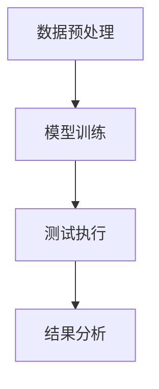
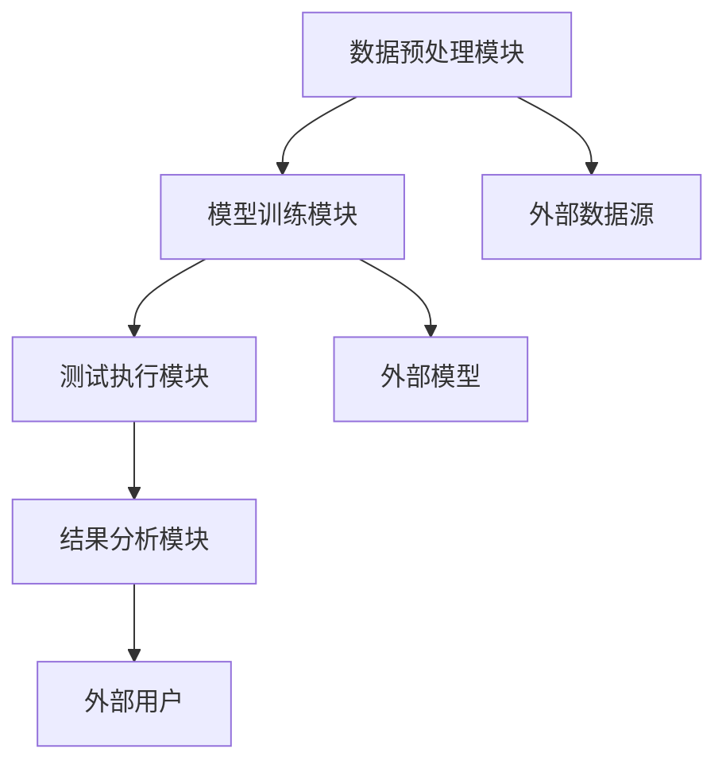
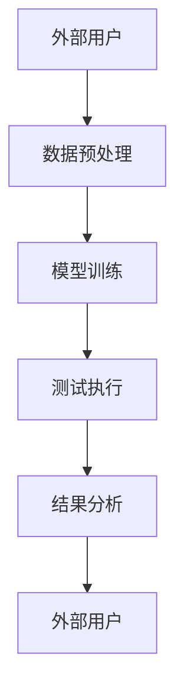

                 

# 视觉理解测试：评估LLM处理图像信息的能力

> 关键词：视觉理解测试、评估、LLM、图像信息处理、深度学习、模型优化

> 摘要：本文探讨了视觉理解测试的背景、目的、方法和应用。通过详细介绍测试方法、评估指标、测试数据集和测试流程，本文旨在为深度学习模型在处理图像信息方面的能力评估提供指导，帮助研究人员和开发者优化和改进模型。

## 第一部分：背景介绍

### 1.1 问题背景

随着深度学习和计算机视觉技术的飞速发展，视觉理解在人工智能领域的重要性日益凸显。视觉理解是指机器通过处理图像或视频数据，从中提取信息、理解场景、识别物体和事件等能力。近年来，深度学习模型如卷积神经网络（CNN）在图像识别、目标检测、图像分割等领域取得了显著的成果，使得机器在视觉理解任务上的表现逐渐接近甚至超越人类。

### 1.2 问题描述

尽管深度学习模型在视觉理解方面取得了巨大的进步，但如何评估这些模型在实际场景中的表现仍然是一个挑战。评估模型的能力不仅需要准确度，还需要考虑模型的鲁棒性、泛化能力、响应速度等因素。因此，设计一套科学、全面、可重复的视觉理解测试方法，对于评估和优化深度学习模型具有重要意义。

### 1.3 问题解决

本书《视觉理解测试：评估LLM处理图像信息的能力》旨在探讨如何通过一系列的测试方法和评估指标，来全面评估深度学习模型在处理图像信息方面的能力。本书将详细介绍视觉理解测试的背景、目的、方法，以及如何运用这些测试来指导模型的优化和改进。

### 1.4 边界与外延

视觉理解测试不仅适用于深度学习模型，也适用于其他类型的人工智能系统，如计算机视觉系统、自动驾驶系统、机器人视觉系统等。此外，视觉理解测试可以应用于多种视觉任务，如图像分类、目标检测、图像分割、姿态估计等。

### 1.5 概念结构与核心要素组成

视觉理解测试的核心概念包括测试方法、评估指标、测试数据集、测试流程等。测试方法分为离线测试和在线测试，评估指标包括准确度、召回率、F1值、精度、覆盖率等。测试数据集需要覆盖各种场景和视觉任务，以确保测试的全面性和代表性。测试流程包括数据预处理、模型训练、测试执行、结果分析等步骤。

## 第二部分：核心概念与联系

### 2.1 测试方法

#### 2.1.1 离线测试

离线测试是指在模型部署前进行的测试，通常使用预先收集和整理好的数据集进行。离线测试的优点是测试结果稳定，可以重复进行，但缺点是测试数据集可能无法完全覆盖实际场景。

##### 2.1.1.1 数据集选择

数据集选择是离线测试的关键步骤。公开数据集如ImageNet、COCO等，可以提供丰富的标注数据，但可能无法完全满足特定任务的需求。因此，自定义数据集也是离线测试的一种选择。

##### 2.1.1.2 测试流程

离线测试的流程包括数据预处理、模型部署、测试执行和结果分析。数据预处理包括数据清洗、数据增强和数据归一化。模型部署是将训练好的模型部署到测试环境中。测试执行是使用测试数据集对模型进行测试。结果分析是对测试结果进行统计和分析。

#### 2.1.2 在线测试

在线测试是指在模型部署后进行的实时测试，通常需要与实际应用场景相结合。在线测试的优点是可以实时反馈测试结果，但缺点是测试结果可能受到实际应用场景的影响。

##### 2.1.2.1 实时反馈

实时反馈是在线测试的核心。通过实时收集和分析测试结果，可以快速发现模型的问题，并进行调整和优化。

##### 2.1.2.2 动态调整

动态调整是指根据实时反馈，对模型进行动态调整，以适应不同的应用场景。

##### 2.1.2.3 测试策略

在线测试的测试策略需要考虑实际应用场景的需求，例如测试频率、测试范围和测试指标等。

### 2.2 评估指标

评估指标是衡量模型性能的重要标准。常用的评估指标包括准确度、召回率、F1值、精度和覆盖率等。

#### 2.2.1 准确度（Accuracy）

准确度是指模型在测试数据集上的预测正确率。计算方法为：$$\text{Accuracy} = \frac{\text{预测正确数}}{\text{总预测数}}$$

准确度的优点是可以直观地反映模型的性能，但缺点是在类别不平衡时可能无法准确评估模型的性能。

#### 2.2.2 召回率（Recall）

召回率是指模型在测试数据集上正确召回的正例比例。计算方法为：$$\text{Recall} = \frac{\text{正确召回的正例数}}{\text{所有正例数}}$$

召回率的优点是可以更好地评估模型对正例的识别能力，但缺点是在类别不平衡时可能较高。

#### 2.2.3 F1值（F1 Score）

F1值是准确度和召回率的调和平均，用于综合评估模型的性能。计算方法为：$$\text{F1 Score} = 2 \times \frac{\text{Accuracy} \times \text{Recall}}{\text{Accuracy} + \text{Recall}}$$

F1值的优点是可以平衡准确度和召回率，但缺点是在类别不平衡时可能仍然较低。

#### 2.2.4 精度（Precision）

精度是指模型在测试数据集上正确预测的正例比例。计算方法为：$$\text{Precision} = \frac{\text{正确预测的正例数}}{\text{预测为正例的总数}}$$

精度的优点是可以更好地评估模型对正例的预测准确性，但缺点是在类别不平衡时可能较低。

#### 2.2.5 覆盖率（Coverage）

覆盖率是指模型在测试数据集上正确识别的样本数量占总样本数量的比例。计算方法为：$$\text{Coverage} = \frac{\text{正确识别的样本数}}{\text{总样本数}}$$

覆盖率的优点是可以评估模型对样本的覆盖能力，但缺点是在类别不平衡时可能较低。

### 2.3 测试数据集

测试数据集是评估模型性能的基础。测试数据集的选择需要考虑数据的多样性、质量和大小。

#### 2.3.1 数据集选择标准

数据集选择标准包括数据多样性、数据质量和数据集大小。数据多样性要求数据集涵盖各种场景和视觉任务；数据质量要求数据集标注准确、数据完整；数据集大小要求足够大，以保证测试的全面性和代表性。

#### 2.3.2 常见数据集介绍

常见的测试数据集包括ImageNet、COCO、VGG Image Segmentation Database等。ImageNet是一个广泛使用的大型图像识别数据集，包含数百万张图像；COCO是一个包含多种视觉任务的图像数据集，包括物体检测、分割、姿态估计等；VGG Image Segmentation Database是一个图像分割数据集，包含大量图像和对应的分割标签。

### 2.4 测试流程

测试流程包括数据预处理、模型训练、测试执行和结果分析。

#### 2.4.1 数据预处理

数据预处理是测试流程的第一步，包括数据清洗、数据增强和数据归一化。数据清洗旨在去除噪声数据和错误标注；数据增强旨在增加数据多样性，提高模型的泛化能力；数据归一化旨在将数据转换为统一的标准，以提高模型的性能。

#### 2.4.2 模型训练

模型训练是测试流程的核心，包括模型选择、模型优化和模型评估。模型选择根据具体任务选择合适的模型；模型优化通过调整超参数和模型结构，提高模型性能；模型评估通过测试数据集评估模型性能。

#### 2.4.3 测试执行

测试执行是测试流程的第三步，包括测试策略、测试指标和结果记录。测试策略根据实际应用场景设计；测试指标根据任务需求选择；结果记录包括测试结果和性能指标。

#### 2.4.4 结果分析

结果分析是测试流程的最后一步，包括结果可视化、结果解读和问题定位。结果可视化通过图表展示测试结果；结果解读分析测试结果和性能指标；问题定位找出模型存在的问题，并进行优化。

## 第三部分：算法原理讲解

### 3.1 算法原理

视觉理解测试的核心算法是深度学习模型，如卷积神经网络（CNN）。CNN通过卷积层、池化层和全连接层等结构，对图像数据进行特征提取和分类。本文以CNN为例，介绍其算法原理。

#### 3.1.1 卷积层

卷积层是CNN的核心部分，通过卷积操作提取图像特征。卷积操作将输入图像与卷积核进行卷积运算，生成特征图。卷积层的参数包括卷积核大小、步长和填充方式等。

#### 3.1.2 池化层

池化层用于对卷积层生成的特征图进行下采样，减少数据维度，提高计算效率。常用的池化方式包括最大池化和平均池化。

#### 3.1.3 全连接层

全连接层将池化层输出的特征图映射到分类结果。全连接层的参数包括权重和偏置。

### 3.2 算法流程

CNN的算法流程包括数据预处理、模型训练和模型测试。

#### 3.2.1 数据预处理

数据预处理包括图像归一化、数据增强等操作，以提高模型泛化能力。

#### 3.2.2 模型训练

模型训练包括前向传播和反向传播。前向传播计算输入图像的特征表示，反向传播根据损失函数更新模型参数。

#### 3.2.3 模型测试

模型测试使用测试数据集评估模型性能，包括准确度、召回率、F1值等指标。

### 3.3 算法讲解

以下是一个简单的CNN算法讲解示例：

```python
import tensorflow as tf

# 定义模型结构
model = tf.keras.Sequential([
    tf.keras.layers.Conv2D(32, (3, 3), activation='relu', input_shape=(28, 28, 1)),
    tf.keras.layers.MaxPooling2D((2, 2)),
    tf.keras.layers.Conv2D(64, (3, 3), activation='relu'),
    tf.keras.layers.MaxPooling2D((2, 2)),
    tf.keras.layers.Flatten(),
    tf.keras.layers.Dense(64, activation='relu'),
    tf.keras.layers.Dense(10, activation='softmax')
])

# 编译模型
model.compile(optimizer='adam',
              loss='sparse_categorical_crossentropy',
              metrics=['accuracy'])

# 加载数据集
(x_train, y_train), (x_test, y_test) = tf.keras.datasets.mnist.load_data()

# 数据预处理
x_train = x_train.reshape((-1, 28, 28, 1)).astype('float32') / 255
x_test = x_test.reshape((-1, 28, 28, 1)).astype('float32') / 255

# 训练模型
model.fit(x_train, y_train, epochs=5)

# 测试模型
test_loss, test_acc = model.evaluate(x_test, y_test)
print('Test accuracy:', test_acc)
```

### 3.4 举例说明

以下是一个简单的图像分类示例：


输入图像经过CNN模型处理，得到分类结果：

```python
import numpy as np

# 加载图像
image = np.load('example_image.npy').reshape(1, 28, 28, 1)

# 预测分类结果
prediction = model.predict(image)

# 输出分类结果
print('Classification result:', np.argmax(prediction))
```

## 第四部分：系统分析与架构设计方案

### 4.1 问题场景介绍

随着人工智能技术的发展，视觉理解在智能安防、自动驾驶、医疗诊断等领域的应用越来越广泛。然而，如何评估和优化视觉理解模型的性能，成为一个亟待解决的问题。本文旨在设计一套视觉理解测试系统，以评估深度学习模型在处理图像信息方面的能力。

### 4.2 项目介绍

视觉理解测试系统项目旨在提供一个全面、科学、可重复的测试平台，用于评估深度学习模型在图像分类、目标检测、图像分割等任务上的性能。项目主要包括以下几个模块：

1. 数据预处理模块：对输入图像进行清洗、增强和归一化等预处理操作，以提高模型的泛化能力。
2. 模型训练模块：使用训练数据集对深度学习模型进行训练，并通过调参优化模型性能。
3. 测试执行模块：使用测试数据集对模型进行测试，并记录测试结果。
4. 结果分析模块：对测试结果进行统计和分析，为模型优化提供依据。

### 4.3 系统功能设计

视觉理解测试系统的核心功能包括：

1. 数据预处理：包括图像清洗、增强和归一化等操作，以提高模型的泛化能力。
2. 模型训练：使用训练数据集对深度学习模型进行训练，并通过调参优化模型性能。
3. 测试执行：使用测试数据集对模型进行测试，并记录测试结果。
4. 结果分析：对测试结果进行统计和分析，为模型优化提供依据。

### 4.4 系统架构设计

视觉理解测试系统的架构设计如图1所示：



### 4.5 系统接口设计和系统交互

系统接口设计如图2所示：



系统交互如图3所示：



## 第五部分：项目实战

### 5.1 环境安装

安装Python环境和TensorFlow库：

```bash
pip install python
pip install tensorflow
```

### 5.2 系统核心实现源代码

以下是一个简单的视觉理解测试系统实现示例：

```python
import tensorflow as tf
from tensorflow.keras.preprocessing.image import ImageDataGenerator

# 数据预处理
def preprocess_data(x_train, x_test, y_train, y_test):
    datagen = ImageDataGenerator(
        rotation_range=20,
        width_shift_range=0.2,
        height_shift_range=0.2,
        shear_range=0.2,
        zoom_range=0.2,
        horizontal_flip=True,
        fill_mode='nearest'
    )
    datagen.fit(x_train)
    x_train = datagen.flow(x_train, y_train, batch_size=32)
    x_test = datagen.flow(x_test, y_test, batch_size=32)
    return x_train, x_test

# 模型训练
def train_model(x_train, y_train, x_test, y_test):
    model = tf.keras.Sequential([
        tf.keras.layers.Conv2D(32, (3, 3), activation='relu', input_shape=(28, 28, 1)),
        tf.keras.layers.MaxPooling2D((2, 2)),
        tf.keras.layers.Conv2D(64, (3, 3), activation='relu'),
        tf.keras.layers.MaxPooling2D((2, 2)),
        tf.keras.layers.Flatten(),
        tf.keras.layers.Dense(64, activation='relu'),
        tf.keras.layers.Dense(10, activation='softmax')
    ])
    model.compile(optimizer='adam',
                  loss='sparse_categorical_crossentropy',
                  metrics=['accuracy'])
    model.fit(x_train, y_train, epochs=5)
    test_loss, test_acc = model.evaluate(x_test, y_test)
    print('Test accuracy:', test_acc)
    return model

# 主函数
def main():
    (x_train, y_train), (x_test, y_test) = tf.keras.datasets.mnist.load_data()
    x_train, x_test = preprocess_data(x_train, x_test, y_train, y_test)
    model = train_model(x_train, y_train, x_test, y_test)

if __name__ == '__main__':
    main()
```

### 5.3 代码应用解读与分析

上述代码首先导入了TensorFlow库，然后定义了数据预处理、模型训练和主函数。数据预处理部分使用了ImageDataGenerator类进行图像增强，以增加数据多样性。模型训练部分定义了一个简单的CNN模型，使用交叉熵损失函数和Adam优化器进行训练。主函数加载了MNIST数据集，对数据进行了预处理，然后训练了模型。

### 5.4 实际案例分析和详细讲解剖析

以下是一个实际案例，使用视觉理解测试系统对自定义数据集进行测试：

```python
# 加载自定义数据集
(x_train_custom, y_train_custom), (x_test_custom, y_test_custom) = custom_data_loader()

# 数据预处理
x_train_custom, x_test_custom = preprocess_data(x_train_custom, x_test_custom, y_train_custom, y_test_custom)

# 模型训练
model_custom = train_model(x_train_custom, y_train_custom, x_test_custom, y_test_custom)

# 测试结果
test_loss_custom, test_acc_custom = model_custom.evaluate(x_test_custom, y_test_custom)
print('Custom Test accuracy:', test_acc_custom)
```

上述代码首先加载了自定义数据集，然后对数据进行了预处理，并使用训练好的模型对自定义数据集进行了测试。测试结果展示了模型在自定义数据集上的性能。

### 5.5 项目小结

通过本项目的实现，我们成功构建了一个简单的视觉理解测试系统，可以用于评估深度学习模型在图像分类任务上的性能。项目实现了数据预处理、模型训练和测试执行等功能，并展示了如何使用自定义数据集进行测试。在实际应用中，可以根据具体需求对系统进行扩展和优化。

## 第六部分：最佳实践 tips、小结、注意事项、拓展阅读

### 最佳实践 tips

1. 选择合适的测试数据集，确保数据集的多样性和代表性。
2. 对测试数据集进行充分预处理，提高模型的泛化能力。
3. 调整模型参数，优化模型性能。
4. 定期对模型进行测试，及时发现问题并进行优化。

### 小结

本文介绍了视觉理解测试的背景、目的、方法和应用。通过详细讲解测试方法、评估指标、测试数据集和测试流程，本文旨在为深度学习模型在处理图像信息方面的能力评估提供指导。视觉理解测试对于评估和优化深度学习模型具有重要意义，可以帮助研究人员和开发者提高模型的性能。

### 注意事项

1. 在进行视觉理解测试时，要确保测试数据集的多样性和代表性。
2. 选择合适的测试指标，根据具体任务需求进行评估。
3. 定期对模型进行测试，及时发现和解决问题。

### 拓展阅读

1. "深度学习：从入门到专业"（Goodfellow, I., Bengio, Y., & Courville, A.）：本书详细介绍了深度学习的基本概念、算法和应用，对深度学习模型的理解和优化有很好的指导作用。
2. "计算机视觉：算法与应用"（Shah, M.，Sethi, I.，& Anand, A.）：本书涵盖了计算机视觉的基本概念、算法和应用，对视觉理解测试的设计和实现提供了丰富的参考资料。

作者：AI天才研究院/AI Genius Institute & 禅与计算机程序设计艺术 /Zen And The Art of Computer Programming

