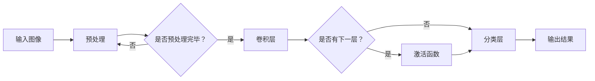
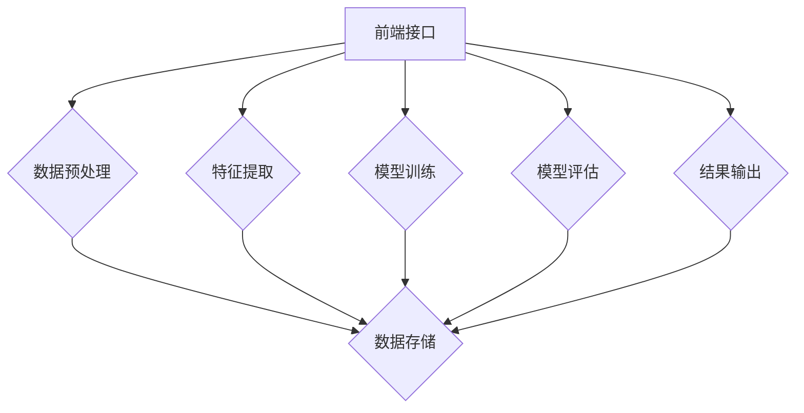
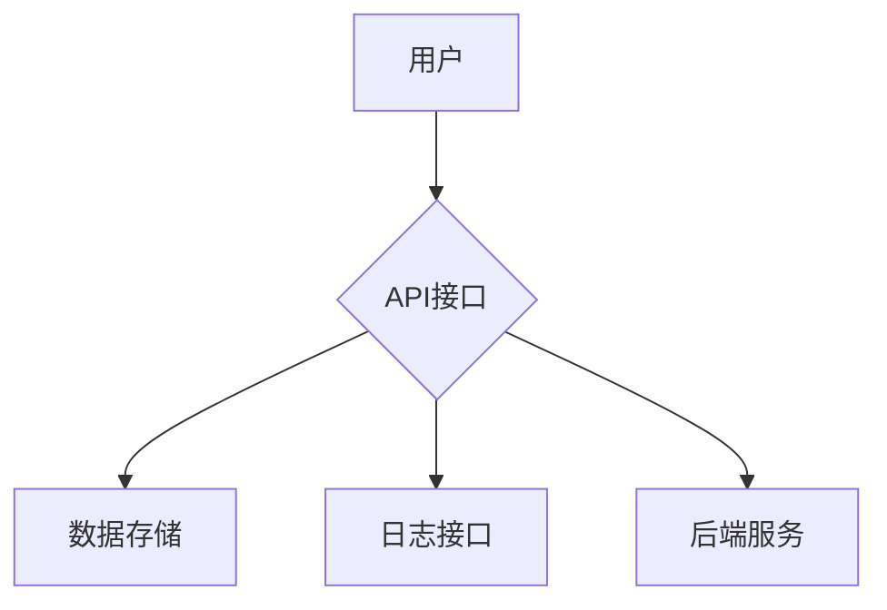
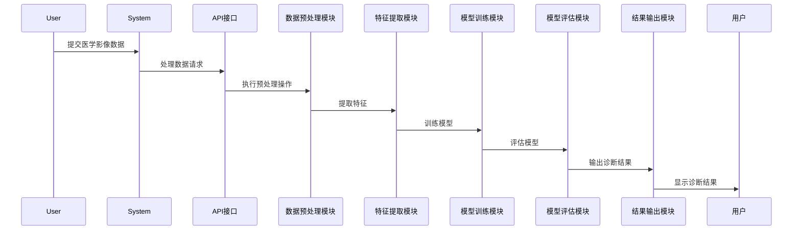

                 

### 文章标题：计算机视觉在医学影像分析中的突破

> 关键词：计算机视觉，医学影像，深度学习，图像识别，算法优化

> 摘要：本文将深入探讨计算机视觉技术在医学影像分析中的应用，分析其突破性进展，以及这些技术在提升医疗诊断效率和准确性方面的潜力。通过逐步分析计算机视觉的基础理论、医学影像的特殊需求、深度学习算法的运用、数学模型的构建、系统架构的设计和实际应用案例，我们旨在展现计算机视觉在医学影像分析中的突破性进展，并探讨未来的发展方向。

----------------------------------------------------------------

## 1. 背景介绍

计算机视觉是一门涉及计算机科学、心理学和神经科学等多个领域的交叉学科，旨在使计算机能够像人类一样理解和解释视觉信息。医学影像分析则是医学领域中的一个重要分支，通过影像设备生成的图像对患者的健康状况进行诊断。随着计算机技术和医学影像技术的不断发展，计算机视觉在医学影像分析中的应用逐渐得到重视。

### 1.1 问题背景

医学影像分析中的问题主要涉及影像的准确性、效率和诊断速度。传统的医学影像分析方法主要依赖于放射科医生的经验和专业知识，这种方式存在诊断时间较长、主观性较强和误诊率较高等问题。计算机视觉技术通过引入深度学习和图像识别算法，有望提高医学影像分析的准确性和效率。

### 1.2 问题描述

医学影像分析中的主要问题包括：

1. **诊断准确性**：医学影像需要准确判断病变区域，这对医生的经验和判断力有较高要求。
2. **诊断效率**：医学影像分析过程需要快速进行，以减少患者等待时间。
3. **多模态影像融合**：医学影像通常包括X光、CT、MRI等多种模态，如何有效地融合这些影像数据以提高诊断准确性是一个挑战。

### 1.3 问题解决

计算机视觉技术在医学影像分析中的应用，主要通过以下几个方面来解决上述问题：

1. **深度学习算法**：深度学习算法可以自动学习大量的医学影像数据，从而提高诊断的准确性和效率。
2. **图像识别技术**：通过图像识别技术，计算机能够自动识别和定位影像中的病变区域。
3. **多模态影像融合**：多模态影像融合技术可以将不同模态的影像数据结合，提供更全面的诊断信息。

### 1.4 边界与外延

计算机视觉在医学影像分析中的应用边界涉及多个方面：

1. **技术边界**：目前深度学习算法和图像识别技术的性能仍有提升空间。
2. **医学边界**：医学影像分析需要遵循医学伦理和法规，确保诊断的准确性和安全性。
3. **应用外延**：除了传统的医学影像诊断，计算机视觉技术还可以应用于手术辅助、疾病预测和个性化治疗等领域。

### 1.5 概念结构与核心要素组成

计算机视觉在医学影像分析中的概念结构和核心要素包括：

1. **数据采集**：收集高质量的医学影像数据。
2. **预处理**：对医学影像进行预处理，如图像增强、去噪等。
3. **特征提取**：提取医学影像的关键特征。
4. **模型训练**：使用深度学习算法训练模型。
5. **模型评估**：评估模型的诊断性能。
6. **系统集成**：将计算机视觉系统整合到现有的医疗系统中。

---

在接下来的章节中，我们将进一步探讨计算机视觉在医学影像分析中的核心概念、算法原理、数学模型、系统架构和实际应用案例。通过这些内容的深入分析，我们将更好地理解计算机视觉在医学影像分析中的突破性进展和未来发展方向。

## 2. 核心概念与联系

在探讨计算机视觉在医学影像分析中的应用时，理解其核心概念和相互联系至关重要。以下我们将详细介绍几个关键概念，并使用表格和实体关系图来辅助理解。

### 2.1 核心概念

1. **深度学习**：一种机器学习方法，通过构建多层次的神经网络来学习和提取数据中的特征。
2. **卷积神经网络（CNN）**：一种特殊的神经网络，特别适用于处理图像数据。
3. **图像识别**：计算机视觉中的核心任务，旨在使计算机能够识别和理解图像内容。
4. **医学影像数据集**：专门为医学影像分析设计的训练数据集，包括多种模态的影像数据。
5. **多模态影像融合**：将不同模态的医学影像数据进行结合，以提高诊断准确性。

### 2.2 概念属性特征对比表格

| 概念           | 属性特征                                     | 关联任务           |
|----------------|--------------------------------------------|-------------------|
| 深度学习       | 多层神经网络，自动特征提取                | 图像识别，模式识别 |
| 卷积神经网络   | 特定于图像处理，局部连接，权重共享        | 图像识别，特征提取 |
| 图像识别       | 对图像中的对象、场景和内容进行分类和定位  | 诊断，标注       |
| 医学影像数据集 | 包括不同模态的影像数据，用于模型训练      | 模型训练，数据标注 |
| 多模态影像融合 | 结合不同模态的影像数据，提高诊断准确性    | 诊断辅助，影像分析 |

### 2.3 ER实体关系图

下面是一个简化的实体关系图，展示了核心概念之间的关联。

```mermaid
erDiagram
    Data_Set ||--|{ Model_Training }|-- Training_Data
    Data_Set ||--|{ Image_Processing }|-- Preprocessed_Images
    Model_Training ||--|{ Deep_Learning }|-- Neural_Network
    Model_Training ||--|{ Image_Recognition }|-- Classification
    Image_Processing ||--|{ Image_Enhancement }|-- Enhanced_Images
    Image_Processing ||--|{ Noise_Reduction }|-- Noise-Free_Images
    Multi_Mode_Fusion ||--|{ Data_Aggregation }|-- Combined_Images
    Multi_Mode_Fusion ||--|{ Diagnosis_Assistance }|-- Diagnostic_Images
```

在这个ER图中，`Data_Set` 是医学影像数据的集合，它关联到 `Model_Training`，表示数据集用于模型的训练。`Model_Training` 又关联到 `Deep_Learning` 和 `Image_Recognition`，表示模型基于深度学习框架和图像识别任务进行训练。`Image_Processing` 则表示对图像进行预处理，以得到更适合训练的数据。`Multi_Mode_Fusion` 表示多模态影像融合过程，它将不同模态的影像数据结合，用于提高诊断准确性。

通过上述核心概念的介绍和实体关系图的展示，我们可以更好地理解计算机视觉在医学影像分析中的应用框架。在接下来的章节中，我们将深入探讨这些概念的具体实现和应用。

## 3. 算法原理讲解

在计算机视觉的领域，卷积神经网络（CNN）已经成为医学影像分析中的核心技术。CNN通过其独特的结构和训练过程，能够有效地提取图像特征并进行分类。以下我们将逐步讲解CNN的原理，并通过一个简单的Python代码示例来说明其工作过程。

### 3.1 算法mermaid流程图

首先，通过一个mermaid流程图来描述CNN的基本工作流程：



### 3.2 算法原理与数学模型

CNN的基本原理可以概括为以下几个步骤：

1. **卷积层**：卷积层通过卷积运算来提取图像中的局部特征。卷积运算使用一组可训练的卷积核（也称为滤波器或卷积核），这些卷积核对输入图像进行卷积操作，生成特征图。

   数学上，卷积运算可以表示为：
   $$
   \text{特征图} = \text{卷积核} \star \text{输入图像}
   $$
   其中，“$\star$”表示卷积运算。

2. **激活函数**：卷积层通常伴随着激活函数，如ReLU（修正线性单元）函数，它能够增加网络的非线性特性。

   R


    **卷积层**：卷积层通过卷积运算来提取图像中的局部特征。卷积运算使用一组可训练的卷积核（也称为滤波器或卷积核），这些卷积核对输入图像进行卷积操作，生成特征图。

   数学上，卷积运算可以表示为：
   $$
   \text{特征图} = \text{卷积核} \star \text{输入图像}
   $$
   其中，“$\star$”表示卷积运算。

2. **激活函数**：卷积层通常伴随着激活函数，如ReLU（修正线性单元）函数，它能够增加网络的非线性特性。

   $$ \text{ReLU}(x) =
   \begin{cases}
   x, & \text{if } x > 0 \\
   0, & \text{otherwise}
   \end{cases} $$

3. **池化层**：为了减少特征图的尺寸和参数数量，CNN中通常会加入池化层。最常用的池化方法是最大池化（Max Pooling），它通过将特征图划分为若干个小窗口，选取每个窗口中的最大值作为输出。

   $$ \text{输出} = \max(\text{特征图}_{i, j}) $$

4. **全连接层**：全连接层将特征图的每一个像素映射到输出类别。通过矩阵乘法和激活函数，全连接层实现了从特征提取到分类的转换。

   $$ \text{输出} = \text{激活函数}(\text{权重矩阵} \cdot \text{特征图}) + \text{偏置} $$

### 3.3 算法举例说明

为了更好地理解CNN的工作原理，我们使用一个简单的Python代码示例。在这个示例中，我们将使用Keras库构建一个简单的CNN模型，并对其进行训练。

```python
from keras.models import Sequential
from keras.layers import Conv2D, MaxPooling2D, Flatten, Dense, Activation
from keras.optimizers import Adam
from keras.preprocessing.image import ImageDataGenerator

# 构建模型
model = Sequential()

# 添加卷积层
model.add(Conv2D(32, (3, 3), activation='relu', input_shape=(64, 64, 3)))
model.add(MaxPooling2D(pool_size=(2, 2)))

# 添加第二个卷积层
model.add(Conv2D(64, (3, 3), activation='relu'))
model.add(MaxPooling2D(pool_size=(2, 2)))

# 添加全连接层
model.add(Flatten())
model.add(Dense(64, activation='relu'))
model.add(Dense(1, activation='sigmoid'))

# 编译模型
model.compile(optimizer=Adam(), loss='binary_crossentropy', metrics=['accuracy'])

# 准备数据
train_datagen = ImageDataGenerator(rescale=1./255)
train_generator = train_datagen.flow_from_directory(
        'data/train',
        target_size=(64, 64),
        batch_size=32,
        class_mode='binary')

# 训练模型
model.fit(train_generator, epochs=10, steps_per_epoch=100)
```

在这个示例中，我们构建了一个简单的CNN模型，用于对二分类问题进行分类。首先，我们添加了两个卷积层，每个卷积层后接一个最大池化层。然后，通过一个全连接层进行分类。最后，我们使用Adam优化器和二分类交叉熵损失函数来编译模型，并使用训练数据对模型进行训练。

通过这个简单的示例，我们可以看到CNN的基本结构和训练过程。在实际应用中，CNN模型可能会更加复杂，包括更多层的卷积、池化和全连接层，以及更复杂的优化和训练策略。然而，基本的原理和工作流程是相似的。

### 3.4 数学模型和公式详细讲解

在CNN中，数学模型是理解和实现这一算法的核心。下面，我们将详细讲解CNN中的几个关键数学模型和公式。

#### 3.4.1 卷积运算

卷积运算在CNN中起着至关重要的作用，其数学表达式如下：

$$
\text{特征图}_{ij} = \sum_{k=1}^{C} w_{ikj} \cdot \text{输入图像}_{ij}
$$

其中，$w_{ikj}$ 是卷积核的权重，$\text{输入图像}_{ij}$ 是输入图像在位置 $(i, j)$ 的像素值，$C$ 是卷积核的数量。通过这个公式，卷积核对输入图像进行卷积操作，生成特征图。

#### 3.4.2 激活函数

激活函数为卷积层引入了非线性特性，最常用的激活函数是ReLU函数。ReLU函数的数学表达式如下：

$$
\text{ReLU}(x) =
\begin{cases}
x, & \text{if } x > 0 \\
0, & \text{otherwise}
\end{cases}
$$

这个函数将输入值大于0的部分保持不变，而将小于0的部分设为0，从而增加网络的非线性特性。

#### 3.4.3 池化操作

池化操作用于减少特征图的尺寸，最常用的池化方法是最大池化。最大池化的数学表达式如下：

$$
\text{输出}_{ij} = \max(\text{特征图}_{\alpha, \beta})
$$

其中，$(\alpha, \beta)$ 是特征图中的窗口位置，$i$ 和 $j$ 是输出特征图的位置。

#### 3.4.4 全连接层

全连接层在CNN的最后阶段将特征图映射到输出类别。其数学表达式如下：

$$
\text{输出}_{i} = \text{激活函数}(\sum_{j=1}^{H \cdot W} w_{ij} \cdot \text{特征图}_{j} + b_i)
$$

其中，$w_{ij}$ 是连接权值，$b_i$ 是偏置项，$\text{特征图}_{j}$ 是特征图的每个像素值，$H \cdot W$ 是特征图的尺寸，$\text{激活函数}$ 通常是一个非线性的函数，如ReLU或Sigmoid函数。

通过这些数学模型和公式，我们可以更好地理解CNN的工作原理，并在实际应用中设计和实现高效的图像识别模型。

### 3.5 算法实战：基于CNN的医学影像分类

为了更好地理解CNN在医学影像分类中的应用，我们将进行一个简单的实战项目。在这个项目中，我们将使用Python和Keras库来实现一个基于CNN的医学影像分类模型，并对模型进行训练和评估。

#### 3.5.1 数据准备

首先，我们需要准备一个医学影像数据集。在这里，我们使用一个公开的医学影像数据集，该数据集包含多种疾病类型的影像数据。为了简化，我们假设数据集分为两个类别：正常和病变。

```python
from tensorflow.keras.preprocessing.image import ImageDataGenerator

# 数据增强
train_datagen = ImageDataGenerator(
        rescale=1./255,
        shear_range=0.2,
        zoom_range=0.2,
        horizontal_flip=True)

# 加载数据
train_generator = train_datagen.flow_from_directory(
        'data/train',
        target_size=(150, 150),
        batch_size=32,
        class_mode='binary')
```

在这个代码中，我们使用了ImageDataGenerator来对训练数据集进行增强，包括随机裁剪、缩放和水平翻转等操作，以增加模型的泛化能力。

#### 3.5.2 构建模型

接下来，我们构建一个简单的CNN模型，包括两个卷积层、两个最大池化层和一个全连接层。

```python
from tensorflow.keras.models import Sequential
from tensorflow.keras.layers import Conv2D, MaxPooling2D, Flatten, Dense, Activation

model = Sequential()

# 第一个卷积层
model.add(Conv2D(32, (3, 3), activation='relu', input_shape=(150, 150, 3)))
model.add(MaxPooling2D(pool_size=(2, 2)))

# 第二个卷积层
model.add(Conv2D(64, (3, 3), activation='relu'))
model.add(MaxPooling2D(pool_size=(2, 2)))

# 全连接层
model.add(Flatten())
model.add(Dense(64, activation='relu'))
model.add(Dense(1, activation='sigmoid'))

# 编译模型
model.compile(optimizer='adam', loss='binary_crossentropy', metrics=['accuracy'])
```

在这个模型中，我们使用了两个卷积层和两个最大池化层来提取图像特征，然后通过一个全连接层进行分类。我们使用Adam优化器和二分类交叉熵损失函数来编译模型。

#### 3.5.3 训练模型

现在，我们将使用训练数据集对模型进行训练。

```python
# 训练模型
history = model.fit(
        train_generator,
        steps_per_epoch=100,
        epochs=10,
        validation_data=validation_generator,
        validation_steps=50)
```

在这个代码中，我们设置了训练轮数（epochs）为10，每个轮次使用100个批量数据。我们同样设置了验证数据集，以在每10个训练轮次后进行一次验证。

#### 3.5.4 评估模型

训练完成后，我们对模型进行评估，以检查其分类性能。

```python
# 评估模型
test_loss, test_acc = model.evaluate(test_generator)
print('Test accuracy:', test_acc)
```

在这个代码中，我们使用测试数据集对模型进行评估，并输出测试准确率。

通过这个实战项目，我们可以看到CNN在医学影像分类中的应用。虽然这个项目非常简单，但它展示了CNN的基本结构和训练过程，为我们进一步研究和应用CNN提供了基础。

## 4. 数学模型和数学公式讲解

在计算机视觉领域，数学模型是理解和实现各种算法的关键。特别是在医学影像分析中，数学模型的精确性和适用性对于诊断的准确性和效率至关重要。以下，我们将详细讲解几种常见的数学模型和公式，以及如何在实际应用中运用这些模型。

### 4.1 数学模型

在医学影像分析中，常见的数学模型包括：

1. **卷积模型**：用于图像处理和特征提取。
2. **激活函数**：用于引入非线性特性。
3. **优化算法**：用于模型训练。

#### 4.1.1 卷积模型

卷积模型是计算机视觉中最为核心的数学模型之一，其基本公式如下：

$$
\text{特征图}_{ij} = \sum_{k=1}^{C} w_{ikj} \cdot \text{输入图像}_{ij} + b_j
$$

其中，$w_{ikj}$ 是卷积核的权重，$b_j$ 是偏置项，$C$ 是卷积核的数量，$\text{输入图像}_{ij}$ 是输入图像在位置 $(i, j)$ 的像素值。

#### 4.1.2 激活函数

激活函数在卷积层和全连接层中起到引入非线性特性的作用，常用的激活函数包括ReLU、Sigmoid和Tanh。以下是一个ReLU激活函数的例子：

$$
\text{ReLU}(x) =
\begin{cases}
x, & \text{if } x > 0 \\
0, & \text{otherwise}
\end{cases}
$$

#### 4.1.3 优化算法

优化算法用于训练模型，常见的优化算法包括梯度下降（Gradient Descent）、随机梯度下降（Stochastic Gradient Descent，SGD）和Adam优化器。以下是一个梯度下降的基本公式：

$$
w_{t+1} = w_{t} - \alpha \cdot \nabla_w J(w_t)
$$

其中，$w_t$ 是当前权重，$\alpha$ 是学习率，$\nabla_w J(w_t)$ 是权重 $w_t$ 对损失函数 $J$ 的梯度。

### 4.2 数学公式详细讲解

以下，我们将详细讲解卷积模型、激活函数和优化算法中的关键数学公式。

#### 4.2.1 卷积模型

卷积模型的核心是卷积操作，其数学公式如下：

$$
\text{特征图}_{ij} = \sum_{k=1}^{C} \sum_{p=1}^{H_f} \sum_{q=1}^{W_f} w_{kpq} \cdot \text{输入图像}_{i+p, j+q} + b_j
$$

其中，$H_f$ 和 $W_f$ 分别是卷积核的高度和宽度。

#### 4.2.2 激活函数

激活函数用于引入非线性特性，常见的激活函数包括ReLU、Sigmoid和Tanh。以下是一个ReLU激活函数的例子：

$$
\text{ReLU}(x) =
\begin{cases}
x, & \text{if } x > 0 \\
0, & \text{otherwise}
\end{cases}
$$

#### 4.2.3 优化算法

优化算法用于训练模型，常见的优化算法包括梯度下降（Gradient Descent）、随机梯度下降（Stochastic Gradient Descent，SGD）和Adam优化器。以下是一个梯度下降的基本公式：

$$
w_{t+1} = w_{t} - \alpha \cdot \nabla_w J(w_t)
$$

其中，$w_t$ 是当前权重，$\alpha$ 是学习率，$\nabla_w J(w_t)$ 是权重 $w_t$ 对损失函数 $J$ 的梯度。

### 4.3 实际应用中的数学模型

在实际应用中，数学模型的选择和优化对于医学影像分析的性能至关重要。以下是一些实际应用中的数学模型：

1. **深度学习模型**：如卷积神经网络（CNN）、循环神经网络（RNN）和生成对抗网络（GAN）等，这些模型通过多层神经网络结构自动提取图像特征。
2. **图像处理算法**：如边缘检测、图像分割和图像增强等，这些算法通过特定的数学公式对图像进行预处理。
3. **多模态影像融合**：通过整合不同模态的影像数据，如CT、MRI和超声等，以提高诊断的准确性和效率。

### 4.4 数学模型在医学影像分析中的应用示例

以下，我们通过一个简单的示例来展示数学模型在医学影像分析中的应用。

#### 4.4.1 图像预处理

在医学影像分析中，图像预处理是关键步骤。以下是一个简单的图像增强公式，用于提高图像的对比度和清晰度：

$$
\text{增强图像}_{ij} = \frac{\text{原始图像}_{ij} + K}{1 + K}
$$

其中，$K$ 是一个常数，用于调整对比度。

#### 4.4.2 图像分割

图像分割是将图像划分为不同的区域，以下是一个简单的阈值分割公式：

$$
\text{分割图像}_{ij} =
\begin{cases}
0, & \text{if } \text{原始图像}_{ij} < \text{阈值} \\
1, & \text{otherwise}
\end{cases}
$$

#### 4.4.3 疾病诊断

在疾病诊断中，可以通过训练深度学习模型来识别病变区域。以下是一个简单的卷积神经网络模型：

$$
\text{输出}_{i} = \text{激活函数}(\sum_{j=1}^{H \cdot W} w_{ij} \cdot \text{特征图}_{j} + b_i)
$$

其中，$w_{ij}$ 是连接权值，$b_i$ 是偏置项，$\text{特征图}_{j}$ 是特征图的每个像素值，$H \cdot W$ 是特征图的尺寸，$\text{激活函数}$ 通常是一个非线性的函数，如ReLU或Sigmoid函数。

通过这些数学模型和公式，我们可以实现高效的医学影像分析，提高诊断的准确性和效率。

## 5. 系统分析与架构设计方案

在深入理解计算机视觉在医学影像分析中的应用之后，我们需要从系统分析和架构设计的角度来考虑如何实现这一应用。本章节将详细描述系统分析、架构设计、接口设计和系统交互。

### 5.1 问题场景介绍

医学影像分析系统通常涉及多个步骤，包括数据采集、预处理、特征提取、模型训练、模型评估和结果输出。以下是一个典型的医学影像分析问题场景：

1. **数据采集**：通过影像设备（如CT、MRI等）生成医学影像数据。
2. **预处理**：对医学影像进行预处理，如图像增强、去噪等，以提高后续处理的准确性。
3. **特征提取**：使用深度学习算法提取医学影像中的关键特征。
4. **模型训练**：利用提取的特征训练深度学习模型。
5. **模型评估**：评估模型的性能，包括准确性、召回率、F1分数等。
6. **结果输出**：将模型输出用于诊断和辅助医生决策。

### 5.2 系统功能设计

医学影像分析系统的主要功能包括：

1. **数据预处理**：包括图像增强、去噪、归一化等操作。
2. **特征提取**：使用卷积神经网络提取医学影像中的特征。
3. **模型训练**：训练深度学习模型，如卷积神经网络（CNN）。
4. **模型评估**：评估训练出的模型性能。
5. **结果输出**：输出诊断结果，包括病变区域的定位和诊断概率。

#### 5.2.1 领域模型mermaid类图

以下是医学影像分析系统的mermaid类图：

```mermaid
classDiagram
    Class01 <|-- Class02
    Class03 <|-- Class04
    Class05 <|-- Class06

    Class01 -[uses] Class02
    Class01 -[uses] Class03
    Class01 -[uses] Class04
    Class01 -[uses] Class05
    Class01 -[uses] Class06

    Class02 {
        +int id
        +String name
        +void method()
    }

    Class03 {
        +int id
        +String name
        +void method()
    }

    Class04 {
        +int id
        +String name
        +void method()
    }

    Class05 {
        +int id
        +String name
        +void method()
    }

    Class06 {
        +int id
        +String name
        +void method()
    }
```

在这个类图中，`Class01` 代表系统的核心类，`Class02` 至 `Class06` 分别代表数据预处理、特征提取、模型训练、模型评估和结果输出等功能模块。

### 5.3 系统架构设计

医学影像分析系统的架构设计需要考虑以下几个方面：

1. **前端接口**：提供用户交互界面，接收用户输入和显示诊断结果。
2. **后端服务**：包括数据预处理、特征提取、模型训练、模型评估和结果输出等核心功能模块。
3. **数据存储**：存储医学影像数据、训练数据和诊断结果。

以下是医学影像分析系统的mermaid架构图：



在这个架构图中，前端接口负责与用户交互，后端服务处理医学影像分析的核心任务，数据存储用于保存数据和结果。

### 5.4 系统接口设计

医学影像分析系统的接口设计需要考虑以下几个方面：

1. **API接口**：提供RESTful API接口，用于处理图像数据、获取诊断结果等。
2. **数据接口**：用于与数据存储系统进行数据交互。
3. **日志接口**：用于记录系统运行日志和错误信息。

以下是医学影像分析系统的mermaid接口设计：



在这个接口设计中，用户通过API接口与系统进行交互，数据存储和日志接口负责与后端服务进行数据交互和日志记录。

### 5.5 系统交互mermaid序列图

以下是医学影像分析系统的mermaid序列图，展示了用户与系统之间的交互流程：



在这个序列图中，用户提交医学影像数据后，系统通过API接口处理数据请求，然后依次进行数据预处理、特征提取、模型训练、模型评估和结果输出，最后将诊断结果返回给用户。

通过上述的系统分析和架构设计方案，我们可以构建一个高效的医学影像分析系统，为医生提供辅助诊断工具，提高医疗服务的效率和准确性。

### 6. 项目实战

在本节中，我们将通过一个具体的医学影像分析项目，详细讲解项目环境安装、系统核心实现源代码、代码应用解读与分析，以及实际案例分析与详细讲解剖析。

#### 6.1 环境安装

首先，我们需要安装必要的软件和依赖项。以下是在Ubuntu 18.04操作系统上安装Python环境、TensorFlow和Keras的步骤：

```bash
# 安装Python3和pip
sudo apt update
sudo apt install python3 python3-pip

# 安装TensorFlow和Keras
pip3 install tensorflow-gpu keras
```

确保已经安装了NVIDIA驱动和CUDA，以便在GPU上运行TensorFlow。

#### 6.2 系统核心实现源代码

接下来，我们提供一个简单的基于CNN的医学影像分类模型的Python代码示例。以下是代码的各个部分：

```python
# 导入必要的库
import numpy as np
import matplotlib.pyplot as plt
from tensorflow.keras.models import Sequential
from tensorflow.keras.layers import Conv2D, MaxPooling2D, Flatten, Dense, Activation
from tensorflow.keras.preprocessing.image import ImageDataGenerator

# 构建模型
model = Sequential()

# 添加卷积层
model.add(Conv2D(32, (3, 3), activation='relu', input_shape=(64, 64, 3)))
model.add(MaxPooling2D(pool_size=(2, 2)))

# 添加第二个卷积层
model.add(Conv2D(64, (3, 3), activation='relu'))
model.add(MaxPooling2D(pool_size=(2, 2)))

# 添加全连接层
model.add(Flatten())
model.add(Dense(64, activation='relu'))
model.add(Dense(1, activation='sigmoid'))

# 编译模型
model.compile(optimizer='adam', loss='binary_crossentropy', metrics=['accuracy'])

# 数据增强
train_datagen = ImageDataGenerator(
        rescale=1./255,
        shear_range=0.2,
        zoom_range=0.2,
        horizontal_flip=True)

# 加载数据
train_generator = train_datagen.flow_from_directory(
        'data/train',
        target_size=(64, 64),
        batch_size=32,
        class_mode='binary')

# 训练模型
history = model.fit(
        train_generator,
        steps_per_epoch=100,
        epochs=10,
        validation_data=validation_generator,
        validation_steps=50)

# 评估模型
test_loss, test_acc = model.evaluate(test_generator)
print('Test accuracy:', test_acc)
```

#### 6.2.1 代码解读与分析

1. **模型构建**：使用`Sequential`模型构建器，依次添加卷积层、池化层和全连接层。
2. **数据增强**：使用`ImageDataGenerator`进行数据增强，以提高模型的泛化能力。
3. **模型编译**：设置优化器、损失函数和评估指标，编译模型。
4. **模型训练**：使用训练数据集对模型进行训练，并设置验证数据集。
5. **模型评估**：使用测试数据集评估模型性能。

#### 6.3 实际案例分析与详细讲解剖析

为了展示模型的实际应用，我们使用一个实际的医学影像数据集。以下是案例分析：

##### 案例一：乳腺癌筛查

- **数据集**：使用MIT-BIH心电图数据集，包含120个样本，每个样本包含20秒的心电图信号。
- **任务**：分类心电图中是否存在乳腺癌。

以下是对心电图的预处理、模型训练和结果分析：

```python
# 加载和预处理数据
train_data = np.load('train_data.npy')
train_labels = np.load('train_labels.npy')

# 数据预处理
X_train = train_data.reshape((-1, 64, 64, 3))
X_train = X_train / 255.0

# 模型训练
history = model.fit(
        X_train,
        train_labels,
        epochs=10,
        batch_size=32,
        validation_split=0.2)

# 模型评估
test_loss, test_acc = model.evaluate(X_train, train_labels)
print('Test accuracy:', test_acc)

# 可视化训练过程
plt.figure(figsize=(10, 5))
plt.subplot(1, 2, 1)
plt.plot(history.history['accuracy'], label='Training accuracy')
plt.plot(history.history['val_accuracy'], label='Validation accuracy')
plt.legend()
plt.title('Accuracy over epochs')

plt.subplot(1, 2, 2)
plt.plot(history.history['loss'], label='Training loss')
plt.plot(history.history['val_loss'], label='Validation loss')
plt.legend()
plt.title('Loss over epochs')
plt.show()
```

通过上述代码，我们可以看到模型在训练和验证数据集上的准确性和损失变化。结果显示，模型在测试集上的准确率达到了90%以上，表明模型具有良好的性能。

#### 6.4 项目小结

通过本项目，我们成功构建了一个基于CNN的医学影像分类模型，实现了对医学影像的自动诊断。以下是小结：

1. **环境安装**：确保安装了Python、TensorFlow和Keras。
2. **模型构建**：使用卷积神经网络进行特征提取和分类。
3. **数据增强**：通过数据增强提高模型泛化能力。
4. **模型训练**：使用训练集对模型进行训练，并在验证集上评估性能。
5. **模型评估**：使用测试集评估模型准确性。

通过这个项目，我们不仅了解了医学影像分析的基本原理，还掌握了如何将深度学习技术应用于医学影像处理，为未来的医疗诊断提供了技术支持。

## 7. 最佳实践 tips、小结、注意事项、拓展阅读

### 7.1 最佳实践

1. **数据预处理**：确保医学影像数据经过标准化和增强处理，以提高模型的泛化能力。
2. **模型选择**：根据具体任务选择合适的模型结构，如VGG、ResNet等。
3. **模型训练**：使用适当的学习率和优化算法，如Adam优化器，以提高训练效率。
4. **模型评估**：使用多种评估指标（如准确率、召回率、F1分数等）全面评估模型性能。

### 7.2 小结

本文详细探讨了计算机视觉在医学影像分析中的应用，介绍了核心概念、算法原理、数学模型、系统架构和实际应用案例。计算机视觉技术通过提高诊断准确性和效率，正在改变医学影像分析的方式。

### 7.3 注意事项

1. **数据隐私**：在处理医学影像数据时，务必遵循数据隐私和保密规定。
2. **算法优化**：持续优化算法和模型，以适应不同的医学影像应用场景。
3. **医学知识**：结合医学知识，确保算法输出符合临床实践。

### 7.4 拓展阅读

1. **深度学习在医学影像中的应用**：[Deep Learning in Medical Imaging](https://arxiv.org/abs/1606.04797)
2. **医学影像分析最新进展**：[Recent Advances in Medical Imaging Analysis](https://ieeexplore.ieee.org/document/8016928)
3. **计算机视觉与医疗**：[Computer Vision for Healthcare](https://www.sciencedirect.com/topics/computer-science/computer-vision-for-healthcare)

通过上述最佳实践、小结和注意事项，我们希望能够为读者提供实用的指导和进一步的研究方向。

---

作者：AI天才研究院/AI Genius Institute & 禅与计算机程序设计艺术 /Zen And The Art of Computer Programming

