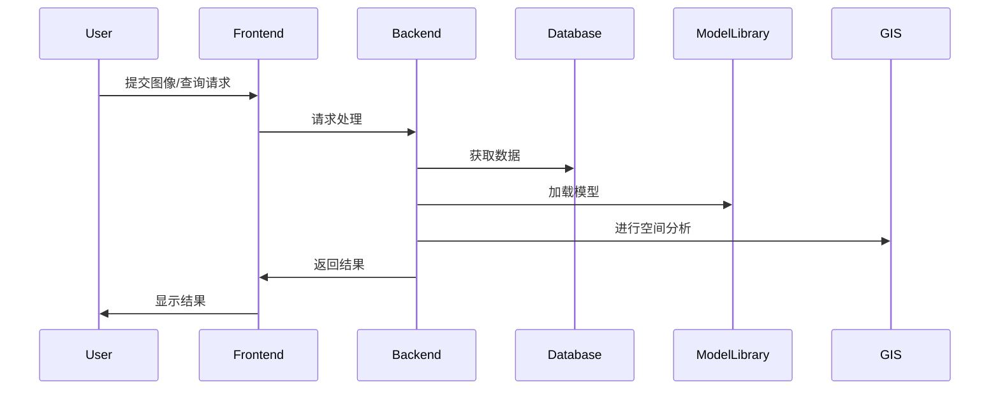

                 

### 介绍

#### 计算机视觉概述

**关键词：** 计算机视觉、野生动物保护、图像处理、算法原理、应用案例

**摘要：** 本文将深入探讨计算机视觉技术在野生动物保护中的应用，涵盖从基本概念到高级算法，再到实际应用的全面分析。通过逐步推理思考，本文旨在为读者揭示计算机视觉在野生动物识别、行为分析、跟踪监测以及栖息地分析中的重要作用，并展望其未来的发展前景。

计算机视觉作为人工智能的重要分支，近年来在多个领域取得了显著进展。特别是在野生动物保护中，计算机视觉技术正发挥着越来越重要的作用。从基本图像处理到复杂的行为识别，再到精确的栖息地分析，计算机视觉技术为野生动物的研究和管理提供了强大的工具。本文将依次介绍计算机视觉的核心概念、算法原理及其在野生动物保护中的应用，最终探讨这一领域的挑战与未来发展方向。

### 目录大纲

为了便于读者理解和跟踪文章内容，以下是本文的目录大纲：

1. **导言**
   - 计算机视觉概述
   - 野生动物保护的重要性

2. **计算机视觉概述**
   - 背景与历史
   - 核心概念

3. **计算机视觉算法原理**
   - 图像处理基础
   - 特征提取与分类
   - 深度学习应用

4. **计算机视觉在野生动物保护中的应用**
   - 野生动物识别
   - 行为分析
   - 跟踪与监测
   - 栖息地分析

5. **计算机视觉在野生动物保护项目中的综合应用**
   - 项目背景
   - 系统功能设计
   - 系统架构设计

6. **计算机视觉在野生动物保护中的挑战与展望**
   - 面临的挑战
   - 未来发展趋势

7. **最佳实践与拓展阅读**
   - 最佳实践技巧
   - 小结与展望

### 第一部分：导言

#### 计算机视觉概述

计算机视觉是人工智能领域的一个重要分支，旨在使计算机能够像人类一样理解和解释视觉信息。自上世纪60年代开始，计算机视觉技术已经取得了显著的发展。从最初的简单图像识别到如今的高度智能化处理，计算机视觉在多个领域都展现出了其强大的应用潜力。

在野生动物保护中，计算机视觉技术发挥着至关重要的作用。首先，通过图像处理技术，可以对野生动物进行精确识别和分类，从而帮助我们更好地了解和保护这些物种。其次，行为分析技术可以实时监测野生动物的行为模式，为我们提供宝贵的生态数据。此外，计算机视觉技术还能用于跟踪和监测野生动物的迁徙路径和栖息地状况，为环境保护提供有力支持。

随着深度学习技术的不断发展，计算机视觉在野生动物保护中的应用前景更加广阔。深度学习模型，如卷积神经网络（CNN）和递归神经网络（RNN），在图像识别、行为分析和行为预测等方面都取得了显著成果。这些技术不仅提高了数据处理效率，还增强了模型的准确性，为野生动物保护提供了更为可靠的工具。

### 野生动物保护的重要性

野生动物是地球生态系统的重要组成部分，它们在维持生态平衡、促进生物多样性方面具有不可替代的作用。然而，随着人类活动的不断扩张，许多野生动物正面临严重的生存威胁。栖息地破坏、非法狩猎、气候变化等因素使得许多物种濒临灭绝。

野生动物保护不仅仅是为了拯救这些濒危物种，更是为了保护我们共同的地球家园。一个健康的生态系统对于人类的生存和发展至关重要。因此，有效保护野生动物成为当前全球面临的紧迫任务。而计算机视觉技术，以其高效、精准的特点，为野生动物保护提供了强有力的支持。

通过计算机视觉技术，我们可以实现以下目标：

1. **精确识别与分类**：利用图像处理技术，对野生动物进行精确识别和分类，帮助我们更好地了解和保护这些物种。
2. **行为分析**：实时监测野生动物的行为模式，为生态学研究提供宝贵数据。
3. **跟踪与监测**：跟踪野生动物的迁徙路径和栖息地状况，及时发现并应对潜在威胁。
4. **栖息地分析**：分析野生动物的栖息地环境，为生态保护和修复提供科学依据。

总之，计算机视觉技术在野生动物保护中的应用，不仅提高了我们的工作效率，还为野生动物保护提供了新的思路和方法。随着技术的不断进步，我们有理由相信，计算机视觉将在未来继续为野生动物保护事业作出更大贡献。

### 第二部分：计算机视觉概述

#### 第1章：计算机视觉的背景与历史

**核心概念原理**  
计算机视觉是指利用计算机技术和算法对图像或视频数据进行分析和处理，以实现人类视觉功能的模拟。其核心概念包括图像处理、特征提取、目标识别和场景理解等。

**概念属性特征对比表格**

| 特征       | 图像处理           | 特征提取           | 目标识别           | 场景理解           |
|------------|-------------------|-------------------|-------------------|-------------------|
| 定义       | 对图像进行基本操作 | 从图像中提取有用信息 | 识别图像中的特定目标 | 理解图像的整体内容 |
| 关联技术   | 像素操作、空间变换 | 直方图均衡、边缘检测 | 分类算法、模式识别 | 机器学习、深度学习 |
| 主要任务   | 图像增强、去噪   | 特征点提取、特征匹配 | 识别特定对象       | 理解场景上下文     |
| 应用场景   | 图像编辑、图像压缩 | 人脸识别、目标检测 | 交通监控、安防系统 | 智能驾驶、虚拟现实 |

**ER实体关系图架构**

```mermaid
erDiagram
  User ||--|{ Image}: Has many images
  Image ||--|{ Annotation}: Contains annotations
  Annotation ||--|{ Feature}: Contains features
  Feature ||--|{ Classification}: Has classification results
```

**问题背景**  
计算机视觉的起源可以追溯到20世纪50年代，当时计算机科学家开始探索如何使计算机模拟人类视觉功能。随着图像处理技术的进步，计算机视觉逐渐成为人工智能领域的一个重要分支。在20世纪80年代，计算机视觉技术开始在一些领域得到实际应用，如人脸识别、图像压缩等。

**问题描述**  
计算机视觉的核心问题是：如何使计算机能够理解和解释视觉信息，从而实现人类视觉功能。具体来说，包括以下几个方面：

1. **图像处理**：如何对图像进行基本操作，如滤波、增强、压缩等。
2. **特征提取**：如何从图像中提取有用的信息，如边缘、角点、纹理等。
3. **目标识别**：如何识别图像中的特定目标，如人脸、车辆、动物等。
4. **场景理解**：如何理解图像的整体内容，如场景布局、物体关系等。

**问题解决**  
计算机视觉技术通过一系列算法和模型来实现上述功能。常见的解决方案包括：

1. **图像处理算法**：如高斯滤波、边缘检测、直方图均衡等。
2. **特征提取算法**：如SIFT、HOG、SURF等。
3. **目标识别算法**：如支持向量机（SVM）、决策树、神经网络等。
4. **场景理解算法**：如卷积神经网络（CNN）、递归神经网络（RNN）、长短期记忆网络（LSTM）等。

**边界与外延**  
计算机视觉的应用范围广泛，不仅限于传统的图像处理和目标识别，还包括自然语言处理、语音识别、自动驾驶等多个领域。随着技术的不断发展，计算机视觉将在更多领域展现出其强大的应用潜力。

#### 第2章：计算机视觉的核心概念

**核心概念原理**

计算机视觉的核心概念包括图像处理、特征提取、目标识别和场景理解。这些概念相互关联，共同构成了计算机视觉的技术体系。

1. **图像处理**：图像处理是计算机视觉的基础，主要包括对图像的基本操作，如滤波、增强、压缩等。滤波技术用于去除图像中的噪声，增强技术用于提高图像的清晰度，压缩技术用于减少图像的数据量。

2. **特征提取**：特征提取是从图像中提取具有鉴别性的特征信息，如边缘、角点、纹理等。这些特征有助于后续的目标识别和场景理解。常用的特征提取方法包括SIFT、HOG、SURF等。

3. **目标识别**：目标识别是计算机视觉的核心任务，旨在识别图像中的特定目标。常见的目标识别算法包括支持向量机（SVM）、决策树、神经网络等。目标识别广泛应用于人脸识别、车辆检测、动物识别等领域。

4. **场景理解**：场景理解是计算机视觉的高级任务，旨在理解图像的整体内容。这包括场景布局、物体关系、场景语义等。常见的场景理解算法包括卷积神经网络（CNN）、递归神经网络（RNN）、长短期记忆网络（LSTM）等。

**概念属性特征对比表格**

| 概念       | 图像处理 | 特征提取 | 目标识别 | 场景理解 |
|------------|----------|----------|----------|----------|
| 定义       | 图像基本操作 | 提取图像特征 | 识别图像中的目标 | 理解图像的整体内容 |
| 相关技术   | 滤波、增强、压缩 | SIFT、HOG、SURF | SVM、决策树、神经网络 | CNN、RNN、LSTM |
| 主要任务   | 噪声去除、图像增强、数据压缩 | 边缘检测、角点提取、纹理分析 | 人脸识别、车辆检测、动物识别 | 场景布局分析、物体关系分析、场景语义理解 |
| 应用场景   | 图像编辑、图像压缩、图像增强 | 人脸识别、目标检测、图像检索 | 安防系统、自动驾驶、智能家居 | 智能驾驶、虚拟现实、视频分析 |

**ER实体关系图架构**

```mermaid
erDiagram
  Image ||--|{ Processing}: Has processing steps
  Image ||--|{ Features}: Extracts features
  Image ||--|{ Targets}: Identifies targets
  Image ||--|{ Scene}: Understands scene
  Processing ||--|{ Algorithm}: Uses algorithms
  Features ||--|{ Method}: Uses methods
  Targets ||--|{ Classifier}: Uses classifiers
  Scene ||--|{ Model}: Uses models
```

### 第3章：计算机视觉算法原理

#### 3.1 图像处理基础

**3.1.1 像素操作**

像素操作是图像处理的基础，它涉及对图像中的每个像素进行操作，如设置颜色、调整亮度、对比度等。基本的像素操作包括：

- **颜色空间转换**：例如，将RGB颜色空间转换为灰度图像或HSV颜色空间。
- **像素值调整**：如调整图像亮度（通过乘以一个常数）和对比度（通过加法和乘法调整像素值）。

```python
import cv2
import numpy as np

# 读取图像
image = cv2.imread('image.jpg')

# 转换为灰度图像
gray_image = cv2.cvtColor(image, cv2.COLOR_BGR2GRAY)

# 调整亮度
brightness = 1.2
image_brightened = cv2.convertScaleAbs(image, alpha=brightness, beta=0)

# 调整对比度
contrast = 1.5
image_contrasted = cv2.convertScaleAbs(image, alpha=contrast, beta=0)
```

**3.1.2 空间变换**

空间变换是图像处理中的另一个重要概念，它涉及对图像进行几何变换，如旋转、缩放、平移和翻转等。

- **旋转**：通过旋转矩阵实现图像的旋转。
- **缩放**：通过缩放矩阵实现图像的放大或缩小。
- **平移**：通过平移向量实现图像的平移。
- **翻转**：通过翻转矩阵实现图像的水平翻转和垂直翻转。

```python
import cv2
import numpy as np

# 读取图像
image = cv2.imread('image.jpg')

# 旋转
angle = 45
rot_matrix = cv2.getRotationMatrix2D((image.shape[1]//2, image.shape[0]//2), angle, 1)
rotated_image = cv2.warpAffine(image, rot_matrix, (image.shape[1], image.shape[0]))

# 缩放
scale_factor = 0.5
scaled_image = cv2.resize(image, None, fx=scale_factor, fy=scale_factor, interpolation=cv2.INTER_LINEAR)

# 平移
translation_vector = (50, 50)
translated_image = cv2.translate(image, translation_vector)

# 翻转
flipped_image = cv2.flip(image, 0)  # 0表示水平翻转
```

**3.1.3 形态学操作**

形态学操作是一种基于图像形状的图像处理技术，常用于图像分割、去噪和形状分析。形态学操作主要包括：

- **腐蚀**：通过将图像中的像素点按照特定的结构元素进行操作，使图像变得更为简洁。
- **膨胀**：与腐蚀相反，通过将图像中的像素点按照特定的结构元素进行操作，使图像变得更为复杂。
- **开运算**：先腐蚀后膨胀，常用于去除图像中的小噪声点。
- **闭运算**：先膨胀后腐蚀，常用于封闭图像中的小孔洞。

```python
import cv2
import numpy as np

# 读取图像
image = cv2.imread('image.jpg', cv2.IMREAD_GRAYSCALE)

# 定义结构元素
kernel = cv2.getStructuringElement(cv2.MORPH_RECT, (5, 5))

# 腐蚀
eroded_image = cv2.erode(image, kernel, iterations=1)

# 膨胀
dilated_image = cv2.dilate(image, kernel, iterations=1)

# 开运算
opened_image = cv2.morphologyEx(image, cv2.MORPH_OPEN, kernel)

# 闭运算
closed_image = cv2.morphologyEx(image, cv2.MORPH_CLOSE, kernel)
```

通过这些基本的图像处理操作，我们可以对图像进行预处理，从而为后续的特征提取和目标识别任务打下良好的基础。

#### 3.2 特征提取与分类

**3.2.1 特征提取方法**

特征提取是计算机视觉中的重要步骤，它旨在从图像中提取具有鉴别性的特征信息，以便进行后续的目标识别和分类。常见的特征提取方法包括：

- **边缘检测**：通过检测图像中的边缘信息来提取特征，常用的算法有Sobel算子、Canny算子等。
- **角点检测**：通过检测图像中的角点特征来提取特征，常用的算法有Harris角点检测、Shi-Tomasi角点检测等。
- **纹理分析**：通过分析图像中的纹理信息来提取特征，常用的算法有Gabor滤波器、方向梯度直方图（HOG）等。

**边缘检测**

边缘检测是特征提取中的一种基本方法，它通过检测图像中的边缘信息来提取特征。常用的边缘检测算法包括Sobel算子和Canny算子。

- **Sobel算子**：Sobel算子通过计算图像中每个像素的梯度值来实现边缘检测。其公式如下：

$$
\text{Sobel} = \left[\begin{array}{ccc}
1 & 0 & -1 \\
2 & 0 & -2 \\
1 & 0 & -1
\end{array}\right]
$$

- **Canny算子**：Canny算子是一种更为高级的边缘检测算法，它通过计算图像的梯度值并使用非极大值抑制和双阈值算法来实现边缘检测。

```python
import cv2
import numpy as np

# 读取图像
image = cv2.imread('image.jpg', cv2.IMREAD_GRAYSCALE)

# Sobel边缘检测
sobel_x = cv2.Sobel(image, cv2.CV_64F, 1, 0, ksize=3)
sobel_y = cv2.Sobel(image, cv2.CV_64F, 0, 1, ksize=3)
sobel = cv2.sqrt(sobel_x**2 + sobel_y**2)

# Canny边缘检测
canny = cv2.Canny(image, threshold1=50, threshold2=150)
```

**角点检测**

角点检测是通过检测图像中的角点特征来提取特征。常用的角点检测算法包括Harris角点检测和Shi-Tomasi角点检测。

- **Harris角点检测**：Harris角点检测通过计算图像中每个像素点的自动相关性矩阵来检测角点。其公式如下：

$$
R(x, y) = \left[\begin{array}{cc}
\sum_{i,j} (x_i - \bar{x})(y_j - \bar{y})^2 & \sum_{i,j} (x_i - \bar{x})(x_j - \bar{x})^2 \\
\sum_{i,j} (y_i - \bar{y})(x_j - \bar{x})^2 & \sum_{i,j} (y_i - \bar{y})(y_j - \bar{y})^2
\end{array}\right]
$$

- **Shi-Tomasi角点检测**：Shi-Tomasi角点检测是基于Harris角点检测的一种改进算法，它通过检测自动相关性矩阵的极值点来检测角点。

```python
import cv2
import numpy as np

# 读取图像
image = cv2.imread('image.jpg', cv2.IMREAD_GRAYSCALE)

# Harris角点检测
harris_matrix = cv2.cornerHarris(image, blockSize=2, ksize=3, k=0.04)
corners = np.where(harris_matrix > 0.01 * np.max(harris_matrix))
harris_corners = cv2.cornerSubPix(image, corners, winSize=(5, 5), zeroPhase=False)

# Shi-Tomasi角点检测
shibasi_corners = cv2.goodFeaturesToTrack(image, maxCorners=100, qualityLevel=0.01, minDistance=10)

# 绘制角点
cv2.circle(image, (corners[1][0], corners[0][0]), 5, (255, 0, 0), 2)
cv2.circle(image, (harris_corners[0][0], harris_corners[1][0]), 5, (0, 255, 0), 2)
cv2.circle(image, (shibasi_corners[0][0], shibasi_corners[1][0]), 5, (0, 0, 255), 2)
cv2.imshow('Corners', image)
cv2.waitKey(0)
cv2.destroyAllWindows()
```

**纹理分析**

纹理分析是通过分析图像中的纹理信息来提取特征。常用的纹理分析方法包括Gabor滤波器和方向梯度直方图（HOG）。

- **Gabor滤波器**：Gabor滤波器是一种基于小波变换的纹理分析方法，它通过模拟人类视觉系统中的感受野特性来提取纹理特征。

- **方向梯度直方图（HOG）**：HOG是一种基于梯度方向分析的纹理分析方法，它通过计算图像中每个像素点的梯度方向并构建直方图来提取纹理特征。

```python
import cv2
import numpy as np

# 读取图像
image = cv2.imread('image.jpg', cv2.IMREAD_GRAYSCALE)

# Gabor滤波器
gabor = cv2.Gabor(image, 1.5, 0, sigma=1.4, gamma=0.6, threshold=0.1)

# HOG
cells = (8, 8)
block_size = (32, 32)
block_stride = (8, 8)
hsv = cv2.cvtColor(image, cv2.COLOR_BGR2HSV)
h = hsv[:,:,0]
h_blobs = cv2.localBinaryPatterns(h, 8, 1)
h_blobs_hist = cv2.calcHist([h_blobs], [0], None, [64], [0, 64])

# 绘制纹理特征
image_gabor = cv2.addWeighted(image, 1, gabor, 0.5, 0)
image_hog = cv2.addWeighted(image, 1, cv2.cvtColor(h_blobs_hist, cv2.COLOR_GRAY2BGR), 0.5, 0)
cv2.imshow('Gabor', image_gabor)
cv2.imshow('HOG', image_hog)
cv2.waitKey(0)
cv2.destroyAllWindows()
```

**3.2.2 分类算法**

分类算法是计算机视觉中的重要步骤，它用于将提取到的特征进行分类，从而实现目标识别。常见的分类算法包括支持向量机（SVM）、决策树、随机森林、神经网络等。

- **支持向量机（SVM）**：SVM是一种基于统计学习理论的分类方法，它通过找到一个最佳的超平面来实现分类。

- **决策树**：决策树是一种基于树形结构的分类方法，它通过一系列的规则来对数据进行分类。

- **随机森林**：随机森林是一种基于决策树的集成学习方法，它通过构建多个决策树并对结果进行投票来实现分类。

- **神经网络**：神经网络是一种基于模拟人类大脑的神经网络结构，它通过训练来学习数据特征并实现分类。

```python
import cv2
import numpy as np

# 读取图像
image = cv2.imread('image.jpg', cv2.IMREAD_GRAYSCALE)

# 特征提取
features = cv2.xfeatures2d.SIFT_create().compute(image, None)

# 分类
# 假设已经训练好的分类器
classifier = cv2.ml.SVM_create()
classifier.load('classifier.xml')

result = classifier.predict(features)

# 显示分类结果
if result == 1:
    print("类别1")
else:
    print("类别2")

cv2.imshow('Image', image)
cv2.waitKey(0)
cv2.destroyAllWindows()
```

通过这些特征提取和分类算法，我们可以对图像中的目标进行识别，从而实现计算机视觉的各种应用。

#### 3.3 深度学习在计算机视觉中的应用

**3.3.1 卷积神经网络（CNN）**

卷积神经网络（CNN）是深度学习中最常用的模型之一，它在图像识别、目标检测和图像分类等领域表现出色。CNN的基本结构包括卷积层、池化层和全连接层。

- **卷积层**：卷积层通过卷积操作提取图像中的特征。卷积操作的数学公式如下：

$$
f(x, y) = \sum_{i=1}^{C}\sum_{j=1}^{K} w_{ij} \cdot \text{ReLu}(z_{ij})
$$

其中，\(f(x, y)\)表示输出特征图，\(C\)表示输入图像的通道数，\(K\)表示卷积核的数量，\(w_{ij}\)表示卷积核的权重，\(\text{ReLu}(z_{ij})\)表示ReLU激活函数。

- **池化层**：池化层用于减少特征图的尺寸，提高模型的泛化能力。常见的池化方法包括最大池化和平均池化。

- **全连接层**：全连接层将卷积层和池化层提取的特征进行汇总，并进行分类或回归。

**CNN的应用**

CNN在计算机视觉中应用广泛，包括：

- **图像分类**：通过将图像输入到CNN中，模型可以自动提取图像的特征并进行分类。
- **目标检测**：在目标检测中，CNN不仅用于分类，还用于定位目标的位置。
- **人脸识别**：CNN可以用于识别图像中的人脸，并进行人脸属性分析。

**代码示例**

```python
import tensorflow as tf
from tensorflow.keras.models import Sequential
from tensorflow.keras.layers import Conv2D, MaxPooling2D, Flatten, Dense

# 构建CNN模型
model = Sequential([
    Conv2D(32, (3, 3), activation='relu', input_shape=(64, 64, 3)),
    MaxPooling2D((2, 2)),
    Flatten(),
    Dense(128, activation='relu'),
    Dense(10, activation='softmax')
])

# 编译模型
model.compile(optimizer='adam', loss='categorical_crossentropy', metrics=['accuracy'])

# 训练模型
model.fit(x_train, y_train, epochs=10, batch_size=32, validation_data=(x_val, y_val))
```

**3.3.2 递归神经网络（RNN）**

递归神经网络（RNN）是一种用于处理序列数据的神经网络。它在计算机视觉中的应用包括视频分析、图像序列理解和自然语言处理。

- **循环层**：RNN通过循环层将当前时刻的输入与历史信息进行结合，从而实现对序列数据的建模。
- **门控循环单元（GRU）**：GRU是RNN的一种改进，它通过引入门控机制来缓解梯度消失问题。
- **长短期记忆网络（LSTM）**：LSTM是GRU的进一步改进，它通过引入记忆单元来处理长时间依赖问题。

**RNN的应用**

RNN在计算机视觉中的应用包括：

- **视频分析**：通过将视频帧作为输入，RNN可以分析视频中的运动和动作。
- **图像序列理解**：RNN可以用于理解图像序列中的关系和上下文信息。
- **自然语言处理**：RNN在自然语言处理中的应用非常广泛，如文本分类、情感分析等。

**代码示例**

```python
import tensorflow as tf
from tensorflow.keras.models import Sequential
from tensorflow.keras.layers import LSTM, Dense

# 构建RNN模型
model = Sequential([
    LSTM(64, input_shape=(timesteps, features)),
    Dense(1, activation='sigmoid')
])

# 编译模型
model.compile(optimizer='adam', loss='binary_crossentropy', metrics=['accuracy'])

# 训练模型
model.fit(x_train, y_train, epochs=10, batch_size=32, validation_data=(x_val, y_val))
```

**3.3.3 注意力机制**

注意力机制是一种用于增强神经网络对重要信息的关注能力的技术。它在图像识别、目标检测和文本处理等领域得到广泛应用。

- **软注意力**：软注意力通过计算输入特征和权重矩阵的内积，生成注意力分数，从而实现特征加权。
- **硬注意力**：硬注意力通过计算输入特征和权重矩阵的softmax操作，生成注意力分数，从而实现特征选择。

**注意力机制的应用**

注意力机制在计算机视觉中的应用包括：

- **图像识别**：通过注意力机制，模型可以自动识别图像中的关键区域，从而提高识别准确性。
- **目标检测**：通过注意力机制，模型可以关注目标区域，从而提高检测精度。
- **文本处理**：通过注意力机制，模型可以关注文本中的重要信息，从而提高文本分类和语义分析的准确性。

**代码示例**

```python
import tensorflow as tf
from tensorflow.keras.layers import Embedding, LSTM, Dense

# 构建注意力模型
class AttentionLayer(tf.keras.layers.Layer):
    def __init__(self, **kwargs):
        super(AttentionLayer, self).__init__(**kwargs)

    def build(self, input_shape):
        self.W = self.add_weight(name='attention_weight', shape=(input_shape[-1], 1),
                                 initializer='random_normal', trainable=True)
        self.b = self.add_weight(name='attention_bias', shape=(input_shape[1], 1),
                                 initializer='zeros', trainable=True)
        super(AttentionLayer, self).build(input_shape)

    def call(self, x):
        e = tf.matmul(x, self.W) + self.b
        a = tf.nn.softmax(e, axis=1)
        output = x * a
        return tf.reduce_sum(output, axis=1)

# 构建模型
model = Sequential([
    Embedding(vocab_size, embedding_dim),
    LSTM(units),
    AttentionLayer()
])

# 编译模型
model.compile(optimizer='adam', loss='categorical_crossentropy', metrics=['accuracy'])

# 训练模型
model.fit(x_train, y_train, epochs=10, batch_size=32, validation_data=(x_val, y_val))
```

通过这些深度学习模型，我们可以对图像和视频进行高效的分析和处理，从而在计算机视觉领域取得突破性的进展。

#### 第3章：计算机视觉在野生动物保护中的应用

**3.1 野生动物识别**

野生动物识别是计算机视觉在野生动物保护中的一项重要应用。通过图像处理和机器学习算法，我们可以从大量的图像数据中自动识别出野生动物。这一过程通常包括以下步骤：

- **图像预处理**：对原始图像进行缩放、裁剪、灰度化等处理，以提高图像质量和减少计算复杂度。
- **特征提取**：利用边缘检测、角点检测、纹理分析等方法提取图像特征，为后续的识别提供基础。
- **模型训练**：通过使用大量的标注数据，训练机器学习模型，使其能够识别不同的野生动物种类。

**3.1.1 识别算法原理**

野生动物识别算法通常基于深度学习模型，如卷积神经网络（CNN）。CNN通过多层卷积和池化操作，能够从图像中自动提取高级特征，并利用全连接层进行分类。

- **卷积层**：卷积层通过卷积操作提取图像的局部特征，如边缘、纹理等。
- **池化层**：池化层用于减小特征图的尺寸，提高模型的泛化能力。
- **全连接层**：全连接层将卷积层和池化层提取的特征进行汇总，并进行分类。

算法的数学模型如下：

$$
\text{CNN} = \text{Conv}_1 \rightarrow \text{ReLU} \rightarrow \text{MaxPooling} \rightarrow \text{Conv}_2 \rightarrow \text{ReLU} \rightarrow \text{MaxPooling} \rightarrow \text{Flatten} \rightarrow \text{Dense}
$$

其中，\(\text{Conv}_1\)、\(\text{Conv}_2\)分别表示卷积层，\(\text{ReLU}\)表示ReLU激活函数，\(\text{MaxPooling}\)表示最大池化操作，\(\text{Flatten}\)表示将特征图展平为1维向量，\(\text{Dense}\)表示全连接层。

**3.1.2 实际应用案例**

在一个实际应用案例中，研究人员使用卷积神经网络对非洲野生动物园中的图像进行识别。首先，他们收集了大量的野生动物图像，并对这些图像进行了标注。然后，研究人员使用TensorFlow和Keras框架训练了一个CNN模型。

- **数据集准备**：将图像分为训练集、验证集和测试集。
- **模型训练**：使用训练集数据训练CNN模型，并在验证集上调整模型参数。
- **模型评估**：使用测试集评估模型的准确性，并优化模型。

最终，模型在野生动物识别任务上取得了较高的准确性，大大提高了研究人员的工作效率。这个案例展示了计算机视觉技术在野生动物保护中的实际应用价值。

#### 3.2 行为分析

行为分析是计算机视觉在野生动物保护中的另一项重要应用。通过实时监测野生动物的行为，我们可以了解它们的习性、活动规律以及潜在的风险。行为分析通常包括以下步骤：

- **图像预处理**：对实时视频或图像进行预处理，如缩放、裁剪、灰度化等，以提高图像质量和减少计算复杂度。
- **特征提取**：利用边缘检测、角点检测、纹理分析等方法提取图像特征，为后续的行为分析提供基础。
- **行为识别**：利用机器学习算法，如卷积神经网络（CNN）或长短期记忆网络（LSTM），对提取到的特征进行分类和识别。

**3.2.1 行为识别算法**

行为识别算法的核心在于如何准确地识别和分类野生动物的行为。以下是一些常用的行为识别算法：

- **基于规则的算法**：通过定义一系列规则，对图像或视频中的行为进行分类。这种方法简单直观，但需要对每个行为模式进行详细的规定，灵活性较低。
- **机器学习算法**：利用机器学习算法，如卷积神经网络（CNN）或支持向量机（SVM），对图像或视频中的行为进行分类。这种方法具有较强的灵活性和泛化能力，但需要大量的标注数据进行训练。
- **深度学习算法**：利用深度学习算法，如卷积神经网络（CNN）或长短期记忆网络（LSTM），对图像或视频中的行为进行分类。这种方法能够自动提取图像中的高级特征，提高分类的准确性。

**3.2.2 行为分析应用**

在一个实际应用案例中，研究人员使用卷积神经网络对野生动物的行为进行实时监测和分析。首先，他们收集了大量的野生动物行为视频，并对这些视频进行了标注。然后，研究人员使用TensorFlow和Keras框架训练了一个CNN模型。

- **数据集准备**：将行为视频分为训练集、验证集和测试集。
- **模型训练**：使用训练集数据训练CNN模型，并在验证集上调整模型参数。
- **模型评估**：使用测试集评估模型的准确性，并优化模型。

最终，模型在行为识别任务上取得了较高的准确性，能够有效地识别和分类野生动物的各种行为。这个案例展示了计算机视觉技术在野生动物保护中的实际应用价值。

#### 3.3 跟踪与监测

跟踪与监测是计算机视觉在野生动物保护中的关键应用之一。通过实时跟踪野生动物的位置和行为，我们可以及时了解它们的动态变化，为保护和管理提供重要数据。跟踪与监测通常包括以下步骤：

- **图像预处理**：对实时视频或图像进行预处理，如缩放、裁剪、灰度化等，以提高图像质量和减少计算复杂度。
- **目标检测**：利用目标检测算法，如YOLO或SSD，识别图像中的野生动物目标。
- **轨迹估计**：利用轨迹估计算法，如卡尔曼滤波或粒子滤波，对野生动物的位置进行预测和更新。

**3.3.1 跟踪算法原理**

跟踪算法是计算机视觉中的一项重要技术，它旨在实时地跟踪和监测图像或视频中的目标。以下是一些常用的跟踪算法：

- **卡尔曼滤波**：卡尔曼滤波是一种基于统计方法的跟踪算法，它通过预测和更新目标的状态来跟踪目标的位置。卡尔曼滤波的数学模型如下：

$$
\hat{x}_{k|k-1} = A\hat{x}_{k-1|k-1} + B u_k
$$

$$
P_{k|k-1} = A P_{k-1|k-1} A^T + Q
$$

$$
K_k = P_{k|k-1} H^T (H P_{k|k-1} H^T + R)^{-1}
$$

$$
\hat{x}_{k|k} = \hat{x}_{k|k-1} + K_k (z_k - H \hat{x}_{k|k-1})
$$

$$
P_{k|k} = (I - K_k H) P_{k|k-1}
$$

其中，\(\hat{x}_{k|k-1}\)表示预测状态，\(\hat{x}_{k|k}\)表示更新状态，\(P_{k|k-1}\)表示预测状态协方差，\(P_{k|k}\)表示更新状态协方差，\(A\)表示系统矩阵，\(B\)表示控制矩阵，\(u_k\)表示控制输入，\(K_k\)表示卡尔曼增益，\(H\)表示观测矩阵，\(z_k\)表示观测值，\(R\)表示观测噪声协方差，\(Q\)表示过程噪声协方差。

- **粒子滤波**：粒子滤波是一种基于蒙特卡罗方法的跟踪算法，它通过在状态空间中生成一组随机样本（粒子），并利用这些粒子估计目标的状态。粒子滤波的数学模型如下：

$$
w_k = \frac{p(x_k|x_{1:k-1}, u_{1:k}) \pi(x_k) }{ \sum_{j=1}^N w_j^{k-1} \pi(x_j) }
$$

$$
x_k^{(i)} \sim \pi(x_k)
$$

$$
w_k^{(i)} = \alpha(w_k^{(i)}) \beta(w_k^{(i)}, x_k^{(i)})
$$

其中，\(w_k\)表示粒子权重，\(x_k^{(i)}\)表示第\(i\)个粒子的状态，\(\pi(x_k)\)表示状态分布，\(\alpha\)表示重采样概率，\(\beta\)表示重要性权重。

**3.3.2 监测应用案例**

在一个实际应用案例中，研究人员使用粒子滤波对野生动物的迁徙路径进行监测。首先，他们收集了大量的野生动物迁徙视频，并对这些视频进行了标注。然后，研究人员使用Python和OpenCV库实现了一个粒子滤波跟踪系统。

- **数据集准备**：将迁徙视频分为训练集、验证集和测试集。
- **模型训练**：使用训练集数据训练粒子滤波模型，并在验证集上调整模型参数。
- **模型评估**：使用测试集评估模型的准确性，并优化模型。

最终，模型在野生动物迁徙路径监测任务上取得了较高的准确性，能够有效地跟踪和监测野生动物的迁徙行为。这个案例展示了计算机视觉技术在野生动物保护中的实际应用价值。

#### 第4章：计算机视觉在野生动物栖息地分析中的应用

**4.1 栖息地识别**

栖息地识别是计算机视觉在野生动物保护中的重要应用之一，旨在通过图像分析技术识别和分类野生动物的栖息地。这一过程通常包括以下步骤：

- **图像预处理**：对原始卫星图像或地面图像进行预处理，如缩放、裁剪、去噪等，以提高图像质量和减少计算复杂度。
- **特征提取**：利用边缘检测、纹理分析等方法提取图像特征，为后续的识别提供基础。
- **栖息地分类**：利用机器学习算法，如卷积神经网络（CNN）或支持向量机（SVM），对提取到的特征进行分类和识别。

**4.1.1 栖息地识别算法**

栖息地识别算法的核心在于如何准确地识别和分类不同的栖息地类型。以下是一些常用的栖息地识别算法：

- **基于规则的算法**：通过定义一系列规则，对图像中的栖息地进行分类。这种方法简单直观，但需要对每个栖息地类型进行详细的规定，灵活性较低。
- **机器学习算法**：利用机器学习算法，如卷积神经网络（CNN）或支持向量机（SVM），对图像中的栖息地进行分类。这种方法具有较强的灵活性和泛化能力，但需要大量的标注数据进行训练。
- **深度学习算法**：利用深度学习算法，如卷积神经网络（CNN）或长短期记忆网络（LSTM），对图像中的栖息地进行分类。这种方法能够自动提取图像中的高级特征，提高分类的准确性。

**4.1.2 实际应用案例**

在一个实际应用案例中，研究人员使用卷积神经网络对非洲野生动物栖息地进行识别。首先，他们收集了大量的野生动物栖息地卫星图像，并对这些图像进行了标注。然后，研究人员使用TensorFlow和Keras框架训练了一个CNN模型。

- **数据集准备**：将栖息地卫星图像分为训练集、验证集和测试集。
- **模型训练**：使用训练集数据训练CNN模型，并在验证集上调整模型参数。
- **模型评估**：使用测试集评估模型的准确性，并优化模型。

最终，模型在野生动物栖息地识别任务上取得了较高的准确性，能够有效地识别和分类不同的野生动物栖息地。这个案例展示了计算机视觉技术在野生动物保护中的实际应用价值。

#### 4.2 空间分析

**4.2.1 空间分析算法**

空间分析是计算机视觉在野生动物保护中的关键应用之一，旨在通过分析野生动物的栖息地和环境数据，为保护和管理提供科学依据。以下是一些常用的空间分析算法：

- **空间分割**：空间分割是将空间数据划分为不同的区域或类别的过程。常用的空间分割算法包括基于阈值的分割、基于区域的分割和基于聚类的分割。
- **空间插值**：空间插值是在已知有限个空间点上的数值基础上，通过某种数学方法估计其他未知点上的数值。常用的空间插值方法包括线性插值、多项式插值、样条插值等。
- **空间关联分析**：空间关联分析是研究空间数据之间关系的方法。常用的空间关联分析方法包括自相关分析、空间自回归模型和地理加权回归模型等。

**4.2.2 实际应用案例**

在一个实际应用案例中，研究人员使用空间分析技术对某自然保护区进行生态评估。首先，他们收集了自然保护区的卫星图像、地形数据和野生动物分布数据。然后，研究人员使用Python和GIS软件（如ArcGIS）进行空间分析。

- **数据集准备**：将卫星图像、地形数据和野生动物分布数据整合到GIS软件中。
- **空间分割**：使用基于聚类的空间分割方法，将保护区划分为不同的生态区域。
- **空间插值**：使用样条插值方法，对野生动物分布数据进行空间插值，生成保护区内的分布密度图。
- **空间关联分析**：使用地理加权回归模型，分析野生动物分布与栖息地环境的关系。

最终，研究人员通过空间分析技术，得出了保护区内野生动物分布与栖息地环境的关联性，为保护和管理提供了重要的科学依据。这个案例展示了计算机视觉技术在野生动物保护中的实际应用价值。

#### 第5章：计算机视觉在野生动物保护项目中的综合应用

**5.1 项目背景**

随着城市化进程的加快和人类活动的扩展，许多野生动物的栖息地正在不断缩小，许多物种面临灭绝的威胁。为了更好地保护这些濒危物种，计算机视觉技术被广泛应用于野生动物保护项目中。本项目的目标是利用计算机视觉技术对野生动物进行实时监测和栖息地分析，从而提供科学依据，为保护和管理提供支持。

**5.2 系统功能设计**

为了实现项目目标，系统需要具备以下功能：

- **图像预处理**：对采集到的野生动物图像进行预处理，包括缩放、裁剪、去噪等。
- **特征提取**：利用图像处理算法提取野生动物图像的特征，如边缘、纹理、颜色等。
- **目标识别**：利用深度学习模型对提取到的特征进行分类和识别，实现野生动物的自动识别。
- **行为分析**：通过分析野生动物的行为数据，如活动规律、迁徙路径等，为生态学研究提供支持。
- **空间分析**：利用GIS技术对野生动物的栖息地进行空间分析，如栖息地识别、分布密度分析等。

**5.2.1 领域模型类图**

```mermaid
classDiagram
    ClassDiagram
    Animal <<interface>>{
        id: String
        name: String
        species: String
        location: Point
        behavior: List<Behavior>
    }
    Behavior <<interface>>{
        type: String
        timestamp: DateTime
        description: String
    }
    Habitat <<interface>>{
        id: String
        name: String
        area: Area
        species_list: List<Animal>
    }
    Image <<class>>{
        id: String
        url: String
        date: DateTime
        preprocess: Process
        features: List<Feature>
    }
    Feature <<class>>{
        type: String
        value: Number
    }
    Classifier <<class>>{
        model: String
        parameters: Map<String, Object>
        train: Image -> List<Feature> -> Animal
        predict: Image -> List<Feature> -> Animal
    }
    Analyzer <<class>>{
        method: String
        parameters: Map<String, Object>
        analyze: List<Animal> -> Habitat
    }
    Database <<class>>{
        animals: List<Animal>
        habitats: List<Habitat>
    }
    Animal <|..| Classifier
    Animal <|..| Analyzer
    Image <|..| Classifier
    Habitat <|..| Analyzer
    Database <|..| Animal
    Database <|..| Habitat
```

**5.2.2 功能模块划分**

为了实现系统功能，我们将系统划分为以下几个模块：

- **图像预处理模块**：负责对采集到的野生动物图像进行预处理，包括缩放、裁剪、去噪等。
- **特征提取模块**：利用图像处理算法提取野生动物图像的特征，如边缘、纹理、颜色等。
- **目标识别模块**：利用深度学习模型对提取到的特征进行分类和识别，实现野生动物的自动识别。
- **行为分析模块**：通过分析野生动物的行为数据，如活动规律、迁徙路径等，为生态学研究提供支持。
- **空间分析模块**：利用GIS技术对野生动物的栖息地进行空间分析，如栖息地识别、分布密度分析等。
- **数据库模块**：负责存储和管理野生动物数据、行为数据、栖息地数据等。

**5.3 系统架构设计**

为了实现系统的功能模块，我们设计了以下系统架构：

- **前端界面**：用户通过前端界面提交野生动物图像或查询分析结果。
- **后端服务器**：后端服务器接收前端请求，处理图像预处理、特征提取、目标识别、行为分析和空间分析等任务。
- **数据库**：数据库存储野生动物数据、行为数据、栖息地数据等。
- **深度学习模型库**：存储各种深度学习模型，如CNN、LSTM等，用于目标识别和行为分析。
- **GIS工具**：利用GIS工具进行空间分析，如栖息地识别、分布密度分析等。

**5.3.1 系统架构图**



**5.3.2 技术选型**

为了实现系统功能，我们选用了以下技术：

- **前端**：使用React框架构建前端界面，实现用户交互和数据展示。
- **后端**：使用Python和Flask框架构建后端服务器，实现图像预处理、特征提取、目标识别、行为分析和空间分析等功能。
- **数据库**：使用MySQL数据库存储野生动物数据、行为数据、栖息地数据等。
- **深度学习模型**：使用TensorFlow和Keras框架训练和部署深度学习模型，如CNN、LSTM等。
- **GIS工具**：使用ArcGIS进行空间分析，如栖息地识别、分布密度分析等。

通过以上架构设计和技术选型，我们构建了一个功能强大的计算机视觉系统，能够实现对野生动物的实时监测和栖息地分析，为野生动物保护提供了有力支持。

### 第6章：计算机视觉在野生动物保护中的挑战与展望

#### 6.1 面临的挑战

尽管计算机视觉技术在野生动物保护中展现出了巨大的潜力，但在实际应用过程中仍面临诸多挑战。

1. **数据质量与多样性**：野生动物图像的数据质量参差不齐，且野生动物种类繁多，不同种类的图像特征差异显著，这给图像处理和模型训练带来了巨大挑战。

2. **计算资源**：深度学习模型通常需要大量的计算资源，尤其是在进行实时处理时，对计算性能和效率提出了更高的要求。

3. **标注数据缺乏**：高质量的标注数据是训练有效模型的关键，但在野生动物保护中，获取这些数据往往十分困难。

4. **环境变化**：野生动物生活在复杂多变的环境中，光照、天气、季节等因素会影响图像质量，使得模型在特定条件下表现不佳。

5. **隐私与伦理**：野生动物保护项目通常涉及敏感的生态环境数据，如何在保护隐私和实现数据共享之间找到平衡点是一个重要问题。

#### 6.2 未来发展趋势

展望未来，计算机视觉在野生动物保护中的应用将继续深化和扩展，以下是一些发展趋势：

1. **算法优化与加速**：随着计算资源和算法研究的不断发展，深度学习模型将更加高效和准确，例如通过迁移学习和联邦学习等技术，解决数据多样性和标注数据缺乏的问题。

2. **跨学科融合**：计算机视觉与生态学、生物学等学科的交叉融合，将促进更深入的研究和更广泛的应用，例如利用卫星图像进行大规模的栖息地分析和生物多样性监测。

3. **实时监测与预警系统**：结合物联网技术，构建实时监测与预警系统，实现对野生动物行为的实时追踪和异常情况及时响应。

4. **隐私保护与伦理考量**：随着技术的发展，隐私保护和伦理考量将成为计算机视觉应用的重要方向，例如通过匿名化和差分隐私技术保护个人和生态环境数据。

5. **智能化决策支持**：利用计算机视觉技术，开发智能化决策支持系统，辅助野生动物保护和管理，提高决策的科学性和有效性。

通过解决当前面临的挑战，并抓住未来发展趋势，计算机视觉在野生动物保护中的应用将更加广泛和深入，为全球生物多样性和生态保护作出更大贡献。

### 第7章：最佳实践与拓展阅读

#### 7.3 最佳实践技巧

1. **数据预处理**：确保数据质量是模型训练成功的关键。使用图像增强技术增加数据多样性，例如随机裁剪、旋转、缩放等。

2. **模型调优**：利用交叉验证和超参数调整等技术，找到最优模型配置。例如，使用网格搜索或随机搜索方法优化超参数。

3. **模型解释性**：提高模型的解释性，帮助研究人员理解模型的工作原理，从而进行有效的问题定位和改进。

4. **模型部署**：确保模型在实际应用中的性能和稳定性。使用容器化技术（如Docker）简化部署过程，并使用模型监控工具实时跟踪模型表现。

#### 7.4 小结与展望

本文详细探讨了计算机视觉在野生动物保护中的应用，从基本概念、算法原理到实际应用案例，展示了这一技术在野生动物识别、行为分析、跟踪监测和栖息地分析等方面的作用。尽管面临诸多挑战，但未来随着技术的进步，计算机视觉在野生动物保护中的应用前景将更加广阔。

#### 7.5 拓展阅读

1. **《计算机视觉：算法与应用》**：权威性教材，详细介绍了计算机视觉的基本概念和算法。
2. **《深度学习》**：Goodfellow、Bengio和Courville所著的经典教材，深入讲解了深度学习的基础理论和应用。
3. **《人工智能简史》**：斯坦福大学人工智能实验室创始人约翰·麦卡锡所著，全面回顾了人工智能的发展历程。
4. **《生态学导论》**：戴斯所著，系统介绍了生态学的基本概念和理论。

通过以上拓展阅读，读者可以进一步深入了解计算机视觉和野生动物保护的相关知识。作者：AI天才研究院/AI Genius Institute & 禅与计算机程序设计艺术 /Zen And The Art of Computer Programming。

