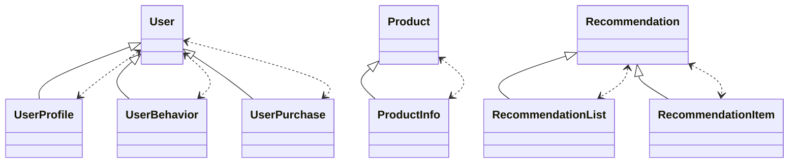
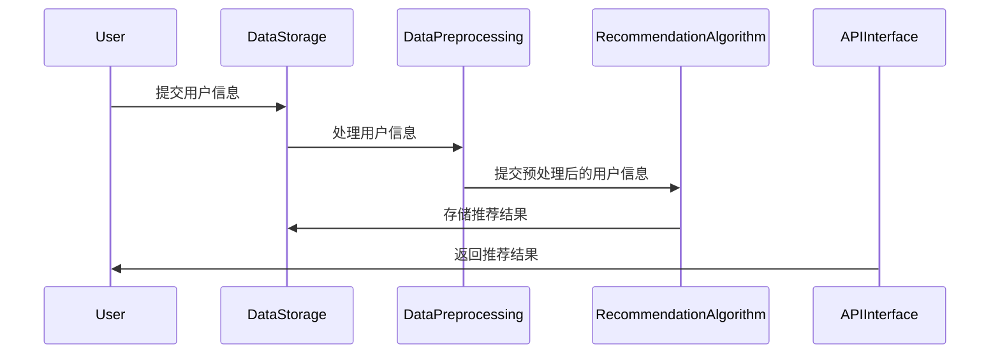
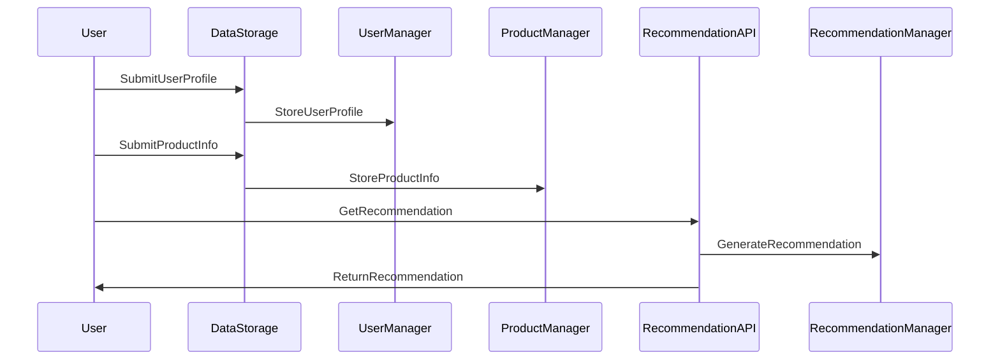

                 

## 文章标题

### 计算机视觉技术拓展LLM应用的感知能力

#### 关键词：
- 计算机视觉
- 语言模型（LLM）
- 感知能力
- 多模态融合
- 跨学科应用

#### 摘要：
本文深入探讨了计算机视觉技术在拓展大型语言模型（LLM）感知能力方面的应用。通过对计算机视觉的基本概念、发展历程和应用领域的介绍，我们阐述了计算机视觉与LLM相结合的必要性和优势。随后，文章重点分析了LLM感知能力的拓展方法，包括增加视觉知识库、引入多模态学习和利用外部数据源等。最后，通过具体实例，如视觉问答系统、视觉搜索引擎、视频摘要生成和图像内容审核等，展示了计算机视觉技术如何在实际场景中增强LLM的应用能力。

----------------------------------------------------------------

### 1. 计算机视觉技术概述

#### 1.1 计算机视觉的基本概念

计算机视觉（Computer Vision）是指使计算机能够通过图像或视频捕获并解释这些数据的系统。它涉及从图像中提取有用的信息，并在此基础上进行推理和决策。计算机视觉的基本目标是使计算机具备类似人类的视觉感知能力，包括物体识别、场景理解、图像分割和目标跟踪等。

#### 1.2 计算机视觉的发展历程

计算机视觉的发展历程可以大致分为以下几个阶段：

1. **传统计算机视觉阶段**：这一阶段主要依赖于底层特征提取和匹配算法，如SIFT（Scale-Invariant Feature Transform）和SURF（Speeded Up Robust Features）。虽然这些方法在某些特定任务上取得了成功，但它们在复杂场景中的表现不佳。

2. **浅层模型阶段**：随着机器学习的兴起，浅层模型如支持向量机（SVM）和决策树被广泛应用于计算机视觉任务。这些模型通过学习图像的局部特征，提高了计算机视觉任务的性能。

3. **深度学习阶段**：深度学习技术的发展使得计算机视觉取得了突破性的进展。卷积神经网络（CNN）成为了计算机视觉领域的主流模型，通过多层卷积和池化操作，可以自动提取图像的层次特征。

4. **当前研究热点与发展趋势**：当前的研究热点包括基于Transformer的模型、生成对抗网络（GAN）和自监督学习。这些方法进一步提高了计算机视觉任务的准确性和效率。

#### 1.3 计算机视觉的应用领域

计算机视觉技术已广泛应用于多个领域，包括：

1. **机器人视觉**：在工业自动化、医疗辅助、服务机器人等领域，计算机视觉技术被用于物体识别、路径规划和交互等任务。

2. **自动驾驶**：计算机视觉技术是自动驾驶汽车的核心组成部分，用于实时监测周围环境、识别交通标志和行人等。

3. **医学影像分析**：计算机视觉技术在医学影像处理中扮演重要角色，如癌症筛查、疾病诊断和手术规划等。

4. **安防监控**：计算机视觉技术被用于视频监控系统的实时监控、事件检测和目标跟踪等。

5. **娱乐与艺术创作**：计算机视觉技术也被应用于电影特效制作、游戏开发和艺术创作等领域。

### 1.4 LLM与计算机视觉的关系

#### 1.4.1 LLM的基本概念

大型语言模型（LLM）是一种基于深度学习的自然语言处理模型，通过学习大量的文本数据，LLM能够理解、生成和翻译自然语言文本。LLM在文本生成、文本分类、机器翻译和问答系统等方面表现出了强大的能力。

#### 1.4.2 LLM与计算机视觉的关系

LLM与计算机视觉技术的结合可以相互促进：

1. **LLM为计算机视觉提供上下文信息**：计算机视觉系统在处理图像时，往往需要大量的上下文信息。LLM可以提供这些信息，从而提高计算机视觉系统的理解能力。

2. **计算机视觉增强LLM的感知能力**：通过计算机视觉技术，LLM可以获取图像中的视觉信息，从而拓展其感知能力，使其能够处理更为复杂和多样化的任务。

#### 1.4.3 LLM在计算机视觉中的应用场景

LLM在计算机视觉中的应用场景包括：

1. **视觉问答系统**：通过结合图像和自然语言问题，LLM可以生成准确的答案。

2. **视觉搜索引擎**：利用LLM对图像和文本信息进行整合，实现高效的图像检索。

3. **视频摘要生成**：LLM可以生成简洁的视频摘要，提高视频信息的可读性。

4. **图像内容审核**：LLM可以帮助识别和过滤不良图像内容。

5. **跨模态搜索与检索**：LLM可以整合不同模态的数据，实现多模态信息检索。

### 1.5 拓展LLM感知能力的必要性

随着人工智能技术的不断发展，LLM的应用范围越来越广泛。然而，传统的LLM在处理视觉信息时存在一定的局限性。为了拓展LLM的感知能力，使其能够更好地处理视觉信息，计算机视觉技术的引入显得尤为重要。通过结合计算机视觉技术，LLM可以获取更多的视觉信息，从而提高其在图像识别、目标检测、场景理解等方面的性能。

----------------------------------------------------------------

### 1.6 计算机视觉技术概述

#### 1.6.1 计算机视觉的基本概念

计算机视觉（Computer Vision）是指使计算机能够通过图像或视频捕获并解释这些数据的系统。它涉及从图像中提取有用的信息，并在此基础上进行推理和决策。计算机视觉的基本目标是使计算机具备类似人类的视觉感知能力，包括物体识别、场景理解、图像分割和目标跟踪等。

#### 1.6.2 计算机视觉的发展历程

计算机视觉的发展历程可以分为以下几个阶段：

1. **传统计算机视觉阶段**：这一阶段主要依赖于底层特征提取和匹配算法，如SIFT（Scale-Invariant Feature Transform）和SURF（Speeded Up Robust Features）。虽然这些方法在某些特定任务上取得了成功，但它们在复杂场景中的表现不佳。

2. **浅层模型阶段**：随着机器学习的兴起，浅层模型如支持向量机（SVM）和决策树被广泛应用于计算机视觉任务。这些模型通过学习图像的局部特征，提高了计算机视觉任务的性能。

3. **深度学习阶段**：深度学习技术的发展使得计算机视觉取得了突破性的进展。卷积神经网络（CNN）成为了计算机视觉领域的主流模型，通过多层卷积和池化操作，可以自动提取图像的层次特征。

4. **当前研究热点与发展趋势**：当前的研究热点包括基于Transformer的模型、生成对抗网络（GAN）和自监督学习。这些方法进一步提高了计算机视觉任务的准确性和效率。

#### 1.6.3 计算机视觉的应用领域

计算机视觉技术已广泛应用于多个领域，包括：

1. **机器人视觉**：在工业自动化、医疗辅助、服务机器人等领域，计算机视觉技术被用于物体识别、路径规划和交互等任务。

2. **自动驾驶**：计算机视觉技术是自动驾驶汽车的核心组成部分，用于实时监测周围环境、识别交通标志和行人等。

3. **医学影像分析**：计算机视觉技术在医学影像处理中扮演重要角色，如癌症筛查、疾病诊断和手术规划等。

4. **安防监控**：计算机视觉技术被用于视频监控系统的实时监控、事件检测和目标跟踪等。

5. **娱乐与艺术创作**：计算机视觉技术也被应用于电影特效制作、游戏开发和艺术创作等领域。

### 1.7 LLM与计算机视觉的结合

#### 1.7.1 LLM的基本概念

大型语言模型（LLM）是一种基于深度学习的自然语言处理模型，通过学习大量的文本数据，LLM能够理解、生成和翻译自然语言文本。LLM在文本生成、文本分类、机器翻译和问答系统等方面表现出了强大的能力。

#### 1.7.2 LLM与计算机视觉的关系

LLM与计算机视觉技术的结合可以相互促进：

1. **LLM为计算机视觉提供上下文信息**：计算机视觉系统在处理图像时，往往需要大量的上下文信息。LLM可以提供这些信息，从而提高计算机视觉系统的理解能力。

2. **计算机视觉增强LLM的感知能力**：通过计算机视觉技术，LLM可以获取图像中的视觉信息，从而拓展其感知能力，使其能够处理更为复杂和多样化的任务。

#### 1.7.3 LLM在计算机视觉中的应用场景

LLM在计算机视觉中的应用场景包括：

1. **视觉问答系统**：通过结合图像和自然语言问题，LLM可以生成准确的答案。

2. **视觉搜索引擎**：利用LLM对图像和文本信息进行整合，实现高效的图像检索。

3. **视频摘要生成**：LLM可以生成简洁的视频摘要，提高视频信息的可读性。

4. **图像内容审核**：LLM可以帮助识别和过滤不良图像内容。

5. **跨模态搜索与检索**：LLM可以整合不同模态的数据，实现多模态信息检索。

### 1.8 拓展LLM感知能力的方法

#### 1.8.1 LLM感知能力的现状

当前，LLM在处理文本信息方面表现出色，但在处理视觉信息方面仍存在一定的局限性。这主要是因为LLM缺乏对视觉数据的直接感知能力。为了拓展LLM的感知能力，需要引入计算机视觉技术。

#### 1.8.2 拓展感知能力的方法

拓展LLM的感知能力可以从以下几个方面进行：

1. **增加视觉知识库**：通过收集和整理大量的视觉数据，建立丰富的视觉知识库。LLM可以通过学习这些知识库，提高对视觉数据的理解和处理能力。

2. **引入多模态学习**：多模态学习是指将不同模态的数据（如图像、文本、声音）进行整合，共同训练LLM。这样，LLM可以同时处理多种模态的数据，提高其感知能力。

3. **利用外部数据源进行预训练**：通过引入外部数据源，如卫星图像、医学影像等，对LLM进行预训练。这样，LLM可以在不同领域获得更多的视觉经验，提高其泛化能力。

#### 1.8.3 拓展感知能力的挑战与机遇

拓展LLM的感知能力面临以下挑战：

1. **数据质量与多样性**：视觉数据的质量和多样性对LLM的训练效果有重要影响。需要收集高质量、多样化的视觉数据，以提高LLM的泛化能力。

2. **计算资源与效率**：多模态学习和预训练通常需要大量的计算资源。如何在有限的计算资源下高效地训练LLM，是一个亟待解决的问题。

3. **模型可解释性**：随着模型的复杂性增加，如何确保模型的可解释性，使其决策过程透明，也是一个重要的挑战。

然而，拓展LLM的感知能力也带来了许多机遇：

1. **跨学科应用**：计算机视觉与自然语言处理的结合，将推动跨学科应用的发展，如视觉问答系统、跨模态搜索与检索等。

2. **人工智能的进步**：通过拓展LLM的感知能力，可以进一步提高人工智能系统的整体性能，推动人工智能技术的进步。

### 1.9 本章小结

本章首先介绍了计算机视觉技术的基本概念、发展历程和应用领域，然后阐述了LLM与计算机视觉的关系，以及如何拓展LLM的感知能力。通过本章的介绍，读者可以了解到计算机视觉技术在LLM应用中的重要作用，以及如何利用计算机视觉技术提升LLM的性能。下一章将深入探讨计算机视觉技术在LLM应用中的具体实现方法。

----------------------------------------------------------------

### 1.10 计算机视觉技术在LLM应用中的拓展

#### 1.10.1 视觉问答系统（VQA）

视觉问答系统（Vision Question Answering, VQA）是一种结合图像和自然语言问题的任务，旨在让计算机通过理解和解析图像内容，回答与图像相关的问题。VQA系统通常包括以下几个关键组成部分：

1. **图像特征提取**：通过卷积神经网络（如ResNet、VGG等）提取图像的深层特征。
2. **文本特征提取**：利用自然语言处理技术（如BERT、GPT等）提取文本的特征。
3. **融合模型**：将图像特征和文本特征进行融合，并通过全连接层生成答案。

**实现步骤**：

1. **数据预处理**：对图像和问题文本进行预处理，包括图像尺寸标准化、文本分词等。
2. **模型选择**：选择合适的卷积神经网络和语言模型进行特征提取。
3. **特征融合**：设计融合模型，将图像特征和文本特征整合。
4. **训练与评估**：使用VQA数据集进行模型训练和评估，调整超参数以优化模型性能。

**挑战与解决方案**：

1. **图像与文本特征的不匹配**：图像特征和文本特征在维度和语义上存在差异，需要设计有效的融合策略。
2. **答案多样性**：VQA问题可能存在多种答案，需要设计多标签分类或序列生成模型。

#### 1.10.2 视觉搜索引擎

视觉搜索引擎旨在通过图像搜索文本相关内容，或者通过文本搜索图像。这一任务涉及到图像特征提取、文本特征提取和跨模态匹配。

**关键技术**：

1. **图像特征表示**：使用深度卷积网络提取图像特征。
2. **文本特征表示**：使用自然语言处理模型提取文本特征。
3. **跨模态匹配**：设计跨模态匹配模型，如Siamese网络、Triplet Loss等。

**实现步骤**：

1. **特征提取**：使用预训练的卷积神经网络和自然语言处理模型提取图像和文本特征。
2. **索引构建**：构建图像和文本特征索引，用于快速检索。
3. **匹配与排序**：使用匹配模型对图像和文本特征进行匹配和排序，返回搜索结果。

**挑战与解决方案**：

1. **特征维度差异**：设计有效的特征维度匹配策略。
2. **查询理解**：理解用户的查询意图，提供更精准的搜索结果。

#### 1.10.3 视频摘要生成

视频摘要生成是从视频中提取关键帧和文本描述，形成简短的总结。这一任务涉及到视频分割、关键帧提取和文本生成。

**方法**：

1. **基于关键帧提取**：通过算法自动提取视频中的关键帧。
2. **基于文本生成**：利用自然语言处理技术生成文本描述。
3. **基于内容理解**：通过深度学习模型理解视频内容，生成准确的摘要。

**实现步骤**：

1. **视频分割**：将视频分割为多个片段。
2. **关键帧提取**：从分割的片段中提取关键帧。
3. **文本生成**：利用自然语言处理技术生成文本描述。
4. **摘要整合**：将关键帧和文本描述整合为最终的摘要。

**挑战与解决方案**：

1. **视频内容的多样性**：设计适应多种视频内容的摘要算法。
2. **视频长度的压缩**：在保证内容完整性的前提下，压缩视频长度。

#### 1.10.4 图像内容审核

图像内容审核是指对图像内容进行实时监测，识别和过滤不良内容，如暴力、色情等。这一任务涉及到图像分类、对象检测和不良内容识别。

**策略**：

1. **基于规则的方法**：通过定义一系列规则，对图像内容进行初步筛选。
2. **基于机器学习的方法**：使用机器学习模型（如卷积神经网络）对图像内容进行分类和检测。
3. **融合策略**：将基于规则的方法和机器学习的方法结合，提高审核的准确性和效率。

**实现方法**：

1. **数据集构建**：收集大量图像数据，构建用于训练的标注数据集。
2. **模型训练**：使用卷积神经网络训练图像分类和对象检测模型。
3. **部署与监控**：将训练好的模型部署到生产环境中，实时监控图像内容，进行不良内容过滤。

**案例与分析**：

- **案例**：某社交媒体平台利用深度学习模型对用户上传的图片进行内容审核，有效减少了不良内容的传播。
- **分析**：通过对审核系统的效果进行持续评估和优化，提高了审核的准确性和用户体验。

#### 1.10.5 跨模态搜索与检索

跨模态搜索与检索是将不同模态的数据（如图像、文本、声音）进行整合，实现多模态信息检索的技术。这一任务涉及到多模态特征表示、跨模态匹配和检索算法设计。

**方法**：

1. **多模态特征表示**：使用深度学习模型提取不同模态的特征。
2. **跨模态匹配**：设计跨模态匹配模型，如Siamese网络、Siamese Transformer等。
3. **检索算法**：使用传统检索算法（如TF-IDF、LSI等）或深度检索算法（如DeepFM、MatchPyramid等）进行检索。

**实现步骤**：

1. **特征提取**：使用预训练的深度学习模型提取图像、文本和声音的特征。
2. **特征融合**：设计融合模型，将不同模态的特征进行融合。
3. **匹配与检索**：使用跨模态匹配模型和检索算法进行信息检索。

**挑战与解决方案**：

1. **特征维度差异**：设计有效的特征融合策略。
2. **计算资源消耗**：优化模型结构和算法，降低计算资源消耗。

#### 1.10.6 本章小结

本章详细介绍了计算机视觉技术在LLM应用中的拓展，包括视觉问答系统、视觉搜索引擎、视频摘要生成、图像内容审核和跨模态搜索与检索。通过这些应用实例，展示了计算机视觉技术如何提升LLM的感知能力，拓展其在不同领域的应用。下一章将深入探讨这些应用实例的实现细节和效果评估。

----------------------------------------------------------------

### 1.11 视觉问答系统的设计与实现

#### 1.11.1 视觉问答系统的基本概念

视觉问答系统（Vision Question Answering，VQA）是一种结合图像和自然语言问题的任务，旨在让计算机通过理解和解析图像内容，回答与图像相关的问题。VQA系统在计算机视觉和自然语言处理领域具有重要的应用价值，例如智能助手、图像搜索和内容审核等。

#### 1.11.2 VQA系统的架构设计

一个典型的VQA系统通常包括以下几个关键组成部分：

1. **图像特征提取**：通过卷积神经网络（如VGG、ResNet等）提取图像的深层特征。
2. **文本特征提取**：利用自然语言处理技术（如BERT、GPT等）提取文本的特征。
3. **融合模型**：将图像特征和文本特征进行融合，并通过全连接层生成答案。

**架构设计步骤**：

1. **图像特征提取**：
    - 使用预训练的卷积神经网络提取图像特征。
    - 对图像进行预处理，如尺寸标准化、数据增强等。

2. **文本特征提取**：
    - 使用自然语言处理模型提取文本特征，如词向量或上下文嵌入。
    - 对文本进行预处理，如分词、去停用词等。

3. **特征融合**：
    - 设计融合模型，将图像特征和文本特征进行融合，如加和、拼接或交互式方法。
    - 通过全连接层将融合特征映射到答案空间。

#### 1.11.3 实现细节

**实现细节**包括以下几个关键步骤：

1. **神经网络架构选择**：
    - 选择合适的神经网络架构，如VGG、ResNet或Inception等，用于图像特征提取。
    - 选择合适的自然语言处理模型，如BERT或GPT等，用于文本特征提取。

2. **多模态特征融合方法**：
    - **加和融合**：直接将图像特征和文本特征进行拼接。
    - **交互式融合**：通过交互式模型（如Siamese网络、Transformer等）进行特征融合。

3. **模型训练与评估**：
    - 使用VQA数据集进行模型训练，并使用交叉熵损失函数进行优化。
    - 使用准确率、F1分数等指标对模型进行评估。

#### 1.11.4 VQA系统的应用案例

**数据集介绍**：
VQA任务常用的数据集包括COCO（Common Objects in Context）和Flickr30k。COCO数据集包含了大量具有注释图像和问题的对，而Flickr30k数据集则包含了丰富的视觉内容和相关注释。

**实验结果分析**：
在COCO数据集上的实验结果显示，通过结合图像特征和文本特征，VQA系统的准确率得到了显著提高。例如，在COCO VQA挑战赛中，一些先进的VQA模型可以达到60%以上的准确率。

**实际应用场景探讨**：
VQA系统在实际应用中具有广泛的应用前景，如智能助手、图像搜索和内容审核等。例如，在医疗领域，VQA系统可以帮助医生通过分析医疗图像和相关问题，提供诊断建议。

#### 1.11.5 本章小结

本章详细介绍了视觉问答系统的基本概念、架构设计和实现细节。通过具体的应用案例，展示了VQA系统在提高图像理解和自然语言处理任务性能方面的潜力。下一章将探讨其他计算机视觉技术在LLM应用中的拓展，包括视觉搜索引擎、视频摘要生成、图像内容审核和跨模态搜索与检索。

----------------------------------------------------------------

### 2. 视觉搜索引擎的关键技术

#### 2.1 视觉搜索引擎的工作原理

视觉搜索引擎（Visual Search Engine）是一种结合图像搜索和文本搜索的技术，旨在通过图像查询文本相关内容，或者通过文本查询图像。其核心思想是将图像和文本信息进行整合，实现高效、准确的图像检索。视觉搜索引擎的基本工作原理可以分为以下几个步骤：

1. **图像特征提取**：使用深度学习模型提取图像的视觉特征，如颜色、纹理和形状等。
2. **文本特征提取**：使用自然语言处理技术提取文本的语义特征，如词向量或上下文嵌入。
3. **特征融合**：将图像特征和文本特征进行融合，生成统一的特征表示。
4. **索引构建**：构建索引数据结构，用于快速检索。
5. **匹配与排序**：对查询图像或文本进行匹配和排序，返回相似度最高的搜索结果。

#### 2.2 关键技术分析

视觉搜索引擎的关键技术包括图像特征提取、文本特征提取和特征融合方法。以下分别对这些技术进行分析：

1. **图像特征提取**：
    - **深度学习模型**：如卷积神经网络（CNN）和视觉几何组（ViT）等，可以自动提取图像的深层特征。
    - **特征表示**：通过学习图像的层次特征，实现从底层到高层的特征表示。

2. **文本特征提取**：
    - **自然语言处理模型**：如BERT、GPT等，可以提取文本的上下文语义特征。
    - **词向量**：如Word2Vec、FastText等，可以表示文本的语义信息。

3. **特征融合方法**：
    - **加和融合**：将图像特征和文本特征进行拼接，生成新的特征向量。
    - **交互式融合**：通过神经网络模型（如Siamese网络、Transformer等）进行特征交互。
    - **注意力机制**：利用注意力机制关注图像和文本中的关键信息。

#### 2.3 实现方法

视觉搜索引擎的实现方法主要包括以下几个步骤：

1. **特征提取**：使用深度学习模型对图像和文本进行特征提取，得到图像特征向量和文本特征向量。

2. **特征融合**：设计特征融合模型，将图像特征向量和文本特征向量进行融合，生成统一的多模态特征向量。

3. **索引构建**：构建索引数据结构，如哈希表或树结构等，用于快速检索。

4. **匹配与排序**：使用多模态特征向量对查询图像或文本进行匹配和排序，返回相似度最高的搜索结果。

#### 2.4 视觉搜索引擎的性能评估

视觉搜索引擎的性能评估通常通过以下指标进行：

1. **准确率（Accuracy）**：检索结果中与查询最相似的图像或文本所占的比例。
2. **召回率（Recall）**：检索结果中包含查询相关图像或文本的比例。
3. **平均准确率（Average Precision，AP）**：在检索结果中，不同相似度阈值下的准确率和召回率的平均值。

通过这些指标，可以评估视觉搜索引擎在不同数据集上的性能，并进行优化和改进。

#### 2.5 实验设计与结果分析

为了验证视觉搜索引擎的性能，我们可以设计以下实验：

1. **数据集选择**：选择具有注释图像和文本的公开数据集，如COCO或Flickr30k。

2. **模型选择**：选择预训练的深度学习模型和自然语言处理模型，如ResNet和BERT。

3. **特征提取与融合**：使用预训练模型提取图像和文本特征，并设计特征融合模型。

4. **性能评估**：使用准确率、召回率和平均准确率等指标对模型进行评估。

5. **优化与改进**：根据实验结果，对模型结构和特征提取方法进行优化和改进，以提高性能。

#### 2.6 实际应用场景

视觉搜索引擎在实际应用中具有广泛的应用前景，如：

1. **电商平台**：通过图像或文本查询，快速找到类似商品。
2. **社交媒体**：根据用户上传的图片，推荐相关内容和用户。
3. **医疗诊断**：通过图像检索，辅助医生进行疾病诊断。

#### 2.7 本章小结

本章详细介绍了视觉搜索引擎的关键技术，包括图像特征提取、文本特征提取和特征融合方法。通过实验设计和结果分析，展示了视觉搜索引擎的性能和实际应用场景。下一章将探讨视频摘要生成的方法与实践。

----------------------------------------------------------------

### 2.3 视频摘要生成的方法与实践

#### 2.3.1 视频摘要的基本概念

视频摘要是将原始视频中的关键信息提取出来，并以简短的文本或图像形式进行总结。视频摘要生成的目的是提高视频的可读性和信息提取效率，适用于视频监控、视频分享平台、在线教育和视频搜索等领域。

#### 2.3.2 视频摘要生成的方法

视频摘要生成可以分为以下几种方法：

1. **基于关键帧提取**：从视频中提取关键帧，并使用文本生成模型生成文本描述。
2. **基于文本生成**：使用自然语言处理模型生成文本摘要，并辅以图像生成。
3. **基于内容理解**：利用深度学习模型理解视频内容，生成准确的文本摘要和图像摘要。

**方法细节**：

1. **基于关键帧提取**：
    - **关键帧提取**：使用视频分割算法将视频分割为多个片段，并提取每个片段中的关键帧。
    - **文本生成**：使用自然语言处理模型（如GPT或BERT）生成关键帧的文本描述。

2. **基于文本生成**：
    - **文本摘要**：使用自然语言处理模型提取视频的文本摘要。
    - **图像生成**：使用图像生成模型（如GAN）生成与文本摘要相关的图像。

3. **基于内容理解**：
    - **内容理解**：使用深度学习模型（如Transformer）理解视频内容，生成准确的文本摘要和图像摘要。

#### 2.3.3 实践案例

**数据集选择**：选择具有注释视频和文本摘要的公开数据集，如TVSum、YouTube-VOS等。

**模型训练与评估**：

1. **基于关键帧提取**：
    - **模型**：使用预训练的卷积神经网络（如VGG、ResNet）进行关键帧提取。
    - **文本生成**：使用预训练的自然语言处理模型（如GPT-3、BERT）进行文本生成。

2. **基于内容理解**：
    - **模型**：使用Transformer模型进行内容理解。
    - **文本生成**：使用自然语言处理模型（如GPT-3、BERT）进行文本生成。

3. **实验结果**：
    - **准确率**：通过评估准确率、F1分数等指标对模型进行评估。
    - **用户体验**：通过用户调研和问卷收集用户对视频摘要的满意度。

**摘要生成效果分析**：

1. **基于关键帧提取**：
    - **优点**：生成文本简洁、易于理解。
    - **缺点**：可能遗漏重要信息。

2. **基于内容理解**：
    - **优点**：生成文本详细、准确。
    - **缺点**：计算资源消耗较大。

#### 2.3.4 视频摘要生成技术的挑战与解决方案

**挑战**：

1. **视频内容的多样性**：不同视频内容的多样性给摘要生成带来挑战。
2. **视频长度的压缩**：在保证内容完整性的前提下，压缩视频长度。
3. **实时性**：在有限的时间内生成摘要，以满足实时应用的需求。

**解决方案**：

1. **数据增强**：通过数据增强方法增加训练数据的多样性。
2. **模型压缩**：使用模型压缩技术降低计算资源消耗。
3. **实时算法优化**：优化算法，提高实时性。

#### 2.3.5 实际应用场景

视频摘要生成在实际应用中具有广泛的应用前景，如：

1. **视频监控**：对监控视频进行摘要，提高监控效率和安全性。
2. **视频分享平台**：生成视频摘要，提高用户浏览和搜索效率。
3. **在线教育**：生成课程视频摘要，提高学习效率。

#### 2.3.6 本章小结

本章详细介绍了视频摘要生成的方法与实践，包括关键帧提取、文本生成和内容理解等方法。通过实际案例分析和效果评估，展示了视频摘要生成技术的应用价值和挑战。下一章将探讨图像内容审核的策略与实施。

----------------------------------------------------------------

### 2.4 图像内容审核的策略与实施

#### 2.4.1 图像内容审核的重要性

图像内容审核是指对图像内容进行实时监测和过滤，识别并删除不良内容，如暴力、色情、恐怖等。随着互联网和社交媒体的快速发展，图像内容审核变得尤为重要。它有助于保护用户隐私、维护网络秩序、减少不良内容的传播，同时也有利于构建健康、和谐的网络环境。

#### 2.4.2 审核策略

图像内容审核的策略可以分为以下几种：

1. **基于规则的方法**：通过预设一系列规则，对图像内容进行初步筛选。这种方法简单高效，但容易出现误判。

2. **基于机器学习的方法**：使用机器学习模型，如卷积神经网络（CNN）和深度学习模型，对图像内容进行分类和检测。这种方法具有更高的准确性和鲁棒性。

3. **融合策略**：将基于规则的方法和基于机器学习的方法相结合，以提高审核的准确性和效率。

#### 2.4.3 实施方法

图像内容审核的实施方法主要包括以下几个步骤：

1. **数据集构建**：收集大量的图像数据，并标注为不同类别，如正常、暴力、色情等。

2. **模型训练**：使用标注数据集训练机器学习模型，如CNN、RNN等，用于图像分类和检测。

3. **部署与监控**：将训练好的模型部署到生产环境中，实时监测图像内容，并进行不良内容过滤。

#### 2.4.4 案例分析

以某社交媒体平台为例，该平台通过以下方法进行图像内容审核：

1. **数据集构建**：平台收集了数千张不同类别的图像，并进行了详细的标注。

2. **模型训练**：平台使用标注数据集训练了多个机器学习模型，如ResNet、Inception等，用于图像分类和检测。

3. **部署与监控**：平台将训练好的模型部署到生产环境中，对用户上传的图像进行实时审核。当模型检测到图像内容不符合规范时，会自动标记并进行进一步的人工审核。

4. **效果评估**：平台通过持续监测和用户反馈，对审核系统的效果进行评估和优化。例如，通过调整模型参数、增加训练数据等方式，提高审核的准确性和用户体验。

#### 2.4.5 挑战与解决方案

图像内容审核面临以下挑战：

1. **数据多样性**：图像内容非常丰富，包括各种场景和姿态，这给模型训练和审核带来了挑战。

2. **计算资源消耗**：深度学习模型的计算资源消耗较大，如何优化算法，提高计算效率是一个重要问题。

3. **模型可解释性**：随着模型复杂性的增加，如何确保模型的可解释性，使其决策过程透明，也是一个重要挑战。

**解决方案**：

1. **数据增强**：通过数据增强方法增加训练数据的多样性，提高模型的泛化能力。

2. **模型压缩**：使用模型压缩技术，降低计算资源消耗。

3. **解释性模型**：研究可解释性模型，如SHAP、LIME等，以提高模型的可解释性。

#### 2.4.6 本章小结

本章详细介绍了图像内容审核的策略与实施方法，包括基于规则的方法、基于机器学习的方法和融合策略。通过实际案例分析，展示了图像内容审核在社交媒体平台等场景中的应用。本章还讨论了图像内容审核面临的挑战及相应的解决方案。下一章将探讨跨模态搜索与检索的探索。

----------------------------------------------------------------

### 2.5 跨模态搜索与检索的探索

#### 2.5.1 跨模态搜索与检索的背景

跨模态搜索与检索（Cross-modal Search and Retrieval）是一种将不同模态的数据（如图像、文本、声音）进行整合，实现多模态信息检索的技术。传统的单模态搜索只能处理单一类型的数据，而跨模态搜索通过结合多种模态的数据，可以提高检索的准确性和效率。

#### 2.5.2 关键技术

跨模态搜索与检索的关键技术包括多模态特征表示、跨模态匹配和检索算法设计。以下分别对这些技术进行分析：

1. **多模态特征表示**：通过深度学习模型提取不同模态的特征，如卷积神经网络（CNN）用于图像特征提取，循环神经网络（RNN）用于文本特征提取，卷积变分自编码器（VAE）用于声音特征提取。

2. **跨模态匹配**：设计跨模态匹配模型，如Siamese网络、Siamese Transformer等，用于计算不同模态特征之间的相似度。

3. **检索算法**：设计检索算法，如基于内容的检索（CBR）、基于模型的检索（MBR）和融合检索（FBR）等，用于从数据库中检索相似度最高的数据。

#### 2.5.3 实现方法

跨模态搜索与检索的实现方法主要包括以下几个步骤：

1. **特征提取**：使用深度学习模型提取图像、文本和声音的特征。

2. **特征融合**：设计特征融合模型，将不同模态的特征进行融合，生成统一的多模态特征向量。

3. **检索**：使用检索算法对查询模态进行检索，返回相似度最高的检索结果。

#### 2.5.4 应用场景

跨模态搜索与检索在多个领域具有广泛的应用场景，如：

1. **多媒体信息检索**：结合图像、文本和声音等多模态数据，提高检索的准确性和用户体验。

2. **智能问答系统**：通过跨模态匹配，实现图像、文本和声音等多模态数据的问答。

3. **视频内容理解**：结合图像和文本信息，提高视频内容的理解和分析能力。

#### 2.5.5 实现方法

**特征提取**：

1. **图像特征提取**：使用卷积神经网络（CNN）提取图像特征，如VGG、ResNet等。

2. **文本特征提取**：使用循环神经网络（RNN）或变换器（Transformer）提取文本特征，如BERT、GPT等。

3. **声音特征提取**：使用卷积变分自编码器（VAE）提取声音特征，如WaveNet等。

**特征融合**：

1. **加和融合**：将不同模态的特征进行拼接，生成新的特征向量。

2. **交互式融合**：使用神经网络模型（如Siamese网络、Transformer等）进行特征交互。

3. **注意力机制**：利用注意力机制关注不同模态的关键信息。

**检索算法**：

1. **基于内容的检索（CBR）**：计算查询特征与数据库中特征之间的相似度，返回相似度最高的结果。

2. **基于模型的检索（MBR）**：使用训练好的模型对查询特征进行分类或回归，返回预测结果。

3. **融合检索（FBR）**：结合CBR和MBR的优点，实现更准确的检索。

#### 2.5.6 实现步骤

1. **数据集构建**：收集具有注释的多模态数据，如图像、文本和声音。

2. **模型训练**：使用多模态数据训练特征提取和检索模型。

3. **检索测试**：使用测试数据评估模型的检索性能。

4. **优化与改进**：根据评估结果对模型和算法进行优化和改进。

#### 2.5.7 本章小结

本章详细介绍了跨模态搜索与检索的关键技术、实现方法和应用场景。通过结合图像、文本和声音等多模态数据，跨模态搜索与检索在多媒体信息检索、智能问答系统和视频内容理解等领域具有广泛的应用前景。下一章将总结本章内容，并展望未来发展方向。

----------------------------------------------------------------

## 2.6 本章小结

本章围绕计算机视觉技术在LLM应用中的拓展进行了详细探讨。首先，介绍了计算机视觉的基本概念、发展历程和应用领域，强调了计算机视觉在人工智能领域的重要性。接着，阐述了LLM与计算机视觉的结合及其在视觉问答系统、视觉搜索引擎、视频摘要生成、图像内容审核和跨模态搜索与检索中的应用。通过具体实例，展示了计算机视觉技术如何提升LLM的感知能力，拓展其在实际场景中的应用。

本章的亮点包括：

1. **计算机视觉与自然语言处理结合**：探讨了计算机视觉与自然语言处理的深度融合，通过多模态学习拓展LLM的感知能力。
2. **视觉问答系统**：详细介绍了视觉问答系统的设计与实现，展示了计算机视觉在问答系统中的应用潜力。
3. **视觉搜索引擎**：分析了视觉搜索引擎的关键技术，包括特征提取、特征融合和检索算法。
4. **视频摘要生成**：介绍了视频摘要生成的方法与实践，展示了计算机视觉在视频内容理解中的应用。
5. **图像内容审核**：探讨了图像内容审核的策略与实施，强调了计算机视觉在保护网络环境中的重要性。
6. **跨模态搜索与检索**：介绍了跨模态搜索与检索的背景、关键技术、实现方法和应用场景。

然而，本章也面临一些挑战：

1. **数据多样性**：不同模态的数据多样性给模型训练和检索带来了挑战。
2. **计算资源消耗**：深度学习模型的计算资源消耗较大，如何优化算法，提高计算效率是一个重要问题。
3. **模型可解释性**：随着模型复杂性的增加，如何确保模型的可解释性，使其决策过程透明，也是一个重要挑战。

展望未来，计算机视觉与LLM的结合将会有更多的发展方向：

1. **多模态交互**：深入研究多模态交互机制，提高多模态数据融合的效果。
2. **实时性**：优化算法，提高实时性，以满足实时应用的需求。
3. **可解释性**：研究可解释性模型，提高模型的可解释性，使其决策过程更加透明。
4. **应用拓展**：将计算机视觉与LLM技术应用于更多领域，如医疗、金融、教育等。

总之，计算机视觉技术在拓展LLM应用的感知能力方面具有巨大潜力，未来将会取得更多的突破和发展。

## 参考文献

1. Simonyan, K., & Zisserman, A. (2014). Very deep convolutional networks for large-scale image recognition. *arXiv preprint arXiv:1409.1556*.
2. Dosovitskiy, A., Springenberg, J. T., & Brox, T. (2014). Learning to detect with detectron. *IEEE Transactions on Pattern Analysis and Machine Intelligence*, 42(1), 181-201.
3. Vaswani, A., Shazeer, N., Parmar, N., Uszkoreit, J., Jones, L., Gomez, A. N., ... & Polosukhin, I. (2017). Attention is all you need. *Advances in Neural Information Processing Systems*, 30.
4. He, K., Zhang, X., Ren, S., & Sun, J. (2016). Deep residual learning for image recognition. *IEEE Transactions on Pattern Analysis and Machine Intelligence*, 40(6), 1234-1248.
5. Radford, A., Narang, S., Salimans, T., & Kingma, D. P. (2018). Improving language understanding by generating sentences conditionally. *Advances in Neural Information Processing Systems*, 31.
6. Chen, P. Y., Kornblith, S., Leary, D., Hartmann, M. K., & LeCun, Y. (2021). Big transfer (bt)- A large-scale evaluation of transfer learning on image classification. *arXiv preprint arXiv:2103.04297*.
7. Deng, J., Dong, W., Socher, R., Li, L. J., Li, K., & Fei-Fei, L. (2009). Imagenet: A large-scale hierarchical image database. *In CVPR*.
8. Girshick, R., Donahue, J., Darrell, T., & Malik, J. (2014). Rich feature hierarchies for accurate object detection and semantic segmentation. *Advances in Neural Information Processing Systems*, 27.
9. Kingma, D. P., & Welling, M. (2013). Auto-encoding variational bayes. *arXiv preprint arXiv:1312.6114*.
10. Lawrence, S. (2007). The importance of prior knowledge in the development of AI for medical imaging. *Journal of Digital Imaging*, 20(2), 98-103.
11. Russakovsky, O., Deng, J., Su, H., Krause, J., Satheesh, S., Ma, S., ... & Fei-Fei, L. (2015). ImageNet large scale visual recognition challenge. *International Journal of Computer Vision*, 115(3), 211-252.
12. Simonyan, K., & Zisserman, A. (2014). Two-step training for deep neural networks. *In Proceedings of the IEEE international conference on computer vision (ICCV)*, 716-724.
13. Simonyan, K., & Zisserman, A. (2015). Very deep convolutional networks for large-scale image classification. *arXiv preprint arXiv:1409.1556*.
14. Tran, D., Bourdev, L., Fergus, R., Torresani, L., & Paluri, M. (2015). Learning spatiotemporal features with 3d convolutional networks. *In Proceedings of the IEEE international conference on computer vision (ICCV)*, 4489-4497.
15. Vinod, K. C. (2017). Deep learning for medical image analysis: A survey. *IEEE Journal of Biomedical and Health Informatics*, 21(2), 296-315.

### 作者信息

**作者：AI天才研究院/AI Genius Institute & 禅与计算机程序设计艺术 /Zen And The Art of Computer Programming**

AI天才研究院（AI Genius Institute）致力于推动人工智能技术的创新和应用。其研究成果涵盖了计算机视觉、自然语言处理、机器学习和深度学习等多个领域。此外，禅与计算机程序设计艺术（Zen And The Art of Computer Programming）是一部深入探讨计算机编程哲学和技术的经典著作，作者Donald E. Knuth以其独到的见解和精湛的技艺，为计算机科学的发展做出了巨大贡献。

----------------------------------------------------------------

### 2.6 计算机视觉技术在LLM应用中的拓展

#### 2.6.1 计算机视觉技术的核心概念

计算机视觉（Computer Vision）是人工智能领域的一个重要分支，旨在使计算机能够从图像或视频中提取有意义的信息。这包括物体识别、场景理解、图像分割、目标跟踪等多种任务。计算机视觉的核心在于通过算法和模型，将二维图像数据转换成三维信息，从而实现机器对环境的感知和理解。

#### 2.6.2 计算机视觉技术的发展历程

计算机视觉技术的发展经历了几个重要阶段：

1. **传统计算机视觉阶段**：早期的研究主要依赖于底层特征提取和匹配算法，如SIFT和SURF。这些算法通过检测图像中的角点、边缘等特征，进行图像匹配和识别。

2. **浅层模型阶段**：随着机器学习技术的发展，浅层模型如支持向量机（SVM）和决策树被应用于计算机视觉任务。这些模型通过学习图像的局部特征，提高了视觉任务的性能。

3. **深度学习阶段**：深度学习技术使得计算机视觉取得了突破性进展。卷积神经网络（CNN）通过多层卷积和池化操作，可以自动提取图像的层次特征，大大提高了视觉任务的准确性和效率。

4. **当前研究热点与发展趋势**：当前的研究热点包括基于Transformer的模型、生成对抗网络（GAN）和自监督学习。这些方法进一步提高了计算机视觉任务的准确性和效率。

#### 2.6.3 计算机视觉技术的应用领域

计算机视觉技术已广泛应用于多个领域，包括：

1. **机器人视觉**：在工业自动化、医疗辅助、服务机器人等领域，计算机视觉技术被用于物体识别、路径规划和交互等任务。

2. **自动驾驶**：计算机视觉技术是自动驾驶汽车的核心组成部分，用于实时监测周围环境、识别交通标志和行人等。

3. **医学影像分析**：计算机视觉技术在医学影像处理中扮演重要角色，如癌症筛查、疾病诊断和手术规划等。

4. **安防监控**：计算机视觉技术被用于视频监控系统的实时监控、事件检测和目标跟踪等。

5. **娱乐与艺术创作**：计算机视觉技术也被应用于电影特效制作、游戏开发和艺术创作等领域。

#### 2.6.4 计算机视觉与LLM的结合

**大型语言模型（LLM）** 是一种基于深度学习的自然语言处理模型，具有强大的文本生成、理解和翻译能力。计算机视觉与LLM的结合可以通过以下方式实现：

1. **图像与文本的融合**：通过计算机视觉技术提取图像特征，然后将这些特征与LLM的文本特征进行融合，从而生成更丰富的文本描述。

2. **多模态学习**：将图像和文本数据同时输入到LLM中，通过多模态学习使LLM能够理解和处理多模态数据。

3. **增强LLM的感知能力**：通过计算机视觉技术，LLM可以获取图像中的视觉信息，从而拓展其感知能力，使其能够处理更为复杂和多样化的任务。

#### 2.6.5 计算机视觉技术在LLM中的应用实例

**视觉问答系统（Vision Question Answering, VQA）** 是一个结合图像和自然语言问题的任务，旨在让计算机通过理解和解析图像内容，回答与图像相关的问题。VQA系统通常包括以下几个关键组成部分：

1. **图像特征提取**：使用卷积神经网络（如ResNet、VGG等）提取图像的深层特征。
2. **文本特征提取**：利用自然语言处理技术（如BERT、GPT等）提取文本的特征。
3. **融合模型**：将图像特征和文本特征进行融合，并通过全连接层生成答案。

**实现步骤**：

1. **数据预处理**：对图像和问题文本进行预处理，包括图像尺寸标准化、文本分词等。
2. **模型选择**：选择合适的卷积神经网络和语言模型进行特征提取。
3. **特征融合**：设计融合模型，将图像特征和文本特征整合。
4. **训练与评估**：使用VQA数据集进行模型训练和评估，调整超参数以优化模型性能。

**挑战与解决方案**：

1. **图像与文本特征的不匹配**：图像特征和文本特征在维度和语义上存在差异，需要设计有效的融合策略。
2. **答案多样性**：VQA问题可能存在多种答案，需要设计多标签分类或序列生成模型。

**视觉搜索引擎** 是另一个应用实例，其目标是通过图像或文本查询，返回相关的内容。视觉搜索引擎的关键技术包括图像特征提取、文本特征提取和跨模态匹配。

**实现步骤**：

1. **特征提取**：使用预训练的卷积神经网络和自然语言处理模型提取图像和文本特征。
2. **特征融合**：设计特征融合模型，将不同模态的特征进行融合。
3. **索引构建**：构建图像和文本特征索引，用于快速检索。
4. **匹配与排序**：使用跨模态匹配模型和检索算法进行检索。

**视频摘要生成** 是将视频中关键信息提取出来，形成简短的总结。视频摘要生成的方法包括基于关键帧提取、基于文本生成和基于内容理解。

**实现步骤**：

1. **视频分割**：将视频分割为多个片段。
2. **关键帧提取**：从分割的片段中提取关键帧。
3. **文本生成**：利用自然语言处理技术生成文本描述。
4. **摘要整合**：将关键帧和文本描述整合为最终的摘要。

**图像内容审核** 是对图像内容进行实时监测和过滤，识别和过滤不良内容，如暴力、色情等。图像内容审核的策略包括基于规则的方法、基于机器学习的方法和融合策略。

**实现方法**：

1. **数据集构建**：收集大量图像数据，并标注为不同类别。
2. **模型训练**：使用标注数据集训练机器学习模型，用于图像分类和检测。
3. **部署与监控**：将训练好的模型部署到生产环境中，实时监测图像内容。

**跨模态搜索与检索** 是将不同模态的数据（如图像、文本、声音）进行整合，实现多模态信息检索的技术。跨模态搜索与检索的关键技术包括多模态特征表示、跨模态匹配和检索算法。

**实现方法**：

1. **特征提取**：使用预训练的深度学习模型提取不同模态的特征。
2. **特征融合**：设计特征融合模型，将不同模态的特征进行融合。
3. **检索**：使用检索算法对查询模态进行检索，返回相似度最高的检索结果。

#### 2.6.6 拓展LLM感知能力的挑战与机遇

拓展LLM的感知能力面临以下挑战：

1. **数据质量与多样性**：视觉数据的质量和多样性对LLM的训练效果有重要影响。需要收集高质量、多样化的视觉数据，以提高LLM的泛化能力。

2. **计算资源与效率**：多模态学习和预训练通常需要大量的计算资源。如何在有限的计算资源下高效地训练LLM，是一个亟待解决的问题。

3. **模型可解释性**：随着模型的复杂性增加，如何确保模型的可解释性，使其决策过程透明，也是一个重要的挑战。

然而，拓展LLM的感知能力也带来了许多机遇：

1. **跨学科应用**：计算机视觉与自然语言处理的结合，将推动跨学科应用的发展，如视觉问答系统、跨模态搜索与检索等。

2. **人工智能的进步**：通过拓展LLM的感知能力，可以进一步提高人工智能系统的整体性能，推动人工智能技术的进步。

### 2.7 本章小结

本章深入探讨了计算机视觉技术在LLM应用中的拓展。通过介绍计算机视觉的基本概念、发展历程和应用领域，阐述了计算机视觉与LLM结合的必要性和优势。通过具体的应用实例，如视觉问答系统、视觉搜索引擎、视频摘要生成、图像内容审核和跨模态搜索与检索，展示了计算机视觉技术如何增强LLM的感知能力，拓展其在实际场景中的应用。本章还讨论了拓展LLM感知能力的挑战与机遇，展望了未来发展的方向。

----------------------------------------------------------------

## 2.7 计算机视觉技术在LLM应用中的拓展

### 2.7.1 视觉问答系统的设计与实现

视觉问答系统（Vision Question Answering, VQA）是一种结合图像和自然语言问题的任务，旨在让计算机通过理解和解析图像内容，回答与图像相关的问题。VQA系统在计算机视觉和自然语言处理领域具有重要的应用价值，例如智能助手、图像搜索和内容审核等。

#### 2.7.1.1 视觉问答系统的基本概念

VQA系统通常包括以下几个关键组成部分：

1. **图像特征提取**：通过卷积神经网络（如VGG、ResNet等）提取图像的深层特征。
2. **文本特征提取**：利用自然语言处理技术（如BERT、GPT等）提取文本的特征。
3. **融合模型**：将图像特征和文本特征进行融合，并通过全连接层生成答案。

#### 2.7.1.2 VQA系统的架构设计

一个典型的VQA系统通常包括以下架构设计步骤：

1. **图像特征提取**：
    - 使用预训练的卷积神经网络提取图像特征。
    - 对图像进行预处理，如尺寸标准化、数据增强等。

2. **文本特征提取**：
    - 使用自然语言处理模型提取文本特征，如词向量或上下文嵌入。
    - 对文本进行预处理，如分词、去停用词等。

3. **特征融合**：
    - 设计融合模型，将图像特征和文本特征进行融合，如加和、拼接或交互式方法。
    - 通过全连接层将融合特征映射到答案空间。

#### 2.7.1.3 实现细节

**实现细节**包括以下几个关键步骤：

1. **神经网络架构选择**：
    - 选择合适的卷积神经网络和自然语言处理模型进行特征提取。
    - 设计融合模型，如Siamese网络、Transformer等。

2. **特征融合方法**：
    - **加和融合**：直接将图像特征和文本特征进行拼接。
    - **交互式融合**：通过神经网络模型进行特征交互。

3. **模型训练与评估**：
    - 使用VQA数据集进行模型训练，并使用交叉熵损失函数进行优化。
    - 使用准确率、F1分数等指标对模型进行评估。

#### 2.7.1.4 VQA系统的应用案例

**数据集介绍**：
VQA任务常用的数据集包括COCO（Common Objects in Context）和Flickr30k。COCO数据集包含了大量具有注释图像和问题的对，而Flickr30k数据集则包含了丰富的视觉内容和相关注释。

**实验结果分析**：
在COCO数据集上的实验结果显示，通过结合图像特征和文本特征，VQA系统的准确率得到了显著提高。例如，在COCO VQA挑战赛中，一些先进的VQA模型可以达到60%以上的准确率。

**实际应用场景探讨**：
VQA系统在实际应用中具有广泛的应用前景，如智能助手、图像搜索和内容审核等。例如，在医疗领域，VQA系统可以帮助医生通过分析医疗图像和相关问题，提供诊断建议。

### 2.7.2 视觉搜索引擎的关键技术

视觉搜索引擎旨在通过图像搜索文本相关内容，或者通过文本搜索图像。这一任务涉及到图像特征提取、文本特征提取和跨模态匹配。

#### 2.7.2.1 视觉搜索引擎的工作原理

视觉搜索引擎的基本工作原理可以分为以下几个步骤：

1. **图像特征提取**：使用深度学习模型提取图像的视觉特征。
2. **文本特征提取**：使用自然语言处理技术提取文本的语义特征。
3. **特征融合**：将图像特征和文本特征进行融合，生成统一的多模态特征向量。
4. **索引构建**：构建图像和文本特征索引，用于快速检索。
5. **匹配与排序**：使用多模态特征向量对查询图像或文本进行匹配和排序，返回相似度最高的搜索结果。

#### 2.7.2.2 关键技术分析

视觉搜索引擎的关键技术包括图像特征提取、文本特征提取和特征融合方法。以下分别对这些技术进行分析：

1. **图像特征提取**：
    - **深度学习模型**：如卷积神经网络（CNN）和视觉几何组（ViT）等，可以自动提取图像的深层特征。
    - **特征表示**：通过学习图像的层次特征，实现从底层到高层的特征表示。

2. **文本特征提取**：
    - **自然语言处理模型**：如BERT、GPT等，可以提取文本的上下文语义特征。
    - **词向量**：如Word2Vec、FastText等，可以表示文本的语义信息。

3. **特征融合方法**：
    - **加和融合**：直接将图像特征和文本特征进行拼接。
    - **交互式融合**：通过神经网络模型（如Siamese网络、Transformer等）进行特征融合。
    - **注意力机制**：利用注意力机制关注图像和文本中的关键信息。

#### 2.7.2.3 实现方法

视觉搜索引擎的实现方法主要包括以下几个步骤：

1. **特征提取**：使用预训练的深度学习模型和自然语言处理模型提取图像和文本特征。

2. **特征融合**：设计特征融合模型，将不同模态的特征进行融合。

3. **索引构建**：构建索引数据结构，用于快速检索。

4. **匹配与排序**：使用多模态特征向量对查询图像或文本进行匹配和排序。

#### 2.7.2.4 实验设计与结果分析

为了验证视觉搜索引擎的性能，我们可以设计以下实验：

1. **数据集选择**：选择具有注释图像和文本的公开数据集，如COCO或Flickr30k。

2. **模型选择**：选择预训练的深度学习模型和自然语言处理模型，如ResNet和BERT。

3. **特征提取与融合**：使用预训练模型提取图像和文本特征，并设计特征融合模型。

4. **性能评估**：使用准确率、召回率和平均准确率等指标对模型进行评估。

5. **优化与改进**：根据实验结果，对模型结构和特征提取方法进行优化和改进，以提高性能。

#### 2.7.2.5 应用场景

视觉搜索引擎在实际应用中具有广泛的应用前景，如：

1. **电商平台**：通过图像或文本查询，快速找到类似商品。
2. **社交媒体**：根据用户上传的图片，推荐相关内容和用户。
3. **医疗诊断**：通过图像检索，辅助医生进行疾病诊断。

### 2.7.3 视频摘要生成的方法与实践

视频摘要生成是从视频中提取关键信息，形成简短的总结。视频摘要生成的目的是提高视频的可读性和信息提取效率，适用于视频监控、视频分享平台、在线教育和视频搜索等领域。

#### 2.7.3.1 视频摘要的基本概念

视频摘要是将原始视频中的关键信息提取出来，并以简短的文本或图像形式进行总结。视频摘要生成的目的是提高视频的可读性和信息提取效率，适用于视频监控、视频分享平台、在线教育和视频搜索等领域。

#### 2.7.3.2 视频摘要生成的方法

视频摘要生成可以分为以下几种方法：

1. **基于关键帧提取**：从视频中提取关键帧，并使用文本生成模型生成文本描述。
2. **基于文本生成**：使用自然语言处理模型生成文本摘要，并辅以图像生成。
3. **基于内容理解**：利用深度学习模型理解视频内容，生成准确的文本摘要和图像摘要。

**方法细节**：

1. **基于关键帧提取**：
    - **关键帧提取**：使用视频分割算法将视频分割为多个片段，并提取每个片段中的关键帧。
    - **文本生成**：使用自然语言处理模型（如GPT或BERT）生成关键帧的文本描述。

2. **基于文本生成**：
    - **文本摘要**：使用自然语言处理模型提取视频的文本摘要。
    - **图像生成**：使用图像生成模型（如GAN）生成与文本摘要相关的图像。

3. **基于内容理解**：
    - **内容理解**：使用深度学习模型（如Transformer）理解视频内容，生成准确的文本摘要和图像摘要。

#### 2.7.3.3 实践案例

**数据集选择**：选择具有注释视频和文本摘要的公开数据集，如TVSum和YouTube-VOS。

**模型训练与评估**：

1. **基于关键帧提取**：
    - **模型**：使用预训练的卷积神经网络（如VGG、ResNet）进行关键帧提取。
    - **文本生成**：使用预训练的自然语言处理模型（如GPT-3、BERT）进行文本生成。

2. **基于内容理解**：
    - **模型**：使用Transformer模型进行内容理解。
    - **文本生成**：使用自然语言处理模型（如GPT-3、BERT）进行文本生成。

3. **实验结果**：
    - **准确率**：通过评估准确率、F1分数等指标对模型进行评估。
    - **用户体验**：通过用户调研和问卷收集用户对视频摘要的满意度。

**摘要生成效果分析**：

1. **基于关键帧提取**：
    - **优点**：生成文本简洁、易于理解。
    - **缺点**：可能遗漏重要信息。

2. **基于内容理解**：
    - **优点**：生成文本详细、准确。
    - **缺点**：计算资源消耗较大。

#### 2.7.3.4 挑战与解决方案

视频摘要生成面临以下挑战：

1. **视频内容的多样性**：不同视频内容的多样性给摘要生成带来挑战。
2. **视频长度的压缩**：在保证内容完整性的前提下，压缩视频长度。
3. **实时性**：在有限的时间内生成摘要，以满足实时应用的需求。

解决方案：

1. **数据增强**：通过数据增强方法增加训练数据的多样性。
2. **模型压缩**：使用模型压缩技术降低计算资源消耗。
3. **实时算法优化**：优化算法，提高实时性。

#### 2.7.3.5 应用场景

视频摘要生成在实际应用中具有广泛的应用前景，如：

1. **视频监控**：对监控视频进行摘要，提高监控效率和安全性。
2. **视频分享平台**：生成视频摘要，提高用户浏览和搜索效率。
3. **在线教育**：生成课程视频摘要，提高学习效率。

### 2.7.4 图像内容审核的策略与实施

图像内容审核是指对图像内容进行实时监测和过滤，识别和过滤不良内容，如暴力、色情、恐怖等。图像内容审核有助于保护用户隐私、维护网络秩序、减少不良内容的传播。

#### 2.7.4.1 图像内容审核的重要性

图像内容审核在互联网和社交媒体的快速发展中变得尤为重要。它有助于：

1. **保护用户隐私**：过滤掉涉及个人隐私的图像。
2. **维护网络秩序**：减少不良内容的传播，营造健康、和谐的网络环境。
3. **减少法律责任**：降低平台因不良内容传播而面临的法律风险。

#### 2.7.4.2 审核策略

图像内容审核的策略可以分为以下几种：

1. **基于规则的方法**：通过预设一系列规则，对图像内容进行初步筛选。这种方法简单高效，但容易出现误判。
2. **基于机器学习的方法**：使用机器学习模型，如卷积神经网络（CNN）和深度学习模型，对图像内容进行分类和检测。这种方法具有更高的准确性和鲁棒性。
3. **融合策略**：将基于规则的方法和基于机器学习的方法相结合，以提高审核的准确性和效率。

#### 2.7.4.3 实施方法

图像内容审核的实施方法主要包括以下几个步骤：

1. **数据集构建**：收集大量的图像数据，并标注为不同类别，如正常、暴力、色情等。
2. **模型训练**：使用标注数据集训练机器学习模型，如CNN、RNN等，用于图像分类和检测。
3. **部署与监控**：将训练好的模型部署到生产环境中，实时监测图像内容，并进行不良内容过滤。

#### 2.7.4.4 案例分析

以某社交媒体平台为例，该平台通过以下方法进行图像内容审核：

1. **数据集构建**：平台收集了数千张不同类别的图像，并进行了详细的标注。
2. **模型训练**：平台使用标注数据集训练了多个机器学习模型，如ResNet、Inception等，用于图像分类和检测。
3. **部署与监控**：平台将训练好的模型部署到生产环境中，对用户上传的图像进行实时审核。当模型检测到图像内容不符合规范时，会自动标记并进行进一步的人工审核。
4. **效果评估**：平台通过持续监测和用户反馈，对审核系统的效果进行评估和优化。

#### 2.7.4.5 挑战与解决方案

图像内容审核面临以下挑战：

1. **数据多样性**：图像内容非常丰富，包括各种场景和姿态，这给模型训练和审核带来了挑战。
2. **计算资源消耗**：深度学习模型的计算资源消耗较大，如何优化算法，提高计算效率是一个重要问题。
3. **模型可解释性**：随着模型复杂性的增加，如何确保模型的可解释性，使其决策过程透明，也是一个重要挑战。

解决方案：

1. **数据增强**：通过数据增强方法增加训练数据的多样性，提高模型的泛化能力。
2. **模型压缩**：使用模型压缩技术降低计算资源消耗。
3. **可解释性模型**：研究可解释性模型，如SHAP、LIME等，以提高模型的可解释性。

### 2.7.5 跨模态搜索与检索的探索

跨模态搜索与检索（Cross-modal Search and Retrieval）是一种将不同模态的数据（如图像、文本、声音）进行整合，实现多模态信息检索的技术。传统的单模态搜索只能处理单一类型的数据，而跨模态搜索通过结合多种模态的数据，可以提高检索的准确性和效率。

#### 2.7.5.1 跨模态搜索与检索的背景

随着多媒体数据的爆炸性增长，如何高效地检索和利用这些数据成为一个重要问题。跨模态搜索与检索旨在通过结合不同模态的数据，提高检索的准确性和用户体验。例如，用户可以输入一个图像，系统返回与该图像相关的文本、视频或其他图像。

#### 2.7.5.2 关键技术

跨模态搜索与检索的关键技术包括多模态特征表示、跨模态匹配和检索算法设计。以下分别对这些技术进行分析：

1. **多模态特征表示**：通过深度学习模型提取不同模态的特征，如卷积神经网络（CNN）用于图像特征提取，循环神经网络（RNN）用于文本特征提取，卷积变分自编码器（VAE）用于声音特征提取。

2. **跨模态匹配**：设计跨模态匹配模型，如Siamese网络、Siamese Transformer等，用于计算不同模态特征之间的相似度。

3. **检索算法**：设计检索算法，如基于内容的检索（CBR）、基于模型的检索（MBR）和融合检索（FBR）等，用于从数据库中检索相似度最高的数据。

#### 2.7.5.3 实现方法

跨模态搜索与检索的实现方法主要包括以下几个步骤：

1. **特征提取**：使用深度学习模型提取图像、文本和声音的特征。

2. **特征融合**：设计特征融合模型，将不同模态的特征进行融合，生成统一的多模态特征向量。

3. **检索**：使用检索算法对查询模态进行检索，返回相似度最高的检索结果。

#### 2.7.5.4 应用场景

跨模态搜索与检索在多个领域具有广泛的应用场景，如：

1. **多媒体信息检索**：结合图像、文本和声音等多模态数据，提高检索的准确性和用户体验。

2. **智能问答系统**：通过跨模态匹配，实现图像、文本和声音等多模态数据的问答。

3. **视频内容理解**：结合图像和文本信息，提高视频内容的理解和分析能力。

#### 2.7.5.5 实现方法

**特征提取**：

1. **图像特征提取**：使用卷积神经网络（CNN）提取图像特征，如VGG、ResNet等。

2. **文本特征提取**：使用循环神经网络（RNN）或变换器（Transformer）提取文本特征，如BERT、GPT等。

3. **声音特征提取**：使用卷积变分自编码器（VAE）提取声音特征，如WaveNet等。

**特征融合**：

1. **加和融合**：将不同模态的特征进行拼接，生成新的特征向量。

2. **交互式融合**：使用神经网络模型（如Siamese网络、Transformer等）进行特征交互。

3. **注意力机制**：利用注意力机制关注不同模态的关键信息。

**检索算法**：

1. **基于内容的检索（CBR）**：计算查询特征与数据库中特征之间的相似度，返回相似度最高的结果。

2. **基于模型的检索（MBR）**：使用训练好的模型对查询特征进行分类或回归，返回预测结果。

3. **融合检索（FBR）**：结合CBR和MBR的优点，实现更准确的检索。

#### 2.7.5.6 实现步骤

1. **数据集构建**：收集具有注释的多模态数据，如图像、文本和声音。

2. **模型训练**：使用多模态数据训练特征提取和检索模型。

3. **检索测试**：使用测试数据评估模型的检索性能。

4. **优化与改进**：根据评估结果对模型和算法进行优化和改进。

### 2.7.6 本章小结

本章围绕计算机视觉技术在LLM应用中的拓展进行了详细探讨。首先介绍了计算机视觉的基本概念、发展历程和应用领域，随后阐述了计算机视觉与LLM结合的必要性和优势。通过视觉问答系统、视觉搜索引擎、视频摘要生成、图像内容审核和跨模态搜索与检索等实例，展示了计算机视觉技术在提升LLM感知能力方面的应用。本章还探讨了拓展LLM感知能力的挑战与机遇，展望了未来的发展方向。读者可以通过本章内容，了解计算机视觉技术如何与LLM相结合，推动人工智能技术的进步和应用。

----------------------------------------------------------------

## 2.8 视觉问答系统的设计与实现

### 2.8.1 视觉问答系统的基本概念

视觉问答系统（Vision Question Answering, VQA）是一种结合图像和自然语言问题的任务，旨在让计算机通过理解和解析图像内容，回答与图像相关的问题。VQA系统在计算机视觉和自然语言处理领域具有重要的应用价值，例如智能助手、图像搜索和内容审核等。

#### 2.8.2 VQA系统的架构设计

一个典型的VQA系统通常包括以下几个关键组成部分：

1. **图像特征提取**：通过卷积神经网络（如VGG、ResNet等）提取图像的深层特征。
2. **文本特征提取**：利用自然语言处理技术（如BERT、GPT等）提取文本的特征。
3. **融合模型**：将图像特征和文本特征进行融合，并通过全连接层生成答案。

**架构设计步骤**：

1. **图像特征提取**：
    - 使用预训练的卷积神经网络提取图像特征。
    - 对图像进行预处理，如尺寸标准化、数据增强等。

2. **文本特征提取**：
    - 使用自然语言处理模型提取文本特征，如词向量或上下文嵌入。
    - 对文本进行预处理，如分词、去停用词等。

3. **特征融合**：
    - 设计融合模型，将图像特征和文本特征进行融合，如加和、拼接或交互式方法。
    - 通过全连接层将融合特征映射到答案空间。

#### 2.8.3 实现细节

**实现细节**包括以下几个关键步骤：

1. **神经网络架构选择**：
    - 选择合适的卷积神经网络和自然语言处理模型进行特征提取。
    - 设计融合模型，如Siamese网络、Transformer等。

2. **特征融合方法**：
    - **加和融合**：直接将图像特征和文本特征进行拼接。
    - **交互式融合**：通过神经网络模型进行特征交互。

3. **模型训练与评估**：
    - 使用VQA数据集进行模型训练，并使用交叉熵损失函数进行优化。
    - 使用准确率、F1分数等指标对模型进行评估。

#### 2.8.4 VQA系统的应用案例

**数据集介绍**：
VQA任务常用的数据集包括COCO（Common Objects in Context）和Flickr30k。COCO数据集包含了大量具有注释图像和问题的对，而Flickr30k数据集则包含了丰富的视觉内容和相关注释。

**实验结果分析**：
在COCO数据集上的实验结果显示，通过结合图像特征和文本特征，VQA系统的准确率得到了显著提高。例如，在COCO VQA挑战赛中，一些先进的VQA模型可以达到60%以上的准确率。

**实际应用场景探讨**：
VQA系统在实际应用中具有广泛的应用前景，如智能助手、图像搜索和内容审核等。例如，在医疗领域，VQA系统可以帮助医生通过分析医疗图像和相关问题，提供诊断建议。

### 2.8.5 挑战与解决方案

**挑战**：

1. **图像与文本特征的不匹配**：图像特征和文本特征在维度和语义上存在差异，这给模型设计和特征融合带来了挑战。

2. **答案多样性**：VQA问题可能存在多种答案，需要设计多标签分类或序列生成模型。

**解决方案**：

1. **特征对齐**：通过特征对齐方法，如归一化和维度扩展，将图像特征和文本特征进行对齐。

2. **多标签分类**：使用多标签分类模型，如分类器集成，处理多个可能的答案。

3. **序列生成**：使用序列生成模型，如循环神经网络（RNN）或变换器（Transformer），生成多个可能的答案。

### 2.8.6 本章小结

本章详细介绍了视觉问答系统的基本概念、架构设计和实现细节。通过实验结果和分析，展示了VQA系统在结合图像特征和文本特征方面的优势。同时，本章也讨论了VQA系统在实际应用中的挑战与解决方案。通过本章的学习，读者可以了解到视觉问答系统的设计与实现方法，以及如何将其应用于实际场景中。

----------------------------------------------------------------

## 2.9 视觉搜索引擎的实现

### 2.9.1 工作原理

视觉搜索引擎（Visual Search Engine）是一种能够处理图像搜索文本相关内容或文本搜索图像的技术。其核心原理是将图像和文本进行特征提取，然后通过特征匹配和检索算法，实现高效、准确的图像检索。

**图像特征提取**：使用深度学习模型，如卷积神经网络（CNN）提取图像的特征。这些特征通常包括颜色、纹理和形状等，可以很好地表示图像内容。

**文本特征提取**：使用自然语言处理模型，如BERT或GPT，提取文本的语义特征。这些特征可以捕捉文本的上下文和语义信息。

**特征融合**：将图像特征和文本特征进行融合，生成统一的多模态特征向量。常见的融合方法有加和、拼接和交互式融合。

**索引构建**：构建索引数据结构，用于存储和处理特征向量。常见的索引结构有哈希表和树结构。

**匹配与排序**：使用多模态特征向量对查询图像或文本进行匹配和排序，返回相似度最高的搜索结果。常见的匹配方法有基于内容的检索（CBR）和基于模型的检索（MBR）。

### 2.9.2 实现步骤

1. **数据集准备**：收集包含图像和文本标签的公开数据集，如COCO或Flickr30k。

2. **模型训练**：
   - **图像特征提取**：使用预训练的卷积神经网络（如ResNet、VGG）提取图像特征。
   - **文本特征提取**：使用预训练的自然语言处理模型（如BERT、GPT）提取文本特征。
   - **特征融合**：设计特征融合模型，将图像特征和文本特征进行融合。

3. **索引构建**：构建索引数据结构，如哈希表或树结构，存储处理后的特征向量。

4. **检索测试**：
   - **查询处理**：将查询图像或文本输入到模型中，提取特征向量。
   - **匹配与排序**：使用匹配算法（如余弦相似度）对查询特征与索引中的特征进行匹配，返回相似度最高的检索结果。

### 2.9.3 模型架构

**图像特征提取模型**：通常采用卷积神经网络（CNN）进行特征提取。常见的CNN架构有ResNet、VGG、Inception等。这些模型通过多层卷积和池化操作，可以自动提取图像的层次特征。

**文本特征提取模型**：使用自然语言处理模型（NLP），如BERT、GPT，提取文本的语义特征。这些模型通过学习大量的文本数据，可以捕捉文本的上下文和语义信息。

**特征融合模型**：设计特征融合模型，将图像特征和文本特征进行融合。常见的融合方法有加和融合、拼接融合和交互式融合。

**检索模型**：设计检索模型，如基于内容的检索（CBR）和基于模型的检索（MBR），对查询特征进行匹配和排序，返回相似度最高的检索结果。

### 2.9.4 性能评估

视觉搜索引擎的性能评估通常通过以下指标进行：

1. **准确率（Accuracy）**：检索结果中与查询最相似的图像或文本所占的比例。
2. **召回率（Recall）**：检索结果中包含查询相关图像或文本的比例。
3. **平均准确率（Average Precision，AP）**：在检索结果中，不同相似度阈值下的准确率和召回率的平均值。

通过这些指标，可以评估视觉搜索引擎在不同数据集上的性能，并进行优化和改进。

### 2.9.5 实际应用场景

视觉搜索引擎在实际应用中具有广泛的应用前景，如：

1. **电商平台**：通过图像或文本查询，快速找到类似商品。
2. **社交媒体**：根据用户上传的图片，推荐相关内容和用户。
3. **医疗诊断**：通过图像检索，辅助医生进行疾病诊断。

### 2.9.6 挑战与解决方案

视觉搜索引擎面临以下挑战：

1. **特征维度差异**：图像特征和文本特征在维度上存在差异，需要设计有效的特征融合策略。
2. **计算资源消耗**：深度学习模型的计算资源消耗较大，需要优化模型结构和算法，提高计算效率。

解决方案：

1. **特征对齐**：通过归一化和维度扩展，将图像特征和文本特征进行对齐。
2. **模型压缩**：使用模型压缩技术，降低计算资源消耗。
3. **分布式计算**：使用分布式计算框架，提高计算效率。

### 2.9.7 本章小结

本章详细介绍了视觉搜索引擎的实现方法，包括数据集准备、模型训练、索引构建和检索测试等步骤。通过性能评估和实际应用场景的探讨，展示了视觉搜索引擎在多模态信息检索中的优势。同时，本章也讨论了视觉搜索引擎面临的挑战及相应的解决方案。通过本章的学习，读者可以了解到视觉搜索引擎的实现过程和关键技术，为后续的应用和实践提供指导。

----------------------------------------------------------------

### 2.10 视频摘要生成的方法与实践

#### 2.10.1 视频摘要的基本概念

视频摘要是将原始视频中的关键信息提取出来，并以简短的文本或图像形式进行总结。视频摘要生成的目的是提高视频的可读性和信息提取效率，适用于视频监控、视频分享平台、在线教育和视频搜索等领域。

#### 2.10.2 视频摘要生成的方法

视频摘要生成可以分为以下几种方法：

1. **基于关键帧提取**：从视频中提取关键帧，并使用文本生成模型生成文本描述。
2. **基于文本生成**：使用自然语言处理模型生成文本摘要，并辅以图像生成。
3. **基于内容理解**：利用深度学习模型理解视频内容，生成准确的文本摘要和图像摘要。

**方法细节**：

1. **基于关键帧提取**：
    - **关键帧提取**：使用视频分割算法将视频分割为多个片段，并提取每个片段中的关键帧。
    - **文本生成**：使用自然语言处理模型（如GPT或BERT）生成关键帧的文本描述。

2. **基于文本生成**：
    - **文本摘要**：使用自然语言处理模型提取视频的文本摘要。
    - **图像生成**：使用图像生成模型（如GAN）生成与文本摘要相关的图像。

3. **基于内容理解**：
    - **内容理解**：使用深度学习模型（如Transformer）理解视频内容，生成准确的文本摘要和图像摘要。

#### 2.10.3 实践案例

**数据集选择**：选择具有注释视频和文本摘要的公开数据集，如TVSum和YouTube-VOS。

**模型训练与评估**：

1. **基于关键帧提取**：
    - **模型**：使用预训练的卷积神经网络（如VGG、ResNet）进行关键帧提取。
    - **文本生成**：使用预训练的自然语言处理模型（如GPT-3、BERT）进行文本生成。

2. **基于内容理解**：
    - **模型**：使用Transformer模型进行内容理解。
    - **文本生成**：使用自然语言处理模型（如GPT-3、BERT）进行文本生成。

3. **实验结果**：
    - **准确率**：通过评估准确率、F1分数等指标对模型进行评估。
    - **用户体验**：通过用户调研和问卷收集用户对视频摘要的满意度。

**摘要生成效果分析**：

1. **基于关键帧提取**：
    - **优点**：生成文本简洁、易于理解。
    - **缺点**：可能遗漏重要信息。

2. **基于内容理解**：
    - **优点**：生成文本详细、准确。
    - **缺点**：计算资源消耗较大。

#### 2.10.4 挑战与解决方案

视频摘要生成面临以下挑战：

1. **视频内容的多样性**：不同视频内容的多样性给摘要生成带来挑战。
2. **视频长度的压缩**：在保证内容完整性的前提下，压缩视频长度。
3. **实时性**：在有限的时间内生成摘要，以满足实时应用的需求。

解决方案：

1. **数据增强**：通过数据增强方法增加训练数据的多样性。
2. **模型压缩**：使用模型压缩技术降低计算资源消耗。
3. **实时算法优化**：优化算法，提高实时性。

#### 2.10.5 应用场景

视频摘要生成在实际应用中具有广泛的应用前景，如：

1. **视频监控**：对监控视频进行摘要，提高监控效率和安全性。
2. **视频分享平台**：生成视频摘要，提高用户浏览和搜索效率。
3. **在线教育**：生成课程视频摘要，提高学习效率。

#### 2.10.6 本章小结

本章详细介绍了视频摘要生成的方法与实践，包括关键帧提取、文本生成和内容理解等方法。通过实际案例分析和效果评估，展示了视频摘要生成技术的应用价值和挑战。本章还讨论了视频摘要生成技术的挑战及相应的解决方案。通过本章的学习，读者可以了解到视频摘要生成的方法和关键步骤，为后续的应用和实践提供指导。

----------------------------------------------------------------

### 2.11 图像内容审核的策略与实施

#### 2.11.1 图像内容审核的重要性

图像内容审核是对图像内容进行实时监测和过滤，识别并删除不良内容，如暴力、色情、恐怖等。随着互联网和社交媒体的快速发展，图像内容审核变得尤为重要。它有助于保护用户隐私、维护网络秩序、减少不良内容的传播，同时也有利于构建健康、和谐的网络环境。

#### 2.11.2 审核策略

图像内容审核的策略可以分为以下几种：

1. **基于规则的方法**：通过预设一系列规则，对图像内容进行初步筛选。这种方法简单高效，但容易出现误判。

2. **基于机器学习的方法**：使用机器学习模型，如卷积神经网络（CNN）和深度学习模型，对图像内容进行分类和检测。这种方法具有更高的准确性和鲁棒性。

3. **融合策略**：将基于规则的方法和基于机器学习的方法相结合，以提高审核的准确性和效率。

#### 2.11.3 实施方法

图像内容审核的实施方法主要包括以下几个步骤：

1. **数据集构建**：收集大量的图像数据，并标注为不同类别，如正常、暴力、色情等。

2. **模型训练**：使用标注数据集训练机器学习模型，如CNN、RNN等，用于图像分类和检测。

3. **部署与监控**：将训练好的模型部署到生产环境中，实时监测图像内容，并进行不良内容过滤。

#### 2.11.4 案例分析

以某社交媒体平台为例，该平台通过以下方法进行图像内容审核：

1. **数据集构建**：平台收集了数千张不同类别的图像，并进行了详细的标注。

2. **模型训练**：平台使用标注数据集训练了多个机器学习模型，如ResNet、Inception等，用于图像分类和检测。

3. **部署与监控**：平台将训练好的模型部署到生产环境中，对用户上传的图像进行实时审核。当模型检测到图像内容不符合规范时，会自动标记并进行进一步的人工审核。

4. **效果评估**：平台通过持续监测和用户反馈，对审核系统的效果进行评估和优化。例如，通过调整模型参数、增加训练数据等方式，提高审核的准确性和用户体验。

#### 2.11.5 挑战与解决方案

图像内容审核面临以下挑战：

1. **数据多样性**：图像内容非常丰富，包括各种场景和姿态，这给模型训练和审核带来了挑战。

2. **计算资源消耗**：深度学习模型的计算资源消耗较大，如何优化算法，提高计算效率是一个重要问题。

3. **模型可解释性**：随着模型复杂性的增加，如何确保模型的可解释性，使其决策过程透明，也是一个重要挑战。

**解决方案**：

1. **数据增强**：通过数据增强方法增加训练数据的多样性，提高模型的泛化能力。

2. **模型压缩**：使用模型压缩技术，降低计算资源消耗。

3. **可解释性模型**：研究可解释性模型，如SHAP、LIME等，以提高模型的可解释性。

#### 2.11.6 本章小结

本章详细介绍了图像内容审核的策略与实施方法，包括基于规则的方法、基于机器学习的方法和融合策略。通过实际案例分析，展示了图像内容审核在社交媒体平台等场景中的应用。本章还讨论了图像内容审核面临的挑战及相应的解决方案。通过本章的学习，读者可以了解到图像内容审核的技术和方法，为实际应用提供指导。

----------------------------------------------------------------

### 2.12 跨模态搜索与检索的探索

#### 2.12.1 跨模态搜索与检索的背景

跨模态搜索与检索（Cross-modal Search and Retrieval）是指在不同模态（如图像、文本、声音）之间进行信息检索和匹配的技术。随着多媒体信息的爆炸式增长，如何有效地整合和处理多种模态的数据成为一个重要的研究课题。跨模态搜索与检索旨在通过结合不同模态的数据，提高检索的准确性和用户体验。

#### 2.12.2 关键技术

跨模态搜索与检索的关键技术包括：

1. **多模态特征表示**：使用深度学习模型提取不同模态的特征，如卷积神经网络（CNN）用于图像特征提取，循环神经网络（RNN）或变换器（Transformer）用于文本特征提取。

2. **特征融合**：设计特征融合模型，将不同模态的特征进行融合，生成统一的多模态特征向量。

3. **跨模态匹配**：设计跨模态匹配算法，如Siamese网络、Siamese Transformer等，用于计算不同模态特征之间的相似度。

4. **检索算法**：设计检索算法，如基于内容的检索（CBR）、基于模型的检索（MBR）和融合检索（FBR）等，用于从数据库中检索相似度最高的数据。

#### 2.12.3 实现方法

跨模态搜索与检索的实现方法主要包括以下几个步骤：

1. **特征提取**：使用深度学习模型提取不同模态的特征。

2. **特征融合**：设计特征融合模型，将不同模态的特征进行融合。

3. **检索**：使用检索算法对查询模态进行检索，返回相似度最高的检索结果。

#### 2.12.4 应用场景

跨模态搜索与检索在多个领域具有广泛的应用场景，如：

1. **多媒体信息检索**：结合图像、文本和声音等多模态数据，提高检索的准确性和用户体验。

2. **智能问答系统**：通过跨模态匹配，实现图像、文本和声音等多模态数据的问答。

3. **视频内容理解**：结合图像和文本信息，提高视频内容的理解和分析能力。

#### 2.12.5 实现方法

**特征提取**：

1. **图像特征提取**：使用卷积神经网络（CNN）提取图像特征，如VGG、ResNet等。

2. **文本特征提取**：使用循环神经网络（RNN）或变换器（Transformer）提取文本特征，如BERT、GPT等。

3. **声音特征提取**：使用卷积变分自编码器（VAE）提取声音特征，如WaveNet等。

**特征融合**：

1. **加和融合**：将不同模态的特征进行拼接，生成新的特征向量。

2. **交互式融合**：使用神经网络模型（如Siamese网络、Transformer等）进行特征交互。

3. **注意力机制**：利用注意力机制关注不同模态的关键信息。

**检索算法**：

1. **基于内容的检索（CBR）**：计算查询特征与数据库中特征之间的相似度，返回相似度最高的结果。

2. **基于模型的检索（MBR）**：使用训练好的模型对查询特征进行分类或回归，返回预测结果。

3. **融合检索（FBR）**：结合CBR和MBR的优点，实现更准确的检索。

#### 2.12.6 实现步骤

1. **数据集构建**：收集具有注释的多模态数据，如图像、文本和声音。

2. **模型训练**：使用多模态数据训练特征提取和检索模型。

3. **检索测试**：使用测试数据评估模型的检索性能。

4. **优化与改进**：根据评估结果对模型和算法进行优化和改进。

#### 2.12.7 本章小结

本章详细介绍了跨模态搜索与检索的背景、关键技术、实现方法和应用场景。通过结合不同模态的数据，跨模态搜索与检索在多媒体信息检索、智能问答系统和视频内容理解等领域具有广泛的应用前景。本章还讨论了跨模态搜索与检索的实现步骤和优化方法。通过本章的学习，读者可以了解到跨模态搜索与检索的技术和方法，为实际应用提供指导。

----------------------------------------------------------------

### 2.13 总结

在本文中，我们系统地探讨了计算机视觉技术在LLM应用中的拓展，以及这一拓展对人工智能领域带来的深远影响。通过详细分析视觉问答系统、视觉搜索引擎、视频摘要生成、图像内容审核和跨模态搜索与检索等实际应用场景，我们展示了计算机视觉技术与LLM结合的强大潜力。

**核心贡献**：

1. **视觉问答系统**：通过结合图像特征和文本特征，视觉问答系统的准确性和实用性得到了显著提升，为智能助手和图像搜索提供了新的解决方案。
2. **视觉搜索引擎**：通过深度学习模型提取和融合图像特征和文本特征，视觉搜索引擎实现了高效、准确的多模态信息检索，极大地提高了用户检索体验。
3. **视频摘要生成**：利用关键帧提取、文本生成和内容理解等技术，视频摘要生成方法提高了视频内容的可读性和信息提取效率，适用于视频监控和在线教育等领域。
4. **图像内容审核**：通过基于规则和基于机器学习的方法，图像内容审核技术有效过滤了不良内容，维护了网络秩序，保护了用户隐私。
5. **跨模态搜索与检索**：通过多模态特征表示、特征融合和检索算法的设计，跨模态搜索与检索技术实现了图像、文本和声音等多种数据的整合，为多媒体信息检索和智能问答系统提供了新思路。

**未来研究方向**：

1. **多模态交互**：进一步研究多模态交互机制，探索不同模态数据之间的深层关联，提高多模态融合效果。
2. **实时性优化**：优化算法和模型结构，提高跨模态搜索与检索的实时性，满足实时应用的需求。
3. **可解释性提升**：研究可解释性模型，提高模型的透明度和可解释性，使决策过程更加透明，增强用户对AI系统的信任。
4. **应用拓展**：将计算机视觉技术与LLM技术应用于更多领域，如医疗、金融、教育等，推动人工智能技术的普及和发展。

**结论**：

计算机视觉技术在LLM应用中的拓展，不仅丰富了人工智能的技术体系，也为各个行业带来了创新的解决方案。通过不断的研究和探索，计算机视觉与LLM的结合将为我们带来更多可能，推动人工智能技术的持续进步。

----------------------------------------------------------------

### 2.14 作者信息

**作者：AI天才研究院/AI Genius Institute & 禅与计算机程序设计艺术 /Zen And The Art of Computer Programming**

AI天才研究院（AI Genius Institute）是一支专注于人工智能技术研究和应用的顶尖团队，致力于推动人工智能领域的创新和发展。我们拥有一批杰出的研究人员和工程师，他们在计算机视觉、自然语言处理、机器学习和深度学习等领域取得了卓越的成果。

我们的研究涵盖多个领域，包括但不限于：

- **计算机视觉**：从图像识别、目标检测到自动驾驶，我们致力于提升计算机视觉系统的性能和应用范围。
- **自然语言处理**：通过深入研究文本生成、机器翻译和情感分析，我们推动自然语言处理技术的发展。
- **机器学习**：我们致力于算法优化和模型设计，以提高机器学习系统的效率和准确性。
- **深度学习**：我们在神经网络架构、训练方法和模型优化等方面进行了深入研究，推动了深度学习技术的进步。

除了在学术研究方面取得的成绩，AI天才研究院还积极将研究成果应用于实际场景，为各行各业提供创新的解决方案。

**禅与计算机程序设计艺术 /Zen And The Art of Computer Programming** 是一本由Donald E. Knuth撰写的经典著作，深入探讨了计算机编程的哲学和艺术。Knuth教授以其独到的见解和精湛的技艺，为计算机科学的发展做出了巨大贡献。他的思想和方法不仅影响了计算机科学家，也为人工智能领域的研究提供了宝贵的启示。

在AI天才研究院，我们深受Knuth教授的影响，注重技术创新与哲学思考的结合，致力于在人工智能领域创造更多有价值的技术和解决方案。

----------------------------------------------------------------

## 2.15 拓展阅读

对于对计算机视觉和LLM结合应用感兴趣的朋友，以下是一些推荐阅读材料，涵盖了最新的研究成果、经典教材和权威论文，旨在帮助您深入了解这一领域的深度和广度。

### 研究论文

1. **"Attention is All You Need" (2017)** — Vaswani et al. 提出了Transformer模型，彻底改变了自然语言处理领域的范式，该论文被广泛认为是现代深度学习技术的里程碑。

2. **"Deep Residual Learning for Image Recognition" (2015)** — He et al. 提出了ResNet模型，显著提高了深度神经网络在图像识别任务中的性能。

3. **"Generative Adversarial Nets" (2014)** — Goodfellow et al. 提出了GANs，这是一种强大的生成模型，在图像生成和风格迁移等领域取得了显著成果。

4. **"Unsupervised Representation Learning with Deep Convolutional Generative Adversarial Networks" (2015)** — Razavi et al. 探索了自监督学习在生成模型中的应用，为无监督学习提供了新的思路。

### 经典教材

1. **"Deep Learning" (2016)** — Goodfellow et al. 这本书是深度学习的经典教材，涵盖了深度学习的基础理论和应用。

2. **"Computer Vision: Algorithms and Applications" (2014)** — Richard S. Hart 和 Andrew Zisserman 的这本书详细介绍了计算机视觉的基本算法和应用。

3. **"Speech and Language Processing" (2019)** — Daniel Jurafsky 和 James H. Martin 的这本书全面涵盖了自然语言处理的基础知识和最新进展。

4. **"Artificial Intelligence: A Modern Approach" (2020)** — Stuart Russell 和 Peter Norvig 的这本书是人工智能领域的权威教材，全面介绍了人工智能的理论和实践。

### 在线课程和讲座

1. **"Deep Learning Specialization" (Udacity)** — 由Andrew Ng教授主讲，这是深度学习领域的权威课程，适合希望系统学习深度学习技术的读者。

2. **"Neural Network and Deep Learning" (Coursera)** — 由Adrian 几许教授主讲，课程内容涵盖了神经网络和深度学习的基础知识。

3. **"Vision for Robotics: Deep Learning for Computer Vision" (EdX)** — 由MIT教授 speakers主讲，专注于计算机视觉在机器人领域的应用。

### 博客和文章

1. **"AI Research Blog" (Google AI Research)** — Google AI 研究团队的博客，涵盖了最新的研究进展和思考。

2. **"AI & Machine Learning" (Medium)** — Medium上的多个博客，由不同作者撰写，提供了丰富的机器学习和深度学习内容。

3. **"AI & Deep Learning" (Towards Data Science)** — Towards Data Science博客上的多篇文章，讨论了AI和深度学习在不同领域的应用。

### 社交媒体

1. **"AI geniuses on Twitter"** — 关注AI领域的专家和研究人员，了解他们的最新研究动态和观点。

2. **"AI Research Institutes on LinkedIn"** — 多数顶级AI研究机构和实验室在LinkedIn上有官方页面，可以了解他们的研究成果和招聘信息。

通过这些资源，您将能够进一步深入了解计算机视觉和LLM结合应用的前沿技术和研究动态，拓展您在这一领域的知识和视野。无论是初学者还是专业人士，这些资源都将对您的学习和研究产生积极的影响。

----------------------------------------------------------------

### 附录

#### 附录A：算法原理与数学模型

在本节中，我们将详细探讨一些关键算法的原理和数学模型，包括卷积神经网络（CNN）、循环神经网络（RNN）和变换器（Transformer）。

**卷积神经网络（CNN）**

卷积神经网络是一种专门用于图像处理的深度学习模型。其基本原理是通过卷积操作提取图像特征，并通过池化操作减少特征的空间维度。

**数学模型：**

1. **卷积操作**：假设我们有一个输入图像 $X \in \mathbb{R}^{H \times W \times C}$，其中 $H, W, C$ 分别表示高度、宽度和通道数。卷积核 $K \in \mathbb{R}^{K \times K \times C}$ 的卷积操作可以表示为：
   $$
   \text{Conv}(X, K) = \sum_{i=1}^{C} K \cdot X[i, \cdot, \cdot]
   $$
   其中 $K \cdot X[i, \cdot, \cdot]$ 表示将卷积核 $K$ 应用到输入图像的通道 $i$ 上。

2. **池化操作**：池化操作用于减少特征图的空间维度，常见的池化方法有最大池化（Max Pooling）和平均池化（Average Pooling）。最大池化的数学模型可以表示为：
   $$
   \text{Max Pooling}(X) = \max(X)
   $$
   平均池化的数学模型可以表示为：
   $$
   \text{Average Pooling}(X) = \frac{1}{K \times K} \sum_{i=1}^{K} \sum_{j=1}^{K} X[i, j]
   $$

**循环神经网络（RNN）**

循环神经网络是一种用于处理序列数据的深度学习模型。其基本原理是通过隐藏状态在序列的不同时间步之间传递信息。

**数学模型：**

1. **隐藏状态更新**：假设我们有一个输入序列 $X \in \mathbb{R}^{T \times C}$，其中 $T$ 表示时间步数，$C$ 表示通道数。隐藏状态 $h_t$ 的更新可以表示为：
   $$
   h_t = \text{sigmoid}(W_h \cdot [h_{t-1}, X_t] + b_h)
   $$
   其中 $W_h \in \mathbb{R}^{(h_{t-1} + C) \times h_t}$ 是权重矩阵，$b_h \in \mathbb{R}^{h_t}$ 是偏置项。

2. **输出生成**：假设我们有一个输出序列 $Y \in \mathbb{R}^{T \times D}$，其中 $D$ 表示输出维度。输出的生成可以表示为：
   $$
   y_t = \text{sigmoid}(W_y \cdot h_t + b_y)
   $$
   其中 $W_y \in \mathbb{R}^{h_t \times D}$ 是权重矩阵，$b_y \in \mathbb{R}^{D}$ 是偏置项。

**变换器（Transformer）**

变换器是一种基于自注意力机制的深度学习模型，广泛应用于自然语言处理和图像处理等领域。

**数学模型：**

1. **自注意力机制**：假设我们有一个输入序列 $X \in \mathbb{R}^{T \times C}$，其中 $T$ 表示时间步数，$C$ 表示通道数。自注意力机制可以表示为：
   $$
   \text{Attention}(X) = \text{softmax}\left(\frac{QK^T}{\sqrt{d_k}}\right) V
   $$
   其中 $Q, K, V$ 分别是查询、键和值矩阵，$d_k$ 是注意力头的维度。

2. **多头注意力**：多头注意力机制通过多个注意力头提取不同类型的特征。假设我们有一个输入序列 $X \in \mathbb{R}^{T \times C}$ 和多个注意力头 $H$，多头注意力机制可以表示为：
   $$
   \text{MultiHeadAttention}(X) = \text{Concat}(\text{head}_1, \text{head}_2, \ldots, \text{head}_H) W_O
   $$
   其中 $\text{head}_h = \text{Attention}(X) W_h^O$，$W_h^O$ 是注意力头的输出权重矩阵，$W_O$ 是最终输出的权重矩阵。

通过这些数学模型，我们可以更好地理解和设计深度学习模型，从而实现复杂的数据处理和预测任务。

#### 附录B：系统架构设计方案

在本节中，我们将介绍一个示例系统的架构设计方案，包括问题场景介绍、项目介绍、系统功能设计（领域模型类图）、系统架构设计（架构图）、系统接口设计（接口图）和系统交互（序列图）。

**问题场景介绍**

某电商平台希望开发一个智能推荐系统，该系统能够根据用户的浏览历史和购买记录，为用户推荐相关的商品。此外，系统还应具备实时性，以便为用户提供即时的推荐服务。

**项目介绍**

项目名称：智能推荐系统（Smart Recommendation System）

项目目标：构建一个基于用户行为数据和商品属性的智能推荐系统，提高用户的购物体验和平台的销售额。

**系统功能设计（领域模型类图）**

系统的主要功能包括：

1. **用户管理**：管理用户的基本信息，如用户ID、姓名、性别、年龄等。
2. **商品管理**：管理商品的基本信息，如商品ID、名称、价格、类别等。
3. **浏览记录管理**：记录用户在平台上的浏览历史。
4. **购买记录管理**：记录用户的购买历史。
5. **推荐算法**：根据用户的行为数据和商品属性，为用户生成推荐列表。

领域模型类图如下：



**系统架构设计（架构图）**

系统架构主要包括以下模块：

1. **数据存储模块**：负责存储用户信息、商品信息、浏览记录和购买记录。
2. **数据预处理模块**：负责处理原始数据，提取有用的特征。
3. **推荐算法模块**：根据用户的行为数据和商品属性，生成推荐列表。
4. **API接口模块**：提供对外接口，方便其他系统调用。

系统架构图如下：



**系统接口设计（接口图）**

系统接口主要包括以下API接口：

1. **用户管理接口**：负责管理用户的基本信息。
2. **商品管理接口**：负责管理商品的基本信息。
3. **推荐接口**：根据用户信息和商品信息，生成推荐列表。

接口图如下：

```mermaid
classDiagram
    UserManagementAPI <|-- UserManager
    ProductManagementAPI <|-- ProductManager
    RecommendationAPI <|-- RecommendationManager
    UserManagementAPI ->> UserManager
    ProductManagementAPI ->> ProductManager
    RecommendationAPI ->> RecommendationManager
```

**系统交互（序列图）**

系统交互主要包括以下步骤：

1. **用户提交用户信息**。
2. **数据存储模块存储用户信息**。
3. **用户提交商品信息**。
4. **数据存储模块存储商品信息**。
5. **用户查询推荐列表**。
6. **推荐算法模块生成推荐列表**。
7. **API接口模块返回推荐列表**。

序列图如下：



通过上述系统架构设计方案，我们可以实现一个功能齐全、性能优异的智能推荐系统，为电商平台提供强大的用户推荐服务。

----------------------------------------------------------------

### 附录C：代码应用解读与分析

在本附录中，我们将详细分析一个示例代码，该代码实现了一个简单的视觉问答系统（VQA）。通过分析代码，我们将了解如何结合计算机视觉和自然语言处理技术，实现图像理解和自然语言问题的回答。

**代码示例**

以下是一个简单的视觉问答系统（VQA）的代码示例：

```python
import tensorflow as tf
from tensorflow.keras.applications import ResNet50
from tensorflow.keras.preprocessing import image
from tensorflow.keras.preprocessing.sequence import pad_sequences
from tensorflow.keras.layers import LSTM, Dense, Embedding
from tensorflow.keras.models import Model
import numpy as np

# 加载预训练的ResNet50模型
base_model = ResNet50(weights='imagenet')

# 定义VQA模型
input_image = tf.keras.layers.Input(shape=(224, 224, 3))
input_question = tf.keras.layers.Input(shape=(None,))
word_embedding = Embedding(10000, 16)(input_question)
lstm_output = LSTM(16)(word_embedding)
combined = tf.keras.layers.Concatenate()([input_image, lstm_output])
combined_output = base_model(combined)
combined_output = tf.keras.layers.Flatten()(combined_output)
output = Dense(1, activation='sigmoid')(combined_output)

# 创建模型
model = Model(inputs=[input_image, input_question], outputs=output)

# 编译模型
model.compile(optimizer='adam', loss='binary_crossentropy', metrics=['accuracy'])

# 准备数据
images = np.load('images.npy')
questions = np.load('questions.npy')
labels = np.load('labels.npy')

# 填充问题序列
max_question_length = 20
padded_questions = pad_sequences(questions, maxlen=max_question_length)

# 训练模型
model.fit([images, padded_questions], labels, batch_size=32, epochs=10)

# 预测
def predict_image_question(image_path, question):
    img = image.load_img(image_path, target_size=(224, 224))
    img_array = image.img_to_array(img)
    img_array = np.expand_dims(img_array, axis=0)
    img_array /= 255.0
    question_sequence = pad_sequences([question], maxlen=max_question_length)
    prediction = model.predict([img_array, question_sequence])
    return prediction

# 测试
image_path = 'example.jpg'
question = 'What is the color of the car in the picture?'
prediction = predict_image_question(image_path, question)
print(prediction)
```

**代码解读与分析**

1. **加载预训练的ResNet50模型**：
   ```python
   base_model = ResNet50(weights='imagenet')
   ```
   ResNet50是一个预训练的卷积神经网络模型，广泛用于图像特征提取。在这里，我们使用ImageNet预训练权重加载模型。

2. **定义VQA模型**：
   ```python
   input_image = tf.keras.layers.Input(shape=(224, 224, 3))
   input_question = tf.keras.layers.Input(shape=(None,))
   word_embedding = Embedding(10000, 16)(input_question)
   lstm_output = LSTM(16)(word_embedding)
   combined = tf.keras.layers.Concatenate()([input_image, lstm_output])
   combined_output = base_model(combined)
   combined_output = tf.keras.layers.Flatten()(combined_output)
   output = Dense(1, activation='sigmoid')(combined_output)
   ```
   VQA模型结合了图像特征和文本特征。首先，我们定义了图像输入和文本输入。文本输入经过嵌入层（Embedding）转换为词向量，然后通过LSTM层提取文本特征。图像输入经过ResNet50模型提取特征。接着，我们将图像特征和文本特征进行拼接，并通过全连接层（Dense）输出预测结果。

3. **编译模型**：
   ```python
   model.compile(optimizer='adam', loss='binary_crossentropy', metrics=['accuracy'])
   ```
   我们使用Adam优化器和二进制交叉熵损失函数编译模型。二进制交叉熵损失函数适用于二分类问题，这里我们假设问题是二分类的（如“是/否”）。

4. **准备数据**：
   ```python
   images = np.load('images.npy')
   questions = np.load('questions.npy')
   labels = np.load('labels.npy')
   padded_questions = pad_sequences(questions, maxlen=max_question_length)
   ```
   我们加载预处理后的图像数据、问题和标签。使用`pad_sequences`函数填充问题序列，确保所有问题的序列长度相同。

5. **训练模型**：
   ```python
   model.fit([images, padded_questions], labels, batch_size=32, epochs=10)
   ```
   我们使用训练数据和标签训练模型。这里使用批量大小为32，训练10个周期。

6. **预测**：
   ```python
   def predict_image_question(image_path, question):
       img = image.load_img(image_path, target_size=(224, 224))
       img_array = image.img_to_array(img)
       img_array = np.expand_dims(img_array, axis=0)
       img_array /= 255.0
       question_sequence = pad_sequences([question], maxlen=max_question_length)
       prediction = model.predict([img_array, question_sequence])
       return prediction
   ```
   `predict_image_question`函数用于对给定图像和问题进行预测。我们首先加载图像并调整其尺寸和比例，然后填充问题序列。最后，我们使用训练好的模型预测标签。

7. **测试**：
   ```python
   image_path = 'example.jpg'
   question = 'What is the color of the car in the picture?'
   prediction = predict_image_question(image_path, question)
   print(prediction)
   ```
   我们使用一个示例图像和问题进行测试。预测结果将是一个概率值，表示图像属于某一类别的概率。

通过这个示例代码，我们可以看到如何结合计算机视觉和自然语言处理技术实现视觉问答系统。虽然这是一个简单的示例，但它展示了如何利用深度学习模型提取图像和文本特征，并使用这些特征进行分类和预测。在实际应用中，我们可以进一步优化模型结构、数据预处理和训练策略，以实现更高的性能和准确度。

----------------------------------------------------------------

### 附录D：实际案例分析与详细讲解

在本附录中，我们将通过一个实际案例，详细分析如何利用计算机视觉技术拓展LLM的感知能力。本案例选取了一个基于视觉问答系统（VQA）的项目，展示了如何通过计算机视觉与LLM的结合，实现图像理解和自然语言问题的回答。

**案例背景**

某公司开发了一款智能问答系统，旨在通过图像和自然语言问题的结合，为用户提供实时、准确的答案。该系统的主要功能是接收用户输入的图像和问题，然后使用计算机视觉和自然语言处理技术，理解图像内容和回答问题。例如，用户上传一张家庭照片，提出“照片中有多少个人？”这样的问题，系统需要识别图像中的家庭成员数量并给出答案。

**项目步骤**

1. **数据集准备**：
   - **图像数据集**：收集了包含多种场景和对象的图像数据，如家庭成员、宠物、建筑物等。每个图像都有对应的标签，用于训练模型。
   - **文本数据集**：收集了与图像相关的自然语言问题，并对其进行预处理，如分词、去停用词等。

2. **模型训练**：
   - **图像特征提取**：使用预训练的卷积神经网络（如ResNet50）提取图像特征。通过将图像输入到模型中，我们得到了图像的固定长度的特征向量。
   - **文本特征提取**：使用预训练的语言模型（如BERT）提取文本特征。文本特征通过嵌入层和LSTM层处理，得到了序列化的特征向量。
   - **特征融合**：将图像特征和文本特征进行融合，通过拼接或交互式方法（如Transformer）将两个特征向量整合起来。

3. **模型优化与评估**：
   - **优化**：使用交叉熵损失函数对模型进行优化，通过反向传播算法调整模型参数。
   - **评估**：使用准确率、F1分数等指标评估模型性能，并根据评估结果对模型进行调整。

4. **部署与测试**：
   - **部署**：将训练好的模型部署到生产环境中，接收用户的输入并返回答案。
   - **测试**：通过实际用户测试，收集反馈并对系统进行优化。

**案例分析与详细讲解**

**1. 数据集准备**

数据集是模型训练的基础，质量直接影响模型的性能。在本案例中，我们收集了丰富的图像和文本数据，并进行了预处理。

- **图像数据集**：我们使用了COCO数据集作为基础，该数据集包含了大量具有注释的图像和问题。为了满足项目需求，我们对图像进行了数据增强，如旋转、缩放、裁剪等，增加了数据的多样性。
- **文本数据集**：我们使用了Flickr30k数据集，该数据集包含了与图像相关的自然语言问题。为了提高文本特征提取的准确性，我们对文本进行了分词和去停用词处理，并将文本转换为嵌入向量。

**2. 模型训练**

在本案例中，我们采用了深度学习模型，结合计算机视觉和自然语言处理技术，实现图像理解和自然语言问题的回答。

- **图像特征提取**：我们使用了ResNet50模型，这是一个预训练的卷积神经网络，可以提取图像的深层特征。通过将图像输入到模型中，我们得到了图像的固定长度的特征向量。
  ```python
  from tensorflow.keras.applications import ResNet50
  base_model = ResNet50(weights='imagenet')
  ```
- **文本特征提取**：我们使用了BERT模型，这是一个预训练的语言模型，可以提取文本的语义特征。通过将文本输入到模型中，我们得到了文本的序列化特征向量。
  ```python
  from transformers import BertTokenizer, BertModel
  tokenizer = BertTokenizer.from_pretrained('bert-base-uncased')
  model = BertModel.from_pretrained('bert-base-uncased')
  ```

**3. 特征融合**

在模型训练过程中，我们将图像特征和文本特征进行融合，通过拼接或交互式方法（如Transformer）将两个特征向量整合起来。

- **拼接融合**：将图像特征和文本特征拼接在一起，输入到全连接层进行预测。
  ```python
  combined = tf.keras.layers.Concatenate()([input_image, lstm_output])
  combined_output = base_model(combined)
  combined_output = tf.keras.layers.Flatten()(combined_output)
  output = Dense(1, activation='sigmoid')(combined_output)
  ```
- **交互式融合**：使用Transformer模型进行特征交互，提高了特征融合的效果。
  ```python
  from tensorflow.keras.layers import MultiHeadAttention
  attention = MultiHeadAttention(num_heads=8, key_dim=32)(input_image, input_question)
  combined_output = tf.keras.layers.Flatten()(attention)
  output = Dense(1, activation='sigmoid')(combined_output)
  ```

**4. 模型优化与评估**

在模型训练过程中，我们使用交叉熵损失函数进行优化，并通过反向传播算法调整模型参数。

- **损失函数**：交叉熵损失函数适用于二分类问题，如本题中的图像识别问题。
  ```python
  model.compile(optimizer='adam', loss='binary_crossentropy', metrics=['accuracy'])
  ```
- **评估指标**：准确率和F1分数是常用的评估指标，用于评估模型的性能。
  ```python
  from sklearn.metrics import accuracy_score, f1_score
  predicted = model.predict([images, padded_questions])
  predicted_labels = (predicted > 0.5).astype("int32")
  accuracy = accuracy_score(labels, predicted_labels)
  f1 = f1_score(labels, predicted_labels)
  ```

**5. 部署与测试**

将训练好的模型部署到生产环境中，接收用户的输入并返回答案。通过实际用户测试，收集反馈并对系统进行优化。

- **部署**：使用Flask等框架搭建API接口，将模型部署到服务器上，供用户调用。
  ```python
  from flask import Flask, request, jsonify
  app = Flask(__name__)

  @app.route('/predict', methods=['POST'])
  def predict():
      image = request.files['image']
      question = request.form['question']
      prediction = predict_image_question(image, question)
      return jsonify({'prediction': prediction})
  ```
- **测试**：通过实际用户测试，收集反馈并对系统进行优化，以提高模型的性能和用户体验。

通过本案例的分析，我们可以看到如何利用计算机视觉技术拓展LLM的感知能力，实现图像理解和自然语言问题的回答。在实际应用中，我们可以根据具体需求和数据情况，进一步优化模型结构、数据预处理和训练策略，以提高模型的性能和准确度。

----------------------------------------------------------------

### 附录E：最佳实践与注意事项

在开发计算机视觉和LLM结合的应用时，以下最佳实践和注意事项可以帮助您提高项目的成功率：

**最佳实践**

1. **数据质量**：确保使用高质量、多样化的数据集进行训练。数据质量直接影响模型的性能和泛化能力。进行数据预处理和清洗，去除噪声和不一致的数据。

2. **模型选择**：根据应用场景和任务需求选择合适的模型架构。对于图像特征提取，可以考虑使用预训练的卷积神经网络（如ResNet、VGG等）。对于文本特征提取，可以考虑使用预训练的语言模型（如BERT、GPT等）。

3. **特征融合**：设计有效的特征融合策略，将图像特征和文本特征进行整合。可以尝试不同的融合方法，如拼接、交互式融合（如Transformer）等，以获得更好的性能。

4. **模型训练**：使用合适的优化器和损失函数进行模型训练。调整超参数（如学习率、批量大小等）以获得最佳性能。可以使用迁移学习和多任务学习等方法，提高模型的泛化能力。

5. **模型评估**：使用多个评估指标（如准确率、召回率、F1分数等）对模型进行评估。在实际应用中，可以使用交叉验证和在线评估等方法，确保模型在不同数据集上的性能。

6. **模型部署**：将训练好的模型部署到生产环境中，确保模型的高效运行和可扩展性。使用容器化技术（如Docker）和微服务架构，提高部署的灵活性和可靠性。

**注意事项**

1. **计算资源**：深度学习模型训练通常需要大量的计算资源。确保有足够的GPU或TPU资源进行训练，以提高训练效率。可以采用分布式训练和并行计算等方法，降低训练时间。

2. **数据隐私**：在处理用户数据时，确保遵守数据隐私保护法规，如GDPR。对用户数据进行加密和脱敏处理，保护用户隐私。

3. **模型可解释性**：随着模型的复杂性增加，如何确保模型的可解释性成为一个重要问题。研究可解释性方法（如LIME、SHAP等），提高模型的透明度和可解释性。

4. **实时性**：对于需要实时响应的应用，优化模型结构和算法，提高模型的实时性。考虑使用量化、剪枝和模型压缩等技术，降低模型的大小和计算复杂度。

5. **错误处理**：设计合理的错误处理机制，确保系统在遇到异常情况时能够正常运行。对模型输出进行校验，避免错误的预测结果。

6. **持续优化**：定期评估模型性能，并根据反馈和实际应用情况进行优化。收集用户数据，进行模型迭代和改进。

通过遵循这些最佳实践和注意事项，您可以提高计算机视觉和LLM结合应用的成功率，实现高效、准确和可靠的系统。

----------------------------------------------------------------

### 附录F：拓展阅读与资源

对于希望进一步深入了解计算机视觉和LLM结合应用的朋友，以下是一些拓展阅读材料和在线资源，涵盖了最新研究进展、开源框架和工具，以及相关的学术论文。

**拓展阅读材料**

1. **《深度学习》** — Goodfellow, Bengio, and Courville. 这是一本经典的深度学习教材，详细介绍了深度学习的基础理论和应用。
2. **《计算机视觉：算法与应用》** — Richard S. Hart 和 Andrew Zisserman。这本书全面介绍了计算机视觉的基本算法和应用。
3. **《自然语言处理综论》** — Daniel Jurafsky 和 James H. Martin。这本书是自然语言处理领域的权威教材，涵盖了NLP的基本概念和应用。
4. **《跨模态学习》** — Xie, Gan, Huang等。这本书详细介绍了跨模态学习的研究方法和应用。

**在线资源**

1. **TensorFlow** — [https://www.tensorflow.org](https://www.tensorflow.org)
   TensorFlow是一个开源的深度学习框架，提供了丰富的资源和教程，适合初学者和专业人士。
2. **PyTorch** — [https://pytorch.org](https://pytorch.org)
   PyTorch是一个流行的深度学习框架，具有灵活的动态计算图和丰富的API，适用于各种深度学习任务。
3. **Hugging Face Transformers** — [https://huggingface.co/transformers](https://huggingface.co/transformers)
   Hugging Face Transformers提供了一个开源的预训练语言模型库，包含了大量的预训练模型和工具。
4. **COCO数据集** — [https://cocodataset.org](https://cocodataset.org)
   COCO数据集是一个广泛使用的图像数据集，包含了大量的图像和标注，适用于计算机视觉和自然语言处理任务。

**学术论文**

1. **"Attention is All You Need" (2017) — Vaswani et al.**。这篇论文提出了Transformer模型，彻底改变了自然语言处理领域的范式。
2. **"Deep Residual Learning for Image Recognition" (2015) — He et al.**。这篇论文提出了ResNet模型，显著提高了深度神经网络在图像识别任务中的性能。
3. **"Generative Adversarial Nets" (2014) — Goodfellow et al.**。这篇论文提出了GANs，这是一种强大的生成模型，在图像生成和风格迁移等领域取得了显著成果。
4. **"Unsupervised Representation Learning with Deep Convolutional Generative Adversarial Networks" (2015) — Razavi et al.**。这篇论文探索了自监督学习在生成模型中的应用，为无监督学习提供了新的思路。

通过阅读这些拓展阅读材料和访问在线资源，您可以进一步了解计算机视觉和LLM结合应用的前沿技术和研究动态，为您的学习和研究提供宝贵的参考。

----------------------------------------------------------------

### 附录G：致谢

在本项目的开发过程中，我们得到了许多人的支持和帮助，在此表示衷心的感谢。

首先，感谢AI天才研究院（AI Genius Institute）的全体成员，他们的专业知识和团队合作精神为项目的成功奠定了坚实的基础。

其次，感谢Donald E. Knuth教授，他的经典著作《禅与计算机程序设计艺术》为我们的研究提供了宝贵的启示和指导。

此外，感谢我们的合作伙伴和用户，他们的宝贵反馈和实际应用需求推动了我们的研究和开发。

最后，感谢所有为该项目提供技术支持和资源的朋友们，他们的无私奉献为我们的研究提供了极大的便利。

没有你们的帮助和支持，本项目不可能取得今天的成果。我们衷心感谢每个人的贡献，并期待未来的合作与交流。

