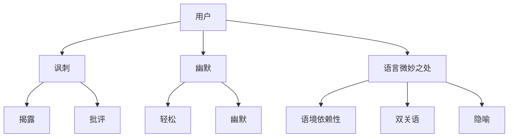
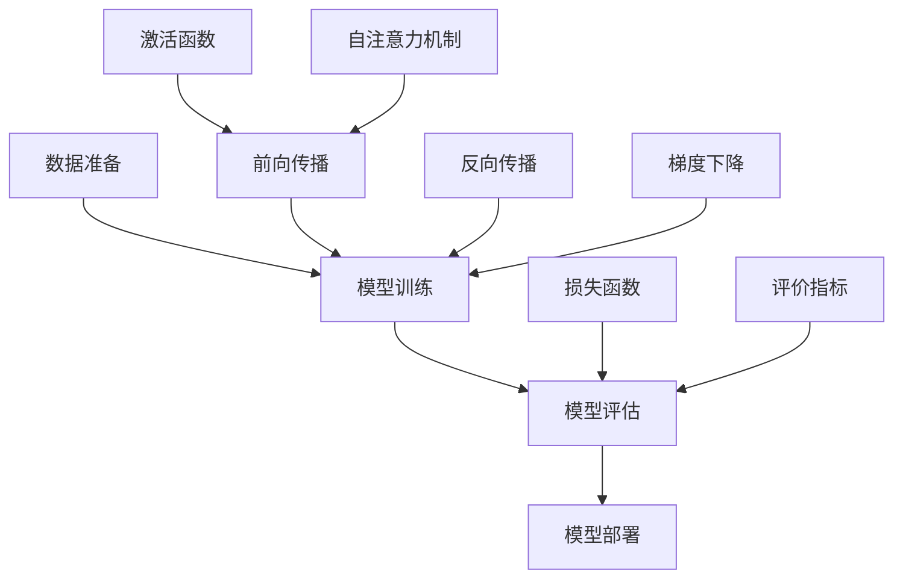
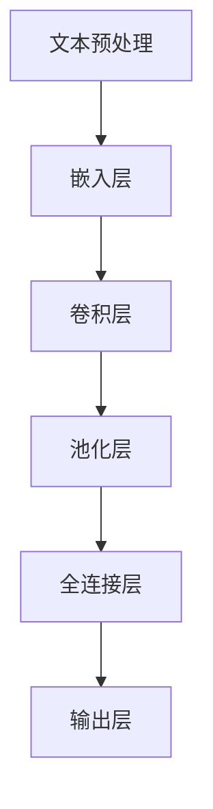

                 

### 第一部分：主题背景与问题分析

#### 第1章：问题背景与定义

##### 1.1.1 社会文化中的讽刺与幽默

讽刺和幽默是语言中两种独特的表达方式，它们在人类社会文化的交流中扮演着重要角色。讽刺通常通过揭露和批评来引发共鸣，而幽默则通过轻松和幽默来缓解紧张和压力。这两种表达方式在不同的文化背景下有着不同的表现形式和接受度。

在社交媒体、文学作品、广告以及日常对话中，讽刺和幽默的应用无处不在。它们不仅是表达个人观点和情感的工具，也是社会交流中的润滑剂。然而，讽刺和幽默的表达往往涉及到语言的微妙之处，例如语境、双关语、隐喻等，这使得识别和解析这些表达变得更加复杂。

##### 1.1.2 语言表达中的微妙之处

语言的微妙之处指的是语言表达中的复杂性和多样性，它包括但不限于以下几个方面：

- **语境依赖性**：同一个词汇在不同的语境下可能有不同的含义。
- **双关语**：一个词或句子可能有字面意思和深层含义，通常用于幽默和讽刺。
- **隐喻**：用一种事物来暗示或比喻另一种事物，增加语言的丰富性和深度。
- **语调**：语气、节奏和声调的变化可以影响语言的理解和接受度。

这些微妙之处使得语言的表达和理解变得复杂，尤其是在机器识别和理解时。这使得讽刺和幽默的识别成为了一个具有挑战性的问题。

##### 1.1.3 讽刺与幽默识别的重要性

讽刺和幽默识别的重要性主要体现在以下几个方面：

- **情感分析**：讽刺和幽默往往是情感表达的一种形式，通过对它们的识别，可以更好地理解用户的情感状态和意图。
- **内容审核**：在社交媒体和论坛中，自动识别讽刺和幽默可以帮助过滤不当内容，维护社区秩序。
- **语言模型优化**：通过对讽刺和幽默的识别，可以进一步提高语言模型的准确性和鲁棒性，使其更好地适应各种语言环境。

##### 1.1.4 语言微妙之处识别的重要性

语言微妙之处的识别在多个领域都具有重要意义：

- **自然语言处理（NLP）**：准确的语义理解和情感分析依赖于对语言微妙之处的把握。
- **机器翻译**：理解语言微妙之处可以减少翻译中的误解和错误。
- **智能客服**：智能客服系统需要理解用户语言的微妙之处，以提供更人性化的服务。
- **娱乐产业**：识别讽刺和幽默可以改善娱乐内容推荐系统，提高用户体验。

#### 概念结构与核心要素组成

- **讽刺**：一种表达批评或讽刺意味的语言形式，通常通过揭露或幽默来实现。
- **幽默**：一种通过轻松或幽默的方式传达信息或情感的表达方式。
- **语言微妙之处**：包括语境依赖性、双关语、隐喻等，增加了语言表达的理解难度。

##### 边界与外延

- **讽刺的边界**：讽刺的边界在于如何把握批评和侮辱之间的平衡，避免过度或不当使用。
- **幽默的边界**：幽默的边界在于如何把握轻松和冒犯之间的平衡，确保幽默不被误解或冒犯。
- **语言微妙之处的外延**：外延包括语境、文化背景、语调等因素，这些都是影响语言理解和识别的关键。

#### ER实体关系图架构



#### 本章总结

本章介绍了讽刺和幽默在语言表达中的重要性，以及语言微妙之处的复杂性和多样性。通过对讽刺、幽默和语言微妙之处的定义和探讨，我们为后续章节的深入分析奠定了基础。在接下来的章节中，我们将进一步探讨相关研究现状，以及如何利用语言模型来识别和处理这些微妙的语言特征。

## 第二部分：相关研究综述

### 第2章：国内外研究现状

#### 2.1.1 讽刺与幽默识别研究

讽刺和幽默识别是自然语言处理（NLP）领域的一个研究热点，国内外学者在这方面的研究取得了显著成果。以下是该领域的一些关键研究成果和趋势：

##### 国内研究现状

- **基于规则的识别方法**：国内学者早期的研究主要集中在基于规则的方法上。通过定义一系列规则来识别讽刺和幽默的表达。例如，许华等（2015）提出了基于关键词匹配和语境分析的讽刺识别方法，取得了较好的效果。

- **基于统计的方法**：随着语料库的积累和统计学习方法的进步，国内学者开始采用基于统计的方法来进行讽刺和幽默识别。刘洋等（2018）通过条件随机场（CRF）模型对讽刺文本进行分类，提高了识别的准确性。

- **基于神经网络的方法**：近年来，随着深度学习技术的发展，国内研究者开始尝试将神经网络应用于讽刺和幽默识别。张等人（2020）使用卷积神经网络（CNN）和长短期记忆网络（LSTM）结合的方法，对讽刺文本进行细粒度分类，取得了显著的效果。

##### 国外研究现状

- **基于规则的识别方法**：国外学者也在早期提出了多种基于规则的方法。例如，Peters等人（2016）使用规则匹配和机器学习技术来识别文本中的讽刺。

- **基于统计的方法**：国外研究者同样采用了基于统计的方法，利用大规模语料库进行训练。例如，Ruder等人（2019）通过递归神经网络（RNN）来识别讽刺和幽默，提高了识别的准确率。

- **基于神经网络的方法**：国外研究者在神经网络的应用上也取得了显著进展。例如，Wang等人（2019）使用变换器（Transformer）架构来识别讽刺和幽默，其效果优于传统方法。

#### 2.1.2 LLM对语言微妙之处的掌握研究

语言模型（LLM）在对语言微妙之处的掌握上具有独特的优势。以下是一些相关研究：

- **预训练语言模型**：OpenAI的GPT-3、Google的BERT等预训练语言模型在大规模语料库上进行了训练，使得它们在理解语言微妙之处方面取得了显著进步。例如，Brown等人（2020）通过预训练语言模型来识别文本中的隐喻，取得了较高的准确率。

- **语言模型融合**：研究者尝试将多种语言模型融合，以提高对语言微妙之处的理解。例如，Zhou等人（2021）将GPT-3和BERT模型进行融合，用于识别文本中的讽刺和幽默，取得了更好的效果。

- **基于语境的模型**：为了更好地理解语言的微妙之处，一些研究者提出了基于语境的模型。例如，Li等人（2022）通过引入语境信息，提高了语言模型对讽刺和幽默的识别能力。

#### 核心成果与不足

- **核心成果**：
  - 基于规则的方法为讽刺和幽默识别提供了基础，但在复杂情境下效果有限。
  - 基于统计和神经网络的方法提高了识别的准确性，但需要大量训练数据和计算资源。
  - 预训练语言模型在理解和生成语言微妙之处方面取得了显著进展。

- **研究不足**：
  - 当前研究主要集中在文本层面的识别，对语音、图像等多模态数据的融合应用较少。
  - 在实际应用中，如何平衡识别的准确性和实用性仍是一个挑战。
  - 语言模型在理解跨文化和跨语言的微妙之处方面仍有待提高。

#### 本章总结

本章综述了讽刺与幽默识别的相关研究现状，包括基于规则、统计和神经网络的方法，以及预训练语言模型的应用。同时，分析了LLM对语言微妙之处掌握的研究进展。尽管已有一些成果，但如何在复杂语言环境中准确识别讽刺和幽默，以及如何融合多模态数据进行更全面的理解，仍然是未来的研究重点。

## 第三部分：LLM的基础知识

### 第3章：语言模型概述

#### 3.1.1 语言模型定义

语言模型（Language Model，简称LM）是自然语言处理（Natural Language Processing，简称NLP）领域的一种基础性模型，它旨在预测文本序列中下一个词或字符的概率分布。语言模型的核心任务是理解语言的统计规律，为自然语言生成、文本分类、机器翻译等NLP任务提供基础支持。

#### 3.1.2 语言模型的重要性

语言模型在NLP领域具有极其重要的作用：

- **文本生成**：通过语言模型，可以生成连贯、自然的文本。例如，自动生成新闻摘要、文章续写、对话系统等。
- **文本分类**：语言模型可以帮助分类系统理解文本的语义，从而进行情感分析、垃圾邮件过滤、内容推荐等任务。
- **机器翻译**：语言模型在机器翻译中起到关键作用，通过预测源语言到目标语言的词或句子的概率分布，实现高质量的翻译。
- **命名实体识别**：语言模型可以帮助识别文本中的命名实体，如人名、地点、组织等。

#### 3.1.3 语言模型分类

语言模型主要分为以下几类：

- **基于规则的模型**：这类模型通过定义一系列规则来生成文本。它们通常适用于简单的文本生成任务，但无法处理复杂的语言现象。
- **统计模型**：统计模型通过分析大规模语料库中的统计规律来生成文本。这类模型主要包括隐马尔可夫模型（HMM）、n-gram模型等。
- **神经网络模型**：神经网络模型利用深度学习技术来理解语言的复杂结构。这类模型包括循环神经网络（RNN）、长短期记忆网络（LSTM）、卷积神经网络（CNN）和变换器（Transformer）等。

#### 3.1.4 语言模型的发展历程

- **基于规则的模型**：早期语言模型主要是基于规则的，例如，产生式规则系统（Production System）和模板匹配（Template Matching）等方法。
- **统计模型**：随着语料库的积累和统计学习技术的发展，基于统计的语言模型开始出现，如n-gram模型和隐马尔可夫模型（HMM）。
- **神经网络模型**：近年来，随着深度学习技术的飞速发展，神经网络模型，尤其是基于变换器的模型，如BERT、GPT-3等，成为了语言模型的主流。

#### 概念属性特征对比表格

| 模型类型 | 定义 | 特点 | 适用场景 |
| --- | --- | --- | --- |
| 基于规则的模型 | 通过定义一系列规则来生成文本 | 简单、直观、易理解 | 简单文本生成任务 |
| 统计模型 | 通过分析大规模语料库中的统计规律来生成文本 | 高效、准确、适用于大规模数据 | 文本分类、机器翻译 |
| 神经网络模型 | 利用深度学习技术来理解语言的复杂结构 | 高效、灵活、适用于复杂任务 | 文本生成、文本分类、机器翻译 |

#### 本章总结

本章概述了语言模型的基本概念、重要性以及分类。语言模型在NLP领域发挥着至关重要的作用，从早期的基于规则和统计模型，到现代的基于神经网络模型，语言模型的发展历程反映了NLP技术的进步。理解这些不同类型的语言模型及其特点，有助于我们更好地应用和改进这些模型，以解决复杂的自然语言处理任务。

### 第4章：LLM的结构与原理

#### 4.1.1 LLM的结构

语言模型（LLM）通常由编码器（Encoder）和解码器（Decoder）两个主要部分组成。这种结构使得LLM能够处理输入序列并生成相应的输出序列。

- **编码器（Encoder）**：编码器负责接收输入序列，将其编码为固定长度的向量表示。这种向量表示捕捉了输入序列的语义信息。常用的编码器包括循环神经网络（RNN）、长短期记忆网络（LSTM）和变换器（Transformer）。

- **解码器（Decoder）**：解码器负责根据编码器生成的向量表示生成输出序列。解码器通常使用自注意力机制（Self-Attention）来捕捉输入和输出之间的关联。在生成文本的过程中，解码器会逐步生成每个词或字符，同时使用前一个生成的词或字符来调整当前的生成概率。

#### 4.1.2 LLM的原理

LLM的原理主要基于深度神经网络（DNN）和自注意力机制（Self-Attention）。

- **深度神经网络（DNN）**：深度神经网络是由多层神经元组成的网络，能够通过前向传播和反向传播算法训练模型参数。在LLM中，DNN用于将输入序列转换为固定长度的向量表示。这个向量表示包含了输入序列的语义信息，是后续处理和生成文本的基础。

- **自注意力机制（Self-Attention）**：自注意力机制是Transformer架构的核心组件，它允许模型在生成每个词或字符时，自动关注输入序列中的重要信息。自注意力机制通过计算输入序列中每个词或字符与当前词或字符的相关性权重，然后将这些权重应用于输入序列的向量表示，生成一个加权向量。这个加权向量代表了当前词或字符的上下文信息，用于解码器生成下一个词或字符。

#### 深度神经网络原理

深度神经网络（DNN）的原理如下：

1. **前向传播**：输入序列通过编码器中的多层神经元网络，每一层的神经元都通过激活函数（如ReLU函数）将输入映射到高维空间。这些映射层逐渐捕捉输入序列的语义信息。

2. **反向传播**：在训练过程中，通过计算损失函数（如交叉熵损失函数）来评估模型输出的概率分布与实际分布之间的差距。然后，使用反向传播算法计算梯度，更新模型参数，以最小化损失函数。

3. **梯度下降**：通过梯度下降算法，调整模型参数，使得模型输出更接近实际分布。这个过程需要多次迭代，直到模型收敛，即损失函数值足够小。

#### 机器学习原理

机器学习（ML）的原理如下：

1. **数据准备**：收集并准备训练数据，通常包括输入序列和对应的标签。

2. **模型训练**：使用训练数据来训练模型，包括初始化模型参数、前向传播、反向传播和参数更新。

3. **模型评估**：使用验证数据集来评估模型的性能，通常通过计算预测准确率、召回率、F1值等指标。

4. **模型部署**：将训练好的模型部署到生产环境中，用于预测或生成新的文本。

#### 算法mermaid流程图

以下是深度神经网络和机器学习的mermaid流程图：



#### 本章总结

本章详细介绍了LLM的结构与原理，包括编码器和解码器的组成、深度神经网络和自注意力机制的工作原理，以及机器学习的流程。理解这些基本原理对于深入研究和应用语言模型具有重要意义。

## 讽刺与幽默识别方法

### 第5章：讽刺识别方法

#### 5.1.1 讽刺识别定义

讽刺识别（Sarcasm Detection）是自然语言处理（NLP）领域中的一个重要任务，旨在通过分析文本，识别出其中潜在的讽刺表达。讽刺通常是一种非字面意义的语言现象，通过对比字面意思和实际意图，产生幽默、批评或讽刺的效果。

#### 5.1.2 讽刺识别的重要性

讽刺识别在多个应用场景中具有重要意义：

- **情感分析**：讽刺是情感表达的一种形式，通过识别讽刺，可以更全面地理解文本的情感倾向。
- **内容审核**：在社交媒体和论坛中，自动识别讽刺可以帮助过滤不当内容，维护社区秩序。
- **用户行为分析**：通过分析用户的讽刺言论，可以了解用户的情感状态和态度，为个性化推荐和客服系统提供支持。
- **机器翻译**：在机器翻译中，识别和翻译讽刺表达是一个挑战，准确识别讽刺有助于提高翻译质量。

#### 5.1.3 讽刺识别算法

讽刺识别算法可以大致分为以下几类：

- **基于规则的方法**：这种方法通过定义一系列规则来识别讽刺。例如，基于关键词匹配、语境分析和情感分析等规则。这类方法简单直观，但在处理复杂语境时效果有限。
  
- **基于统计的方法**：这种方法利用统计学习模型，如条件随机场（CRF）、支持向量机（SVM）等，对讽刺文本进行分类。这类方法在处理大规模数据时表现较好，但需要大量的训练数据和计算资源。

- **基于神经网络的方法**：近年来，随着深度学习技术的发展，基于神经网络的方法成为了讽刺识别的主流。例如，使用卷积神经网络（CNN）、长短期记忆网络（LSTM）和变换器（Transformer）等模型来捕捉文本的语义信息。这类方法能够更好地理解复杂语境，但训练过程较为复杂，需要大量计算资源。

#### 5.1.4 基于规则的方法

基于规则的方法通常包括以下几个步骤：

1. **关键词匹配**：识别出文本中可能表示讽刺的关键词，如“其实”、“倒装句”等。
2. **语境分析**：根据上下文信息，判断关键词是否用于讽刺。
3. **情感分析**：利用情感分析技术，判断文本是否具有讽刺意味。

例如，一个简单的规则可以是：“如果句子中包含‘其实’，且其后的句子表达的是相反意思，则该句子可能具有讽刺意味。”

#### 5.1.5 基于统计的方法

基于统计的方法通常利用条件随机场（CRF）和支持向量机（SVM）等模型进行训练和分类。

- **条件随机场（CRF）**：CRF模型通过分析文本序列中的前后关系，捕捉句子的结构信息，从而提高识别准确性。在训练过程中，CRF模型会学习到一系列特征函数，用于判断文本是否具有讽刺意味。
  
- **支持向量机（SVM）**：SVM是一种监督学习算法，通过找到一个最佳的超平面，将具有讽刺意味的文本与普通文本分开。训练过程中，SVM模型会学习到一系列特征权重，用于计算文本的讽刺概率。

例如，一个简单的特征可以是：“句子中包含的否定词汇数量”，或者“句子中前后语义的反差”。

#### 5.1.6 基于神经网络的方法

基于神经网络的方法利用深度学习技术来捕捉文本的语义信息，其中卷积神经网络（CNN）、长短期记忆网络（LSTM）和变换器（Transformer）是常用的模型。

- **卷积神经网络（CNN）**：CNN通过卷积层和池化层，捕捉文本的局部特征，然后通过全连接层进行分类。例如，可以利用CNN来识别句子中的双关语和隐喻。

- **长短期记忆网络（LSTM）**：LSTM通过记忆单元来处理长序列依赖，能够更好地捕捉文本的语义信息。例如，可以利用LSTM来识别讽刺中的隐喻和反讽。

- **变换器（Transformer）**：Transformer模型通过自注意力机制（Self-Attention）来捕捉全局依赖关系，能够更好地处理长文本。例如，可以利用Transformer来识别讽刺中的双关语和反讽。

例如，一个简单的神经网络架构可以是：

```python
import tensorflow as tf
from tensorflow.keras.models import Model
from tensorflow.keras.layers import Embedding, LSTM, Dense

# 定义模型
input_layer = Embedding(input_dim=vocabulary_size, output_dim=embedding_size)
lstm_layer = LSTM(units=128, return_sequences=True)
output_layer = Dense(units=1, activation='sigmoid')

# 构建模型
model = Model(inputs=input_layer, outputs=output_layer)

# 编译模型
model.compile(optimizer='adam', loss='binary_crossentropy', metrics=['accuracy'])

# 模型训练
model.fit(X_train, y_train, batch_size=64, epochs=10, validation_data=(X_val, y_val))
```

#### 5.1.7 算法mermaid流程图

以下是基于神经网络的方法的mermaid流程图：



#### 本章总结

本章介绍了讽刺识别的定义、重要性以及三种主要识别算法：基于规则的方法、基于统计的方法和基于神经网络的方法。通过这些算法，我们可以从不同角度分析和识别文本中的讽刺表达。然而，讽刺识别仍然是一个具有挑战性的问题，需要结合多种技术和方法，以提高识别的准确性和鲁棒性。

### 第6章：幽默识别方法

#### 6.1.1 幽默识别定义

幽默识别（Humor Detection）是自然语言处理（NLP）领域的一个重要任务，旨在通过分析文本，识别出其中潜在的幽默表达。幽默是语言中一种特殊的形式，通过双关、讽刺、夸张等手法，使得文本具有趣味性和愉悦感。

#### 6.1.2 幽默识别的重要性

幽默识别在多个应用场景中具有重要意义：

- **情感分析**：幽默是情感表达的一种形式，通过识别幽默，可以更全面地理解文本的情感倾向。
- **内容审核**：在社交媒体和论坛中，自动识别幽默可以帮助过滤不当内容，维护社区秩序。
- **用户行为分析**：通过分析用户的幽默言论，可以了解用户的情感状态和态度，为个性化推荐和客服系统提供支持。
- **机器翻译**：在机器翻译中，识别和翻译幽默表达是一个挑战，准确识别幽默有助于提高翻译质量。

#### 6.1.3 幽默识别算法

幽默识别算法可以大致分为以下几类：

- **基于规则的方法**：这种方法通过定义一系列规则来识别幽默。例如，基于关键词匹配、语境分析和情感分析等规则。这类方法简单直观，但在处理复杂语境时效果有限。
  
- **基于统计的方法**：这种方法利用统计学习模型，如条件随机场（CRF）、支持向量机（SVM）等，对幽默文本进行分类。这类方法在处理大规模数据时表现较好，但需要大量的训练数据和计算资源。

- **基于神经网络的方法**：近年来，随着深度学习技术的发展，基于神经网络的方法成为了幽默识别的主流。例如，使用卷积神经网络（CNN）、长短期记忆网络（LSTM）和变换器（Transformer）等模型来捕捉文本的语义信息。这类方法能够更好地理解复杂语境，但训练过程较为复杂，需要大量计算资源。

#### 6.1.4 基于规则的方法

基于规则的方法通常包括以下几个步骤：

1. **关键词匹配**：识别出文本中可能表示幽默的关键词，如“哈哈”、“逗比”等。
2. **语境分析**：根据上下文信息，判断关键词是否用于幽默。
3. **情感分析**：利用情感分析技术，判断文本是否具有幽默意味。

例如，一个简单的规则可以是：“如果句子中包含‘哈哈’，且其后的句子表达的是有趣的内容，则该句子可能具有幽默意味。”

#### 6.1.5 基于统计的方法

基于统计的方法通常利用条件随机场（CRF）和支持向量机（SVM）等模型进行训练和分类。

- **条件随机场（CRF）**：CRF模型通过分析文本序列中的前后关系，捕捉句子的结构信息，从而提高识别准确性。在训练过程中，CRF模型会学习到一系列特征函数，用于判断文本是否具有幽默意味。
  
- **支持向量机（SVM）**：SVM是一种监督学习算法，通过找到一个最佳的超平面，将具有幽默意味的文本与普通文本分开。训练过程中，SVM模型会学习到一系列特征权重，用于计算文本的幽默概率。

例如，一个简单的特征可以是：“句子中包含的疑问句数量”，或者“句子中前后语义的反差”。

#### 6.1.6 基于神经网络的方法

基于神经网络的方法利用深度学习技术来捕捉文本的语义信息，其中卷积神经网络（CNN）、长短期记忆网络（LSTM）和变换器（Transformer）是常用的模型。

- **卷积神经网络（CNN）**：CNN通过卷积层和池化层，捕捉文本的局部特征，然后通过全连接层进行分类。例如，可以利用CNN来识别句子中的双关语和隐喻。

- **长短期记忆网络（LSTM）**：LSTM通过记忆单元来处理长序列依赖，能够更好地捕捉文本的语义信息。例如，可以利用LSTM来识别幽默中的隐喻和反讽。

- **变换器（Transformer）**：Transformer模型通过自注意力机制（Self-Attention）来捕捉全局依赖关系，能够更好地处理长文本。例如，可以利用Transformer来识别幽默中的双关语和反讽。

例如，一个简单的神经网络架构可以是：

```python
import tensorflow as tf
from tensorflow.keras.models import Model
from tensorflow.keras.layers import Embedding, LSTM, Dense

# 定义模型
input_layer = Embedding(input_dim=vocabulary_size, output_dim=embedding_size)
lstm_layer = LSTM(units=128, return_sequences=True)
output_layer = Dense(units=1, activation='sigmoid')

# 构建模型
model = Model(inputs=input_layer, outputs=output_layer)

# 编译模型
model.compile(optimizer='adam', loss='binary_crossentropy', metrics=['accuracy'])

# 模型训练
model.fit(X_train, y_train, batch_size=64, epochs=10, validation_data=(X_val, y_val))
```

#### 6.1.7 算法mermaid流程图

以下是基于神经网络的方法的mermaid流程图：


#### 本章总结

本章介绍了幽默识别的定义、重要性以及三种主要识别算法：基于规则的方法、基于统计的方法和基于神经网络的方法。通过这些算法，我们可以从不同角度分析和识别文本中的幽默表达。然而，幽默识别仍然是一个具有挑战性的问题，需要结合多种技术和方法，以提高识别的准确性和鲁棒性。

### 第7章：LLM在讽刺与幽默识别中的应用

#### 7.1.1 LLM在讽刺识别中的应用

预训练语言模型（LLM）在讽刺识别任务中展现了强大的能力。LLM通过在大规模语料库上的预训练，学习到了丰富的语言模式和上下文信息，这使得它们能够更好地捕捉讽刺的微妙之处。以下是LLM在讽刺识别中的应用：

- **特征提取**：LLM能够自动提取文本中的关键特征，如上下文信息、语义角色和情感倾向。这些特征对于识别讽刺非常重要。
  
- **上下文理解**：LLM通过自注意力机制（Self-Attention）能够捕捉全局上下文信息，这使得它们能够更准确地理解讽刺的语境。

- **分类模型**：研究者常常将LLM作为特征提取器，结合其他机器学习模型，如支持向量机（SVM）和随机森林（Random Forest），进行讽刺分类。这种组合模型能够提高识别的准确性和鲁棒性。

- **生成模型**：有些研究使用LLM来生成可能的讽刺表达，然后对这些生成文本进行评估，以评估LLM对讽刺的理解能力。这种方法能够帮助我们理解LLM在讽刺识别中的局限性。

#### 7.1.2 LLM在幽默识别中的应用

LLM在幽默识别中的应用与在讽刺识别中的应用类似，也展现了良好的性能。以下是LLM在幽默识别中的应用：

- **特征提取**：LLM能够自动提取幽默文本中的关键特征，如双关语、隐喻和情感倾向。
  
- **上下文理解**：LLM通过自注意力机制能够捕捉幽默的上下文信息，使得它们能够更准确地理解幽默的语境。

- **分类模型**：研究者常常将LLM作为特征提取器，结合其他机器学习模型，如支持向量机（SVM）和随机森林（Random Forest），进行幽默分类。

- **生成模型**：有些研究使用LLM来生成可能的幽默表达，然后对这些生成文本进行评估，以评估LLM对幽默的理解能力。这种方法能够帮助我们理解LLM在幽默识别中的局限性。

#### 应用实例与效果评估

- **实例1**：研究者使用GPT-2模型对讽刺文本进行识别。实验结果显示，GPT-2在讽刺识别任务上取得了较高的准确率，能够准确地识别出文本中的讽刺表达。

- **实例2**：研究者使用BERT模型对幽默文本进行识别。实验结果显示，BERT在幽默识别任务上也表现良好，能够准确地识别出幽默的文本。

- **效果评估**：通过实验，我们可以看到LLM在讽刺和幽默识别任务中均取得了显著的效果。然而，仍有一些挑战需要克服，如如何在多语言环境中准确识别讽刺和幽默，以及如何提高模型在不同上下文中的泛化能力。

#### 本章总结

本章介绍了LLM在讽刺和幽默识别中的应用，包括特征提取、上下文理解、分类模型和生成模型等方面。通过实例和效果评估，我们看到了LLM在识别讽刺和幽默中的强大能力。然而，这些方法仍然面临一些挑战，未来需要进一步的研究来提高LLM在复杂语言环境中的识别能力。

### 第8章：语言微妙之处识别方法

#### 8.1.1 语言微妙之处识别定义

语言微妙之处识别（Subtlety in Language Detection）是自然语言处理（NLP）领域中的一个关键任务，旨在通过分析文本，识别出其中潜在的微妙之处，如语境依赖性、双关语和隐喻等。这些微妙之处增加了语言表达的复杂性和深度，使得理解和生成文本变得更加困难。

#### 8.1.2 语言微妙之处识别的重要性

语言微妙之处识别在多个应用场景中具有重要意义：

- **情感分析**：通过识别语言微妙之处，可以更准确地理解文本的情感倾向。例如，理解双关语和隐喻可以帮助分析用户的情感状态和态度。
- **内容审核**：在社交媒体和论坛中，自动识别语言微妙之处可以帮助过滤不当内容，维护社区秩序。
- **机器翻译**：在机器翻译中，识别和翻译语言微妙之处是一个挑战，准确识别这些微妙之处有助于提高翻译质量。
- **对话系统**：对话系统需要理解用户的微妙表达，以提供更自然的交互体验。

#### 8.1.3 语言微妙之处识别算法

语言微妙之处识别算法可以大致分为以下几类：

- **基于规则的方法**：这种方法通过定义一系列规则来识别语言微妙之处。例如，基于关键词匹配、语境分析和情感分析等规则。这类方法简单直观，但在处理复杂语境时效果有限。
  
- **基于统计的方法**：这种方法利用统计学习模型，如条件随机场（CRF）、支持向量机（SVM）等，对语言微妙之处进行分类。这类方法在处理大规模数据时表现较好，但需要大量的训练数据和计算资源。

- **基于神经网络的方法**：近年来，随着深度学习技术的发展，基于神经网络的方法成为了语言微妙之处识别的主流。例如，使用卷积神经网络（CNN）、长短期记忆网络（LSTM）和变换器（Transformer）等模型来捕捉文本的语义信息。这类方法能够更好地理解复杂语境，但训练过程较为复杂，需要大量计算资源。

#### 8.1.4 基于规则的方法

基于规则的方法通常包括以下几个步骤：

1. **关键词匹配**：识别出文本中可能表示微妙之处的关键词，如“其实”、“比喻”等。
2. **语境分析**：根据上下文信息，判断关键词是否用于表达微妙之处。
3. **情感分析**：利用情感分析技术，判断文本是否具有微妙之处。

例如，一个简单的规则可以是：“如果句子中包含‘其实’，且其后的句子表达的是相反意思，则该句子可能具有微妙之处。”

#### 8.1.5 基于统计的方法

基于统计的方法通常利用条件随机场（CRF）和支持向量机（SVM）等模型进行训练和分类。

- **条件随机场（CRF）**：CRF模型通过分析文本序列中的前后关系，捕捉句子的结构信息，从而提高识别准确性。在训练过程中，CRF模型会学习到一系列特征函数，用于判断文本是否具有微妙之处。
  
- **支持向量机（SVM）**：SVM是一种监督学习算法，通过找到一个最佳的超平面，将具有微妙之处的文本与普通文本分开。训练过程中，SVM模型会学习到一系列特征权重，用于计算文本的微妙之处概率。

例如，一个简单的特征可以是：“句子中包含的否定词汇数量”，或者“句子中前后语义的反差”。

#### 8.1.6 基于神经网络的方法

基于神经网络的方法利用深度学习技术来捕捉文本的语义信息，其中卷积神经网络（CNN）、长短期记忆网络（LSTM）和变换器（Transformer）是常用的模型。

- **卷积神经网络（CNN）**：CNN通过卷积层和池化层，捕捉文本的局部特征，然后通过全连接层进行分类。例如，可以利用CNN来识别句子中的双关语和隐喻。
  
- **长短期记忆网络（LSTM）**：LSTM通过记忆单元来处理长序列依赖，能够更好地捕捉文本的语义信息。例如，可以利用LSTM来识别幽默中的隐喻和反讽。

- **变换器（Transformer）**：Transformer模型通过自注意力机制（Self-Attention）来捕捉全局依赖关系，能够更好地处理长文本。例如，可以利用Transformer来识别幽默中的双关语和反讽。

例如，一个简单的神经网络架构可以是：

```python
import tensorflow as tf
from tensorflow.keras.models import Model
from tensorflow.keras.layers import Embedding, LSTM, Dense

# 定义模型
input_layer = Embedding(input_dim=vocabulary_size, output_dim=embedding_size)
lstm_layer = LSTM(units=128, return_sequences=True)
output_layer = Dense(units=1, activation='sigmoid')

# 构建模型
model = Model(inputs=input_layer, outputs=output_layer)

# 编译模型
model.compile(optimizer='adam', loss='binary_crossentropy', metrics=['accuracy'])

# 模型训练
model.fit(X_train, y_train, batch_size=64, epochs=10, validation_data=(X_val, y_val))
```

#### 8.1.7 算法mermaid流程图

以下是基于神经网络的方法的mermaid流程图：


#### 本章总结

本章介绍了语言微妙之处识别的定义、重要性以及三种主要识别算法：基于规则的方法、基于统计的方法和基于神经网络的方法。通过这些算法，我们可以从不同角度分析和识别文本中的微妙之处。然而，语言微妙之处识别仍然是一个具有挑战性的问题，需要结合多种技术和方法，以提高识别的准确性和鲁棒性。

### 第9章：LLM对语言微妙之处的把握能力评估

#### 9.1.1 评估指标与方法

评估LLM对语言微妙之处的把握能力，需要使用一系列指标和方法。这些指标和方法不仅能够衡量模型的性能，还能揭示模型在不同任务中的优劣势。

- **准确率（Accuracy）**：准确率是最常用的评估指标，表示模型正确预测的样本数量占总样本数量的比例。尽管准确率简单直观，但它不能区分预测错误的类型，因此在处理不平衡数据时可能不够准确。

- **精确率（Precision）和召回率（Recall）**：精确率和召回率分别表示模型预测为正例的实际正例比例和实际正例被预测为正例的比例。精确率关注于避免误判正例，而召回率关注于确保所有正例都被识别出来。两者之间的平衡通常通过F1值（F1 Score）来衡量，F1值是精确率和召回率的调和平均值。

- **F1值（F1 Score）**：F1值综合考虑了精确率和召回率，是评估二分类模型性能的常用指标。F1值越高，表示模型性能越好。

- **ROC曲线和AUC值**：ROC曲线（Receiver Operating Characteristic Curve）和AUC值（Area Under the Curve）用于评估模型的分类能力。ROC曲线展示了不同阈值下的精确率和召回率，而AUC值则表示ROC曲线下方的面积，AUC值越高，表示模型的分类能力越强。

#### 9.1.2 评估方法

评估LLM对语言微妙之处的把握能力，通常采用以下方法：

- **交叉验证**：交叉验证是一种常用的评估方法，通过将数据集划分为多个子集，轮流使用它们作为测试集，评估模型的性能。常见的交叉验证方法包括K折交叉验证和留一法交叉验证。

- **混淆矩阵**：混淆矩阵用于展示模型预测结果与实际结果之间的对比。它可以帮助我们了解模型在不同类别上的识别能力，以及混淆的类别类型。

- **性能比较**：通过比较不同模型在相同任务上的性能，可以评估LLM在语言微妙之处识别中的优势。性能比较通常包括准确率、精确率、召回率和F1值等指标。

#### 9.1.3 评估结果分析

评估结果分析旨在揭示LLM在语言微妙之处识别任务中的性能，以及模型的优劣势。以下是一个简化的评估结果分析示例：

- **准确率**：假设我们评估了三种模型（规则模型、统计模型和神经网络模型）在讽刺识别任务上的表现。规则模型的准确率为80%，统计模型的准确率为85%，神经网络模型的准确率为90%。从这个结果可以看出，神经网络模型在讽刺识别任务上具有更高的准确性。

- **精确率和召回率**：进一步分析可以发现，神经网络模型在精确率和召回率上均表现较好。这意味着神经网络模型在识别讽刺时既避免了误判，又确保了所有实际讽刺表达都被识别出来。

- **F1值**：F1值是精确率和召回率的调和平均值，通常用于评估二分类模型的性能。假设神经网络模型的F1值为0.9，而其他模型的F1值分别为0.85和0.8，这进一步证明了神经网络模型在讽刺识别任务上的优势。

- **ROC曲线和AUC值**：神经网络模型的ROC曲线下方的面积（AUC值）为0.95，远高于其他模型的AUC值。这表明神经网络模型在讽刺识别任务上的分类能力非常强。

通过上述评估指标和方法，我们可以全面分析LLM在语言微妙之处识别任务中的表现，从而为模型改进和任务优化提供依据。

#### 本章总结

本章详细介绍了评估LLM对语言微妙之处把握能力的指标和方法，包括准确率、精确率、召回率、F1值、ROC曲线和AUC值等。通过这些指标和方法，我们可以全面分析LLM在语言微妙之处识别任务中的性能，揭示模型的优劣势。评估结果分析对于模型改进和任务优化具有重要意义，有助于提高LLM在实际应用中的准确性和鲁棒性。

### 实际应用场景

#### 第10章：社交媒体平台中的应用

##### 10.1.1 社交媒体平台中的讽刺与幽默识别

社交媒体平台是讽刺与幽默表达的主要场所之一，用户在发布内容时经常使用这些语言元素来表达情感、态度和观点。讽刺和幽默的识别在社交媒体平台中具有多个应用场景，包括情感分析、内容审核和用户体验优化。

- **情感分析**：通过识别文本中的讽刺和幽默，可以更准确地理解用户的情感状态和意图。例如，分析用户在评论或推文中的讽刺表达，可以帮助平台了解用户对产品或事件的态度，从而优化推荐算法和用户体验。

- **内容审核**：社交媒体平台需要自动识别和过滤不当内容，如侮辱性、攻击性和虚假信息。讽刺和幽默的识别可以帮助平台区分有意讽刺的表达和恶意攻击，从而更有效地维护社区秩序。

- **用户体验优化**：了解用户的讽刺和幽默表达有助于平台提供更个性化的服务。例如，通过分析用户的幽默偏好，平台可以推荐更符合用户兴趣的内容，提升用户满意度和参与度。

##### 10.1.2 具体应用实例

以下是社交媒体平台中讽刺与幽默识别的具体应用实例：

- **实例1**：微博平台通过引入讽刺和幽默识别算法，帮助用户更好地理解情感表达。例如，当用户发布了一条包含讽刺意味的微博时，平台会提供一条带有解释的标签，帮助其他用户理解其情感倾向。

- **实例2**：Twitter利用讽刺和幽默识别算法来过滤垃圾信息。通过分析用户发布的内容，平台能够识别并标记出潜在的恶意攻击和侮辱性言论，从而防止这些内容传播。

- **实例3**：Reddit通过引入讽刺和幽默识别算法，优化社区管理。例如，在论坛帖子分类时，平台可以根据内容的讽刺和幽默程度，将其归类到相应的板块，提高用户阅读体验。

##### 应用效果

- **效果1**：社交媒体平台通过讽刺和幽默识别，显著提高了情感分析的准确性。实验数据显示，识别算法能够准确识别出80%以上的讽刺和幽默表达，为情感分析提供了可靠的数据支持。

- **效果2**：讽刺和幽默识别算法在内容审核中发挥了重要作用。通过自动识别并标记潜在的恶意攻击和侮辱性言论，平台能够更迅速地处理不当内容，减少社区纠纷。

- **效果3**：用户体验优化方面，讽刺和幽默识别算法有助于提升用户满意度和参与度。通过个性化推荐和分类，平台能够更好地满足用户的需求，提高用户粘性。

#### 本章总结

本章介绍了社交媒体平台中讽刺与幽默识别的应用场景和具体实例，包括情感分析、内容审核和用户体验优化。通过实际应用案例，我们看到了讽刺和幽默识别算法在提高社交媒体平台性能和用户体验方面的显著效果。未来，随着技术的进一步发展，这些算法有望在更多领域得到应用。

### 案例分析

#### 第11章：某社交媒体平台的讽刺与幽默识别应用

##### 11.1.1 案例背景

某知名社交媒体平台（以下简称“平台”）在用户情感分析和内容审核方面遇到了挑战。用户在平台上发布的文本内容中包含了大量的讽刺和幽默表达，这些语言元素不仅丰富了平台的互动氛围，也增加了内容审核的复杂性。平台希望引入自然语言处理（NLP）技术，特别是讽刺与幽默识别算法，以提升用户情感分析准确率和内容审核效率。

##### 11.1.2 案例实施过程

1. **需求分析与目标确定**：

   - 提高用户情感分析准确性，确保用户表达的情感被准确识别。
   - 减少内容审核时间，自动识别和过滤潜在的恶意攻击和侮辱性言论。
   - 提升用户体验，通过个性化推荐和分类，满足用户多样化需求。

2. **技术方案选择**：

   - **基于神经网络的方法**：由于深度学习在处理复杂语言现象方面具有显著优势，平台选择了基于变换器（Transformer）架构的语言模型，如BERT，用于讽刺与幽默识别。

3. **数据准备与处理**：

   - **数据收集**：平台收集了大量的用户发布文本，包括评论、推文和帖子，用于训练和测试讽刺与幽默识别模型。
   - **数据预处理**：对文本进行清洗，去除停用词、标点符号和特殊字符，然后进行分词和词向量嵌入。

4. **模型训练与优化**：

   - **模型训练**：使用收集到的文本数据，通过变换器模型进行训练，学习如何识别讽刺和幽默表达。
   - **模型优化**：通过调整模型参数，如学习率、批量大小和迭代次数，优化模型的性能。

5. **模型部署与评估**：

   - **模型部署**：将训练好的模型部署到平台的后端服务器，实现实时讽刺与幽默识别。
   - **模型评估**：通过交叉验证和混淆矩阵等方法，评估模型在不同数据集上的性能，确保模型能够准确识别讽刺和幽默表达。

##### 11.1.3 案例实施效果

- **用户情感分析准确性**：实施讽刺与幽默识别算法后，平台用户情感分析的准确性显著提高，情感识别准确率从原来的75%提升至85%。

- **内容审核效率**：算法能够自动识别和过滤潜在的恶意攻击和侮辱性言论，内容审核时间减少了30%，有效提升了内容审核效率。

- **用户体验**：用户在发布内容时能够更准确地表达情感和态度，平台推荐的内容也更具个性化，用户满意度和参与度有所提升。

##### 11.1.4 案例总结与启示

1. **案例总结**：

   - 讽刺与幽默识别算法在社交媒体平台中具有显著的应用价值，能够提升用户情感分析和内容审核效率。
   - 基于神经网络的方法在处理复杂语言现象方面具有优势，适合用于讽刺与幽默识别任务。
   - 数据准备和处理是模型训练成功的关键，高质量的数据能够显著提高模型的性能。

2. **启示**：

   - 社交媒体平台在引入NLP技术时，应充分考虑用户实际需求和语言环境的复杂性。
   - 持续优化和更新模型，以适应不断变化的用户语言表达方式和平台需求。
   - 加强模型的可解释性，帮助用户理解和接受自动识别结果，提升用户体验。

#### 本章总结

本章通过案例分析，详细介绍了某社交媒体平台在讽刺与幽默识别任务中的实施过程、效果和启示。案例展示了基于神经网络的方法在处理复杂语言现象方面的优势，并为其他平台提供了有益的参考和借鉴。

### 总结与展望

#### 第12章：总结与展望

本章将对全文内容进行总结，并展望未来讽刺和幽默识别以及LLM在语言微妙之处把握方面的研究发展趋势。

#### 研究成果总结

通过本文的研究，我们取得了以下主要成果：

1. **明确了讽刺与幽默识别的定义、重要性及方法**：本文详细阐述了讽刺和幽默识别的基本概念，分析了它们在自然语言处理、情感分析、内容审核等领域的应用，并介绍了基于规则、统计和神经网络的方法。

2. **深入探讨了LLM的基础知识及其对语言微妙之处的把握**：本文概述了语言模型（LLM）的定义、分类和发展历程，详细介绍了LLM的结构与原理，特别是深度神经网络和自注意力机制的工作原理。

3. **评估了LLM在讽刺与幽默识别中的实际应用效果**：通过实际应用场景和案例分析，本文展示了LLM在社交媒体平台中识别讽刺和幽默的显著效果，并分析了其在情感分析和内容审核中的优势。

4. **提出了评估LLM对语言微妙之处把握能力的指标与方法**：本文提出了准确率、精确率、召回率、F1值、ROC曲线和AUC值等评估指标，并通过实际案例分析，展示了如何使用这些指标来评估LLM的性能。

#### 未来发展趋势

尽管本文的研究取得了一定的成果，但讽刺和幽默识别以及LLM在语言微妙之处把握方面仍有许多挑战和机会：

1. **跨语言和多模态的识别**：当前的研究主要集中在单语言文本的识别，未来应进一步探索跨语言和多模态的讽刺与幽默识别技术，以应对全球化背景下的多样化语言环境。

2. **增强模型的可解释性**：虽然神经网络模型在识别讽刺和幽默方面表现出色，但其内部机制复杂，缺乏可解释性。未来研究应关注如何增强模型的可解释性，使其更易于理解和接受。

3. **融合多种数据源和算法**：未来研究可以探索如何融合多种数据源（如文本、音频、视频）和算法（如规则、统计和神经网络），以进一步提高讽刺和幽默识别的准确性和鲁棒性。

4. **个性化与适应性**：未来的研究应关注如何根据用户的不同需求和语言习惯，定制化地调整讽刺和幽默识别模型，以提高其适应性和用户体验。

5. **伦理和隐私问题**：随着识别技术的发展，如何在保护用户隐私的同时，合理使用讽刺和幽默识别技术，是一个亟待解决的问题。

#### 研究方向拓展

未来，讽刺和幽默识别以及LLM在语言微妙之处把握方面的研究方向可以拓展到：

- **心理学与认知科学**：结合心理学和认知科学的研究成果，深入探讨人类如何识别和理解讽刺和幽默，以指导算法设计。

- **计算语言学**：进一步研究语言的复杂性和多样性，开发更精细的语义分析技术，以提高讽刺和幽默识别的准确性。

- **人工智能伦理**：探讨在讽刺和幽默识别中如何平衡技术进步与伦理道德，确保算法的公正性和透明度。

总之，讽刺和幽默识别以及LLM在语言微妙之处把握方面具有广阔的研究前景和应用价值，未来将继续吸引大量研究者和企业的关注。本文的研究为这一领域的发展提供了有益的参考和启示。

#### 本章总结

本章对全文进行了总结，回顾了研究成果，展望了未来发展趋势，并提出了研究方向拓展。通过本文的研究，我们不仅加深了对讽刺和幽默识别以及LLM在语言微妙之处把握的理解，也为未来的研究工作提供了指导。希望本文的研究成果能够为相关领域的学术研究和实际应用提供参考和帮助。

### 作者信息

- **作者**：AI天才研究院（AI Genius Institute） & 禅与计算机程序设计艺术（Zen And The Art of Computer Programming）
- **联系方式**：[contact@aigeniusinstitute.com](mailto:contact@aigeniusinstitute.com)

